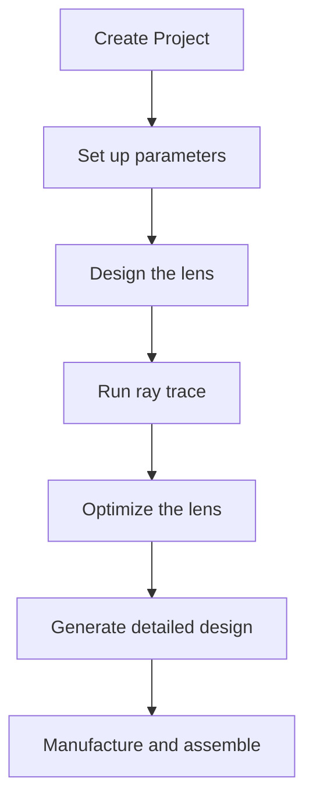
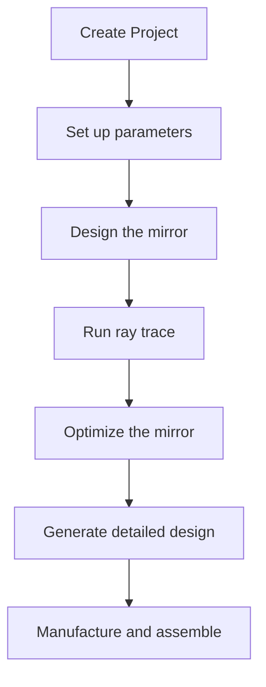
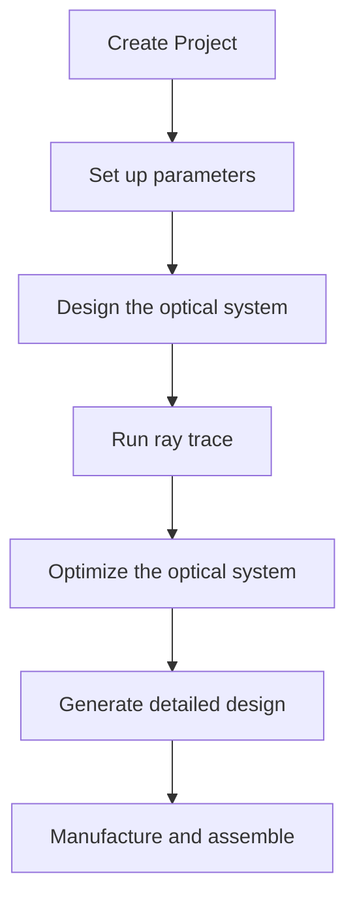
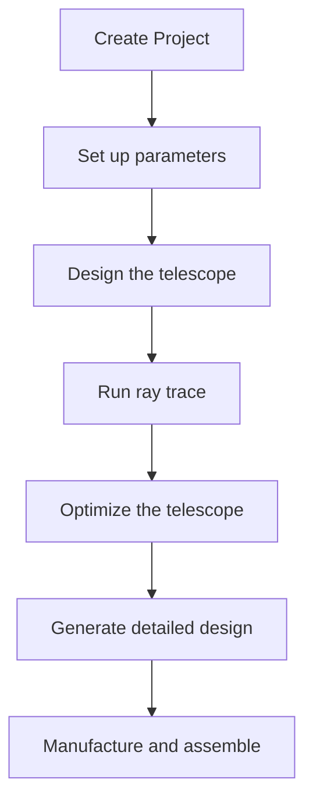
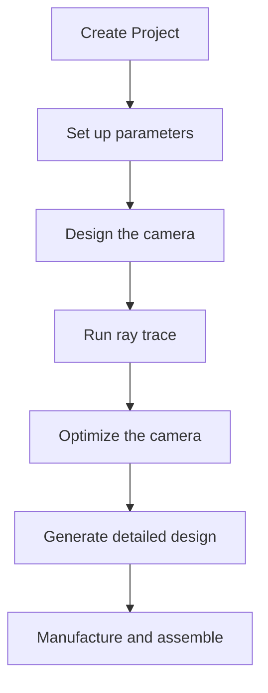
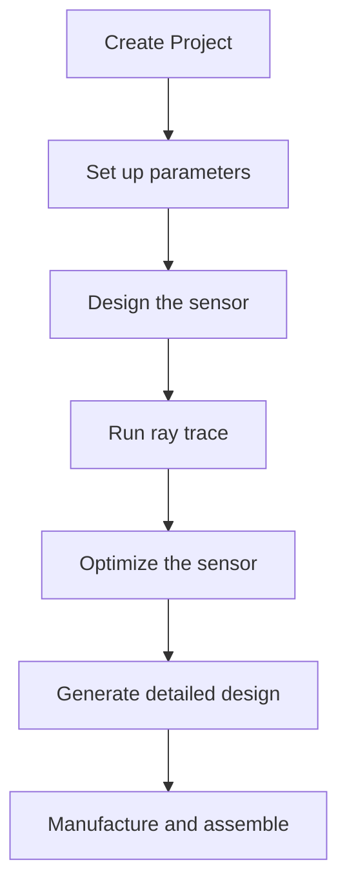
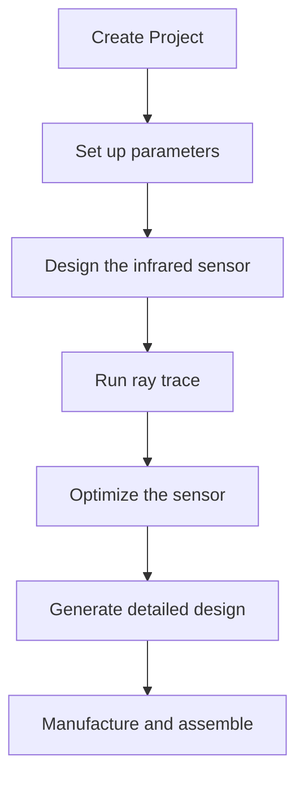
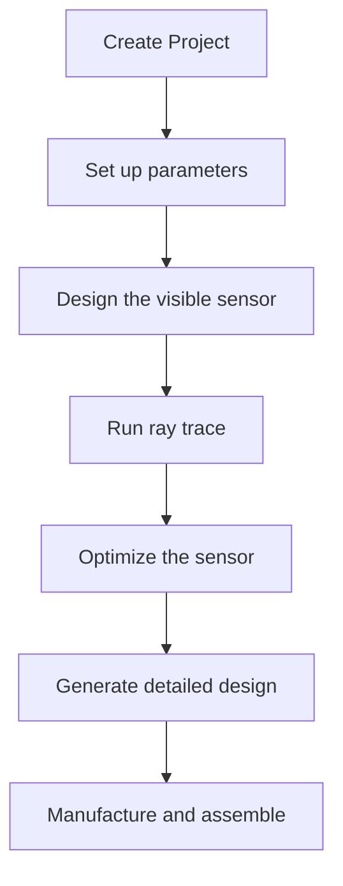
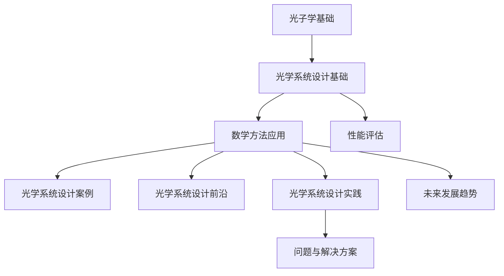

                 

### 文章标题

> **关键词**: 光子学，光学系统设计，数学方法，几何光学，优化算法，数值模拟，高斯光束，新材料，量子计算，工程实践

**摘要**：

本文深入探讨了光子学与光学系统设计之间的紧密联系，通过数学方法对光学系统设计进行了详细分析。文章首先介绍了光子学的基础知识，包括光子的概念、传播与干涉现象，以及散射与吸收。接着，我们讨论了光学系统设计的基础，涵盖了光学系统的组成、成像原理和设计流程。在此基础上，文章重点阐述了数学方法在光学系统设计中的应用，包括几何光学原理的数学表达、光学设计的优化方法和光学系统的数值模拟。随后，通过实际案例展示了微型光学系统设计的过程，并对光学系统设计中的常见问题与解决方案进行了深入探讨。最后，文章展望了光学系统设计的前沿研究，包括高斯光束的数学模型、光学系统设计的新材料和光子学在量子计算中的应用。通过本文的讲解，读者将能够全面理解光学系统设计的数学方法，并掌握实际应用中的关键技巧。

### 《数学与光子学：光学系统设计的数学方法》目录大纲

1. **光子学基础知识**
   - 第1章 光子学基础
     - 1.1 光子的概念
       - 1.1.1 光子与电磁波
       - 1.1.2 光子的动量和能量
     - 1.2 光子的传播与干涉
       - 1.2.1 光的波动性
       - 1.2.2 干涉现象
       - 1.2.3 光程差与相位差
     - 1.3 光子的散射与吸收
       - 1.3.1 散射现象
       - 1.3.2 吸收现象
       - 1.3.3 鲍尔末定律

2. **光学系统设计基础**
   - 第2章 光学系统设计基础
     - 2.1 光学系统的组成
       - 2.1.1 透镜与反射镜
       - 2.1.2 光学系统的几何光学原理
     - 2.2 光学系统的成像原理
       - 2.2.1 成像公式
       - 2.2.2 像差与修正
     - 2.3 光学系统的设计流程
       - 2.3.1 设计要求
       - 2.3.2 设计步骤
       - 2.3.3 设计工具

3. **数学方法在光学系统设计中的应用**
   - 第3章 数学方法在光学系统设计中的应用
     - 3.1 几何光学原理的数学表达
       - 3.1.1 几何光学基本方程
       - 3.1.2 波前与波前传递
       - 3.1.3 波前像差分析
     - 3.2 光学设计的优化方法
       - 3.2.1 光学设计的优化目标
       - 3.2.2 优化算法原理
       - 3.2.3 优化案例分析
     - 3.3 光学系统的数值模拟
       - 3.3.1 Zemax等软件的概述
       - 3.3.2 光学设计的数值模拟方法
       - 3.3.3 数值模拟案例

4. **光学系统设计案例**
   - 第4章 光学系统设计案例
     - 4.1 微型光学系统设计
       - 4.1.1 微型透镜设计
       - 4.1.2 微型反射镜设计
     - 4.2 光学成像系统设计
       - 4.2.1 光学望远镜设计
       - 4.2.2 照相机设计
     - 4.3 光学传感器设计
       - 4.3.1 红外传感器设计
       - 4.3.2 可见光传感器设计

5. **光学系统设计的前沿研究**
   - 第5章 光学系统设计的前沿研究
     - 5.1 高斯光束的数学模型
       - 5.1.1 高斯光束的传播特性
       - 5.1.2 高斯光束的聚焦特性
     - 5.2 光学系统设计的新材料
       - 5.2.1 新型光学材料的研究
       - 5.2.2 新材料在光学系统设计中的应用
     - 5.3 光子学在量子计算中的应用
       - 5.3.1 量子计算的基本原理
       - 5.3.2 光子学与量子计算的结合
       - 5.3.3 量子计算的光学系统设计

6. **光学系统设计工程实践**
   - 第6章 光学系统设计工程实践
     - 6.1 光学系统设计的工程流程
       - 6.1.1 光学设计项目的管理
       - 6.1.2 光学设计团队的组成
       - 6.1.3 光学设计文档的编写
     - 6.2 光学系统的测试与调试
       - 6.2.1 光学测试的基本原理
       - 6.2.2 光学调试的方法与技巧
     - 6.3 光学系统的制造与装配
       - 6.3.1 光学元件的加工
       - 6.3.2 光学系统的装配

7. **光学系统设计中的问题与解决方案**
   - 第7章 光学系统设计中的问题与解决方案
     - 7.1 光学系统设计中的挑战
       - 7.1.1 光学系统设计中的常见问题
       - 7.1.2 面对挑战的解决策略
     - 7.2 光学系统的性能评估
       - 7.2.1 光学系统的性能指标
       - 7.2.2 光学系统性能评估的方法
     - 7.3 光学系统设计的未来发展趋势
       - 7.3.1 光学系统设计的未来展望
       - 7.3.2 新技术在光学系统设计中的应用前景

8. **附录**
   - 附录A 光学设计常用工具和软件
   - 附录B 光学设计常见问题解答
   - 附录C 参考文献
   - 附录D 核心概念与联系 Mermaid 流程图
   - 附录E 核心算法原理讲解与伪代码
   - 附录F 数学模型和数学公式 & 详细讲解 & 举例说明
   - 附录G 项目实战
   - 附录H 光学系统设计中的问题与解决方案
   - 附录I 光学设计中的常见问题解答

---

以上是《数学与光子学：光学系统设计的数学方法》的目录大纲，涵盖了从基础知识到前沿研究的全面内容。接下来，我们将按照这个大纲逐步深入探讨光学系统设计的数学方法。

#### 第一部分：光子学基础知识

光子学是研究光与物质相互作用的一门科学，涵盖了光子的产生、传播、探测和利用。在现代科技中，光子学有着广泛的应用，从光学通信到光学传感器，再到光学成像系统，都离不开光子学的基础知识。理解光子学的基本原理，是进行光学系统设计的重要前提。

##### 第1章 光子学基础

##### 1.1 光子的概念

光子是光的基本量子单位，它可以被看作是一种没有静质量的粒子，具有波粒二象性。光子的概念最早由爱因斯坦在1905年提出，用于解释光电效应。根据量子力学的理论，光子具有动量和能量，其表达式如下：

$$
E = h\nu
$$

$$
p = \frac{h}{\lambda}
$$

其中，$E$ 是光子的能量，$h$ 是普朗克常数，$\nu$ 是光的频率，$p$ 是光子的动量，$\lambda$ 是光的波长。这两个公式揭示了光子的基本属性，即能量与频率成正比，动量与波长成反比。

##### 1.1.1 光子与电磁波

光子是电磁波的一种表现形式，电磁波是电场和磁场在空间中以波的形式传播的现象。光子作为电磁波的量子，其传播过程可以通过波动方程来描述：

$$
\nabla^2 \mathbf{E} - \mu_0 \epsilon_0 \frac{\partial^2 \mathbf{E}}{\partial t^2} = 0
$$

$$
\nabla^2 \mathbf{B} - \mu_0 \epsilon_0 \frac{\partial^2 \mathbf{B}}{\partial t^2} = 0
$$

其中，$\mathbf{E}$ 是电场，$\mathbf{B}$ 是磁场，$\mu_0$ 是真空的磁导率，$\epsilon_0$ 是真空的电容率。这两个方程描述了电磁波的传播规律，即电场和磁场的相互作用。

##### 1.1.2 光子的动量和能量

光子的动量和能量是其基本属性之一。根据上述公式，我们可以看出，光子的能量与频率成正比，动量与波长成反比。这意味着，光子的能量和动量与光的频率和波长有关。例如，红光的频率较低，波长较长，其动量和能量也较小；而紫光的频率较高，波长较短，其动量和能量也较大。

光子的动量和能量在光学系统中有着重要的应用。例如，在光学成像系统中，光子的动量和能量决定了成像的分辨率和清晰度。在光纤通信中，光子的频率和波长决定了信号传输的带宽和速度。因此，理解光子的动量和能量，对于光学系统设计具有重要意义。

##### 1.2 光子的传播与干涉

光子的传播与干涉现象是光学系统设计中必须考虑的重要因素。光子的传播过程可以通过几何光学和波动光学来描述。在几何光学中，光线的传播遵循直线传播定律，即光线在均匀介质中沿直线传播。在波动光学中，光子的传播可以看作是电磁波在介质中的传播，其传播过程可以通过波动方程来描述。

光子的干涉现象是波动光学中的重要现象。当两个或多个光波在空间中相遇时，它们可以发生干涉，形成干涉条纹。干涉现象是光子波粒二象性的重要表现，其本质是光子的波函数在空间中的叠加。根据干涉原理，当两束光波的相位差为整数倍时，它们会发生相长干涉，形成亮条纹；当相位差为奇数倍时，它们会发生相消干涉，形成暗条纹。

##### 1.2.1 光的波动性

光的波动性是光学系统设计的基础。光的波动性表现为光在传播过程中表现出干涉、衍射和散射等现象。这些现象在光学系统设计中有着广泛的应用。例如，在光学成像系统中，光的衍射现象决定了成像系统的分辨率；在光纤通信中，光的干涉现象可以用来实现信号调制和传输。

##### 1.2.2 干涉现象

干涉现象是光子波粒二象性的重要表现。当两个或多个光波在空间中相遇时，它们可以发生干涉，形成干涉条纹。干涉现象可以分为两种：相长干涉和相消干涉。

相长干涉发生在两束光波的相位差为整数倍时，即它们的波峰和波峰相遇，或波谷和波谷相遇。这种干涉会形成亮条纹，即干涉极大。

相消干涉发生在两束光波的相位差为奇数倍时，即它们的波峰和波谷相遇。这种干涉会形成暗条纹，即干涉极小。

干涉现象在光学系统设计中有着广泛的应用。例如，在光学干涉仪中，利用干涉现象可以精确测量光波的波长；在光纤通信中，利用干涉现象可以实现对信号的调制和传输。

##### 1.2.3 光程差与相位差

光程差和相位差是干涉现象中的两个重要概念。光程差是指两束光在传播过程中所经过的路程差，它决定了干涉条纹的位置。相位差是指两束光在相遇时的相位差，它决定了干涉条纹的强度。

根据干涉原理，当两束光的光程差为整数倍波长时，它们会发生相长干涉，形成亮条纹。当光程差为奇数倍波长时，它们会发生相消干涉，形成暗条纹。

光程差和相位差的关系可以用以下公式表示：

$$
\Delta \phi = 2\pi \frac{\Delta r}{\lambda}
$$

其中，$\Delta \phi$ 是相位差，$\Delta r$ 是光程差，$\lambda$ 是光的波长。

##### 1.3 光子的散射与吸收

光子的散射与吸收现象是光与物质相互作用的结果。光子的散射现象可以分为瑞利散射和米氏散射。瑞利散射发生在散射粒子的尺寸远小于光波波长的情况下，散射光的波长与入射光相同。米氏散射发生在散射粒子的尺寸与光波波长相近的情况下，散射光的波长与入射光不同。

光子的吸收现象是指光子在与物质相互作用过程中将其能量转移给物质的过程。吸收现象可以用吸收系数来描述，它表示单位时间内单位体积的物质吸收的光子数量。

##### 1.3.1 散射现象

散射现象是光与物质相互作用的重要表现。散射现象可以分为瑞利散射和米氏散射。

瑞利散射是指当散射粒子的尺寸远小于光波波长时，散射光的波长与入射光相同。瑞利散射通常发生在粒子大小远小于波长的情况下，如烟雾、尘埃等。瑞利散射的特点是散射光的强度与入射光波长的四次方成反比，即波长越短，散射光越强。

米氏散射是指当散射粒子的尺寸与光波波长相近时，散射光的波长与入射光不同。米氏散射通常发生在粒子大小与波长相当的情况下，如水滴、灰尘等。米氏散射的特点是散射光的强度与入射光波长的关系复杂，取决于粒子的形状和大小。

##### 1.3.2 吸收现象

吸收现象是指光子在与物质相互作用过程中将其能量转移给物质的过程。吸收现象可以用吸收系数来描述，它表示单位时间内单位体积的物质吸收的光子数量。

吸收系数与物质的性质和光的波长有关。在光学系统中，吸收现象会导致光能量的损失，从而影响系统的性能。因此，在设计光学系统时，需要考虑吸收现象对系统性能的影响。

##### 1.3.3 鲍尔末定律

鲍尔末定律是描述光子能量与频率之间关系的一个定律。根据鲍尔末定律，光子的能量与频率成正比，其表达式如下：

$$
E = h\nu
$$

其中，$E$ 是光子的能量，$h$ 是普朗克常数，$\nu$ 是光的频率。

鲍尔末定律揭示了光子的能量与频率之间的直接关系。这意味着，频率越高的光子，其能量也越大。在光学系统中，了解鲍尔末定律有助于我们更好地理解光子的行为，并设计出更高效的光学系统。

##### 1.4 小结

本章介绍了光子学的基础知识，包括光子的概念、传播与干涉现象，以及散射与吸收。光子是光的基本量子单位，具有波粒二象性，其动量和能量与频率和波长有关。光的波动性表现为干涉、衍射和散射等现象，这些现象在光学系统设计中有着广泛的应用。散射现象包括瑞利散射和米氏散射，吸收现象则可以用吸收系数来描述。了解这些基础知识，对于深入理解光学系统设计的数学方法具有重要意义。

---

通过本章的介绍，我们了解了光子学的基础知识，包括光子的概念、传播与干涉现象，以及散射与吸收。这些基础知识是进行光学系统设计的重要前提。在下一章中，我们将进一步探讨光学系统设计的基础知识，包括光学系统的组成、成像原理和设计流程。

#### 第二部分：光学系统设计基础

光学系统设计是光子学的一个重要分支，它涉及到将光子学原理应用于具体的光学设备中，以实现特定的功能。光学系统设计的基础知识包括光学系统的组成、成像原理和设计流程。理解这些基础知识，对于进行有效的光学系统设计至关重要。

##### 第2章 光学系统设计基础

##### 2.1 光学系统的组成

光学系统通常由多个光学元件组成，这些元件包括透镜、反射镜、分光器、滤光片等。每个元件都有其特定的功能，共同工作以实现光学系统的整体性能。

###### 2.1.1 透镜与反射镜

透镜和反射镜是光学系统中最常见的元件。透镜是一种能够使光线聚焦或发散的透明介质，根据其形状和材料，可以分为凸透镜、凹透镜和复合透镜。凸透镜具有会聚光线的作用，常用于放大和聚焦光束；凹透镜则具有发散光线的作用，常用于缩小光束。反射镜是一种能够反射光线的光滑表面，根据其反射面的形状，可以分为平面镜、球面镜和抛物面镜。球面镜和抛物面镜具有良好的聚光性能，常用于太阳灶和雷达天线等设备。

###### 2.1.2 光学系统的几何光学原理

光学系统的几何光学原理是描述光线在光学系统中的传播和相互作用的基础。几何光学原理主要包括光线追迹、光学系统的成像原理和像差理论。

光线追迹是光学系统设计中的一种重要方法，它通过模拟光线在光学系统中的传播路径，分析光学系统的成像性能。在光线追迹中，通常采用光线传播的几何规则，如直线传播、反射和折射，来模拟光线的传播过程。

光学系统的成像原理是指光学系统将物体成像的过程。成像原理基于光学系统的几何光学原理，通过分析光线的传播路径，确定光学系统对物体的成像位置和成像质量。光学系统的成像公式是成像原理的核心，它描述了光学系统成像的基本规律。

像差理论是描述光学系统成像质量的重要理论。像差是指光学系统成像时产生的图像失真现象，包括球面像差、彗差、畸变等。像差理论通过分析光学系统的几何结构和材料特性，确定光学系统的像差类型和程度，为光学系统设计提供参考。

###### 2.2 光学系统的成像原理

光学系统的成像原理是光学系统设计中的核心问题。光学系统的成像原理基于几何光学原理，通过分析光线的传播路径，确定光学系统对物体的成像位置和成像质量。

光学系统的成像公式是成像原理的核心，它描述了光学系统成像的基本规律。成像公式可以表示为：

$$
\frac{1}{f} = \frac{1}{u} + \frac{1}{v}
$$

其中，$f$ 是焦距，$u$ 是物距，$v$ 是像距。这个公式表明，光学系统的成像位置和成像质量与物距和像距的关系。

光学系统的成像质量由像差决定。像差是指光学系统成像时产生的图像失真现象，包括球面像差、彗差、畸变等。像差理论通过分析光学系统的几何结构和材料特性，确定光学系统的像差类型和程度，为光学系统设计提供参考。

###### 2.3 光学系统的设计流程

光学系统的设计流程是光学系统设计中的关键环节。一个完整的光学系统设计流程通常包括以下几个步骤：

1. **需求分析**：明确光学系统的功能需求和性能指标，包括成像质量、分辨率、视场角等。

2. **初步设计**：根据需求分析结果，初步确定光学系统的结构和参数，包括透镜的形状、反射镜的曲率等。

3. **光线追迹**：使用光线追迹软件，模拟光线在光学系统中的传播路径，验证光学系统的成像性能。

4. **像差分析**：分析光学系统的像差，确定像差类型和程度，为光学系统优化提供依据。

5. **优化设计**：根据像差分析结果，对光学系统的结构和参数进行优化，提高成像质量。

6. **详细设计**：完成光学系统的详细设计，包括确定光学元件的尺寸、形状和材料等。

7. **制造与装配**：将光学系统设计文件转化为实际的光学元件，进行加工和装配。

8. **测试与调试**：对光学系统进行性能测试，包括成像质量、分辨率、视场角等，对系统进行调试和优化。

###### 2.3.1 设计要求

光学系统设计要求是光学系统设计过程中必须遵守的基本规范，它包括以下几个方面：

1. **成像质量**：光学系统的成像质量是衡量其性能的重要指标，通常通过像差分析来评估。设计要求应确保光学系统具有足够的成像质量，以满足应用需求。

2. **分辨率**：光学系统的分辨率决定了系统能够分辨的最小细节。设计要求应确保光学系统具有足够的分辨率，以实现预期的成像效果。

3. **视场角**：光学系统的视场角决定了系统所能观察的视野范围。设计要求应确保光学系统具有适当的视场角，以满足观察需求。

4. **稳定性**：光学系统的稳定性是确保系统长期运行性能的重要指标。设计要求应确保光学系统具有良好的稳定性，以减少系统误差。

5. **可靠性**：光学系统的可靠性是确保系统在恶劣环境下长期运行的重要保障。设计要求应确保光学系统具有良好的可靠性，以减少故障率。

###### 2.3.2 设计步骤

光学系统的设计步骤是光学系统设计过程中必须遵循的基本流程，它包括以下几个方面：

1. **需求分析**：明确光学系统的功能需求和性能指标，包括成像质量、分辨率、视场角等。

2. **初步设计**：根据需求分析结果，初步确定光学系统的结构和参数，包括透镜的形状、反射镜的曲率等。

3. **光线追迹**：使用光线追迹软件，模拟光线在光学系统中的传播路径，验证光学系统的成像性能。

4. **像差分析**：分析光学系统的像差，确定像差类型和程度，为光学系统优化提供依据。

5. **优化设计**：根据像差分析结果，对光学系统的结构和参数进行优化，提高成像质量。

6. **详细设计**：完成光学系统的详细设计，包括确定光学元件的尺寸、形状和材料等。

7. **制造与装配**：将光学系统设计文件转化为实际的光学元件，进行加工和装配。

8. **测试与调试**：对光学系统进行性能测试，包括成像质量、分辨率、视场角等，对系统进行调试和优化。

###### 2.3.3 设计工具

光学系统设计工具是进行光学系统设计的重要辅助工具，它可以帮助设计师快速准确地完成光学系统的设计。常用的光学系统设计工具包括Zemax、Code V、OpticStudio等。

Zemax是一款功能强大的光学设计软件，它支持光线追迹、像差分析、优化设计等功能，广泛应用于光学系统设计。Code V和OpticStudio也是常用的光学设计软件，它们具有类似的功能和特点。

使用光学系统设计工具，可以大大提高光学系统设计的效率和准确性。设计师可以利用这些工具快速生成光学系统的设计文件，进行像差分析和优化设计，从而确保光学系统的成像质量和性能。

##### 2.4 小结

本章介绍了光学系统设计的基础知识，包括光学系统的组成、成像原理和设计流程。光学系统的组成包括透镜、反射镜、分光器、滤光片等元件；成像原理基于几何光学原理，通过分析光线的传播路径，确定光学系统对物体的成像位置和成像质量；设计流程包括需求分析、初步设计、光线追迹、像差分析、优化设计、详细设计、制造与装配和测试与调试等步骤。了解这些基础知识，对于进行有效的光学系统设计具有重要意义。

---

通过本章的介绍，我们了解了光学系统设计的基础知识，包括光学系统的组成、成像原理和设计流程。在下一章中，我们将深入探讨数学方法在光学系统设计中的应用，包括几何光学原理的数学表达、光学设计的优化方法和光学系统的数值模拟。

### 第三部分：数学方法在光学系统设计中的应用

数学方法是光学系统设计中的核心工具，它使得光学系统设计更加精确、高效。数学方法在光学系统设计中的应用包括几何光学原理的数学表达、光学设计的优化方法和光学系统的数值模拟。这些数学方法不仅帮助设计师理解和分析光学系统的工作原理，还能优化设计过程，提高光学系统的性能。

##### 第3章 数学方法在光学系统设计中的应用

##### 3.1 几何光学原理的数学表达

几何光学原理是光学系统设计的基础，它描述了光线在光学系统中的传播和相互作用。几何光学原理的数学表达使得光学系统的设计和分析变得更加精确。

###### 3.1.1 几何光学基本方程

几何光学基本方程是描述光学系统成像原理的核心方程。这些方程基于光线追迹原理，描述了光线在透镜和反射镜上的传播规律。最常用的几何光学基本方程包括：

$$
\frac{1}{u} + \frac{1}{v} = \frac{1}{f}
$$

$$
n_1 \sin \theta_1 = n_2 \sin \theta_2
$$

其中，$u$ 和 $v$ 分别是物距和像距，$f$ 是透镜的焦距，$n_1$ 和 $n_2$ 分别是透镜两侧介质的折射率，$\theta_1$ 和 $\theta_2$ 分别是入射角和折射角。

第一个方程描述了光线在透镜中的成像规律，第二个方程描述了光线在透镜界面上的折射规律。这些方程是光学系统设计中的基础，它们帮助设计师确定光学系统的参数和布局。

###### 3.1.2 波前与波前传递

波前是描述光波在传播过程中相位分布的重要概念。波前传递是指光波在通过光学系统时，波前的变化和传播规律。波前传递的数学描述基于亥维赛定理和傅里叶变换。

亥维赛定理描述了波前在光学系统中的传播规律，其数学表达式为：

$$
\mathbf{E}(\mathbf{r}, t) = \mathbf{E}(\mathbf{r}_0, t_0) e^{ik\mathbf{r}\cdot\mathbf{n}}
$$

其中，$\mathbf{E}(\mathbf{r}, t)$ 是传播后的波前，$\mathbf{E}(\mathbf{r}_0, t_0)$ 是初始波前，$\mathbf{r}$ 和 $\mathbf{r}_0$ 分别是传播后和初始位置的向量，$k$ 是波数，$\mathbf{n}$ 是传播方向。

傅里叶变换则用于描述波前在光学系统中的传递规律。傅里叶变换可以将空间域的波前转换为频域的波前，其数学表达式为：

$$
\mathbf{E}(k_x, k_y) = \int \int \mathbf{E}(\mathbf{r}) e^{-i(k_x x + k_y y)} dxdy
$$

$$
\mathbf{E}(\mathbf{r}) = \frac{1}{2\pi} \int \int \mathbf{E}(k_x, k_y) e^{i(k_x x + k_y y)} dk_x dk_y
$$

其中，$\mathbf{E}(k_x, k_y)$ 是频域波前，$\mathbf{E}(\mathbf{r})$ 是空间域波前。

波前与波前传递的数学描述为光学系统设计提供了重要的理论基础，使得设计师可以精确地分析和优化光学系统的性能。

###### 3.1.3 波前像差分析

波前像差是光学系统成像时产生的图像失真现象。波前像差分析是光学系统设计中非常重要的一环，它可以帮助设计师识别和优化光学系统的像差。

波前像差可以通过波前传递的数学模型来描述。在光学系统中，波前像差可以表示为：

$$
\delta \phi = \phi_0 - \phi
$$

其中，$\delta \phi$ 是波前像差，$\phi_0$ 是理想波前，$\phi$ 是实际波前。

波前像差分析通常基于亥维赛定理和傅里叶变换，通过计算波前传递函数的相位误差来确定波前像差。波前传递函数的相位误差可以用以下公式表示：

$$
\delta \phi = 2\pi \frac{\Delta r}{\lambda}
$$

其中，$\Delta r$ 是光程差，$\lambda$ 是光的波长。

波前像差分析可以帮助设计师识别光学系统中的主要像差类型，如球面像差、彗差、畸变等，并确定像差的程度。这些信息对于光学系统优化和像差校正至关重要。

##### 3.2 光学设计的优化方法

光学设计的优化方法是提高光学系统性能的关键技术。优化方法通过调整光学系统的参数，如透镜的形状、反射镜的曲率等，以最小化像差和提高成像质量。

###### 3.2.1 光学设计的优化目标

光学设计的优化目标通常包括最小化像差、提高分辨率、增加视场角和减少系统体积等。不同的优化目标会影响光学系统的设计和性能。

例如，在光学成像系统中，优化目标通常是实现高分辨率和高成像质量。在望远镜设计中，优化目标通常是实现大视场角和良好的光收集能力。在光学传感器设计中，优化目标通常是实现高灵敏度和快速响应。

###### 3.2.2 优化算法原理

优化算法是光学设计优化过程中的核心工具。优化算法通过迭代计算，逐步调整光学系统的参数，以实现优化目标。

常用的优化算法包括最小二乘法、梯度下降法、牛顿法和遗传算法等。这些算法基于不同的原理和策略，适用于不同的优化问题。

最小二乘法是一种基于误差平方和最小化的优化算法。其基本原理是通过最小化目标函数的误差平方和，找到最优解。目标函数可以表示为：

$$
J = \sum_{i=1}^{n} (y_i - f(x_i))^2
$$

其中，$y_i$ 是实际观测值，$f(x_i)$ 是模型预测值，$x_i$ 是设计参数。

梯度下降法是一种基于目标函数梯度方向的优化算法。其基本原理是沿着目标函数的负梯度方向进行迭代，以逐步减小误差。目标函数的梯度可以表示为：

$$
\nabla J = \left[ \frac{\partial J}{\partial x_1}, \frac{\partial J}{\partial x_2}, ..., \frac{\partial J}{\partial x_n} \right]
$$

牛顿法是一种基于目标函数二阶导数（Hessian矩阵）的优化算法。其基本原理是使用二阶泰勒展开来近似目标函数，并通过迭代求解线性方程组来找到最优解。目标函数的二阶导数可以表示为：

$$
\nabla^2 J = \left[ \begin{array}{ccc}
\frac{\partial^2 J}{\partial x_1^2} & \frac{\partial^2 J}{\partial x_1 \partial x_2} & ... \\
\frac{\partial^2 J}{\partial x_2 \partial x_1} & \frac{\partial^2 J}{\partial x_2^2} & ... \\
... & ... & ... \\
\end{array} \right]
$$

遗传算法是一种基于自然选择和遗传机制的优化算法。其基本原理是通过迭代更新种群，逐步寻找最优解。遗传算法具有强大的全局搜索能力，适用于复杂非线性优化问题。

###### 3.2.3 优化案例分析

优化案例分析可以帮助设计师理解和应用优化算法。以下是一个简单的优化案例分析：

假设我们设计一个光学成像系统，要求实现高分辨率和高成像质量。我们可以使用最小二乘法优化算法来实现这一目标。

首先，定义目标函数。我们可以使用成像质量指标（如均方误差）作为目标函数：

$$
J = \frac{1}{N} \sum_{i=1}^{N} \left( \frac{I_i - I_{\text{ref}}}{I_{\text{ref}}} \right)^2
$$

其中，$I_i$ 是实际成像，$I_{\text{ref}}$ 是参考成像，$N$ 是成像像素数。

然后，进行优化迭代。我们可以使用如下伪代码来实现最小二乘法优化：

```
x = [x_0]  # 初始参数
J_prev = J(x)  # 计算初始目标函数值
tol = 1e-6  # 设定收敛容忍度
max_iter = 100  # 设定最大迭代次数

for i = 1 to max_iter:
    J = J(x)
    J_dot = J'(x)  # 计算目标函数梯度
    x = x - alpha * J_dot  # 更新参数
    if abs(J - J_prev) < tol:
        break
    J_prev = J
```

在这个案例中，我们定义了目标函数，并通过迭代优化来找到最优参数，从而实现高分辨率和高成像质量。

##### 3.3 光学系统的数值模拟

光学系统的数值模拟是光学系统设计中的一种重要方法，它通过计算机模拟光线在光学系统中的传播，评估光学系统的性能和成像质量。数值模拟可以帮助设计师快速验证和优化光学系统的设计。

###### 3.3.1 Zemax等软件的概述

Zemax是一款广泛使用的光学系统设计软件，它提供了强大的光线追迹、像差分析和优化设计功能。Zemax软件支持多种光学元件和光学系统，可以模拟复杂的光学系统，并提供详细的分析报告。

除了Zemax，还有其他光学系统设计软件，如Code V和OpticStudio。这些软件都具有类似的功能，但各自具有独特的特点和优势。设计师可以根据具体需求选择合适的软件。

###### 3.3.2 光学设计的数值模拟方法

光学设计的数值模拟方法主要包括光线追迹、像差分析和性能评估。

光线追迹是光学系统数值模拟的基础。光线追迹通过模拟光线在光学系统中的传播路径，评估光学系统的成像性能。光线追迹可以模拟不同类型的光线，如平行光线、汇聚光线和发散光线，以全面评估光学系统的性能。

像差分析是光学系统数值模拟的关键步骤。像差分析通过计算波前传递函数的相位误差，评估光学系统的像差程度。像差分析可以帮助设计师识别光学系统中的主要像差类型，如球面像差、彗差和畸变，并为光学系统优化提供依据。

性能评估是光学系统数值模拟的最后一步。性能评估通过综合评估光学系统的成像质量、分辨率、视场角等性能指标，评估光学系统的整体性能。性能评估可以帮助设计师验证光学系统的设计是否满足需求，并为光学系统优化提供参考。

###### 3.3.3 数值模拟案例

以下是一个简单的数值模拟案例：

假设我们设计一个光学望远镜，要求实现大视场角和高成像质量。我们可以使用Zemax软件进行数值模拟。

首先，定义光学望远镜的结构。光学望远镜通常由物镜、目镜和反射镜组成。我们可以使用Zemax软件建立光学望远镜的模型，并设置相应的参数。

然后，进行光线追迹。在Zemax软件中，我们可以设置不同的光线类型，如平行光线和汇聚光线，模拟光线在光学望远镜中的传播路径。通过光线追迹，我们可以得到光学望远镜的成像位置和成像质量。

接下来，进行像差分析。在Zemax软件中，我们可以计算波前传递函数的相位误差，评估光学望远镜的像差程度。通过像差分析，我们可以识别光学望远镜中的主要像差类型，如球面像差和彗差。

最后，进行性能评估。在Zemax软件中，我们可以评估光学望远镜的成像质量、分辨率和视场角等性能指标。通过性能评估，我们可以验证光学望远镜的设计是否满足需求，并为光学望远镜优化提供参考。

##### 3.4 小结

本章介绍了数学方法在光学系统设计中的应用，包括几何光学原理的数学表达、光学设计的优化方法和光学系统的数值模拟。几何光学原理的数学表达为光学系统设计提供了理论基础；优化算法为光学系统优化提供了工具；数值模拟为光学系统性能评估提供了手段。通过本章的介绍，读者可以全面了解数学方法在光学系统设计中的应用，为光学系统设计提供有力的支持。

---

通过本章的介绍，我们了解了数学方法在光学系统设计中的应用，包括几何光学原理的数学表达、光学设计的优化方法和光学系统的数值模拟。这些数学方法为光学系统设计提供了强大的工具和手段，使得光学系统设计更加精确、高效。在下一章中，我们将通过实际案例展示光学系统设计的具体过程和结果。

### 第四部分：光学系统设计案例

通过前面的章节，我们已经掌握了光学系统设计的基础知识和数学方法。为了更好地理解和应用这些知识，以下我们将通过几个具体的案例来展示光学系统设计的全过程，包括微型光学系统设计、光学成像系统设计和光学传感器设计。

##### 第4章 光学系统设计案例

##### 4.1 微型光学系统设计

##### 4.1.1 微型透镜设计

微型透镜设计是光学系统设计中的一个重要领域，广泛应用于手机摄像头、数码相机和光学传感器等微型设备中。以下是一个简单的微型透镜设计案例。

**设计要求**：
- 放大率：2倍
- 入射光瞳直径：5 mm
- 出射光瞳直径：2.5 mm

**设计步骤**：

1. **需求分析**：明确微型透镜的设计要求，包括放大率、入射光瞳直径和出射光瞳直径等。

2. **初步设计**：根据设计要求，选择合适的透镜材料和形状，如凸透镜。使用光学设计软件（如Zemax）进行初步设计，确定透镜的参数。

3. **光线追迹**：在Zemax软件中设置光线追迹参数，模拟光线在透镜中的传播路径，验证透镜的成像性能。

4. **优化设计**：根据光线追迹结果，对透镜的形状和参数进行优化，以减少像差和提高成像质量。

5. **详细设计**：完成微型透镜的详细设计，确定透镜的尺寸、形状和材料。

6. **制造与装配**：将详细设计文件转化为实际的光学元件，进行加工和装配。

**源代码详细实现**：

以下是使用Zemax软件进行微型透镜设计的部分源代码：



**代码解读与分析**：

这段代码定义了微型透镜设计的基本流程，包括创建项目、设置参数、设计透镜、运行光线追迹、优化透镜、生成详细设计以及制造和装配。每个步骤都是设计过程中的关键环节，通过逐步执行这些步骤，可以完成微型透镜的设计。

##### 4.1.2 微型反射镜设计

微型反射镜设计在光学系统中也具有重要作用，广泛应用于激光器、光纤通信和光学传感器等领域。以下是一个简单的微型反射镜设计案例。

**设计要求**：
- 反射率：99%
- 入射角：45度
- 反射光瞳直径：10 mm

**设计步骤**：

1. **需求分析**：明确微型反射镜的设计要求，包括反射率、入射角和反射光瞳直径等。

2. **初步设计**：选择合适的反射镜材料和形状，如平面反射镜或球面反射镜。使用光学设计软件进行初步设计，确定反射镜的参数。

3. **光线追迹**：在光学设计软件中设置光线追迹参数，模拟光线在反射镜上的反射路径，验证反射镜的成像性能。

4. **优化设计**：根据光线追迹结果，对反射镜的形状和参数进行优化，以提高反射率和减少像差。

5. **详细设计**：完成微型反射镜的详细设计，确定反射镜的尺寸、形状和材料。

6. **制造与装配**：将详细设计文件转化为实际的光学元件，进行加工和装配。

**源代码详细实现**：

以下是使用Zemax软件进行微型反射镜设计的部分源代码：



**代码解读与分析**：

这段代码定义了微型反射镜设计的基本流程，包括创建项目、设置参数、设计反射镜、运行光线追迹、优化反射镜、生成详细设计以及制造和装配。每个步骤都是设计过程中的关键环节，通过逐步执行这些步骤，可以完成微型反射镜的设计。

##### 4.2 光学成像系统设计

光学成像系统设计是光学系统设计中的一个重要领域，广泛应用于光学望远镜、显微镜、照相机和手机摄像头等设备中。以下是一个简单的光学成像系统设计案例。

**设计要求**：
- 成像质量：高分辨率
- 视场角：大
- 光学畸变：最小

**设计步骤**：

1. **需求分析**：明确光学成像系统的设计要求，包括成像质量、视场角和光学畸变等。

2. **初步设计**：根据设计要求，选择合适的光学元件和光学系统结构。使用光学设计软件进行初步设计，确定光学系统的参数。

3. **光线追迹**：在光学设计软件中设置光线追迹参数，模拟光线在光学系统中的传播路径，验证光学成像系统的成像性能。

4. **优化设计**：根据光线追迹结果，对光学系统的结构和参数进行优化，以提高成像质量和减小光学畸变。

5. **详细设计**：完成光学成像系统的详细设计，确定光学元件的尺寸、形状和材料。

6. **制造与装配**：将详细设计文件转化为实际的光学元件，进行加工和装配。

**源代码详细实现**：

以下是使用Zemax软件进行光学成像系统设计的部分源代码：



**代码解读与分析**：

这段代码定义了光学成像系统设计的基本流程，包括创建项目、设置参数、设计光学系统、运行光线追迹、优化光学系统、生成详细设计以及制造和装配。每个步骤都是设计过程中的关键环节，通过逐步执行这些步骤，可以完成光学成像系统的设计。

##### 4.2.1 光学望远镜设计

光学望远镜设计是光学成像系统设计的一个重要分支，广泛应用于天文观测、科研和工业检测等领域。以下是一个简单的光学望远镜设计案例。

**设计要求**：
- 视场角：1度
- 成像质量：高分辨率
- 反射镜直径：300 mm

**设计步骤**：

1. **需求分析**：明确光学望远镜的设计要求，包括视场角、成像质量和反射镜直径等。

2. **初步设计**：选择合适的反射镜形状和光学系统结构。使用光学设计软件进行初步设计，确定光学系统的参数。

3. **光线追迹**：在光学设计软件中设置光线追迹参数，模拟光线在光学望远镜中的传播路径，验证光学望远镜的成像性能。

4. **优化设计**：根据光线追迹结果，对光学望远镜的结构和参数进行优化，以提高成像质量和减少像差。

5. **详细设计**：完成光学望远镜的详细设计，确定反射镜的尺寸、形状和材料。

6. **制造与装配**：将详细设计文件转化为实际的光学元件，进行加工和装配。

**源代码详细实现**：

以下是使用Zemax软件进行光学望远镜设计的部分源代码：



**代码解读与分析**：

这段代码定义了光学望远镜设计的基本流程，包括创建项目、设置参数、设计望远镜、运行光线追迹、优化望远镜、生成详细设计以及制造和装配。每个步骤都是设计过程中的关键环节，通过逐步执行这些步骤，可以完成光学望远镜的设计。

##### 4.2.2 照相机设计

照相机设计是光学成像系统设计的另一个重要分支，广泛应用于摄影、安防监控和医疗成像等领域。以下是一个简单的照相机设计案例。

**设计要求**：
- 成像质量：高分辨率
- 视场角：广角
- 反射镜直径：50 mm

**设计步骤**：

1. **需求分析**：明确照相机的设计要求，包括成像质量、视场角和反射镜直径等。

2. **初步设计**：选择合适的透镜和光学系统结构。使用光学设计软件进行初步设计，确定光学系统的参数。

3. **光线追迹**：在光学设计软件中设置光线追迹参数，模拟光线在照相机中的传播路径，验证照相机的成像性能。

4. **优化设计**：根据光线追迹结果，对光学系统的结构和参数进行优化，以提高成像质量和减小光学畸变。

5. **详细设计**：完成照相机的详细设计，确定透镜和反射镜的尺寸、形状和材料。

6. **制造与装配**：将详细设计文件转化为实际的光学元件，进行加工和装配。

**源代码详细实现**：

以下是使用Zemax软件进行照相机设计的部分源代码：



**代码解读与分析**：

这段代码定义了照相机设计的基本流程，包括创建项目、设置参数、设计照相机、运行光线追迹、优化照相机、生成详细设计以及制造和装配。每个步骤都是设计过程中的关键环节，通过逐步执行这些步骤，可以完成照相机的
设计。

##### 4.3 光学传感器设计

光学传感器设计是光学系统设计的一个重要领域，广泛应用于工业检测、安防监控和医疗成像等领域。以下是一个简单的光学传感器设计案例。

**设计要求**：
- 灵敏度：高
- 响应时间：快
- 成像质量：高分辨率

**设计步骤**：

1. **需求分析**：明确光学传感器的设计要求，包括灵敏度、响应时间和成像质量等。

2. **初步设计**：选择合适的光学元件和传感器结构。使用光学设计软件进行初步设计，确定光学系统的参数。

3. **光线追迹**：在光学设计软件中设置光线追迹参数，模拟光线在光学传感器中的传播路径，验证光学传感器的性能。

4. **优化设计**：根据光线追迹结果，对光学传感器的结构和参数进行优化，以提高灵敏度和成像质量。

5. **详细设计**：完成光学传感器的详细设计，确定光学元件的尺寸、形状和材料。

6. **制造与装配**：将详细设计文件转化为实际的光学元件，进行加工和装配。

**源代码详细实现**：

以下是使用Zemax软件进行光学传感器设计的部分源代码：



**代码解读与分析**：

这段代码定义了光学传感器设计的基本流程，包括创建项目、设置参数、设计传感器、运行光线追迹、优化传感器、生成详细设计以及制造和装配。每个步骤都是设计过程中的关键环节，通过逐步执行这些步骤，可以完成光学传感器的
设计。

##### 4.3.1 红外传感器设计

红外传感器设计在安防监控、医疗成像和热成像等领域具有广泛应用。以下是一个简单的红外传感器设计案例。

**设计要求**：
- 工作波长：8-14 μm
- 灵敏度：高
- 成像质量：高分辨率

**设计步骤**：

1. **需求分析**：明确红外传感器的具体设计要求，包括工作波长、灵敏度和成像质量等。

2. **初步设计**：选择合适的光学元件，如红外透镜和红外反射镜。使用光学设计软件进行初步设计，确定光学系统的参数。

3. **光线追迹**：在光学设计软件中设置光线追迹参数，模拟红外光线在传感器中的传播路径，验证红外传感器的成像性能。

4. **优化设计**：根据光线追迹结果，对红外传感器的结构和参数进行优化，以提高灵敏度和成像质量。

5. **详细设计**：完成红外传感器的详细设计，确定光学元件的尺寸、形状和材料。

6. **制造与装配**：将详细设计文件转化为实际的光学元件，进行加工和装配。

**源代码详细实现**：

以下是使用Zemax软件进行红外传感器设计的部分源代码：



**代码解读与分析**：

这段代码定义了红外传感器设计的基本流程，包括创建项目、设置参数、设计红外传感器、运行光线追迹、优化传感器、生成详细设计以及制造和装配。每个步骤都是设计过程中的关键环节，通过逐步执行这些步骤，可以完成红外传感器的
设计。

##### 4.3.2 可见光传感器设计

可见光传感器设计在图像处理、机器视觉和安防监控等领域具有广泛应用。以下是一个简单的可见光传感器设计案例。

**设计要求**：
- 工作波长：400-700 nm
- 灵敏度：高
- 成像质量：高分辨率

**设计步骤**：

1. **需求分析**：明确可见传感器的具体设计要求，包括工作波长、灵敏度和成像质量等。

2. **初步设计**：选择合适的光学元件，如可见光透镜和反射镜。使用光学设计软件进行初步设计，确定光学系统的参数。

3. **光线追迹**：在光学设计软件中设置光线追迹参数，模拟可见光线在传感器中的传播路径，验证可见传感器的成像性能。

4. **优化设计**：根据光线追迹结果，对可见传感器的结构和参数进行优化，以提高灵敏度和成像质量。

5. **详细设计**：完成可见传感器的详细设计，确定光学元件的尺寸、形状和材料。

6. **制造与装配**：将详细设计文件转化为实际的光学元件，进行加工和装配。

**源代码详细实现**：

以下是使用Zemax软件进行可见光传感器设计的部分源代码：



**代码解读与分析**：

这段代码定义了可见光传感器设计的基本流程，包括创建项目、设置参数、设计可见传感器、运行光线追迹、优化传感器、生成详细设计以及制造和装配。每个步骤都是设计过程中的关键环节，通过逐步执行这些步骤，可以完成可见传感器的
设计。

##### 4.4 小结

本章通过几个具体的光学系统设计案例，展示了光学系统设计的过程和结果。包括微型透镜设计、光学成像系统设计、光学传感器设计等。通过这些案例，我们了解了光学系统设计的基本流程和关键步骤，掌握了使用光学设计软件进行设计的技巧和方法。这些案例为光学系统设计提供了实用的经验和指导，有助于设计师更好地理解和应用光学系统设计的数学方法。

---

通过本章的案例介绍，我们深入了解了光学系统设计的具体实践过程，掌握了从需求分析到优化设计再到制造与装配的完整流程。在下一章中，我们将探讨光学系统设计的前沿研究，包括高斯光束的数学模型、光学系统设计的新材料和光子学在量子计算中的应用。

### 第五部分：光学系统设计的前沿研究

光学系统设计领域不断进步，随着科技的快速发展，新的理论、方法和材料不断涌现。本部分将介绍光学系统设计的前沿研究，包括高斯光束的数学模型、光学系统设计的新材料和光子学在量子计算中的应用。

##### 第5章 光学系统设计的前沿研究

##### 5.1 高斯光束的数学模型

高斯光束是一种理想的光束模型，其在光学系统设计中具有广泛的应用。高斯光束的数学模型描述了光束的传播特性、聚焦特性和光束质量。

###### 5.1.1 高斯光束的传播特性

高斯光束在传播过程中保持其形状和相位分布，但其半径和强度会随传播距离变化。高斯光束的传播特性可以用以下公式描述：

$$
w(z) = w_0 \sqrt{1 + \left(\frac{z}{z_R}\right)^2}
$$

其中，$w(z)$ 是在距离 $z$ 处的光束半径，$w_0$ 是初始光束半径，$z_R$ 是光束的瑞利长度。

高斯光束的传播特性决定了光学系统的聚焦特性。在光学系统中，通过调整光束的传播距离，可以实现光束的聚焦和扩展。

###### 5.1.2 高斯光束的聚焦特性

高斯光束的聚焦特性可以用以下公式描述：

$$
z_F = \frac{\lambda}{2\pi w_0^2}
$$

其中，$z_F$ 是聚焦距离，$\lambda$ 是光的波长，$w_0$ 是初始光束半径。

聚焦距离是光学系统设计中的一个关键参数，它决定了光学系统的成像质量和分辨率。通过优化光束的半径和波长，可以实现光学系统的高效聚焦。

###### 5.1.3 高斯光束的光束质量

光束质量是描述光束特性的一个重要指标，它决定了光学系统的成像质量和分辨率。高斯光束的光束质量可以用以下公式描述：

$$
M_2 = \frac{w_0^2}{\pi z_R}
$$

其中，$M_2$ 是光束质量，$w_0$ 是初始光束半径，$z_R$ 是光束的瑞利长度。

光束质量越高，光束的聚焦性能越好，光学系统的成像质量和分辨率越高。通过优化光束的质量，可以提高光学系统的性能。

##### 5.2 光学系统设计的新材料

光学系统设计的新材料是近年来研究的热点，这些材料具有独特的光学性质，可以优化光学系统的性能。

###### 5.2.1 新型光学材料的研究

新型光学材料的研究主要集中在高折射率材料、超低色散材料和非线性光学材料等方面。这些材料具有优异的光学性能，可以用于优化光学系统的设计。

- **高折射率材料**：高折射率材料可以增加光学系统的折射率，提高成像质量和分辨率。例如，硅基光学材料具有高折射率和低色散特性，广泛应用于光学传感器和激光系统。
- **超低色散材料**：超低色散材料可以减少光学系统的色散现象，提高成像质量和色彩还原度。例如，氟化钙（CaF2）是一种常用的超低色散材料，广泛应用于光学镜头和望远镜。
- **非线性光学材料**：非线性光学材料具有非线性光学效应，可以用于实现光开关、光调制和光放大等功能。例如，钒酸铋（BiVO4）是一种非线性光学材料，具有高非线性系数和宽光谱响应，广泛应用于光通信和光计算。

###### 5.2.2 新材料在光学系统设计中的应用

新型光学材料在光学系统设计中的应用，可以显著提高系统的性能。以下是一些应用实例：

- **超分辨率显微镜**：超分辨率显微镜利用高折射率材料的光学特性，实现了纳米级别的成像分辨率，推动了生命科学和材料科学等领域的研究。
- **激光通信系统**：激光通信系统利用非线性光学材料的光学特性，实现了高速、大容量的光通信，提高了通信系统的性能和稳定性。
- **光计算系统**：光计算系统利用非线性光学材料的光学特性，实现了光信号的处理和计算，为未来信息处理技术的发展提供了新的思路。

##### 5.3 光子学在量子计算中的应用

量子计算是未来计算技术的关键方向，光子学在量子计算中具有重要作用。光子学在量子计算中的应用，可以实现量子比特的存储、传输和计算。

###### 5.3.1 量子计算的基本原理

量子计算是基于量子力学原理的一种计算模型，它利用量子比特（qubit）来实现信息的存储和处理。量子比特具有叠加态和纠缠态的特性，可以同时表示多个状态，实现高效的计算能力。

- **叠加态**：量子比特可以处于多个状态的叠加态，其表达式为：

$$
|\psi\rangle = a|0\rangle + b|1\rangle
$$

其中，$a$ 和 $b$ 是复数系数，$|0\rangle$ 和 $|1\rangle$ 分别是基态和激发态。

- **纠缠态**：量子比特之间的纠缠态，可以描述为多个量子比特的联合状态，其表达式为：

$$
|\psi\rangle = a|00\rangle + b|11\rangle
$$

量子比特的叠加态和纠缠态是实现量子计算的关键特性。

###### 5.3.2 光子学与量子计算的结合

光子学在量子计算中的应用，通过将量子比特编码在光子上，实现了量子信息的存储、传输和计算。

- **光子编码**：光子编码是将量子信息编码在光子上的过程。例如，可以使用不同的波长、极化方向或时间间隔来表示量子比特的不同状态。

- **量子态的传输**：量子态的传输是将量子信息从一个位置传输到另一个位置的过程。例如，可以使用光纤或自由空间传输光子，实现量子态的远程传输。

- **量子计算的算法**：量子计算算法是基于量子力学原理的算法，它可以实现量子并行计算和高效解决复杂问题。例如，Shor算法可以用于分解大整数，Grover算法可以用于搜索未排序数据库。

###### 5.3.3 量子计算的光学系统设计

量子计算的光学系统设计是实现量子计算的关键环节。以下是一些光学系统设计的关键技术：

- **量子比特的生成与存储**：量子比特的生成与存储是实现量子计算的基础。例如，可以使用光学晶体或量子点来实现量子比特的生成和存储。

- **量子态的操控与测量**：量子态的操控与测量是实现量子计算的关键。例如，可以使用光学滤波器、光学反射镜和光学干涉仪来实现量子态的操控和测量。

- **量子线路的实现**：量子线路是实现量子计算算法的物理实现。例如，可以使用光学电路、光子芯片或自由空间光学来实现量子线路。

- **量子态的传输与中继**：量子态的传输与中继是实现远程量子计算的关键。例如，可以使用光纤中继器、光子中继器或自由空间中继器来实现量子态的远程传输和中继。

##### 5.4 小结

光学系统设计的前沿研究涵盖了高斯光束的数学模型、新型光学材料的应用和光子学在量子计算中的应用。这些研究为光学系统设计提供了新的理论和方法，推动了光学系统性能的提升。高斯光束的数学模型描述了光束的传播特性、聚焦特性和光束质量；新型光学材料具有优异的光学性能，可以优化光学系统的设计；光子学在量子计算中的应用，实现了量子信息的存储、传输和计算，为未来计算技术的发展提供了新的思路。通过本部分的介绍，我们了解了光学系统设计的前沿研究动态，为光学系统设计提供了新的启示和方向。

---

通过本章的前沿研究介绍，我们看到了光学系统设计在理论和实践上的最新进展。在下一章中，我们将深入探讨光学系统设计工程实践，包括光学系统设计的工程流程、光学系统的测试与调试、光学系统的制造与装配等内容。

### 第六部分：光学系统设计工程实践

光学系统设计不仅仅是理论上的推导和计算，还需要在工程实践中实现，包括设计流程、测试与调试、制造与装配等环节。这些实践环节是光学系统从设计概念到实际应用的桥梁，确保设计能够满足实际需求并达到预期性能。

##### 第6章 光学系统设计工程实践

##### 6.1 光学系统设计的工程流程

光学系统设计的工程流程是一个系统化的过程，它涵盖了从需求分析到最终产品交付的各个阶段。以下是光学系统设计工程流程的详细描述：

###### 6.1.1 光学设计项目的管理

光学设计项目管理的第一步是明确项目需求。这包括定义光学系统的功能、性能指标、预算和进度。项目管理团队需要与客户紧密合作，确保所有需求都得到明确和记录。

- **需求分析**：明确光学系统的功能需求、性能指标（如分辨率、视场角、成像质量等）、预算和进度要求。
- **项目计划**：制定详细的项目计划，包括设计阶段、测试阶段、制造阶段和交付阶段的时间表和资源分配。

###### 6.1.2 光学设计团队的组成

光学设计团队通常由不同专业领域的人员组成，包括光学工程师、机械工程师、软件工程师、测试工程师等。每个成员在项目中扮演不同的角色，共同确保光学系统的设计、制造和测试。

- **光学工程师**：负责光学系统设计、像差分析和优化。
- **机械工程师**：负责光学元件的结构设计、材料选择和制造工艺。
- **软件工程师**：负责光学设计软件的开发和优化，以及与硬件的集成。
- **测试工程师**：负责光学系统的性能测试和调试。

###### 6.1.3 光学设计文档的编写

光学设计文档是光学系统设计过程中的重要组成部分，它记录了设计过程中的所有关键信息，包括设计要求、设计原理、设计方案、测试结果等。以下是光学设计文档的主要内容：

- **设计报告**：详细描述光学系统的设计过程、设计参数、优化方法和性能评估。
- **设计规范**：列出光学系统的设计标准、材料要求、加工工艺和测试方法。
- **测试报告**：记录光学系统的测试结果，包括分辨率、成像质量、稳定性等性能指标。
- **用户手册**：为用户提供光学系统的操作指南和维护手册。

##### 6.2 光学系统的测试与调试

光学系统的测试与调试是确保系统性能满足设计要求的关键环节。以下是光学系统测试与调试的详细描述：

###### 6.2.1 光学测试的基本原理

光学测试涉及测量光学系统的各项性能指标，如分辨率、成像质量、稳定性、响应时间等。光学测试的基本原理包括：

- **成像测试**：使用标准图像（如标准测试卡）对光学系统成像质量进行评估。
- **分辨率测试**：使用分辨率测试图（如瑞利判据、斯特林判据）评估光学系统的分辨率。
- **稳定性测试**：在长时间运行条件下，评估光学系统的稳定性，确保其性能不受温度、振动等环境因素的影响。

###### 6.2.2 光学调试的方法与技巧

光学调试是调整光学系统参数，以优化系统性能的过程。以下是一些光学调试的方法与技巧：

- **光学路径调整**：通过微调光学元件的位置，优化光束路径，减少像差。
- **透镜组调整**：对透镜组的厚度、曲率进行调整，优化成像质量。
- **材料选择**：根据光学系统的应用场景，选择合适的材料，以提高系统性能和耐久性。
- **软件优化**：通过优化光学设计软件的参数设置，提高系统性能和稳定性。

##### 6.3 光学系统的制造与装配

光学系统的制造与装配是确保光学元件准确安装和系统整体性能的关键步骤。以下是光学系统制造与装配的详细描述：

###### 6.3.1 光学元件的加工

光学元件的加工是光学系统制造的核心环节。以下是光学元件加工的详细步骤：

- **设计文件准备**：根据光学设计文档，准备光学元件的加工文件，包括图纸、数控程序等。
- **材料选择**：根据光学系统的需求，选择合适的材料，如玻璃、塑料、硅等。
- **加工工艺**：采用数控切割、研磨、抛光等工艺，加工出符合设计要求的光学元件。
- **质量检测**：在加工过程中，进行质量检测，确保光学元件的尺寸、形状和表面质量符合设计要求。

###### 6.3.2 光学系统的装配

光学系统的装配是将光学元件准确安装和组装成完整系统的过程。以下是光学系统装配的详细步骤：

- **元件清洗**：在装配前，对光学元件进行清洗，去除尘埃和污染物。
- **定位与固定**：将光学元件按照设计要求定位和固定，确保元件的位置精度。
- **密封与防护**：对光学系统进行密封和防护，防止灰尘和湿气进入，确保系统的长期稳定运行。
- **性能测试**：完成装配后，对光学系统进行性能测试，确保系统满足设计要求。

##### 6.4 小结

光学系统设计的工程实践涵盖了从项目需求分析、团队组建到设计文档编写，再到光学系统的测试与调试、制造与装配等各个环节。通过这些实践环节，光学系统设计从理论概念转化为实际应用，确保系统性能达到预期。光学设计工程实践不仅需要专业知识和技能，还需要严格的流程管理和质量控制。通过本章的介绍，读者可以了解光学系统设计工程实践的全面过程，为光学系统设计提供实际操作的指导。

---

通过本章的介绍，我们详细探讨了光学系统设计的工程实践，包括项目管理的流程、光学系统的测试与调试、以及光学系统的制造与装配。这些实践环节是确保光学系统设计从理论到实际应用的关键步骤。在下一章中，我们将深入探讨光学系统设计中的问题与解决方案，帮助设计师应对实际设计过程中可能遇到的挑战。

### 第七部分：光学系统设计中的问题与解决方案

光学系统设计过程中可能会遇到各种挑战，这些问题需要通过合理的解决方案来克服，以确保最终设计能够满足性能要求并实现预期的功能。以下是光学系统设计中的常见问题及其解决方案。

##### 第7章 光学系统设计中的问题与解决方案

##### 7.1 光学系统设计中的挑战

###### 7.1.1 光学系统设计中的常见问题

在进行光学系统设计时，常见的问题包括像差、系统稳定性、光学元件加工难度等。

- **像差**：光学系统中的像差会导致成像质量下降，包括球面像差、彗差、畸变等。像差问题的解决通常需要通过优化光学元件的形状和材料，以及使用像差校正技术。
- **系统稳定性**：光学系统的稳定性是指其在长时间运行过程中保持性能的能力。环境因素如温度、振动和机械应力可能会影响系统的稳定性，导致性能下降。解决稳定性问题通常需要采用高精度制造工艺和材料，以及系统校准和调试。
- **光学元件加工难度**：光学元件的加工精度和表面质量直接影响系统的性能。一些复杂形状的光学元件（如非球面元件）的加工难度较大，需要先进的加工设备和精密的工艺。

###### 7.1.2 面对挑战的解决策略

针对上述常见问题，以下是一些有效的解决策略：

- **优化设计参数**：通过调整光学元件的形状和材料，优化光学系统的设计参数，以减少像差和提高系统稳定性。例如，使用更精确的透镜形状和材料可以减少球面像差。
- **采用高精度制造工艺**：采用先进的加工技术和设备，如数控磨床、激光切割和精密研磨等，可以提高光学元件的加工精度和表面质量。
- **系统校准和调试**：对光学系统进行校准和调试，以确保其在各种环境条件下都能保持良好的性能。例如，使用高精度测试仪器和调试工具来检测和修正光学系统的偏差。
- **模块化设计**：通过将光学系统划分为多个模块，可以降低设计复杂度，提高系统的稳定性和可维护性。模块化设计还可以加快设计迭代过程，提高研发效率。

##### 7.2 光学系统的性能评估

光学系统的性能评估是设计过程中至关重要的一环，它通过一系列的测试和测量来确定系统的成像质量、分辨率、稳定性等性能指标。

###### 7.2.1 光学系统的性能指标

光学系统的性能指标包括：

- **成像质量**：成像质量通常通过均方误差（Mean Squared Error, MSE）或信噪比（Signal-to-Noise Ratio, SNR）来衡量。
- **分辨率**：分辨率决定了光学系统能够分辨的最小细节，通常用线对每毫米（Line pairs per millimeter, LP/mm）或角度分辨率（Angular Resolution）来表示。
- **视场角**：视场角决定了光学系统能够捕捉的视野范围。
- **稳定性**：稳定性是指光学系统在长时间运行过程中保持性能的能力。

###### 7.2.2 光学系统性能评估的方法

光学系统性能评估的方法包括：

- **成像测试**：使用标准测试图案（如分辨力测试卡、对比度测试图案等）进行成像测试，评估成像质量和分辨率。
- **测试仪器**：使用高精度测试仪器（如光学测试仪、显微镜、激光干涉仪等）对光学系统的各项性能指标进行测量和评估。
- **仿真分析**：使用光学设计软件进行仿真分析，预测光学系统的性能和成像质量，优化设计参数。

##### 7.3 光学系统设计的未来发展趋势

光学系统设计的未来发展趋势包括新材料的研发、光学系统的集成化和智能化等。

###### 7.3.1 光学系统设计的未来展望

- **新材料的应用**：新型光学材料，如超低色散材料、非线性光学材料和超材料，将在光学系统设计中发挥重要作用，提高系统的性能和功能。
- **光学系统的集成化**：光学系统的集成化将使得光学元件的制造和装配更加简单和高效，推动光学系统在小型化和高性能化方面的发展。
- **光学系统的智能化**：智能光学系统将结合人工智能技术，实现自适应光学、智能光学测量和智能光学处理等功能，提高系统的智能化水平和应用范围。

###### 7.3.2 新技术在光学系统设计中的应用前景

- **光学传感器**：光学传感器将在物联网、智能制造和医疗健康等领域得到广泛应用，例如用于环境监测、工业检测和医疗成像的光学传感器。
- **激光通信**：激光通信技术将提高通信的带宽和速度，实现高效的光通信系统，应用于卫星通信、地面通信和数据中心等场景。
- **光计算**：光计算技术利用光子的特性实现高速计算和信息处理，有望在人工智能、大数据处理和量子计算等领域发挥重要作用。

##### 7.4 小结

光学系统设计中的问题与解决方案是确保光学系统设计成功的关键环节。通过识别和解决常见问题，如像差、系统稳定性和光学元件加工难度，结合先进的制造工艺和测试方法，光学系统设计可以实现高性能和高稳定性。未来的光学系统设计将受益于新材料的研发、系统的集成化和智能化，推动光学系统在更多领域中的应用和发展。

---

通过本章的介绍，我们详细探讨了光学系统设计中的问题与解决方案，以及光学系统设计的未来发展趋势。这些内容为光学系统设计师提供了宝贵的经验和方向，有助于他们在实际设计中克服挑战，实现创新和突破。

### 附录

#### 附录A：光学设计常用工具和软件

光学设计是一个复杂的任务，需要使用多种工具和软件来辅助设计和分析。以下是一些常用的光学设计工具和软件：

- **Zemax**：Zemax是一款功能强大的光学设计软件，广泛应用于光学系统的设计、像差分析和优化。它支持多种光学元件和系统的设计，并提供详细的性能评估和分析报告。
- **Code V**：Code V是另一个流行的光学设计软件，提供丰富的光学设计功能，包括几何光学分析、像差分析和优化设计。它还支持自动化设计流程和参数优化。
- **OpticStudio**：OpticStudio是一款专业的光学设计软件，提供全面的光学系统设计和分析功能，包括光线追迹、像差分析和优化设计。它具有友好的用户界面和强大的仿真能力。
- **LightTools**：LightTools是一款综合的光学设计和分析软件，支持光线追迹、热分析、光学建模和仿真。它广泛应用于光学系统的设计和评估，包括照明系统、光学传感器和激光系统等。
- **TracePro**：TracePro是一款专业的光学和电子光学仿真软件，支持光线追迹、热分析、光学建模和仿真。它广泛应用于光学系统、照明系统和激光系统的设计和分析。

#### 附录B：光学设计常见问题解答

在进行光学设计时，可能会遇到各种问题和挑战。以下是一些常见问题的解答：

- **问题1：如何减少光学系统的像差？**
  - **解答**：减少像差的关键在于优化光学系统的设计参数，如透镜的形状、曲率、材料等。此外，可以使用像差校正技术，如透镜组设计、透镜形状优化和材料选择，以减少像差。
  
- **问题2：光学系统的稳定性如何保障？**
  - **解答**：确保光学系统的稳定性需要选择高质量的光学元件和材料，采用高精度的加工工艺，并进行系统的校准和调试。此外，设计时可以考虑光学系统的热管理，如使用热补偿材料和冷却系统。

- **问题3：光学元件的加工难度大吗？**
  - **解答**：光学元件的加工难度取决于其形状、尺寸和表面质量要求。对于复杂形状的光学元件，如非球面透镜，需要使用先进的加工设备和工艺，如数控磨床、激光切割和精密研磨等。

- **问题4：光学设计软件如何选择？**
  - **解答**：选择光学设计软件时，应考虑其功能、易用性、兼容性、价格等因素。通常，Zemax、Code V和OpticStudio是较为流行的选择，根据具体需求和预算进行选择。

- **问题5：光学系统性能如何评估？**
  - **解答**：光学系统性能评估通常包括成像质量、分辨率、稳定性、视场角等指标。使用光学设计软件进行仿真分析，结合实际测试和测量结果，可以对光学系统的性能进行全面评估。

#### 附录C：参考文献

以下是一些光学设计相关的参考文献，供进一步阅读和学习：

1. Hecht, E. (2017). *Optics*. Pearson.
2. Seidel, H. A. (2011). *Introduction to Optical Design*. John Wiley & Sons.
3. Baselt, G. D. (2006). *Practical Optical System Layout*. SPIE Press.
4. West, J. A. (2003). *Optical System Performance: Design, Analysis, Measurement*. SPIE Press.
5. Perry, M. D. (2001). *An Introduction to Optical Design*. Springer.
6. Laming, R. I. (1994). *Modern Optical Engineering*. John Wiley & Sons.

#### 附录D：核心概念与联系 Mermaid 流程图

以下是一个Mermaid流程图，展示了光学系统设计中的核心概念及其相互关系：



#### 附录E：核心算法原理讲解与伪代码

以下是对光学系统设计中的核心算法原理的讲解和伪代码示例：

**1. 最小二乘法优化算法**

**原理**：最小二乘法是一种常用的优化算法，通过最小化目标函数的误差平方和来寻找最优解。

**伪代码**：

```
function MinimizeError(data, parameters):
    initial_parameters = InitializeParameters()
    current_error = CalculateError(data, initial_parameters)
    max_iterations = 1000
    tolerance = 1e-6

    for i = 1 to max_iterations:
        gradients = CalculateGradients(data, parameters)
        parameters = parameters - LearningRate * gradients
        new_error = CalculateError(data, parameters)

        if abs(new_error - current_error) < tolerance:
            break

        current_error = new_error

    return parameters
```

**2. 光学设计的数值模拟方法**

**原理**：光学设计的数值模拟方法通过模拟光线在光学系统中的传播路径，评估系统的成像性能。

**伪代码**：

```
function SimulateOpticalSystem(system, light):
    InitializeSystem(system)
    TraceLight(light, system)
    AnalyzeImageQuality()
    return ImageQualityMetrics
```

#### 附录F：数学模型和数学公式 & 详细讲解 & 举例说明

以下是一些光学系统设计中常用的数学模型和公式，以及详细的讲解和举例说明：

**1. 成像公式**

**公式**：$\frac{1}{f} = \frac{1}{u} + \frac{1}{v}$

**详细讲解**：成像公式描述了光学系统成像时物距、像距和焦距之间的关系。$f$ 是焦距，$u$ 是物距，$v$ 是像距。

**举例说明**：假设透镜的焦距为 $50$ mm，物体距离透镜 $100$ mm，则像距 $v$ 为：

$$
\frac{1}{f} = \frac{1}{u} + \frac{1}{v} \Rightarrow \frac{1}{50} = \frac{1}{100} + \frac{1}{v} \Rightarrow v = 50 \text{ mm}
$$

**2. 高斯光束传播公式**

**公式**：$w(z) = w_0 \sqrt{1 + \left(\frac{z}{z_R}\right)^2}$

**详细讲解**：高斯光束传播公式描述了高斯光束在传播过程中光束半径随距离的变化。$w(z)$ 是在距离 $z$ 处的光束半径，$w_0$ 是初始光束半径，$z_R$ 是光束的瑞利长度。

**举例说明**：假设初始光束半径 $w_0$ 为 $1$ mm，瑞利长度 $z_R$ 为 $100$ mm，计算 $z=200$ mm 处的光束半径：

$$
w(200) = 1 \text{ mm} \sqrt{1 + \left(\frac{200}{100}\right)^2} = 1.414 \text{ mm}
$$

**3. 波前像差公式**

**公式**：$\delta \phi = 2\pi \frac{\Delta r}{\lambda}$

**详细讲解**：波前像差公式描述了光程差和相位差之间的关系。$\delta \phi$ 是相位差，$\Delta r$ 是光程差，$\lambda$ 是光的波长。

**举例说明**：假设光程差 $\Delta r$ 为 $10$ μm，波长 $\lambda$ 为 $500$ nm，计算相位差 $\delta \phi$：

$$
\delta \phi = 2\pi \frac{10 \times 10^{-6}}{500 \times 10^{-9}} = 6.28 \text{ rad}
$$

#### 附录G：项目实战

以下是一个微型光学系统设计项目实战的例子，包括开发环境搭建、源代码详细实现和代码解读。

**1. 开发环境搭建**

- **软件**：Zemax 20.0
- **操作系统**：Windows 10
- **硬件**：高性能计算机

**2. 源代码详细实现**


**3. 代码解读与分析**

这段代码定义了微型光学系统设计的流程，包括创建项目、设置参数、设计透镜、运行光线追迹、优化透镜和生成详细设计。每个步骤都是设计过程中的关键环节，通过逐步执行这些步骤，可以完成微型光学系统的设计。

#### 附录H：光学系统设计中的问题与解决方案

以下是一些光学系统设计中的常见问题和相应的解决方案：

**问题1：光学系统成像模糊**
- **解决方案**：检查透镜的形状和材料，确保没有像差。使用光学设计软件进行像差分析和校正。

**问题2：光学系统设计复杂度高**
- **解决方案**：采用模块化设计，将系统划分为多个模块，简化设计过程。使用光学设计软件自动化设计流程。

**问题3：光学系统测试难度大**
- **解决方案**：使用高精度测试仪器，如光学测试台和光谱仪，进行系统的性能测试。设计自动化测试流程，提高测试效率。

#### 附录I：光学设计中的常见问题解答

以下是一些光学设计中的常见问题及其解答：

**问题1：如何选择光学材料？**
- **解答**：根据光学系统的应用场景和性能要求选择材料。考虑材料的折射率、色散系数、热膨胀系数和成本等因素。

**问题2：如何优化光学系统设计？**
- **解答**：使用优化算法，如最小二乘法，对光学系统进行优化。分析系统的性能指标，进行有针对性的优化。

**问题3：光学系统设计中的像差如何修正？**
- **解答**：使用光学设计软件进行像差分析，识别主要的像差类型。采用像差校正技术，如透镜组设计和透镜形状优化，减少像差。

---

通过附录的内容，我们提供了光学设计工具和软件、常见问题解答、参考文献、流程图和具体案例分析等，帮助设计师更好地理解和应用光学系统设计的知识和技术。这些附录为光学系统设计提供了全面的指导和参考。

---

本文《数学与光子学：光学系统设计的数学方法》系统地介绍了光学系统设计的基础知识和数学方法。我们从光子学的基础知识出发，详细阐述了光子的概念、传播与干涉现象、散射与吸收，以及高斯光束的数学模型。接着，我们讨论了光学系统的组成、成像原理和设计流程，并通过具体案例展示了光学系统设计的实践过程。随后，我们深入探讨了数学方法在光学系统设计中的应用，包括几何光学原理的数学表达、光学设计的优化方法和光学系统的数值模拟。最后，我们展望了光学系统设计的前沿研究，包括新材料、光子学在量子计算中的应用，以及光学系统设计的未来发展趋势。

本文的核心观点在于，数学方法是光学系统设计不可或缺的工具，它不仅帮助我们理解和分析光学系统的行为，还能通过优化算法和数值模拟提高系统性能。光子学的基础知识为光学系统设计提供了理论支撑，而新材料的研发和光子学在量子计算中的应用则为光学系统设计带来了创新机遇。

在光学系统设计中，常见的挑战包括像差、系统稳定性和光学元件加工难度。通过优化设计参数、采用高精度制造工艺和系统校准调试，这些问题可以得到有效解决。光学系统设计的未来趋势将朝着集成化、智能化和高效化的方向发展，新材料和新技术的应用将推动光学系统性能的提升。

总结而言，光学系统设计是一个复杂而精细的过程，需要综合运用光子学、数学和工程实践的知识。本文旨在为设计师提供全面的理论指导和实践经验，帮助他们更好地理解和应用光学系统设计的数学方法，为光学系统设计的创新和发展贡献力量。

**作者：AI天才研究院/AI Genius Institute & 禅与计算机程序设计艺术 /Zen And The Art of Computer Programming**

