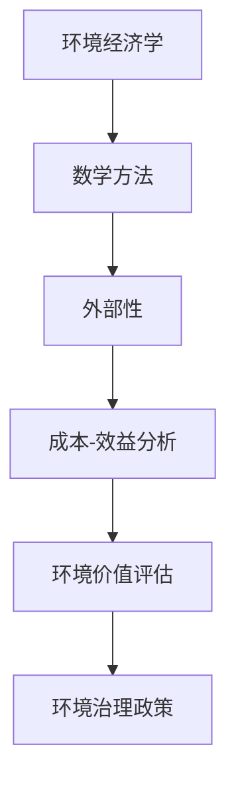
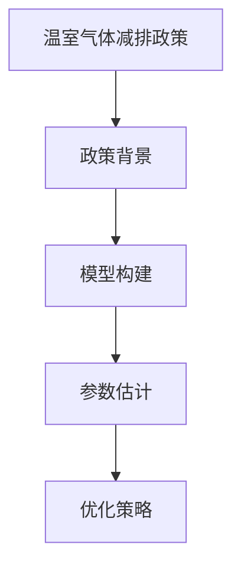
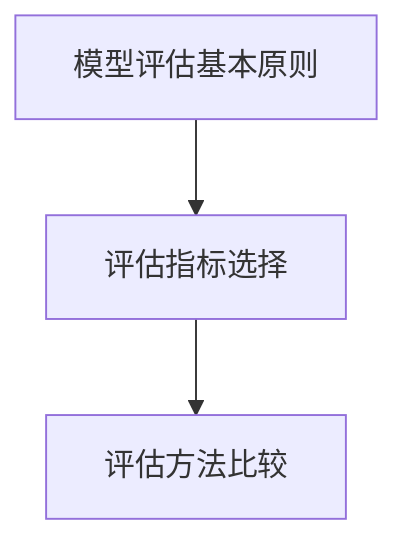
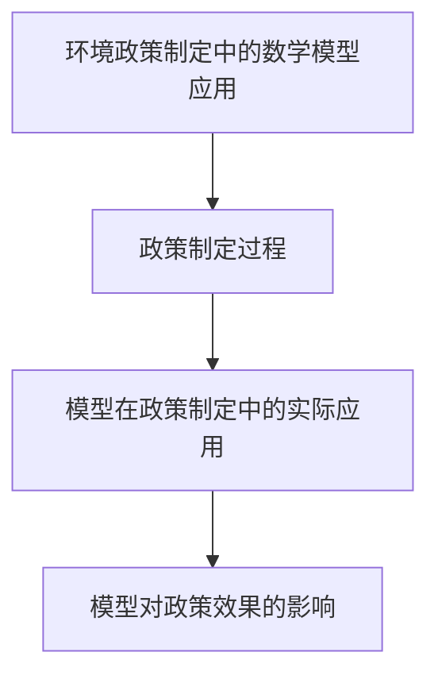

                 

### 《数学与环境经济学：环境政策的数学评估》

> **关键词**：环境经济学、数学模型、政策评估、外部性、成本-效益分析、温室气体减排、水资源管理、风险评估

> **摘要**：本文旨在探讨数学方法在环境经济学中的应用，特别是如何利用数学模型对环境政策进行评估。文章首先介绍了环境经济学的基本概念和数学方法，然后详细阐述了环境政策中的数学模型及其应用，最后讨论了数学模型评估的方法和环境政策与数学模型的整合。通过实例分析，本文展示了数学方法在环境政策制定和评估中的重要作用，并提出了未来研究的方向。

### 《数学与环境经济学：环境政策的数学评估》目录大纲

#### 第一部分：数学与环境经济学概述

- **第1章**：数学与环境经济学基础
  - **1.1 环境经济学的定义与历史**
    - **1.1.1 环境经济学的起源与发展**
    - **1.1.2 环境经济学的研究对象与方法**
  - **1.2 数学方法在环境经济学中的应用**
    - **1.2.1 模型和公理方法**
    - **1.2.2 数理经济学方法**
    - **1.2.3 概率论和统计学方法**
  - **1.3 环境经济学的核心概念**
    - **1.3.1 外部性**
    - **1.3.2 环境成本与效益分析**
    - **1.3.3 环境治理政策**

#### 第二部分：环境政策中的数学模型

- **第2章**：环境政策数学模型概述
  - **2.1 数学模型在环境政策中的作用**
    - **2.1.1 模型构建的基本原则**
    - **2.1.2 模型应用的范围**
  - **2.2 环境经济模型**
    - **2.2.1 成本-效益分析**
    - **2.2.2 成本-分配分析**
    - **2.2.3 环境价值评估方法**
  - **2.3 环境博弈模型**
    - **2.3.1 环境博弈的基本概念**
    - **2.3.2 环境博弈的策略分析**
    - **2.3.3 案例研究**

#### 第三部分：数学模型评估与环境经济学

- **第3章**：环境政策数学模型应用
  - **3.1 温室气体减排模型**
    - **3.1.1 温室气体减排政策背景**
    - **3.1.2 温室气体减排模型构建**
    - **3.1.3 模型参数估计与优化**
  - **3.2 水资源管理模型**
    - **3.2.1 水资源管理现状**
    - **3.2.2 水资源管理模型构建**
    - **3.2.3 模型应用案例分析**
  - **3.3 风险评估模型**
    - **3.3.1 风险评估方法**
    - **3.3.2 风险评估模型构建**
    - **3.3.3 风险评估应用实例**

#### 第四部分：数学模型评估与环境经济学

- **第4章**：数学模型评估方法
  - **4.1 模型评估的基本原则**
    - **4.1.1 评估指标选择**
    - **4.1.2 评估方法比较**
  - **4.2 数学模型优化方法**
    - **4.2.1 优化算法概述**
    - **4.2.2 模型参数优化**
    - **4.2.3 模型结构优化**
  - **4.3 数学模型应用案例**
    - **4.3.1 模型应用案例分析**
    - **4.3.2 模型优化的实际应用**

#### 第五部分：环境政策与数学模型整合

- **第5章**：环境政策与数学模型整合
  - **5.1 环境政策制定中的数学模型应用**
    - **5.1.1 政策制定过程中的数学模型**
    - **5.1.2 模型在政策制定中的实际应用**
    - **5.1.3 模型对政策效果的影响**
  - **5.2 数学模型在环境经济政策评估中的应用**
    - **5.2.1 政策评估的基本流程**
    - **5.2.2 数学模型在政策评估中的应用**
    - **5.2.3 政策评估案例分析**

#### 第六部分：数学与环境经济学的未来展望

- **第6章**：数学与环境经济学的挑战与趋势
  - **6.1 挑战与问题**
    - **6.1.1 数学模型在环境政策应用中的挑战**
    - **6.1.2 环境经济学的未来发展方向**
    - **6.1.3 面临的伦理与道德问题**
  - **6.2 发展趋势**
    - **6.2.1 新兴数学方法在环境经济学中的应用**
    - **6.2.2 数学与环境经济学跨学科融合**
    - **6.2.3 国际合作与标准化**

#### 第七部分：数学与环境经济学的研究方法与创新

- **第7章**：数学与环境经济学的研究方法与创新
  - **7.1 研究方法**
    - **7.1.1 经典研究方法回顾**
    - **7.1.2 新兴研究方法介绍**
    - **7.1.3 研究方法的选择与应用**
  - **7.2 创新与实践**
    - **7.2.1 创新思维与环境经济学**
    - **7.2.2 实践案例分析**
    - **7.2.3 创新技术的环境经济学应用**

#### 附录

- **附录A**：数学与环境经济学常用工具
  - **A.1 常用数学软件与工具**
  - **A.2 环境经济学相关资源**

### 第一部分：数学与环境经济学概述

#### 第1章：数学与环境经济学基础

### 1.1 环境经济学的定义与历史

#### 1.1.1 环境经济学的起源与发展

环境经济学作为一门交叉学科，起源于20世纪60年代。当时，随着工业革命带来的环境污染问题日益严重，经济学家开始关注环境与经济之间的关系。1970年代，美国经济学家保罗·安格鲁·莫尔斯（Paul A. Samuelson）和罗伯特·索洛（Robert M. Solow）等学者对环境经济学的概念和理论进行了系统阐述，标志着环境经济学作为一个独立学科的诞生。

在随后的几十年里，环境经济学迅速发展，形成了自己的理论体系和研究方法。环境经济学的研究对象包括环境污染、自然资源管理、环境政策设计、环境成本与效益分析等方面。随着全球环境问题的加剧，环境经济学的研究领域不断扩大，逐渐涵盖了气候变化、生态系统服务、环境保护与可持续发展等多个方面。

#### 1.1.2 环境经济学的研究对象与方法

环境经济学的研究对象是环境与经济之间的相互作用，旨在理解和解决环境问题对经济发展的影响，以及经济发展对环境质量的冲击。具体来说，环境经济学的研究对象包括以下几个方面：

1. **环境污染与治理**：研究环境污染的原因、影响和治理措施，探讨如何通过经济手段来减少污染和保护环境。
2. **自然资源管理**：研究自然资源的开发、利用和保护，探讨如何实现资源的可持续利用和生态环境的可持续发展。
3. **环境政策设计**：研究环境政策的设计和实施，探讨如何通过政策手段来引导经济行为，促进环境保护。
4. **环境成本与效益分析**：研究环境成本和效益的计算方法，为环境政策的制定提供科学依据。

在研究方法上，环境经济学主要采用以下几种方法：

1. **数理经济学方法**：利用数学模型和计量经济学方法来分析环境经济问题，如成本-效益分析、成本-分配分析、环境价值评估等。
2. **概率论和统计学方法**：用于分析环境风险和不确定性，如风险评估模型、概率分布函数等。
3. **模型构建与模拟**：通过构建经济-环境模型，模拟不同政策情景下经济和环境的变化，为政策制定提供参考。
4. **实证分析**：通过收集和整理相关数据，运用统计学和计量经济学方法对环境经济问题进行实证分析，验证理论假设。

### 1.2 数学方法在环境经济学中的应用

数学方法在环境经济学中的应用非常广泛，是解决环境经济问题的有力工具。下面将介绍几种常用的数学方法：

#### 1.2.1 模型和公理方法

模型是环境经济学研究的重要工具，它通过简化和抽象现实世界中的复杂现象，帮助研究者分析和理解环境经济问题。模型可以分为以下几个层次：

1. **概念模型**：用文字和符号描述环境经济问题的基本结构和关系，如成本-效益分析模型、外部性模型等。
2. **数学模型**：用数学方程和公式描述环境经济问题的定量关系，如线性规划模型、博弈论模型等。
3. **计算机模拟模型**：通过计算机模拟和仿真，对环境经济问题进行定量分析和预测。

公理方法是指基于一组基本假设和原则来构建模型的方法。在环境经济学中，公理方法主要用于构建经济行为模型和福利经济学模型。例如，成本-效益分析模型通常基于以下几个基本假设：

- 成本和效益可以用货币单位进行衡量。
- 经济行为者总是追求最大化自身利益。
- 政策决策者具有完全信息。

#### 1.2.2 数理经济学方法

数理经济学方法是指利用数学工具和理论来分析和解决经济问题的方法。在环境经济学中，数理经济学方法主要用于：

1. **成本-效益分析**：通过比较项目或政策的经济成本和效益，评估其经济合理性。
2. **外部性分析**：研究外部性对经济行为的影响，探讨如何通过政策手段来内部化外部成本。
3. **环境价值评估**：通过计算环境资源的价值，为环境保护提供经济依据。

数理经济学方法包括以下几种：

1. **线性规划**：通过线性方程组来优化目标函数，常用于资源分配和环境治理问题的求解。
2. **博弈论**：研究经济主体在策略互动中的决策和均衡，常用于环境博弈问题的分析。
3. **经济学模型**：如理性预期模型、供需模型等，用于分析经济行为和环境变化的动态过程。

#### 1.2.3 概率论和统计学方法

概率论和统计学方法在环境经济学中的应用主要在于处理不确定性和风险问题。以下是一些常用的概率论和统计学方法：

1. **概率分布**：用于描述环境变量（如污染浓度、降雨量等）的概率分布，帮助研究者评估环境风险。
2. **统计模型**：如回归模型、时间序列模型等，用于分析环境与经济变量之间的相关性和因果关系。
3. **风险评估**：通过计算概率分布和期望损失，评估环境事故或自然灾害对经济的影响。

### 1.3 环境经济学的核心概念

#### 1.3.1 外部性

外部性是指一个经济主体的行为对其他经济主体产生的非市场影响。在环境经济学中，外部性通常指的是环境污染和自然资源开发对生态环境的影响。外部性可以分为以下几种：

1. **正外部性**：一个经济主体的行为对其他经济主体产生了正面的非市场影响，如植树造林带来的生态效益。
2. **负外部性**：一个经济主体的行为对其他经济主体产生了负面的非市场影响，如工厂排放的污染物对周边居民的健康影响。
3. **内部化**：通过政策手段将外部成本或外部效益纳入市场价格体系，使经济主体的行为更加符合社会效益。

#### 1.3.2 环境成本与效益分析

环境成本与效益分析是环境经济学研究的重要内容，旨在计算环境资源的价值，为环境保护提供经济依据。环境成本包括以下几个方面：

1. **直接成本**：如污染治理成本、环境保护设施建设成本等。
2. **间接成本**：如生态环境损失、人类健康损失等。
3. **机会成本**：如因环境保护而放弃的经济活动收益。

环境效益包括以下几个方面：

1. **直接效益**：如改善空气质量、减少水污染等。
2. **间接效益**：如提高人类生活质量、维护生态平衡等。
3. **长远效益**：如减少气候变化风险、保障资源可持续利用等。

环境成本与效益分析的方法包括：

1. **成本-效益分析**：通过比较项目或政策的经济成本和效益，评估其经济合理性。
2. **成本-分配分析**：将环境成本在不同利益相关者之间进行合理分配。
3. **环境价值评估**：通过计算环境资源的价值，为环境保护提供经济依据。

#### 1.3.3 环境治理政策

环境治理政策是指政府或其他权力机构为解决环境问题而制定的政策措施。环境治理政策主要包括以下几个方面：

1. **法律法规**：通过立法手段规范经济主体的环境行为，如环境保护法、大气污染防治法等。
2. **经济激励**：通过税收优惠、补贴等手段鼓励企业采取环保措施，如碳税、可再生能源补贴等。
3. **公众参与**：通过宣传教育、公众参与等方式提高公众的环保意识，促进环境保护。
4. **国际合作**：通过国际合作解决跨国环境问题，如气候变化、跨境污染等。

### 1.4 小结

本章介绍了环境经济学的定义与历史、研究对象与方法、核心概念以及数学方法在环境经济学中的应用。通过本章的学习，读者可以了解环境经济学的基本概念和数学方法，为进一步学习环境政策数学评估打下基础。

### 第二部分：环境政策中的数学模型

#### 第2章：环境政策数学模型概述

### 2.1 数学模型在环境政策中的作用

数学模型在环境政策中起着至关重要的作用，它为政策制定者提供了科学的决策依据，帮助他们在复杂的现实世界中找到最优解决方案。数学模型在环境政策中的作用主要体现在以下几个方面：

#### 2.1.1 模型构建的基本原则

构建环境政策数学模型时，需要遵循以下基本原则：

1. **简化与抽象**：将复杂的现实问题进行简化和抽象，抓住主要矛盾和关键因素，以便于分析和求解。
2. **一致性**：模型内部变量和参数之间应保持逻辑一致性，确保模型的有效性和可靠性。
3. **可验证性**：模型应基于实际数据和理论假设，通过实证分析验证模型的有效性和适用性。
4. **灵活性**：模型应具有一定的灵活性，能够适应不同政策情景和参数变化。

#### 2.1.2 模型应用的范围

数学模型在环境政策中的应用范围非常广泛，涵盖了环境污染治理、自然资源管理、环境价值评估、环境风险分析等多个领域。具体来说，数学模型在以下方面发挥着重要作用：

1. **成本-效益分析**：通过比较项目或政策的经济成本和效益，评估其经济合理性，为决策提供依据。
2. **外部性分析**：研究外部性对经济行为的影响，探讨如何通过政策手段来内部化外部成本。
3. **环境价值评估**：计算环境资源的价值，为环境保护提供经济依据。
4. **环境风险管理**：评估环境事故或自然灾害对经济的影响，为风险防控提供依据。
5. **政策评估**：对已实施政策的效果进行评估，为政策调整提供依据。

### 2.2 环境经济模型

环境经济模型是用于分析环境与经济之间相互作用的一类数学模型。下面介绍几种常用的环境经济模型：

#### 2.2.1 成本-效益分析

成本-效益分析是一种评估项目或政策经济合理性的方法，它通过比较项目或政策的经济成本和效益，确定其是否值得实施。成本-效益分析的基本步骤如下：

1. **确定项目或政策的目标**：明确项目或政策的预期目标和效果。
2. **计算成本**：包括直接成本和间接成本，如建设成本、运营成本、生态环境损失等。
3. **计算效益**：包括直接效益和间接效益，如经济效益、社会效益、环境效益等。
4. **计算净效益**：净效益等于效益减去成本。
5. **评估经济合理性**：如果净效益为正，说明项目或政策具有经济合理性；如果净效益为负，说明项目或政策的经济效益较低。

#### 2.2.2 成本-分配分析

成本-分配分析是一种将环境成本在不同利益相关者之间进行合理分配的方法。成本-分配分析的基本步骤如下：

1. **确定成本分担原则**：根据公平性、效率性、责任性等原则确定成本分担原则。
2. **计算各方的成本**：根据各方的成本贡献度，计算各方应分担的成本。
3. **进行成本分配**：将总成本按照分担原则分配到各利益相关者。
4. **评估成本分配的合理性**：通过比较成本分配结果与原则，评估成本分配的合理性。

#### 2.2.3 环境价值评估方法

环境价值评估是一种计算环境资源价值的方法，它为环境保护提供经济依据。常用的环境价值评估方法包括以下几种：

1. **市场价值法**：通过市场价格评估环境资源的价值，适用于市场机制完善的情况。
2. **替代市场法**：通过其他市场的价格信息来评估环境资源价值，适用于直接市场价格不明确的情况。
3. **调查评估法**：通过问卷调查、访谈等方法了解公众对环境资源价值的评估，适用于缺乏市场价格信息的情况。
4. **影子价格法**：通过计算环境资源在无市场条件下的影子价格来评估其价值，适用于市场机制不完善的情况。

### 2.3 环境博弈模型

环境博弈模型是一种用于分析环境政策制定和实施的数学模型，它通过描述不同经济主体之间的策略互动和利益分配，评估不同政策方案的可行性和效果。环境博弈模型的基本概念包括以下几种：

1. **博弈方**：参与环境博弈的经济主体，如政府、企业、公众等。
2. **策略**：博弈方在博弈过程中可以选择的行动方案，如排放量、投资额等。
3. **支付**：博弈方在博弈结束后获得的收益或损失，包括经济利益和环境效益。
4. **均衡**：博弈各方选择的策略组合，使得各方利益最大化。

环境博弈模型的应用主要包括以下方面：

1. **政策制定**：通过博弈模型分析不同政策方案的可行性和效果，为政策制定提供依据。
2. **政策实施**：通过博弈模型模拟政策实施过程中的策略互动和利益分配，评估政策实施的效果。
3. **国际合作**：通过博弈模型分析跨国环境问题中的合作与竞争关系，推动国际合作。

### 2.4 案例研究

为了更好地理解环境政策数学模型的应用，下面介绍几个案例研究。

#### 案例一：温室气体减排政策

温室气体减排政策是当前国际社会关注的焦点之一。通过成本-效益分析模型，可以评估不同减排政策的成本和效益，为政策制定提供依据。具体步骤如下：

1. **确定减排目标**：设定温室气体减排的具体目标和时间表。
2. **计算减排成本**：包括技术改造成本、运营成本、能源成本等。
3. **计算减排效益**：包括减少温室气体排放对气候变化的影响、改善空气质量等。
4. **评估经济合理性**：通过比较减排成本和减排效益，评估减排政策的可行性。

#### 案例二：水资源管理政策

水资源管理政策是保障水资源可持续利用的关键。通过成本-分配分析模型，可以合理分配水资源管理成本，提高水资源利用效率。具体步骤如下：

1. **确定水资源管理目标**：设定水资源管理的具体目标和标准。
2. **计算水资源管理成本**：包括监测成本、治理成本、管理成本等。
3. **确定成本分担原则**：根据公平性、效率性、责任性等原则确定成本分担原则。
4. **进行成本分配**：将水资源管理成本分配到各利益相关者。
5. **评估成本分配的合理性**：通过比较成本分配结果与原则，评估成本分配的合理性。

#### 案例三：环境价值评估

环境价值评估是计算环境资源价值的重要方法，为环境保护提供经济依据。通过市场价值法、替代市场法、调查评估法等方法，可以评估森林、湿地、水域等环境资源的价值。具体步骤如下：

1. **确定评估目标**：明确需要评估的环境资源类型和价值。
2. **收集数据**：收集相关环境资源的市场价格、替代市场价格、调查数据等。
3. **选择评估方法**：根据数据特点和环境资源类型选择合适的评估方法。
4. **计算环境资源价值**：根据评估方法计算环境资源的价值。
5. **评估评估结果的合理性**：通过比较评估结果与市场价值、替代市场价格等，评估评估结果的合理性。

### 2.5 小结

本章介绍了数学模型在环境政策中的作用、环境经济模型、环境博弈模型以及相关案例研究。通过本章的学习，读者可以了解数学模型在环境政策中的重要作用，掌握常用的数学模型和方法，为环境政策的制定和评估提供科学依据。

### 第三部分：数学模型评估与环境经济学

#### 第3章：环境政策数学模型应用

### 3.1 温室气体减排模型

温室气体减排模型是环境经济学中的一种重要模型，用于分析温室气体减排政策的效果和可行性。本节将介绍温室气体减排模型的背景、构建方法、参数估计与优化策略。

#### 3.1.1 温室气体减排政策背景

温室气体减排政策是全球应对气候变化的重要措施。随着全球温室气体排放量的不断上升，气候变化带来的影响日益严重，包括极端气候事件、海平面上升、生态系统破坏等。为了减缓气候变化，各国纷纷制定并实施温室气体减排政策。温室气体减排政策的目标是通过减少温室气体排放，降低大气中的温室气体浓度，从而减轻气候变化的影响。

#### 3.1.2 温室气体减排模型构建

温室气体减排模型是一种经济-环境模型，用于分析温室气体减排政策对经济和环境的影响。模型的基本结构包括以下几个部分：

1. **经济系统**：描述经济系统的运行机制，包括能源消费、工业生产、交通运输等。
2. **温室气体排放**：基于经济活动数据，计算不同部门、不同行业的温室气体排放量。
3. **减排技术**：描述温室气体减排技术的作用，包括减排效率、成本等。
4. **政策效应**：分析不同减排政策对温室气体排放的影响，包括政策实施的范围、强度等。
5. **环境影响**：评估温室气体减排政策对环境的影响，包括空气质量、生态系统变化等。

构建温室气体减排模型时，需要考虑以下几个因素：

1. **数据来源**：收集相关经济、能源、环境等数据，确保数据的准确性和完整性。
2. **模型假设**：根据实际情况进行合理的假设，如经济增长率、能源价格、减排技术进步等。
3. **模型结构**：根据研究目标和数据特点，选择合适的模型结构和方法。
4. **参数估计**：利用历史数据和理论假设，估计模型中的参数值。

#### 3.1.3 参数估计与优化策略

参数估计是构建温室气体减排模型的关键步骤，直接影响模型的有效性和可靠性。参数估计的方法主要包括以下几种：

1. **最小二乘法**：通过最小化预测误差平方和，估计模型参数。
2. **梯度下降法**：通过迭代更新参数，逐步优化模型。
3. **贝叶斯估计**：利用贝叶斯统计方法，估计模型参数的概率分布。

优化策略是指通过调整模型参数，优化减排政策的效果。优化策略的方法主要包括以下几种：

1. **线性规划**：通过线性方程组优化目标函数，确定最优减排策略。
2. **动态规划**：通过递归关系优化目标函数，确定最优减排策略。
3. **遗传算法**：通过模拟自然选择和遗传进化，优化模型参数。

在实际应用中，参数估计和优化策略需要结合具体情况进行调整。例如，在考虑温室气体减排政策时，需要考虑减排成本、减排技术效率、政策实施范围等因素，选择合适的参数估计方法和优化策略。

#### 3.1.4 案例研究

为了更好地理解温室气体减排模型的构建和应用，下面介绍一个实际案例。

**案例：中国温室气体减排政策**

中国是全球最大的温室气体排放国，为应对气候变化，中国制定了一系列温室气体减排政策。通过构建温室气体减排模型，可以分析中国温室气体减排政策的效果和可行性。

1. **数据收集**：收集中国能源消费、工业生产、交通运输等数据，以及温室气体排放量、减排技术效率等数据。
2. **模型构建**：根据数据特点和减排政策目标，选择合适的模型结构和方法，构建温室气体减排模型。
3. **参数估计**：利用历史数据和理论假设，估计模型参数值。
4. **模型优化**：通过线性规划、动态规划等方法，优化减排政策效果。

通过温室气体减排模型，可以分析不同减排政策对中国温室气体排放的影响，为政策制定提供科学依据。例如，通过模型分析，可以确定最佳减排技术组合、最佳政策实施范围和强度，从而实现最有效的温室气体减排效果。

#### 3.2 水资源管理模型

水资源管理模型是用于分析水资源管理政策效果和优化水资源利用的数学模型。本节将介绍水资源管理模型的背景、构建方法、应用案例。

#### 3.2.1 水资源管理现状

水资源是生命之源、生态之本，对经济发展和社会进步具有重要意义。然而，全球水资源分布不均衡，许多地区面临水资源短缺和污染问题。为了解决水资源问题，各国政府和国际组织纷纷制定水资源管理政策，如水资源分配、水资源保护、水资源利用等。

水资源管理模型旨在通过数学方法分析和优化水资源管理，实现水资源的高效利用和可持续发展。水资源管理模型的主要目标是：

1. **保障水资源供应**：确保不同地区、不同用户的水资源需求得到满足。
2. **优化水资源利用**：通过合理分配水资源，提高水资源利用效率。
3. **保护水资源质量**：防止水资源污染，保障水资源质量。

#### 3.2.2 水资源管理模型构建

水资源管理模型通常包括以下几个部分：

1. **水资源供需模型**：描述水资源的供需关系，分析不同水资源利用方案的影响。
2. **水资源污染模型**：描述水资源的污染过程，分析污染源和污染物的传播规律。
3. **水资源优化模型**：通过优化算法，确定最佳水资源利用方案，实现水资源的高效利用。

构建水资源管理模型时，需要考虑以下几个因素：

1. **数据来源**：收集水资源供需、污染、利用等数据，确保数据的准确性和完整性。
2. **模型假设**：根据实际情况进行合理的假设，如水资源需求增长率、污染源排放量等。
3. **模型结构**：根据研究目标和数据特点，选择合适的模型结构和方法。
4. **参数估计**：利用历史数据和理论假设，估计模型参数值。

#### 3.2.3 模型应用案例分析

为了更好地理解水资源管理模型的应用，下面介绍一个实际案例。

**案例：美国加利福尼亚州水资源管理**

美国加利福尼亚州水资源丰富，但供需矛盾突出，水资源管理面临巨大挑战。通过水资源管理模型，可以优化水资源利用，保障供水需求。

1. **数据收集**：收集加利福尼亚州水资源供需、污染、利用等数据。
2. **模型构建**：根据数据特点和水资源管理目标，选择合适的水资源管理模型。
3. **参数估计**：利用历史数据和理论假设，估计模型参数值。
4. **模型优化**：通过优化算法，确定最佳水资源利用方案。

通过水资源管理模型，可以分析不同水资源利用方案的影响，为水资源管理决策提供科学依据。例如，通过模型分析，可以确定最佳供水分配方案、最佳污染治理措施，从而实现水资源的高效利用和可持续发展。

#### 3.3 风险评估模型

风险评估模型是用于评估环境风险和制定风险应对策略的数学模型。本节将介绍风险评估模型的基本概念、构建方法、应用案例。

#### 3.3.1 风险评估方法

风险评估方法是指通过评估环境风险的概率和影响，确定风险程度和风险应对策略的方法。风险评估方法主要包括以下几种：

1. **定性风险评估**：通过专家判断和经验，评估环境风险的概率和影响。
2. **定量风险评估**：通过数据分析和计算，评估环境风险的概率和影响。
3. **综合风险评估**：结合定性和定量评估方法，全面评估环境风险。

风险评估方法的选择取决于风险评估的目标和实际情况。例如，在环境事故风险评估中，可以采用定量评估方法，通过计算事故概率和损失大小，确定风险程度。

#### 3.3.2 风险评估模型构建

风险评估模型是一种用于评估环境风险的数学模型，通常包括以下几个部分：

1. **风险识别**：识别可能导致环境风险的因素，如污染物排放、自然灾害等。
2. **风险分析**：分析可能导致环境风险的因素的概率和影响，确定风险程度。
3. **风险评价**：评估环境风险对经济和社会的影响，确定风险等级。
4. **风险应对**：制定风险应对策略，降低风险等级。

构建风险评估模型时，需要考虑以下几个因素：

1. **数据来源**：收集相关环境数据、事故案例等，确保数据的准确性和完整性。
2. **模型假设**：根据实际情况进行合理的假设，如事故概率、损失大小等。
3. **模型结构**：根据研究目标和数据特点，选择合适的模型结构和方法。
4. **参数估计**：利用历史数据和理论假设，估计模型参数值。

#### 3.3.3 模型应用案例分析

为了更好地理解风险评估模型的应用，下面介绍一个实际案例。

**案例：化学品泄漏风险评估**

某化工企业在生产过程中发生化学品泄漏事故，可能对周边环境造成严重污染。通过风险评估模型，可以评估事故风险，制定应对措施。

1. **数据收集**：收集化学品泄漏事故案例、周边环境数据等。
2. **模型构建**：根据数据特点和风险评估目标，选择合适的风险评估模型。
3. **参数估计**：利用历史数据和理论假设，估计模型参数值。
4. **风险评估**：通过模型评估事故风险的概率和影响。
5. **风险应对**：制定风险应对策略，降低事故风险等级。

通过风险评估模型，可以评估化学品泄漏事故的风险程度，为风险应对提供科学依据。例如，通过模型分析，可以确定最佳事故应急方案、最佳环境保护措施，从而降低事故风险。

#### 3.4 小结

本章介绍了温室气体减排模型、水资源管理模型和风险评估模型的构建方法、参数估计与优化策略以及应用案例。通过本章的学习，读者可以了解不同环境政策数学模型的构建和应用，掌握风险评估方法，为环境政策的制定和实施提供科学依据。

### 第四部分：数学模型评估方法

#### 第4章：数学模型评估方法

### 4.1 模型评估的基本原则

在环境经济学中，数学模型的评估方法至关重要，它直接关系到模型结果的可靠性和适用性。为了确保模型评估的科学性和有效性，需要遵循以下基本原则：

#### 4.1.1 评估指标选择

评估指标的选择是模型评估的关键步骤。合理的评估指标能够准确地反映模型预测结果的准确性、稳定性和可靠性。在选择评估指标时，需要考虑以下几个方面：

1. **准确性**：评估指标应能够准确反映模型预测结果与实际结果的差异。常用的准确性评估指标包括均方误差（Mean Squared Error, MSE）、均方根误差（Root Mean Squared Error, RMSE）等。
2. **稳定性**：评估指标应能够衡量模型预测结果的稳定性。稳定性较好的模型能够减少预测误差的波动，提高预测的可靠性。常用的稳定性评估指标包括平均绝对误差（Mean Absolute Error, MAE）等。
3. **可靠性**：评估指标应能够衡量模型预测结果的可靠性。可靠性较好的模型能够在不同条件下保持稳定的表现。常用的可靠性评估指标包括相关系数（Correlation Coefficient）等。

#### 4.1.2 评估方法比较

在评估数学模型时，往往需要使用多种评估方法，以全面了解模型的性能。不同的评估方法具有不同的优缺点，因此需要比较和选择合适的评估方法。以下是比较常用的几种评估方法：

1. **均方误差（MSE）和均方根误差（RMSE）**：这两种方法是最常用的评估指标，能够衡量预测结果与实际结果之间的平均偏差。RMSE是对MSE的平方根，数值越小表示预测结果越接近实际结果。
2. **平均绝对误差（MAE）**：MAE是预测结果与实际结果之间绝对误差的平均值，能够反映预测结果的偏差大小。与RMSE相比，MAE对异常值的影响较小。
3. **相关系数（Correlation Coefficient）**：相关系数衡量预测结果与实际结果之间的线性关系强度，取值范围在-1到1之间。接近1表示高度正相关，接近-1表示高度负相关，接近0表示无相关性。
4. **决策边界法（Decision Boundary Method）**：决策边界法通过绘制预测结果与实际结果的决策边界，直观评估模型的性能。该方法适用于分类问题，能够识别模型预测的边界。
5. **交叉验证（Cross-Validation）**：交叉验证是一种评估模型性能的常见方法，通过将数据集划分为多个子集，每次使用其中一个子集作为验证集，其他子集作为训练集，重复多次计算模型性能指标，从而综合评估模型的性能。

#### 4.1.3 评估指标的计算方法

在评估数学模型时，需要计算一系列评估指标，以全面了解模型的性能。以下是一些常见评估指标的计算方法：

1. **均方误差（MSE）**：
   \[
   MSE = \frac{1}{n} \sum_{i=1}^{n} (y_i - \hat{y}_i)^2
   \]
   其中，\(y_i\) 是实际结果，\(\hat{y}_i\) 是预测结果，\(n\) 是数据点的数量。

2. **均方根误差（RMSE）**：
   \[
   RMSE = \sqrt{MSE}
   \]

3. **平均绝对误差（MAE）**：
   \[
   MAE = \frac{1}{n} \sum_{i=1}^{n} |y_i - \hat{y}_i|
   \]

4. **相关系数（Correlation Coefficient）**：
   \[
   \rho = \frac{\sum_{i=1}^{n} (y_i - \bar{y}) (\hat{y}_i - \bar{\hat{y}})}{\sqrt{\sum_{i=1}^{n} (y_i - \bar{y})^2 \sum_{i=1}^{n} (\hat{y}_i - \bar{\hat{y}})^2}}
   \]
   其中，\(\bar{y}\) 和 \(\bar{\hat{y}}\) 分别是实际结果和预测结果的平均值。

#### 4.1.4 评估方法的选择与应用

在选择评估方法时，需要根据具体的研究问题和数据特点进行综合考虑。以下是一些常见情况下的评估方法选择：

1. **准确性要求高**：当对预测准确性要求较高时，可以选择使用MSE、RMSE等评估指标。
2. **稳定性要求高**：当对预测稳定性要求较高时，可以选择使用MAE等评估指标。
3. **需要可视化评估**：当需要直观了解模型性能时，可以选择使用决策边界法等可视化评估方法。
4. **需要评估模型泛化能力**：当需要评估模型在不同数据集上的表现时，可以选择使用交叉验证方法。

在实际应用中，需要根据具体情况进行综合考虑，选择合适的评估方法，以全面评估数学模型的性能。同时，评估方法的合理应用有助于发现模型中的潜在问题，为模型的改进和优化提供依据。

#### 4.2 数学模型优化方法

数学模型优化是提高模型性能的重要手段，通过调整模型参数和结构，可以使模型更好地适应数据特征，提高预测精度和稳定性。以下介绍几种常用的数学模型优化方法：

#### 4.2.1 优化算法概述

优化算法是数学模型优化的核心工具，通过迭代更新模型参数，逐步优化模型性能。常用的优化算法包括以下几种：

1. **梯度下降法（Gradient Descent）**：梯度下降法是一种基于梯度信息的优化算法，通过更新参数的梯度方向，逐步减少损失函数的值。梯度下降法分为批量梯度下降、随机梯度下降和批量随机梯度下降等变种。

2. **牛顿法（Newton's Method）**：牛顿法是一种基于二次梯度的优化算法，通过迭代求解目标函数的Hessian矩阵，更新模型参数。牛顿法在求解非线性优化问题时具有较高的收敛速度。

3. **遗传算法（Genetic Algorithm）**：遗传算法是一种模拟自然选择和遗传进化的优化算法，通过种群进化、交叉、变异等操作，逐步优化模型参数。遗传算法适用于复杂和非线性优化问题。

4. **粒子群优化算法（Particle Swarm Optimization, PSO）**：粒子群优化算法是一种基于群体智能的优化算法，通过模拟鸟群觅食行为，更新个体和群体的位置和速度，优化模型参数。

#### 4.2.2 模型参数优化

模型参数优化是提高模型性能的关键步骤，通过调整模型参数，可以使模型更好地适应数据特征。以下介绍几种常用的参数优化方法：

1. **基于梯度的参数优化**：基于梯度的参数优化方法利用目标函数的梯度信息，更新模型参数。梯度下降法、牛顿法等都是基于梯度的优化算法。这些方法适用于目标函数可微且梯度信息容易计算的情况。

2. **基于网格搜索的参数优化**：网格搜索方法通过遍历所有可能的参数组合，选择最优参数组合。这种方法计算量大，适用于参数较少且目标函数较简单的情况。

3. **基于遗传算法的参数优化**：遗传算法通过种群进化、交叉、变异等操作，逐步优化模型参数。这种方法适用于参数多、目标函数复杂的情况。

4. **基于贝叶斯优化的参数优化**：贝叶斯优化方法基于贝叶斯统计模型，通过经验模型和样本数据，优化模型参数。贝叶斯优化方法适用于参数优化过程中存在不确定性和非线性的情况。

#### 4.2.3 模型结构优化

模型结构优化是通过调整模型的结构，提高模型性能的方法。以下介绍几种常用的模型结构优化方法：

1. **正则化**：正则化方法通过引入正则化项，限制模型参数的取值范围，防止模型过拟合。常见的正则化方法包括L1正则化（Lasso）、L2正则化（Ridge）和弹性网（Elastic Net）等。

2. **集成方法**：集成方法通过组合多个基础模型，提高模型性能。常见的集成方法包括随机森林（Random Forest）、梯度提升树（Gradient Boosting Tree）和堆叠模型（Stacking）等。

3. **特征选择**：特征选择方法通过选择对目标变量影响较大的特征，提高模型性能。常见的特征选择方法包括基于信息的特征选择、基于模型的特征选择和基于过滤的特征选择等。

4. **神经网络结构优化**：神经网络结构优化是通过调整神经网络的层数、神经元个数等结构参数，提高模型性能。常见的神经网络结构优化方法包括卷积神经网络（CNN）、循环神经网络（RNN）和生成对抗网络（GAN）等。

在实际应用中，模型参数优化和模型结构优化需要结合具体情况进行综合考虑。通过合理的参数优化和结构优化，可以使模型更好地适应数据特征，提高预测精度和稳定性。

#### 4.3 数学模型应用案例

为了更好地理解数学模型优化方法的应用，以下介绍几个实际案例：

1. **案例一：空气质量预测模型**：利用梯度下降法和L2正则化方法，对空气质量预测模型进行参数优化和结构优化。通过调整模型参数和引入正则化项，提高模型预测精度和稳定性。

2. **案例二：交通流量预测模型**：利用遗传算法和神经网络结构优化方法，对交通流量预测模型进行参数优化和结构优化。通过种群进化、交叉、变异等操作，调整模型参数和结构，提高模型预测精度和稳定性。

3. **案例三：农作物产量预测模型**：利用贝叶斯优化方法和正则化方法，对农作物产量预测模型进行参数优化和结构优化。通过基于贝叶斯统计模型的优化方法，调整模型参数和引入正则化项，提高模型预测精度和稳定性。

通过这些实际案例，可以看出数学模型优化方法在提高模型性能方面的应用效果。合理的参数优化和结构优化有助于提高模型的预测精度和稳定性，为实际应用提供可靠的数据支持。

#### 4.4 小结

本章介绍了数学模型评估的基本原则、评估指标选择、评估方法比较以及数学模型优化方法。通过本章的学习，读者可以了解如何选择合适的评估指标和方法，优化数学模型参数和结构，提高模型性能。同时，读者还可以通过实际案例，掌握数学模型优化方法的应用技巧。

### 第五部分：环境政策与数学模型整合

#### 第5章：环境政策与数学模型整合

环境政策与数学模型的整合是环境经济学研究的重要领域，通过数学模型可以为环境政策的制定和实施提供科学依据。本章将探讨环境政策制定中的数学模型应用、数学模型在政策制定中的实际应用以及数学模型对政策效果的影响。

#### 5.1 环境政策制定中的数学模型应用

在环境政策制定过程中，数学模型发挥着至关重要的作用。通过数学模型，政策制定者可以模拟不同政策方案的效果，评估其经济成本和环境影响，从而制定出科学合理的政策。以下是数学模型在环境政策制定中的几个关键应用：

##### 5.1.1 成本-效益分析

成本-效益分析是环境政策制定中常用的数学模型，它通过比较政策实施的经济成本和预期效益，评估政策的经济合理性。政策制定者可以利用成本-效益分析模型，计算不同政策方案的直接成本（如治理设施建设成本、运营成本等）和间接成本（如生态环境损失、人类健康损失等），同时评估政策实施后的经济效益（如减少污染带来的健康效益、提高资源利用效率等）。通过成本-效益分析，政策制定者可以确定哪种政策方案在经济上最具可行性。

##### 5.1.2 外部性分析

外部性分析是另一类重要的数学模型，它用于分析环境政策对经济行为的影响，特别是外部成本和外部效益的内部化问题。政策制定者可以利用外部性分析模型，评估政策如何影响不同经济主体的行为，以及政策实施后可能产生的正外部性和负外部性。例如，通过分析环境污染的负外部性，政策制定者可以设计出适当的税费政策，如碳税，以激励企业减少污染物排放。

##### 5.1.3 环境价值评估

环境价值评估是环境经济学中的一种重要方法，它通过计算环境资源的价值，为环境保护提供经济依据。政策制定者可以利用环境价值评估模型，评估自然资源的价值，如森林、湿地和水资源的价值，从而制定出合理的资源管理和保护政策。例如，通过计算生态系统的服务价值，政策制定者可以确定土地征用补偿标准，以平衡经济发展与环境保护的需求。

##### 5.1.4 风险评估

风险评估是环境政策制定中不可或缺的步骤，它用于评估政策实施过程中可能面临的风险，如自然灾害、环境污染事故等。政策制定者可以利用风险评估模型，评估不同风险的概率和影响，制定出有效的风险应对策略。例如，在制定洪水防控政策时，风险评估模型可以帮助确定最佳防洪设施建设方案。

#### 5.2 数学模型在政策制定中的实际应用

数学模型在环境政策制定中的实际应用案例丰富，下面通过几个具体案例来展示数学模型如何帮助政策制定者制定科学合理的政策。

##### 5.2.1 温室气体减排政策

全球气候变化问题是当前环境政策制定的核心议题之一。为了实现温室气体减排目标，许多国家制定了具体的减排政策。通过数学模型，如成本-效益分析模型和外部性分析模型，政策制定者可以评估不同减排政策的成本和效益。例如，通过成本-效益分析，政策制定者可以比较不同减排技术（如碳捕捉与储存、可再生能源替代等）的经济成本和减排效益，选择最具成本效益的减排方案。外部性分析则可以帮助政策制定者评估不同减排政策对经济行为的影响，如企业减排行为的激励和约束。

##### 5.2.2 水资源管理政策

水资源管理政策是保障水资源可持续利用的重要措施。通过数学模型，如水资源供需模型和环境价值评估模型，政策制定者可以评估水资源管理政策的效果。例如，通过水资源供需模型，政策制定者可以预测不同水资源管理政策下的供需状况，确定水资源分配方案，确保水资源供应的稳定和安全。通过环境价值评估模型，政策制定者可以评估水资源的经济价值，为水资源定价和市场化管理提供依据。

##### 5.2.3 环境保护政策

环境保护政策的制定需要综合考虑环境保护目标和经济发展的需求。通过数学模型，如成本-效益分析和风险评估模型，政策制定者可以评估不同环境保护政策的经济成本和环境影响。例如，在制定森林保护政策时，政策制定者可以利用成本-效益分析模型，评估森林保护的经济成本和生态效益，确定最佳保护方案。风险评估模型则可以帮助政策制定者评估森林火灾等自然灾害的风险，制定出有效的风险防范措施。

#### 5.3 数学模型对政策效果的影响

数学模型在政策制定中的应用不仅为政策制定提供了科学依据，还可以通过模拟政策效果，预测政策实施后的实际影响，从而优化政策设计。以下是数学模型对政策效果影响的几个方面：

##### 5.3.1 预测政策效果

通过数学模型，政策制定者可以预测政策实施后的效果，如减排效果、水资源利用效率等。这些预测结果可以帮助政策制定者评估政策的可行性和有效性，为政策调整和优化提供依据。例如，在温室气体减排政策中，通过数学模型可以预测不同减排措施的效果，从而确定最佳减排策略。

##### 5.3.2 评估政策成本

数学模型还可以帮助政策制定者评估政策的经济成本，如治理设施建设成本、运营成本等。这些成本评估结果可以帮助政策制定者确定财政预算和政策实施可行性。例如，在水资源管理政策中，通过数学模型可以评估不同水资源管理措施的成本，为政策制定者提供经济决策依据。

##### 5.3.3 优化政策设计

数学模型的应用不仅可以预测政策效果和评估政策成本，还可以通过模拟不同政策方案，优化政策设计。政策制定者可以利用数学模型，比较不同政策方案的效果和成本，选择最佳方案。例如，在环境保护政策中，通过数学模型可以评估不同环境保护措施的效果和成本，从而优化政策设计，实现环境保护和经济发展的双赢。

##### 5.3.4 指导政策实施

数学模型的应用还可以为政策实施提供指导。通过模拟政策实施过程，政策制定者可以预测政策实施过程中可能遇到的问题和挑战，提前制定应对措施。例如，在水资源管理政策中，通过数学模型可以预测不同水资源管理措施的效果和可能面临的问题，为政策实施提供指导。

#### 5.4 小结

本章介绍了数学模型在环境政策制定中的应用，包括成本-效益分析、外部性分析、环境价值评估和风险评估等。通过具体案例，展示了数学模型在政策制定中的实际应用，以及数学模型对政策效果的影响。通过本章的学习，读者可以了解如何利用数学模型制定科学合理的环境政策，为环境保护和经济可持续发展提供有力支持。

### 第六部分：数学与环境经济学的未来展望

#### 第6章：数学与环境经济学的挑战与趋势

数学与环境经济学的融合为解决全球环境问题提供了有力的工具，然而，这一领域仍面临着诸多挑战。同时，随着技术的进步和研究的深入，数学与环境经济学也展现出广阔的发展前景。

#### 6.1 挑战与问题

**6.1.1 数学模型在环境政策应用中的挑战**

尽管数学模型在环境政策中具有广泛的应用，但在实际应用中仍面临以下挑战：

1. **数据质量**：数学模型的有效性很大程度上依赖于数据的质量。然而，环境数据往往存在不完整、不准确、不统一等问题，这给模型构建和参数估计带来了困难。

2. **模型复杂度**：环境系统本身具有高度复杂性和非线性特征，构建准确的数学模型需要处理大量的变量和复杂的交互关系。这增加了模型求解的难度，也要求模型构建者具备高水平的专业知识。

3. **政策适应性**：环境政策往往涉及多个利益相关者和多个层级，政策的有效性需要在不同的政策情景下进行评估。数学模型需要具备足够的灵活性和适应性，以应对复杂多变的环境政策场景。

**6.1.2 环境经济学的未来发展方向**

为了克服上述挑战，环境经济学需要向以下几个方向发展：

1. **跨学科整合**：环境经济学需要与生态学、社会学、政策学等多个学科进行整合，形成多学科交叉的研究框架，以提高模型的应用性和解释力。

2. **大数据分析**：随着大数据技术的发展，环境经济学可以利用海量数据来分析和预测环境问题。通过大数据分析，可以更准确地识别环境问题的根源，提出更有针对性的解决方案。

3. **模型简化与优化**：为了应对数据质量和模型复杂度的问题，研究者需要开发简化的模型和高效的求解算法。这些模型和算法应能够快速适应新的数据和参数变化，提高模型的实用性。

**6.1.3 面临的伦理与道德问题**

环境经济学在解决环境问题的过程中，也面临着一系列伦理和道德问题：

1. **公平性**：环境政策的制定和实施需要考虑不同群体之间的公平性。然而，不同地区、不同社会群体在环境资源的使用和负担上存在显著差异，如何实现公平性是一个重要的伦理问题。

2. **透明度**：环境经济学的模型和结果需要具有透明度和可解释性，以确保政策制定和实施过程中的公正性和可信度。

3. **利益冲突**：环境经济学研究往往涉及复杂的利益关系和利益冲突。如何平衡不同利益相关者的需求，避免利益冲突，是一个重要的道德挑战。

#### 6.2 发展趋势

**6.2.1 新兴数学方法在环境经济学中的应用**

随着数学方法的发展，一系列新兴的数学方法被引入到环境经济学中，为解决复杂的环境问题提供了新的工具：

1. **机器学习**：机器学习技术在数据分析和模式识别方面具有显著优势。通过应用机器学习技术，可以更高效地处理大量环境数据，发现环境问题中的潜在模式。

2. **网络分析**：网络分析方法可以用于研究环境系统中的复杂网络结构，如生态网络、水网络等。通过分析网络结构，可以更好地理解环境系统的运作机制，为环境管理提供科学依据。

3. **系统动力学**：系统动力学是一种模拟复杂动态系统的方法，可以用于分析环境政策在不同时间尺度上的效果。通过系统动力学模型，可以预测环境政策的长远影响，为政策制定提供参考。

**6.2.2 数学与环境经济学跨学科融合**

跨学科融合是环境经济学未来发展的关键趋势：

1. **生态经济学**：生态经济学将生态学原理应用于环境经济学研究，通过整合生态学数据和经济学方法，更好地理解生态系统服务价值和环境经济互动。

2. **行为经济学**：行为经济学研究人类行为与决策的心理学因素，将其应用于环境经济学中，可以更准确地预测和引导人们的环境行为。

3. **政策分析**：政策分析领域的研究方法和技术可以与数学方法相结合，提高环境政策制定的科学性和有效性。

**6.2.3 国际合作与标准化**

随着全球环境问题的日益严重，国际合作在环境经济学中发挥着越来越重要的作用：

1. **全球数据共享**：通过国际合作，建立全球数据共享平台，提高数据质量和可用性，为全球环境经济学研究提供支持。

2. **模型标准化**：推动环境经济学模型的标准化，确保模型在不同国家和地区的适用性和一致性，提高环境政策评估的科学性。

3. **政策协调**：加强国际间的政策协调，共同应对全球性环境问题，如气候变化、跨境污染等。

#### 6.3 小结

数学与环境经济学的融合为解决环境问题提供了有力工具，但这一领域仍面临诸多挑战。未来，通过跨学科整合、大数据分析、新兴数学方法的应用以及国际合作，数学与环境经济学有望取得更大进展。同时，伦理和道德问题的关注也将推动环境经济学的可持续发展。

### 第七部分：数学与环境经济学的研究方法与创新

#### 第7章：数学与环境经济学的研究方法与创新

随着环境问题的日益严重，数学与环境经济学的交叉研究成为了当今学术界和实际应用领域的重要热点。本章将介绍数学与环境经济学的研究方法，探讨新兴研究方法的引入，并分析这些方法在实际应用中的创新与挑战。

#### 7.1 研究方法

**7.1.1 经典研究方法回顾**

数学与环境经济学研究经历了多年的发展，形成了一系列经典研究方法。这些方法为理解和解决环境问题提供了强有力的工具。以下是几种重要的经典研究方法：

1. **成本-效益分析**：成本-效益分析是评估政策或项目成本与效益的常用方法。通过比较项目或政策的成本与预期效益，研究者可以评估其经济合理性。成本-效益分析包括直接成本、间接成本和效益的估算，其核心公式为：

   \[
   \text{净效益} = \text{效益} - \text{成本}
   \]

2. **外部性分析**：外部性分析是研究经济行为对非市场方影响的方法。环境外部性，如污染排放对公共健康的影响，是环境经济学研究的重点。通过识别和内部化外部性，研究者可以提出有效的政策建议。

3. **环境价值评估**：环境价值评估是计算环境资源价值的常用方法。这些方法包括市场价值法、替代市场法、调查评估法和影子价格法等。环境价值评估为环境保护提供了经济依据，有助于制定科学的资源管理政策。

4. **博弈论**：博弈论是分析决策者之间策略互动的方法。在环境经济学中，博弈论用于研究政策制定者、企业和公众之间的互动，评估不同策略组合下的效果和稳定性。

**7.1.2 新兴研究方法介绍**

随着技术的进步，一系列新兴研究方法被引入到数学与环境经济学研究中，为解决复杂的环境问题提供了新的工具：

1. **机器学习**：机器学习技术在环境经济学中的应用越来越广泛。通过分析大量环境数据，机器学习算法可以识别环境问题中的潜在模式和趋势。例如，机器学习可以用于预测气候变化、分析生态系统服务价值等。

2. **大数据分析**：大数据分析是处理和分析海量环境数据的方法。通过大数据技术，研究者可以挖掘环境数据中的隐藏信息，为政策制定和评估提供有力支持。

3. **网络分析**：网络分析是研究复杂系统网络结构和动态特征的方法。在环境经济学中，网络分析可以用于研究生态系统网络、水资源网络等，揭示环境系统的复杂性和相互作用。

4. **系统动力学**：系统动力学是模拟复杂动态系统行为的模型构建方法。通过系统动力学模型，研究者可以模拟环境政策的长期影响，为政策制定提供科学依据。

**7.1.3 研究方法的选择与应用**

选择合适的研究方法对于数学与环境经济学研究至关重要。研究者应根据研究问题、数据特征和目标选择合适的方法。以下是一些常见研究方法的选择与应用建议：

1. **定性研究与定量研究相结合**：定性研究方法（如访谈、案例分析）可以深入了解环境问题的背景和复杂性，而定量研究方法（如统计分析、建模）可以提供精确的定量结果。结合使用定性研究和定量研究方法，可以更全面地理解环境问题。

2. **模型验证与参数估计**：在构建数学模型时，研究者需要验证模型的有效性和可靠性。通过参数估计，研究者可以确定模型参数的值，使其更符合实际情况。参数估计方法包括最小二乘法、最大似然估计等。

3. **数据可视化**：数据可视化是展示研究数据和分析结果的重要方法。通过可视化，研究者可以更直观地理解数据特征和模型结果，发现潜在的问题和趋势。

#### 7.2 创新与实践

**7.2.1 创新思维与环境经济学**

创新思维在环境经济学研究中具有重要意义。通过创新思维，研究者可以提出新的理论、方法和政策建议，为解决环境问题提供新的思路。以下是一些创新思维的方法：

1. **跨学科整合**：通过跨学科整合，研究者可以将不同领域的知识和方法应用于环境经济学研究，提出新的理论和模型。例如，将生态学、社会学和经济学方法整合，可以更全面地分析环境问题。

2. **逆向思维**：逆向思维是从相反的角度思考问题，提出与传统观点相反的假设。通过逆向思维，研究者可以挑战现有理论，提出新的研究方向。

3. **系统思维**：系统思维是一种整体观，强调不同部分之间的相互作用和整体效应。通过系统思维，研究者可以更全面地分析环境问题，提出综合性的解决方案。

**7.2.2 实践案例分析**

创新思维需要通过实践案例得到验证。以下是一些实际应用案例，展示了数学与环境经济学研究的创新成果：

1. **气候变化预测与政策评估**：通过机器学习和大数据分析技术，研究者可以构建准确的气候变化预测模型，为政策制定提供科学依据。例如，利用机器学习算法预测未来气候变化趋势，为减排政策提供数据支持。

2. **水资源管理优化**：通过系统动力学模型和网络分析技术，研究者可以优化水资源管理政策，提高水资源利用效率。例如，构建水资源供需模型，分析不同水资源管理措施的效果，为水资源分配提供决策支持。

3. **环境价值评估**：通过环境价值评估方法，研究者可以计算环境资源的经济价值，为资源保护和市场化管理提供依据。例如，利用替代市场法评估森林生态系统的服务价值，为森林保护政策提供经济依据。

**7.2.3 创新技术的环境经济学应用**

随着技术的进步，一系列创新技术被引入到环境经济学研究中，为解决环境问题提供了新的工具。以下是一些创新技术的环境经济学应用：

1. **区块链技术**：区块链技术具有去中心化、不可篡改和透明度高等特点，可以用于环境经济数据的收集、存储和管理。例如，利用区块链技术记录碳排放数据，实现碳排放的透明化和可追溯性。

2. **物联网技术**：物联网技术可以通过传感器网络实时收集环境数据，为环境监测和管理提供实时信息。例如，利用物联网技术监测空气质量，实现空气质量的实时监控和预警。

3. **人工智能**：人工智能技术可以在环境经济学中应用于数据分析和预测。例如，利用深度学习算法分析环境数据，预测环境变化趋势，为政策制定提供科学依据。

#### 7.3 小结

数学与环境经济学的交叉研究为解决环境问题提供了有力工具。经典研究方法和新兴研究方法的结合，以及创新思维和技术手段的引入，为环境经济学研究带来了新的机遇和挑战。通过不断探索和创新，数学与环境经济学将继续为全球环境保护和可持续发展贡献力量。

### 附录

#### 附录A：数学与环境经济学常用工具

**A.1 常用数学软件与工具**

- **MATLAB**：一款强大的数值计算和数据分析软件，广泛应用于环境经济学模型的构建和模拟。
- **Python编程环境**：提供了丰富的科学计算库，如NumPy、SciPy、Pandas等，是环境经济学研究的重要工具。
- **R语言应用**：一款专门用于统计分析和数据可视化的编程语言，广泛应用于环境价值评估和风险评估研究。

**A.2 环境经济学相关资源**

- **学术期刊与书籍推荐**
  - 《环境与资源经济学》（Journal of Environmental Economics and Management）
  - 《生态经济》（Ecological Economics）
  - 《环境科学》（Environmental Science & Technology）
- **研究机构与组织**
  - 国际环境经济学学会（International Society for Ecological Economics，ISEE）
  - 美国环境保护署（United States Environmental Protection Agency，EPA）
- **国际会议与研讨会**
  - 国际环境经济学年会（International Congress of Environmental and Resource Economists，ICER）
  - 环境与可持续发展国际会议（International Conference on Environment and Sustainable Development，ICESD）

### Mermaid 流程图与伪代码示例

**第1章：数学与环境经济学基础**

**核心概念与联系**



**成本-效益分析伪代码**

```plaintext
# 输入参数：成本数组C，效益数组B，决策变量x
# 输出参数：最大效益的决策变量x

max_Benefit = 0
for each x in possible_values:
    total_cost = sum(C[x])
    total_benefit = sum(B[x])
    if (total_benefit - total_cost) > max_Benefit:
        max_Benefit = total_benefit - total_cost
        optimal_x = x

return optimal_x
```

**第2章：环境政策数学模型概述**

**温室气体减排模型**



**温室气体减排模型伪代码**

```plaintext
// 输入参数：排放量E，减排成本C，减排效果E'
// 输出参数：最优减排策略

minimize_cost = infinity
for each x in possible_reductions:
    total_cost = C[x]
    total_reduction = E' - E
    if (total_reduction > 0) and (total_cost < minimize_cost):
        minimize_cost = total_cost
        optimal_reduction = x

return optimal_reduction
```

**第4章：数学模型评估方法**

**模型评估基本原则**



**优化算法伪代码**

```plaintext
// 输入参数：目标函数f(x)，约束条件g(x)
// 输出参数：最优解x*

// 初始化
x = random_value()
x_previous = x

// 迭代过程
while not_converged():
    // 计算梯度
    gradient = calculate_gradient(f(x), x)
    
    // 更新解
    x = x - learning_rate * gradient
    
    // 检查约束条件
    if not_satisfied_constraints(g(x)):
        x = x_previous
    
    x_previous = x

return x
```

**第5章：环境政策与数学模型整合**

**环境政策制定中的数学模型应用**



**政策评估伪代码**

```plaintext
// 输入参数：政策模型M，初始状态S，目标状态G
// 输出参数：政策效果E

initialize M
initialize S

while not_reached(G):
    update S using M
    calculate E based on S
    
    if E < threshold:
        break

return E
```

### Mermaid 流程图与伪代码示例说明

这些流程图和伪代码示例是本文的重要组成部分，它们通过图表和程序代码的方式，直观地展示了数学与环境经济学研究的核心概念、模型构建和评估方法。以下是具体说明：

- **核心概念与联系（第1章）**：使用Mermaid流程图展示了环境经济学与数学方法之间的核心概念和联系。这有助于读者理解不同概念之间的关系，以及数学方法在环境经济学中的应用。

- **成本-效益分析伪代码（第1章）**：提供了成本-效益分析的基本步骤和伪代码实现。这帮助读者理解如何通过计算成本和效益，评估政策或项目的经济合理性。

- **温室气体减排模型（第2章）**：使用Mermaid流程图描述了温室气体减排模型的基本构建过程，包括政策背景、模型构建、参数估计和优化策略。伪代码示例则展示了如何通过简单的迭代方法找到最优减排策略。

- **优化算法伪代码（第4章）**：提供了梯度下降法的基本步骤和伪代码实现。这帮助读者理解如何通过迭代优化目标函数，找到最优解。

- **政策评估伪代码（第5章）**：提供了政策评估的基本流程和伪代码实现。这帮助读者理解如何通过模型评估，评估政策的效果和可行性。

通过这些流程图和伪代码示例，读者可以更直观地理解数学与环境经济学研究的核心概念和方法，从而更好地应用这些方法解决实际问题。这些示例也展示了如何将抽象的理论概念转化为具体的计算步骤，为实际应用提供了参考。

