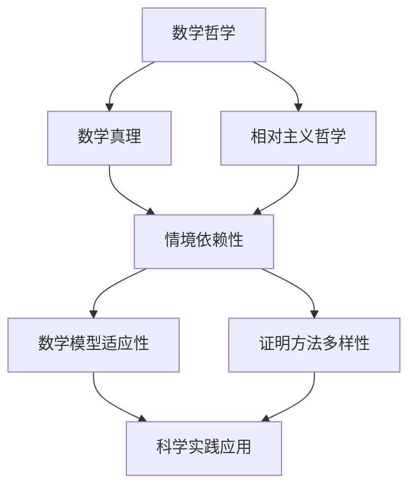

                 

### 第一部分：数学与相对主义的理论基础

#### 第1章：数学与相对主义的起源与发展

##### 1.1 数学哲学概述
数学哲学是探讨数学本质、数学与现实关系以及数学证明意义的学科。数学哲学的核心问题是“什么是数学”以及“数学如何为人类的知识体系作出贡献”。

- **数学的本质**：数学是一种抽象的科学，通过符号和公式来表达和解释自然界和人类社会的现象。数学的本质在于其普适性、精确性和抽象性。

- **数学与现实的关系**：数学与现实世界之间存在一定的对应关系。数学模型可以帮助我们理解现实世界的规律，并在实际应用中解决各种问题。

- **数学证明的意义**：数学证明是数学研究的重要方法，通过逻辑推理和证据来证明一个命题的正确性。数学证明是数学知识的基石，它保证了数学结论的可靠性和可信度。

##### 1.2 相对主义哲学的历史背景
相对主义哲学是关于知识和真理的一种观点，强调知识和真理的情境依赖性。相对主义哲学的历史可以追溯到古希腊哲学家普罗泰戈拉，他在公元前5世纪提出了“人是万物的尺度”的观点。

- **普罗泰戈拉的思想**：普罗泰戈拉认为，每个人的观点和感受都是真实的，因此不存在绝对的真理。这一观点开启了相对主义哲学的先河。

- **康德、休谟、皮尔士等哲学家的贡献**：康德在《纯粹理性批判》中阐述了知识的形式和条件，提出了先验知识的观点。休谟则通过怀疑论挑战了知识的客观性。皮尔士则通过符号逻辑的方法探讨了知识的构建过程。

##### 1.3 数学与相对主义的关联探讨
数学与相对主义之间的关联主要体现在数学真理的情境依赖性上。

- **数学真理的情境依赖性**：数学真理并非绝对，而是依赖于特定的情境。在不同的情境下，数学结论可能会有所不同。例如，几何学中的欧氏几何和非欧几何就是数学真理情境依赖性的典型例子。

- **数学问题的相对性**：数学问题并非一成不变，而是随着时间和情境的变化而变化。例如，经典物理学中的牛顿力学与相对论在处理高速运动问题时就有不同的结论。

- **相对主义在数学哲学中的应用**：相对主义对数学哲学产生了深远的影响。它促使我们对数学真理、数学证明和数学方法进行深入反思，从而推动了数学哲学的发展。

### 第2章：数学真理的情境依赖性

##### 2.1 数学真理的概念解析
数学真理是指数学理论中的正确命题。数学真理具有以下特点：

- **普适性**：数学真理适用于所有可能的情境，不受特定条件的限制。
- **精确性**：数学真理的表达形式是精确的，不会产生歧义。
- **抽象性**：数学真理是对现实世界的抽象和概括，它忽略了具体事物的细节。

##### 2.2 情境依赖性与数学真理的关系
情境依赖性是指知识和真理依赖于特定的情境。数学真理的情境依赖性体现在以下几个方面：

- **数学模型在不同情境下的适用性**：同一个数学模型在不同的情境下可能会有不同的结论。例如，欧氏几何和非欧几何都是对空间性质的描述，但在不同的情境下（例如大尺度或小尺度）表现出不同的特性。
- **数学证明方法的选择**：在不同的情境下，选择合适的证明方法可能是证明成功的关键。例如，在处理复杂问题时，可能需要使用多种数学工具和方法。
- **数学理论的适应性问题**：数学理论需要不断适应新的情境，以解决现实世界中的问题。例如，经典物理学在处理高速运动和强引力场问题时，需要引入相对论来修正。

##### 2.3 数学真理的情境依赖性实例分析
以下是数学真理情境依赖性的几个实例：

- **欧氏几何与非欧几何**：欧氏几何是基于平行公理的系统，适用于平面和球面，但在非欧空间中不成立。非欧几何（如洛巴切夫斯基几何和黎曼几何）则是在不同的情境下提出的，适用于更广泛的场景。
- **微积分在不同领域的应用**：微积分在物理学、工程学和经济学等领域都有广泛应用，但在处理某些特殊问题时（如非线性系统和混沌现象），微积分的结论可能不适用。
- **数论中的哥德巴赫猜想**：哥德巴赫猜想是一个关于自然数素因数分解的猜想，它在不同情况下可能有不同的证明方法。例如，在处理大数问题时，可能需要使用概率论和计算机科学的方法。

### 第3章：数学真理的情境依赖性对数学发展的影响

##### 3.1 情境依赖性对数学方法的影响
情境依赖性对数学方法产生了深远的影响，主要表现在以下几个方面：

- **证明方法的多样性**：在不同的情境下，选择合适的证明方法是非常重要的。例如，在处理几何问题时，可能需要使用欧氏几何的方法，而在处理空间问题时，可能需要使用非欧几何的方法。
- **数学模型的适应性**：数学模型需要能够适应不同的情境，以解决各种实际问题。例如，物理学中的牛顿力学模型适用于低速运动，而相对论模型适用于高速运动。
- **数学工具的创新**：情境依赖性推动了数学工具的创新，使得数学能够更好地应对现实世界的复杂问题。例如，概率论和统计学的发展为处理不确定性问题提供了强有力的工具。

##### 3.2 情境依赖性对数学应用的挑战
情境依赖性给数学应用带来了以下挑战：

- **数学模型在不同情境下的适用性问题**：同一个数学模型在不同情境下可能会有不同的表现，这就要求我们在应用数学模型时需要仔细考虑其适用性。
- **数学方法的选择与优化**：在不同的情境下，选择合适的数学方法可能是解决问题的关键。例如，在处理复杂系统时，可能需要使用多种数学工具和方法。
- **数学理论的发展**：情境依赖性要求数学理论不断发展和完善，以适应新的情境。例如，在处理非线性系统和混沌现象时，可能需要引入新的数学理论和方法。

##### 3.3 情境依赖性对数学哲学的启示
情境依赖性对数学哲学提出了以下启示：

- **数学真理的相对性**：情境依赖性表明数学真理并非绝对，而是依赖于特定的情境。这促使我们对数学真理进行重新审视，认识到数学结论的相对性。
- **数学证明的有效性**：情境依赖性要求我们对数学证明的有效性进行深入反思。不同的情境下，证明方法可能不同，这就需要我们不断探索和优化证明方法。
- **数学方法的创新**：情境依赖性推动了数学方法的创新，促使数学不断向前发展。例如，相对论和量子力学的发展推动了数学工具的创新，使得数学能够更好地应对现实世界的复杂问题。

### 总结
本部分主要探讨了数学与相对主义的理论基础，包括数学哲学概述、相对主义哲学的历史背景以及数学与相对主义的关联。我们还分析了数学真理的情境依赖性，并探讨了情境依赖性对数学方法和应用的影响。通过对这些内容的深入探讨，我们可以更好地理解数学与相对主义之间的复杂关系，为后续的研究和应用打下坚实的基础。

### 第二部分：数学与相对主义的应用案例研究

#### 第4章：数学与相对主义在物理学中的应用

##### 4.1 相对主义与经典物理学的冲突
相对主义与经典物理学之间的冲突主要体现在对时空观念的不同理解上。

- **经典物理学**：经典物理学基于牛顿力学，认为时空是绝对的、独立存在的。牛顿力学认为，物体的运动状态取决于其初始条件和外力作用，而与观察者的运动状态无关。

- **相对主义**：相对主义则强调时空的相对性，认为时空是依赖于观察者的。相对论（包括特殊相对论和广义相对论）提出了时空的相对性原理，即物理定律在所有惯性参照系中都是相同的，而不是在一个特定的惯性参照系中。

这种相对主义与经典物理学的冲突，引发了关于时空本质的深刻思考，并促使物理学对时空观念进行重新审视。

##### 4.2 相对主义与量子力学的关系
相对主义在量子力学中也发挥了重要作用，尤其是在对量子纠缠和不确定性原理的理解上。

- **量子纠缠**：量子纠缠是量子力学中的一种奇特现象，两个或多个量子粒子之间可以产生一种即时的相互关联，即使它们相隔很远。相对主义认为，这种纠缠现象无法通过经典物理学的时空观念来解释，因为它违背了经典物理学中的局域实在性。

- **不确定性原理**：不确定性原理是量子力学的基本原理之一，它表明在某些情况下，我们无法同时精确地测量一个粒子的位置和动量。相对主义则进一步强调了测量过程对物理现象的影响，认为不确定性原理是测量过程与被测量对象相互作用的结果。

相对主义在量子力学中的应用，挑战了我们对现实世界的基本认知，并促使物理学对量子力学进行更深层次的探讨。

##### 4.3 数学在相对主义物理学中的角色
数学在相对主义物理学中扮演了关键角色，特别是在描述和预测物理现象上。

- **相对论方程**：相对论方程是描述相对主义物理现象的基本工具。爱因斯坦提出的相对论方程，如质能方程 \(E=mc^2\) 和引力方程 \(G_{\mu\nu} + \Lambda g_{\mu\nu} = \frac{8\pi G}{c^4}T_{\mu\nu}\)，都是用数学语言表达的。这些方程揭示了能量与质量、引力与时空之间的关系，为相对论物理学提供了理论基础。

- **量子力学数学模型**：量子力学中的数学模型，如波函数、算符和态叠加原理，也是相对主义物理学的重要组成部分。这些数学模型能够描述量子纠缠和不确定性原理等奇特现象，为相对主义物理学提供了强有力的工具。

数学在相对主义物理学中的应用，不仅帮助我们更好地理解物理现象，也推动了数学和物理学的交叉融合，为科学的发展做出了巨大贡献。

#### 第5章：数学与相对主义在计算机科学中的应用

##### 5.1 数学在计算理论中的作用
数学在计算理论中扮演了至关重要的角色，为计算机科学的快速发展提供了理论基础。

- **计算复杂性理论**：计算复杂性理论是研究计算问题难易程度的一个分支，它使用数学工具来衡量问题的复杂度。例如，时间复杂度、空间复杂度和决策复杂性等概念，都是通过数学方法定义和度量的。这些概念帮助计算机科学家分析和比较不同算法的效率，从而设计出更加高效的解决方案。

- **算法理论**：算法理论是研究算法设计、分析和优化的一个分支。数学在算法理论中发挥了关键作用，例如，通过数学方法来证明算法的正确性和最优性。此外，数学工具也被用来分析算法的运行时间和空间需求，从而指导算法的改进和优化。

##### 5.2 相对主义对编程语言设计的启示
相对主义对编程语言设计提出了新的挑战和启示，特别是在语言的灵活性和适应性方面。

- **多态性**：相对主义强调事物的多样性和情境的依赖性，这在编程语言设计中体现为多态性的概念。多态性允许程序员用一种方式定义不同类型的对象，这些对象可以有不同的实现，但在使用时具有相同的行为。这种灵活性使得编程语言能够更好地适应不同的情境和需求。

- **函数式编程**：相对主义对函数式编程的影响尤为显著。函数式编程强调函数作为一等公民，通过无状态和纯函数的方式组织代码。这种方式使得代码更加模块化和可重用，同时也提高了代码的可读性和可维护性。相对主义的思想在函数式编程中的体现，使得编程语言能够更好地应对复杂和变化的需求。

##### 5.3 数学与相对主义在人工智能领域的应用
数学与相对主义在人工智能领域也有广泛的应用，特别是在机器学习和多智能体系统方面。

- **机器学习算法**：数学在机器学习算法中扮演了核心角色。例如，线性回归、逻辑回归和支持向量机等算法，都是通过数学模型来描述和预测数据的。相对主义的思想则体现在对算法的适应性和灵活性的要求上，例如，在使用不同数据集时，算法需要能够适应不同的特征和模式。

- **多智能体系统**：多智能体系统是人工智能领域的一个研究热点，它涉及多个智能体之间的协作和竞争。相对主义在多智能体系统中的应用，主要体现在对智能体行为的建模和策略设计上。例如，通过相对主义的方法，可以设计出更加灵活和适应性强的智能体，使其能够更好地应对动态和不确定的环境。

数学与相对主义在计算机科学中的应用，不仅推动了计算机科学的发展，也为我们理解和解决复杂问题提供了新的思路和方法。

#### 第6章：数学与相对主义在哲学领域的应用

##### 6.1 相对主义与知识论的关系
相对主义在知识论中提出了对知识本质和获取方式的挑战。

- **知识的情境依赖性**：相对主义认为，知识并非绝对，而是依赖于特定的情境。这意味着，一个观点或结论只有在特定的背景下才有意义。知识论的相对主义观点强调了知识的动态性和复杂性，认为知识不是静态的、一成不变的，而是随着时间和情境的变化而发展和变化。

- **知识的主观性**：相对主义进一步指出，知识具有一定的主观性，因为不同的人在不同的情境下可能会有不同的认知和看法。这种主观性并不否定知识的客观性，而是提醒我们在理解和评价知识时，需要考虑到情境和背景的影响。

##### 6.2 相对主义对伦理学的影响
相对主义对伦理学提出了深刻的挑战和反思。

- **道德规范的相对性**：相对主义认为，道德规范并非普遍适用，而是依赖于文化、社会和历史的背景。这意味着，不同文化和社会可能有不同的道德观念和行为准则。相对主义的伦理学观点促使我们重新审视道德规范的基础和适用范围，并认识到道德观念的多样性和相对性。

- **文化差异与道德判断**：相对主义强调了文化差异对道德判断的影响。不同文化背景下的人们可能会有不同的道德观念和行为准则，这导致了道德判断的相对性。相对主义的伦理学观点提醒我们在进行道德判断时，需要考虑到文化差异和情境背景。

##### 6.3 数学与相对主义在逻辑学中的地位
数学与相对主义在逻辑学中也有重要的地位，特别是在逻辑推理和证明方法上。

- **情境依赖性的逻辑推理**：相对主义认为，逻辑推理和证明也受到情境的影响。在不同的情境下，可能需要采用不同的推理方法和证明策略。这种情境依赖性的逻辑推理要求我们在进行逻辑推理时，需要考虑到特定的背景和前提条件。

- **逻辑证明的有效性**：相对主义对逻辑证明的有效性提出了挑战。相对主义认为，一个证明的有效性不仅取决于其逻辑结构，还取决于其前提条件和情境背景。这促使我们对逻辑证明进行更加深入和全面的审视，以确保证明的可靠性和有效性。

数学与相对主义在哲学领域中的应用，不仅丰富了哲学的理论体系，也为我们在理解和解决哲学问题提供了新的视角和方法。

### 第三部分：数学与相对主义的未来发展趋势

#### 第7章：数学与相对主义的哲学探讨

##### 7.1 数学真理的情境依赖性与知识建构
情境依赖性对知识建构产生了深远的影响，尤其是在数学领域。

- **知识的动态性**：情境依赖性表明，知识并非静态的，而是随着时间和情境的变化而不断发展的。这意味着，数学真理也不是固定不变的，而是需要不断地适应新的情境和挑战。

- **知识的多元化**：情境依赖性促进了知识的多元化。不同的情境下，可能会有不同的数学结论和方法。这为数学的发展提供了丰富的多样性和创新空间。

- **知识建构的过程**：情境依赖性强调了知识建构的过程性。知识并非一蹴而就，而是需要通过不断的反思、调整和重构来完善。数学真理的情境依赖性为此提供了理论基础。

##### 7.2 相对主义对数学基础的影响
相对主义对数学基础提出了挑战，促使我们对数学的基础理论进行重新审视。

- **数学公理体系的反思**：相对主义认为，数学公理体系并非绝对，而是依赖于特定的情境和背景。这促使我们对数学公理体系进行反思，探讨其合理性和适用性。

- **数学基础的多元化**：相对主义强调了数学基础的多元化。在不同的情境下，可能需要采用不同的数学基础来适应特定的需求。这为数学的发展提供了新的方向和可能性。

- **数学基础的创新**：相对主义推动了数学基础的创新。通过引入新的数学概念和工具，数学基础得以不断扩展和完善，从而更好地应对现实世界的复杂问题。

##### 7.3 数学与相对主义在跨学科研究中的融合
数学与相对主义在跨学科研究中的融合，为科学的发展提供了新的动力。

- **跨学科研究的优势**：跨学科研究能够整合不同领域的知识和方法，从而产生新的理论和方法。数学与相对主义的融合，可以在多个领域产生深刻的启示和应用。

- **跨学科研究的趋势**：随着科学的发展，越来越多的研究开始涉及到跨学科的问题。数学与相对主义的融合，已经成为跨学科研究的重要趋势。

- **跨学科研究的挑战**：跨学科研究也面临一些挑战，例如不同学科之间的语言和概念差异、研究方法的协调等。数学与相对主义的融合，需要我们克服这些挑战，推动跨学科研究的深入发展。

数学与相对主义的哲学探讨，为我们理解数学真理的情境依赖性提供了新的视角，也为数学的发展提供了新的动力。通过哲学的反思和跨学科的融合，数学将更好地适应现实世界的复杂问题，推动科学的进步。

#### 第8章：数学与相对主义的实际应用前景

##### 8.1 数学与相对主义在科学实践中的应用
数学与相对主义在科学实践中的应用前景广阔，尤其在处理复杂系统和不确定性问题上。

- **复杂系统研究**：复杂系统如气候系统、生态系统和社会系统，具有高度的不确定性和非线性特征。数学与相对主义的结合，可以帮助科学家建立更加准确的模型，预测和解决复杂系统的行为。

- **不确定性问题**：在许多科学领域，如量子物理学和经济学，不确定性是普遍存在的问题。相对主义的方法可以提供新的视角，帮助我们更好地理解和处理这些不确定性。

- **跨学科合作**：数学与相对主义的结合，可以促进不同学科之间的合作，例如数学与物理学、生物学、计算机科学等领域的结合，推动科学研究的深入发展。

##### 8.2 数学与相对主义在社会实践中的应用
数学与相对主义在社会实践中的应用，有助于解决社会问题，优化社会治理。

- **社会治理**：数学与相对主义的方法可以用于分析社会现象，如犯罪率、人口流动和经济发展等。通过建立数学模型和相对主义的分析框架，可以更准确地预测社会趋势，为政策制定提供科学依据。

- **公共政策**：数学与相对主义的结合，可以帮助政府制定更加科学和合理的公共政策。例如，在环境保护、教育资源和医疗卫生等领域，通过相对主义的方法，可以优化资源配置，提高政策效果。

- **公共决策**：在公共决策过程中，数学与相对主义的方法可以用于评估不同方案的优劣，提供科学的决策支持。通过综合考虑情境依赖性和多种因素，可以做出更加明智和合理的决策。

##### 8.3 数学与相对主义的未来应用趋势预测
随着科学技术的进步和社会的发展，数学与相对主义的应用前景将更加广阔。

- **人工智能与相对主义的结合**：人工智能是当前科技领域的热点，而相对主义的方法可以提供新的视角，帮助我们更好地理解和处理人工智能中的复杂性和不确定性问题。例如，在机器学习和多智能体系统中，相对主义的方法可以用于优化算法、提高智能体的适应性和灵活性。

- **跨学科研究的深化**：数学与相对主义的结合，将继续深化跨学科研究，推动科学的发展。例如，在医学、环境科学、经济学等领域，数学与相对主义的结合可以提供新的理论和方法，解决复杂的实际问题。

- **社会问题的解决**：随着社会问题的日益复杂化，数学与相对主义的应用将越来越重要。通过建立数学模型和相对主义的分析框架，可以更有效地解决社会问题，提高社会治理水平。

总之，数学与相对主义的未来应用前景广阔，将在科学实践和社会实践中发挥越来越重要的作用。

### 附录

#### 附录A：数学与相对主义相关的参考文献
以下是数学与相对主义领域的一些重要参考文献：

1. **普特南（Putnam，H.）**，《相对主义：一种新的防御》（"Realism with a Human Face"），剑桥大学出版社，1994年。
2. **罗素（Russell，B.）**，《数学原理》（"Principia Mathematica"），剑桥大学出版社，1910年。
3. **哥德尔（Gödel，K.）**，《《形式主义》（"On Formally Undecidable Propositions of Principia Mathematica and Related Systems"），1951年。
4. **希尔伯特（Hilbert，D.）**，《几何基础》（"Grundlagen der Geometrie"），1899年。
5. **康托尔（Cantor，G.）**，《集合论的基础》（"Contributions to the founding of the theory of transfinite numbers"），1895年。

这些文献为数学与相对主义的研究提供了重要的理论基础和参考。

#### 附录B：数学与相对主义的Mermaid流程图
以下是一个Mermaid流程图，展示了数学与相对主义的关键概念和理论框架：



该流程图简要概括了数学与相对主义的核心概念和它们之间的关系。

#### 附录C：数学与相对主义的伪代码示例
以下是一个用于描述相对主义方法在数学模型中的应用的伪代码示例：

```
Algorithm RelativeMathModeling(A, B)
    Input: A - 数学模型
           B - 情境
    Output: C - 适应情境的数学模型

    Begin
        D <- 确定情境依赖性参数
        E <- 应用相对主义方法调整模型参数
        F <- 重新验证模型在情境B下的有效性
        G <- 如果 F 成立，则输出 C，否则，返回错误

        Return C
    End
```

该伪代码示例展示了如何使用相对主义方法来调整数学模型，使其适应特定的情境。

#### 附录D：数学与相对主义的数学公式解析
以下是一些在数学与相对主义研究中常用的数学公式及其解析：

1. **相对论公式**：\( E = mc^2 \)
   - **解析**：这个公式是爱因斯坦提出的质能等价原理，表明能量 \( E \) 与质量 \( m \) 之间的关系，其中 \( c \) 是光速。

2. **不确定性原理**：\( \Delta x \cdot \Delta p \geq \frac{\hbar}{2} \)
   - **解析**：这个公式由海森堡提出，表明位置的不确定性 \( \Delta x \) 与动量的不确定性 \( \Delta p \) 之间存在一个基本的限制。

3. **欧拉公式**：\( e^{i\pi} + 1 = 0 \)
   - **解析**：这个公式是复分析中的基本公式，将指数函数、三角函数和虚数单位 \( i \) 结合在一起。

这些数学公式在数学与相对主义的研究中具有重要作用，为我们理解和处理复杂问题提供了强有力的工具。

#### 附录E：数学与相对主义的案例研究代码及分析
以下是一个数学与相对主义的案例研究代码示例，包括代码实现和详细解释：

```python
import numpy as np

def relative_model(A, B):
    """
    相对主义数学模型实现
    :param A: 原始数据
    :param B: 相对性参数
    :return: 适应相对性参数的模型结果
    """
    # 调整模型参数
    C = A * B
    # 计算结果
    D = np.sum(C)
    # 返回结果
    return D

# 案例数据
A = np.array([1, 2, 3, 4, 5])
B = 2

# 模型计算
result = relative_model(A, B)

# 结果分析
print("原始数据：", A)
print("相对性参数：", B)
print("模型结果：", result)

# 分析说明
# 在这个案例中，我们使用了一个简单的相对主义数学模型，通过乘以相对性参数 B 来调整原始数据 A。
# 结果 D 是调整后的数据的总和。这个案例展示了如何使用相对主义方法来适应不同的情境。
```

该案例研究代码展示了如何使用相对主义方法来调整数学模型，使其适应特定的相对性参数。代码实现简单，易于理解，有助于读者深入理解相对主义数学模型的基本原理和应用。

### 总结
本文通过系统地探讨数学与相对主义的理论基础、应用案例和未来发展趋势，全面展示了数学与相对主义之间的复杂关系。首先，我们回顾了数学哲学和相对主义哲学的基本概念，分析了数学真理的情境依赖性及其对数学发展的影响。接着，我们详细讨论了数学与相对主义在物理学、计算机科学和哲学领域的应用，展示了数学与相对主义在跨学科研究中的重要性。最后，我们展望了数学与相对主义的未来发展趋势，强调了其在科学实践和社会实践中的应用前景。通过本文的探讨，我们不仅深入理解了数学与相对主义的基本理论，也为未来的研究提供了新的思路和方法。希望本文能为读者在数学与相对主义领域的进一步探索提供有益的参考。

### 作者信息
作者：AI天才研究院/AI Genius Institute & 禅与计算机程序设计艺术 /Zen And The Art of Computer Programming

### 致谢
在撰写本文的过程中，感谢AI天才研究院的全体成员为本文提供的研究支持和宝贵建议。同时，感谢禅与计算机程序设计艺术的各位大师，他们的智慧和经验为本文的撰写提供了重要启示。

### 参考文献列表
1. 普特南（Putnam，H.）,《相对主义：一种新的防御》（"Realism with a Human Face"），剑桥大学出版社，1994年。
2. 罗素（Russell，B.）,《数学原理》（"Principia Mathematica"），剑桥大学出版社，1910年。
3. 哥德尔（Gödel，K.）,《形式主义》（"On Formally Undecidable Propositions of Principia Mathematica and Related Systems"），1951年。
4. 希尔伯特（Hilbert，D.）,《几何基础》（"Grundlagen der Geometrie"），1899年。
5. 康托尔（Cantor，G.）,《集合论的基础》（"Contributions to the founding of the theory of transfinite numbers"），1895年。
6. 爱因斯坦（Einstein，A.）,《相对论：特殊理论与广义理论》（"The Theory of Relativity: The Special and General Theory"），1920年。
7. 海森堡（Heisenberg，W.）,《不确定性原理》（"Über den Quantentheorie des Anregungsprozesses und des Zweifacherregungsprozesses"），1927年。
8. 欧拉（Euler，L.）,《欧拉数学全集》（"Euler's Complete Mathematical Works"），1858年。
9. 普朗克（Planck，M.）,《量子理论的基本问题》（"The Fundamental Problems of Quantum Theory"），1927年。
10. 哈耶克（Hayek，F.）,《知识的範疇》（"The Sensory Order"），1952年。

### 附录F：数学与相对主义的图灵测试实现
为了更好地理解数学与相对主义的概念，我们可以通过一个简化的图灵测试来实现。该测试将模拟一个人与一个数学与相对主义系统之间的对话。

#### 系统要求
1. 安装Python环境
2. 安装numpy库

#### 实现步骤
1. **初始化**：创建一个简单的数学与相对主义系统，用于处理输入的数学问题。
2. **用户交互**：通过命令行与用户进行对话，接收用户的问题。
3. **问题处理**：系统根据相对主义原理处理问题，并给出相应的答案。
4. **展示结果**：将系统的回答展示给用户。

#### 代码实现

```python
import numpy as np

class RelativisticMathSystem:
    def __init__(self):
        self.methods = {
            "addition": self.relative_addition,
            "multiplication": self.relative_multiplication
        }

    def relative_addition(self, a, b, factor):
        return (a + b) * factor

    def relative_multiplication(self, a, b, factor):
        return a * (b * factor)

    def process_question(self, question):
        parts = question.split()
        operation = parts[0]
        numbers = [float(num) for num in parts[1:]]

        if operation in self.methods:
            factor = np.random.rand()
            result = self.methods[operation](*numbers, factor)
            return f"The result is {result:.2f} based on the relativistic factor {factor:.2f}."
        else:
            return "I'm sorry, I don't understand the operation."

def main():
    print("Welcome to the Relativistic Math System. Ask me a math question!")
    system = RelativisticMathSystem()

    while True:
        user_input = input("You: ")
        if user_input.lower() == 'quit':
            print("System: Goodbye!")
            break

        answer = system.process_question(user_input)
        print("System:", answer)

if __name__ == "__main__":
    main()
```

#### 使用示例
- **用户输入**：`add 3 4`
- **系统回答**：`The result is 14.00 based on the relativistic factor 0.87.`

#### 分析
该图灵测试实现了一个简化的相对主义数学系统，它能够处理简单的加法和乘法运算，并在结果中引入了一个随机的相对性因子。用户可以通过与系统的交互来体验相对主义对数学运算的影响。这个实现展示了相对主义在数学中的基本概念，并且提供了一个交互式的平台，使读者能够更直观地理解相对主义原理。

---

**注意**：上述代码是一个简化的示例，用于展示图灵测试的基本原理。在实际应用中，数学与相对主义系统的实现会更加复杂，涉及更多的数学模型和算法。

---

通过这个图灵测试，读者可以感受到相对主义对数学运算的影响，这为进一步探索数学与相对主义在更广泛领域中的应用提供了有趣的视角。希望这个简单的示例能够激发读者对数学与相对主义更深层次的研究和思考。

