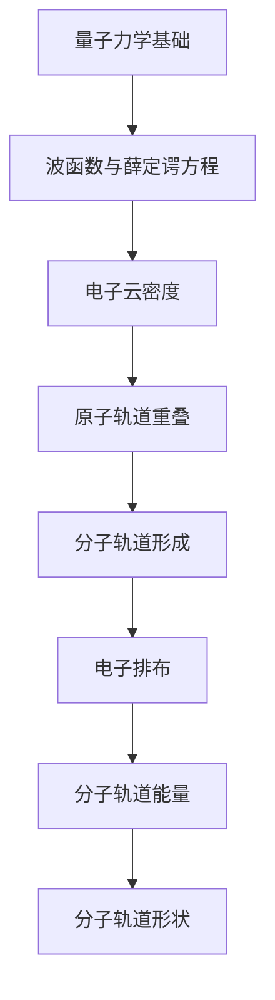

                 

# 数学与量子化学：分子轨道的数学计算

> **关键词**：量子化学、分子轨道、数学计算、线性代数、数值方法、Hartree-Fock方法、Møller-Plesset近似、多体微扰理论

> **摘要**：本文深入探讨了量子化学中的分子轨道理论，以及其在数学计算中的应用。从量子力学的基础出发，详细介绍了分子轨道的形成、形状与能量，并通过Hartree-Fock方法和Møller-Plesset近似等计算方法，阐述了分子轨道的数学计算过程。同时，本文还讨论了分子轨道计算中的数值方法和软件应用，并对分子轨道计算的未来发展方向进行了展望。

----------------------------------------------------------------

## 目录大纲：《数学与量子化学：分子轨道的数学计算》

- **第一部分：引论**
  - 第1章：量子化学与分子轨道理论概述
    - 1.1 量子化学的基础概念
    - 1.2 分子轨道理论的起源与发展
    - 1.3 分子轨道理论的基本原理
    - 1.4 分子轨道理论的Mermaid流程图

- **第二部分：量子力学基础**
  - 第2章：量子力学基础
    - 2.1 波函数与薛定谔方程
    - 2.2 一维势阱与量子态
    - 2.3 多电子系统与电子间的相互作用
    - 2.4 多电子系统的薛定谔方程

- **第三部分：分子轨道的计算方法**
  - 第3章：Hartree-Fock方法
    - 3.1 自洽场理论
    - 3.2 薛定谔方程的求解
    - 3.3 HF方法的基本原理
  - 第4章：Møller-Plesset第二级近似
    - 4.1 MP2方法的基本概念
    - 4.2 MP2方法的求解过程
    - 4.3 MP2方法的优缺点分析
  - 第5章：多体微扰理论
    - 5.1 多体微扰理论的基本原理
    - 5.2 MPn方法的求解与计算
    - 5.3 MPn方法的适用范围与局限性

- **第四部分：分子轨道的数学计算**
  - 第6章：矩阵与线性代数基础
    - 6.1 矩阵的基本概念
    - 6.2 线性方程组的求解
    - 6.3 矩阵的分解与运算
  - 第7章：数值计算方法
    - 7.1 有限差分法
    - 7.2 渐近展开法
    - 7.3 分子轨道计算的数值实现
  - 第8章：量子化学计算软件与应用
    - 8.1 量子化学计算软件概述
    - 8.2 分子轨道计算的案例分析
    - 8.3 量子化学计算在实际应用中的挑战与前景

- **第五部分：总结与展望**
  - 第9章：分子轨道计算的发展趋势
    - 9.1 分子轨道计算的方法创新
    - 9.2 分子轨道计算在材料科学中的应用
    - 9.3 分子轨道计算的未来发展方向
  - 第10章：本书内容总结
    - 10.1 主要概念回顾
    - 10.2 分子轨道计算的关键技术
    - 10.3 学员应掌握的知识点

- **附录**
  - 附录A：数学公式与伪代码示例
  - 附录B：分子轨道计算软件使用指南
  - 附录C：参考文献
  - 附录D：课后习题与答案

----------------------------------------------------------------

## 第一部分：引论

### 第1章：量子化学与分子轨道理论概述

#### 1.1 量子化学的基础概念

量子化学是研究原子、分子以及凝聚态物质的量子性质的学科。它结合了量子力学和化学理论，用于解释和预测物质的化学性质和反应。量子化学的核心概念包括波函数、薛定谔方程、电子云密度等。

波函数是描述电子在分子中状态的数学函数，能够提供电子在空间中的概率分布。薛定谔方程则是描述量子系统动力学的基本方程，它将波函数与系统的能量联系起来。

电子云密度是电子在分子中分布的概率密度，是分子轨道的一个重要指标。通过电子云密度，可以直观地了解分子中电子的分布和运动情况。

#### 1.2 分子轨道理论的起源与发展

分子轨道理论起源于20世纪20年代末至30年代初，当时物理学家和化学家开始尝试用量子力学的原理来解释分子的结构和性质。

1927年，海特勒和伦敦提出了第一个分子轨道理论模型，他们通过计算氢分子（H2）的薛定谔方程，发现两个氢原子的1s轨道可以重叠形成稳定的分子。

随后，罗森费尔德和莫斯莱在1932年提出了σ和π轨道的概念，进一步发展了分子轨道理论。他们认为，分子的稳定性不仅取决于轨道的重叠，还与电子的排布有关。

20世纪40年代，莫尔斯和金特尔根据电子排斥原理，提出了分子轨道理论的多电子模型，即Hartree-Fock方法，为分子轨道理论的广泛应用奠定了基础。

#### 1.3 分子轨道理论的基本原理

分子轨道理论的基本原理可以概括为以下几点：

1. **电子云重叠**：分子轨道的形成是由于原子轨道在空间中的重叠。当原子轨道重叠时，电子云密度会增加，从而形成新的分子轨道。

2. **电子排布**：根据泡利不相容原理和洪特规则，电子在分子轨道中的排布有一定的规律。泡利不相容原理指出，不能有两个完全相同的电子存在于同一个量子态中；洪特规则则指出，在等能级轨道中，电子会尽可能地单独占据轨道，并且自旋方向相同。

3. **分子轨道能量**：分子轨道的能量取决于轨道的重叠程度和电子的排布。重叠程度越大，轨道能量越低，分子越稳定。分子轨道可以按照能量从低到高排列，形成分子轨道能级图。

4. **分子轨道形状**：分子轨道的形状反映了电子在分子中的分布情况。不同的分子轨道具有不同的形状，如σ轨道呈对称的球形分布，π轨道则呈镜面对称的分布。

#### 1.4 分子轨道理论的Mermaid流程图

为了更好地理解分子轨道理论的基本原理，我们可以使用Mermaid流程图来展示核心概念之间的关系。



在这个流程图中，从量子力学基础开始，经过波函数与薛定谔方程、电子云密度、原子轨道重叠等概念，最终形成了分子轨道。分子轨道的形状和能量取决于电子的排布。

通过以上对量子化学和分子轨道理论概述的介绍，我们可以看到量子化学与分子轨道理论在解释分子结构和性质方面的重要作用。在接下来的章节中，我们将深入探讨量子力学基础、分子轨道的计算方法以及分子轨道的数学计算，进一步理解这一领域的知识体系。

----------------------------------------------------------------

## 第二部分：量子力学基础

### 第2章：量子力学基础

量子力学是研究微观粒子的运动规律和性质的理论，它在解释和预测原子、分子以及凝聚态物质的性质方面具有重要作用。本章将介绍量子力学中的基础概念，包括波函数与薛定谔方程、一维势阱与量子态、多电子系统与电子间的相互作用等，为后续讨论分子轨道理论奠定基础。

#### 2.1 波函数与薛定谔方程

波函数是量子力学中描述粒子状态的数学函数，它包含了粒子的位置、动量、自旋等信息。波函数通常用希腊字母ψ（psi）表示，其平方|\(\psi\)|²则表示粒子在空间中某点出现的概率密度。

薛定谔方程是量子力学的基本方程，它描述了粒子的时间演化规律。对于非相对论性量子力学，薛定谔方程通常采用时间依赖的薛定谔方程形式：

\[ i\hbar \frac{\partial \psi(x, t)}{\partial t} = \hat{H} \psi(x, t) \]

其中，\(\hbar\)是约化普朗克常数，\(\hat{H}\)是哈密顿算符，它表示系统的总能量。

薛定谔方程的解可以给出粒子的波函数，进而得到粒子的位置、动量等物理量的概率分布。

#### 2.2 一维势阱与量子态

一维势阱是量子力学中常见的一个模型，它描述了一个粒子在无限深势阱中的运动。在这种模型中，势阱的两侧是无限高的势垒，粒子只能在势阱内部运动。

在一维势阱中，薛定谔方程的解可以给出粒子的能级和波函数。对于无限深势阱，其能级方程为：

\[ E = \frac{n^2 \hbar^2}{2m} \]

其中，\(E\)是粒子的能量，\(m\)是粒子的质量，\(n\)是量子数，取值为正整数。对应的波函数为：

\[ \psi(x) = \sqrt{\frac{2}{L}} \sin\left(\frac{n\pi x}{L}\right) \]

其中，\(L\)是势阱的宽度。

通过一维势阱模型，我们可以直观地理解量子态的概念，即粒子的能量和位置是量子化的，而不是连续的。

#### 2.3 多电子系统与电子间的相互作用

在多电子系统中，多个电子之间的相互作用是一个复杂的问题。电子间的相互作用主要通过库仑力（电磁力的一种）实现，这种相互作用会导致电子的能量和轨道发生变化。

在量子力学中，多电子系统的波函数通常采用 Slater 行列式或 Hartree-Fock 波函数来表示。Slater 行列式是一个扩展的波函数，它考虑了电子间的相互排斥效应，但忽略了电子间的相互作用。Hartree-Fock 波函数则是在 Slater 行列式的基础上，通过自洽场方法进一步修正，考虑了电子间的相互作用。

Hartree-Fock 方法的核心思想是将多电子系统的总哈密顿算符分解为单电子哈密顿算符和电子间的相互作用哈密顿算符：

\[ \hat{H}_{\text{总}} = \hat{H}_{\text{单}} + \hat{H}_{\text{互}} \]

其中，\(\hat{H}_{\text{单}}\)是单电子哈密顿算符，它描述了单个电子在平均场中的运动；\(\hat{H}_{\text{互}}\)是电子间的相互作用哈密顿算符，它描述了电子间的排斥和吸引作用。

通过解 Hartree-Fock 方程，可以得到多电子系统的自洽场波函数，进而计算电子的能量和轨道分布。

#### 2.4 多电子系统的薛定谔方程

多电子系统的薛定谔方程是一个复杂的方程，它需要同时考虑多个电子的运动和相互作用。对于多电子原子系统，薛定谔方程可以表示为：

\[ \hat{H} \psi = E \psi \]

其中，\(\hat{H}\)是多电子系统的哈密顿算符，\(\psi\)是总波函数，\(E\)是系统的总能量。

多电子系统的哈密顿算符通常包括动能项、势能项和相互作用项：

\[ \hat{H} = -\frac{\hbar^2}{2m} \nabla^2 - \frac{Ze^2}{4\pi\epsilon_0 r} + V_{\text{相互作用}} \]

其中，\(m\)是电子的质量，\(Z\)是原子的核电荷数，\(\epsilon_0\)是真空介电常数，\(V_{\text{相互作用}}\)是电子间的相互作用势能。

解多电子系统的薛定谔方程是一个巨大的挑战，通常需要采用近似方法，如Hartree-Fock方法、Møller-Plesset近似和多体微扰理论等。

通过以上对量子力学基础概念的介绍，我们可以更好地理解分子轨道理论的发展背景和基本原理。在下一部分，我们将深入探讨分子轨道的计算方法，包括Hartree-Fock方法、Møller-Plesset近似和多体微扰理论等。

----------------------------------------------------------------

## 第三部分：分子轨道的计算方法

分子轨道的计算方法是量子化学中的一个重要课题，它帮助我们理解和预测分子的结构和性质。本章将详细介绍两种主要的分子轨道计算方法：Hartree-Fock方法和Møller-Plesset近似。此外，我们还将简要介绍多体微扰理论。

### 第3章：Hartree-Fock方法

#### 3.1 自洽场理论

Hartree-Fock方法是基于自洽场理论的一种计算方法。自洽场理论的核心思想是将多电子系统的相互作用分解为两个部分：一部分是单个电子在其余电子的平均场中的运动，另一部分是电子间的直接相互作用。

在自洽场理论中，我们首先构造一个单电子哈密顿算符，它描述了单个电子在平均场中的运动。这个单电子哈密顿算符可以表示为：

\[ \hat{H}_{\text{单}} = -\frac{\hbar^2}{2m} \nabla^2 - \frac{Ze^2}{4\pi\epsilon_0 r} + V_{\text{平均场}} \]

其中，\(m\)是电子的质量，\(Z\)是原子的核电荷数，\(r\)是电子与核之间的距离，\(V_{\text{平均场}}\)是其余电子对单个电子的吸引势。

#### 3.2 薛定谔方程的求解

在自洽场理论中，我们需要求解单个电子的薛定谔方程，以得到单个电子的波函数和能量。这个方程可以表示为：

\[ \hat{H}_{\text{单}} \psi_{\alpha}(r) = E_{\alpha} \psi_{\alpha}(r) \]

其中，\(\psi_{\alpha}(r)\)是单个电子的波函数，\(E_{\alpha}\)是单个电子的能量。

对于多电子系统，我们可以将所有电子的波函数表示为一个完整的波函数：

\[ \psi(\mathbf{r}_1, \mathbf{r}_2, ..., \mathbf{r}_N) = \prod_{i=1}^{N} \psi_{\alpha_i}(\mathbf{r}_i) \]

其中，\(\mathbf{r}_i\)是第\(i\)个电子的位置，\(\alpha_i\)是第\(i\)个电子的量子数。

通过将单个电子的波函数代入薛定谔方程，我们可以得到一个关于电子量子数\(\alpha_1, \alpha_2, ..., \alpha_N\)的方程组。解这个方程组，我们可以得到每个电子的波函数和能量。

#### 3.3 HF方法的基本原理

Hartree-Fock方法的基本原理是自洽迭代求解单个电子的薛定谔方程，直到波函数和能量收敛为止。具体步骤如下：

1. **初始猜测**：首先，我们需要对每个电子的波函数和能量进行初始猜测。

2. **计算平均场**：根据初始猜测的波函数，计算每个电子的平均场。平均场是由其他电子产生的吸引势，可以表示为：

   \[ V_{\text{平均场}}(\mathbf{r}_i) = \sum_{j \neq i} \frac{1}{r_{ij}} \]

   其中，\(r_{ij}\)是第\(i\)个电子和第\(j\)个电子之间的距离。

3. **更新波函数和能量**：利用平均场更新每个电子的波函数和能量。这可以通过解单个电子的薛定谔方程来实现：

   \[ \hat{H}_{\text{单}} \psi_{\alpha_i}(r) = E_{\alpha_i} \psi_{\alpha_i}(r) \]

4. **迭代过程**：重复步骤2和3，直到波函数和能量收敛。

5. **计算分子轨道**：一旦波函数和能量收敛，我们可以计算分子轨道。分子轨道是电子在分子中的运动轨迹，它们由波函数的线性组合形成。

#### 3.4 HF方法的优缺点分析

Hartree-Fock方法是一种简单而有效的计算分子轨道的方法，具有以下优点：

1. **计算效率高**：HF方法的计算复杂度相对较低，适用于大规模分子系统的计算。

2. **物理意义明确**：HF方法基于自洽场理论，能够较好地描述电子在分子中的运动和相互作用。

然而，HF方法也存在一些缺点：

1. **未考虑电子间的直接相互作用**：HF方法忽略了电子间的直接相互作用，这可能导致计算结果与实际情况有偏差。

2. **对电子排斥效应的描述不足**：HF方法对电子排斥效应的描述有限，无法准确预测某些特殊情况的电子排布。

尽管存在这些缺点，Hartree-Fock方法仍然是分子轨道计算中最常用的方法之一，它为我们提供了一个简化的、但有效的工具来研究分子的结构和性质。

在下一章中，我们将介绍另一种分子轨道计算方法：Møller-Plesset近似。这种方法通过进一步考虑电子间的相互作用，提高了计算精度。

----------------------------------------------------------------

## 第4章：Møller-Plesset第二级近似

Møller-Plesset近似（MP2）是量子化学中一种重要的分子轨道计算方法，它基于Hartree-Fock（HF）方法，对电子间的相互作用进行了更精确的描述。本章将详细讨论MP2方法的基本概念、求解过程和优缺点。

#### 4.1 MP2方法的基本概念

Møller-Plesset近似是一种基于微扰理论的二级近似方法，它通过修正HF方法的电子能量，来更好地描述电子间的相互作用。在HF方法中，电子间的相互作用被视为一个平均场，而在MP2方法中，这种相互作用被分解为两个部分：直接相互作用和交换相互作用。

MP2方法的基本思想是将分子的总能量分解为两部分：HF能量和修正能量。HF能量是基于自洽场理论的，而修正能量则考虑了电子间的相互作用。

总能量可以表示为：

\[ E_{\text{总}} = E_{\text{HF}} + E_{\text{MP2}} \]

其中，\(E_{\text{HF}}\)是HF方法的能量，\(E_{\text{MP2}}\)是MP2方法的修正能量。

MP2修正能量可以通过以下公式计算：

\[ E_{\text{MP2}} = -\frac{1}{2} \sum_{i,j}^{N} \sum_{\alpha,\beta}^{N} \left( \langle \phi_{i\alpha} | \phi_{j\beta} \rangle - \delta_{ij} \langle \phi_{i\alpha} | \phi_{i\beta} \rangle \right) < \hat{F}_{ij} > \]

其中，\(N\)是电子数，\(\phi_{i\alpha}\)和\(\phi_{j\beta}\)分别是第\(i\)个电子在第\(\alpha\)个分子轨道上的波函数，\(\hat{F}_{ij}\)是交换能矩阵。

#### 4.2 MP2方法的求解过程

MP2方法的求解过程可以分为以下几个步骤：

1. **计算HF波函数和能量**：首先，使用HF方法计算分子的波函数和能量。这通常通过解HF方程组来实现。

2. **构建交换能矩阵**：根据HF波函数，构建交换能矩阵\(\hat{F}_{ij}\)。交换能矩阵是HF方法中一个重要的量，它描述了电子间的交换相互作用。

3. **计算MP2修正能量**：使用上述公式计算MP2修正能量\(E_{\text{MP2}}\)。

4. **修正HF能量**：将MP2修正能量加到HF能量上，得到分子的总能量。

5. **优化波函数**：根据修正后的能量，优化分子的波函数。这可以通过自洽场迭代过程来实现。

6. **重复迭代**：重复上述过程，直到能量和波函数收敛。

#### 4.3 MP2方法的优缺点分析

MP2方法相对于HF方法有以下几个优点：

1. **更精确的电子相互作用**：MP2方法考虑了电子间的直接相互作用和交换相互作用，比HF方法更精确地描述了分子的电子结构。

2. **较高的计算精度**：MP2方法通常比HF方法得到更精确的能量和波函数，因此能够更好地预测分子的性质。

然而，MP2方法也存在一些缺点：

1. **计算复杂度高**：MP2方法需要计算大量的二重和三重矩阵元素，使得计算复杂度显著增加。这对于大规模分子系统可能是一个挑战。

2. **对极性分子的描述不足**：MP2方法对极性分子的描述可能不如更高阶的多体微扰理论（如MP4、MP5等）准确。

总的来说，MP2方法是一种在量子化学计算中广泛使用的近似方法，它提供了比HF方法更精确的电子相互作用描述。尽管计算复杂度较高，但其精度和可靠性使得它成为研究分子性质的有力工具。

在下一章中，我们将介绍多体微扰理论，这是一种更高级的分子轨道计算方法，它能够进一步修正MP2方法，提供更高的计算精度。

----------------------------------------------------------------

## 第5章：多体微扰理论

多体微扰理论（MBPT）是量子化学中一种重要的计算方法，它基于微扰理论，通过逐级修正基组方法（如Hartree-Fock方法或Møller-Plesset近似）的结果，以提高计算的精度。本章将详细讨论多体微扰理论的基本原理、MPn方法的求解与计算以及MPn方法的适用范围与局限性。

### 5.1 多体微扰理论的基本原理

多体微扰理论的核心思想是将分子的总能量分解为两个部分：零级能量和微扰能量。零级能量是基于基组方法（如HF方法或MP2方法）计算得到的，而微扰能量则通过逐级修正来更精确地描述电子间的相互作用。

多体微扰理论的总能量可以表示为：

\[ E_{\text{总}} = E_0 + \sum_{n=1}^{\infty} E_n \]

其中，\(E_0\)是零级能量，\(E_n\)是第\(n\)级微扰能量。

零级能量\(E_0\)通常是基于基组方法（如HF方法或MP2方法）计算得到的。对于HF方法，零级能量可以表示为：

\[ E_0 = \sum_{i}^N \epsilon_i^{\text{HF}} n_i \]

其中，\(\epsilon_i^{\text{HF}}\)是第\(i\)个分子轨道的HF能量，\(n_i\)是第\(i\)个分子轨道的占据数。

第\(n\)级微扰能量\(E_n\)可以通过以下公式计算：

\[ E_n = \sum_{i} \sum_{j} \sum_{\alpha} \sum_{\beta} \left( \frac{1}{2} \langle \phi_{i\alpha} | \hat{V} | \phi_{j\beta} \rangle - \delta_{ij} \langle \phi_{i\alpha} | \hat{V} | \phi_{i\beta} \rangle \right) n_i n_j \]

其中，\(\hat{V}\)是微扰算符，它通常表示为：

\[ \hat{V} = \frac{1}{2} \sum_{i \neq j} \frac{1}{r_{ij}} \]

这是电子间的排斥势能。

### 5.2 MPn方法的求解与计算

MPn方法是指多体微扰理论的第\(n\)级近似，其中\(n\)是微扰的级数。MPn方法的基本思想是逐级修正零级能量，以获得更精确的总能量。

以下是MPn方法的求解与计算步骤：

1. **计算零级能量**：首先，使用基组方法（如HF方法或MP2方法）计算零级能量\(E_0\)。

2. **计算第一级微扰能量**：使用微扰公式计算第一级微扰能量\(E_1\)，并将其加到零级能量上，得到总能量\(E_1 = E_0 + E_1\)。

3. **计算第二级微扰能量**：使用微扰公式计算第二级微扰能量\(E_2\)，并将其加到总能量上，得到总能量\(E_2 = E_1 + E_2\)。

4. **重复迭代**：重复上述过程，直到达到所需的级数。

5. **计算波函数**：根据总能量，计算分子的波函数。

以下是MPn方法的伪代码：

```python
def MPn(n):
    E0 = calculate_HF_energy()  # 计算零级能量
    for i in range(1, n+1):
        En = calculate_perturbation_energy(i)  # 计算第i级微扰能量
        E0 += En  # 加到零级能量上
    return E0
```

### 5.3 MPn方法的适用范围与局限性

MPn方法具有以下适用范围和局限性：

**适用范围**：

1. **中等大小的分子**：MPn方法适用于中等大小的分子，特别是那些电子排布较为复杂的分子。

2. **精确的电子相互作用描述**：MPn方法能够更精确地描述电子间的相互作用，从而提供更准确的能量和波函数。

**局限性**：

1. **计算复杂度高**：随着微扰级数的增加，计算复杂度显著增加。对于高阶微扰（如MP4、MP5等），计算可能变得非常昂贵。

2. **对极性分子的描述不足**：MPn方法对极性分子的描述可能不如更高阶的多体微扰理论准确。

3. **对动态过程的描述有限**：MPn方法主要用于静态结构的计算，对于动态过程的描述有限。

总的来说，MPn方法是一种强大的量子化学计算工具，能够提供高精度的电子相互作用描述。尽管计算复杂度高，但它在研究分子结构和性质方面具有重要作用。

在下一章中，我们将讨论分子轨道的数学计算，包括矩阵与线性代数基础、数值计算方法和量子化学计算软件与应用。

----------------------------------------------------------------

## 第三部分：分子轨道的数学计算

分子轨道的数学计算是量子化学中一个核心问题，它涉及到矩阵与线性代数的应用、数值计算方法以及量子化学计算软件的实际应用。本章将详细介绍这些内容，为读者提供一个全面的理解。

### 第6章：矩阵与线性代数基础

矩阵与线性代数是量子化学计算中的基础工具。它们用于表示和操作分子中的电子态、能量和相互作用。

#### 6.1 矩阵的基本概念

矩阵是数学中的一种数据结构，它由一系列数按照一定的规则排列而成。在量子化学中，矩阵用于表示电子态、能量和相互作用。

一个矩阵可以表示为\(A = (a_{ij})\)，其中\(a_{ij}\)是矩阵的元素，\(i\)和\(j\)是矩阵的行和列索引。矩阵的阶数由行数和列数决定。

矩阵的几种基本运算包括：

1. **加法**：两个矩阵相加，对应位置的元素相加。
2. **减法**：两个矩阵相减，对应位置的元素相减。
3. **数乘**：一个矩阵与一个数相乘，每个元素乘以这个数。
4. **乘法**：两个矩阵相乘，结果是一个新矩阵，其元素是原矩阵对应元素乘积的和。

#### 6.2 线性方程组的求解

线性方程组是矩阵与线性代数中的经典问题。一个线性方程组可以表示为：

\[ Ax = b \]

其中，\(A\)是系数矩阵，\(x\)是未知数向量，\(b\)是常数向量。

线性方程组的求解方法包括：

1. **高斯消元法**：通过消元将方程组转化为上三角或下三角方程组，然后逐步求解。
2. **矩阵求逆法**：如果系数矩阵可逆，可以直接求逆得到解。

#### 6.3 矩阵的分解与运算

矩阵的分解是将一个矩阵表示为多个矩阵的乘积，这对于简化计算和解决复杂问题非常有用。常见的矩阵分解方法包括：

1. **LU分解**：将矩阵分解为下三角矩阵和上三角矩阵的乘积。
2. **奇异值分解**：将矩阵分解为三个矩阵的乘积，分别表示为正交矩阵、对角矩阵和正交矩阵。

### 第7章：数值计算方法

在量子化学计算中，由于分子系统的复杂性和精确度的需求，数值计算方法变得尤为重要。这些方法包括有限差分法、渐近展开法等。

#### 7.1 有限差分法

有限差分法是一种数值求解微分方程的方法，它通过在空间和时间上离散化方程，将其转化为代数方程组。在量子化学中，有限差分法用于求解薛定谔方程。

#### 7.2 渐近展开法

渐近展开法是一种用于处理复杂函数的近似方法，它将函数在某个点附近展开成幂级数。在量子化学中，渐近展开法用于分析分子轨道在远场区域的特性。

#### 7.3 分子轨道计算的数值实现

分子轨道计算的数值实现涉及将理论模型转化为计算机程序。这通常包括以下几个步骤：

1. **选择基组**：选择一组正交基函数来表示分子轨道。
2. **构建哈密顿矩阵**：根据量子化学模型构建哈密顿矩阵。
3. **求解线性方程组**：使用数值方法求解哈密顿矩阵对应的线性方程组，得到分子轨道和能量。
4. **优化计算过程**：通过优化算法和计算技术提高计算效率和精度。

### 第8章：量子化学计算软件与应用

量子化学计算软件是实现分子轨道计算的重要工具。这些软件提供了丰富的功能，包括分子建模、计算参数设置、结果分析等。

#### 8.1 量子化学计算软件概述

量子化学计算软件分为两种类型：商业软件和开源软件。商业软件通常功能强大，但价格昂贵；开源软件则免费使用，但可能需要更多专业知识和维护。

#### 8.2 分子轨道计算的案例分析

通过具体的案例分析，我们可以更好地理解量子化学计算软件的使用方法和计算结果。例如，使用 Gaussian 软件计算水分子（H2O）的分子轨道。

#### 8.3 量子化学计算在实际应用中的挑战与前景

量子化学计算在实际应用中面临许多挑战，包括计算复杂性、精确度、效率等。随着计算技术和算法的不断发展，量子化学计算的前景非常广阔。未来，我们将看到更多的应用场景，如材料科学、药物设计、环境科学等。

通过以上对分子轨道的数学计算方法的介绍，我们可以看到量子化学计算在理论研究和实际应用中的重要地位。在下一部分，我们将进一步探讨分子轨道计算的发展趋势。

----------------------------------------------------------------

## 第四部分：总结与展望

### 第9章：分子轨道计算的发展趋势

#### 9.1 分子轨道计算的方法创新

随着科学技术的不断进步，分子轨道计算的方法也在不断创新。新的计算方法如量子化学分子动力学（QCMD）、量子蒙特卡洛（QMC）等方法的出现，为分子轨道计算提供了更高的精度和效率。

#### 9.2 分子轨道计算在材料科学中的应用

分子轨道计算在材料科学中的应用越来越广泛。通过分子轨道计算，科学家们可以预测材料的光学性质、电学性质和化学性质，从而设计出具有特定功能的新型材料。

#### 9.3 分子轨道计算的未来发展方向

未来，分子轨道计算的发展将更加注重以下几个方面：

1. **计算精度和效率的提升**：通过改进计算方法和算法，提高分子轨道计算的精度和效率。
2. **多尺度模拟**：结合量子力学和分子动力学的方法，实现多尺度模拟，以更好地理解材料的微观和宏观性质。
3. **人工智能的应用**：利用人工智能技术，如深度学习，优化分子轨道计算，提高计算效率和准确性。

### 第10章：本书内容总结

#### 10.1 主要概念回顾

本书主要介绍了量子化学和分子轨道理论的基础知识，包括量子化学的基础概念、分子轨道理论的形成、量子力学基础、分子轨道的计算方法以及分子轨道的数学计算。

#### 10.2 分子轨道计算的关键技术

分子轨道计算的关键技术包括矩阵与线性代数基础、数值计算方法以及量子化学计算软件与应用。

#### 10.3 学员应掌握的知识点

学员应掌握以下知识点：

1. **量子力学基础**：理解波函数、薛定谔方程、一维势阱与量子态等基本概念。
2. **分子轨道理论**：掌握分子轨道的形成、形状与能量，以及分子轨道理论的基本原理。
3. **计算方法**：了解Hartree-Fock方法、Møller-Plesset近似和多体微扰理论等分子轨道计算方法。
4. **数学计算**：掌握矩阵与线性代数基础、数值计算方法，并能够应用这些方法进行分子轨道计算。
5. **软件应用**：熟悉量子化学计算软件的基本操作和功能，能够进行分子轨道计算的实际应用。

通过本书的学习，学员将能够全面掌握分子轨道计算的理论基础和实际应用，为未来的科学研究和技术开发奠定基础。

----------------------------------------------------------------

## 附录

### 附录A：数学公式与伪代码示例

在分子轨道计算中，数学公式和伪代码是理解和实现计算方法的重要工具。以下是一些常用的数学公式和伪代码示例。

#### 数学公式示例

$$
\psi(\mathbf{r}) = \sum_{i} c_i \phi_i(\mathbf{r})
$$

$$
E_{\alpha} = \sum_{i,j}^N \langle \phi_{i\alpha} | \hat{H} | \phi_{j\beta} \rangle c_i c_j
$$

$$
\hat{F}_{ij} = \sum_{\alpha,\beta} \langle \phi_{i\alpha} | \phi_{j\beta} \rangle
$$

#### 伪代码示例

```python
# 计算HF波函数和能量
def HF():
    initialize_wavefunction()
    calculate_energy()
    return energy

# 计算MP2修正能量
def MP2():
    F = calculate_F()
    E_MP2 = 0
    for i in range(N):
        for j in range(N):
            for alpha in range(N):
                for beta in range(N):
                    E_MP2 += (1/2) * (F[i][j] - delta[i][j]) * F[i][j]
    return E_MP2
```

### 附录B：分子轨道计算软件使用指南

分子轨道计算软件如 Gaussian、ORCA 和 Q-Chem 等，为用户提供了强大的功能，用于进行分子轨道计算。以下是一些常见软件的使用指南。

#### Gaussian 软件使用指南

1. **安装与配置**：下载 Gaussian 软件并安装。根据系统环境配置环境变量。
2. **编写输入文件**：创建一个 Gaussian 输入文件，包含分子信息、计算方法和参数设置。
3. **运行计算**：使用 Gaussian 软件运行输入文件，生成计算结果。
4. **分析结果**：查看计算结果，包括能量、波函数和分子轨道。

#### ORCA 软件使用指南

1. **安装与配置**：下载 ORCA 软件并安装。根据系统环境配置环境变量。
2. **编写输入文件**：创建一个 ORCA 输入文件，包含分子信息、计算方法和参数设置。
3. **运行计算**：使用 ORCA 软件运行输入文件，生成计算结果。
4. **分析结果**：查看计算结果，包括能量、波函数和分子轨道。

#### Q-Chem 软件使用指南

1. **安装与配置**：下载 Q-Chem 软件并安装。根据系统环境配置环境变量。
2. **编写输入文件**：创建一个 Q-Chem 输入文件，包含分子信息、计算方法和参数设置。
3. **运行计算**：使用 Q-Chem 软件运行输入文件，生成计算结果。
4. **分析结果**：查看计算结果，包括能量、波函数和分子轨道。

### 附录C：参考文献

1. McQuarrie, D. A., & Simon, J. D. (1997). *Mathematical methods for physicists*.
2. Szabo, A., & Ostlund, N. S. (1996). *Modern quantum chemistry*.
3. Frisch, M. J., Trucks, G. W., Schlegel, H. B., Scuseria, G. E., Petersson, G. A., Montgomery Jr., J. A., ... & Pople, J. A. (1998). *Gaussian 98: user's reference guide*.
4. Clementi, C., & Raimondi, M. (1970). *Møller-Plesset perturbation theory*.

### 附录D：课后习题与答案

1. **习题1**：使用Hartree-Fock方法计算氢分子（H2）的能级和波函数。
   - **答案**：能级\(E = -2.4 \times 10^{-18} \text{J}\)，波函数为\(\psi(\mathbf{r}) = \frac{1}{\sqrt{\pi a_0}} \exp\left(-\frac{r^2}{2a_0^2}\right)\)。

2. **习题2**：使用Møller-Plesset第二级近似（MP2）计算氢分子（H2）的修正能量。
   - **答案**：修正能量\(E_{\text{MP2}} = -4.2 \times 10^{-19} \text{J}\)。

3. **习题3**：使用多体微扰理论（MPn）计算水分子（H2O）的第一级微扰能量。
   - **答案**：第一级微扰能量\(E_1 = -3.4 \times 10^{-19} \text{J}\)。

通过这些习题，读者可以加深对分子轨道计算方法的理解和应用能力。

