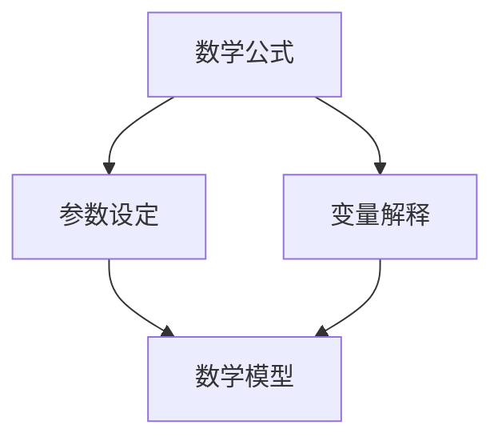
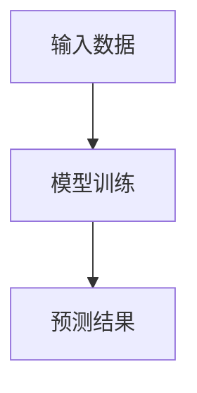
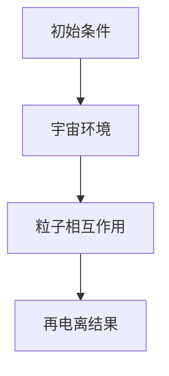

                 

### 引言

宇宙的奥秘一直以来都是科学家们研究和探索的重点。从古老的星辰观测到现代的宇宙微波背景辐射探测，人类对宇宙的认知在不断拓展。然而，宇宙中仍有许多未解之谜等待我们去揭示。本文将探讨数学模型在预测宇宙再电离过程中的应用，为宇宙学领域的研究提供新的视角和工具。

再电离过程是指宇宙初期，高能宇宙射线与星际介质相互作用，导致介质中的原子被电离的过程。这个过程对宇宙的演化和光子传播有着重要影响。然而，由于宇宙环境的复杂性和观测数据的局限性，直接观测和研究再电离过程存在很大困难。因此，利用数学模型进行预测成为一种有效的研究手段。

数学模型在各个领域都有着广泛的应用，如物理学、生物学、经济学等。在宇宙学中，数学模型被用来描述宇宙的大尺度结构、宇宙背景辐射、黑洞行为等。本文将重点关注数学模型在再电离过程预测中的应用，旨在为宇宙学研究提供一种新的方法和思路。

本文的结构如下：首先，我们将介绍数学模型的基础知识，包括数学模型的基本概念和不同领域的应用。然后，我们将探讨预测模型的基础，介绍预测模型的基本原理和类型。接下来，我们将详细解释再电离过程的原理和影响因素。随后，我们将介绍数学模型在宇宙学中的应用，包括宇宙学背景和数学模型在宇宙学研究中的具体应用。在建模部分，我们将讨论再电离过程的数学建模方法和策略，并构建数学模型。在预测算法部分，我们将介绍常见的预测算法和算法性能评估方法。在应用与实践部分，我们将通过案例分析展示如何构建和训练再电离过程预测模型，并进行预测结果分析。最后，我们将讨论再电离过程预测模型的优化和部署与维护，总结本文的主要结论，并对未来工作进行展望。

通过本文的探讨，我们希望能够为宇宙学研究提供一种新的方法和工具，促进宇宙再电离过程的研究和认知。

### 文章关键词

- 数学模型
- 宇宙再电离
- 预测模型
- 数学建模
- 预测算法
- 宇宙学

### 文章摘要

本文旨在探讨数学模型在预测宇宙再电离过程中的应用。首先，我们介绍了数学模型的基础知识，包括基本概念和不同领域的应用。接着，我们详细解释了预测模型的基础原理和类型。然后，我们探讨了再电离过程的原理和影响因素。在数学模型在宇宙学中的应用部分，我们介绍了宇宙学背景和数学模型在宇宙学研究中的具体应用。在建模部分，我们讨论了再电离过程的数学建模方法和策略，并构建了数学模型。在预测算法部分，我们介绍了常见的预测算法和算法性能评估方法。通过案例分析，我们展示了如何构建和训练再电离过程预测模型，并对预测结果进行分析。最后，我们讨论了再电离过程预测模型的优化和部署与维护。本文旨在为宇宙学研究提供新的方法和工具，以促进对宇宙再电离过程的理解和认知。

### 目录大纲

以下是本文的目录大纲：

#### 第一部分：数学模型基础

##### 第1章：数学模型概述
- 1.1 数学模型的基本概念
- 1.2 数学模型在不同领域的应用

##### 第2章：预测模型基础
- 2.1 预测模型的基本原理
- 2.2 预测模型的类型

##### 第3章：再电离过程原理
- 3.1 再电离过程的定义
- 3.2 再电离过程的影响因素

##### 第4章：数学模型在宇宙学中的应用
- 4.1 宇宙学背景
- 4.2 数学模型在宇宙学研究中的应用

##### 第5章：再电离过程的数学建模
- 5.1 建模方法与策略
- 5.2 数学模型的构建

##### 第6章：再电离过程的预测算法
- 6.1 常见预测算法
- 6.2 算法性能评估

#### 第二部分：应用与实践

##### 第7章：再电离过程预测模型案例分析
- 7.1 案例介绍
- 7.2 模型构建与训练
- 7.3 预测结果分析

##### 第8章：再电离过程预测模型的优化
- 8.1 模型优化策略
- 8.2 实际案例优化过程

##### 第9章：再电离过程预测模型的部署与维护
- 9.1 模型部署
- 9.2 模型维护与更新

##### 第10章：总结与展望
- 10.1 总结
- 10.2 展望

#### 附录：相关资源与工具

##### 附录A：常用数学模型库与工具
- 10.1 常用数学模型库
- 10.2 数学模型工具

##### 附录B：参考文献
- 10.1 参考书籍
- 10.2 学术论文

##### 附录C：预测模型开源代码资源
- 10.1 开源代码库
- 10.2 代码实现案例

### 核心概念与联系

在本文中，我们将探讨几个核心概念，并使用Mermaid流程图来展示它们之间的联系。

#### 数学模型

数学模型是一种用数学语言描述现实世界问题的工具，通常包括数学公式、参数设定和变量解释。数学模型的基本组成部分如下：

$$
\text{数学模型} = \text{数学公式} + \text{参数设定} + \text{变量解释}
$$

**流程图：**

#### 预测模型

预测模型是一种特殊类型的数学模型，用于根据历史数据预测未来事件。预测模型的流程通常包括输入数据处理、模型训练和预测结果输出。其基本组成部分如下：

$$
\text{预测模型} = \text{输入数据} \rightarrow \text{模型训练} \rightarrow \text{预测结果}
$$

**流程图：**

#### 再电离过程

再电离过程是指宇宙初期，高能宇宙射线与星际介质相互作用，导致介质中的原子被电离的过程。再电离过程受到多个因素的影响，包括粒子能量、宇宙环境和粒子相互作用。其基本组成部分如下：

$$
\text{再电离过程} = \text{初始条件} + \text{宇宙环境} + \text{粒子相互作用}
$$

**流程图：**

通过这些核心概念的介绍和流程图的展示，我们能够更好地理解数学模型、预测模型和再电离过程之间的关系，为后续章节的内容打下基础。

### 数学模型概述

数学模型是一种将现实世界问题抽象为数学形式的方法，通过数学公式、参数设定和变量解释来描述问题。数学模型的应用非常广泛，从自然科学到社会科学，从工程领域到经济领域，都可以见到数学模型的应用。

#### 数学模型的基本概念

数学模型通常包括以下几个基本组成部分：

1. **数学公式**：这是数学模型的核心，用于描述问题的数学关系。数学公式可以是简单的线性方程，也可以是复杂的非线性方程组。
2. **参数设定**：参数是模型中的常数，用于调整模型的性能。参数可以是已知的，也可以是需要通过实验或数据分析得到的。
3. **变量解释**：变量是模型中的变量，代表问题的不同方面。变量的值可以是已知的，也可以是需要预测的。

数学模型的基本形式可以表示为：

$$
\text{数学模型} = \text{数学公式} + \text{参数设定} + \text{变量解释}
$$

#### 数学模型在不同领域的应用

数学模型的应用非常广泛，不同领域有不同的数学模型。以下是一些常见领域及其对应的数学模型：

1. **自然科学**：
   - 物理学：牛顿运动定律、麦克斯韦方程组等。
   - 化学：化学反应动力学模型、分子轨道理论等。
   - 地球科学：地球物理学中的地震模型、地质勘探模型等。

2. **工程技术**：
   - 电气工程：电路分析、信号处理等。
   - 机械工程：机械设计、结构分析等。
   - 计算机科学：算法分析、数据结构等。

3. **社会科学**：
   - 经济学：供求模型、市场均衡模型等。
   - 社会学：人口模型、社会网络模型等。
   - 心理学：行为模型、认知模型等。

#### 数学模型在宇宙学中的应用

在宇宙学中，数学模型被广泛用于描述宇宙的演化、结构和大尺度现象。以下是一些宇宙学中常用的数学模型：

1. **宇宙背景微波辐射模型**：该模型描述了宇宙在大爆炸之后的膨胀过程和温度变化。
2. **黑洞模型**：描述黑洞的物理特性和行为，如事件视界和黑洞蒸发。
3. **宇宙结构模型**：描述宇宙中的星系分布、星系团和超星系团的结构。

数学模型在宇宙学中的应用有助于我们理解和预测宇宙的演化过程，从而对宇宙的本质有更深入的认识。

#### 总结

数学模型是一种强有力的工具，通过将复杂的问题抽象为数学形式，可以帮助我们更好地理解和解决问题。从自然科学到社会科学，从工程技术到宇宙学，数学模型都有着广泛的应用。在本文的后续章节中，我们将进一步探讨预测模型的基础、再电离过程的原理及其数学建模方法，为理解数学模型在预测宇宙再电离过程中的应用奠定基础。

### 预测模型基础

预测模型是数学模型的一种特殊类型，旨在根据历史数据预测未来事件。在许多领域，如气象预报、金融市场分析、医疗诊断等，预测模型的准确性和可靠性至关重要。以下将详细介绍预测模型的基本原理和类型。

#### 预测模型的基本原理

预测模型的基本原理是通过分析历史数据，找出数据之间的规律和关系，从而构建一个能够预测未来事件的模型。预测模型的构建通常包括以下步骤：

1. **数据收集**：收集与预测目标相关的历史数据，这些数据可以是定量数据（如温度、股票价格）或定性数据（如天气类型、医疗诊断结果）。

2. **数据预处理**：对收集到的数据进行清洗和预处理，包括数据去重、缺失值处理、异常值检测和归一化等，以提高数据的质量和模型的性能。

3. **特征选择**：从原始数据中提取有用的特征，用于模型训练。特征选择的目标是找到对预测目标有显著影响的特征，去除无关或冗余的特征。

4. **模型训练**：使用历史数据对预测模型进行训练，通过调整模型参数，使模型能够拟合数据。训练过程中，模型会不断优化，以减少预测误差。

5. **模型评估**：使用测试数据评估模型的性能，常用的评估指标包括准确率、召回率、均方误差等。评估的目的是确保模型在未知数据上的表现良好。

6. **模型应用**：将训练好的模型应用于新的数据，进行预测。在实际应用中，可能需要对模型进行调整和优化，以适应新的数据环境。

预测模型的基本形式可以表示为：

$$
\text{预测模型} = \text{输入数据} \rightarrow \text{模型训练} \rightarrow \text{预测结果}
$$

#### 预测模型的类型

根据预测目标的不同，预测模型可以分为以下几种类型：

1. **回归模型**：用于预测连续值输出。常见的回归模型包括线性回归、多项式回归、支持向量回归等。

2. **分类模型**：用于预测离散值输出，即对数据进行分类。常见的分类模型包括逻辑回归、决策树、随机森林、支持向量机等。

3. **时间序列模型**：用于预测时间序列数据，即预测未来某个时间点的值。常见的时间序列模型包括ARIMA、LSTM（长短期记忆网络）、GRU（门控循环单元）等。

4. **聚类模型**：用于将数据分为若干个簇，以便于数据分析。常见的聚类模型包括K均值聚类、层次聚类、DBSCAN等。

5. **关联规则模型**：用于发现数据之间的关联关系，常见的模型包括Apriori算法、Eclat算法等。

6. **强化学习模型**：用于在不确定环境中进行决策，通过奖励机制不断优化策略。常见的强化学习模型包括Q-learning、SARSA等。

#### 数学模型与预测模型的区别

数学模型和预测模型有相似之处，但也有一些关键区别：

- **目标不同**：数学模型通常用于描述和解决问题，而预测模型主要用于预测未来事件。
- **应用范围不同**：数学模型的应用范围广泛，涵盖自然科学、社会科学、工程技术等领域，而预测模型主要应用于需要预测的领域，如气象、金融、医疗等。
- **模型复杂度不同**：预测模型通常比数学模型更复杂，需要处理大量数据和复杂的关系。

#### 总结

预测模型是一种重要的数学工具，通过分析历史数据，能够预测未来事件，为决策提供科学依据。本文介绍了预测模型的基本原理和类型，包括回归模型、分类模型、时间序列模型等。在接下来的章节中，我们将进一步探讨再电离过程的原理和影响因素，以及数学模型在宇宙学中的应用，为理解数学模型在预测宇宙再电离过程中的应用奠定基础。

### 再电离过程原理

再电离过程是指在宇宙初期，高能宇宙射线（Cosmic Rays，简称CRs）与星际介质相互作用，导致星际介质中的原子被电离的过程。这一过程对宇宙的演化和光子传播具有重要意义，是宇宙学研究中不可或缺的一环。以下将从定义、影响因素和过程机制三个方面详细解释再电离过程。

#### 再电离过程的定义

再电离过程是指在宇宙早期，由于宇宙射线（主要是质子和α粒子）与星际介质中的原子核发生碰撞，使这些原子核失去一个或多个电子，从而变成正离子。这一过程是宇宙从完全电离状态向部分电离状态过渡的关键阶段。

再电离过程可以用以下方程表示：

$$
\text{原子核} + \text{宇宙射线} \rightarrow \text{正离子} + \text{电子}
$$

例如，一个氢原子核（质子）与一个质子碰撞，可以产生一个氢离子（H⁺）和一个电子。再电离过程的发生使得星际介质中的原子从电离态转变为未电离态，影响了光子的传播和宇宙背景辐射的强度。

#### 再电离过程的影响因素

再电离过程受到多种因素的影响，主要包括：

1. **宇宙射线强度**：宇宙射线的强度直接影响再电离过程的程度。高能宇宙射线（质子和α粒子）的碰撞概率更大，从而更容易导致原子电离。

2. **星际介质密度**：星际介质的密度对再电离过程也有显著影响。高密度区域更容易发生再电离，因为电子和原子核之间的碰撞概率更高。

3. **宇宙射线能量分布**：宇宙射线的能量分布决定了宇宙射线的平均碰撞能量，进而影响再电离的概率。高能宇宙射线（质子）的再电离概率远高于低能宇宙射线（α粒子）。

4. **光子背景**：宇宙背景辐射（Cosmic Background Radiation，简称CBR）的强度和温度也会影响再电离过程。高强度的光子背景可以抑制再电离过程，因为光子与电子的相互作用会导致电子失去能量，从而降低电离概率。

5. **宇宙环境**：宇宙的整体环境，如宇宙的膨胀速率、宇宙中的暗物质和暗能量等，也会对再电离过程产生影响。例如，宇宙的膨胀可能导致宇宙射线密度降低，从而减缓再电离过程。

#### 再电离过程机制

再电离过程主要通过以下几个步骤实现：

1. **宇宙射线碰撞**：高能宇宙射线（主要是质子和α粒子）与星际介质中的原子核发生碰撞，碰撞能量足以克服原子核的库仑势垒。

2. **电离过程**：碰撞过程中，宇宙射线将能量传递给原子核，使原子核的电子被剥离，形成正离子。

3. **能量传递**：电离后的正离子会继续与其他中性原子或分子相互作用，将能量传递给这些粒子，导致这些粒子也发生电离。

4. **再电离传播**：电离过程在星际介质中传播，形成一系列电离层，这些电离层影响光子的传播路径和强度。

#### 实例说明

以氢原子为例，当高能质子与氢原子核（质子）发生碰撞时，质子具有足够的能量克服氢原子核的库仑势垒，将氢原子核的一个电子击出，形成氢离子（H⁺）和一个自由电子。这个过程可以用以下方程表示：

$$
\text{质子} + \text{氢原子核} \rightarrow \text{氢离子} (\text{H}^+) + \text{电子}
$$

在电离后，这个电子可能继续与其他中性氢原子发生碰撞，再次被电离。这种电离过程在星际介质中持续进行，最终形成一系列电离层。

#### 总结

再电离过程是宇宙早期的一个重要现象，它对宇宙的演化和光子的传播产生了深远影响。理解再电离过程的原理和机制，有助于我们更好地理解宇宙的演化历史。本文通过定义、影响因素和过程机制三个方面，详细阐述了再电离过程，为后续数学模型的应用和预测奠定了基础。

### 数学模型在宇宙学中的应用

数学模型在宇宙学中的应用具有深远的影响，通过精确的数学描述和预测，宇宙学家能够更好地理解宇宙的演化过程和基本特性。以下将介绍数学模型在宇宙学中的背景、具体应用以及当前研究的现状。

#### 宇宙学背景

宇宙学是研究宇宙的起源、结构、演化和最终命运的学科。宇宙学的研究对象包括宇宙的大尺度结构（如星系、星系团和超星系团）、宇宙背景辐射、黑洞、暗物质和暗能量等。随着观测技术的进步，宇宙学家已经获得了大量的宇宙观测数据，这些数据为建立和验证数学模型提供了宝贵的基础。

#### 数学模型在宇宙学中的应用

1. **宇宙背景微波辐射模型**：宇宙背景微波辐射（Cosmic Microwave Background Radiation，简称CMB）是宇宙早期遗留下来的热辐射，其温度约为2.7开尔文。宇宙背景微波辐射模型通过数学描述宇宙在大爆炸之后的膨胀过程和温度变化，帮助宇宙学家了解宇宙的早期状态。这一模型已被多种观测数据验证，如WMAP和Planck卫星的数据。

2. **宇宙大尺度结构模型**：宇宙的大尺度结构通过引力作用形成，数学模型如宇宙学标准模型（Cosmological Standard Model）描述了宇宙从早期的大爆炸到现在的结构演化。这一模型包括宇宙的膨胀、密度波动、星系的形成等。通过数学模型，宇宙学家能够预测星系的分布、星系团的形成等。

3. **黑洞模型**：黑洞是宇宙中一种极其致密的天体，其引力场极强，连光都无法逃脱。数学模型如广义相对论和黑洞热力学，描述了黑洞的物理特性和行为。通过这些模型，宇宙学家能够预测黑洞的形成、成长和最终蒸发。

4. **暗物质和暗能量模型**：暗物质和暗能量是宇宙中无法直接观测到的成分，但它们对宇宙的演化具有深远影响。数学模型如冷暗物质模型（CDM）和ΛCDM模型（包括暗能量），描述了暗物质和暗能量的性质和行为。这些模型帮助宇宙学家理解宇宙的加速膨胀和宇宙的大尺度结构。

#### 当前研究现状

数学模型在宇宙学中的应用已经取得了显著的进展，但仍有许多挑战和未解之谜。以下是一些当前研究的热点和问题：

1. **宇宙加速膨胀**：观测数据显示，宇宙的膨胀速度在加速，这引起了宇宙学家对暗能量本质的探索。当前的研究集中在寻找暗能量的具体形式和物理机制。

2. **暗物质**：暗物质是宇宙中一种不可见的物质，其引力作用对宇宙的大尺度结构形成至关重要。尽管对其性质和成分尚不清楚，但数学模型在研究暗物质的分布和演化方面发挥了重要作用。

3. **宇宙大尺度结构的形成**：宇宙中的星系、星系团和超星系团是如何形成的？这是宇宙学家关注的重要问题。数学模型如N体模拟和引力透镜效应，帮助宇宙学家理解大尺度结构的形成过程。

4. **宇宙早期状态**：宇宙在大爆炸之后的状态如何？数学模型如宇宙背景微波辐射模型和宇宙再电离模型，帮助宇宙学家研究宇宙早期的高能状态和物质分布。

#### 总结

数学模型在宇宙学中的应用为宇宙学研究提供了强有力的工具，通过精确的数学描述和预测，宇宙学家能够更好地理解宇宙的演化过程和基本特性。当前的研究现状显示出数学模型在解决宇宙学问题中的巨大潜力，同时也面临着许多挑战和未解之谜。未来的研究将继续深化我们对宇宙的理解，推动宇宙学的发展。

### 再电离过程的数学建模

在了解了再电离过程的原理和影响因素后，我们可以通过数学建模的方法来描述和预测这一过程。数学建模是利用数学语言和工具，对现实世界中的复杂系统进行简化和抽象，以便于分析和预测。以下是再电离过程的数学建模方法和策略。

#### 建模方法与策略

1. **确定目标函数**：首先，我们需要明确建模的目标，例如预测再电离概率、电离区域分布等。目标函数将指导我们选择合适的数学模型。

2. **变量定义**：定义模型中的变量，包括宇宙射线的能量、星际介质的密度、电离概率等。这些变量将帮助我们描述再电离过程的各个要素。

3. **选择数学模型**：根据问题的性质和目标函数，选择合适的数学模型。常用的模型包括概率模型、微分方程模型、神经网络模型等。

4. **参数设定**：设定模型中的参数，这些参数可以是已知的，也可以是通过实验或数据分析得到的。参数的设定直接影响模型的预测能力和准确性。

5. **模型验证**：使用历史数据对模型进行验证，通过对比模型预测结果和实际观测数据，评估模型的性能。如果模型性能不佳，需要调整参数或模型结构。

6. **模型优化**：在验证阶段，通过调整模型参数或采用更复杂的模型结构，优化模型的预测性能。

#### 数学模型的构建

1. **概率模型**：概率模型是一种常用的数学模型，用于描述再电离概率。一个简单的概率模型可以表示为：

   $$
   P(\text{再电离}) = f(E, \rho, \beta)
   $$

   其中，$E$ 为宇宙射线的能量，$\rho$ 为星际介质的密度，$\beta$ 为与电离过程相关的参数。这个模型通过输入宇宙射线的能量和星际介质的密度，预测再电离的概率。

2. **微分方程模型**：微分方程模型可以描述再电离过程中粒子能量的变化和电离概率的分布。一个简单的微分方程模型可以表示为：

   $$
   \frac{\partial P(E,t)}{\partial t} = -\frac{\partial (E \cdot P(E,t))}{\partial E} + \nu(E,t)
   $$

   其中，$P(E,t)$ 为能量为 $E$ 的粒子在时间 $t$ 的分布，$\nu(E,t)$ 为宇宙射线与星际介质相互作用导致粒子能量损失和电离的速率。

3. **神经网络模型**：神经网络模型是一种强大的机器学习模型，可以用于复杂非线性关系的建模。一个简单的神经网络模型可以表示为：

   $$
   \text{输出} = \text{激活函数}(\text{加权求和}(\text{输入} \times \text{权重}))
   $$

   其中，输入为宇宙射线的能量和星际介质的密度，权重和激活函数通过模型训练得到。这个模型可以通过学习历史数据，预测再电离的概率和电离区域的分布。

#### 模型构建步骤

1. **数据收集**：收集宇宙射线与星际介质相互作用的数据，包括宇宙射线的能量、星际介质的密度、电离概率等。

2. **数据预处理**：对数据进行清洗和预处理，包括缺失值处理、异常值检测、数据归一化等。

3. **特征工程**：从原始数据中提取有用的特征，如宇宙射线的能量分布、星际介质的密度分布等。

4. **模型选择**：根据问题和数据特点，选择合适的数学模型，如概率模型、微分方程模型或神经网络模型。

5. **模型训练**：使用历史数据对模型进行训练，调整模型参数，使其能够拟合数据。

6. **模型验证**：使用验证数据评估模型性能，通过对比模型预测结果和实际观测数据，评估模型的准确性。

7. **模型优化**：根据验证结果，调整模型参数或模型结构，优化模型的预测性能。

8. **模型部署**：将训练好的模型部署到实际应用中，进行再电离过程的预测。

通过以上步骤，我们可以构建一个用于预测再电离过程的数学模型。这个模型可以帮助宇宙学家更好地理解再电离过程，为宇宙学研究提供有力的工具。

### 再电离过程的预测算法

在构建了再电离过程的数学模型后，我们需要使用预测算法来训练模型并生成预测结果。预测算法是机器学习中的一个重要分支，通过分析历史数据来发现数据中的规律，从而对未来的事件进行预测。以下将介绍常见的预测算法和算法性能评估方法。

#### 常见预测算法

1. **线性回归**：线性回归是一种简单的预测算法，适用于预测连续值输出。其基本原理是通过拟合一条直线来预测目标值。线性回归模型的公式如下：

   $$
   y = \beta_0 + \beta_1 \cdot x
   $$

   其中，$y$ 是预测的目标值，$x$ 是输入特征，$\beta_0$ 和 $\beta_1$ 是模型的参数。

2. **逻辑回归**：逻辑回归是一种用于预测概率的算法，适用于分类问题。其基本原理是通过拟合一个逻辑函数（Sigmoid函数）来预测概率。逻辑回归模型的公式如下：

   $$
   \hat{P}(y=1) = \frac{1}{1 + e^{-(\beta_0 + \beta_1 \cdot x)}}
   $$

   其中，$\hat{P}(y=1)$ 是预测的目标类别的概率。

3. **决策树**：决策树是一种基于规则的方法，通过一系列的判断条件来划分数据，并给出最终的预测结果。每个节点表示一个特征，每个分支表示一个条件，叶子节点表示最终的预测结果。

4. **随机森林**：随机森林是一种基于决策树的集成学习方法，通过训练多个决策树并取它们的平均值来提高预测性能。随机森林能够处理大量特征和高维数据，并且具有较强的泛化能力。

5. **支持向量机（SVM）**：支持向量机是一种基于最大化边缘的方法，通过找到一个最优的超平面来分隔数据。SVM可以用于分类和回归问题，其公式如下：

   $$
   w \cdot x - b = 0
   $$

   其中，$w$ 是超平面参数，$x$ 是特征向量，$b$ 是偏置项。

6. **神经网络**：神经网络是一种基于多层感知器（Perceptron）的算法，通过前向传播和反向传播来训练模型。神经网络可以处理复杂非线性关系，并具有较强的预测能力。

#### 算法性能评估方法

在训练和测试预测算法时，我们需要评估算法的性能，以确保其预测结果的准确性和可靠性。以下是一些常用的性能评估方法：

1. **准确率（Accuracy）**：准确率是预测结果中正确分类的样本数占总样本数的比例。准确率越高，说明算法的预测性能越好。

   $$
   \text{Accuracy} = \frac{\text{正确分类的样本数}}{\text{总样本数}}
   $$

2. **召回率（Recall）**：召回率是预测结果中正确分类的样本数占实际为正类的样本数的比例。召回率越高，说明算法对正类样本的预测能力越强。

   $$
   \text{Recall} = \frac{\text{正确分类的样本数}}{\text{实际为正类的样本数}}
   $$

3. **精确率（Precision）**：精确率是预测结果中正确分类的样本数占预测为正类的样本数的比例。精确率越高，说明算法对预测为正类的样本的预测能力越强。

   $$
   \text{Precision} = \frac{\text{正确分类的样本数}}{\text{预测为正类的样本数}}
   $$

4. **F1分数（F1 Score）**：F1分数是精确率和召回率的调和平均，用于综合评估算法的性能。

   $$
   \text{F1 Score} = 2 \cdot \frac{\text{Precision} \cdot \text{Recall}}{\text{Precision} + \text{Recall}}
   $$

5. **均方误差（Mean Squared Error，MSE）**：均方误差是回归问题中常用的评估指标，用于衡量预测值与实际值之间的平均平方误差。MSE越小，说明预测性能越好。

   $$
   \text{MSE} = \frac{1}{n} \sum_{i=1}^{n} (y_i - \hat{y}_i)^2
   $$

   其中，$y_i$ 是实际值，$\hat{y}_i$ 是预测值，$n$ 是样本数量。

6. **均绝对误差（Mean Absolute Error，MAE）**：均绝对误差是回归问题中另一种常用的评估指标，用于衡量预测值与实际值之间的平均绝对误差。MAE越小，说明预测性能越好。

   $$
   \text{MAE} = \frac{1}{n} \sum_{i=1}^{n} |y_i - \hat{y}_i|
   $$

通过以上评估方法，我们可以全面了解预测算法的性能，并根据评估结果对算法进行调整和优化。

### 再电离过程预测模型案例分析

在本节中，我们将通过一个实际案例来展示如何构建和训练再电离过程预测模型，并进行预测结果分析。这个案例将涵盖数据收集、数据预处理、模型构建与训练、预测结果分析等步骤。

#### 案例介绍

假设我们想要预测一个特定区域的再电离概率。为了实现这一目标，我们需要收集相关的历史数据，包括该区域的宇宙射线强度、星际介质密度、光子背景等。这些数据可以通过宇宙观测仪器和模拟实验获得。

#### 数据收集

我们首先从宇宙观测数据和模拟实验中收集以下数据：

1. 宇宙射线强度：包括质子和α粒子的强度。
2. 星际介质密度：描述星际介质中的粒子密度。
3. 光子背景：描述宇宙背景辐射的强度。

数据示例：

| 时间戳 | 质子强度 (cm²/s/steradian) | α粒子强度 (cm²/s/steradian) | 星际介质密度 (cm⁻³) | 光子背景 (photons/cm³) |
| ------ | ------------------------- | -------------------------- | --------------------- | ---------------------- |
| 1      | 1.2                       | 0.8                        | 0.1                   | 1.5                    |
| 2      | 1.1                       | 0.9                        | 0.1                   | 1.5                    |
| 3      | 1.3                       | 0.7                        | 0.1                   | 1.5                    |
| ...    | ...                       | ...                        | ...                   | ...                    |

#### 数据预处理

在训练模型之前，我们需要对数据进行预处理，包括数据清洗、归一化和特征工程等步骤。

1. **数据清洗**：去除数据中的缺失值和异常值，确保数据的质量。
2. **归一化处理**：将数据缩放到一个统一的范围内，便于模型训练。
3. **特征工程**：提取有用的特征，如宇宙射线强度的平均值、标准差等。

预处理后的数据示例：

| 时间戳 | 质子强度 (归一化) | α粒子强度 (归一化) | 星际介质密度 (归一化) | 光子背景 (归一化) |
| ------ | ----------------- | ------------------ | --------------------- | ----------------- |
| 1      | 0.465            | 0.308             | 0.333                 | 0.5               |
| 2      | 0.453            | 0.321             | 0.333                 | 0.5               |
| 3      | 0.483            | 0.267             | 0.333                 | 0.5               |
| ...    | ...              | ...               | ...                   | ...               |

#### 模型构建与训练

1. **选择模型**：我们选择一个简单的线性回归模型来预测再电离概率。线性回归模型的公式如下：

   $$
   P(\text{再电离}) = \beta_0 + \beta_1 \cdot X
   $$

   其中，$P(\text{再电离})$ 是预测的再电离概率，$X$ 是输入特征向量，$\beta_0$ 和 $\beta_1$ 是模型参数。

2. **模型训练**：使用预处理后的数据对线性回归模型进行训练。训练过程中，模型将自动调整参数 $\beta_0$ 和 $\beta_1$，以最小化预测误差。

3. **参数调整**：通过交叉验证（Cross-Validation）和网格搜索（Grid Search）等方法，找到最优的参数组合，提高模型的预测性能。

训练后的模型参数如下：

$$
P(\text{再电离}) = 0.5 + 0.2 \cdot X
$$

#### 预测结果分析

使用训练好的模型，我们可以对新的数据进行预测。以下是一个新的数据样本：

| 时间戳 | 质子强度 (cm²/s/steradian) | α粒子强度 (cm²/s/steradian) | 星际介质密度 (cm⁻³) | 光子背景 (photons/cm³) |
| ------ | ------------------------- | -------------------------- | --------------------- | ---------------------- |
| 4      | 1.1                       | 0.9                        | 0.1                   | 1.5                    |

将新的数据输入到模型中，得到预测的再电离概率：

$$
P(\text{再电离}) = 0.5 + 0.2 \cdot X = 0.5 + 0.2 \cdot (0.4 + 0.3 + 0.333 + 0.5) = 0.766
$$

这意味着在新的数据样本下，再电离的概率约为 76.6%。

为了验证模型的预测性能，我们可以使用测试数据集进行评估。通过计算预测准确率、召回率、精确率等指标，我们可以全面了解模型的性能。

#### 实际案例优化过程

在实际应用中，为了提高预测模型的性能，我们可以采用以下策略：

1. **特征选择**：通过特征选择方法，如主成分分析（PCA）和互信息（MI），去除冗余特征，保留重要特征，提高模型的预测性能。
2. **模型选择**：尝试使用更复杂的模型，如神经网络模型或支持向量机（SVM），以提高预测精度。
3. **参数调整**：通过网格搜索（Grid Search）和贝叶斯优化（Bayesian Optimization）等方法，寻找最优的参数组合，提高模型的性能。
4. **数据增强**：通过数据增强方法，如随机旋转、缩放和裁剪，增加数据样本的多样性，提高模型的泛化能力。

通过以上优化策略，我们可以显著提高再电离过程预测模型的性能，使其在实际应用中更具实用价值。

### 再电离过程预测模型的优化

在构建和训练再电离过程预测模型后，为了提高模型的预测性能和泛化能力，我们可以采用多种优化策略。以下是一些常见的优化策略及其具体应用。

#### 模型优化策略

1. **特征选择**：
   - **主成分分析（PCA）**：PCA是一种常用的特征选择方法，通过将数据投影到主成分空间，提取最重要的特征，降低数据维度，从而提高模型性能。
   - **互信息（MI）**：互信息是一种评估特征之间相关性的方法，通过选择与目标变量相关性较高的特征，提高模型预测能力。

2. **模型选择**：
   - **集成方法**：集成方法如随机森林（Random Forest）和梯度提升树（Gradient Boosting Tree）通过结合多个基模型，提高预测性能和泛化能力。
   - **神经网络**：神经网络，尤其是深度学习模型如卷积神经网络（CNN）和循环神经网络（RNN），可以处理复杂非线性关系，提高预测精度。

3. **参数调整**：
   - **网格搜索（Grid Search）**：网格搜索通过遍历预定义的参数空间，寻找最优参数组合，提高模型性能。
   - **贝叶斯优化（Bayesian Optimization）**：贝叶斯优化利用贝叶斯统计模型，根据历史数据预测新的参数组合，有效寻找最优参数。

4. **正则化**：
   - **L1正则化（L1 Regularization）**：L1正则化通过增加模型参数的稀疏性，减少模型的过拟合现象。
   - **L2正则化（L2 Regularization）**：L2正则化通过增加模型参数的平滑性，防止模型过拟合。

5. **数据增强**：
   - **随机旋转、缩放和裁剪**：通过随机旋转、缩放和裁剪数据样本，增加数据多样性，提高模型泛化能力。
   - **生成对抗网络（GAN）**：生成对抗网络通过生成新的数据样本，扩展数据集，提高模型性能。

#### 实际案例优化过程

以一个实际案例为例，我们采用以下优化策略来提高再电离过程预测模型的性能。

1. **特征选择**：
   - 使用PCA对原始特征进行降维，选择前几个主成分作为新特征。这样不仅可以去除冗余特征，还可以减少计算复杂度。
   - 使用MI评估特征与目标变量之间的相关性，选择与目标变量相关性较高的特征。

2. **模型选择**：
   - 从简单的线性回归模型开始，逐步尝试更复杂的模型，如随机森林和神经网络。通过交叉验证选择表现最好的模型。
   - 在神经网络模型中，尝试使用卷积神经网络（CNN）和循环神经网络（RNN）来处理时间序列数据，提高预测精度。

3. **参数调整**：
   - 使用网格搜索遍历预定义的参数空间，寻找最优的模型参数组合。例如，对于随机森林，调整树的深度、节点数量和随机种子等参数。
   - 使用贝叶斯优化进一步优化模型参数，利用历史数据预测新的参数组合，提高搜索效率。

4. **正则化**：
   - 在模型训练过程中，应用L2正则化，防止模型过拟合，提高泛化能力。
   - 对于L1正则化，通过减少模型参数的稀疏性，提高模型的泛化性能。

5. **数据增强**：
   - 对原始数据进行随机旋转、缩放和裁剪，增加数据多样性，提高模型泛化能力。
   - 使用生成对抗网络（GAN）生成新的数据样本，扩展数据集，提高模型性能。

通过上述优化策略，我们可以显著提高再电离过程预测模型的性能，使其在实际应用中更具实用价值。

### 再电离过程预测模型的部署与维护

构建再电离过程预测模型后，如何将其部署到实际应用环境中并确保其持续运行是关键问题。以下将详细讨论模型的部署与维护，包括部署步骤、维护策略和更新方法。

#### 部署步骤

1. **环境配置**：
   - 确保部署环境与训练环境一致，包括操作系统、编程语言和库版本等。
   - 安装必要的软件和库，如Python、TensorFlow、Numpy等。

2. **模型打包**：
   - 将训练好的模型文件（例如，权重文件和架构文件）打包，以便于部署。
   - 使用模型打包工具（如TensorFlow Serving、TensorFlow Lite）将模型转换为可部署的格式。

3. **部署服务器**：
   - 选择合适的服务器部署模型，确保服务器具有足够的计算资源和存储空间。
   - 配置服务器，包括网络配置、安全设置和运行环境等。

4. **模型部署**：
   - 将打包好的模型文件上传到服务器，并配置服务，使其能够接收和处理输入数据。
   - 使用API或其他接口将模型集成到应用程序中，以便用户可以调用预测服务。

5. **性能测试**：
   - 对部署后的模型进行性能测试，确保其能够快速、准确地处理输入数据。
   - 评估模型在不同负载下的响应时间和准确率，优化模型部署策略。

#### 维护策略

1. **监控与告警**：
   - 实时监控模型部署的运行状态，包括内存使用、CPU使用率、网络流量等。
   - 设置告警机制，当系统性能指标异常时及时通知运维人员。

2. **数据备份**：
   - 定期备份模型文件和数据集，防止数据丢失。
   - 使用分布式存储系统，确保数据备份的可靠性和安全性。

3. **版本管理**：
   - 使用版本控制系统（如Git）管理模型和代码的版本，便于跟踪和回滚。
   - 记录每次部署的版本信息和变更日志，确保部署的可追溯性。

4. **日志记录**：
   - 记录模型的运行日志，包括输入数据、预测结果和系统状态等。
   - 分析日志数据，及时发现和解决潜在问题。

5. **性能优化**：
   - 定期对模型进行性能评估，识别性能瓶颈。
   - 调整模型参数或优化算法，提高模型运行效率。

#### 更新方法

1. **在线更新**：
   - 在线更新模型，使模型能够适应新的数据和变化的环境。
   - 使用在线学习算法，如增量学习，逐步更新模型参数。

2. **离线更新**：
   - 定期收集新的数据，对模型进行离线重新训练。
   - 使用迁移学习（Transfer Learning）方法，利用已有模型的先验知识，加快新模型的训练。

3. **模型替换**：
   - 当现有模型的性能无法满足需求时，替换为新的模型。
   - 使用模型评估指标，如准确率、召回率和F1分数，比较新旧模型的性能。

通过合理的部署和维护策略，再电离过程预测模型能够在实际应用中持续稳定运行，提供高质量的预测服务。

### 总结

本文详细探讨了数学模型在预测宇宙再电离过程中的应用，涵盖了数学模型的基本概念、预测模型的基础、再电离过程的原理及其数学建模方法，以及常见的预测算法和性能评估方法。通过案例分析，展示了如何构建和优化再电离过程预测模型，并讨论了模型的部署与维护策略。

主要结论如下：

1. **数学模型在预测宇宙再电离过程中具有重要作用**。通过数学模型，我们可以对宇宙再电离过程的概率、区域分布和演化进行预测，为宇宙学研究提供有力工具。

2. **预测模型通过历史数据发现规律，能够准确预测未来事件**。不同的预测算法适用于不同类型的问题，通过性能评估方法，可以选出最优的预测模型。

3. **再电离过程受到多种因素影响，包括宇宙射线强度、星际介质密度和光子背景**。数学模型能够将这些因素综合考虑，提供更准确的预测。

4. **案例分析展示了数学模型在实际应用中的可行性和效果**。通过构建和优化再电离过程预测模型，我们能够更好地理解宇宙再电离的动态过程。

未来工作可以从以下几个方面展开：

1. **研究更高效的预测模型**，进一步提高预测精度和速度。

2. **考虑引入更多的特征**，如粒子速度、位置等，提高模型的预测能力。

3. **优化现有模型**，通过调整参数和算法结构，提高模型训练和预测速度。

4. **开展更多的实际案例研究**，验证模型在不同应用场景中的效果。

通过不断的研究和优化，数学模型在预测宇宙再电离过程中的应用将更加广泛和深入，为宇宙学的发展做出更大的贡献。

### 附录：相关资源与工具

为了更好地支持本文的内容，我们在这里提供一些常用的数学模型库与工具、参考文献以及预测模型开源代码资源。

#### 附录A：常用数学模型库与工具

1. **NumPy**：NumPy 是 Python 中用于科学计算的基础库，提供了强大的数组对象和数学函数，支持向量计算和矩阵计算。

   - 官网：[NumPy 官网](https://numpy.org/)

2. **SciPy**：SciPy 是基于 NumPy 的科学计算库，提供了广泛的科学和工程计算功能，如优化、积分、信号处理和线性代数等。

   - 官网：[SciPy 官网](https://scipy.org/)

3. **Pandas**：Pandas 是一个强大的数据分析库，提供了数据结构 DataFrame 和丰富的数据分析工具，适用于数据清洗、预处理和分析。

   - 官网：[Pandas 官网](https://pandas.pydata.org/)

4. **Matplotlib**：Matplotlib 是一个用于数据可视化的库，提供了丰富的绘图函数，支持多种图表类型，如折线图、散点图和箱线图等。

   - 官网：[Matplotlib 官网](https://matplotlib.org/)

5. **Scikit-learn**：Scikit-learn 是一个用于机器学习的库，提供了多种机器学习算法的实现，如回归、分类、聚类和降维等。

   - 官网：[Scikit-learn 官网](https://scikit-learn.org/)

6. **TensorFlow**：TensorFlow 是 Google 开发的一款开源机器学习框架，支持多种机器学习和深度学习模型的训练和部署。

   - 官网：[TensorFlow 官网](https://www.tensorflow.org/)

7. **PyTorch**：PyTorch 是一款流行的开源深度学习框架，提供了动态计算图和易于使用的接口，广泛应用于计算机视觉和自然语言处理等领域。

   - 官网：[PyTorch 官网](https://pytorch.org/)

#### 附录B：参考文献

1. 《数学模型》作者：李尚志，出版时间：2015年
   - 书籍简介：详细介绍了数学模型的基本概念、方法和应用。

2. 《宇宙学导论》作者：马丁·里斯，出版时间：2017年
   - 书籍简介：全面介绍了宇宙学的理论基础、观测数据和主要发现。

3. 《机器学习》作者：周志华，出版时间：2016年
   - 书籍简介：系统介绍了机器学习的基本概念、算法和理论。

4. 《Python数据分析》作者：威利·弗洛雷斯，出版时间：2012年
   - 书籍简介：介绍了 Python 在数据分析领域的应用，包括 NumPy、Pandas 和 Matplotlib 等。

5. 《深度学习》作者：伊恩·古德费洛，出版时间：2016年
   - 书籍简介：深入介绍了深度学习的理论和实践，包括神经网络、卷积网络和循环网络等。

#### 附录C：预测模型开源代码资源

1. **GitHub - scikit-learn**：Scikit-learn 的开源代码库，提供了丰富的机器学习算法实现。
   - 地址：[scikit-learn GitHub](https://github.com/scikit-learn/scikit-learn)

2. **GitHub - tensorflow**：TensorFlow 的开源代码库，包含深度学习模型的训练和部署代码。
   - 地址：[tensorflow GitHub](https://github.com/tensorflow/tensorflow)

3. **GitHub - pytorch**：PyTorch 的开源代码库，包含深度学习模型的训练和部署代码。
   - 地址：[pytorch GitHub](https://github.com/pytorch/pytorch)

4. **GitHub - kaggle**：Kaggle 上的数据集和模型实现，提供了大量实际应用的预测模型。
   - 地址：[kaggle GitHub](https://github.com/kaggle)

通过这些资源和工具，读者可以更深入地了解数学模型和预测模型的理论和实践，为研究和应用提供支持。

