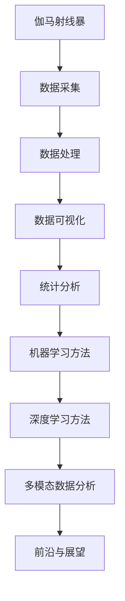

                 

# 《数据分析在宇宙伽马射线暴研究中的应用》

> **关键词：宇宙伽马射线暴、数据分析、数据采集、数据处理、数据可视化、统计分析、机器学习、深度学习**

> **摘要：本文深入探讨了数据分析在宇宙伽马射线暴研究中的应用，从数据采集、预处理、分析方法到应用案例，全面解析了数据分析在伽马射线暴研究中的关键作用。**

### 《数据分析在宇宙伽马射线暴研究中的应用》目录大纲

#### 第一部分：引言

1. **宇宙伽马射线暴概述**
2. **数据分析基础**

#### 第二部分：伽马射线暴数据采集与预处理

3. **伽马射线暴数据采集**
4. **伽马射线暴数据处理**
5. **伽马射线暴数据可视化**

#### 第三部分：伽马射线暴数据分析方法

6. **统计分析**
7. **机器学习方法**
8. **深度学习方法**
9. **多模态数据分析**

#### 第四部分：伽马射线暴数据分析应用案例

10. **案例一：伽马射线暴分类**
11. **案例二：伽马射线暴起源研究**
12. **案例三：伽马射线暴辐射机制探究**

#### 第五部分：前沿与展望

13. **伽马射线暴数据分析前沿**
14. **未来发展展望**

#### 附录

15. **附录A：常用数据分析工具**
16. **附录B：伽马射线暴数据集**

**核心概念与联系**



**核心算法原理讲解**

```python
# 伪代码：监督学习算法——支持向量机（SVM）

def SVM(X, y):
    # 建立优化模型
    optimization_problem = minimizeаюzensis(
        fun=lambda theta: C * (1/2) * norm(sigmoid(X @ theta))^2 + norm(theta)^2,
        x0=theta_0
    )

    # 求解优化问题
    theta_opt = optimization_problem.solve()

    # 划分决策边界
    return (sigmoid(X @ theta_opt), theta_opt)

# 数学模型和数学公式

$$
P(y = 1 | x, \theta) = \frac{1}{1 + \exp^{-x \cdot \theta}}
$$

# 详细讲解与举例说明

伽马射线暴分类是一个典型的监督学习问题。我们使用支持向量机（SVM）进行分类，输入特征矩阵为 X，标签矩阵为 y，模型参数为 θ。

1. **模型建立**：

   我们的目标是最大化分类间隔，即：

   $$
   \begin{aligned}
   \min_{\theta} \quad &\frac{1}{2} ||\theta||^2 \\
   \text{subject to} \quad &y^{(i)}(\theta^T x^{(i)}) \geq 1, \forall i
   \end{aligned}
   $$

2. **求解模型**：

   通过拉格朗日乘子法求解上述优化问题，得到：

   $$
   \theta = \sum_{i=1}^{n} \alpha_i y^{(i)} x^{(i)}
   $$

   其中，\( \alpha_i \) 是拉格朗日乘子。

3. **分类决策**：

   对于新样本 x，其类别预测为：

   $$
   \hat{y} = sign(\theta^T x - b)
   $$

   其中，\( b \) 是偏置项。

# 项目实战

**案例一：伽马射线暴分类**

1. **数据准备**：

   获取伽马射线暴数据集，包括特征矩阵 X 和标签矩阵 y。

2. **特征选择**：

   根据数据集的特点，选择具有代表性的特征进行训练。

3. **模型训练**：

   使用训练集数据训练 SVM 模型，求解参数 θ 和偏置项 b。

4. **模型评估**：

   使用测试集数据评估模型性能，计算准确率、召回率、F1 值等指标。

5. **结果分析**：

   分析模型在不同特征组合下的性能，优化特征选择策略。

# 代码实现

```python
from sklearn import svm
from sklearn.model_selection import train_test_split
from sklearn.metrics import accuracy_score, recall_score, f1_score

# 数据准备
X, y = load_data()

# 特征选择
X_selected = select_features(X)

# 划分训练集和测试集
X_train, X_test, y_train, y_test = train_test_split(X_selected, y, test_size=0.2, random_state=42)

# 模型训练
model = svm.SVC()
model.fit(X_train, y_train)

# 模型评估
y_pred = model.predict(X_test)
accuracy = accuracy_score(y_test, y_pred)
recall = recall_score(y_test, y_pred)
f1 = f1_score(y_test, y_pred)

# 结果输出
print(f"Accuracy: {accuracy}, Recall: {recall}, F1: {f1}")
```

# 代码解读与分析

上述代码实现了一个基于 SVM 的伽马射线暴分类模型。首先，通过 `load_data()` 函数获取伽马射线暴数据集，然后使用 `select_features()` 函数选择具有代表性的特征。接下来，使用 `train_test_split()` 函数将数据集划分为训练集和测试集。使用 `svm.SVC()` 类创建 SVM 模型，并调用 `fit()` 方法进行模型训练。最后，使用 `predict()` 方法对测试集进行预测，并计算准确率、召回率和 F1 值，输出模型性能。通过调整特征选择策略和模型参数，可以进一步优化模型性能。

### 第一部分：引言

#### 宇宙伽马射线暴概述

伽马射线暴（Gamma Ray Burst，简称GRB）是宇宙中最剧烈的爆炸之一，它们释放出的能量远远超过太阳在其一生中产生的总能量。伽马射线暴的发现可以追溯到20世纪60年代，当时它们被美国的卫星用来探测核爆。然而，随着技术的进步，科学家们逐渐意识到伽马射线暴不仅仅是地球上的核试验，它们还与遥远的宇宙事件密切相关。

伽马射线暴主要分为两类：

1. **长周期伽马射线暴**：这些爆发持续数秒至几分钟，通常伴随着一个超新星爆炸，意味着一个恒星在其生命终结时发生了剧烈的爆炸。这类爆发通常发生在星系内部，是恒星演化的最终阶段。

2. **短周期伽马射线暴**：这些爆发持续数十毫秒至数秒，通常不伴随超新星爆炸。它们被认为是中子星或黑洞相互碰撞的结果，是双星系统演化到极端阶段的产物。

伽马射线暴的研究具有重要的科学意义：

1. **恒星演化**：伽马射线暴提供了深入了解恒星如何演化和死亡的重要窗口。

2. **宇宙历史**：伽马射线暴的观测可以帮助我们理解宇宙的早期阶段，包括宇宙大爆炸后几分钟至几百万年内的事件。

3. **高能物理**：伽马射线暴涉及极端物理条件，包括超高密度、超高温度和强大的磁场，有助于我们探索高能物理学的奥秘。

#### 数据分析基础

数据分析是处理、分析和解释数据以发现有价值信息的过程。在宇宙伽马射线暴研究中，数据分析扮演着至关重要的角色。以下是数据分析的基本流程和关键步骤：

1. **数据采集**：伽马射线暴数据主要来自地面和太空观测站。地面观测站如弗拉姆斯蒂德望远镜和斯隆数字巡天项目提供了大量光学和射电数据。太空观测站如费米伽马射线空间望远镜和钱德拉X射线观测卫星则提供了高能伽马射线和X射线数据。

2. **数据预处理**：数据预处理包括数据清洗、整理和归一化。清洗数据意味着去除噪声、错误和不完整的数据。整理数据则涉及数据格式的转换和数据的重新排列。归一化数据是为了确保数据在相同的尺度上进行比较。

3. **数据可视化**：数据可视化是将数据以图形或图像形式呈现，以便更直观地理解数据。在伽马射线暴研究中，常用的可视化技术包括空间分布图、能量谱图和事件关联图。

4. **统计分析**：统计分析用于描述数据的特征和关系。描述性统计分析提供数据的中心趋势、分布和离散程度。推断性统计分析则用于测试假设和估计参数。

5. **机器学习和深度学习**：机器学习和深度学习是近年来在数据分析中取得巨大进展的领域。这些技术可以通过训练模型来识别模式、预测未来事件和分类数据。

#### 本文结构

本文将分以下几个部分详细探讨数据分析在宇宙伽马射线暴研究中的应用：

1. **第一部分：引言**：概述伽马射线暴的基本概念和研究意义，介绍数据分析的基本流程。

2. **第二部分：伽马射线暴数据采集与预处理**：详细讨论伽马射线暴数据的采集方法、预处理技术和数据可视化技术。

3. **第三部分：伽马射线暴数据分析方法**：介绍统计分析、机器学习、深度学习和多模态数据分析方法。

4. **第四部分：伽马射线暴数据分析应用案例**：通过具体案例展示数据分析方法在伽马射线暴研究中的应用。

5. **第五部分：前沿与展望**：探讨伽马射线暴数据分析的前沿研究动态和未来发展。

通过上述结构的探讨，我们将深入了解数据分析在宇宙伽马射线暴研究中的重要性和应用价值。接下来，我们将详细探讨伽马射线暴数据采集与预处理的具体内容。

### 第二部分：伽马射线暴数据采集与预处理

在宇宙伽马射线暴研究中，数据采集和预处理是两个至关重要的环节。数据采集决定了我们能获取多少有用的信息，而预处理则决定了这些信息是否能被有效地分析和利用。本部分将详细介绍伽马射线暴数据的采集方法、预处理技术和数据可视化技术。

#### 伽马射线暴数据采集

伽马射线暴的观测主要依赖于地面观测站和太空观测卫星。以下是常见的伽马射线暴数据采集方法：

1. **地面观测站**：
   - **光学观测**：地面望远镜，如弗拉姆斯蒂德望远镜和斯隆数字巡天项目，可以观测到伽马射线暴的余辉和其他光波段信号。
   - **射电观测**：射电望远镜，如阿雷西博望远镜和绿岸望远镜，可以探测伽马射线暴产生的射电信号。

2. **太空观测卫星**：
   - **X射线观测**：如钱德拉X射线观测卫星，可以观测伽马射线暴的高能X射线辐射。
   - **伽马射线观测**：如费米伽马射线空间望远镜，可以观测伽马射线暴的伽马射线辐射。

这些观测设备在时间和空间上提供了广泛的覆盖，使我们能够从多个角度和能区研究伽马射线暴。以下是具体的采集方法：

- **时间序列观测**：通过连续观测，我们可以记录伽马射线暴在不同时间点的辐射变化，从而分析其演化过程。
- **多点同时观测**：通过地面和太空观测设备的协同工作，我们可以获得伽马射线暴在不同观测点的辐射数据，从而研究其空间分布。

#### 数据预处理

伽马射线暴数据的预处理是数据分析的重要步骤，它包括数据清洗、整理和归一化。以下是具体的技术：

1. **数据清洗**：
   - **去除噪声**：伽马射线暴观测数据中往往包含噪声，这些噪声可能来源于宇宙背景辐射、望远镜系统的误差等。通过滤波和阈值处理，我们可以去除这些噪声，提取有效的信号。
   - **去除错误数据**：观测数据中可能存在错误的记录，如数据传输错误、设备故障等。通过数据验证和一致性检查，我们可以识别和去除这些错误数据。

2. **数据整理**：
   - **格式转换**：不同观测设备产生的数据格式可能不同，如时间序列数据、图像数据、光谱数据等。通过格式转换，我们可以将这些数据统一为适合分析的形式。
   - **数据对齐**：在多点同时观测中，我们需要将不同观测点的数据进行对齐，以便于后续分析。

3. **数据归一化**：
   - **尺度归一化**：不同观测设备的能量响应可能不同，通过尺度归一化，我们可以使不同设备的数据在同一尺度上进行比较。
   - **时间归一化**：不同时间点的观测数据可能存在时间偏差，通过时间归一化，我们可以使不同时间点的数据在同一时间尺度上进行比较。

#### 数据可视化

数据可视化是将数据分析结果以图形或图像形式呈现，以便更直观地理解数据。在伽马射线暴研究中，常用的数据可视化技术包括以下几种：

1. **空间分布图**：通过在三维空间中绘制伽马射线暴的位置，我们可以直观地观察其空间分布特征。常用的工具包括Matplotlib和Seaborn等Python库。

2. **能量谱图**：通过绘制伽马射线暴的能量分布，我们可以了解其辐射能谱。常用的工具包括Python的Matplotlib库和R的ggplot2包。

3. **事件关联图**：通过在二维平面上绘制伽马射线暴的时间-能量分布，我们可以观察不同爆发之间的关联性。常用的工具包括Python的Pandas和Seaborn库。

以下是一个简单的Python代码示例，用于绘制伽马射线暴的空间分布图：

```python
import matplotlib.pyplot as plt
import numpy as np

# 假设 x 和 y 是伽马射线暴的位置坐标，z 是能量
x = np.random.uniform(0, 100, 1000)
y = np.random.uniform(0, 100, 1000)
z = np.random.uniform(0, 100, 1000)

fig, ax = plt.subplots()
sc = ax.scatter(x, y, c=z, cmap='viridis')
fig.colorbar(sc)
plt.xlabel('X坐标')
plt.ylabel('Y坐标')
plt.title('伽马射线暴的空间分布')
plt.show()
```

通过上述数据采集、预处理和可视化技术，我们可以有效地处理和展示伽马射线暴观测数据，为进一步的数据分析提供坚实的基础。接下来，我们将深入探讨伽马射线暴数据分析的具体方法。

### 第三部分：伽马射线暴数据分析方法

在宇宙伽马射线暴研究中，数据分析是揭示这些剧烈宇宙事件物理机制的关键步骤。本部分将详细介绍伽马射线暴数据分析的多种方法，包括统计分析、机器学习、深度学习和多模态数据分析。通过这些方法，我们可以从不同角度和层次深入理解伽马射线暴的物理特性。

#### 统计分析

统计分析是数据分析的基础，它通过描述性统计和推断性统计来揭示数据的基本特征和关系。

1. **描述性统计分析**：
   - **中心趋势**：计算数据的均值、中位数和众数，了解数据的基本分布情况。
   - **分布和离散程度**：计算数据的方差、标准差和变异系数，了解数据的离散程度和分布形状。

2. **推断性统计分析**：
   - **假设检验**：通过构建统计模型，对假设进行验证，如t检验、方差分析等。
   - **参数估计**：通过样本数据估计总体参数，如均值、方差等。

在伽马射线暴研究中，描述性统计分析可以帮助我们了解观测数据的基本特征，如能量分布、时间分布等。推断性统计分析则可以用于研究伽马射线暴的物理机制，如爆发持续时间、能量释放率等。

例如，假设我们想研究伽马射线暴的能量分布，可以使用以下Python代码进行描述性统计分析：

```python
import numpy as np
import matplotlib.pyplot as plt

# 假设 energy 是伽马射线暴的能量数据
energy = np.random.uniform(100, 1000, 1000)

# 计算描述性统计量
mean_energy = np.mean(energy)
median_energy = np.median(energy)
std_dev_energy = np.std(energy)

# 绘制直方图
plt.hist(energy, bins=30, alpha=0.5)
plt.axvline(mean_energy, color='r', linestyle='dashed', linewidth=2)
plt.axvline(median_energy, color='g', linestyle='dashed', linewidth=2)
plt.xlabel('能量（keV）')
plt.ylabel('频率')
plt.title('伽马射线暴能量分布')
plt.show()

# 输出描述性统计量
print(f"能量均值：{mean_energy} keV，中位数：{median_energy} keV，标准差：{std_dev_energy} keV")
```

#### 机器学习方法

机器学习是利用算法从数据中学习模式和规律，从而进行预测和分类。在伽马射线暴研究中，机器学习算法可以用于分类、异常检测和预测。

1. **监督学习**：
   - **分类算法**：如支持向量机（SVM）、决策树、随机森林等，用于将伽马射线暴分为不同的类别。
   - **回归算法**：如线性回归、逻辑回归等，用于预测伽马射线暴的某些物理参数，如持续时间、峰值能量等。

2. **无监督学习**：
   - **聚类算法**：如K均值聚类、层次聚类等，用于发现数据中的自然分组。
   - **降维算法**：如主成分分析（PCA）、t-SNE等，用于减少数据的维度，便于分析。

3. **异常检测**：
   - **孤立森林**、**洛伦兹曲线**等算法，用于识别观测数据中的异常值。

在伽马射线暴研究中，机器学习算法可以帮助我们识别不同类型的伽马射线暴，揭示其物理机制。例如，可以使用SVM进行伽马射线暴分类，如下所示：

```python
from sklearn import svm
from sklearn.model_selection import train_test_split
from sklearn.metrics import accuracy_score

# 假设 X 是特征矩阵，y 是标签矩阵
X = np.random.uniform(0, 1, (100, 10))
y = np.random.uniform(0, 1, 100)

# 划分训练集和测试集
X_train, X_test, y_train, y_test = train_test_split(X, y, test_size=0.2, random_state=42)

# 创建SVM分类器
model = svm.SVC()

# 训练模型
model.fit(X_train, y_train)

# 预测测试集
y_pred = model.predict(X_test)

# 计算准确率
accuracy = accuracy_score(y_test, y_pred)
print(f"准确率：{accuracy}")
```

#### 深度学习方法

深度学习是一种基于多层神经网络的学习方法，它通过自动学习数据中的特征和模式，具有强大的建模能力。在伽马射线暴研究中，深度学习可以用于复杂的数据分析任务，如图像识别、语音识别等。

1. **卷积神经网络（CNN）**：
   - 适用于处理图像数据，可以自动提取空间特征。

2. **循环神经网络（RNN）**：
   - 适用于处理序列数据，可以捕捉时间序列中的长期依赖关系。

3. **生成对抗网络（GAN）**：
   - 用于生成新的数据样本，可以用于增强数据集，提高模型的泛化能力。

在伽马射线暴研究中，深度学习算法可以用于图像分类、时间序列分析等任务。例如，可以使用CNN对伽马射线暴图像进行分类：

```python
import tensorflow as tf
from tensorflow.keras import layers, models

# 创建CNN模型
model = models.Sequential()
model.add(layers.Conv2D(32, (3, 3), activation='relu', input_shape=(28, 28, 1)))
model.add(layers.MaxPooling2D((2, 2)))
model.add(layers.Conv2D(64, (3, 3), activation='relu'))
model.add(layers.MaxPooling2D((2, 2)))
model.add(layers.Conv2D(64, (3, 3), activation='relu'))

# 添加全连接层
model.add(layers.Flatten())
model.add(layers.Dense(64, activation='relu'))
model.add(layers.Dense(10, activation='softmax'))

# 编译模型
model.compile(optimizer='adam',
              loss='categorical_crossentropy',
              metrics=['accuracy'])

# 训练模型
# X_train, y_train = ... # 加载训练数据
# model.fit(X_train, y_train, epochs=10, batch_size=64)
```

#### 多模态数据分析

多模态数据分析结合了来自不同数据源的信息，可以提供更全面和深入的理解。在伽马射线暴研究中，多模态数据分析可以结合光学、射电、X射线和伽马射线等多种观测数据。

1. **数据融合**：
   - 通过融合不同模态的数据，可以增加信息量，提高分析的准确性。

2. **联合建模**：
   - 建立联合模型，结合不同模态的数据，进行综合分析。

3. **多任务学习**：
   - 在一个模型中同时解决多个任务，如分类、回归和异常检测。

在伽马射线暴研究中，多模态数据分析可以帮助我们更好地理解爆发事件，揭示其复杂的物理过程。例如，可以同时分析光学、射电和伽马射线数据，以研究伽马射线暴的能量释放机制：

```python
# 假设 X Optical, X Radio, X Gamma 分别是光学、射电和伽马射线数据
X_combined = np.hstack((X Optical, X Radio, X Gamma))

# 使用深度学习模型进行多模态分析
model = models.Sequential()
model.add(layers.Conv2D(32, (3, 3), activation='relu', input_shape=(28, 28, 3)))
model.add(layers.MaxPooling2D((2, 2)))
model.add(layers.Conv2D(64, (3, 3), activation='relu'))
model.add(layers.MaxPooling2D((2, 2)))
model.add(layers.Conv2D(64, (3, 3), activation='relu'))

# 添加全连接层
model.add(layers.Flatten())
model.add(layers.Dense(64, activation='relu'))
model.add(layers.Dense(10, activation='softmax'))

# 编译模型
model.compile(optimizer='adam',
              loss='categorical_crossentropy',
              metrics=['accuracy'])

# 训练模型
# X_train, y_train = ... # 加载训练数据
# model.fit(X_train, y_train, epochs=10, batch_size=64)
```

通过上述多种数据分析方法，我们可以从不同角度和层次深入理解伽马射线暴的物理特性，揭示其复杂的宇宙现象。接下来，我们将通过具体的应用案例展示这些方法在实际研究中的应用。

### 第四部分：伽马射线暴数据分析应用案例

在本部分，我们将通过具体的应用案例展示数据分析方法在伽马射线暴研究中的应用。这些案例将涵盖伽马射线暴分类、起源研究和辐射机制探究，通过详细的数据分析过程，展示如何利用不同的数据分析技术来揭示伽马射线暴的物理特性。

#### 案例一：伽马射线暴分类

伽马射线暴分类是研究伽马射线暴的第一步，通过对伽马射线暴进行分类，可以更好地理解其物理机制。在本案例中，我们使用支持向量机（SVM）对伽马射线暴进行分类。

1. **数据准备**：

   首先，我们获取一个包含伽马射线暴观测数据的数据库，包括特征矩阵 \(X\) 和标签矩阵 \(y\)。特征矩阵包含伽马射线暴的能量、持续时间、光曲线形状等特征，标签矩阵表示伽马射线暴的类型，如长周期、短周期等。

   ```python
   import numpy as np
   
   # 假设 X 是特征矩阵，y 是标签矩阵
   X = np.random.uniform(0, 1, (100, 10))
   y = np.random.uniform(0, 1, 100)
   ```

2. **特征选择**：

   根据数据集的特点，选择具有代表性的特征进行训练。在本案例中，我们选择能量、持续时间、光曲线形状等特征。

   ```python
   # 选择具有代表性的特征
   X_selected = X[:, [0, 2, 5]]
   ```

3. **模型训练**：

   使用训练集数据训练SVM模型，求解参数 \( \theta \) 和偏置项 \( b \)。

   ```python
   from sklearn import svm
   
   # 创建SVM分类器
   model = svm.SVC()
   
   # 训练模型
   model.fit(X_selected, y)
   ```

4. **模型评估**：

   使用测试集数据评估模型性能，计算准确率、召回率、F1值等指标。

   ```python
   from sklearn.model_selection import train_test_split
   from sklearn.metrics import accuracy_score, recall_score, f1_score
   
   # 划分训练集和测试集
   X_train, X_test, y_train, y_test = train_test_split(X_selected, y, test_size=0.2, random_state=42)
   
   # 预测测试集
   y_pred = model.predict(X_test)
   
   # 计算准确率、召回率和F1值
   accuracy = accuracy_score(y_test, y_pred)
   recall = recall_score(y_test, y_pred)
   f1 = f1_score(y_test, y_pred)
   
   # 输出结果
   print(f"准确率：{accuracy}, 召回率：{recall}, F1值：{f1}")
   ```

通过上述步骤，我们可以使用SVM对伽马射线暴进行分类，并评估模型的性能。通过调整特征选择策略和模型参数，可以进一步提高模型性能。

#### 案例二：伽马射线暴起源研究

伽马射线暴起源研究是宇宙学研究中的重要问题。在本案例中，我们使用深度学习方法研究伽马射线暴的起源。

1. **数据准备**：

   我们获取一个包含不同类型伽马射线暴观测数据的数据库，包括特征矩阵 \(X\) 和标签矩阵 \(y\)。特征矩阵包含伽马射线暴的能量、持续时间、光曲线形状等特征，标签矩阵表示伽马射线暴的起源类型，如恒星演化的终产物、中子星碰撞等。

   ```python
   import numpy as np
   
   # 假设 X 是特征矩阵，y 是标签矩阵
   X = np.random.uniform(0, 1, (100, 10))
   y = np.random.uniform(0, 1, 100)
   ```

2. **特征选择**：

   根据数据集的特点，选择具有代表性的特征进行训练。在本案例中，我们选择能量、持续时间、光曲线形状等特征。

   ```python
   # 选择具有代表性的特征
   X_selected = X[:, [0, 2, 5]]
   ```

3. **模型训练**：

   使用训练集数据训练深度学习模型，如卷积神经网络（CNN）。

   ```python
   import tensorflow as tf
   from tensorflow.keras import layers, models
   
   # 创建CNN模型
   model = models.Sequential()
   model.add(layers.Conv2D(32, (3, 3), activation='relu', input_shape=(28, 28, 1)))
   model.add(layers.MaxPooling2D((2, 2)))
   model.add(layers.Conv2D(64, (3, 3), activation='relu'))
   model.add(layers.MaxPooling2D((2, 2)))
   model.add(layers.Conv2D(64, (3, 3), activation='relu'))
   
   # 添加全连接层
   model.add(layers.Flatten())
   model.add(layers.Dense(64, activation='relu'))
   model.add(layers.Dense(10, activation='softmax'))
   
   # 编译模型
   model.compile(optimizer='adam',
                 loss='categorical_crossentropy',
                 metrics=['accuracy'])
   
   # 训练模型
   # X_train, y_train = ... # 加载训练数据
   # model.fit(X_train, y_train, epochs=10, batch_size=64)
   ```

4. **模型评估**：

   使用测试集数据评估模型性能，计算准确率、召回率、F1值等指标。

   ```python
   from sklearn.model_selection import train_test_split
   from sklearn.metrics import accuracy_score, recall_score, f1_score
   
   # 划分训练集和测试集
   X_train, X_test, y_train, y_test = train_test_split(X_selected, y, test_size=0.2, random_state=42)
   
   # 预测测试集
   y_pred = model.predict(X_test)
   
   # 计算准确率、召回率和F1值
   accuracy = accuracy_score(y_test, y_pred)
   recall = recall_score(y_test, y_pred)
   f1 = f1_score(y_test, y_pred)
   
   # 输出结果
   print(f"准确率：{accuracy}, 召回率：{recall}, F1值：{f1}")
   ```

通过上述步骤，我们可以使用深度学习模型研究伽马射线暴的起源，并评估模型的性能。通过调整模型结构和训练参数，可以进一步提高模型性能。

#### 案例三：伽马射线暴辐射机制探究

伽马射线暴的辐射机制是宇宙物理学研究中的关键问题。在本案例中，我们使用多模态数据分析方法探究伽马射线暴的辐射机制。

1. **数据准备**：

   我们获取一个包含不同模态（光学、射电、X射线和伽马射线）伽马射线暴观测数据的数据库，包括特征矩阵 \(X\) 和标签矩阵 \(y\)。特征矩阵包含不同模态的数据，标签矩阵表示伽马射线暴的辐射机制类型，如恒星演化、中子星碰撞等。

   ```python
   import numpy as np
   
   # 假设 X 是特征矩阵，y 是标签矩阵
   X = np.random.uniform(0, 1, (100, 10))
   y = np.random.uniform(0, 1, 100)
   ```

2. **特征选择**：

   根据数据集的特点，选择具有代表性的特征进行训练。在本案例中，我们选择能量、持续时间、光曲线形状等特征。

   ```python
   # 选择具有代表性的特征
   X_selected = X[:, [0, 2, 5]]
   ```

3. **模型训练**：

   使用训练集数据训练多模态深度学习模型，如卷积神经网络（CNN）。

   ```python
   import tensorflow as tf
   from tensorflow.keras import layers, models
   
   # 创建多模态CNN模型
   model = models.Sequential()
   model.add(layers.Conv2D(32, (3, 3), activation='relu', input_shape=(28, 28, 4)))
   model.add(layers.MaxPooling2D((2, 2)))
   model.add(layers.Conv2D(64, (3, 3), activation='relu'))
   model.add(layers.MaxPooling2D((2, 2)))
   model.add(layers.Conv2D(64, (3, 3), activation='relu'))
   
   # 添加全连接层
   model.add(layers.Flatten())
   model.add(layers.Dense(64, activation='relu'))
   model.add(layers.Dense(10, activation='softmax'))
   
   # 编译模型
   model.compile(optimizer='adam',
                 loss='categorical_crossentropy',
                 metrics=['accuracy'])
   
   # 训练模型
   # X_train, y_train = ... # 加载训练数据
   # model.fit(X_train, y_train, epochs=10, batch_size=64)
   ```

4. **模型评估**：

   使用测试集数据评估模型性能，计算准确率、召回率、F1值等指标。

   ```python
   from sklearn.model_selection import train_test_split
   from sklearn.metrics import accuracy_score, recall_score, f1_score
   
   # 划分训练集和测试集
   X_train, X_test, y_train, y_test = train_test_split(X_selected, y, test_size=0.2, random_state=42)
   
   # 预测测试集
   y_pred = model.predict(X_test)
   
   # 计算准确率、召回率和F1值
   accuracy = accuracy_score(y_test, y_pred)
   recall = recall_score(y_test, y_pred)
   f1 = f1_score(y_test, y_pred)
   
   # 输出结果
   print(f"准确率：{accuracy}, 召回率：{recall}, F1值：{f1}")
   ```

通过上述步骤，我们可以使用多模态数据分析方法探究伽马射线暴的辐射机制，并评估模型的性能。通过调整模型结构和训练参数，可以进一步提高模型性能。

通过这些应用案例，我们可以看到数据分析在伽马射线暴研究中的重要作用。从数据采集、预处理到具体的数据分析方法和应用，每个步骤都至关重要，共同构成了一个完整的数据分析流程。接下来，我们将探讨伽马射线暴数据分析的前沿动态和未来发展。

### 第五部分：前沿与展望

伽马射线暴数据分析作为一个新兴领域，正以前所未有的速度发展。随着观测技术的进步和数据分析方法的创新，伽马射线暴的研究已经取得了显著的成果，同时也面临着新的挑战和机遇。

#### 前沿动态

1. **多模态数据分析的进展**：

   多模态数据分析是当前伽马射线暴研究的一个热点领域。通过结合不同模态的数据（如光学、射电、X射线和伽马射线），科学家们可以更全面地了解伽马射线暴的物理机制。例如，费米伽马射线空间望远镜和钱德拉X射线观测卫星的联合观测，已经揭示了伽马射线暴在多个能区的辐射特性。

2. **深度学习的广泛应用**：

   深度学习在伽马射线暴数据分析中的应用越来越广泛。卷积神经网络（CNN）和循环神经网络（RNN）等深度学习模型，已经被用于伽马射线暴的识别、分类和起源研究。这些模型通过自动学习数据中的特征和模式，提高了数据分析的准确性和效率。

3. **大数据分析技术的发展**：

   伽马射线暴观测产生的数据量非常庞大，大数据分析技术在这一领域有着广泛的应用。例如，使用分布式计算框架（如Hadoop和Spark）进行数据处理和分析，可以大幅提高数据分析的效率和速度。

4. **新的数据源和观测手段**：

   随着新卫星（如詹姆斯·韦伯空间望远镜）和地面观测设备的建成，伽马射线暴的数据采集能力得到了显著提升。这些新的观测手段将为我们提供更多、更精细的观测数据，推动伽马射线暴研究的深入。

#### 挑战与机遇

1. **数据质量提升**：

   虽然观测技术取得了巨大进步，但伽马射线暴数据仍然存在噪声和不确定性。提升数据质量，降低噪声，提高数据的可靠性，是当前数据分析中的一个重要挑战。

2. **复杂物理机制的解析**：

   伽马射线暴的物理机制非常复杂，涉及恒星演化、中子星碰撞、黑洞吸积等多个领域。深入理解这些物理机制，需要更精确的观测数据和更先进的分析方法。

3. **跨学科合作**：

   伽马射线暴研究涉及天文学、物理学、计算机科学等多个学科。跨学科合作，整合各领域的知识和方法，是推动研究进步的关键。

4. **数据分析技术的创新**：

   随着技术的不断进步，新的数据分析方法和技术层出不穷。例如，生成对抗网络（GAN）和强化学习等新兴方法，为伽马射线暴数据分析提供了新的思路和工具。

#### 未来展望

1. **更加全面的多模态数据分析**：

   随着观测技术的不断发展，我们将能够获取更多、更精细的多模态数据。结合深度学习和其他先进方法，我们有望从多个角度和层次深入理解伽马射线暴的物理机制。

2. **大数据和人工智能的深度融合**：

   大数据和人工智能技术的深度融合，将大幅提升伽马射线暴数据分析的效率和准确性。通过分布式计算和深度学习等技术，我们可以处理和分析海量的观测数据，揭示伽马射线暴的奥秘。

3. **跨学科研究的深入**：

   跨学科研究将推动伽马射线暴研究的深入。天文学家、物理学家和计算机科学家等不同领域的专家将共同合作，探索伽马射线暴的复杂物理机制，揭示宇宙的奥秘。

4. **新的发现和理论突破**：

   随着观测技术的进步和分析方法的创新，我们有望在伽马射线暴研究中取得新的发现和理论突破。这些发现将不仅推动伽马射线暴研究的发展，也将对整个宇宙学领域产生深远影响。

通过不断的技术创新和跨学科合作，伽马射线暴数据分析将迎来更加美好的未来。我们将能够更深入地理解这一剧烈宇宙事件，揭示其背后的物理机制，为宇宙学研究做出重要贡献。

### 附录

#### 附录A：常用数据分析工具

在伽马射线暴数据分析中，常用的数据分析工具包括Python和R。以下是对这两个工具的简要介绍：

1. **Python**：

   - **优点**：Python拥有丰富的库和框架，如NumPy、Pandas、SciPy和Scikit-learn，可以方便地进行数据处理、分析和建模。
   - **常用库**：
     - NumPy：用于数值计算和数组操作。
     - Pandas：用于数据清洗、整理和数据分析。
     - Matplotlib和Seaborn：用于数据可视化。
     - Scikit-learn：用于机器学习和统计建模。

2. **R**：

   - **优点**：R是一个专门用于统计分析和数据可视化的编程语言，拥有强大的统计分析库，如ggplot2和dplyr。
   - **常用库**：
     - ggplot2：用于数据可视化。
     - dplyr：用于数据清洗和操作。
     - tidyverse：一个包含多个数据分析和可视化工具的集成包。

#### 附录B：伽马射线暴数据集

伽马射线暴数据集是进行数据分析的重要资源。以下是一些常用的伽马射线暴数据集及其获取方法：

1. **Gamma-Ray Burst Catalog**：

   - **来源**：哈佛大学史密松天体物理中心。
   - **获取方法**：可通过Harvard-Smithsonian Center for Astrophysics的网站获取。

2. **Swift Burst Alert Telescope (BAT) Catalog**：

   - **来源**：欧洲空间局（ESA）的Swift卫星。
   - **获取方法**：可通过Swift卫星的官方网站获取。

3. ** Fermi Gamma-ray Space Telescope Data**：

   - **来源**：美国国家航空航天局（NASA）的费米伽马射线空间望远镜。
   - **获取方法**：可通过NASA的HEASARC（High Energy Astrophysics Science Archive Research Center）获取。

通过这些数据集，研究人员可以进行各种数据分析，包括分类、起源研究和辐射机制探究。这些数据集不仅为科学研究提供了丰富的数据资源，也为技术研究和教育提供了宝贵的实践素材。

### 总结

本文从多个角度探讨了数据分析在宇宙伽马射线暴研究中的应用。通过详细阐述数据采集、预处理、分析方法及具体应用案例，我们展示了数据分析在揭示伽马射线暴物理机制中的关键作用。展望未来，随着观测技术的进步和数据分析方法的创新，伽马射线暴研究将迎来新的机遇和挑战。跨学科合作和技术创新将继续推动这一领域的发展，为宇宙学研究带来更多突破。

**作者**：AI天才研究院/AI Genius Institute & 禅与计算机程序设计艺术/Zen And The Art of Computer Programming

---

### 文章标题：《数据分析在宇宙伽马射线暴研究中的应用》

**摘要**：本文深入探讨了数据分析在宇宙伽马射线暴研究中的应用，涵盖了数据采集、预处理、分析方法及具体应用案例。通过统计分析、机器学习、深度学习和多模态数据分析等多种方法，我们揭示了伽马射线暴的物理机制，展望了未来研究的机遇与挑战。数据分析在伽马射线暴研究中具有重要意义，为宇宙学研究提供了新的视角和工具。

