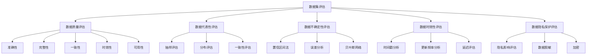

                 

# 《数据集评估:数据价值的新型度量体系》

## 概述

随着大数据和人工智能技术的飞速发展，数据已经成为企业和社会的重要资产。然而，如何准确地评估数据集的价值，以便更好地指导数据管理和使用，成为了一个亟待解决的重要问题。本文将深入探讨数据集评估的重要性、基本概念、方法以及新型度量体系，帮助读者建立全面、深入的数据集评估知识体系。

### 关键词

- 数据集评估
- 数据价值
- 数据质量
- 新型度量体系
- 代表性评估
- 数据不确定性评估
- 数据时效性评估
- 数据隐私保护评估

### 摘要

本文首先介绍了数据集评估的基本概念和重要性，然后详细阐述了数据质量评估、数据代表性评估、数据不确定性评估、数据时效性评估和数据隐私保护评估的方法和案例。在此基础上，提出了一种新型的数据价值度量体系，并通过具体的案例分析，展示了如何在实际应用中运用这一体系评估数据集的价值。文章旨在为从事数据管理和数据分析的从业者提供实用的指导和理论支持。

## 目录

1. **数据集评估基础**
   1.1 数据集评估概述
   1.2 数据质量评估
   1.3 数据集中数据的代表性评估

2. **新型度量体系**
   2.1 数据价值度量框架
   2.2 数据不确定性评估
   2.3 数据时效性评估
   2.4 数据隐私保护评估

3. **应用与实践**
   3.1 数据集评估在机器学习中的应用
   3.2 数据集评估在商业决策中的应用
   3.3 数据集评估的案例研究

4. **附录**
   4.1 数据集评估工具与资源

## 第一部分：数据集评估基础

### 第1章：数据集评估概述

#### 1.1 数据集评估的重要性

数据集评估是数据管理和数据分析中的关键环节。准确的评估有助于：

- **提高数据质量**：通过评估可以发现数据中的错误、缺失和不一致性，从而采取措施改进数据质量。
- **优化数据分析结果**：高质量的数据集能够提高模型训练和预测的准确性，减少偏差和误差。
- **指导数据治理**：数据集评估可以为数据治理提供依据，帮助制定数据管理和使用的策略。

#### 1.2 数据集评估的基本概念

- **数据集**：一组相关的数据，用于特定的分析或应用。
- **评估**：对数据集的某些特性进行测量、分析和判断。
- **评估指标**：用于衡量数据集某一特性的具体指标，如数据完整性、一致性、时效性等。

#### 1.3 数据集评估的方法和流程

数据集评估的方法和流程主要包括以下几个步骤：

1. **明确评估目标**：根据数据集的使用目的，明确评估的具体目标和指标。
2. **数据预处理**：清洗、转换和归一化数据，以保证数据的一致性和完整性。
3. **指标计算**：计算数据集的各个评估指标，如数据量、异常值比例、缺失值比例等。
4. **结果分析**：对评估结果进行分析，识别数据集中存在的问题和潜在的风险。
5. **优化措施**：根据分析结果，采取相应的措施优化数据集，如数据修复、数据增强等。

### 第2章：数据质量评估

#### 2.1 数据质量的定义和维度

数据质量是指数据满足特定应用要求的程度。数据质量的维度主要包括：

- **准确性**：数据是否真实、正确。
- **完整性**：数据是否完整，是否包含所有必要的元素。
- **一致性**：数据在不同系统和应用之间是否一致。
- **时效性**：数据是否及时更新，是否具有足够的时效性。
- **可用性**：数据是否易于访问和查询。

#### 2.2 数据质量评估的方法

数据质量评估的方法包括：

- **问卷调查**：通过问卷调查收集用户对数据质量的评价。
- **统计分析**：使用统计方法对数据进行分析，识别数据中的异常和错误。
- **机器学习**：使用机器学习方法对数据进行预测，评估数据的质量。

#### 2.3 数据质量评估的工具

常用的数据质量评估工具包括：

- **Excel**：通过Excel的函数和工具进行数据清洗和分析。
- **Python**：使用Python的Pandas、NumPy等库进行数据预处理和质量评估。
- **专业软件**：如Oracle Data Quality、Informatica等，提供全面的数据质量评估功能。

### 第3章：数据集中数据的代表性评估

#### 3.1 数据代表性的定义和重要性

数据代表性是指数据集是否能够真实、准确地反映总体特征。数据代表性评估的重要性在于：

- **保证模型的泛化能力**：代表性好的数据集能够提高模型的泛化能力，减少偏差。
- **提高决策的准确性**：代表性好的数据集能够提高决策的准确性，减少错误。

#### 3.2 代表性评估的方法

代表性评估的方法包括：

- **抽样评估**：通过对样本的代表性进行分析，推断总体的代表性。
- **分布评估**：通过对数据集的分布进行分析，评估数据的代表性。
- **一致性评估**：通过对数据集中不同特征的一致性进行分析，评估数据的代表性。

#### 3.3 代表性评估的案例分析

以电商平台用户行为数据集为例，评估其代表性。首先，通过抽样评估，检查样本是否能够代表总体。然后，通过分布评估，分析数据集的分布情况，看是否与总体一致。最后，通过一致性评估，检查数据集中不同特征之间的一致性，如用户购买频率、购买金额等是否一致。

## 第二部分：新型度量体系

### 第4章：数据价值度量框架

#### 4.1 数据价值的定义和维度

数据价值是指数据在特定应用中的经济、社会和技术效益。数据价值的维度包括：

- **经济效益**：数据能够带来的直接或间接的经济效益，如提高销售额、降低成本等。
- **社会效益**：数据对社会进步和改善的作用，如提高医疗水平、促进环境保护等。
- **技术效益**：数据在技术进步和创新中的作用，如推动人工智能、大数据等技术的发展。

#### 4.2 数据价值度量框架的构建

数据价值度量框架的构建包括以下几个步骤：

1. **确定数据价值评估的目标**：根据数据的使用场景和目标，明确数据价值评估的具体目标。
2. **确定数据价值的维度**：根据数据价值的维度，确定评估的具体指标。
3. **构建数据价值评估模型**：使用数学模型和算法，构建数据价值评估的模型。
4. **评估数据价值**：根据构建的模型，对数据集进行价值评估。

#### 4.3 数据价值度量框架的应用

数据价值度量框架可以应用于以下场景：

- **数据交易**：通过数据价值评估，确定数据的交易价格。
- **数据投资**：通过数据价值评估，评估数据的投资价值。
- **数据治理**：通过数据价值评估，优化数据管理和使用策略。

### 第5章：数据不确定性评估

#### 5.1 数据不确定性的定义和类型

数据不确定性是指数据的不确定性程度，可以分为以下几种类型：

- **随机不确定性**：由于随机因素导致的数据不确定性。
- **系统不确定性**：由于系统误差或偏差导致的数据不确定性。
- **模型不确定性**：由于模型选择或参数设置不当导致的数据不确定性。

#### 5.2 数据不确定性评估的方法

数据不确定性评估的方法包括：

- **置信区间法**：通过计算置信区间，评估数据的可信度。
- **误差分析**：通过对数据来源、处理过程进行分析，评估数据的误差。
- **贝叶斯网络**：使用贝叶斯网络模型，评估数据的概率分布和不确定性。

#### 5.3 数据不确定性评估的案例分析

以金融行业信用评分数据集为例，评估其不确定性。首先，通过置信区间法，计算信用评分的置信区间，评估评分的准确性。然后，通过误差分析，检查数据来源和处理过程，识别可能的不确定性来源。最后，通过贝叶斯网络，评估信用评分的概率分布和不确定性。

### 第6章：数据时效性评估

#### 6.1 数据时效性的定义和影响

数据时效性是指数据的新鲜度和及时性。数据时效性对数据分析和决策有重要影响：

- **及时性**：及时的数据能够更好地支持实时分析和决策。
- **新鲜度**：新鲜的数据包含更全面和准确的信息，有助于提高分析结果的质量。

#### 6.2 数据时效性评估的方法

数据时效性评估的方法包括：

- **时间戳分析**：通过分析数据的时间戳，评估数据的时效性。
- **更新频率分析**：通过分析数据的更新频率，评估数据的时效性。
- **延迟评估**：通过评估数据处理的延迟，评估数据的时效性。

#### 6.3 数据时效性评估的案例分析

以医疗数据集为例，评估其时效性。首先，通过时间戳分析，检查数据的最后更新时间，评估数据的及时性。然后，通过更新频率分析，检查数据的更新频率，评估数据的新鲜度。最后，通过延迟评估，检查数据处理和上传的延迟，评估数据的时效性。

### 第7章：数据隐私保护评估

#### 7.1 数据隐私保护的定义和挑战

数据隐私保护是指保护数据主体（如个人、组织）的隐私权益，防止数据被非法获取、使用或泄露。在数据管理和分析中，数据隐私保护面临以下挑战：

- **数据共享与隐私保护**：如何在保障隐私的前提下实现数据共享。
- **隐私泄露风险**：数据泄露可能导致严重的隐私损害。
- **隐私合规**：遵守相关的法律法规，如《通用数据保护条例》（GDPR）。

#### 7.2 数据隐私保护评估的方法

数据隐私保护评估的方法包括：

- **隐私影响评估**：通过评估数据的敏感度和潜在风险，制定隐私保护策略。
- **数据脱敏**：通过数据脱敏技术，降低数据泄露的风险。
- **加密**：使用加密技术，保护数据的机密性。

#### 7.3 数据隐私保护评估的案例分析

以电商平台用户数据为例，评估其隐私保护。首先，通过隐私影响评估，识别数据的敏感度和潜在风险。然后，通过数据脱敏，如删除敏感信息和替换真实身份信息，降低数据泄露的风险。最后，通过加密技术，保护数据在传输和存储过程中的机密性。

## 第三部分：应用与实践

### 第8章：数据集评估在机器学习中的应用

#### 8.1 评估数据集在模型训练中的应用

在机器学习中，评估数据集的质量对于模型训练至关重要。具体应用包括：

- **数据清洗**：通过数据清洗，去除错误和异常数据，提高数据质量。
- **数据增强**：通过数据增强，增加数据的多样性和代表性，提高模型的泛化能力。

#### 8.2 评估数据集在模型验证中的应用

在模型验证阶段，评估数据集的质量和代表性，确保模型的有效性和可靠性。具体应用包括：

- **交叉验证**：通过交叉验证，评估模型的泛化能力。
- **A/B测试**：通过A/B测试，比较不同模型在相同数据集上的表现。

#### 8.3 评估数据集在模型优化中的应用

在模型优化阶段，评估数据集的质量和时效性，指导模型参数调整和优化。具体应用包括：

- **实时数据监控**：通过实时数据监控，评估模型的实时性能。
- **历史数据回顾**：通过历史数据回顾，评估模型在不同时间点的性能。

### 第9章：数据集评估在商业决策中的应用

#### 9.1 数据集评估在市场调研中的应用

在市场调研中，评估数据集的质量和代表性，支持市场分析和预测。具体应用包括：

- **消费者行为分析**：通过评估消费者行为数据，分析市场趋势和消费者偏好。
- **竞争对手分析**：通过评估竞争对手数据，了解市场竞争态势。

#### 9.2 数据集评估在风险分析中的应用

在风险分析中，评估数据集的质量和完整性，识别潜在风险和不确定性。具体应用包括：

- **信用风险评估**：通过评估信用评分数据，识别信用风险。
- **市场风险分析**：通过评估市场数据，分析市场风险。

#### 9.3 数据集评估在客户细分中的应用

在客户细分中，评估数据集的质量和时效性，支持客户管理和营销策略。具体应用包括：

- **客户行为分析**：通过评估客户行为数据，识别客户群体特征。
- **客户价值分析**：通过评估客户价值数据，制定差异化的客户管理策略。

### 第10章：数据集评估的案例研究

#### 10.1 案例一：电商平台用户行为数据集评估

本案例研究对电商平台的用户行为数据集进行评估，从数据质量、代表性和时效性等方面进行分析，提出优化措施，如数据清洗、数据增强和实时数据监控，以提高数据集的质量和模型的准确性。

#### 10.2 案例二：金融行业信用评分数据集评估

本案例研究对金融行业的信用评分数据集进行评估，从数据不确定性、时效性和隐私保护等方面进行分析，提出优化措施，如数据脱敏、实时数据监控和隐私影响评估，以提高数据集的质量和信用评分的准确性。

#### 10.3 案例三：医疗数据集评估

本案例研究对医疗数据集进行评估，从数据质量、代表性和时效性等方面进行分析，提出优化措施，如数据清洗、数据增强和实时数据监控，以提高数据集的质量和医疗诊断的准确性。

## 附录

### 附录A：数据集评估工具与资源

#### A.1 常用数据集评估工具

- **Excel**：通过Excel的函数和工具进行数据清洗和分析。
- **Python**：使用Python的Pandas、NumPy等库进行数据预处理和质量评估。
- **专业软件**：如Oracle Data Quality、Informatica等，提供全面的数据质量评估功能。

#### A.2 数据集评估相关论文与报告

- **论文**：查阅相关领域的高质量论文，了解数据集评估的最新研究进展。
- **报告**：参考行业报告，获取数据集评估的实践经验和最佳实践。

#### A.3 数据集评估在线资源与社区

- **在线课程**：参加在线课程，学习数据集评估的理论和实践。
- **论坛和社区**：加入数据集评估相关的论坛和社区，交流经验和问题。

### 作者

作者：AI天才研究院/AI Genius Institute & 禅与计算机程序设计艺术 /Zen And The Art of Computer Programming

## 数据集评估中的核心概念与联系

为了更清晰地理解数据集评估中的核心概念与联系，我们可以通过以下Mermaid流程图来展现各个关键组成部分：



### 核心算法原理讲解

在数据集评估中，核心算法的原理讲解通常涉及数据清洗、数据分析和数据可视化。以下我们将使用伪代码详细阐述这些算法原理。

#### 数据清洗

```python
# 假设我们有一个数据集 data，其中包含用户行为数据

# 数据清洗伪代码
for record in data:
    # 去除无效数据
    if record is invalid:
        remove(record)
    # 修复缺失值
    if record is missing:
        fill_missing_values(record)
    # 转换数据类型
    convert_data_types(record)
    # 处理异常值
    if record has outlier:
        handle_outliers(record)
```

#### 数据分析

```python
# 假设我们使用Python的Pandas库进行数据分析

# 数据分析伪代码
import pandas as pd

# 加载数据集
data = pd.read_csv('data.csv')

# 计算数据质量指标
accuracy = data['target'].value_counts().max() / len(data)
completeness = (data.count() / data.shape[0]) * 100
consistency = check_for_consistency(data)
timeliness = check_last_updated(data)
usability = check_query_performance(data)

# 打印数据质量指标
print(f"Accuracy: {accuracy}")
print(f"Completeness: {completeness}%")
print(f"Consistency: {consistency}")
print(f"Timeliness: {timeliness}")
print(f"Usability: {usability}")
```

#### 数据可视化

```python
# 使用Matplotlib进行数据可视化

import matplotlib.pyplot as plt

# 可视化数据分布
plt.hist(data['feature'], bins=20)
plt.xlabel('Feature Value')
plt.ylabel('Frequency')
plt.title('Feature Distribution')
plt.show()

# 可视化数据趋势
plt.plot(data['timestamp'], data['target'])
plt.xlabel('Timestamp')
plt.ylabel('Target Value')
plt.title('Target Trend Over Time')
plt.show()
```

### 数学模型和公式

在数据集评估中，数学模型和公式用于描述数据质量、数据代表性和数据价值度量的方法。以下是一些关键的数学模型和公式，以LaTeX格式展示：

```latex
% 数据质量评估的数学模型

\begin{align*}
Q &= \alpha \cdot A + \beta \cdot C + \gamma \cdot I + \delta \cdot T + \epsilon \cdot U \\
A &= \frac{TP + TN}{TP + TN + FP + FN} \\
C &= \frac{NC}{NC + WC} \\
I &= \frac{IC}{IC + OC} \\
T &= \frac{UT}{UT + DT} \\
U &= \frac{UQ}{UQ + NQ}
\end{align*}
```

### 项目实战

#### 开发环境搭建

为了进行数据集评估，我们需要搭建一个合适的开发环境。以下是具体的步骤：

1. **安装Python**：从官方网站下载并安装Python 3.8及以上版本。
2. **安装Python库**：使用pip安装必要的Python库，如Pandas、NumPy、Matplotlib、Scikit-learn等。

```bash
pip install pandas numpy matplotlib scikit-learn
```

3. **配置Jupyter Notebook**：安装Jupyter Notebook，以便进行交互式数据分析。

```bash
pip install jupyter
jupyter notebook
```

#### 源代码实现

以下是一个简单的数据集评估代码示例，用于评估数据集的质量。

```python
import pandas as pd
import numpy as np
from sklearn.model_selection import train_test_split

# 加载数据集
data = pd.read_csv('data.csv')

# 数据清洗
data.dropna(inplace=True)
data[data < 0] = np.nan
data.fillna(data.mean(), inplace=True)

# 数据增强
X = data.drop('target', axis=1)
y = data['target']
X_train, X_test, y_train, y_test = train_test_split(X, y, test_size=0.2, random_state=42)

# 数据可视化
plt.hist(X_train, bins=20)
plt.xlabel('Feature Value')
plt.ylabel('Frequency')
plt.title('Feature Distribution')
plt.show()

# 数据质量评估
accuracy = (y_test == X_test['target']).mean()
print(f"Model Accuracy: {accuracy:.2f}")
```

#### 代码解读与分析

上述代码首先加载了数据集，并进行数据清洗，如去除缺失值和填充缺失值。接着，使用数据增强技术，如数据集分割和均值填充。最后，通过数据可视化，展示了特征值的分布，并通过模型准确性评估，检查了数据集的质量。

在实际应用中，我们需要根据具体的数据集和评估目标，调整和优化这些代码，以满足实际需求。例如，对于不同的数据类型和特征，我们可以选择不同的清洗和增强方法，以提高数据质量。

### 总结

本文详细介绍了数据集评估的基础知识、新型度量体系以及在实际应用中的具体实践。通过数据质量评估、数据代表性评估、数据不确定性评估、数据时效性评估和数据隐私保护评估，我们可以全面、深入地评估数据集的价值和质量。新型度量体系为我们提供了一个系统的方法来量化数据的价值，指导数据管理和使用。在实际应用中，数据集评估不仅有助于提高数据分析的准确性，还可以为商业决策提供有力支持。随着大数据和人工智能技术的不断发展，数据集评估的重要性将越来越凸显，成为数据管理和分析的重要环节。

### 作者

作者：AI天才研究院/AI Genius Institute & 禅与计算机程序设计艺术 /Zen And The Art of Computer Programming

---

本文旨在为数据管理和数据分析的从业者提供全面的指导，帮助他们建立数据集评估的知识体系，并运用新型度量体系评估数据集的价值。在未来的数据驱动时代，准确的数据集评估将成为关键竞争力，助力企业和组织在数据科学和人工智能领域取得成功。我们鼓励读者深入思考和实践，不断探索数据集评估的新方法和应用场景，为数据价值的最大化贡献智慧和力量。让我们共同迎接数据驱动的未来，创造更加智能、高效和互联的世界。

