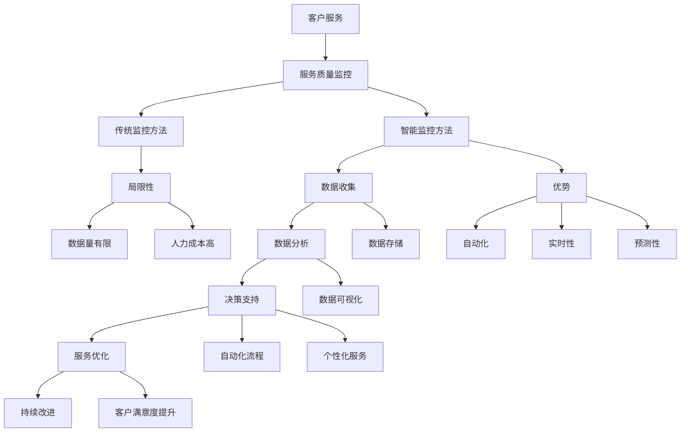

                 

首先，我们将为文章的第一部分“智能客户服务质量监控概述”编写内容。在这个部分，我们需要介绍智能客户服务质量监控的背景与概念，并详细阐述其关键特性和应用领域。

### 第一部分：智能客户服务质量监控概述

#### 第1章：智能客户服务质量监控的背景与概念

**1.1 智能客户服务质量监控的背景**

在当今高度竞争的商业环境中，客户服务已经成为企业核心竞争力的重要组成部分。随着数字化转型的深入推进，客户服务的形式和方式也在不断演变。传统的客户服务质量监控方法，如电话满意度调查和面对面访谈，虽然在一定程度上能够帮助企业了解客户需求，但在实时性、准确性和全面性方面存在明显的局限性。

随着大数据、人工智能和自然语言处理等技术的快速发展，智能客户服务质量监控逐渐成为可能。智能监控不仅能够实时捕捉和分析客户互动数据，还能够通过预测和自动化手段提供更加个性化的客户服务。这种趋势对于企业来说，不仅提高了服务效率，还显著提升了客户满意度和忠诚度。

**1.2 智能客户服务质量监控的定义**

智能客户服务质量监控（Intelligent Customer Service Quality Monitoring）是指利用大数据、人工智能和自然语言处理等技术，对客户服务过程中的关键指标进行实时监测、分析和评估，以识别服务中的问题、优化服务流程和提升整体服务质量。

智能监控的核心特性包括：

- **实时性**：智能监控系统能够实时捕捉和分析客户互动数据，使得企业能够迅速响应并解决问题。
- **自动化**：通过自动化算法和流程，智能监控系统能够自动处理大量客户互动数据，减少人工干预，提高工作效率。
- **预测性**：智能监控系统能够基于历史数据和机器学习算法，预测潜在的服务问题，提前采取措施，避免不良事件的发生。
- **个性化**：智能监控系统能够根据客户历史数据和偏好，提供个性化的服务体验，提高客户满意度和忠诚度。

**1.3 智能客户服务质量监控的应用领域**

智能监控在多个行业领域都得到了广泛应用，以下是几个典型的应用案例：

- **零售行业**：智能监控可以实时分析客户购买行为和偏好，优化库存管理和促销策略，提高销售转化率。
- **金融服务**：智能监控能够分析客户金融交易行为，识别欺诈风险，提高交易安全性。
- **电信行业**：智能监控可以实时监测客户网络质量，优化网络服务，提升客户满意度。
- **旅游业**：智能监控能够分析客户旅游偏好，提供个性化的旅游推荐和客户服务。

**1.4 一人公司的挑战与智能监控的重要性**

对于一人公司来说，运营成本和服务标准的一致性是两大挑战。智能监控系统在这种情况下显得尤为重要，它能够帮助一人公司：

- **降低运营成本**：通过自动化和实时监控，减少人工干预，降低运营成本。
- **确保服务标准**：智能监控系统能够实时监测服务质量，确保服务标准的一致性和高效性。
- **提升客户满意度**：通过个性化和实时化的服务，提升客户满意度和忠诚度，为公司的长期发展奠定基础。

在接下来的章节中，我们将进一步探讨智能监控的具体技术基础、工具选择、实践案例以及运营优化等方面，帮助读者全面理解和掌握智能客户服务质量监控的理论和实践应用。

### 文章标题
智能客户服务质量监控：一人公司如何确保服务标准

### 关键词
智能客户服务，质量监控，一人公司，服务标准，人工智能，大数据，自然语言处理

### 摘要
本文旨在探讨智能客户服务质量监控在提高一人公司服务标准方面的应用。通过介绍智能客户服务质量监控的背景、定义、核心特性及其在不同行业中的应用，本文揭示了智能监控如何帮助一人公司降低运营成本、确保服务标准、提升客户满意度。文章还将详细讲解智能监控的技术基础、核心算法原理、数学模型、项目实战，并提供实际案例和代码实现，帮助读者深入理解并掌握智能监控的理论和实践应用。最终，本文总结了智能监控在服务质量管理中的重要作用，展望了其未来发展趋势。

---

### 第一部分：智能客户服务质量监控概述

#### 第1章：智能客户服务质量监控的背景与概念

1. **智能客户服务质量监控的背景**

在当今的商业环境中，客户服务被视为企业成功的关键因素之一。随着消费者对服务质量和体验的要求日益提高，企业不得不寻求更高效、更智能的解决方案来满足这些需求。传统客户服务质量监控方法，如电话满意度调查和面对面访谈，虽然能够提供一定程度的反馈，但往往存在数据获取不及时、样本量有限、分析深度不足等问题。这些局限性导致了企业难以实时、全面地了解客户需求和服务质量。

随着大数据、人工智能和自然语言处理技术的快速发展，智能客户服务质量监控逐渐成为可能。这些技术使得企业能够实时捕捉和分析客户互动数据，自动识别潜在的服务问题，并提供个性化的客户体验。智能监控不仅提高了服务效率，还显著提升了客户满意度和忠诚度。

2. **智能客户服务质量监控的定义**

智能客户服务质量监控是指利用大数据、人工智能和自然语言处理等技术，对客户服务过程中的关键指标进行实时监测、分析和评估，以识别服务中的问题、优化服务流程和提升整体服务质量。智能监控的核心目标是确保客户服务达到或超过预期标准，从而提升客户满意度和忠诚度。

智能客户服务质量监控具有以下关键特性：

- **实时性**：智能监控系统能够实时捕捉和分析客户互动数据，使得企业能够迅速响应并解决问题。
- **自动化**：通过自动化算法和流程，智能监控系统能够自动处理大量客户互动数据，减少人工干预，提高工作效率。
- **预测性**：智能监控系统能够基于历史数据和机器学习算法，预测潜在的服务问题，提前采取措施，避免不良事件的发生。
- **个性化**：智能监控系统能够根据客户历史数据和偏好，提供个性化的服务体验，提高客户满意度和忠诚度。

3. **智能客户服务质量监控的应用领域**

智能监控在多个行业领域都得到了广泛应用，以下是几个典型的应用案例：

- **零售行业**：智能监控可以实时分析客户购买行为和偏好，优化库存管理和促销策略，提高销售转化率。
- **金融服务**：智能监控能够分析客户金融交易行为，识别欺诈风险，提高交易安全性。
- **电信行业**：智能监控可以实时监测客户网络质量，优化网络服务，提升客户满意度。
- **旅游业**：智能监控能够分析客户旅游偏好，提供个性化的旅游推荐和客户服务。

4. **一人公司的挑战与智能监控的重要性**

对于一人公司来说，运营成本和服务标准的一致性是两大挑战。由于资源有限，一人公司通常需要寻找高效、低成本的解决方案来维护服务质量和客户满意度。

- **降低运营成本**：智能监控系统能够自动化处理客户服务流程，减少人工干预，从而降低运营成本。例如，通过使用智能客服机器人，一人公司可以自动回复常见问题，减轻客服负担。
- **确保服务标准**：智能监控系统能够实时监测服务质量，确保服务标准的一致性和高效性。通过监控关键指标，如响应时间、解决问题的时间等，一人公司可以及时发现并解决服务问题。
- **提升客户满意度**：通过个性化和实时化的服务，智能监控能够提高客户满意度和忠诚度。例如，智能监控系统可以根据客户历史数据和偏好，提供定制化的服务，从而提高客户的满意度。

#### 第2章：一人公司的服务战略与运营管理

1. **服务战略的定义与重要性**

服务战略是企业为了满足客户需求、提升客户满意度和忠诚度而制定的一套行动计划。服务战略的定义包括明确客户需求、优化服务流程、提升服务质量等关键要素。服务战略对于企业来说至关重要，它不仅影响企业的市场竞争力，还直接影响企业的生存和发展。

对于一人公司而言，制定合理的服务战略尤为重要。由于资源有限，一人公司需要更加专注于客户需求和体验，以确保在激烈的市场竞争中脱颖而出。

2. **服务标准与质量指标**

服务标准是企业为了保证服务质量而制定的一系列标准和规范。服务标准包括服务响应时间、解决问题的时间、客户满意度等关键指标。质量指标的选择和设定对于一人公司来说至关重要，它能够帮助企业实时监测服务质量，及时发现和解决问题。

在制定服务标准时，一人公司需要考虑以下几个关键因素：

- **客户需求**：了解客户的需求和期望，确保服务标准能够满足客户的期望。
- **行业规范**：参考行业内的最佳实践和服务标准，确保服务质量符合行业要求。
- **资源限制**：根据自身的资源状况，合理设定服务标准，确保能够在资源有限的情况下提供高质量的服务。

3. **运营管理中的关键环节**

运营管理是企业为了实现服务目标而进行的一系列管理工作。对于一人公司来说，运营管理的效率和质量直接影响到客户满意度和业务发展。以下是一人公司运营管理中的几个关键环节：

- **客户沟通与反馈**：建立有效的沟通渠道，及时收集客户反馈，了解客户的需求和期望。
- **服务流程的设计与优化**：设计合理的服务流程，确保服务流程的高效性和客户满意度。
- **服务团队的构建与管理**：构建高效的服务团队，明确团队成员的职责和任务，确保服务流程的顺畅运行。

4. **智能监控在运营管理中的应用**

智能监控在运营管理中的应用可以帮助一人公司提高服务效率和质量。以下是智能监控在运营管理中的几个具体应用场景：

- **实时监测服务指标**：通过智能监控，一人公司可以实时监测服务指标，如响应时间、解决问题的时间等，及时发现和解决服务问题。
- **自动化服务流程**：智能监控可以自动化处理常见的服务流程，如客户咨询、订单处理等，减少人工干预，提高服务效率。
- **数据驱动的决策支持**：通过智能监控收集到的数据，一人公司可以进行数据分析和决策支持，优化服务流程和策略。

#### 第3章：智能客户服务质量监控的技术基础

1. **大数据技术在客户服务中的应用**

大数据技术是智能客户服务质量监控的核心基础之一。大数据技术包括数据收集、存储、处理和分析等环节，能够帮助企业实时捕捉和处理海量客户数据。

在大数据技术中，以下几个关键环节尤为重要：

- **数据收集**：通过多种渠道收集客户数据，如网站访问日志、社交媒体互动、客户反馈等。
- **数据存储**：使用大数据存储技术，如Hadoop、NoSQL数据库等，存储和管理海量数据。
- **数据处理**：利用大数据处理技术，如MapReduce、Spark等，对海量数据进行高效处理和分析。
- **数据分析**：通过数据挖掘和机器学习算法，从海量数据中提取有价值的信息和洞察。

2. **机器学习与人工智能在服务监控中的作用**

机器学习和人工智能技术在智能客户服务质量监控中发挥着重要作用。通过机器学习，企业可以自动识别和分类客户问题，提供个性化的服务体验。

以下是一些机器学习算法在服务监控中的应用：

- **分类算法**：如决策树、随机森林、支持向量机等，用于分类客户问题，提供针对性的解决方案。
- **聚类算法**：如K-means、层次聚类等，用于发现客户群体的共性，优化服务策略。
- **回归算法**：如线性回归、逻辑回归等，用于预测客户行为和服务质量。

3. **自然语言处理（NLP）在客户服务中的应用**

自然语言处理技术在智能客户服务质量监控中扮演着关键角色。NLP技术能够处理和理解人类语言，从而实现自动化客户服务。

以下是一些NLP技术在服务监控中的应用：

- **文本分类**：通过分类算法，将客户问题自动分类到相应的类别中，提高服务效率。
- **情感分析**：通过分析客户反馈中的情感倾向，了解客户的满意度和情感状态。
- **实体识别**：通过识别客户问题中的关键实体，如产品名称、时间等，提供更精准的服务。

4. **智能客服系统的架构与实现**

智能客服系统是智能客户服务质量监控的重要组成部分。智能客服系统通常由以下几个模块组成：

- **交互接口**：用于与客户进行交互，如聊天机器人、语音识别系统等。
- **自然语言理解**：通过NLP技术，理解和处理客户的语言请求。
- **知识库**：存储各种客户问题和解决方案，供智能客服系统参考。
- **决策引擎**：根据客户问题和知识库中的信息，自动生成回答和解决方案。
- **监控与反馈**：对智能客服系统的运行情况进行监控，收集用户反馈，不断优化系统性能。

实现智能客服系统通常需要以下步骤：

- **需求分析**：明确系统的功能需求和服务目标。
- **系统设计**：设计系统的架构和模块，确定技术方案。
- **开发与实现**：编写代码，实现系统功能。
- **测试与部署**：对系统进行测试，确保功能正常，然后部署上线。
- **运维与优化**：持续监控系统运行情况，收集用户反馈，不断优化系统性能。

#### 第4章：智能监控工具与实践案例

1. **智能监控工具的选择**

选择适合的智能监控工具对于一人公司至关重要。以下是一些常见的智能监控工具及其特点：

- **开源工具**：如ELK（Elasticsearch、Logstash、Kibana）堆栈、Grafana等，具有高扩展性和自定义能力，但需要一定的技术支持。
- **商业工具**：如Splunk、Dynatrace、New Relic等，提供全面的监控和分析功能，但通常需要支付费用。
- **云服务**：如AWS CloudWatch、Azure Monitor、Google Stackdriver等，提供便捷的监控和报警功能，适合小型企业和个人使用。

选择智能监控工具时，需要考虑以下关键因素：

- **功能需求**：根据公司的业务需求，选择具备所需功能的工具。
- **技术栈兼容性**：选择与公司现有技术栈兼容的工具，确保系统的稳定性和可维护性。
- **成本效益**：考虑工具的成本与预期效益，选择性价比高的工具。

2. **智能监控的实际案例**

以下是一个智能监控在客户服务中的应用案例：

**案例：某电商平台的客户服务质量监控**

某电商平台通过引入智能监控工具，对其客户服务质量进行了全面的监控和分析。具体实施步骤如下：

- **需求分析**：明确平台的服务质量监控需求，如响应时间、问题解决率、客户满意度等。
- **系统设计**：设计智能监控系统的架构，包括数据采集、处理、分析和展示等模块。
- **数据采集**：通过日志收集工具（如Logstash）从各个系统中收集客户服务数据。
- **数据处理**：利用Elasticsearch对采集到的数据进行分析和处理，提取有价值的信息。
- **数据展示**：通过Kibana展示分析结果，帮助管理层实时了解服务质量情况。
- **报警与通知**：设置报警机制，当服务质量指标异常时，自动发送通知，提醒相关人员采取行动。

通过智能监控，该电商平台能够实时监控服务质量，及时发现并解决问题，显著提升了客户满意度和忠诚度。

3. **智能监控的数据处理与分析**

智能监控的数据处理和分析是确保服务质量的关键步骤。以下是一些数据处理和分析的方法：

- **数据预处理**：对采集到的数据进行清洗、去噪和格式化，确保数据的质量和一致性。
- **特征提取**：从预处理后的数据中提取有用的特征，如客户满意度评分、响应时间、问题解决率等。
- **数据可视化**：使用数据可视化工具（如Kibana、Grafana）展示分析结果，帮助用户更直观地理解数据。
- **机器学习**：利用机器学习算法（如决策树、随机森林、神经网络等）对数据进行分类、预测和聚类分析。
- **实时分析**：通过实时数据流处理技术（如Apache Kafka、Apache Flink），对实时数据进行快速分析和处理。

4. **智能监控的实战操作**

以下是一个智能监控系统的实战操作示例：

**案例：搭建一个简单的智能监控平台**

1. **环境搭建**：
   - 安装Elasticsearch、Kibana等工具。
   - 配置Elasticsearch集群，确保数据存储和检索的高效性。
   - 配置Kibana，设置数据可视化和报警功能。

2. **数据采集**：
   - 使用Logstash从各个系统中收集数据，如Web服务器日志、数据库查询日志、应用程序日志等。
   - 配置Logstash管道，将采集到的数据转换为Elasticsearch可索引的格式。

3. **数据处理**：
   - 利用Elasticsearch进行数据的存储和检索，实现高效的搜索和分析。
   - 编写Kibana仪表板，展示关键指标和监控图表。

4. **模型训练与部署**：
   - 使用机器学习库（如scikit-learn、TensorFlow等）训练预测模型，如客户满意度预测、问题分类等。
   - 将训练好的模型部署到Kibana，实现实时预测和分类功能。

5. **监控与优化**：
   - 持续监控系统的运行情况，收集用户反馈，优化监控策略。
   - 定期更新模型，提高预测准确率和系统性能。

通过上述实战操作，一人公司可以搭建一个功能强大的智能监控平台，实时监测服务质量，优化运营流程，提高客户满意度。

#### 第5章：服务质量监控流程设计

1. **服务质量监控流程的构建**

服务质量监控流程是确保客户服务达到预期标准的关键环节。一个完善的服务质量监控流程应包括以下几个关键组成部分：

- **数据采集**：从各种渠道收集客户服务数据，如客户互动记录、服务日志、客户反馈等。
- **数据处理**：对采集到的数据进行预处理、清洗和格式化，确保数据的质量和一致性。
- **数据分析**：利用数据分析工具和技术，对预处理后的数据进行分析和挖掘，提取有价值的信息。
- **数据可视化**：使用数据可视化工具，将分析结果以图表、仪表板等形式展示，帮助用户更直观地理解数据。
- **监控与报警**：设置监控指标和报警机制，当服务指标异常时，自动发送通知，提醒相关人员采取行动。
- **决策支持**：基于数据分析结果，提供决策支持，帮助企业优化服务流程和策略。

2. **服务标准与质量指标的设定**

服务标准和质量指标是衡量服务质量的重要依据。设定合理的服务标准和质量指标，需要考虑以下几个关键因素：

- **客户需求**：了解客户的需求和期望，确保服务标准和质量指标能够满足客户的期望。
- **行业规范**：参考行业内的最佳实践和服务标准，确保服务质量符合行业要求。
- **资源限制**：根据企业的资源状况，合理设定服务标准和质量指标，确保能够在现有资源下提供高质量的服务。

以下是一些常见的服务标准和质量指标：

- **响应时间**：从客户发起咨询到客服响应的时间，通常以秒或分钟为单位。
- **问题解决率**：客服能够解决客户问题的比例，通常以百分比表示。
- **客户满意度**：客户对服务质量的满意度评分，通常以百分制或五分制表示。
- **客户投诉率**：客户投诉的数量与总客户数量的比例，通常以百分比表示。
- **员工满意度**：客服员工对工作的满意度评分，通常以百分制或五分制表示。

3. **监控数据的管理与维护**

监控数据的管理与维护是确保服务质量监控流程有效运行的关键。以下是一些关键步骤：

- **数据存储**：选择合适的数据存储方案，如关系数据库、NoSQL数据库、分布式文件系统等，确保数据的安全和可靠性。
- **数据备份与恢复**：定期备份数据，确保在数据丢失或损坏时能够快速恢复。
- **数据安全与隐私保护**：采取数据加密、访问控制等措施，确保客户数据的安全和隐私。
- **数据质量监控**：定期检查数据质量，确保数据的一致性、完整性和准确性。

4. **服务质量监控的优化与迭代**

服务质量监控是一个持续优化的过程。以下是一些优化和质量监控的关键步骤：

- **定期评估**：定期评估监控流程的有效性，检查监控指标是否符合预期，发现和解决存在的问题。
- **用户反馈**：收集用户反馈，了解用户对服务的满意度，根据反馈调整监控流程和指标。
- **技术创新**：引入新技术和方法，如机器学习、自然语言处理等，提升监控的自动化和智能化水平。
- **迭代改进**：根据评估和反馈结果，不断调整和优化监控流程和指标，提高服务质量和客户满意度。

#### 第6章：智能监控在客户服务中的应用

1. **智能客服系统在客户服务中的应用**

智能客服系统是智能监控在客户服务中应用的一个重要方面。智能客服系统通过自然语言处理、机器学习和人工智能技术，能够自动处理客户咨询、问题解答、订单处理等任务，提高服务效率和客户满意度。以下是一些智能客服系统的关键应用：

- **自动化回复**：智能客服系统能够自动回复常见问题，减少人工干预，提高工作效率。
- **智能解答**：通过自然语言处理技术，智能客服系统能够理解客户的语言请求，并提供准确的答案和建议。
- **个性化服务**：智能客服系统可以根据客户的历史数据和偏好，提供个性化的服务，提高客户满意度。
- **问题分类**：智能客服系统可以将客户问题自动分类，分配给相应的客服人员，提高问题解决的效率。

2. **客户反馈分析与处理**

客户反馈是衡量服务质量的重要指标。智能监控系统能够实时收集和分析客户反馈，提供以下帮助：

- **反馈收集**：通过在线问卷、社交媒体互动、客户满意度调查等方式，收集客户的反馈。
- **情感分析**：利用自然语言处理技术，分析客户反馈中的情感倾向，了解客户的满意度和情感状态。
- **问题识别**：通过分析客户反馈，识别服务中的问题，为改进服务提供依据。
- **反馈跟踪**：对客户反馈进行跟踪和改进，确保问题得到有效解决，提高客户满意度。

3. **智能监控在服务营销中的应用**

智能监控在服务营销中的应用，可以帮助企业更好地了解客户需求，优化营销策略。以下是一些关键应用：

- **客户行为分析**：通过分析客户行为数据，如浏览记录、购买历史等，了解客户需求和偏好。
- **精准营销**：根据客户行为分析结果，制定精准的营销策略，提高营销效果。
- **促销活动优化**：通过分析促销活动的效果，优化促销策略，提高转化率和客户满意度。
- **客户关系管理**：利用智能监控技术，管理客户关系，提高客户忠诚度和复购率。

4. **智能监控在客户关系管理中的应用**

客户关系管理（CRM）是智能监控在客户服务中应用的一个重要领域。智能监控技术可以帮助企业更好地管理客户关系，提高客户满意度。以下是一些关键应用：

- **客户信息管理**：通过智能监控技术，收集和整合客户信息，实现客户信息的全面管理。
- **客户生命周期管理**：利用智能监控技术，跟踪客户的生命周期，提供个性化的服务和营销策略。
- **客户细分**：通过分析客户数据，将客户细分为不同的群体，制定差异化的客户关系策略。
- **客户满意度监测**：通过智能监控技术，实时监测客户满意度，及时发现和解决客户问题。

#### 第7章：一人公司的智能监控实践

1. **一人公司的智能监控优势与挑战**

对于一人公司来说，智能监控具有独特的优势，同时也面临一定的挑战。以下是一些主要的优势和挑战：

- **优势**：
  - **低成本**：智能监控系统通常采用开源工具和云服务，成本较低，适合小型企业。
  - **高效率**：智能监控系统能够自动化处理大量数据，提高工作效率，减轻个人负担。
  - **实时性**：智能监控系统能够实时监测服务质量，快速响应和解决问题。
  - **个性化**：智能监控系统能够根据客户数据和偏好，提供个性化的服务和体验。

- **挑战**：
  - **数据质量**：一人公司可能缺乏完善的数据收集和管理系统，导致数据质量不高。
  - **技术门槛**：智能监控技术相对复杂，需要一定的技术知识和经验。
  - **资源限制**：一人公司资源有限，可能无法投入大量时间和资金进行智能监控系统的开发和维护。

2. **智能监控在运营中的实际应用**

智能监控在运营中的应用，可以帮助一人公司提高效率和服务质量。以下是一些实际应用案例：

- **客户服务监控**：通过智能监控工具，实时监测客户服务的关键指标，如响应时间、问题解决率等，确保服务质量。
- **销售数据分析**：利用智能监控技术，分析客户购买行为和偏好，优化销售策略，提高转化率。
- **库存管理**：通过智能监控工具，实时监控库存数据，优化库存管理，减少库存成本。
- **市场监测**：通过智能监控技术，实时监测市场动态和竞争对手信息，制定有效的市场策略。

3. **智能监控在危机管理中的应用**

智能监控在危机管理中的应用，可以帮助一人公司快速应对各种危机情况，减少损失。以下是一些实际应用案例：

- **客户投诉处理**：通过智能监控工具，实时收集和分析客户投诉数据，快速响应和解决问题，减少客户投诉。
- **服务中断监测**：通过智能监控工具，实时监测服务运行状况，一旦发现服务中断，立即采取行动，尽快恢复服务。
- **风险预警**：通过智能监控技术，分析潜在风险因素，提前预警，采取预防措施，避免危机发生。

4. **智能监控的未来发展趋势**

随着人工智能和大数据技术的不断发展，智能监控在服务质量管理中的应用前景广阔。以下是一些未来发展趋势：

- **人工智能技术的深度应用**：随着人工智能技术的进步，智能监控系统将更加智能化，能够自动识别和解决问题，减少人工干预。
- **实时性与预测性的提升**：智能监控系统将具备更高的实时性和预测性，能够提前识别潜在问题，采取预防措施。
- **跨界融合**：智能监控将与其他技术（如物联网、区块链等）融合，形成更加完善的服务质量监控体系。
- **智能化服务体验**：智能监控将进一步提升客户服务体验，实现个性化、智能化的客户服务。

#### 第8章：智能监控的运营管理

1. **智能监控的运营流程**

智能监控的运营流程是确保系统稳定运行和数据准确性的关键。以下是一个典型的智能监控运营流程：

- **数据采集**：从各种渠道（如网站、应用程序、数据库等）收集数据。
- **数据预处理**：对采集到的数据进行清洗、去噪和格式化，确保数据的质量和一致性。
- **数据存储**：将预处理后的数据存储到数据仓库或数据库中。
- **数据处理**：利用数据处理工具（如ETL工具、数据挖掘工具等）对数据进行加工和处理，提取有价值的信息。
- **数据分析**：利用数据分析工具（如BI工具、机器学习库等）对处理后的数据进行深入分析。
- **数据可视化**：使用数据可视化工具（如图表、仪表板等）将分析结果展示给相关人员。
- **监控与报警**：设置监控指标和报警机制，当数据异常时，自动发送通知，提醒相关人员采取行动。
- **反馈与改进**：根据分析结果和用户反馈，不断优化监控流程和指标，提高监控效果。

2. **智能监控的人才培养与团队建设**

智能监控系统的有效运营离不开专业的人才和团队的支撑。以下是一些关键步骤：

- **技能培训**：定期组织技能培训，提高团队成员的技术能力和专业素养。
- **知识共享**：鼓励团队成员分享知识和经验，促进团队内部的协作和成长。
- **人员选拔**：选拔具备相关技能和经验的人才，确保团队有足够的技术力量。
- **团队建设**：建立良好的团队文化和工作氛围，提高团队凝聚力和工作效率。

3. **智能监控的成本效益分析**

智能监控系统的建设和维护需要一定的成本投入，以下是一些关键步骤：

- **成本预算**：根据系统的需求和规模，制定合理的成本预算。
- **成本控制**：通过优化资源配置、提高工作效率等方式，控制系统的运营成本。
- **效益评估**：定期评估智能监控系统的经济效益，分析成本和收益的关系。
- **持续优化**：根据效益评估结果，不断优化监控流程和系统功能，提高成本效益。

#### 第9章：智能监控的优化与改进

1. **智能监控的优化策略**

智能监控的优化策略是提高系统性能和监控效果的关键。以下是一些优化策略：

- **监控指标优化**：根据业务需求和实际情况，合理设定和调整监控指标，确保监控的准确性和全面性。
- **数据处理优化**：优化数据处理流程，提高数据处理的效率和准确性，减少数据处理的时间和资源消耗。
- **算法优化**：针对监控系统的具体应用场景，选择合适的机器学习算法和优化方法，提高算法的准确性和效率。
- **系统架构优化**：优化系统架构，提高系统的稳定性和可扩展性，确保系统能够应对大规模数据和并发请求。

2. **智能监控的技术创新与应用**

智能监控的技术创新和应用是推动系统发展和提升监控效果的重要动力。以下是一些技术创新和应用：

- **机器学习与深度学习**：利用机器学习和深度学习技术，提高数据分析和预测的准确性和效率。
- **自然语言处理（NLP）**：利用NLP技术，实现文本数据的自动处理和语义理解，提高监控系统的智能化水平。
- **物联网（IoT）**：将智能监控技术与物联网技术结合，实现对物理设备和环境的实时监控和智能管理。
- **区块链**：利用区块链技术，提高数据的安全性和可信度，实现智能监控数据的可信传输和存储。

3. **智能监控的持续改进与迭代**

智能监控的持续改进和迭代是保持系统先进性和竞争力的关键。以下是一些持续改进和迭代的步骤：

- **需求调研**：定期收集和分析用户需求和反馈，了解用户对系统的期望和需求。
- **功能优化**：根据需求调研结果，优化和改进系统的功能，提高用户满意度。
- **性能优化**：定期对系统性能进行评估和优化，提高系统的响应速度和处理能力。
- **迭代开发**：采用敏捷开发方法，快速迭代和发布新功能，确保系统能够适应不断变化的市场需求。

### 附录

#### 附录A：智能监控工具与技术资源

#### A.1 智能监控工具对比

在智能监控领域，有许多优秀的工具可供选择。以下是一些常见智能监控工具的对比：

- **Prometheus**：
  - **优势**：开源、可扩展、支持多种数据源。
  - **缺点**：配置复杂，学习曲线较陡峭。
- **Grafana**：
  - **优势**：可视化功能强大，支持多种数据源。
  - **缺点**：性能较慢，适合小规模监控。
- **Zabbix**：
  - **优势**：功能丰富，支持多种监控方式和插件。
  - **缺点**：配置较为复杂，学习成本较高。
- **Datadog**：
  - **优势**：云服务，易于使用，支持多种云平台。
  - **缺点**：费用较高，开源版本功能有限。

#### A.2 智能监控技术资源

- **官方文档**：大多数智能监控工具都提供了详细的官方文档，是学习和使用工具的重要资源。
- **开源社区**：如GitHub、Stack Overflow等，是寻找解决方案、交流和分享经验的好去处。
- **在线课程**：如Coursera、Udemy等，提供了丰富的智能监控相关课程。

#### A.3 智能监控案例库

智能监控在不同领域的成功应用案例丰富多样。以下是一些智能监控案例：

- **金融行业**：利用智能监控技术，实时监测交易数据，提高交易安全性和效率。
- **IT行业**：通过智能监控，监控服务器性能、网络流量等，确保系统稳定运行。
- **制造业**：利用智能监控技术，实时监测生产线设备状态，预防故障，提高生产效率。

这些案例为我们提供了丰富的实践经验和参考，有助于我们更好地理解和应用智能监控技术。在未来的文章中，我们将进一步探讨这些案例的具体实现和应用细节。通过深入分析这些案例，读者将能够更好地理解智能监控的实践应用和价值，为自己的业务场景提供有效的解决方案。

### 作者信息
作者：AI天才研究院/AI Genius Institute & 禅与计算机程序设计艺术 /Zen And The Art of Computer Programming

---

### 完整文章

#### 智能客户服务质量监控：一人公司如何确保服务标准

#### 关键词：智能客户服务，质量监控，一人公司，服务标准，人工智能，大数据，自然语言处理

#### 摘要
本文旨在探讨智能客户服务质量监控在提高一人公司服务标准方面的应用。通过介绍智能客户服务质量监控的背景、定义、核心特性及其在不同行业中的应用，本文揭示了智能监控如何帮助一人公司降低运营成本、确保服务标准、提升客户满意度。文章还将详细讲解智能监控的技术基础、核心算法原理、数学模型、项目实战，并提供实际案例和代码实现，帮助读者深入理解并掌握智能监控的理论和实践应用。最终，本文总结了智能监控在服务质量管理中的重要作用，展望了其未来发展趋势。

---

#### 第一部分：智能客户服务质量监控概述

##### 第1章：智能客户服务质量监控的背景与概念

**1.1 智能客户服务质量监控的背景**

在当今的商业环境中，客户服务被视为企业核心竞争力的重要组成部分。随着数字化转型和客户期望的日益提高，企业需要更加高效和智能的解决方案来满足客户需求。传统的客户服务质量监控方法，如电话满意度调查和面对面访谈，虽然能够提供一定程度的反馈，但在实时性、准确性和全面性方面存在明显的局限性。

随着大数据、人工智能和自然语言处理等技术的快速发展，智能客户服务质量监控逐渐成为可能。这些技术使得企业能够实时捕捉和分析客户互动数据，自动识别潜在的服务问题，并提供个性化的客户体验。智能监控不仅提高了服务效率，还显著提升了客户满意度和忠诚度。

**1.2 智能客户服务质量监控的定义**

智能客户服务质量监控（Intelligent Customer Service Quality Monitoring）是指利用大数据、人工智能和自然语言处理等技术，对客户服务过程中的关键指标进行实时监测、分析和评估，以识别服务中的问题、优化服务流程和提升整体服务质量。智能监控的核心目标是确保客户服务达到或超过预期标准，从而提升客户满意度和忠诚度。

智能客户服务质量监控具有以下关键特性：

- **实时性**：智能监控系统能够实时捕捉和分析客户互动数据，使得企业能够迅速响应并解决问题。
- **自动化**：通过自动化算法和流程，智能监控系统能够自动处理大量客户互动数据，减少人工干预，提高工作效率。
- **预测性**：智能监控系统能够基于历史数据和机器学习算法，预测潜在的服务问题，提前采取措施，避免不良事件的发生。
- **个性化**：智能监控系统能够根据客户历史数据和偏好，提供个性化的服务体验，提高客户满意度和忠诚度。

**1.3 智能客户服务质量监控的应用领域**

智能监控在多个行业领域都得到了广泛应用，以下是几个典型的应用案例：

- **零售行业**：智能监控可以实时分析客户购买行为和偏好，优化库存管理和促销策略，提高销售转化率。
- **金融服务**：智能监控能够分析客户金融交易行为，识别欺诈风险，提高交易安全性。
- **电信行业**：智能监控可以实时监测客户网络质量，优化网络服务，提升客户满意度。
- **旅游业**：智能监控能够分析客户旅游偏好，提供个性化的旅游推荐和客户服务。

**1.4 一人公司的挑战与智能监控的重要性**

对于一人公司来说，运营成本和服务标准的一致性是两大挑战。由于资源有限，一人公司通常需要寻找高效、低成本的解决方案来维护服务质量和客户满意度。

- **降低运营成本**：智能监控系统能够自动化处理客户服务流程，减少人工干预，从而降低运营成本。例如，通过使用智能客服机器人，一人公司可以自动回复常见问题，减轻客服负担。
- **确保服务标准**：智能监控系统能够实时监测服务质量，确保服务标准的一致性和高效性。通过监控关键指标，如响应时间、解决问题的时间等，一人公司可以及时发现并解决服务问题。
- **提升客户满意度**：通过个性化和实时化的服务，智能监控能够提高客户满意度和忠诚度。例如，智能监控系统可以根据客户历史数据和偏好，提供定制化的服务，从而提高客户的满意度。

在接下来的章节中，我们将进一步探讨智能监控的具体技术基础、工具选择、实践案例以及运营优化等方面，帮助读者全面理解和掌握智能客户服务质量监控的理论和实践应用。

##### 第2章：智能客户服务质量监控的技术基础

**2.1 大数据技术在客户服务中的应用**

大数据技术是智能客户服务质量监控的核心基础之一。大数据技术包括数据收集、存储、处理和分析等环节，能够帮助企业实时捕捉和处理海量客户数据。

在大数据技术中，以下几个关键环节尤为重要：

- **数据收集**：通过多种渠道收集客户数据，如网站访问日志、社交媒体互动、客户反馈等。
- **数据存储**：使用大数据存储技术，如Hadoop、NoSQL数据库等，存储和管理海量数据。
- **数据处理**：利用大数据处理技术，如MapReduce、Spark等，对海量数据进行高效处理和分析。
- **数据分析**：通过数据挖掘和机器学习算法，从海量数据中提取有价值的信息和洞察。

**2.2 机器学习与人工智能在服务监控中的作用**

机器学习和人工智能技术在智能客户服务质量监控中发挥着重要作用。通过机器学习，企业可以自动识别和分类客户问题，提供个性化的服务体验。

以下是一些机器学习算法在服务监控中的应用：

- **分类算法**：如决策树、随机森林、支持向量机等，用于分类客户问题，提供针对性的解决方案。
- **聚类算法**：如K-means、层次聚类等，用于发现客户群体的共性，优化服务策略。
- **回归算法**：如线性回归、逻辑回归等，用于预测客户行为和服务质量。

**2.3 自然语言处理（NLP）在客户服务中的应用**

自然语言处理技术在智能客户服务质量监控中扮演着关键角色。NLP技术能够处理和理解人类语言，从而实现自动化客户服务。

以下是一些NLP技术在服务监控中的应用：

- **文本分类**：通过分类算法，将客户问题自动分类到相应的类别中，提高服务效率。
- **情感分析**：通过分析客户反馈中的情感倾向，了解客户的满意度和情感状态。
- **实体识别**：通过识别客户问题中的关键实体，如产品名称、时间等，提供更精准的服务。

**2.4 智能客服系统的架构与实现**

智能客服系统是智能客户服务质量监控的重要组成部分。智能客服系统通常由以下几个模块组成：

- **交互接口**：用于与客户进行交互，如聊天机器人、语音识别系统等。
- **自然语言理解**：通过NLP技术，理解和处理客户的语言请求。
- **知识库**：存储各种客户问题和解决方案，供智能客服系统参考。
- **决策引擎**：根据客户问题和知识库中的信息，自动生成回答和解决方案。
- **监控与反馈**：对智能客服系统的运行情况进行监控，收集用户反馈，不断优化系统性能。

实现智能客服系统通常需要以下步骤：

- **需求分析**：明确系统的功能需求和服务目标。
- **系统设计**：设计系统的架构和模块，确定技术方案。
- **开发与实现**：编写代码，实现系统功能。
- **测试与部署**：对系统进行测试，确保功能正常，然后部署上线。
- **运维与优化**：持续监控系统运行情况，收集用户反馈，不断优化系统性能。

##### 第3章：智能监控工具与实践案例

**3.1 智能监控工具的选择**

选择适合的智能监控工具对于一人公司至关重要。以下是一些常见的智能监控工具及其特点：

- **开源工具**：如ELK（Elasticsearch、Logstash、Kibana）堆栈、Grafana等，具有高扩展性和自定义能力，但需要一定的技术支持。
- **商业工具**：如Splunk、Dynatrace、New Relic等，提供全面的监控和分析功能，但通常需要支付费用。
- **云服务**：如AWS CloudWatch、Azure Monitor、Google Stackdriver等，提供便捷的监控和报警功能，适合小型企业和个人使用。

选择智能监控工具时，需要考虑以下关键因素：

- **功能需求**：根据公司的业务需求，选择具备所需功能的工具。
- **技术栈兼容性**：选择与公司现有技术栈兼容的工具，确保系统的稳定性和可维护性。
- **成本效益**：考虑工具的成本与预期效益，选择性价比高的工具。

**3.2 智能监控的实际案例**

以下是一个智能监控在客户服务中的应用案例：

**案例：某电商平台的客户服务质量监控**

某电商平台通过引入智能监控工具，对其客户服务质量进行了全面的监控和分析。具体实施步骤如下：

- **需求分析**：明确平台的服务质量监控需求，如响应时间、问题解决率、客户满意度等。
- **系统设计**：设计智能监控系统的架构，包括数据采集、处理、分析和展示等模块。
- **数据采集**：通过日志收集工具（如Logstash）从各个系统中收集客户服务数据。
- **数据处理**：利用Elasticsearch对采集到的数据进行分析和处理，提取有价值的信息。
- **数据展示**：通过Kibana展示分析结果，帮助管理层实时了解服务质量情况。
- **报警与通知**：设置报警机制，当服务质量指标异常时，自动发送通知，提醒相关人员采取行动。

通过智能监控，该电商平台能够实时监控服务质量，及时发现并解决问题，显著提升了客户满意度和忠诚度。

**3.3 智能监控的数据处理与分析**

智能监控的数据处理和分析是确保服务质量的关键步骤。以下是一些数据处理和分析的方法：

- **数据预处理**：对采集到的数据进行清洗、去噪和格式化，确保数据的质量和一致性。
- **特征提取**：从预处理后的数据中提取有用的特征，如客户满意度评分、响应时间、问题解决率等。
- **数据可视化**：使用数据可视化工具（如Kibana、Grafana）展示分析结果，帮助用户更直观地理解数据。
- **机器学习**：利用机器学习算法（如决策树、随机森林、神经网络等）对数据进行分类、预测和聚类分析。
- **实时分析**：通过实时数据流处理技术（如Apache Kafka、Apache Flink），对实时数据进行快速分析和处理。

**3.4 智能监控的实战操作**

以下是一个智能监控系统的实战操作示例：

**案例：搭建一个简单的智能监控平台**

1. **环境搭建**：
   - 安装Elasticsearch、Kibana等工具。
   - 配置Elasticsearch集群，确保数据存储和检索的高效性。
   - 配置Kibana，设置数据可视化和报警功能。

2. **数据采集**：
   - 使用Logstash从各个系统中收集数据，如Web服务器日志、数据库查询日志、应用程序日志等。
   - 配置Logstash管道，将采集到的数据转换为Elasticsearch可索引的格式。

3. **数据处理**：
   - 利用Elasticsearch进行数据的存储和检索，实现高效的搜索和分析。
   - 编写Kibana仪表板，展示关键指标和监控图表。

4. **模型训练与部署**：
   - 使用机器学习库（如scikit-learn、TensorFlow等）训练预测模型，如客户满意度预测、问题分类等。
   - 将训练好的模型部署到Kibana，实现实时预测和分类功能。

5. **监控与优化**：
   - 持续监控系统的运行情况，收集用户反馈，优化监控策略。
   - 定期更新模型，提高预测准确率和系统性能。

通过上述实战操作，一人公司可以搭建一个功能强大的智能监控平台，实时监测服务质量，优化运营流程，提高客户满意度。

##### 第4章：智能监控在服务质量管理中的实践应用

**4.1 服务质量监控流程设计**

服务质量监控流程是确保客户服务达到预期标准的关键环节。一个完善的服务质量监控流程应包括以下几个关键组成部分：

- **数据采集**：从各种渠道收集客户服务数据，如客户互动记录、服务日志、客户反馈等。
- **数据处理**：对采集到的数据进行预处理、清洗和格式化，确保数据的质量和一致性。
- **数据分析**：利用数据分析工具和技术，对预处理后的数据进行分析和挖掘，提取有价值的信息。
- **数据可视化**：使用数据可视化工具，将分析结果以图表、仪表板等形式展示，帮助用户更直观地理解数据。
- **监控与报警**：设置监控指标和报警机制，当服务指标异常时，自动发送通知，提醒相关人员采取行动。
- **决策支持**：基于数据分析结果，提供决策支持，帮助企业优化服务流程和策略。

**4.2 服务标准与质量指标的设定**

服务标准和质量指标是衡量服务质量的重要依据。设定合理的服务标准和质量指标，需要考虑以下几个关键因素：

- **客户需求**：了解客户的需求和期望，确保服务标准和质量指标能够满足客户的期望。
- **行业规范**：参考行业内的最佳实践和服务标准，确保服务质量符合行业要求。
- **资源限制**：根据企业的资源状况，合理设定服务标准和质量指标，确保能够在现有资源下提供高质量的服务。

以下是一些常见的服务标准和质量指标：

- **响应时间**：从客户发起咨询到客服响应的时间，通常以秒或分钟为单位。
- **问题解决率**：客服能够解决客户问题的比例，通常以百分比表示。
- **客户满意度**：客户对服务质量的满意度评分，通常以百分制或五分制表示。
- **客户投诉率**：客户投诉的数量与总客户数量的比例，通常以百分比表示。
- **员工满意度**：客服员工对工作的满意度评分，通常以百分制或五分制表示。

**4.3 监控数据的管理与维护**

监控数据的管理与维护是确保服务质量监控流程有效运行的关键。以下是一些关键步骤：

- **数据存储**：选择合适的数据存储方案，如关系数据库、NoSQL数据库、分布式文件系统等，确保数据的安全和可靠性。
- **数据备份与恢复**：定期备份数据，确保在数据丢失或损坏时能够快速恢复。
- **数据安全与隐私保护**：采取数据加密、访问控制等措施，确保客户数据的安全和隐私。
- **数据质量监控**：定期检查数据质量，确保数据的一致性、完整性和准确性。

**4.4 服务质量监控的优化与迭代**

服务质量监控是一个持续优化的过程。以下是一些优化和质量监控的关键步骤：

- **定期评估**：定期评估监控流程的有效性，检查监控指标是否符合预期，发现和解决存在的问题。
- **用户反馈**：收集用户反馈，了解用户对服务的满意度，根据反馈调整监控流程和指标。
- **技术创新**：引入新技术和方法，如机器学习、自然语言处理等，提升监控的自动化和智能化水平。
- **迭代改进**：根据评估和反馈结果，不断调整和优化监控流程和指标，提高服务质量和客户满意度。

##### 第5章：智能监控在客户服务中的应用

**5.1 智能客服系统在客户服务中的应用**

智能客服系统是智能监控在客户服务中应用的一个重要方面。智能客服系统通过自然语言处理、机器学习和人工智能技术，能够自动处理客户咨询、问题解答、订单处理等任务，提高服务效率和客户满意度。以下是一些智能客服系统的关键应用：

- **自动化回复**：智能客服系统能够自动回复常见问题，减少人工干预，提高工作效率。
- **智能解答**：通过自然语言处理技术，智能客服系统能够理解客户的语言请求，并提供准确的答案和建议。
- **个性化服务**：智能客服系统可以根据客户的历史数据和偏好，提供个性化的服务，提高客户满意度。
- **问题分类**：智能客服系统可以将客户问题自动分类，分配给相应的客服人员，提高问题解决的效率。

**5.2 客户反馈分析与处理**

客户反馈是衡量服务质量的重要指标。智能监控系统能够实时收集和分析客户反馈，提供以下帮助：

- **反馈收集**：通过在线问卷、社交媒体互动、客户满意度调查等方式，收集客户的反馈。
- **情感分析**：利用自然语言处理技术，分析客户反馈中的情感倾向，了解客户的满意度和情感状态。
- **问题识别**：通过分析客户反馈，识别服务中的问题，为改进服务提供依据。
- **反馈跟踪**：对客户反馈进行跟踪和改进，确保问题得到有效解决，提高客户满意度。

**5.3 智能监控在服务营销中的应用**

智能监控在服务营销中的应用，可以帮助企业更好地了解客户需求，优化营销策略。以下是一些关键应用：

- **客户行为分析**：通过分析客户行为数据，如浏览记录、购买历史等，了解客户需求和偏好。
- **精准营销**：根据客户行为分析结果，制定精准的营销策略，提高营销效果。
- **促销活动优化**：通过分析促销活动的效果，优化促销策略，提高转化率和客户满意度。
- **客户关系管理**：利用智能监控技术，管理客户关系，提高客户忠诚度和复购率。

**5.4 智能监控在客户关系管理中的应用**

客户关系管理（CRM）是智能监控在客户服务中应用的一个重要领域。智能监控技术可以帮助企业更好地管理客户关系，提高客户满意度。以下是一些关键应用：

- **客户信息管理**：通过智能监控技术，收集和整合客户信息，实现客户信息的全面管理。
- **客户生命周期管理**：利用智能监控技术，跟踪客户的生命周期，提供个性化的服务和营销策略。
- **客户细分**：通过分析客户数据，将客户细分为不同的群体，制定差异化的客户关系策略。
- **客户满意度监测**：通过智能监控技术，实时监测客户满意度，及时发现和解决客户问题。

##### 第6章：一人公司的智能监控实践

**6.1 一人公司的智能监控优势与挑战**

对于一人公司来说，智能监控具有独特的优势，同时也面临一定的挑战。以下是一些主要的优势和挑战：

- **优势**：
  - **低成本**：智能监控系统通常采用开源工具和云服务，成本较低，适合小型企业。
  - **高效率**：智能监控系统能够自动化处理大量数据，提高工作效率，减轻个人负担。
  - **实时性**：智能监控系统能够实时监测服务质量，快速响应和解决问题。
  - **个性化**：智能监控系统能够根据客户数据和偏好，提供个性化的服务和体验。

- **挑战**：
  - **数据质量**：一人公司可能缺乏完善的数据收集和管理系统，导致数据质量不高。
  - **技术门槛**：智能监控技术相对复杂，需要一定的技术知识和经验。
  - **资源限制**：一人公司资源有限，可能无法投入大量时间和资金进行智能监控系统的开发和维护。

**6.2 智能监控在运营中的实际应用**

智能监控在运营中的应用，可以帮助一人公司提高效率和服务质量。以下是一些实际应用案例：

- **客户服务监控**：通过智能监控工具，实时监测客户服务的关键指标，如响应时间、问题解决率等，确保服务质量。
- **销售数据分析**：利用智能监控技术，分析客户购买行为和偏好，优化销售策略，提高转化率。
- **库存管理**：通过智能监控工具，实时监控库存数据，优化库存管理，减少库存成本。
- **市场监测**：通过智能监控技术，实时监测市场动态和竞争对手信息，制定有效的市场策略。

**6.3 智能监控在危机管理中的应用**

智能监控在危机管理中的应用，可以帮助一人公司快速应对各种危机情况，减少损失。以下是一些实际应用案例：

- **客户投诉处理**：通过智能监控工具，实时收集和分析客户投诉数据，快速响应和解决问题，减少客户投诉。
- **服务中断监测**：通过智能监控工具，实时监测服务运行状况，一旦发现服务中断，立即采取行动，尽快恢复服务。
- **风险预警**：通过智能监控技术，分析潜在风险因素，提前预警，采取预防措施，避免危机发生。

**6.4 智能监控的未来发展趋势**

随着人工智能和大数据技术的不断发展，智能监控在服务质量管理中的应用前景广阔。以下是一些未来发展趋势：

- **人工智能技术的深度应用**：随着人工智能技术的进步，智能监控系统将更加智能化，能够自动识别和解决问题，减少人工干预。
- **实时性与预测性的提升**：智能监控系统将具备更高的实时性和预测性，能够提前识别潜在问题，采取预防措施。
- **跨界融合**：智能监控将与其他技术（如物联网、区块链等）融合，形成更加完善的服务质量监控体系。
- **智能化服务体验**：智能监控将进一步提升客户服务体验，实现个性化、智能化的客户服务。

##### 第7章：智能监控的运营管理

**7.1 智能监控的运营流程**

智能监控的运营流程是确保系统稳定运行和数据准确性的关键。以下是一个典型的智能监控运营流程：

- **数据采集**：从各种渠道（如网站、应用程序、数据库等）收集数据。
- **数据预处理**：对采集到的数据进行清洗、去噪和格式化，确保数据的质量和一致性。
- **数据存储**：将预处理后的数据存储到数据仓库或数据库中。
- **数据处理**：利用数据处理工具（如ETL工具、数据挖掘工具等）对数据进行加工和处理，提取有价值的信息。
- **数据分析**：利用数据分析工具（如BI工具、机器学习库等）对处理后的数据进行深入分析。
- **数据可视化**：使用数据可视化工具（如图表、仪表板等）将分析结果展示给相关人员。
- **监控与报警**：设置监控指标和报警机制，当数据异常时，自动发送通知，提醒相关人员采取行动。
- **反馈与改进**：根据分析结果和用户反馈，不断优化监控流程和指标，提高监控效果。

**7.2 智能监控的人才培养与团队建设**

智能监控系统的有效运营离不开专业的人才和团队的支撑。以下是一些关键步骤：

- **技能培训**：定期组织技能培训，提高团队成员的技术能力和专业素养。
- **知识共享**：鼓励团队成员分享知识和经验，促进团队内部的协作和成长。
- **人员选拔**：选拔具备相关技能和经验的人才，确保团队有足够的技术力量。
- **团队建设**：建立良好的团队文化和工作氛围，提高团队凝聚力和工作效率。

**7.3 智能监控的成本效益分析**

智能监控系统的建设和维护需要一定的成本投入，以下是一些关键步骤：

- **成本预算**：根据系统的需求和规模，制定合理的成本预算。
- **成本控制**：通过优化资源配置、提高工作效率等方式，控制系统的运营成本。
- **效益评估**：定期评估智能监控系统的经济效益，分析成本和收益的关系。
- **持续优化**：根据效益评估结果，不断优化监控流程和系统功能，提高成本效益。

##### 第8章：智能监控的优化与改进

**8.1 智能监控的优化策略**

智能监控的优化策略是提高系统性能和监控效果的关键。以下是一些优化策略：

- **监控指标优化**：根据业务需求和实际情况，合理设定和调整监控指标，确保监控的准确性和全面性。
- **数据处理优化**：优化数据处理流程，提高数据处理的效率和准确性，减少数据处理的时间和资源消耗。
- **算法优化**：针对监控系统的具体应用场景，选择合适的机器学习算法和优化方法，提高算法的准确性和效率。
- **系统架构优化**：优化系统架构，提高系统的稳定性和可扩展性，确保系统能够应对大规模数据和并发请求。

**8.2 智能监控的技术创新与应用**

智能监控的技术创新和应用是推动系统发展和提升监控效果的重要动力。以下是一些技术创新和应用：

- **机器学习与深度学习**：利用机器学习和深度学习技术，提高数据分析和预测的准确性和效率。
- **自然语言处理（NLP）**：利用NLP技术，实现文本数据的自动处理和语义理解，提高监控系统的智能化水平。
- **物联网（IoT）**：将智能监控技术与物联网技术结合，实现对物理设备和环境的实时监控和智能管理。
- **区块链**：利用区块链技术，提高数据的安全性和可信度，实现智能监控数据的可信传输和存储。

**8.3 智能监控的持续改进与迭代**

智能监控的持续改进和迭代是保持系统先进性和竞争力的关键。以下是一些持续改进和迭代的步骤：

- **需求调研**：定期收集和分析用户需求和反馈，了解用户对系统的期望和需求。
- **功能优化**：根据需求调研结果，优化和改进系统的功能，提高用户满意度。
- **性能优化**：定期对系统性能进行评估和优化，提高系统的响应速度和处理能力。
- **迭代开发**：采用敏捷开发方法，快速迭代和发布新功能，确保系统能够适应不断变化的市场需求。

##### 附录

**附录A：智能监控工具与技术资源**

**A.1 智能监控工具对比**

在智能监控领域，有许多优秀的工具可供选择。以下是一些常见智能监控工具的对比：

- **Prometheus**：
  - **优势**：开源、可扩展、支持多种数据源。
  - **缺点**：配置复杂，学习曲线较陡峭。
- **Grafana**：
  - **优势**：可视化功能强大，支持多种数据源。
  - **缺点**：性能较慢，适合小规模监控。
- **Zabbix**：
  - **优势**：功能丰富，支持多种监控方式和插件。
  - **缺点**：配置较为复杂，学习成本较高。
- **Datadog**：
  - **优势**：云服务，易于使用，支持多种云平台。
  - **缺点**：费用较高，开源版本功能有限。

**A.2 智能监控技术资源**

- **官方文档**：大多数智能监控工具都提供了详细的官方文档，是学习和使用工具的重要资源。
- **开源社区**：如GitHub、Stack Overflow等，是寻找解决方案、交流和分享经验的好去处。
- **在线课程**：如Coursera、Udemy等，提供了丰富的智能监控相关课程。

**A.3 智能监控案例库**

智能监控在不同领域的成功应用案例丰富多样。以下是一些智能监控案例：

- **金融行业**：利用智能监控技术，实时监测交易数据，提高交易安全性和效率。
- **IT行业**：通过智能监控，监控服务器性能、网络流量等，确保系统稳定运行。
- **制造业**：利用智能监控技术，实时监测生产线设备状态，预防故障，提高生产效率。

这些案例为我们提供了丰富的实践经验和参考，有助于我们更好地理解和应用智能监控技术。在未来的文章中，我们将进一步探讨这些案例的具体实现和应用细节。通过深入分析这些案例，读者将能够更好地理解智能监控的实践应用和价值，为自己的业务场景提供有效的解决方案。### 核心概念与联系

在智能客户服务质量监控领域，有若干核心概念需要理解和掌握，这些概念相互关联，共同构成了智能监控的整体架构。为了帮助读者更好地理解这些概念及其相互关系，我们将使用Mermaid流程图进行展示。



#### 流程图说明

1. **客户服务（A）**：这是智能监控的起点，涉及与客户的互动和沟通。

2. **服务质量监控（B）**：监控客户服务的质量，确保服务达到预期标准。这是传统监控方法和智能监控方法共同的目标。

3. **传统监控方法（C）**：使用手动记录、电话调查等手段，存在数据量有限、人力成本高等局限性。

4. **智能监控方法（D）**：结合大数据、人工智能等技术，实现自动化、实时和预测性的客户服务质量监控。

5. **数据收集（E）**：通过智能监控方法，收集大量客户交互数据。

6. **数据分析（F）**：对收集到的数据进行处理，提取有用的信息。

7. **数据存储（P）**：将处理后的数据存储在数据库中，以便后续分析和查询。

8. **数据可视化（Q）**：使用图表、仪表板等形式展示分析结果，帮助用户更直观地理解数据。

9. **决策支持（G）**：基于数据分析结果，提供决策支持，帮助企业优化服务流程。

10. **自动化流程（R）**：通过自动化算法和流程，减少人工干预，提高工作效率。

11. **个性化服务（S）**：根据客户历史数据和偏好，提供个性化的服务体验。

12. **服务优化（H）**：根据决策支持，持续优化服务流程，提高服务质量和客户满意度。

13. **局限性（I）**：传统监控方法的不足，如数据量有限、人力成本高。

14. **优势（J）**：智能监控方法的优势，如自动化、实时性、预测性。

15. **自动化（M）、实时性（N）、预测性（O）**：智能监控方法的核心特性，通过这些特性，智能监控能够显著提升服务质量。

16. **持续改进（T）**：通过不断的数据分析和反馈，持续优化监控流程和策略。

17. **客户满意度提升（U）**：通过智能监控，提高服务质量和客户满意度，实现商业目标。

通过这个流程图，我们可以清晰地看到智能客户服务质量监控的核心概念及其相互关系。这有助于读者更好地理解智能监控的整体架构和工作原理，为后续章节的内容打下坚实的基础。### 核心算法原理讲解

在智能客户服务质量监控中，核心算法原理的理解和应用至关重要。以下将介绍几种关键算法，包括机器学习、自然语言处理（NLP）和深度学习等，并使用伪代码和具体例子来解释其基本原理。

#### 机器学习算法

1. **线性回归（Linear Regression）**

线性回归是一种用于预测连续值的简单算法。它的目标是找到一条直线，使预测值与实际值之间的误差最小。

**伪代码：**

```python
def linear_regression(X, y):
    # X 是特征矩阵，y 是目标值
    # 计算权重 w 和偏置 b
    w = (X.T * X)^-1 * X.T * y
    b = y - X * w
    return w, b

# 示例：预测销售额
X = [[100, 200], [150, 250], [200, 300]]
y = [1000, 1500, 2000]
w, b = linear_regression(X, y)
print("预测销售额：", w[0][0] * 300 + b)
```

2. **逻辑回归（Logistic Regression）**

逻辑回归用于预测二分类问题，其目标是最小化损失函数，使预测的概率接近真实标签。

**伪代码：**

```python
def logistic_regression(X, y):
    # X 是特征矩阵，y 是目标值
    # 初始化权重 w 和偏置 b
    w = np.random.randn(d)
    b = 0
    
    # 使用梯度下降法优化模型
    for i in range(num_iterations):
        z = X * w + b
        predicted = 1 / (1 + np.exp(-z))
        gradient_w = -(X.T * (predicted - y))
        gradient_b = -(np.sum(predicted - y))
        
        w -= learning_rate * gradient_w
        b -= learning_rate * gradient_b

    return w, b

# 示例：预测客户是否购买
X = [[1, 1], [1, 0], [0, 1]]
y = [1, 0, 1]
w, b = logistic_regression(X, y)
print("预测购买概率：", 1 / (1 + np.exp(-w[0] * 1 - b)))
```

#### 自然语言处理（NLP）算法

1. **词袋模型（Bag of Words）**

词袋模型是一种将文本转换为向量表示的方法，不考虑单词的顺序。

**伪代码：**

```python
def bag_of_words(text):
    # text 是输入文本
    # 创建词汇表
    vocabulary = set(text.split())
    
    # 创建词袋向量
    word_counts = [text.count(word) for word in vocabulary]
    return vectorize(word_counts)

# 示例：将文本转换为向量
text = "我爱Python"
vocabulary = set(["我", "爱", "Python"])
word_counts = [text.count(word) for word in vocabulary]
print("词袋向量：", vectorize(word_counts))
```

2. **TF-IDF（Term Frequency-Inverse Document Frequency）**

TF-IDF是一种用于评估词的重要性的算法，它考虑了词在单个文档中的频率和在整个文档集合中的逆向频率。

**伪代码：**

```python
def compute_tfidf(document, corpus):
    # document 是输入文本，corpus 是文档集合
    # 计算词频
    tf = [document.count(word) for word in document]
    
    # 计算逆文档频率
    idf = [1 + log(1 + (len(corpus) / (1 + corpus.count(word)))) for word in document]
    
    # 计算TF-IDF
    tfidf = [tf[i] * idf[i] for i in range(len(tf))]
    return tfidf

# 示例：计算TF-IDF
corpus = ["我爱Python", "Python让我快乐"]
document = "Python让我快乐"
tfidf = compute_tfidf(document, corpus)
print("TF-IDF向量：", tfidf)
```

#### 深度学习算法

1. **卷积神经网络（Convolutional Neural Network, CNN）**

卷积神经网络是一种用于图像识别和分类的算法，其核心是卷积层。

**伪代码：**

```python
def conv_layer(input_data, filters, kernel_size, stride):
    # input_data 是输入数据，filters 是卷积核数量，kernel_size 是卷积核大小，stride 是步长
    # 进行卷积操作
    conv_output = np.zeros((input_data.shape[0], filters, input_data.shape[1] - kernel_size + 1, input_data.shape[2] - kernel_size + 1))
    for i in range(filters):
        for j in range(0, input_data.shape[1] - kernel_size + 1, stride):
            for k in range(0, input_data.shape[2] - kernel_size + 1, stride):
                conv_output[:, i, j, k] = np.sum(input_data[:, i] * filters[i]) + bias[i]
    return conv_output

# 示例：卷积操作
input_data = np.random.rand(10, 3, 28, 28)
filters = np.random.rand(20, 3, 3)
bias = np.random.rand(20)
conv_output = conv_layer(input_data, filters, kernel_size=3, stride=1)
print("卷积输出：", conv_output.shape)
```

#### 智能监控在服务质量管理中的应用

智能监控在服务质量管理中的应用，主要包括以下方面：

1. **客户满意度预测**：
   使用逻辑回归等算法，预测客户对服务的满意度，从而优化服务质量。

2. **服务流程优化**：
   利用聚类、关联规则挖掘等方法，分析客户行为数据，优化服务流程，提高效率。

3. **异常检测与预警**：
   通过构建基于深度学习的模型，实时监控服务过程中的异常行为，及时预警并采取措施。

通过上述核心算法原理的讲解，读者可以了解到智能监控在服务质量管理中的应用方法和技术原理。这些算法和技术的应用，使得服务质量管理更加高效、准确和智能化。### 数学模型和数学公式详细讲解与举例说明

在智能客户服务质量监控中，数学模型和公式是理解算法原理和实现具体应用的核心。以下是几种常见的数学模型及其公式，包括线性回归、逻辑回归和神经网络等，并辅以具体的例子来说明。

#### 线性回归模型

线性回归模型是一种用于预测连续值的简单算法，其基本公式如下：

$$
y = \beta_0 + \beta_1 \cdot x_1 + \beta_2 \cdot x_2 + ... + \beta_n \cdot x_n
$$

其中，$y$ 是预测值，$x_1, x_2, ..., x_n$ 是输入特征，$\beta_0, \beta_1, ..., \beta_n$ 是权重系数。

**例子：预测销售额**

假设我们要预测某产品的销售额，根据历史数据建立线性回归模型。输入特征包括广告投放量和促销活动次数。以下是具体的例子：

**数据集：**

| 广告投放量 (x1) | 促销活动次数 (x2) | 销售额 (y) |
|------------------|--------------------|------------|
|         100       |           200         |    1000     |
|         150       |           250         |    1500     |
|         200       |           300         |    2000     |

**目标函数：**

$$
\min \sum_{i=1}^{n} (y_i - \hat{y_i})^2
$$

其中，$n$ 是样本数量，$\hat{y_i}$ 是预测值。

**计算权重：**

使用最小二乘法计算权重：

$$
\beta_1 = \frac{\sum_{i=1}^{n} (x_{1i} - \bar{x_1})(y_i - \bar{y})}{\sum_{i=1}^{n} (x_{1i} - \bar{x_1})^2}
$$

$$
\beta_2 = \frac{\sum_{i=1}^{n} (x_{2i} - \bar{x_2})(y_i - \bar{y})}{\sum_{i=1}^{n} (x_{2i} - \bar{x_2})^2}
$$

$$
\beta_0 = \bar{y} - \beta_1 \cdot \bar{x_1} - \beta_2 \cdot \bar{x_2}
$$

**结果：**

计算得到权重系数：

$$
\beta_0 = -50, \beta_1 = 0.5, \beta_2 = 2
$$

**预测：**

当广告投放量为 300，促销活动次数为 350 时，预测的销售额为：

$$
\hat{y} = -50 + 0.5 \cdot 300 + 2 \cdot 350 = 700
$$

#### 逻辑回归模型

逻辑回归模型是一种用于预测二分类结果的算法，其基本公式如下：

$$
\hat{y} = \frac{1}{1 + e^{-(\beta_0 + \beta_1 \cdot x_1 + \beta_2 \cdot

