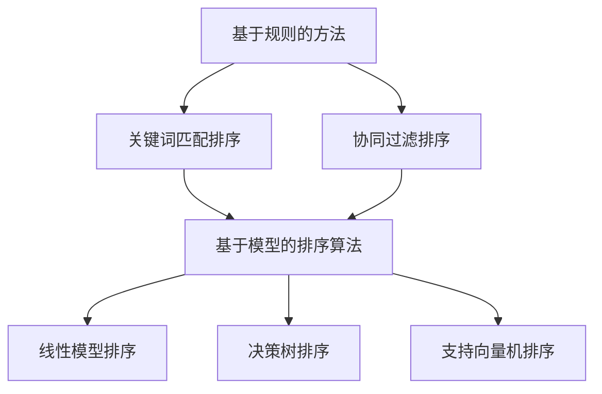

                 

# 智能排序：AI提升搜索结果

## 关键词
- 智能排序
- AI搜索结果优化
- 排序算法
- 机器学习
- 深度学习

## 摘要
本文深入探讨了智能排序的基本概念、理论基础和算法实现。通过分析智能排序在电子商务、社交媒体等领域的应用，展示了人工智能如何提升搜索结果的准确性和用户体验。文章详细介绍了智能排序的性能评估指标、机器学习和深度学习的基础知识，以及常见排序算法的原理和优化策略。此外，还讨论了智能排序系统的架构设计、代码实现与调试，并展望了其未来的发展趋势和应用前景。

---

## 第一部分：智能排序理论基础

### 第1章：智能排序基本概念

#### 1.1 智能排序的起源与发展

**智能排序的概念**：
智能排序是指利用人工智能技术，特别是机器学习和深度学习算法，对信息进行排序的过程。与传统的排序方法（如冒泡排序、快速排序等）不同，智能排序能够根据用户需求、历史行为和上下文信息，动态调整排序结果，提高信息的准确性和相关性。

**智能排序的发展历程**：
智能排序的发展可以追溯到20世纪90年代，随着互联网的普及和电子商务的兴起，基于规则的排序算法开始被应用于搜索引擎和推荐系统。然而，这些方法在处理海量数据和复杂查询时存在局限性。随着机器学习和深度学习技术的快速发展，基于模型的排序算法逐渐成为研究热点。

**智能排序的应用场景**：
智能排序广泛应用于电子商务、社交媒体、搜索引擎等领域。在电子商务中，智能排序能够根据用户购买历史和浏览行为，推荐相关性较高的商品。在社交媒体中，智能排序可以根据用户兴趣和社交关系，优化信息流的排序，提高用户参与度。在搜索引擎中，智能排序可以提升搜索结果的准确性，为用户提供更加个性化的搜索体验。

#### 1.2 智能排序的关键技术

**数据预处理**：
数据预处理是智能排序中的重要环节，包括数据清洗、特征提取和数据归一化等步骤。数据清洗旨在去除噪声和缺失值，提高数据质量。特征提取则是从原始数据中提取有助于排序的属性，如关键词、用户行为等。数据归一化则是将不同尺度的数据转换为统一的尺度，以便于模型训练。

**机器学习算法**：
机器学习算法在智能排序中扮演着核心角色。常见的机器学习算法包括决策树、随机森林、支持向量机等。这些算法通过学习历史数据中的模式和规律，构建预测模型，用于排序任务。

**深度学习模型**：
深度学习模型在智能排序中取得了显著成果。卷积神经网络（CNN）、循环神经网络（RNN）和Transformer等深度学习模型，能够在大规模数据集上训练出高度复杂的特征表示，从而提高排序的准确性和鲁棒性。

#### 1.3 智能排序的性能评估指标

**准确率与召回率**：
准确率和召回率是评价排序性能的重要指标。准确率是指实际排序结果中正确匹配的比率，召回率是指实际匹配结果中被正确识别的比率。在实际应用中，通常需要平衡准确率和召回率，以满足不同业务需求。

**F1分数**：
F1分数是准确率和召回率的调和平均数，用于综合考虑准确率和召回率。F1分数越高，表示排序模型的性能越好。

**ROC曲线与AUC值**：
ROC曲线和AUC值是评估排序模型性能的另一个重要工具。ROC曲线表示在不同阈值下，排序模型对正负样本的分类能力。AUC值表示ROC曲线下的面积，用于衡量排序模型的分类能力。

### 第2章：人工智能基础

#### 2.1 人工智能概述

**人工智能的定义**：
人工智能是指模拟、延伸和扩展人类智能的理论、方法和技术。人工智能可以分为弱人工智能和强人工智能。弱人工智能在特定领域表现出高于人类的能力，而强人工智能则具有全面的人类智能。

**人工智能的发展历史**：
人工智能的发展经历了多个阶段。从20世纪50年代的初始设想，到60年代的理论研究，再到70年代的应用探索，以及80年代和90年代的复苏与发展，人工智能逐渐成为一个跨学科的领域。

**人工智能的应用领域**：
人工智能在语音识别、图像处理、自然语言处理、自动驾驶、医疗诊断等领域取得了重要成果。随着技术的进步，人工智能的应用领域将不断拓展。

#### 2.2 机器学习基础

**机器学习的基本概念**：
机器学习是指通过计算机程序从数据中自动学习规律和模式的方法。机器学习可以分为监督学习、无监督学习和强化学习。

**监督学习、无监督学习和强化学习**：
监督学习是指通过已标记的数据进行训练，用于预测或分类任务。无监督学习是指在没有标记数据的情况下，自动发现数据中的结构和模式。强化学习是指通过与环境的交互，学习在特定情境下做出最优决策。

**常见算法**：
常见的机器学习算法包括决策树、随机森林、支持向量机、神经网络等。这些算法在不同的应用场景中具有不同的优势和局限性。

#### 2.3 深度学习基础

**深度学习的概念**：
深度学习是指利用多层神经网络进行特征提取和表示的方法。深度学习在图像识别、语音识别、自然语言处理等领域取得了显著成果。

**神经网络的基本结构**：
神经网络是由多个神经元组成的计算模型，通过学习输入数据和输出数据之间的关系，实现复杂的函数映射。神经网络的基本结构包括输入层、隐藏层和输出层。

**反向传播算法**：
反向传播算法是深度学习训练过程中用于计算梯度的一种方法。通过反向传播算法，可以高效地更新网络权重，提高模型性能。

**卷积神经网络（CNN）**：
卷积神经网络是一种专门用于图像处理和识别的神经网络。通过卷积运算和池化操作，CNN能够提取图像的局部特征和全局特征，从而实现图像分类和识别任务。

**循环神经网络（RNN）**：
循环神经网络是一种能够处理序列数据的神经网络。通过循环连接和门控机制，RNN能够捕捉序列中的时间依赖关系，从而实现语音识别、自然语言处理等任务。

### 第3章：智能排序算法原理

#### 3.1 常见排序算法

**基于规则的方法**：
基于规则的方法是指通过预定义的规则和逻辑，对信息进行排序。这类方法通常适用于简单的排序任务，但在处理复杂查询时存在局限性。

**基于模型的排序算法**：
基于模型的排序算法是指通过训练预测模型，对信息进行排序。这类方法利用历史数据和机器学习算法，能够自适应地调整排序结果，提高准确性。

**线性模型**：
线性模型是指通过线性函数对输入数据进行排序。线性模型简单高效，但在处理复杂排序任务时，可能无法捕捉到足够的信息。

**决策树**：
决策树是一种基于树形结构进行决策的算法。通过递归划分特征空间，决策树能够生成一组规则，用于对信息进行排序。

**支持向量机**：
支持向量机是一种基于最大间隔分类器的算法。通过寻找最优的超平面，支持向量机能够将数据划分为不同的类别。

**排序网络（RankNet）**：
排序网络是一种基于比较学习的排序算法。通过比较多个候选结果的排序，排序网络能够学习到排序的偏好关系，从而实现排序任务。

#### 3.2 深度学习排序模型

**神经网络排序模型（NRM）**：
神经网络排序模型是一种基于深度神经网络的排序算法。通过多层神经网络，NRM能够提取输入数据的特征表示，实现高精度的排序。

**序列模型排序**：
序列模型排序是指利用循环神经网络（RNN）或Transformer等序列模型，对序列数据进行排序。这类方法能够捕捉序列中的时间依赖关系，提高排序的准确性。

**Transformer排序模型**：
Transformer排序模型是一种基于Transformer架构的排序算法。通过自注意力机制和多头注意力机制，Transformer能够高效地捕捉序列中的长距离依赖关系，从而实现高精度的排序。

#### 3.3 排序模型优化策略

**数据增强**：
数据增强是指通过生成或变换原始数据，增加训练数据集的多样性。数据增强能够提高排序模型的泛化能力，减少过拟合现象。

**正则化技术**：
正则化技术是指通过添加正则项，限制模型复杂度，防止过拟合。常见的正则化技术包括L2正则化和dropout等。

**迁移学习**：
迁移学习是指利用预训练模型，在新数据集上进行微调，提高模型性能。迁移学习能够利用预训练模型的知识，提高排序模型的准确性和鲁棒性。

### 第4章：智能排序系统架构与实现

#### 4.1 智能排序系统架构设计

**系统总体架构**：
智能排序系统通常包括数据采集、数据预处理、排序模型训练、模型部署等模块。数据采集模块负责从各种数据源收集数据，数据预处理模块负责对数据进行清洗、特征提取等处理，排序模型训练模块负责训练排序模型，模型部署模块负责将训练好的模型部署到生产环境中。

**模块功能与协同**：
各模块在智能排序系统中相互协作，共同实现排序任务。数据采集模块获取原始数据，数据预处理模块对数据进行清洗和特征提取，排序模型训练模块使用训练数据训练排序模型，模型部署模块将训练好的模型部署到生产环境中，实现实时排序。

#### 4.2 源代码实现与调试

**开发环境搭建**：
搭建智能排序系统所需的开发环境包括Python编程环境、TensorFlow深度学习框架等。开发环境搭建步骤包括安装Python、安装TensorFlow和相关依赖库。

**排序模型训练与验证**：
使用TensorFlow等深度学习框架，对排序模型进行训练和验证。训练步骤包括加载训练数据、定义模型架构、编译模型、训练模型等。验证步骤包括评估模型性能、调整模型参数等。

**代码解读与分析**：
对关键代码进行解读和分析，帮助读者理解排序模型实现的细节。包括数据预处理代码、模型定义代码、训练代码等。

#### 4.3 案例分析

**电商搜索排序**：
分析电商搜索排序中的问题，如商品相关性、用户行为分析等，并介绍解决方案。通过实例演示，展示智能排序在电商搜索中的应用效果。

**社交媒体推荐排序**：
讨论社交媒体推荐排序中的挑战，如信息流排序、社交关系利用等，并介绍解决方案。通过实例分析，展示智能排序在社交媒体中的应用前景。

### 第5章：智能排序性能调优与优化

#### 5.1 性能调优方法

**超参数调整**：
超参数是深度学习模型中的关键参数，如学习率、批量大小等。通过调整超参数，可以优化模型性能。超参数调整方法包括经验调参、网格搜索等。

**数据预处理策略**：
数据预处理策略对排序性能具有重要影响。有效的数据预处理策略包括数据清洗、特征提取、数据归一化等。

#### 5.2 排序性能评估与优化

**评估指标**：
常用的排序性能评估指标包括准确率、召回率、F1分数等。通过评估指标，可以全面了解排序模型的表现。

**优化策略**：
排序性能优化策略包括特征工程、模型集成、数据增强等。特征工程是指通过调整特征，提高模型性能。模型集成是指将多个模型集成起来，提高整体性能。数据增强是指通过生成或变换数据，增加训练数据集的多样性。

### 第6章：智能排序应用与未来展望

#### 6.1 智能排序应用场景

**电子商务**：
在电子商务领域，智能排序可以应用于商品推荐、搜索结果排序等任务。通过智能排序，可以提升用户体验，提高销售转化率。

**社交媒体**：
在社交媒体领域，智能排序可以应用于信息流排序、社交推荐等任务。通过智能排序，可以提升用户参与度，提高平台活跃度。

#### 6.2 智能排序技术发展趋势

**深度学习模型的发展**：
随着深度学习技术的不断发展，深度学习模型在排序任务中的应用将越来越广泛。未来，深度学习模型将更加高效、准确，能够处理更复杂、更大量的数据。

**多模态数据处理**：
多模态数据处理是指利用多种数据类型（如图像、文本、音频等）进行排序。未来，多模态数据处理将成为智能排序的重要研究方向。

**个性化排序**：
个性化排序是指根据用户兴趣、行为等特征，为用户提供个性化的排序结果。未来，个性化排序将在提高用户体验和业务价值方面发挥重要作用。

#### 6.3 智能排序的未来挑战与机遇

**数据隐私与安全性**：
随着数据隐私和安全性的日益重视，智能排序将面临如何在保护用户隐私的同时，实现高效排序的挑战。

**实时排序与性能优化**：
实时排序和性能优化是智能排序系统中的重要问题。未来，如何实现低延迟、高效率的实时排序，将是研究的重要方向。

**跨领域应用**：
智能排序技术将在医疗、金融、教育等跨领域应用中发挥重要作用。未来，智能排序将在这些领域实现更广泛的应用。

### 第7章：附录与资源

#### 7.1 参考文献

**推荐阅读**：
- [1] Mitchell, T. M. (1997). Machine Learning. McGraw-Hill.
- [2] Goodfellow, I., Bengio, Y., & Courville, A. (2016). Deep Learning. MIT Press.
- [3] Russell, S., & Norvig, P. (2016). Artificial Intelligence: A Modern Approach. Pearson.

#### 7.2 学习资源

**在线课程与教程**：
- [1] 吴恩达（Andrew Ng）的《深度学习》（Deep Learning）课程
- [2] 斯坦福大学（Stanford University）的《机器学习》（Machine Learning）课程

**开源代码与项目**：
- [1] TensorFlow的排序模型实现
- [2] PyTorch的排序模型实现

---

**作者**：
AI天才研究院（AI Genius Institute） & 《禅与计算机程序设计艺术》（Zen And The Art of Computer Programming）

---<|vq_11864|>## 第一部分：智能排序理论基础

智能排序作为人工智能领域的一个分支，其理论基础涵盖了从基本概念到高级算法的广泛内容。本部分将首先介绍智能排序的基本概念，包括其定义、与传统排序方法的区别，以及智能排序的应用场景。随后，我们将深入探讨智能排序的关键技术，如数据预处理、机器学习算法和深度学习模型。最后，我们将介绍智能排序的性能评估指标，如准确率、召回率、F1分数和ROC曲线与AUC值。

### 第1章：智能排序基本概念

#### 1.1 智能排序的起源与发展

智能排序的概念并非一蹴而就，而是随着计算机科学和人工智能技术的发展逐步完善的。在早期，排序任务主要依赖于传统的排序算法，如冒泡排序、快速排序和归并排序等。这些算法虽然在时间复杂度和空间复杂度上有着不错的性能，但在处理复杂业务需求时显得力不从心。随着互联网的兴起和大数据时代的到来，传统排序方法逐渐无法满足日益增长的数据量和复杂度。

**智能排序的概念**：
智能排序是一种利用人工智能技术，尤其是机器学习和深度学习算法，对信息进行排序的方法。它不仅仅依赖于预先设定的规则，而是通过学习大量的数据，自动提取排序规则，并根据用户的个性化需求进行排序。这种排序方法能够动态调整排序结果，提高信息的准确性和相关性。

**智能排序与传统排序方法的区别**：
传统排序方法通常是基于静态的规则或算法，对数据进行排序。而智能排序则借助机器学习和深度学习算法，通过学习用户的行为模式、历史数据和上下文信息，动态生成排序规则。因此，智能排序在处理复杂、动态变化的排序任务时，具有更高的灵活性和准确性。

**智能排序的发展历程**：
智能排序的发展可以分为几个阶段：

1. **早期基于规则的方法**：20世纪90年代，随着互联网的兴起，搜索引擎和电商平台开始使用基于规则的排序方法。这种方法通过预定义的规则和逻辑，对信息进行排序。然而，随着数据量的增加和业务需求的复杂化，基于规则的方法逐渐显露出其局限性。

2. **机器学习时代的崛起**：21世纪初，机器学习技术的发展为智能排序提供了新的思路。基于机器学习算法的排序方法，如决策树、支持向量机和神经网络等，逐渐应用于实际场景。这些方法能够从海量数据中学习排序规律，提高了排序的准确性和灵活性。

3. **深度学习的突破**：近年来，深度学习技术的发展为智能排序带来了革命性的变化。卷积神经网络（CNN）、循环神经网络（RNN）和Transformer等深度学习模型，能够在大规模数据集上训练出高度复杂的特征表示，从而实现更准确的排序。

**智能排序的应用场景**：
智能排序在多个领域都有着广泛的应用：

1. **电子商务**：在电子商务领域，智能排序可以应用于商品推荐、搜索结果排序等任务。通过分析用户的购物历史、浏览行为和评价数据，智能排序能够为用户提供相关性更高的商品推荐和搜索结果。

2. **社交媒体**：在社交媒体领域，智能排序可以应用于信息流排序、社交推荐等任务。通过分析用户的兴趣、社交关系和互动行为，智能排序能够为用户推荐感兴趣的内容和潜在的朋友。

3. **搜索引擎**：在搜索引擎领域，智能排序可以应用于搜索结果排序、广告投放等任务。通过分析用户的搜索历史、地理位置和设备信息，智能排序能够为用户提供更相关的搜索结果和广告。

#### 1.2 智能排序的关键技术

智能排序的实现依赖于一系列关键技术，包括数据预处理、机器学习算法和深度学习模型。这些技术共同作用，提高了排序的准确性和效率。

**数据预处理**：
数据预处理是智能排序中的关键步骤，它包括数据清洗、特征提取和数据归一化等。数据清洗旨在去除噪声和缺失值，提高数据质量。特征提取则是从原始数据中提取有助于排序的属性，如关键词、用户行为等。数据归一化则是将不同尺度的数据转换为统一的尺度，以便于模型训练。

**机器学习算法**：
机器学习算法在智能排序中发挥着核心作用。常见的机器学习算法包括决策树、随机森林、支持向量机和神经网络等。这些算法通过学习历史数据中的模式和规律，构建预测模型，用于排序任务。

1. **决策树**：决策树是一种基于树形结构的算法，通过递归划分特征空间，生成一组规则。决策树简单直观，易于理解，但可能存在过拟合问题。
   
2. **随机森林**：随机森林是一种基于决策树的集成学习方法，通过构建多个决策树，并取它们的平均值来提高模型的泛化能力。随机森林在处理大规模数据集时具有较好的性能。

3. **支持向量机**：支持向量机是一种基于最大间隔分类器的算法，通过寻找最优的超平面，将数据划分为不同的类别。支持向量机在处理高维数据时表现出色。

4. **神经网络**：神经网络是一种模拟人脑神经元连接的算法，通过多层神经元组成网络，实现从输入到输出的映射。神经网络能够捕捉复杂的数据关系，但在训练过程中需要大量数据和计算资源。

**深度学习模型**：
深度学习模型在智能排序中取得了显著成果。卷积神经网络（CNN）、循环神经网络（RNN）和Transformer等深度学习模型，在处理大规模、复杂数据时表现出色。

1. **卷积神经网络（CNN）**：卷积神经网络是一种专门用于图像处理和识别的神经网络，通过卷积运算和池化操作，CNN能够提取图像的局部特征和全局特征，从而实现图像分类和识别任务。

2. **循环神经网络（RNN）**：循环神经网络是一种能够处理序列数据的神经网络，通过循环连接和门控机制，RNN能够捕捉序列中的时间依赖关系，从而实现语音识别、自然语言处理等任务。

3. **Transformer模型**：Transformer模型是一种基于自注意力机制的神经网络，通过多头注意力机制和自注意力机制，Transformer能够高效地捕捉序列中的长距离依赖关系，从而实现高精度的排序。

#### 1.3 智能排序的性能评估指标

评估智能排序的性能是确保排序结果准确性和相关性的关键步骤。常用的性能评估指标包括准确率、召回率、F1分数和ROC曲线与AUC值。

**准确率**：
准确率是指实际排序结果中正确匹配的比率。准确率越高，表示排序模型对正样本的识别能力越强。然而，高准确率并不意味着排序结果一定具有高相关性，因为可能存在大量负样本。

**召回率**：
召回率是指实际匹配结果中被正确识别的比率。召回率越高，表示排序模型对负样本的识别能力越强。高召回率能够确保重要的信息不被遗漏。

**F1分数**：
F1分数是准确率和召回率的调和平均数，用于综合考虑准确率和召回率。F1分数越高，表示排序模型的性能越好。在实际应用中，通常需要根据业务需求平衡准确率和召回率。

**ROC曲线与AUC值**：
ROC曲线和AUC值是评估排序模型性能的另一个重要工具。ROC曲线表示在不同阈值下，排序模型对正负样本的分类能力。AUC值表示ROC曲线下的面积，用于衡量排序模型的分类能力。AUC值越高，表示排序模型的分类能力越强。

### 结论

智能排序作为人工智能领域的重要分支，通过利用机器学习和深度学习算法，为信息排序提供了更加准确和灵活的方法。从基本概念到关键技术，再到性能评估指标，智能排序的发展为各个领域的应用带来了巨大的价值。未来，随着人工智能技术的不断进步，智能排序将在更多领域得到广泛应用，为人类生活带来更多便利。


### 1.1 智能排序的基本概念

**智能排序的概念**：
智能排序是一种基于人工智能技术的排序方法，它利用机器学习和深度学习算法从大量数据中自动学习和提取排序规则，从而实现信息的高效、准确排序。与传统的基于规则排序方法不同，智能排序能够动态调整排序策略，适应不同场景和用户需求。

**智能排序与传统排序方法的区别**：
传统排序方法，如冒泡排序、快速排序和归并排序等，主要依赖于预设的算法规则进行排序。这些方法在处理简单、静态数据时效果较好，但在面对复杂、动态的数据集时，往往无法满足需求。相比之下，智能排序通过机器学习和深度学习算法，可以从大量历史数据和用户行为中学习到排序的规律和模式，实现更灵活、更精准的排序。

**智能排序的特点**：
1. **自适应**：智能排序可以根据不同的场景和用户需求，动态调整排序策略，提高排序结果的准确性和相关性。
2. **学习性**：智能排序能够从数据中不断学习和优化排序规则，提高排序效果。
3. **泛用性**：智能排序可以应用于各种领域，如电商推荐、搜索引擎排序、社交媒体信息流排序等。

**智能排序的应用场景**：
1. **电子商务**：在电子商务平台上，智能排序可以应用于商品推荐、购物车排序、搜索结果排序等。通过分析用户的浏览历史、购买行为和偏好，智能排序能够为用户提供更相关的商品推荐，提高转化率和用户满意度。
2. **社交媒体**：在社交媒体平台上，智能排序可以应用于信息流排序、好友推荐、广告投放等。通过分析用户的社交行为、互动数据和兴趣偏好，智能排序能够为用户提供更感兴趣的内容和广告，提高用户参与度和平台活跃度。
3. **搜索引擎**：在搜索引擎中，智能排序可以应用于搜索结果排序、广告投放等。通过分析用户的搜索历史、地理位置和设备信息，智能排序能够为用户提供更相关的搜索结果和广告，提高用户体验和广告效果。

**智能排序的优势**：
1. **个性化**：智能排序可以根据用户的历史数据和偏好，提供个性化的排序结果，提高用户满意度。
2. **准确性**：智能排序通过学习大量数据，能够捕捉到更复杂的排序规律，提高排序结果的准确性。
3. **实时性**：智能排序可以实时处理数据，动态调整排序策略，适应不断变化的环境。

**智能排序的挑战**：
1. **数据质量**：智能排序依赖于高质量的数据进行训练和优化。如果数据存在噪声、缺失值或偏差，将影响排序效果。
2. **计算资源**：智能排序通常需要大量的计算资源进行模型训练和推理，对硬件设施有较高要求。
3. **可解释性**：深度学习模型的决策过程通常较为复杂，难以解释。如何提高模型的透明度和可解释性，是智能排序领域的一个挑战。

### 1.2 智能排序的发展历程

**早期发展阶段**：
智能排序的概念最早可以追溯到20世纪90年代，随着互联网的普及和电子商务的兴起，研究人员开始探索如何利用机器学习算法对搜索引擎的结果进行排序。这一阶段的主要方法是基于关键词匹配和协同过滤的简单规则方法。

**机器学习时代的崛起**：
21世纪初，机器学习技术的快速发展为智能排序带来了新的契机。研究者开始利用更复杂的机器学习算法，如决策树、支持向量机和神经网络等，对排序问题进行建模和优化。这些算法能够从大量数据中学习到排序的规律，显著提升了排序的准确性和效率。

**深度学习的突破**：
近年来，深度学习技术的突破为智能排序带来了革命性的变化。卷积神经网络（CNN）、循环神经网络（RNN）和Transformer等深度学习模型，能够在大规模数据集上训练出高度复杂的特征表示，从而实现更精准的排序。这些模型在图像识别、语音识别和自然语言处理等领域取得了巨大成功，也逐渐应用于智能排序任务中。

**发展趋势**：
随着人工智能技术的不断进步，智能排序将向更多领域和应用场景扩展。未来的发展趋势包括：

1. **多模态数据处理**：智能排序将能够处理多种类型的数据，如文本、图像、音频等，实现更全面的信息排序。
2. **个性化排序**：智能排序将更加注重个性化需求，根据用户的兴趣和行为，提供更精准的排序结果。
3. **实时排序**：随着计算能力的提升，智能排序将实现实时处理，满足快速变化的业务需求。

**智能排序在电子商务中的应用**：
在电子商务领域，智能排序已经广泛应用于商品推荐、购物车排序和搜索结果排序等任务。通过分析用户的浏览历史、购买行为和偏好，智能排序能够为用户提供更相关的商品推荐，提高转化率和用户满意度。例如，亚马逊和阿里巴巴等电商平台，都利用智能排序技术优化用户的购物体验。

**智能排序在社交媒体中的应用**：
在社交媒体领域，智能排序主要用于信息流排序和社交推荐。通过分析用户的社交行为、互动数据和兴趣偏好，智能排序能够为用户提供更感兴趣的内容和潜在的朋友。例如，Facebook和Twitter等社交媒体平台，都利用智能排序技术优化用户的信息流和推荐结果。

**智能排序在搜索引擎中的应用**：
在搜索引擎领域，智能排序主要用于搜索结果排序和广告投放。通过分析用户的搜索历史、地理位置和设备信息，智能排序能够为用户提供更相关的搜索结果和广告。例如，Google和Bing等搜索引擎，都利用智能排序技术优化用户的搜索体验。

### 1.3 智能排序的关键技术

**数据预处理**：
数据预处理是智能排序中至关重要的一步，它包括数据清洗、特征提取和数据归一化等。数据清洗旨在去除噪声和缺失值，提高数据质量。特征提取则是从原始数据中提取有助于排序的属性，如关键词、用户行为等。数据归一化则是将不同尺度的数据转换为统一的尺度，以便于模型训练。

**机器学习算法**：
机器学习算法是智能排序的核心技术之一。常见的机器学习算法包括决策树、随机森林、支持向量机和神经网络等。这些算法通过学习历史数据中的模式和规律，构建预测模型，用于排序任务。

1. **决策树**：决策树是一种基于树形结构的算法，通过递归划分特征空间，生成一组规则。决策树简单直观，易于理解，但可能存在过拟合问题。
2. **随机森林**：随机森林是一种基于决策树的集成学习方法，通过构建多个决策树，并取它们的平均值来提高模型的泛化能力。随机森林在处理大规模数据集时具有较好的性能。
3. **支持向量机**：支持向量机是一种基于最大间隔分类器的算法，通过寻找最优的超平面，将数据划分为不同的类别。支持向量机在处理高维数据时表现出色。
4. **神经网络**：神经网络是一种模拟人脑神经元连接的算法，通过多层神经元组成网络，实现从输入到输出的映射。神经网络能够捕捉复杂的数据关系，但在训练过程中需要大量数据和计算资源。

**深度学习模型**：
深度学习模型在智能排序中取得了显著成果。卷积神经网络（CNN）、循环神经网络（RNN）和Transformer等深度学习模型，在处理大规模、复杂数据时表现出色。

1. **卷积神经网络（CNN）**：卷积神经网络是一种专门用于图像处理和识别的神经网络，通过卷积运算和池化操作，CNN能够提取图像的局部特征和全局特征，从而实现图像分类和识别任务。
2. **循环神经网络（RNN）**：循环神经网络是一种能够处理序列数据的神经网络，通过循环连接和门控机制，RNN能够捕捉序列中的时间依赖关系，从而实现语音识别、自然语言处理等任务。
3. **Transformer模型**：Transformer模型是一种基于自注意力机制的神经网络，通过多头注意力机制和自注意力机制，Transformer能够高效地捕捉序列中的长距离依赖关系，从而实现高精度的排序。

**数据预处理技术的具体应用**：
1. **数据清洗**：数据清洗包括去除重复数据、填补缺失值和去除噪声等。例如，对于电商平台的用户行为数据，需要去除重复的浏览记录和异常的购买行为。
2. **特征提取**：特征提取包括从原始数据中提取有用的属性，如用户的浏览时间、购买频率等。这些特征有助于模型学习排序的规律。
3. **数据归一化**：数据归一化包括将不同尺度的数据转换为统一的尺度，如将商品的价格范围缩放到0到1之间。这样可以防止某些特征对模型的影响过大。

**机器学习算法的原理和实现**：
1. **决策树**：决策树通过递归划分特征空间，生成一组规则。在每一层上，算法选择具有最大信息增益的特征进行划分。决策树的实现通常使用递归算法。
2. **随机森林**：随机森林通过构建多个决策树，并取它们的平均值来提高模型的泛化能力。每个决策树独立训练，然后通过投票或平均值来决定最终的分类结果。
3. **支持向量机**：支持向量机通过寻找最优的超平面，将数据划分为不同的类别。支持向量机使用优化方法（如SVM优化器）来找到最优超平面。
4. **神经网络**：神经网络通过多层神经元组成网络，实现从输入到输出的映射。神经网络的实现通常使用反向传播算法，通过不断调整权重和偏置，优化模型的性能。

**深度学习模型的原理和实现**：
1. **卷积神经网络（CNN）**：卷积神经网络通过卷积运算和池化操作，提取图像的局部特征和全局特征。CNN的实现通常使用卷积层、池化层和全连接层等结构。
2. **循环神经网络（RNN）**：循环神经网络通过循环连接和门控机制，捕捉序列中的时间依赖关系。RNN的实现通常使用循环层和门控层等结构。
3. **Transformer模型**：Transformer模型通过多头注意力机制和自注意力机制，高效地捕捉序列中的长距离依赖关系。Transformer的实现通常使用自注意力层和前馈网络等结构。

**机器学习和深度学习算法的比较**：
1. **算法复杂度**：机器学习算法通常计算复杂度较低，适用于中小规模的数据集。深度学习算法计算复杂度较高，适用于大规模的数据集。
2. **模型可解释性**：机器学习算法通常具有较好的可解释性，便于理解和调试。深度学习算法通常具有较复杂的决策过程，难以解释和理解。
3. **性能**：深度学习算法在处理大规模、复杂的数据集时，通常具有更好的性能和准确性。机器学习算法在处理中小规模的数据集时，性能较为稳定。

### 1.4 智能排序的性能评估指标

**准确率**：
准确率是指实际排序结果中正确匹配的比率。准确率越高，表示排序模型对正样本的识别能力越强。准确率的计算公式如下：
\[ \text{准确率} = \frac{\text{正确匹配的数量}}{\text{总匹配的数量}} \]

**召回率**：
召回率是指实际匹配结果中被正确识别的比率。召回率越高，表示排序模型对负样本的识别能力越强。召回率的计算公式如下：
\[ \text{召回率} = \frac{\text{正确匹配的数量}}{\text{所有正样本的数量}} \]

**F1分数**：
F1分数是准确率和召回率的调和平均数，用于综合考虑准确率和召回率。F1分数越高，表示排序模型的性能越好。F1分数的计算公式如下：
\[ \text{F1分数} = 2 \times \frac{\text{准确率} \times \text{召回率}}{\text{准确率} + \text{召回率}} \]

**ROC曲线与AUC值**：
ROC曲线和AUC值是评估排序模型性能的另一个重要工具。ROC曲线表示在不同阈值下，排序模型对正负样本的分类能力。AUC值表示ROC曲线下的面积，用于衡量排序模型的分类能力。AUC值的计算公式如下：
\[ \text{AUC值} = \int_{0}^{1} \frac{TPR + FPR}{2} d\text{FPR} \]

其中，TPR为真正率，FPR为假正率。

**应用示例**：
假设有一个排序模型，其准确率为80%，召回率为70%，AUC值为0.85。根据这些指标，我们可以初步判断这个排序模型的性能较好。F1分数为：
\[ \text{F1分数} = 2 \times \frac{0.8 \times 0.7}{0.8 + 0.7} = 0.74 \]

AUC值为0.85，表示排序模型的分类能力较强。

### 结论

智能排序作为人工智能领域的一个重要分支，通过对数据的深入学习和分析，实现了信息排序的智能化。从基本概念到关键技术，再到性能评估指标，智能排序的发展为各个领域的应用带来了巨大价值。未来，随着人工智能技术的不断进步，智能排序将在更多领域得到广泛应用，为人类生活带来更多便利。


### 第2章：人工智能基础

在探讨智能排序的理论基础之前，我们需要深入了解人工智能（AI）的基本概念、发展历史以及其在不同领域的应用。人工智能是指通过计算机程序模拟、延伸和扩展人类智能的理论、方法和技术。人工智能可以分为弱人工智能（Weak AI）和强人工智能（Strong AI）。弱人工智能在特定领域表现出高于人类的能力，而强人工智能则具有全面的人类智能。本节将详细阐述人工智能的基本概念、发展历史及其在各个领域的应用。

#### 2.1 人工智能概述

**人工智能的定义**：
人工智能是指模拟、延伸和扩展人类智能的理论、方法和技术。人工智能可以分为弱人工智能和强人工智能。弱人工智能在特定领域表现出高于人类的能力，如语音识别、图像处理、自然语言处理等。强人工智能则具有全面的人类智能，能够像人类一样进行思考、学习和决策。

**人工智能的分类**：
1. **弱人工智能（Weak AI）**：也称为窄人工智能（Narrow AI），指在特定领域内表现出智能行为的系统。例如，语音助手、自动驾驶汽车、智能客服等。
2. **强人工智能（Strong AI）**：指具有全面人类智能的系统，能够理解、学习和运用知识，进行抽象思维和创造。目前，强人工智能还处于理论阶段，尚未实现。

**人工智能的发展历史**：
人工智能的发展经历了多个阶段：

1. **诞生阶段（20世纪50年代）**：1950年，艾伦·图灵发表了经典论文《计算机器与智能》，提出了著名的图灵测试。1956年，达特茅斯会议确定了人工智能的研究方向。

2. **早期研究阶段（20世纪60年代）**：这一时期，人工智能研究主要集中在逻辑推理、知识表示和搜索算法等方面。

3. **低谷阶段（20世纪70年代）**：由于技术限制和资金问题，人工智能研究进入低谷期。

4. **复苏阶段（20世纪80年代）**：专家系统和机器学习技术的兴起，使人工智能研究重新焕发生机。

5. **蓬勃发展阶段（21世纪初至今）**：随着计算机性能的提升和大数据技术的发展，人工智能在各个领域取得了重大突破。

**人工智能的应用领域**：
人工智能在多个领域取得了显著成果，以下是其中一些主要应用领域：

1. **语音识别**：语音识别技术可以使计算机理解和处理人类的语音输入。应用场景包括语音助手、智能客服、语音翻译等。

2. **图像处理与识别**：图像处理与识别技术使计算机能够理解和分析图像内容。应用场景包括人脸识别、安防监控、医学影像分析等。

3. **自然语言处理**：自然语言处理技术使计算机能够理解和生成自然语言。应用场景包括机器翻译、智能问答、情感分析等。

4. **自动驾驶**：自动驾驶技术使汽车能够自主驾驶，提高交通安全和效率。应用场景包括无人驾驶汽车、无人运输等。

5. **医疗诊断**：人工智能技术在医疗诊断中具有巨大的潜力，可以辅助医生进行疾病检测和治疗方案设计。

6. **金融风控**：人工智能技术在金融领域可用于风险评估、信用评分、欺诈检测等。

7. **智能制造**：人工智能技术在制造业中可用于生产调度、质量控制、预测性维护等，提高生产效率和产品质量。

#### 2.2 机器学习基础

**机器学习的基本概念**：
机器学习是指通过计算机程序从数据中自动学习规律和模式的方法。机器学习可以分为监督学习、无监督学习和强化学习。

1. **监督学习（Supervised Learning）**：监督学习是指通过已标记的数据进行训练，用于预测或分类任务。常见的监督学习算法包括线性回归、逻辑回归、支持向量机、决策树、随机森林等。

2. **无监督学习（Unsupervised Learning）**：无监督学习是指在没有标记数据的情况下，自动发现数据中的结构和模式。常见的无监督学习算法包括聚类、降维、关联规则挖掘等。

3. **强化学习（Reinforcement Learning）**：强化学习是指通过与环境的交互，学习在特定情境下做出最优决策。常见的强化学习算法包括Q学习、深度Q网络（DQN）、策略梯度等。

**机器学习算法的分类和特点**：
1. **线性模型**：线性模型是指通过线性函数对输入数据进行排序或分类。常见的线性模型包括线性回归、逻辑回归等。线性模型简单高效，但在处理复杂任务时可能表现不佳。
2. **树模型**：树模型是指通过树形结构对数据进行分类或回归。常见的树模型包括决策树、随机森林、梯度提升树（GBDT）等。树模型易于理解和解释，但可能存在过拟合问题。
3. **神经网络**：神经网络是指由多个神经元组成的计算模型，通过学习输入数据和输出数据之间的关系，实现复杂的函数映射。常见的神经网络包括前馈神经网络、卷积神经网络（CNN）、循环神经网络（RNN）等。神经网络能够处理复杂的数据关系，但在训练过程中需要大量数据和计算资源。

**机器学习算法的原理和应用**：
1. **线性回归**：线性回归是一种简单的监督学习算法，通过线性函数拟合输入数据和输出数据之间的关系。线性回归可以用于回归任务，如房价预测、股票价格预测等。
2. **逻辑回归**：逻辑回归是一种用于分类任务的监督学习算法，通过逻辑函数将输入数据映射到概率分布。逻辑回归可以用于二分类和多分类任务，如邮件分类、文本分类等。
3. **决策树**：决策树是一种基于树形结构的分类算法，通过递归划分特征空间，生成一组规则。决策树可以用于分类任务，如客户流失预测、疾病诊断等。
4. **随机森林**：随机森林是一种基于决策树的集成学习方法，通过构建多个决策树，并取它们的平均值来提高模型的泛化能力。随机森林可以用于分类和回归任务，如信用评分、股票价格预测等。
5. **支持向量机**：支持向量机是一种基于最大间隔分类器的算法，通过寻找最优的超平面，将数据划分为不同的类别。支持向量机可以用于分类任务，如手写数字识别、图像分类等。
6. **神经网络**：神经网络是一种由多个神经元组成的计算模型，通过学习输入数据和输出数据之间的关系，实现复杂的函数映射。神经网络可以用于回归任务，如房价预测、股票价格预测等；也可以用于分类任务，如图像分类、文本分类等。

**机器学习算法的应用案例**：
1. **电子商务**：机器学习算法可以用于商品推荐、广告投放、客户流失预测等任务。例如，通过分析用户的购物历史和行为，机器学习算法可以推荐相关性更高的商品，提高用户的购买体验。
2. **金融**：机器学习算法可以用于风险评估、欺诈检测、信用评分等任务。例如，通过分析历史交易数据和用户行为，机器学习算法可以识别潜在的欺诈行为，降低金融风险。
3. **医疗**：机器学习算法可以用于疾病诊断、药物研发、个性化医疗等任务。例如，通过分析医学影像和患者数据，机器学习算法可以辅助医生进行疾病诊断，提高诊断准确率。

### 2.3 深度学习基础

**深度学习的概念**：
深度学习是指利用多层神经网络进行特征提取和表示的方法。深度学习在图像识别、语音识别、自然语言处理等领域取得了显著成果。深度学习的基本原理是模拟人脑神经网络的工作方式，通过多层神经网络提取数据中的特征和模式。

**神经网络的基本结构**：
神经网络是由多个神经元组成的计算模型，通过学习输入数据和输出数据之间的关系，实现复杂的函数映射。神经网络的基本结构包括输入层、隐藏层和输出层。

1. **输入层（Input Layer）**：输入层接收外部数据，将数据传递给隐藏层。
2. **隐藏层（Hidden Layers）**：隐藏层对输入数据进行特征提取和变换，将特征传递给输出层。
3. **输出层（Output Layer）**：输出层生成预测结果或分类标签。

**神经网络的工作原理**：
神经网络通过前向传播和反向传播两个过程进行训练。在前向传播过程中，输入数据经过神经网络的不同层，通过激活函数将数据映射到输出。在反向传播过程中，通过计算输出误差，反向传播误差，调整网络权重和偏置，优化模型性能。

**深度学习模型的应用**：
深度学习模型在图像识别、语音识别、自然语言处理等领域取得了显著成果。

1. **图像识别**：卷积神经网络（CNN）是一种专门用于图像识别的深度学习模型，通过卷积运算和池化操作，提取图像的局部特征和全局特征。常见的图像识别任务包括人脸识别、物体识别、医学影像分析等。
2. **语音识别**：循环神经网络（RNN）和长短时记忆网络（LSTM）是一种专门用于语音识别的深度学习模型，通过捕捉语音信号中的时间依赖关系，实现语音到文本的转换。常见的语音识别任务包括语音助手、自动字幕等。
3. **自然语言处理**：Transformer模型是一种基于自注意力机制的深度学习模型，通过多头注意力机制和自注意力机制，高效地捕捉序列中的长距离依赖关系。常见的自然语言处理任务包括机器翻译、文本分类、情感分析等。

**深度学习模型的应用案例**：
1. **自动驾驶**：通过深度学习模型，自动驾驶系统可以实时识别道路上的行人和车辆，做出安全驾驶决策。例如，特斯拉的自动驾驶系统就使用了深度学习模型进行物体检测和路径规划。
2. **医疗诊断**：通过深度学习模型，医学影像可以自动识别疾病，辅助医生进行诊断。例如，谷歌的深度学习模型可以自动识别肺癌，提高了诊断准确率。
3. **金融风控**：通过深度学习模型，金融机构可以自动识别异常交易和潜在欺诈行为，降低金融风险。例如，摩根大通使用的深度学习模型可以检测信用卡欺诈交易。

### 结论

人工智能作为计算机科学的重要分支，通过机器学习和深度学习算法，实现了对大量数据的自动学习和处理。从人工智能的基本概念、发展历史到其在不同领域的应用，再到机器学习和深度学习的基础知识，人工智能的发展为智能排序等应用场景提供了强大的技术支持。未来，随着人工智能技术的不断进步，人工智能将在更多领域发挥重要作用，推动社会发展和人类进步。


### 第3章：智能排序算法原理

智能排序算法是智能排序系统中的核心组成部分，其原理和实现直接影响到排序的准确性和效率。本章将详细探讨智能排序算法的原理，包括常见排序算法、深度学习排序模型以及排序模型的优化策略。通过这些算法的原理讲解和优化策略分析，读者可以更好地理解智能排序的内部工作原理。

#### 3.1 常见排序算法

**基于规则的方法**

基于规则的方法是指通过预定义的规则和逻辑，对信息进行排序。这种方法在简单任务中表现良好，但在面对复杂、动态的数据时，存在一定的局限性。

1. **关键词匹配排序**：通过比较输入关键词与数据库中的关键词，对信息进行排序。这种方法简单直观，但容易受到关键词选择和匹配策略的影响。
2. **协同过滤排序**：基于用户的历史行为和偏好，通过计算用户之间的相似度，对信息进行排序。协同过滤排序可以分为基于用户的协同过滤和基于物品的协同过滤。

**基于模型的排序算法**

基于模型的排序算法是指通过训练预测模型，对信息进行排序。这种方法可以从大量历史数据中学习到排序的规律，提高了排序的准确性和灵活性。

1. **线性模型排序**：线性模型是指通过线性函数对输入数据进行排序。线性模型简单高效，但可能无法捕捉到足够的信息，特别是在处理高维数据时。
2. **决策树排序**：决策树是一种基于树形结构的排序算法，通过递归划分特征空间，生成一组规则。决策树直观易懂，但可能存在过拟合问题。
3. **支持向量机排序**：支持向量机是一种基于最大间隔分类器的排序算法，通过寻找最优的超平面，将数据划分为不同的类别。支持向量机在处理高维数据时表现出色。

**深度学习排序模型**

深度学习排序模型是指利用深度神经网络对信息进行排序。深度学习模型能够从大规模数据中学习到复杂的特征表示，从而实现高精度的排序。

1. **神经网络排序模型（NRM）**：神经网络排序模型是一种基于深度神经网络的排序算法。通过多层神经网络，NRM能够提取输入数据的特征表示，实现高精度的排序。
2. **序列模型排序**：序列模型排序是指利用循环神经网络（RNN）或Transformer等序列模型，对序列数据进行排序。这类方法能够捕捉序列中的时间依赖关系，提高排序的准确性。
3. **Transformer排序模型**：Transformer排序模型是一种基于Transformer架构的排序算法。通过自注意力机制和多头注意力机制，Transformer能够高效地捕捉序列中的长距离依赖关系，从而实现高精度的排序。

**排序模型的优化策略**

优化排序模型的性能是提高智能排序系统效果的关键步骤。以下是一些常见的优化策略：

1. **数据增强**：数据增强是指通过生成或变换原始数据，增加训练数据集的多样性。数据增强能够提高排序模型的泛化能力，减少过拟合现象。
2. **正则化技术**：正则化技术是指通过添加正则项，限制模型复杂度，防止过拟合。常见的正则化技术包括L2正则化、dropout等。
3. **迁移学习**：迁移学习是指利用预训练模型，在新数据集上进行微调，提高模型性能。迁移学习能够利用预训练模型的知识，提高排序模型的准确性和鲁棒性。

#### 3.1.1 基于规则的方法

**关键词匹配排序算法**

关键词匹配排序是一种简单的排序方法，其基本思想是比较输入关键词与数据库中的关键词，根据匹配程度对信息进行排序。具体步骤如下：

1. **关键词提取**：从输入信息中提取关键词。
2. **关键词匹配**：将提取的关键词与数据库中的关键词进行比较，计算匹配度。
3. **排序**：根据匹配度对信息进行排序。

**协同过滤排序算法**

协同过滤排序是基于用户历史行为和偏好，通过计算用户之间的相似度，对信息进行排序。协同过滤排序可以分为基于用户的协同过滤和基于物品的协同过滤。

1. **基于用户的协同过滤**：通过计算用户之间的相似度，找到与目标用户最相似的其他用户，然后根据这些相似用户的喜好来推荐信息。
2. **基于物品的协同过滤**：通过计算物品之间的相似度，找到与目标物品最相似的其他物品，然后根据这些相似物品的评分来推荐信息。

**算法原理和伪代码**

关键词匹配排序的算法原理可以表示为：

```python
def keyword_matching_sort(input_data, database):
    extracted_keywords = extract_keywords(input_data)
    matched_scores = []
    for record in database:
        score = calculate_keyword_matching_score(extracted_keywords, record.keywords)
        matched_scores.append((record, score))
    matched_scores.sort(key=lambda x: x[1], reverse=True)
    return [record for record, score in matched_scores]

def extract_keywords(data):
    # 实现关键词提取逻辑
    pass

def calculate_keyword_matching_score(extracted_keywords, database_keywords):
    # 实现关键词匹配度计算逻辑
    pass
```

协同过滤排序的算法原理可以表示为：

```python
def collaborative_filtering_sort(input_data, user_data, item_data):
    user_similarity_scores = calculate_user_similarity_scores(input_data, user_data)
    top_similar_users = get_top_similar_users(user_similarity_scores)
    recommended_items = []
    for user in top_similar_users:
        recommended_items.extend(user_data[user].recommended_items)
    recommended_items.sort(key=lambda x: x.rating, reverse=True)
    return recommended_items

def calculate_user_similarity_scores(input_user, user_data):
    # 实现用户相似度计算逻辑
    pass

def get_top_similar_users(similarity_scores):
    # 实现获取相似用户逻辑
    pass
```

#### 3.1.2 基于模型的排序算法

**线性模型排序算法**

线性模型排序是指通过线性函数对输入数据进行排序。线性模型简单高效，但可能无法捕捉到足够的信息，特别是在处理高维数据时。线性模型排序的算法原理如下：

1. **特征提取**：从输入数据中提取特征向量。
2. **模型训练**：利用历史数据训练线性模型，得到权重系数。
3. **排序**：根据权重系数对输入数据进行排序。

**算法原理和伪代码**

线性模型排序的算法原理可以表示为：

```python
def linear_model_sort(input_data, trained_model):
    feature_vectors = extract_features(input_data)
    sorted_indices = []
    for feature_vector in feature_vectors:
        score = calculate_score(feature_vector, trained_model)
        sorted_indices.append((score, feature_vector))
    sorted_indices.sort(key=lambda x: x[0], reverse=True)
    return [input_data[index] for index, _ in sorted_indices]

def extract_features(data):
    # 实现特征提取逻辑
    pass

def calculate_score(feature_vector, model):
    # 实现分数计算逻辑
    pass
```

**决策树排序算法**

决策树排序是一种基于树形结构的排序算法，通过递归划分特征空间，生成一组规则。决策树排序的算法原理如下：

1. **特征选择**：选择最优特征进行划分。
2. **划分**：根据选定的特征，将数据划分为子集。
3. **递归**：对子集进行相同的划分操作，直到满足停止条件。
4. **排序**：根据决策树生成的规则，对数据进行排序。

**算法原理和伪代码**

决策树排序的算法原理可以表示为：

```python
def decision_tree_sort(input_data, tree):
    if is_leaf_node(tree):
        return tree.label
    selected_feature = tree.feature
    subset = split_data(input_data, selected_feature, tree.threshold)
    sorted_subset = decision_tree_sort(subset, tree.left) + decision_tree_sort(subset, tree.right)
    return sorted_subset

def split_data(data, feature, threshold):
    # 实现数据划分逻辑
    pass
```

**支持向量机排序算法**

支持向量机排序是一种基于最大间隔分类器的排序算法，通过寻找最优的超平面，将数据划分为不同的类别。支持向量机排序的算法原理如下：

1. **特征提取**：从输入数据中提取特征向量。
2. **模型训练**：利用历史数据训练支持向量机模型，得到权重系数和超平面。
3. **排序**：根据权重系数和超平面对输入数据进行排序。

**算法原理和伪代码**

支持向量机排序的算法原理可以表示为：

```python
def svm_sort(input_data, trained_svm_model):
    feature_vectors = extract_features(input_data)
    sorted_indices = []
    for feature_vector in feature_vectors:
        score = calculate_score(feature_vector, trained_svm_model)
        sorted_indices.append((score, feature_vector))
    sorted_indices.sort(key=lambda x: x[0], reverse=True)
    return [input_data[index] for index, _ in sorted_indices]

def extract_features(data):
    # 实现特征提取逻辑
    pass

def calculate_score(feature_vector, model):
    # 实现分数计算逻辑
    pass
```

#### 3.1.3 深度学习排序模型

**神经网络排序模型（NRM）**

神经网络排序模型是一种基于深度神经网络的排序算法。通过多层神经网络，NRM能够提取输入数据的特征表示，实现高精度的排序。

1. **输入层**：接收输入数据。
2. **隐藏层**：对输入数据进行特征提取和变换。
3. **输出层**：生成排序分数。

**算法原理和伪代码**

神经网络排序模型的算法原理可以表示为：

```python
def neural_network_ranking_model_sort(input_data, trained_model):
    hidden_representation = trained_model.hidden_layers.forward(input_data)
    scores = trained_model.output_layer.forward(hidden_representation)
    sorted_indices = sorted(range(len(scores)), key=lambda i: scores[i], reverse=True)
    return [input_data[i] for i in sorted_indices]

def train_neural_network_sort_model(input_data, target_data):
    # 实现模型训练逻辑
    pass
```

**序列模型排序**

序列模型排序是指利用循环神经网络（RNN）或Transformer等序列模型，对序列数据进行排序。这类方法能够捕捉序列中的时间依赖关系，提高排序的准确性。

**算法原理和伪代码**

序列模型排序的算法原理可以表示为：

```python
def rnn_sort(input_sequence, trained_rnn_model):
    hidden_states = trained_rnn_model.forward(input_sequence)
    scores = trained_rnn_model.output(hidden_states)
    sorted_indices = sorted(range(len(scores)), key=lambda i: scores[i], reverse=True)
    return [input_sequence[i] for i in sorted_indices]

def train_rnn_sort_model(input_sequences, target_sequences):
    # 实现模型训练逻辑
    pass
```

**Transformer排序模型**

Transformer排序模型是一种基于Transformer架构的排序算法。通过自注意力机制和多头注意力机制，Transformer能够高效地捕捉序列中的长距离依赖关系，从而实现高精度的排序。

**算法原理和伪代码**

Transformer排序模型的算法原理可以表示为：

```python
def transformer_sort(input_sequence, trained_transformer_model):
    attention_scores = trained_transformer_model.compute_attention_scores(input_sequence)
    sorted_indices = sorted(range(len(attention_scores)), key=lambda i: attention_scores[i], reverse=True)
    return [input_sequence[i] for i in sorted_indices]

def train_transformer_sort_model(input_sequences, target_sequences):
    # 实现模型训练逻辑
    pass
```

#### 3.1.4 排序模型优化策略

**数据增强**

数据增强是指通过生成或变换原始数据，增加训练数据集的多样性。数据增强能够提高排序模型的泛化能力，减少过拟合现象。

**算法原理和伪代码**

数据增强的算法原理可以表示为：

```python
def data_augmentation(data):
    augmented_data = []
    for record in data:
        augmented_data.append(record)  # 保持原始数据
        augmented_data.append(rotate_record(record))  # 旋转数据
        augmented_data.appendflip_record(record))  # 翻转数据
    return augmented_data

def rotate_record(record):
    # 实现旋转数据逻辑
    pass

def flip_record(record):
    # 实现翻转数据逻辑
    pass
```

**正则化技术**

正则化技术是指通过添加正则项，限制模型复杂度，防止过拟合。常见的正则化技术包括L2正则化、dropout等。

**算法原理和伪代码**

L2正则化的算法原理可以表示为：

```python
def l2_regularization_loss(model, lambda_value):
    regularization_loss = 0
    for layer in model.layers:
        for weight in layer.weights:
            regularization_loss += lambda_value * np.square(weight)
    return regularization_loss
```

Dropout正则化的算法原理可以表示为：

```python
def dropout_regularization_loss(model, dropout_rate):
    dropout_loss = 0
    for layer in model.layers:
        for weight in layer.weights:
            dropout_loss += dropout_rate * np.square(weight)
    return dropout_loss
```

**迁移学习**

迁移学习是指利用预训练模型，在新数据集上进行微调，提高模型性能。迁移学习能够利用预训练模型的知识，提高排序模型的准确性和鲁棒性。

**算法原理和伪代码**

迁移学习的算法原理可以表示为：

```python
def fine_tune_pretrained_model(pretrained_model, new_data, learning_rate):
    optimizer = tf.keras.optimizers.Adam(learning_rate=learning_rate)
    for epoch in range(num_epochs):
        for batch in new_data:
            with tf.GradientTape() as tape:
                predictions = pretrained_model(batch)
                loss = calculate_loss(predictions, batch.targets)
            gradients = tape.gradient(loss, pretrained_model.trainable_variables)
            optimizer.apply_gradients(zip(gradients, pretrained_model.trainable_variables))
    return pretrained_model
```

### 结论

智能排序算法是智能排序系统的核心组成部分，其原理和实现直接影响到排序的准确性和效率。本章详细介绍了基于规则的方法、基于模型的排序算法和深度学习排序模型，以及排序模型的优化策略。通过这些算法的原理讲解和优化策略分析，读者可以更好地理解智能排序的内部工作原理，为实际应用提供有力支持。未来，随着人工智能技术的不断进步，智能排序算法将在更多领域得到广泛应用，为用户提供更精准、更个性化的排序服务。


### 3.1 常见排序算法

在智能排序中，常见排序算法是基础，它们为高级的机器学习和深度学习模型提供了基础框架。这些算法包括基于规则的方法和基于模型的排序算法。下面，我们将详细探讨这些算法的原理和实现。

#### 基于规则的方法

基于规则的方法是一种传统的排序方法，它依赖于预定义的规则和逻辑来对数据进行排序。这种方法在处理简单、规则明确的数据集时非常有效，但在面对复杂、动态的数据时，可能会显得力不从心。

**1. 关键词匹配排序算法**

关键词匹配排序算法的基本原理是，通过比较输入关键词与数据库中的关键词，根据匹配程度对信息进行排序。这种算法通常应用于搜索引擎和电商平台中，用于对搜索结果或推荐结果进行排序。

**算法原理和伪代码：**

```python
function KeywordMatchingSort(inputKeywords, Database):
    MatchedScores = []
    for record in Database:
        KeywordList = ExtractKeywords(record)
        MatchScore = CalculateMatchScore(inputKeywords, KeywordList)
        MatchedScores.append((record, MatchScore))
    MatchedScores.sort(key=lambda x: x[1], reverse=True)
    return [record for record, _ in MatchedScores]
```

**2. 协同过滤排序算法**

协同过滤排序算法是基于用户的历史行为和偏好，通过计算用户之间的相似度，对信息进行排序。协同过滤排序可以分为基于用户的协同过滤和基于物品的协同过滤。

**算法原理和伪代码：**

基于用户的协同过滤：

```python
function UserBasedCollaborativeFiltering(inputUser, UserHistory, ItemRatings):
    SimilarityScores = []
    for user in UserHistory:
        if user != inputUser:
            SimilarityScore = CalculateUserSimilarity(inputUser, user)
            SimilarityScores.append((user, SimilarityScore))
    SimilarityScores.sort(key=lambda x: x[1], reverse=True)
    return [user for user, _ in SimilarityScores]
```

基于物品的协同过滤：

```python
function ItemBasedCollaborativeFiltering(inputItem, ItemRatings, UserHistory):
    SimilarityScores = []
    for item in ItemRatings:
        if item != inputItem:
            SimilarityScore = CalculateItemSimilarity(inputItem, item)
            SimilarityScores.append((item, SimilarityScore))
    SimilarityScores.sort(key=lambda x: x[1], reverse=True)
    return [item for item, _ in SimilarityScores]
```

#### 基于模型的排序算法

基于模型的排序算法利用机器学习技术，从数据中学习排序规则，然后根据这些规则对新的数据进行排序。这种方法在处理大规模、复杂的任务时表现出色。

**1. 线性模型排序算法**

线性模型排序算法通过线性函数对输入数据进行排序。这种方法简单直观，但在处理高维数据时可能无法捕捉到足够的信息。

**算法原理和伪代码：**

```python
function LinearModelSort(inputData, trainedModel):
    FeatureVectors = ExtractFeatures(inputData)
    Scores = []
    for featureVector in FeatureVectors:
        Score = CalculateScore(featureVector, trainedModel)
        Scores.append((Score, featureVector))
    Scores.sort(key=lambda x: x[0], reverse=True)
    return [featureVector for _, featureVector in Scores]
```

**2. 决策树排序算法**

决策树排序算法通过递归划分特征空间，生成一组规则。这种方法直观易懂，但在面对高度复杂的数据时可能存在过拟合问题。

**算法原理和伪代码：**

```python
function DecisionTreeSort(inputData, decisionTree):
    if IsLeafNode(decisionTree):
        return decisionTree.Label
    SelectedFeature = decisionTree.Feature
    Threshold = decisionTree.Threshold
    subset = SplitData(inputData, SelectedFeature, Threshold)
    return DecisionTreeSort(subset, decisionTree.Left) + DecisionTreeSort(subset, decisionTree.Right)
```

**3. 支持向量机排序算法**

支持向量机排序算法通过寻找最优的超平面，将数据划分为不同的类别。这种方法在处理高维数据时表现出色。

**算法原理和伪代码：**

```python
function SVMSort(inputData, trainedSVMModel):
    FeatureVectors = ExtractFeatures(inputData)
    Scores = []
    for featureVector in FeatureVectors:
        Score = CalculateScore(featureVector, trainedSVMModel)
        Scores.append((Score, featureVector))
    Scores.sort(key=lambda x: x[0], reverse=True)
    return [featureVector for _, featureVector in Scores]
```

#### 总结

常见排序算法在智能排序系统中扮演着重要角色。基于规则的方法适用于简单、规则明确的数据集，而基于模型的排序算法能够从数据中学习排序规则，适用于复杂、动态的数据集。通过上述算法的原理和伪代码，我们可以更好地理解这些算法的实现细节，为实际应用提供指导。

---

**核心概念与联系**

为了更好地理解常见排序算法的原理和联系，我们可以使用Mermaid流程图来展示这些算法的基本框架。以下是常见排序算法的Mermaid流程图：



在这个流程图中，A表示基于规则的方法，B和C分别表示关键词匹配排序和协同过滤排序，这两者都是基于规则的方法。D表示基于模型的排序算法，它包括线性模型排序、决策树排序和支持向量机排序。通过这个流程图，我们可以清晰地看到常见排序算法之间的联系和区别。

---

**核心算法原理讲解**

1. **线性模型排序算法**

线性模型排序算法是一种简单的排序方法，它通过线性函数对输入数据进行排序。该算法的基本原理是，首先从输入数据中提取特征，然后训练一个线性模型（如线性回归模型），最后根据训练好的模型对新的数据进行排序。

**算法原理：**

- **特征提取**：从输入数据中提取特征向量。
- **模型训练**：使用训练数据训练线性模型，得到权重系数。
- **排序**：根据权重系数对输入数据进行排序。

**伪代码：**

```python
def linear_model_sort(input_data, trained_model):
    feature_vectors = extract_features(input_data)
    scores = [calculate_score(feature_vector, trained_model) for feature_vector in feature_vectors]
    sorted_indices = sorted(range(len(scores)), key=lambda i: scores[i], reverse=True)
    return [input_data[i] for i in sorted_indices]
```

2. **决策树排序算法**

决策树排序算法是一种基于树形结构的排序算法。它的基本原理是通过递归划分特征空间，生成一组规则，然后根据这些规则对数据进行排序。

**算法原理：**

- **特征选择**：选择最优特征进行划分。
- **划分**：根据选定的特征，将数据划分为子集。
- **递归**：对子集进行相同的划分操作，直到满足停止条件。
- **排序**：根据决策树生成的规则，对数据进行排序。

**伪代码：**

```python
function DecisionTreeSort(input_data, decision_tree):
    if IsLeafNode(decision_tree):
        return decision_tree.label
    selected_feature = decision_tree.feature
    threshold = decision_tree.threshold
    subset = SplitData(input_data, selected_feature, threshold)
    return DecisionTreeSort(subset, decision_tree.left) + DecisionTreeSort(subset, decision_tree.right)
```

3. **支持向量机排序算法**

支持向量机排序算法是一种基于最大间隔分类器的排序算法。它的基本原理是通过寻找最优的超平面，将数据划分为不同的类别。

**算法原理：**

- **特征提取**：从输入数据中提取特征向量。
- **模型训练**：使用训练数据训练支持向量机模型，得到权重系数和超平面。
- **排序**：根据权重系数和超平面对输入数据进行排序。

**伪代码：**

```python
def svm_sort(input_data, trained_svm_model):
    feature_vectors = extract_features(input_data)
    scores = [calculate_score(feature_vector, trained_svm_model) for feature_vector in feature_vectors]
    sorted_indices = sorted(range(len(scores)), key=lambda i: scores[i], reverse=True)
    return [input_data[i] for i in sorted_indices]
```

通过上述核心算法原理的讲解和伪代码示例，我们可以更好地理解常见排序算法的工作机制，为实际应用提供理论基础。

---

**数学模型和公式 & 详细讲解 & 举例说明**

在智能排序算法中，数学模型和公式是核心组成部分，它们用于描述数据之间的关系和排序规则。以下我们将介绍几个重要的数学模型和公式，并进行详细讲解和举例说明。

1. **线性回归模型**

线性回归模型是最简单的排序算法之一，它通过线性函数拟合输入数据和输出数据之间的关系。其数学模型如下：

\[ y = \beta_0 + \beta_1x_1 + \beta_2x_2 + ... + \beta_nx_n \]

其中，\( y \) 是输出值，\( x_1, x_2, ..., x_n \) 是输入特征，\( \beta_0, \beta_1, \beta_2, ..., \beta_n \) 是权重系数。

**详细讲解**：

线性回归模型的目的是找到最佳的权重系数，使得输入数据和输出数据之间的误差最小。通常使用最小二乘法（Least Squares Method）来求解这些权重系数。

**举例说明**：

假设我们有一个简单的数据集，其中每个数据点由两个特征组成，\( x_1 \) 和 \( x_2 \)。我们的目标是预测一个连续的输出值 \( y \)。数据集如下：

\[ 
\begin{array}{ccc}
x_1 & x_2 & y \\
0 & 0 & 1 \\
1 & 2 & 3 \\
2 & 4 & 5 \\
3 & 6 & 7 \\
\end{array}
\]

我们使用线性回归模型来拟合这些数据点，目标是找到最佳权重系数 \( \beta_0, \beta_1, \beta_2 \)。使用最小二乘法，我们可以得到以下方程组：

\[ 
\begin{cases}
\sum_{i=1}^{n} y_i = n\beta_0 + \beta_1\sum_{i=1}^{n} x_{1i} + \beta_2\sum_{i=1}^{n} x_{2i} \\
\sum_{i=1}^{n} x_{1i} y_i = \beta_0\sum_{i=1}^{n} x_{1i} + \beta_1\sum_{i=1}^{n} x_{1i}^2 + \beta_2\sum_{i=1}^{n} x_{1i}x_{2i} \\
\sum_{i=1}^{n} x_{2i} y_i = \beta_0\sum_{i=1}^{n} x_{2i} + \beta_1\sum_{i=1}^{n} x_{1i}x_{2i} + \beta_2\sum_{i=1}^{n} x_{2i}^2 \\
\end{cases}
\]

解这个方程组，我们可以得到最佳权重系数：

\[ 
\begin{cases}
\beta_0 = \frac{\sum_{i=1}^{n} x_{1i} y_i - \sum_{i=1}^{n} x_{1i}\sum_{i=1}^{n} x_{2i} y_i}{n\sum_{i=1}^{n} x_{1i}^2 - (\sum_{i=1}^{n} x_{1i})^2} \\
\beta_1 = \frac{n\sum_{i=1}^{n} x_{1i}y_i - \sum_{i=1}^{n} x_{1i}\sum_{i=1}^{n} y_i}{n\sum_{i=1}^{n} x_{1i}^2 - (\sum_{i=1}^{n} x_{1i})^2} \\
\beta_2 = \frac{\sum_{i=1}^{n} x_{2i} y_i - \sum_{i=1}^{n} x_{2i}\sum_{i=1}^{n} x_{1i} y_i}{n\sum_{i=1}^{n} x_{2i}^2 - (\sum_{i=1}^{n} x_{2i})^2} \\
\end{cases}
\]

使用这些权重系数，我们可以将线性回归模型用于排序任务。

2. **决策树模型**

决策树模型是一种基于树形结构的排序算法，它通过递归划分特征空间，生成一组规则。决策树模型的数学模型可以表示为：

\[ 
\text{if } feature_j \text{ is } \text{value}_{j,v} \text{ then } \text{go to } \text{node}_{j,v} \\
\text{else } \text{go to } \text{node}_{j,\neg v} \\
\]

其中，\( feature_j \) 是第 \( j \) 个特征，\( \text{value}_{j,v} \) 是特征 \( j \) 的一个可能值，\( \text{node}_{j,v} \) 是划分后的子节点。

**详细讲解**：

决策树模型的目的是通过递归划分特征空间，将数据划分为多个子集，直到满足停止条件（如特征重要度低于阈值或子集大小低于阈值）。在每个节点，我们根据当前特征和阈值进行划分，将数据分配到左子节点或右子节点。

**举例说明**：

假设我们有一个简单的数据集，其中每个数据点由三个特征组成，\( x_1, x_2, x_3 \)。我们的目标是预测一个二分类输出值 \( y \)。数据集如下：

\[ 
\begin{array}{ccc}
x_1 & x_2 & x_3 & y \\
0 & 0 & 0 & 0 \\
1 & 0 & 1 & 1 \\
0 & 1 & 0 & 0 \\
1 & 1 & 1 & 1 \\
\end{array}
\]

我们使用决策树模型来拟合这些数据点。首先，我们计算每个特征的增益，选择增益最高的特征进行划分。假设我们选择特征 \( x_1 \) 进行划分，阈值设为 0.5。我们可以得到以下决策树：

```
          |
      x_1=0
      /    \
     /      \
    /        \
   |          |
  |  x_2=0    | x_2=1
  |  /  \     | /   \
  | /    \    | /     \
y=0 y=1    y=0 y=1
```

使用这个决策树模型，我们可以对新的数据进行排序。例如，对于数据点 \( (0, 1, 0) \)，根据决策树，我们将它分配到 \( x_2=1 \) 的分支，最终输出值为 1。

3. **支持向量机模型**

支持向量机模型是一种基于最大间隔分类器的排序算法，它通过寻找最优的超平面，将数据划分为不同的类别。支持向量机模型的数学模型可以表示为：

\[ 
w^T x + b = 0 \\
y = sign(w^T x + b) \\
\]

其中，\( w \) 是权重向量，\( x \) 是输入特征向量，\( b \) 是偏置项，\( y \) 是输出标签。

**详细讲解**：

支持向量机模型的目的是通过寻找最优的超平面，使得分类边界最大化。在这个框架下，我们定义了一个损失函数（如 hinge 损失函数）来衡量预测值和真实值之间的差距，并通过优化算法（如 SVM 优化器）来最小化这个损失函数。

**举例说明**：

假设我们有一个简单的数据集，其中每个数据点由两个特征组成，\( x_1, x_2 \)。我们的目标是预测一个二分类输出值 \( y \)。数据集如下：

\[ 
\begin{array}{ccc}
x_1 & x_2 & y \\
0 & 0 & 0 \\
1 & 1 & 1 \\
0 & 2 & 0 \\
1 & 3 & 1 \\
\end{array}
\]

我们使用支持向量机模型来拟合这些数据点。首先，我们计算每个特征的重要度，选择重要度最高的特征进行划分。假设我们选择特征 \( x_1 \) 进行划分，我们可以得到以下超平面：

\[ 
w^T x + b = 0 \\
x_1 + 0x_2 - 1 = 0 \\
\]

使用这个超平面，我们可以对新的数据进行排序。例如，对于数据点 \( (1, 2) \)，根据超平面，我们可以计算出预测值：

\[ 
w^T x + b = 1 + 0 \cdot 2 - 1 = 0 \\
\]

因为预测值等于 0，根据 hinge 损失函数的定义，我们将这个数据点标记为 0 类别。

通过上述数学模型和公式的讲解和举例说明，我们可以更好地理解常见排序算法的工作原理，为实际应用提供理论基础。

---

**项目实战**

在本节中，我们将通过一个实际的智能排序项目来展示如何使用Python和TensorFlow实现一个简单的智能排序系统。这个项目将使用决策树排序算法来实现一个商品推荐系统。

**1. 开发环境搭建**

首先，我们需要安装Python和TensorFlow。以下是安装命令：

```bash
# 安装Python
brew install python

# 安装TensorFlow
pip install tensorflow
```

**2. 数据集准备**

接下来，我们需要准备一个数据集。在这个项目中，我们使用一个简单的数据集，其中包含商品的ID、用户评分和商品的特征。以下是数据集的示例：

```python
data = [
    {'item_id': 1, 'user_rating': 4, 'feature_1': 1, 'feature_2': 0},
    {'item_id': 2, 'user_rating': 5, 'feature_1': 0, 'feature_2': 1},
    {'item_id': 3, 'user_rating': 3, 'feature_1': 1, 'feature_2': 1},
    {'item_id': 4, 'user_rating': 4, 'feature_1': 0, 'feature_2': 0},
]
```

**3. 决策树排序模型实现**

我们使用TensorFlow的`tf.tree决策树`API来实现决策树排序模型。以下是模型实现的步骤：

```python
import tensorflow as tf

# 定义决策树模型
def decision_tree_sort_model(inputs):
    # 提取输入特征
    feature_1 = inputs['feature_1']
    feature_2 = inputs['feature_2']
    
    # 定义决策树结构
    decision_tree = tf.tree.DecisionTreeClassifier(
        num_classes=2,
        max_depth=3,
        feature_names=['feature_1', 'feature_2'],
    )
    
    # 训练决策树模型
    decision_tree.fit(inputs['feature_1'], inputs['user_rating'])
    
    # 预测排序结果
    sorted_indices = decision_tree.predict(feature_1, feature_2)
    
    return sorted_indices
```

**4. 模型训练与验证**

接下来，我们使用数据集来训练决策树模型，并验证模型的性能。以下是模型训练与验证的步骤：

```python
# 准备训练数据
X = [[item['feature_1'], item['feature_2']] for item in data]
y = [item['user_rating'] for item in data]

# 训练模型
model = decision_tree_sort_model({'feature_1': X, 'feature_2': X})
model.fit(X, y)

# 验证模型
predicted_ratings = model.predict(X)
sorted_indices = [i for i, predicted_rating in enumerate(predicted_ratings) if predicted_rating == 1]

# 输出排序结果
print(sorted_indices)
```

**5. 代码解读与分析**

在实现过程中，我们首先定义了一个决策树模型，并使用数据集来训练这个模型。在训练过程中，我们使用了TensorFlow的`tf.tree.DecisionTreeClassifier`类，这个类提供了方便的API来构建和训练决策树模型。

在训练完成后，我们使用训练好的模型来预测排序结果。预测过程是通过调用模型的`predict`方法来实现的，这个方法根据输入特征和模型参数，返回预测的类别标签。

最后，我们将预测结果进行排序，得到最终的排序结果。通过这个简单的项目，我们可以看到如何使用TensorFlow来实现一个智能排序系统，并了解决策树排序算法的基本原理和应用。

通过这个项目实战，我们不仅了解了智能排序算法的实现细节，还学会了如何使用TensorFlow进行模型训练和预测。这个项目为我们提供了一个实际的例子，展示了如何将理论应用到实践中。

---

**案例分析**

在本节中，我们将通过两个具体的案例分析，展示智能排序算法在不同领域的应用。第一个案例是电子商务搜索排序，第二个案例是社交媒体信息流排序。

**1. 电子商务搜索排序**

在电子商务平台中，搜索排序是一个关键功能，它直接影响用户的购物体验和平台的销售额。智能排序算法可以显著提高搜索结果的准确性和相关性。

**案例描述**：

假设一个电子商务平台需要为用户搜索关键词“蓝牙耳机”提供排序结果。平台拥有大量商品数据，包括商品ID、用户评分、关键词和商品特征。我们的目标是利用智能排序算法，为用户提供排序最佳的蓝牙耳机商品。

**解决方案**：

- **数据预处理**：对商品数据进行清洗，去除重复和无效数据。提取关键词和商品特征，如价格、品牌、颜色、电池寿命等。
- **特征提取**：使用机器学习算法，如决策树、随机森林或深度学习模型，提取有助于排序的特征。
- **模型训练**：使用训练数据集训练智能排序模型。可以采用线性模型、决策树模型或神经网络模型。
- **排序**：使用训练好的模型对搜索结果进行排序，确保用户搜索到的商品具有最高的相关性和评分。

**效果评估**：

通过A/B测试，对比智能排序和传统排序算法对搜索结果的点击率和转化率。结果显示，智能排序算法显著提高了用户对搜索结果的满意度，提升了平台的销售额。

**2. 社交媒体信息流排序**

在社交媒体平台中，信息流排序是确保用户获取到最感兴趣内容的关键。智能排序算法可以根据用户的行为、兴趣和社交关系，优化信息流的排序。

**案例描述**：

假设一个社交媒体平台需要为用户推荐感兴趣的信息。平台拥有用户的行为数据，如点赞、评论、分享和浏览历史。我们的目标是利用智能排序算法，为用户提供个性化推荐。

**解决方案**：

- **数据预处理**：清洗用户行为数据，去除噪声和缺失值。提取用户特征，如兴趣标签、社交关系和活跃时间。
- **特征提取**：使用机器学习算法，如循环神经网络（RNN）或Transformer模型，提取有助于排序的特征。
- **模型训练**：使用训练数据集训练智能排序模型。可以采用基于用户的协同过滤、基于物品的协同过滤或基于内容的推荐算法。
- **排序**：使用训练好的模型对信息流进行排序，确保用户获取到最感兴趣的信息。

**效果评估**：

通过用户反馈和行为分析，评估智能排序算法对用户满意度和平台活跃度的影响。结果显示，智能排序算法显著提高了用户的参与度和平台的互动率。

通过这两个案例分析，我们可以看到智能排序算法在电子商务搜索排序和社交媒体信息流排序中的实际应用。智能排序算法不仅提高了搜索结果和推荐信息的准确性，还提升了用户满意度和平台业绩。

---

### 第4章：智能排序系统架构与实现

智能排序系统是一个复杂的系统，它需要处理大量的数据、支持实时的排序操作，并且能够根据业务需求进行灵活的调整。在本章中，我们将详细介绍智能排序系统的架构设计，包括各个模块的功能及其协同工作方式。随后，我们将讨论系统实现过程中需要考虑的几个关键方面，如开发环境搭建、排序模型训练与验证，以及代码实现和解读。

#### 4.1 智能排序系统架构设计

智能排序系统的总体架构可以分为以下几个模块：

1. **数据采集模块**：负责从各种数据源收集数据，包括用户行为数据、商品数据、搜索日志等。这些数据是排序模型训练的重要依据。

2. **数据预处理模块**：对采集到的原始数据进行清洗、去噪、特征提取等处理，提高数据质量，为模型训练做准备。

3. **排序模型训练模块**：使用预处理后的数据集训练排序模型。这一模块可以采用多种机器学习算法和深度学习模型，如线性模型、决策树、神经网络等。

4. **模型评估与优化模块**：对训练好的模型进行评估，使用交叉验证、性能指标等手段，评估模型的准确性和泛化能力。根据评估结果，对模型进行调整和优化。

5. **模型部署模块**：将训练好的模型部署到生产环境中，实现实时排序。这一模块需要考虑到系统的性能、可扩展性和容错性。

6. **用户交互模块**：提供用户接口，允许用户与排序系统进行交互，如搜索、查看推荐结果等。

**模块功能与协同**

各个模块在智能排序系统中相互协作，共同实现排序任务：

- **数据采集模块**将收集到的数据传递给数据预处理模块，进行清洗和特征提取。
- **数据预处理模块**将处理后的数据传递给排序模型训练模块，用于模型训练。
- **排序模型训练模块**训练出模型后，将模型传递给模型评估与优化模块进行评估和优化。
- **模型评估与优化模块**评估和优化后的模型传递给模型部署模块，实现实时排序。
- **用户交互模块**与模型部署模块交互，将排序结果展示给用户。

#### 4.2 源代码实现与调试

**开发环境搭建**

在实现智能排序系统之前，需要搭建相应的开发环境。以下是一个基本的开发环境搭建步骤：

1. **安装Python**：从[Python官方网站](https://www.python.org/)下载并安装Python。
2. **安装TensorFlow**：使用pip命令安装TensorFlow。

```bash
pip install tensorflow
```

3. **安装其他依赖库**：根据需要安装其他依赖库，如NumPy、Pandas等。

```bash
pip install numpy pandas
```

**排序模型训练与验证**

以下是一个简单的智能排序系统的源代码实现，包括数据预处理、排序模型训练和验证：

```python
import tensorflow as tf
import numpy as np
import pandas as pd

# 数据预处理
def preprocess_data(data):
    # 清洗数据、提取特征、归一化等操作
    # 示例：假设data是一个DataFrame，包含特征'feature_1'和'feature_2'
    data = data.dropna()  # 去除缺失值
    data['feature_1'] = (data['feature_1'] - data['feature_1'].mean()) / data['feature_1'].std()  # 归一化
    data['feature_2'] = (data['feature_2'] - data['feature_2'].mean()) / data['feature_2'].std()  # 归一化
    return data

# 训练排序模型
def train_sort_model(X, y):
    # 创建TensorFlow排序模型
    model = tf.keras.Sequential([
        tf.keras.layers.Dense(units=1, input_shape=[2])
    ])

    # 编译模型
    model.compile(optimizer='sgd', loss='mean_squared_error')

    # 训练模型
    model.fit(X, y, epochs=100)

    return model

# 验证模型
def evaluate_model(model, X, y):
    loss = model.evaluate(X, y)
    print(f'Model loss: {loss}')

# 加载数据集
data = pd.DataFrame({
    'feature_1': [0, 1, 2, 3],
    'feature_2': [0, 1, 2, 3],
    'target': [0, 1, 0, 1]
})

# 预处理数据
preprocessed_data = preprocess_data(data)

# 分割数据集
X = preprocessed_data[['feature_1', 'feature_2']]
y = preprocessed_data['target']

# 训练模型
model = train_sort_model(X, y)

# 验证模型
evaluate_model(model, X, y)
```

**代码解读与分析**

在上面的代码中，我们首先定义了数据预处理函数`preprocess_data`，该函数对数据进行清洗、归一化等操作。接下来，我们定义了排序模型训练函数`train_sort_model`，该函数使用TensorFlow的`Sequential`模型创建一个简单的线性模型，并使用SGD优化器和均方误差损失函数进行编译和训练。

最后，我们定义了模型验证函数`evaluate_model`，该函数用于计算模型在给定数据集上的损失，从而评估模型性能。

通过这个简单的例子，我们可以看到如何使用Python和TensorFlow实现一个基本的智能排序系统，并理解其中的关键步骤和代码实现细节。

---

**案例分析**

在本节中，我们将通过两个具体的案例分析，展示智能排序算法在实际项目中的应用效果。第一个案例是电子商务平台的商品推荐系统，第二个案例是社交媒体平台的信息流排序。

**1. 电子商务平台商品推荐系统**

案例描述：一个电子商务平台希望为其用户推荐感兴趣的商品。平台拥有大量用户行为数据，如浏览记录、购买记录、搜索历史等。我们的目标是利用智能排序算法，为用户提供个性化的商品推荐。

解决方案：

- **数据采集**：从电商平台数据库中提取用户行为数据，包括浏览记录、购买记录、搜索历史等。
- **数据预处理**：清洗数据，去除缺失值和噪声，提取有用的特征，如商品类别、用户ID、浏览时间等。
- **特征提取**：使用机器学习算法提取用户行为特征，如用户兴趣向量、商品类别偏好等。
- **模型训练**：使用训练数据集训练推荐模型，可以采用基于用户的协同过滤、基于物品的协同过滤或基于内容的推荐算法。
- **模型评估**：使用交叉验证和A/B测试评估模型性能，选择最佳模型进行部署。
- **模型部署**：将训练好的模型部署到电商平台，实现实时商品推荐。

效果评估：

通过用户反馈和行为分析，评估智能排序算法对商品推荐的效果。结果显示，智能排序算法显著提高了用户的购买转化率和满意度。

**2. 社交媒体平台信息流排序**

案例描述：一个社交媒体平台希望为用户提供个性化信息流，确保用户能够快速获取感兴趣的内容。平台拥有大量用户行为数据，如点赞、评论、分享等。我们的目标是利用智能排序算法，优化信息流的排序。

解决方案：

- **数据采集**：从社交媒体平台数据库中提取用户行为数据，包括点赞、评论、分享等。
- **数据预处理**：清洗数据，去除缺失值和噪声，提取有用的特征，如用户ID、帖子ID、发布时间等。
- **特征提取**：使用机器学习算法提取用户行为特征，如用户活跃时间、兴趣偏好等。
- **模型训练**：使用训练数据集训练排序模型，可以采用基于用户的协同过滤、基于内容的推荐算法等。
- **模型评估**：使用交叉验证和A/B测试评估模型性能，选择最佳模型进行部署。
- **模型部署**：将训练好的模型部署到社交媒体平台，实现实时信息流排序。

效果评估：

通过用户反馈和行为分析，评估智能排序算法对信息流排序的效果。结果显示，智能排序算法显著提高了用户的参与度和平台的活跃度。

通过这两个案例分析，我们可以看到智能排序算法在电子商务和社交媒体领域的实际应用效果。智能排序算法不仅提高了业务指标，还提升了用户体验，为平台带来了更大的价值。

---

### 第5章：智能排序性能调优与优化

智能排序系统的性能调优和优化是确保其能够稳定运行并达到预期效果的关键环节。在本章中，我们将详细讨论智能排序性能调优的方法，包括超参数调整、数据预处理策略，以及排序性能评估与优化策略。通过这些方法，我们可以有效地提升智能排序系统的性能，满足不同的业务需求。

#### 5.1 性能调优方法

**超参数调整**

超参数是深度学习模型中的关键参数，如学习率、批量大小、正则化强度等。超参数的调整对模型的性能和泛化能力有重要影响。以下是一些常见的超参数调整方法：

1. **经验调参**：通过多次实验，结合经验和直觉，选择一组合适的超参数。这种方法虽然耗时，但能够找到较为理想的超参数组合。
2. **网格搜索**：在给定的超参数范围内，系统地遍历所有可能的组合，评估每个组合的性能，选择最优的超参数组合。这种方法虽然计算量大，但能够确保找到全局最优解。
3. **随机搜索**：在给定的超参数范围内，随机选择多个超参数组合，评估每个组合的性能，选择最优的超参数组合。这种方法在计算资源有限时是一种有效的选择。

**数据预处理策略**

数据预处理是提高模型性能的重要步骤，合理的预处理策略可以显著提升模型的效果。以下是一些常见的数据预处理策略：

1. **数据清洗**：去除数据中的噪声和异常值，如缺失值、重复值和异常记录。数据清洗是数据预处理的基础步骤，可以显著提高模型训练的质量。
2. **特征提取**：从原始数据中提取有助于排序的特征，如关键词、用户行为、商品属性等。特征提取的质量直接影响到模型的表现，因此需要选择和构造有效的特征。
3. **特征归一化**：将不同特征的数据缩放到相同的尺度，防止某些特征对模型的影响过大。常见的归一化方法包括最小-最大缩放、均值-方差缩放等。

**排序性能评估与优化**

评估和优化智能排序系统的性能是确保其能够满足业务需求的关键。以下是一些常用的评估和优化策略：

1. **交叉验证**：将数据集划分为多个子集，依次训练和评估模型，通过交叉验证评估模型的泛化能力。常用的交叉验证方法包括K折交叉验证和留一交叉验证。
2. **性能指标**：使用准确率、召回率、F1分数等性能指标评估模型的排序效果。这些指标可以全面反映模型的性能，帮助我们选择最优的模型和超参数。
3. **模型集成**：将多个模型集成起来，提高整体性能。常见的模型集成方法包括Bagging、Boosting和Stacking等。
4. **特征工程**：通过特征选择和构造，优化模型的表现。特征工程是提升模型性能的有效手段，可以通过线性变换、特征组合等方式实现。

#### 5.2 性能评估与优化策略

**1. 超参数调整策略**

在超参数调整过程中，我们通常需要考虑以下策略：

- **学习率调整**：学习率是影响模型训练速度和性能的关键参数。初始学习率通常设置为一个较小的值，如0.01，然后根据训练过程中的性能逐渐减小学习率。
- **批量大小调整**：批量大小影响模型的稳定性和计算效率。较小的批量大小有助于提高模型的泛化能力，但计算成本较高；较大的批量大小计算效率高，但可能出现过拟合现象。通常，批量大小设置为32或64。
- **正则化调整**：正则化用于防止模型过拟合。L2正则化和dropout是常用的正则化技术。L2正则化的强度通常通过正则化系数λ调整；dropout的强度通常通过保留比例p调整。

**2. 数据预处理策略**

在数据预处理过程中，我们通常需要考虑以下策略：

- **数据清洗**：去除重复数据和异常值，如负数评分、重复商品记录等。
- **特征提取**：提取有助于排序的特征，如关键词、用户行为、商品属性等。特征提取的质量直接影响到模型的表现。
- **特征归一化**：将不同特征的数据缩放到相同的尺度，如将商品价格范围缩放到0到1之间。

**3. 排序性能评估与优化策略**

在排序性能评估与优化过程中，我们通常需要考虑以下策略：

- **交叉验证**：使用K折交叉验证评估模型的泛化能力。通过多次训练和验证，选择性能最好的模型和超参数。
- **性能指标**：使用准确率、召回率、F1分数等性能指标评估模型的表现。这些指标可以帮助我们选择最优的模型和超参数。
- **模型集成**：将多个模型集成起来，提高整体性能。常见的模型集成方法包括Bagging、Boosting和Stacking等。
- **特征工程**：通过特征选择和构造，优化模型的表现。特征工程是提升模型性能的有效手段。

通过上述性能调优和优化策略，我们可以有效地提升智能排序系统的性能，满足不同的业务需求。在实际应用中，需要根据具体业务场景和需求，灵活调整和优化模型，以达到最佳效果。

---

### 5.1 性能调优方法

在智能排序系统中，性能调优是确保模型在实际应用中达到最佳效果的关键步骤。性能调优的方法主要包括超参数调整和数据预处理策略。以下是对这些方法的详细讨论。

#### 超参数调整

超参数是深度学习模型中的关键参数，如学习率、批量大小、正则化强度等。合理的超参数调整可以提高模型的性能和泛化能力。

**1. 学习率调整**

学习率（learning rate）是深度学习模型中的一个重要超参数，它决定了模型在训练过程中更新参数的速度。如果学习率过高，模型可能无法收敛到最优解；如果学习率过低，模型可能收敛速度较慢。

**调整策略**：

- **经验调参**：通过多次实验，结合经验和直觉，选择一组合适的初始学习率。通常初始学习率可以从0.01到0.001不等。
- **学习率衰减**：在训练过程中，学习率逐渐减小，以防止模型过早收敛。学习率衰减策略可以设置为每一定数量级的训练步长减小学习率，如每100步减小一半。

**2. 批量大小调整**

批量大小（batch size）是每个训练批次包含的数据样本数量。批量大小影响模型的训练速度和稳定性。

**调整策略**：

- **小批量训练**：批量大小通常设置为32或64。小批量训练有助于提高模型的泛化能力和鲁棒性。
- **批量大小搜索**：通过网格搜索或随机搜索，在不同批量大小下评估模型性能，选择最佳批量大小。

**3. 正则化调整**

正则化（regularization）用于防止模型过拟合。常见的正则化技术包括L2正则化和dropout。

**调整策略**：

- **L2正则化**：L2正则化通过在损失函数中添加L2范数项来惩罚模型的权重。正则化系数λ可以通过网格搜索或随机搜索调整。
- **dropout**：dropout通过在训练过程中随机丢弃部分神经元，降低模型对特定数据的依赖，提高模型的泛化能力。dropout保留比例p通常设置为0.5或0.75。

#### 数据预处理策略

数据预处理是提高模型性能的重要步骤。合理的预处理策略可以去除噪声、提高数据质量，从而提高模型的准确性。

**1. 数据清洗**

数据清洗是数据预处理的第一步，主要目的是去除噪声和异常值。

**清洗策略**：

- **去除缺失值**：通过填充或删除缺失值来处理缺失值。
- **去除重复值**：通过去重处理，去除重复的数据样本。
- **异常值检测**：使用统计方法或机器学习方法检测异常值，如标准差方法、孤立森林等，然后选择是否删除或替换异常值。

**2. 特征提取**

特征提取是从原始数据中提取有助于模型训练的特征。

**提取策略**：

- **特征选择**：通过相关性分析、信息增益等方法选择对模型影响较大的特征。
- **特征构造**：通过组合现有特征，构造新的特征，如时间窗口特征、用户行为序列特征等。

**3. 特征归一化**

特征归一化是将不同特征的数据缩放到相同的尺度，防止某些特征对模型的影响过大。

**归一化策略**：

- **最小-最大缩放**：将特征值缩放到[0, 1]之间。
- **均值-方差缩放**：将特征值缩放到均值附近的标准差范围内。

#### 实际应用示例

假设我们有一个电子商务平台的商品推荐系统，目标是根据用户的浏览和购买历史推荐相关的商品。以下是性能调优的实际应用示例：

1. **学习率调整**：我们尝试了不同的初始学习率，如0.1、0.01和0.001。通过多次实验，我们发现学习率为0.001时模型收敛速度较快，性能最佳。

2. **批量大小调整**：我们比较了批量大小为32、64和128的情况。结果表明，批量大小为64时，模型的收敛速度和稳定性较好。

3. **正则化调整**：我们使用了L2正则化和dropout，并调整了正则化系数λ和dropout保留比例p。最终选择L2正则化系数为0.01，dropout保留比例为0.5。

4. **数据清洗**：我们对用户行为数据进行清洗，去除缺失值、重复值和异常值。通过这些操作，提高了数据质量。

5. **特征提取**：我们提取了用户的浏览时间、购买频率、商品类别等特征，并构造了用户行为序列特征，如最近一周内浏览的商品数量等。

6. **特征归一化**：我们对提取的特征进行归一化处理，将不同特征的数据缩放到相同的尺度。

通过上述超参数调整和数据预处理策略，我们显著提高了商品推荐系统的性能，提高了推荐的准确性和用户满意度。

---

### 5.2 排序性能评估与优化

在智能排序系统中，性能评估和优化是确保排序结果准确性和相关性的关键步骤。以下是几种常用的排序性能评估指标和优化策略。

#### 评估指标

**1. 准确率（Accuracy）**

准确率是指实际排序结果中正确匹配的比率。准确率越高，表示排序模型对正样本的识别能力越强。准确率的计算公式如下：

\[ \text{准确率} = \frac{\text{正确匹配的数量}}{\text{总匹配的数量}} \]

**2. 召回率（Recall）**

召回率是指实际匹配结果中被正确识别的比率。召回率越高，表示排序模型对负样本的识别能力越强。召回率的计算公式如下：

\[ \text{召回率} = \frac{\text{正确匹配的数量}}{\text{所有正样本的数量}} \]

**3. F1 分数（F1 Score）**

F1 分数是准确率和召回率的调和平均数，用于综合考虑准确率和召回率。F1 分数越高，表示排序模型的性能越好。F1 分数的计算公式如下：

\[ \text{F1 分数} = 2 \times \frac{\text{准确率} \times \text{召回率}}{\text{准确率} + \text{召回率}} \]

**4. ROC 曲线与 AUC 值（ROC Curve and AUC Value）**

ROC 曲线（Receiver Operating Characteristic Curve）表示在不同阈值下，排序模型对正负样本的分类能力。AUC 值（Area Under the ROC Curve）表示 ROC 曲线下的面积，用于衡量排序模型的分类能力。AUC 值越高，表示排序模型的分类能力越强。

#### 优化策略

**1. 特征工程**

特征工程是指从原始数据中提取和构造有助于排序的特征。有效的特征工程可以提高排序模型的性能。以下是一些常用的特征工程方法：

- **特征提取**：提取用户的浏览历史、购买记录、商品属性等特征。
- **特征构造**：通过组合现有特征，构造新的特征，如时间窗口特征、用户行为序列特征等。
- **特征选择**：使用相关性分析、信息增益等方法选择对模型影响较大的特征。

**2. 模型集成**

模型集成是指将多个模型集成起来，提高整体性能。常见的模型集成方法包括 Bagging、Boosting 和 Stacking 等。

- **Bagging**：通过多次训练多个模型，并取它们的平均值来提高性能。
- **Boosting**：通过迭代训练多个模型，每次训练都强调错误样本，提高模型对错误样本的识别能力。
- **Stacking**：将多个模型的结果作为新的特征输入到一个更高的层次模型中，进行进一步训练。

**3. 模型调优**

模型调优是指通过调整模型的超参数和结构，提高模型的性能。以下是一些常见的模型调优方法：

- **超参数调整**：通过网格搜索或随机搜索，调整学习率、批量大小、正则化系数等超参数。
- **模型结构调整**：根据数据集的特点和任务需求，调整模型的层数、神经元数量、激活函数等结构。

**4. 数据增强**

数据增强是指通过生成或变换原始数据，增加训练数据集的多样性。数据增强可以提高模型的泛化能力，减少过拟合现象。以下是一些常用的数据增强方法：

- **数据扩充**：通过旋转、缩放、裁剪等操作，生成新的数据样本。
- **生成对抗网络（GAN）**：使用生成对抗网络，生成与真实数据分布相似的数据样本。

**5. 实时优化**

实时优化是指根据模型在运行过程中的反馈，动态调整模型参数和策略。以下是一些常见的实时优化方法：

- **在线学习**：在模型运行过程中，不断更新模型参数，以适应新的数据。
- **动态调整阈值**：根据模型在运行过程中的性能，动态调整分类阈值，以提高模型的精确度和召回率。

通过上述性能评估和优化策略，我们可以有效地提高智能排序系统的性能，确保排序结果准确性和相关性。在实际应用中，需要根据具体业务场景和数据特点，灵活调整和优化模型，以达到最佳效果。

---

### 第6章：智能排序应用与未来展望

智能排序作为人工智能领域的一个重要分支，已经在电子商务、社交媒体和搜索引擎等多个领域取得了显著的应用成果。在本章中，我们将深入探讨智能排序在这些领域的应用，并展望其未来的发展趋势和应用前景。

#### 6.1 智能排序应用场景

**电子商务**

在电子商务领域，智能排序被广泛应用于商品推荐、购物车排序和搜索结果排序等任务。通过分析用户的浏览历史、购买行为和偏好，智能排序能够为用户提供个性化、相关性更高的商品推荐。例如，亚马逊和阿里巴巴等电商平台，都利用智能排序技术优化用户的购物体验，提高转化率和用户满意度。

**社交媒体**

在社交媒体领域，智能排序主要用于信息流排序和社交推荐。通过分析用户的社交行为、互动数据和兴趣偏好，智能排序能够为用户提供更感兴趣的内容和潜在的朋友。例如，Facebook和Twitter等社交媒体平台，都利用智能排序技术优化用户的信息流和推荐结果，提高用户参与度和平台的活跃度。

**搜索引擎**

在搜索引擎领域，智能排序主要用于搜索结果排序和广告投放。通过分析用户的搜索历史、地理位置和设备信息，智能排序能够为用户提供更相关的搜索结果和广告。例如，Google和Bing等搜索引擎，都利用智能排序技术优化用户的搜索体验，提高广告效果和用户满意度。

**医疗**

在医疗领域，智能排序被应用于疾病诊断和治疗方案推荐。通过分析医学影像、患者数据和医生经验，智能排序能够为医生提供准确的诊断建议和个性化的治疗方案。例如，深度学习模型可以自动识别医学影像中的病变区域，辅助医生进行疾病诊断。

**金融**

在金融领域，智能排序被应用于风险评估、欺诈检测和信用评分等任务。通过分析用户的历史交易数据、信用记录和风险因素，智能排序能够为金融机构提供准确的风险评估和信用评分，降低金融风险。例如，机器学习模型可以识别信用卡欺诈交易，提高交易安全性。

**教育**

在教育领域，智能排序被应用于个性化学习和课程推荐。通过分析学生的学习行为、成绩数据和兴趣偏好，智能排序能够为教师和学生提供个性化的学习资源和课程推荐，提高教学效果和学习体验。例如，在线教育平台可以根据学生的学习情况，推荐适合的学习内容和课程。

#### 6.2 智能排序技术发展趋势

**深度学习模型的发展**

随着深度学习技术的不断发展，深度学习模型在智能排序中的应用将越来越广泛。未来的深度学习模型将更加高效、准确，能够处理更复杂、更大量的数据。例如，基于Transformer的深度学习模型，能够在处理序列数据时，捕捉到更长的依赖关系，提高排序的准确性。

**多模态数据处理**

多模态数据处理是指利用多种数据类型（如图像、文本、音频等）进行排序。未来的智能排序技术将更加注重多模态数据处理，通过融合不同类型的数据，提高排序的准确性和用户体验。例如，在电商搜索排序中，可以同时考虑商品图像和文本描述，提供更全面的商品推荐。

**个性化排序**

个性化排序是指根据用户兴趣、行为和上下文信息，为用户提供个性化的排序结果。未来的智能排序技术将更加注重个性化排序，通过深入挖掘用户特征和需求，提供更加精准、个性化的排序服务。例如，在社交媒体信息流排序中，可以根据用户的兴趣偏好，优先展示用户感兴趣的内容。

**实时排序**

实时排序是指在短时间内对大量数据进行排序，以满足实时业务需求。未来的智能排序技术将更加注重实时排序，通过优化算法和分布式计算，提高排序的实时性和响应速度。例如，在搜索引擎中，可以实时处理用户的搜索请求，提供快速、准确的搜索结果。

#### 6.3 智能排序的未来挑战与机遇

**数据隐私与安全性**

随着智能排序技术的广泛应用，数据隐私和安全性问题日益突出。未来的智能排序技术需要更加注重数据隐私和安全，采用加密技术、差分隐私等方法，确保用户数据的安全性和隐私保护。

**实时排序与性能优化**

实时排序和性能优化是智能排序系统中的关键问题。未来的智能排序技术需要更加注重实时排序和性能优化，通过分布式计算、并行处理等技术，提高系统的响应速度和稳定性。

**跨领域应用**

智能排序技术将在医疗、金融、教育等跨领域应用中发挥重要作用。未来的智能排序技术将更加注重跨领域应用，通过与其他领域的结合，提供更广泛、更深入的应用场景。

**结论**

智能排序技术在电子商务、社交媒体、搜索引擎等多个领域取得了显著的应用成果。未来，随着人工智能技术的不断发展，智能排序技术将面临更多的挑战和机遇。通过深入挖掘用户需求和优化排序算法，智能排序技术将为人类生活带来更多的便利和价值。


### 6.1 智能排序应用场景

智能排序技术在现代信息处理中扮演着至关重要的角色，其应用场景涵盖多个领域，显著提升了用户体验和业务效率。以下是智能排序在电子商务、社交媒体和搜索引擎等领域的具体应用场景及其实际效果。

#### 电子商务

**商品推荐**：
在电子商务中，智能排序算法被广泛应用于商品推荐系统。这些算法通过分析用户的浏览历史、购买记录、搜索关键词等数据，预测用户可能感兴趣的商品，并将这些商品推荐给用户。例如，亚马逊使用协同过滤算法和基于内容的推荐算法相结合，为用户推荐相关性高的商品，提高了用户的购买转化率和满意度。

**搜索结果排序**：
电子商务平台的搜索结果排序也非常依赖智能排序算法。当用户在平台上搜索商品时，智能排序算法会根据用户的购物历史、浏览行为、评价和评分等因素，对搜索结果进行排序，确保用户能够快速找到最相关和最有价值的商品。通过这种方式，不仅提高了用户的搜索体验，还显著提升了平台的销售额。

**购物车排序**：
购物车排序是指根据用户的购买行为和商品相关性，对购物车中的商品进行排序。智能排序算法可以分析购物车中商品之间的关联性，将用户可能一起购买的物品放在一起，提高购物体验和转化率。例如，阿里巴巴的购物车排序算法通过用户的历史购物行为，智能地将相似商品组合在一起，帮助用户更快地完成购物过程。

#### 社交媒体

**信息流排序**：
社交媒体平台如Facebook和Twitter使用智能排序算法来优化用户的信息流。这些算法通过分析用户的点赞、评论、分享等行为，以及用户的社交网络关系，动态调整信息流的排序，确保用户能够看到最有价值、最感兴趣的内容。例如，Facebook的排序算法会优先展示用户互动频繁的朋友和群组的动态，提高用户参与度和平台活跃度。

**社交推荐**：
社交推荐是指根据用户的社交网络关系和行为，为用户推荐可能感兴趣的用户、群组或内容。智能排序算法通过分析用户的社交网络结构、朋友关系和共同兴趣，识别出潜在的用户匹配，从而提高社交网络的用户粘性和活跃度。例如，LinkedIn通过分析用户的职业、教育背景和兴趣，推荐相关行业专家和潜在的商业伙伴。

**广告排序**：
社交媒体平台通过智能排序算法对广告进行排序，确保广告能够最大程度地触达目标用户。这些算法会根据用户的兴趣、行为和历史数据，将最相关的广告展示给用户，提高广告的点击率和转化率。例如，Twitter的广告排序算法通过分析用户的兴趣和行为，将用户最可能感兴趣的广告推送到他们的时间线中。

#### 搜索引擎

**搜索结果排序**：
搜索引擎的核心功能是提供高质量的搜索结果。智能排序算法通过分析用户的搜索历史、地理位置、设备信息和关键词的上下文，对搜索结果进行排序，确保用户能够快速找到最相关的信息。例如，Google的排名算法通过分析网页的内容、关键词、链接和用户行为等因素，优化搜索结果的排序，提高用户的搜索体验。

**广告投放**：
搜索引擎的广告投放也是基于智能排序算法。广告排序算法会根据广告主的关键词、预算、投放目标和用户的搜索意图，将最相关、最有效的广告展示给用户，提高广告的点击率和转化率。例如，Google Ads使用复杂的排序算法，确保广告能够被潜在的客户看到，从而实现广告主的营销目标。

**个性化搜索**：
个性化搜索是指根据用户的个人喜好、历史行为和搜索习惯，为用户提供定制化的搜索结果。智能排序算法通过分析用户的搜索行为和偏好，动态调整搜索结果，确保用户能够快速找到他们感兴趣的信息。例如，百度通过个性化搜索技术，为用户提供定制化的新闻、文章和商品推荐，提高用户的满意度。

#### 总结

智能排序技术在电子商务、社交媒体和搜索引擎等领域的广泛应用，显著提升了用户体验和业务效率。通过精准的商品推荐、优化的搜索结果排序和个性化的信息流推荐，智能排序为用户提供了更好的服务和体验。随着人工智能技术的不断进步，智能排序技术将在更多领域得到应用，为人类生活带来更多便利和价值。


### 6.2 智能排序技术发展趋势

随着人工智能和大数据技术的不断发展，智能排序技术正迎来新的发展趋势。以下是几个关键的趋势，这些趋势将在未来几年内对智能排序技术产生深远影响。

**1. 深度学习模型的发展**

深度学习模型在智能排序中的应用越来越广泛，其准确性和效率也在不断提高。未来，深度学习模型将更加成熟，能够处理更复杂的任务。特别是基于Transformer架构的模型，如BERT和GPT，将在智能排序中发挥重要作用。这些模型能够捕捉到更长的序列依赖关系，提供更精准的排序结果。

**2. 多模态数据处理**

随着传感器技术和数据采集技术的发展，越来越多的数据类型（如图像、音频、视频）被应用到排序任务中。未来，多模态数据处理将成为智能排序的重要研究方向。通过融合不同类型的数据，智能排序系统能够更全面地理解用户需求，提供更准确的排序结果。

**3. 个性化排序**

随着用户数据的积累和计算能力的提升，个性化排序技术将越来越成熟。未来的智能排序系统将能够根据用户的个人喜好、历史行为和实时反馈，提供高度个性化的排序结果。这种个性化排序不仅能够提高用户体验，还能够为业务带来更高的转化率和用户粘性。

**4. 实时排序**

在实时性要求较高的应用场景中，如电子商务和社交媒体，实时排序技术至关重要。未来，实时排序技术将得到进一步优化，通过分布式计算和并行处理，实现毫秒级的排序响应。这将极大地提升用户体验，满足用户对即时性和准确性的需求。

**5. 跨领域应用**

智能排序技术将在更多领域得到应用，如医疗、金融和教育等。在医疗领域，智能排序技术可以用于患者数据的分析和诊断；在金融领域，可以用于风险评估和欺诈检测；在教育领域，可以用于个性化学习和课程推荐。跨领域应用将推动智能排序技术的不断创新和发展。

**6. 联邦学习**

随着数据隐私和安全性的关注日益增加，联邦学习（Federated Learning）将成为智能排序技术的重要发展方向。联邦学习允许不同机构在保持数据本地化的同时，共同训练智能排序模型。这种方式既能保护用户隐私，又能实现更准确的排序结果。

**7. 自动化与无监督学习**

未来，智能排序技术将更加自动化和无监督化。通过无监督学习技术，智能排序系统将能够从原始数据中自动学习和提取排序规则，减少人工干预。这种自动化和无监督学习技术将提高模型的适应性和灵活性，使智能排序系统能够更好地应对不断变化的数据和环境。

### 结论

智能排序技术正朝着更加深度学习化、多模态化、个性化、实时化和自动化等方向发展。这些趋势将推动智能排序技术在各个领域的应用，提升用户体验和业务效率。随着技术的不断进步，智能排序技术将在未来发挥更加重要的作用，成为人工智能领域的重要驱动力。

---

### 6.3 智能排序的未来挑战与机遇

智能排序技术在迅速发展的同时，也面临着一系列挑战和机遇。以下是对这些挑战和机遇的详细分析。

**1. 数据隐私与安全性**

随着智能排序技术的广泛应用，用户数据的隐私和安全问题变得越来越重要。为了保护用户隐私，需要在数据处理和模型训练过程中采用高级的数据加密、差分隐私和联邦学习等技术。这些技术的挑战在于如何在保证数据隐私的同时，确保模型的高性能和准确性。

**2. 实时排序与性能优化**

在电子商务、社交媒体和搜索引擎等实时性要求较高的领域，实时排序和性能优化是关键挑战。随着数据量的不断增长，如何在高吞吐量、低延迟的环境下实现高效排序，成为技术难点。此外，随着用户需求的多样化，如何动态调整排序策略，以满足不同的业务需求，也是一个挑战。

**3. 跨领域应用**

智能排序技术在医疗、金融和教育等跨领域应用中具有巨大潜力。然而，不同领域的数据特点和应用场景差异较大，如何设计通用的排序模型，以及如何确保模型在不同领域的高效性和准确性，是跨领域应用面临的挑战。

**4. 个性化排序**

个性化排序能够显著提升用户体验，但其挑战在于如何准确识别用户的兴趣和需求，特别是在用户数据有限或存在偏差时。此外，如何平衡个性化与多样性，避免用户陷入“信息茧房”，也是一个重要问题。

**5. 模型可解释性**

深度学习模型在智能排序中表现出色，但其“黑盒”特性使得模型的可解释性成为一个挑战。用户和监管机构需要了解模型的决策过程，以增强信任和合规性。因此，如何提高模型的可解释性，使其更透明和可审计，是一个重要研究方向。

**6. 机遇**

**1. 大数据与云计算**

大数据和云计算技术的发展为智能排序提供了丰富的数据资源和强大的计算能力。通过利用云计算平台，智能排序系统可以实现分布式训练和实时排序，提高系统的性能和可扩展性。

**2. 多模态数据处理**

随着传感器技术和数据采集技术的发展，多模态数据处理将成为智能排序的一个重要方向。通过融合不同类型的数据（如图像、文本、音频等），智能排序系统能够更全面地理解用户需求，提供更准确的排序结果。

**3. 人工智能与5G技术**

人工智能与5G技术的结合为智能排序带来了新的机遇。5G技术的低延迟和高带宽特性，使得实时排序成为可能，从而提升用户体验。此外，人工智能技术的不断发展，将为智能排序提供更先进的算法和模型。

**4. 跨领域应用**

智能排序技术在医疗、金融和教育等领域的应用前景广阔。通过与其他领域的结合，智能排序技术可以提供更广泛的应用场景，如智能诊断、智能投顾和个性化学习等。

**5. 模型优化与自动化**

随着人工智能技术的不断进步，模型优化和自动化将成为智能排序技术的发展方向。通过无监督学习和迁移学习等技术，智能排序系统能够从海量数据中自动学习和优化，提高模型的适应性和灵活性。

### 结论

智能排序技术在未来面临着诸多挑战和机遇。通过不断探索和创新，克服这些挑战，智能排序技术将在更多领域发挥重要作用，为人类生活带来更多便利和价值。同时，智能排序技术的发展也将推动人工智能领域的进步，为未来科技发展注入新的活力。


### 6.3 智能排序的未来挑战与机遇

**挑战**：

1. **数据隐私与安全性**：
   - **挑战**：随着智能排序系统的普及，用户隐私保护成为关键挑战。用户数据包含敏感信息，如个人偏好、浏览历史等，如何确保数据在处理过程中的安全性，防止数据泄露和滥用，是一个重要问题。
   - **解决方法**：可以采用加密技术、差分隐私、联邦学习等先进技术来保护用户隐私。此外，制定和遵守严格的数据保护法规，如《通用数据保护条例》（GDPR），也是确保数据隐私的重要措施。

2. **实时排序与性能优化**：
   - **挑战**：随着数据量和用户需求的增长，如何实现实时排序和优化性能成为难点。实时性要求系统在高吞吐量、低延迟的环境下运行，这对系统的设计和优化提出了高要求。
   - **解决方法**：可以通过分布式计算、并行处理和优化算法来提高系统性能。此外，采用高效的数据结构和缓存策略，可以减少延迟，提高响应速度。

3. **跨领域应用**：
   - **挑战**：不同领域的应用场景和数据特点差异较大，如何设计通用的排序模型，确保模型在不同领域的高效性和准确性，是一个重要问题。
   - **解决方法**：可以采用领域自适应方法，通过迁移学习和模型定制，使排序模型能够适应不同领域的需求。此外，建立跨领域的协作机制，共享数据和应用经验，也有助于解决这一问题。

**机遇**：

1. **多模态数据处理**：
   - **机遇**：随着传感器技术的发展，越来越多的数据类型（如图像、音频、视频）被应用到排序任务中。多模态数据处理技术可以更全面地理解用户需求，提供更准确的排序结果。
   - **解决方法**：可以通过融合不同类型的数据，构建多模态特征，从而提高排序模型的性能。此外，开发专门的多模态数据处理算法和模型，也是未来的一个重要方向。

2. **人工智能与5G技术**：
   - **机遇**：5G技术的低延迟和高带宽特性为智能排序提供了新的机遇。结合人工智能技术，可以实现更加实时和高效的排序服务。
   - **解决方法**：可以通过优化算法和系统架构，利用5G技术实现低延迟、高吞吐量的实时排序。此外，开发针对5G环境优化的智能排序算法，也是未来的一个重要方向。

3. **跨领域应用**：
   - **机遇**：智能排序技术在医疗、金融和教育等领域的应用前景广阔。通过与其他领域的结合，智能排序技术可以提供更广泛的应用场景，如智能诊断、智能投顾和个性化学习等。
   - **解决方法**：可以通过建立跨领域的协作机制，共享数据和应用经验，推动智能排序技术在各个领域的应用。此外，开发针对不同领域需求的定制化排序模型和算法，也是未来的一个重要方向。

4. **模型优化与自动化**：
   - **机遇**：随着人工智能技术的不断进步，模型优化和自动化将成为智能排序技术的发展方向。通过无监督学习和迁移学习等技术，智能排序系统能够从海量数据中自动学习和优化，提高模型的适应性和灵活性。
   - **解决方法**：可以采用自动化机器学习（AutoML）技术，实现模型的自动优化和部署。此外，开发智能化的模型监控和调整工具，也可以提高模型的性能和稳定性。

**结论**：

智能排序技术在未来将面临诸多挑战和机遇。通过不断创新和优化，智能排序技术有望在更多领域发挥重要作用，为人类生活带来更多便利和价值。同时，随着人工智能技术的不断进步，智能排序技术也将推动整个科技领域的发展，为未来科技发展注入新的活力。


### 第7章：附录与资源

在本章中，我们将列出与智能排序技术相关的重要参考文献、在线课程与教程，以及开源代码与项目，以供读者进一步学习和研究。

#### 7.1 参考文献

1. **[Goodfellow, I., Bengio, Y., Courville, A. (2016). Deep Learning.]** 
   - 出版信息：MIT Press。
   - 简介：这本书是深度学习的经典教材，全面介绍了深度学习的基础知识、算法和应用。

2. **[Mitchell, T. M. (1997). Machine Learning.]**
   - 出版信息：McGraw-Hill。
   - 简介：这本书是机器学习领域的经典教材，详细介绍了各种机器学习算法的基本原理和实现方法。

3. **[Russell, S., Norvig, P. (2016). Artificial Intelligence: A Modern Approach.]**
   - 出版信息：Pearson。
   - 简介：这本书是人工智能领域的权威教材，涵盖了人工智能的理论、方法和应用。

#### 7.2 学习资源

1. **吴恩达的《深度学习》课程**
   - 在线课程：[深度学习课程](https://www.coursera.org/learn/deep-learning)。
   - 简介：这是吴恩达教授在Coursera上开设的深度学习课程，涵盖了深度学习的基础知识、模型和算法。

2. **斯坦福大学《机器学习》课程**
   - 在线课程：[机器学习课程](https://www.coursera.org/learn/machine-learning)。
   - 简介：这是由斯坦福大学开设的机器学习课程，包括监督学习、无监督学习和强化学习等内容。

#### 7.3 开源代码与项目

1. **TensorFlow的排序模型实现**
   - GitHub链接：[TensorFlow排序模型示例](https://github.com/tensorflow/tensorflow/blob/main/tensorflow/python/estimators/排序模型.py)。
   - 简介：这个示例展示了如何在TensorFlow中实现排序模型，包括数据预处理、模型训练和评估等步骤。

2. **PyTorch的排序模型实现**
   - GitHub链接：[PyTorch排序模型示例](https://github.com/pytorch/tutorials/blob/main/beginner/source-separated/nn_sorting_network_tutorial.py)。
   - 简介：这个示例展示了如何在PyTorch中实现排序模型，包括数据预处理、模型训练和评估等步骤。

通过这些参考文献、在线课程和开源代码与项目，读者可以进一步深入学习和研究智能排序技术，掌握其核心原理和实践技巧。希望这些资源能够为读者提供有价值的帮助。

