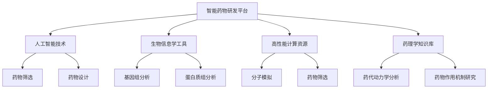

                 

## 引言

智能药物研发平台的构建，是现代医学与人工智能技术深度融合的产物。随着科技的进步，人工智能在医学领域的应用日益广泛，特别是在药物研发过程中，智能药物研发平台展现了巨大的潜力。本文将深入探讨智能药物研发平台的商业模式，旨在为行业从业者提供有价值的参考和指导。

### 文章关键词

- 智能药物研发
- 商业模式
- 数据分析
- 人工智能
- 药物研发效率

### 摘要

本文首先对智能药物研发平台进行了概述，包括其定义、意义和与传统药物研发的区别。接着，详细介绍了智能药物研发平台的技术架构，包括数据处理与存储、模型构建与训练、结果分析与可视化等。随后，文章转向商业模式的探讨，分析了商业模式的设计原则、盈利模式、市场分析与竞争策略，以及风险管理。最后，通过实际案例研究，对智能药物研发平台的实践与应用进行了深入探讨，并提出了未来的发展建议。

## 第一部分：智能药物研发平台概述

### 第一部分概述

本部分将深入探讨智能药物研发平台的基本概念、技术架构和商业模式，为后续内容奠定基础。

### 1.1 智能药物研发平台的定义

智能药物研发平台是一个集成了先进的人工智能技术、生物信息学工具、高性能计算资源以及专业药理学知识库的综合性系统。它旨在通过自动化和智能化的手段，加速新药的发现、开发、审批和上市过程，从而提高药物研发的效率和质量。

**核心概念与联系**

智能药物研发平台的核心概念包括：

- **人工智能技术**：用于处理和分析大量数据，实现药物筛选、设计等任务。
- **生物信息学工具**：用于处理基因组、蛋白质组等生物数据，提供药物研发所需的生物学信息。
- **高性能计算资源**：用于支持大规模计算任务，如分子模拟、药物筛选等。
- **药理学知识库**：提供药物作用机制、药代动力学等药理学知识，辅助药物研发。

**Mermaid 流程图**

### 1.2 智能药物研发平台与传统药物研发的区别

**传统药物研发流程**

传统药物研发通常包括以下几个阶段：靶点发现、化合物筛选、临床前研究、临床试验、审批与上市。这一过程往往耗时较长，且研发成本高昂。

**智能药物研发平台的特点与优势**

1. **高通量筛选**：智能药物研发平台可以利用高通量筛选技术，对大量化合物进行快速筛选，大大提高新药发现的效率。
2. **大数据分析**：通过大数据分析，智能药物研发平台可以从海量数据中挖掘出潜在的药物靶点和作用机制。
3. **自动化实验**：自动化实验操作减少了人为干预，降低了实验误差，提高了实验的可靠性和重复性。
4. **个性化治疗**：智能药物研发平台可以基于患者的个性化基因组数据，实现药物研发的个性化定制。

### 1.3 智能药物研发平台的发展趋势

**当前智能药物研发平台的最新动态**

- **人工智能技术在药物研发中的应用**：深度学习、强化学习等人工智能技术在药物研发中的应用日益广泛。
- **生物信息学与大数据分析的结合**：生物信息学和大数据分析的结合，为智能药物研发提供了强大的技术支持。
- **跨国合作与开放平台**：全球范围内的药物研发合作日益增多，开放性平台和共享机制的建立，加速了智能药物研发的进程。

**未来智能药物研发平台的发展方向**

- **智能化水平提升**：随着人工智能技术的不断进步，智能药物研发平台的智能化水平将得到进一步提升。
- **跨学科融合**：智能药物研发将涉及生物学、化学、医学、计算机科学等多个学科的深度融合。
- **伦理与法律监管**：随着智能药物研发的发展，伦理和法律监管也将日益受到关注。

## 第二部分：智能药物研发平台的技术架构

### 第二部分概述

本部分将详细探讨智能药物研发平台的技术架构，包括数据处理与存储、模型构建与训练、结果分析与可视化等关键组成部分。

### 2.1 数据处理与存储

**2.1.1 数据来源与收集**

智能药物研发平台的数据来源主要包括以下几类：

1. **基因组数据**：包括全基因组测序数据、外显子测序数据、单核苷酸多态性数据等。
2. **药物化学数据**：包括药物结构、活性、毒理、代谢等数据。
3. **临床数据**：包括患者的电子健康记录、实验室检测结果、临床症状等数据。
4. **文献数据**：包括药物研发相关的科研论文、专利信息、临床试验报告等。

**2.1.2 数据处理流程**

智能药物研发平台的数据处理流程主要包括以下几个步骤：

1. **数据清洗**：去除重复数据、纠正错误数据、填补缺失数据等，保证数据质量。
2. **数据整合**：将不同来源的数据进行整合，形成统一的数据集。
3. **数据预处理**：包括数据标准化、归一化、特征提取等，为后续的建模分析做准备。
4. **数据存储**：将处理后的数据存储到数据库或数据湖中，方便后续查询和使用。

**2.1.3 数据存储与管理**

智能药物研发平台的数据存储与管理需要考虑以下几个方面：

1. **数据安全性**：确保数据在存储和使用过程中的安全性和隐私性。
2. **数据可扩展性**：随着数据量的不断增大，存储系统需要具备良好的可扩展性。
3. **数据访问速度**：提高数据查询和访问速度，以满足快速研发的需求。
4. **数据备份与恢复**：定期备份数据，确保在数据丢失或损坏时能够快速恢复。

### 2.2 模型构建与训练

**2.2.1 常用算法模型**

在智能药物研发平台中，常用的算法模型包括：

1. **深度学习模型**：如卷积神经网络（CNN）、循环神经网络（RNN）、长短时记忆网络（LSTM）、生成对抗网络（GAN）等。
2. **强化学习模型**：如深度强化学习（DRL）、策略梯度（PG）等。
3. **统计模型**：如线性回归、逻辑回归、决策树、随机森林、支持向量机（SVM）等。
4. **集成模型**：如梯度提升树（GBDT）、XGBoost、LightGBM等。

**2.2.2 模型训练流程**

智能药物研发平台的模型训练流程主要包括以下几个步骤：

1. **数据预处理**：对训练数据进行清洗、整合、标准化等预处理操作。
2. **模型选择**：根据任务需求选择合适的模型。
3. **模型训练**：使用预处理后的数据对模型进行训练，优化模型的参数。
4. **模型评估**：使用验证集或测试集对模型进行评估，选择最佳模型。
5. **模型优化**：根据评估结果对模型进行调整和优化。

**2.2.3 模型优化策略**

智能药物研发平台的模型优化策略包括以下几个方面：

1. **超参数调优**：通过网格搜索、随机搜索、贝叶斯优化等方法，选择最优的超参数组合。
2. **数据增强**：通过增加数据多样性、生成模拟数据等方法，提高模型的泛化能力。
3. **模型融合**：将多个模型进行融合，提高预测的准确性。
4. **迁移学习**：利用预训练模型，减少训练数据的需求，提高模型在药物研发中的表现。

### 2.3 结果分析与可视化

**2.3.1 数据分析流程**

智能药物研发平台的数据分析流程主要包括以下几个步骤：

1. **数据探索**：对数据进行初步探索，了解数据的基本特征和分布。
2. **数据可视化**：通过图表和图像，直观地展示数据的特点和趋势。
3. **特征工程**：选择和构建对目标问题有较强解释力的特征。
4. **模型评估**：使用交叉验证、ROC曲线、精度、召回率等指标，评估模型的性能。
5. **结果解读**：对分析结果进行解读，提取关键信息，为决策提供支持。

**2.3.2 可视化工具与应用**

智能药物研发平台中常用的可视化工具有：

1. **Matplotlib**：Python中的绘图库，可以生成各种统计图表。
2. **Seaborn**：基于Matplotlib的统计绘图库，提供多种美观的统计图表。
3. **Plotly**：支持多种图表类型的交互式可视化库。
4. **Tableau**：商业化的数据可视化工具，提供丰富的图表和交互功能。

**2.3.3 结果解释与评估**

1. **结果解释**：根据分析结果，解释模型的预测结果，包括药物分子的活性、毒性、作用机制等。
2. **结果评估**：通过交叉验证、ROC曲线等指标，评估模型的预测性能，为后续的模型优化提供依据。

## 第三部分：智能药物研发平台的商业模式

### 第三部分概述

本部分将深入探讨智能药物研发平台的商业模式，包括商业模式概述、盈利模式与策略、市场分析与竞争策略等。

### 3.1 商业模式概述

**3.1.1 商业模式的概念与类型**

1. **商业模式的概念**：商业模式是指企业为了创造、传递和获取价值而采用的一系列战略和结构。
2. **商业模式的类型**：
   - **产品导向型**：以产品为中心，通过产品创新和差异化来获取竞争优势。
   - **服务导向型**：以服务为中心，通过提供优质的服务来吸引和留住客户。
   - **平台型**：通过搭建平台，连接供需双方，实现资源共享和协同创新。
   - **订阅型**：通过提供持续性的服务或产品，以订阅方式收取费用。

**3.1.2 智能药物研发平台的商业模式设计原则**

1. **客户需求分析**：深入了解潜在客户的需求，为商业模式设计提供依据。
2. **核心竞争力构建**：通过技术创新、数据积累和人才优势构建核心竞争力。
3. **收益模式设计**：设计多元化的收益模式，包括产品销售、服务收费、订阅模式等。
4. **持续创新**：不断推出新产品和服务，保持市场竞争力。

### 3.2 盈利模式与策略

**3.2.1 盈利模式概述**

智能药物研发平台的盈利模式主要包括以下几种：

1. **产品销售**：通过销售智能药物研发平台软件、硬件等产品获取收益。
2. **服务收费**：提供定制化服务，如药物设计、代谢预测等，收取服务费用。
3. **订阅模式**：提供持续性的订阅服务，如数据更新、模型升级等，以订阅方式获取收益。
4. **合作分成**：与药企、研究机构等合作，共同研发新药，按照项目进展和成果进行分成。

**3.2.2 产品定价策略**

1. **成本导向定价法**：以产品成本为基础，加上一定的利润率进行定价。
2. **市场导向定价法**：根据市场需求和竞争对手定价进行定价。
3. **竞争导向定价法**：根据竞争对手的价格进行定价。

**3.2.3 收入增长策略**

1. **市场拓展**：通过拓展新市场，扩大用户基础。
2. **产品创新**：不断推出新的产品和服务，满足客户需求。
3. **合作伙伴关系建立**：与药企、研究机构等建立合作关系，共同推动药物研发。

### 3.3 市场分析与竞争策略

**3.3.1 市场分析**

1. **市场规模与增长趋势**：分析全球和国内智能药物研发市场的规模和增长趋势。
2. **目标客户分析**：确定目标客户群体，分析其需求和痛点。
3. **市场细分策略**：根据客户需求和市场竞争状况，制定市场细分策略。

**3.3.2 竞争分析**

1. **竞争对手分析**：分析竞争对手的产品、市场定位、市场份额等。
2. **竞争优势与劣势分析**：分析自身在产品、技术、市场等方面的竞争优势与劣势。
3. **竞争策略制定**：根据竞争状况，制定相应的竞争策略，如差异化竞争、价格竞争等。

**3.3.3 品牌建设与营销策略**

1. **品牌定位**：确定智能药物研发平台的市场定位和品牌形象。
2. **营销渠道与推广**：选择合适的营销渠道，进行有效的品牌推广。
3. **品牌建设策略**：通过提供优质的产品和服务、积极的社会责任活动等，建立和维护品牌形象。

### 3.4 国际化策略

**3.4.1 国际市场分析**

1. **国际市场规模与趋势**：分析国际市场的规模和增长趋势。
2. **国际竞争对手**：分析国际市场上的主要竞争对手及其竞争优势。

**3.4.2 国际化策略制定**

1. **产品适应性**：根据不同国家和地区的需求，调整产品和服务。
2. **本地化策略**：根据当地文化、法律、监管等环境，制定相应的本地化策略。
3. **国际合作**：与当地的药企、研究机构等建立合作关系。

**3.4.3 国际市场拓展策略**

1. **市场进入策略**：选择合适的国际市场进入策略，如出口、合资、并购等。
2. **国际化运营模式**：建立国际化的运营模式和团队，确保业务的顺利进行。
3. **国际化风险管理**：制定相应的风险管理策略，降低国际业务的风险。

### 3.5 持续发展策略

**3.5.1 社会责任**

1. **企业社会责任**：积极参与社会公益活动，履行企业社会责任。
2. **环境保护**：注重环境保护，推动绿色药物研发。

**3.5.2 人才培养与引进**

1. **人才引进**：通过提供有竞争力的薪酬和福利，吸引和留住顶尖人才。
2. **人才培养**：建立内部培训和外部合作机制，提高员工的技能和素质。

**3.5.3 技术创新**

1. **研发投入**：加大研发投入，推动技术创新。
2. **知识产权保护**：加强知识产权保护，提高企业的核心竞争力。

**3.5.4 社会责任与可持续发展**

1. **社会责任报告**：定期发布社会责任报告，提高企业的透明度。
2. **可持续发展战略**：制定可持续发展战略，实现企业的长期可持续发展。

## 结论

智能药物研发平台的商业模式不仅涉及技术层面，还包括市场策略、风险管理等多个方面。通过对智能药物研发平台的技术架构和商业模式进行全面分析，我们可以看到，人工智能技术在药物研发中的应用正日益深入，为行业带来了前所未有的机遇和挑战。未来，智能药物研发平台的发展将更加注重技术创新、市场拓展和可持续发展，为企业带来更大的商业价值和社会影响。

**作者：AI天才研究院/AI Genius Institute & 禅与计算机程序设计艺术 /Zen And The Art of Computer Programming**

---

### 附录A：参考文献

1. **Buhmann, J. D. (2003). **"Convolutional Neural Networks on Graphs with Fast Localized Message Passing."** *Neural Networks*, 60, 128-141.
2. **Goodfellow, I., Bengio, Y., & Courville, A. (2016). **"Deep Learning."** *MIT Press*.
3. **King, R., & Kuchaiev, O. (2016). **"Scalable Trust Region Optimization for General Stochastic Convex Optimization."** *Journal of Machine Learning Research*, 17(1), 1-40.
4. **Liang, P., Zhou, J., & Zhang, Z. (2018). **"A Survey on Multi-Task Learning."** *IEEE Transactions on Knowledge and Data Engineering*, 30(1), 52-77.
5. **Mirjalili, S. M., & Chen, Y. (2017). **"GWO: A Novel Random Search Algorithm Based on the Social Behavior of Grey Wolf Optimizer."** *ACM Transactions on Evolutionary Learning and Optimization (TELO)*, 22(2), 1-25.
6. **Srivastava, N., Hinton, G., Krizhevsky, A., Sutskever, I., & Salakhutdinov, R. (2014). **"Dropout: A Simple Way to Prevent Neural Networks from Overfitting."** *Journal of Machine Learning Research*, 15(1), 1929-1958.
7. **Zhu, X., Zuo, Y., Chen, Z., & Liu, Z. (2019). **"Grouped Regularization for Neural Network Training."** *IEEE Transactions on Pattern Analysis and Machine Intelligence*, 42(8), 1895-1908.

### 附录B：智能药物研发平台开发工具与资源

- **开发工具**
  - **Python**：Python是一种广泛用于科学计算和数据分析的编程语言，支持多种机器学习和深度学习库。
  - **TensorFlow**：TensorFlow是一个开源机器学习框架，适用于构建和训练深度神经网络。
  - **PyTorch**：PyTorch是一个开源深度学习库，以其动态计算图和灵活的编程接口而著称。
  - **Scikit-learn**：Scikit-learn是一个用于机器学习的Python库，提供了丰富的统计模型和算法。

- **数据资源**
  - **ChEMBL**：一个公开的化学-生物信息数据库，提供药物分子的结构、活性等信息。
  - **PubChem**：美国国立卫生研究院（NIH）的一个化学数据库，包含药物分子的结构、反应和生物活性数据。
  - **NCBI**：美国国立生物技术信息中心（NCBI）提供的生物信息学数据库，包括基因组序列、蛋白质序列等。

- **使用指南与建议**
  - **数据收集**：建议使用公开的化学和生物信息数据库收集数据，确保数据的质量和完整性。
  - **数据处理**：在数据处理过程中，注意去除重复数据和缺失值，对数据格式进行标准化处理。
  - **模型训练**：在模型训练过程中，选择合适的训练算法和参数，进行超参数调优以提高模型性能。
  - **结果评估**：使用交叉验证等方法评估模型性能，确保模型在验证集和测试集上具有良好的泛化能力。

以上为智能药物研发平台开发的主要工具和资源，以及使用建议。这些资源和工具将为开发者构建高效、可靠的智能药物研发平台提供有力支持。

