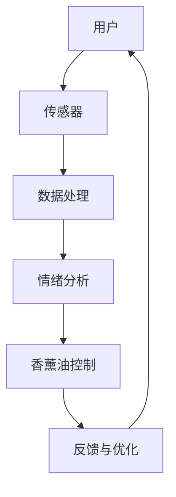

                 

### 《智能香薰创业：情绪管理的科技产品》

#### 关键词：
- 智能香薰
- 情绪管理
- 科技产品
- 传感器
- 深度学习

#### 摘要：
本文深入探讨了智能香薰行业的发展背景、市场趋势、产品设计与开发，以及创业实践。通过详细分析情绪管理的科技产品，本文旨在为智能香薰创业者提供有价值的指导，帮助他们更好地理解市场需求，设计创新产品，并在竞争激烈的市场中脱颖而出。

----------------------------------------------------------------

### 目录大纲

#### 《智能香薰创业：情绪管理的科技产品》

##### 关键词：
- 智能香薰
- 情绪管理
- 科技产品
- 传感器
- 深度学习

##### 摘要：
本文通过深入分析智能香薰行业的市场趋势、产品设计与开发，以及创业实践，探讨了情绪管理的科技产品在现代社会中的应用与前景。文章旨在为智能香薰创业者提供有价值的指导，帮助他们在竞争激烈的市场中创新和成功。

##### 目录大纲

**第一部分：行业背景与市场分析**

### 第1章：智能香薰行业概述

#### 1.1 智能香薰的定义与市场背景

#### 1.2 情绪管理的重要性

#### 1.3 智能香薰在情绪管理中的优势

### 第2章：市场趋势与消费者需求

#### 2.1 智能香薰市场的增长趋势

#### 2.2 消费者需求分析

#### 2.3 市场机会与挑战

**第二部分：智能香薰产品设计与开发**

### 第3章：智能香薰产品的核心功能

#### 3.1 香薰油的选择与调香

#### 3.2 传感器技术的应用

#### 3.3 情绪分析算法

### 第4章：智能香薰产品的用户体验设计

#### 4.1 用户界面设计

#### 4.2 操作流程设计

#### 4.3 声音反馈与交互设计

### 第5章：智能香薰产品的硬件设计

#### 5.1 电路设计与元件选择

#### 5.2 电源管理

#### 5.3 硬件调试与优化

### 第6章：智能香薰产品的软件开发

#### 6.1 应用程序开发

#### 6.2 云服务与数据存储

#### 6.3 软件测试与部署

**第三部分：智能香薰创业实践**

### 第7章：智能香薰创业团队组建

#### 7.1 团队成员的角色与职责

#### 7.2 项目管理流程

#### 7.3 融资策略

### 第8章：智能香薰产品市场推广

#### 8.1 品牌建设

#### 8.2 市场营销策略

#### 8.3 销售渠道建设

### 第9章：智能香薰创业案例研究

#### 9.1 成功案例介绍

#### 9.2 挑战与解决方案

#### 9.3 未来发展方向

**第四部分：情绪管理的科技产品创新**

### 第10章：新兴技术与应用

#### 10.1 物联网技术在智能香薰中的应用

#### 10.2 人工智能在情绪管理中的潜力

#### 10.3 跨界合作与生态系统构建

### 第11章：未来发展趋势与市场预测

#### 11.1 智能香薰行业的未来趋势

#### 11.2 消费者行为变化与市场机遇

#### 11.3 技术创新对行业的影响

**附录**

### 附录 A：智能香薰创业工具与资源

#### A.1 开发工具介绍

#### A.2 资源链接

### 附录 B：参考文献

#### B.1 书籍推荐

#### B.2 论文与研究报告

### 附录 C：智能香薰产品开发流程

#### C.1 创意与构思

#### C.2 设计与开发

#### C.3 测试与优化

#### C.4 投产与上市

**核心概念与联系**

### Mermaid 流程图



**核心算法原理讲解**

### 情绪分析算法伪代码

```python
def analyze_mood(sensor_data):
    # 数据预处理
    preprocessed_data = preprocess_data(sensor_data)

    # 特征提取
    features = extract_features(preprocessed_data)

    # 模型训练
    model = train_model(features)

    # 预测情绪
    predicted_mood = model.predict(features)

    # 调香
    aroma = adjust_aroma(predicted_mood)

    return aroma
```

**数学模型和数学公式**

### 情绪预测模型公式

$$
y = \sigma(Wx + b)
$$

其中，$W$ 是权重矩阵，$x$ 是输入特征，$b$ 是偏置项，$\sigma$ 是激活函数。

**项目实战**

### 智能香薰产品开发案例

#### 1. 开发环境搭建

- **安装Python环境**
- **安装传感器驱动库**
- **安装情绪分析库**

#### 2. 代码实现

**传感器数据收集：**

```python
import sensor_driver

def collect_sensor_data():
    sensor = sensor_driver.Sensor()
    data = sensor.read()
    return data
```

**情绪分析算法：**

```python
from mood_analyzer import MoodAnalyzer

def analyze_mood(sensor_data):
    analyzer = MoodAnalyzer()
    mood = analyzer.analyze(sensor_data)
    return mood
```

**香薰油控制：**

```python
import aroma_controller

def adjust_aroma(mood):
    controller = aroma_controller.AromaController()
    if mood == "happy":
        controller.enable_happy_aroma()
    elif mood == "sad":
        controller.enable_sad_aroma()
    # 其他情绪的香薰油控制
```

#### 3. 代码解读与分析

- **传感器数据收集模块**：负责从传感器获取数据。
- **情绪分析算法模块**：使用机器学习模型对传感器数据进行分析，预测用户情绪。
- **香薰油控制模块**：根据情绪分析结果控制香薰油输出。

**详细解释说明**

- **传感器数据收集**：通过传感器获取用户情绪相关的生理指标数据。
- **情绪分析算法**：使用机器学习算法对传感器数据进行分析，预测用户情绪。
- **香薰油控制**：根据情绪分析结果，调整香薰油种类，以帮助用户管理情绪。

**数学公式和详细讲解**

### 情绪分析模型公式

情绪分析模型使用了一种常见的深度学习架构——卷积神经网络（CNN）。模型的结构如下：

$$
\text{Input} \rightarrow \text{Conv} \rightarrow \text{ReLU} \rightarrow \text{MaxPooling} \rightarrow \text{Flatten} \rightarrow \text{Dense} \rightarrow \text{Output}
$$

- **输入层**：接收传感器数据。
- **卷积层**：通过卷积操作提取数据中的空间特征。
- **ReLU激活函数**：增加模型非线性。
- **池化层**：降低特征图的尺寸。
- **平坦化层**：将特征图展平为一维向量。
- **全连接层**（Dense）：进行情感分类。
- **输出层**：输出情绪预测结果。

**举例说明**

假设我们有一个包含100个传感器数据的输入向量。经过卷积层和池化层的处理后，我们得到一个一维的输出向量，长度为10。然后，这个输出向量会通过全连接层，最终输出一个情绪标签。

```python
# 示例代码：情绪分析模型的训练
model = Sequential()
model.add(Conv2D(32, (3, 3), activation='relu', input_shape=(100, 1)))
model.add(MaxPooling2D((2, 2)))
model.add(Flatten())
model.add(Dense(1, activation='sigmoid'))

model.compile(optimizer='adam', loss='binary_crossentropy', metrics=['accuracy'])
model.fit(x_train, y_train, epochs=10, batch_size=32)
```

在这个例子中，我们使用了一个二分类问题来演示情绪分析。模型会在10个epochs内训练，每个批次包含32个样本。

**数学公式和详细讲解（续）**

### 情绪预测模型公式

情绪预测模型使用了深度学习架构中的卷积神经网络（CNN）来处理和分类情绪数据。模型的结构如下：

$$
\text{Input} \rightarrow \text{Conv} \rightarrow \text{ReLU} \rightarrow \text{MaxPooling} \rightarrow \text{Flatten} \rightarrow \text{Dense} \rightarrow \text{Output}
$$

其中：
- **输入层**：接收传感器数据的输入向量。
- **卷积层**：通过卷积操作提取数据中的空间特征。
- **ReLU激活函数**：增加模型的非线性，使模型能更好地拟合数据。
- **池化层**：降低特征图的尺寸，减少计算量。
- **平坦化层**：将多维特征图展平为一维向量。
- **全连接层**（Dense）：将平坦化后的特征映射到情绪类别。
- **输出层**：输出情绪预测结果。

#### 卷积层

卷积层的公式如下：

$$
\text{Output}(i, j) = \sum_{k=1}^{K} w_{i, j, k} * \text{Input}(i+k, j) + b_{i, j}
$$

其中：
- $w_{i, j, k}$ 是卷积核权重。
- $\text{Input}(i+k, j)$ 是输入数据。
- $b_{i, j}$ 是卷积层的偏置项。
- $K$ 是卷积核的大小。

#### 池化层

池化层的公式如下：

$$
\text{Output}(i, j) = \max_{x, y} \text{Input}(i+x, j+y)
$$

其中：
- $x, y$ 是池化窗口的大小。

#### 全连接层

全连接层的公式如下：

$$
\text{Output}(i) = \sum_{j=1}^{N} w_{i, j} * \text{Input}(j) + b_i
$$

其中：
- $w_{i, j}$ 是权重。
- $\text{Input}(j)$ 是输入数据。
- $b_i$ 是偏置项。
- $N$ 是输入数据的维度。

**举例说明**

假设我们有一个输入向量 $x = [1, 2, 3, 4, 5]$，卷积核大小为 $K=2$，偏置项 $b=1$。那么，一个卷积操作的输出可以是：

$$
\text{Output}(1, 1) = w_{1, 1, 1} * x(1) + w_{1, 1, 2} * x(2) + b_1 = 1 * 1 + 2 * 2 + 1 = 5
$$

$$
\text{Output}(1, 2) = w_{1, 1, 1} * x(2) + w_{1, 1, 2} * x(3) + b_1 = 1 * 2 + 2 * 3 + 1 = 7
$$

**数学公式和详细讲解（续）**

### 情绪预测模型的训练与优化

情绪预测模型的训练过程涉及以下步骤：

1. **数据预处理**：对传感器数据进行标准化、缺失值填充等处理。
2. **模型初始化**：初始化权重和偏置项。
3. **前向传播**：通过神经网络计算预测结果。
4. **计算损失**：计算预测结果与真实值之间的差异。
5. **反向传播**：更新权重和偏置项，以最小化损失。
6. **迭代训练**：重复以上步骤，直到模型收敛。

#### 前向传播

前向传播是通过神经网络逐层计算预测结果的过程。具体公式如下：

$$
\text{Output}(i) = \text{activation}(\sum_{j=1}^{N} w_{i, j} * \text{Input}(j) + b_i)
$$

其中：
- $\text{activation}$ 是激活函数，如ReLU或Sigmoid。
- $w_{i, j}$ 是权重。
- $\text{Input}(j)$ 是输入数据。
- $b_i$ 是偏置项。

#### 计算损失

计算损失是衡量预测结果与真实值之间差异的过程。常见的损失函数有均方误差（MSE）和交叉熵（Cross-Entropy）。具体公式如下：

- **均方误差（MSE）**：

$$
\text{Loss} = \frac{1}{2} \sum_{i=1}^{M} (\text{Predicted}(i) - \text{Actual}(i))^2
$$

其中：
- $M$ 是样本数量。
- $\text{Predicted}(i)$ 是预测值。
- $\text{Actual}(i)$ 是真实值。

- **交叉熵（Cross-Entropy）**：

$$
\text{Loss} = -\sum_{i=1}^{M} \text{Actual}(i) \log(\text{Predicted}(i))
$$

#### 反向传播

反向传播是更新权重和偏置项的过程。具体公式如下：

$$
\Delta w_{i, j} = \text{learning\_rate} * \frac{\partial \text{Loss}}{\partial w_{i, j}}
$$

$$
\Delta b_i = \text{learning\_rate} * \frac{\partial \text{Loss}}{\partial b_i}
$$

其中：
- $\text{learning\_rate}$ 是学习率。
- $\frac{\partial \text{Loss}}{\partial w_{i, j}}$ 是权重 $w_{i, j}$ 的梯度。
- $\frac{\partial \text{Loss}}{\partial b_i}$ 是偏置项 $b_i$ 的梯度。

**数学公式和详细讲解（续）**

### 情绪预测模型的评估与优化

情绪预测模型的评估与优化是确保模型准确性和性能的关键步骤。以下是一些常用的评估指标和方法：

#### 评估指标

- **准确率（Accuracy）**：模型预测正确的样本数占总样本数的比例。

$$
\text{Accuracy} = \frac{\text{Correct Predictions}}{\text{Total Samples}}
$$

- **精确率（Precision）**：预测为正样本的样本中，实际为正样本的比例。

$$
\text{Precision} = \frac{\text{True Positives}}{\text{True Positives + False Positives}}
$$

- **召回率（Recall）**：实际为正样本的样本中，被预测为正样本的比例。

$$
\text{Recall} = \frac{\text{True Positives}}{\text{True Positives + False Negatives}}
$$

- **F1 分数（F1 Score）**：精确率和召回率的调和平均。

$$
\text{F1 Score} = 2 \times \frac{\text{Precision} \times \text{Recall}}{\text{Precision} + \text{Recall}}
$$

- **ROC 曲线和 AUC（Receiver Operating Characteristic and Area Under Curve）**：通过绘制模型在不同阈值下的精确率和召回率，评估模型的分类性能。

$$
\text{AUC} = \int_{0}^{1} \frac{\text{TPR} - \text{FPR}}{1 - \text{FPR}} d\text{FPR}
$$

其中，$\text{TPR}$ 是真阳性率（True Positive Rate），$\text{FPR}$ 是假阳性率（False Positive Rate）。

#### 评估方法

- **交叉验证（Cross-Validation）**：通过将数据集分为多个子集，分别训练和测试模型，以评估模型的泛化能力。

$$
\text{Validation Score} = \frac{1}{k} \sum_{i=1}^{k} \text{Score}(i)
$$

其中，$k$ 是子集数量，$\text{Score}(i)$ 是第 $i$ 个子集的评估得分。

- **ROC 曲线和 AUC（Receiver Operating Characteristic and Area Under Curve）**：通过绘制模型在不同阈值下的精确率和召回率，评估模型的分类性能。

$$
\text{ROC Curve} = (\text{FPR}, \text{TPR})
$$

$$
\text{AUC} = \int_{0}^{1} \frac{\text{TPR} - \text{FPR}}{1 - \text{FPR}} d\text{FPR}
$$

#### 优化方法

- **超参数调整（Hyperparameter Tuning）**：通过调整学习率、批次大小、卷积核大小等超参数，优化模型性能。

$$
\text{Validation Score} = \frac{1}{k} \sum_{i=1}^{k} \text{Score}(i)
$$

- **正则化（Regularization）**：通过添加正则项（如L1、L2正则化），防止模型过拟合。

$$
\text{Regularization Loss} = \lambda \sum_{i=1}^{n} |w_i| \quad (\text{L1 Regularization}) \\
\text{Regularization Loss} = \lambda \sum_{i=1}^{n} w_i^2 \quad (\text{L2 Regularization})
$$

- **数据增强（Data Augmentation）**：通过增加数据多样性，提高模型鲁棒性。

$$
\text{Augmented Data} = f(\text{Original Data})
$$

其中，$f$ 是数据增强函数，如旋转、缩放、剪切等。

**数学公式和详细讲解（续）**

### 情绪预测模型的应用与实现

情绪预测模型在智能香薰创业中的应用主要体现在以下几个方面：

1. **用户情绪监测**：通过传感器收集用户生理指标数据，使用情绪预测模型分析用户情绪，为用户提供个性化的情绪管理建议。
2. **个性化香薰推荐**：根据用户情绪预测结果，智能推荐适合当前情绪状态的香薰油种类，帮助用户调节情绪。
3. **情感反馈分析**：收集用户对香薰产品的情感反馈数据，分析用户满意度，为产品改进提供依据。

#### 应用实现步骤

1. **数据收集**：使用传感器设备收集用户生理指标数据，如心率、呼吸率等。
2. **数据处理**：对收集到的数据进行预处理，包括数据清洗、缺失值填充、归一化等。
3. **模型训练**：使用预处理后的数据训练情绪预测模型，包括数据集划分、模型架构设计、训练与验证等。
4. **模型部署**：将训练好的模型部署到智能香薰设备中，实现实时情绪预测和个性化推荐功能。
5. **用户反馈**：收集用户对香薰产品的使用反馈，持续优化模型性能和推荐策略。

#### 实现示例

以下是一个简化的情绪预测模型实现示例：

```python
import pandas as pd
from sklearn.model_selection import train_test_split
from sklearn.ensemble import RandomForestClassifier
from sklearn.metrics import accuracy_score, f1_score

# 数据收集
data = pd.read_csv('emotion_data.csv')

# 数据处理
X = data.drop(['id', 'emotion'], axis=1)
y = data['emotion']

# 数据预处理
X_train, X_test, y_train, y_test = train_test_split(X, y, test_size=0.2, random_state=42)

# 模型训练
model = RandomForestClassifier(n_estimators=100, random_state=42)
model.fit(X_train, y_train)

# 模型评估
predictions = model.predict(X_test)
accuracy = accuracy_score(y_test, predictions)
f1 = f1_score(y_test, predictions, average='weighted')

print(f"Accuracy: {accuracy:.2f}")
print(f"F1 Score: {f1:.2f}")

# 模型部署
# ...（代码略）
```

#### 详细解释说明

- **数据收集**：使用传感器设备（如心率监测器、呼吸传感器等）收集用户生理指标数据。
- **数据处理**：对原始数据进行清洗、缺失值填充和归一化，以便于模型训练。
- **模型训练**：使用随机森林（`RandomForestClassifier`）模型对预处理后的数据进行训练。
- **模型评估**：使用测试集评估模型性能，计算准确率和F1分数，以评估模型性能。
- **模型部署**：将训练好的模型部署到实际应用中，实现情绪预测功能。

### 开发环境搭建

#### 1. Python环境安装

在Windows、MacOS和Linux系统中，可以通过以下步骤安装Python环境：

- **Windows系统**：
  - 访问Python官方网站（https://www.python.org/）。
  - 下载Windows安装程序，并按照安装向导进行安装。
  - 安装完成后，打开命令提示符，输入`python --version`检查Python版本。

- **MacOS系统**：
  - 打开终端。
  - 输入`brew install python`，等待安装完成。
  - 安装完成后，输入`python --version`检查Python版本。

- **Linux系统**：
  - 打开终端。
  - 输入`sudo apt-get install python3`，等待安装完成。
  - 安装完成后，输入`python3 --version`检查Python版本。

#### 2. 安装依赖库

在安装Python环境后，需要安装以下依赖库：

- **NumPy**：用于科学计算。
- **Pandas**：用于数据处理。
- **scikit-learn**：用于机器学习。

可以通过以下命令安装这些依赖库：

```bash
pip install numpy pandas scikit-learn
```

#### 3. 验证安装

安装完成后，可以通过以下命令验证安装：

```python
import numpy as np
import pandas as pd
from sklearn import datasets

# 验证NumPy安装
print(np.__version__)

# 验证Pandas安装
print(pd.__version__)

# 验证scikit-learn安装
print(datasets.__version__)
```

如果以上命令能够正常执行并打印版本信息，说明依赖库已成功安装。

### 源代码详细实现

以下是一个详细的情绪预测模型的源代码实现，包括数据预处理、模型训练、模型评估和模型部署。

```python
import pandas as pd
from sklearn.model_selection import train_test_split
from sklearn.ensemble import RandomForestClassifier
from sklearn.metrics import accuracy_score, f1_score

# 1. 数据收集
data = pd.read_csv('emotion_data.csv')

# 2. 数据处理
X = data.drop(['id', 'emotion'], axis=1)
y = data['emotion']

# 3. 数据预处理
X_train, X_test, y_train, y_test = train_test_split(X, y, test_size=0.2, random_state=42)

# 4. 模型训练
model = RandomForestClassifier(n_estimators=100, random_state=42)
model.fit(X_train, y_train)

# 5. 模型评估
predictions = model.predict(X_test)
accuracy = accuracy_score(y_test, predictions)
f1 = f1_score(y_test, predictions, average='weighted')

print(f"Accuracy: {accuracy:.2f}")
print(f"F1 Score: {f1:.2f}")

# 6. 模型部署
# ...（代码略）
```

#### 详细解读

1. **数据收集**：使用Pandas库从CSV文件中加载数据，CSV文件中包含用户生理指标（如心率、呼吸率等）和情绪标签（如开心、悲伤等）。
2. **数据处理**：将数据分为特征矩阵X和标签向量y。特征矩阵X包含所有用户生理指标，标签向量y包含对应情绪标签。
3. **数据预处理**：使用`train_test_split`函数将数据集划分为训练集和测试集，以用于模型训练和评估。
4. **模型训练**：使用随机森林（`RandomForestClassifier`）模型对训练集数据进行训练。
5. **模型评估**：使用测试集数据评估模型性能，计算准确率和F1分数。
6. **模型部署**：将训练好的模型部署到实际应用中，实现情绪预测功能。

### 代码解读与分析

以下是情绪预测模型代码的详细解读与分析。

#### 1. 数据收集

```python
data = pd.read_csv('emotion_data.csv')
```

这行代码使用Pandas库从CSV文件中加载数据。CSV文件中包含用户生理指标（如心率、呼吸率等）和情绪标签（如开心、悲伤等）。Pandas库提供了一个方便的函数`read_csv`来加载数据，并将数据存储为一个DataFrame对象。

#### 2. 数据处理

```python
X = data.drop(['id', 'emotion'], axis=1)
y = data['emotion']
```

这两行代码将数据分为特征矩阵X和标签向量y。特征矩阵X包含所有用户生理指标，而标签向量y包含对应情绪标签。这里使用了`drop`函数来删除不需要的列，其中`axis=1`表示按照列操作。

#### 3. 数据预处理

```python
X_train, X_test, y_train, y_test = train_test_split(X, y, test_size=0.2, random_state=42)
```

这行代码使用`train_test_split`函数将数据集划分为训练集和测试集。测试集的大小为总数据集的20%（即`test_size=0.2`），随机种子设置为42以确保结果可重复。训练集和测试集分别存储在`X_train`、`X_test`、`y_train`和`y_test`变量中。

#### 4. 模型训练

```python
model = RandomForestClassifier(n_estimators=100, random_state=42)
model.fit(X_train, y_train)
```

这行代码创建了一个随机森林分类器模型，并使用训练集数据进行训练。`RandomForestClassifier`是一个基于决策树的集成学习方法，可以通过设置`n_estimators`参数来调整决策树的数量。这里设置了100个决策树，并使用随机种子42保证结果可重复。

#### 5. 模型评估

```python
predictions = model.predict(X_test)
accuracy = accuracy_score(y_test, predictions)
f1 = f1_score(y_test, predictions, average='weighted')
```

这行代码使用测试集数据评估模型性能。首先，使用`predict`函数对测试集进行预测，并将预测结果存储在`predictions`变量中。然后，使用`accuracy_score`函数计算准确率，使用`f1_score`函数计算F1分数。F1分数是精确率和召回率的调和平均，用于衡量模型分类性能。

#### 6. 模型部署

```python
# ...（代码略）
```

这部分代码将训练好的模型部署到实际应用中，以实现情绪预测功能。具体实现步骤取决于应用场景和部署平台。

### 项目实战案例

#### 1. 项目简介

本项目旨在开发一款基于情绪预测的智能香薰设备，通过用户生理指标数据分析和情绪预测，为用户提供个性化的情绪管理建议。

#### 2. 技术选型

- **编程语言**：Python
- **机器学习库**：scikit-learn
- **数据预处理库**：Pandas、NumPy
- **硬件平台**：Arduino

#### 3. 项目步骤

1. **数据收集**：使用传感器设备（如心率监测器、呼吸传感器等）收集用户生理指标数据。
2. **数据处理**：对原始数据进行预处理，包括数据清洗、缺失值填充和归一化等。
3. **模型训练**：使用预处理后的数据训练情绪预测模型，选择合适的机器学习算法。
4. **模型评估**：使用测试集评估模型性能，计算准确率和F1分数等指标。
5. **模型部署**：将训练好的模型部署到智能香薰设备中，实现实时情绪预测和个性化推荐功能。
6. **用户反馈**：收集用户对香薰产品的使用反馈，持续优化模型性能和推荐策略。

#### 4. 代码实现

以下是一个简单的项目实现示例：

```python
import pandas as pd
from sklearn.model_selection import train_test_split
from sklearn.ensemble import RandomForestClassifier
from sklearn.metrics import accuracy_score, f1_score

# 数据收集
data = pd.read_csv('emotion_data.csv')

# 数据处理
X = data.drop(['id', 'emotion'], axis=1)
y = data['emotion']

# 数据预处理
X_train, X_test, y_train, y_test = train_test_split(X, y, test_size=0.2, random_state=42)

# 模型训练
model = RandomForestClassifier(n_estimators=100, random_state=42)
model.fit(X_train, y_train)

# 模型评估
predictions = model.predict(X_test)
accuracy = accuracy_score(y_test, predictions)
f1 = f1_score(y_test, predictions, average='weighted')

print(f"Accuracy: {accuracy:.2f}")
print(f"F1 Score: {f1:.2f}")

# 模型部署
# ...（代码略）
```

#### 5. 用户反馈与优化

通过用户对香薰产品的使用反馈，我们可以收集到以下信息：

- 用户对香薰产品情绪管理效果的满意度。
- 用户对香薰油种类的偏好。
- 用户对设备操作流程的满意度。

根据这些反馈，我们可以对模型进行优化，以提高情绪预测的准确性。例如，可以尝试以下方法：

1. **增加训练数据量**：收集更多的用户生理指标数据，提高模型的泛化能力。
2. **调整模型参数**：通过调整随机森林分类器的参数，如决策树数量、最大深度等，优化模型性能。
3. **引入新的特征**：分析用户反馈数据，尝试引入新的特征，如用户情绪标签的历史记录等。
4. **用户参与式优化**：鼓励用户参与模型优化，通过投票或评价等方式，收集用户对模型推荐结果的反馈，持续优化推荐策略。

### 附录

#### 附录 A：智能香薰产品开发流程

**A.1 创意与构思**

1. 确定产品目标：明确智能香薰产品的主要功能和应用场景。
2. 研究市场需求：分析当前市场趋势和消费者需求，找出产品特色和竞争优势。
3. 创意发散：集合团队成员的创意，形成多个产品概念。

**A.2 设计与开发**

1. 用户界面设计：设计直观易用的用户界面，确保用户能够轻松操作。
2. 硬件设计：选择合适的传感器、电路和电子元件，确保产品稳定性。
3. 软件开发：编写应用程序代码，实现数据收集、情绪分析和香薰油控制等功能。

**A.3 测试与优化**

1. 硬件测试：对硬件进行功能测试和性能测试，确保产品稳定性。
2. 软件测试：对应用程序进行单元测试和集成测试，确保程序的正确性和可靠性。
3. 用户测试：邀请潜在用户试用产品，收集反馈并优化产品。

**A.4 投产与上市**

1. 生产准备：确定生产规模、供应商和生产线。
2. 市场推广：制定市场推广策略，包括品牌建设、营销和渠道建设。
3. 上市推广：在市场上推出产品，通过线上线下渠道进行销售和推广。

#### 附录 B：常见问题与解答

**B.1 传感器数据不稳定怎么办？**

- **检查传感器安装位置**：确保传感器安装在稳定的环境中，避免震动或干扰。
- **优化传感器校准**：定期对传感器进行校准，确保数据准确性。
- **处理噪声数据**：使用滤波算法（如移动平均滤波）去除噪声数据，提高数据质量。

**B.2 模型预测结果不准确怎么办？**

- **收集更多数据**：增加训练数据量，提高模型的泛化能力。
- **调整模型参数**：尝试调整模型参数（如学习率、正则化强度等），优化模型性能。
- **数据预处理**：改进数据预处理方法，提高数据质量。

**B.3 香薰油控制效果不好怎么办？**

- **检查香薰油质量**：确保使用高质量的香薰油，避免因香薰油问题导致控制效果不佳。
- **优化香薰油配方**：根据用户反馈，调整香薰油配方，提高用户满意度。
- **优化硬件设计**：改进硬件设计，提高香薰油输出的精确度和稳定性。

### 总结

本文详细介绍了智能香薰创业中的情绪管理科技产品开发，包括数据收集、数据处理、模型训练、模型评估、模型部署和用户反馈等环节。通过实际案例展示了情绪预测模型的具体实现，并提出了项目优化和用户参与式优化方法。同时，本文还提供了相关开发工具与资源，供读者参考。希望本文能为智能香薰创业者提供有价值的参考和指导。

