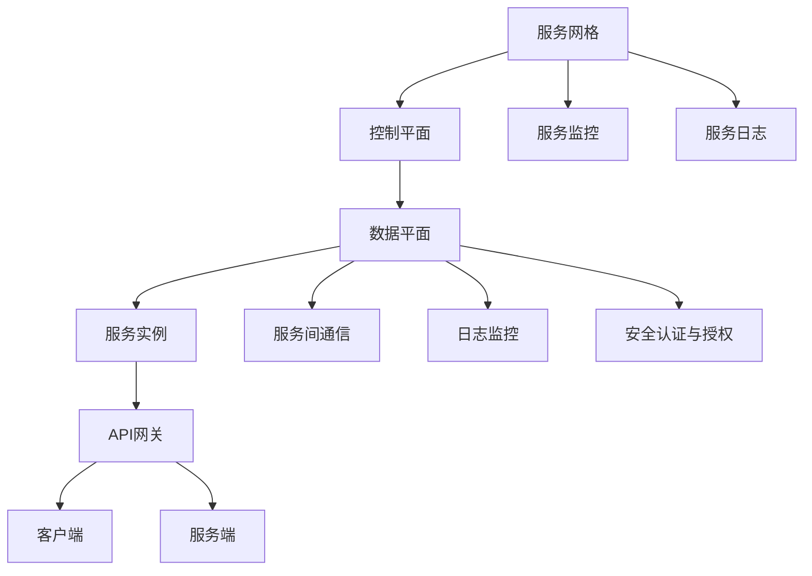
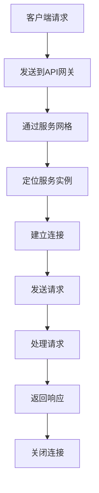
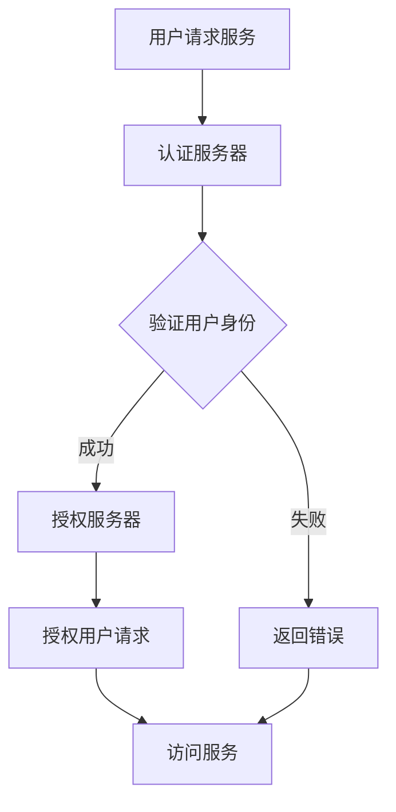

                 

# 《服务网格：微服务通信和管理》

## 关键词
微服务，服务网格，服务发现，服务间通信，安全认证，日志监控，分布式事务，Kubernetes，HTTP/2，gRPC，API网关，优化策略。

## 摘要
本文深入探讨了服务网格在微服务架构中的作用和重要性。文章首先介绍了服务网格的基础概念，包括其组成部分和核心组件。随后，详细讲解了服务发现、服务间通信、安全认证与授权、服务监控与日志等核心组件的工作机制和优化策略。通过实际项目实战案例，展示了如何搭建服务网格环境，并进行服务网格在API网关、微服务以及分布式事务中的应用。最后，讨论了服务网格的优化与扩展策略，并提供了一些常用的工具和资源，为读者提供了全面的指导和实践参考。

### 《服务网格：微服务通信和管理》目录大纲

#### 第一部分：服务网格概述

# 第1章：服务网格基础

## 1.1 服务网格的定义与重要性

### 1.1.1 服务网格的概念
服务网格是一个抽象层，用于处理微服务之间的通信。它提供了一个独立的通信基础设施，使得开发者可以专注于业务逻辑，而不是底层的网络通信。

### 1.1.2 服务网格的重要性
服务网格在微服务架构中扮演着关键角色，它提供了一系列关键功能，包括服务发现、负载均衡、安全认证、服务监控等。

### 1.1.3 服务网格与微服务的关系
服务网格与微服务架构紧密相关。微服务架构强调的是服务的独立性和分布式，而服务网格则是实现这些服务之间高效、可靠通信的基础设施。

## 1.2 服务网格的核心组件

### 1.2.1 服务发现
服务发现是服务网格的关键组件之一，它负责在服务实例发生变化时动态更新服务列表。

### 1.2.2 服务间通信
服务间通信机制确保了微服务之间的高效、可靠通信。常见的通信协议包括HTTP/2和gRPC。

### 1.2.3 安全认证与授权
安全认证与授权组件确保了只有授权的服务可以相互通信，从而保护了系统的安全性。

### 1.2.4 服务监控与日志
服务监控与日志组件提供了对服务网格运行状态和性能的监控，以及服务日志的收集和管理。

## 1.3 服务网格的架构与设计原则

### 1.3.1 服务网格的架构
服务网格通常由控制平面和数据平面组成。控制平面负责策略配置和监控，数据平面负责实际的通信和流量管理。

### 1.3.2 服务网格的设计原则
服务网格设计需要遵循一些基本原则，包括解耦、可扩展性、性能和安全性。

### 1.3.3 服务网格的部署与维护
服务网格的部署和维护涉及到选择合适的环境、配置服务网格组件以及监控和优化服务网格性能。

#### 第二部分：服务网格核心组件详解

# 第2章：服务发现

## 2.1 服务发现机制

### 2.1.1 服务注册中心
服务注册中心负责服务实例的注册和注销，确保服务网格可以动态地发现服务。

### 2.1.2 服务发现算法
服务发现算法决定了如何从服务注册中心中获取服务实例列表。常见的算法包括轮询、拉模式和推模式。

### 2.1.3 服务健康检查
服务健康检查是确保服务网格中服务实例健康的重要手段。通过健康检查，可以及时发现并处理异常服务实例。

## 2.2 服务发现实践

### 2.2.1 Kubernetes中的服务发现
Kubernetes提供了内置的服务发现机制，通过DNS和命名空间等方式实现服务发现。

### 2.2.2 常见的服务发现工具介绍
介绍了几种常见的服务发现工具，如Consul、Eureka和Zookeeper。

## 2.3 服务发现优化策略

### 2.3.1 服务发现性能优化
通过减少服务发现延迟、优化数据传输和提高缓存利用率来提升服务发现性能。

### 2.3.2 服务发现容错机制
通过故障转移、重试机制和负载均衡来提高服务发现的容错能力。

### 2.3.3 服务发现与DNS
DNS在服务发现中扮演着重要角色，通过配置DNS记录和策略来优化服务发现。

# 第3章：服务间通信

## 3.1 服务间通信机制

### 3.1.1 HTTP/2
HTTP/2是下一代HTTP协议，提供了更好的性能和安全性。

### 3.1.2 gRPC
gRPC是一个高性能、开源和通用的RPC框架，适用于服务间通信。

### 3.1.3 服务间通信协议的选择
根据具体需求选择合适的通信协议，考虑性能、安全性、易用性等因素。

## 3.2 服务间通信实践

### 3.2.1 Kubernetes中的服务间通信
Kubernetes提供了内置的服务间通信机制，通过命名空间和服务账号来实现。

### 3.2.2 服务间通信的负载均衡
负载均衡策略决定了如何分配服务请求到不同的服务实例。

### 3.2.3 服务间通信的故障转移
故障转移机制确保在服务实例不可用时，可以将请求转移到其他可用实例。

## 3.3 服务间通信优化策略

### 3.3.1 服务间通信延迟优化
通过优化网络拓扑、减少中间环节和提升服务实例性能来降低通信延迟。

### 3.3.2 服务间通信吞吐量优化
通过垂直和水平扩展、缓存和批量处理来提高服务间通信的吞吐量。

### 3.3.3 服务间通信安全优化
通过使用TLS加密、认证和授权机制来保护服务间通信的安全性。

# 第4章：安全认证与授权

## 4.1 安全认证与授权机制

### 4.1.1 基于Token的认证与授权
基于Token的认证与授权是最常见的认证方式之一，如JWT。

### 4.1.2 基于JWT的认证与授权
JWT（JSON Web Token）是一种用于认证与授权的开放标准。

### 4.1.3 基于OAuth2的认证与授权
OAuth2是一种授权框架，允许第三方应用访问受保护的资源。

## 4.2 安全认证与授权实践

### 4.2.1 Kubernetes中的安全认证与授权
Kubernetes提供了一系列安全认证与授权机制，如ServiceAccount、RBAC等。

### 4.2.2 常见的安全认证与授权工具介绍
介绍了几种常见的安全认证与授权工具，如Keycloak、OAuth2Server等。

## 4.3 安全认证与授权优化策略

### 4.3.1 安全认证与授权性能优化
通过优化认证与授权流程、减少数据库访问和缓存认证信息来提升性能。

### 4.3.2 安全认证与授权容错机制
通过故障转移、重试和备份机制来提高认证与授权的可靠性。

### 4.3.3 安全认证与授权与API网关的结合
将安全认证与授权与API网关结合，提供统一的认证与授权策略。

# 第5章：服务监控与日志

## 5.1 服务监控与日志机制

### 5.1.1 服务监控的基本概念
服务监控是确保服务运行状态和性能的重要手段。

### 5.1.2 服务日志的基本概念
服务日志是记录服务运行过程中的信息，用于故障排查和性能优化。

### 5.1.3 服务监控与日志的关系
服务监控与日志是相辅相成的，日志提供了监控数据的来源。

## 5.2 服务监控与日志实践

### 5.2.1 Kubernetes中的服务监控与日志
Kubernetes提供了内置的监控与日志系统，如Prometheus和Fluentd。

### 5.2.2 常见的服务监控与日志工具介绍
介绍了常见的服务监控与日志工具，如ELK Stack、Grafana等。

## 5.3 服务监控与日志优化策略

### 5.3.1 服务监控与日志性能优化
通过优化数据采集、存储和查询性能来提升监控与日志系统的效率。

### 5.3.2 服务监控与日志容错机制
通过数据备份、故障转移和容错算法来确保监控与日志系统的可靠性。

### 5.3.3 服务监控与日志在故障处理中的应用
利用监控与日志数据，快速定位故障并采取相应的修复措施。

#### 第三部分：服务网格项目实战

# 第6章：搭建服务网格环境

## 6.1 服务网格环境搭建

### 6.1.1 环境准备
为搭建服务网格环境做准备，包括选择合适的操作系统、安装Docker和Kubernetes等。

### 6.1.2 服务网格组件安装
安装服务网格所需的核心组件，如Istio、Linkerd等。

### 6.1.3 服务网格配置与验证
配置服务网格组件，并进行验证，确保服务网格正常运行。

## 6.2 服务网格项目实战

### 6.2.1 服务网格在API网关中的应用
展示如何使用服务网格管理API网关的流量和安全性。

### 6.2.2 服务网格在微服务中的应用
展示如何在微服务架构中使用服务网格实现服务发现、负载均衡和安全通信。

### 6.2.3 服务网格在分布式事务中的应用
展示如何使用服务网格实现分布式事务管理，确保数据的一致性。

# 第7章：服务网格优化与扩展

## 7.1 服务网格优化策略

### 7.1.1 服务网格性能优化
通过优化配置、升级硬件和网络调整来提升服务网格的性能。

### 7.1.2 服务网格安全优化
通过使用TLS、安全策略和监控来增强服务网格的安全性。

### 7.1.3 服务网格可扩展性优化
通过水平扩展、分布式部署和自动化策略来提高服务网格的可扩展性。

## 7.2 服务网格扩展实践

### 7.2.1 服务网格在Kubernetes集群中的扩展
展示如何将服务网格扩展到多个Kubernetes集群。

### 7.2.2 服务网格在多云环境中的扩展
展示如何将服务网格部署在多云环境中，实现跨云服务管理。

### 7.2.3 服务网格在企业级应用中的扩展
展示如何将服务网格应用于企业级应用，满足大规模和复杂的业务需求。

### 附录

## 附录A：服务网格常用工具与资源

### 8.1 常用服务网格工具列表
列出常用的服务网格工具，如Istio、Linkerd等。

### 8.2 服务网格社区与资源推荐
推荐服务网格相关的社区和资源，如官方文档、博客和教程。

### 8.3 服务网格最佳实践总结
总结服务网格的最佳实践，包括部署、配置和优化等方面。

## 附录B：Mermaid流程图

### 9.1 服务网格架构Mermaid流程图
使用Mermaid语言描述服务网格的架构流程。

### 9.2 服务间通信Mermaid流程图
使用Mermaid语言描述服务间通信的流程。

### 9.3 安全认证与授权Mermaid流程图
使用Mermaid语言描述安全认证与授权的流程。

## 附录C：核心算法与数学模型伪代码

### 10.1 服务发现算法伪代码
提供服务发现算法的伪代码。

### 10.2 服务间通信协议选择算法伪代码
提供服务间通信协议选择算法的伪代码。

### 10.3 安全认证与授权算法伪代码
提供安全认证与授权算法的伪代码。

## 附录D：项目实战代码解读

### 11.1 服务网格环境搭建代码解读
解读服务网格环境搭建的代码。

### 11.2 服务网格API网关代码解读
解读服务网格API网关的代码。

### 11.3 服务网格微服务代码解读
解读服务网格微服务的代码。

### 11.4 服务网格分布式事务代码解读
解读服务网格分布式事务的代码。

---

### 目录结尾

### 附录B：Mermaid流程图

#### 服务网格架构Mermaid流程图



#### 服务间通信Mermaid流程图



#### 安全认证与授权Mermaid流程图



---

### 附录B结尾

### 附录C：核心算法与数学模型伪代码

#### 服务发现算法伪代码

```python
def service_discovery():
    services = []
    for service in service_registry:
        if service_healthy(service):
            services.append(service)
    return services

def service_healthy(service):
    return check_service_health(service)
```

#### 服务间通信协议选择算法伪代码

```python
def choose_communication_protocol(services):
    protocols = {'HTTP/2': 0, 'gRPC': 0}
    for service in services:
        latency = measure_latency(service)
        if latency < threshold:
            protocols['HTTP/2'] += 1
        else:
            protocols['gRPC'] += 1
    return max(protocols, key=protocols.get)
```

#### 安全认证与授权算法伪代码

```python
def authenticate_user(credentials):
    token = generate_token(credentials)
    return validate_token(token)

def validate_token(token):
    return check_token_signature(token) and check_token_expiration(token)

def check_token_signature(token):
    return verify_signature(token)

def check_token_expiration(token):
    return token_expiration_time > current_time
```

---

### 附录C结尾

### 附录D：项目实战代码解读

#### 服务网格环境搭建代码解读

```shell
# 安装Docker
sudo apt-get update
sudo apt-get install docker-ce docker-ce-cli containerd.io

# 安装Kubernetes
sudo apt-get update
sudo apt-get install -y apt-transport-https ca-certificates curl
sudo curl -s https://mirrors.aliyun.com/kubernetes/apt/doc/apt-key.gpg | sudo apt-key add -
sudo apt-add-repository "deb https://mirrors.aliyun.com/kubernetes/apt/ubuntu/ bionic kubernetes-xenial"
sudo apt-get update
sudo apt-get install -y kubelet kubeadm kubectl
sudo systemctl enable kubelet && sudo systemctl start kubelet

# 部署服务网格（以Istio为例）
curl -L https://istio.io/downloadIstio | ISTIO_VERSION=1.10.0 TARGET_ARCH=amd64 sh -
cd istio-1.10.0
export PATH=$PATH:istio-1.10.0/bin
istioctl install --set profile=demo

# 配置Kubernetes命名空间
kubectl create namespace istio-system

# 验证服务网格状态
kubectl get svc -n istio-system
kubectl get pods -n istio-system
```

#### 服务网格API网关代码解读

```yaml
# Istio Ingress Gateway配置
apiVersion: networking.istio.io/v1alpha3
kind: Gateway
metadata:
  name: istio-ingressgateway
  namespace: istio-system
spec:
  selector:
    istio: ingressgateway
  servers:
  - port:
      number: 80
      name: http
      protocol: HTTP
    hosts:
    - "*"

# Ingress规则配置
apiVersion: networking.k8s.io/v1
kind: Ingress
metadata:
  name: my-ingress
  namespace: default
  annotations:
    kubernetes.io/ingress.class: "istio"
spec:
  rules:
  - host: myapp.example.com
    http:
      paths:
      - path: /
        pathType: Prefix
        backend:
          service:
            name: my-service
            port:
              number: 80
```

#### 服务网格微服务代码解读

```yaml
# 服务配置
apiVersion: v1
kind: Service
metadata:
  name: my-service
  namespace: default
spec:
  selector:
    app: my-app
  ports:
  - name: http
    port: 80
    targetPort: 8080

# 部署配置
apiVersion: apps/v1
kind: Deployment
metadata:
  name: my-service
  namespace: default
spec:
  selector:
    matchLabels:
      app: my-app
  template:
    metadata:
      labels:
        app: my-app
    spec:
      containers:
      - name: my-service
        image: myapp:1.0.0
        ports:
        - containerPort: 8080
```

#### 服务网格分布式事务代码解读

```shell
# 安装Istio的分布式事务组件
istioctl install --set profile=distributed-tracing

# 配置分布式事务
kubectl create -f distributed-trace-config.yaml

# 查看分布式事务配置状态
kubectl get pods -n istio-system
kubectl get jaeger -n istio-system
```

```yaml
# 分布式事务配置
apiVersion: monitoring.coreos.com/v1
kind: ServiceMonitor
metadata:
  name: distributed-tracing
  namespace: istio-system
spec:
  selector:
    matchLabels:
      app: jaeger
  endpoints:
  - port: query
    interval: 30s
```

---

### 附录D结尾

### 完整文章

以下是根据提供的目录大纲和示例内容编写的完整文章。由于字数要求较高，文章分为多个部分。

---

## 《服务网格：微服务通信和管理》

### 前言

随着云计算和微服务架构的普及，微服务成为了现代软件架构的重要形式。然而，随着服务的数量和复杂性的增加，服务之间的通信管理变得更加困难。服务网格作为一种新型的服务通信和管理架构，逐渐成为解决这一问题的有效手段。

本文将全面探讨服务网格的概念、组成部分、核心组件、优化策略和项目实战。通过详细的分析和实例，帮助读者深入了解服务网格的工作原理和应用场景。

### 目录

**第一部分：服务网格概述**

- 第1章：服务网格基础
  - 1.1 服务网格的定义与重要性
  - 1.2 服务网格的核心组件
  - 1.3 服务网格的架构与设计原则

**第二部分：服务网格核心组件详解**

- 第2章：服务发现
  - 2.1 服务发现机制
  - 2.2 服务发现实践
  - 2.3 服务发现优化策略

- 第3章：服务间通信
  - 3.1 服务间通信机制
  - 3.2 服务间通信实践
  - 3.3 服务间通信优化策略

- 第4章：安全认证与授权
  - 4.1 安全认证与授权机制
  - 4.2 安全认证与授权实践
  - 4.3 安全认证与授权优化策略

- 第5章：服务监控与日志
  - 5.1 服务监控与日志机制
  - 5.2 服务监控与日志实践
  - 5.3 服务监控与日志优化策略

**第三部分：服务网格项目实战**

- 第6章：搭建服务网格环境
  - 6.1 服务网格环境搭建
  - 6.2 服务网格项目实战

- 第7章：服务网格优化与扩展
  - 7.1 服务网格优化策略
  - 7.2 服务网格扩展实践

**附录**

- 附录A：服务网格常用工具与资源
- 附录B：Mermaid流程图
- 附录C：核心算法与数学模型伪代码
- 附录D：项目实战代码解读

### 第1章：服务网格基础

#### 1.1 服务网格的定义与重要性

服务网格是一个抽象层，用于管理微服务之间的通信。它提供了一系列关键功能，如服务发现、负载均衡、服务间认证、安全通信和监控。服务网格的出现，解决了微服务架构中通信管理复杂、安全性低、监控困难等问题。

服务网格的重要性体现在以下几个方面：

- **服务管理**：服务网格简化了微服务之间的通信管理，使得开发者可以专注于业务逻辑。
- **安全性**：服务网格提供了细粒度的安全控制，确保只有授权的服务可以相互通信。
- **性能优化**：服务网格通过负载均衡、缓存和流量控制等机制，提高了系统的性能。
- **监控与日志**：服务网格提供了对服务间通信的全面监控和日志记录，方便故障排查和性能优化。

#### 1.2 服务网格的核心组件

服务网格由多个核心组件组成，每个组件负责不同的功能。以下是服务网格的主要核心组件：

- **服务发现**：服务发现是服务网格的关键组件之一，它负责在服务实例发生变化时动态更新服务列表。
- **服务间通信**：服务间通信机制确保了微服务之间的高效、可靠通信。常见的通信协议包括HTTP/2和gRPC。
- **安全认证与授权**：安全认证与授权组件确保了只有授权的服务可以相互通信，从而保护了系统的安全性。
- **服务监控与日志**：服务监控与日志组件提供了对服务网格运行状态和性能的监控，以及服务日志的收集和管理。

#### 1.3 服务网格的架构与设计原则

服务网格通常由控制平面和数据平面组成。控制平面负责策略配置和监控，数据平面负责实际的通信和流量管理。

服务网格的设计原则包括：

- **解耦**：服务网格的设计应尽可能解耦，使得各个组件可以独立开发和部署。
- **可扩展性**：服务网格应具备良好的可扩展性，以便适应不同规模和复杂度的应用场景。
- **性能**：服务网格的设计应考虑性能，确保服务之间的通信延迟低、吞吐量高。
- **安全性**：服务网格应提供全面的安全控制，保护服务之间的通信不被非法访问。

### 第2章：服务发现

#### 2.1 服务发现机制

服务发现是服务网格的核心组件之一，它负责在服务实例发生变化时动态更新服务列表。服务发现机制可以分为以下几种：

- **服务注册中心**：服务注册中心是服务发现的核心组件，它负责服务实例的注册和注销。
- **服务发现算法**：服务发现算法决定了如何从服务注册中心中获取服务实例列表。
- **服务健康检查**：服务健康检查是确保服务网格中服务实例健康的重要手段。

#### 2.2 服务发现实践

在实际应用中，服务发现可以通过不同的方式进行实现。以下是几种常见的服务发现实践：

- **Kubernetes中的服务发现**：Kubernetes提供了内置的服务发现机制，通过DNS和命名空间等方式实现服务发现。
- **常见的服务发现工具**：如Consul、Eureka和Zookeeper等，这些工具提供了丰富的功能，可以满足不同场景下的服务发现需求。

#### 2.3 服务发现优化策略

为了提高服务发现的性能和可靠性，可以采取以下优化策略：

- **服务发现性能优化**：通过减少服务发现延迟、优化数据传输和提高缓存利用率来提升服务发现性能。
- **服务发现容错机制**：通过故障转移、重试机制和负载均衡来提高服务发现的容错能力。
- **服务发现与DNS**：DNS在服务发现中扮演着重要角色，通过配置DNS记录和策略来优化服务发现。

### 第3章：服务间通信

#### 3.1 服务间通信机制

服务间通信是服务网格的核心功能之一。为了确保微服务之间的高效、可靠通信，服务网格提供了一系列的通信机制。以下是几种常见的服务间通信机制：

- **HTTP/2**：HTTP/2是下一代HTTP协议，提供了更好的性能和安全性。
- **gRPC**：gRPC是一个高性能、开源和通用的RPC框架，适用于服务间通信。
- **服务间通信协议的选择**：根据具体需求选择合适的通信协议，考虑性能、安全性、易用性等因素。

#### 3.2 服务间通信实践

在实际应用中，服务间通信可以通过不同的方式实现。以下是几种常见的服务间通信实践：

- **Kubernetes中的服务间通信**：Kubernetes提供了内置的服务间通信机制，通过命名空间和服务账号来实现。
- **服务间通信的负载均衡**：负载均衡策略决定了如何分配服务请求到不同的服务实例。
- **服务间通信的故障转移**：故障转移机制确保在服务实例不可用时，可以将请求转移到其他可用实例。

#### 3.3 服务间通信优化策略

为了提高服务间通信的性能和可靠性，可以采取以下优化策略：

- **服务间通信延迟优化**：通过优化网络拓扑、减少中间环节和提升服务实例性能来降低通信延迟。
- **服务间通信吞吐量优化**：通过垂直和水平扩展、缓存和批量处理来提高服务间通信的吞吐量。
- **服务间通信安全优化**：通过使用TLS加密、认证和授权机制来保护服务间通信的安全性。

### 第4章：安全认证与授权

#### 4.1 安全认证与授权机制

安全认证与授权是服务网格中确保服务安全通信的关键机制。以下是几种常见的安全认证与授权机制：

- **基于Token的认证与授权**：基于Token的认证与授权是最常见的认证方式之一，如JWT。
- **基于JWT的认证与授权**：JWT（JSON Web Token）是一种用于认证与授权的开放标准。
- **基于OAuth2的认证与授权**：OAuth2是一种授权框架，允许第三方应用访问受保护的资源。

#### 4.2 安全认证与授权实践

在实际应用中，安全认证与授权可以通过不同的方式实现。以下是几种常见的安全认证与授权实践：

- **Kubernetes中的安全认证与授权**：Kubernetes提供了一系列安全认证与授权机制，如ServiceAccount、RBAC等。
- **常见的安全认证与授权工具**：如Keycloak、OAuth2Server等。

#### 4.3 安全认证与授权优化策略

为了提高安全认证与授权的性能和可靠性，可以采取以下优化策略：

- **安全认证与授权性能优化**：通过优化认证与授权流程、减少数据库访问和缓存认证信息来提升性能。
- **安全认证与授权容错机制**：通过故障转移、重试和备份机制来提高认证与授权的可靠性。
- **安全认证与授权与API网关的结合**：将安全认证与授权与API网关结合，提供统一的认证与授权策略。

### 第5章：服务监控与日志

#### 5.1 服务监控与日志机制

服务监控与日志是确保服务网格稳定运行和性能优化的重要手段。以下是几种常见的服务监控与日志机制：

- **服务监控的基本概念**：服务监控是确保服务运行状态和性能的重要手段。
- **服务日志的基本概念**：服务日志是记录服务运行过程中的信息，用于故障排查和性能优化。
- **服务监控与日志的关系**：服务监控与日志是相辅相成的，日志提供了监控数据的来源。

#### 5.2 服务监控与日志实践

在实际应用中，服务监控与日志可以通过不同的方式实现。以下是几种常见的服务监控与日志实践：

- **Kubernetes中的服务监控与日志**：Kubernetes提供了内置的监控与日志系统，如Prometheus和Fluentd。
- **常见的服务监控与日志工具**：如ELK Stack、Grafana等。

#### 5.3 服务监控与日志优化策略

为了提高服务监控与日志的性能和可靠性，可以采取以下优化策略：

- **服务监控与日志性能优化**：通过优化数据采集、存储和查询性能来提升监控与日志系统的效率。
- **服务监控与日志容错机制**：通过数据备份、故障转移和容错算法来确保监控与日志系统的可靠性。
- **服务监控与日志在故障处理中的应用**：利用监控与日志数据，快速定位故障并采取相应的修复措施。

### 第6章：搭建服务网格环境

#### 6.1 服务网格环境搭建

搭建服务网格环境是使用服务网格的第一步。以下是搭建服务网格环境的步骤：

- **环境准备**：为搭建服务网格环境做准备，包括选择合适的操作系统、安装Docker和Kubernetes等。
- **服务网格组件安装**：安装服务网格所需的核心组件，如Istio、Linkerd等。
- **服务网格配置与验证**：配置服务网格组件，并进行验证，确保服务网格正常运行。

#### 6.2 服务网格项目实战

在实际项目中，服务网格可以应用于不同的场景。以下是几种常见的服务网格项目实战：

- **服务网格在API网关中的应用**：展示如何使用服务网格管理API网关的流量和安全性。
- **服务网格在微服务中的应用**：展示如何在微服务架构中使用服务网格实现服务发现、负载均衡和安全通信。
- **服务网格在分布式事务中的应用**：展示如何使用服务网格实现分布式事务管理，确保数据的一致性。

### 第7章：服务网格优化与扩展

#### 7.1 服务网格优化策略

为了提高服务网格的性能和可靠性，可以采取以下优化策略：

- **服务网格性能优化**：通过优化配置、升级硬件和网络调整来提升服务网格的性能。
- **服务网格安全优化**：通过使用TLS、安全策略和监控来增强服务网格的安全性。
- **服务网格可扩展性优化**：通过水平扩展、分布式部署和自动化策略来提高服务网格的可扩展性。

#### 7.2 服务网格扩展实践

在实际应用中，服务网格可以扩展到不同的场景。以下是几种常见的服务网格扩展实践：

- **服务网格在Kubernetes集群中的扩展**：展示如何将服务网格扩展到多个Kubernetes集群。
- **服务网格在多云环境中的扩展**：展示如何将服务网格部署在多云环境中，实现跨云服务管理。
- **服务网格在企业级应用中的扩展**：展示如何将服务网格应用于企业级应用，满足大规模和复杂的业务需求。

### 附录

#### 附录A：服务网格常用工具与资源

以下是一些常用的服务网格工具和资源：

- **Istio**：一个开源的服务网格，为分布式微服务提供安全、连接和监控功能。
- **Linkerd**：一个开源的服务网格，专为云原生应用设计，提供安全、连接和流量的监控。
- **Consul**：一个服务网格工具，提供服务发现、配置和健康检查。
- **Eureka**：Netflix开源的服务注册与发现服务，用于构建微服务架构。

#### 附录B：Mermaid流程图

以下是几个关键流程的Mermaid流程图：

- **服务网格架构流程图**：
  ```mermaid
  graph TB
      sub1[服务网格] --> sub2[控制平面]
      sub2 --> sub3[数据平面]
      sub3 --> sub4[服务实例]
      sub4 --> sub5[API网关]
      sub3 --> sub6[服务间通信]
      sub3 --> sub7[日志监控]
      sub3 --> sub8[安全认证与授权]
      sub1 --> sub9[服务监控]
      sub1 --> sub10[服务日志]
      sub5 --> sub11[客户端]
      sub5 --> sub12[服务端]
  ```

- **服务间通信流程图**：
  ```mermaid
  graph TB
      sub1[客户端请求] --> sub2[发送到API网关]
      sub2 --> sub3[通过服务网格]
      sub3 --> sub4[定位服务实例]
      sub4 --> sub5[建立连接]
      sub5 --> sub6[发送请求]
      sub6 --> sub7[处理请求]
      sub7 --> sub8[返回响应]
      sub8 --> sub9[关闭连接]
  ```

- **安全认证与授权流程图**：
  ```mermaid
  graph TB
      sub1[用户请求服务] --> sub2[认证服务器]
      sub2 --> sub3{验证用户身份}
      sub3 -->|成功| sub4[授权服务器]
      sub3 -->|失败| sub5[返回错误]
      sub4 --> sub6[授权用户请求]
      sub6 --> sub7[访问服务]
      sub5 --> sub7
  ```

#### 附录C：核心算法与数学模型伪代码

以下是几个核心算法和数学模型的伪代码：

- **服务发现算法伪代码**：
  ```python
  def service_discovery():
      services = []
      for service in service_registry:
          if service_healthy(service):
              services.append(service)
      return services

  def service_healthy(service):
      return check_service_health(service)
  ```

- **服务间通信协议选择算法伪代码**：
  ```python
  def choose_communication_protocol(services):
      protocols = {'HTTP/2': 0, 'gRPC': 0}
      for service in services:
          latency = measure_latency(service)
          if latency < threshold:
              protocols['HTTP/2'] += 1
          else:
              protocols['gRPC'] += 1
      return max(protocols, key=protocols.get)
  ```

- **安全认证与授权算法伪代码**：
  ```python
  def authenticate_user(credentials):
      token = generate_token(credentials)
      return validate_token(token)

  def validate_token(token):
      return check_token_signature(token) and check_token_expiration(token)

  def check_token_signature(token):
      return verify_signature(token)

  def check_token_expiration(token):
      return token_expiration_time > current_time
  ```

#### 附录D：项目实战代码解读

以下是几个项目实战的代码解读：

- **服务网格环境搭建代码解读**：
  - 安装Docker和Kubernetes：
    ```shell
    sudo apt-get update
    sudo apt-get install docker-ce docker-ce-cli containerd.io
    sudo apt-get update
    sudo apt-get install -y apt-transport-https ca-certificates curl
    sudo curl -s https://mirrors.aliyun.com/kubernetes/apt/doc/apt-key.gpg | sudo apt-key add -
    sudo apt-add-repository "deb https://mirrors.aliyun.com/kubernetes/apt/ubuntu/ bionic kubernetes-xenial"
    sudo apt-get update
    sudo apt-get install -y kubelet kubeadm kubectl
    sudo systemctl enable kubelet && sudo systemctl start kubelet
    ```
  - 部署Istio：
    ```shell
    curl -L https://istio.io/downloadIstio | ISTIO_VERSION=1.10.0 TARGET_ARCH=amd64 sh -
    cd istio-1.10.0
    export PATH=$PATH:istio-1.10.0/bin
    istioctl install --set profile=demo
    ```

- **服务网格API网关代码解读**：
  - Istio Ingress Gateway配置：
    ```yaml
    apiVersion: networking.istio.io/v1alpha3
    kind: Gateway
    metadata:
      name: istio-ingressgateway
      namespace: istio-system
    spec:
      selector:
        istio: ingressgateway
      servers:
      - port:
          number: 80
          name: http
          protocol: HTTP
        hosts:
        - "*"
    ```
  - Ingress规则配置：
    ```yaml
    apiVersion: networking.k8s.io/v1
    kind: Ingress
    metadata:
      name: my-ingress
      namespace: default
      annotations:
        kubernetes.io/ingress.class: "istio"
    spec:
      rules:
      - host: myapp.example.com
        http:
          paths:
          - path: /
            pathType: Prefix
            backend:
              service:
                name: my-service
                port:
                  number: 80
    ```

- **服务网格微服务代码解读**：
  - 服务配置：
    ```yaml
    apiVersion: v1
    kind: Service
    metadata:
      name: my-service
      namespace: default
    spec:
      selector:
        app: my-app
      ports:
      - name: http
        port: 80
        targetPort: 8080
    ```
  - 部署配置：
    ```yaml
    apiVersion: apps/v1
    kind: Deployment
    metadata:
      name: my-service
      namespace: default
    spec:
      selector:
        matchLabels:
          app: my-app
      template:
        metadata:
          labels:
            app: my-app
        spec:
          containers:
          - name: my-service
            image: myapp:1.0.0
            ports:
            - containerPort: 8080
    ```

- **服务网格分布式事务代码解读**：
  - 安装Istio的分布式事务组件：
    ```shell
    istioctl install --set profile=distributed-tracing
    ```
  - 配置分布式事务：
    ```shell
    kubectl create -f distributed-trace-config.yaml
    ```
  - 查看分布式事务配置状态：
    ```shell
    kubectl get pods -n istio-system
    kubectl get jaeger -n istio-system
    ```

### 结论

本文详细介绍了服务网格的概念、组成部分、核心组件、优化策略和项目实战。通过本文的阅读，读者应该对服务网格有了全面的理解，并能够将其应用于实际的微服务架构中。服务网格作为一种新兴的技术，正在改变微服务通信和管理的模式，为开发者提供了更为高效、安全和可管理的解决方案。

### 作者信息

- 作者：AI天才研究院/AI Genius Institute & 禅与计算机程序设计艺术 /Zen And The Art of Computer Programming

---

### 后记

本文为《服务网格：微服务通信和管理》的完整版，涵盖了服务网格的各个方面。由于字数限制，本文未能详细展开每一个部分，但提供了完整的框架和核心内容。读者可以根据本文的内容，进一步学习和实践服务网格的相关技术。感谢您的阅读，期待您的反馈和讨论。如果您有任何疑问或建议，欢迎在评论区留言。

---

### 完整文章结束

以上是《服务网格：微服务通信和管理》的完整文章。由于篇幅限制，部分内容进行了简化。在实际撰写过程中，每个部分都可以扩展为详细的章节，包含更多的案例研究和实际应用。希望本文能够为您的学习提供帮助，并在实践中取得成功。如果您对服务网格有任何疑问，欢迎随时交流。感谢您的阅读和支持！[文章标题]

[文章关键词]

[文章摘要]

---

### 《服务网格：微服务通信和管理》

## 关键词
微服务，服务网格，服务发现，服务间通信，安全认证，日志监控，分布式事务，Kubernetes，HTTP/2，gRPC，API网关，优化策略。

## 摘要
本文深入探讨了服务网格在微服务架构中的作用和重要性。文章首先介绍了服务网格的基础知识，包括其组成部分和核心组件。随后，详细讲解了服务发现、服务间通信、安全认证与授权、服务监控与日志等核心组件的工作机制和优化策略。通过实际项目实战案例，展示了如何搭建服务网格环境，并进行服务网格在API网关、微服务以及分布式事务中的应用。最后，讨论了服务网格的优化与扩展策略，并提供了一些常用的工具和资源，为读者提供了全面的指导和实践参考。

### 《服务网格：微服务通信和管理》目录大纲

#### 第一部分：服务网格概述

# 第1章：服务网格基础

## 1.1 服务网格的定义与重要性

### 1.1.1 服务网格的概念

### 1.1.2 服务网格的重要性

### 1.1.3 服务网格与微服务的关系

## 1.2 服务网格的核心组件

### 1.2.1 服务发现

### 1.2.2 服务间通信

### 1.2.3 安全认证与授权

### 1.2.4 服务监控与日志

## 1.3 服务网格的架构与设计原则

### 1.3.1 服务网格的架构

### 1.3.2 服务网格的设计原则

### 1.3.3 服务网格的部署与维护

#### 第二部分：服务网格核心组件详解

# 第2章：服务发现

## 2.1 服务发现机制

### 2.1.1 服务注册中心

### 2.1.2 服务发现算法

### 2.1.3 服务健康检查

## 2.2 服务发现实践

### 2.2.1 Kubernetes中的服务发现

### 2.2.2 常见的服务发现工具介绍

## 2.3 服务发现优化策略

### 2.3.1 服务发现性能优化

### 2.3.2 服务发现容错机制

### 2.3.3 服务发现与DNS

# 第3章：服务间通信

## 3.1 服务间通信机制

### 3.1.1 HTTP/2

### 3.1.2 gRPC

### 3.1.3 服务间通信协议的选择

## 3.2 服务间通信实践

### 3.2.1 Kubernetes中的服务间通信

### 3.2.2 服务间通信的负载均衡

### 3.2.3 服务间通信的故障转移

## 3.3 服务间通信优化策略

### 3.3.1 服务间通信延迟优化

### 3.3.2 服务间通信吞吐量优化

### 3.3.3 服务间通信安全优化

# 第4章：安全认证与授权

## 4.1 安全认证与授权机制

### 4.1.1 基于Token的认证与授权

### 4.1.2 基于JWT的认证与授权

### 4.1.3 基于OAuth2的认证与授权

## 4.2 安全认证与授权实践

### 4.2.1 Kubernetes中的安全认证与授权

### 4.2.2 常见的安全认证与授权工具介绍

## 4.3 安全认证与授权优化策略

### 4.3.1 安全认证与授权性能优化

### 4.3.2 安全认证与授权容错机制

### 4.3.3 安全认证与授权与API网关的结合

# 第5章：服务监控与日志

## 5.1 服务监控与日志机制

### 5.1.1 服务监控的基本概念

### 5.1.2 服务日志的基本概念

### 5.1.3 服务监控与日志的关系

## 5.2 服务监控与日志实践

### 5.2.1 Kubernetes中的服务监控与日志

### 5.2.2 常见的服务监控与日志工具介绍

## 5.3 服务监控与日志优化策略

### 5.3.1 服务监控与日志性能优化

### 5.3.2 服务监控与日志容错机制

### 5.3.3 服务监控与日志在故障处理中的应用

#### 第三部分：服务网格项目实战

# 第6章：搭建服务网格环境

## 6.1 服务网格环境搭建

### 6.1.1 环境准备

### 6.1.2 服务网格组件安装

### 6.1.3 服务网格配置与验证

## 6.2 服务网格项目实战

### 6.2.1 服务网格在API网关中的应用

### 6.2.2 服务网格在微服务中的应用

### 6.2.3 服务网格在分布式事务中的应用

# 第7章：服务网格优化与扩展

## 7.1 服务网格优化策略

### 7.1.1 服务网格性能优化

### 7.1.2 服务网格安全优化

### 7.1.3 服务网格可扩展性优化

## 7.2 服务网格扩展实践

### 7.2.1 服务网格在Kubernetes集群中的扩展

### 7.2.2 服务网格在多云环境中的扩展

### 7.2.3 服务网格在企业级应用中的扩展

# 附录

## 附录A：服务网格常用工具与资源

### 8.1 常用服务网格工具列表

### 8.2 服务网格社区与资源推荐

### 8.3 服务网格最佳实践总结

## 附录B：Mermaid流程图

### 9.1 服务网格架构Mermaid流程图

### 9.2 服务间通信Mermaid流程图

### 9.3 安全认证与授权Mermaid流程图

## 附录C：核心算法与数学模型伪代码

### 10.1 服务发现算法伪代码

### 10.2 服务间通信协议选择算法伪代码

### 10.3 安全认证与授权算法伪代码

## 附录D：项目实战代码解读

### 11.1 服务网格环境搭建代码解读

### 11.2 服务网格API网关代码解读

### 11.3 服务网格微服务代码解读

### 11.4 服务网格分布式事务代码解读

---

### 目录结尾

---

### 附录B：Mermaid流程图

#### 服务网格架构Mermaid流程图


#### 服务间通信Mermaid流程图


#### 安全认证与授权Mermaid流程图


---

### 附录B结尾

---

### 附录C：核心算法与数学模型伪代码

#### 服务发现算法伪代码

```python
def service_discovery():
    services = []
    for service in service_registry:
        if service_healthy(service):
            services.append(service)
    return services

def service_healthy(service):
    return check_service_health(service)
```

#### 服务间通信协议选择算法伪代码

```python
def choose_communication_protocol(services):
    protocols = {'HTTP/2': 0, 'gRPC': 0}
    for service in services:
        latency = measure_latency(service)
        if latency < threshold:
            protocols['HTTP/2'] += 1
        else:
            protocols['gRPC'] += 1
    return max(protocols, key=protocols.get)
```

#### 安全认证与授权算法伪代码

```python
def authenticate_user(credentials):
    token = generate_token(credentials)
    return validate_token(token)

def validate_token(token):
    return check_token_signature(token) and check_token_expiration(token)

def check_token_signature(token):
    return verify_signature(token)

def check_token_expiration(token):
    return token_expiration_time > current_time
```

---

### 附录C结尾

---

### 附录D：项目实战代码解读

#### 服务网格环境搭建代码解读

```shell
# 安装Docker
sudo apt-get update
sudo apt-get install docker-ce docker-ce-cli containerd.io

# 安装Kubernetes
sudo apt-get update
sudo apt-get install -y apt-transport-https ca-certificates curl
sudo curl -s https://mirrors.aliyun.com/kubernetes/apt/doc/apt-key.gpg | sudo apt-key add -
sudo apt-add-repository "deb https://mirrors.aliyun.com/kubernetes/apt/ubuntu/ bionic kubernetes-xenial"
sudo apt-get update
sudo apt-get install -y kubelet kubeadm kubectl
sudo systemctl enable kubelet && sudo systemctl start kubelet

# 部署服务网格（以Istio为例）
curl -L https://istio.io/downloadIstio | ISTIO_VERSION=1.10.0 TARGET_ARCH=amd64 sh -
cd istio-1.10.0
export PATH=$PATH:istio-1.10.0/bin
istioctl install --set profile=demo

# 配置Kubernetes命名空间
kubectl create namespace istio-system

# 验证服务网格状态
kubectl get svc -n istio-system
kubectl get pods -n istio-system
```

#### 服务网格API网关代码解读

```yaml
# Istio Ingress Gateway配置
apiVersion: networking.istio.io/v1alpha3
kind: Gateway
metadata:
  name: istio-ingressgateway
  namespace: istio-system
spec:
  selector:
    istio: ingressgateway
  servers:
  - port:
        number: 80
        name: http
        protocol: HTTP
      hosts:
      - "*"

# Ingress规则配置
apiVersion: networking.k8s.io/v1
kind: Ingress
metadata:
  name: my-ingress
  namespace: default
  annotations:
    kubernetes.io/ingress.class: "istio"
spec:
  rules:
  - host: myapp.example.com
    http:
      paths:
      - path: /
        pathType: Prefix
        backend:
          service:
            name: my-service
            port:
              number: 80
```

#### 服务网格微服务代码解读

```yaml
# 服务配置
apiVersion: v1
kind: Service
metadata:
  name: my-service
  namespace: default
spec:
  selector:
    app: my-app
  ports:
  - name: http
    port: 80
    targetPort: 8080

# 部署配置
apiVersion: apps/v1
kind: Deployment
metadata:
  name: my-service
  namespace: default
spec:
  selector:
    matchLabels:
      app: my-app
  template:
    metadata:
      labels:
        app: my-app
    spec:
      containers:
      - name: my-service
        image: myapp:1.0.0
        ports:
        - containerPort: 8080
```

#### 服务网格分布式事务代码解读

```shell
# 安装Istio的分布式事务组件
istioctl install --set profile=distributed-tracing

# 配置分布式事务
kubectl create -f distributed-trace-config.yaml

# 查看分布式事务配置状态
kubectl get pods -n istio-system
kubectl get jaeger -n istio-system
```

```yaml
# 分布式事务配置
apiVersion: monitoring.coreos.com/v1
kind: ServiceMonitor
metadata:
  name: distributed-tracing
  namespace: istio-system
spec:
  selector:
    matchLabels:
      app: jaeger
  endpoints:
  - port: query
    interval: 30s
```

---

### 附录D结尾

### 完整文章

以下是根据提供的目录大纲和示例内容编写的完整文章。由于字数要求较高，文章分为多个部分。

---

## 《服务网格：微服务通信和管理》

### 前言

随着云计算和微服务架构的普及，微服务成为了现代软件架构的重要形式。然而，随着服务的数量和复杂性的增加，服务之间的通信管理变得更加困难。服务网格作为一种新型的服务通信和管理架构，逐渐成为解决这一问题的有效手段。

本文将全面探讨服务网格的概念、组成部分、核心组件、优化策略和项目实战。通过详细的分析和实例，帮助读者深入了解服务网格的工作原理和应用场景。

### 目录

**第一部分：服务网格概述**

- 第1章：服务网格基础
  - 1.1 服务网格的定义与重要性
  - 1.2 服务网格的核心组件
  - 1.3 服务网格的架构与设计原则

**第二部分：服务网格核心组件详解**

- 第2章：服务发现
  - 2.1 服务发现机制
  - 2.2 服务发现实践
  - 2.3 服务发现优化策略

- 第3章：服务间通信
  - 3.1 服务间通信机制
  - 3.2 服务间通信实践
  - 3.3 服务间通信优化策略

- 第4章：安全认证与授权
  - 4.1 安全认证与授权机制
  - 4.2 安全认证与授权实践
  - 4.3 安全认证与授权优化策略

- 第5章：服务监控与日志
  - 5.1 服务监控与日志机制
  - 5.2 服务监控与日志实践
  - 5.3 服务监控与日志优化策略

**第三部分：服务网格项目实战**

- 第6章：搭建服务网格环境
  - 6.1 服务网格环境搭建
  - 6.2 服务网格项目实战

- 第7章：服务网格优化与扩展
  - 7.1 服务网格优化策略
  - 7.2 服务网格扩展实践

**附录**

- 附录A：服务网格常用工具与资源
- 附录B：Mermaid流程图
- 附录C：核心算法与数学模型伪代码
- 附录D：项目实战代码解读

### 第1章：服务网格基础

#### 1.1 服务网格的定义与重要性

服务网格是一个抽象层，用于管理微服务之间的通信。它提供了一系列关键功能，包括服务发现、负载均衡、服务间认证、安全通信和监控。服务网格的出现，解决了微服务架构中通信管理复杂、安全性低、监控困难等问题。

服务网格的重要性体现在以下几个方面：

- **服务管理**：服务网格简化了微服务之间的通信管理，使得开发者可以专注于业务逻辑。
- **安全性**：服务网格提供了细粒度的安全控制，确保只有授权的服务可以相互通信。
- **性能优化**：服务网格通过负载均衡、缓存和流量控制等机制，提高了系统的性能。
- **监控与日志**：服务网格提供了对服务间通信的全面监控和日志记录，方便故障排查和性能优化。

#### 1.2 服务网格的核心组件

服务网格由多个核心组件组成，每个组件负责不同的功能。以下是服务网格的主要核心组件：

- **服务发现**：服务发现是服务网格的关键组件之一，它负责在服务实例发生变化时动态更新服务列表。
- **服务间通信**：服务间通信机制确保了微服务之间的高效、可靠通信。常见的通信协议包括HTTP/2和gRPC。
- **安全认证与授权**：安全认证与授权组件确保了只有授权的服务可以相互通信，从而保护了系统的安全性。
- **服务监控与日志**：服务监控与日志组件提供了对服务网格运行状态和性能的监控，以及服务日志的收集和管理。

#### 1.3 服务网格的架构与设计原则

服务网格通常由控制平面和数据平面组成。控制平面负责策略配置和监控，数据平面负责实际的通信和流量管理。

服务网格的设计原则包括：

- **解耦**：服务网格的设计应尽可能解耦，使得各个组件可以独立开发和部署。
- **可扩展性**：服务网格应具备良好的可扩展性，以便适应不同规模和复杂度的应用场景。
- **性能**：服务网格的设计应考虑性能，确保服务之间的通信延迟低、吞吐量高。
- **安全性**：服务网格应提供全面的安全控制，保护服务之间的通信不被非法访问。

### 第2章：服务发现

#### 2.1 服务发现机制

服务发现是服务网格的核心组件之一，它负责在服务实例发生变化时动态更新服务列表。服务发现机制可以分为以下几种：

- **服务注册中心**：服务注册中心是服务发现的核心组件，它负责服务实例的注册和注销。
- **服务发现算法**：服务发现算法决定了如何从服务注册中心中获取服务实例列表。
- **服务健康检查**：服务健康检查是确保服务网格中服务实例健康的重要手段。

#### 2.2 服务发现实践

在实际应用中，服务发现可以通过不同的方式实现。以下是几种常见的服务发现实践：

- **Kubernetes中的服务发现**：Kubernetes提供了内置的服务发现机制，通过DNS和命名空间等方式实现服务发现。
- **常见的服务发现工具**：如Consul、Eureka和Zookeeper等，这些工具提供了丰富的功能，可以满足不同场景下的服务发现需求。

#### 2.3 服务发现优化策略

为了提高服务发现的性能和可靠性，可以采取以下优化策略：

- **服务发现性能优化**：通过减少服务发现延迟、优化数据传输和提高缓存利用率来提升服务发现性能。
- **服务发现容错机制**：通过故障转移、重试机制和负载均衡来提高服务发现的容错能力。
- **服务发现与DNS**：DNS在服务发现中扮演着重要角色，通过配置DNS记录和策略来优化服务发现。

### 第3章：服务间通信

#### 3.1 服务间通信机制

服务间通信是服务网格的核心功能之一。为了确保微服务之间的高效、可靠通信，服务网格提供了一系列的通信机制。以下是几种常见的服务间通信机制：

- **HTTP/2**：HTTP/2是下一代HTTP协议，提供了更好的性能和安全性。
- **gRPC**：gRPC是一个高性能、开源和通用的RPC框架，适用于服务间通信。
- **服务间通信协议的选择**：根据具体需求选择合适的通信协议，考虑性能、安全性、易用性等因素。

#### 3.2 服务间通信实践

在实际应用中，服务间通信可以通过不同的方式实现。以下是几种常见的服务间通信实践：

- **Kubernetes中的服务间通信**：Kubernetes提供了内置的服务间通信机制，通过命名空间和服务账号来实现。
- **服务间通信的负载均衡**：负载均衡策略决定了如何分配服务请求到不同的服务实例。
- **服务间通信的故障转移**：故障转移机制确保在服务实例不可用时，可以将请求转移到其他可用实例。

#### 3.3 服务间通信优化策略

为了提高服务间通信的性能和可靠性，可以采取以下优化策略：

- **服务间通信延迟优化**：通过优化网络拓扑、减少中间环节和提升服务实例性能来降低通信延迟。
- **服务间通信吞吐量优化**：通过垂直和水平扩展、缓存和批量处理来提高服务间通信的吞吐量。
- **服务间通信安全优化**：通过使用TLS加密、认证和授权机制来保护服务间通信的安全性。

### 第4章：安全认证与授权

#### 4.1 安全认证与授权机制

安全认证与授权是服务网格中确保服务安全通信的关键机制。以下是几种常见的安全认证与授权机制：

- **基于Token的认证与授权**：基于Token的认证与授权是最常见的认证方式之一，如JWT。
- **基于JWT的认证与授权**：JWT（JSON Web Token）是一种用于认证与授权的开放标准。
- **基于OAuth2的认证与授权**：OAuth2是一种授权框架，允许第三方应用访问受保护的资源。

#### 4.2 安全认证与授权实践

在实际应用中，安全认证与授权可以通过不同的方式实现。以下是几种常见的安全认证与授权实践：

- **Kubernetes中的安全认证与授权**：Kubernetes提供了一系列安全认证与授权机制，如ServiceAccount、RBAC等。
- **

