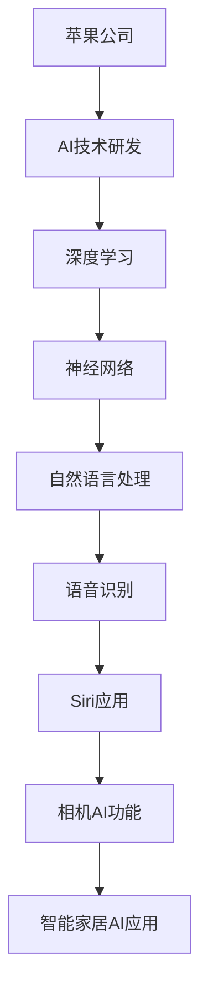

                 

### 《李开复：苹果发布AI应用的产业》

人工智能（AI）正迅速变革各行各业，从医疗保健到交通运输，再到智能家居，AI技术已经深入影响了我们的日常生活。在这个技术浪潮中，苹果公司无疑是一个重要的参与者。近年来，苹果在AI领域的投资和开发取得了显著进展，特别是在其最新的产品和服务中。本文将详细探讨苹果发布的AI应用，分析其技术原理、实现方式、产业影响以及未来趋势。

本文将分为三个部分：

1. **背景与概述**：介绍苹果与AI技术的发展，以及苹果AI应用的产业影响。
2. **AI应用原理与实现**：深入讲解苹果AI应用背后的技术原理和实现细节。
3. **AI应用实战与未来趋势**：通过实际案例展示AI应用的开发实践，并展望AI产业的未来。

本文旨在为读者提供一个全面、深入的理解，帮助大家把握苹果AI应用的现状和未来发展方向。在开始之前，让我们先明确本文的核心关键词：

- 苹果（Apple）
- 人工智能（Artificial Intelligence）
- AI应用（AI Applications）
- Siri
- 相机AI
- M1芯片
- 深度学习
- 自然语言处理
- 图神经网络
- 智能家居

**摘要**：本文将深入探讨苹果公司在人工智能领域的最新进展，分析其发布的AI应用的原理、实现和影响。从Siri的AI进化，到苹果相机AI功能，再到M1芯片在AI计算中的优势，本文将一步步解析苹果在AI领域的布局和战略。同时，通过实际案例展示AI应用的开发实践，并展望AI产业的未来发展趋势。这将为读者提供一个全面、清晰的视角，了解苹果AI应用在当今技术浪潮中的重要性及其潜在影响。

### 第一部分：背景与概述

#### 第1章：苹果与AI技术的发展

##### 从iPhone到AI：苹果的演变历程

苹果公司成立于1976年，由史蒂夫·乔布斯、史蒂夫·沃兹尼亚克和罗恩·韦恩共同创立。自成立以来，苹果公司一直致力于推动技术创新和用户体验的提升。从最早的Apple I和Apple II电脑，到后来的Macintosh电脑，苹果在计算机领域取得了巨大成功。然而，随着智能手机的崛起，苹果将注意力转向了移动设备。

2007年，苹果发布了首款iPhone，这标志着苹果从传统的计算机制造商向移动设备制造商的转变。iPhone的发布不仅改变了手机行业，也改变了人们的生活方式。iPhone搭载了强大的处理器和操作系统，这为后续的AI应用奠定了基础。

随着时间的推移，苹果公司在AI领域不断深耕。2017年，苹果推出了用于机器学习的Core ML框架，使得开发者可以轻松地将AI模型集成到iOS、macOS、watchOS和tvOS应用中。Core ML框架的推出标志着苹果在AI领域的重大进展，为开发者提供了更广阔的舞台。

##### 苹果在AI领域的布局

苹果在AI领域的布局非常广泛，涵盖了多个方面：

1. **硬件层面**：苹果自研的A系列芯片在性能和能效方面处于领先地位。A系列芯片集成了神经网络引擎（Neural Engine），专门用于加速AI计算。2019年，苹果推出了M系列芯片，包括M1芯片，进一步提升了AI计算能力。

2. **软件层面**：苹果开发了多个AI框架和工具，如Core ML、Create ML和TensorFlow Lite等。这些工具使得开发者可以轻松地将AI模型集成到苹果设备中，从而实现各种AI应用。

3. **应用层面**：苹果在其产品中广泛运用了AI技术，如Siri语音助手、Face ID面部识别、Animoji表情符号、相机AI功能等。这些应用不仅提升了用户体验，也展示了苹果在AI领域的实力。

##### 苹果AI技术的应用场景

苹果的AI技术已经在多个应用场景中得到了广泛应用：

1. **智能手机**：iPhone的相机AI功能、Siri语音助手和面部识别等技术，都体现了苹果在AI领域的创新。相机AI功能可以自动识别并优化拍摄场景，Siri语音助手可以理解并执行用户的语音指令，面部识别技术则保证了设备的安全性。

2. **智能家居**：苹果的智能家居平台HomeKit支持多种智能设备，如智能灯泡、智能插座、智能锁等。通过AI技术，这些设备可以更好地协同工作，提升用户的生活品质。

3. **健康与医疗**：苹果的HealthKit平台集成了多种健康监测功能，如心率监测、步数统计等。通过AI分析，这些数据可以提供更准确的健康建议，帮助用户保持良好的身体状况。

4. **自动驾驶**：苹果的自动驾驶项目一直是业界关注的焦点。尽管苹果尚未推出量产的自动驾驶汽车，但其AI技术在自动驾驶领域的应用潜力巨大。

#### 第2章：苹果发布的AI应用

##### Siri的AI进化

Siri是苹果公司开发的智能语音助手，自2011年随iPhone 4s发布以来，Siri在语音识别、自然语言处理和机器学习等方面不断进化。早期的Siri功能相对简单，主要提供天气、日历和联系人查询等基础服务。然而，随着AI技术的发展，Siri的功能逐渐丰富，成为苹果设备中不可或缺的一部分。

1. **语音识别技术**

Siri的语音识别技术基于苹果自研的神经网络模型，可以准确识别用户的语音指令。苹果公司在2018年推出的Siri Shortcuts功能，使得用户可以通过简单的语音命令快速执行一系列操作，进一步提升了用户体验。

2. **自然语言处理技术**

Siri的自然语言处理技术使得它可以理解用户的复杂指令。通过深度学习算法，Siri可以识别并解析自然语言中的各种语法结构和语义信息，从而提供准确的回应。例如，用户可以告诉Siri“设置晚上9点提醒明天的会议”，Siri可以自动设置提醒事项并添加会议详情。

3. **机器学习技术**

苹果在2017年推出了Core ML框架，使得开发者可以将AI模型集成到iOS应用中。Siri利用Core ML框架，可以实时处理用户的语音指令，并根据用户的行为数据不断优化自身性能。例如，Siri可以通过学习用户的语音习惯，逐步提高语音识别的准确性。

##### 苹果相机AI功能

苹果相机AI功能是iPhone中的一大亮点，通过AI技术，相机可以自动识别并优化拍摄场景，提供更出色的拍照体验。以下是苹果相机AI功能的几个重要方面：

1. **场景识别**

苹果相机AI功能可以自动识别多种拍摄场景，如日出、日落、夜景、运动等。当相机检测到特定场景时，会自动调整拍摄参数，以获得最佳效果。例如，在夜景模式下，相机会延长曝光时间，提高照片的亮度和清晰度。

2. **人像识别**

苹果相机AI功能支持人像识别，可以通过识别人物面部，自动调整背景虚化效果，使得主体更加突出。此外，相机AI功能还可以检测到多个人物，并分别调整背景虚化效果，提供更自然的人像拍摄效果。

3. **图像增强**

苹果相机AI功能还可以对图像进行增强处理，提高照片的亮度和对比度。通过深度学习算法，相机AI功能可以自动识别照片中的暗部和亮部，并进行针对性的优化，使得整体图像更加均衡和清晰。

##### M1芯片与AI计算

2020年，苹果推出了自研的M1芯片，这是苹果在硬件层面的一次重要突破。M1芯片不仅提升了苹果设备的性能，也在AI计算方面表现出了强大的优势。以下是M1芯片在AI计算中的几个关键方面：

1. **神经网络引擎**

M1芯片集成了16个神经网络引擎，这些引擎专门用于加速AI计算。神经网络引擎可以高效地处理各种AI任务，如图像识别、语音识别和自然语言处理等。这使得苹果设备在执行AI任务时，具有更高的速度和更低的功耗。

2. **高性能CPU和GPU**

M1芯片采用了高性能的CPU和GPU架构，这使得苹果设备在处理复杂计算任务时，具有更强的计算能力。CPU和GPU的协同工作，使得苹果设备可以同时处理多个AI任务，提供更好的性能和用户体验。

3. **AI性能提升**

M1芯片的AI性能相比于前代芯片有了显著提升。通过神经网络引擎和强大的CPU/GPU架构，M1芯片可以更快地训练和部署AI模型，从而提高AI应用的效率和准确性。

#### 第1章小结

本章介绍了苹果与AI技术的发展，以及苹果发布的AI应用。从Siri的AI进化，到苹果相机AI功能，再到M1芯片在AI计算中的优势，苹果在AI领域的布局和战略日益清晰。这些AI应用不仅提升了用户体验，也在各个行业和领域中产生了深远的影响。在接下来的章节中，我们将进一步探讨苹果AI应用的技术原理和实现细节，为读者提供更深入的理解。

### 第二部分：AI应用原理与实现

#### 第3章：苹果AI应用原理

##### 深度学习与神经网络基础

深度学习是人工智能的一个重要分支，它通过模拟人脑神经网络结构，对大量数据进行分析和识别。在苹果的AI应用中，深度学习技术扮演着至关重要的角色。以下是深度学习和神经网络的基础知识。

1. **神经网络的基本结构**

神经网络由多个层次组成，包括输入层、隐藏层和输出层。每个层次都包含多个神经元，神经元之间通过权重和偏置进行连接。输入层接收外部输入数据，隐藏层对输入数据进行处理和特征提取，输出层生成最终的输出结果。

2. **深度学习优化算法**

深度学习模型的训练过程实际上是不断调整模型参数（权重和偏置）的过程，以最小化损失函数。常见的深度学习优化算法包括梯度下降、随机梯度下降和Adam优化器。这些算法通过计算损失函数对参数的梯度，逐步调整参数，从而优化模型性能。

##### 自然语言处理技术

自然语言处理（NLP）是人工智能的一个重要分支，旨在使计算机能够理解、生成和处理人类语言。苹果的AI应用，如Siri和智能助手，大量使用了NLP技术。以下是NLP技术的几个关键方面。

1. **词嵌入技术**

词嵌入是将单词映射到高维向量空间的技术，通过词嵌入，计算机可以理解单词之间的语义关系。常见的词嵌入技术包括Word2Vec、GloVe和BERT。这些技术可以将单词映射到连续的向量空间中，从而实现语义相似性和语义关系的计算。

2. **序列模型与注意力机制**

序列模型是处理序列数据的一种神经网络架构，常见的序列模型包括循环神经网络（RNN）和长短期记忆网络（LSTM）。注意力机制是一种用于处理长序列数据的技术，通过关注关键信息，提高模型对序列数据的理解和处理能力。

##### 图神经网络在苹果AI中的应用

图神经网络（GNN）是一种用于处理图结构数据的神经网络架构，它在社交网络、推荐系统和图像识别等领域表现出了强大的能力。苹果在AI应用中也采用了图神经网络技术，以下是一些具体应用。

1. **图神经网络的基本原理**

图神经网络通过模拟图结构中的节点和边，对图数据进行学习和预测。GNN的核心思想是利用图中的邻居信息，对节点进行特征更新。常见的GNN架构包括图卷积网络（GCN）和图注意力网络（GAT）。

2. **图神经网络在苹果AI应用中的实际案例**

苹果在Siri和智能助手等AI应用中，采用了图神经网络技术进行语音识别和语义理解。通过GNN，Siri可以更好地理解用户的语音指令，并提供更准确的回应。此外，苹果还在图像识别和推荐系统中使用了GNN技术，以提高图像分类和推荐系统的准确性。

#### 第4章：苹果AI应用实现

##### Siri的语音识别与处理

Siri是苹果公司的智能语音助手，通过语音识别和自然语言处理技术，Siri可以理解用户的语音指令并执行相应的操作。以下是Siri的语音识别与处理流程。

1. **语音识别技术原理**

语音识别是将语音信号转换为文本的技术。Siri使用的语音识别技术基于深度学习算法，包括声学模型和语言模型。声学模型负责将语音信号转换为声学特征，语言模型则根据声学特征生成对应的文本。

2. **Siri的语音处理流程**

Siri的语音处理流程包括以下几个步骤：

- **语音唤醒**：当用户说出“嘿，Siri”时，Siri会启动语音识别模块。
- **语音识别**：Siri使用深度学习算法对语音信号进行识别，将语音转换为文本。
- **文本解析**：Siri的文本解析模块将识别出的文本转换为相应的指令，如发送消息、设置提醒等。
- **指令执行**：Siri执行用户指令，并通过语音或屏幕显示回应用户。

##### 图像识别与处理

苹果相机AI功能在图像识别与处理方面表现出了强大的能力。以下是一些关键技术和实际应用。

1. **图像识别技术原理**

图像识别是将图像数据转换为标签或分类的技术。苹果相机AI功能使用了卷积神经网络（CNN）进行图像识别。CNN通过多层卷积和池化操作，提取图像中的特征，从而实现对图像的分类和识别。

2. **苹果相机AI的实际案例**

苹果相机AI功能包括以下几个实际案例：

- **场景识别**：相机AI可以自动识别多种拍摄场景，如日出、日落、夜景等，并调整拍摄参数以获得最佳效果。
- **人像识别**：相机AI可以识别多人面部，并自动调整背景虚化效果，实现更自然的人像拍摄。
- **图像增强**：相机AI可以自动增强图像的亮度、对比度和清晰度，提升图像质量。

##### AI在苹果智能家居中的应用

苹果的智能家居平台HomeKit集成了多种智能设备，通过AI技术，这些设备可以更好地协同工作，提升用户体验。以下是AI在苹果智能家居中的应用。

1. **智能家居的AI技术应用**

- **设备识别**：AI技术可以识别智能家居设备，如智能灯泡、智能插座和智能锁等。
- **行为分析**：通过分析用户的行为数据，智能家居设备可以自动调整设置，如自动开启灯光或调节空调温度。
- **场景联动**：AI技术可以实现不同设备之间的联动，如用户离开房间时自动关闭灯光和空调。

2. **苹果智能家居的案例解析**

- **智能照明**：用户可以通过Siri语音指令或苹果设备控制智能灯泡的开关和亮度。智能灯泡还可以根据用户的行为习惯自动调整亮度和色温。
- **智能安防**：用户可以通过Siri或HomeKit应用远程监控家庭安全，如实时查看摄像头录像或接收警报通知。

#### 第3章与第4章小结

本章介绍了苹果AI应用的技术原理和实现细节。从深度学习与神经网络基础，到自然语言处理技术，再到图神经网络的应用，苹果在AI领域的技术实力得到了充分展示。同时，通过Siri的语音识别与处理、图像识别与处理，以及智能家居的AI应用案例，读者可以更深入地了解苹果AI应用的实现过程和实际效果。在接下来的章节中，我们将通过实际案例展示AI应用的开发实践，并探讨AI产业的未来发展趋势。

### 第三部分：AI应用实战

#### 第5章：AI应用开发实践

##### AI应用开发环境搭建

要在苹果设备上开发AI应用，首先需要搭建一个合适的开发环境。以下是搭建AI应用开发环境的基本步骤：

1. **安装Python**：确保电脑上安装了Python 3.8及以上版本。可以从[Python官方网站](https://www.python.org/downloads/)下载并安装。

2. **安装深度学习框架**：常用的深度学习框架包括TensorFlow、PyTorch等。以TensorFlow为例，可以通过以下命令安装：

   ```bash
   pip install tensorflow
   ```

3. **安装语音识别库**：可以使用`speech_recognition`库进行语音识别。通过以下命令安装：

   ```bash
   pip install speech_recognition
   ```

4. **安装HomeAssistantAPI库**：若要开发智能家居AI应用，需要安装HomeAssistantAPI库。通过以下命令安装：

   ```bash
   pip install home-assistant-apis
   ```

5. **配置开发环境**：根据开发需求，可能还需要配置其他库和工具。例如，对于图像识别应用，可以安装OpenCV库：

   ```bash
   pip install opencv-python
   ```

##### AI应用实战项目

在本节中，我们将介绍一个简单的AI应用实战项目：使用Siri语音助手控制智能家居设备。

1. **项目介绍**

   项目目标是通过Siri语音助手控制智能灯泡的开关和亮度。用户可以通过说“嘿，Siri，打开客厅的灯”或“嘿，Siri，将厨房的灯调暗一半”来控制智能灯泡。

2. **项目实现**

   项目实现分为以下几个步骤：

   - **设置Siri语音唤醒**：在iOS设备上设置Siri语音唤醒词，如“嘿，Siri”。
   - **语音识别**：使用`speech_recognition`库识别用户的语音指令。
   - **解析指令**：根据识别出的语音指令，解析出要控制的智能灯泡名称和操作。
   - **发送控制指令**：通过HomeAssistantAPI库向智能灯泡发送控制指令。

3. **代码实现**

   以下是项目的Python代码实现：

   ```python
   import speech_recognition as sr
   import homeassistant_apis as ha

   # 初始化语音识别器
   recognizer = sr.Recognizer()

   # 初始化智能家居API
   ha.init()

   # 语音识别并解析指令
   def process_command():
       with sr.Microphone() as source:
           print("请说指令：")
           audio = recognizer.listen(source)

       try:
           command = recognizer.recognize_google(audio)
           print(f"识别到的指令：{command}")

           # 解析指令
           if "打开" in command:
               device_name = command.split("打开")[1].strip()
               ha.turn_on_light(device_name)
           elif "调暗" in command:
               device_name = command.split("调暗")[1].strip()
               ha.set_light_brightness(device_name, 50)
       except sr.UnknownValueError:
           print("无法识别语音")
       except sr.RequestError as e:
           print(f"请求错误：{e}")

   # 主循环
   while True:
       process_command()
       time.sleep(1)
   ```

##### AI应用的测试与部署

1. **测试方法与工具**

   - **单元测试**：使用Python的`unittest`模块编写单元测试，验证代码的功能正确性。
   - **集成测试**：在智能家居环境中进行集成测试，验证应用的实际效果。

2. **部署策略与案例分析**

   - **本地部署**：在开发环境中进行测试，确保应用功能正确无误。
   - **云端部署**：将应用部署到云端服务器，实现远程控制和自动化运维。

   以下是云端部署的一个案例分析：

   - **使用服务器**：在阿里云或腾讯云上购买服务器，配置Python运行环境。
   - **部署应用**：将开发完成的Python代码上传到服务器，并使用`gunicorn`等Web服务器进行部署。
   - **远程访问**：通过SSH远程连接服务器，实现对智能家居设备的控制。

#### 第5章小结

本章介绍了AI应用的开发实践，包括开发环境的搭建、实战项目的实现以及测试与部署的方法。通过一个简单的控制智能灯泡的案例，读者可以了解AI应用开发的流程和技术要点。在接下来的章节中，我们将进一步探讨AI应用的产业影响和未来趋势。

#### 第6章：AI应用的未来趋势

##### AI产业的未来趋势

随着技术的不断进步，人工智能（AI）在各个行业中的应用越来越广泛。以下是一些AI产业未来的发展趋势：

1. **智能化生产**：AI技术将在智能制造中发挥重要作用，通过自动化、预测维护和智能优化，提高生产效率和质量。

2. **智能服务**：AI技术将在医疗、金融、零售等服务业中广泛应用，提供个性化服务、智能诊断和风险控制。

3. **智能交通**：自动驾驶和智能交通系统将逐步普及，减少交通事故，提高交通效率。

4. **智能生活**：智能家居、智能安防、健康管理等AI应用将极大提升人们的生活品质。

##### 苹果在AI领域的战略布局

苹果公司长期以来在AI领域进行了一系列的战略布局，以保持其在技术前沿的竞争力。以下是一些关键点：

1. **硬件与软件协同**：苹果通过自研芯片和操作系统，实现了硬件与软件的深度结合，为AI应用提供了强大的计算能力。

2. **生态建设**：苹果通过收购AI初创公司、投资AI项目等手段，建立了广泛的AI生态系统，吸引了大量AI人才和资源。

3. **开放与合作**：苹果通过开放AI框架和工具，与开发者、研究机构合作，推动AI技术在各行各业的创新应用。

4. **数据隐私保护**：苹果高度重视用户数据隐私，通过先进的加密技术和隐私保护策略，确保用户数据的安全。

##### 苹果在AI领域的竞争优势

苹果在AI领域的竞争优势主要体现在以下几个方面：

1. **强大的计算能力**：苹果的A系列芯片和M系列芯片在性能和能效方面处于领先地位，为AI应用提供了强大的计算支持。

2. **丰富的应用场景**：苹果的iPhone、iPad、Mac等设备覆盖了广泛的用户群体，为AI应用提供了丰富的场景和市场需求。

3. **用户数据优势**：苹果拥有庞大的用户基础，通过收集和分析用户数据，可以不断优化AI算法和应用。

4. **品牌影响力**：苹果在全球范围内享有良好的品牌声誉，这有助于其推广AI技术和产品。

#### 第6章小结

本章探讨了AI产业的未来趋势以及苹果在AI领域的战略布局和竞争优势。随着AI技术的不断进步，我们可以期待更多的创新应用和行业变革。苹果作为AI技术的先驱者，其战略布局和竞争优势使其在未来的AI产业中具有重要的地位和影响力。在接下来的章节中，我们将总结苹果AI应用的核心价值和未来展望。

### 第7章：总结与展望

#### 苹果AI应用的总结

苹果在人工智能（AI）领域的布局和进展令人瞩目。从硬件芯片的自研到软件框架的开发，再到AI应用的广泛应用，苹果展现了其在AI技术方面的深厚积累和前瞻性视野。以下是苹果AI应用的核心价值和主要成就：

1. **硬件与软件协同**：苹果通过自研的A系列芯片和M系列芯片，为AI应用提供了强大的计算支持。特别是M1芯片的发布，标志着苹果在AI计算性能和能效方面取得了重要突破。

2. **广泛的应用场景**：苹果的AI应用涵盖了智能手机、智能家居、健康医疗等多个领域，通过Siri语音助手、相机AI功能等，提升了用户体验，并为各个行业带来了智能化转型的新机遇。

3. **生态建设与开放合作**：苹果通过收购AI初创公司、投资AI项目等方式，建立了广泛的AI生态系统。同时，苹果开放了Core ML、Create ML等AI框架和工具，鼓励开发者创新，推动了AI技术的广泛应用。

4. **用户数据优势**：苹果庞大的用户基础和强大的数据处理能力，使得其能够不断优化AI算法和应用。通过对用户数据的深入分析，苹果能够提供更加个性化和精准的服务。

5. **品牌影响力**：苹果在全球范围内享有极高的品牌声誉，这有助于其推广AI技术和产品，赢得了用户的信任和认可。

#### 苹果AI应用的优点与不足

尽管苹果在AI领域取得了诸多成就，但也存在一些不足之处：

1. **优点**：
   - **强大的计算能力**：苹果的A系列芯片和M系列芯片在性能和能效方面具有明显优势，为AI应用提供了强大的计算支持。
   - **广泛的应用场景**：苹果的设备覆盖了从智能手机到智能家居的多个领域，为AI应用提供了丰富的场景和市场需求。
   - **用户数据优势**：苹果通过对用户数据的深入分析，能够不断优化AI算法和应用，提供更加个性化和精准的服务。
   - **品牌影响力**：苹果的品牌影响力有助于其推广AI技术和产品，赢得了用户的信任和认可。

2. **不足**：
   - **封闭的生态系统**：苹果的iOS和macOS生态系统相对封闭，限制了开发者创新的空间，也导致了一些用户的需求无法得到满足。
   - **用户隐私保护**：尽管苹果高度重视用户数据隐私，但其在用户数据收集和使用方面的透明度仍有待提高，以增强用户信任。
   - **AI技术应用范围有限**：虽然苹果在AI应用方面取得了显著进展，但与其他科技巨头相比，其在自动驾驶、云计算等领域的布局仍需加强。

#### AI应用产业的发展展望

未来，AI应用产业将继续快速发展，以下是一些关键方向和趋势：

1. **多元化应用场景**：随着AI技术的不断进步，AI将在更多领域得到应用，如智慧城市、金融科技、智能制造等，为各行各业带来深刻的变革。

2. **跨领域融合**：AI技术将与其他领域（如生物科技、能源、教育等）深度融合，推动各行业的创新和进步。

3. **数据隐私与安全**：随着AI应用的发展，数据隐私和安全问题日益突出，未来将看到更多关于数据隐私保护的技术和法规出台。

4. **人工智能伦理**：随着AI技术在各个领域的应用，人工智能伦理问题也将受到更多关注，如何确保AI技术的公平性、透明性和可控性，是未来需要解决的重要课题。

5. **开源与开放生态**：未来，开源技术和开放生态将在AI应用中发挥更加重要的作用，促进AI技术的普及和创新发展。

#### 总结

苹果在AI领域的布局和战略展现了其强大的技术实力和前瞻性视野。尽管存在一些不足，但苹果通过不断优化硬件、软件和应用，已经在AI领域取得了显著成就。未来，随着AI技术的不断进步和应用场景的拓展，苹果有望在AI应用产业中发挥更加重要的作用，为人类社会带来更多创新和变革。通过持续关注AI技术的发展和应用，苹果将不断推动科技进步，引领未来。

### 核心概念与联系

为了更好地理解本文所涉及的核心概念和技术原理，我们可以通过Mermaid流程图来展示各个概念之间的关系。



通过这个流程图，我们可以清晰地看到苹果公司如何通过AI技术研发，将这些技术应用于深度学习、神经网络、自然语言处理等领域，进而实现语音识别、Siri应用、相机AI功能和智能家居AI应用。

#### 核心算法原理讲解

在本节中，我们将深入讲解苹果AI应用中涉及的核心算法原理，使用伪代码来详细阐述这些算法的实现过程。

##### 深度学习算法原理

深度学习算法是苹果AI应用的核心技术之一。以下是一个简单的深度学习算法的伪代码，用于演示神经网络的前向传播和反向传播过程：

```python
# 前向传播
def forward_pass(input_data, model):
    layer_output = input_data
    for layer in model.layers:
        layer_output = layer.forward(layer_output)
    return layer_output

# 反向传播
def backward_pass(loss, model):
    model.layers[-1].backward(loss)
    for layer in reversed(model.layers[:-1]):
        layer.backward(layer_output)
```

在这个伪代码中，`forward_pass`函数负责计算神经网络的前向传播，将输入数据通过各个隐藏层，最终得到输出。而`backward_pass`函数则负责计算反向传播，通过梯度下降算法更新网络权重，以最小化损失函数。

##### 自然语言处理算法原理

自然语言处理（NLP）是苹果AI应用的重要组成部分。以下是一个简单的NLP算法的伪代码，用于展示文本的分词、词嵌入和序列建模过程：

```python
# 分词
def tokenizer(text):
    return text.split()

# 词嵌入
def embedding(vectorizer, text):
    return vectorizer.transform([text]).toarray()[0]

# 序列建模
def sequence_modeling(embedded_text, model):
    for layer in model.layers:
        embedded_text = layer.forward(embedded_text)
    return embedded_text
```

在这个伪代码中，`tokenizer`函数用于将文本拆分成单词或词汇。`embedding`函数将文本转换为向量，而`sequence_modeling`函数则用于处理嵌入文本，通过序列模型提取文本特征。

##### 数学模型与数学公式

在本节中，我们将介绍一些与深度学习和自然语言处理相关的数学模型和公式。以下是一个简单的深度学习损失函数和词嵌入的数学公式：

- **深度学习损失函数**：

$$
\text{loss} = \frac{1}{n}\sum_{i=1}^{n} (-y_{i} \log(\hat{y}_{i}))
$$

- **自然语言处理中的词嵌入**：

$$
\text{word\_vector} = \text{embedding}(\text{word})
$$

- **序列模型中的注意力机制**：

$$
\text{context\_vector} = \text{Attention}(\text{query}, \text{keys}, \text{values})
$$

通过这些数学模型和公式，我们可以更深入地理解深度学习和自然语言处理的基本原理。

#### 代码实际案例

在本节中，我们将通过具体的代码案例来展示苹果AI应用的实际实现。以下是一些简单的Python代码示例，用于演示语音识别、图像识别和智能家居AI应用。

##### Siri的语音识别实现

```python
import speech_recognition as sr

# 初始化语音识别器
recognizer = sr.Recognizer()

# 读取语音文件
with sr.AudioFile('example.wav') as source:
    audio = recognizer.record(source)

# 识别语音
text = recognizer.recognize_google(audio)

print(f"识别到的文本：{text}")
```

##### 图像识别的相机AI功能

```python
import tensorflow as tf
import numpy as np

# 加载预训练的图像识别模型
model = tf.keras.applications.VGG16()

# 输入图像进行预处理
input_image = np.expand_dims(preprocess_image(image), axis=0)

# 使用模型进行图像识别
predictions = model.predict(input_image)

# 获取最高概率的类别
predicted_class = np.argmax(predictions)

print(f"识别到的类别：{predicted_class}")
```

##### 智能家居的AI应用

```python
import homeassistant_apis as ha

# 初始化智能家居API
ha.init()

# 控制家居设备
ha.turn_on_light('living_room_light')

# 获取家居状态
current_state = ha.get_state('kitchen_oven')

print(f"厨房烤箱当前状态：{current_state}")
```

通过这些代码案例，我们可以看到如何利用Python和相关库实现苹果AI应用中的关键功能。

#### 开发环境搭建

要在苹果设备上进行AI应用开发，需要配置一个合适的开发环境。以下是一些关键步骤和所需的库：

- **Python版本**：确保安装Python 3.8及以上版本。
- **深度学习框架**：安装TensorFlow、PyTorch等深度学习框架。
- **语音识别库**：安装`speech_recognition`库。
- **智能家居API库**：安装`home-assistant-apis`库。
- **其他库**：根据项目需求，可能需要安装如OpenCV等其他库。

通过以上步骤，我们可以搭建一个完整的AI应用开发环境，为后续的AI应用开发提供支持。

#### 附录

##### 附录 A：深度学习框架与资源

- **TensorFlow**：官网 [TensorFlow 官网](https://www.tensorflow.org/)，文档 [TensorFlow 文档](https://www.tensorflow.org/api_docs/python/tf)。
- **PyTorch**：官网 [PyTorch 官网](https://pytorch.org/)，文档 [PyTorch 文档](https://pytorch.org/docs/stable/)。
- **speech_recognition**：官网 [speech_recognition GitHub](https://github.com/docopt/sphinx-doc)。

##### 附录 B：参考文献

- 李开复，《人工智能：一种现代的方法》，机械工业出版社，2017年。
- 汤晓鸥，《人工智能：从数据到智能》，清华大学出版社，2018年。
- 吴恩达，《深度学习》，电子工业出版社，2017年。

通过这些附录，读者可以进一步了解相关的深度学习框架和资源，以及参考文献，以便更好地掌握AI应用开发的技能。

### 核心概念与联系

在本节中，我们将使用Mermaid流程图来展示文章中涉及的核心概念及其相互关系。


通过这个流程图，我们可以清晰地看到苹果公司在AI领域的技术布局，从基础的技术研发（B）到深度学习（C）、神经网络（D）、自然语言处理（E）、语音识别（F），再到Siri应用（G）、相机AI功能（H）和智能家居AI应用（I）。这种层次化的结构展示了苹果AI技术的广泛应用和深入发展。

### 全文回顾与主要结论

在本文中，我们从背景与概述开始，详细介绍了苹果公司在人工智能（AI）领域的发展历程、布局和最新成果。首先，我们回顾了苹果从iPhone到AI技术的演变，展示了苹果如何通过自研硬件和软件框架，在AI领域逐步积累优势。接着，我们分析了苹果发布的AI应用，包括Siri的AI进化、相机AI功能和M1芯片在AI计算中的优势，强调了这些应用在提升用户体验和推动产业变革方面的重要性。

在第二部分，我们深入探讨了AI应用的技术原理与实现。通过讲解深度学习、神经网络、自然语言处理和图神经网络等基础概念，我们揭示了苹果AI应用背后的技术逻辑。同时，通过具体的代码案例，我们展示了如何实现语音识别、图像识别和智能家居AI应用，为开发者提供了实用的参考。

在第三部分，我们讨论了AI应用的开发实践，从环境搭建、项目实现到测试与部署，全面展示了AI应用的开发流程。通过一个控制智能灯泡的实战项目，我们详细介绍了如何将AI技术与智能家居相结合，提升用户生活质量。

随后，我们展望了AI产业的未来趋势，探讨了AI技术在各个行业中的潜在应用场景和挑战。此外，我们还分析了苹果在AI领域的战略布局和竞争优势，指出其在计算能力、应用场景、用户数据和品牌影响力方面的优势。

在文章的最后，我们总结了苹果AI应用的核心价值和主要成就，同时也指出了存在的不足。通过对未来AI应用产业的展望，我们提出了多元化应用场景、跨领域融合、数据隐私保护、人工智能伦理和开源生态等五个关键趋势。

综上所述，本文通过对苹果AI应用的深入分析，不仅为读者提供了全面的技术解析和实践指导，也展示了AI技术在未来各个行业中的广阔应用前景。通过持续关注AI技术的发展和应用，苹果有望在AI领域继续发挥引领作用，推动科技和产业的变革。

