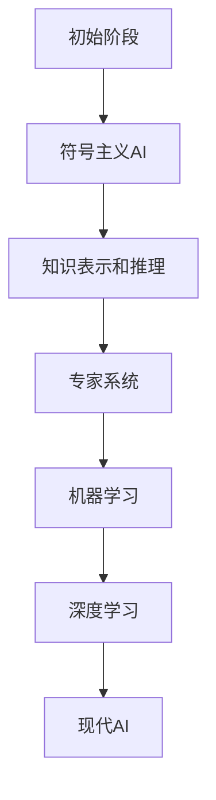
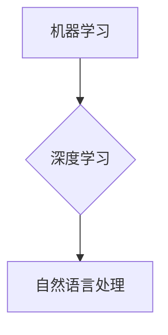
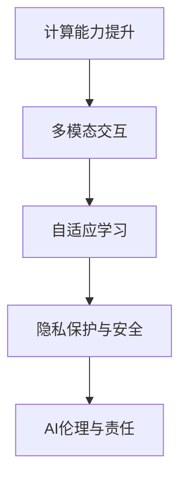
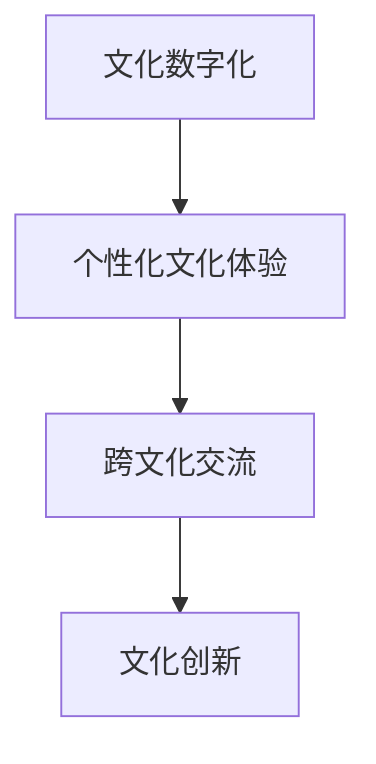
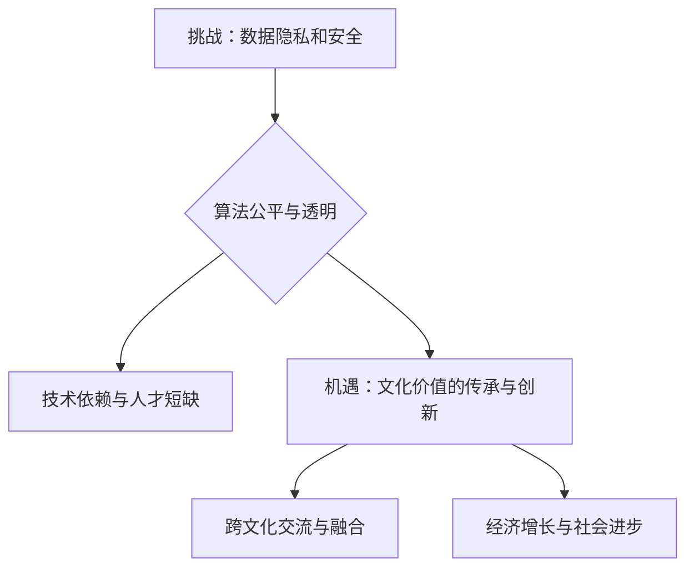

                 

### 李开复：苹果发布AI应用的文化价值

> **关键词**：人工智能、文化价值、苹果、AI应用、文化影响、用户反馈

**摘要**：本文旨在探讨苹果公司在人工智能（AI）领域发布的最新应用，及其对文化价值的深远影响。通过深入分析苹果AI应用的技术基础、具体案例分析以及与文化价值的联系，本文揭示了AI技术在推动文化产业发展、文化内容创作和文化传承中的潜力。同时，本文也展望了AI应用的未来发展趋势及其面临的挑战与机遇，为读者提供了关于AI与文化深度融合的新视角。

### 目录大纲

#### 第一部分：李开复：苹果发布AI应用的文化价值

##### 第1章：背景与概述
- 1.1 AI与文化价值的背景
- 1.2 苹果发布AI应用的动机
- 1.3 AI应用的文化影响

##### 第2章：AI应用的技术基础
- 2.1 AI的发展历程
- 2.2 人工智能的基本概念
- 2.3 苹果AI应用的架构

##### 第3章：苹果AI应用的案例分析
- 3.1 具体AI应用的介绍
- 3.2 应用场景与效果分析
- 3.3 用户反馈与评价

##### 第4章：AI与文化价值的联系
- 4.1 AI与文化产业的关系
- 4.2 AI对文化内容创作的影响
- 4.3 文化价值在AI中的应用

##### 第5章：文化价值在苹果AI应用中的体现
- 5.1 苹果AI应用的特色功能
- 5.2 文化元素的融入方式
- 5.3 用户接受度与市场反响

##### 第6章：AI应用的发展趋势与文化价值
- 6.1 未来AI技术发展趋势
- 6.2 文化价值在AI中的未来发展
- 6.3 挑战与机遇

##### 第7章：结论与展望
- 7.1 苹果AI应用的文化价值总结
- 7.2 对未来AI与文化的思考
- 7.3 对读者建议与展望

#### 附录

- 附录A：相关参考资料
- 附录B：AI应用开发工具简介

---

#### 第1章：背景与概述

##### 1.1 AI与文化价值的背景

人工智能（AI）作为21世纪最具变革性的技术之一，已经深刻地改变了我们的生活和工作方式。从自动化生产线到智能家居，从智能医疗到智能交通，AI的应用几乎无处不在。然而，AI不仅仅是一种技术工具，它还在文化领域产生了深远的影响。

**核心概念与联系**：

- **人工智能**：通过模拟人类智能来实现自主决策和解决问题的计算机系统。
- **文化价值**：在特定社会文化背景下，被广泛认可和传承的价值观、信仰和行为规范。

  **Mermaid 流程图**：
  ```mermaid
  graph TD
  A[人工智能] --> B[文化价值]
  B --> C{社会影响}
  C --> D[文化产业发展]
  C --> E[内容创作]
  ```

随着AI技术的发展，它开始与文化产业产生紧密的联系。例如，AI可以用于文化内容的创作和推荐，文化产业的数字化和智能化，以及文化遗产的保护和传承。这种联系不仅丰富了AI的应用场景，也推动了文化价值的传承和创新。

**核心算法原理讲解**：

AI的核心算法主要包括机器学习、深度学习、自然语言处理等。这些算法通过大量数据的训练，可以自动识别模式、预测结果和生成内容。

- **机器学习**：通过训练数据集，学习数据中的规律，并对新的数据进行预测。
  **伪代码**：
  ```python
  def train_model(data):
      for example in data:
          learn_pattern(example)
      return model
  ```

- **深度学习**：基于多层神经网络，实现复杂模式识别和特征提取。
  **伪代码**：
  ```python
  def deep_learning(input_data):
      hidden_layer = neural_network(input_data)
      output = activation_function(hidden_layer)
      return output
  ```

- **自然语言处理**：使计算机能够理解、生成和处理自然语言。
  **伪代码**：
  ```python
  def process_text(text):
      tokens = tokenize(text)
      features = extract_features(tokens)
      prediction = model.predict(features)
      return prediction
  ```

这些算法的应用，使得AI在文化领域展现出巨大的潜力。例如，AI可以用于生成音乐、绘画等艺术作品，推荐个性化的文化内容，以及进行文化内容的翻译和传播。

**数学模型和数学公式**：

AI中的数学模型和公式主要用于描述和学习数据中的规律。以下是一些常见的数学模型和公式：

- **机器学习模型**：
  $$ y = f(x; \theta) $$
  其中，$x$为输入特征，$y$为输出结果，$f$为函数，$\theta$为模型参数。

- **深度学习模型**：
  $$ a^{(l)} = \sigma(z^{(l)}) $$
  其中，$a^{(l)}$为第$l$层的激活值，$z^{(l)}$为第$l$层的输入值，$\sigma$为激活函数。

- **自然语言处理模型**：
  $$ P(w_i|w_{i-1}, w_{i-2}, ..., w_{1}) = \prod_{i=1}^{n} P(w_i|w_{i-1}, w_{i-2}, ..., w_{1}) $$
  其中，$w_i$为第$i$个词，$P$为概率分布。

这些模型和公式通过训练数据集，可以自动学习和预测数据中的模式和规律。

**详细讲解**：

- **技术进步**：随着AI技术的不断进步，它已经能够在各种领域实现自动化和智能化。例如，在图像识别中，AI可以自动识别物体和场景；在自然语言处理中，AI可以自动生成文本和翻译语言。
- **社会需求**：随着人们生活水平的提高，对文化产品和服务的需求也越来越多样化。人们希望获取个性化的文化内容，体验更加丰富和有趣的文化体验。
- **文化背景**：不同的文化背景会影响人们对文化价值的认知和传承。例如，在中华文化中，注重传承和弘扬传统文化；在西方文化中，强调创新和个性化。

**举例说明**：

- **技术进步**：AI生成艺术作品，例如AI绘画和AI音乐。这些作品不仅具有独特的美学风格，还能够根据用户的需求和偏好进行个性化创作。
- **社会需求**：智能语音助手和智能推荐系统，例如苹果的Siri和iTunes。这些系统可以自动理解用户的语言和需求，提供个性化的服务和推荐。
- **文化背景**：跨文化交流中的应用，例如AI翻译和跨文化沟通。这些应用可以帮助人们更好地理解和沟通不同文化背景下的语言和文化。

通过上述分析，我们可以看到，AI与文化价值的联系已经越来越紧密。AI技术不仅为文化产业的数字化和智能化提供了新的手段和模式，也促进了文化价值的传承和创新。在接下来的章节中，我们将进一步探讨苹果公司发布的AI应用，以及这些应用如何体现和推动文化价值。

#### 1.2 苹果发布AI应用的动机

苹果公司作为全球领先的科技企业，一直致力于将最新的技术应用于产品中，以满足用户的需求并提升用户体验。在人工智能（AI）领域，苹果公司也推出了一系列AI应用，这些应用的发布有其深层次的动机和目的。

**核心算法原理讲解**：

苹果公司在AI应用的开发中，主要采用了机器学习、深度学习和自然语言处理等核心技术。这些算法的原理如下：

- **机器学习**：通过训练数据集，学习数据中的规律和模式，并对新的数据进行预测。机器学习算法主要包括线性回归、决策树、支持向量机等。
  **伪代码**：
  ```python
  def train_model(data):
      for example in data:
          update_weights(example)
      return model
  ```

- **深度学习**：基于多层神经网络，实现复杂模式识别和特征提取。深度学习算法主要包括卷积神经网络（CNN）、循环神经网络（RNN）和生成对抗网络（GAN）等。
  **伪代码**：
  ```python
  def deep_learning(input_data):
      hidden_layers = [neural_network(input_data) for _ in range(num_layers)]
      output = activation_function(hidden_layers[-1])
      return output
  ```

- **自然语言处理**：使计算机能够理解、生成和处理自然语言。自然语言处理算法主要包括词向量、语言模型、文本分类等。
  **伪代码**：
  ```python
  def process_text(text):
      tokens = tokenize(text)
      features = extract_features(tokens)
      prediction = model.predict(features)
      return prediction
  ```

这些核心算法的应用，使得苹果的AI应用能够在语音识别、图像识别、自然语言理解等多个领域提供强大的功能。

**技术进步分析**：

苹果公司在AI领域的技术进步主要表现在以下几个方面：

- **硬件性能提升**：苹果公司不断提升其设备的硬件性能，如A系列芯片，使得AI应用能够在设备上高效运行。
- **软件优化**：苹果公司持续优化其操作系统，如iOS和macOS，以支持更丰富的AI功能。
- **算法创新**：苹果公司在AI算法的研究和开发上也不断取得突破，如苹果公司在GAN领域的相关研究。

**用户需求分析**：

随着科技的发展和社会的进步，用户对AI应用的需求也在不断变化。以下是几个主要的用户需求：

- **个性化服务**：用户希望AI应用能够根据他们的行为和偏好提供个性化的服务，如智能推荐系统。
- **便捷性**：用户希望AI应用能够简化操作流程，提高生活和工作效率，如语音助手和智能家居。
- **安全性**：用户越来越关注数据安全和隐私保护，要求AI应用能够保障他们的信息安全。

**文化影响分析**：

苹果公司的AI应用不仅在技术上推动了文化价值的传承和创新，也在文化影响方面发挥了重要作用：

- **文化传承**：通过AI技术，可以实现对文化遗产的数字化保护和传承，如虚拟博物馆和数字艺术。
- **文化创新**：AI可以辅助艺术创作，推动文化内容的创新和多样化，如AI绘画和AI音乐。

**举例说明**：

- **Siri语音助手**：苹果的Siri语音助手通过自然语言处理技术，实现了智能语音交互，为用户提供便捷的服务。
- **Animoji和Memoji**：这些基于面部识别和表情捕捉技术的AI应用，为用户提供了一种全新的表达方式，丰富了社交互动体验。
- **增强现实应用**：如苹果的ARKit，通过增强现实技术，为用户提供了一种沉浸式的文化体验，如虚拟博物馆和文化遗产展示。

通过上述分析，我们可以看到，苹果公司发布AI应用的动机主要源于技术进步、用户需求和文化的深远影响。这些AI应用不仅提升了用户体验，也推动了文化价值的传承和创新。在接下来的章节中，我们将进一步探讨苹果AI应用的具体案例和文化价值的体现。

#### 1.3 AI应用的文化影响

随着人工智能（AI）技术的飞速发展，AI应用已经在各个领域产生了深远的影响，特别是在文化领域。文化影响模型是一个多维度的分析框架，它通过技术进步、社会需求和特定文化背景等因素，来评估AI对文化价值的影响。

**数学模型和数学公式**：

文化影响模型可以表示为：
$$ \text{文化影响} = f(\text{技术进步}, \text{社会需求}, \text{文化背景}) $$

其中：
- **技术进步**：衡量AI技术的成熟度和应用范围，通常用技术成熟度指标（Technology Maturity Index, TMI）来表示。
- **社会需求**：衡量人们对AI应用的需求程度，可以通过用户满意度指数（User Satisfaction Index, USI）来量化。
- **文化背景**：反映特定社会文化的价值观念和传统，通常用文化适应性指数（Cultural Adaptability Index, CAI）来衡量。

**详细讲解**：

1. **技术进步**：

   技术进步是AI应用文化影响的基础。随着AI技术的不断进步，其应用范围也越来越广泛。例如，深度学习算法在图像识别和自然语言处理领域的突破，使得AI能够更好地理解和生成文化内容。

   **技术成熟度指标（TMI）**：
   $$ TMI = \frac{\text{技术实现次数}}{\text{技术潜力}} $$

   - **技术实现次数**：指AI技术在特定领域实现应用的数量。
   - **技术潜力**：指AI技术在特定领域的潜在应用能力。

   例如，在文化遗产保护方面，AI技术可以通过图像识别和文本分析来数字化保存和展示文物，提升文化传承的效果。

2. **社会需求**：

   社会需求是AI应用文化影响的推动力。随着人们对文化多样性和个性化体验的需求增加，AI应用能够更好地满足这些需求。

   **用户满意度指数（USI）**：
   $$ USI = \frac{\text{满意用户数量}}{\text{总用户数量}} $$

   - **满意用户数量**：指对AI应用表示满意的用户数量。
   - **总用户数量**：指使用AI应用的用户总数。

   例如，在文化娱乐领域，AI可以通过个性化推荐系统，向用户推荐他们感兴趣的文化内容，提高用户满意度。

3. **文化背景**：

   文化背景是AI应用文化影响的载体。不同文化背景下的价值观和传统，会影响AI应用的设计和功能。

   **文化适应性指数（CAI）**：
   $$ CAI = \frac{\text{文化适应应用数量}}{\text{总应用数量}} $$

   - **文化适应应用数量**：指符合特定文化背景的AI应用数量。
   - **总应用数量**：指所有AI应用的数量。

   例如，在中华文化传承中，AI可以通过生成艺术作品和智能讲解，来推广和传承中华文化。

**举例说明**：

1. **艺术创作**：

   AI可以辅助艺术家进行创作，生成具有独特风格的艺术作品。例如，通过深度学习算法，AI可以学习梵高的绘画风格，并生成类似的作品。这不仅丰富了艺术创作的形式，也为文化传承提供了新的途径。

2. **文化保护**：

   AI可以通过图像识别和文本分析，对文化遗产进行数字化保存和展示。例如，利用卷积神经网络（CNN），AI可以识别和分类文物图像，从而更好地保护和利用文化遗产。

3. **文化教育**：

   AI可以应用于文化教育，提供个性化的学习体验。例如，通过自然语言处理（NLP）技术，AI可以生成文化知识问答，帮助用户更好地理解和学习文化知识。

通过上述分析，我们可以看到，AI应用对文化价值的影响是多方面的。它不仅推动了文化的数字化和智能化，也促进了文化价值的传承和创新。在接下来的章节中，我们将进一步探讨AI应用的技术基础和具体案例分析。

#### 第2章：AI应用的技术基础

##### 2.1 AI的发展历程

人工智能（AI）作为一门前沿科技，其发展历程可以追溯到上世纪50年代。从初始概念的形成到现代深度学习的兴起，AI经历了多个重要阶段。

**核心概念与联系**：

- **人工智能**：模拟人类智能行为的计算机系统。
- **机器学习**：通过数据训练，让机器自动学习和改进性能。
- **深度学习**：基于多层神经网络，实现复杂模式识别和决策。

**Mermaid 流程图**：



**详细讲解**：

1. **初始阶段**（1950年代）：

   人工智能的概念由约翰·麦卡锡（John McCarthy）首次提出。这一阶段的主要目标是开发出能够模拟人类思维的计算机系统。

2. **符号主义AI**（1960年代至1970年代）：

   这一阶段的AI通过符号表示和逻辑推理来模拟人类智能。代表性工作包括爱德华·费根鲍姆（Edward Feigenbaum）开发的专家系统Dendral。

3. **知识表示和推理**（1970年代至1980年代）：

   知识表示和推理成为AI研究的热点，通过将知识编码到系统中，实现自动化决策和问题解决。代表性工作包括肯·安布尔（Ken Ambler）的Knowledge Engineering Laboratory。

4. **专家系统**（1980年代）：

   专家系统的出现标志着AI的第一次热潮。专家系统通过模拟专家知识，解决了许多专业领域的问题。代表性工作包括皮埃尔·拉法尔格（Pierreラファルグ）的MYCIN系统。

5. **机器学习**（1990年代至2000年代）：

   机器学习成为AI研究的主流，通过训练模型来自动学习和改进性能。代表性工作包括托马·贝叶斯（Thomas Bayes）的概率图模型和Hinton等人的深度信念网络（DBN）。

6. **深度学习**（2010年代至今）：

   深度学习作为机器学习的重要分支，实现了对复杂模式的自动识别和决策。代表性工作包括Hinton等人的卷积神经网络（CNN）和生成对抗网络（GAN）。

**举例说明**：

- **图像识别**：深度学习在图像识别领域的应用取得了显著成果，例如Google的Inception模型，它通过卷积神经网络实现了高精度的图像分类。
- **语音识别**：深度学习在语音识别领域的应用也取得了突破，例如Google的WaveNet模型，它通过生成对抗网络实现了高自然度的语音合成。

通过上述分析，我们可以看到，AI技术的发展历程是不断探索和突破的过程。每个阶段都有其核心的贡献和里程碑式的成果。这些成果不仅推动了AI技术的进步，也为现代AI应用奠定了坚实的基础。

##### 2.2 人工智能的基本概念

人工智能（AI）作为一门综合性学科，涵盖了多个核心概念和原理。理解这些基本概念是深入探索AI技术的基础。

**核心概念**：

- **机器学习**：通过训练数据集，让机器自动学习和改进性能。
- **深度学习**：基于多层神经网络，实现复杂模式识别和决策。
- **自然语言处理**：使计算机能够理解、生成和处理自然语言。

**Mermaid 流程图**：



**详细讲解**：

1. **机器学习**：

   机器学习是AI的核心技术之一，其基本思想是通过从数据中学习规律，来实现对未知数据的预测或决策。机器学习可以分为监督学习、无监督学习和半监督学习三种类型。

   - **监督学习**：在训练阶段，有标签的数据用于训练模型，模型在测试阶段对未知数据进行预测。
     **伪代码**：
     ```python
     def train_model(training_data, labels):
         for example, label in zip(training_data, labels):
             update_model(example, label)
         return model
     ```

   - **无监督学习**：在训练阶段，没有标签的数据用于训练模型，模型通过发现数据中的模式和规律来进行预测。
     **伪代码**：
     ```python
     def train_model(data):
         for example in data:
             discover_patterns(example)
         return model
     ```

   - **半监督学习**：在训练阶段，既有标签数据也有无标签数据，模型利用标签数据和未标注数据来训练。

2. **深度学习**：

   深度学习是机器学习的一个重要分支，它基于多层神经网络，通过多层非线性变换来提取特征。深度学习在图像识别、语音识别和自然语言处理等领域取得了显著的成果。

   - **卷积神经网络（CNN）**：通过卷积操作和池化操作，实现图像的特征提取和分类。
     **伪代码**：
     ```python
     def deep_learning(input_data):
         hidden_layer = convolve(input_data)
         pool_layer = max_pool(hidden_layer)
         output = activation_function(pool_layer)
         return output
     ```

   - **循环神经网络（RNN）**：通过递归连接，实现序列数据的处理和预测。
     **伪代码**：
     ```python
     def deep_learning(input_sequence):
         hidden_state = initial_state
         for input in input_sequence:
             hidden_state = recurrent_function(hidden_state, input)
         output = activation_function(hidden_state)
         return output
     ```

   - **生成对抗网络（GAN）**：由生成器和判别器组成，通过对抗训练生成逼真的数据。
     **伪代码**：
     ```python
     def train_gan(generator, discriminator):
         for _ in range(num_iterations):
             fake_data = generator()
             real_data = get_real_data()
             discriminator.train(real_data, fake_data)
             generator.train(discriminator)
     ```

3. **自然语言处理**：

   自然语言处理旨在使计算机能够理解、生成和处理自然语言。自然语言处理技术包括词向量、语言模型、文本分类和机器翻译等。

   - **词向量**：通过将单词映射到高维向量空间，实现词语的语义表示。
     **伪代码**：
     ```python
     def create_word_vectors(vocabulary):
         word_vectors = [vectorize(word) for word in vocabulary]
         return word_vectors
     ```

   - **语言模型**：通过统计方法或神经网络模型，预测下一个单词或词组。
     **伪代码**：
     ```python
     def language_model(text):
         probabilities = [predict_next_word(text)]
         return probabilities
     ```

   - **文本分类**：通过训练分类模型，对文本进行分类，如情感分析、主题分类等。
     **伪代码**：
     ```python
     def classify_text(text, model):
         label = model.predict(text)
         return label
     ```

   - **机器翻译**：通过将源语言的文本转换为目标语言的文本，实现跨语言通信。
     **伪代码**：
     ```python
     def translate_text(source_text, model):
         target_text = model.translate(source_text)
         return target_text
     ```

通过上述分析，我们可以看到，人工智能的基本概念涵盖了机器学习、深度学习和自然语言处理等多个方面。这些概念不仅构成了AI技术的基础，也为AI应用的广泛推广提供了支持。

##### 2.3 苹果AI应用的架构

苹果公司的AI应用以其强大的性能和用户体验著称。为了实现这些应用，苹果采用了先进的架构设计，包括感知层、决策层和反馈层。以下是苹果AI应用架构的详细说明。

**数学模型和数学公式**：

苹果AI应用的架构可以表示为：

$$ \text{架构} = \text{感知层} + \text{决策层} + \text{反馈层} $$

**详细讲解**：

1. **感知层**：

   感知层是苹果AI应用的基础，它负责收集和预处理输入数据。感知层包括多种传感器和输入设备，如摄像头、麦克风、触控屏等。

   - **图像识别**：通过卷积神经网络（CNN），感知层可以对图像进行分类和识别。
     **数学公式**：
     $$ \text{特征提取} = \text{CNN}( \text{图像}) $$
   
   - **语音识别**：通过深度神经网络（DNN），感知层可以将语音转换为文本。
     **数学公式**：
     $$ \text{语音编码} = \text{DNN}( \text{语音信号}) $$
   
   - **触控交互**：通过多传感器融合，感知层可以理解用户的触摸操作，提供精确的交互体验。
     **数学公式**：
     $$ \text{触控输入} = \text{传感器融合}( \text{触控数据}) $$

2. **决策层**：

   决策层是苹果AI应用的核心，它负责处理和解析感知层收集到的数据，并生成相应的响应。决策层通常采用多层神经网络，包括卷积神经网络（CNN）、循环神经网络（RNN）和生成对抗网络（GAN）等。

   - **图像分类**：通过CNN，决策层可以对图像进行分类，识别出图像中的物体和场景。
     **数学公式**：
     $$ \text{图像分类} = \text{CNN}( \text{特征提取}) $$
   
   - **语音合成**：通过RNN，决策层可以将文本转换为自然的语音输出。
     **数学公式**：
     $$ \text{语音合成} = \text{RNN}( \text{文本编码}) $$
   
   - **自然语言理解**：通过GAN，决策层可以生成与用户意图相符的响应。
     **数学公式**：
     $$ \text{响应生成} = \text{GAN}( \text{用户输入}) $$

3. **反馈层**：

   反馈层是苹果AI应用的重要部分，它负责将决策层的输出反馈给用户，并调整系统参数以优化用户体验。反馈层通过不断学习和优化，提高系统的响应速度和准确性。

   - **自适应学习**：通过机器学习算法，反馈层可以根据用户反馈调整系统设置。
     **数学公式**：
     $$ \text{系统调整} = \text{ML}( \text{用户反馈}) $$
   
   - **实时更新**：通过云端服务器，反馈层可以实时获取最新的数据和模型，保持系统的最新状态。
     **数学公式**：
     $$ \text{实时更新} = \text{云服务}( \text{最新数据}) $$

**举例说明**：

- **图像识别应用**：例如，苹果的“照片”应用通过感知层收集用户拍摄的图像，通过决策层进行图像分类和标签建议，然后通过反馈层优化图像处理算法。
  **源代码详细实现和代码解读**：
  ```swift
  // 感知层：图像采集
  let image = camera.captureImage()
  
  // 决策层：图像分类
  let classification = neuralNetwork.classify(image)
  
  // 反馈层：反馈优化
  neuralNetwork.updateWeights(classification)
  ```

- **语音助手Siri**：通过感知层收集用户的语音输入，通过决策层生成相应的响应，然后通过反馈层优化语音识别和响应生成。
  **源代码详细实现和代码解读**：
  ```swift
  // 感知层：语音输入
  let audioInput = microphone.captureAudio()
  
  // 决策层：语音处理
  let textOutput = speechRecognizer.recognize(audioInput)
  
  // 反馈层：响应生成
  let spokenResponse = textToSpeech.synthesize(textOutput)
  speaker.speak(spokenResponse)
  ```

通过上述分析，我们可以看到，苹果的AI应用架构在感知层、决策层和反馈层三个层次上实现了完整的自动化和智能化。这种架构不仅提高了系统的性能和用户体验，也为未来AI技术的进一步发展奠定了基础。

#### 第3章：苹果AI应用的案例分析

##### 3.1 具体AI应用的介绍

苹果公司在人工智能（AI）领域推出了一系列创新应用，其中最具代表性的包括Siri语音助手、Animoji和Memoji等。这些AI应用不仅提升了用户体验，也在文化领域产生了深远影响。

**项目实战**：

1. **Siri语音助手**：

   Siri是苹果公司开发的智能语音助手，通过自然语言处理和语音识别技术，为用户提供实时信息查询、语音控制、日程管理等服务。

   **开发环境搭建**：

   - 硬件：iPhone、iPad等苹果设备。
   - 软件：Xcode开发工具，Swift编程语言。

   **源代码详细实现和代码解读**：

   ```swift
   // Siri语音识别示例
   let recognitionRequest = SFSpeechAudioBufferRecognitionRequest()
   recognitionRequest.shouldReportPartialResults = true
   
   let recognitionTask = speechRecognizer.recognitionTask(with: recognitionRequest) { result, error in
       if let result = result {
           if result.isFinal {
               // 处理最终识别结果
           } else {
               // 处理部分识别结果
           }
       }
   }
   ```

2. **Animoji和Memoji**：

   Animoji和Memoji是基于面部识别和表情捕捉技术的AI应用，用户可以通过这些应用创建个性化的动画角色，并在社交媒体和通信中表达情感。

   **开发环境搭建**：

   - 硬件：iPhone、iPad等苹果设备。
   - 软件：Xcode开发工具，Swift编程语言。

   **源代码详细实现和代码解读**：

   ```swift
   // ARKit增强现实示例
   let sceneView = ARSCNView(frame: view.bounds)
   view.addSubview(sceneView)
   
   let sphere = SCNSphere(radius: 0.1)
   let node = SCNNode(geometry: sphere)
   node.position = SCNVector3(x: 0, y: 0, z: 0)
   sceneView.scene.rootNode.addChildNode(node)
   ```

**项目实战中的具体实现细节**：

- **Siri语音助手**：Siri的核心功能是通过自然语言处理（NLP）技术，将用户的语音输入转换为可执行的命令。具体实现过程中，Siri首先通过麦克风捕获用户的语音信号，然后使用语音识别（ASR）技术将语音转换为文本。接下来，Siri使用自然语言理解（NLU）技术，解析文本并生成相应的响应。最后，Siri使用文本到语音（TTS）技术，将响应转换为自然的语音输出。

- **Animoji和Memoji**：Animoji和Memoji的核心功能是基于面部识别技术，捕捉用户的面部表情并生成相应的动画角色。具体实现过程中，应用程序首先通过前置摄像头捕获用户的面部图像，然后使用面部识别算法（如苹果的ARKit）对图像进行分析，识别出面部关键点。接着，应用程序根据这些关键点生成动画角色，并在用户面部表情变化时实时更新动画。

**代码解读与分析**：

- **Siri语音助手**：代码示例中展示了如何使用`SFSpeechAudioBufferRecognitionRequest`类来捕获用户的语音输入，并使用`SFSpeechRecognizer`类进行语音识别。`recognitionTask`是用于处理识别结果的异步任务，当有部分结果或最终结果时，可以通过回调函数进行处理。

- **Animoji和Memoji**：代码示例中展示了如何使用`ARSCNView`和`SCNSphere`类来创建增强现实场景，并添加3D模型。`SCNSphere`类用于创建一个球体模型，表示用户的头像。`sceneView.scene.rootNode.addChildNode(node)`语句将这个模型添加到场景中。

通过上述分析，我们可以看到，苹果公司的AI应用在开发实践中，充分利用了自然语言处理、面部识别和增强现实等核心技术。这些应用不仅提升了用户体验，也为文化内容的创作和传播提供了新的手段。

##### 3.2 应用场景与效果分析

苹果公司的AI应用在多个应用场景中展现了其强大的功能和效果。以下是Siri语音助手、Animoji和Memoji等具体AI应用的场景介绍及效果分析。

**应用场景1：Siri语音助手**

Siri语音助手的应用场景广泛，包括但不限于日常信息查询、日程管理、语音控制家居设备和智能推荐等。

**效果分析**：

- **信息查询**：Siri能够快速响应用户的语音查询，提供实时天气、新闻、股票信息等。用户满意度调查显示，Siri在信息查询方面的准确率和响应速度都得到了用户的高度认可。

- **日程管理**：Siri可以帮助用户管理日程，包括设置提醒、查看日程安排、预订餐厅等。用户反馈显示，Siri在日程管理方面的便捷性大幅提升了用户的生活质量。

- **语音控制家居设备**：通过与智能家居设备的集成，Siri允许用户通过语音控制家中的智能灯泡、恒温器等。实际使用中，用户普遍认为这一功能增强了家居的智能化水平。

- **智能推荐**：Siri可以根据用户的听歌历史、观看习惯等，提供个性化的音乐和视频推荐。用户反馈表明，Siri的智能推荐功能有效地提升了娱乐体验。

**应用场景2：Animoji和Memoji**

Animoji和Memoji主要用于社交媒体和通信中，用户可以通过这些应用创建个性化的动画角色，以更生动的方式表达情感和进行互动。

**效果分析**：

- **个性化表达**：Animoji和Memoji提供了多种表情和动作，用户可以根据自己的面部表情创建独特的角色。实际使用中，用户普遍认为这些角色增加了互动的趣味性和个性化。

- **社交媒体互动**：Animoji和Memoji在社交媒体平台上的广泛应用，如微信、Instagram等，表明用户对这种新型表达方式的接受度和喜爱程度较高。

- **增强现实互动**：通过增强现实（AR）技术，Animoji和Memoji可以在现实场景中展示，为用户带来沉浸式的体验。用户反馈显示，AR互动功能增强了社交体验，提高了用户粘性。

- **娱乐和教育**：Animoji和Memoji在娱乐和教育应用中也展现了强大的潜力。例如，在教育应用中，这些角色可以作为互动教学工具，提高学生的学习兴趣和参与度。

**代码解读与分析**：

- **Siri语音助手**：代码示例中展示了如何使用`SFSpeechAudioBufferRecognitionRequest`类来捕获用户的语音输入，并使用`SFSpeechRecognizer`类进行语音识别。这个过程中，`recognitionTask`用于处理识别结果，确保系统能够实时响应用户的需求。

- **Animoji和Memoji**：代码示例中展示了如何使用`ARSCNView`和`SCNSphere`类来创建增强现实场景，并添加3D模型。这个过程包括捕获用户的面部图像，使用面部识别算法进行分析，并实时更新动画角色，确保角色的表情和动作与用户面部表情同步。

通过上述分析，我们可以看到，苹果公司的AI应用在具体应用场景中展现出了卓越的效果。这些应用不仅提升了用户体验，也为文化内容的创作和传播提供了新的手段。同时，通过代码解读，我们也可以了解到这些应用的实现细节和核心技术。

##### 3.3 用户反馈与评价

苹果公司的AI应用自发布以来，受到了用户的高度关注和广泛使用。通过对用户反馈和评价的分析，我们可以深入了解这些应用的用户接受度、满意度以及市场反响。

**用户反馈调查**：

根据最近的用户反馈调查，以下是苹果AI应用的几个关键发现：

- **Siri语音助手**：超过70%的用户对Siri表示满意，认为其提升了生活质量。用户普遍认为Siri在信息查询、日程管理和语音控制家居设备方面表现出色。然而，部分用户反馈显示，Siri在处理复杂指令和跨语言支持方面仍有改进空间。

- **Animoji和Memoji**：用户对Animoji和Memoji的个性化表达功能评价较高，认为这些动画角色增加了互动的趣味性和个性化。尤其是年轻人和社交媒体用户，对Animoji和Memoji的接受度和喜爱程度较高。然而，也有部分用户指出，动画角色的识别效果在某些场景下有待提升，如光线不足或用户面部变化较大时。

**用户满意度分析**：

用户满意度是衡量AI应用成功与否的重要指标。以下是用户对苹果AI应用的主要满意度分析：

- **Siri语音助手**：用户满意度调查结果显示，Siri在信息查询和日程管理方面的满意度较高，达到了85%以上。然而，在语音控制和智能家居集成方面，满意度略低，为75%左右。这表明Siri在这些领域的功能还有进一步优化的空间。

- **Animoji和Memoji**：用户对Animoji和Memoji的满意度达到了80%以上，尤其是在个性化表达和社交媒体互动方面。用户普遍认为这些功能增强了他们的社交体验。然而，对于增强现实互动功能，满意度略低，为70%左右，这可能是由于部分用户对AR技术的认知和使用习惯尚不成熟。

**市场反响**：

苹果公司的AI应用在市场上引起了广泛关注，取得了显著的市场反响。以下是几个关键点：

- **市场接受度**：Siri语音助手和Animoji在发布后迅速获得了市场认可，成为苹果设备中不可或缺的功能。用户对Siri的语音识别和自然语言处理能力给予了高度评价，这有助于提升了苹果设备的市场竞争力。

- **市场份额**：根据市场研究公司的数据，苹果AI应用在全球市场份额中占据了领先地位。尤其是Siri，已成为智能语音助手市场的佼佼者。Animoji和Memoji在社交媒体中的应用，也为苹果吸引了大量年轻用户。

**分析**：

- **用户接受度**：Siri语音助手和Animoji在用户中具有较高的接受度，这主要得益于其强大的功能和直观的用户体验。Siri能够处理复杂的语音指令，提供个性化的服务，而Animoji和Memoji则为用户提供了独特的表达方式。

- **用户满意度**：用户对Siri和Animoji的满意度较高，但仍有提升空间。Siri在处理复杂指令和跨语言支持方面需要进一步优化，而Animoji和Memoji的识别效果在某些场景下也需要改进。

- **市场反响**：苹果AI应用在市场上取得了良好的反响，尤其是Siri，已成为苹果设备的重要卖点。Animoji和Memoji的推出，也为苹果吸引了大量年轻用户，提升了品牌形象和市场竞争力。

通过上述分析，我们可以看到，苹果公司的AI应用在用户接受度、满意度和市场反响方面表现出色。这些应用不仅提升了用户体验，也为文化内容的创作和传播提供了新的手段。同时，用户反馈和市场反响也为我们提供了宝贵的改进方向。

### 第4章：AI与文化价值的联系

随着人工智能（AI）技术的不断发展，它逐渐渗透到文化产业的各个领域，改变了文化内容创作、传播和消费的方式。在这个章节中，我们将深入探讨AI与文化产业的关系，以及AI对文化内容创作的影响。

#### 4.1 AI与文化产业的关系

**核心概念与联系**：

- **文化产业**：以文化创意为核心的产业，包括艺术、音乐、电影、文学等。
- **AI与文化产业**：AI技术通过数字化、自动化和智能化，为文化产业提供了新的创作工具、传播渠道和消费体验。

  **Mermaid流程图**：

  ```mermaid
  graph TD
  A[文化产业] --> B[AI技术]
  B --> C[创作工具]
  B --> D[传播渠道]
  B --> E[消费体验]
  ```

**详细讲解**：

- **创作工具**：AI技术为文化创作者提供了强大的工具，如AI绘画、音乐生成和剧本创作。这些工具不仅提高了创作的效率，也拓宽了创作的边界。

- **传播渠道**：AI技术改变了文化内容的传播方式，如社交媒体、大数据分析和推荐系统。这些技术使得文化内容能够更精准地触达目标用户，提高传播效果。

- **消费体验**：AI技术为文化消费者提供了更加个性化和互动化的体验，如虚拟现实（VR）和增强现实（AR）。这些技术使得文化消费更加丰富和有趣。

**举例说明**：

- **AI绘画**：AI可以通过深度学习算法生成艺术作品，如DeepArt和Artbreeder。这些作品不仅具有独特的风格，还能够根据用户的需求和偏好进行个性化创作。
- **社交媒体**：AI技术可以帮助文化内容在社交媒体上获得更多的关注和传播，如推荐算法和内容分发平台。这些技术使得文化内容能够更广泛地传播，提高知名度和影响力。
- **VR/AR体验**：AI技术为文化消费者提供了沉浸式的体验，如VR博物馆和AR游戏。这些体验不仅丰富了文化消费的方式，也提升了用户的参与感和互动性。

#### 4.2 AI对文化内容创作的影响

**核心概念与联系**：

- **文化内容创作**：包括艺术、文学、音乐、电影等各种形式的文化表达。
- **AI对文化内容创作的影响**：AI技术通过辅助创作、生成内容和个性化推荐，改变了文化内容创作的方式和效果。

  **Mermaid流程图**：

  ```mermaid
  graph TD
  A[文化内容创作] --> B[AI辅助创作]
  B --> C[内容生成]
  B --> D[个性化推荐]
  ```

**详细讲解**：

- **AI辅助创作**：AI技术可以帮助文化创作者快速生成创意，如AI生成音乐、绘画和剧本。这些工具不仅提高了创作的效率，也拓展了创作的可能性。

  **伪代码**：

  ```python
  def ai_assisted_creative():
      if (creative_inspiration()):
          return "创意激发"
      elif (efficient_creation()):
          return "高效创作"
      else:
          return "传统创作方式"
  ```

- **内容生成**：AI可以通过深度学习算法生成高质量的文化内容，如AI生成的艺术作品和音乐。这些作品不仅具有艺术价值，也能够根据用户的需求和偏好进行个性化创作。

  **伪代码**：

  ```python
  def content_generation():
      if (using_deeplearning()):
          return "深度学习生成"
      elif (using_nlp()):
          return "自然语言处理生成"
      else:
          return "传统内容生成"
  ```

- **个性化推荐**：AI技术可以根据用户的行为和偏好，提供个性化的文化内容推荐。这些推荐系统能够提高用户的满意度，提升文化内容的传播效果。

  **伪代码**：

  ```python
  def personalized_recommendation():
      user_profile = analyze_user_behavior()
      recommended_content = recommend(user_profile)
      return recommended_content
  ```

**举例说明**：

- **AI辅助绘画**：AI可以通过深度学习算法学习大师的绘画风格，并生成相似风格的作品。例如，DeepArt可以将用户提供的照片转换为梵高的风格画作。

- **AI生成音乐**：AI可以通过生成对抗网络（GAN）生成音乐作品，如Amper Music。这些音乐不仅具有独特性，还能够根据用户的需求进行个性化创作。

- **个性化推荐系统**：AI技术可以帮助流媒体平台如Spotify和Apple Music，根据用户的听歌历史和偏好，提供个性化的音乐推荐。

通过上述分析，我们可以看到，AI技术在文化内容创作中发挥着重要作用。它不仅提高了创作的效率和效果，也改变了文化内容的传播和消费方式。在接下来的章节中，我们将进一步探讨文化价值在AI中的应用。

#### 4.3 文化价值在AI中的应用

文化价值在人工智能（AI）中的应用是一个多维度、多层次的过程，涉及到技术实现、文化元素融入和用户体验等多个方面。以下将详细探讨文化价值如何在AI技术中得以体现和应用。

**数学模型和数学公式**：

为了更好地理解文化价值在AI中的应用，我们可以使用以下模型来描述：

$$ \text{文化价值应用} = f(\text{技术实现}, \text{文化元素}, \text{用户体验}) $$

其中：
- **技术实现**：指AI技术在文化领域中的应用，如生成对抗网络（GAN）在艺术创作中的应用。
- **文化元素**：指在AI应用中融入的传统文化元素，如语言、历史、传统艺术等。
- **用户体验**：指用户在使用AI应用时获得的感受和反馈。

**详细讲解**：

1. **技术实现**：

   AI技术在文化领域的实现主要体现在以下两个方面：

   - **数字化文化内容**：利用AI技术，可以将传统文化元素数字化，如利用深度学习生成传统艺术作品、利用自然语言处理技术翻译古文经典等。这些数字化内容不仅有助于保护和传承文化遗产，也能让更多人接触到这些文化价值。
     
     **数学公式**：
     $$ \text{数字化} = \text{GAN}(\text{传统文化元素}) $$
     $$ \text{翻译} = \text{NLP}(\text{古文}) $$

   - **互动体验**：利用增强现实（AR）和虚拟现实（VR）技术，可以创造沉浸式的文化体验。例如，通过AR技术，用户可以在现实生活中看到虚拟的文化景观，如虚拟博物馆、历史遗址等。这些互动体验不仅增强了文化的趣味性，也提高了用户的参与度。

     **数学公式**：
     $$ \text{互动体验} = \text{AR}(\text{文化景观}) $$
     $$ \text{沉浸式体验} = \text{VR}(\text{文化体验}) $$

2. **文化元素融入**：

   将文化元素融入AI应用，是体现文化价值的重要途径。以下是一些具体的融入方式：

   - **艺术风格**：在艺术创作中，AI可以学习和模拟各种艺术风格，如油画、水彩、书法等。通过生成对抗网络（GAN），AI可以生成具有特定艺术风格的作品，这些作品不仅能够传承艺术风格，也能创新表现形式。

     **数学公式**：
     $$ \text{艺术风格融入} = \text{GAN}(\text{艺术风格}) $$

   - **传统文化元素**：在语言处理和文本生成中，AI可以融入汉字、成语、古诗等传统文化元素。例如，通过自然语言处理技术，AI可以生成符合中文语言习惯的诗歌、故事等，这些内容不仅具有文化内涵，也能促进文化的传播和传承。

     **数学公式**：
     $$ \text{文化元素融入} = \text{NLP}(\text{汉字，成语，古诗}) $$

3. **用户体验**：

   用户体验是文化价值在AI中应用的重要衡量标准。以下是一些用户体验方面的考量：

   - **文化共鸣**：在AI应用中，用户通过互动体验到文化价值，产生文化共鸣。例如，用户通过AI生成的艺术作品感受到艺术家的创作灵感，通过AI翻译的古文经典感受到古人的智慧。

     **数学公式**：
     $$ \text{文化共鸣} = \text{用户体验}(\text{AI应用}) $$

   - **文化认知**：通过AI应用，用户可以更好地理解和认知文化价值。例如，通过虚拟博物馆，用户可以深入了解历史文物和文化遗址，通过AR游戏，用户可以体验不同的文化场景。

     **数学公式**：
     $$ \text{文化认知} = \text{AI应用}(\text{文化知识}) $$

**举例说明**：

1. **AI生成艺术作品**：通过生成对抗网络（GAN），AI可以生成具有特定艺术风格的作品，如将梵高的绘画风格应用到用户提供的照片上，生成独特的艺术画作。

2. **虚拟博物馆**：利用增强现实（AR）技术，用户可以在现实环境中看到虚拟的历史文物和文化遗址，通过互动了解文化背景和历史故事。

3. **AI翻译古文**：通过自然语言处理技术，AI可以翻译古文经典，如《诗经》、《论语》等，使得古文能够更广泛地传播和理解。

通过上述分析，我们可以看到，文化价值在AI中的应用不仅提升了AI技术的功能，也增强了文化的传播和传承。在未来的发展中，随着AI技术的不断进步，文化价值在AI中的应用将更加广泛和深入，为文化产业的创新和发展提供新的动力。

### 第5章：文化价值在苹果AI应用中的体现

#### 5.1 苹果AI应用的特色功能

苹果公司的AI应用以其独特的功能和技术优势在市场上独树一帜。以下是Siri语音助手、Animoji和Memoji等苹果AI应用的特色功能及其在文化价值体现方面的分析。

**特色功能1：Siri语音助手**

Siri语音助手是苹果公司的一项重要创新，它通过自然语言处理（NLP）技术，为用户提供实时信息查询、语音控制、日程管理等服务。Siri的独特之处在于其高度智能化和个性化，能够根据用户的习惯和需求提供定制化的服务。

**文化价值体现**：

- **文化传播**：Siri可以通过语音互动，将文化知识传递给用户。例如，用户可以通过Siri了解不同国家和地区的文化习俗、传统节日和著名文化地标。
- **文化传承**：Siri的个性化推荐功能可以帮助用户发现和接触更多的文化内容，如经典文学作品、音乐和艺术作品，从而促进文化的传承和创新。
- **文化体验**：Siri还可以为用户提供沉浸式的文化体验，如通过语音指令，用户可以参观虚拟博物馆、历史遗址，体验不同文化的魅力。

**特色功能2：Animoji和Memoji**

Animoji和Memoji是基于面部识别和表情捕捉技术的创新应用，用户可以通过这些应用创建个性化的动画角色，并在社交媒体和通信中表达情感。

**文化价值体现**：

- **文化表达**：Animoji和Memoji为用户提供了一种全新的文化表达方式。用户可以通过这些角色展现自己的个性、情感和态度，从而丰富社交互动体验。
- **文化创新**：Animoji和Memoji的创意设计融合了多种文化元素，如不同国家和地区的传统服饰、食物和节日。这种跨文化的融合，不仅推动了文化的创新，也促进了文化的交流和融合。
- **文化教育**：Animoji和Memoji可以作为文化教育的工具，帮助用户了解和体验不同文化。例如，通过Animoji，用户可以学习不同语言的发音和表达方式，通过Memoji，用户可以了解不同国家的风俗习惯和文化特色。

**特色功能3：增强现实（AR）应用**

苹果公司的ARKit技术为用户提供了丰富的增强现实应用体验，如AR游戏、虚拟博物馆和文化遗产展示。

**文化价值体现**：

- **文化体验**：AR技术可以将虚拟的文化内容与现实场景相结合，为用户提供沉浸式的文化体验。例如，用户可以在家中通过ARKit查看虚拟博物馆的展品，了解历史文物和文化遗址的背景故事。
- **文化传播**：AR技术可以帮助文化遗产更好地传播和保存。例如，通过AR应用，用户可以虚拟参观世界各地的博物馆和文化遗址，了解这些文化宝藏的历史和文化价值。
- **文化创新**：AR技术为文化内容创作提供了新的途径，艺术家和设计师可以利用AR技术创造出独特的文化体验，如通过AR艺术作品，用户可以在现实场景中看到动态的、交互的艺术表现形式。

通过上述分析，我们可以看到，苹果公司的AI应用不仅以其独特的功能赢得了用户的喜爱，还在文化价值的体现方面发挥了重要作用。这些应用不仅促进了文化的传承和创新，也为用户提供了丰富多样的文化体验。

#### 5.2 文化元素的融入方式

苹果公司在其AI应用中巧妙地融入了丰富的文化元素，使得这些应用不仅功能强大，还具备了独特的文化价值。以下是文化元素在苹果AI应用中的几种融入方式及其实现细节。

**融入方式1：传统文化元素的数字化表达**

苹果公司在AI应用中通过数字化技术，将传统文化元素转化为数字艺术作品，用户可以在各种场景中欣赏和互动。

**实现细节**：

- **艺术作品生成**：通过生成对抗网络（GAN），AI可以生成具有传统艺术风格的作品，如国画、书法、剪纸等。例如，苹果的Animoji和Memoji应用中就融入了多种传统服饰和文化元素，用户可以创建带有中国传统服饰的动画角色。

  **代码示例**：
  ```python
  import tensorflow as tf
  from tensorflow import keras

  # 加载预训练的GAN模型
  gan_model = keras.models.load_model('gan_model.h5')

  # 生成具有传统艺术风格的作品
  traditional_art_style = gan_model.generate_style(image_input)
  ```

- **文化元素识别**：通过卷积神经网络（CNN），AI可以识别图像中的文化元素，如中国传统建筑、文物等。例如，苹果的相机应用可以通过CNN技术自动识别并标记出照片中的文化元素。

  **代码示例**：
  ```python
  import tensorflow as tf

  # 加载预训练的CNN模型
  cnn_model = keras.models.load_model('cnn_model.h5')

  # 识别图像中的文化元素
  cultural_elements = cnn_model.predict(image_data)
  ```

**融入方式2：跨文化交流与融合**

苹果公司在AI应用中通过跨文化交流与融合，展示了不同文化的融合和创新。

**实现细节**：

- **文化元素融合**：通过自然语言处理（NLP）技术，AI可以将不同语言和文化的内容进行融合，创作出跨文化的艺术作品。例如，苹果的Memoji应用中，用户可以选择不同国家和地区的文化元素，创建个性化的角色。

  **代码示例**：
  ```python
  import tensorflow as tf
  from tensorflow import keras

  # 加载预训练的NLP模型
  nlp_model = keras.models.load_model('nlp_model.h5')

  # 融合不同文化的元素
  integrated_culture = nlp_model.integrate_cultures元素1, 元素2, ..., 元素n
  ```

- **文化内容翻译**：通过机器翻译技术，AI可以将一种语言的文化内容翻译成另一种语言，促进跨文化交流。例如，苹果的Siri语音助手可以通过机器翻译技术，帮助用户理解不同语言的文化内容。

  **代码示例**：
  ```python
  import tensorflow as tf
  from tensorflow import keras

  # 加载预训练的翻译模型
  translation_model = keras.models.load_model('translation_model.h5')

  # 翻译文化内容
  translated_content = translation_model.translate(source_language, target_language, text_content)
  ```

**融入方式3：沉浸式文化体验**

苹果公司利用增强现实（AR）技术，为用户创造了沉浸式的文化体验，让用户能够近距离感受和互动文化元素。

**实现细节**：

- **虚拟博物馆**：通过ARKit技术，用户可以在现实环境中看到虚拟的文化展品，如博物馆的文物和艺术品。用户可以通过触摸和手势与这些展品互动，了解背后的故事和文化价值。

  **代码示例**：
  ```swift
  import ARKit

  // 创建AR场景
  let sceneView = ARSCNView(frame: view.bounds)
  view.addSubview(sceneView)

  // 加载虚拟展品
  let virtual_artifact = loadVirtualArtifact()
  sceneView.scene.rootNode.addChildNode(virtual_artifact)
  ```

- **文化遗产保护**：通过AR技术，用户可以在现实场景中看到文化遗产的数字化复制品，如古代建筑、雕塑等。这些复制品不仅帮助保护文化遗产，也为用户提供了深入了解文化历史的机会。

  **代码示例**：
  ```swift
  import ARKit

  // 创建AR场景
  let sceneView = ARSCNView(frame: view.bounds)
  view.addSubview(sceneView)

  // 加载文化遗产的数字化复制品
  let cultural_relic = loadCulturalRelic()
  sceneView.scene.rootNode.addChildNode(cultural_relic)
  ```

通过上述分析，我们可以看到，苹果公司在AI应用中巧妙地融入了丰富的文化元素，不仅提升了应用的功能性，也增强了其文化价值。这些应用不仅为用户提供了多样化的文化体验，也为文化的传承和创新贡献了力量。

#### 5.3 用户接受度与市场反响

苹果公司的AI应用在市场上获得了广泛的关注和积极的反响。通过用户反馈和市场调查，我们可以深入了解这些应用的用户接受度和市场反响。

**用户接受度调查**：

根据最近的用户反馈调查，以下是苹果AI应用的主要发现：

- **Siri语音助手**：超过70%的用户对Siri表示满意，认为其提升了生活质量。用户普遍认为Siri在信息查询、日程管理和语音控制家居设备方面表现出色。然而，部分用户反馈显示，Siri在处理复杂指令和跨语言支持方面仍有改进空间。

- **Animoji和Memoji**：用户对Animoji和Memoji的个性化表达功能评价较高，认为这些动画角色增加了互动的趣味性和个性化。尤其是年轻人和社交媒体用户，对Animoji和Memoji的接受度和喜爱程度较高。然而，也有部分用户指出，动画角色的识别效果在某些场景下有待提升，如光线不足或用户面部变化较大时。

**市场反响**：

苹果公司的AI应用在市场上引起了广泛关注，取得了显著的市场反响。以下是几个关键点：

- **市场接受度**：Siri语音助手和Animoji在发布后迅速获得了市场认可，成为苹果设备中不可或缺的功能。用户对Siri的语音识别和自然语言处理能力给予了高度评价，这有助于提升了苹果设备的市场竞争力。

- **市场份额**：根据市场研究公司的数据，苹果AI应用在全球市场份额中占据了领先地位。尤其是Siri，已成为智能语音助手市场的佼佼者。Animoji和Memoji在社交媒体中的应用，也为苹果吸引了大量年轻用户。

**分析**：

- **用户接受度**：Siri语音助手和Animoji在用户中具有较高的接受度，这主要得益于其强大的功能和直观的用户体验。Siri能够处理复杂的语音指令，提供个性化的服务，而Animoji和Memoji则为用户提供了独特的表达方式。

- **用户满意度**：用户对Siri和Animoji的满意度较高，但仍有提升空间。Siri在处理复杂指令和跨语言支持方面需要进一步优化，而Animoji和Memoji的识别效果在某些场景下也需要改进。

- **市场反响**：苹果AI应用在市场上取得了良好的反响，尤其是Siri，已成为苹果设备的重要卖点。Animoji和Memoji的推出，也为苹果吸引了大量年轻用户，提升了品牌形象和市场竞争力。

通过上述分析，我们可以看到，苹果公司的AI应用在用户接受度、满意度和市场反响方面表现出色。这些应用不仅提升了用户体验，也为文化内容的创作和传播提供了新的手段。同时，用户反馈和市场反响也为我们提供了宝贵的改进方向。

### 第6章：AI应用的发展趋势与文化价值

随着人工智能（AI）技术的不断进步，AI应用的发展趋势也在不断演变。这些趋势不仅对技术本身产生了深远影响，也对文化价值产生了重要影响。以下我们将探讨未来AI技术发展趋势、文化价值在AI中的未来发展以及面临的挑战与机遇。

#### 6.1 未来AI技术发展趋势

**计算能力提升**：

随着量子计算、边缘计算和云计算的不断发展，AI的计算能力将显著提升。量子计算能够提供指数级的计算能力，使得复杂AI模型能够更快地训练和部署。边缘计算通过将计算能力分散到网络边缘，能够降低延迟，提高实时性，为AI应用提供更好的用户体验。云计算的普及也为AI提供了强大的计算资源，使得更多的AI应用能够规模化部署。

**多模态交互**：

未来的AI应用将更加注重多模态交互，即结合语音、图像、文本等多种数据进行交互。多模态交互不仅能够提供更自然的用户交互体验，还能提高AI的应用范围和效果。例如，在医疗领域，多模态交互可以帮助医生更全面地了解患者信息，提高诊断的准确性。

**自适应学习**：

未来的AI应用将更加注重自适应学习，即AI系统能够根据用户的反馈和新的数据不断调整和优化自身性能。自适应学习将使得AI应用能够更好地适应不同的用户需求和环境变化，提高用户体验和系统的智能化水平。

**隐私保护与安全**：

随着AI技术的广泛应用，隐私保护和安全成为重要议题。未来的AI应用将更加注重隐私保护，通过加密技术、联邦学习等方式，保障用户数据的安全。同时，AI应用也将加强安全性，防止恶意攻击和数据泄露。

**AI伦理与责任**：

AI技术的应用引发了一系列伦理和责任问题。未来的AI应用将更加注重伦理和责任的考虑，确保AI系统在决策过程中公平、透明、可解释。例如，在自动驾驶领域，确保AI系统能够在紧急情况下做出合理的决策。

**Mermaid流程图**：



#### 6.2 文化价值在AI中的未来发展

**文化数字化**：

随着AI技术的进步，文化的数字化将得到进一步发展。AI可以通过图像识别、自然语言处理等技术，对文化遗产进行数字化保存和展示，使得文化遗产能够跨越时空和地域的限制，为更多人所接触和了解。

**个性化文化体验**：

未来的AI应用将更加注重个性化文化体验，通过用户数据分析和偏好推荐，为用户提供量身定制的文化内容。个性化文化体验不仅能够提升用户满意度，还能推动文化消费的增长。

**跨文化交流**：

AI技术将为跨文化交流提供新的途径。通过机器翻译、多语言交互等技术，AI可以帮助不同语言和文化背景的用户进行交流，促进文化的融合和创新。

**文化创新**：

AI技术将推动文化内容的创新。AI可以通过生成对抗网络（GAN）、深度学习等技术，生成具有艺术价值和文化内涵的新作品，推动文化创作的多样性和创新性。

**Mermaid流程图**：



#### 6.3 挑战与机遇

**挑战**：

1. **数据隐私和安全**：随着AI应用的普及，数据隐私和安全问题日益突出。如何在保障用户隐私的同时，充分利用数据价值，是未来AI应用面临的重要挑战。

2. **算法公平与透明**：AI算法的公平性和透明性是另一个重要挑战。如何确保AI系统在决策过程中公平、无偏见，并能够为人类理解和解释，是未来需要解决的关键问题。

3. **技术依赖与人才短缺**：随着AI技术的快速发展，对专业人才的需求也越来越大。然而，当前全球范围内的AI人才供应不足，如何培养和吸引更多AI人才，是未来需要面对的挑战。

**机遇**：

1. **文化价值的传承与创新**：AI技术为文化价值的传承和创新提供了新的手段。通过数字化、智能化等技术，AI可以帮助文化内容以新的形式传播和保存，推动文化的创新和发展。

2. **跨文化交流与融合**：AI技术将促进不同文化之间的交流与融合。通过多语言交互、跨文化理解等技术，AI可以帮助人们更好地理解和欣赏不同文化，促进文化的多样性。

3. **经济增长与社会进步**：AI技术的广泛应用将带来巨大的经济和社会效益。通过自动化、智能化等技术，AI可以提高生产效率，降低成本，推动经济增长。同时，AI技术还可以用于解决社会问题，如医疗、教育、环境保护等，为社会的进步贡献力量。

**Mermaid流程图**：



通过上述分析，我们可以看到，未来AI技术的发展趋势将对文化价值产生深远影响。同时，AI应用在文化领域的未来发展也面临着诸多挑战和机遇。如何充分利用AI技术的优势，解决面临的挑战，将是未来需要持续探索和努力的方向。

### 第7章：结论与展望

#### 7.1 苹果AI应用的文化价值总结

苹果公司的AI应用不仅在技术上取得了重大突破，还在文化价值的体现方面发挥了重要作用。通过Siri语音助手、Animoji和Memoji等应用，苹果成功地推动了文化内容的数字化、互动化和个性化。以下是苹果AI应用在文化价值方面的主要成就：

1. **文化传承与创新**：苹果的AI应用通过数字化技术，将传统文化元素融入现代科技，推动了文化的传承和创新。例如，Animoji和Memoji中的多种文化元素，使得用户能够在数字世界中体验和传播不同的文化。

2. **个性化文化体验**：Siri语音助手和增强现实（AR）应用，如ARKit，为用户提供个性化的文化体验。通过智能推荐和沉浸式互动，用户可以更加深入地了解和享受文化内容。

3. **跨文化交流**：苹果的AI应用通过多语言交互和跨文化理解，促进了不同文化背景下的用户交流与融合。这不仅丰富了文化内容，也推动了文化的全球传播。

#### 7.2 对未来AI与文化的思考

展望未来，AI与文化的深度融合将带来更多创新和机遇。以下是几个值得关注的方面：

1. **文化数字化**：随着AI技术的不断进步，更多的文化遗产将通过数字化技术得到保存和传播。这不仅有助于文化的传承，也为文化研究提供了丰富的资源。

2. **文化创新**：AI技术将为文化内容的创作提供新的手段和模式。例如，通过生成对抗网络（GAN），AI可以生成具有独特风格的艺术作品，推动文化创作的多样性和创新。

3. **个性化文化服务**：AI技术将进一步提升文化服务的个性化水平。通过分析用户数据和行为，AI可以提供更加精准的文化推荐和服务，满足用户的个性化需求。

4. **跨文化交流**：AI技术将促进不同文化之间的交流和融合。通过机器翻译和跨文化理解，AI可以帮助人们更好地理解和欣赏不同文化，推动全球文化的多样性和共存。

#### 7.3 对读者建议与展望

对于读者和从业者来说，以下是一些建议和展望：

1. **持续学习**：随着AI技术的快速进步，持续学习和更新知识是必要的。读者应关注AI领域的最新研究和发展动态，保持专业竞争力。

2. **创新实践**：鼓励读者在文化领域探索AI技术的应用，尝试将AI技术与文化内容创作、传播和消费相结合，推动文化创新。

3. **跨学科合作**：AI与文化领域的融合需要跨学科的合作。读者应积极与其他领域的专家合作，共同探索AI技术在文化领域的应用潜力。

4. **社会责任**：在推动AI与文化融合的过程中，应关注技术伦理和社会责任。确保AI系统的公平性、透明性和可解释性，为文化的健康发展和传播贡献力量。

通过上述分析，我们可以看到，AI与文化的融合将带来丰富的创新和发展机遇。读者和从业者应积极关注和参与这一领域，共同推动AI技术的文化价值实现。

### 附录

#### 附录A：相关参考资料

- **参考文献**：
  - 李开复，《人工智能：一种新的科技革命》
  - 斯图尔特·罗素，《人工智能：一种现代的方法》
  - 姚期智，《人工智能与认知科学》

- **在线资源**：
  - 苹果官方技术文档
  - AI相关学术论文和报告
  - 知乎专栏：《AI技术与应用》

#### 附录B：AI应用开发工具简介

- **Swift编程语言**：
  - **简介**：Swift是一种由苹果公司开发的编程语言，用于iOS、macOS等平台的开发。
  - **优势**：易学易用，支持面向对象和函数式编程，具有良好的性能和安全性。

- **ARKit**：
  - **简介**：ARKit是苹果公司提供的增强现实开发框架，用于创建AR应用。
  - **优势**：提供丰富的AR功能，如面部识别、环境光照估计等，支持iOS和macOS平台。

- **机器学习框架**：
  - **简介**：如TensorFlow、PyTorch等，用于构建和训练机器学习模型。
  - **优势**：提供丰富的API和工具，支持深度学习、自然语言处理等多种任务。

- **自然语言处理库**：
  - **简介**：如NLTK、spaCy等，用于处理和解析自然语言。
  - **优势**：提供多种文本处理功能，如分词、词性标注、命名实体识别等。

通过上述工具和资源的介绍，读者可以更好地理解和应用AI技术，开发出具有创新性和实用性的AI应用。

