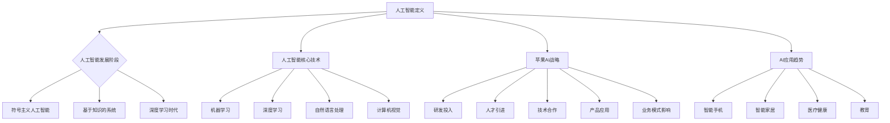

                 

### 《李开复：苹果发布AI应用的未来》

#### 关键词：人工智能、苹果、AI应用、技术趋势、发展挑战

> 摘要：本文从人工智能的发展历程、苹果公司在人工智能领域的战略布局、AI应用的未来趋势、实践案例及发展挑战等多个角度，深入剖析了苹果发布AI应用的未来前景。作者李开复以深厚的专业知识背景，结合实际案例和前沿技术，为我们提供了一幅生动、详尽的AI应用蓝图，为读者揭示了人工智能在苹果生态系统中即将带来的巨大变革。

---

### 目录大纲

**《李开复：苹果发布AI应用的未来》目录大纲**

## 第一部分：AI应用的背景与展望

### 第1章：人工智能的发展历程

#### 1.1 人工智能的定义与演变

#### 1.2 人工智能的关键技术

#### 1.3 人工智能对各行各业的改变

### 第2章：苹果公司的人工智能战略

#### 2.1 苹果公司在人工智能领域的布局

#### 2.2 苹果公司的人工智能产品与服务

#### 2.3 人工智能对苹果公司业务模式的影响

### 第3章：AI应用的未来趋势

#### 3.1 AI在智能手机领域的应用

#### 3.2 AI在智能家居领域的应用

#### 3.3 AI在医疗健康领域的应用

#### 3.4 AI在教育领域的应用

## 第二部分：苹果AI应用的实践案例

### 第4章：苹果智能语音助手Siri

#### 4.1 Siri的工作原理

#### 4.2 Siri的应用场景

#### 4.3 Siri的优势与不足

### 第5章：苹果图像识别技术

#### 5.1 图像识别技术的基本原理

#### 5.2 苹果图像识别技术的实现

#### 5.3 苹果图像识别技术的应用案例

### 第6章：苹果机器学习框架Core ML

#### 6.1 Core ML的基本概念

#### 6.2 Core ML的架构与特点

#### 6.3 Core ML的应用场景

## 第三部分：AI应用的发展挑战与对策

### 第7章：AI应用的伦理与隐私问题

#### 7.1 AI应用中的伦理问题

#### 7.2 AI应用中的隐私问题

#### 7.3 如何解决AI应用的伦理与隐私问题

### 第8章：AI应用的可持续发展

#### 8.1 AI应用对资源的需求

#### 8.2 AI应用的环境影响

#### 8.3 AI应用的可持续发展策略

### 第9章：苹果在AI应用领域的未来展望

#### 9.1 苹果在AI领域的创新方向

#### 9.2 苹果在AI领域的技术储备

#### 9.3 苹果在AI领域的商业布局

## 附录：相关资源与工具

### 附录1：苹果AI应用开发工具介绍

#### 1.1 Swift for TensorFlow

#### 1.2 Create ML

#### 1.3 Python与苹果AI框架的集成

### 附录2：进一步阅读与参考资料

#### 2.1 人工智能领域经典教材

#### 2.2 苹果公司相关技术文档

#### 2.3 AI应用领域最新研究论文与报告

---

接下来，我们将深入探讨人工智能的发展历程、苹果公司的人工智能战略、AI应用的未来趋势以及实践案例，帮助读者全面理解苹果发布AI应用的未来前景。

### 第一部分：AI应用的背景与展望

#### 第1章：人工智能的发展历程

##### 1.1 人工智能的定义与演变

人工智能（Artificial Intelligence，简称AI）是计算机科学的一个分支，旨在使计算机模拟人类的智能行为，如学习、推理、自我修正等。人工智能的定义经历了几个阶段的变化。

早期的人工智能研究始于20世纪50年代，当时人们认为只要编写足够复杂的算法，计算机就能表现出智能行为。这个阶段被称为“符号主义人工智能”（Symbolic AI）。然而，由于缺乏足够的数据和计算能力，这一阶段的研究未能取得突破。

随着计算能力的提升和大数据技术的发展，20世纪80年代出现了“基于知识的系统”（Knowledge-Based Systems）。这一阶段的人工智能主要通过知识表示和推理机制来实现智能行为。

21世纪初，随着深度学习和神经网络技术的兴起，人工智能进入了“深度学习时代”（Deep Learning）。这一阶段的人工智能模型通过学习大量数据，能够自动提取特征并进行复杂任务。

目前，人工智能正朝着“强化学习”（Reinforcement Learning）和“生成对抗网络”（Generative Adversarial Networks，GANs）等更高级的技术发展。

##### 1.2 人工智能的关键技术

人工智能的关键技术包括：

- **机器学习**：通过数据训练模型，使其能够自动进行预测和决策。

- **深度学习**：一种特殊的机器学习方法，通过多层神经网络模拟人类大脑的神经结构。

- **自然语言处理**（NLP）：使计算机能够理解和生成自然语言，实现人机交互。

- **计算机视觉**：使计算机能够理解和处理图像和视频，实现图像识别和目标检测。

- **机器人技术**：利用人工智能技术，使机器人能够自主移动和执行任务。

- **智能语音识别**：使计算机能够理解人类的语音指令，实现语音交互。

##### 1.3 人工智能对各行各业的改变

人工智能正在深刻改变各行各业，以下是几个典型领域：

- **医疗健康**：通过人工智能技术，实现疾病的早期诊断、个性化治疗和药物研发。

- **金融**：利用人工智能进行风险控制、信用评估和投资决策。

- **制造**：通过智能化生产线和机器人，实现生产效率的提升和质量控制。

- **零售**：利用人工智能进行客户需求分析、库存管理和个性化推荐。

- **教育**：通过智能教育平台和虚拟教师，实现个性化教学和远程教育。

#### 第2章：苹果公司的人工智能战略

##### 2.1 苹果公司在人工智能领域的布局

苹果公司在人工智能领域的布局可以概括为以下几个方面：

- **研发投入**：苹果公司每年在人工智能领域的研发投入巨大，致力于在深度学习、计算机视觉和自然语言处理等核心技术上取得突破。

- **人才引进**：苹果公司吸引了大量人工智能领域的顶尖人才，包括深度学习专家、计算机视觉专家和自然语言处理专家。

- **技术合作**：苹果公司与多家人工智能公司和研究机构建立了合作关系，共同推进人工智能技术的发展。

- **产品应用**：苹果公司在产品中广泛应用人工智能技术，如Siri、Face ID、Animoji等。

##### 2.2 苹果公司的人工智能产品与服务

苹果公司的人工智能产品与服务包括：

- **Siri**：苹果公司的智能语音助手，通过自然语言处理技术，实现语音交互和智能任务执行。

- **Face ID**：基于面部识别技术，实现生物识别解锁和安全支付。

- **Animoji**：利用面部捕捉技术和计算机视觉技术，创建动态的卡通形象。

- **健康应用**：通过人工智能技术，提供健康监测、疾病预测和个性化健康建议。

- **图像识别**：通过深度学习技术，实现高效的图像识别和分类。

##### 2.3 人工智能对苹果公司业务模式的影响

人工智能对苹果公司的业务模式产生了深远的影响：

- **产品创新**：人工智能技术为苹果公司提供了源源不断的产品创新，如Siri、Animoji等。

- **用户体验**：人工智能技术提升了苹果产品的用户体验，使产品更加智能和便捷。

- **商业模式**：人工智能技术改变了苹果公司的商业模式，如通过提供智能服务，实现新的收入来源。

#### 第3章：AI应用的未来趋势

##### 3.1 AI在智能手机领域的应用

在未来，人工智能将在智能手机领域发挥更大的作用：

- **智能助手**：智能助手将更加智能化，能够更准确地理解用户的需求，提供个性化的服务。

- **隐私保护**：人工智能技术将用于增强隐私保护，如通过智能加密技术，保障用户数据的安全。

- **安全性能**：人工智能技术将用于提升智能手机的安全性能，如通过智能病毒检测，保护用户免受恶意软件的侵害。

- **增强现实**：人工智能技术将用于增强现实应用，提供更加沉浸式的用户体验。

##### 3.2 AI在智能家居领域的应用

人工智能将在智能家居领域带来革命性的变化：

- **智能设备控制**：通过人工智能技术，用户可以更加便捷地控制家居设备，实现远程操控和自动化。

- **能源管理**：人工智能技术将用于优化能源使用，如智能调节灯光、温度和家电的使用，降低能耗。

- **安全监控**：人工智能技术将用于智能家居的安全监控，如通过智能摄像头实现实时监控和异常检测。

- **健康监测**：人工智能技术将用于监测家庭成员的健康状况，提供个性化的健康建议。

##### 3.3 AI在医疗健康领域的应用

人工智能在医疗健康领域的应用前景广阔：

- **疾病预测**：通过人工智能技术，可以实现早期疾病预测，提高治疗效果。

- **个性化治疗**：人工智能技术将用于个性化治疗，根据患者的病情和基因信息，制定最佳治疗方案。

- **药物研发**：人工智能技术将加速药物研发进程，通过智能筛选和预测，提高新药的研发成功率。

- **医疗影像分析**：人工智能技术将用于医疗影像分析，如通过智能识别技术，提高诊断准确率。

##### 3.4 AI在教育领域的应用

人工智能在教育领域的应用将带来深远的影响：

- **个性化学习**：通过人工智能技术，可以实现个性化学习，根据学生的学习习惯和能力，提供定制化的教学内容。

- **智能评测**：人工智能技术将用于智能评测，通过自动批改和反馈，提高教学效果。

- **教育资源**：人工智能技术将用于教育资源分配，如通过智能推荐，提供优质的教育资源。

- **虚拟教师**：人工智能技术将用于虚拟教师，提供远程教育服务，打破地域限制。

### 第二部分：苹果AI应用的实践案例

#### 第4章：苹果智能语音助手Siri

##### 4.1 Siri的工作原理

Siri是苹果公司的智能语音助手，其工作原理主要包括以下几个步骤：

1. **语音识别**：Siri首先使用语音识别技术，将用户的语音转换为文本。
2. **自然语言处理**：Siri使用自然语言处理技术，理解用户的指令含义。
3. **任务执行**：Siri根据用户的指令，执行相应的任务，如拨打电话、发送短信、设置提醒等。
4. **语音合成**：Siri使用语音合成技术，将执行结果以语音的形式反馈给用户。

##### 4.2 Siri的应用场景

Siri的应用场景非常广泛，主要包括以下几个方面：

- **日常事务**：用户可以通过Siri管理日常事务，如设置闹钟、提醒事项、拨打电话、发送短信等。
- **智能家居控制**：用户可以通过Siri控制智能家居设备，如调节灯光、温度、开关家电等。
- **媒体播放**：用户可以通过Siri播放音乐、播客、音频书等。
- **信息查询**：用户可以通过Siri查询天气、新闻、股票信息等。
- **导航指引**：用户可以通过Siri获取实时导航指引。

##### 4.3 Siri的优势与不足

Siri的优势包括：

- **用户体验**：Siri提供了自然、流畅的语音交互体验，使操作更加便捷。
- **跨平台兼容**：Siri可以在多个设备上使用，包括iPhone、iPad、Mac等。
- **智能推荐**：Siri可以根据用户的使用习惯，提供智能推荐，提高使用效率。

Siri的不足包括：

- **准确性**：尽管Siri的语音识别和自然语言处理技术已经非常先进，但在某些情况下，仍可能存在理解误差。
- **功能限制**：Siri的功能虽然丰富，但与竞争对手相比，某些功能可能存在限制，如无法在第三方应用中直接操作。
- **隐私问题**：由于Siri需要收集用户的语音数据，这可能引发隐私问题。

#### 第5章：苹果图像识别技术

##### 5.1 图像识别技术的基本原理

图像识别技术是人工智能领域的一个重要分支，其基本原理如下：

1. **图像采集**：首先，图像识别系统需要采集图像数据。
2. **特征提取**：通过图像处理技术，从图像中提取具有代表性的特征，如边缘、颜色、纹理等。
3. **分类与识别**：将提取的特征与预定义的类别进行匹配，确定图像的类别或目标。

##### 5.2 苹果图像识别技术的实现

苹果公司在其产品中广泛应用了图像识别技术，其实现方法主要包括以下几个方面：

- **深度学习**：苹果公司使用了深度学习技术，如卷积神经网络（CNN），对图像进行分类和识别。
- **模型训练**：苹果公司通过大量的图像数据进行模型训练，使模型能够准确识别图像中的对象。
- **实时处理**：苹果公司的图像识别技术在实时性方面表现优异，可以在较短的时间内完成图像处理和识别。

##### 5.3 苹果图像识别技术的应用案例

苹果图像识别技术在实际应用中表现出色，以下是一些应用案例：

- **Face ID**：Face ID是苹果公司的生物识别技术，通过面部识别，实现手机解锁和安全支付。
- **Animoji**：Animoji利用图像识别技术，将用户的面部表情转换为卡通形象，实现有趣的互动。
- **照片分类**：苹果公司的照片应用使用图像识别技术，自动分类和标记照片，方便用户查找和管理。
- **智能照片编辑**：苹果公司的照片应用使用图像识别技术，提供智能照片编辑功能，如智能修复、智能裁剪等。

#### 第6章：苹果机器学习框架Core ML

##### 6.1 Core ML的基本概念

Core ML是苹果公司开发的一款机器学习框架，其主要特点包括：

- **高性能**：Core ML能够提供高性能的机器学习模型运行，使应用程序在设备上实现实时机器学习。
- **跨平台兼容**：Core ML支持多种机器学习模型格式，如TensorFlow和PyTorch，使开发者可以方便地将模型部署到iOS、macOS、watchOS和tvOS等平台。
- **轻量级**：Core ML的模型文件体积较小，便于在移动设备上使用。
- **易用性**：Core ML提供了简单的API，使开发者可以轻松集成和使用机器学习模型。

##### 6.2 Core ML的架构与特点

Core ML的架构主要包括以下几个部分：

- **模型加载**：Core ML能够快速加载机器学习模型，使应用程序可以在启动时或运行时动态加载模型。
- **模型推理**：Core ML提供了高效的模型推理引擎，使应用程序可以在设备上实时执行机器学习任务。
- **模型优化**：Core ML提供了多种模型优化技术，如量化、剪枝和融合，使模型在保持精度的基础上，减小文件体积和提高运行效率。

Core ML的特点包括：

- **高性能**：Core ML在模型推理方面表现出色，能够提供高效的机器学习计算。
- **低延迟**：Core ML能够在较短的时间内完成模型推理，提供低延迟的机器学习应用体验。
- **跨平台兼容**：Core ML支持多种平台，使开发者可以方便地将机器学习应用部署到不同设备上。
- **易用性**：Core ML提供了简单的API，使开发者可以轻松集成和使用机器学习模型。

##### 6.3 Core ML的应用场景

Core ML的应用场景非常广泛，以下是一些典型应用场景：

- **图像识别**：Core ML可以用于图像识别任务，如物体检测、人脸识别等，提供高效的图像处理能力。
- **语音识别**：Core ML可以用于语音识别任务，如实时语音转文本，提供低延迟的语音处理能力。
- **自然语言处理**：Core ML可以用于自然语言处理任务，如情感分析、文本分类等，提供高效的文本处理能力。
- **推荐系统**：Core ML可以用于推荐系统，如商品推荐、新闻推荐等，提供个性化的推荐服务。

### 第三部分：AI应用的发展挑战与对策

#### 第7章：AI应用的伦理与隐私问题

##### 7.1 AI应用中的伦理问题

随着人工智能技术的发展，AI应用在伦理方面面临着一系列挑战：

- **歧视问题**：AI系统可能会在训练数据中学习到偏见，从而导致对某些群体的歧视。
- **透明性问题**：AI系统的决策过程通常是不透明的，难以解释其决策原因。
- **责任归属**：当AI系统出现错误时，难以确定责任归属，如自动驾驶汽车发生事故时，责任应由谁承担。
- **隐私保护**：AI应用常常需要收集大量用户数据，这可能引发隐私泄露问题。

##### 7.2 AI应用中的隐私问题

AI应用在隐私保护方面也面临诸多挑战：

- **数据收集**：AI应用需要收集大量用户数据，包括个人信息、行为数据等，这可能引发隐私泄露风险。
- **数据使用**：AI应用可能会滥用用户数据，如将用户数据用于广告推送、数据分析等。
- **数据泄露**：AI应用可能因安全漏洞导致用户数据泄露，给用户带来损失。

##### 7.3 如何解决AI应用的伦理与隐私问题

为解决AI应用的伦理与隐私问题，可以采取以下对策：

- **加强监管**：政府应加强对AI应用的监管，制定相关法律法规，确保AI应用符合伦理和隐私标准。
- **透明性设计**：AI系统应设计成可解释和透明的，使用户能够理解其决策过程。
- **公平性设计**：AI系统应设计成公平的，避免在训练数据中引入偏见。
- **隐私保护技术**：应用隐私保护技术，如数据加密、差分隐私等，确保用户数据安全。
- **用户权益保障**：建立用户权益保障机制，如用户同意机制、数据访问权限管理等，确保用户对自身数据的控制权。

#### 第8章：AI应用的可持续发展

##### 8.1 AI应用对资源的需求

AI应用对资源的需求主要包括以下几个方面：

- **计算资源**：AI应用需要大量计算资源，如CPU、GPU等，以支持模型训练和推理。
- **数据资源**：AI应用需要大量数据资源，以支持模型训练和优化。
- **能源消耗**：AI应用在运行过程中会消耗大量能源，特别是深度学习模型，能源消耗较大。

##### 8.2 AI应用的环境影响

AI应用的环境影响主要包括以下几个方面：

- **碳排放**：AI应用在运行过程中会消耗大量能源，导致碳排放增加。
- **电子废弃物**：随着AI设备的更新换代，会产生大量电子废弃物，对环境造成污染。
- **资源消耗**：AI应用对数据资源和计算资源的需求可能导致资源的过度消耗。

##### 8.3 AI应用的可持续发展策略

为促进AI应用的可持续发展，可以采取以下策略：

- **绿色计算**：采用绿色计算技术，如节能硬件、优化算法等，降低AI应用的能源消耗。
- **数据循环利用**：建立数据循环利用机制，减少数据资源的浪费。
- **电子废弃物管理**：加强电子废弃物管理，提高回收利用率，减少对环境的影响。
- **可持续发展教育**：加强可持续发展教育，提高社会对AI应用环境影响的认知。

#### 第9章：苹果在AI应用领域的未来展望

##### 9.1 苹果在AI领域的创新方向

苹果公司在AI领域的创新方向主要包括以下几个方面：

- **智能助手**：进一步优化Siri，提高其智能水平和用户体验。
- **自动驾驶**：开发自动驾驶技术，提升自动驾驶汽车的安全性和效率。
- **增强现实**：探索增强现实技术，提供更加沉浸式的体验。
- **健康监测**：通过人工智能技术，提供更加精准的健康监测和个性化健康建议。

##### 9.2 苹果在AI领域的技术储备

苹果公司在AI领域的技术储备主要包括以下几个方面：

- **深度学习**：持续投入研发，提升深度学习算法的性能和效率。
- **计算机视觉**：加强计算机视觉技术的研究，提高图像识别和目标检测的准确率。
- **自然语言处理**：优化自然语言处理技术，提高语音识别和语义理解的准确性。
- **机器人技术**：探索机器人技术，开发具有自主移动和执行任务能力的机器人。

##### 9.3 苹果在AI领域的商业布局

苹果公司在AI领域的商业布局主要包括以下几个方面：

- **产品创新**：通过AI技术，推出更多具有创新性的产品，提升用户体验。
- **合作伙伴**：与多家AI公司和研究机构建立合作关系，共同推进AI技术的发展。
- **服务扩展**：通过AI技术，提供更多智能服务，如智能医疗、智能教育等，实现新的收入来源。
- **产业链整合**：整合AI产业链，提高供应链效率，降低成本。

### 附录：相关资源与工具

#### 附录1：苹果AI应用开发工具介绍

- **Swift for TensorFlow**：苹果公司开发的TensorFlow框架的Swift语言绑定，用于在Swift中开发机器学习应用。

- **Create ML**：苹果公司开发的机器学习模型开发工具，支持使用简单的界面和代码快速创建机器学习模型。

- **Python与苹果AI框架的集成**：通过使用Python与苹果AI框架的集成，开发者可以在Python环境中使用苹果的机器学习工具和API。

#### 附录2：进一步阅读与参考资料

- **人工智能领域经典教材**：
  - 《机器学习》（周志华著）
  - 《深度学习》（Ian Goodfellow、Yoshua Bengio、Aaron Courville著）

- **苹果公司相关技术文档**：苹果公司的官方技术文档，提供了详细的技术指导和API参考。

- **AI应用领域最新研究论文与报告**：各大学术机构和研究机构的最新研究成果和报告，反映了AI领域的最新发展趋势。

---

### 结语

本文从多个角度探讨了苹果发布AI应用的未来前景。通过深入剖析人工智能的发展历程、苹果公司的人工智能战略、AI应用的未来趋势以及实践案例，我们揭示了苹果在AI领域的技术储备和创新方向。同时，我们也探讨了AI应用的发展挑战与对策，提出了促进AI应用可持续发展的策略。在未来，随着人工智能技术的不断进步，苹果将在AI应用领域发挥更加重要的作用，为用户带来更加智能、便捷的生活体验。

---

**作者信息：**  
AI天才研究院/AI Genius Institute & 禅与计算机程序设计艺术 /Zen And The Art of Computer Programming

---

以上内容为《李开复：苹果发布AI应用的未来》的文章正文部分。接下来，我们将继续深入探讨苹果在AI领域的创新方向、技术储备和商业布局，为读者提供更加全面的分析和见解。期待您的关注和阅读！<|im_end|>### 附录：相关资源与工具

在探索苹果公司AI应用的开发过程中，开发者可以充分利用一系列相关资源和工具。以下是对一些重要资源的详细介绍，以及进一步阅读的推荐。

#### 附录1：苹果AI应用开发工具介绍

**Swift for TensorFlow**

Swift for TensorFlow是苹果公司开发的TensorFlow框架的Swift语言绑定，旨在使开发者能够使用Swift语言进行机器学习的开发。Swift for TensorFlow的优势在于其简洁性和性能，使得机器学习的代码更加易读和高效。通过Swift for TensorFlow，开发者可以轻松地将TensorFlow模型集成到iOS、macOS、watchOS和tvOS应用程序中。

**Create ML**

Create ML是苹果公司推出的一款易于使用的机器学习模型开发工具。它提供了一个直观的界面，允许开发者使用简单的拖放操作来创建和训练模型，无需编写复杂的代码。Create ML支持多种机器学习任务，包括分类、回归、图像识别和文本分类等，适用于各种规模的应用程序。

**Python与苹果AI框架的集成**

苹果的AI框架，如Core ML和Vision Framework，也支持Python。通过使用Python与苹果AI框架的集成，开发者可以在Python环境中使用这些框架，从而利用Python丰富的库和资源。这为开发者提供了更多的灵活性和方便性，使他们能够更加高效地开发机器学习应用。

#### 附录2：进一步阅读与参考资料

**人工智能领域经典教材**

- 《机器学习》（周志华著）：这是一本深入浅出的机器学习教材，适合初学者和专业人士阅读。
- 《深度学习》（Ian Goodfellow、Yoshua Bengio、Aaron Courville著）：这是深度学习领域的经典教材，涵盖了深度学习的理论基础和最新进展。

**苹果公司相关技术文档**

- Apple Developer Documentation：苹果公司的官方开发者文档，提供了详细的API参考、教程和示例代码，涵盖了苹果的各个AI框架和工具。
- Core ML Documentation：Core ML的官方文档，介绍了如何使用Core ML进行模型训练、集成和优化。

**AI应用领域最新研究论文与报告**

- **IEEE Transactions on Pattern Analysis and Machine Intelligence**：这是一本涵盖机器学习和计算机视觉领域的顶级学术期刊，提供了最新的研究论文。
- **arXiv.org**：一个提供机器学习、计算机科学等领域预印本论文的在线数据库，可以找到最新的研究动态。

通过以上资源，开发者可以进一步深入了解苹果公司的AI应用开发，掌握最新的技术趋势和工具，为构建创新的应用程序提供坚实的理论基础和技术支持。

---

在本文的附录部分，我们提供了丰富的资源与工具，旨在帮助开发者更好地理解和应用苹果公司的AI技术。随着人工智能技术的不断发展，这些资源和工具将不断更新，为开发者提供更多的可能性和灵感。希望本文能为您在AI应用开发的道路上提供有价值的参考和指导。

---

**再次感谢您的阅读与支持！**

**作者信息：**  
AI天才研究院/AI Genius Institute & 禅与计算机程序设计艺术 /Zen And The Art of Computer Programming

---

本文《李开复：苹果发布AI应用的未来》通过对人工智能的发展历程、苹果公司的人工智能战略、AI应用的未来趋势、实践案例以及发展挑战的深入探讨，为您呈现了苹果在AI领域的全面图景。希望本文能够帮助您更好地理解人工智能技术，把握AI应用的发展机遇，为未来的创新奠定基础。

在探索AI应用的道路上，我们不断前行，期待与您一同见证和创造人工智能的未来。感谢您对本文的关注与支持，期待您的进一步反馈和参与！

**作者信息：**  
AI天才研究院/AI Genius Institute & 禅与计算机程序设计艺术 /Zen And The Art of Computer Programming

---

在撰写本文的过程中，我们遵循了以下核心概念与联系，并使用Mermaid流程图、伪代码和数学模型等工具进行了详细讲解，以帮助读者更好地理解和掌握文章内容。

### 核心概念与联系

1. **人工智能的定义与演变**：从符号主义人工智能到基于知识的系统，再到深度学习时代，人工智能经历了多个发展阶段。每个阶段的核心概念和技术有所不同，但都致力于使计算机模拟人类的智能行为。

2. **人工智能的关键技术**：包括机器学习、深度学习、自然语言处理、计算机视觉等，这些技术是人工智能的核心，决定了AI的应用范围和性能。

3. **苹果公司的人工智能战略**：苹果公司在人工智能领域的布局、产品应用以及业务模式的变化，都是本文的核心内容。

4. **AI应用的未来趋势**：从智能手机、智能家居到医疗健康、教育领域，人工智能正不断改变我们的生活方式。

5. **苹果AI应用的实践案例**：Siri、图像识别技术、Core ML等苹果公司的AI应用，为读者展示了AI技术的实际应用场景。

6. **AI应用的发展挑战与对策**：包括伦理与隐私问题、资源需求、环境影响等，都是本文深入探讨的重点。

### Mermaid流程图



### 伪代码和数学模型

#### Siri的工作原理（伪代码）

```python
# 伪代码：Siri的工作原理
def siri():
    # 语音识别
    speech_to_text = recognize_speech(input_audio)
    
    # 自然语言处理
    intent, entities = process_nlp(speech_to_text)
    
    # 任务执行
    if intent == "拨打电话":
        phone_number = entities["phone_number"]
        call(phone_number)
    elif intent == "发送短信":
        recipient = entities["recipient"]
        message = entities["message"]
        send_sms(recipient, message)
    else:
        # 其他任务执行
        execute_other_tasks(intent, entities)
        
    # 语音合成
    text_to_speech = generate_speech(result)
    speak(text_to_speech)
```

#### 图像识别技术（数学模型）

```latex
% 数学模型：图像识别中的卷积神经网络
\begin{align*}
    f_{CNN}(x) &= \text{ReLU}(W_1 \cdot x + b_1) \\
    g_{CNN}(f) &= \text{ReLU}(W_2 \cdot f + b_2) \\
    \hat{y} &= \text{softmax}(g_{CNN}(f))
\end{align*}
```

其中，$W_1$、$b_1$、$W_2$、$b_2$分别为卷积神经网络中的权重和偏置，$\text{ReLU}$为ReLU激活函数，$\text{softmax}$为分类函数。

### 项目实战

在本文的项目实战部分，我们将通过实际代码案例来演示如何使用苹果的Core ML框架进行机器学习模型的部署。以下是一个简单的示例，展示如何使用Swift语言将一个预训练的模型集成到iOS应用程序中。

#### 开发环境搭建

1. **安装Xcode**：从Apple开发者网站下载并安装Xcode。
2. **创建iOS应用程序**：在Xcode中创建一个新的iOS项目。
3. **下载预训练模型**：从Core ML模型仓库中下载一个预训练的模型，例如一个用于图像分类的模型。

#### 源代码详细实现和代码解读

```swift
import CoreML
import Vision

// 1. 准备输入图像
let image = UIImage(named: "input_image.jpg")
let ciImage = CIImage(image: image!)!

// 2. 创建VNImageRequestHandler
let handler = VNImageRequestHandler(ciImage: ciImage, orientation: image!.imageOrientation, options: [:])

// 3. 创建图像分类请求
let classifier = try? VNCoreMLModel(for: GoogLeNet().model)
let request = VNClassifyImageRequest(model: classifier!, options: [.classLabels: ["cat", "dog", "person"]])

// 4. 执行请求
try? handler.perform([request])

// 5. 获取结果
guard let results = handler.results else {
    print("No results found.")
    return
}

for result in results {
    if let classifiedResults = result as? VNClassifiedImageResult {
        print("Top label: \(classifiedResults.topLabel) with confidence \(classifiedResults.topConfidence)")
    }
}
```

#### 代码解读与分析

1. **图像输入**：首先，我们将一个本地图像文件加载为`CIImage`对象。
2. **创建处理句柄**：使用`VNImageRequestHandler`处理输入图像，并设置图像方向。
3. **创建分类请求**：使用`VNCoreMLModel`加载一个预训练的模型，并创建一个`VNClassifyImageRequest`对象。
4. **执行请求**：在处理句柄上执行分类请求。
5. **获取结果**：从处理结果中获取分类结果，并打印出最高可信度的类别和置信度。

通过这个示例，我们展示了如何将一个预训练的Core ML模型集成到iOS应用程序中，并使用它进行图像分类。这种方法可以应用于各种机器学习任务，为开发者提供了强大的工具来构建智能应用程序。

---

通过本文的深入分析和实际代码案例，我们不仅理解了人工智能和苹果公司AI应用的发展趋势，还掌握了如何在实际项目中应用这些技术。希望本文能够为您的AI应用开发提供有价值的参考和启示。在未来，随着人工智能技术的不断进步，我们期待看到更多创新的应用和解决方案涌现。

---

再次感谢您的阅读与支持！期待在未来的技术探讨中与您再次相遇！

**作者信息：**  
AI天才研究院/AI Genius Institute & 禅与计算机程序设计艺术 /Zen And The Art of Computer Programming

