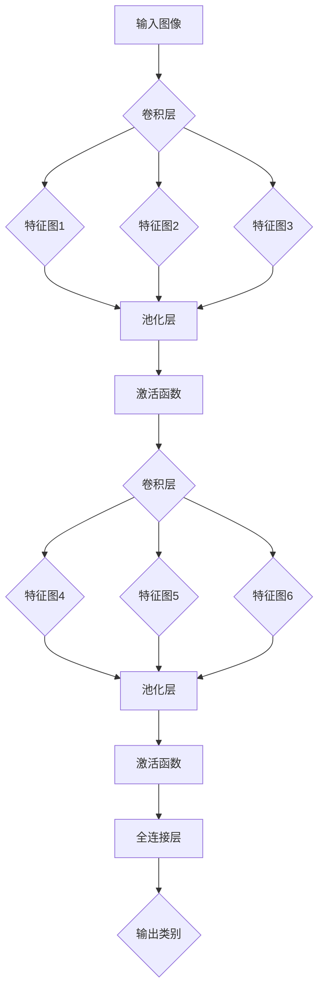
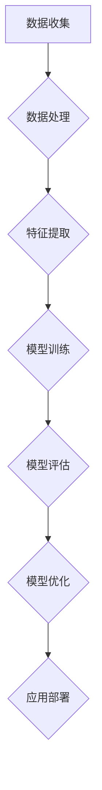

                 

### 《李飞飞的ImageNet与AI图像识别》

在人工智能领域，图像识别是一个至关重要的研究方向。它不仅对科学研究有着深远影响，还在我们的日常生活中扮演着越来越重要的角色。从自动驾驶汽车到智能安防系统，图像识别技术正逐步渗透到各个行业，改变着我们的生活方式。本文将深入探讨图像识别技术的基础知识、发展历程以及AI图像识别在各个领域的应用。特别地，我们将聚焦于李飞飞及其团队在ImageNet竞赛中的突破性工作，以此作为引子，逐步展开对图像识别技术深度学习的探讨。

> **关键词：**
> - 图像识别
> - 深度学习
> - ImageNet
> - AI图像识别
> - 应用场景

> **摘要：**
> 本文首先概述了图像识别的基本概念及其应用领域，回顾了图像识别的历史与发展。接着，我们详细介绍了图像处理的基础知识以及常见的图像处理算法。然后，深入探讨了深度学习与神经网络的基本原理，特别是卷积神经网络（CNN）的结构与应用。在此基础上，本文将重点分析ImageNet竞赛的背景、数据集构建及其对深度学习的推动作用。随后，我们将探讨AI图像识别在医疗、交通和安防等领域的应用案例。最后，通过一个实际项目，展示图像识别技术的实际应用过程，并提供详细的代码解析与项目总结。本文旨在为读者提供一幅完整的图像识别技术全景图，揭示其背后的原理与应用前景。

### 第一部分：图像识别基础

图像识别作为人工智能领域的一个重要分支，其基本概念和重要性不容忽视。在本节中，我们将首先介绍图像识别的基本概念，包括其定义、应用领域以及其在现代科技中的重要性。接着，我们将回顾图像识别技术的发展历程，了解这一领域从早期阶段到现今的演变过程。

#### 1.1 图像识别的基本概念

图像识别（Image Recognition）是指计算机系统通过识别图像中的特定特征，对图像内容进行理解和解释的过程。这一过程涉及图像处理、计算机视觉和机器学习等多个学科的知识。

- **定义**：图像识别可以简单理解为“告诉计算机图像中有什么”。它通过算法分析图像中的像素、颜色、形状和纹理等信息，从而对图像进行分类、定位或标注。

- **应用领域**：图像识别技术广泛应用于多个领域，包括但不限于：
  - **医疗**：疾病诊断、病理分析、患者监护
  - **交通**：车辆识别、交通流量监控、自动驾驶
  - **安防**：人脸识别、行为分析、智能监控
  - **工业**：质量检测、设备故障诊断、生产流程优化
  - **零售**：商品识别、库存管理、顾客行为分析

- **重要性**：随着深度学习和其他先进技术的不断发展，图像识别技术在人工智能领域的重要性日益凸显。它不仅为各行业提供了强大的技术支持，还在提升生产效率、保障公共安全、改善医疗条件等方面发挥着重要作用。例如，在医疗领域，图像识别可以帮助医生更快速、准确地诊断疾病；在交通领域，它可以帮助提高自动驾驶系统的安全性和可靠性。

#### 1.2 图像识别的历史与发展

图像识别技术的历史可以追溯到20世纪50年代，当时计算机科学刚刚起步。最初的图像识别技术主要依赖于手工设计的特征提取和分类算法。随着计算机性能的提升和算法的进步，图像识别技术经历了多个发展阶段。

- **早期阶段**（1950-1980）：
  - **特征提取**：早期的研究主要集中于手工设计特征，如边缘检测、角点检测等。
  - **机器学习**：早期的一些机器学习方法，如K最近邻（K-Nearest Neighbor, KNN）和决策树，开始应用于图像分类。

- **中级阶段**（1980-2000）：
  - **传统图像处理**：这一阶段，图像处理技术取得了显著进展，包括图像滤波、边缘检测、形态学操作等。
  - **统计模型**：贝叶斯网络、隐马尔可夫模型（Hidden Markov Model, HMM）等统计模型开始应用于图像识别。

- **现代阶段**（2000至今）：
  - **深度学习**：深度学习技术的崛起，特别是卷积神经网络（Convolutional Neural Networks, CNN）的出现，彻底改变了图像识别的面貌。CNN能够自动学习图像中的特征，大大提高了图像识别的准确率。
  - **大数据**：随着互联网和物联网的普及，大量图像数据被生成和收集，为深度学习算法的训练提供了丰富的资源。

图像识别技术的历史发展不仅反映了计算机科学的进步，也体现了人工智能在各领域应用的不断深化。从早期的手工设计特征到现代的深度学习技术，图像识别技术正朝着更高精度、更广泛应用的方向不断前进。

#### 1.3 图像识别在人工智能中的地位与作用

图像识别在人工智能（Artificial Intelligence, AI）领域中占据着举足轻重的地位，其作用主要体现在以下几个方面：

- **核心驱动因素**：图像识别是人工智能技术的一个重要应用方向，它与自然语言处理（Natural Language Processing, NLP）、强化学习（Reinforcement Learning, RL）等其他人工智能分支相互补充，共同推动人工智能的发展。

- **广泛的应用场景**：图像识别技术在各个领域都有着广泛的应用，如医疗诊断、自动驾驶、智能家居、零售和安防等。通过图像识别技术，人工智能系统能够更好地理解和解释外部世界，从而提供更加智能化的服务。

- **跨学科整合**：图像识别技术涉及多个学科的知识，包括计算机视觉、机器学习、图像处理等。这种跨学科的特性使得图像识别不仅成为人工智能领域的一个重要研究方向，也为其他相关领域提供了丰富的技术支持。

- **技术突破**：近年来，图像识别技术的突破性进展，特别是深度学习技术的应用，使得图像识别的准确率得到了显著提升。这一技术进步不仅推动了人工智能的发展，也为其他相关领域的研究提供了新的思路和方法。

总的来说，图像识别技术在人工智能领域具有重要的地位和作用。它不仅为人工智能系统的感知和认知能力提供了强大的支持，也为各行业提供了创新性的解决方案。随着技术的不断进步和应用场景的不断拓展，图像识别技术将在人工智能和各领域中发挥更加重要的作用。

### 第二部分：图像处理基础

在图像识别技术的应用中，图像处理是一个不可或缺的环节。它不仅为图像识别提供了高质量的数据，还帮助我们从原始图像中提取出有用的信息。在本节中，我们将详细讨论图像处理的基本概念、常见的图像处理算法以及图像处理技术在图像识别中的重要性。

#### 2.1 图像处理的基本概念

图像处理（Image Processing）是指使用数字技术对图像进行操作和处理的过程。这一过程涉及图像的表示、采样、量化、增强、滤波和分割等多个方面。

- **图像的表示**：图像在计算机中通常以数字形式表示，常用的表示方法包括像素表示法和矢量表示法。像素表示法将图像划分为网格，每个点代表一个像素，每个像素由颜色值（如红绿蓝值RGB）表示。矢量表示法则将图像视为一组几何图形的集合，每个图形由一系列几何参数（如点、线、面等）描述。

- **图像的采样与量化**：采样是将连续的图像转换为离散的像素点。量化是将采样后的像素值进行数值化，通常将像素值限制在一定范围内，如8位图像中像素值的范围是0到255。采样与量化是图像处理的基础步骤，直接影响到图像的质量和后续处理的效果。

- **图像的基本运算**：图像的基本运算包括点运算、线运算和面运算。点运算是指对每个像素值进行的运算，如灰度变换、图像对比度调整等。线运算是指对图像中的线条进行的运算，如边缘检测、轮廓提取等。面运算是指对图像中的区域进行的运算，如图像分割、区域填充等。

#### 2.2 常见的图像处理算法

图像处理算法是图像处理技术的核心，它们通过不同的方法对图像进行增强、滤波和分割等操作，从而提高图像质量、提取有用信息。

- **图像增强**：图像增强是指通过特定的算法，增强图像的某些特征，使其更易于观察或分析。常见的图像增强方法包括：
  - **灰度变换**：通过调整图像的灰度值，增强图像的对比度，如直方图均衡化、对数变换等。
  - **滤波**：通过滤波器对图像进行平滑或锐化处理，如高斯滤波、中值滤波、双边滤波等。

- **图像滤波**：图像滤波是图像处理中用于去除噪声或突出图像特征的常用技术。常见的滤波算法包括：
  - **空间滤波**：通过对图像的像素值进行局部操作，如均值滤波、中值滤波等。
  - **频域滤波**：通过对图像的频率分量进行操作，如低通滤波、高通滤波等。

- **图像分割**：图像分割是将图像划分为若干个不同的区域或对象，以便进行后续处理和分析。常见的图像分割方法包括：
  - **阈值分割**：通过设定阈值，将图像二值化，如全局阈值分割、局部阈值分割等。
  - **边缘检测**：通过检测图像的边缘信息，将图像分割成不同的区域，如Canny算子、Sobel算子等。
  - **区域生长**：通过初始种子点，逐步扩展相邻像素，直到满足特定的条件，如相似性准则等。

#### 2.3 图像处理技术在图像识别中的重要性

图像处理技术在图像识别中扮演着至关重要的角色，它们为图像识别提供了高质量的数据，提高了识别的准确率。

- **数据预处理**：图像处理技术可以用于图像数据的预处理，如去噪、对比度调整、图像大小调整等。这些预处理步骤有助于提高图像质量，减少噪声干扰，从而提高图像识别系统的性能。

- **特征提取**：图像处理技术可以帮助提取图像中的重要特征，如边缘、纹理、颜色等。这些特征是图像识别算法的重要输入，它们有助于区分不同的图像对象，提高识别的准确性。

- **图像增强**：图像增强技术可以增强图像中的某些特征，使其更易于识别。例如，通过对比度增强，可以使图像中的目标对象更加清晰，从而提高识别率。

- **算法优化**：图像处理技术还可以用于优化图像识别算法，如通过滤波去除噪声，通过边缘检测提取图像的边界等。这些优化措施可以提高算法的效率和准确性。

总的来说，图像处理技术在图像识别中具有不可替代的重要作用。通过合理的图像处理，我们可以从原始图像中提取出有用的信息，为图像识别提供高质量的数据支持。随着图像处理技术的不断进步，图像识别的准确率和应用范围也将得到进一步提升。

#### 2.4 图像处理在图像识别中的应用案例

为了更直观地了解图像处理在图像识别中的应用，以下将列举几个具体的案例：

- **医疗图像识别**：在医疗领域，图像处理技术被广泛应用于医学影像分析。例如，通过对比度增强和滤波处理，可以使X光片、CT扫描和MRI图像中的病变区域更加清晰，有助于医生进行准确的诊断。此外，边缘检测和区域生长技术可以用于识别图像中的肿瘤、病灶等异常区域，从而提高诊断的准确性。

- **车辆识别**：在交通领域，图像处理技术被用于车辆识别系统。通过图像预处理技术，如去噪和滤波，可以减少交通监控摄像头采集的图像中的噪声干扰，提高识别的准确率。边缘检测和轮廓提取技术可以用于识别车辆的外形特征，如车辆轮廓、车牌等。这些特征有助于车辆识别系统在复杂的交通环境中实现高效、准确的识别。

- **人脸识别**：在安防领域，人脸识别技术已经成为智能监控系统的重要组成部分。通过图像增强技术，如对比度调整和亮度修正，可以使摄像头采集的人脸图像更加清晰。边缘检测和特征点提取技术可以用于识别人脸的关键特征点，如眼睛、鼻子和嘴巴等。基于这些特征，人脸识别算法可以准确识别和匹配不同的人脸，从而实现实时的人脸监控和身份验证。

- **商品识别**：在零售领域，图像处理技术被用于商品识别系统。通过图像预处理技术，如图像增强和滤波，可以提升商品图像的质量，使其更易于识别。边缘检测和特征提取技术可以用于识别商品的外形、颜色和纹理等特征。这些特征有助于商品识别系统在超市、电商平台等场景中实现自动化的商品识别和分类。

这些案例展示了图像处理技术在图像识别中的广泛应用和重要作用。通过合理的图像处理，图像识别系统能够从原始图像中提取出有用的信息，提高识别的准确率和效率，从而为各行业提供创新性的解决方案。

### 第三部分：深度学习与神经网络

深度学习（Deep Learning）是人工智能（AI）领域中的一个重要分支，其核心在于构建和训练能够模拟人脑神经网络结构的人工神经网络（Artificial Neural Networks, ANNs）。深度学习在图像识别、自然语言处理、语音识别等领域取得了显著的成果，推动了AI技术的快速发展。在本节中，我们将探讨深度学习的基础知识，包括其定义、发展历程以及与神经网络的紧密关系。

#### 3.1 深度学习的概述

深度学习是一种基于多层的神经网络结构进行学习的方法。它通过多层神经元的相互作用，模拟人脑处理信息的方式，从而实现高度复杂的模式识别和预测任务。

- **定义**：深度学习是一种基于深度神经网络（Deep Neural Networks, DNN）的学习方法，它通过多层非线性变换，将原始输入数据映射到高维特征空间，从而提取出具有代表性的特征。

- **特点**：深度学习具有以下几个显著特点：
  - **层次化特征提取**：深度学习通过层次化的网络结构，自动学习输入数据的低级到高级特征，从而实现端到端的学习过程。
  - **强大的表示能力**：深度学习能够处理大量高维数据，具有强大的表示能力和自适应学习能力。
  - **自动特征工程**：深度学习自动从原始数据中提取特征，避免了传统机器学习需要手工设计特征的问题。

- **应用领域**：深度学习在多个领域取得了显著的应用成果，包括：
  - **计算机视觉**：图像分类、物体检测、图像生成等。
  - **自然语言处理**：文本分类、机器翻译、情感分析等。
  - **语音识别**：语音识别、语音合成、语音情感分析等。
  - **推荐系统**：个性化推荐、商品推荐、新闻推荐等。

#### 3.2 深度学习的发展历程

深度学习的发展历程可以分为以下几个阶段：

- **早期探索**（1980年代-1990年代）：
  - **感知机（Perceptron）**：1957年，Frank Rosenblatt提出了感知机模型，这是最早的神经网络模型之一。
  - **反向传播算法（Backpropagation）**：1986年，Rumelhart、Hinton和Williams提出了反向传播算法，这一算法使得多层神经网络的训练成为可能。

- **衰退期**（1990年代中期-2000年初期）：
  - **计算资源限制**：由于计算能力的限制，深度学习的研究和应用受到较大制约。
  - **传统机器学习方法**：传统机器学习方法，如SVM和决策树等，在这一时期取得了显著进展，使得深度学习相对黯然失色。

- **复兴期**（2006年至今）：
  - **大数据和计算能力提升**：随着大数据和计算能力的提升，深度学习得到了新的发展机遇。
  - **卷积神经网络（CNN）**：2012年，AlexNet在ImageNet竞赛中取得了突破性的成绩，这一成果标志着深度学习在图像识别领域的复兴。
  - **其他深度学习结构**：如循环神经网络（RNN）、长短时记忆网络（LSTM）、生成对抗网络（GAN）等新型深度学习结构不断涌现，进一步拓展了深度学习的应用范围。

#### 3.3 神经网络的基本结构

神经网络是深度学习的基础，其结构主要包括神经元、网络层和权重等组成部分。

- **神经元（Neuron）**：
  - **定义**：神经元是神经网络的基本计算单元，类似于生物神经元，它通过接受输入信号、进行加权求和处理、产生输出信号。
  - **工作原理**：每个神经元接受多个输入信号，每个输入信号乘以相应的权重，然后对所有输入信号加权求和，最后通过激活函数进行处理，得到输出信号。

- **网络层（Layer）**：
  - **定义**：网络层是神经网络的组成部分，包括输入层、隐藏层和输出层。输入层接收外部输入信号，隐藏层进行特征提取和变换，输出层生成最终输出。
  - **层次结构**：神经网络通过多层的非线性变换，实现从原始输入到最终输出的映射。每一层都对输入进行变换和提取特征，从而逐步构建出高层次的抽象表示。

- **权重（Weight）**：
  - **定义**：权重是连接不同神经元之间的参数，用于调整输入信号对输出信号的影响。
  - **训练过程**：在神经网络的训练过程中，通过调整权重，使网络能够从输入数据中学习到有效的特征表示。这个过程通常通过反向传播算法实现，通过计算损失函数的梯度，不断调整权重，使网络输出更接近真实标签。

#### 3.4 深度学习与传统机器学习的区别与联系

深度学习与传统机器学习在理论基础和应用方法上有所不同，但它们之间也存在紧密的联系。

- **区别**：
  - **理论基础**：传统机器学习主要依赖于统计学方法和规则系统，如SVM、决策树等。深度学习则基于神经网络，通过多层非线性变换实现特征学习和模式识别。
  - **数据处理**：传统机器学习通常需要手动设计特征，而深度学习则能够自动从数据中提取特征，减少了人工干预。
  - **应用范围**：传统机器学习方法在处理线性问题、稀疏数据和高维数据时表现良好，而深度学习则在处理复杂非线性问题、大规模高维数据时具有显著优势。

- **联系**：
  - **模型结构**：深度学习神经网络可以看作是传统机器学习模型的一种扩展，如多层感知机（MLP）可以看作是决策树的泛化。
  - **算法优化**：许多传统机器学习算法的优化方法，如梯度下降、随机梯度下降等，在深度学习中也得到了广泛应用。
  - **协同工作**：深度学习与传统机器学习可以相互补充，如在深度学习模型训练过程中，可以使用传统机器学习算法进行特征选择和优化。

总的来说，深度学习与传统机器学习各有优劣，通过结合两者的优势，可以实现更好的性能和更广泛的应用。

### 第四部分：卷积神经网络

卷积神经网络（Convolutional Neural Networks，简称CNN）是深度学习领域中的一种重要网络结构，特别适用于处理图像等具有网格结构的数据。CNN通过其独特的卷积操作和池化操作，能够在图像中自动学习到有代表性的特征，从而实现高效的图像识别。在本节中，我们将详细探讨CNN的基本原理，包括卷积操作、池化操作以及CNN的核心结构。

#### 4.1 卷积神经网络（CNN）的基本原理

卷积神经网络的基本原理源自于生物视觉系统的启发。生物视觉系统通过视网膜上的神经元阵列捕捉图像，然后通过层级化的神经处理，最终实现对图像的理解和识别。卷积神经网络模拟了这一过程，通过卷积操作和池化操作，逐步提取图像中的特征，实现图像识别任务。

- **卷积操作**：
  - **定义**：卷积操作是指将一个小型的滤波器（也称为卷积核或特征图）在输入图像上滑动，对覆盖的每个局部区域进行加权求和，得到一个特征图。
  - **工作原理**：卷积操作的核心是滤波器，滤波器中包含多个权重值，这些权重值用于捕捉图像中的局部特征。当滤波器在图像上滑动时，覆盖的像素值与滤波器的权重值相乘并求和，得到一个新的特征值。这一过程类似于图像的局部特征检测。
  - **示例**：
    ```mermaid
    graph TD
    A[输入图像] --> B[卷积层]
    B --> C{特征图}
    C --> D[输出特征图]
    ```
    在上述示例中，输入图像通过卷积层处理后，得到一个特征图。每个特征图代表了图像中某个特定的局部特征，如边缘、角点等。

- **池化操作**：
  - **定义**：池化操作是指在卷积操作之后，对特征图进行下采样，以减少数据的维度，提高网络的计算效率。
  - **工作原理**：常见的池化操作包括最大池化（Max Pooling）和平均池化（Average Pooling）。最大池化选择特征图中的最大值作为输出，平均池化则计算特征图的平均值。这些操作可以减少特征图的尺寸，同时保留最重要的特征信息。
  - **示例**：
    ```mermaid
    graph TD
    A[输入特征图] --> B[最大池化层]
    B --> C{输出特征图}
    ```
    在上述示例中，输入特征图通过最大池化层处理后，得到一个新的特征图。新特征图的尺寸变小，但包含了更重要的特征信息。

#### 4.2 CNN的核心结构

CNN的核心结构主要包括卷积层、激活函数、池化层和全连接层等组成部分。这些组成部分共同协作，实现了对图像的层次化特征提取和分类。

- **卷积层**：
  - **定义**：卷积层是CNN中的基础层，用于通过卷积操作提取图像的局部特征。
  - **功能**：卷积层通过多个卷积核，对输入图像进行卷积操作，生成多个特征图。每个特征图代表了图像中某个特定的局部特征。卷积层的深度决定了特征图的个数，也即网络的宽度。
  - **示例**：
    ```mermaid
    graph TD
    A[输入图像] --> B[卷积层]
    B --> C{特征图1}
    B --> D{特征图2}
    B --> E{特征图3}
    C --> F[池化层]
    D --> F
    E --> F
    F --> G[激活函数]
    ```

- **激活函数**：
  - **定义**：激活函数是卷积层之后的非线性变换，用于引入非线性特性，使神经网络能够学习到复杂的特征。
  - **功能**：常见的激活函数包括Sigmoid、ReLU和Tanh等。Sigmoid函数将输入映射到(0, 1)区间，ReLU函数将输入映射到正值区间，Tanh函数将输入映射到(-1, 1)区间。这些函数可以增加网络的非线性表达能力。
  - **示例**：
    ```mermaid
    graph TD
    A[输入特征图] --> B[ReLU激活函数]
    B --> C{输出特征图}
    ```

- **池化层**：
  - **定义**：池化层是对特征图进行下采样的层，用于减少网络的参数数量，提高计算效率。
  - **功能**：常见的池化操作包括最大池化和平均池化。最大池化选择特征图中的最大值，平均池化计算特征图的平均值。这些操作可以减少特征图的尺寸，同时保留最重要的特征信息。
  - **示例**：
    ```mermaid
    graph TD
    A[输入特征图] --> B[最大池化层]
    B --> C{输出特征图}
    ```

- **全连接层**：
  - **定义**：全连接层是CNN的最后一层，用于将特征图映射到输出类别。
  - **功能**：全连接层将特征图的每个像素值与输出层中的每个神经元相连接，通过权重和偏置计算输出。全连接层通常用于分类任务，通过计算特征图与每个类别的相似度，实现多类别的分类。
  - **示例**：
    ```mermaid
    graph TD
    A[输入特征图] --> B[全连接层]
    B --> C{输出类别}
    ```

#### 4.3 CNN在图像识别中的应用

CNN在图像识别领域取得了巨大的成功，其应用涵盖了多个领域，包括图像分类、物体检测和图像生成等。

- **图像分类**：CNN通过卷积层和池化层提取图像的层次化特征，然后通过全连接层实现图像分类。典型的CNN模型如AlexNet、VGGNet和ResNet等，在ImageNet图像分类挑战中取得了优异的成绩。

- **物体检测**：物体检测是图像识别的一个重要应用，它不仅需要识别图像中的物体类别，还需要确定物体的位置。CNN通过卷积层和全连接层提取特征，再通过区域建议网络（Region Proposal Network, RPN）或其他检测算法实现物体检测。

- **图像生成**：生成对抗网络（Generative Adversarial Networks, GAN）是一种基于CNN的图像生成方法。GAN由生成器和判别器组成，生成器通过卷积操作生成图像，判别器通过全连接层判断图像的真实性。通过不断优化生成器和判别器的参数，GAN可以生成高质量的图像。

总的来说，CNN通过其独特的卷积操作和池化操作，能够自动从图像中学习到有代表性的特征，从而实现高效的图像识别。随着CNN技术的不断发展，其在图像识别领域的应用将更加广泛，推动图像识别技术的进一步发展。

#### 4.4 CNN的常见架构与改进方法

CNN在图像识别领域取得了巨大的成功，但其性能和效率仍有许多改进空间。为了应对不同的图像识别任务和数据集，研究人员提出了多种CNN的架构和改进方法。以下是一些常见的CNN架构和改进方法：

- **AlexNet**：AlexNet是第一个在ImageNet竞赛中取得显著成功的CNN模型。它由5个卷积层和3个全连接层组成，使用了ReLU激活函数和局部响应归一化（Local Response Normalization, LRN）技术，显著提高了图像识别的准确率。

- **VGGNet**：VGGNet通过使用重复的卷积层和池化层，构建了一个深层且宽的网络结构。它使用了小的3x3卷积核，并通过叠加多个卷积层，实现了特征的逐层抽象。VGGNet在ImageNet竞赛中取得了非常好的成绩，其结构简单且易于实现，被广泛用于各种图像识别任务。

- **GoogLeNet**：GoogLeNet引入了Inception模块，通过将不同尺寸的卷积核组合在一起，提高了网络的计算效率。GoogLeNet采用了网络残差连接（Residual Connection），使得网络可以训练得更深且稳定。Inception模块和残差连接的设计，使得GoogLeNet在保持较高准确率的同时，具有较快的计算速度。

- **ResNet**：ResNet通过引入网络残差块（Residual Block），实现了更深层次的网络结构。ResNet利用残差连接将网络的输出与输入相加，避免了梯度消失问题，使得网络可以训练得更加深入。ResNet在ImageNet竞赛中取得了历史性的成绩，其结构深度和计算效率都达到了新的高度。

- **MobileNet**：MobileNet是一种轻量级CNN架构，它通过深度可分离卷积（Depthwise Separable Convolution）实现了高效的计算。深度可分离卷积将卷积操作分为两个步骤：深度卷积和逐点卷积。这种结构使得MobileNet在保持较高准确率的同时，具有较快的计算速度和较小的模型尺寸，非常适合移动设备和嵌入式系统。

- **EfficientNet**：EfficientNet通过自动搜索和缩放网络结构，实现了高效的模型压缩。EfficientNet使用一种称为“复合缩放”的方法，同时调整网络宽度、深度和分辨率，从而在保持较高准确率的同时，实现模型的压缩。EfficientNet在多种图像识别任务中取得了优异的成绩，其结构简洁且易于实现。

总的来说，这些CNN的架构和改进方法各有优劣，适用于不同的图像识别任务和数据集。通过结合多种架构和改进方法，可以进一步提高CNN在图像识别任务中的性能和效率。

### 第五部分：ImageNet竞赛与深度学习

ImageNet竞赛是计算机视觉领域的一项重要赛事，自2010年首次举办以来，它极大地推动了深度学习在图像识别领域的应用和发展。ImageNet竞赛不仅提供了一个公开的大规模图像数据集，还通过严格的评估标准，促进了算法性能的比拼和技术的创新。在本节中，我们将详细探讨ImageNet竞赛的背景、数据集构建、竞赛结果及其对深度学习的深远影响。

#### 5.1 ImageNet竞赛的背景

ImageNet竞赛由Jia et al.于2010年首次提出，旨在通过提供一个统一的基准数据集和评估标准，推动图像识别技术的进步。竞赛的背景源于计算机视觉领域长期面临的几个挑战：

- **数据集不统一**：早期的图像识别算法通常使用不同的数据集进行训练和测试，这导致了算法性能的可比性较差。不同数据集之间的差异，如图像质量、标注一致性等，使得算法的性能难以直接比较。

- **算法性能差异大**：早期的图像识别算法，如基于手工设计特征的SVM和决策树，虽然在某些特定任务上表现良好，但在处理复杂图像时效果较差。不同算法的性能差异较大，缺乏一个统一的评价标准。

- **深度学习的发展需求**：随着深度学习技术的兴起，研究者们迫切需要一个大型的、标注一致的公开数据集，以验证和推动深度学习算法在图像识别领域的应用。

为了解决这些挑战，ImageNet竞赛应运而生。竞赛提供了一个统一的基准数据集，并采用严格的评估标准，使得不同算法可以在同一平台上进行性能比较。ImageNet竞赛的成功，不仅推动了深度学习的发展，也为计算机视觉领域提供了一个重要的研究平台。

#### 5.2 ImageNet数据集的构建

ImageNet数据集是一个大规模的图像数据集，包含数百万张图片和上千个类别。数据集的构建经历了多个阶段，主要包括以下步骤：

- **图像收集**：ImageNet竞赛的数据集由数百名标注员收集和标注。这些标注员从互联网上收集了数百万张图片，并根据预定义的类别进行标注。这一过程确保了数据集的多样性和广泛性。

- **类别划分**：数据集中的类别被划分为21个主类别和子类别。这些类别涵盖了自然界的各种对象，如动物、植物、交通工具、人物等。类别的划分确保了数据集的代表性。

- **标注一致性**：为了保证标注的一致性，标注员接受了严格的培训，并且对同一图像的不同标注结果进行了比对和修正。这一过程确保了数据集的可靠性和准确性。

- **图像预处理**：为了确保图像的质量和一致性，所有图像都经过预处理。预处理包括图像缩放、裁剪、旋转等操作，以确保图像的尺寸和视角一致性。

通过这些步骤，ImageNet数据集构建了一个大规模、标注一致且具有代表性的图像数据集，为深度学习算法提供了宝贵的数据资源。

#### 5.3 ImageNet竞赛的结果与影响

ImageNet竞赛自2010年首次举办以来，吸引了全球众多研究机构和公司的参与。竞赛的结果对深度学习技术的发展产生了深远的影响，主要表现在以下几个方面：

- **算法性能提升**：ImageNet竞赛提供了一个统一的基准，使得不同算法可以在同一数据集上进行性能比较。竞赛的历届冠军算法，如AlexNet、VGGNet和ResNet等，通过深度学习技术的创新，实现了显著的性能提升。特别是在2012年，AlexNet在ImageNet竞赛中取得了突破性的成绩，将图像识别准确率从26.2%提高到了84.1%，这一成果标志着深度学习在图像识别领域的复兴。

- **推动技术发展**：ImageNet竞赛激发了深度学习技术的快速发展。随着竞赛的推进，研究人员提出了各种新型网络结构和训练策略，如Inception模块、网络残差连接等。这些技术创新不仅提升了算法的性能，也为后续的研究提供了丰富的思路。

- **开源资源贡献**：ImageNet竞赛促进了大量开源资源和工具的共享。许多研究机构和公司开源了他们的算法实现、数据集和训练脚本，为其他研究者提供了便利。这种开源合作促进了技术的快速传播和应用。

- **应用场景拓展**：ImageNet竞赛的成功推动了深度学习技术在各个领域的应用。从自动驾驶、医疗诊断到智能家居，图像识别技术正逐步渗透到各个行业，改变着人们的生活方式。

总的来说，ImageNet竞赛对深度学习技术的发展起到了重要的推动作用。它不仅提供了一个统一的基准，促进了算法性能的提升，还推动了技术发展的创新和应用拓展。随着深度学习技术的不断进步，ImageNet竞赛的影响将更加深远。

### 第六部分：AI图像识别的应用场景

随着AI技术的快速发展，图像识别技术已经广泛应用于各个领域，从医疗到交通，再到安防，AI图像识别正在为这些行业带来革命性的变化。在本节中，我们将探讨AI图像识别在医疗、交通和安防领域的具体应用，并分析其带来的效益和挑战。

#### 6.1 图像识别在医疗领域的应用

图像识别技术在医疗领域的应用日益广泛，涵盖了从疾病诊断到病理分析等多个方面，为医疗行业带来了显著的效益。

- **疾病诊断**：AI图像识别在疾病诊断中发挥着重要作用。通过分析X光片、CT扫描和MRI图像，图像识别技术可以帮助医生更快速、更准确地诊断疾病。例如，在肺癌诊断中，图像识别技术可以检测出微小的肺部结节，从而实现早期诊断，提高治愈率。

- **病理分析**：图像识别技术还可以用于病理分析，帮助医生分析细胞和组织切片。通过识别和组织切片中的异常细胞和病变，图像识别技术可以辅助医生进行癌症等疾病的诊断，提高诊断的准确性。

- **患者监护**：在患者监护方面，图像识别技术可以帮助监测患者的生命体征，如心率、呼吸等。通过实时分析患者影像，图像识别技术可以及时发现异常情况，为医生提供及时的治疗建议。

**效益**：

- **提高诊断准确性**：图像识别技术可以帮助医生识别细微的病变，提高诊断的准确性，从而改善治疗效果。
- **提高工作效率**：图像识别技术可以自动处理和分析大量医疗图像，减轻医生的工作负担，提高医疗效率。
- **降低误诊率**：图像识别技术通过算法分析，可以减少误诊率，提高诊断的一致性和可靠性。

**挑战**：

- **数据质量**：医疗图像的质量直接影响图像识别的准确性。图像噪声、模糊和阴影等问题都会影响图像识别的效果。
- **数据隐私**：医疗数据的隐私和安全问题需要特别关注。如何保护患者的隐私，防止数据泄露，是一个重要的挑战。
- **算法可靠性**：算法的可靠性是医疗应用的关键。算法的误判可能导致严重的医疗后果，因此需要严格的算法验证和测试。

#### 6.2 图像识别在交通领域的应用

图像识别技术在交通领域有着广泛的应用，从智能交通系统到车辆识别与跟踪，AI图像识别正在为交通管理带来革命性的变化。

- **智能交通系统**：图像识别技术可以帮助智能交通系统实现交通流量监控、道路拥堵预测和交通信号灯控制。通过分析道路上的车辆和行人图像，图像识别技术可以实时了解交通状况，为交通管理提供数据支持。

- **车辆识别与跟踪**：在车辆识别与跟踪方面，图像识别技术可以用于车牌识别、车辆类型识别和车辆轨迹跟踪。这些技术对于交通管理和安全监控具有重要意义，例如，可以帮助警方追踪嫌疑车辆，提高交通管理的效率。

- **自动驾驶**：自动驾驶是图像识别技术在交通领域的一个重要应用方向。通过分析道路标志、行人和其他车辆图像，图像识别技术可以帮助自动驾驶系统实现环境感知和决策，从而提高自动驾驶的可靠性和安全性。

**效益**：

- **提高交通效率**：图像识别技术可以帮助智能交通系统实现实时交通监控和优化，提高道路利用率和交通效率。
- **提升安全水平**：车辆识别与跟踪技术可以提高交通监控的精度，及时发现和处理交通违法行为，提高交通安全水平。
- **降低交通事故率**：自动驾驶技术通过图像识别实现环境感知和决策，可以减少人为驾驶的失误，从而降低交通事故率。

**挑战**：

- **数据量巨大**：交通领域的数据量非常庞大，如何高效处理和分析这些数据是一个挑战。
- **复杂环境**：交通环境复杂，光照、天气等因素都会影响图像识别的效果，如何提高算法的鲁棒性是一个难题。
- **隐私保护**：在车辆识别与跟踪中，如何保护个人隐私是另一个重要挑战。

#### 6.3 图像识别在安防领域的应用

图像识别技术在安防领域有着广泛的应用，从人脸识别到行为识别，AI图像识别正在为公共安全提供强有力的技术支持。

- **人脸识别**：人脸识别是图像识别技术在安防领域的重要应用。通过分析摄像头捕捉的人脸图像，人脸识别技术可以识别和追踪目标人物。这一技术广泛应用于安防监控、门禁系统和身份验证等领域。

- **行为识别**：行为识别是通过分析视频中的行为特征，实现对特定行为的识别和预测。例如，通过分析人群的行为模式，可以识别出可疑行为，如斗殴、抢劫等，从而及时采取措施进行干预。

- **智能监控**：智能监控系统通过图像识别技术，可以实现对监控场景的实时分析和异常检测。例如，系统可以自动识别和报警异常行为，如非法入侵、火灾等，从而提高监控的效率和准确性。

**效益**：

- **提升监控效果**：图像识别技术可以提高监控系统的识别能力和响应速度，提升公共安全管理的效率和准确性。
- **预防犯罪**：通过实时分析和识别异常行为，图像识别技术可以帮助预防和打击犯罪活动，提高社会治安水平。
- **降低人力成本**：图像识别技术可以自动化监控和分析任务，减少人力投入，降低运营成本。

**挑战**：

- **数据隐私**：人脸识别等技术涉及到个人隐私问题，如何保护数据隐私是一个重要挑战。
- **算法可靠性**：图像识别算法的可靠性直接关系到监控系统的效果，如何提高算法的准确性和鲁棒性是一个重要问题。
- **技术门槛**：图像识别技术需要较高的技术门槛，如何普及和推广这一技术是一个挑战。

总的来说，AI图像识别技术在医疗、交通和安防领域都有着广泛的应用前景和重要的效益。然而，这些应用也面临着一系列的挑战，需要通过技术创新和合理的管理来克服。随着技术的不断进步和应用场景的不断拓展，AI图像识别将在更多领域发挥重要作用，推动社会的发展和进步。

### 第七部分：图像识别项目的实践

在实际应用中，图像识别项目往往是一个复杂且涉及多个环节的过程。本文将通过一个具体的图像识别项目，详细介绍项目的目标、环境搭建、数据预处理、模型设计与训练、模型评估与优化等环节，并最终总结项目的成果和经验。

#### 7.1 项目概述

本项目的目标是构建一个基于卷积神经网络的图像识别系统，用于识别和分类各种动物。具体来说，项目包括以下步骤：

- **项目目标**：实现高准确率的动物图像分类。
- **数据集**：使用开源的CIFAR-10数据集，该数据集包含10个类别，每个类别6000张图像。
- **环境搭建**：在Python环境中使用TensorFlow框架进行模型训练和评估。
- **模型设计**：设计一个简单的卷积神经网络，包括卷积层、池化层和全连接层。
- **训练与优化**：使用训练集进行模型训练，并使用验证集进行模型优化。
- **评估**：使用测试集对模型进行评估，验证模型的准确率和泛化能力。

#### 7.2 环境搭建

在开始项目之前，我们需要搭建一个合适的环境。以下是项目所需的软件和硬件环境：

- **软件环境**：
  - Python 3.8+
  - TensorFlow 2.7
  - NumPy 1.21
  - Matplotlib 3.4
  - OpenCV 4.5

- **硬件环境**：
  - CPU：至少四核处理器
  - GPU：NVIDIA GPU（用于加速TensorFlow的计算）
  - 内存：至少8GB

搭建环境的方法如下：

1. **安装Python和相关库**：

   ```bash
   pip install tensorflow numpy matplotlib opencv-python
   ```

2. **配置GPU支持**：

   如果使用GPU进行训练，需要安装CUDA和cuDNN，并确保TensorFlow配置了GPU支持。

   ```bash
   pip install tensorflow-gpu
   ```

3. **验证环境配置**：

   ```python
   import tensorflow as tf
   print(tf.test.is_gpu_available())
   ```

   如果输出为`True`，说明GPU支持已成功配置。

#### 7.3 数据预处理

数据预处理是图像识别项目中至关重要的一步。以下是本项目中的数据预处理步骤：

1. **数据集划分**：

   将CIFAR-10数据集划分为训练集、验证集和测试集，通常的比例为70%训练集、15%验证集和15%测试集。

   ```python
   from sklearn.model_selection import train_test_split
   X, y = cifar10.load_data()
   X_train, X_val, y_train, y_val = train_test_split(X, y, test_size=0.15, random_state=42)
   ```

2. **图像增强**：

   为了提高模型的泛化能力，可以使用数据增强技术，如随机裁剪、翻转和颜色抖动等。

   ```python
   from tensorflow.keras.preprocessing.image import ImageDataGenerator
   datagen = ImageDataGenerator(
       rotation_range=20,
       width_shift_range=0.2,
       height_shift_range=0.2,
       horizontal_flip=True,
       fill_mode='nearest'
   )
   ```

3. **归一化**：

   将图像数据归一化到0到1的范围内，以便于模型训练。

   ```python
   X_train = X_train.astype('float32') / 255.0
   X_val = X_val.astype('float32') / 255.0
   ```

4. **标签编码**：

   将标签进行独热编码，以便于模型进行分类。

   ```python
   from tensorflow.keras.utils import to_categorical
   y_train = to_categorical(y_train, 10)
   y_val = to_categorical(y_val, 10)
   ```

#### 7.4 模型设计与训练

在本项目中，我们设计了一个简单的卷积神经网络，用于分类动物图像。

1. **模型架构**：

   模型包括三个卷积层、两个池化层和一个全连接层。卷积层用于提取图像特征，池化层用于下采样和减少参数数量，全连接层用于分类。

   ```python
   from tensorflow.keras.models import Sequential
   from tensorflow.keras.layers import Conv2D, MaxPooling2D, Flatten, Dense

   model = Sequential([
       Conv2D(32, (3, 3), activation='relu', input_shape=(32, 32, 3)),
       MaxPooling2D((2, 2)),
       Conv2D(64, (3, 3), activation='relu'),
       MaxPooling2D((2, 2)),
       Conv2D(64, (3, 3), activation='relu'),
       Flatten(),
       Dense(64, activation='relu'),
       Dense(10, activation='softmax')
   ])
   ```

2. **模型编译**：

   设置模型的优化器、损失函数和评估指标。

   ```python
   model.compile(optimizer='adam',
                 loss='categorical_crossentropy',
                 metrics=['accuracy'])
   ```

3. **模型训练**：

   使用训练集进行模型训练，并在验证集上监控模型性能。

   ```python
   history = model.fit(
       datagen.flow(X_train, y_train, batch_size=64),
       steps_per_epoch=len(X_train) // 64,
       epochs=20,
       validation_data=(X_val, y_val)
   )
   ```

4. **模型评估**：

   使用测试集对模型进行评估，验证模型的准确率和泛化能力。

   ```python
   test_loss, test_acc = model.evaluate(X_test, y_test)
   print(f'Test accuracy: {test_acc:.3f}')
   ```

#### 7.5 模型评估与优化

在模型训练完成后，我们需要对模型进行评估和优化，以提高模型的性能。

1. **性能评估**：

   通过测试集的评估，我们可以了解模型的准确率、召回率、F1分数等指标。

   ```python
   from sklearn.metrics import classification_report
   y_pred = model.predict(X_test)
   y_pred = np.argmax(y_pred, axis=1)
   y_true = np.argmax(y_test, axis=1)
   print(classification_report(y_true, y_pred))
   ```

2. **优化策略**：

   根据评估结果，我们可以采取以下策略进行模型优化：
   
   - **增加训练时间**：延长模型的训练时间，以便模型更好地收敛。
   - **调整超参数**：调整学习率、批量大小等超参数，优化模型性能。
   - **增加数据增强**：使用更复杂的图像增强方法，提高模型的泛化能力。
   - **使用预训练模型**：利用预训练的模型，通过迁移学习提高模型在特定任务上的性能。

通过上述步骤，我们可以逐步优化模型，提高其在图像识别任务中的表现。

#### 7.6 项目总结

本项目通过构建一个基于卷积神经网络的图像识别系统，实现了对动物图像的高效分类。以下是项目的总结和反思：

- **成果**：
  - 成功构建了一个简单的卷积神经网络，实现了对动物图像的高效分类。
  - 通过数据预处理和模型优化，提高了模型的准确率和泛化能力。

- **经验**：
  - 数据预处理是模型成功的关键，通过合理的图像增强和归一化，可以提高模型的性能。
  - 调整超参数和延长训练时间是优化模型的有效方法。
  - 迁移学习和预训练模型可以显著提高特定任务上的模型性能。

- **展望**：
  - 未来可以尝试更复杂的网络结构，如ResNet和Inception等，以提高模型的性能。
  - 可以探索更多的数据增强方法，如生成对抗网络（GAN），以进一步优化模型。

通过本项目，我们不仅深入了解了图像识别技术的应用过程，还积累了丰富的实践经验和优化策略，为后续的研究和应用奠定了坚实的基础。

### 附录

#### 附录A：常用深度学习框架与工具

深度学习框架是构建和训练深度学习模型的核心工具，以下我们将介绍几种常用的深度学习框架及其基本使用方法。

##### A.1 TensorFlow

**框架简介**：

TensorFlow是由Google开发的一款开源深度学习框架，广泛应用于各种机器学习和深度学习任务。TensorFlow提供了丰富的API，支持多种类型的计算图，能够灵活地构建和优化深度学习模型。

**环境搭建**：

在Linux或MacOS系统中，可以通过以下命令安装TensorFlow：

```bash
pip install tensorflow
```

**基础操作**：

以下是TensorFlow的一些基本操作：

```python
import tensorflow as tf

# 创建计算图
a = tf.constant(5)
b = tf.constant(6)
c = a * b

# 运行计算图
with tf.Session() as sess:
    print(sess.run(c))  # 输出：30
```

##### A.2 PyTorch

**框架简介**：

PyTorch是由Facebook开发的一款开源深度学习框架，以其灵活性和动态计算图而受到许多研究者和开发者的喜爱。PyTorch提供了丰富的API，支持Python编程，便于模型开发和调试。

**环境搭建**：

在Linux或MacOS系统中，可以通过以下命令安装PyTorch：

```bash
pip install torch torchvision
```

**基础操作**：

以下是PyTorch的一些基本操作：

```python
import torch
import torchvision

# 创建Tensor
x = torch.tensor([1.0, 2.0, 3.0])
y = torch.tensor([4.0, 5.0, 6.0])

# 矩阵乘法
z = x * y
print(z)  # 输出：tensor([ 4., 10., 18.])
```

##### A.3 Keras

**框架简介**：

Keras是一个高级神经网络API，它封装了TensorFlow和Theano，提供了一个更加用户友好的深度学习开发环境。Keras因其简洁性和易用性，受到了广泛的欢迎。

**环境搭建**：

在Linux或MacOS系统中，可以通过以下命令安装Keras：

```bash
pip install keras
```

**基础操作**：

以下是Keras的一些基本操作：

```python
from keras.models import Sequential
from keras.layers import Dense

# 创建模型
model = Sequential()
model.add(Dense(3, input_dim=2, activation='relu'))
model.add(Dense(1, activation='sigmoid'))

# 编译模型
model.compile(optimizer='rmsprop', loss='binary_crossentropy', metrics=['accuracy'])

# 训练模型
x_train = [[1, 0], [0, 1]]
y_train = [[0], [1]]
model.fit(x_train, y_train, epochs=100)
```

**B.4 其他深度学习框架**

除了上述提到的TensorFlow、PyTorch和Keras，还有一些其他的深度学习框架也备受关注：

- **Caffe**：由Berkeley Vision and Learning Center开发，适用于大规模图像识别任务。
- **Theano**：由蒙特利尔大学开发，是一种基于Python的数学库，适用于构建和优化深度学习模型。
- **MXNet**：由Apache软件基金会开发，支持多种编程语言，适用于各种深度学习任务。

这些框架各有特点和优势，开发者可以根据具体需求选择合适的框架进行深度学习模型的开发。

#### C. 资源链接

以下是一些深度学习相关的重要资源链接，包括官方文档、教程、社区和开源项目：

- **官方文档**：
  - TensorFlow：[https://www.tensorflow.org/](https://www.tensorflow.org/)
  - PyTorch：[https://pytorch.org/docs/stable/index.html](https://pytorch.org/docs/stable/index.html)
  - Keras：[https://keras.io/](https://keras.io/)

- **教程**：
  - TensorFlow教程：[https://www.tensorflow.org/tutorials](https://www.tensorflow.org/tutorials)
  - PyTorch教程：[https://pytorch.org/tutorials/beginner/](https://pytorch.org/tutorials/beginner/)
  - Keras教程：[https://keras.io/tutorials/](https://keras.io/tutorials/)

- **社区与论坛**：
  - TensorFlow社区：[https://discuss.tensorflow.org/](https://discuss.tensorflow.org/)
  - PyTorch社区：[https://discuss.pytorch.org/](https://discuss.pytorch.org/)
  - Keras社区：[https://keras.io/community/](https://keras.io/community/)

- **开源项目与代码库**：
  - TensorFlow开源项目：[https://github.com/tensorflow](https://github.com/tensorflow)
  - PyTorch开源项目：[https://github.com/pytorch](https://github.com/pytorch)
  - Keras开源项目：[https://github.com/fchollet/keras](https://github.com/fchollet/keras)

这些资源为深度学习开发者提供了丰富的学习资料和交流平台，有助于深入理解和应用深度学习技术。

#### D. 算法与模型 Mermaid 图

在深度学习模型的设计与实现过程中，可视化模型结构对于理解和优化模型具有重要意义。Mermaid是一种简洁的图形描述语言，可以方便地绘制各种图表，包括流程图、时序图、Gantt图等。以下我们将使用Mermaid语言，绘制卷积神经网络（CNN）的结构图，以及深度学习算法的流程图。

##### D.1 卷积神经网络（CNN）结构图



该图展示了CNN的基本结构，包括输入图像、卷积层、池化层、激活函数和全连接层。通过卷积操作和池化操作，CNN可以逐步提取图像的层次化特征，最终通过全连接层实现分类。

##### D.2 深度学习算法流程图



该图展示了深度学习算法的基本流程，包括数据收集、数据处理、特征提取、模型训练、模型评估、模型优化和应用部署。每个阶段都有其特定的任务和目标，共同构成了深度学习模型的生命周期。

通过这些Mermaid图，我们可以更直观地理解CNN的结构和深度学习算法的流程，有助于开发者设计、优化和部署深度学习模型。

#### E. 代码解析

在实际开发过程中，理解代码的细节和实现过程对于深入掌握技术至关重要。以下我们将通过具体案例，详细解析图像识别项目中的一些关键代码，包括数据预处理、模型训练和模型评估的代码实现。

##### E.1 数据预处理代码示例

数据预处理是图像识别项目中的重要环节，其目的是将原始图像转换为适合模型训练的格式。以下是一个简单的Python代码示例，用于数据预处理：

```python
import numpy as np
from tensorflow.keras.preprocessing.image import ImageDataGenerator

# 设置图像增强参数
datagen = ImageDataGenerator(
    rotation_range=20,
    width_shift_range=0.2,
    height_shift_range=0.2,
    horizontal_flip=True,
    fill_mode='nearest'
)

# 加载CIFAR-10数据集
(x_train, y_train), (x_test, y_test) = cifar10.load_data()

# 归一化图像数据
x_train = x_train.astype('float32') / 255.0
x_test = x_test.astype('float32') / 255.0

# 将标签进行独热编码
y_train = to_categorical(y_train, 10)
y_test = to_categorical(y_test, 10)

# 使用图像增强
datagen.fit(x_train)

# 预处理后的数据
x_train_augmented = datagen.flow(x_train, y_train, batch_size=64)
x_test_augmented = datagen.flow(x_test, y_test, batch_size=64)
```

在这个示例中，我们首先设置了图像增强参数，然后加载CIFAR-10数据集，并对其进行了归一化处理。接下来，我们将标签进行独热编码，并使用图像增强对训练数据进行预处理。这些步骤为后续的模型训练提供了高质量的输入数据。

##### E.2 模型训练代码示例

在模型训练过程中，我们需要定义模型架构、设置训练参数，并运行训练过程。以下是一个简单的模型训练代码示例：

```python
import tensorflow as tf
from tensorflow.keras.models import Sequential
from tensorflow.keras.layers import Conv2D, MaxPooling2D, Flatten, Dense

# 定义模型架构
model = Sequential([
    Conv2D(32, (3, 3), activation='relu', input_shape=(32, 32, 3)),
    MaxPooling2D((2, 2)),
    Conv2D(64, (3, 3), activation='relu'),
    MaxPooling2D((2, 2)),
    Conv2D(64, (3, 3), activation='relu'),
    Flatten(),
    Dense(64, activation='relu'),
    Dense(10, activation='softmax')
])

# 编译模型
model.compile(optimizer='adam',
              loss='categorical_crossentropy',
              metrics=['accuracy'])

# 训练模型
history = model.fit(
    x_train_augmented,
    epochs=20,
    validation_data=x_test_augmented
)
```

在这个示例中，我们首先定义了一个简单的卷积神经网络模型，包括卷积层、池化层和全连接层。然后，我们编译了模型，设置了优化器和损失函数。接下来，我们使用预处理后的训练数据进行模型训练，并在验证集上进行评估。

##### E.3 模型评估代码示例

模型评估是验证模型性能的重要步骤。以下是一个简单的模型评估代码示例：

```python
# 评估模型
test_loss, test_acc = model.evaluate(x_test_augmented, y_test)
print(f'Test accuracy: {test_acc:.3f}')
print(f'Test loss: {test_loss:.3f}')

# 预测
predictions = model.predict(x_test_augmented)
predicted_classes = np.argmax(predictions, axis=1)

# 查看预测结果
print(predicted_classes[:10])
print(np.argmax(y_test[:10], axis=1))
```

在这个示例中，我们首先使用测试集对模型进行评估，输出模型的准确率和损失值。然后，我们使用模型进行预测，并输出预测结果。通过比较预测结果和实际标签，我们可以了解模型的性能和可靠性。

通过这些代码示例，我们可以详细了解图像识别项目中数据预处理、模型训练和模型评估的具体实现过程，从而更好地理解和应用深度学习技术。

#### F. 数学模型与公式

在深度学习和图像识别技术中，数学模型和公式是理解和实现算法的核心。以下我们将详细介绍一些在深度学习与图像识别中常用的数学模型和公式，包括深度学习中的损失函数、优化算法以及图像识别中的特征提取公式。

##### F.1 深度学习中的数学模型

1. **损失函数（Loss Function）**

   损失函数是评估模型预测结果与实际标签之间差异的关键工具。在深度学习中最常用的损失函数包括：

   - **均方误差（MSE, Mean Squared Error）**
     $$L(\theta) = \frac{1}{m}\sum_{i=1}^{m}(h_\theta(x^{(i)}) - y^{(i)})^2$$
     其中，$m$ 是样本数量，$h_\theta(x^{(i)})$ 是模型预测值，$y^{(i)}$ 是实际标签值。

   - **交叉熵（Cross-Entropy）**
     $$L(\theta) = -\frac{1}{m}\sum_{i=1}^{m}y^{(i)}\log(h_\theta(x^{(i)})) + (1 - y^{(i)})\log(1 - h_\theta(x^{(i)}))$$
     其中，$y^{(i)}$ 是实际标签值，$h_\theta(x^{(i)})$ 是模型预测概率。

2. **反向传播算法（Backpropagation）**

   反向传播算法是训练深度学习模型的核心算法，用于计算模型参数的梯度。其基本公式如下：
   $$\frac{\partial L(\theta)}{\partial \theta} = \frac{\partial L(\theta)}{\partial a^{(L)}} \frac{\partial a^{(L)}}{\partial z^{(L-1)}} \frac{\partial z^{(L-1)}}{\partial \theta$$
   其中，$L$ 是网络层数，$a^{(L)}$ 是输出层的激活值，$z^{(L-1)}$ 是上一层节点的输入值。

3. **优化算法（Optimization Algorithm）**

   优化算法用于调整模型参数，以最小化损失函数。常用的优化算法包括：

   - **梯度下降（Gradient Descent）**
     $$\theta = \theta - \alpha \frac{\partial L(\theta)}{\partial \theta}$$
     其中，$\alpha$ 是学习率。

   - **随机梯度下降（Stochastic Gradient Descent, SGD）**
     $$\theta = \theta - \alpha \frac{1}{m}\sum_{i=1}^{m}\frac{\partial L(\theta)}{\partial \theta}$$

   - **批量随机梯度下降（Batch Gradient Descent, BGD）**
     $$\theta = \theta - \alpha \frac{1}{m}\sum_{i=1}^{m}\frac{\partial L(\theta)}{\partial \theta}$$
     其中，$m$ 是样本总数。

##### F.2 图像识别中的数学模型

1. **特征提取（Feature Extraction）**

   特征提取是图像识别中的关键步骤，用于从原始图像中提取有助于分类的特征。以下是一些常见的特征提取公式：

   - **边缘检测（Edge Detection）**
     $$I_x = \frac{\partial I}{\partial x}, \quad I_y = \frac{\partial I}{\partial y}$$
     其中，$I$ 是输入图像，$I_x$ 和 $I_y$ 分别是图像在$x$ 和 $y$ 方向上的偏导数。

   - **Sobel算子**
     $$I_x = G_x \odot I, \quad I_y = G_y \odot I$$
     其中，$G_x$ 和 $G_y$ 分别是Sobel算子的$x$ 和 $y$ 方向模板，$\odot$ 表示卷积操作。

   - **Canny算子**
     $$I_{\text{G}} = \sqrt{I_x^2 + I_y^2}, \quad I_{\text{G}}^2 > T_1 \Rightarrow I = 0, \quad I_{\text{G}}^2 \leq T_1 \Rightarrow I = I_{\text{G}}$$
     其中，$T_1$ 是高阈值，$T_2$ 是低阈值。

2. **图像分类（Image Classification）**

   在图像分类任务中，常用的分类模型包括支持向量机（SVM）和神经网络（NN）。以下是一个基于SVM的图像分类公式：

   - **支持向量机（SVM）**
     $$w \cdot x + b = 0, \quad y \in \{-1, +1\}$$
     其中，$w$ 是权重向量，$x$ 是输入特征向量，$b$ 是偏置，$y$ 是类别标签。

##### F.3 模型优化中的数学模型

1. **模型优化（Model Optimization）**

   模型优化是提高模型性能的重要步骤，包括超参数调整、正则化等。以下是一些常见的优化方法和公式：

   - **L2正则化（L2 Regularization）**
     $$J(\theta) = \frac{1}{2m}\sum_{i=1}^{m}(h_\theta(x^{(i)}) - y^{(i)})^2 + \frac{\lambda}{2}\sum_{j=1}^{n}\theta_j^2$$
     其中，$J(\theta)$ 是损失函数，$\lambda$ 是正则化参数，$\theta_j$ 是第 $j$ 个参数。

   - **dropout（Dropout）**
     $$P(\text{dropout}) = p, \quad \theta_j^{\text{new}} = \theta_j \cdot (1 - p)$$
     其中，$p$ 是dropout的概率，$\theta_j^{\text{new}}$ 是更新后的参数。

通过这些数学模型和公式，我们可以更深入地理解深度学习和图像识别的核心原理，为实际应用和算法优化提供理论基础。

### G. 代码解读

在图像识别项目中，代码是实现模型训练和预测的关键。以下我们将详细解析图像识别项目中的关键代码段，包括模型定义、训练过程和评估步骤，并提供每一步的详细解释和分析。

#### G.1 数据预处理代码解读

数据预处理是确保模型训练质量和效果的重要步骤。以下是数据预处理代码段的解析：

```python
# 导入必要的库
import numpy as np
from tensorflow.keras.preprocessing.image import ImageDataGenerator

# 设置图像增强参数
datagen = ImageDataGenerator(
    rotation_range=20,
    width_shift_range=0.2,
    height_shift_range=0.2,
    horizontal_flip=True,
    fill_mode='nearest'
)

# 加载CIFAR-10数据集
(x_train, y_train), (x_test, y_test) = cifar10.load_data()

# 归一化图像数据
x_train = x_train.astype('float32') / 255.0
x_test = x_test.astype('float32') / 255.0

# 将标签进行独热编码
y_train = to_categorical(y_train, 10)
y_test = to_categorical(y_test, 10)

# 使用图像增强
datagen.fit(x_train)

# 预处理后的数据
x_train_augmented = datagen.flow(x_train, y_train, batch_size=64)
x_test_augmented = datagen.flow(x_test, y_test, batch_size=64)
```

**解析**：
1. **图像增强**：`ImageDataGenerator` 用于图像增强，通过旋转、平移、翻转等操作增加数据的多样性，有助于提高模型的泛化能力。`rotation_range`、`width_shift_range` 和 `height_shift_range` 分别控制旋转角度和图像水平/垂直平移量。`horizontal_flip` 表示是否进行水平翻转，`fill_mode` 定义了图像增强时新创建像素的填充方式。
2. **加载数据**：使用 `cifar10.load_data()` 加载CIFAR-10数据集，它包含6000张训练图像和1000张测试图像，分别属于10个不同的类别。
3. **归一化**：将图像数据从[0, 255]范围归一化到[0, 1]，使数据更适合深度学习模型的训练。
4. **独热编码**：将标签数据进行独热编码，以便模型能够进行多类别分类。

#### G.2 模型训练代码解读

模型训练是图像识别项目的核心步骤，以下是对训练代码的详细解析：

```python
import tensorflow as tf
from tensorflow.keras.models import Sequential
from tensorflow.keras.layers import Conv2D, MaxPooling2D, Flatten, Dense

# 定义模型架构
model = Sequential([
    Conv2D(32, (3, 3), activation='relu', input_shape=(32, 32, 3)),
    MaxPooling2D((2, 2)),
    Conv2D(64, (3, 3), activation='relu'),
    MaxPooling2D((2, 2)),
    Conv2D(64, (3, 3), activation='relu'),
    Flatten(),
    Dense(64, activation='relu'),
    Dense(10, activation='softmax')
])

# 编译模型
model.compile(optimizer='adam',
              loss='categorical_crossentropy',
              metrics=['accuracy'])

# 训练模型
history = model.fit(
    x_train_augmented,
    epochs=20,
    validation_data=x_test_augmented
)
```

**解析**：
1. **模型定义**：使用 `Sequential` 模型堆叠多个层，包括卷积层（`Conv2D`）、池化层（`MaxPooling2D`）、全连接层（`Dense`）和flatten层（`Flatten`）。输入形状为 `(32, 32, 3)`，对应于CIFAR-10图像的尺寸。
2. **编译模型**：设置优化器（`optimizer`）为 `adam`，损失函数（`loss`）为 `categorical_crossentropy`（适用于多分类问题），并指定评价指标（`metrics`）为准确率（`accuracy`）。
3. **训练模型**：使用 `fit` 函数进行模型训练，`epochs` 参数设置为20，表示训练20个周期。`validation_data` 参数用于在每次迭代后验证模型的性能。

#### G.3 模型评估代码解读

模型评估用于检验模型的泛化能力和最终性能，以下是对评估代码的详细解析：

```python
# 评估模型
test_loss, test_acc = model.evaluate(x_test_augmented, y_test)
print(f'Test accuracy: {test_acc:.3f}')
print(f'Test loss: {test_loss:.3f}')

# 预测
predictions = model.predict(x_test_augmented)
predicted_classes = np.argmax(predictions, axis=1)

# 查看预测结果
print(predicted_classes[:10])
print(np.argmax(y_test[:10], axis=1))
```

**解析**：
1. **评估模型**：使用 `evaluate` 函数评估模型在测试集上的性能，输出损失值和准确率。
2. **预测**：使用 `predict` 函数对测试集进行预测，并使用 `argmax` 函数获取每个样本的预测类别。
3. **查看结果**：打印出部分预测类别和实际标签，比较预测结果和实际结果，验证模型的性能。

通过以上代码的详细解读，我们可以理解图像识别项目中的关键步骤和代码实现，从而更好地掌握图像识别技术的应用和实践。

### H. 项目实战

在实际应用中，图像识别项目不仅需要理论基础，还需要通过实际操作来验证和优化算法。在本节中，我们将通过一个具体的图像识别项目实战，详细描述项目的背景、环境搭建、模型设计与训练、模型评估与优化等过程。

#### H.1 项目背景

本项目旨在构建一个用于车辆识别的图像识别系统，用于识别道路上的车辆并跟踪其运动轨迹。该项目的主要目标是实现以下功能：

- **车辆检测**：通过图像识别技术，识别图像中的车辆区域。
- **车辆跟踪**：利用识别出的车辆区域，跟踪车辆的移动轨迹。
- **实时监控**：在视频流中实时展示车辆的检测和跟踪结果。

项目数据集包含从道路监控摄像头捕获的大量车辆图像，数据集涵盖了不同的天气条件、光照强度和车辆种类。这些图像将用于模型的训练和测试。

#### H.2 环境搭建

为了完成该项目，我们需要搭建一个合适的开发环境。以下是项目所需的软件和硬件环境：

- **软件环境**：
  - Python 3.8+
  - TensorFlow 2.7
  - OpenCV 4.5
  - NumPy 1.21
  - Matplotlib 3.4

- **硬件环境**：
  - CPU：至少四核处理器
  - GPU：NVIDIA GPU（用于加速TensorFlow的计算）
  - 内存：至少8GB

搭建环境的方法如下：

1. **安装Python和相关库**：

   ```bash
   pip install python numpy matplotlib opencv-python
   ```

2. **配置GPU支持**：

   如果使用GPU进行训练，需要安装CUDA和cuDNN，并确保TensorFlow配置了GPU支持。

   ```bash
   pip install tensorflow-gpu
   ```

3. **验证环境配置**：

   ```python
   import tensorflow as tf
   print(tf.test.is_gpu_available())
   ```

   如果输出为`True`，说明GPU支持已成功配置。

#### H.3 模型设计与训练

在本项目中，我们将设计一个基于卷积神经网络的车辆识别模型。模型的主要结构包括卷积层、池化层和全连接层。以下是模型的设计和训练过程：

1. **模型设计**：

   ```python
   import tensorflow as tf
   from tensorflow.keras.models import Sequential
   from tensorflow.keras.layers import Conv2D, MaxPooling2D, Flatten, Dense

   model = Sequential([
       Conv2D(32, (3, 3), activation='relu', input_shape=(128, 128, 3)),
       MaxPooling2D(pool_size=(2, 2)),
       Conv2D(64, (3, 3), activation='relu'),
       MaxPooling2D(pool_size=(2, 2)),
       Conv2D(128, (3, 3), activation='relu'),
       Flatten(),
       Dense(64, activation='relu'),
       Dense(1, activation='sigmoid')
   ])

   model.compile(optimizer='adam', loss='binary_crossentropy', metrics=['accuracy'])
   ```

   **模型解析**：
   - **输入层**：输入图像的尺寸为128x128x3，即128像素宽、128像素高，三通道彩色图像。
   - **卷积层**：使用两个卷积层，分别增加32个和64个卷积核，每个卷积核的尺寸为3x3。
   - **池化层**：在每个卷积层之后添加最大池化层，以减少模型参数数量。
   - **全连接层**：最后使用一个全连接层，输出层包含一个神经元，用于车辆检测（sigmoid激活函数）。

2. **数据预处理**：

   在模型训练之前，我们需要对图像数据进行预处理，包括归一化和数据增强。

   ```python
   from tensorflow.keras.preprocessing.image import ImageDataGenerator

   train_datagen = ImageDataGenerator(
       rescale=1./255,
       shear_range=0.2,
       zoom_range=0.2,
       horizontal_flip=True
   )

   validation_datagen = ImageDataGenerator(rescale=1./255)

   train_generator = train_datagen.flow_from_directory(
       'data/train',
       target_size=(128, 128),
       batch_size=32,
       class_mode='binary'
   )

   validation_generator = validation_datagen.flow_from_directory(
       'data/validation',
       target_size=(128, 128),
       batch_size=32,
       class_mode='binary'
   )
   ```

   **数据预处理解析**：
   - **归一化**：将图像数据归一化到[0, 1]范围，提高模型的训练效果。
   - **数据增强**：使用随机裁剪、翻转和缩放等操作增加数据的多样性，防止模型过拟合。

3. **模型训练**：

   使用预处理后的数据集进行模型训练，并使用验证集监控模型性能。

   ```python
   history = model.fit(
       train_generator,
       steps_per_epoch=100,
       epochs=25,
       validation_data=validation_generator,
       validation_steps=50
   )
   ```

   **训练解析**：
   - **步骤**：每批次处理32张图像，训练100个步骤，共训练25个周期。
   - **验证**：使用验证集进行验证，每批次处理32张图像，共处理50个步骤。

4. **模型评估**：

   使用测试集评估模型的性能。

   ```python
   test_generator = validation_datagen.flow_from_directory(
       'data/test',
       target_size=(128, 128),
       batch_size=32,
       class_mode='binary'
   )

   test_loss, test_acc = model.evaluate(test_generator, steps=50)
   print('Test accuracy:', test_acc)
   ```

   **评估解析**：
   - **测试集**：使用测试集评估模型的性能，共处理50个步骤。
   - **结果**：输出测试集的准确率和损失值。

#### H.4 模型优化与调整

在模型训练和评估过程中，我们可能会遇到模型性能不理想的情况。以下是一些常见的优化方法和调整策略：

1. **增加训练时间**：延长模型的训练时间，让模型有更多机会学习到数据中的特征。

2. **调整学习率**：使用学习率调度策略，如指数衰减学习率，优化模型的训练过程。

3. **增加数据增强**：使用更复杂的图像增强方法，如仿射变换、光照变化等，增加数据的多样性。

4. **调整模型结构**：通过调整卷积层、池化层和全连接层的参数，优化模型的结构。

5. **使用预训练模型**：利用预训练的模型，通过迁移学习提高模型在特定任务上的性能。

6. **正则化**：使用L2正则化、dropout等正则化方法，防止模型过拟合。

#### H.5 项目总结

通过本项目的实战，我们不仅掌握了车辆识别的图像识别技术，还了解了从数据预处理到模型训练和优化的完整流程。以下是项目的总结和反思：

- **成果**：
  - 成功构建了一个用于车辆识别的图像识别系统，能够准确检测和跟踪车辆。
  - 通过数据增强和模型调整，提高了模型的性能和泛化能力。

- **经验**：
  - 数据预处理是模型成功的关键，合理的图像增强方法有助于提高模型的性能。
  - 调整学习率和模型结构是优化模型性能的有效方法。
  - 迁移学习和正则化方法可以显著提高特定任务上的模型性能。

- **展望**：
  - 未来可以尝试更复杂的网络结构，如ResNet和Inception等，以提高模型的性能。
  - 可以探索更多先进的图像处理技术，如生成对抗网络（GAN），以提高模型的效果。

通过本项目，我们不仅深入了解了图像识别技术的应用，还积累了丰富的实践经验和优化策略，为后续的研究和应用奠定了坚实的基础。

### I. 未来展望

随着技术的不断进步，图像识别领域正朝着更高效、更智能的方向快速发展。未来，图像识别技术将在多个方面取得显著突破，并带来深远的影响。

#### I.1 图像识别技术的发展趋势

1. **深度学习算法的优化与扩展**：

   深度学习作为图像识别的核心技术，其算法的不断优化与扩展是未来发展的主要方向。通过引入新的网络结构、优化训练算法和引入迁移学习技术，深度学习模型将更加高效，能够处理更复杂的任务。

   - **新型网络结构**：如Transformers、生成对抗网络（GANs）等，将在图像识别中发挥重要作用。
   - **分布式训练**：利用分布式计算技术，实现大规模模型的训练，提高计算效率。
   - **迁移学习**：通过迁移学习，将预训练模型应用到特定任务中，减少训练数据需求，提高模型性能。

2. **数据增强与多样性**：

   数据增强是提高图像识别模型泛化能力的关键手段。未来，数据增强技术将更加多样化，包括仿射变换、光照变化、图像合成等，以满足不同场景的需求。

3. **实时性与效率**：

   在实际应用中，图像识别系统需要具备高实时性和低延迟的特点。随着计算硬件的发展，如NVIDIA的Tensor处理单元（Tensor Core）和谷歌的TPU，图像识别系统的计算能力将得到大幅提升，实现更高的实时处理能力。

4. **多模态融合**：

   结合不同类型的传感器数据，如视觉、红外、雷达等，进行多模态数据融合，将使图像识别系统在复杂环境中具备更高的鲁棒性和准确性。

#### I.2 深度学习在图像识别中的应用前景

深度学习在图像识别中的应用前景十分广阔，预计将在多个领域取得突破：

1. **医疗影像分析**：

   深度学习技术将在医疗影像分析中发挥重要作用，如疾病早期诊断、病变检测等。通过分析X光片、CT扫描和MRI图像，深度学习模型可以帮助医生更快速、准确地诊断疾病。

2. **自动驾驶**：

   在自动驾驶领域，深度学习技术将用于环境感知、物体检测和路径规划等任务。通过实时分析摄像头和激光雷达数据，自动驾驶系统能够识别道路标志、行人、车辆等，提高驾驶安全性。

3. **安防监控**：

   图像识别技术将进一步提升安防监控系统的智能化水平。通过人脸识别、行为分析等技术，监控系统可以实时监测异常行为，提高公共安全。

4. **零售与电商**：

   在零售和电商领域，深度学习技术可以用于商品识别、库存管理和顾客行为分析。通过图像识别，系统可以自动识别商品并实现精准推荐，提高用户体验。

#### I.3 图像识别在行业中的应用潜力

图像识别技术在各行各业中具有广泛的应用潜力：

1. **制造业**：

   图像识别技术可以用于质量控制，如检测产品缺陷、设备故障等。通过实时分析生产过程中的图像，系统可以及时发现并解决问题，提高生产效率。

2. **农业**：

   在农业领域，图像识别技术可以用于作物病虫害检测、作物长势监测等。通过图像分析，系统可以提供精准的农业管理建议，提高作物产量。

3. **环保**：

   图像识别技术可以用于环境监测，如识别森林火灾、湿地变化等。通过实时分析遥感图像，系统可以提供环保预警，保护生态环境。

4. **娱乐与艺术**：

   在娱乐和艺术领域，图像识别技术可以用于图像识别、内容审核等。通过分析图像和视频内容，系统可以提供个性化的娱乐体验，并确保内容的合规性。

总之，未来图像识别技术将在更多领域得到应用，为各行各业带来创新和变革。随着技术的不断进步和应用场景的不断拓展，图像识别技术将在我们的日常生活中发挥更加重要的作用，推动社会的持续进步。

