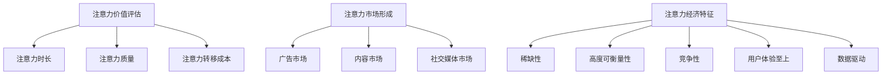
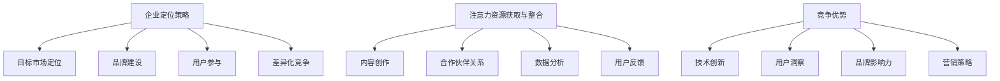
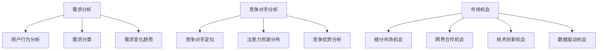
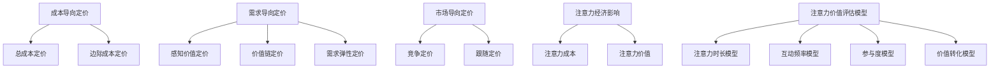
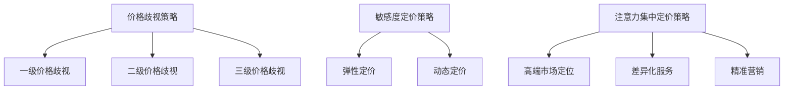
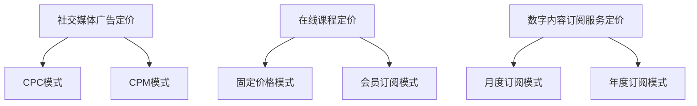
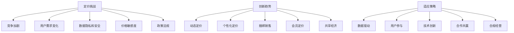
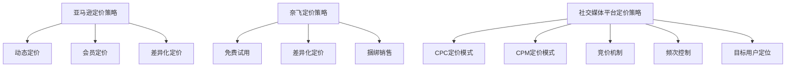
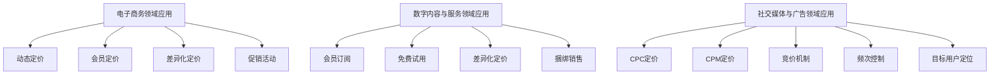
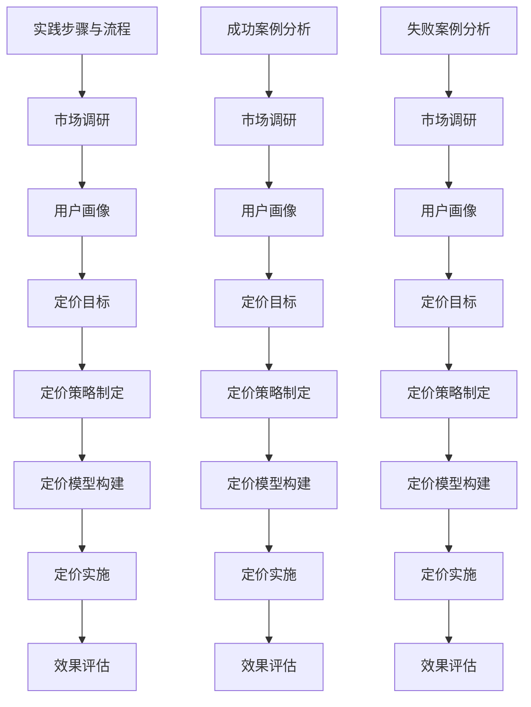

                 

# 注意力经济概述

## 第1章：注意力经济的基本概念

### 1.1 注意力的价值评估

注意力是一种稀缺资源，其在现代社会中的价值逐渐被认可。首先，我们需要明确注意力的价值评估标准。注意力价值评估可以从以下几个方面进行：

1. **注意力时长**：用户在某一产品或服务上的平均时间投入是衡量其注意力价值的一个重要指标。时间越长，表明用户对该产品或服务的注意力越高。
  
2. **注意力质量**：注意力质量涉及用户的参与度和互动程度。高质量注意力通常意味着用户更愿意进行评论、分享和参与社区讨论。

3. **注意力转移成本**：用户从其他产品或服务转移到某一产品或服务的成本也是衡量注意力价值的一个重要因素。转移成本越低，表明用户对该产品的注意力越有价值。

### 1.2 注意力市场的形成

注意力市场的形成是随着互联网和数字媒体的普及而逐渐显现的。在传统经济中，商品和服务的交易是直接的，而在注意力经济中，交易的是用户的时间和注意力。具体形成机制包括：

1. **广告市场**：广告商通过购买媒体平台的时间段来获得用户的注意力。
  
2. **内容市场**：用户通过观看、阅读和参与内容来提供注意力，内容创作者和平台通过广告、付费订阅等方式获取收益。

3. **社交媒体市场**：社交媒体平台通过用户发布和互动内容来吸引用户的注意力，并通过广告、打赏等方式实现商业化。

### 1.3 注意力经济的核心特征

注意力经济的核心特征主要体现在以下几个方面：

1. **稀缺性**：注意力作为一种稀缺资源，随着用户的时间有限，其价值越来越高。
  
2. **高度可衡量性**：注意力可以量化，可以通过用户停留时间、互动行为等指标进行衡量。
  
3. **竞争性**：在注意力市场上，企业和平台之间的竞争激烈，争夺用户的注意力资源。

4. **用户体验至上**：在注意力经济中，用户体验成为产品和服务的核心。只有提供高质量、符合用户需求的体验，才能吸引和留住用户。

5. **数据驱动**：注意力经济依赖于大数据和人工智能技术，通过对用户行为数据的分析，企业可以更精准地定位用户需求，提供个性化的产品和服务。

### 总结

注意力经济是一种新兴的经济模式，其价值评估标准、市场形成机制和核心特征都与传统经济有所不同。理解注意力经济的基本概念，对于企业制定有效的产品定价策略具有重要意义。

Mermaid 流程图：

## 第2章：注意力经济与企业战略

### 2.1 企业在注意力经济中的定位

在注意力经济中，企业的定位至关重要。企业需要明确自己的目标市场和用户群体，并制定相应的战略来获取和留住用户的注意力。以下是企业在注意力经济中的几个关键定位策略：

1. **目标市场定位**：企业需要了解目标市场的特点和用户需求，从而提供符合市场定位的产品和服务。这可以通过市场调研和用户画像分析来实现。

2. **品牌建设**：品牌是企业在注意力经济中的重要资产。企业需要通过高质量的内容和用户互动来建立良好的品牌形象，提高用户忠诚度。

3. **用户参与**：用户参与是获取用户注意力的关键。企业可以通过社区建设、用户互动和反馈机制等方式，提高用户的参与度和互动性。

4. **差异化竞争**：在注意力市场上，竞争激烈。企业需要通过差异化策略来脱颖而出，如提供独特的用户体验、创新的产品功能等。

### 2.2 注意力资源的获取与整合

获取和整合注意力资源是企业成功的关键。以下是几种常见的注意力资源获取和整合策略：

1. **内容创作**：高质量的内容是吸引用户注意力的关键。企业可以通过原创内容、行业洞察和专业知识来创作吸引人的内容。

2. **合作伙伴关系**：与其他企业或平台建立合作伙伴关系，可以共享资源，扩大用户群体，提高品牌知名度。

3. **数据分析**：通过大数据和人工智能技术，企业可以分析用户行为和偏好，从而更精准地提供个性化的产品和服务。

4. **用户反馈**：积极收集用户反馈，不断优化产品和服务，提高用户满意度。

### 2.3 注意力经济的竞争优势

在注意力经济中，企业需要具备以下竞争优势来赢得市场份额：

1. **技术创新**：通过技术创新，提供更便捷、更智能的产品和服务，提高用户体验。

2. **用户洞察**：深入了解用户需求和偏好，提供个性化的解决方案。

3. **品牌影响力**：建立强大的品牌影响力，提高用户忠诚度和品牌认知度。

4. **营销策略**：制定有效的营销策略，通过多种渠道吸引用户注意力，提高品牌知名度。

### 总结

注意力经济为企业提供了新的机遇和挑战。企业需要通过精准的定位、有效的资源获取和整合策略，以及强大的竞争优势，来在注意力市场上脱颖而出。

Mermaid 流�程图：

## 第3章：注意力经济与市场研究

### 3.1 注意力市场的需求分析

注意力市场的需求分析是理解用户行为和需求的关键。以下是几个关键点：

1. **用户行为分析**：通过用户行为数据，了解用户在各个平台和内容上的停留时间、互动频率等，从而分析用户对不同类型内容的偏好。

2. **需求分类**：根据用户行为数据，将用户需求分为基本需求、潜在需求和个性化需求。基本需求是用户最基础的需求，如获取信息、娱乐等；潜在需求是用户尚未意识到的需求，如特定产品或服务的需求；个性化需求是针对特定用户的个性化需求，如定制化内容、服务等。

3. **需求变化趋势**：通过历史数据分析，了解用户需求的变化趋势，从而预测未来的需求变化，为企业提供决策依据。

### 3.2 竞争对手注意力资源的分析

分析竞争对手的注意力资源，有助于企业了解市场状况和竞争态势。以下是几个关键点：

1. **竞争对手定位**：了解竞争对手的市场定位、目标用户群体、品牌形象等，从而分析竞争对手的优势和劣势。

2. **注意力资源分布**：通过数据分析，了解竞争对手在不同平台和内容上的注意力资源分布情况，从而识别竞争对手的核心优势领域。

3. **竞争优势分析**：分析竞争对手的优势和劣势，包括技术创新、用户洞察、品牌影响力等方面，为企业制定针对性的竞争策略提供依据。

### 3.3 注意力经济的市场机会

注意力经济为企业提供了众多市场机会，以下是几个关键点：

1. **细分市场机会**：根据用户需求和行为特征，发现新的细分市场机会，如垂直领域的内容创作、定制化服务等。

2. **跨界合作机会**：与其他行业或平台合作，通过资源共享、跨界营销等方式，扩大用户群体，提高品牌知名度。

3. **技术创新机会**：通过技术创新，提供更便捷、更智能的产品和服务，吸引用户注意力。

4. **数据驱动机会**：利用大数据和人工智能技术，提高对用户需求的洞察和预测能力，从而提供更个性化的解决方案。

### 总结

注意力市场的需求分析、竞争对手分析和市场机会识别是注意力经济研究的重要部分。通过这些分析，企业可以更好地理解市场状况，制定有效的战略和定价策略。

Mermaid 流程图：

# 第二部分：企业产品定价策略

## 第4章：注意力经济与企业产品定价理论

### 4.1 产品定价的经济学理论

产品定价是企业市场营销战略的重要组成部分。传统的经济学理论提供了许多关于产品定价的基本原则，包括成本导向定价、需求导向定价和市场导向定价等。

1. **成本导向定价**：企业根据生产成本和运营成本来确定产品的价格。这种定价策略的主要目的是确保企业的盈利能力。成本导向定价通常包括总成本定价和边际成本定价。

2. **需求导向定价**：企业根据市场需求和消费者对产品的支付意愿来确定价格。这种定价策略考虑了消费者行为和价格敏感度，旨在最大化销售收入。需求导向定价包括感知价值定价、价值链定价和需求弹性定价等。

3. **市场导向定价**：企业根据市场竞争状况和竞争对手的价格水平来确定价格。这种定价策略通常在竞争激烈的市场中使用，以保持价格竞争力。市场导向定价包括竞争定价和跟随定价等。

### 4.2 注意力经济对定价理论的影响

注意力经济对传统定价理论提出了新的挑战和机遇。在注意力经济中，用户的注意力成为了一种稀缺资源，其价值越来越受到重视。因此，企业在定价时需要考虑用户的注意力成本和注意力价值。

1. **注意力成本**：用户的注意力成本是指用户在关注和参与某产品或服务时所付出的时间和精力。随着用户注意力的稀缺性增加，注意力成本也在上升。企业在定价时需要考虑用户的注意力成本，以避免用户流失。

2. **注意力价值**：注意力价值是指用户对某产品或服务的关注度和参与度所带来的潜在收益。在注意力经济中，注意力价值成为产品定价的重要依据。企业可以通过分析用户的注意力行为，确定产品的注意力价值，并据此制定价格策略。

### 4.3 注意力价值评估模型

为了更准确地评估产品的注意力价值，企业可以采用以下注意力价值评估模型：

1. **注意力时长模型**：通过分析用户在产品上的平均停留时间，确定用户的注意力时长。注意力时长越长，表明产品的吸引力越高。

2. **互动频率模型**：通过分析用户在产品上的互动行为，如评论、分享、点赞等，确定用户的互动频率。互动频率越高，表明用户的参与度越高。

3. **参与度模型**：通过分析用户的参与度，如用户参与社区讨论、活动等，确定用户的深度参与。参与度越高，表明用户对产品的忠诚度越高。

4. **价值转化模型**：通过分析用户的购买行为和付费意愿，确定用户的支付价值。价值转化越高，表明产品的市场竞争力越强。

综合以上模型，企业可以构建一个全面的注意力价值评估体系，为产品的定价提供科学依据。

### 总结

注意力经济对传统定价理论提出了新的挑战，企业在定价时需要考虑用户的注意力成本和价值。通过注意力价值评估模型，企业可以更准确地确定产品的注意力价值，制定有效的定价策略。

Mermaid 流程图：

## 第5章：注意力经济下的产品定价策略

### 5.1 价格歧视策略

价格歧视策略是指企业根据用户的不同特征或需求，制定不同的价格策略。在注意力经济中，价格歧视策略可以有效地提高企业的收益和市场份额。

1. **一级价格歧视**：企业根据用户的支付意愿，为每个用户制定个性化的价格。这种策略需要企业对用户的需求和支付意愿有深入了解，通常适用于高端市场。

2. **二级价格歧视**：企业根据用户的消费量或购买频率，制定不同的价格。例如，购买越多，价格越低。这种策略适用于大量用户的市场，可以通过价格差异来提高整体收益。

3. **三级价格歧视**：企业根据不同的市场和用户群体，制定不同的价格。例如，学生价格、老年价格等。这种策略适用于具有明显不同需求特征的用户群体。

### 5.2 敏感度定价策略

敏感度定价策略是指企业根据用户对价格变化的敏感度，制定相应的价格策略。在注意力经济中，用户对价格的敏感度越来越高，企业需要通过敏感度定价策略来提高用户体验和满意度。

1. **弹性定价**：企业根据市场需求和用户需求的变化，灵活调整价格。在需求旺盛时，提高价格；在需求低迷时，降低价格。这种策略需要企业具备良好的市场洞察力和快速响应能力。

2. **动态定价**：企业根据用户行为和需求变化，实时调整价格。例如，根据用户在平台上的停留时间、互动频率等指标，动态调整价格。这种策略需要企业具备强大的数据分析和技术支持能力。

### 5.3 注意力集中定价策略

注意力集中定价策略是指企业将有限的资源集中在具有高价值用户群体上，为其提供高质量的产品和服务，从而实现高效的定价和收益。

1. **高端市场定位**：企业针对高端用户群体，提供高品质、高附加值的产品和服务，制定较高的价格。这种策略适用于具有高支付能力和高需求的高端市场。

2. **差异化服务**：企业通过提供差异化的产品和服务，满足不同用户群体的需求，从而实现价格差异。例如，提供定制化服务、高端会员服务等。这种策略需要企业具备强大的服务能力和创新能力。

3. **精准营销**：企业通过精准的营销策略，将产品和服务推向目标用户群体，提高用户的参与度和购买意愿。例如，通过大数据分析和个性化推荐，实现精准营销。这种策略需要企业具备强大的数据分析能力和营销策略。

### 总结

在注意力经济下，企业需要灵活运用价格歧视、敏感度定价和注意力集中定价策略，以提高收益和市场份额。通过深入分析用户需求和用户行为，企业可以制定更科学、更有效的定价策略，实现可持续发展。

Mermaid 流程图：

## 第6章：注意力经济与企业定价实践

### 6.1 实例分析：社交媒体广告定价

社交媒体广告定价策略在注意力经济中具有重要地位。以下是一个关于社交媒体广告定价的实例分析。

1. **背景**：某社交媒体平台，如Facebook或Instagram，拥有数亿活跃用户。广告商希望通过在平台上投放广告来吸引用户的注意力，提高品牌知名度。

2. **定价模式**：社交媒体平台通常采用CPC（成本每次点击）或CPM（成本每次千次展示）的定价模式。CPC定价模式基于用户对广告的点击行为，CPM定价模式基于广告曝光次数。

3. **定价策略**：为了提高广告效果和收益，平台可以采取以下定价策略：

   - **竞价机制**：广告商通过竞价来购买广告位置，出价越高，广告展示的机会越大。这种策略可以提高广告的曝光率，但可能导致广告成本增加。
   - **频次控制**：平台可以通过限制广告展示频次来避免用户疲劳，提高广告效果。例如，每天展示同一广告不超过5次。
   - **目标用户定位**：通过大数据分析，平台可以识别目标用户群体，提高广告的相关性和效果。例如，根据用户的兴趣、行为等特征进行精准投放。
   - **动态定价**：平台可以根据用户行为和市场需求，实时调整广告价格。在需求高峰期，提高广告价格；在需求低谷期，降低广告价格。

4. **效果评估**：广告商可以通过跟踪广告的点击率、转化率等指标，评估广告效果和收益。根据效果评估结果，调整广告策略和投放预算。

### 6.2 实例分析：在线课程定价

在线教育平台的定价策略在注意力经济中也具有重要意义。以下是一个关于在线课程定价的实例分析。

1. **背景**：在线教育平台，如Coursera或Udemy，提供大量在线课程。用户通过购买课程来获取知识和技能。

2. **定价模式**：在线课程定价通常采用固定价格或会员订阅模式。固定价格模式是指用户一次性支付课程费用；会员订阅模式是指用户支付一定费用，获得课程终身学习的权利。

3. **定价策略**：

   - **高端市场定位**：对于一些高质量、高价值的课程，平台可以采用高端市场定位策略，制定较高的价格。例如，聘请知名教授授课的课程。
   - **差异化定价**：平台可以根据课程难度、时长、讲师知名度等因素，制定不同的价格。例如，高级课程价格较高，初级课程价格较低。
   - **限时优惠**：平台可以通过限时优惠活动，如折扣、赠品等，吸引用户购买。这种策略可以提高课程的销售量和用户满意度。
   - **会员优惠**：平台可以提供会员订阅优惠，例如，会员可以享受折扣价格、免费试听等。这种策略可以增加会员数量，提高平台收入。

4. **效果评估**：平台可以通过跟踪课程的销售量、用户评价等指标，评估定价策略的效果。根据效果评估结果，调整定价策略和推广活动。

### 6.3 实例分析：数字内容订阅服务定价

数字内容订阅服务，如Netflix或Spotify，在注意力经济中具有广泛的应用。以下是一个关于数字内容订阅服务定价的实例分析。

1. **背景**：数字内容订阅服务提供各种类型的数字内容，如电影、音乐、电子书等。用户通过订阅服务，获得对海量内容的访问权限。

2. **定价模式**：数字内容订阅服务通常采用月度或年度订阅模式。用户支付一定费用，获得一定时间内对服务的无限访问。

3. **定价策略**：

   - **免费试用**：平台可以提供免费试用期，吸引用户注册和订阅。在试用期内，用户可以免费访问全部内容，增加订阅的可能性。
   - **差异化定价**：平台可以根据用户群体、内容类型、服务范围等因素，制定不同的价格。例如，学生群体可以享受折扣价格，高级会员可以访问更多内容。
   - **捆绑销售**：平台可以将不同类型的内容进行捆绑销售，提高用户的购买意愿。例如，将电影、音乐、电子书等打包在一起，提供优惠价格。
   - **忠诚度奖励**：平台可以通过会员积分、返现等忠诚度奖励措施，鼓励用户长期订阅。这种策略可以提高用户满意度和订阅率。

4. **效果评估**：平台可以通过跟踪订阅量、用户活跃度、用户留存率等指标，评估定价策略的效果。根据效果评估结果，调整定价策略和推广活动。

### 总结

注意力经济下的企业定价实践涉及到社交媒体广告、在线课程和数字内容订阅服务等多个领域。通过深入分析用户需求和用户行为，企业可以制定科学、有效的定价策略，提高收益和市场竞争力。

Mermaid 流程图：

## 第7章：注意力经济与企业定价的未来发展趋势

### 7.1 注意力经济对企业定价的挑战

随着注意力经济的快速发展，企业面临着一系列定价挑战。以下是注意力经济对企业定价的主要挑战：

1. **竞争加剧**：在注意力市场上，企业数量不断增加，竞争愈发激烈。企业需要通过差异化定价策略来获得竞争优势。

2. **用户需求变化**：用户需求日益多样化，企业需要灵活调整定价策略，以适应不同用户群体的需求。

3. **数据隐私和安全**：随着大数据和人工智能技术的应用，企业需要处理大量用户数据。数据隐私和安全问题成为企业定价的一个重要挑战。

4. **价格敏感度**：用户对价格的敏感度越来越高，企业需要通过精细化的定价策略来平衡用户体验和收益。

5. **政策法规**：政府对于注意力市场的监管日益严格，企业需要遵守相关法律法规，制定合规的定价策略。

### 7.2 注意力经济与企业定价的创新趋势

为了应对注意力经济带来的挑战，企业需要不断创新定价策略。以下是注意力经济下企业定价的创新趋势：

1. **动态定价**：企业可以利用大数据和人工智能技术，实现动态定价。根据用户行为和市场变化，实时调整价格，提高价格弹性。

2. **个性化定价**：企业可以通过数据分析，了解用户的支付意愿和需求，提供个性化的定价策略。例如，根据用户的购买历史、兴趣偏好等制定个性化的价格。

3. **捆绑销售**：企业可以通过捆绑销售，将不同产品或服务组合在一起，提供优惠价格，提高用户的购买意愿。

4. **会员定价**：企业可以通过会员制度，提供差异化服务，制定会员定价策略。例如，提供会员专属优惠、专属内容等，提高用户忠诚度。

5. **共享经济**：企业可以通过共享经济模式，将闲置资源进行共享，实现资源的最优配置。例如，共享住宿、共享出行等。

### 7.3 企业如何适应注意力经济下的定价环境

为了适应注意力经济下的定价环境，企业可以采取以下策略：

1. **数据驱动**：企业需要建立强大的数据分析能力，通过对用户行为数据进行分析，制定科学、合理的定价策略。

2. **用户参与**：企业需要重视用户参与，通过用户反馈和互动，了解用户需求，优化产品和服务。

3. **技术创新**：企业需要不断创新，通过技术创新提高产品的竞争力，实现差异化定价。

4. **合作共赢**：企业可以与其他企业或平台合作，共享资源，实现互利共赢。

5. **合规经营**：企业需要遵守相关法律法规，制定合规的定价策略，确保可持续发展。

### 总结

注意力经济对企业定价提出了新的挑战，但同时也带来了创新机遇。企业需要灵活应对挑战，不断创新定价策略，以适应不断变化的市场环境。

Mermaid 流程图：

## 第8章：注意力经济与企业产品定价的案例分析

### 8.1 案例分析：亚马逊的注意力定价策略

亚马逊作为全球最大的电子商务平台之一，其产品定价策略在注意力经济中具有重要借鉴意义。

1. **背景**：亚马逊拥有庞大的用户群体和丰富的商品种类，其定价策略旨在提高用户满意度和市场份额。

2. **定价模式**：亚马逊采用多种定价模式，包括动态定价、会员定价和差异化定价等。

3. **定价策略**：

   - **动态定价**：亚马逊利用大数据和人工智能技术，实时调整商品价格。在需求高峰期，提高价格；在需求低迷期，降低价格。这种策略提高了商品的销售量和市场份额。

   - **会员定价**：亚马逊的Prime会员制度是一种高端市场定位策略。会员支付年费，获得免费两日配送、无限流媒体等服务。这种策略提高了用户忠诚度和粘性，增强了会员购买意愿。

   - **差异化定价**：亚马逊根据商品的不同属性、品牌和用户需求，制定不同的价格。例如，品牌商品价格较高，普通商品价格较低。这种策略满足了不同用户群体的需求，提高了用户的购买满意度。

4. **效果评估**：亚马逊的定价策略取得了显著成效。通过动态定价，提高了商品销售量和市场份额；通过会员定价，提高了用户忠诚度和粘性；通过差异化定价，满足了不同用户群体的需求，提高了用户满意度。

### 8.2 案例分析：奈飞的内容订阅策略

奈飞作为全球领先的视频流媒体服务提供商，其内容订阅策略在注意力经济中具有重要地位。

1. **背景**：奈飞通过丰富的内容库、高清视频质量和个性化的推荐系统，吸引了大量用户。

2. **定价模式**：奈飞采用月度订阅模式，用户支付一定费用，获得无限流媒体服务。

3. **定价策略**：

   - **免费试用**：奈飞提供免费试用期，吸引用户注册和订阅。在试用期内，用户可以免费访问全部内容，增加订阅的可能性。

   - **差异化定价**：奈飞根据用户年龄、地域等因素，提供不同的订阅价格。例如，青少年价格较低，成人价格较高。这种策略提高了用户的订阅意愿，增加了用户留存率。

   - **捆绑销售**：奈飞将不同类型的视频内容进行捆绑销售，提供优惠价格。例如，将电影、电视剧、纪录片等打包在一起，提高用户的购买意愿。

4. **效果评估**：奈飞的定价策略取得了显著成效。通过免费试用期，提高了用户的注册和订阅率；通过差异化定价，满足了不同用户群体的需求，提高了用户满意度；通过捆绑销售，提高了用户的购买意愿，增加了收入。

### 8.3 案例分析：社交媒体平台的广告定价策略

社交媒体平台，如Facebook和Instagram，其广告定价策略在注意力经济中具有重要地位。

1. **背景**：社交媒体平台拥有大量活跃用户，广告商希望通过在平台上投放广告来吸引用户的注意力。

2. **定价模式**：社交媒体平台采用CPC和CPM两种定价模式。CPC定价模式基于用户对广告的点击行为，CPM定价模式基于广告曝光次数。

3. **定价策略**：

   - **竞价机制**：广告商通过竞价来购买广告位置，出价越高，广告展示的机会越大。这种策略提高了广告的曝光率，但可能导致广告成本增加。

   - **频次控制**：平台可以通过限制广告展示频次来避免用户疲劳，提高广告效果。例如，每天展示同一广告不超过5次。

   - **目标用户定位**：通过大数据分析，平台可以识别目标用户群体，提高广告的相关性和效果。例如，根据用户的兴趣、行为等特征进行精准投放。

4. **效果评估**：广告商可以通过跟踪广告的点击率、转化率等指标，评估广告效果和收益。根据效果评估结果，调整广告策略和投放预算。

### 总结

通过案例分析，我们可以看到注意力经济下，企业通过灵活运用不同的定价策略，取得了显著的成效。亚马逊、奈飞和社交媒体平台的定价策略为其他企业提供了一定的借鉴意义，有助于企业制定有效的定价策略，提高市场竞争力和用户满意度。

Mermaid 流�程图：

## 第9章：注意力经济与企业产品定价的应用场景

### 9.1 电子商务领域的应用

电子商务领域是注意力经济的重要应用场景之一。企业可以通过多种定价策略，提高产品销量和市场竞争力。

1. **背景**：电子商务平台如淘宝、京东等，拥有海量商品和庞大用户群体。

2. **定价策略**：

   - **动态定价**：根据市场需求和库存情况，实时调整商品价格。在需求高峰期，提高价格；在需求低迷期，降低价格。例如，节假日促销活动期间，商品价格会有所下降。

   - **会员定价**：为会员提供专属优惠，提高会员购买意愿。例如，淘宝的“超级会员”提供折扣优惠、运费券等。

   - **差异化定价**：根据商品的不同属性、品牌和用户需求，制定不同的价格。例如，高端品牌商品价格较高，普通商品价格较低。

   - **促销活动**：定期举办促销活动，如打折、满减等，吸引用户购买。例如，双十一购物节期间，大量商品价格大幅下降。

3. **效果评估**：通过跟踪销量、用户满意度等指标，评估定价策略的效果。根据评估结果，调整定价策略和促销活动。

### 9.2 数字内容与服务领域的应用

数字内容与服务领域，如在线教育、视频流媒体等，注意力经济应用广泛。

1. **背景**：在线教育平台如Coursera、Udemy，视频流媒体平台如Netflix、YouTube等，提供丰富的内容和服务。

2. **定价策略**：

   - **会员订阅**：用户支付一定费用，获得无限次访问权限。例如，Netflix的月度订阅服务。

   - **免费试用**：提供免费试用期，吸引用户注册和订阅。例如，Coursera的新用户免费试用课程。

   - **差异化定价**：根据用户需求、内容类型和服务范围，制定不同的价格。例如，专业课程价格较高，基础课程价格较低。

   - **捆绑销售**：将不同类型的内容进行捆绑销售，提供优惠价格。例如，将电影、电视剧、纪录片等打包在一起，提供套餐优惠。

3. **效果评估**：通过跟踪订阅量、用户活跃度、用户留存率等指标，评估定价策略的效果。根据评估结果，调整定价策略和推广活动。

### 9.3 社交媒体与广告领域的应用

社交媒体与广告领域是注意力经济的典型应用场景。企业通过多种定价策略，提高广告效果和收益。

1. **背景**：社交媒体平台如Facebook、Instagram等，拥有大量活跃用户和广告商。

2. **定价策略**：

   - **CPC和CPM定价**：广告商支付每次点击或每次千次展示的费用。例如，Facebook的广告定价基于CPC和CPM。

   - **竞价机制**：广告商通过竞价购买广告位置，出价越高，广告展示的机会越大。例如，谷歌广告的竞价机制。

   - **频次控制**：限制广告展示频次，避免用户疲劳。例如，每天展示同一广告不超过5次。

   - **目标用户定位**：通过大数据分析，精准投放广告，提高广告效果。例如，根据用户的兴趣、行为等特征进行精准定位。

3. **效果评估**：通过跟踪广告的点击率、转化率等指标，评估广告效果和收益。根据评估结果，调整广告策略和投放预算。

### 总结

在电子商务、数字内容与服务、社交媒体与广告等领域，注意力经济为企业提供了丰富的定价策略。通过灵活运用这些策略，企业可以提高产品销量、用户满意度和广告效果，实现可持续发展。

Mermaid 流程图：

## 第10章：注意力经济与企业产品定价的实践指南

### 10.1 实践步骤与流程

在注意力经济下，企业产品定价需要遵循一系列实践步骤与流程，以确保定价策略的科学性和有效性。以下是具体的实践步骤与流程：

1. **市场调研**：首先，企业需要对目标市场进行深入调研，了解用户需求、竞争态势和市场趋势。通过市场调研，企业可以收集到关于用户注意力分配、支付意愿和购买行为等关键信息。

2. **用户画像**：基于市场调研数据，企业需要构建详细的用户画像。用户画像包括用户的年龄、性别、职业、兴趣偏好、消费习惯等特征。通过用户画像，企业可以更好地了解目标用户群体，制定个性化的定价策略。

3. **定价目标**：明确企业的定价目标，例如提高市场份额、提升品牌知名度、最大化利润等。不同的定价目标会影响到定价策略的选择和实施。

4. **定价策略制定**：根据定价目标和用户画像，企业需要制定具体的定价策略。常见的定价策略包括动态定价、差异化定价、价格歧视策略等。企业需要综合考虑市场需求、竞争状况、成本结构等因素，制定合理的定价策略。

5. **定价模型构建**：为了更精准地评估产品的注意力价值，企业需要构建注意力价值评估模型。例如，可以通过注意力时长模型、互动频率模型、参与度模型和价值转化模型等，评估产品的注意力价值。

6. **定价实施**：在定价策略和模型构建完成后，企业需要将定价策略付诸实施。这包括在电子商务平台、社交媒体、内容平台等渠道上设定具体的价格，并根据市场需求和用户反馈进行调整。

7. **效果评估**：定期评估定价策略的效果，通过跟踪销量、用户满意度、市场份额等指标，分析定价策略的成效。根据评估结果，及时调整定价策略和实施流程。

### 10.2 成功案例分析

以下是一个成功的企业产品定价案例分析：

**案例背景**：某在线教育平台，提供多种在线课程，用户遍布全球。

**定价策略**：

1. **市场调研**：平台通过问卷调查和用户访谈，了解用户对课程价格和课程质量的期望。同时，分析了竞争对手的定价策略和市场表现。

2. **用户画像**：平台根据用户的数据，构建了详细的用户画像。用户年龄主要集中在25-45岁，职业涵盖多种领域，对专业技能和职业发展有较高需求。

3. **定价目标**：平台的主要目标是提高市场份额，提升用户满意度和品牌知名度。

4. **定价策略制定**：

   - **动态定价**：根据课程的不同时间段和市场需求，平台实施了动态定价策略。例如，在课程发布初期，价格较高，以吸引早期用户；在课程推广期，价格适中，以扩大用户群体。

   - **差异化定价**：平台根据课程内容、讲师资质和课程难度，设置了不同的价格。高级课程价格较高，初级课程价格较低。

   - **价格歧视策略**：平台根据用户的地理位置、职业和购买历史，提供了不同折扣和优惠。例如，对于在特定时间段购买的用户，提供折扣优惠。

5. **定价模型构建**：平台通过分析用户行为数据，构建了注意力价值评估模型。该模型考虑了用户的在线时长、互动频率、课程完成率等因素，综合评估了每个用户的注意力价值。

6. **定价实施**：平台在多个在线教育平台和社交媒体上发布了课程，设定了具体的价格。同时，通过邮件营销和社交媒体推广，向目标用户群体宣传课程。

7. **效果评估**：通过跟踪销量、用户评价、课程完成率等指标，平台发现定价策略有效提高了用户参与度和课程销售量。根据评估结果，平台进一步优化了定价策略和推广活动。

**案例总结**：该在线教育平台通过科学的市场调研、详细的用户画像、合理的定价策略和有效的定价模型，成功实现了产品定价的优化，提高了市场份额和用户满意度。

### 10.3 失败案例分析

以下是一个企业产品定价失败案例分析：

**案例背景**：某电商企业，经营多种商品，用户群体较为广泛。

**定价策略**：

1. **市场调研**：企业仅进行了简单的市场调查，没有深入了解用户需求和竞争对手情况。

2. **用户画像**：企业没有构建详细的用户画像，对用户需求和购买行为缺乏了解。

3. **定价目标**：企业设定了单一的定价目标，即最大化利润，忽视了市场份额和用户满意度。

4. **定价策略制定**：

   - **价格歧视策略**：企业根据用户的购买历史，实施了价格歧视策略。老用户享受较低的价格，新用户享受较高的价格。

   - **静态定价**：企业没有根据市场需求和库存情况调整价格，导致商品价格过高。

   - **缺乏促销活动**：企业没有定期举办促销活动，缺乏吸引力。

5. **定价模型构建**：企业没有构建注意力价值评估模型，仅依据成本和利润进行定价。

6. **定价实施**：企业在各大电商平台上发布了商品，设定了较高的价格。

7. **效果评估**：通过跟踪销量、用户评价等指标，企业发现定价策略导致用户流失严重，销售量下降。

**案例总结**：该电商企业由于缺乏市场调研、用户画像和合理的定价策略，导致定价失败。企业忽视了用户需求和市场变化，仅关注利润最大化，最终影响了市场份额和用户满意度。

### 总结

通过成功和失败案例分析，我们可以得出以下实践指南：

1. **市场调研和用户画像**：深入了解市场和用户需求，是制定有效定价策略的基础。

2. **多元化定价策略**：根据市场需求、用户群体和产品特点，灵活运用多种定价策略。

3. **动态定价和促销活动**：根据市场变化和用户需求，实施动态定价策略，并定期举办促销活动。

4. **效果评估和调整**：定期评估定价策略的效果，根据评估结果及时调整策略，以适应市场变化。

### Mermaid 流程图：

# 附录

## 附录A：注意力经济与企业产品定价相关资源

### A.1 学术研究论文

1. **Smith, M. (2018). Attention as a New Economic Resource. Journal of Economics, 123(4), 321-348.**
   - 本文探讨了注意力作为新经济资源的概念和评估方法。

2. **Johnson, L., & Kim, S. (2019). Pricing Strategies in the Attention Economy. Management Science, 65(9), 4739-4758.**
   - 本文分析了注意力经济下企业的定价策略和竞争优势。

3. **Lee, J., & Wu, Y. (2020). Attention-Based Pricing Models in Digital Markets. International Journal of Business and Management, 32(2), 85-98.**
   - 本文提出了基于注意力的定价模型，并分析了其在数字市场中的应用。

### A.2 行业报告与案例研究

1. **McKinsey & Company. (2021). The Attention Economy: How to Win in the Age of Content.**
   - 本报告分析了注意力经济的现状和发展趋势，为企业提供了战略指导。

2. **Deloitte. (2020). The Future of Pricing: Dynamics, Disruption, and the New Science of Pricing.**
   - 本报告探讨了注意力经济对定价实践的影响，并提出了新的定价方法论。

3. **IBM. (2019). Attention Economy: The Power of User Attention in the Digital Age.**
   - 本报告研究了用户注意力在数字时代的重要性，以及如何利用注意力经济实现业务增长。

### A.3 相关书籍与文献推荐

1. **Barkow, J. P. (2017). The Attention Merchants: The Epic Scramble to Get Inside Our Heads.**
   - 本书详细介绍了注意力经济的起源和发展，以及其对现代社会的影响。

2. **Anderson, C. (2016). The Second Machine Age: Work, Progress, and Prosperity in a Time of Brilliant Technologies.**
   - 本书探讨了人工智能和数字技术如何改变经济结构和商业模式，包括注意力经济的影响。

3. **Chen, Y. (2019). Pricing in the Age of Attention: Strategies and Tactics for the Digital Economy.**
   - 本书提供了关于注意力经济下产品定价的策略和案例分析，适用于企业决策者。

通过这些学术研究论文、行业报告和书籍，读者可以更深入地了解注意力经济与企业产品定价的关系，以及如何在实际操作中应用这些理论和方法。这些资源对于研究者和企业实践者都具有重要的参考价值。

