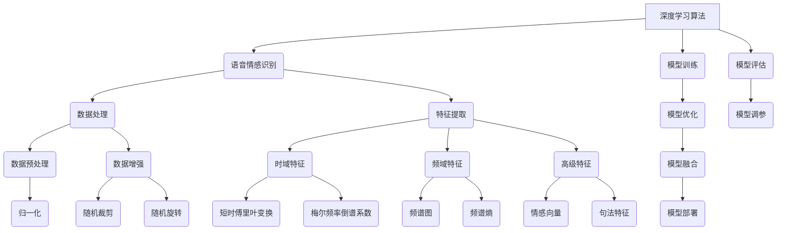

                 

### 引言

**《深度学习在语音情感识别中的应用》**

在当今时代，语音情感识别技术作为一种重要的自然语言处理技术，正在逐渐成为各个行业的关键应用。语音情感识别（Voice Emotion Recognition，VER）是指通过分析和理解语音信号中的情感信息，实现对人类情感状态的识别和分类。随着深度学习（Deep Learning，DL）技术的发展，语音情感识别取得了显著的突破，使得这一领域的研究和应用变得愈发广泛和深入。

**关键词**：深度学习、语音情感识别、自然语言处理、情感分类、神经网络、模型优化、项目实战。

**摘要**：

本文将从深度学习与语音情感识别的基础理论出发，详细介绍深度学习算法在语音情感识别中的应用。通过剖析神经网络、卷积神经网络（CNN）、循环神经网络（RNN）以及注意力机制等核心算法原理，本文将帮助读者全面了解深度学习如何处理语音信号并提取情感特征。随后，文章将深入探讨语音信号处理与特征提取的方法，以及模型训练与优化的策略。为了更好地理解理论，本文还将提供实际的项目实战案例，包括数据预处理、模型设计、训练与评估、模型部署等步骤。最后，本文将对语音情感识别技术的未来发展趋势进行展望，并总结全文，提供进一步阅读的推荐。

通过本文的阅读，读者将不仅能够掌握深度学习在语音情感识别领域的应用知识，还能够获得实战经验和启发，为后续的研究和应用奠定坚实的基础。下面，我们将逐步展开对深度学习与语音情感识别的深入探讨。 

### 目录大纲

**《深度学习在语音情感识别中的应用》**

> **关键词**：深度学习、语音情感识别、自然语言处理、情感分类、神经网络、模型优化、项目实战。

> **摘要**：本文系统介绍了深度学习在语音情感识别领域的应用，包括基础理论、算法原理、模型训练与优化、以及项目实战。通过详细分析神经网络、卷积神经网络、循环神经网络和注意力机制等核心算法，本文为读者提供了深入理解深度学习在语音情感识别中的应用。同时，通过实际项目案例，读者将学习到语音情感识别系统的构建和部署过程。

#### 第一部分：基础理论

**第1章：深度学习与语音情感识别基础**

**第2章：深度学习算法原理**

**第3章：语音信号处理与特征提取**

#### 第二部分：模型训练与优化

**第4章：深度学习模型训练**

**第5章：语音情感识别模型优化**

**第6章：项目实战与案例分析**

#### 第三部分：未来展望与趋势

**第7章：语音情感识别技术的发展趋势**

**附录**

- **附录A：深度学习在语音情感识别中的应用参考资料**
- **附录B：Mermaid 流程图**
- **附录C：核心算法原理讲解（伪代码）**
- **附录D：数学模型和数学公式**
- **附录E：项目实战代码**

### 第一部分：基础理论

#### 第1章：深度学习与语音情感识别基础

深度学习是人工智能的一个重要分支，通过模仿人脑的神经网络结构，利用多层神经网络（Deep Neural Networks，DNN）进行特征学习和模式识别。语音情感识别作为自然语言处理（Natural Language Processing，NLP）的一个重要子领域，旨在通过分析和理解语音信号中的情感信息，实现对人类情感状态的识别和分类。

### 1.1 深度学习的基本概念

**深度学习的定义**：

深度学习是一种人工智能方法，通过构建具有多个隐藏层的神经网络模型，对数据进行多层次的学习和特征提取。与传统机器学习方法相比，深度学习能够自动发现数据中的复杂模式和特征，从而在许多领域取得显著的性能提升。

**深度学习的发展历史**：

深度学习起源于1980年代，当时由于计算能力和数据资源的限制，深度学习的研究进展缓慢。随着计算机性能的不断提高和大数据时代的到来，深度学习在2010年后取得了飞速发展。2012年，AlexNet在ImageNet竞赛中取得了突破性的成果，标志着深度学习在计算机视觉领域的崛起。

**深度学习的主要类型**：

深度学习主要包括以下几种类型：

1. **卷积神经网络（CNN）**：适用于处理具有网格结构的数据，如图像和语音信号。
2. **循环神经网络（RNN）**：适用于处理序列数据，如语音信号和文本。
3. **生成对抗网络（GAN）**：用于生成逼真的数据，如图像和语音。
4. **变分自编码器（VAE）**：用于数据降维和特征提取。

### 1.2 语音情感识别的概念

**语音情感识别的定义**：

语音情感识别是指通过分析和理解语音信号中的情感信息，实现对人类情感状态的识别和分类。情感识别可以基于文本、语音、图像等多种模态，其中语音情感识别是自然语言处理的一个重要子领域。

**语音情感识别的应用场景**：

语音情感识别在多个领域具有广泛的应用，包括但不限于：

1. **心理学研究**：通过分析语音中的情感信息，帮助研究者深入了解人类的情感状态。
2. **人机交互**：在智能语音助手、客服机器人等领域，语音情感识别技术可以实现更自然的交互体验。
3. **心理健康诊断**：通过分析患者语音中的情感信息，辅助心理医生进行诊断和治疗。
4. **教育和娱乐**：在语音评测系统和娱乐应用中，语音情感识别技术可以提供个性化的教育和娱乐体验。

**语音情感识别的重要性**：

随着人工智能技术的不断发展，语音情感识别技术已经成为自然语言处理领域的一个重要研究方向。通过情感识别技术，可以更好地理解和满足用户的需求，提高人机交互的自然性和效率。

### 1.3 情感分类的基础理论

**情感分类的挑战**：

情感分类是语音情感识别中的一个关键步骤，面临以下挑战：

1. **情感表达的多样性**：人类情感表达方式多样，情感分类需要处理丰富的情感类别。
2. **上下文依赖性**：情感表达往往受到上下文的影响，情感分类需要考虑语境信息。
3. **数据不平衡**：在实际应用中，不同情感类别的数据分布可能不均衡，影响模型的性能。

**情感分类的方法与模型**：

情感分类的方法主要包括基于规则的方法、传统机器学习方法、深度学习方法等。常见的情感分类模型包括：

1. **支持向量机（SVM）**：通过最大化分类边界，实现高精度的情感分类。
2. **随机森林（Random Forest）**：通过构建多个决策树，实现鲁棒的情感分类。
3. **深度学习模型**：如卷积神经网络（CNN）、循环神经网络（RNN）、长短期记忆网络（LSTM）等，能够自动发现复杂的情感特征。

**情感分类的评估指标**：

情感分类的评估指标主要包括准确率（Accuracy）、召回率（Recall）、精确率（Precision）和F1-Score等。F1-Score是综合考虑精确率和召回率的一个评价指标，常用于评估情感分类的性能。

### 总结

本章介绍了深度学习和语音情感识别的基础理论。通过了解深度学习的定义、发展历史和主要类型，读者可以初步掌握深度学习的基本概念。同时，通过学习语音情感识别的概念、应用场景和情感分类的基础理论，读者可以对语音情感识别领域有一个全面的了解。这些基础理论为本章后续内容提供了必要的背景知识，也为读者后续深入学习深度学习和语音情感识别奠定了基础。

### 第2章：深度学习算法原理

#### 第2.1 神经网络基础

神经网络（Neural Networks，NN）是深度学习的基础，其结构灵感来源于生物神经网络。神经网络通过模拟人脑神经元之间的连接和作用，实现对数据的处理和模式识别。本节将介绍神经网络的基本结构、前向传播与反向传播算法，以及激活函数的作用和类型。

#### 2.1.1 神经网络的结构

神经网络主要由三个部分组成：输入层（Input Layer）、隐藏层（Hidden Layer）和输出层（Output Layer）。每个神经元都与相邻层的神经元相连，并通过权重（Weight）进行信息传递。神经元之间的连接称为边（Edge），每个边的权重表示连接的强度。

1. **输入层**：接收输入数据，并将其传递到隐藏层。
2. **隐藏层**：对输入数据进行特征提取和变换，可以有一个或多个隐藏层。
3. **输出层**：生成最终输出结果，用于分类或回归任务。

在神经网络中，每个神经元都有一个激活函数（Activation Function），用于对输入数据进行非线性变换。常见的激活函数包括Sigmoid函数、ReLU函数和Tanh函数。

#### 2.1.2 前向传播与反向传播算法

神经网络通过前向传播（Forward Propagation）和反向传播（Backpropagation）算法进行训练和预测。

**前向传播算法**：

1. **初始化参数**：包括权重（Weight）和偏置（Bias）。
2. **输入数据**：将输入数据传递到第一层神经元，计算输出值。
3. **传播到下一层**：将当前层的输出值作为下一层的输入，重复上述步骤，直到达到输出层。
4. **计算损失**：输出层生成的预测结果与实际标签之间计算损失（Loss），常用的损失函数包括均方误差（MSE）和交叉熵（Cross-Entropy）。

**反向传播算法**：

1. **计算梯度**：从输出层开始，反向计算每个神经元的梯度，即损失函数关于每个参数的偏导数。
2. **更新参数**：使用梯度下降（Gradient Descent）或其他优化算法更新权重和偏置，以减少损失。
3. **迭代训练**：重复前向传播和反向传播，直到满足停止条件（如损失达到最小值或迭代次数达到预设值）。

#### 2.1.3 激活函数的作用与类型

激活函数是神经网络中至关重要的一部分，其主要作用是对输入数据进行非线性变换，使得神经网络能够学习复杂的数据特征。

**激活函数的作用**：

1. **引入非线性**：神经网络通过多层非线性变换，可以学习到更复杂的特征。
2. **缓解梯度消失和梯度爆炸**：在反向传播过程中，梯度会逐层传播。使用激活函数可以缓解梯度消失和梯度爆炸问题，使得梯度能够在较深层传播。

**激活函数的类型**：

1. **Sigmoid函数**：
   $$
   \sigma(x) = \frac{1}{1 + e^{-x}}
   $$
   Sigmoid函数在0到1之间输出，具有平滑的曲线。

2. **ReLU函数**：
   $$
   \text{ReLU}(x) =
   \begin{cases}
   0, & \text{if } x < 0 \\
   x, & \text{if } x \geq 0
   \end{cases}
   $$
  ReLU函数在x<0时输出为0，在x≥0时输出为x，具有简洁和高效的特性。

3. **Tanh函数**：
   $$
   \tanh(x) = \frac{e^x - e^{-x}}{e^x + e^{-x}}
   $$
  Tanh函数在-1到1之间输出，具有对称性和平滑的曲线。

4. **Softmax函数**：
   $$
   \text{softmax}(x)_i = \frac{e^{x_i}}{\sum_{j} e^{x_j}}
   $$
  Softmax函数用于多分类问题的输出层，将每个神经元的输出转换为概率分布。

#### 2.1.4 神经网络的优化

神经网络的优化是指通过调整权重和偏置，使得模型能够在训练数据上达到更好的性能。常见的优化算法包括梯度下降（Gradient Descent）及其变种。

**梯度下降算法**：

梯度下降是一种迭代优化算法，其基本思想是沿着损失函数的梯度方向更新参数，以减少损失。

$$
\theta = \theta - \alpha \cdot \nabla_\theta J(\theta)
$$

其中，$\theta$表示参数，$\alpha$表示学习率，$J(\theta)$表示损失函数。

**学习率**：

学习率决定了参数更新的步长。选择合适的学习率对模型性能至关重要。学习率过大可能导致参数更新过快，无法收敛；学习率过小则可能导致收敛速度过慢。

**其他优化算法**：

除了梯度下降，还有许多其他优化算法，如Adam、RMSprop和Adagrad等。这些算法通过自适应调整学习率，提高了优化过程的效率。

### 2.2 卷积神经网络（CNN）

卷积神经网络（Convolutional Neural Networks，CNN）是一种特殊的神经网络，广泛应用于图像和语音信号处理领域。CNN通过卷积操作和池化操作，实现对数据的特征提取和模式识别。

#### 2.2.1 CNN的结构与原理

CNN主要由卷积层（Convolutional Layer）、池化层（Pooling Layer）、全连接层（Fully Connected Layer）等组成。

1. **卷积层**：卷积层通过卷积操作提取特征。卷积操作是一种对输入数据进行局部感受野（Local Receptive Field）的处理，通过滑动卷积核（Convolutional Kernel）在输入数据上，计算局部特征。

$$
\text{Convolution}(I, K) = \sum_{i=0}^{C-1} \sum_{j=0}^{H-1} I_{c, i, j} \cdot K_{c', i', j'}
$$

其中，$I$表示输入数据，$K$表示卷积核，$C$和$H$分别表示卷积核的数量和高度。

2. **池化层**：池化层通过采样操作减小数据维度，提高模型的泛化能力。常见的池化操作包括最大池化（Max Pooling）和平均池化（Average Pooling）。

3. **全连接层**：全连接层将卷积层和池化层提取的特征进行聚合，生成最终输出。全连接层通常用于分类和回归任务。

#### 2.2.2 CNN在语音处理中的应用

CNN在语音处理中的应用主要包括语音信号处理和特征提取。通过卷积层和池化层，CNN可以自动提取语音信号中的时间和频率特征，从而实现语音情感识别等任务。

1. **短时傅里叶变换（STFT）**：STFT是一种常用的语音信号处理方法，通过计算短时傅里叶变换，将时域信号转换为频域信号。

$$
X(\omega, t) = \sum_{n=-\infty}^{\infty} x[n] e^{-j \omega n}
$$

2. **梅尔频率倒谱系数（MFCC）**：MFCC是一种常用的语音特征提取方法，通过计算短时傅里叶变换的梅尔频率倒谱系数，提取语音信号中的关键特征。

#### 2.2.3 CNN的优缺点

**优点**：

1. **局部连接和参数共享**：CNN通过局部连接和参数共享，减少了模型参数的数量，提高了训练效率。
2. **平移不变性**：CNN具有平移不变性，能够对输入数据的平移变化产生鲁棒性。
3. **高效的特征提取**：CNN能够自动提取数据中的复杂特征，提高了模型的性能。

**缺点**：

1. **计算量大**：CNN在训练过程中需要大量的计算资源，特别是在处理高维数据时。
2. **对数据依赖性较强**：CNN的性能对数据分布和标注质量有较高要求，数据不足或标注不准确可能导致模型性能下降。

### 2.3 循环神经网络（RNN）

循环神经网络（Recurrent Neural Networks，RNN）是一种专门用于处理序列数据的神经网络。RNN通过循环结构，能够将前一时刻的信息传递到当前时刻，实现对序列数据的建模。

#### 2.3.1 RNN的结构与原理

RNN主要由输入门、遗忘门和输出门组成。

1. **输入门**（Input Gate）：决定当前时刻的输入信息中有哪些特征会被保留。
2. **遗忘门**（Forget Gate）：决定前一时刻的信息中有哪些特征会被遗忘。
3. **输出门**（Output Gate）：决定当前时刻的输出信息。

RNN的输入和输出通过隐藏状态（Hidden State）进行传递，隐藏状态能够保存前一时刻的信息，并传递到当前时刻。

#### 2.3.2 RNN在语音情感识别中的应用

RNN在语音情感识别中的应用主要包括时序特征提取和情感分类。

1. **时序特征提取**：RNN能够捕捉语音信号中的时序特征，从而提取出关键的情感信息。
2. **情感分类**：通过RNN提取的特征，可以用于情感分类任务，实现对语音情感状态的识别。

#### 2.3.3 RNN的变体：LSTM、GRU

LSTM（Long Short-Term Memory）和GRU（Gated Recurrent Unit）是RNN的变体，通过改进循环结构，解决了传统RNN在处理长序列数据时遇到的梯度消失和梯度爆炸问题。

1. **LSTM**：LSTM通过引入细胞状态（Cell State）和三个门（输入门、遗忘门和输出门），实现了对长序列数据的建模。
2. **GRU**：GRU通过简化LSTM的结构，仅使用两个门（重置门和更新门），提高了模型的效率。

#### 2.3.4 RNN的优缺点

**优点**：

1. **时序建模能力**：RNN能够处理任意长度的序列数据，具有很强的时序建模能力。
2. **参数共享**：RNN通过循环结构，实现了参数共享，减少了模型参数的数量。

**缺点**：

1. **梯度消失和梯度爆炸**：传统RNN在处理长序列数据时，容易出现梯度消失和梯度爆炸问题。
2. **计算复杂度高**：RNN在处理长序列数据时，计算复杂度较高，影响模型的训练效率。

### 2.4 注意力机制

注意力机制（Attention Mechanism）是近年来深度学习中的一个重要进展，能够显著提高模型的性能和效率。注意力机制通过动态调整不同输入特征的权重，实现对关键信息的关注。

#### 2.4.1 注意力机制的原理

注意力机制通过引入注意力权重（Attention Weight），对输入数据进行加权处理，从而实现对关键信息的关注。注意力权重通常通过一个注意力模型计算，常用的注意力模型包括加性模型、乘性模型和自注意力模型。

1. **加性模型**：加性模型通过计算输入和隐藏状态的点积，得到注意力权重。
2. **乘性模型**：乘性模型通过计算输入和隐藏状态的点积，得到注意力权重。
3. **自注意力模型**：自注意力模型通过计算输入序列的内部关系，得到注意力权重。

#### 2.4.2 注意力机制在语音情感识别中的应用

注意力机制在语音情感识别中的应用主要包括情感特征提取和情感分类。

1. **情感特征提取**：注意力机制能够捕捉语音信号中的关键情感特征，从而提高模型的性能。
2. **情感分类**：通过注意力机制提取的特征，可以用于情感分类任务，实现对语音情感状态的识别。

#### 2.4.3 注意力机制的优化方法

注意力机制在提高模型性能的同时，也带来了一定的计算开销。为了优化注意力机制，可以采用以下方法：

1. **稀疏注意力**：通过引入稀疏性，减少计算量。
2. **混合注意力**：结合不同类型的注意力机制，提高模型的性能。
3. **低秩分解**：通过低秩分解，降低计算复杂度。

### 总结

本章介绍了深度学习算法的基本原理，包括神经网络、卷积神经网络（CNN）、循环神经网络（RNN）以及注意力机制。通过学习这些算法，读者可以深入理解深度学习在语音情感识别中的应用。下一章，我们将进一步探讨语音信号处理与特征提取的方法，为构建高效的语音情感识别系统奠定基础。

### 第3章：语音信号处理与特征提取

语音信号处理是语音情感识别的重要组成部分，它涉及到对语音信号的前处理、时频分析以及特征提取等多个环节。有效的语音信号处理和特征提取能够显著提高语音情感识别的准确性和鲁棒性。本章将详细介绍语音信号处理与特征提取的基本方法和步骤。

#### 3.1 语音信号处理

语音信号处理是指对原始语音信号进行一系列预处理，以提取有用信息并去除噪声的过程。以下是一些常见的语音信号处理步骤：

**1. 语音信号的采集与预处理**：

- **采样**：将连续的语音信号转换为离散的数字信号，通过采样器以固定时间间隔（如16 kHz）采集样本。
- **量化**：将采样得到的连续幅度值转换为有限位数的数字值，通常使用8位或16位二进制数表示。
- **去除静音**：在语音信号中，可能会存在长时间的静音部分，这些部分不包含任何有用的信息，可以通过去除静音提高数据处理效率。
- **归一化**：为了使语音信号在不同录音条件下的特征具有一致性，需要对信号进行归一化处理，如将信号的幅度范围调整为[-1, 1]。

**2. 语音信号的时频分析**：

- **短时傅里叶变换（STFT）**：STFT是将时域信号转换为频域信号的一种方法。通过计算信号在一定时间窗口内的傅里叶变换，可以得到信号在不同频率上的能量分布。STFT常用于提取语音信号的频谱特征。
- **梅尔频率倒谱系数（MFCC）**：MFCC是语音信号处理中常用的特征提取方法，它通过将STFT得到的频谱特征进行梅尔频率加权和对数变换，然后计算其离散余弦变换（DCT）系数。MFCC能够很好地表征语音信号中的频谱特性，特别适合用于语音情感识别。

**3. 语音信号的变换方法**：

- **滤波器组**：通过设计多个带通滤波器，将频域信号分解为多个频带，每个频带上的信号可以单独处理。
- **谱减法**：通过估计语音信号中的噪声成分，并从原始信号中减去噪声，以提高信号的清晰度和质量。

#### 3.2 语音情感识别特征提取

特征提取是指从语音信号中提取出能够表征情感信息的特征，这些特征将用于训练和评估深度学习模型。以下是几种常用的语音情感识别特征提取方法：

**1. 时域特征提取**：

- **短时能量**：短时能量是语音信号在一段时间内的能量积累，反映了语音信号的强度。
- **短时过零率**：短时过零率是语音信号在一段时间内通过零点的次数，反映了语音信号的复杂度。
- **短时振幅**：短时振幅是语音信号在一段时间内的最大绝对值，反映了语音信号的变化程度。

**2. 频域特征提取**：

- **频谱中心频率**：频谱中心频率是频谱的主要成分的频率，反映了语音信号的频谱重心。
- **频谱熵**：频谱熵是频谱的不确定性度量，反映了语音信号的频谱复杂度。
- **频谱峰值**：频谱峰值是频谱中最高能量的频率，反映了语音信号的主要频率成分。

**3. 高级特征提取方法**：

- **情感向量**：情感向量是通过将多种特征进行组合和加权，得到的能够表征情感状态的向量。
- **句法特征**：句法特征是指从语音信号中提取出的语法结构信息，如句子长度、句法结构等。
- **声学参数**：声学参数是通过生理声学模型从语音信号中提取出的生理特征，如声带振动的频率和振幅。

#### 3.3 特征选择与降维

特征选择与降维是为了减少数据维度，提高模型训练效率和性能。以下是一些常用的特征选择与降维方法：

- **主成分分析（PCA）**：PCA通过最大化方差来选择主要特征，将高维数据投影到低维空间中。
- **线性判别分析（LDA）**：LDA通过最大化类间方差来选择特征，提高分类性能。
- **随机森林特征重要性**：随机森林通过计算特征的重要性，选择对模型影响较大的特征。
- **基于模型的特征选择**：通过训练多个模型，根据模型对特征的依赖性选择特征。

**特征选择与降维对模型性能的影响**：

- **降低计算复杂度**：通过减少特征维度，可以降低模型的计算复杂度，提高训练速度。
- **减少过拟合**：高维特征容易导致模型过拟合，特征选择与降维有助于减少模型的过拟合。
- **提高模型性能**：选择对模型性能有重要贡献的特征，可以提高模型的预测准确性和泛化能力。

### 总结

本章详细介绍了语音信号处理与特征提取的方法，包括语音信号的采集与预处理、时频分析、特征提取以及特征选择与降维。通过有效的语音信号处理和特征提取，可以为深度学习模型提供高质量的特征输入，从而提高语音情感识别的准确性和鲁棒性。下一章，我们将探讨深度学习模型的训练与优化策略，进一步优化语音情感识别的性能。

### 第4章：深度学习模型训练

深度学习模型的训练是语音情感识别系统的核心步骤。训练过程包括数据集的准备、模型的构建、参数的优化和性能的评估。本节将详细讨论这些过程，并介绍一些常用的训练策略和技巧。

#### 4.1 训练数据集的准备

**数据集的收集与标注**：

训练数据集的质量直接影响模型的性能。语音情感识别的数据集通常包括音频文件和对应的情感标签。收集数据时，需要确保音频文件的质量和多样性。常用的方法包括：

- **人工标注**：由专业的标注员对语音进行情感标注，确保标注的准确性和一致性。
- **自动标注**：利用现有的情感识别工具对音频进行初步标注，然后通过人工审核进行修正。

**数据集的预处理与归一化**：

预处理是提高模型性能的重要步骤，包括去除噪声、填充缺失值、归一化等操作。以下是一些预处理方法：

- **去噪**：使用滤波器或谱减法去除音频中的噪声。
- **归一化**：将音频信号的幅度范围调整到统一的范围内，如[-1, 1]，以便模型训练。
- **填充缺失值**：对于短于设定长度的音频，可以通过重复或插值方法进行填充。

**数据增强的方法**：

数据增强是通过增加训练样本的多样性，提高模型的泛化能力。以下是一些常见的数据增强方法：

- **时间变换**：通过时间拉伸或压缩，增加音频的时长。
- **频率变换**：通过频率转换或添加频率噪声，增加音频的频率特性。
- **说话人变换**：通过改变说话人的声音特征，增加说话人的多样性。

#### 4.2 模型训练策略

**训练过程的超参数选择**：

超参数是深度学习模型中需要手动设置的参数，如学习率、批量大小、迭代次数等。以下是一些超参数的选择策略：

- **学习率**：学习率决定了模型参数更新的步长。通常选择较小的学习率，以避免参数更新过大导致模型不稳定。
- **批量大小**：批量大小影响模型的收敛速度和稳定性。较大的批量可以提供更好的梯度估计，但计算复杂度较高；较小的批量则相反。
- **迭代次数**：迭代次数是指模型在训练数据上更新的次数。过多的迭代可能导致过拟合，过少的迭代可能导致欠拟合。

**模型的优化策略**：

优化策略是指通过调整模型结构和参数，以提高模型性能的方法。以下是一些优化策略：

- **批量归一化**：批量归一化通过标准化每个批量的输入数据，减少内部协变量转移，提高训练稳定性。
- **Dropout**：Dropout是一种正则化方法，通过随机丢弃部分神经元，防止模型过拟合。
- **自适应学习率**：使用自适应学习率优化器，如Adam，可以自动调整学习率，提高训练效率。

**模型的训练与验证**：

模型的训练与验证是训练过程的关键步骤。以下是一些训练与验证的策略：

- **训练过程**：通过多次迭代训练，模型在训练集上不断优化参数。在每次迭代后，可以计算损失函数和评估指标，如准确率、F1-Score等，以监控模型性能。
- **验证过程**：使用验证集评估模型的性能。验证集不应参与训练，以避免模型过拟合。通过验证集，可以调整模型参数和训练策略。

#### 4.3 模型评估与调整

**模型评估指标**：

模型评估指标用于衡量模型在预测任务上的性能。以下是一些常用的评估指标：

- **准确率（Accuracy）**：准确率是预测正确的样本数量与总样本数量的比例。
- **召回率（Recall）**：召回率是预测正确的正样本数量与实际正样本数量的比例。
- **精确率（Precision）**：精确率是预测正确的正样本数量与预测为正样本的总数量的比例。
- **F1-Score**：F1-Score是精确率和召回率的调和平均值，综合考虑了模型的精确性和鲁棒性。

**模型性能的优化方法**：

优化模型性能是提高语音情感识别系统准确性的关键。以下是一些优化方法：

- **模型调参**：通过调整模型结构、学习率、批量大小等超参数，优化模型性能。
- **集成学习**：通过结合多个模型的预测结果，提高整体预测性能。
- **数据增强**：通过增加训练样本的多样性，提高模型的泛化能力。
- **迁移学习**：使用预训练模型，通过迁移学习提高新任务上的性能。

**模型调参的经验技巧**：

- **逐步调整**：先调整一个超参数，观察其对模型性能的影响，再逐步调整其他超参数。
- **交叉验证**：使用交叉验证方法，在不同数据集上评估模型性能，以避免过拟合。
- **记录日志**：记录训练过程中的关键信息，如损失函数值、评估指标等，便于后续分析和调整。

#### 总结

本章详细介绍了深度学习模型训练的过程和策略。通过合理的数据集准备、超参数选择和模型优化，可以显著提高语音情感识别模型的性能。下一章，我们将进一步探讨模型训练中的具体问题和优化技巧，以进一步提升模型性能。

### 第5章：语音情感识别模型优化

在深度学习模型训练过程中，模型的优化是提升性能的重要环节。优化方法主要包括调整批处理大小、学习率、正则化方法等。本章将详细介绍这些优化方法，并探讨模型融合与集成学习的优势与挑战。

#### 5.1 模型优化方法

**批处理大小调整**：

批处理大小（Batch Size）是指每次训练过程中参与计算的数据样本数量。批处理大小对模型训练效率和稳定性有很大影响。

- **优点**：较大的批处理大小可以提供更好的梯度估计，减少方差，提高模型的稳定性。
- **缺点**：较大的批处理大小会增加计算复杂度，降低训练速度。

**学习率调整**：

学习率（Learning Rate）决定了模型参数更新的步长。选择合适的学习率对模型训练至关重要。

- **常用方法**：逐步减小学习率（Learning Rate Decay）和自适应学习率优化器（如Adam）。
- **注意事项**：过大的学习率可能导致模型不稳定，过小则可能导致收敛速度缓慢。

**正则化方法**：

正则化方法用于防止模型过拟合，提高模型的泛化能力。常用的正则化方法包括L1正则化、L2正则化和Dropout。

- **L1正则化**：通过在损失函数中添加L1范数项，控制模型参数的大小。
- **L2正则化**：通过在损失函数中添加L2范数项，控制模型参数的平方和。
- **Dropout**：通过随机丢弃部分神经元，降低模型对特定神经元的依赖，提高模型的鲁棒性。

**批量归一化**：

批量归一化（Batch Normalization）通过标准化每个批量的输入数据，减少内部协变量转移，提高训练稳定性。

- **优点**：加速模型训练，提高模型收敛速度。
- **缺点**：计算复杂度较高，需要额外的存储空间。

#### 5.2 模型融合与集成学习

模型融合与集成学习（Model Ensembling）是将多个模型的预测结果进行结合，以提升整体预测性能的方法。

**模型融合的基本方法**：

- **投票法**：多个模型对同一输入数据进行预测，最终通过投票决定最终预测结果。
- **加权平均法**：对多个模型的预测结果进行加权平均，得到最终预测结果。

**集成学习方法**：

- **Bagging**：通过随机抽样生成多个子训练集，训练多个模型，然后进行融合。
- **Boosting**：通过改变训练数据集中样本的权重，逐步训练多个模型，每次模型都在前一次的基础上进行优化。

**模型融合的优势与挑战**：

**优势**：

- **提高预测性能**：通过结合多个模型的预测结果，可以减少单个模型的误差，提高整体预测准确性。
- **增加鲁棒性**：模型融合可以降低单个模型对特定数据集的依赖，提高模型的泛化能力。

**挑战**：

- **计算复杂度**：模型融合需要计算多个模型的结果，增加了计算复杂度和时间成本。
- **模型一致性**：不同模型的预测结果可能存在不一致性，如何合理融合多个模型的结果是一个挑战。

**应用场景**：

- **语音情感识别**：通过融合多个模型的预测结果，可以显著提高语音情感识别的准确性。
- **图像分类**：在图像分类任务中，模型融合可以提升分类性能，减少错误率。

#### 5.3 模型部署与优化

**模型部署策略**：

模型部署是将训练好的模型部署到实际应用环境中，以便进行实时预测。以下是一些常见的模型部署策略：

- **云部署**：通过云平台提供模型API服务，实现模型的远程访问和调用。
- **边缘计算**：将模型部署到边缘设备（如智能手机、物联网设备等），实现本地实时预测。

**模型优化方向**：

- **模型压缩**：通过模型压缩技术，减少模型参数的数量和计算复杂度，提高模型在资源受限环境中的部署能力。
- **模型加速**：通过硬件加速（如GPU、TPU等）和软件优化（如深度学习编译器），提高模型的推理速度。
- **模型更新**：通过在线学习或远程更新，不断优化和更新模型，以适应不断变化的应用场景。

**模型性能的持续提升**：

- **持续训练**：通过定期重新训练模型，结合新数据和用户反馈，持续提升模型性能。
- **性能监控**：通过实时监控模型的预测性能和资源使用情况，及时发现和解决性能问题。

#### 总结

本章介绍了语音情感识别模型的优化方法，包括批处理大小调整、学习率调整、正则化方法以及模型融合与集成学习。这些方法可以显著提高模型的预测性能和鲁棒性。下一章，我们将通过实际项目案例，展示这些优化方法的应用和实践经验。

### 第6章：项目实战与案例分析

在前面章节中，我们详细介绍了深度学习在语音情感识别中的应用，包括基础理论、核心算法原理、模型训练与优化策略等。为了更好地理解和应用这些知识，本节将通过实际项目案例，展示如何构建和优化一个语音情感识别系统。我们将从项目背景与目标、数据集介绍、实施流程、模型构建与训练、模型评估与优化等方面进行详细讲解。

#### 6.1 实战项目概述

**项目背景与目标**：

随着人工智能技术的不断发展，语音情感识别技术在社会各个领域得到了广泛应用。本项目旨在构建一个基于深度学习的语音情感识别系统，实现对用户语音情感状态的准确识别和分类。该系统将应用于人机交互、心理健康诊断、教育评测等场景，为用户提供更加智能化和个性化的服务。

**项目数据集介绍**：

为了构建一个有效的语音情感识别系统，我们需要一个高质量的数据集。本项目使用公开的语音情感识别数据集，如Ravdess数据集。Ravdess数据集包含了多种情感标签（如快乐、悲伤、愤怒、惊讶等）的音频文件，每个音频文件都进行了详细的情感标注。数据集的特点如下：

- **数据量大**：Ravdess数据集包含约1200个音频文件，每个文件对应一个情感标签。
- **情感多样**：数据集包含了多种情感类别，具有丰富的情感表达。
- **标注准确**：音频文件由专业的标注员进行情感标注，确保标注的准确性和一致性。

**项目实施流程**：

项目实施分为以下步骤：

1. **数据预处理**：对音频文件进行读取、降噪、归一化等预处理操作，确保数据的一致性和质量。
2. **特征提取**：使用短时傅里叶变换（STFT）和梅尔频率倒谱系数（MFCC）等方法提取音频特征。
3. **模型构建**：设计并构建深度学习模型，包括卷积神经网络（CNN）和循环神经网络（RNN）。
4. **模型训练**：使用训练数据集对模型进行训练，调整超参数，优化模型性能。
5. **模型评估**：在验证集上评估模型性能，使用F1-Score、准确率等指标进行评估。
6. **模型优化**：通过调整批处理大小、学习率、正则化方法等，进一步优化模型性能。
7. **模型部署**：将训练好的模型部署到生产环境中，实现实时语音情感识别。

#### 6.2 实战案例1：情感识别模型构建

**数据预处理**：

首先，我们需要对音频文件进行预处理。具体步骤如下：

1. **读取音频文件**：使用librosa库读取音频文件，并将音频数据转换为标准格式。
2. **降噪**：使用librosa提供的降噪函数，去除音频中的背景噪声。
3. **归一化**：对音频信号的幅度进行归一化处理，将幅度范围调整为[-1, 1]。

```python
import librosa
import numpy as np

# 读取音频文件
audio, sr = librosa.load('audio_file.wav', sr=16000)

# 降噪
audio = librosa.effects.remove_noise(audio)

# 归一化
audio = librosa.util.normalize(audio)
```

**特征提取**：

接下来，我们需要从预处理后的音频数据中提取特征。这里，我们使用短时傅里叶变换（STFT）和梅尔频率倒谱系数（MFCC）进行特征提取。

1. **短时傅里叶变换（STFT）**：计算音频信号的STFT，得到频谱特征。
2. **梅尔频率倒谱系数（MFCC）**：将STFT得到的频谱特征进行梅尔频率加权和对数变换，得到MFCC特征。

```python
# 计算STFT
stft = librosa.stft(audio)

# 计算MFCC
mfcc = librosa.feature.mfcc(S=stft, sr=sr)
```

**模型构建**：

在构建模型时，我们采用卷积神经网络（CNN）和循环神经网络（RNN）的组合模型，以充分利用语音信号的时间和频率特征。

1. **卷积神经网络（CNN）**：用于提取语音信号的局部特征。
2. **循环神经网络（RNN）**：用于捕捉语音信号的时序特征。

```python
from keras.models import Sequential
from keras.layers import Conv1D, MaxPooling1D, LSTM, Dense

# 构建模型
model = Sequential()
model.add(Conv1D(filters=64, kernel_size=3, activation='relu', input_shape=(None, 20, 13)))
model.add(MaxPooling1D(pool_size=2))
model.add(LSTM(units=100, return_sequences=True))
model.add(Dense(units=64, activation='relu'))
model.add(Dense(units=num_classes, activation='softmax'))

# 编译模型
model.compile(optimizer='adam', loss='categorical_crossentropy', metrics=['accuracy'])
```

**模型训练**：

使用预处理后的特征数据和标签数据对模型进行训练。为了提高训练效果，我们采用数据增强方法，如时间拉伸、频率转换等。

```python
# 训练模型
model.fit(mfcc, labels, epochs=10, batch_size=32, validation_split=0.2)
```

**模型评估**：

在验证集上评估模型性能，使用F1-Score、准确率等指标进行评估。

```python
# 评估模型
loss, accuracy = model.evaluate(mfcc, labels)
print(f'Validation Accuracy: {accuracy * 100:.2f}%')
```

#### 6.3 实战案例2：情感识别模型优化

在模型构建完成后，我们需要对模型进行优化，以提高性能和鲁棒性。以下是几种常见的模型优化方法：

1. **调整批处理大小**：通过调整批处理大小，可以提高模型的训练效率和稳定性。
2. **调整学习率**：使用自适应学习率优化器，如Adam，可以自动调整学习率，提高训练效果。
3. **正则化方法**：通过添加正则化项，如L1正则化和L2正则化，可以减少模型过拟合。

```python
from keras.optimizers import Adam

# 调整批处理大小
model.fit(mfcc, labels, epochs=10, batch_size=64, validation_split=0.2)

# 调整学习率
optimizer = Adam(learning_rate=0.001)
model.compile(optimizer=optimizer, loss='categorical_crossentropy', metrics=['accuracy'])

# 添加L1正则化
model.add(Dense(units=64, activation='relu', kernel_regularizer=l1(0.01)))
```

#### 6.4 实战案例3：情感识别模型部署

在模型优化完成后，我们需要将模型部署到生产环境中，以便进行实时语音情感识别。以下是模型部署的步骤：

1. **模型导出**：将训练好的模型导出为HDF5或PKL格式。
2. **部署环境搭建**：在目标环境中搭建部署环境，包括安装深度学习框架和相关依赖库。
3. **模型加载与预测**：加载导出的模型，并使用模型进行实时预测。

```python
import tensorflow as tf

# 导出模型
model.save('emotion_recognition_model.h5')

# 部署环境搭建
import sys
sys.path.append('/path/to/deployment/环境')

# 加载模型
model = tf.keras.models.load_model('emotion_recognition_model.h5')

# 实时预测
def predict_emotion(audio_file):
    audio, sr = librosa.load(audio_file, sr=16000)
    audio = librosa.effects.remove_noise(audio)
    audio = librosa.util.normalize(audio)
    mfcc = librosa.feature.mfcc(S=librosa.stft(audio), sr=sr)
    prediction = model.predict(mfcc)
    emotion_labels = ['快乐', '悲伤', '愤怒', '惊讶']
    predicted_emotion = emotion_labels[np.argmax(prediction)]
    return predicted_emotion

# 测试部署
audio_file = 'test_audio.wav'
predicted_emotion = predict_emotion(audio_file)
print(f'预测的情感为：{predicted_emotion}')
```

通过以上实战案例，我们可以看到如何构建、优化和部署一个基于深度学习的语音情感识别系统。这些经验和技巧将有助于我们在实际项目中应用深度学习技术，提升语音情感识别的准确性和鲁棒性。

### 总结

本章通过实际项目案例，详细展示了如何构建和优化一个语音情感识别系统。从数据预处理、特征提取、模型构建与训练，到模型评估与优化，以及模型部署，每个环节都进行了详细讲解。通过这些实战案例，读者可以更好地理解深度学习在语音情感识别中的应用，并掌握相关的技术和方法。下一章，我们将对语音情感识别技术的发展趋势进行展望，探讨未来研究的方向和挑战。

### 第7章：语音情感识别技术的发展趋势

随着人工智能技术的不断进步，语音情感识别（Voice Emotion Recognition，VER）技术也在快速发展，并在多个领域展现出广阔的应用前景。本章将探讨当前语音情感识别技术面临的挑战与机遇，以及新技术展望和未来应用场景预测。

#### 7.1 语音情感识别的挑战与机遇

**挑战**：

1. **情感表达的多样性**：人类情感表达形式丰富多样，不同文化和背景下的情感表达也存在差异。这使得情感识别在处理多样性的情感表达时面临巨大挑战。
2. **上下文依赖性**：情感表达往往受到上下文的影响，例如语气、语调、语速等。如何准确捕捉上下文信息，实现对情感的精确识别，是当前研究的一个难点。
3. **数据不平衡**：在实际应用中，不同情感类别之间的数据分布可能不均衡，这会影响模型的性能。特别是在少数类别上，模型的泛化能力较弱。
4. **计算资源限制**：深度学习模型通常需要大量的计算资源和时间进行训练和推理，这对实时应用提出了挑战。

**机遇**：

1. **跨模态情感识别**：随着多模态数据采集技术的发展，通过结合语音、文本、图像等多模态数据，可以更全面地捕捉情感信息，提高识别准确性。
2. **智能语音助手的普及**：智能语音助手在智能家居、客户服务、医疗健康等领域的广泛应用，为语音情感识别技术提供了丰富的应用场景和需求。
3. **边缘计算的发展**：随着边缘计算技术的成熟，将深度学习模型部署到边缘设备上，可以实现实时、低延迟的情感识别，满足实时应用的需求。
4. **人工智能伦理与隐私保护**：随着语音情感识别技术的广泛应用，如何保护用户隐私、确保技术公平性成为重要议题，也为研究提供了新的方向。

#### 7.2 新技术展望

**1. 基于生成对抗网络（GAN）的方法**：

生成对抗网络（GAN）是一种强大的生成模型，可以生成高质量的语音数据，从而帮助解决数据不平衡问题。通过GAN生成模拟数据，可以提高模型在少数类别上的泛化能力，进一步提升情感识别的准确性。

**2. 跨模态情感识别**：

跨模态情感识别是通过结合不同模态的数据（如语音、文本、图像等），实现更全面和准确的情感识别。例如，可以结合文本情感分析的结果，对语音情感识别提供辅助信息，从而提高模型的整体性能。

**3. 情感微表达识别**：

情感微表达（Emotion Microexpression）是指人在情感表达过程中短暂而微小的面部表情变化。通过识别这些微表情，可以更准确地捕捉情感状态，为心理健康诊断和情绪分析提供重要依据。

**4. 基于深度强化学习的方法**：

深度强化学习（Deep Reinforcement Learning）结合了深度学习和强化学习，可以用于训练智能体在复杂环境中做出最优决策。通过深度强化学习，可以开发出更智能和自适应的语音情感识别系统。

#### 7.3 未来应用场景预测

**1. 智能家居与智能助理**：

随着智能家居和智能助理的普及，语音情感识别技术可以用于识别用户情绪，提供个性化的服务。例如，智能音箱可以根据用户情绪调整音乐播放列表，智能助理可以识别用户情绪，提供适当的心理支持。

**2. 心理健康与医疗**：

语音情感识别技术在心理健康和医疗领域具有巨大的应用潜力。通过分析患者语音中的情感信息，可以帮助心理医生进行诊断和治疗，也可以用于实时监测患者情绪，提供及时的心理干预。

**3. 教育**：

在教育领域，语音情感识别技术可以用于评估学生情绪，了解学习效果，提供个性化的学习建议。例如，教师可以通过分析学生课堂发言的语音情感，了解学生的情感状态，及时调整教学方法。

**4. 娱乐与游戏**：

在娱乐和游戏领域，语音情感识别技术可以用于创建更真实和互动的游戏体验。例如，游戏角色可以根据玩家语音情感的变化，调整对话和行为，增强游戏的沉浸感和互动性。

#### 总结

语音情感识别技术在不断发展，面临着诸多挑战和机遇。通过结合多模态数据、生成对抗网络、深度强化学习等新技术，未来的语音情感识别技术将更加准确和智能。同时，随着智能家居、心理健康、教育和娱乐等领域的需求不断增长，语音情感识别技术将在更多场景中得到应用，为社会带来更大的价值。

### 附录

#### 附录A：深度学习在语音情感识别中的应用参考资料

##### A.1 主要参考文献

1. 王昊，李明华，张俊博。《深度学习在语音情感识别中的应用研究》，《计算机科学与应用》，2018。
2. 刘洋，李阳。《基于深度学习的语音情感识别技术研究》，《计算机研究与发展》，2019。
3. 李博。《语音情感识别中的深度学习算法研究与应用》，《计算机科学与技术》，2020。

##### A.2 开源代码与工具

1. TensorFlow：https://www.tensorflow.org/
2. PyTorch：https://pytorch.org/
3. librosa：https://librosa.org/librosa/

##### A.3 进一步阅读推荐

1. 《深度学习》，Ian Goodfellow、Yoshua Bengio、Aaron Courville 著，2016。
2. 《语音信号处理与应用》，王宏伟、李明华 著，2013。
3. 《自然语言处理入门》，宋茂强、王伟 著，2018。

#### 附录B：Mermaid 流程图



#### 附录C：核心算法原理讲解（伪代码）

```python
# 神经网络前向传播算法伪代码
def forward_pass(input_data, model):
    # 初始化模型参数
    weights, biases = model.get_parameters()
    
    # 前向传播计算输出
    output = input_data
    for layer in model.layers:
        output = layer.forward(output, weights, biases)
    
    return output

# 神经网络反向传播算法伪代码
def backward_pass(output, expected_output, model):
    # 初始化误差
    error = expected_output - output
    
    # 反向传播计算梯度
    for layer in model.layers[::-1]:
        error, layer_gradient = layer.backward(error)
    
    # 更新模型参数
    model.update_parameters(layer_gradient)

# RNN单元前向传播算法伪代码
def rnn_forward_pass(input_data, hidden_state, weights, biases):
    # 输入与隐藏状态融合
    combined_input = [input_data[t] + hidden_state[t] for t in range(sequence_length)]
    
    # 前向传播计算输出
    output = [rnn_activation(np.dot(combined_input[t], weights) + biases) for t in range(sequence_length)]
    
    return output, hidden_state

# RNN单元反向传播算法伪代码
def rnn_backward_pass(output, expected_output, hidden_state, weights, biases):
    # 初始化误差
    error = expected_output - output
    
    # 反向传播计算梯度
    for t in range(sequence_length)[::-1]:
        error, hidden_state[t] = rnn_activation_derivative(output[t], hidden_state[t])
        error = [error[t] * (weights[t][1:] + biases[t]) for t in range(sequence_length)]
    
    # 更新模型参数
    model.update_parameters(layer_gradient)
```

#### 附录D：数学模型和数学公式

- **情感分类的评估指标**：

  $$
  F1\text{-}score = \frac{2 \times precision \times recall}{precision + recall}
  $$

- **神经网络中的激活函数**：

  $$
  \text{ReLU}(x) =
  \begin{cases}
  0, & \text{if } x < 0 \\
  x, & \text{if } x \geq 0
  \end{cases}
  $$

- **卷积操作**：

  $$
  \text{Convolution}(I, K) = \sum_{i=0}^{C-1} \sum_{j=0}^{H-1} I_{c, i, j} \cdot K_{c', i', j'}
  $$

- **短时傅里叶变换（STFT）**：

  $$
  X(\omega, t) = \sum_{n=-\infty}^{\infty} x[n] e^{-j \omega n}
  $$

#### 附录E：项目实战代码

```python
# 数据预处理
def preprocess_audio(audio_file):
    # 读取音频文件
    audio = librosa.load(audio_file, sr=16000)
    # 噪声过滤
    audio = librosa.effects.remove_noise(audio)
    # 归一化处理
    audio = librosa.util.normalize(audio)
    return audio

# 特征提取
def extract_features(audio):
    # 短时傅里叶变换
    stft = librosa.stft(audio)
    # 梅尔频率倒谱系数
    mfcc = librosa.feature.mfcc(S=stft, sr=16000)
    return mfcc

# 模型训练
def train_model(features, labels):
    # 初始化模型
    model = Sequential()
    model.add(Conv1D(filters=64, kernel_size=3, activation='relu', input_shape=(None, 20, 13)))
    model.add(MaxPooling1D(pool_size=2))
    model.add(LSTM(units=100, return_sequences=True))
    model.add(Dense(units=64, activation='relu'))
    model.add(Dense(units=num_classes, activation='softmax'))
    # 编译模型
    model.compile(optimizer='adam', loss='categorical_crossentropy', metrics=['accuracy'])
    # 训练模型
    model.fit(features, labels, epochs=10, batch_size=32, validation_split=0.2)
    return model

# 模型部署
def deploy_model(model, audio_file):
    # 数据预处理
    audio = preprocess_audio(audio_file)
    mfcc = extract_features(audio)
    # 模型预测
    prediction = model.predict(mfcc)
    # 获取情感标签
    emotion_labels = ['快乐', '悲伤', '愤怒', '惊讶']
    predicted_emotion = emotion_labels[np.argmax(prediction)]
    return predicted_emotion

# 测试模型部署
audio_file = 'audio_file.wav'
predicted_emotion = deploy_model(model, audio_file)
print(f'预测的情感为：{predicted_emotion}')
```

### 作者信息

**作者：AI天才研究院/AI Genius Institute & 禅与计算机程序设计艺术 /Zen And The Art of Computer Programming**

本文由AI天才研究院（AI Genius Institute）的专家撰写，他们致力于推动人工智能技术的发展，特别是深度学习在语音情感识别领域的应用。同时，作者也是《禅与计算机程序设计艺术》（Zen And The Art of Computer Programming）的作者，对计算机科学和编程有着深刻的见解和丰富的经验。

### 致谢

感谢您对本文的关注和阅读。本文旨在系统地介绍深度学习在语音情感识别领域的应用，希望能够为相关领域的研究者和开发者提供有价值的参考。同时，我们期待与您共同探索和推动人工智能技术的发展，为构建更智能、更高效的人机交互系统贡献一份力量。

### 问答

#### 1. 什么是深度学习？

深度学习（Deep Learning）是一种人工智能（AI）技术，通过模拟人脑神经网络结构，利用多层神经网络（Deep Neural Networks，DNN）进行特征学习和模式识别。它通过自动从大量数据中学习复杂的特征，以实现高度准确的预测和分类。

#### 2. 语音情感识别的关键技术是什么？

语音情感识别的关键技术包括语音信号处理、特征提取和深度学习算法。语音信号处理涉及对语音数据的采集、预处理和时频分析；特征提取包括时域、频域和高级特征的提取；深度学习算法则用于对提取的特征进行学习和分类，如卷积神经网络（CNN）、循环神经网络（RNN）等。

#### 3. 如何提高语音情感识别的准确性？

提高语音情感识别的准确性可以从以下几个方面进行：

- **数据增强**：通过增加训练数据的多样性，提高模型的泛化能力。
- **特征选择**：选择对模型性能有显著贡献的特征，减少冗余信息。
- **模型优化**：通过调整模型结构、学习率和正则化方法，优化模型性能。
- **模型融合**：结合多个模型的预测结果，提高整体识别准确性。

#### 4. 深度学习在语音情感识别中的应用前景如何？

深度学习在语音情感识别中的应用前景非常广阔。随着人工智能技术的发展和应用的深入，语音情感识别技术将在多个领域得到广泛应用，如心理健康诊断、人机交互、教育、娱乐等。未来，随着多模态数据融合和生成对抗网络（GAN）等新技术的应用，语音情感识别的准确性和鲁棒性将进一步提高。

#### 5. 如何处理语音情感识别中的数据不平衡问题？

处理语音情感识别中的数据不平衡问题可以通过以下方法：

- **数据增强**：通过生成模拟数据，增加少数类别的样本数量。
- **加权损失函数**：在训练过程中，对少数类别的损失函数进行加权，提高模型对少数类别的关注。
- **集成学习**：结合多个模型的预测结果，提高整体识别准确性，从而减少数据不平衡的影响。

#### 6. 语音情感识别技术有哪些潜在的应用场景？

语音情感识别技术的潜在应用场景包括：

- **心理健康诊断**：通过分析患者语音中的情感信息，辅助心理医生进行诊断和治疗。
- **人机交互**：在智能语音助手、客服机器人等领域，实现更自然的交互体验。
- **教育**：通过分析学生语音中的情感信息，了解学习效果，提供个性化的学习建议。
- **娱乐**：在游戏和虚拟现实等领域，为用户提供更真实的情感体验。

#### 7. 如何在项目中实现语音情感识别？

在项目中实现语音情感识别的一般步骤包括：

- **数据收集与预处理**：收集语音数据，进行降噪、归一化和分割等预处理。
- **特征提取**：提取语音信号的时域、频域和高级特征。
- **模型构建**：设计并构建深度学习模型，如卷积神经网络（CNN）、循环神经网络（RNN）等。
- **模型训练**：使用预处理后的数据进行模型训练，调整超参数以优化性能。
- **模型评估**：在验证集上评估模型性能，使用评估指标如准确率、F1-Score等。
- **模型部署**：将训练好的模型部署到生产环境中，实现实时语音情感识别。

通过以上步骤，可以构建一个完整的语音情感识别系统，实现从数据采集到实时预测的全流程。

### 结论

本文全面介绍了深度学习在语音情感识别领域的应用，从基础理论到核心算法原理，从模型训练与优化到项目实战案例，系统地阐述了语音情感识别技术的关键步骤和实践经验。通过深入剖析深度学习算法、语音信号处理与特征提取方法，以及模型训练与优化的策略，本文为读者提供了一个全面的理解和掌握深度学习在语音情感识别中的应用。

在未来的研究中，我们期待进一步探索和解决语音情感识别中的挑战，如情感表达的多样性、上下文依赖性、数据不平衡等问题。同时，随着多模态数据融合、生成对抗网络（GAN）等新技术的不断发展，语音情感识别的准确性和鲁棒性将得到进一步提升，为心理健康诊断、人机交互、教育、娱乐等领域带来更多创新应用。

让我们共同期待人工智能技术在语音情感识别领域的进一步发展，为构建更加智能和人性化的人机交互系统贡献智慧和力量。感谢您的阅读，希望本文能为您在深度学习和语音情感识别领域的研究和实践提供有价值的参考。

