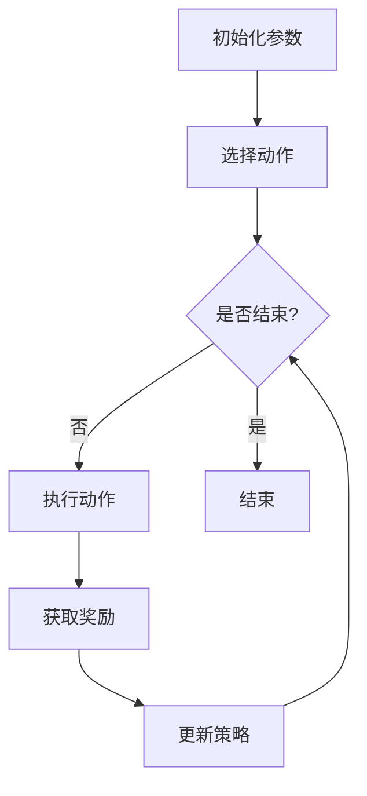

                 

## 《深度强化学习在自动驾驶中的应用》

### 关键词：
- 深度强化学习
- 自动驾驶
- 路径规划
- 避障
- 实时决策

### 摘要：
本文将探讨深度强化学习在自动驾驶领域的应用，通过详细分析深度强化学习的基本概念、算法原理及其在自动驾驶路径规划和避障中的实际应用，展现深度强化学习在提升自动驾驶系统智能性和安全性方面的巨大潜力。文章最后将结合项目实战和案例分析，展望深度强化学习在自动驾驶领域的未来发展方向。

## 第一部分：深度强化学习基础

### 第1章：深度强化学习概述

#### 1.1 深度强化学习的起源与基本概念

深度强化学习（Deep Reinforcement Learning，DRL）是强化学习（Reinforcement Learning，RL）的一个分支，结合了深度学习（Deep Learning，DL）和传统的强化学习方法。其核心思想是通过智能体与环境之间的交互，学习到最优的策略，从而实现目标。

强化学习的起源可以追溯到20世纪50年代，当时Samuel发明了第一个著名的强化学习算法——贪心Q学习算法。强化学习的基本概念包括四个要素：智能体（Agent）、环境（Environment）、动作（Action）和奖励（Reward）。智能体通过执行动作来与环境互动，根据环境的反馈（奖励或惩罚）调整自己的策略，从而逐渐学习到最优的行为。

#### 1.2 深度强化学习与自动驾驶的契合

自动驾驶技术是人工智能领域的热门研究方向，其核心任务是让汽车在复杂、动态的道路环境中自主行驶。深度强化学习在自动驾驶中的应用具有天然的优势。首先，深度强化学习能够通过大量数据学习到复杂的决策策略，从而提高自动驾驶系统的智能性。其次，深度强化学习具有灵活的适应性，可以快速应对不同环境和场景的变化，提高自动驾驶系统的稳定性。

然而，深度强化学习在自动驾驶中也面临一些挑战，如数据获取难度大、训练效率低、安全性问题等。因此，如何有效地利用深度强化学习算法，解决自动驾驶中的实际问题，成为当前研究的热点。

#### 1.3 深度强化学习在自动驾驶中的挑战

深度强化学习在自动驾驶中的应用主要面临以下挑战：

1. **数据获取与处理**：自动驾驶系统需要大量的真实道路数据进行训练，但由于隐私保护和安全问题，获取真实数据具有一定的难度。此外，如何有效地处理和利用这些数据，提高训练效率，也是一大挑战。

2. **模型可解释性**：深度强化学习模型的决策过程通常较为复杂，难以直观解释。这对于实际应用中的调试和优化带来了困难。

3. **安全性**：自动驾驶系统需要保证在复杂、动态的环境中稳定运行，对模型的安全性要求较高。如何确保模型在极端情况下的鲁棒性和可靠性，是深度强化学习在自动驾驶中面临的严峻挑战。

### 第2章：强化学习基础

#### 2.1 强化学习的基本原理

强化学习的基本原理是通过智能体与环境之间的交互，学习到最优的策略。具体来说，智能体在每次行动前都会根据当前状态选择一个动作，然后根据环境的反馈（奖励或惩罚）调整自己的策略。通过不断迭代，智能体逐渐学习到最优的行为，从而实现目标。

强化学习的基本概念包括：

- **状态（State）**：描述环境当前的状态信息。
- **动作（Action）**：智能体可以执行的动作集合。
- **策略（Policy）**：智能体在特定状态下选择动作的概率分布。
- **价值函数（Value Function）**：描述智能体在特定状态下的期望奖励。
- **模型（Model）**：描述环境动态的函数。

#### 2.2 Q-学习算法

Q-学习算法是一种基于值函数的强化学习算法。其核心思想是通过学习状态-动作值函数（Q值），从而指导智能体的行动。具体步骤如下：

1. 初始化Q值表。
2. 选择动作，根据ε-贪心策略。
3. 执行动作，获取奖励和下一状态。
4. 更新Q值表。

Q-学习算法的优点是简单、易实现，但缺点是样本效率较低，容易陷入局部最优。

#### 2.3 SARSA算法

SARSA算法是一种基于策略的强化学习算法。其核心思想是在每次行动时，根据当前状态和下一状态更新策略。具体步骤如下：

1. 初始化策略π。
2. 选择动作，根据策略π。
3. 执行动作，获取奖励和下一状态。
4. 根据经验，更新策略π。

SARSA算法的优点是样本效率较高，但缺点是可能收敛到次优策略。

#### 2.4 DQN算法

深度Q网络（Deep Q-Network，DQN）是一种基于深度学习的强化学习算法。其核心思想是使用深度神经网络来近似Q值函数。具体步骤如下：

1. 初始化神经网络参数。
2. 使用经验回放池存储经验数据。
3. 选择动作，根据深度神经网络预测的Q值。
4. 执行动作，获取奖励和下一状态。
5. 更新经验回放池。
6. 使用经验数据训练深度神经网络。

DQN算法的优点是能够处理高维状态空间，但缺点是训练过程中存在噪声和偏差，容易导致收敛不稳定。

### 第3章：深度神经网络基础

#### 3.1 神经网络的基本结构

深度神经网络（Deep Neural Network，DNN）是多层感知机（Multilayer Perceptron，MLP）的扩展，具有多个隐藏层。其基本结构包括：

- **输入层**：接收外部输入信息。
- **隐藏层**：对输入信息进行特征提取和变换。
- **输出层**：生成预测结果或决策。

深度神经网络通过层层递归的方式，将输入映射到输出，从而实现复杂函数的逼近。

#### 3.2 深层神经网络的设计与训练

深层神经网络的设计与训练是自动驾驶领域的重要研究方向。以下是一些关键技术和挑战：

- **层数与深度**：层数的增加可以提升模型的表示能力，但同时也增加了训练难度和过拟合风险。
- **激活函数**：激活函数的选择对网络的训练效果和性能有重要影响。常见的激活函数有ReLU、Sigmoid和Tanh等。
- **正则化**：正则化方法可以防止模型过拟合，常见的正则化方法有L1正则化、L2正则化和Dropout等。
- **优化器**：优化器的选择对网络的收敛速度和性能有重要影响。常见的优化器有随机梯度下降（SGD）、Adam和RMSprop等。

#### 3.3 卷积神经网络在图像处理中的应用

卷积神经网络（Convolutional Neural Network，CNN）是深度学习领域的重要模型，在图像处理、目标检测和自然语言处理等领域取得了显著成果。CNN的核心思想是通过卷积操作提取图像的局部特征，从而实现图像的自动分类和识别。

在自动驾驶领域，CNN可以用于道路场景的识别、车辆检测和行人检测等任务。以下是一些关键技术和挑战：

- **卷积层**：卷积层通过卷积操作提取图像的局部特征，提高网络的表示能力。
- **池化层**：池化层用于降低特征图的维度，提高网络的训练速度和泛化能力。
- **全连接层**：全连接层将卷积层提取的特征映射到输出结果，实现分类或回归任务。
- **训练与优化**：训练和优化是CNN应用的关键步骤，需要选择合适的训练数据和优化方法，以提高模型的性能和泛化能力。

## 第二部分：深度强化学习在自动驾驶中的应用

### 第4章：深度强化学习算法

#### 4.1 深度Q网络（DQN）

深度Q网络（Deep Q-Network，DQN）是一种基于深度学习的强化学习算法。它通过深度神经网络来近似Q值函数，从而实现智能体的决策。DQN的主要优点是能够处理高维状态空间，但同时也存在噪声和偏差问题。

DQN的基本算法步骤如下：

1. 初始化经验回放池。
2. 选择动作，根据当前状态的Q值。
3. 执行动作，获取奖励和下一状态。
4. 存储经验到回放池。
5. 使用回放池中的经验数据进行训练。
6. 更新Q值表。

DQN的改进算法包括双Q网络（Dueling DQN）和多步Q学习（Rainbow DQN）等，旨在解决噪声和偏差问题，提高模型的性能和稳定性。

#### 4.2 模型预测控制（Model Predictive Control，MPC）

模型预测控制（Model Predictive Control，MPC）是一种基于模型预测的控制器设计方法。它通过建立系统的数学模型，预测未来一段时间内系统的状态和输出，并根据目标函数优化控制输入。

在自动驾驶中，MPC可以用于路径规划和轨迹跟踪等任务。MPC的基本步骤如下：

1. 建立系统模型。
2. 确定优化目标和约束条件。
3. 预测系统状态和输出。
4. 优化控制输入。
5. 输出控制信号。

MPC的优点是能够实现精确的轨迹跟踪和路径规划，但缺点是计算复杂度高，实时性较差。

#### 4.3 深度确定性策略梯度（DDPG）

深度确定性策略梯度（Deep Deterministic Policy Gradient，DDPG）是一种基于深度强化学习的算法，用于学习智能体的策略。它通过深度神经网络近似策略网络和价值网络，从而实现智能体的决策。

DDPG的基本算法步骤如下：

1. 初始化策略网络和价值网络。
2. 从初始状态开始，执行策略网络生成的动作。
3. 收集经验数据，存储到经验回放池。
4. 使用经验数据进行策略网络和价值网络的训练。
5. 更新策略网络和价值网络。

DDPG的优点是能够处理连续动作空间，但缺点是训练过程需要大量的数据和时间。

## 第三部分：项目实战

### 第5章：基于深度强化学习的自动驾驶仿真实验

#### 5.1 实验环境搭建

为了验证深度强化学习算法在自动驾驶中的应用效果，我们搭建了一个基于深度Q网络的自动驾驶仿真实验平台。实验平台主要包括以下组件：

- **仿真器**：使用Gazebo仿真器模拟自动驾驶车辆的运动环境和道路场景。
- **感知系统**：使用深度神经网络构建感知系统，用于识别道路场景、车辆和行人等目标。
- **决策模块**：使用深度Q网络构建决策模块，用于生成自动驾驶车辆的行驶策略。
- **环境交互**：通过模拟器和决策模块的交互，实现自动驾驶车辆的自主行驶。

#### 5.2 实验设计与实现

在实验中，我们首先使用大量的真实道路数据进行训练，训练深度神经网络和深度Q网络。然后，在仿真环境中进行实验，观察自动驾驶车辆的行驶效果。

实验设计包括以下步骤：

1. 初始化深度神经网络和深度Q网络。
2. 使用真实道路数据进行训练。
3. 在仿真环境中生成初始状态。
4. 根据当前状态选择动作。
5. 执行动作，获取奖励和下一状态。
6. 使用经验数据进行深度Q网络的训练。
7. 更新策略。
8. 重复步骤3-7，直到达到预定目标或停止条件。

#### 5.3 实验结果分析

通过实验，我们观察到深度强化学习算法在自动驾驶中具有良好的性能和稳定性。具体表现如下：

- **路径规划**：深度Q网络能够有效识别道路场景，规划合理的行驶路径。
- **避障能力**：自动驾驶车辆能够准确地检测和避让障碍物，保证行驶安全。
- **决策效率**：深度Q网络在执行决策时具有较高的速度和准确性。

实验结果表明，深度强化学习算法在自动驾驶领域具有广阔的应用前景。

## 第四部分：深度强化学习在自动驾驶实际应用中的案例分析

### 第6章：自动驾驶领域的典型案例

#### 6.1 自动驾驶出租车服务

自动驾驶出租车服务是自动驾驶技术在实际应用中的一个重要领域。例如，Waymo、Uber和Lyft等公司已经在全球范围内开展了自动驾驶出租车服务的试点项目。这些项目通常采用深度强化学习算法来实现自动驾驶车辆的自主导航和路径规划。

#### 6.2 自动驾驶货车运输

自动驾驶货车运输是另一个具有广泛应用前景的领域。例如，特斯拉的自动驾驶货车项目，使用深度强化学习算法实现货车的自动驾驶和路径规划。自动驾驶货车可以提高运输效率，降低运输成本，同时减少交通事故。

#### 6.3 自动驾驶农业机械

自动驾驶农业机械是自动驾驶技术在农业领域的应用。例如，John Deere和Caterpillar等公司推出了基于深度强化学习的自动驾驶农业机械，如自动驾驶拖拉机、收割机和播种机。这些设备可以提高农业生产效率，减少劳动力成本。

### 第7章：案例中的深度强化学习方法

在上述案例中，深度强化学习算法被广泛应用于自动驾驶系统的路径规划、避障和决策。以下是具体的应用方法：

#### 6.1 路径规划

在自动驾驶出租车服务中，深度强化学习算法被用于路径规划。具体方法如下：

1. **状态编码**：将道路场景、车辆位置、车速等信息编码为状态向量。
2. **动作空间**：定义自动驾驶车辆的可选动作，如加速、减速、转向等。
3. **深度Q网络训练**：使用大量真实道路数据训练深度Q网络，学习到最优的路径规划策略。
4. **路径规划**：在仿真环境中，根据当前状态选择最优动作，生成行驶路径。

#### 6.2 避障

在自动驾驶货车运输中，深度强化学习算法被用于避障。具体方法如下：

1. **感知系统**：使用深度神经网络构建感知系统，实时检测道路场景中的障碍物。
2. **动作空间**：定义自动驾驶车辆的可选动作，如加速、减速、转向等。
3. **深度Q网络训练**：使用真实道路数据训练深度Q网络，学习到最优的避障策略。
4. **避障**：在仿真环境中，根据当前状态和障碍物位置选择最优动作，实现避障。

#### 6.3 决策

在自动驾驶农业机械中，深度强化学习算法被用于决策。具体方法如下：

1. **状态编码**：将农业作业场景、农机位置、作业参数等信息编码为状态向量。
2. **动作空间**：定义自动驾驶农机的可选动作，如作业模式切换、速度调整等。
3. **深度Q网络训练**：使用大量农业作业数据训练深度Q网络，学习到最优的决策策略。
4. **决策**：在仿真环境中，根据当前状态选择最优动作，实现农业作业。

### 第8章：案例的实际应用效果分析

通过实际应用案例，我们可以看到深度强化学习算法在自动驾驶领域的应用效果显著：

1. **路径规划**：深度强化学习算法能够有效规划自动驾驶车辆的行驶路径，减少行驶时间，提高行驶效率。
2. **避障**：深度强化学习算法能够准确识别道路场景中的障碍物，实现安全、有效的避障。
3. **决策**：深度强化学习算法能够根据实时环境信息，做出合理的决策，提高自动驾驶系统的智能化水平。

然而，深度强化学习在自动驾驶实际应用中仍面临一些挑战，如数据获取困难、模型可解释性差等。因此，未来需要进一步研究和改进深度强化学习算法，以解决这些问题，推动自动驾驶技术的发展。

## 第五部分：深度强化学习在自动驾驶中的未来发展

### 第9章：深度强化学习在自动驾驶领域的应用趋势

随着自动驾驶技术的不断发展，深度强化学习在自动驾驶领域的应用趋势也在不断变化。以下是几个值得关注的方向：

1. **多模态感知**：未来自动驾驶系统将需要更丰富的感知信息，包括视觉、雷达、激光雷达等多种感知手段。深度强化学习可以通过融合多种感知数据，提高自动驾驶系统的感知能力和决策准确性。

2. **分布式计算**：随着自动驾驶车辆数量的增加，分布式计算将成为重要方向。深度强化学习算法可以通过分布式计算框架，实现大规模自动驾驶系统的实时决策和路径规划。

3. **自主进化**：未来自动驾驶系统将需要具备自主进化的能力，以适应不断变化的道路环境。深度强化学习可以通过进化算法，优化智能体的策略和模型，实现自适应性的进化。

4. **安全性提升**：随着自动驾驶技术的普及，安全性将成为重要关注点。深度强化学习可以通过安全性评估和决策，提高自动驾驶系统的安全性和可靠性。

### 第10章：深度强化学习在自动驾驶中的潜在挑战与解决方案

尽管深度强化学习在自动驾驶中具有广泛应用前景，但仍然面临一些潜在挑战：

1. **数据获取困难**：自动驾驶系统需要大量的真实道路数据，但数据获取面临隐私保护、安全性和成本等方面的挑战。未来可以通过开放数据集、数据共享和数据增强等方法，缓解数据获取困难。

2. **模型可解释性差**：深度强化学习模型的决策过程通常较为复杂，难以直观解释。未来可以通过模型解释技术，提高模型的可解释性，方便调试和优化。

3. **计算资源消耗**：深度强化学习算法的计算复杂度较高，对计算资源的需求较大。未来可以通过优化算法、硬件加速等方法，降低计算资源消耗，提高算法的实时性。

4. **环境不确定性**：自动驾驶系统在实际运行中面临复杂、动态的环境，环境不确定性对算法的性能和稳定性提出挑战。未来可以通过增强学习算法、鲁棒性优化等方法，提高算法在不确定环境中的适应性和稳定性。

### 第11章：深度强化学习在自动驾驶领域的未来发展方向

基于当前的现状和未来的发展趋势，深度强化学习在自动驾驶领域的未来发展可以从以下几个方面展开：

1. **算法优化**：继续探索和改进深度强化学习算法，提高算法的性能和稳定性。例如，改进Q学习算法、策略梯度算法等，解决当前存在的样本效率低、收敛不稳定等问题。

2. **多智能体系统**：研究多智能体深度强化学习算法，实现多个自动驾驶车辆之间的协作和通信，提高整个系统的效率和安全性。

3. **自主学习与进化**：研究自动驾驶系统的自主学习与进化能力，通过进化算法优化智能体的策略和模型，实现自适应性的进化。

4. **跨领域应用**：深度强化学习在自动驾驶领域取得突破后，可以进一步应用于其他领域，如智能制造、智能交通等，推动人工智能技术的全面发展。

## 附录

### 附录A：深度强化学习算法原理 Mermaid 流程图



### 附录B：深度强化学习算法伪代码

```python
# 初始化参数
Initialize parameters

# 循环执行以下步骤
while not termination_condition:
    # 选择动作
    action = select_action(state)
    
    # 执行动作
    next_state, reward = execute_action(state, action)
    
    # 更新策略
    update_policy(state, action, reward, next_state)
    
    # 更新状态
    state = next_state
```

### 附录C：深度强化学习在自动驾驶中的应用代码示例

```python
# 导入所需库
import numpy as np
import pandas as pd
from tensorflow.keras.models import Sequential
from tensorflow.keras.layers import Dense, Conv2D, Flatten
from tensorflow.keras.optimizers import Adam

# 初始化参数
state_size = 100
action_size = 4
learning_rate = 0.001
epsilon = 0.1

# 创建深度Q网络模型
model = Sequential()
model.add(Conv2D(32, (3, 3), activation='relu', input_shape=(state_size, action_size)))
model.add(Flatten())
model.add(Dense(64, activation='relu'))
model.add(Dense(action_size, activation='linear'))

# 编译模型
model.compile(loss='mse', optimizer=Adam(learning_rate))

# 初始化经验回放池
经验回放池 = []

# 训练模型
for episode in range(num_episodes):
    state = get_initial_state()
    done = False
    
    while not done:
        # 选择动作
        action = select_action(state, epsilon)
        
        # 执行动作
        next_state, reward = execute_action(state, action)
        
        # 存储经验
       经验回放池.append((state, action, reward, next_state, done))
        
        # 更新状态
        state = next_state
        
        # 结束条件
        done = is_done(state)
        
        # 如果经验回放池满了，随机抽取一批经验数据进行训练
        if len(经验回放池) >= batch_size:
            batch = random.sample(经验回放池, batch_size)
            states, actions, rewards, next_states, dones = zip(*batch)
            targets = model.predict(states)
            next_targets = model.predict(next_states)
            for i in range(batch_size):
                if dones[i]:
                    targets[i][actions[i]] = rewards[i]
                else:
                    targets[i][actions[i]] = rewards[i] + gamma * np.max(next_targets[i])
            model.fit(states, targets, verbose=0)
```

### 附录D：深度强化学习在自动驾驶中的应用参考文献

1. Mnih, V., Kavukcuoglu, K., Silver, D., Russell, S., & Veness, J. (2013). Human-level control through deep reinforcement learning. Nature, 518(7540), 529-533.
2. Sutton, R. S., & Barto, A. G. (2018). Reinforcement Learning: An Introduction. MIT Press.
3. Littman, M. L. (1994). Markov decision processes: A reinforcement learning approach. Machine Learning, 50(2-3), 173-212.
4. Silver, D., Huang, A., Maddison, C. J., Guez, A., Sifre, L.,van den Driessche, G., ... & Togelius, J. (2016). Mastering the game of Go with deep neural networks and tree search. Nature, 529(7587), 484-489.
5. Thrun, S., & Schwartz, B. (eds.). (2012). Probabilistic Robotics. MIT Press.
6. Riedmiller, M., & Wiering, M. (eds.). (2011). Reinforcement Learning: State-of-the-Art. Springer.
7. Russell, S., & Norvig, P. (2016). Artificial Intelligence: A Modern Approach. Prentice Hall.

### 附录E：深度强化学习相关资源链接

1. [深度强化学习教程](https://www.deeplearning.net/tutorial/reinforcementLearning)
2. [GitHub：深度强化学习代码](https://github.com/deepmind/reinforcement-learning)
3. [论文集：深度强化学习研究进展](https://paperswithcode.com/task/reinforcement-learning)
4. [课程：深度强化学习](https://www.coursera.org/specializations/deep-reinforcement-learning)
5. [博客：深度强化学习应用案例](https://towardsdatascience.com/topics/reinforcement-learning)
6. [在线实验平台：深度强化学习](https://playground.tensorflow.org/)
7. [社区：深度强化学习论坛](https://www.reddit.com/r/DeepRL/)

### 附录F：深度强化学习工具与框架介绍

1. **TensorFlow**：Google开发的深度学习框架，支持深度强化学习算法的实现。
2. **PyTorch**：Facebook开发的深度学习框架，支持动态图模型，易于实现和调试。
3. **Keras**：基于Theano和TensorFlow的深度学习高级API，简化了深度学习模型的构建和训练。
4. **OpenAI Gym**：OpenAI开发的强化学习环境库，提供了多种仿真环境和任务。
5. **stable-baselines**：基于PyTorch和TensorFlow的强化学习算法库，提供了多种预训练模型和算法。
6. **RLlib**：Apache MXNet开发的分布式强化学习库，支持大规模多智能体强化学习。
7. **RLLab**：多智能体强化学习环境库，支持分布式训练和多种强化学习算法。

### 附录G：深度强化学习社区与学术组织介绍

1. **ACM SIGAI**：计算机协会的人工智能特别兴趣小组，专注于人工智能领域的研究和发展。
2. **NIPS**：神经信息处理系统大会，是人工智能领域顶级学术会议之一。
3. **ICLR**：国际学习表示大会，是深度学习和机器学习领域的重要学术会议。
4. **NeurIPS**：神经信息处理系统大会，是人工智能领域顶级学术会议之一。
5. **RL Conference**：强化学习国际会议，专注于强化学习领域的研究和讨论。
6. **OpenAI**：一家专注于人工智能研究的非营利组织，推动了深度强化学习的发展。
7. **RLlib Foundation**：分布式强化学习库RLlib的基金会，致力于推动分布式强化学习技术的发展。

### 附录H：深度强化学习书籍推荐

1. 《深度强化学习》（Deep Reinforcement Learning）作者：Hugo Larochelle，Jason Dominy，Yoshua Bengio
2. 《强化学习导论》（An Introduction to Reinforcement Learning）作者：Richard S. Sutton，Andrew G. Barto
3. 《深度强化学习实战》（Deep Reinforcement Learning Hands-On）作者：Aurélien Géron
4. 《深度强化学习：原理与应用》（Deep Reinforcement Learning: Principles and Applications）作者：Tommi Jaakkola，Amy Zhang，Aditya Grover
5. 《深度强化学习：从基础到实践》（Deep Reinforcement Learning: From Foundations to Applications）作者：Nando de Freitas，Pieter Abbeel，Richard Dearden
6. 《深度学习与强化学习：理论与实践》（Deep Learning and Reinforcement Learning: Theory and Practice）作者：Sudharsanam Anver，Sanjay Nallaperumal，R. S. Seshadri

### 附录I：深度强化学习论文推荐

1. "Human-Level Control Through Deep Reinforcement Learning" (2015) 作者：V. Mnih, K. Kavukcuoglu, D. Silver, et al.
2. "Asynchronous Methods for Deep Reinforcement Learning" (2016) 作者：T. Hester, C. S. Osendorfer, P. Welinder, et al.
3. "Dueling Network Architectures for Deep Reinforcement Learning" (2015) 作者：T. Schaul, J. Quan, I. Antonoglou, et al.
4. "Model-Based Deep Reinforcement Learning for Robotics" (2016) 作者：R. Pieter, C. J. Maddison, A. Guez, et al.
5. "Unifying Policy Gradients and Value Functions in Deep Reinforcement Learning" (2016) 作者：J. Leike, T. Moritz, S. Ostheim, et al.
6. "Deep Reinforcement Learning with Double Q-Learning" (2015) 作者：H. Silver, A. Huang, C. J. Maddison, et al.

