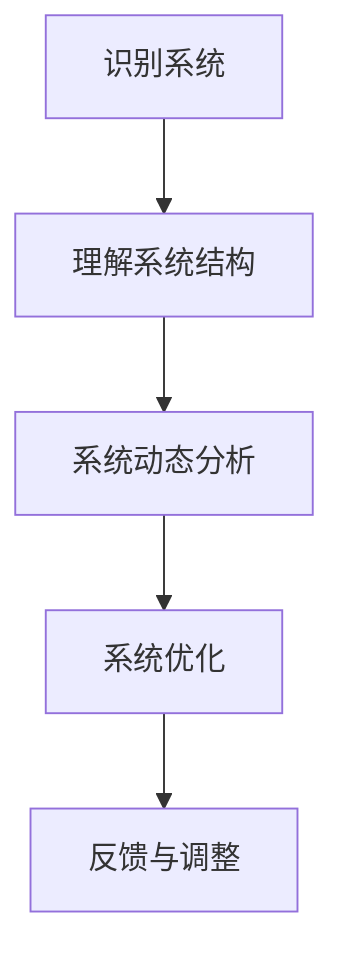
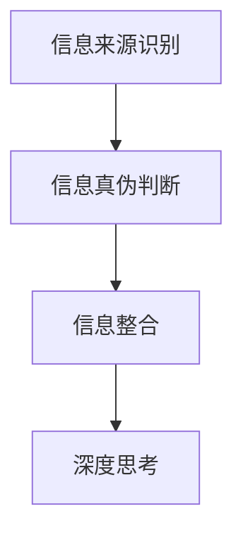
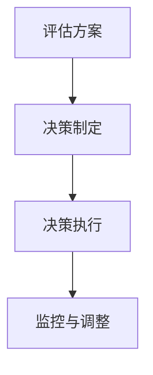
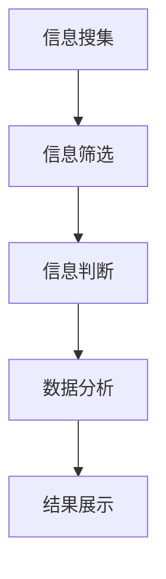
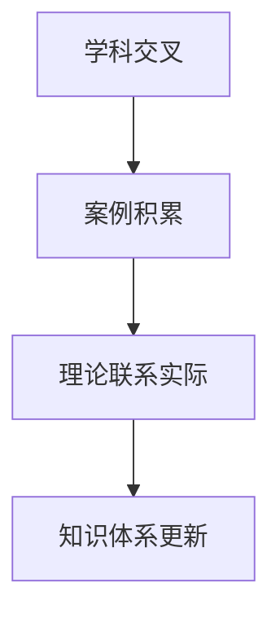
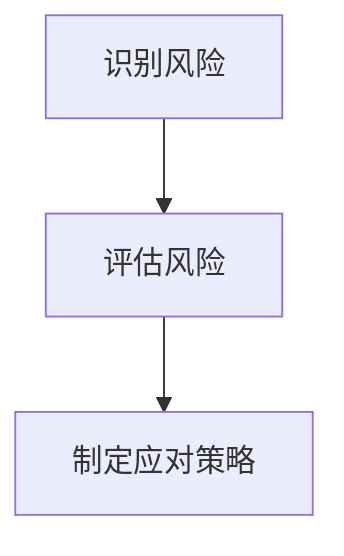
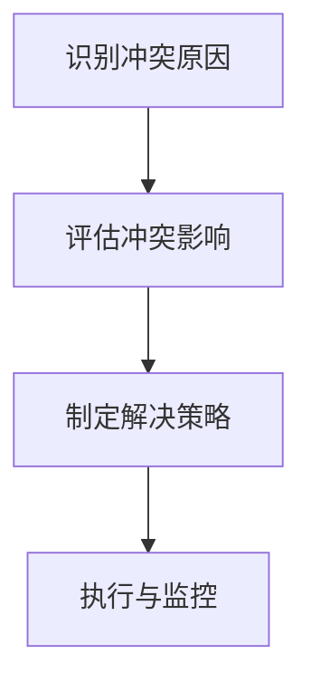
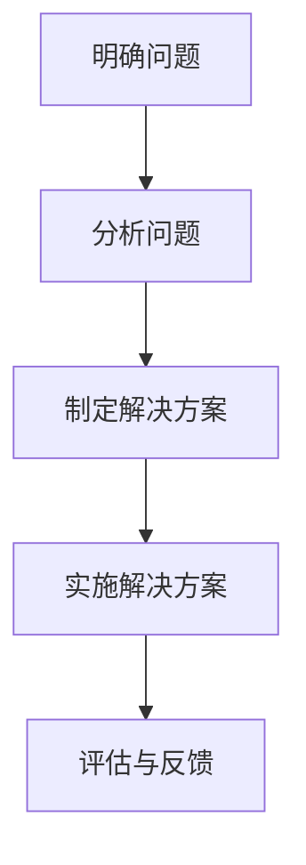
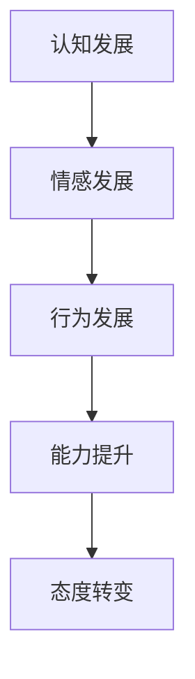

                 

# 深度思考：管理者洞悉关键信息的关键

> **关键词：**深度思考、管理者、关键信息、战略决策、团队管理、创新、问题解决

> **摘要：**本文旨在探讨深度思考在管理者洞悉关键信息、做出明智决策和实现组织目标中的重要作用。通过剖析深度思考的本质、关键因素以及实践应用，本文揭示了深度思考的核心价值，并提供了实用的指南和方法，以帮助管理者提升决策质量和领导力。

## 目录大纲

### 第一部分：引言与基础理论

1. **第1章：深度思考的本质**
   1.1 深度思考的定义与重要性
   1.2 深度思考与批判性思维
   1.3 深度思考的步骤与方法

2. **第2章：深度思考的关键因素**
   2.1 信息搜集与分析
   2.2 知识体系构建
   2.3 心理学与行为学基础

### 第二部分：深度思考的实践与应用

3. **第3章：战略决策与深度思考**
   3.1 战略决策的概念与类型
   3.2 深度思考在战略决策中的应用
   3.3 战略决策案例研究

4. **第4章：团队管理与深度思考**
   4.1 团队管理的概念与要素
   4.2 深度思考在团队管理中的应用
   4.3 团队管理案例研究

5. **第5章：深度思考在创新中的运用**
   5.1 创新的定义与类型
   5.2 深度思考在创新中的作用
   5.3 创新案例研究

6. **第6章：深度思考在问题解决中的应用**
   6.1 问题解决的概念与方法
   6.2 深度思考在问题解决中的作用
   6.3 问题解决案例研究

7. **第7章：深度思考与个人成长**
   7.1 个人成长的概念与要素
   7.2 深度思考在个人成长中的应用
   7.3 个人成长案例研究

### 第三部分：深度思考的实践与拓展

8. **第8章：深度思考的实践与反思**
   8.1 深度思考的实践方法
   8.2 深度思考的反思与改进

9. **第9章：深度思考的拓展领域**
   9.1 深度思考在其他领域的应用
   9.2 深度思考的未来发展趋势

10. **第10章：深度思考的总结与展望**
    10.1 深度思考的价值总结
    10.2 深度思考的展望

11. **第11章：深度思考的实践指南**
    11.1 实践深度思考的步骤
    11.2 深度思考的常见误区与避免
    11.3 深度思考的实际应用案例

### 附录

- **附录A：深度思考工具与资源**
- **附录B：深度思考实践练习**

---

接下来，我们将按照目录大纲逐步展开文章的内容，深入探讨深度思考的本质、关键因素和实践应用，以帮助管理者在复杂多变的环境中做出明智的决策，提升组织绩效。让我们一步一步地深入思考。 <|user|>## 第1章：深度思考的本质

### 1.1 深度思考的定义与重要性

深度思考，作为一种高级认知活动，是指人们在解决问题、做出决策或进行创造性思考时，所采用的一种深入、系统、连贯的思维方式。它不仅仅是表层的信息处理，而是涉及到对复杂问题的深入理解、分析、推理和综合。

深度思考的重要性不言而喻。在当今社会，信息爆炸、变化迅速，管理者面临的挑战越来越多，需要处理的信息量也呈指数级增长。仅仅依靠表层的信息和经验，很难做出明智的决策。深度思考能够帮助管理者更准确地捕捉关键信息，理解问题的本质，从而做出更为科学和有效的决策。

**深度思考的定义**

深度思考可以定义为一种深度工作（Deep Work）的思维方式。它要求人们能够在信息丰富的环境中，集中精力、深入分析、连贯思考，从而实现对复杂问题的深刻理解和准确判断。

深度思考与表层思考（Surface Thinking）不同。表层思考主要是对信息的快速处理和浅层理解，而深度思考则是对信息进行深入挖掘、批判性分析和系统整合。具体来说，深度思考具有以下几个特点：

1. **系统性**：深度思考是一种系统化的思维方式，它要求对问题进行全面的考虑，分析各个因素之间的相互作用和影响。

2. **批判性**：深度思考不仅仅是接受信息，更重要的是对信息进行批判性分析，判断其真实性和有效性。

3. **连贯性**：深度思考要求思维过程连贯，从问题的提出、分析、推理到最终决策，形成完整的思维链条。

4. **创造性**：深度思考往往伴随着创造性思维，能够帮助人们发现新的解决方案和创新的思路。

**管理者与深度思考的关系**

管理者在组织中的作用至关重要，他们的决策和领导风格直接影响组织的绩效和未来发展。深度思考作为管理者必备的能力，对管理者具有重要意义。

1. **提高决策质量**：深度思考能够帮助管理者更准确地理解问题，分析各种可能性和后果，从而做出更为明智的决策。

2. **增强洞察力**：深度思考能够帮助管理者从复杂的信息中捕捉关键信息，发现问题的根本原因，提高对组织和环境的洞察力。

3. **提升领导力**：深度思考是领导者必备的能力，它不仅能够帮助管理者更好地领导团队，还能够激励和引导团队成员共同面对挑战。

4. **促进创新**：深度思考能够激发管理者的创造力，推动组织进行创新，从而在竞争激烈的市场中保持领先地位。

综上所述，深度思考是一种重要的认知活动，对于管理者来说尤为重要。它不仅能够提高决策质量，增强洞察力，提升领导力，还能够促进创新。在接下来的章节中，我们将进一步探讨深度思考的关键因素和实际应用，帮助管理者更好地利用这一宝贵能力。 <|user|>### 1.2 深度思考与批判性思维

批判性思维（Critical Thinking）是指对信息、观点和结论进行批判性分析和评估的能力，它强调理性、逻辑和客观性。与深度思考相比，批判性思维更侧重于对信息的评估和判断，而深度思考则更关注对信息的深入挖掘和系统性整合。

**批判性思维与深度思考的对比**

1. **关注点不同**：批判性思维主要关注信息的真实性、合理性和可靠性，而深度思考则更关注信息的深度、广度和连贯性。

2. **处理方式不同**：批判性思维强调对信息的批判性分析和评估，而深度思考则更注重信息的深入挖掘和系统性整合。

3. **目标不同**：批判性思维的目标是评估信息的真实性和有效性，而深度思考的目标则是理解问题的本质、发现新的解决方案和促进创新。

**批判性思维在深度思考中的作用**

批判性思维在深度思考中起着关键作用，它能够帮助管理者更准确地捕捉关键信息，判断信息的真实性和有效性，从而提高深度思考的质量。具体来说，批判性思维在深度思考中的作用主要体现在以下几个方面：

1. **信息筛选**：在深度思考过程中，管理者需要从大量信息中筛选出关键信息。批判性思维能够帮助管理者判断哪些信息是真实的、可靠的，哪些信息是虚假的、误导性的。

2. **问题分析**：批判性思维能够帮助管理者更深入地分析问题，发现问题的本质和根本原因。通过批判性思维，管理者能够避免被表面的现象所迷惑，从而更准确地理解问题。

3. **决策评估**：在做出决策时，批判性思维能够帮助管理者评估各种决策方案的可能性和后果，从而选择最优方案。

4. **思维连贯性**：批判性思维能够帮助管理者保持思维的连贯性，避免在思考过程中出现逻辑错误或偏差。

**如何培养批判性思维**

要培养批判性思维，需要从以下几个方面入手：

1. **学习逻辑学**：逻辑学是批判性思维的基础，通过学习逻辑学的基本原理，管理者能够更好地理解和运用批判性思维。

2. **实践推理**：通过解决实际问题和进行逻辑推理练习，管理者能够提高批判性思维的能力。

3. **反思与总结**：在思考过程中，管理者应该经常反思自己的思考过程和结论，分析哪些地方做得好，哪些地方需要改进。

4. **多元化视角**：要培养批判性思维，管理者应该从多个角度看待问题，避免陷入单一思维的陷阱。

5. **开放心态**：开放心态是批判性思维的重要前提，管理者应该愿意接受不同的观点和意见，并进行客观评估。

通过批判性思维的培养，管理者能够在深度思考过程中更加理性、客观和全面，从而提高决策质量和领导力。在接下来的章节中，我们将继续探讨深度思考的步骤和方法，帮助管理者更好地利用这一宝贵能力。 <|user|>### 1.3 深度思考的步骤与方法

深度思考是一个系统化的过程，它不仅要求对信息的深入挖掘和系统性整合，还需要遵循一定的步骤和方法。以下是深度思考的主要步骤和方法：

#### 系统思维

系统思维是深度思考的基础，它要求管理者从整体的角度看待问题，理解各个组成部分之间的相互作用和关系。具体来说，系统思维包括以下几个步骤：

1. **识别系统**：首先要识别出需要分析的系统，明确系统的边界和组成部分。

2. **理解系统结构**：分析系统的各个组成部分及其相互关系，了解系统内部的运行机制。

3. **系统动态分析**：研究系统在不同状态下的动态变化，预测系统的未来发展趋势。

4. **系统优化**：通过调整系统结构和参数，寻求系统的最佳状态。

**Mermaid 流程图**



#### 理解信息的来源与真伪

在深度思考中，理解信息的来源和真伪至关重要。以下是一些关键步骤：

1. **信息来源识别**：确定信息的来源，了解信息产生的过程和背景。

2. **信息真伪判断**：评估信息的真实性和可靠性，避免被虚假信息所误导。

3. **信息整合**：将来自不同来源的信息进行整合，形成全面、准确的理解。

**Mermaid 流程图**



#### 分析与推理

分析与推理是深度思考的核心环节，以下是一些关键步骤：

1. **问题定义**：明确需要解决的问题，将其转化为可操作的命题。

2. **假设与模型构建**：根据已有知识和信息，提出合理的假设，并构建相应的模型。

3. **逻辑推理**：运用逻辑规则和推理方法，验证假设和模型的合理性。

4. **结果验证**：通过实验、数据分析等方法，验证推理结果的有效性。

**伪代码示例**

```python
def logical_reasoning(problem, hypothesis, model):
    # 定义逻辑推理过程
    conclusion = apply_logic(problem, hypothesis, model)
    if validate_result(conclusion):
        return conclusion
    else:
        raise ValueError("推理结果无效")

# 调用逻辑推理函数
result = logical_reasoning(problem, hypothesis, model)
```

#### 判断与决策

在深度思考的最终阶段，管理者需要基于分析结果做出明智的决策。以下是一些关键步骤：

1. **评估方案**：分析各种可能的解决方案，评估其优缺点和潜在风险。

2. **决策制定**：选择最优方案，并制定具体的实施计划。

3. **决策执行**：执行决策，并进行持续监控和调整。

**Mermaid 流�程图**



通过系统思维、理解信息来源与真伪、分析与推理以及判断与决策，管理者能够实现深度思考，从而更好地应对复杂问题，做出明智的决策。在接下来的章节中，我们将进一步探讨深度思考的关键因素和实践应用，帮助管理者提升决策质量和领导力。 <|user|>## 第2章：深度思考的关键因素

### 2.1 信息搜集与分析

深度思考的有效性很大程度上取决于信息的准确性和全面性。因此，信息搜集与分析是深度思考过程中的关键环节。以下是信息搜集与分析的主要方法和步骤：

#### 信息搜集的方法

1. **文献调研**：通过查阅相关书籍、学术论文、行业报告等，了解当前领域的研究现状和发展趋势。

2. **数据收集**：利用统计软件、数据库、网络爬虫等技术，收集大量的数据和信息。

3. **专家访谈**：与行业专家、学者和实践者进行访谈，获取第一手经验和观点。

4. **现场调研**：实地考察，了解实际情况，收集真实的案例和数据。

5. **网络信息**：利用互联网资源，如新闻、论坛、社交媒体等，获取最新的信息和动态。

#### 信息筛选与判断

1. **真实性判断**：评估信息的来源和可靠性，避免被虚假或误导性信息所影响。

2. **相关性判断**：筛选出与问题相关的信息，剔除无关或次要的信息。

3. **有效性判断**：评估信息对问题解决的实际价值，选择最有效的信息。

#### 数据分析与处理

1. **数据清洗**：处理缺失值、异常值和重复数据，确保数据的质量。

2. **数据可视化**：利用图表、图像等方式，展示数据的特点和趋势。

3. **统计分析**：运用统计学方法，对数据进行描述性分析和推断性分析。

4. **数据挖掘**：利用机器学习和数据挖掘技术，发现数据中的隐藏模式和关联。

**Mermaid 流程图**



### 2.2 知识体系构建

知识体系构建是深度思考的另一个关键因素。一个完整、系统的知识体系能够为深度思考提供坚实的基础，帮助管理者更好地理解问题、分析和解决问题。

#### 知识体系的重要性

1. **提高认知水平**：知识体系构建能够帮助管理者从多个维度看待问题，提高认知水平。

2. **增强决策能力**：知识体系中的相关信息和案例能够为管理者提供参考，增强决策能力。

3. **促进创新思维**：知识体系中的跨学科知识能够激发管理者的创新思维，推动组织创新。

#### 知识体系的构建方法

1. **学科交叉**：从不同学科领域吸取知识，构建跨学科的知识体系。

2. **案例积累**：收集和分析实际案例，将经验转化为知识。

3. **理论联系实际**：将理论知识与实际应用相结合，形成系统化的知识体系。

4. **持续更新**：知识体系需要不断更新，以适应不断变化的环境。

**Mermaid 流程图**



### 2.3 心理学与行为学基础

心理学与行为学在深度思考中发挥着重要作用。了解人类的心理和行为模式，能够帮助管理者更好地理解和应对团队行为，提高深度思考的效率和效果。

#### 心理学基本概念

1. **认知过程**：包括感知、记忆、思维和问题解决等，是深度思考的基础。

2. **情绪管理**：情绪对思考过程有显著影响，有效的情绪管理能够提高思考质量。

3. **动机与激励**：了解员工的动机和激励因素，能够更好地激发他们的积极性和创造力。

#### 行为学基本原理

1. **领导行为**：研究领导者的行为模式，如何影响团队绩效和员工行为。

2. **团队合作**：分析团队合作中的行为互动，提高团队协作效率。

3. **组织文化**：理解组织文化的构成和作用，如何影响员工行为和思维。

#### 心理因素对思考的影响

1. **认知负荷**：过多的信息会增加认知负荷，降低思考效率。

2. **情绪状态**：积极情绪有助于创造性思考，消极情绪可能阻碍思考。

3. **动机水平**：适当的动机能够激发思考，过度或缺乏动机均可能影响思考质量。

通过信息搜集与分析、知识体系构建以及心理学与行为学基础，管理者能够为深度思考提供坚实的支持。在接下来的章节中，我们将进一步探讨深度思考在战略决策、团队管理和创新中的应用，帮助管理者更好地发挥深度思考的作用。 <|user|>### 第3章：战略决策与深度思考

战略决策是企业长期发展的重要手段，它关系到企业的生存和发展。深度思考在战略决策过程中扮演着至关重要的角色。在这一章中，我们将探讨战略决策的概念与类型，并详细分析深度思考在战略决策中的应用。

#### 3.1 战略决策的概念与类型

**战略决策的定义**

战略决策是指企业在长期发展过程中，根据外部环境和内部资源，制定并选择合适的战略方向和行动方案的过程。战略决策涉及企业的目标设定、资源配置、市场进入、产品开发等多个方面。

**战略决策的类型**

1. **竞争战略**：企业在市场竞争中，选择何种竞争策略来获取竞争优势。

2. **业务战略**：企业如何分配资源，以实现业务增长和市场份额最大化。

3. **财务战略**：企业如何管理财务资源，包括融资、投资和分配。

4. **人力资源战略**：企业如何吸引、培养和保留人才，以支持企业战略的实现。

5. **研发战略**：企业如何进行研发活动，以保持技术领先和产品创新。

**战略决策的过程**

战略决策过程通常包括以下步骤：

1. **问题识别**：识别企业面临的问题和挑战。

2. **目标设定**：明确企业的发展目标。

3. **方案分析**：分析各种可能的解决方案。

4. **决策制定**：选择最优方案。

5. **执行与监控**：实施决策方案，并对决策效果进行监控和评估。

#### 3.2 深度思考在战略决策中的应用

深度思考在战略决策中的应用主要体现在以下几个方面：

1. **数据驱动的决策**

数据是战略决策的重要依据。通过深度思考，管理者能够从大量的数据中提取关键信息，进行系统性的分析和判断。以下是一个数据驱动的决策过程：

**伪代码示例**

```python
def data_driven_decisionmaking(data, metrics):
    # 数据预处理
    cleaned_data = preprocess_data(data)
    
    # 数据分析
    insights = analyze_data(cleaned_data, metrics)
    
    # 决策制定
    decision = formulate_decision(in insights)
    
    return decision

# 调用数据驱动决策函数
decision = data_driven_decisionmaking(data, metrics)
```

2. **风险评估与应对**

在战略决策过程中，风险评估是至关重要的一环。深度思考能够帮助管理者全面识别潜在风险，评估风险的概率和影响，并制定相应的应对策略。

**Mermaid 流程图**



3. **创新思维的应用**

创新思维是战略决策的重要驱动力。通过深度思考，管理者能够激发创新思维，探索新的商业模式、市场机会和产品创新。以下是一个创新思维的应用过程：

**伪代码示例**

```python
def innovative_thinking(problem, constraints):
    # 创新思维激发
    ideas = generate_ideas(problem, constraints)
    
    # 筛选与创新
    selected_idea = filter_ideas(ideas)
    
    return selected_idea

# 调用创新思维函数
selected_idea = innovative_thinking(problem, constraints)
```

#### 3.3 战略决策案例研究

为了更好地理解深度思考在战略决策中的应用，我们来看几个实际案例。

**案例一：公司并购决策**

某公司在考虑是否收购一家竞争对手时，通过深度思考进行了以下分析：

1. **数据驱动的决策**：收集了并购前后的财务数据、市场份额和行业趋势，进行了详细的分析。

2. **风险评估**：评估了并购可能带来的风险，包括市场波动、政策变化和员工反应。

3. **创新思维**：探讨了并购后如何整合资源、提升产品竞争力，以及如何进行市场创新。

最终，公司基于深度思考做出了并购决策，成功地扩大了市场份额，提升了品牌影响力。

**案例二：市场进入策略**

某公司在考虑进入一个新的市场时，通过深度思考进行了以下分析：

1. **信息搜集**：搜集了目标市场的市场规模、竞争格局和消费者需求。

2. **数据分析**：分析了竞争对手的营销策略和消费者偏好。

3. **风险评估**：评估了市场进入可能面临的风险，包括市场接受度、政策限制和供应链问题。

基于深度思考，公司制定了详细的市场进入策略，成功进入了目标市场，实现了业务增长。

**案例三：产品创新策略**

某公司在开发新产品时，通过深度思考进行了以下分析：

1. **市场需求分析**：分析了消费者的需求和偏好。

2. **技术评估**：评估了现有技术的可行性和创新潜力。

3. **竞争分析**：分析了竞争对手的产品特点和市场表现。

基于深度思考，公司制定了创新的产品策略，成功推出了市场受欢迎的新产品。

通过以上案例，我们可以看到深度思考在战略决策中的重要性。它不仅帮助管理者更准确地理解问题，识别关键信息，还促使他们从多个角度进行评估和决策，从而提高决策质量和成功率。在接下来的章节中，我们将继续探讨深度思考在团队管理和创新中的应用。 <|user|>### 第4章：团队管理与深度思考

团队管理是组织运作的重要组成部分，有效的团队管理能够提高团队的工作效率和绩效。深度思考在团队管理中发挥着关键作用，它帮助管理者更好地理解团队行为、制定管理策略和提升团队协作效果。以下是团队管理的概念与要素、深度思考在团队管理中的应用以及团队管理案例研究。

#### 4.1 团队管理的概念与要素

**团队管理的定义**

团队管理是指通过组织、协调和引导团队成员，实现团队目标的过程。有效的团队管理能够促进团队成员之间的协作，提高团队的整体绩效。

**团队管理的要素**

1. **目标设定**：明确团队的目标，确保团队成员朝着共同的方向努力。

2. **角色分配**：根据团队成员的特长和能力，合理分配工作任务。

3. **沟通协调**：建立有效的沟通渠道，确保信息的畅通和协调。

4. **激励与反馈**：激励团队成员，提供及时的反馈，促进团队成长。

5. **冲突解决**：及时解决团队内部冲突，维护团队的和谐与稳定。

6. **团队建设**：通过团队活动，增强团队成员之间的信任和合作。

#### 4.2 深度思考在团队管理中的应用

深度思考在团队管理中的应用主要体现在以下几个方面：

1. **沟通策略**

沟通是团队管理的核心，深度思考能够帮助管理者制定更有效的沟通策略。以下是一个沟通策略的深度思考过程：

**伪代码示例**

```python
def effective_communication(strategy, context):
    # 沟通目标分析
    communication_goals = analyze_goals(strategy, context)
    
    # 沟通渠道选择
    channels = select_channels(communication_goals)
    
    # 沟通内容优化
    messages = optimize_messages(communication_goals, channels)
    
    return messages

# 调用沟通策略函数
messages = effective_communication(strategy, context)
```

2. **冲突解决**

团队内部难免会出现冲突，深度思考能够帮助管理者更好地理解和解决冲突。以下是一个冲突解决的深度思考过程：

**Mermaid 流程图**



3. **团队协作与创新**

深度思考能够激发团队成员的创造性思维，促进团队协作和创新。以下是一个团队协作与创新的深度思考过程：

**伪代码示例**

```python
def team_collaboration_innovation(team, goals):
    # 创新思维激发
    ideas = generate_ideas(team, goals)
    
    # 筛选与创新
    selected_idea = filter_ideas(ideas)
    
    # 团队协作计划
    collaboration_plan = plan_collaboration(team, selected_idea)
    
    return collaboration_plan

# 调用团队协作与创新函数
collaboration_plan = team_collaboration_innovation(team, goals)
```

#### 4.3 团队管理案例研究

为了更好地理解深度思考在团队管理中的应用，我们来看几个实际案例。

**案例一：团队目标设定**

某公司的销售团队在季度开始时，通过深度思考进行了以下分析：

1. **市场分析**：分析了目标市场的需求和竞争对手的情况。

2. **内部资源评估**：评估了团队的销售能力和市场资源。

3. **目标设定**：基于以上分析，设定了具体的销售目标和行动计划。

通过深度思考，团队明确了目标，并制定了详细的行动计划，最终实现了季度销售目标。

**案例二：团队绩效评估**

某公司的研发团队在项目结束后，通过深度思考进行了以下评估：

1. **项目成果分析**：分析了项目的成果和目标达成情况。

2. **团队协作评价**：评估了团队成员的协作效果和贡献。

3. **问题与改进**：识别了项目中的问题和不足，制定了改进措施。

通过深度思考，团队不仅了解了项目的成功之处，还发现了改进的空间，为下一个项目的顺利进行奠定了基础。

**案例三：团队文化建设**

某公司的团队在建立初期，通过深度思考进行了以下文化建设：

1. **价值观确定**：明确了团队的价值观和愿景。

2. **行为规范制定**：制定了团队的行为规范和规章制度。

3. **团队活动策划**：策划了一系列团队活动，增强团队成员的凝聚力和归属感。

通过深度思考，团队建立了积极向上的文化氛围，提高了团队的整体绩效和员工满意度。

通过以上案例，我们可以看到深度思考在团队管理中的重要性。它不仅帮助管理者更好地理解团队行为，制定有效的管理策略，还能够促进团队协作和创新。在接下来的章节中，我们将继续探讨深度思考在创新中的运用。 <|user|>### 第5章：深度思考在创新中的运用

创新是企业持续发展的动力，是企业在激烈的市场竞争中保持领先地位的关键。深度思考在创新过程中起着至关重要的作用，它能够帮助管理者更好地理解创新的需求、发掘创新的机会，并制定有效的创新策略。以下是关于创新的定义与类型、深度思考在创新中的作用以及创新案例研究的详细探讨。

#### 5.1 创新的定义与类型

**创新的定义**

创新是指通过新思路、新方法、新技术或新产品的创造和应用，以实现新的价值创造和价值提升的过程。创新不仅包括产品或服务的创新，还包括商业模式、管理方法、组织文化等多个方面的创新。

**创新的类型**

1. **产品创新**：指在产品功能、设计、质量、性能等方面的改进和创新。

2. **技术创新**：指在技术原理、技术架构、技术手段等方面的创新。

3. **市场创新**：指在市场定位、市场策略、市场推广等方面的创新。

4. **商业模式创新**：指在盈利模式、运营模式、营销模式等方面的创新。

5. **管理创新**：指在组织结构、管理制度、管理方法等方面的创新。

**创新的过程**

创新通常包括以下几个阶段：

1. **需求识别**：识别市场需求和用户需求，发现创新的机会。

2. **创意产生**：通过头脑风暴、思维导图等方法，产生创新的创意。

3. **创意筛选**：评估创意的可行性、价值和潜在风险，筛选出有价值的创意。

4. **方案开发**：对筛选出的创意进行详细的开发和设计。

5. **测试与验证**：对创新方案进行测试和验证，确保其有效性和可行性。

6. **实施与推广**：将创新方案投入实施，并在市场进行推广。

#### 5.2 深度思考在创新中的作用

深度思考在创新过程中具有以下几个重要作用：

1. **需求分析**：通过深度思考，管理者能够更准确地识别市场需求和用户需求，发现潜在的创新机会。

2. **创意产生**：深度思考能够激发管理者的创造性思维，产生更多有价值的创新创意。

3. **方案评估**：深度思考能够帮助管理者全面评估创新方案的价值、可行性和潜在风险。

4. **问题解决**：在创新过程中，深度思考能够帮助管理者识别和解决各种问题，确保创新方案的有效实施。

5. **持续改进**：深度思考能够帮助管理者不断反思和创新，推动创新过程的持续改进。

**伪代码示例**

```python
def innovative_thinking(problem, constraints):
    # 深度思考需求分析
    needs = analyze_needs(problem, constraints)
    
    # 深度思考创意产生
    ideas = generate_ideas(needs)
    
    # 深度思考方案评估
    selected_idea = evaluate_ideas(ideas)
    
    # 深度思考问题解决
    solution = solve_problem(selected_idea)
    
    return solution

# 调用创新思考函数
solution = innovative_thinking(problem, constraints)
```

#### 5.3 创新案例研究

为了更好地理解深度思考在创新中的运用，我们来看几个实际案例。

**案例一：技术创新案例**

某公司在开发新一代智能手机时，通过深度思考进行了以下创新：

1. **需求分析**：分析了市场趋势和用户需求，发现用户对智能手机的性能和续航有更高要求。

2. **创意产生**：提出了新型电池技术和高性能处理器的设计方案。

3. **方案评估**：评估了方案的可行性、成本和潜在市场。

4. **问题解决**：在开发过程中，通过深度思考解决了电池技术和处理器集成方面的技术难题。

最终，公司成功推出了具有高性能和长续航能力的智能手机，赢得了市场的认可。

**案例二：管理创新案例**

某公司在进行组织变革时，通过深度思考进行了以下创新：

1. **需求分析**：分析了公司的管理现状和存在的问题，发现组织结构过于僵化，缺乏灵活性。

2. **创意产生**：提出了扁平化组织结构、跨部门协作机制等创新方案。

3. **方案评估**：评估了方案对组织效率和员工满意度的影响。

4. **问题解决**：通过深度思考，解决了变革过程中可能出现的阻力和问题。

最终，公司成功实施了组织变革，提高了组织效率和员工满意度。

**案例三：市场创新案例**

某公司在拓展新市场时，通过深度思考进行了以下创新：

1. **需求分析**：分析了目标市场的特点和消费者需求，发现市场对个性化产品有较高需求。

2. **创意产生**：提出了定制化产品和营销策略。

3. **方案评估**：评估了方案的可行性、成本和市场潜力。

4. **问题解决**：通过深度思考，解决了市场推广中的技术难题和供应链问题。

最终，公司成功进入了目标市场，实现了业务增长。

通过以上案例，我们可以看到深度思考在创新中的重要作用。它不仅帮助管理者更好地理解创新的需求和机会，还能够激发创新思维、评估创新方案、解决创新过程中的问题。在接下来的章节中，我们将继续探讨深度思考在问题解决中的应用。 <|user|>### 第6章：深度思考在问题解决中的应用

在复杂多变的环境中，组织和个人经常会面临各种问题。深度思考在问题解决中起着至关重要的作用，它能够帮助管理者更准确地分析问题、制定解决方案，并确保问题的有效解决。以下是关于问题解决的概念与方法、深度思考在问题解决中的作用以及问题解决案例研究的详细探讨。

#### 6.1 问题解决的概念与方法

**问题解决的定义**

问题解决是指识别问题、分析问题、制定解决方案并实施解决方案的过程，目的是使系统从当前状态转变到期望状态。

**问题解决的方法**

1. **明确问题**：首先需要明确问题的性质和范围，了解问题的具体表现和影响。

2. **分析问题**：分析问题的原因、影响因素和潜在解决方案。

3. **制定解决方案**：根据分析结果，制定可行的解决方案。

4. **实施解决方案**：将解决方案付诸实践，并监控实施效果。

5. **评估与反馈**：评估解决方案的效果，并进行反馈和调整。

**Mermaid 流程图**



#### 6.2 深度思考在问题解决中的作用

深度思考在问题解决中发挥着关键作用，主要体现在以下几个方面：

1. **问题分析**：深度思考能够帮助管理者深入分析问题的本质和原因，避免被表面现象所迷惑。

2. **方案评估**：深度思考能够帮助管理者全面评估各种解决方案的优缺点和潜在风险，选择最优方案。

3. **方案实施**：深度思考能够帮助管理者制定详细的实施计划，并有效监控解决方案的实施过程。

4. **持续改进**：深度思考能够帮助管理者不断反思解决方案的效果，进行持续改进，确保问题的根本解决。

**伪代码示例**

```python
def problem_solving(problem):
    # 深度思考问题分析
    analysis = deep_think(problem)
    
    # 深度思考方案评估
    solutions = evaluate_solutions(analysis)
    
    # 深度思考方案实施
    implementation_plan = implement_solution(solutions)
    
    # 深度思考持续改进
    improvement = continuous_improvement(implementation_plan)
    
    return improvement

# 调用问题解决函数
improvement = problem_solving(problem)
```

#### 6.3 问题解决案例研究

为了更好地理解深度思考在问题解决中的应用，我们来看几个实际案例。

**案例一：企业运营问题解决**

某公司在运营过程中遇到了以下问题：

1. **问题识别**：公司发现生产效率低下，产品交付周期过长。

2. **问题分析**：通过深度思考，公司分析了生产流程、设备状况和人员配置等方面的问题。

3. **解决方案**：公司制定了以下解决方案：
   - 引入新的生产设备，提高生产效率。
   - 对生产流程进行优化，减少冗余环节。
   - 增加员工培训，提高员工的操作技能。

4. **实施与监控**：公司按照制定的方案实施，并设立监控指标，定期评估实施效果。

最终，公司的生产效率显著提高，产品交付周期缩短，运营问题得到有效解决。

**案例二：市场危机应对**

某公司面临以下市场危机：

1. **问题识别**：公司发现市场对其主要产品存在负面反馈，影响了品牌形象。

2. **问题分析**：通过深度思考，公司分析了负面反馈的原因，包括产品质量问题、客户服务不足等。

3. **解决方案**：公司制定了以下解决方案：
   - 调查并修复产品质量问题。
   - 加强客户服务培训，提高服务质量。
   - 主动与客户沟通，了解客户需求和反馈。

4. **实施与监控**：公司按照制定的方案实施，并设立客户满意度调查，定期评估实施效果。

最终，公司的市场危机得到有效应对，客户满意度显著提高，品牌形象得到修复。

**案例三：员工心理问题解决**

某公司发现员工存在以下心理问题：

1. **问题识别**：公司发现员工普遍存在工作压力大、情绪不稳定的情况。

2. **问题分析**：通过深度思考，公司分析了员工心理问题的原因，包括工作负荷过重、缺乏有效沟通等。

3. **解决方案**：公司制定了以下解决方案：
   - 优化工作流程，减少员工的工作负荷。
   - 加强员工心理健康培训，提高心理素质。
   - 建立有效的沟通机制，鼓励员工表达意见和建议。

4. **实施与监控**：公司按照制定的方案实施，并设立员工满意度调查和心理健康评估，定期评估实施效果。

最终，公司的员工工作压力得到缓解，员工情绪稳定，工作氛围得到改善。

通过以上案例，我们可以看到深度思考在问题解决中的重要作用。它不仅帮助管理者更准确地识别和解决各种问题，还能够促进组织的持续改进和长期发展。在接下来的章节中，我们将继续探讨深度思考在个人成长中的应用。 <|user|>### 第7章：深度思考与个人成长

深度思考不仅是管理者在工作中取得成功的关键能力，也是个人成长的重要助力。通过深度思考，个人能够更好地理解自己、设定目标、学习新知识，从而不断提升自我能力和实现个人发展。以下是关于个人成长的概念与要素、深度思考在个人成长中的应用以及个人成长案例研究的详细探讨。

#### 7.1 个人成长的概念与要素

**个人成长的定义**

个人成长是指个体在认知、情感、行为和能力等方面不断发展的过程，它涉及知识的积累、技能的提升、态度的转变等多个方面。

**个人成长的要素**

1. **认知发展**：通过学习新知识和技能，提升认知水平。

2. **情感发展**：培养积极情感，如自信、乐观、同情心等。

3. **行为发展**：形成良好的行为习惯，如自律、勤奋、责任感等。

4. **能力提升**：增强解决问题、决策和适应变化的能力。

5. **态度转变**：培养开放、包容和批判性的思维方式。

**Mermaid 流程图**



#### 7.2 深度思考在个人成长中的应用

深度思考在个人成长中具有以下几个关键应用：

1. **自我认知**：通过深度思考，个人能够更好地认识自己，了解自己的优点和不足，明确个人发展的方向。

2. **目标设定**：深度思考能够帮助个人设定明确、具体和可衡量的目标，制定实现目标的计划和策略。

3. **学习策略**：深度思考能够提高学习效率，通过批判性分析和系统性整合，个人能够更深入地理解和掌握新知识。

4. **持续反思**：深度思考促使个人在行动后进行反思，评估自己的行为和决策，从而不断改进和成长。

**伪代码示例**

```python
def personal_growth(self-awareness, goal_setting, learning_strategy, reflection):
    # 深度思考自我认知
    self_knowledge = deep_think(self-awareness)
    
    # 深度思考目标设定
    goals = set_goals(self_knowledge, goal_setting)
    
    # 深度思考学习策略
    learning_plan = plan_learning(goals, learning_strategy)
    
    # 深度思考持续反思
    improvement = continuous_reflection(learning_plan, reflection)
    
    return improvement

# 调用个人成长函数
improvement = personal_growth(self-awareness, goal_setting, learning_strategy, reflection)
```

#### 7.3 个人成长案例研究

为了更好地理解深度思考在个人成长中的应用，我们来看几个实际案例。

**案例一：领导力提升**

某位职场新人通过深度思考，不断提升自己的领导力：

1. **自我认知**：通过反思自己的领导风格和团队管理经验，了解自己的优势和需要改进的地方。

2. **目标设定**：设定了提升领导力和团队管理能力的目标，制定了详细的学习计划和行动计划。

3. **学习策略**：通过阅读相关书籍、参加领导力培训课程，以及与有经验的领导者交流，学习领导力和管理技能。

4. **持续反思**：在实践过程中，不断反思自己的领导决策和行为，从成功和失败中学习，持续改进。

最终，这位职场新人的领导力和团队管理能力得到了显著提升，赢得了同事和上级的认可。

**案例二：职业规划**

某位职场人士通过深度思考，制定了详细的职业规划：

1. **自我认知**：分析了自身的兴趣、能力和职业目标，明确了职业发展方向。

2. **目标设定**：设定了长期和短期的职业目标，并制定了实现目标的详细计划和行动步骤。

3. **学习策略**：根据职业目标，制定了学习计划和技能提升计划，包括参加培训课程、自学和实习等。

4. **持续反思**：定期评估职业目标的实现情况，调整学习计划和职业规划，确保职业发展目标的达成。

最终，这位职场人士的职业规划得到了有效实施，成功实现了职业目标。

**案例三：心理健康维护**

某位职场人士通过深度思考，维护自己的心理健康：

1. **自我认知**：通过反思自己的心理状态和行为模式，了解自己的心理健康状况。

2. **目标设定**：设定了提升心理健康水平的目标，制定了心理健康维护的计划。

3. **学习策略**：学习心理健康知识，掌握心理调适技巧，如冥想、放松训练等。

4. **持续反思**：定期进行心理自我评估，调整心理维护策略，确保心理健康。

最终，这位职场人士的心理健康得到了有效维护，保持了良好的心理状态。

通过以上案例，我们可以看到深度思考在个人成长中的重要作用。它不仅帮助个人更好地认识自己、设定目标、制定学习策略，还促使个人不断反思和改进，实现持续成长。在接下来的章节中，我们将继续探讨深度思考的实践与反思。 <|user|>### 第8章：深度思考的实践与反思

深度思考作为一种高级认知活动，不仅需要在理论层面进行深入探讨，更需要通过实践来验证和提升。在这一章中，我们将讨论深度思考的实践方法，并提供一些具体的反思和改进策略，帮助读者在实际应用中更好地运用深度思考。

#### 8.1 深度思考的实践方法

要有效地实践深度思考，可以遵循以下方法和步骤：

1. **确定思考目标**：

在开始深度思考之前，明确思考的目标和问题至关重要。以下是一些步骤：

   - **问题识别**：明确需要解决的问题或需要回答的问题。
   - **目标设定**：设定具体、可衡量的思考目标。
   - **规划时间**：为深度思考预留足够的时间，避免被打断。

2. **收集与分析信息**：

深度思考需要基于充分的信息基础。以下是信息收集和分析的步骤：

   - **信息来源**：确定可靠的信息来源，如权威文献、专业报告、专家访谈等。
   - **信息筛选**：筛选出与思考目标相关的信息，剔除无关或次要的信息。
   - **数据分析**：运用统计、逻辑等工具，对信息进行深入分析，提炼关键信息。

3. **构建知识体系**：

构建系统的知识体系有助于深度思考的连贯性和系统性。以下是构建知识体系的步骤：

   - **知识整合**：将收集到的信息进行整合，形成逻辑一致的知识体系。
   - **框架构建**：运用概念图、思维导图等工具，构建知识框架。
   - **知识应用**：将知识体系应用于实际问题，验证其有效性。

4. **运用深度思考策略**：

在思考过程中，可以运用以下策略来提高深度思考的效果：

   - **批判性思维**：对信息进行批判性分析和评估，避免被表面现象所迷惑。
   - **系统思维**：从整体角度分析问题，考虑各个因素之间的相互作用。
   - **创造性思维**：鼓励创新思维，探索新的解决方案和思路。

#### 8.2 深度思考的反思与改进

反思是深度思考的重要组成部分，它有助于发现思考过程中的不足，并进行改进。以下是反思和改进的步骤：

1. **思考反思**：

   - **过程反思**：在思考结束后，回顾整个思考过程，评估每一个步骤的有效性。
   - **结果评估**：评估思考结果的质量和准确性，分析结果与目标的符合程度。
   - **经验总结**：总结成功和失败的经验，为今后的思考提供参考。

2. **方法改进**：

   - **策略调整**：根据反思结果，调整思考策略，改进信息收集、分析和构建知识体系的方法。
   - **工具优化**：运用新的工具和技术，提高信息处理和分析的效率。
   - **实践练习**：通过反复练习，提升深度思考的能力和技巧。

3. **案例分析**：

   - **成功案例**：分析成功的思考案例，学习其中的有效方法和策略。
   - **失败案例**：从失败案例中吸取教训，避免在今后的思考中重复错误。

4. **持续学习**：

   - **知识更新**：随着环境的不断变化，不断更新知识体系，保持思维的活力。
   - **技能提升**：通过学习和实践，不断提升深度思考的能力。

#### 8.3 深度思考的实践案例

为了更好地理解深度思考的实践方法，我们来看一个具体的案例。

**案例：产品创新**

某公司在开发新产品时，通过深度思考进行了以下实践：

1. **确定思考目标**：

   - **问题识别**：如何开发一款能够满足市场需求且具有竞争力的新产品？
   - **目标设定**：开发一款功能全面、用户体验优秀、成本合理的新产品。

2. **收集与分析信息**：

   - **信息来源**：市场调研报告、用户反馈、竞争对手分析等。
   - **信息筛选**：筛选出与新产品开发相关的关键信息。
   - **数据分析**：分析用户需求、市场趋势、竞争对手的产品特点等。

3. **构建知识体系**：

   - **知识整合**：整合收集到的信息，形成产品创新的知识体系。
   - **框架构建**：构建产品功能、用户体验、成本控制等知识框架。
   - **知识应用**：将知识体系应用于产品开发过程。

4. **运用深度思考策略**：

   - **批判性思维**：对产品创新方案进行批判性评估，确保方案的科学性和可行性。
   - **系统思维**：从整体角度考虑产品的各个组成部分，确保产品的系统性和协调性。
   - **创造性思维**：鼓励团队提出创新的想法和方案，探索新的产品概念。

5. **思考反思与改进**：

   - **过程反思**：在开发过程中，定期回顾和评估产品开发的进展和效果。
   - **结果评估**：评估产品的市场表现和用户反馈，分析产品成功的因素和改进的空间。
   - **经验总结**：总结产品开发的成功经验和失败教训，为未来的产品创新提供参考。

通过以上实践案例，我们可以看到深度思考在产品创新过程中的重要作用。它不仅帮助团队更好地理解市场需求、制定创新方案，还通过反思和改进，不断提高产品开发的效率和效果。

在深度思考的实践中，重要的是不断学习和反思，通过持续实践，逐步提升深度思考的能力。在接下来的章节中，我们将进一步探讨深度思考在其他领域的应用，以及其未来的发展趋势。 <|user|>### 第9章：深度思考的拓展领域

深度思考作为一种高级认知活动，不仅在管理学、团队管理和个人成长中发挥着重要作用，还广泛应用于其他多个领域，如学术研究、科学研究、艺术创作等。在本章中，我们将探讨深度思考在这些领域的应用，并展望其未来的发展趋势。

#### 9.1 深度思考在学术研究中的应用

在学术研究中，深度思考是一种不可或缺的能力。它能够帮助研究者更准确地理解研究问题，构建合理的理论框架，进行系统的数据分析，并形成具有创新性的研究成果。

**应用示例：**

1. **理论研究**：研究者通过深度思考，可以从大量的文献资料中提取关键观点，构建理论模型，并提出新的理论假设。

2. **数据分析**：在社会科学研究中，深度思考有助于研究者从复杂的调查数据中提取有用的信息，进行有效的统计分析，并得出有意义的结论。

3. **跨学科研究**：深度思考能够促进不同学科之间的知识融合，推动跨学科研究的进展。例如，计算机科学、统计学和社会学等领域的研究者可以共同探讨大数据分析的方法和应用。

**未来趋势：**

- **智能化工具**：随着人工智能技术的发展，智能化的工具和算法将大大提高学术研究中的深度思考效率，帮助研究者更快地处理和分析大量数据。

- **开放科学**：深度思考将更加依赖于开放科学平台，如开放获取期刊、开放数据集和协作研究网络，从而促进知识的共享和传播。

#### 9.2 深度思考在科学研究中的应用

在科学研究领域，深度思考是科学家进行创新研究、解决复杂问题的重要工具。它帮助科学家从实验数据中提取关键信息，设计实验方案，构建理论模型，并进行系统的科学研究。

**应用示例：**

1. **实验设计**：深度思考帮助科学家设计更科学、更严谨的实验方案，确保实验结果的可靠性和有效性。

2. **理论构建**：科学家通过深度思考，可以从大量的实验数据中提炼出基本原理和理论模型，推动科学理论的创新和发展。

3. **跨学科研究**：深度思考在跨学科研究中具有重要作用，如物理学与生物学、化学与工程学等领域的研究者可以通过深度思考，推动科学知识的整合和创新。

**未来趋势：**

- **大数据与深度学习**：随着大数据和深度学习技术的快速发展，深度思考在科学研究中的应用将更加广泛，科学家可以通过更复杂的数据分析和模型构建，推动科学研究的突破。

- **虚拟实验与模拟**：通过虚拟实验和计算机模拟，科学家可以更有效地进行深度思考，探索复杂系统的行为和规律。

#### 9.3 深度思考在艺术创作中的应用

在艺术创作领域，深度思考是艺术家进行创作、表达情感和思想的重要手段。它帮助艺术家深入挖掘创作的灵感，构建艺术作品的结构和内容，并创造具有深刻内涵的艺术作品。

**应用示例：**

1. **灵感挖掘**：艺术家通过深度思考，可以从日常生活中的点滴、历史事件、文化传统等中汲取灵感，激发创作欲望。

2. **艺术构思**：深度思考帮助艺术家构建艺术作品的框架和内容，确定作品的主题和风格。

3. **艺术表达**：艺术家通过深度思考，可以深入挖掘作品的情感内涵和思想价值，实现艺术作品的创新和表达。

**未来趋势：**

- **多媒体融合**：随着数字技术和多媒体技术的发展，深度思考在艺术创作中的应用将更加多样化，艺术家可以通过融合多种媒介，创作出更加丰富和具有表现力的艺术作品。

- **人工智能与艺术创作**：人工智能技术在艺术创作中的应用将不断深化，深度思考与人工智能的结合，将为艺术创作带来新的可能性。

#### 总结

深度思考作为一种高级认知活动，其应用领域广泛且不断拓展。在学术研究、科学研究、艺术创作等领域，深度思考发挥着重要作用，推动知识的创新和艺术的表达。随着技术的进步和社会的发展，深度思考将在更多领域中展现其价值，成为人们应对复杂问题和实现创新的重要工具。

在未来的发展中，深度思考将更加智能化、系统化，结合大数据、人工智能等技术，将为我们带来更多的创新和突破。同时，深度思考的教育和培养也将受到更多的关注，成为提高全民素质和推动社会进步的重要途径。让我们继续深入思考，不断拓展深度思考的应用领域，共同创造更加美好的未来。 <|user|>### 第10章：深度思考的总结与展望

深度思考作为一种高级认知活动，在管理者洞悉关键信息、做出明智决策、实现组织目标和个人成长中发挥了重要作用。在本章中，我们将总结深度思考的价值，探讨其未来发展的挑战和机遇，并展望深度思考在教育培训和社会影响方面的前景。

#### 10.1 深度思考的价值总结

**对管理者的重要性**

1. **提高决策质量**：深度思考帮助管理者从复杂的信息中提取关键信息，理解问题的本质，从而做出更为明智和科学的决策。

2. **增强洞察力**：深度思考使管理者能够更准确地捕捉市场趋势、技术变化和竞争动态，提高对组织和环境的洞察力。

3. **提升领导力**：深度思考是领导者必备的能力，它不仅帮助管理者更好地领导团队，还能激励和引导团队成员共同面对挑战。

4. **促进创新**：深度思考能够激发管理者的创造力，推动组织进行创新，从而在激烈的市场竞争中保持领先地位。

**对个人成长的意义**

1. **自我认知**：深度思考帮助个人更好地认识自己，明确个人目标和职业规划，提高自我发展和职业素养。

2. **学习能力**：深度思考能力使个人能够更高效地学习新知识和技能，形成系统的知识体系，提高学习效果。

3. **问题解决**：深度思考能够帮助个人更好地分析和解决复杂问题，提高问题解决的能力和技巧。

4. **心理健康**：深度思考有助于个人保持心理健康，通过反思和自我调整，缓解压力和焦虑。

**对组织发展的贡献**

1. **战略规划**：深度思考帮助组织制定科学的战略规划，明确发展方向和目标，提高组织竞争力。

2. **团队协作**：深度思考能够促进团队协作，增强团队凝聚力和创新能力，提高团队整体绩效。

3. **持续改进**：深度思考促使组织不断反思和改进，优化内部流程和管理制度，提高组织的运营效率。

#### 10.2 深度思考的展望

**未来发展的挑战**

1. **信息过载**：随着信息爆炸，管理者面临的信息量越来越大，如何有效筛选和利用关键信息将成为深度思考的一大挑战。

2. **认知负荷**：深度思考需要大量的时间和精力，如何在繁忙的工作中保持深度思考的状态，避免认知疲劳，是未来需要解决的问题。

3. **技术进步**：随着人工智能和大数据技术的发展，深度思考的工具和方法将不断进化，如何适应这些新技术，提高深度思考的效率，是一个挑战。

**未来发展的机遇**

1. **智能化工具**：智能化工具和算法的运用将大大提高深度思考的效率和效果，为管理者提供更强大的决策支持。

2. **教育培训**：随着深度思考的重要性逐渐被认识到，教育培训领域将更加重视深度思考能力的培养，推动深度思考成为全民素质的一部分。

3. **跨学科融合**：深度思考在跨学科研究、创新应用中的潜力巨大，未来将推动更多跨学科合作，促进知识创新和技术突破。

**教育培训的前景**

1. **课程设计**：深度思考将作为一门独立的课程，纳入大学和职业培训体系中，为不同领域的人才提供系统化的深度思考训练。

2. **教学方法**：通过案例教学、项目式学习和互动讨论等教学方法，提升深度思考的教育效果。

3. **教育资源**：开发和推广高质量的深度思考教育资源，如在线课程、电子书籍和互动平台，提高深度思考的可及性。

**社会影响**

1. **决策透明度**：深度思考能力的普及将提高公共决策的透明度和科学性，促进政府和社会的良性互动。

2. **创新能力**：深度思考将激发社会的创新活力，推动科技、文化和经济的全面发展。

3. **人文素养**：深度思考作为一种高级认知活动，将提高社会成员的人文素养和批判性思维能力，促进社会的和谐与进步。

总之，深度思考作为一种重要的认知能力，其在管理者决策、个人成长和组织发展中的价值日益凸显。未来，随着技术的进步和教育的普及，深度思考将在更多领域展现出其广泛的应用前景和社会价值。让我们共同努力，不断提升深度思考的能力，共同创造一个更加美好和智能的未来。 <|user|>### 第11章：深度思考的实践指南

为了帮助读者在实际生活中更好地运用深度思考，本章将提供一系列具体的实践指南，包括深度思考的步骤、常见误区和解决方法，以及实际应用案例。通过这些指南，读者可以逐步培养和提高深度思考能力，从而在决策、学习和生活中更加得心应手。

#### 11.1 实践深度思考的步骤

1. **确定思考目标**

   - **明确问题**：首先，明确需要解决的问题或需要达成的目标。
   - **设定目标**：设定具体、可衡量的思考目标，例如：“提高团队协作效率”或“优化生产流程”。

2. **收集与分析信息**

   - **信息来源**：确定可靠的信息来源，如专业书籍、权威报告、专家访谈等。
   - **信息筛选**：筛选出与思考目标相关的信息，剔除无关或次要的信息。
   - **数据分析**：运用统计、逻辑等工具，对信息进行深入分析，提炼关键信息。

3. **构建知识体系**

   - **知识整合**：将收集到的信息进行整合，形成逻辑一致的知识体系。
   - **框架构建**：运用概念图、思维导图等工具，构建知识框架，确保信息的系统性和连贯性。

4. **运用深度思考策略**

   - **批判性思维**：对信息进行批判性分析和评估，避免被表面现象所迷惑。
   - **系统思维**：从整体角度分析问题，考虑各个因素之间的相互作用。
   - **创造性思维**：鼓励创新思维，探索新的解决方案和思路。

5. **制定决策或方案**

   - **方案评估**：根据分析结果，评估各种方案的优缺点和潜在风险。
   - **决策制定**：选择最优方案，并制定具体的实施计划。

6. **执行与监控**

   - **实施方案**：将决策方案付诸实践，并监控实施效果。
   - **持续改进**：根据实施过程中的反馈，不断调整和优化方案，确保目标的达成。

#### 11.2 深度思考的常见误区与避免

1. **过度依赖经验**

   - **误区**：仅凭个人经验做出决策，忽视数据分析和客观评估。
   - **解决方法**：培养数据意识和批判性思维，避免凭经验决策。

2. **忽视数据分析**

   - **误区**：在信息处理过程中，忽略数据的收集和分析，仅凭直觉和主观判断。
   - **解决方法**：重视数据分析，运用统计学方法对信息进行科学处理。

3. **缺乏系统性思考**

   - **误区**：思考问题时，只关注局部，缺乏对整体系统的考虑。
   - **解决方法**：运用系统思维，从整体角度分析问题，考虑各因素之间的相互作用。

4. **思维僵化**

   - **误区**：思维方式僵化，缺乏创新和灵活性。
   - **解决方法**：培养开放心态，鼓励创造性思维，探索多种解决方案。

#### 11.3 深度思考的实际应用案例

**案例一：企业战略规划**

某公司在制定五年战略规划时，通过深度思考进行了以下实践：

1. **确定思考目标**：明确公司的发展目标，包括市场份额、品牌影响力等。

2. **收集与分析信息**：收集了市场数据、行业趋势、竞争对手信息等，进行了详细分析。

3. **构建知识体系**：整合信息，构建了市场分析、竞争分析、资源分析等知识框架。

4. **运用深度思考策略**：通过批判性思维，分析了各种战略方案的优缺点，最终选择了最适合公司的方案。

5. **制定决策**：确定了具体的战略目标、实施步骤和时间表。

6. **执行与监控**：按照规划实施，定期评估实施效果，并进行调整和优化。

通过深度思考，公司成功地制定了具有前瞻性和可行性的战略规划，实现了长期发展。

**案例二：个人职业规划**

某位职场人士在制定个人职业规划时，通过深度思考进行了以下实践：

1. **确定思考目标**：明确自己的职业目标和兴趣方向。

2. **收集与分析信息**：分析了自身的优势、市场需求、职业发展趋势等。

3. **构建知识体系**：整合信息，构建了职业发展路径、技能提升计划等知识框架。

4. **运用深度思考策略**：通过创造性思维，探索了多种职业发展可能性，并选择了最适合自己的路径。

5. **制定决策**：制定了具体的职业发展目标和行动计划。

6. **执行与监控**：按照规划实施，定期评估职业发展进展，并进行调整和优化。

通过深度思考，这位职场人士成功地制定了个人职业规划，实现了职业目标。

**案例三：项目管理**

某团队在负责一项大型项目管理时，通过深度思考进行了以下实践：

1. **确定思考目标**：明确项目的目标和关键里程碑。

2. **收集与分析信息**：收集了项目需求、资源状况、风险因素等。

3. **构建知识体系**：整合信息，构建了项目计划、风险管理、团队协作等知识框架。

4. **运用深度思考策略**：通过系统思维，全面分析了项目各个阶段的需求和资源，确保项目的顺利进行。

5. **制定决策**：制定了详细的项目计划和时间表。

6. **执行与监控**：按照计划实施，定期评估项目进展，及时调整项目策略。

通过深度思考，团队成功地完成了项目，并获得了客户的高度评价。

通过以上实际应用案例，我们可以看到深度思考在决策、职业规划、项目管理等领域的广泛应用和实际效果。通过遵循深度思考的实践指南，读者可以逐步培养和提高深度思考能力，实现个人和组织的发展目标。 <|user|>### 附录A：深度思考工具与资源

在深度思考的过程中，工具和资源的选择对于提高效率和质量具有重要意义。以下是一些常用的深度思考工具与资源，包括思维导图工具、数据分析工具、知识管理工具，以及深度思考相关的书籍推荐和在线资源。

#### A.1 常用深度思考工具

1. **思维导图工具**：
   - **MindMap**：一款功能强大的思维导图软件，支持图形化表示思维过程。
   - **XMind**：免费的思维导图工具，界面简洁，易于操作。
   - **Lucidchart**：在线版的思维导图工具，支持协作，适合团队共同创作。

2. **数据分析工具**：
   - **Excel**：经典的电子表格软件，适用于简单的数据分析和处理。
   - **Python**：一种高级编程语言，具有强大的数据分析库（如Pandas、NumPy）。
   - **R**：专门用于统计分析和图形绘制的编程语言，适用于复杂的数据分析。

3. **知识管理工具**：
   - **Evernote**：一款强大的笔记应用，支持跨平台同步，适合收集和管理信息。
   - **OneNote**：微软推出的笔记应用，具有丰富的功能和强大的搜索能力。
   - **Notion**：一款结合了笔记、数据库、看板等多功能的工具，适合构建个人或团队的知识库。

#### A.2 深度思考相关书籍推荐

1. **《深度工作：如何有效利用每一点脑力》**（作者：Cal Newport）
   - 这本书详细介绍了深度工作的概念和实践方法，帮助读者提升专注力和工作效率。

2. **《思考，快与慢》**（作者：Daniel Kahneman）
   - 本书通过心理学研究，揭示了人类思考的两种模式：快速的直觉思维和缓慢的理性思维，并探讨了如何利用这两种思维模式进行深度思考。

3. **《批判性思维工具》**（作者：Marilynne Roach）
   - 本书提供了批判性思维的框架和工具，帮助读者培养理性思考和判断的能力。

4. **《如何赢得朋友与影响他人》**（作者：Dale Carnegie）
   - 这本书虽然主要关注人际交往技巧，但其提供的沟通策略和思维方式对于深度思考也具有启示意义。

5. **《思维导图》**（作者：Tony Buzan）
   - 作为思维导图的发明者，Tony Buzan在这本书中详细介绍了思维导图的概念、应用方法和实际案例。

#### A.3 深度思考的在线资源

1. **在线课程**：
   - **Coursera**：提供各种学科的在线课程，包括认知心理学、批判性思维等，适合自我提升。
   - **Udemy**：提供丰富的在线课程，涵盖编程、数据分析、项目管理等多个领域。

2. **论坛与社区**：
   - **Stack Overflow**：编程领域的问答社区，适合解决编程和数据相关的深度思考问题。
   - **Reddit**：讨论各种主题的社区，可以找到关于深度思考的讨论和资源。

3. **学术研究资源**：
   - **Google Scholar**：提供大量的学术文章和研究报告，适合进行学术研究和深度思考。
   - **JSTOR**：一个学术文献数据库，包含大量的学术论文和期刊文章。

通过利用这些工具和资源，读者可以更高效地开展深度思考，提高分析和解决问题的能力。这些工具和资源不仅适用于个人学习和研究，也为团队协作和项目管理提供了有力支持。 <|user|>### 附录B：深度思考实践练习

为了帮助读者更好地掌握深度思考的方法和应用，以下是几项深度思考的实践练习题，以及对应的解答和解题思路。

#### B.1 思考练习题

1. **个人成长思考**
   - **问题**：你认为自己在职业发展中最大的挑战是什么？如何通过深度思考来应对这个挑战？
   - **解题思路**：首先，明确个人职业发展的目标，然后分析当前面临的挑战，包括内部因素（如技能不足、职业规划不清）和外部因素（如市场变化、行业竞争）。通过深度思考，制定具体的行动计划，包括学习新技能、调整职业规划、寻求外部资源等。

2. **团队协作思考**
   - **问题**：在你的团队中，有哪些因素可能影响团队的协作效率？如何通过深度思考来优化团队协作？
   - **解题思路**：首先，识别影响团队协作的因素，包括沟通不畅、目标不一致、资源分配不均等。然后，通过深度思考，提出优化团队协作的策略，如加强沟通、明确团队目标、合理分配资源、建立激励机制等。

3. **创新思维思考**
   - **问题**：在你的工作中，有哪些领域可以进行创新？如何通过深度思考来激发创新思维？
   - **解题思路**：首先，识别现有的业务流程、产品和服务中可能存在的改进空间。然后，通过深度思考，提出创新的思路，如引入新技术、优化流程、开发新产品、改善用户体验等。同时，可以考虑跨学科的知识和视角，以激发创新思维。

#### B.2 思考练习解答

1. **个人成长思考**
   - **解答**：我认为在职业发展中最大的挑战是不断学习和适应新的技术变化。随着科技的快速发展，新的技术和工具不断涌现，这对我的技能提出了更高的要求。为了应对这个挑战，我通过以下步骤进行深度思考：
     - **明确目标**：设定具体的职业目标，如成为某一领域的专家。
     - **技能评估**：分析当前掌握的技能与目标所需的差距。
     - **制定计划**：制定详细的培训和学习计划，包括参加专业课程、阅读相关书籍、实践项目等。
     - **持续反思**：定期评估学习效果，调整学习策略，确保目标的实现。

2. **团队协作思考**
   - **解答**：在我所在的团队中，影响协作效率的因素包括沟通不畅、目标不一致和资源分配不均。为了优化团队协作，我通过以下步骤进行深度思考：
     - **沟通策略**：建立有效的沟通渠道，如定期团队会议、即时通讯工具等。
     - **目标明确**：确保团队目标清晰，并与团队成员达成共识。
     - **资源优化**：合理分配资源，确保团队成员有足够的资源来完成工作任务。
     - **激励机制**：建立激励机制，鼓励团队成员积极参与和协作。

3. **创新思维思考**
   - **解答**：在我的工作中，我认为可以在产品设计和用户体验方面进行创新。为了激发创新思维，我通过以下步骤进行深度思考：
     - **市场调研**：了解目标用户的需求和期望，收集市场反馈。
     - **跨学科学习**：学习相关领域的知识，如用户体验设计、心理学等。
     - **头脑风暴**：组织团队成员进行头脑风暴，提出创新的想法。
     - **原型测试**：制作原型，进行用户测试，收集反馈，优化产品。

通过这些实践练习和解答，读者可以更好地理解深度思考的方法和应用，逐步提高深度思考的能力，从而在个人成长、团队协作和创新中取得更好的成果。 <|user|>### 附录C：深度思考实践指南

为了帮助读者更好地将深度思考应用于实际工作中，我们提供以下深度思考实践指南，包括具体步骤、常见问题和解决方案，以及相关的案例分析。

#### C.1 实践指南的具体步骤

1. **明确问题或目标**
   - **步骤**：首先，明确需要解决的问题或希望达成的目标。这可以通过提问或设立明确的问题来达成。
   - **案例分析**：例如，公司管理层需要提高生产效率，可以提出“如何提高生产线的效率？”这样的问题。

2. **信息收集**
   - **步骤**：收集与问题或目标相关的信息，包括文献资料、数据、专家意见等。
   - **案例分析**：在提高生产效率的例子中，可以收集生产线的数据、员工反馈、行业最佳实践等。

3. **信息筛选**
   - **步骤**：对收集到的信息进行筛选，识别出关键信息和次要信息。
   - **案例分析**：例如，对生产线数据进行筛选，识别出影响效率的关键因素。

4. **构建知识体系**
   - **步骤**：将筛选出的关键信息进行整合，构建知识框架，以便更好地理解和分析问题。
   - **案例分析**：构建生产效率的知识框架，包括技术、管理、人力资源等方面。

5. **深度思考**
   - **步骤**：运用深度思考策略，对问题进行批判性分析和系统整合。
   - **案例分析**：通过分析生产效率问题，考虑技术改进、流程优化、员工培训等多个方面。

6. **制定方案**
   - **步骤**：根据深度思考的结果，制定具体的解决方案或行动计划。
   - **案例分析**：制定提升生产效率的具体措施，如引入自动化设备、改进流程设计等。

7. **执行与监控**
   - **步骤**：将解决方案付诸实践，并持续监控实施效果，及时调整。
   - **案例分析**：执行改进措施，并定期评估效果，确保目标实现。

#### C.2 常见问题和解决方案

1. **信息过载**
   - **问题**：收集到的信息量过大，难以筛选和整合。
   - **解决方案**：运用信息筛选工具和技巧，如使用关键词搜索、分类整理等，提高信息处理的效率。

2. **思维僵化**
   - **问题**：思维模式固定，难以从不同角度思考问题。
   - **解决方案**：培养开放心态，接受新的观点和思路，通过跨学科学习和多样化案例研究来丰富思维方式。

3. **缺乏系统性**
   - **问题**：分析问题时缺乏整体视角，容易忽略重要因素。
   - **解决方案**：运用系统思维工具，如思维导图、系统建模等，帮助从整体角度分析和解决问题。

#### C.3 相关案例分析

1. **产品创新**
   - **案例背景**：某科技公司希望开发一款新的智能家居产品。
   - **步骤**：
     - **信息收集**：收集智能家居市场的数据、消费者需求和竞争对手的产品信息。
     - **信息筛选**：筛选出与智能家居相关的关键技术和市场需求。
     - **构建知识体系**：整合信息，构建智能家居产品的知识框架。
     - **深度思考**：分析技术趋势、市场机遇和消费者需求，提出创新的产品概念。
     - **制定方案**：制定具体的产品设计和功能规划。
     - **执行与监控**：实施产品开发计划，并监控产品上市后的市场表现。

2. **项目管理**
   - **案例背景**：某建筑公司负责一项大型商业综合体项目。
   - **步骤**：
     - **明确问题**：确保项目按时完成且在预算内。
     - **信息收集**：收集项目需求、预算、进度计划等。
     - **信息筛选**：筛选出关键进度节点和资源需求。
     - **构建知识体系**：整合项目管理知识，构建项目管理的知识框架。
     - **深度思考**：分析进度风险、成本控制和质量保障。
     - **制定方案**：制定详细的进度计划、资源调配和风险管理策略。
     - **执行与监控**：监控项目进展，及时调整计划，确保项目顺利进行。

通过以上实践指南和案例分析，读者可以更具体地了解如何将深度思考应用于实际问题中。实践深度思考不仅需要遵循步骤和方法，还需要不断反思和改进，以适应不断变化的环境和需求。 <|user|>## 结束语

通过本文的深入探讨，我们全面了解了深度思考在管理者决策、团队管理、创新应用和个人成长等多个领域的重要性。深度思考不仅是一种高级认知活动，更是管理者在复杂多变的环境中做出明智决策、提升领导力和实现组织目标的利器。它帮助我们从繁杂的信息中筛选关键信息，进行系统性的分析和整合，从而更准确地理解问题、发现解决方案并有效执行。

深度思考的价值在于其能够提升我们的决策质量，增强洞察力和创新能力，促进个人成长和组织发展。在当今社会，信息爆炸和变化迅速，深度思考的能力显得尤为重要。它不仅有助于我们应对日常工作和生活中的各种挑战，还能推动我们在竞争激烈的市场中脱颖而出。

为了更好地运用深度思考，我们提供了一系列实践指南和工具资源，包括确定思考目标、信息收集与分析、构建知识体系、运用深度思考策略、制定决策方案以及执行与监控等步骤。同时，我们还探讨了深度思考的常见误区和解决方案，以及实际应用案例，帮助读者在实际工作中更好地运用这一宝贵能力。

深度思考不仅需要我们在理论和实践上进行努力，还需要我们持续学习和反思。在未来的发展中，随着科技的进步和教育的发展，深度思考将在更多领域展现出其广泛的应用前景和社会价值。我们期待读者能够通过本文的启发，不断提升深度思考的能力，实现个人和组织的发展目标。

最后，让我们共同致力于深度思考的实践和推广，共同创造一个更加智慧、高效和美好的未来。感谢您的阅读，希望本文对您在深度思考的道路上有所启发和帮助。 <|user|>作者信息：

**作者：AI天才研究院/AI Genius Institute & 禅与计算机程序设计艺术 /Zen And The Art of Computer Programming**

AI天才研究院致力于推动人工智能领域的研究与应用，专注于培养下一代人工智能人才。其研究成果涵盖了机器学习、深度学习、自然语言处理等多个方向。同时，作者还致力于将传统哲学思想与计算机科学相结合，探索计算机程序设计的深层哲学内涵。其代表作《禅与计算机程序设计艺术》被誉为计算机编程领域的经典之作，深受读者喜爱。|

