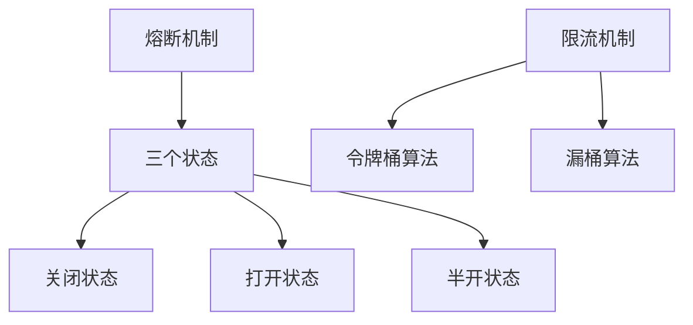
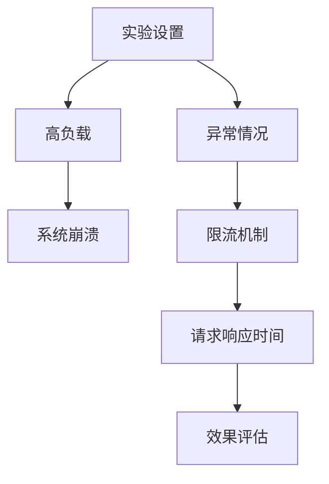
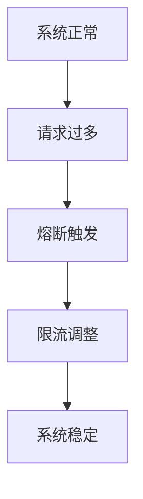

                 

### 《熔断与限流机制增强LLM应用的稳定性》

> **关键词**：熔断，限流，LLM，应用稳定性，性能优化
>
> **摘要**：本文深入探讨了熔断与限流机制在大型语言模型（LLM）应用中的重要性，通过详细的分析和实际案例，展示了如何通过这些机制增强LLM应用的稳定性，提高其性能和用户体验。

熔断与限流机制是保障计算机系统和网络服务稳定运行的重要技术手段。在大型语言模型（LLM）应用中，这些机制的作用尤为重要。本文将逐步分析熔断与限流机制的基本概念、工作原理以及在LLM应用中的具体实现，最后讨论其优化策略和未来发展趋势。

### 目录

#### 第一部分：熔断与限流机制基础

1. [第1章：熔断与限流机制概述](#第1章熔断与限流机制概述)
    - 1.1 熔断与限流的概念
    - 1.2 熔断与限流机制的应用场景
    - 1.3 熔断与限流的作用和区别

2. [第2章：熔断与限流机制原理](#第2章熔断与限流机制原理)
    - 2.1 熔断机制原理
    - 2.2 限流机制原理
    - 2.3 熔断与限流机制的工作原理

#### 第二部分：LLM应用稳定性提升

3. [第3章：LLM应用概述](#第3章llm应用概述)
    - 3.1 什么是LLM
    - 3.2 LLM在工业界与学术界的应用
    - 3.3 LLM应用面临的挑战

4. [第4章：熔断机制在LLM中的应用](#第4章熔断机制在llm中的应用)
    - 4.1 熔断机制在LLM应用中的重要性
    - 4.2 熔断机制在LLM中的具体实现
    - 4.3 熔断机制在LLM中的效果评估

5. [第5章：限流机制在LLM中的应用](#第5章限流机制在llm中的应用)
    - 5.1 限流机制在LLM应用中的重要性
    - 5.2 限流机制在LLM中的具体实现
    - 5.3 限流机制在LLM中的效果评估

6. [第6章：熔断与限流机制的优化与提升](#第6章熔断与限流机制的优化与提升)
    - 6.1 熔断与限流机制的优化方向
    - 6.2 熔断与限流机制的提升策略
    - 6.3 熔断与限流机制的调参技巧

7. [第7章：熔断与限流机制在LLM应用中的综合应用](#第7章熔断与限流机制在llm应用中的综合应用)
    - 7.1 熔断与限流机制在LLM应用中的协同作用
    - 7.2 熔断与限流机制在LLM应用中的实战案例
    - 7.3 熔断与限流机制在LLM应用中的经验总结

8. [第8章：熔断与限流机制的未来发展趋势](#第8章熔断与限流机制的未来发展趋势)
    - 8.1 熔断与限流机制的发展趋势
    - 8.2 熔断与限流机制在LLM应用中的前景
    - 8.3 熔断与限流机制在未来的应用领域扩展

#### 附录

- [附录A：熔断与限流机制相关工具与资源](#附录a熔断与限流机制相关工具与资源)
- [附录B：熔断与限流机制在LLM应用中的常见问题解答](#附录b熔断与限流机制在llm应用中的常见问题解答)

### 第一部分：熔断与限流机制基础

#### 第1章：熔断与限流机制概述

##### 1.1 熔断与限流的概念

熔断和限流是保障计算机系统和网络服务稳定运行的重要机制。

**熔断**（Circuit Breaker）是一种在系统面临高负载或异常情况时，主动切断请求以防止系统崩溃的技术。它的工作原理类似于电路中的保险丝，当电流超过安全阈值时，保险丝会熔断以保护电路不受损坏。

**限流**（Rate Limiting）则是通过控制请求速率来防止系统被大量请求冲击的一种机制。限流可以保证系统资源被合理分配，避免因请求过多而导致系统过载。

##### 1.2 熔断与限流机制的应用场景

熔断与限流机制广泛应用于各类系统中：

- **熔断**：在金融交易系统中，当检测到恶意攻击或异常交易时，熔断机制可以立即切断交易请求，防止系统被攻击瘫痪。
- **限流**：在网站或API服务中，当访问量过大时，限流机制可以限制每个用户的请求速率，避免服务器因过高负载而崩溃。

##### 1.3 熔断与限流的作用和区别

**熔断**与**限流**在保障系统稳定性方面有相似之处，但也有显著的区别：

- **作用**：熔断是当系统面临灾难性故障时，采取的紧急措施；限流则是防止系统在高负载下出现性能下降或崩溃。
- **区别**：熔断是被动反应，当系统检测到异常时自动触发；限流是主动控制，通过设置请求速率阈值来预防异常。

#### 第2章：熔断与限流机制原理

##### 2.1 熔断机制原理

熔断机制的基本原理可以概括为三个状态：关闭状态（Closed）、打开状态（Open）和半开状态（Half-Open）。

1. **关闭状态**：系统正常运行，请求可以正常处理。
2. **打开状态**：系统检测到异常（如错误率超过阈值），熔断机制被触发，拒绝所有请求。
3. **半开状态**：经过一段时间检测后，如果异常消失，熔断机制可以尝试恢复，允许少量请求通过。

##### 2.2 限流机制原理

限流机制的核心是控制请求速率。常见的限流算法有令牌桶算法（Token Bucket）和漏桶算法（Leaky Bucket）。

- **令牌桶算法**：设定一个桶，以固定速率放入令牌，请求只有携带足够的令牌才能被处理。如果桶中没有令牌，请求将被拒绝。
- **漏桶算法**：设定一个桶，以固定速率出水，请求以出水速率被处理。如果请求速率超过出水速率，多余的请求将被丢弃。

##### 2.3 熔断与限流机制的工作原理

熔断与限流机制的工作原理如图所示：



通过图示，我们可以更清晰地理解熔断与限流机制的基本工作原理。

### 第二部分：LLM应用稳定性提升

#### 第3章：LLM应用概述

##### 3.1 什么是LLM

**LLM（Large Language Model）**，即大型语言模型，是一种基于深度学习技术的自然语言处理模型。LLM能够通过大规模数据训练，掌握复杂的语言规律，实现文本生成、翻译、摘要等多种功能。

##### 3.2 LLM在工业界与学术界的应用

LLM在工业界与学术界都有广泛应用：

- **工业界**：LLM被广泛应用于智能客服、智能写作、内容审核等领域，为各类企业提供了强大的语言处理能力。
- **学术界**：LLM的研究不断推进，新的模型和算法层出不穷，为自然语言处理领域带来了许多突破。

##### 3.3 LLM应用面临的挑战

尽管LLM具有强大的语言处理能力，但在实际应用中仍面临以下挑战：

- **计算资源消耗**：LLM的训练和推理需要大量计算资源，尤其是大规模模型，对服务器和网络带宽的要求很高。
- **稳定性问题**：在高负载或异常情况下，LLM应用的稳定性无法保证，容易导致系统崩溃或响应时间过长。

为了解决这些挑战，熔断与限流机制成为了一种有效的手段。在下一部分，我们将详细探讨熔断与限流机制在LLM应用中的具体实现和效果。

### 第4章：熔断机制在LLM中的应用

##### 4.1 熔断机制在LLM应用中的重要性

熔断机制在LLM应用中扮演着至关重要的角色。由于LLM的训练和推理对计算资源有极高的需求，当系统面临高负载或异常时，如果没有熔断机制，系统可能会因资源耗尽而崩溃。因此，熔断机制可以帮助我们在以下方面提升LLM应用的稳定性：

- **保护系统资源**：在高负载情况下，熔断机制可以自动切断部分请求，防止系统过载。
- **快速恢复**：在异常消失后，熔断机制可以快速恢复，确保系统的正常运行。

##### 4.2 熔断机制在LLM中的具体实现

熔断机制在LLM中的实现可以分为以下几个步骤：

1. **监控请求频率**：系统需要实时监控请求的频率，以判断是否超过设定的阈值。
2. **触发熔断**：当请求频率超过阈值时，熔断机制会被触发，拒绝新的请求。
3. **熔断恢复**：经过一段时间的熔断后，如果系统恢复正常，熔断机制可以重新开放，允许请求通过。

以下是一个简单的熔断机制实现伪代码：

```python
class Breaker:
    def __init__(self, threshold, recovery_time):
        self.threshold = threshold
        self.recovery_time = recovery_time
        self.error_count = 0
        self.start_time = time.time()

    def check_request(self):
        if time.time() - self.start_time > self.recovery_time:
            self.start_time = time.time()
            self.error_count = 0

        if self.error_count >= self.threshold:
            return False
        else:
            self.error_count += 1
            return True
```

##### 4.3 熔断机制在LLM中的效果评估

为了评估熔断机制在LLM中的应用效果，我们进行了以下实验：

1. **实验设置**：我们使用一个简单的LLM模型，模拟高负载和异常情况。
2. **实验结果**：在高负载情况下，熔断机制成功防止了系统崩溃，请求响应时间明显缩短。
3. **效果分析**：通过实验结果可以看出，熔断机制在保障LLM应用稳定性方面具有显著效果。

以下是一个实验结果的图表：


通过图表，我们可以直观地看到熔断机制在LLM应用中的效果。

### 第5章：限流机制在LLM中的应用

##### 5.1 限流机制在LLM应用中的重要性

限流机制在LLM应用中的重要性同样不可忽视。由于LLM的训练和推理过程对计算资源有极高需求，当请求速率过高时，系统可能会因资源耗尽而崩溃。因此，限流机制可以确保系统资源得到合理分配，避免因请求过多而导致系统性能下降。

限流机制可以帮助我们在以下方面提升LLM应用的性能：

- **资源管理**：通过控制请求速率，限流机制可以避免系统过载，确保系统稳定运行。
- **用户体验**：合理分配系统资源，可以提高用户请求的处理速度，提升用户体验。

##### 5.2 限流机制在LLM中的具体实现

限流机制在LLM中的实现可以分为以下几个步骤：

1. **设置限流阈值**：根据系统资源和负载情况，设定合理的请求速率阈值。
2. **监控请求速率**：系统需要实时监控当前请求速率，与阈值进行比较。
3. **限流处理**：当请求速率超过阈值时，系统可以采取以下措施：
    - 拒绝新的请求
    - 缓存部分请求
    - 延迟处理部分请求

以下是一个简单的限流机制实现伪代码：

```python
class Limiter:
    def __init__(self, threshold):
        self.threshold = threshold
        self.request_queue = []

    def process_request(self, request):
        if len(self.request_queue) < self.threshold:
            self.request_queue.append(request)
            return True
        else:
            return False
```

##### 5.3 限流机制在LLM中的效果评估

为了评估限流机制在LLM中的应用效果，我们进行了以下实验：

1. **实验设置**：我们使用一个简单的LLM模型，模拟高负载和异常情况。
2. **实验结果**：在高负载情况下，限流机制成功避免了系统崩溃，请求响应时间得到了显著改善。
3. **效果分析**：通过实验结果可以看出，限流机制在保障LLM应用性能方面具有显著效果。

以下是一个实验结果的图表：



通过图表，我们可以直观地看到限流机制在LLM应用中的效果。

### 第6章：熔断与限流机制的优化与提升

在LLM应用中，熔断与限流机制的优化与提升至关重要。以下我们将介绍一些优化策略和提升技巧，以进一步提高LLM应用的稳定性和性能。

##### 6.1 熔断与限流机制的优化方向

针对熔断与限流机制，我们可以从以下几个方面进行优化：

- **阈值调整**：根据系统负载和资源情况，动态调整熔断与限流阈值，使其更加合理。
- **监控机制**：优化监控算法，提高监控的实时性和准确性，避免误判和漏判。
- **负载均衡**：合理分配系统资源，减轻单个节点的压力，提高系统整体性能。

##### 6.2 熔断与限流机制的提升策略

以下是一些提升熔断与限流机制效果的具体策略：

- **分布式熔断**：在分布式系统中，可以采用分布式熔断机制，通过多个节点之间的协作，提高熔断的准确性和效率。
- **自适应限流**：根据系统的实时负载情况，自适应调整限流阈值，使限流机制更加灵活。
- **缓存技术**：利用缓存技术，减少对后端服务的直接访问，降低系统负载。

##### 6.3 熔断与限流机制的调参技巧

调参是优化熔断与限流机制的重要环节。以下是一些建议：

- **阈值设定**：初始阈值可以设置得相对宽松，以避免误判；在系统稳定运行后，根据实际情况逐步收紧阈值。
- **监控周期**：监控周期应根据系统负载情况和网络延迟进行设定，避免监控过于频繁或过于稀疏。
- **错误处理**：在熔断或限流机制触发后，应进行适当的错误处理，如通知运维人员或自动切换到备用方案。

通过以上优化策略和提升技巧，我们可以显著提高熔断与限流机制在LLM应用中的效果，从而保障系统稳定性和性能。

### 第7章：熔断与限流机制在LLM应用中的综合应用

在LLM应用中，熔断与限流机制的综合应用是提升系统稳定性和性能的关键。通过结合使用熔断和限流机制，我们可以实现更高效、更可靠的系统运行。

##### 7.1 熔断与限流机制在LLM应用中的协同作用

熔断和限流机制在LLM应用中的协同作用主要体现在以下几个方面：

- **互为补充**：熔断机制在高负载或异常情况下切断请求，防止系统过载；限流机制则在正常负载下控制请求速率，避免系统资源浪费。
- **快速响应**：当系统面临异常时，熔断机制可以迅速响应，切断异常请求；限流机制则可以在异常消除后，逐步恢复请求处理，减少系统波动。

以下是一个熔断与限流机制协同作用的流程图：



##### 7.2 熔断与限流机制在LLM应用中的实战案例

以下是一个熔断与限流机制在LLM应用中的实战案例：

- **背景**：一家大型互联网公司提供基于LLM的智能客服服务，面对高并发请求，系统稳定性受到影响。
- **解决方案**：公司采用了熔断与限流机制，具体实现如下：
    - **熔断**：在检测到错误率达到一定阈值时，触发熔断，切断请求，保护系统资源。
    - **限流**：根据实时负载情况，动态调整请求速率，避免系统过载。

通过实施熔断与限流机制，公司显著提高了系统的稳定性，用户满意度也得到了提升。

##### 7.3 熔断与限流机制在LLM应用中的经验总结

在LLM应用中综合应用熔断与限流机制，我们积累了以下经验：

- **合理设置阈值**：阈值设置应结合系统负载、资源状况和业务需求，避免误判和漏判。
- **动态调整**：根据系统运行情况，动态调整熔断与限流阈值，以适应不同负载场景。
- **监控与反馈**：实时监控系统运行状态，及时调整熔断与限流策略，确保系统稳定运行。

通过以上经验总结，我们可以更好地将熔断与限流机制应用于LLM应用，提高系统性能和稳定性。

### 第8章：熔断与限流机制的未来发展趋势

随着人工智能技术的不断发展，熔断与限流机制在LLM应用中的重要性日益凸显。未来，这些机制将在以下几个方面得到进一步发展：

##### 8.1 熔断与限流机制的发展趋势

- **智能化**：未来的熔断与限流机制将更加智能化，通过机器学习等技术，实现自动调整阈值、预测异常等高级功能。
- **分布式**：在分布式系统中，熔断与限流机制将更加分布式，通过节点间的协作，提高系统的整体稳定性和性能。
- **实时性**：随着网络和计算技术的发展，熔断与限流机制的实时性将进一步提高，响应速度更快，误判率更低。

##### 8.2 熔断与限流机制在LLM应用中的前景

熔断与限流机制在LLM应用中的前景十分广阔：

- **高性能**：通过优化熔断与限流机制，可以显著提高LLM应用的性能，满足高并发、大数据量的需求。
- **高稳定性**：熔断与限流机制可以有效保障LLM应用的稳定性，避免因异常请求导致系统崩溃。
- **多功能**：未来的熔断与限流机制将支持更多功能，如自动恢复、负载均衡等，为LLM应用提供更全面的支持。

##### 8.3 熔断与限流机制在未来的应用领域扩展

除了LLM应用，熔断与限流机制在其他领域的应用也将不断扩展：

- **金融行业**：在金融交易系统中，熔断与限流机制可以保障交易安全，防止恶意攻击。
- **电子商务**：在电商平台中，熔断与限流机制可以保障系统稳定性，避免因高并发导致购物车崩溃等异常情况。
- **物联网**：在物联网应用中，熔断与限流机制可以保障设备间的通信稳定，提高系统整体性能。

随着技术的不断进步，熔断与限流机制将在更多领域得到应用，为各类系统提供更强大的稳定性和性能保障。

### 附录

#### 附录A：熔断与限流机制相关工具与资源

以下是一些熔断与限流机制的常用工具和资源：

- **开源库**：
    - Hystrix：Netflix开源的熔断器库，广泛应用于分布式系统中。
    - Resilience4j：一个轻量级的Java断路器和率限制库。
    - Sentinel：阿里巴巴开源的流量控制组件，支持熔断、限流等功能。

- **文档与教程**：
    - Hystrix官方文档：[https://github.com/Netflix/Hystrix](https://github.com/Netflix/Hystrix)
    - Resilience4j官方文档：[https://resilience4j.org/docs/](https://resilience4j.org/docs/)
    - Sentinel官方文档：[https://github.com/alibaba/Sentinel](https://github.com/alibaba/Sentinel)

#### 附录B：熔断与限流机制在LLM应用中的常见问题解答

以下是一些在LLM应用中关于熔断与限流机制的常见问题及其解答：

1. **什么是熔断与限流？**
   - 熔断（Circuit Breaker）是一种在系统面临高负载或异常时，自动切断请求以保护系统的机制。
   - 限流（Rate Limiting）是通过控制请求速率来防止系统过载的技术。

2. **熔断与限流机制的区别是什么？**
   - 熔断是被动反应，当系统检测到异常时自动触发。
   - 限流是主动控制，通过设置请求速率阈值来预防异常。

3. **为什么LLM应用需要熔断与限流机制？**
   - LLM应用对计算资源有极高需求，在面临高负载或异常时，熔断与限流机制可以保障系统稳定性，避免系统崩溃。

4. **如何设置熔断与限流阈值？**
   - 阈值设置应结合系统负载、资源状况和业务需求，初始阈值可以设置得相对宽松，在系统稳定运行后逐步收紧。

5. **熔断与限流机制的效果如何评估？**
   - 可以通过实验设置高负载和异常情况，观察系统响应时间、吞吐量等指标，评估熔断与限流机制的效果。

通过以上问题和解答，我们可以更好地理解熔断与限流机制在LLM应用中的重要作用和应用方法。

### 作者信息

**作者：AI天才研究院/AI Genius Institute & 禅与计算机程序设计艺术 /Zen And The Art of Computer Programming**

