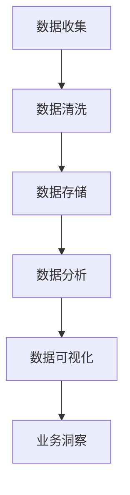

                 

# 《独立创业者的AI驱动数据可视化：直观呈现业务洞察的BI工具开发》

## 摘要

在当今的商业环境中，数据已经成为决策者的重要资产。对于独立创业者而言，如何高效地处理和分析大量数据，从中提取有价值的信息，成为他们成功的关键。本书旨在为独立创业者提供一套基于人工智能（AI）驱动的数据可视化方法和工具，帮助他们直观地呈现业务洞察，从而做出数据驱动的决策。本书将从AI和数据可视化的基本概念出发，详细阐述数据准备、AI驱动数据可视化技术、BI工具开发实战、业务洞察与数据驱动决策、项目管理和持续优化、以及安全与合规等方面的内容。通过本书的阅读和实践，独立创业者将能够掌握数据可视化的核心技能，提升业务分析能力，从而在激烈的市场竞争中脱颖而出。

## 第一部分: 引言与背景

### 第1章: 引言与背景

#### 引言

独立创业者在企业发展初期面临着诸多挑战，其中包括资金有限、市场竞争力强、资源匮乏等。在这个信息爆炸的时代，数据已经成为商业决策的重要依据。然而，对于许多创业者来说，如何从海量的数据中提取有价值的信息，并将其转化为具体的业务洞察，仍然是一个难题。人工智能（AI）的出现为这一问题提供了新的解决方案。AI驱动数据可视化技术，可以帮助独立创业者直观地理解数据，发现潜在的业务机会，从而做出更加精准的决策。

#### AI与数据可视化

AI与数据可视化的结合，使得数据分析过程变得更加高效和直观。AI技术可以通过机器学习和深度学习算法，对大量数据进行处理和分析，提取出有用的特征和模式。这些特征和模式可以被进一步转化为可视化图表和图形，使得创业者能够快速理解和利用数据，指导业务发展。

#### BI工具及其重要性

商业智能（BI）工具是数据可视化的重要载体。BI工具能够将复杂的数据进行分析和处理，生成各种类型的图表和报表，帮助创业者清晰地了解业务状况。同时，BI工具还具有数据挖掘和预测分析的功能，能够为创业者提供前瞻性的业务洞察。

#### 独立创业者的需求与挑战

独立创业者在数据可视化和BI工具的使用上，面临着以下几个挑战：

1. **技术门槛**：许多创业者缺乏专业的技术背景，对数据可视化和AI技术的理解和应用存在困难。
2. **成本问题**：高质量的BI工具和AI技术通常需要较高的投入，对于资金有限的创业者来说，这是一个重要的考虑因素。
3. **数据安全与隐私**：在数据日益成为企业核心资产的背景下，数据安全和隐私保护成为独立创业者的一个重要问题。

本书旨在解决上述问题，为独立创业者提供一套全面、易懂、实用的数据可视化解决方案，帮助他们克服这些挑战，实现业务的快速发展。

### 设计目录大纲

本书将分为以下几个部分，每个部分都针对独立创业者在数据可视化和BI工具使用中的具体需求进行深入探讨：

#### 第1章: 引言与背景
- 引言
- AI与数据可视化
- BI工具及其重要性
- 独立创业者的需求与挑战

#### 第2章: AI驱动数据可视化的基本概念
- 数据可视化简介
- AI技术在数据可视化中的应用
- BI工具的基本原理

#### 第3章: 数据准备与清洗
- 数据源选择
- 数据清洗流程
- 数据格式转换

#### 第4章: AI驱动数据可视化技术
- 机器学习算法概述
- 特征工程
- 数据可视化技术

#### 第5章: BI工具开发实战
- BI工具选择与搭建
- 数据导入与存储
- 数据分析与可视化

#### 第6章: 业务洞察与数据驱动决策
- 业务洞察的重要性
- 数据驱动决策模型
- 案例研究：独立创业者的成功故事

#### 第7章: 项目管理与持续优化
- 项目管理基本流程
- 持续优化策略
- 持续学习和迭代

#### 第8章: 安全与合规
- 数据安全
- 隐私保护
- 合规性考虑

#### 附录：相关资源与工具
- 开源数据可视化库
- BI工具资源
- 学习资料与推荐阅读

通过以上章节的深入讲解，本书将帮助独立创业者全面掌握AI驱动数据可视化和BI工具的应用，提升业务分析能力，实现企业的可持续发展。

### 第2章: AI驱动数据可视化的基本概念

#### 数据可视化简介

数据可视化是一种将复杂的数据信息通过图形、图表和图形进行展示的技术。通过数据可视化，用户可以更直观地理解数据，发现数据中的模式和规律，从而做出更加明智的决策。数据可视化不仅仅是一种展示工具，它还能够帮助用户发现数据中的潜在问题，提供决策支持。

数据可视化的发展可以追溯到20世纪60年代，当时计算机刚刚开始普及，人们开始尝试使用图形来展示数据。随着时间的推移，数据可视化技术不断发展，从简单的柱状图、折线图，到更加复杂的交互式图表和动态可视化，数据可视化在各个领域得到了广泛应用。

#### AI技术在数据可视化中的应用

人工智能（AI）技术在数据可视化中的应用，使得数据可视化技术得到了进一步提升。AI技术可以通过机器学习和深度学习算法，对大量数据进行处理和分析，提取出有用的特征和模式。这些特征和模式可以转化为更加精细和直观的可视化图表，为用户提供了更加丰富的数据洞察。

以下是AI技术在数据可视化中的一些具体应用：

1. **自动数据分类**：AI算法可以自动将数据分类，生成聚类图或决策树，帮助用户快速理解数据的分布和特征。
2. **自动生成图表**：AI技术可以自动识别数据中的模式，生成最合适的可视化图表，提高数据可视化的效率和准确性。
3. **交互式数据探索**：AI技术可以帮助用户进行交互式数据探索，通过自然语言处理和交互式图表，用户可以更加灵活地探索数据，提取有价值的信息。
4. **实时数据更新**：AI技术可以实现数据的实时更新和动态可视化，用户可以实时监控业务数据的变化，做出及时的反应。

#### BI工具的基本原理

商业智能（BI）工具是一种集数据集成、数据分析和数据可视化于一体的软件系统。BI工具可以帮助企业收集、存储、分析和展示数据，提供决策支持。BI工具的基本原理主要包括以下几个方面：

1. **数据集成**：BI工具可以将来自不同来源的数据进行整合，形成一个统一的数据仓库。通过数据集成，用户可以获取到全面、一致的数据信息。
2. **数据分析**：BI工具提供强大的数据分析功能，包括数据挖掘、统计分析、预测分析等。通过数据分析，用户可以深入了解数据的内在规律，发现潜在的业务机会。
3. **数据可视化**：BI工具通过图表、报表和交互式图表等方式，将分析结果直观地展示给用户。数据可视化不仅提高了数据理解的可视化性，还能够激发用户的创造力，帮助用户从不同角度探索数据。
4. **报告生成**：BI工具可以自动生成各种类型的报告，包括仪表板、摘要报告、详细报告等。报告生成功能使得用户可以方便地共享和交流数据分析结果。

通过以上基本原理，BI工具为企业提供了一个全面的数据分析平台，帮助用户从海量数据中提取有价值的信息，支持企业的战略决策。

### 第3章: 数据准备与清洗

#### 数据源选择

数据准备与清洗是数据可视化过程中至关重要的一环。数据源的选择直接影响到数据的质量和可靠性。在选择数据源时，独立创业者需要考虑以下几个关键因素：

1. **数据质量**：选择高质量的数据源是确保数据准备与清洗成功的前提。创业者需要选择数据完整、准确、可靠的数据源。数据源的质量直接关系到最终的可视化结果和分析的准确性。
2. **数据完整性**：确保数据源的完整性，避免数据缺失或重复。创业者可以通过合并多个数据源，确保数据的全面性。
3. **数据格式**：选择易于处理和转换的数据格式。常见的格式包括CSV、JSON、XML等。选择合适的数据格式有助于简化数据清洗和转换过程。
4. **数据来源的可靠性**：选择可靠的数据来源，确保数据的真实性和可信度。创业者可以从权威的数据提供商或内部数据系统获取数据。

#### 数据清洗流程

数据清洗是数据准备与清洗的核心步骤。通过数据清洗，创业者可以消除数据中的错误、异常和重复，提高数据的质量和可用性。数据清洗流程通常包括以下几个步骤：

1. **数据验证**：在数据导入之前，对数据进行初步的验证，检查数据的完整性、格式和类型。例如，检查是否所有的数据字段都有值，数据格式是否正确等。
2. **数据清洗**：针对数据中的错误和异常值进行修正或删除。常见的清洗方法包括：
   - 异常值处理：删除或修正数据中的异常值，确保数据的均匀性和一致性。
   - 空值处理：填充或删除空值，确保数据的完整性。
   - 数据格式转换：将不同格式的数据转换为统一的格式，便于后续处理和分析。
3. **数据去重**：识别和删除重复的数据记录，确保数据的唯一性和准确性。
4. **数据标准化**：对数据进行标准化处理，将不同单位或格式的数据转换为统一的单位或格式，便于数据的集成和分析。

#### 数据格式转换

数据格式转换是数据准备与清洗过程中的重要步骤。不同的数据源可能采用不同的数据格式，例如CSV、JSON、XML等。为了方便数据集成和分析，创业者需要将数据转换为统一的数据格式。

数据格式转换的步骤通常包括：

1. **数据解析**：解析不同格式的数据，提取出有用的数据字段和值。
2. **数据映射**：将不同数据源的字段映射到统一的数据模型中，确保数据的结构和语义的一致性。
3. **数据转换**：将数据转换为统一的数据格式，例如CSV或JSON。数据转换可以使用编程语言（如Python）或专门的数据处理工具（如Pandas库）完成。
4. **数据验证**：在数据转换后，对数据进行验证，确保转换后的数据格式正确、完整和可靠。

通过数据准备与清洗，创业者可以确保数据的质量和可靠性，为后续的数据分析和可视化奠定基础。高质量的数据是数据可视化和BI工具成功的关键，创业者需要投入足够的时间和精力来处理数据准备与清洗工作。

### 第4章: AI驱动数据可视化技术

#### 机器学习算法概述

机器学习（Machine Learning）是人工智能（AI）的核心组成部分，通过训练模型从数据中学习，从而对未知数据进行预测或分类。在AI驱动的数据可视化中，机器学习算法扮演着重要角色，它们可以帮助提取数据中的隐藏模式和关系，为可视化提供更深入的洞察。

机器学习算法可以分为以下几类：

1. **监督学习**：监督学习算法使用带有标签的数据进行训练，例如回归、分类和排序。常见的监督学习算法包括线性回归、决策树、支持向量机和神经网络等。
2. **无监督学习**：无监督学习算法不使用标签数据，直接从数据中提取模式和结构，例如聚类和降维。常见的无监督学习算法包括K-均值聚类、主成分分析和自编码器等。
3. **强化学习**：强化学习算法通过试错和反馈进行学习，旨在通过奖励和惩罚来优化决策。常见的强化学习算法包括Q学习和深度强化学习。

在数据可视化中，常见的机器学习应用包括：

- **特征提取**：使用特征提取算法（如主成分分析PCA）从高维数据中提取主要特征，简化数据结构，提高可视化效果。
- **聚类分析**：使用聚类算法（如K-均值聚类）对数据点进行分组，识别数据的分布和模式，有助于发现数据中的隐含结构。
- **分类和预测**：使用分类和回归算法（如随机森林、梯度提升树）对数据进行分析和预测，为可视化提供决策支持。

#### 特征工程

特征工程（Feature Engineering）是数据科学中的一个关键步骤，其目标是通过选择和构建合适的特征，提高模型的预测性能。在数据可视化中，特征工程至关重要，它不仅影响数据的理解和解释，还影响可视化的质量和效果。

特征工程的主要步骤包括：

1. **数据预处理**：对原始数据进行清洗和转换，包括缺失值填充、异常值处理和数据标准化。
2. **特征选择**：从原始数据中选择最有用的特征，去除冗余和无关的特征，提高模型的效率和性能。
3. **特征构造**：通过组合和转换原始特征，创建新的特征，以增强模型的预测能力。
4. **特征转换**：将特征转换为适合机器学习算法的形式，例如二值化、标准化、归一化等。

特征工程在数据可视化中的应用包括：

- **交互式特征选择**：允许用户通过交互式方式选择和调整特征，以探索数据的多种视角。
- **动态特征调整**：根据用户的操作和反馈，动态调整特征权重和参数，以优化可视化效果。
- **高级特征构造**：使用高级算法（如主成分分析PCA、因子分析FA）提取更高层次的抽象特征，提高可视化的表达力。

#### 数据可视化技术

数据可视化技术是将数据以图形或图表的形式展示给用户，使其能够直观地理解数据中的模式和关系。在AI驱动的数据可视化中，数据可视化技术不仅依赖于传统的图表类型（如柱状图、折线图、散点图等），还结合了AI算法来增强可视化的效果和交互性。

以下是几种常见的数据可视化技术：

1. **交互式可视化**：交互式可视化允许用户通过点击、拖动和滚动等操作，与可视化图表进行交互。常见的交互式可视化工具包括D3.js、Plotly和Bokeh等。
2. **动态可视化**：动态可视化通过动画和实时更新，展示数据的变化趋势和动态过程。动态可视化技术可以增强用户的理解和记忆，例如通过时间序列分析展示股票市场的动态变化。
3. **多维数据可视化**：多维数据可视化技术用于展示具有多个维度的高维数据。常见的多维数据可视化方法包括平行坐标图、热力图和散点图矩阵等。
4. **可视化可视化**：可视化可视化是一种将可视化本身作为数据进行分析和展示的技术。例如，使用可视化图表来展示可视化效果的好坏，帮助用户调整和优化可视化。

#### AI驱动数据可视化案例

以下是一个AI驱动数据可视化的案例：

1. **数据收集**：收集一家零售商的销售数据，包括销售额、顾客数量、促销活动等。
2. **数据预处理**：对销售数据进行清洗和转换，处理缺失值、异常值和重复值，确保数据的质量。
3. **特征工程**：提取和构造销售数据中的关键特征，如顾客年龄、购买频率、销售额分布等。
4. **机器学习**：使用聚类算法对顾客群体进行细分，根据购买行为和偏好将顾客分为不同的类别。
5. **数据可视化**：使用散点图和气泡图展示顾客群体的分布，通过颜色和大小表示不同顾客类别的特征。
6. **交互式探索**：允许用户通过点击和拖动操作，探索不同顾客群体的购买行为和偏好，发现潜在的市场机会。

通过这个案例，可以看到AI驱动数据可视化如何帮助独立创业者深入理解数据，发现业务洞察，从而做出更加精准的决策。AI驱动数据可视化不仅提高了数据可视化的效率和质量，还增强了用户的交互体验，为创业者的业务发展提供了有力支持。

### 第5章: BI工具开发实战

#### BI工具选择与搭建

在选择BI工具时，独立创业者需要考虑以下关键因素：

1. **功能需求**：根据业务需求，选择具备所需功能（如数据导入、数据清洗、数据分析、数据可视化等）的BI工具。
2. **易用性**：选择易于上手和操作的BI工具，特别是对于缺乏技术背景的创业者。
3. **扩展性**：选择具有良好扩展性的BI工具，以支持未来的业务扩展和功能需求。
4. **成本**：在预算范围内选择性价比高的BI工具，权衡功能、易用性和成本。

常见的BI工具包括：

- **Tableau**：一款功能强大的商业智能和数据可视化工具，提供丰富的可视化图表和交互功能。
- **Power BI**：微软推出的商业智能工具，与Microsoft 365集成，支持多种数据源和强大的数据分析功能。
- **QlikView**：一款高性能的商业智能平台，提供灵活的数据可视化和探索功能。

搭建BI工具的步骤如下：

1. **确定数据源**：选择合适的数据源，包括内部数据库、云存储、API等。
2. **数据导入**：使用BI工具的导入功能，将数据源中的数据导入到BI工具中。
3. **数据清洗**：对导入的数据进行清洗和转换，确保数据的质量和一致性。
4. **数据建模**：创建数据模型，将不同数据源的数据进行整合，构建数据仓库。
5. **数据分析**：使用BI工具的数据分析功能，进行数据分析和挖掘，提取有价值的信息。

#### 数据导入与存储

数据导入与存储是BI工具开发的重要环节。以下是一些关键步骤和注意事项：

1. **数据连接**：使用BI工具提供的连接器，将数据源与BI工具连接起来，实现数据的导入。
2. **数据转换**：在导入数据时，可能需要对其进行转换，例如数据类型转换、格式转换等，以确保数据的一致性和完整性。
3. **数据存储**：在BI工具中创建数据表和数据仓库，将导入的数据存储和管理起来。常见的数据存储方式包括关系数据库（如MySQL、PostgreSQL）、NoSQL数据库（如MongoDB、Cassandra）等。
4. **数据备份**：定期对数据仓库进行备份，防止数据丢失或损坏。备份可以采用全备份、增量备份或差异备份等方式。

#### 数据分析与可视化

数据分析与可视化是BI工具的核心功能，以下是一些关键步骤和技巧：

1. **数据探索**：通过BI工具的查询和分析功能，对数据进行初步的探索和分析，发现数据中的模式和关系。
2. **数据清洗**：在数据探索过程中，对数据进行清洗和转换，去除重复值、异常值和缺失值，确保数据的质量。
3. **数据建模**：根据业务需求，创建数据模型，将数据源中的数据整合到一起，进行数据分析和挖掘。
4. **数据可视化**：使用BI工具的可视化功能，将分析结果以图表、报表和交互式图表的形式展示出来。选择合适的图表类型，如柱状图、折线图、饼图、散点图等，以直观地呈现数据。
5. **交互式探索**：提供用户交互功能，允许用户通过点击、拖动、筛选等操作，动态地探索数据和可视化效果，获取更深入的洞察。

以下是一个数据分析与可视化的实战案例：

1. **数据收集**：收集一家电商平台的销售数据，包括销售额、商品种类、顾客购买行为等。
2. **数据导入**：使用BI工具将销售数据导入到数据仓库中。
3. **数据清洗**：对销售数据进行清洗和转换，处理异常值和缺失值，确保数据的质量。
4. **数据建模**：创建数据模型，将销售数据与其他数据源（如商品信息、顾客信息）进行整合。
5. **数据分析**：使用BI工具进行数据分析，分析销售额的趋势、商品的销售情况、顾客购买行为等。
6. **数据可视化**：使用柱状图、折线图、饼图等图表，展示销售额的趋势、商品的销售情况和顾客购买行为。
7. **交互式探索**：提供用户交互功能，允许用户通过点击和筛选操作，动态地探索销售数据和可视化效果。

通过这个案例，可以看到BI工具如何帮助独立创业者进行数据分析和可视化，发现业务洞察，从而做出更加精准的决策。BI工具的开发实战不仅提升了数据可视化的效率和质量，还为企业提供了强大的数据分析能力，为业务发展提供了有力支持。

### 第6章: 业务洞察与数据驱动决策

#### 业务洞察的重要性

业务洞察（Business Insights）是指通过对数据的深入分析和理解，获取关于业务运营、市场趋势、客户行为等方面的有价值的发现和见解。业务洞察对于独立创业者来说至关重要，它能够帮助创业者：

1. **理解业务现状**：通过分析历史数据，创业者可以了解业务运营的各个方面，如销售额、利润率、库存情况等，从而判断业务的健康状况。
2. **发现潜在机会**：通过对市场数据的分析，创业者可以识别出潜在的业务增长点和市场机会，如新客户群体、新产品需求等。
3. **优化业务流程**：通过数据分析，创业者可以发现业务流程中的瓶颈和问题，提出改进措施，提高运营效率。
4. **制定战略决策**：基于业务洞察，创业者可以制定更加精准和有效的战略决策，推动业务的持续发展和创新。

#### 数据驱动决策模型

数据驱动决策模型（Data-Driven Decision-Making Model）是一种基于数据分析的决策方法，它强调通过数据来支持决策过程。数据驱动决策模型包括以下几个关键步骤：

1. **定义问题**：明确需要解决的业务问题或面临的挑战，例如提升销售额、降低库存成本等。
2. **数据收集**：收集与问题相关的数据，包括内部数据（如销售数据、库存数据）和外部数据（如市场数据、竞争分析数据）。
3. **数据清洗**：对收集到的数据进行清洗和转换，确保数据的质量和一致性。
4. **数据分析**：使用数据分析工具和方法，对清洗后的数据进行深入分析，提取有价值的信息和见解。
5. **可视化呈现**：将分析结果通过图表、报表等形式进行可视化呈现，使决策者能够直观地理解数据。
6. **制定决策**：基于数据分析结果和业务洞察，制定具体的业务策略和行动方案。
7. **执行与监控**：实施决策方案，并持续监控业务效果，根据实际情况进行调整和优化。

#### 案例研究：独立创业者的成功故事

以下是一个独立创业者的成功故事，通过数据驱动决策实现了业务的快速增长：

**案例背景**：小李是一位独立创业者，经营一家线上家居装饰店。随着业务的不断发展，小李面临着如何提升销售额和优化库存管理的挑战。

**步骤1：定义问题**：小李希望提升销售额，并优化库存管理，以减少库存成本。

**步骤2：数据收集**：小李收集了销售数据、库存数据和客户反馈数据，包括销售额、商品种类、库存量、客户满意度等。

**步骤3：数据清洗**：对收集到的销售数据进行清洗，去除异常值和重复值，确保数据的质量。

**步骤4：数据分析**：使用数据分析工具，对销售数据进行趋势分析、聚类分析和关联分析，发现以下业务洞察：

- **销售趋势**：夏季是家居装饰产品的销售旺季，销售额显著上升。
- **商品销量**：沙发、窗帘和床上用品是销售最多的商品，库存不足。
- **客户满意度**：客户对产品质量和交货速度满意度较高，但在客户服务方面存在提升空间。

**步骤5：可视化呈现**：小李使用BI工具将分析结果可视化，生成趋势图、柱状图和热力图，帮助自己直观地理解数据。

**步骤6：制定决策**：

- **库存管理**：根据销售趋势，提前采购畅销商品，减少库存积压。
- **市场推广**：针对夏季销售旺季，加大市场推广力度，提高品牌知名度。
- **客户服务**：改进客户服务流程，提升客户满意度。

**步骤7：执行与监控**：小李实施决策方案，并定期监控业务效果，根据实际情况进行调整。通过数据驱动决策，小李的家居装饰店实现了销售额的显著增长，库存管理也得到了优化。

这个案例展示了数据驱动决策如何在独立创业者的业务中发挥作用。通过数据收集、分析和决策，创业者能够更加精准地了解业务状况，发现潜在问题，制定有效的解决方案，从而实现业务的持续增长和优化。

### 第7章: 项目管理与持续优化

#### 项目管理基本流程

项目管理是确保BI工具开发成功的关键。以下是一个典型的项目管理基本流程：

1. **项目启动**：明确项目目标、范围和资源需求，组建项目团队，制定项目计划和时间表。
2. **需求分析**：与相关利益相关者沟通，了解业务需求，明确BI工具的功能和性能要求。
3. **设计阶段**：设计数据架构、数据模型和可视化界面，确定技术栈和开发工具。
4. **开发阶段**：按照项目计划，进行数据集成、数据清洗、数据建模和可视化开发。
5. **测试阶段**：对BI工具进行功能测试、性能测试和用户测试，确保工具的稳定性和可靠性。
6. **部署阶段**：将BI工具部署到生产环境，进行用户培训和技术支持。
7. **维护阶段**：持续监控工具的性能和用户反馈，进行定期更新和优化。

#### 持续优化策略

持续优化是确保BI工具长期有效的重要策略。以下是一些关键策略：

1. **用户反馈**：定期收集用户反馈，了解用户的使用体验和需求变化，及时进行改进。
2. **性能监控**：监控BI工具的性能指标，如响应时间、数据加载速度等，确保工具的高效运行。
3. **数据分析**：利用数据分析和机器学习算法，发现数据中的潜在问题和改进点。
4. **迭代开发**：采用敏捷开发方法，快速迭代和发布新功能，满足不断变化的需求。
5. **技术升级**：定期评估技术栈和工具，引入新技术和工具，提高BI工具的效率和效果。

#### 持续学习和迭代

持续学习和迭代是保持项目成功和业务增长的关键。以下是一些关键实践：

1. **团队培训**：定期为团队成员提供技术培训，提升团队的技术能力和专业水平。
2. **知识共享**：鼓励团队成员分享知识和经验，促进团队学习和协作。
3. **技术论坛和会议**：参加行业技术论坛和会议，了解最新的技术趋势和最佳实践。
4. **实验和创新**：鼓励团队成员进行实验和创新，探索新的解决方案和业务模式。
5. **持续改进**：不断反思和改进项目管理和开发流程，提高项目的效率和效果。

通过以上项目管理和持续优化策略，独立创业者可以确保BI工具的开发和运营持续高效，实现业务的稳定增长和长期成功。

### 第8章: 安全与合规

#### 数据安全

数据安全是独立创业者在使用BI工具时必须重视的问题。确保数据安全，可以有效防止数据泄露、篡改和丢失。以下是一些关键措施：

1. **数据加密**：对传输和存储的数据进行加密，防止数据在传输过程中被窃取或篡改。
2. **身份验证和访问控制**：使用强密码和多因素身份验证，限制对数据系统的访问，确保只有授权用户可以访问敏感数据。
3. **数据备份和恢复**：定期对数据进行备份，并确保备份的完整性和可用性，以便在数据丢失或损坏时能够快速恢复。
4. **网络安全**：加强网络安全措施，包括使用防火墙、入侵检测系统等，防止网络攻击和数据泄露。
5. **安全审计**：定期进行安全审计，检查系统的安全漏洞和潜在风险，及时进行修复和更新。

#### 隐私保护

隐私保护是数据安全的重要组成部分，特别是在处理大量用户数据时。以下是一些隐私保护措施：

1. **数据匿名化**：对敏感数据进行匿名化处理，消除个人身份信息，降低隐私泄露风险。
2. **隐私政策**：制定明确的隐私政策，告知用户数据收集、存储和使用的目的，获取用户的同意。
3. **用户权限管理**：严格控制用户权限，确保只有必要的用户可以访问和处理敏感数据。
4. **数据访问日志**：记录数据访问日志，监控数据访问和使用情况，及时发现异常行为。
5. **隐私合规性检查**：定期进行隐私合规性检查，确保遵守相关法律法规和标准，如GDPR、CCPA等。

#### 合规性考虑

在开发和使用BI工具时，独立创业者需要确保遵守相关法律法规和行业标准。以下是一些合规性考虑：

1. **数据保护法**：了解并遵守数据保护法规，如GDPR、CCPA等，确保数据处理符合法律要求。
2. **行业标准**：遵循相关行业标准和最佳实践，如ISO/IEC 27001信息安全管理体系等。
3. **隐私保护合规**：确保隐私保护措施符合隐私保护法规和标准，如隐私政策、数据匿名化等。
4. **数据传输合规**：确保数据传输符合数据传输法规，如跨-border数据传输协议等。
5. **合规性评估**：定期进行合规性评估，检查BI工具是否符合相关法律法规和行业标准，及时进行整改。

通过以上措施，独立创业者可以确保数据安全和隐私保护，遵守相关法律法规和行业标准，为企业的发展提供坚实保障。

### 附录：相关资源与工具

#### 附录A: 开源数据可视化库

以下是几个常用的开源数据可视化库，它们可以帮助独立创业者快速实现数据可视化：

1. **D3.js**：一个基于Web标准的数据驱动文档（Data-Driven Documents）库，支持高度交互式和动态的可视化。
   - **官网**：[D3.js](https://d3js.org/)
   - **文档**：[D3.js Documentation](https://github.com/d3/d3/wiki/API-Reference)

2. **Plotly**：一个跨平台的数据可视化库，支持多种图表类型，包括散点图、柱状图、线图等。
   - **官网**：[Plotly](https://plotly.com/)
   - **文档**：[Plotly Documentation](https://plotly.com/python/)

3. **Bokeh**：一个交互式可视化库，主要用于数据分析和Web应用中的可视化。
   - **官网**：[Bokeh](https://bokeh.org/)
   - **文档**：[Bokeh Documentation](https://docs.bokeh.org/en/latest/docs/user_guide.html)

4. **ECharts**：一个使用JavaScript编写的可视化库，提供了丰富的图表类型和交互功能。
   - **官网**：[ECharts](https://echarts.apache.org/zh/index.html)
   - **文档**：[ECharts Documentation](https://echarts.apache.org/zh/tutorial.html)

#### 附录B: BI工具资源

以下是几个常用的商业智能（BI）工具，独立创业者可以根据自己的需求选择合适的工具：

1. **Tableau**：一个功能强大的商业智能和数据可视化工具，支持多种数据源和丰富的图表类型。
   - **官网**：[Tableau](https://www.tableau.com/)
   - **文档**：[Tableau Documentation](https://www.tableau.com/support/documentation)

2. **Power BI**：微软推出的商业智能工具，与Microsoft 365集成，提供强大的数据分析能力和可视化功能。
   - **官网**：[Power BI](https://powerbi.microsoft.com/)
   - **文档**：[Power BI Documentation](https://powerbi.microsoft.com/en-us/documentation/)

3. **QlikView**：一个高性能的商业智能平台，提供灵活的数据可视化和探索功能。
   - **官网**：[QlikView](https://www.qlik.com/)
   - **文档**：[QlikView Documentation](https://www.qlik.com/us/solutions/documentation)

4. **Looker**：一个基于云的商业智能工具，提供数据驱动的工作流程和数据建模功能。
   - **官网**：[Looker](https://looker.com/)
   - **文档**：[Looker Documentation](https://docs.looker.com/)

#### 附录C: 学习资料与推荐阅读

以下是几本关于数据可视化和商业智能的优秀书籍，独立创业者可以通过阅读这些书籍，进一步了解数据可视化的理论和实践：

1. **《数据可视化：从零开始学》**
   - **作者**：张巍
   - **出版社**：电子工业出版社
   - **简介**：本书从零开始，介绍了数据可视化的基本概念、方法和工具，适合初学者入门。

2. **《商业智能：方法与实践》**
   - **作者**：迈克尔·科特
   - **出版社**：机械工业出版社
   - **简介**：本书详细介绍了商业智能的理论和实践方法，包括数据集成、数据分析、数据可视化和决策支持。

3. **《机器学习与数据挖掘实战》**
   - **作者**：刘建伟
   - **出版社**：电子工业出版社
   - **简介**：本书通过实际案例，介绍了机器学习和数据挖掘的方法和应用，包括特征工程、模型选择和优化。

4. **《数据可视化：设计思维与案例研究》**
   - **作者**：爱德华·塔夫特
   - **出版社**：人民邮电出版社
   - **简介**：本书以设计思维为核心，介绍了数据可视化的原则和方法，结合大量案例，展示了数据可视化的艺术与科学。

通过阅读这些书籍，独立创业者可以加深对数据可视化和商业智能的理解，提高业务分析能力和决策水平。

### 附录D: Mermaid流程图

以下是一个使用Mermaid绘制的流程图，展示了数据收集、数据清洗、数据存储、数据分析和数据可视化的流程：



这个流程图清晰地展示了数据从收集到可视化的整个过程，帮助独立创业者更好地理解数据可视化的实现步骤。

### 附录E: 伪代码示例

以下是一个简单的伪代码示例，用于实现数据可视化：

```python
def data_visualization(data):
    # 特征工程
    processed_data = feature_engineering(data)
    
    # 数据分析
    insights = data_analysis(processed_data)
    
    # 可视化呈现
    visualization = visualization_tool(insights)
    
    return visualization
```

这个伪代码展示了数据可视化的主要步骤，包括特征工程、数据分析和可视化呈现，为独立创业者提供了一个数据可视化实现的框架。

### 附录F: 数学公式

以下是一个使用LaTeX格式的数学公式示例：

$$
\text{成本函数} = \frac{1}{2} \sum_{i=1}^{n} (\hat{y_i} - y_i)^2
$$

这个公式描述了成本函数的计算方法，用于评估模型的性能。

### 附录G: 项目实战代码解读与分析

以下是一个使用Python和matplotlib进行数据可视化的实际案例：

```python
# 导入所需的库
import matplotlib.pyplot as plt
import numpy as np

# 数据生成
x = np.linspace(0, 10, 100)
y = np.sin(x)

# 可视化
plt.plot(x, y)
plt.xlabel('x')
plt.ylabel('y = sin(x)')
plt.title('Sine Function')
plt.show()
```

这段代码首先导入了matplotlib和numpy库，然后生成了0到10之间的x值，并计算了正弦函数的y值。接下来，使用matplotlib库的plot函数绘制了x和y的散点图，并添加了标签和标题，最后使用show函数显示图表。

通过这个实战案例，独立创业者可以学习到如何使用Python和matplotlib进行基本的数据可视化，为后续的项目开发打下基础。

### 附录H: 开发环境搭建指南

要搭建一个适用于数据可视化项目开发的环境，独立创业者需要安装以下软件和工具：

1. **Python环境**：
   - **安装Python**：访问Python官方网站（[python.org](https://www.python.org/)），下载并安装Python。
   - **安装Anaconda**：推荐使用Anaconda，它是一个集成了Python和一些常用库的发行版，方便管理和安装其他库。

2. **数据可视化库**：
   - **安装matplotlib**：使用以下命令安装matplotlib库：
     ```
     pip install matplotlib
     ```

3. **数据库**：
   - **安装SQLite**：SQLite是一个轻量级的嵌入式数据库，适用于小型项目和原型开发。可以使用以下命令安装：
     ```
     pip install pysqlite3
     ```
   - **安装MySQL**：如果需要使用MySQL数据库，可以下载并安装MySQL软件，并使用以下命令安装Python库：
     ```
     pip install mysql-connector-python
     ```

4. **IDE**：
   - **安装PyCharm**：推荐使用PyCharm作为Python开发环境，它提供了丰富的功能和调试工具。可以在PyCharm官方网站下载并安装。

5. **其他工具**：
   - **安装Jupyter Notebook**：Jupyter Notebook是一个交互式的开发环境，可以方便地编写和运行Python代码，适用于数据分析和可视化项目。
     ```
     pip install notebook
     ```

通过以上步骤，独立创业者可以搭建一个完整的数据可视化开发环境，为后续的项目开发做好准备。

### 完整目录大纲

以下是本书的完整目录大纲，涵盖了从数据可视化基础到实战应用的各个方面，帮助独立创业者全面掌握AI驱动数据可视化和BI工具的开发与使用。

```markdown
# 《独立创业者的AI驱动数据可视化：直观呈现业务洞察的BI工具开发》

## 摘要

本书旨在为独立创业者提供一套基于人工智能（AI）驱动的数据可视化方法和工具，帮助他们直观地呈现业务洞察，从而做出数据驱动的决策。

### 第一部分: 引言与背景

## 第1章: 引言与背景
### 1.1 引言
### 1.2 AI与数据可视化
### 1.3 BI工具及其重要性
### 1.4 独立创业者的需求与挑战

### 第二部分: AI驱动数据可视化的基本概念

## 第2章: AI驱动数据可视化的基本概念
### 2.1 数据可视化简介
### 2.2 AI技术在数据可视化中的应用
### 2.3 BI工具的基本原理

## 第3章: 数据准备与清洗
### 3.1 数据源选择
### 3.2 数据清洗流程
### 3.3 数据格式转换

## 第4章: AI驱动数据可视化技术
### 4.1 机器学习算法概述
### 4.2 特征工程
### 4.3 数据可视化技术

### 第三部分: BI工具开发实战

## 第5章: BI工具开发实战
### 5.1 BI工具选择与搭建
### 5.2 数据导入与存储
### 5.3 数据分析与可视化

### 第四部分: 业务洞察与数据驱动决策

## 第6章: 业务洞察与数据驱动决策
### 6.1 业务洞察的重要性
### 6.2 数据驱动决策模型
### 6.3 案例研究：独立创业者的成功故事

### 第五部分: 项目管理与持续优化

## 第7章: 项目管理与持续优化
### 7.1 项目管理基本流程
### 7.2 持续优化策略
### 7.3 持续学习和迭代

### 第六部分: 安全与合规

## 第8章: 安全与合规
### 8.1 数据安全
### 8.2 隐私保护
### 8.3 合规性考虑

### 附录：相关资源与工具

## 附录A: 开源数据可视化库
## 附录B: BI工具资源
## 附录C: 学习资料与推荐阅读

## 附录D: Mermaid流程图


## 附录E: 伪代码示例
```python
def data_visualization(data):
    # 特征工程
    processed_data = feature_engineering(data)
    
    # 数据分析
    insights = data_analysis(processed_data)
    
    # 可视化呈现
    visualization = visualization_tool(insights)
    
    return visualization
```

## 附录F: 数学公式
$$
\text{成本函数} = \frac{1}{2} \sum_{i=1}^{n} (\hat{y_i} - y_i)^2
$$

## 附录G: 项目实战代码解读与分析
```python
import matplotlib.pyplot as plt
import numpy as np

x = np.linspace(0, 10, 100)
y = np.sin(x)

plt.plot(x, y)
plt.xlabel('x')
plt.ylabel('y = sin(x)')
plt.title('Sine Function')
plt.show()
```

## 附录H: 开发环境搭建指南
- 安装Python环境
- 安装数据可视化库（如matplotlib）
- 安装数据库（如SQLite或MySQL）
```

通过这个完整目录大纲，独立创业者可以系统地学习AI驱动数据可视化和BI工具的开发与使用，逐步提升业务分析和决策能力。希望本书能够成为创业路上的有力助手，助力读者实现业务的持续增长和成功。

