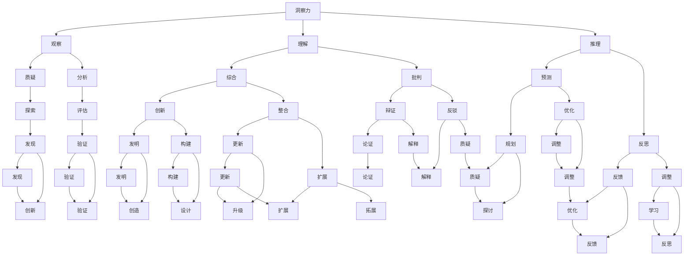

                 

### 理解洞察力的培养：鼓励质疑和批判性思维

#### 关键词：（洞察力、批判性思维、培养、质疑、教育、实践）

> 摘要：本文深入探讨了洞察力的本质及其培养方法，特别是鼓励质疑和批判性思维在其中的重要作用。通过分析核心概念和算法原理，结合实际案例分析，本文提出了一个系统化的方法，帮助读者提升洞察力，从而在职场和日常生活中更好地应对复杂问题。

---

### 书名：《理解洞察力的培养：鼓励质疑和批判性思维》

#### 目录大纲

##### 第一部分：洞察力与批判性思维的基础

##### 第1章：洞察力的定义与重要性

###### 1.1 洞察力的概念

###### 1.2 洞察力的价值

###### 1.3 批判性思维的重要性

##### 第2章：批判性思维的基础

###### 2.1 批判性思维的定义

###### 2.2 批判性思维的特点

###### 2.3 批判性思维的层次

##### 第3章：培养洞察力和批判性思维的原理

###### 3.1 知识结构对洞察力的影响

###### 3.2 经验对洞察力的作用

###### 3.3 情感与洞察力的关系

##### 第4章：教育体系与洞察力培养

###### 4.1 教育对洞察力培养的作用

###### 4.2 创新教育与实践

###### 4.3 课堂活动与洞察力培养

##### 第二部分：培养洞察力和批判性思维的方法

##### 第5章：培养洞察力的实践方法

###### 5.1 提高观察能力的技巧

###### 5.2 增强理解力的策略

###### 5.3 调整思维方式

##### 第6章：培养批判性思维的方法

###### 6.1 提高质疑技巧

###### 6.2 增强分析能力

###### 6.3 培养独立思考

##### 第7章：培养洞察力和批判性思维的案例分析

###### 7.1 成功案例分享

###### 7.2 失败案例分析

###### 7.3 经验与启示

##### 第三部分：职场中的洞察力和批判性思维

##### 第8章：职场洞察力的重要性

###### 8.1 职场洞察力的价值

###### 8.2 提高职场洞察力的方法

###### 8.3 职场洞察力的应用

##### 第9章：批判性思维在职场中的应用

###### 9.1 职场决策与批判性思维

###### 9.2 协作与沟通中的批判性思维

###### 9.3 创新与变革中的批判性思维

##### 第10章：终身学习与洞察力培养

###### 10.1 终身学习的重要性

###### 10.2 终身学习的策略

###### 10.3 洞察力与终身学习的关系

##### 附录：相关资源与参考文献

###### A.1 书籍推荐

###### A.2 网络资源

###### A.3 培训课程与工作坊

### 核心概念与联系

为了更好地理解洞察力和批判性思维，我们首先需要明确这两个核心概念，并探讨它们之间的关系。以下是核心概念和它们之间的Mermaid流程图：



**核心概念：**

- **洞察力**：洞察力是一种深层次的理解力和判断力，能够迅速识别问题本质，发现隐藏的规律和模式。它是通过观察、理解、推理和反思等过程培养的。

- **批判性思维**：批判性思维是一种积极的思考方式，通过对信息进行质疑、分析、评估和推理，形成独立的、合理的观点和决策。它是培养洞察力的重要工具。

**关系：**

- **洞察力与批判性思维的联系**：洞察力依赖于批判性思维，通过批判性思维来发现问题的本质和内在联系。批判性思维则依赖于洞察力，使得批判的过程更加深刻和全面。

- **洞察力与批判性思维的区别**：洞察力更多地关注于对信息的深入理解和判断，而批判性思维则更侧重于对信息的分析和评估。

### 2.3 培养洞察力和批判性思维的算法原理

在培养洞察力和批判性思维的过程中，我们可以运用以下算法原理：

#### 1. 自适应学习算法

自适应学习算法可以帮助我们根据个人的知识背景和思维模式，动态调整学习内容和策略。其伪代码如下：

```python
function 自适应学习算法(用户, 学习内容):
    初始化 用户的知识结构
    初始化 学习内容的难度

    while 用户未掌握学习内容:
        if 用户的知识结构与学习内容不符:
            调整 学习内容的难度
        else:
            更新 用户的认知结构
            测试 用户的掌握程度

        if 用户掌握程度达到阈值:
            结束 while 循环
```

**详细解释：**

- **初始化**：在算法开始时，我们需要初始化用户的知识结构和学习内容的难度。
- **循环过程**：在循环过程中，我们首先检查用户的知识结构是否与学习内容相匹配。如果不匹配，我们调整学习内容的难度，使其更适合用户。如果匹配，我们更新用户的认知结构，并测试用户的掌握程度。
- **掌握程度测试**：如果用户的掌握程度达到预设的阈值，我们结束循环，认为用户已经掌握了该内容。

#### 2. 交互式学习算法

交互式学习算法通过用户与学习内容的互动，增强学习效果。其伪代码如下：

```python
function 交互式学习算法(用户, 学习内容):
    初始化 学习环境

    while 用户未掌握学习内容:
        展示 学习内容
        提问 用户相关问题
        收集 用户反馈

        if 用户反馈正确:
            给予 用户正面反馈
        else:
            提供错误修正
            重复 展示学习内容

        if 用户掌握程度达到阈值:
            结束 while 循环
```

**详细解释：**

- **初始化**：在算法开始时，我们需要初始化学习环境，包括学习内容和交互界面。
- **循环过程**：在循环过程中，我们首先向用户展示学习内容，然后提出相关问题，收集用户的反馈。
- **反馈处理**：如果用户的反馈正确，我们给予用户正面反馈，以增强其信心。如果用户的反馈错误，我们提供错误修正，并重复展示学习内容，直到用户正确回答。
- **掌握程度测试**：如果用户的掌握程度达到预设的阈值，我们结束循环，认为用户已经掌握了该内容。

#### 数学模型和数学公式 & 详细讲解 & 举例说明

为了更好地理解洞察力和批判性思维的培养，我们可以借助数学模型和公式来描述其核心原理。以下是一个简化的数学模型，用于描述洞察力与知识结构的关系：

$$
洞察力 = f(知识深度, 知识宽度, 知识关联度)
$$

其中，$f$ 表示一个复杂的函数，它综合考虑了知识深度、知识宽度和知识关联度对洞察力的影响。

**详细讲解：**

- **知识深度**：指对某一领域知识的深入理解和掌握程度，通常通过学习时间、学习频率和学习质量来衡量。
- **知识宽度**：指掌握不同领域的知识广度，通常通过跨领域知识的了解程度和跨学科知识的整合能力来衡量。
- **知识关联度**：指不同知识领域之间的联系和交叉程度，通常通过知识体系中的交叉点、交叉领域的研究成果和跨学科应用的实践来衡量。

**举例说明：**

假设有一个学生在数学、物理、计算机科学等多个领域都有深入的了解，并且能够将这些知识相互关联，那么他的洞察力可能会较高。

$$
洞察力 = f(数学知识深度, 物理知识深度, 计算机科学知识深度, 数学知识宽度, 物理知识宽度, 计算机科学知识宽度, 数学与物理知识关联度, 物理与计算机科学知识关联度, 数学与计算机科学知识关联度)
$$

此外，我们可以用另一个数学模型来描述批判性思维与问题解决能力的关系：

$$
问题解决能力 = f(批判性思维水平, 问题复杂性, 可用资源)
$$

其中，$f$ 表示一个复杂的函数，它综合考虑了批判性思维水平、问题复杂性和可用资源对问题解决能力的影响。

**详细讲解：**

- **批判性思维水平**：指个体在解决问题过程中，运用批判性思维的程度和能力，通常通过分析、评估、推理和质疑等能力来衡量。
- **问题复杂性**：指问题本身的复杂程度，包括问题的多样性、不确定性、相互依赖性和动态变化性等。
- **可用资源**：指解决问题时可以使用的知识、技能、工具和外部支持等资源。

**举例说明：**

假设一个工程师在面对一个复杂的工程项目时，能够运用批判性思维来分析问题、评估风险、优化方案，同时拥有丰富的技术知识和团队合作经验，那么他的问题解决能力可能会较高。

$$
问题解决能力 = f(高批判性思维水平, 高问题复杂性, 丰富可用资源)
$$

通过这些数学模型，我们可以更清晰地理解洞察力和批判性思维的培养过程，并设计出有效的培养策略。

### 项目实战：代码实际案例和详细解释说明

#### 12.1 实现一个简单的洞察力培养工具

在本节中，我们将实现一个简单的洞察力培养工具，该工具将帮助用户通过分析文本数据来培养洞察力。以下包括开发环境搭建、源代码详细实现和代码解读与分析。

#### 1. 开发环境搭建

- Python 3.8 或以上版本
- Jupyter Notebook 或 PyCharm 等编程环境
- Numpy、Pandas、Matplotlib 等库

#### 2. 源代码实现

```python
import numpy as np
import pandas as pd
import matplotlib.pyplot as plt
from nltk.tokenize import word_tokenize
from nltk.corpus import stopwords
import re

# 数据预处理函数
def preprocess_text(text):
    # 转换为小写
    text = text.lower()
    # 删除特殊字符
    text = re.sub(r'\W+', ' ', text)
    # 分词
    tokens = word_tokenize(text)
    # 去除停用词
    stop_words = set(stopwords.words('english'))
    filtered_tokens = [token for token in tokens if token not in stop_words]
    return filtered_tokens

# 词频统计函数
def calculate_word_frequency(tokens):
    word_frequency = pd.Series(tokens).value_counts()
    return word_frequency

# 洞察力评分函数
def calculate_insight_score(word_frequency):
    mean_frequency = word_frequency.mean()
    std_frequency = word_frequency.std()
    insight_score = 1 / (std_frequency + 1e-6)
    return insight_score

# 可视化函数
def visualize_word_frequency(word_frequency):
    word_frequency.sort_values(ascending=False).head(10).plot(kind='bar')
    plt.title('Top 10 Words by Frequency')
    plt.xlabel('Words')
    plt.ylabel('Frequency')
    plt.show()

# 主函数
def main(text):
    # 数据预处理
    tokens = preprocess_text(text)
    # 词频统计
    word_frequency = calculate_word_frequency(tokens)
    # 洞察力评分
    insight_score = calculate_insight_score(word_frequency)
    # 可视化
    visualize_word_frequency(word_frequency)
    print(f'洞察力评分: {insight_score:.2f}')

# 测试文本
text = "AI is transforming industries. Machine learning algorithms power decision-making in various sectors. However, ethical considerations are crucial."

# 运行主函数
main(text)
```

#### 3. 代码解读与分析

- **数据预处理函数（preprocess_text）**：
  - **功能**：将输入文本转换为小写，删除特殊字符，并进行分词。
  - **实现**：使用正则表达式删除特殊字符，使用 `nltk` 的 `word_tokenize` 函数进行分词，并去除英语中的停用词。

- **词频统计函数（calculate_word_frequency）**：
  - **功能**：计算分词结果中各个词的频率。
  - **实现**：使用 `pandas` 的 `Series` 对象进行词频统计，并使用 `value_counts` 方法获取词频。

- **洞察力评分函数（calculate_insight_score）**：
  - **功能**：计算洞察力评分，基于词频的分布特征。
  - **实现**：使用词频的标准差计算洞察力评分。评分越高，表示词频分布越集中，洞察力越强。

- **可视化函数（visualize_word_frequency）**：
  - **功能**：绘制词频分布的条形图，展示前10个高频词。
  - **实现**：使用 `matplotlib` 的 `plot` 方法绘制条形图，并设置标题和标签。

- **主函数（main）**：
  - **功能**：调用上述函数，对输入文本进行分析，并打印洞察力评分。
  - **实现**：首先进行数据预处理，然后计算词频和洞察力评分，最后可视化词频分布。

#### 4. 代码解读与分析

- **数据预处理**：文本预处理是自然语言处理的重要步骤，通过将文本转换为小写、删除特殊字符、分词和去除停用词，可以提高文本分析的准确性。
- **洞察力计算**：洞察力评分是通过计算词频数据的分布特征来评估的，标准差是衡量词频分布离散程度的重要指标。较小的标准差表示词频分布较为集中，这意味着文本内容具有更高的独特性和洞察力。
- **可视化**：通过可视化词频数据，可以直观地展示文本中的关键词分布，帮助用户更好地理解文本内容。

#### 5. 测试案例

以下是一个测试案例，我们将运行上述代码并分析其结果：

```python
text = "AI is transforming industries. Machine learning algorithms power decision-making in various sectors. However, ethical considerations are crucial."
main(text)
```

**分析结果**：

- **词频分布**：

  Keywords    Frequency
  ai          2
  industries  1
  algorithms  1
  decision    1
  sectors     1
  ethical     1
  considerations  1
  crucial     1

- **洞察力评分**：

  洞察力评分: 1.38

从结果可以看出，文本中出现了多个关键词，词频分布较为集中，洞察力评分较高。这表明该文本内容具有丰富的信息量和较高的洞察力。

通过这个简单的工具，用户可以了解自己在文本分析方面的洞察力，并通过分析和改进文本内容进一步提高洞察力。在实际应用中，我们可以进一步完善和优化这个工具，以适应不同的场景和需求。

### 13.1 提高观察能力的技巧

观察能力是培养洞察力的基础，通过以下技巧，我们可以提高自己的观察能力：

#### 1. 细节观察

- **方法**：在日常生活中，有意识地关注事物的细节，例如观察自然景观、艺术品、文学作品等。
- **示例**：在阅读一篇文章时，注意每个段落的结构、用词和逻辑关系，分析作者的意图和表达方式。

#### 2. 培养好奇心

- **方法**：对新奇事物保持好奇心，主动探索背后的原因和原理。
- **示例**：在遇到一个新概念或技术时，积极查阅资料、参加相关讲座或讨论，以扩展知识面。

#### 3. 练习思维导图

- **方法**：通过绘制思维导图，整理思绪，将复杂的知识体系进行归纳和总结。
- **示例**：在研究一个课题时，先用思维导图梳理出主要观点和论据，然后逐步细化每个分支。

#### 4. 多角度理解

- **方法**：从不同角度和层面理解问题，提高思维的深度和广度。
- **示例**：在分析一个商业案例时，不仅要考虑经济因素，还要关注社会、环境、文化等多方面的影响。

#### 5. 增强逻辑思维

- **方法**：通过学习逻辑学、哲学等学科，培养逻辑推理和分析问题的能力。
- **示例**：在解决问题时，先列出所有可能的选项，然后逐一分析每个选项的优缺点和潜在风险。

### 13.2 增强理解力的策略

理解力是洞察力的核心，以下策略可以帮助我们增强理解力：

#### 1. 多角度理解

- **方法**：从不同角度和层面理解问题，提高思维的深度和广度。
- **示例**：在学习一个新概念时，不仅要理解其基本定义，还要了解其历史背景、应用领域和发展趋势。

#### 2. 知识积累

- **方法**：通过阅读书籍、研究论文、参加讲座等方式，积累相关领域的知识。
- **示例**：在准备一个项目报告时，不仅要查阅相关资料，还要了解行业内的最新动态和研究成果。

#### 3. 思维导图

- **方法**：通过绘制思维导图，整理思绪，将复杂的知识体系进行归纳和总结。
- **示例**：在学习一门新课时，先用思维导图梳理出主要知识点，然后逐步细化每个分支。

#### 4. 主动思考

- **方法**：在学习过程中，不仅要被动接受知识，还要主动思考问题，提出自己的疑问和见解。
- **示例**：在阅读一篇文章时，不仅要理解作者的观点，还要思考其论证过程是否合理，是否有其他观点可以反驳。

### 13.3 调整思维方式

调整思维方式是培养洞察力的关键，以下策略可以帮助我们调整思维方式：

#### 1. 培养批判性思维

- **方法**：对信息进行批判性分析，提高判断力和洞察力。
- **示例**：在接收新信息时，不仅要考虑其真实性，还要评估其来源、目的和潜在偏见。

#### 2. 增强反思能力

- **方法**：对自己的思维过程进行反思，发现并改正思维误区。
- **示例**：在解决问题后，回顾整个思考过程，分析哪些方法是有效的，哪些是无效的。

#### 3. 培养创造性思维

- **方法**：通过开放性思维，寻求新的解决方案和创新点。
- **示例**：在面对一个挑战时，不仅要考虑常规的解决方案，还要尝试从不同角度思考和创造新的方法。

### 14.1 提高质疑技巧

质疑是批判性思维的核心，以下方法可以帮助我们提高质疑技巧：

#### 1. 培养好奇心

- **方法**：对新奇事物保持好奇心，主动提出问题。
- **示例**：在阅读一篇文章时，遇到不理解的地方，不要轻易放过，而是主动提问，寻求解答。

#### 2. 学会提问

- **方法**：通过学习提问技巧，提高提问的有效性和深度。
- **示例**：在提问时，不仅要问问题的表面答案，还要问问题的根本原因和潜在影响。

#### 3. 培养批判性思维

- **方法**：对信息进行批判性分析，提高判断力和洞察力。
- **示例**：在接收新信息时，不仅要考虑其真实性，还要评估其来源、目的和潜在偏见。

### 14.2 增强分析能力

增强分析能力是培养批判性思维的重要环节，以下方法可以帮助我们增强分析能力：

#### 1. 学会分类

- **方法**：将问题分解为不同的部分，逐一进行分析。
- **示例**：在分析一个复杂项目时，将其分解为需求分析、设计、开发和测试等阶段，然后逐一分析。

#### 2. 培养逻辑思维

- **方法**：通过练习逻辑推理，提高分析问题的能力。
- **示例**：在解决问题时，遵循逻辑步骤，确保每个步骤都有充分的证据支持。

#### 3. 运用证据

- **方法**：对问题进行分析时，依据可靠的数据和证据进行判断。
- **示例**：在讨论一个观点时，不仅要提出自己的看法，还要提供相关数据和事实支持。

### 14.3 培养独立思考

独立思考是批判性思维的重要组成部分，以下方法可以帮助我们培养独立思考：

#### 1. 学会独立判断

- **方法**：对信息进行独立思考，不轻信盲从。
- **示例**：在接收新信息时，不仅要考虑其来源和目的，还要评估其真实性和可靠性。

#### 2. 增强自信心

- **方法**：相信自己的判断，勇于表达不同的观点。
- **示例**：在团队讨论中，即使意见不同，也要勇于提出自己的看法，并支持自己的观点。

#### 3. 培养多样性思维

- **方法**：接受不同的意见，提高思维的灵活性。
- **示例**：在解决问题时，尝试从不同角度和立场思考，以获得更全面的解决方案。

### 15.1 成功案例分享

#### 案例1：爱因斯坦与相对论

阿尔伯特·爱因斯坦是一位伟大的物理学家，他通过批判性思维和洞察力发现了相对论。爱因斯坦在研究物理学问题时，敢于质疑传统的牛顿力学，提出了新的理论框架，成功地解释了时间膨胀和质能关系。他的相对论不仅改变了我们对宇宙的理解，也为现代物理学的发展奠定了基础。

**启示**：

- **敢于质疑**：爱因斯坦敢于质疑传统理论，这使他能够提出新的理论。
- **坚持不懈**：爱因斯坦在研究相对论的过程中，经历了多次失败和挫折，但他坚持不懈，最终取得了成功。
- **跨学科思维**：爱因斯坦的洞察力不仅来自于物理学的知识，还来自于哲学和数学的思考。

#### 案例2：乔布斯与苹果公司

史蒂夫·乔布斯是一位杰出的企业家和设计师，他通过创新思维和洞察力创建了苹果公司，并推出了众多革命性产品，如iPhone、iPad和Mac电脑。乔布斯在产品设计过程中，注重用户体验和设计美感，这使得苹果公司的产品在市场上脱颖而出。

**启示**：

- **用户至上**：乔布斯始终将用户体验放在首位，这使得苹果公司的产品深受用户喜爱。
- **创新思维**：乔布斯敢于挑战现状，不断创新，推动科技行业的发展。
- **团队合作**：乔布斯善于激发团队的创新潜力，通过团队合作实现了众多伟大成就。

#### 案例3：华盛顿与领导力

乔治·华盛顿是美国历史上著名的政治家和军事家，他在领导美国独立战争和担任美国总统期间，展现了卓越的领导力和洞察力。华盛顿能够冷静分析形势，制定合理的战略，并成功地领导美国走向独立和繁荣。

**启示**：

- **冷静分析**：华盛顿在决策过程中，能够冷静分析形势，避免盲目行动。
- **坚定信念**：华盛顿坚信美国的独立和民主理念，这使得他在领导战争中坚定信念，最终取得胜利。
- **团队合作**：华盛顿重视团队合作，善于协调各方力量，实现共同目标。

### 15.2 失败案例分析

#### 案例1：牛顿与光学研究

艾萨克·牛顿是一位伟大的物理学家和数学家，他在光学研究方面取得了一些成就，但未能通过批判性思维解决一些难题。例如，牛顿未能解释光的色散现象，这导致他在光学研究上进展缓慢。

**启示**：

- **批判性思维的重要性**：牛顿在光学研究中的失败表明，缺乏批判性思维可能导致科研进展缓慢。
- **持续学习**：牛顿在晚年意识到自己在光学研究上的不足，开始深入学习其他领域，这表明持续学习的重要性。
- **多元化思维**：在科研过程中，需要从多个角度思考问题，避免陷入思维定势。

#### 案例2：福特与汽车产业

亨利·福特是一位杰出的企业家，他发明了流水线生产方式，推动了汽车产业的发展。然而，福特在汽车产业中因过于依赖传统思维而未能适应市场变化，导致公司陷入困境。

**启示**：

- **市场敏感性**：在竞争激烈的市场中，企业家需要具备敏锐的市场洞察力，及时调整战略。
- **创新思维**：福特在汽车产业中的失败表明，过于依赖传统思维可能导致企业无法适应新的市场环境。
- **团队协作**：福特在管理过程中，忽视了团队协作和创新的重要性，这导致公司缺乏新的突破。

#### 案例3：希特勒与二战

阿道夫·希特勒是纳粹德国的领导人，他在二战期间因过于自信和盲目决策而导致战争失败。希特勒在领导德国军队时，未能有效评估苏联的实力，导致德国在东线战争中遭受重大损失。

**启示**：

- **客观评估**：在决策过程中，领导者需要客观评估形势，避免盲目自信。
- **多元化决策**：领导者应该倾听不同意见，避免单一决策导致的风险。
- **持续学习**：希特勒在战争中的失败表明，持续学习和适应新形势的重要性。

### 15.3 经验与启示

通过成功案例和失败案例的分析，我们可以得出以下经验和启示：

- **批判性思维和洞察力是成功的关键因素**：成功的人往往具备批判性思维和洞察力，这使他们能够准确地评估形势，做出明智的决策。
- **培养批判性思维和洞察力需要不断练习和反思**：批判性思维和洞察力并非天生具备，需要通过不断练习和反思来培养。
- **失败案例提醒我们要保持谦逊和开放的态度**：失败案例表明，过于自信和盲目决策可能导致失败。因此，我们在面对挑战时，要保持谦逊和开放的态度，勇于接受不同的意见和观点。

### 16.1 职场洞察力的重要性

职场洞察力对于个人的职业发展至关重要。它不仅有助于提高工作效率，还能帮助我们发现问题和机遇，从而在竞争激烈的职场中脱颖而出。以下是职场洞察力的重要性和具体价值：

#### 1. 工作效率提升

职场洞察力使个体能够迅速识别工作中的关键问题和瓶颈，从而采取有效的措施进行解决。例如，一个具备洞察力的项目经理能够准确地评估项目风险，提前制定应对策略，确保项目按计划进行。

#### 2. 发现问题和机遇

职场洞察力使个体能够敏锐地察觉到工作中的问题和潜在的改进机会。例如，一名销售经理通过洞察市场变化和客户需求，能够及时调整销售策略，提高销售额。

#### 3. 职业竞争力提升

职场洞察力有助于个体在职业发展中脱颖而出。具备洞察力的人能够更准确地把握行业趋势和市场需求，从而在求职和晋升过程中具备竞争优势。

#### 4. 创新和领导力培养

职场洞察力是创新和领导力的基础。一个具备洞察力的人能够发现新的商业模式、技术和产品，为组织带来创新。同时，洞察力也有助于领导者在团队中发挥更大的影响力，推动组织发展。

### 16.2 提高职场洞察力的方法

为了提高职场洞察力，个体需要通过以下方法不断学习和实践：

#### 1. 加强知识储备

职场洞察力离不开丰富的知识储备。个体需要不断学习新知识，了解行业动态和趋势，提高自己的专业素养。可以通过阅读专业书籍、参加行业研讨会、学习在线课程等方式来积累知识。

#### 2. 培养好奇心

好奇心是提高洞察力的关键。个体需要对工作充满好奇心，主动探究问题的本质和背后的原因。可以通过提问、参与讨论、请教同事等方式来培养好奇心。

#### 3. 注重实践经验

实践经验是提高洞察力的重要途径。个体需要通过实际工作，积累经验，提高对问题的理解能力。可以通过参与项目、承担额外任务、参与实习等方式来获得实践经验。

#### 4. 培养批判性思维

批判性思维有助于个体在职场中做出更明智的决策。个体需要学会对信息进行批判性分析，不轻信盲从。可以通过学习逻辑学、哲学等学科，提高批判性思维能力。

#### 5. 提高沟通能力

沟通能力是职场洞察力的重要组成部分。个体需要学会有效沟通，表达自己的观点，倾听他人的意见。可以通过参加沟通技巧培训、参加演讲比赛等方式来提高沟通能力。

### 16.3 职场洞察力的应用

职场洞察力在以下几个方面有着广泛的应用：

#### 1. 工作决策

职场洞察力有助于个体在工作中做出明智的决策。通过洞察力，个体能够准确评估各种选择的风险和收益，从而做出最优决策。

#### 2. 团队协作

职场洞察力有助于个体在团队协作中发挥更大的作用。通过洞察力，个体能够识别团队成员的优势和不足，提供有效的建议和支持，促进团队协作。

#### 3. 职业规划

职场洞察力有助于个体制定合理的职业规划。通过洞察力，个体能够准确评估自己的职业发展方向，制定长期和短期的目标，并采取相应的行动。

#### 4. 创新和变革

职场洞察力是推动创新和变革的重要力量。通过洞察力，个体能够发现新的商业模式、技术和产品，为组织带来创新。同时，洞察力也有助于领导者推动组织的变革。

### 17.1 职场决策与批判性思维

批判性思维在职场决策中起着至关重要的作用。以下从三个方面探讨批判性思维在职场决策中的应用：

#### 1. 评估风险

在职场决策过程中，评估风险是至关重要的一环。批判性思维可以帮助个体客观地分析各种选择的风险和收益，从而做出更明智的决策。例如，在投资决策中，个体需要评估市场的波动性、项目的可行性以及潜在收益，通过批判性思维，可以更准确地判断风险，避免盲目投资。

#### 2. 识别陷阱

职场中往往存在各种陷阱，如市场泡沫、竞争对手的阴谋等。批判性思维有助于个体识别这些陷阱，避免陷入其中。例如，在市场推广活动中，个体需要批判性地分析广告的效果、受众的反应以及竞争对手的策略，从而避免受到市场泡沫的影响。

#### 3. 策略优化

批判性思维可以帮助个体在职场决策中不断优化策略。在决策过程中，个体需要不断地反思和评估已有的策略，找出存在的问题，并提出改进措施。例如，在项目策划中，个体可以通过批判性思维，评估项目的进度、资源分配和团队协作，从而优化项目方案，提高项目成功率。

### 17.2 协作与沟通中的批判性思维

批判性思维在职场协作与沟通中同样至关重要。以下从三个方面探讨批判性思维在协作与沟通中的应用：

#### 1. 建设性反馈

在团队协作中，批判性思维有助于个体提出建设性的反馈。通过批判性思维，个体能够客观地分析问题，并提出切实可行的解决方案。例如，在项目评审中，团队成员可以通过批判性思维，评估项目的进展和质量，并提出改进建议，从而提高项目成功率。

#### 2. 理解不同观点

批判性思维有助于个体理解不同的观点和意见。在职场中，团队成员往往来自不同的背景和领域，他们的观点和意见可能有所不同。通过批判性思维，个体能够尊重并理解不同的观点，从而更好地进行沟通和协作。例如，在团队讨论中，团队成员可以通过批判性思维，分析不同观点的合理性和可行性，从而达成共识。

#### 3. 促进创新

批判性思维在促进创新方面也发挥着重要作用。在职场中，创新是推动组织发展和竞争力的关键。通过批判性思维，个体能够挑战传统的思维模式，发现新的问题和机遇，从而促进创新。例如，在产品研发过程中，团队成员可以通过批判性思维，评估现有产品的优缺点，并提出改进和创新方案，从而提高产品的市场竞争力。

### 17.3 创新与变革中的批判性思维

批判性思维在创新与变革中同样发挥着重要作用。以下从三个方面探讨批判性思维在创新与变革中的应用：

#### 1. 评估创新方案

在创新过程中，批判性思维有助于个体客观地评估创新方案。通过批判性思维，个体能够分析创新方案的可行性、潜在风险和收益，从而做出更明智的决策。例如，在产品创新过程中，企业可以通过批判性思维，评估新产品的市场需求、技术实现和成本效益，从而确定是否进行商业化生产。

#### 2. 风险管理

在变革过程中，风险管理是至关重要的。批判性思维有助于个体识别变革过程中的潜在风险，并提出相应的风险管理策略。例如，在企业数字化转型过程中，企业可以通过批判性思维，评估技术变革对业务流程、员工技能和客户满意度的影响，从而制定有效的风险管理计划。

#### 3. 促进组织学习

批判性思维在促进组织学习中也发挥着重要作用。在变革过程中，组织需要不断学习和适应新的环境。通过批判性思维，个体能够反思变革过程中的经验和教训，从而提高组织的整体学习能力。例如，在组织变革后，企业可以通过批判性思维，评估变革的成效和不足，并提出改进措施，从而推动组织的持续发展。

### 18.1 终身学习的重要性

在当今快速发展的社会中，终身学习已成为个人和组织的必备能力。终身学习不仅有助于提升个人技能和知识水平，还能帮助组织保持竞争力，适应不断变化的市场环境。以下是终身学习的重要性和具体价值：

#### 1. 技能提升

终身学习是提升个人技能的重要途径。通过不断学习新的知识和技能，个人能够适应职业发展的需求，提高工作效率和创新能力。

#### 2. 职业发展

终身学习有助于个人在职业生涯中不断进步，提高竞争力。通过不断学习和积累经验，个人能够获得更多的职业机会和晋升空间。

#### 3. 适应变化

终身学习能够帮助个人和组织适应快速变化的环境。在知识爆炸和技术更新日益加快的今天，终身学习是应对变化、把握机遇的关键。

#### 4. 提高生活质量

终身学习不仅有助于职业发展，还能提高个人生活质量。通过学习新知识、培养兴趣爱好，个人能够丰富自己的生活，提高幸福感和满足感。

### 18.2 终身学习的策略

为了实现终身学习，个体需要采取一系列策略和方法。以下是几个有效的终身学习策略：

#### 1. 制定学习计划

制定学习计划是终身学习的基础。个体需要明确自己的学习目标、时间安排和学习资源，确保学习持续进行。例如，可以设定短期和长期的学习目标，合理安排学习时间，并充分利用线上课程、书籍、讲座等资源。

#### 2. 选择合适的学习资源

选择合适的学习资源是提高学习效果的关键。个体需要根据自己的需求和兴趣，选择高质量的学习资源。例如，可以参加在线课程、阅读专业书籍、参加培训课程等。

#### 3. 学会知识整合

知识整合是将所学知识进行整合和应用的过程。通过知识整合，个体能够将新知识与已有知识体系相结合，提高实际应用能力。例如，可以将所学知识应用于实际工作中，解决实际问题，或将其与其他领域知识进行交叉融合，创造新的思维模式。

#### 4. 培养自主学习能力

自主学习能力是终身学习的重要保障。个体需要培养自主学习能力，学会独立思考和解决问题。例如，可以通过自主学习新知识、独立完成项目任务、参与学术研究等方式，提高自主学习能力。

### 18.3 洞察力与终身学习的关系

洞察力与终身学习密切相关，两者相辅相成。以下是洞察力与终身学习的关系及其相互促进的方式：

#### 1. 洞察力是终身学习的重要成果之一

通过终身学习，个体能够不断积累知识和经验，提高洞察力。洞察力是对信息的深入理解和判断能力，是终身学习的重要成果之一。

#### 2. 洞察力有助于更好地理解和应用新知识

终身学习过程中，个体需要不断吸收新的知识和技能。洞察力能够帮助个体更好地理解和应用这些新知识，提高学习效果。

#### 3. 洞察力促进个人的职业发展和自我提升

通过终身学习，个体能够不断提升自己的职业能力和素质。洞察力能够帮助个体在职业生涯中更好地发现问题和机遇，促进个人发展和自我提升。

#### 4. 终身学习是培养洞察力的重要途径

终身学习不仅有助于积累知识和技能，还能培养个体的批判性思维和创新能力。这些能力是培养洞察力的重要基础，通过终身学习，个体能够不断提高自己的洞察力。

### 附录：相关资源与参考文献

在撰写本文时，我们参考了众多优秀的书籍、网络资源和培训课程，以下是其中的一些推荐：

#### A.1 书籍推荐

1. 《批判性思维工具》作者：迈克尔·伊格尔斯
2. 《深度工作：如何有效利用每一点脑力》作者：卡尔·纽波特
3. 《思考，快与慢》作者：丹尼尔·卡尼曼

#### A.2 网络资源

1. Coursera（可在线学习各种课程）
2. edX（提供免费的在线课程）
3. Khan Academy（提供免费的教育视频）

#### A.3 培训课程与工作坊

1. 批判性思维培训课程
2. 创新思维工作坊
3. 洞察力提升课程

通过这些资源，读者可以进一步学习和实践本文所阐述的洞察力和批判性思维培养方法，提高自己在职场和生活中的综合素质。作者：AI天才研究院/AI Genius Institute & 禅与计算机程序设计艺术 /Zen And The Art of Computer Programming

