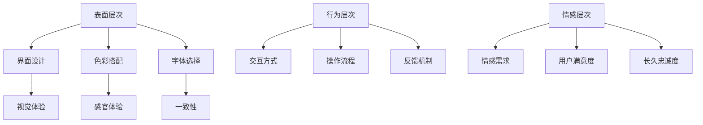
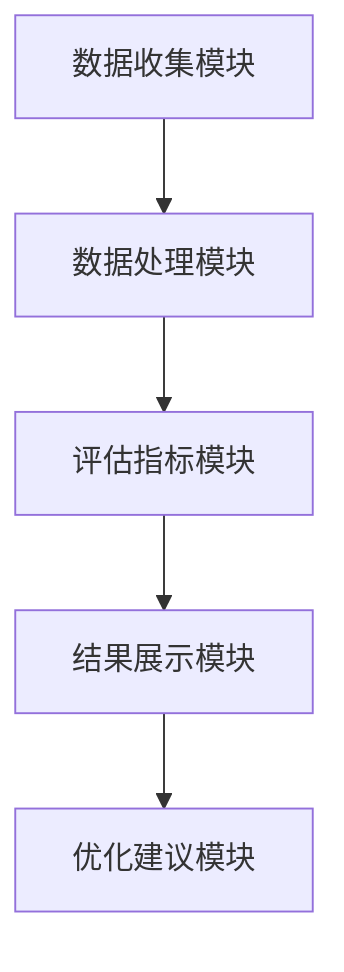

                 

### 《用户体验导向的综合评测系统设计》

> **关键词：** 用户体验，综合评测系统，设计原则，架构，评测方法，案例分析，前沿技术

> **摘要：** 本文深入探讨用户体验导向的综合评测系统设计。通过解析用户体验的基础理论，详细介绍综合评测系统的架构与实现，结合实际案例进行分析，展望用户体验评测的发展趋势，为产品设计师和开发者提供有价值的参考。

---

### 第一部分：引言与概述

#### 1.1 书籍目的与背景

在现代科技迅猛发展的时代，用户体验（User Experience, UX）成为产品设计的重要考量因素。一个优秀的用户体验能够提高产品的市场竞争力，增强用户满意度，进而推动产品的成功。因此，设计和评估用户体验变得越来越重要。然而，当前许多企业和开发团队在用户体验评测方面存在一定的困惑，缺乏系统性的指导。

本篇技术博客旨在通过深入分析和详细阐述用户体验导向的综合评测系统设计，帮助读者了解和掌握相关理论知识与实践技巧。文章将涵盖用户体验定义与原则、用户体验设计流程、用户行为分析与评估、综合评测系统设计、用户体验评测方法以及前沿技术与趋势等多个方面。

#### 1.1.1 用户体验的重要性

用户体验不仅仅是一种感官上的体验，更是一种情感上的体验。一个良好的用户体验能够使用户在使用产品时感到愉悦、舒适，从而提高用户满意度。以下是用户体验的重要性概述：

- **提高用户满意度**：优秀的产品体验能够提升用户的满意度和忠诚度，增加用户的使用时长和重复购买率。

- **增强品牌形象**：良好的用户体验有助于提升企业的品牌形象，增加用户对品牌的信任和认可。

- **增加市场竞争力**：在竞争激烈的市场中，优秀的用户体验能够帮助产品脱颖而出，吸引更多用户。

- **降低用户流失率**：优化用户体验能够减少用户流失，提高用户留存率，为企业带来持续的价值。

#### 1.1.2 综合评测系统设计的必要性

随着互联网和移动互联网的普及，用户对产品的要求越来越高。为了满足用户的需求，企业需要建立一套完善的用户体验综合评测系统。以下为综合评测系统设计的必要性：

- **全面评估用户体验**：综合评测系统能够从多个维度对用户体验进行全面评估，为企业提供科学的决策依据。

- **持续优化产品设计**：通过持续收集用户反馈和评测数据，企业可以不断优化产品设计，提升用户体验。

- **降低研发成本**：通过有效的评测系统，企业可以在早期发现和解决潜在问题，降低研发成本和风险。

- **提高产品质量**：综合评测系统能够帮助开发者了解产品的优势和不足，从而提高产品质量。

#### 1.1.3 读者对象与预期收获

本文主要面向产品设计师、开发工程师、用户体验研究员等相关从业人员。通过阅读本文，读者可以：

- 掌握用户体验的基础理论，了解用户体验的重要性。

- 学会设计和评估用户体验的方法和技巧。

- 了解综合评测系统的设计原则和实现过程。

- 掌握前沿用户体验评测技术，了解未来发展趋势。

- 获得实际案例的案例分析，加深对用户体验评测的理解。

#### 1.2 书籍结构安排

本文分为五大部分，共十个章节，具体结构安排如下：

1. **第一部分：引言与概述**  
   - 介绍书籍的背景、目的和读者对象。

2. **第二部分：用户体验基础理论**  
   - 详细讲解用户体验的定义、原则、设计流程和用户行为分析。

3. **第三部分：综合评测系统设计**  
   - 概述综合评测系统的概念、架构、评测方法和实现过程。

4. **第四部分：案例研究与应用**  
   - 分析电商平台、移动应用和教育产品的用户体验评测案例。

5. **第五部分：前沿技术与趋势**  
   - 探讨用户体验评测的新技术和未来发展趋势。

#### 1.2.2 阅读指南与学习方法

为了更好地理解和掌握本文内容，建议读者采用以下学习方法：

- **系统阅读**：按照章节顺序进行阅读，逐步深入理解用户体验和综合评测系统的设计原理。

- **实践应用**：结合实际项目，运用文中提到的方法和技巧，进行用户体验评测和系统设计。

- **讨论交流**：参与相关论坛和社区，与其他从业者交流心得，拓宽视野。

- **持续学习**：跟踪用户体验和评测技术的最新发展，不断更新知识体系。

---

通过本部分的引言与概述，我们为后续章节的内容铺垫了基础。接下来，我们将深入探讨用户体验的基础理论，帮助读者建立对用户体验的全面理解。

---

### 第二部分：用户体验基础理论

用户体验（User Experience, UX）是指用户在使用产品或服务过程中所产生的整体感受和体验。用户体验不仅关乎产品的功能和技术，还涉及到用户的心理、情感和行为。要设计一个优秀的用户体验，首先需要了解用户体验的定义、原则和层次结构。

#### 2.1 用户体验定义与原则

#### 2.1.1 用户体验的定义

用户体验是一个多维度的概念，可以从以下几个方面进行理解：

- **感知体验**：用户在接触到产品时的感官感受，包括视觉、听觉、触觉等。

- **情感体验**：用户在产品使用过程中产生的情感反应，如愉悦、焦虑、满意等。

- **行为体验**：用户在使用产品时的行为模式，包括使用流程、交互方式等。

- **认知体验**：用户在使用产品时的认知过程，包括信息获取、问题解决等。

综上所述，用户体验是用户在使用产品或服务过程中所获得的整体感受，它涵盖了感知、情感、行为和认知等多个层面。

#### 2.1.2 用户体验的原则

为了设计出优秀的用户体验，需要遵循以下原则：

- **以用户为中心**：用户体验设计应始终以用户的需求和感受为核心，关注用户的痛点和使用场景。

- **简洁性**：设计应尽量简洁直观，减少用户操作步骤，降低用户的学习成本。

- **易用性**：产品设计应易于使用，用户能够轻松上手并完成任务。

- **一致性**：产品界面和交互应保持一致性，使用户在多个场景中能够顺利过渡。

- **情感化**：设计应关注用户的情感需求，使用户在使用过程中感到愉悦和满足。

- **可访问性**：产品设计应考虑所有用户，包括残疾人士和老年人，确保产品的可访问性。

#### 2.1.3 用户体验的层次结构

用户体验可以分为三个层次：

- **表面层次**：包括产品的界面设计、色彩搭配、字体选择等，直接影响用户的视觉和感官体验。

- **行为层次**：涉及用户与产品的交互方式、操作流程、反馈机制等，直接影响用户的使用效率和满意度。

- **情感层次**：关注用户在使用产品过程中的情感体验，如愉悦、焦虑、满足等，对用户的长久忠诚度有重要影响。

图 1：用户体验层次结构



#### 2.2 用户体验设计流程

用户体验设计是一个系统性的过程，需要遵循以下步骤：

##### 2.2.1 设计流程概述

用户体验设计流程通常包括以下阶段：

1. **需求分析**：了解用户需求，确定产品目标。
2. **用户研究**：收集用户行为数据，分析用户需求。
3. **原型设计**：制作初步设计原型，进行用户反馈。
4. **迭代优化**：根据用户反馈进行迭代设计，不断优化。

##### 2.2.2 用户研究与需求分析

用户研究是用户体验设计的基础，通过用户研究可以深入了解用户需求和行为模式。以下是用户研究和需求分析的关键步骤：

1. **确定研究目标**：明确研究的目的和预期成果。
2. **选择研究方法**：如问卷调查、访谈、观察等。
3. **收集数据**：通过调查问卷、访谈记录、用户日志等方式收集数据。
4. **数据分析**：整理和分析收集到的数据，提取有价值的信息。
5. **需求确定**：根据分析结果，确定产品的功能需求和用户体验目标。

##### 2.2.3 原型设计与迭代

原型设计是用户体验设计的重要环节，通过制作原型可以直观地展示产品设计和交互流程。以下是原型设计和迭代的关键步骤：

1. **确定原型类型**：如低保真原型、高保真原型等。
2. **制作原型**：使用设计工具（如Sketch、Figma等）制作原型。
3. **用户测试**：邀请用户参与测试，收集反馈意见。
4. **分析反馈**：根据用户反馈，分析原型设计中的问题和不足。
5. **迭代优化**：根据分析结果，对原型进行迭代设计，不断优化。

#### 2.3 用户行为分析与评估

用户行为分析是用户体验评估的重要手段，通过分析用户行为可以深入了解用户的使用习惯和需求。以下是用户行为分析和评估的关键步骤：

##### 2.3.1 用户行为分析方法

1. **行为追踪**：通过工具（如Google Analytics等）对用户行为进行追踪，收集用户操作数据。
2. **问卷调查**：通过问卷调查了解用户对产品的看法和满意度。
3. **访谈与观察**：邀请用户进行访谈或观察，了解用户的使用体验和反馈。
4. **用户画像**：根据用户行为数据，构建用户画像，了解用户特征和需求。

##### 2.3.2 用户满意度评估

用户满意度评估是衡量用户体验的重要指标，以下是用户满意度评估的关键步骤：

1. **确定评估指标**：如产品易用性、满意度、忠诚度等。
2. **收集数据**：通过问卷调查、用户行为分析等方式收集数据。
3. **数据分析**：对收集到的数据进行分析，评估用户满意度。
4. **反馈与改进**：根据分析结果，对产品进行改进，提高用户体验。

##### 2.3.3 用户忠诚度分析

用户忠诚度分析是评估用户体验长期效果的重要指标，以下是用户忠诚度分析的关键步骤：

1. **确定忠诚度指标**：如用户留存率、重复购买率等。
2. **收集数据**：通过用户行为分析、客户关系管理系统等收集数据。
3. **数据分析**：对收集到的数据进行分析，评估用户忠诚度。
4. **策略调整**：根据分析结果，调整产品策略和用户体验设计。

---

通过本部分的介绍，我们对用户体验的基础理论有了更深入的了解。接下来，我们将进入第三部分，探讨综合评测系统的设计。

---

### 第三部分：综合评测系统设计

#### 3.1 综合评测系统概述

综合评测系统是一种用于全面评估用户体验的系统，它能够从多个维度收集和分析用户反馈，为产品设计和优化提供科学依据。以下是综合评测系统的概念、目的和重要性：

##### 3.1.1 综合评测系统的概念

综合评测系统是一种集成了多种评测方法和工具的综合性系统，它旨在：

- **全面评估**：从多个维度对用户体验进行评估，包括功能、易用性、满意度、忠诚度等。
- **持续反馈**：实时收集用户反馈，为产品设计和优化提供持续改进的依据。
- **数据驱动**：基于数据分析，为产品决策提供科学依据。

##### 3.1.2 综合评测系统的目的

综合评测系统的目的主要包括：

- **提高产品质量**：通过评估和反馈，发现产品问题和不足，推动产品优化和改进。
- **提升用户体验**：基于用户反馈，调整产品设计和交互，提高用户满意度。
- **降低研发成本**：通过早期发现和解决潜在问题，降低研发成本和风险。

##### 3.1.3 综合评测系统的重要性

综合评测系统在用户体验设计和产品开发过程中具有重要意义，主要包括以下几个方面：

- **全面性**：综合评测系统能够从多个维度对用户体验进行全面评估，提供全面的反馈。
- **科学性**：基于数据分析和用户反馈，综合评测系统能够提供科学的评估和优化依据。
- **实时性**：综合评测系统能够实时收集用户反馈，为产品设计和优化提供持续改进的依据。
- **可操作性**：综合评测系统提供了丰富的评测方法和工具，便于产品团队进行实际操作和应用。

#### 3.2 综合评测系统架构

综合评测系统架构是系统的核心，它决定了系统的功能、性能和可扩展性。以下是综合评测系统的基本架构和各部分的功能：

##### 3.2.1 系统架构概述

综合评测系统架构可以分为以下几个部分：

- **数据收集模块**：负责收集用户行为数据、用户反馈和评测数据。
- **数据处理模块**：负责对收集到的数据进行清洗、存储和分析。
- **评估指标模块**：定义和计算各种评估指标，如满意度、忠诚度等。
- **结果展示模块**：将分析结果以图表、报表等形式展示给用户。
- **优化建议模块**：根据分析结果，提供产品优化建议。

图 2：综合评测系统架构



##### 3.2.2 数据收集与处理

数据收集与处理是综合评测系统的核心功能之一，以下是数据收集和处理的关键步骤：

1. **用户行为数据收集**：通过使用日志分析、行为追踪等技术，收集用户在产品中的操作数据。
2. **用户反馈数据收集**：通过问卷调查、用户访谈等方式，收集用户对产品的反馈。
3. **数据清洗**：对收集到的数据进行清洗，去除无效数据，保证数据质量。
4. **数据存储**：将清洗后的数据存储到数据库中，便于后续分析和查询。
5. **数据处理**：对存储的数据进行加工和处理，提取有用的信息和指标。

##### 3.2.3 评估指标体系设计

评估指标体系是综合评测系统的核心组成部分，它决定了评估的全面性和科学性。以下是评估指标体系设计的关键步骤：

1. **确定评估目标**：明确产品评测的目标，如提高用户满意度、降低用户流失率等。
2. **定义评估指标**：根据评估目标，定义相应的评估指标，如用户满意度、用户忠诚度、功能易用性等。
3. **设定评估标准**：为每个评估指标设定合理的评估标准和阈值。
4. **数据收集与计算**：根据评估指标，收集相关数据，并按照设定的标准进行计算。
5. **结果分析与反馈**：根据评估结果，进行分析和反馈，为产品优化提供依据。

#### 3.3 用户体验评测方法

用户体验评测方法可以分为定量评测方法和定性评测方法，它们各有特点和适用场景。以下是定量评测方法和定性评测方法的详细介绍：

##### 3.3.1 定量评测方法

定量评测方法主要基于数据分析和量化评估，通过收集用户行为数据，对用户体验进行量化评估。以下是定量评测方法的关键步骤：

1. **确定评测指标**：根据产品目标和用户需求，确定相应的评测指标，如用户满意度、使用时长等。
2. **数据收集**：通过日志分析、用户调研等方式，收集用户行为数据。
3. **数据处理**：对收集到的数据进行分析和加工，提取有用的信息和指标。
4. **评估计算**：按照设定的评估标准和计算方法，对数据进行分析和计算，得到评估结果。
5. **结果展示**：将评估结果以图表、报表等形式展示给用户，便于分析和决策。

##### 3.3.2 定性评测方法

定性评测方法主要基于用户反馈和主观评价，通过访谈、观察等方式，对用户体验进行深入分析和评估。以下是定性评测方法的关键步骤：

1. **确定研究目标**：明确定性评测的目标和问题，如用户满意度、使用痛点等。
2. **选择研究方法**：根据目标选择合适的研究方法，如访谈、观察等。
3. **收集反馈**：邀请用户参与访谈或观察，收集用户的反馈和意见。
4. **数据分析**：对收集到的反馈进行分析和整理，提取有价值的信息。
5. **结果反馈**：将分析结果反馈给产品团队，为产品优化提供依据。

##### 3.3.3 多维度评测方法

多维度评测方法是一种结合定量和定性评测方法的综合评估方法，它能够从多个维度对用户体验进行全面评估。以下是多维度评测方法的关键步骤：

1. **确定评估维度**：根据产品目标和用户需求，确定需要评估的维度，如功能、易用性、满意度等。
2. **数据收集**：通过定量和定性方法，收集不同维度的数据。
3. **数据整合**：将收集到的数据进行整合和处理，形成一个综合评估指标。
4. **评估计算**：根据设定的评估标准和计算方法，对综合评估指标进行分析和计算。
5. **结果展示**：将评估结果以图表、报表等形式展示给用户，便于分析和决策。

---

通过本部分的介绍，我们对综合评测系统的设计有了更深入的了解。接下来，我们将结合实际案例，探讨综合评测系统在具体应用中的实际效果和实现方法。

---

### 第四部分：案例研究与应用

在了解了用户体验导向的综合评测系统设计之后，通过实际案例的研究，我们可以更好地理解这一系统的应用效果和实现方法。以下将介绍三个不同领域的产品案例，分别是电商平台、移动应用和教育产品，通过具体案例的分析，展示如何设计和实施用户体验评测系统。

#### 4.1 案例研究一：电商平台用户体验评测

##### 4.1.1 案例背景

电商平台作为互联网经济的核心，其用户体验直接影响到用户的购买决策和平台的市场竞争力。为了提高用户满意度，某知名电商平台决定建立一套全面的用户体验评测系统。

##### 4.1.2 评测目标与方法

评测目标：
- 提高用户购买体验，降低购物流程复杂度。
- 优化页面加载速度，提高页面响应时间。
- 提升用户满意度，降低用户流失率。

评测方法：
- **定量评测**：通过日志分析工具，收集用户的购物行为数据，如页面浏览次数、点击路径、购物车操作等。
- **定性评测**：邀请用户进行深度访谈和用户调研，收集用户对产品功能的评价和反馈。
- **多维度评测**：结合定量和定性方法，从功能、易用性、满意度等多个维度进行评估。

##### 4.1.3 评测结果与分析

评测结果显示：
- 用户在购物流程中的点击路径较为复杂，导致购物车操作频繁失败。
- 页面加载速度较慢，影响了用户的购买体验。
- 用户对某些功能（如搜索功能、产品描述）的评价较低。

分析结果：
- **购物流程优化**：简化购物流程，减少用户点击步骤，提高购物车操作的成功率。
- **页面速度优化**：通过优化页面加载速度，提高页面响应时间，提升用户体验。
- **功能改进**：改进搜索功能和产品描述，提高用户满意度。

案例研究一展示了电商平台如何通过用户体验评测系统，发现并解决影响用户体验的关键问题，从而提升用户满意度和平台竞争力。

#### 4.2 案例研究二：移动应用用户体验评测

##### 4.2.1 案例背景

移动应用市场竞争激烈，为了提高用户的留存率和活跃度，某移动应用开发公司决定进行全面的用户体验评测。

##### 4.2.2 评测目标与方法

评测目标：
- 提高用户留存率，增加用户活跃度。
- 优化用户界面，提升操作流畅度。
- 增强用户互动，提高用户参与度。

评测方法：
- **定量评测**：通过用户行为数据分析，如用户留存率、活跃度、页面浏览量等。
- **定性评测**：通过用户访谈和反馈收集，了解用户对应用的看法和改进建议。
- **A/B测试**：通过对比不同版本的用户体验，分析用户体验差异。

##### 4.2.3 评测结果与分析

评测结果显示：
- 用户留存率较低，部分用户在首次使用后很快卸载应用。
- 用户界面存在操作不流畅的问题，部分用户反馈卡顿。
- 用户互动环节较少，用户参与度不高。

分析结果：
- **留存率提升**：通过改进新手引导和优化用户体验，提高用户留存率。
- **界面优化**：通过流畅的用户界面设计和性能优化，提升用户体验。
- **互动增强**：增加用户互动环节，如社区互动、游戏化任务等，提高用户参与度。

案例研究二展示了移动应用如何通过用户体验评测系统，识别并解决影响用户留存和活跃度的问题，从而提高用户满意度。

#### 4.3 案例研究三：教育产品用户体验评测

##### 4.3.1 案例背景

教育产品旨在为学生提供优质的学习体验，提高学习效果。某在线教育平台为了提升用户体验，决定进行全面的用户体验评测。

##### 4.3.2 评测目标与方法

评测目标：
- 提高学生的学习效果和满意度。
- 优化课程内容和互动设计。
- 降低用户流失率，提升用户忠诚度。

评测方法：
- **定量评测**：通过学习行为数据分析，如课程完成率、学习时长、用户评分等。
- **定性评测**：通过学生访谈和反馈收集，了解学生对课程内容和交互方式的看法。
- **多维度评测**：结合定量和定性方法，从学习效果、满意度、互动性等多个维度进行评估。

##### 4.3.3 评测结果与分析

评测结果显示：
- 课程完成率较低，部分学生反映学习内容难度较大。
- 用户界面设计存在一定的复杂度，部分学生操作不便。
- 学生互动环节较少，学习体验不够丰富。

分析结果：
- **课程优化**：根据学生反馈，调整课程内容和难度，提高课程的可接受度。
- **界面优化**：简化用户界面设计，提高操作便捷性，提升用户体验。
- **互动增强**：增加学生互动环节，如讨论区、问答环节等，提高学习参与度。

案例研究三展示了教育产品如何通过用户体验评测系统，优化课程内容和用户界面，提升学习效果和用户满意度。

---

通过以上三个案例的研究，我们可以看到用户体验导向的综合评测系统在各个领域的实际应用效果。综合评测系统不仅帮助产品团队识别和解决用户体验问题，还为产品的持续优化提供了科学依据。在接下来的部分，我们将探讨用户体验评测领域的前沿技术和未来趋势。

---

### 第五部分：前沿技术与趋势

随着科技的不断发展，用户体验评测技术也在不断进步，新的评测工具和方法不断涌现。本部分将介绍用户体验评测领域的前沿技术，包括人工智能、虚拟现实与增强现实、用户体验自动化评测工具等，并探讨用户体验评测的发展趋势。

#### 5.1 用户体验评测新技术

##### 5.1.1 人工智能在评测中的应用

人工智能（AI）技术在用户体验评测中的应用日益广泛，通过AI技术可以更加精准地分析用户行为数据，提高评测的准确性和效率。以下是人工智能在用户体验评测中的几种应用：

- **用户行为预测**：利用机器学习算法，对用户行为进行预测，提前发现潜在的用户体验问题。
- **情感分析**：通过自然语言处理（NLP）技术，分析用户反馈中的情感倾向，了解用户的情感体验。
- **个性化推荐**：基于用户历史行为和偏好，利用AI技术为用户提供个性化的产品推荐和优化建议。
- **自动化评测**：使用深度学习模型，自动化评估用户的满意度、忠诚度等指标。

##### 5.1.2 虚拟现实与增强现实评测

虚拟现实（VR）和增强现实（AR）技术的发展为用户体验评测带来了新的可能性。VR和AR技术可以提供更加沉浸式的用户体验，使得评测过程更加真实和有效。以下是VR和AR在用户体验评测中的应用：

- **沉浸式评测**：通过VR技术，模拟真实的用户使用场景，评估用户的沉浸感和互动性。
- **远程评测**：利用AR技术，将评测工具叠加在现实环境中，实现远程评测和指导。
- **互动性评估**：通过VR和AR技术，创建高度互动的评测环境，提高用户的参与度和反馈质量。

##### 5.1.3 用户体验自动化评测工具

用户体验自动化评测工具能够提高评测的效率和准确性，减少人工成本。以下是几种常见的用户体验自动化评测工具：

- **自动化测试工具**：如Selenium、Appium等，用于自动化测试和评估产品的功能性和性能。
- **自动化数据分析工具**：如Tableau、Power BI等，用于自动化处理和可视化用户行为数据。
- **自动化反馈收集工具**：如Happy Or Not、Qualaroo等，用于自动化收集用户的反馈和满意度数据。

#### 5.2 用户体验评测趋势

用户体验评测领域的发展趋势体现在以下几个方面：

##### 5.2.1 评测方法的创新

随着技术的进步，用户体验评测方法也在不断创新。例如，结合AI和大数据分析的智能化评测方法，可以更加准确地识别用户体验问题。此外，虚拟现实和增强现实技术的应用，使得评测过程更加直观和高效。

##### 5.2.2 评测系统的个性化

个性化评测系统能够根据用户的个人特征和需求，提供定制化的评测服务。通过用户画像和个性化推荐，评测系统可以更加精准地评估用户体验，为产品优化提供有针对性的建议。

##### 5.2.3 评测数据的安全与隐私

随着用户对隐私保护的重视，用户体验评测系统需要在数据收集、存储和分析过程中确保数据安全与隐私。加密技术和数据匿名化处理等手段，将有助于保护用户隐私。

#### 5.3 未来展望

用户体验评测系统的发展将继续依赖于技术的创新和应用。未来，用户体验评测系统有望实现以下发展方向：

- **智能化**：通过人工智能和大数据技术，实现更精准、更智能的评测。
- **沉浸式**：通过虚拟现实和增强现实技术，提供更真实的用户体验评测。
- **个性化**：通过用户画像和个性化推荐，实现定制化的评测服务。
- **安全化**：通过数据安全和隐私保护技术，确保用户数据的安全和隐私。

总的来说，用户体验评测系统的发展将朝着智能化、沉浸化、个性化和安全化的方向不断前进，为产品设计者和开发者提供更强大的工具和更科学的依据。

---

通过本部分的探讨，我们对用户体验评测领域的前沿技术和发展趋势有了更深入的了解。在未来的发展中，用户体验评测系统将继续发挥着重要作用，为产品的持续优化和用户满意度的提升提供有力支持。

---

### 第六部分：附录与资源

#### 附录A：用户体验评测工具汇总

为了帮助读者更好地进行用户体验评测，以下汇总了一些常用的用户体验评测工具：

##### A.1 常用评测工具介绍

1. **Google Analytics**：用于收集和分析用户行为数据，提供详细的用户流量、页面访问、用户行为分析等。
2. **Hotjar**：提供用户行为热图、用户反馈收集、视频录制等功能，帮助了解用户在网站或应用上的行为。
3. **Qualaroo**：用于收集用户反馈和满意度调查，可以通过弹窗、嵌入式问卷等方式进行。
4. **UserTesting**：提供真实的用户测试视频，帮助评估产品的可用性和用户体验。
5. **UserZoom**：提供在线用户测试、可用性测试、远程用户访谈等服务。

##### A.2 评测工具使用指南

- **Google Analytics**：通过安装跟踪代码，收集用户的访问数据和操作行为，并通过分析报告了解用户行为模式。
- **Hotjar**：在网站或应用中嵌入Hotjar代码，即可获得用户行为热图、滚动跟踪、反馈收集等功能。
- **Qualaroo**：创建问卷和弹窗，通过网站或应用的各个页面嵌入Qualaroo代码，收集用户反馈。
- **UserTesting**：注册账号，创建测试任务，邀请真实用户进行测试，获取视频反馈。
- **UserZoom**：注册账号，创建测试任务，安排用户进行可用性测试和远程访谈，获取评估报告。

#### 附录B：参考文献

为了确保本文内容的准确性和可靠性，以下列出了一些相关的参考文献，供读者进一步学习：

1. **Norman, D.A. (2013). The Design of Everyday Things. Basic Books.**
2. **Hassenzahl, M. (2012). Experience Design: Technology for All the Right Reasons. Synthesis Lectures on Human-Centered Informatics, 5(1), 1-158.**
3. **Ling, R., & Paquette, C. (2007). Experience, Engagement, Empowerment: Frameworks for Participatory Design. In Proceedings of the SIGCHI Conference on Human Factors in Computing Systems (pp. 225-234). ACM.**
4. **Nielsen, J. (2012). Prioritizing Usability: Return on Investment for E-commerce. Nielsen Norman Group.**
5. **Tullis, T., & Albert, B. (2013). Measuring the User Experience: Collecting, Analyzing, and Presenting Usability Metrics. Morgan Kaufmann.**

#### 附录C：代码示例与实现

在本附录中，我们将提供一些基础的代码示例，用于数据采集、评估指标计算和系统实现。

##### C.1 数据采集与处理代码

```python
# 数据采集示例：使用Google Analytics API获取用户行为数据
from google.oauth2 import service_account
from googleapiclient.discovery import build

# 设置Google Analytics API凭证
credentials = service_account.Credentials.from_service_account_file('client_secret.json')
service = build('analyticsreporting', 'v4', credentials=credentials)

# 获取用户行为数据
def get_user_data_view_id():
    # 设置视图ID
    view_id = 'YOUR_VIEW_ID'
    return view_id

def get_user_data():
    view_id = get_user_data_view_id()
    date_range = {'start-date': '7daysAgo', 'end-date': 'today'}
    metrics = ['userCount', 'sessionCount']
    dimensions = ['day']

    # 构建请求
    request = service.reports().batchGet(
        body={
            'reportRequests': [
                {
                    'viewId': view_id,
                    'dateRanges': [date_range],
                    'metrics': metrics,
                    'dimensions': dimensions,
                }
            ]
        }
    ).execute()

    return request.get('reports', defaultdict(dict))

# 示例：打印用户行为数据
data = get_user_data()
for report in data:
    for row in report['data']['rows']:
        date = row['dimensions'][0]
        user_count = row['metrics'][0]['values'][0]
        print(f"{date}: {user_count} users")
```

##### C.2 评估指标计算代码

```python
# 评估指标计算示例：计算用户满意度得分
def calculate_satisfaction_score(feedbacks):
    positive = sum(1 for feedback in feedbacks if 'satisfied' in feedback)
    total = len(feedbacks)
    return positive / total

# 示例：计算满意度得分
feedbacks = ['satisfied', 'dissatisfied', 'neutral', 'satisfied', 'satisfied']
satisfaction_score = calculate_satisfaction_score(feedbacks)
print(f"Satisfaction Score: {satisfaction_score:.2f}")
```

##### C.3 系统实现代码框架

```python
# 系统实现框架示例：用户体验评测系统基础架构

# 导入所需模块
import json
from flask import Flask, request, jsonify

# 初始化Flask应用
app = Flask(__name__)

# 数据存储
users_data = []
feedbacks_data = []

# API端点：收集用户行为数据
@app.route('/collect_user_data', methods=['POST'])
def collect_user_data():
    data = request.json
    users_data.append(data)
    return jsonify({"status": "success", "message": "User data collected."})

# API端点：收集用户反馈数据
@app.route('/collect_feedback', methods=['POST'])
def collect_feedback():
    feedback = request.json
    feedbacks_data.append(feedback)
    return jsonify({"status": "success", "message": "Feedback collected."})

# API端点：获取用户行为数据
@app.route('/get_user_data', methods=['GET'])
def get_user_data():
    return jsonify(users_data)

# API端点：获取用户反馈数据
@app.route('/get_feedback', methods=['GET'])
def get_feedback():
    return jsonify(feedbacks_data)

# 运行应用
if __name__ == '__main__':
    app.run(debug=True)
```

---

通过附录部分的内容，读者可以进一步了解用户体验评测的相关工具和方法，以及实际代码实现的示例。这些资源将有助于读者在实践过程中更好地应用用户体验评测系统，提升产品的用户体验。

---

### 结束语

综上所述，本文深入探讨了用户体验导向的综合评测系统设计，从用户体验基础理论、综合评测系统设计、案例研究到前沿技术与趋势，全面介绍了用户体验评测的重要性和实现方法。通过本文的阅读，读者应能够：

1. 理解用户体验的定义、原则和层次结构。
2. 掌握用户体验设计流程和用户行为分析的方法。
3. 了解综合评测系统的概念、架构和实现过程。
4. 通过实际案例，学习用户体验评测的具体应用。
5. 熟悉用户体验评测领域的前沿技术和发展趋势。

用户体验评测不仅是产品设计和优化的关键环节，也是提高企业竞争力、增强用户满意度的重要手段。在未来的工作中，读者可以结合本文的内容，不断实践和探索，为产品的持续优化和用户体验的提升做出贡献。

---

**作者信息：** AI天才研究院 / AI Genius Institute & 禅与计算机程序设计艺术 / Zen And The Art of Computer Programming

---

感谢您的阅读，希望本文能够对您在用户体验评测领域的探索和实践有所帮助。如果您有任何疑问或建议，欢迎在评论区留言交流。期待与您共同进步！

