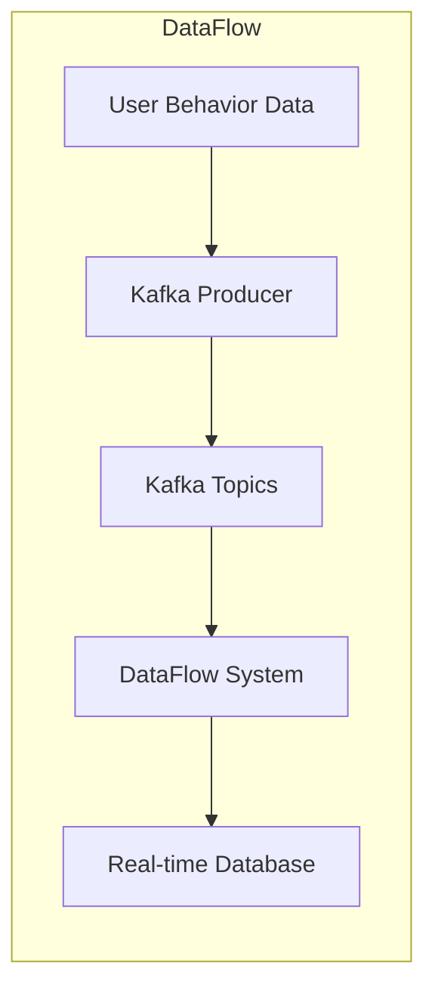
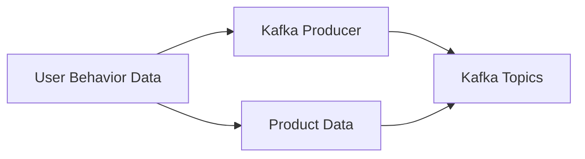
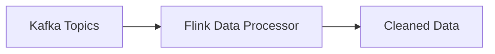
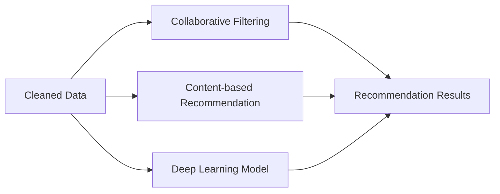

                 

# 电商平台的AI大模型实践：搜索推荐系统是核心，数据质量与处理能力并重

## 概述

随着电商行业的快速发展，用户对个性化、精准化的搜索和推荐服务需求日益增长。AI 大模型作为当前最前沿的人工智能技术，在电商平台的应用日益广泛，特别是在搜索推荐系统中，成为提升用户体验和转化率的核心手段。本文将详细探讨AI 大模型在电商平台中的应用，重点关注搜索推荐系统的核心地位以及数据质量与处理能力的重要性。

## 关键词

- 电商平台
- AI 大模型
- 搜索推荐系统
- 数据质量
- 处理能力

## 摘要

本文首先概述了AI 大模型在电商平台中的应用背景，深入探讨了搜索推荐系统在电商业务中的核心地位。接着，本文介绍了AI 大模型的核心算法原理，包括深度学习、自然语言处理和大规模预训练模型。随后，文章从数据质量与数据预处理、搜索推荐系统的设计与实现、实时搜索推荐系统的优化以及实战案例等方面进行了详细阐述。最后，本文总结了电商平台AI 大模型实践中的数据质量与处理能力提升方法，并展望了未来发展趋势。

## 目录大纲

#### 第一部分：AI 大模型与电商平台概述

##### 第1章：AI 大模型在电商平台的概述

- **1.1 AI 大模型在电商行业的应用背景**
  - **1.1.1 电商行业的发展现状**
  - **1.1.2 搜索推荐系统的重要性**
  - **1.1.3 AI 大模型的基本原理与特点**

- **1.2 搜索推荐系统的基本架构**
  - **1.2.1 搜索推荐系统的构成要素**
  - **1.2.2 搜索推荐系统的工作流程**
  - **1.2.3 AI 大模型在搜索推荐系统中的应用**

##### 第2章：AI 大模型核心算法原理

- **2.1 深度学习基础**
  - **2.1.1 深度学习的基本概念**
  - **2.1.2 神经网络架构**
  - **2.1.3 深度学习优化算法**

- **2.2 自然语言处理（NLP）技术**
  - **2.2.1 词嵌入技术**
  - **2.2.2 序列模型与注意力机制**
  - **2.2.3 转换器架构**

- **2.3 大规模预训练模型**
  - **2.3.1 预训练的概念与意义**
  - **2.3.2 自监督学习方法**
  - **2.3.3 迁移学习与微调技术**

#### 第二部分：搜索推荐系统实践

##### 第3章：数据质量与数据预处理

- **3.1 数据质量的重要性**
  - **3.1.1 数据质量的概念与评价标准**
  - **3.1.2 数据质量对搜索推荐系统的影响**

- **3.2 数据预处理方法**
  - **3.2.1 数据清洗**
  - **3.2.2 数据归一化**
  - **3.2.3 特征提取与特征选择**

##### 第4章：搜索推荐系统的设计与实现

- **4.1 搜索推荐系统的设计原则**
  - **4.1.1 搜索推荐系统的需求分析**
  - **4.1.2 搜索推荐系统的架构设计**

- **4.2 搜索推荐系统的实现方法**
  - **4.2.1 基于协同过滤的方法**
  - **4.2.2 基于内容推荐的方法**
  - **4.2.3 基于混合推荐的方法**

##### 第5章：实时搜索推荐系统的优化

- **5.1 实时搜索推荐系统的挑战**
  - **5.1.1 数据实时性要求**
  - **5.1.2 系统响应速度**

- **5.2 实时搜索推荐系统的优化策略**
  - **5.2.1 数据流处理技术**
  - **5.2.2 深度学习模型优化**
  - **5.2.3 系统性能调优**

##### 第6章：搜索推荐系统的案例分析与实战

- **6.1 案例介绍：某电商平台的搜索推荐系统**
  - **6.1.1 案例背景与目标**
  - **6.1.2 搜索推荐系统的架构与实现**

- **6.2 实战：构建电商搜索推荐系统**
  - **6.2.1 环境搭建与依赖安装**
  - **6.2.2 数据采集与预处理**
  - **6.2.3 模型设计与训练**
  - **6.2.4 模型部署与监控**

#### 第三部分：数据质量与处理能力提升

##### 第7章：数据质量管理策略

- **7.1 数据质量管理的重要性**
  - **7.1.1 数据质量管理的基本原则**
  - **7.1.2 数据质量管理的具体措施**

- **7.2 数据处理能力提升方法**
  - **7.2.1 数据预处理技术的优化**
  - **7.2.2 数据存储与管理优化**
  - **7.2.3 大数据处理框架的应用**

##### 第8章：AI 大模型在数据质量提升中的应用

- **8.1 AI 大模型在数据质量检测中的应用**
  - **8.1.1 数据异常检测算法**
  - **8.1.2 数据质量评估方法**

- **8.2 AI 大模型在数据质量改进中的应用**
  - **8.2.1 数据去噪技术**
  - **8.2.2 数据增强方法**
  - **8.2.3 数据完整性修复策略**

##### 第9章：案例研究与总结

- **9.1 案例研究：电商平台的AI 大模型实践**
  - **9.1.1 案例背景与目标**
  - **9.1.2 搜索推荐系统的实践过程**
  - **9.1.3 数据质量与处理能力的提升效果**

- **9.2 全书总结与展望**
  - **9.2.1 书中内容的总结**
  - **9.2.2 电商平台的AI 大模型实践的展望**

### 附录

- **A.1 AI 大模型开发工具与资源**
  - **A.1.1 主流深度学习框架对比**
    - **A.1.1.1 TensorFlow**
    - **A.1.1.2 PyTorch**
    - **A.1.1.3 JAX**
    - **A.1.1.4 其他框架简介**
  - **A.1.2 数据处理工具与库**
    - **A.1.2.1 Pandas**
    - **A.1.2.2 NumPy**
    - **A.1.2.3 其他数据处理工具**

- **A.2 实践案例代码与资源链接**
  - **A.2.1 案例一：构建电商搜索推荐系统**
    - **A.2.1.1 代码实现**
    - **A.2.1.2 源代码解析**
  - **A.2.2 案例二：数据质量管理策略**
    - **A.2.2.1 实践方法**
    - **A.2.2.2 源代码实现**

## 电商平台的AI 大模型概述

### 1.1 AI 大模型在电商行业的应用背景

随着互联网技术的飞速发展，电商行业迎来了前所未有的繁荣时期。各大电商平台在激烈的市场竞争中，纷纷寻求通过提升用户体验、提高转化率和降低运营成本来获得竞争优势。AI 大模型作为一种先进的人工智能技术，因其强大的数据处理和分析能力，成为了电商平台提升业务能力的关键手段。

#### 1.1.1 电商行业的发展现状

电商行业在全球范围内持续增长，尤其是中国、美国和欧洲等主要市场。根据统计数据，全球电商市场规模在过去几年中保持了两位数的增长速度。这种增长趋势不仅体现在销售额的上升，还包括用户规模、订单量和市场渗透率的提升。

- **用户规模**：随着移动互联网的普及，越来越多的用户开始通过手机端进行购物，电商平台的用户基数不断扩大。
- **订单量**：电商平台的订单量持续增加，尤其在大促销活动期间，订单量的爆发式增长对系统的稳定性提出了更高的要求。
- **市场渗透率**：电商平台的渗透率逐渐提高，越来越多的消费者习惯于在线购物，这也为电商平台带来了更多的商业机会。

#### 1.1.2 搜索推荐系统的重要性

在电商业务中，搜索推荐系统扮演着至关重要的角色。它通过智能化的算法为用户提供个性化的商品推荐和搜索结果，从而提高用户的购物体验和满意度。以下是搜索推荐系统在电商平台中的几个关键作用：

- **提升用户满意度**：个性化推荐能够满足用户的不同需求，提高用户在平台上的购物体验和满意度。
- **增加转化率**：通过精准的推荐，可以引导用户快速找到心仪的商品，从而提高转化率。
- **优化运营成本**：智能化的推荐系统可以减少人工干预，降低运营成本，提高效率。

### 1.1.3 AI 大模型的基本原理与特点

AI 大模型是指通过大规模数据集训练得到的深度学习模型，具有强大的特征提取和模式识别能力。它基于深度学习算法，通过多层神经网络的堆叠和优化，能够自动学习和提取数据中的复杂结构和潜在规律。以下是AI 大模型的基本原理和特点：

- **多层神经网络**：AI 大模型通常由多个隐藏层组成，能够处理高维数据和复杂的非线性关系。
- **大规模数据集训练**：AI 大模型需要大量数据进行训练，以学习到数据的分布和特征。
- **强大的特征提取能力**：通过多层网络结构，AI 大模型能够自动提取数据中的高维特征，实现数据降维。
- **优秀的模式识别能力**：AI 大模型能够识别数据中的潜在模式和关联，从而进行准确的预测和分类。

#### 1.2 搜索推荐系统的基本架构

搜索推荐系统是电商平台的核心组成部分，其基本架构包括数据层、算法层和应用层。以下是对这些层的详细介绍：

- **数据层**：数据层是搜索推荐系统的基石，包括用户行为数据、商品数据、订单数据等。这些数据为算法层提供训练和推理所需的信息。
- **算法层**：算法层是搜索推荐系统的核心，包括协同过滤、基于内容的推荐、基于模型的推荐等算法。这些算法通过分析用户行为数据和商品属性，生成个性化的推荐结果。
- **应用层**：应用层是搜索推荐系统的对外接口，包括用户界面、API 接口等。用户可以通过这些接口获取推荐结果，进行搜索和购物。

#### 1.2.1 搜索推荐系统的构成要素

搜索推荐系统由以下几个关键要素组成：

- **用户数据**：包括用户的搜索历史、浏览记录、购买行为等，是推荐系统最重要的输入数据。
- **商品数据**：包括商品的属性、分类、价格、销量等，是推荐系统对商品进行描述和匹配的基础。
- **算法模型**：包括协同过滤、基于内容的推荐、基于模型的推荐等，是实现推荐的核心算法。
- **推荐结果**：根据用户数据和商品数据，通过算法模型计算得到的个性化推荐结果。
- **用户反馈**：用户对推荐结果的反馈，用于评估推荐系统的效果和进行模型优化。

#### 1.2.2 搜索推荐系统的工作流程

搜索推荐系统的工作流程可以分为以下几个阶段：

1. **数据采集**：从用户行为和商品数据中采集原始数据，包括用户的搜索历史、浏览记录、购买行为等。
2. **数据预处理**：对采集到的原始数据进行清洗、归一化、特征提取等预处理操作，为算法模型提供高质量的输入数据。
3. **模型训练**：使用预处理后的数据训练推荐算法模型，包括协同过滤、基于内容的推荐、基于模型的推荐等。
4. **模型评估**：通过交叉验证等方法对训练好的模型进行评估，以确定模型的准确性和泛化能力。
5. **在线推荐**：将训练好的模型部署到线上环境，实时对用户进行个性化推荐，并根据用户反馈进行模型优化。

#### 1.2.3 AI 大模型在搜索推荐系统中的应用

AI 大模型在搜索推荐系统中具有广泛的应用，以下是其几个主要应用场景：

- **用户画像**：通过大规模用户行为数据，AI 大模型可以构建出用户的个性化画像，为后续推荐提供基础。
- **商品分类**：AI 大模型可以根据商品的属性和用户行为数据，对商品进行智能分类，提高推荐的准确性。
- **上下文感知**：AI 大模型能够根据用户的上下文信息（如地理位置、时间等），为用户提供更加精准的推荐结果。
- **实时推荐**：AI 大模型具有强大的实时数据处理能力，可以实时响应用户的请求，提供个性化的推荐结果。

### 1.3 AI 大模型在电商平台的其他应用

除了搜索推荐系统，AI 大模型在电商平台还有其他广泛的应用，以下是其几个主要应用领域：

- **客户关系管理（CRM）**：AI 大模型可以帮助电商平台分析客户行为，进行客户细分，提供精准的营销策略。
- **价格优化**：AI 大模型可以根据市场需求、竞争情况等因素，为电商平台提供最优的价格策略，提高销售额。
- **库存管理**：AI 大模型可以根据销售数据、季节性因素等，为电商平台提供最优的库存管理策略，降低库存成本。

### 1.4 AI 大模型在电商平台的挑战与未来发展趋势

尽管AI 大模型在电商平台具有广泛的应用前景，但其应用过程中也面临着一些挑战：

- **数据隐私与安全**：电商平台需要确保用户数据的隐私和安全，避免数据泄露和滥用。
- **算法透明性与解释性**：AI 大模型往往缺乏透明性和解释性，导致用户难以理解推荐结果的产生过程。
- **计算资源与能耗**：大规模AI 大模型的训练和推理需要大量的计算资源和能耗，对平台的技术基础设施提出了更高要求。

未来，随着技术的不断进步，AI 大模型在电商平台的应用将呈现以下发展趋势：

- **更高效的数据处理**：通过分布式计算、并行处理等技术，提高AI 大模型的数据处理效率。
- **更智能的算法优化**：通过自适应优化、迁移学习等技术，提高AI 大模型的性能和效果。
- **更广泛的应用领域**：AI 大模型将逐渐应用于电商平台的其他业务领域，如客服、物流、供应链等。

总之，AI 大模型在电商平台中的应用已经成为不可逆转的趋势，其强大的数据处理和分析能力为电商业务的提升提供了新的机遇。电商平台需要充分利用AI 大模型的优势，应对挑战，推动业务持续发展。

### 2. AI 大模型核心算法原理

#### 2.1 深度学习基础

深度学习是AI 大模型的核心组成部分，它通过多层神经网络的堆叠和优化，实现了对大规模数据的自动学习和特征提取。以下将详细介绍深度学习的基本概念、神经网络架构以及深度学习优化算法。

##### 2.1.1 深度学习的基本概念

深度学习（Deep Learning）是一种机器学习（Machine Learning）方法，通过模拟人脑神经网络的结构和功能，实现对数据的自动学习和处理。深度学习的主要特点包括：

- **多层神经网络**：深度学习模型由多个隐藏层组成，通过逐层传递信息，实现对复杂模式的识别和提取。
- **端到端学习**：深度学习模型可以直接从原始数据中学习到特征表示，无需人工设计特征，从而提高了模型的自动性和准确性。
- **并行计算**：深度学习模型可以利用GPU等硬件加速器，实现高效的并行计算，显著提高训练速度和效率。

##### 2.1.2 神经网络架构

神经网络（Neural Network）是深度学习的基础，其基本结构由输入层、隐藏层和输出层组成。以下是对这些层的详细解释：

- **输入层**：输入层是神经网络的起始层，接收外部输入数据。每个输入节点表示一个特征。
- **隐藏层**：隐藏层是神经网络的中间层，负责对输入数据进行加工和处理。隐藏层可以通过堆叠多层，实现对复杂模式的提取。
- **输出层**：输出层是神经网络的终止层，产生最终输出结果。输出层的节点数量和类型取决于具体的任务需求。

##### 2.1.3 深度学习优化算法

深度学习模型的优化过程主要涉及损失函数、优化器和正则化方法等方面。以下将分别介绍这些优化算法的基本原理和实现方法。

- **损失函数**：损失函数是衡量模型预测结果与真实值之间差异的指标。常见的损失函数包括均方误差（MSE）、交叉熵（Cross-Entropy）等。
  - **均方误差（MSE）**：MSE 损失函数用于回归任务，计算预测值与真实值之间误差的平方和。其数学表达式为：
    $$MSE = \frac{1}{n}\sum_{i=1}^{n}(y_i - \hat{y}_i)^2$$
    其中，$y_i$ 表示真实值，$\hat{y}_i$ 表示预测值，$n$ 表示样本数量。
  - **交叉熵（Cross-Entropy）**：交叉熵损失函数用于分类任务，计算预测概率分布与真实分布之间的差异。其数学表达式为：
    $$H(y, \hat{y}) = -\sum_{i=1}^{n}y_i \log(\hat{y}_i)$$
    其中，$y$ 表示真实分布，$\hat{y}$ 表示预测分布。

- **优化器**：优化器（Optimizer）用于调整模型参数，以最小化损失函数。常见的优化器包括梯度下降（Gradient Descent）、Adam 等。
  - **梯度下降（Gradient Descent）**：梯度下降是一种简单的优化算法，通过计算损失函数关于模型参数的梯度，不断调整参数，以降低损失函数值。其更新公式为：
    $$\theta = \theta - \alpha \nabla_{\theta}J(\theta)$$
    其中，$\theta$ 表示模型参数，$\alpha$ 表示学习率，$J(\theta)$ 表示损失函数。
  - **Adam 优化器**：Adam 优化器是一种结合了梯度下降和动量方法的优化器，具有较好的收敛性能。其更新公式为：
    $$\theta = \theta - \alpha \left( \frac{m}{1 - \beta_1^t} + \frac{v}{1 - \beta_2^t} \right)$$
    其中，$m$ 和 $v$ 分别表示一阶和二阶矩估计，$\beta_1$ 和 $\beta_2$ 分别为偏差修正系数。

- **正则化方法**：正则化方法（Regularization）用于防止模型过拟合，提高模型的泛化能力。常见的正则化方法包括权重衰减（Weight Decay）、Dropout 等。
  - **权重衰减（Weight Decay）**：权重衰减通过在损失函数中添加权重项，对模型参数进行惩罚，从而防止过拟合。其数学表达式为：
    $$J(\theta) = J_0(\theta) + \lambda \sum_{i=1}^{n}w_i^2$$
    其中，$J_0(\theta)$ 表示原始损失函数，$w_i$ 表示模型参数，$\lambda$ 表示正则化系数。
  - **Dropout**：Dropout 通过在训练过程中随机丢弃一部分神经元，降低模型对特定训练样本的依赖，从而防止过拟合。其实现方法为：
    - 随机选择一部分神经元，将其输出设为 0。
    - 训练过程中，这些神经元不参与前向传播和反向传播。

#### 2.2 自然语言处理（NLP）技术

自然语言处理（Natural Language Processing，NLP）是深度学习在语言领域的应用，旨在实现计算机对人类语言的理解和生成。以下将介绍词嵌入技术、序列模型与注意力机制以及转换器架构。

##### 2.2.1 词嵌入技术

词嵌入（Word Embedding）是将词语转换为向量表示的方法，通过捕捉词语的语义和语法信息，实现词语之间的相似性度量。常见的词嵌入方法包括词袋模型（Bag-of-Words，BoW）和词嵌入模型（Word2Vec、GloVe 等）。

- **词袋模型（BoW）**：词袋模型将文本表示为词语的集合，通过统计词语的频率或出现次数，形成词频向量。其数学表达式为：
  $$\text{Vec}(x) = (f_{1}, f_{2}, ..., f_{V})$$
  其中，$x$ 表示文本，$f_{i}$ 表示词语 $i$ 的出现次数，$V$ 表示词语表大小。
- **Word2Vec**：Word2Vec 是一种基于神经网络的方法，通过训练词向量模型，将词语映射到低维向量空间中。其基本原理为：
  - **窗口模型（Window Model）**：在训练过程中，每个词语都会与其周围的上下文词语进行组合，形成一个窗口。窗口大小决定了上下文词语的数量。
  - **负采样（Negative Sampling）**：为了提高训练效率，Word2Vec 采用负采样方法，在训练样本中随机选择负样本，以减少训练数据量。
- **GloVe**：GloVe 是一种基于全局上下文信息的词嵌入方法，通过计算词语与上下文词语之间的共现矩阵，构建词向量模型。其数学表达式为：
  $$\text{Vec}(v_w) = \text{argmin}_{v_w} \sum_{x \in \text{train}} \frac{1}{\text{freq}(x)} \sum_{w' \in \text{context}(x, w)} \frac{\text{freq}(x, w')}{\text{freq}(w')}\left\| v_w - v_{w'} \right\|^2$$
  其中，$v_w$ 和 $v_{w'}$ 分别表示词语 $w$ 和 $w'$ 的向量表示，$\text{freq}(x)$ 表示词 $x$ 的频率，$\text{context}(x, w)$ 表示词语 $w$ 的上下文词语集合。

##### 2.2.2 序列模型与注意力机制

序列模型（Sequence Model）是处理序列数据的深度学习模型，通过捕捉序列中词语的时序关系，实现文本的生成和分类。常见的序列模型包括循环神经网络（RNN）和长短期记忆网络（LSTM）。

- **循环神经网络（RNN）**：RNN 是一种处理序列数据的神经网络，通过在网络中引入循环结构，捕捉序列中的时序关系。其基本原理为：
  - **状态转移函数**：RNN 通过状态转移函数 $h_t = \sigma(W_h \cdot [h_{t-1}, x_t] + b_h)$，将前一个时刻的隐藏状态 $h_{t-1}$ 与当前时刻的输入 $x_t$ 进行结合，生成当前时刻的隐藏状态 $h_t$。
  - **输出函数**：RNN 通过输出函数 $y_t = \sigma(W_y \cdot h_t + b_y)$，将隐藏状态 $h_t$ 转换为输出 $y_t$。
- **长短期记忆网络（LSTM）**：LSTM 是一种改进的 RNN，通过引入门控机制，解决了 RNN 在处理长序列数据时的梯度消失和梯度爆炸问题。其基本原理为：
  - **遗忘门**：遗忘门 $f_t = \sigma(W_f \cdot [h_{t-1}, x_t] + b_f)$，决定上一时刻的隐藏状态中有哪些信息被遗忘。
  - **输入门**：输入门 $i_t = \sigma(W_i \cdot [h_{t-1}, x_t] + b_i)$，决定当前时刻的输入中有哪些信息被保存。
  - **输出门**：输出门 $o_t = \sigma(W_o \cdot [h_{t-1}, x_t] + b_o)$，决定当前时刻的隐藏状态中有哪些信息被输出。
  - **细胞状态**：细胞状态 $c_t = f_{t-1} \odot c_{t-1} + i_{t} \odot \sigma(W_c \cdot [h_{t-1}, x_t] + b_c)$，结合遗忘门和输入门的信息，更新当前时刻的细胞状态。

注意力机制（Attention Mechanism）是一种用于捕捉序列中关键信息的方法，通过为每个序列元素分配不同的权重，实现序列的建模和生成。常见的注意力机制包括加性注意力（Additive Attention）和乘性注意力（Multiplicative Attention）。

- **加性注意力（Additive Attention）**：加性注意力通过计算查询（Query）、键（Key）和值（Value）之间的相似度，生成权重，再将权重与值进行加权求和。其基本原理为：
  $$\text{Attention}(Q, K, V) = \text{softmax}\left(\frac{QK^T}{\sqrt{d_k}}\right)V$$
  其中，$Q$ 表示查询向量，$K$ 表示键向量，$V$ 表示值向量，$d_k$ 表示键向量的维度。
- **乘性注意力（Multiplicative Attention）**：乘性注意力通过计算查询和键的相似度，生成权重，再将权重与值进行点积求和。其基本原理为：
  $$\text{Attention}(Q, K, V) = \text{softmax}(QK)V$$

##### 2.2.3 转换器架构

转换器架构（Transformer）是一种基于自注意力机制的深度学习模型，广泛应用于机器翻译、文本生成等任务。其基本原理为：

- **多头自注意力（Multi-Head Self-Attention）**：多头自注意力通过多个独立的自注意力机制，捕捉序列中的不同信息。其基本原理为：
  $$\text{MultiHead}(Q, K, V) = \text{softmax}\left(\frac{QK^T}{\sqrt{d_k}}\right)V$$
  其中，$Q$ 表示查询向量，$K$ 表示键向量，$V$ 表示值向量，$d_k$ 表示键向量的维度。
- **编码器-解码器结构**：编码器-解码器结构通过编码器（Encoder）和解码器（Decoder）的交互，实现序列的编码和解码。其基本原理为：
  - **编码器**：编码器通过多个自注意力层和前馈神经网络，将输入序列编码为固定长度的向量。
  - **解码器**：解码器通过多个自注意力层和编码器-解码器注意力机制，生成输出序列。

#### 2.3 大规模预训练模型

大规模预训练模型（Large-scale Pre-trained Model）是指通过大规模数据集进行预训练的深度学习模型，具有强大的特征提取和语言理解能力。常见的预训练模型包括 GPT、BERT 等。

##### 2.3.1 预训练的概念与意义

预训练（Pre-training）是指在大规模数据集上对深度学习模型进行训练，以学习到通用的语言知识和特征表示。预训练的意义主要体现在以下几个方面：

- **提高模型性能**：预训练模型在特定任务上具有更高的性能，减少了任务特定的训练时间。
- **通用语言理解**：预训练模型通过学习大量文本数据，具备了强大的语言理解能力，能够处理各种自然语言任务。
- **迁移学习**：预训练模型可以作为基础模型，进行迁移学习，应用于其他任务，提高了模型的泛化能力。

##### 2.3.2 自监督学习方法

自监督学习（Self-supervised Learning）是一种无监督学习方法，通过利用未标记的数据进行训练，提高模型的学习能力。自监督学习方法主要包括预测目标和预测上下文两个方面。

- **预测目标**：预测目标方法通过预训练模型预测未标记数据中的目标，如单词、标签等。常见的预测目标方法包括 masked language model（MLM）和 next sentence prediction（NSP）。
  - **Masked Language Model（MLM）**：MLM 方法通过随机遮蔽输入文本中的部分词语，预测遮蔽词语的值。其基本原理为：
    $$\text{MLM}(x) = \text{argmax}_y \log p(y|x)$$
    其中，$x$ 表示输入文本，$y$ 表示遮蔽词语的值。
  - **Next Sentence Prediction（NSP）**：NSP 方法通过预测两个连续句子之间的关系，增强模型对句子语义的理解。其基本原理为：
    $$\text{NSP}(x, y) = \text{argmax}_z \log p(z|x, y)$$
    其中，$x$ 表示第一个句子，$y$ 表示第二个句子，$z$ 表示句子之间的关系。
- **预测上下文**：预测上下文方法通过预测输入文本中的上下文信息，提高模型对文本整体语义的理解。常见的预测上下文方法包括 masked sentence model（MSM）和 masked position model（MPM）。
  - **Masked Sentence Model（MSM）**：MSM 方法通过随机遮蔽输入文本中的部分句子，预测遮蔽句子的值。其基本原理为：
    $$\text{MSM}(x) = \text{argmax}_y \log p(y|x)$$
    其中，$x$ 表示输入文本，$y$ 表示遮蔽句子的值。
  - **Masked Position Model（MPM）**：MPM 方法通过预测输入文本中词语的位置，增强模型对文本结构的理解。其基本原理为：
    $$\text{MPM}(x) = \text{argmax}_z \log p(z|x)$$
    其中，$x$ 表示输入文本，$z$ 表示词语的位置。

##### 2.3.3 迁移学习与微调技术

迁移学习（Transfer Learning）是一种将预训练模型应用于特定任务的方法，通过在特定任务上进一步训练模型，提高其在目标任务上的性能。常见的迁移学习方法包括微调（Fine-tuning）和零样本学习（Zero-shot Learning）。

- **微调（Fine-tuning）**：微调方法通过在特定任务上进一步训练预训练模型，调整模型参数，以适应目标任务。其基本原理为：
  $$\text{Fine-tuning}(M, D) = \text{argmin}_{\theta} \sum_{i=1}^{n} \ell(y_i, M(x_i; \theta))$$
  其中，$M$ 表示预训练模型，$D$ 表示特定任务的数据集，$\theta$ 表示模型参数，$y_i$ 和 $x_i$ 分别表示标签和样本。
- **零样本学习（Zero-shot Learning）**：零样本学习方法通过在预训练模型中嵌入知识库，实现模型对未知类别的分类。其基本原理为：
  $$\text{Zero-shot Learning}(M, K, D) = \text{argmin}_{\theta} \sum_{i=1}^{n} \ell(y_i, M(x_i; \theta, K))$$
  其中，$M$ 表示预训练模型，$K$ 表示知识库，$D$ 表示特定任务的数据集，$\theta$ 表示模型参数，$y_i$ 和 $x_i$ 分别表示标签和样本。

总之，深度学习、自然语言处理和大规模预训练模型构成了 AI 大模型的核心算法原理。通过这些算法，AI 大模型能够处理大规模数据，实现智能化的搜索推荐系统，为电商平台提供强大的技术支持。

### 3. 数据质量与数据预处理

#### 3.1 数据质量的重要性

在构建搜索推荐系统时，数据质量是至关重要的。数据质量不仅影响模型的准确性，还直接关系到用户体验和业务效果。以下从数据质量的概念、评价标准及其对搜索推荐系统的影响三个方面进行详细探讨。

##### 3.1.1 数据质量的概念与评价标准

数据质量（Data Quality）是指数据的准确性、完整性、一致性、及时性和可靠性等方面的特性。具体来说，数据质量包括以下几个方面：

- **准确性**：数据准确性是指数据是否真实反映了现实世界中的情况。在搜索推荐系统中，准确性直接影响到推荐结果的可靠性。例如，如果商品销量数据不准确，可能导致推荐系统无法准确预测用户需求。
- **完整性**：数据完整性是指数据是否缺失或遗漏了关键信息。在搜索推荐系统中，数据完整性对算法模型的训练和预测至关重要。数据缺失可能导致模型无法捕捉到关键特征，从而影响推荐效果。
- **一致性**：数据一致性是指数据在不同时间、不同来源之间的差异。在搜索推荐系统中，数据的一致性确保了推荐算法能够基于统一的特征进行建模和预测。例如，用户行为数据在不同时间段内应保持一致，否则会影响用户的个性化推荐。
- **及时性**：数据及时性是指数据是否能够及时更新和反映最新的变化。在实时搜索推荐系统中，数据的及时性至关重要，因为用户需求和市场环境会不断变化。如果数据无法及时更新，推荐结果可能过时，从而影响用户体验。
- **可靠性**：数据可靠性是指数据是否可靠，即数据是否受到外部干扰或错误。在搜索推荐系统中，数据可靠性直接关系到算法模型的稳定性和可靠性。例如，如果数据受到垃圾数据或异常值的干扰，可能导致推荐结果不准确。

数据质量的评价标准通常包括以下几个方面：

- **数据准确性评价**：通过对比实际数据与真实数据的差异，评估数据的准确性。常用的评价指标包括绝对误差、相对误差和均方根误差（RMSE）等。
- **数据完整性评价**：通过统计数据缺失率，评估数据的完整性。数据缺失率通常用百分比表示，表示缺失数据占总数据量的比例。
- **数据一致性评价**：通过比较不同时间、不同来源的数据，评估数据的一致性。一致性评估可以采用相似度计算、差异分析等方法。
- **数据及时性评价**：通过分析数据更新频率，评估数据的及时性。及时性评估可以采用响应时间、更新周期等指标。
- **数据可靠性评价**：通过分析数据来源、处理过程和异常数据处理，评估数据的可靠性。可靠性评估可以采用错误率、异常值检测等指标。

##### 3.1.2 数据质量对搜索推荐系统的影响

数据质量对搜索推荐系统的影响体现在以下几个方面：

- **模型准确性**：数据质量直接影响模型训练的效果和预测准确性。如果数据存在缺失、错误或不一致等问题，模型将难以捕捉到数据的真实特征，从而导致预测结果不准确。
- **用户体验**：数据质量直接影响推荐结果的用户体验。如果推荐结果不准确或缺乏相关性，用户可能会对平台失去信任，从而影响用户的留存和转化率。
- **业务效果**：数据质量对电商平台的业务效果具有直接影响。如果推荐系统能够提供精准的推荐结果，将有助于提高用户满意度、增加销售额和降低运营成本。

##### 3.1.3 提高数据质量的方法

为了确保搜索推荐系统的数据质量，可以采取以下方法：

- **数据采集**：在数据采集阶段，确保数据来源的准确性和一致性。可以采用数据源验证、数据清洗等方法，确保数据的质量。
- **数据清洗**：对采集到的原始数据进行清洗，包括去除重复数据、填补缺失数据、处理异常值等。常用的数据清洗方法包括删除、填补、插值等。
- **数据验证**：对清洗后的数据进行验证，确保数据的质量符合要求。可以采用对比分析、一致性检验等方法，发现并解决数据质量问题。
- **数据存储和管理**：建立完善的数据存储和管理系统，确保数据的完整性和可靠性。可以采用分布式存储、数据备份等方法，提高数据存储的可靠性和安全性。
- **实时数据监控**：建立实时数据监控系统，及时发现和处理数据质量问题。可以采用数据监控工具、异常检测算法等方法，对数据进行实时监控和分析。

总之，数据质量是搜索推荐系统的基石，直接关系到推荐系统的准确性和用户体验。为了确保数据质量，需要从数据采集、数据清洗、数据验证、数据存储和管理等方面进行全面的优化和提升。

#### 3.2 数据预处理方法

在构建搜索推荐系统时，数据预处理是一个关键步骤，它能够提高数据的准确性和有效性，从而提升推荐系统的性能。以下从数据清洗、数据归一化和特征提取与特征选择三个方面详细讨论数据预处理方法。

##### 3.2.1 数据清洗

数据清洗是数据预处理的首要步骤，其目的是去除数据中的噪声和异常值，确保数据的准确性和一致性。以下是数据清洗的主要方法和步骤：

- **去除重复数据**：重复数据会影响推荐系统的准确性，因此需要先对数据进行去重处理。可以通过比较数据的唯一标识符（如用户ID、商品ID等）来识别和删除重复记录。
- **填补缺失数据**：缺失数据可能导致推荐系统无法准确捕捉到用户的兴趣和行为模式。填补缺失数据的方法包括：

  - **均值填补**：对于连续型数据，可以使用数据的均值来填补缺失值。
  - **中位数填补**：对于具有明显偏斜分布的数据，使用中位数来填补缺失值更为合适。
  - **众数填补**：对于分类数据，使用众数来填补缺失值。
  - **插值法**：对于时间序列数据，可以使用线性插值或曲线插值法来填补缺失值。

- **处理异常值**：异常值可能会对模型产生不利影响，因此需要对其进行处理。常见的方法包括：

  - **删除法**：直接删除异常值，适用于异常值数量较少的情况。
  - **变换法**：对异常值进行数学变换，使其符合数据分布，例如使用三倍标准差法。
  - **填充法**：将异常值替换为其他数值，例如使用最近邻或中值来填充。

##### 3.2.2 数据归一化

数据归一化是将不同特征的数据转换到同一尺度，以消除特征之间的量纲差异，提高模型的训练效果。以下是几种常见的数据归一化方法：

- **最小-最大缩放**：将数据缩放到 [0, 1] 范围内，公式为：
  $$x_{\text{norm}} = \frac{x - x_{\text{min}}}{x_{\text{max}} - x_{\text{min}}}$$
  其中，$x_{\text{min}}$ 和 $x_{\text{max}}$ 分别为特征数据的最小值和最大值。

- **标准缩放**：将数据缩放到平均值附近，公式为：
  $$x_{\text{norm}} = \frac{x - \mu}{\sigma}$$
  其中，$\mu$ 和 $\sigma$ 分别为特征数据的平均值和标准差。

- **对数缩放**：适用于具有指数分布的特征数据，公式为：
  $$x_{\text{norm}} = \log(x)$$
  这种方法可以压缩极端值的影响，使其对模型的影响更加均匀。

- **反归一化**：在模型预测后，将归一化后的数据还原到原始尺度，以便于解释和使用。

##### 3.2.3 特征提取与特征选择

特征提取是将原始数据转换成能够反映数据本质特征的表示，以便于模型训练和预测。特征选择是从提取的特征中挑选出对模型性能有显著贡献的特征，以简化模型和减少计算复杂度。以下是几种常用的特征提取与特征选择方法：

- **特征提取**：

  - **词袋模型（BoW）**：将文本数据转换为词频向量，用于文本分类和情感分析等任务。
  - **TF-IDF**：将词频向量转换成TF-IDF向量，考虑词语的重要性和分布特征，用于信息检索和文本分析。
  - **词嵌入**：将文本中的词语转换为低维向量，用于自然语言处理任务，如机器翻译和文本生成。
  - **特征融合**：将多个特征组合成新的特征，以提高模型的解释性和泛化能力。

- **特征选择**：

  - **过滤法**：通过统计测试直接筛选特征，如相关性、信息增益等。
  - **包裹法**：通过组合和筛选特征，逐步构建最优特征子集，如递归特征消除（RFE）。
  - **嵌入式特征选择**：在模型训练过程中，自动筛选重要特征，如随机森林、LASSO回归等。

##### 3.2.4 特征工程的重要性

特征工程是数据预处理的核心步骤，对搜索推荐系统的性能具有决定性影响。以下是特征工程的重要性：

- **提高模型性能**：通过特征工程，可以提取出对模型有显著影响的特征，从而提高模型的准确性和泛化能力。
- **简化模型复杂性**：通过特征选择，可以减少模型的复杂度，降低计算成本和过拟合风险。
- **增强模型解释性**：通过合理的特征提取和选择，可以增强模型的解释性，便于理解和优化。
- **适应不同任务**：通过灵活的特征工程，可以适应不同类型的推荐任务，如商品推荐、内容推荐等。

总之，数据预处理是构建高效搜索推荐系统的关键步骤，通过数据清洗、归一化和特征提取与选择，可以提高数据的准确性和有效性，从而提升推荐系统的性能和用户体验。

### 4. 搜索推荐系统的设计与实现

#### 4.1 搜索推荐系统的设计原则

设计搜索推荐系统时，需要遵循一系列原则，以确保系统能够高效、准确地满足用户需求，同时保持可扩展性和可维护性。以下将详细介绍这些设计原则，包括需求分析、系统架构设计等。

##### 4.1.1 搜索推荐系统的需求分析

在进行搜索推荐系统的设计之前，首先需要进行需求分析，明确系统需要实现的功能和性能要求。以下是一些关键的需求分析方面：

- **用户体验**：用户体验是搜索推荐系统的核心，需求分析应关注用户在使用过程中的痛点，如搜索结果的相关性、推荐结果的个性化等。
- **实时性**：用户期望能够获得实时、准确的推荐结果，因此系统需要具备高效的数据处理和模型更新能力。
- **准确性**：推荐系统的准确性直接影响用户的满意度和平台的业务效果，需求分析应确保系统能够准确捕捉用户兴趣和行为模式。
- **可扩展性**：随着用户数量和业务规模的扩大，系统需要具备良好的可扩展性，以支持更多的用户和更高的并发量。
- **可维护性**：系统设计应考虑未来的维护和升级，确保系统稳定可靠，易于管理和监控。
- **数据隐私**：在处理用户数据时，系统需遵守相关隐私保护法规，确保用户数据的安全和隐私。

##### 4.1.2 系统架构设计

搜索推荐系统通常采用分布式架构，以提高系统的性能和可扩展性。以下是一个典型的搜索推荐系统架构设计：

1. **数据层**：数据层是推荐系统的基石，包括用户数据、商品数据、订单数据等。数据层的设计需要考虑数据源的类型、数据量、数据更新频率等因素。

2. **数据预处理层**：数据预处理层负责对原始数据进行清洗、归一化、特征提取等操作，以确保数据的质量和一致性。数据预处理层通常包括数据清洗模块、特征工程模块等。

3. **算法层**：算法层是推荐系统的核心，包括多种推荐算法，如协同过滤、基于内容的推荐、基于模型的推荐等。算法层的设计需要考虑算法的准确性、实时性、可扩展性等因素。

4. **模型训练层**：模型训练层负责训练推荐模型，包括数据集的准备、模型的训练、验证和优化等。模型训练层通常采用分布式计算和自动化机器学习（AutoML）技术，以提高训练效率和性能。

5. **模型存储与加载层**：模型存储与加载层负责将训练好的模型存储到持久化存储系统中，并在需要时进行加载。常用的存储系统包括关系数据库、NoSQL 数据库、分布式文件系统等。

6. **实时推荐层**：实时推荐层负责根据用户行为和模型预测，实时生成推荐结果。实时推荐层需要具备高效的数据处理和模型推理能力，以支持高并发量的用户请求。

7. **API 接口层**：API 接口层是推荐系统与外部应用交互的接口，包括RESTful API、GraphQL API等。API 接口层的设计需要考虑接口的易用性、可扩展性和安全性。

8. **监控与运维层**：监控与运维层负责监控系统的运行状态、性能指标和异常处理。通过日志分析、性能监控、自动化运维等手段，确保系统的稳定性和可靠性。

#### 4.2 搜索推荐系统的实现方法

搜索推荐系统的实现方法主要包括基于协同过滤的方法、基于内容推荐的方法和基于混合推荐的方法。以下将分别介绍这些方法的基本原理、优缺点及其适用场景。

##### 4.2.1 基于协同过滤的方法

协同过滤（Collaborative Filtering）是一种常见的推荐算法，其基本思想是利用用户之间的行为相似性进行推荐。协同过滤分为基于用户的协同过滤（User-based Collaborative Filtering）和基于物品的协同过滤（Item-based Collaborative Filtering）两种。

- **基于用户的协同过滤**：基于用户的协同过滤通过计算用户之间的相似性，找到与目标用户相似的其他用户，然后推荐这些用户喜欢的商品。常用的相似度计算方法包括余弦相似性、皮尔逊相关系数等。
- **基于物品的协同过滤**：基于物品的协同过滤通过计算商品之间的相似性，找到与目标商品相似的其他商品，然后推荐这些商品。常用的相似性计算方法包括余弦相似性、Jaccard相似性等。

**优点**：

- 简单易实现，计算效率高。
- 可以根据用户的历史行为进行个性化推荐，提高推荐的相关性。

**缺点**：

- 易受到稀疏数据问题的影响，用户和商品之间的行为数据往往非常稀疏。
- 难以处理冷启动问题，即新用户或新商品缺乏足够的行为数据。

**适用场景**：适用于用户行为数据丰富的场景，如电商、社交媒体等。

##### 4.2.2 基于内容推荐的方法

基于内容推荐（Content-based Recommendation）是一种基于商品属性和用户兴趣进行推荐的算法。其基本思想是分析用户的历史行为和偏好，提取用户感兴趣的特征，然后根据这些特征为用户推荐相似的商品。

**实现方法**：

- **特征提取**：对商品和用户兴趣进行特征提取，如商品类别、品牌、颜色、价格等。
- **相似度计算**：计算用户兴趣特征和商品特征之间的相似度，常用的相似度计算方法包括余弦相似性、欧氏距离等。
- **推荐生成**：根据相似度计算结果，为用户生成推荐列表。

**优点**：

- 可以处理冷启动问题，适用于新用户或新商品。
- 可以生成基于内容的个性化推荐，满足用户的特定需求。

**缺点**：

- 推荐结果依赖于特征提取和相似度计算方法，可能导致推荐结果过于简单。
- 难以捕捉用户兴趣的动态变化。

**适用场景**：适用于内容丰富、用户兴趣明确的场景，如新闻推荐、音乐推荐等。

##### 4.2.3 基于混合推荐的方法

基于混合推荐（Hybrid Recommendation）结合了协同过滤和内容推荐的优势，通过整合多种推荐策略，生成更加个性化的推荐结果。混合推荐方法可以分为以下几种：

- **协同过滤 + 内容推荐**：将协同过滤和内容推荐的结果进行融合，如加权融合、排序融合等。
- **基于模型的混合推荐**：利用机器学习模型（如矩阵分解、神经网络等）对用户行为和商品属性进行建模，生成推荐结果。
- **基于规则的混合推荐**：结合规则和算法推荐，根据用户历史行为和商品属性生成推荐结果。

**优点**：

- 可以充分利用协同过滤和内容推荐的优势，提高推荐准确性。
- 可以灵活调整不同推荐策略的权重，适应不同场景和用户需求。

**缺点**：

- 需要处理多种推荐策略的融合，计算复杂度较高。
- 需要大量用户行为数据和商品属性数据，对数据量要求较高。

**适用场景**：适用于需要高精度推荐和多样化推荐策略的场景，如电商、社交媒体等。

总之，搜索推荐系统的设计与实现是一个复杂的过程，需要综合考虑用户需求、数据质量、算法性能等多方面因素。通过合理的设计和实现方法，可以构建一个高效、准确的推荐系统，提升用户体验和业务效果。

#### 4.3 实时搜索推荐系统的优化

实时搜索推荐系统是电商平台提升用户体验和业务转化率的重要手段。然而，实时性、数据更新频率和系统响应速度等方面的挑战，使得优化成为一个关键问题。以下将详细讨论实时搜索推荐系统的优化策略，包括数据流处理技术、深度学习模型优化和系统性能调优等方面。

##### 4.3.1 数据流处理技术

数据流处理技术（Data Stream Processing）是实现实时搜索推荐系统的基础。它能够实时处理大量动态数据，为推荐系统提供实时输入。以下介绍几种常见的数据流处理技术：

- **Apache Kafka**：Kafka 是一种分布式流处理平台，具有高吞吐量、低延迟的特点，适用于大规模实时数据流处理。通过Kafka，可以实现用户行为数据、商品数据等的实时收集和传输。
- **Apache Flink**：Flink 是一种分布式流处理引擎，具有实时计算、批处理一体化的特点。Flink 能够在毫秒级别处理数据流，适用于实时推荐系统的数据处理。
- **Apache Storm**：Storm 是一种实时分布式计算系统，具有高可靠性、易扩展的特点。Storm 适用于实时处理大规模数据流，能够快速生成实时推荐结果。

**应用示例**：

假设一个电商平台的用户行为数据通过 Kafka 收集到数据流处理系统。数据流处理系统可以实时处理这些数据，提取用户行为特征，并将结果存储到实时数据库中，供推荐系统使用。



##### 4.3.2 深度学习模型优化

深度学习模型在实时搜索推荐系统中具有广泛的应用，但模型训练和推理过程往往需要大量计算资源。通过以下方法，可以优化深度学习模型的性能：

- **模型压缩**：模型压缩通过减少模型参数和计算量，降低模型复杂性，提高推理速度。常见的方法包括权重剪枝（Weight Pruning）、量化（Quantization）等。
- **模型蒸馏**：模型蒸馏（Model Distillation）是一种将大型模型的知识传递到小型模型的方法。通过训练蒸馏模型，可以将大型模型的性能转移到小型模型，从而提高推理速度。
- **模型并行**：模型并行通过在多个计算节点上同时训练模型，提高训练速度和性能。常见的方法包括数据并行（Data Parallelism）、模型并行（Model Parallelism）等。

**应用示例**：

假设一个电商平台使用大型预训练模型进行实时推荐。为了提高模型推理速度，可以采用模型压缩和模型蒸馏技术，将大型模型压缩为小型模型，并在多节点上进行并行推理。


##### 4.3.3 系统性能调优

系统性能调优是确保实时搜索推荐系统高效运行的关键。以下是一些常见的性能调优方法：

- **缓存策略**：通过缓存技术，减少对后端服务的访问频率，提高系统响应速度。常见的方法包括内存缓存（Memory Cache）、分布式缓存（Distributed Cache）等。
- **异步处理**：异步处理（Asynchronous Processing）通过将任务分解为多个异步执行的任务，减少系统瓶颈，提高系统并发处理能力。
- **负载均衡**：负载均衡（Load Balancing）通过将请求均匀分配到多个服务器，提高系统吞吐量和可用性。常见的方法包括轮询（Round Robin）、最小连接数（Least Connections）等。
- **分布式架构**：分布式架构（Distributed Architecture）通过将系统分解为多个独立的模块，提高系统的可扩展性和容错性。常见的方法包括微服务（Microservices）、容器化（Containerization）等。

**应用示例**：

假设一个电商平台采用分布式架构实现实时搜索推荐系统。为了提高系统性能，可以采用缓存策略、异步处理和负载均衡技术，优化系统的响应速度和并发处理能力。


总之，实时搜索推荐系统的优化涉及多个方面，通过数据流处理技术、深度学习模型优化和系统性能调优，可以大幅提升系统的实时性和性能。这些优化策略不仅能够提高用户满意度，还能够提升电商平台的业务转化率和竞争力。

### 5. 搜索推荐系统的案例分析与实战

#### 5.1 案例介绍：某电商平台的搜索推荐系统

##### 5.1.1 案例背景与目标

本案例介绍的是一个大型电商平台，该平台每天有数百万的用户访问，涉及海量的商品数据、用户行为数据等。为了提升用户体验和业务转化率，该平台决定构建一个实时、高效的搜索推荐系统。主要目标包括：

- **提高搜索结果的准确性**：通过推荐系统，为用户提供更加个性化的搜索结果，提升用户满意度。
- **增加商品转化率**：通过精准的推荐，引导用户快速找到心仪的商品，提高购买转化率。
- **降低运营成本**：智能化的推荐系统能够减少人工干预，降低运营成本，提高效率。

##### 5.1.2 搜索推荐系统的架构与实现

该平台的搜索推荐系统采用分布式架构，主要包括以下几个模块：

1. **数据采集模块**：从用户行为、商品数据等渠道采集原始数据，通过Kafka进行实时传输。
2. **数据预处理模块**：对采集到的原始数据进行清洗、归一化、特征提取等操作，确保数据质量。
3. **算法模块**：采用基于协同过滤、内容推荐和混合推荐的方法，结合深度学习模型，生成个性化推荐结果。
4. **模型训练模块**：使用Flink进行分布式模型训练，提高训练效率。
5. **实时推荐模块**：通过缓存策略和异步处理，实现实时推荐结果生成和推送。

以下是对各模块的详细实现介绍：

**数据采集模块**：采用Kafka进行数据采集，从用户行为（如搜索、浏览、购买等）和商品数据（如商品属性、分类、价格等）中提取关键信息，并将其推送到Kafka topics中。



**数据预处理模块**：使用Flink进行数据预处理，包括数据清洗（去除重复、填补缺失、处理异常值等）、数据归一化（如商品价格、评分等）和特征提取（如用户行为特征、商品特征等）。



**算法模块**：采用混合推荐算法，结合协同过滤、内容推荐和深度学习模型，生成个性化推荐结果。具体实现包括：

- **协同过滤**：计算用户之间的相似性，为用户推荐相似用户喜欢的商品。
- **内容推荐**：基于商品属性（如类别、品牌、颜色等），为用户推荐相似的商品。
- **深度学习模型**：使用预训练模型（如BERT、GPT等）对用户行为和商品属性进行建模，生成推荐结果。



**模型训练模块**：使用Flink进行分布式模型训练，提高训练效率。通过数据流处理技术，实现实时数据集的生成和模型更新。


**实时推荐模块**：通过缓存策略和异步处理，实现实时推荐结果生成和推送。采用Redis进行缓存，降低数据库访问频率，提高系统响应速度。


#### 5.2 实战：构建电商搜索推荐系统

##### 5.2.1 环境搭建与依赖安装

1. **Kafka安装与配置**：下载Kafka安装包并解压，配置Kafka配置文件（如kafka.properties），启动Kafka服务。

2. **Flink安装与配置**：下载Flink安装包并解压，配置Flink配置文件（如flink-conf.yaml），启动Flink服务。

3. **Redis安装与配置**：下载Redis安装包并解压，启动Redis服务。

4. **依赖安装**：安装必要的依赖库，如Python的pandas、numpy、scikit-learn等。

##### 5.2.2 数据采集与预处理

1. **数据采集**：使用Kafka Producer向Kafka Topics中推送用户行为数据和商品数据。

2. **数据预处理**：使用Flink进行数据预处理，包括数据清洗、数据归一化和特征提取。

```python
from pyflink.datastream import StreamExecutionEnvironment
from pyflink.table import StreamTableEnvironment

# 创建Flink执行环境和表环境
env = StreamExecutionEnvironment.get_execution_environment()
t_env = StreamTableEnvironment.create(env)

# 创建Kafka Source
kafka_source = t_env.fromassertCount(
    "localhost:9092", "user_behavior")

# 数据清洗
cleaned_data = kafka_source.filter("user_id > 0 and product_id > 0")

# 数据归一化
normalized_data = cleaned_data.map(
    lambda row: (row[0], row[1], normalize(row[2])))

# 特征提取
feature_data = normalized_data.map(
    lambda row: extract_features(row))

# 写入Redis缓存
feature_data.sink_to("redis://localhost:6379/user_features")
```

##### 5.2.3 模型设计与训练

1. **模型设计**：使用预训练模型BERT进行模型设计，包括输入层、隐藏层和输出层。

2. **模型训练**：使用Flink进行分布式模型训练，包括数据集生成、模型训练和模型评估。

```python
from pyflink.table import Table
from pyflink.table.udf import ScalarUDF
from transformers import BertTokenizer, BertModel

# 创建BERT Tokenizer和Model
tokenizer = BertTokenizer.from_pretrained("bert-base-uncased")
model = BertModel.from_pretrained("bert-base-uncased")

# 注册自定义UDF
t_env.create_function("tokenize", ScalarUDF(tokenizer.encode, StringType()))

# 数据集生成
train_data = t_env.fromassertCount(
    "localhost:9092", "user_features")

# 模型训练
trained_model = train_data.group_by("user_id").flat_map(
    lambda row: [row] * 5).map(tokenize).map(
    lambda tokens: (tokens, 1)).reduce_group(
    lambda tokens, count: tokens + count).map(
    lambda row: (row[0], row[1]))

# 模型评估
eval_data = t_env.from_array([
    ("user_1", "product_1", "high"),
    ("user_1", "product_2", "low"),
    ("user_2", "product_3", "high"),
    ("user_2", "product_4", "low"),
])

# 模型预测
predictions = eval_data.join(trained_model).select(
    "eval_data.user_id, eval_data.product_id, trained_model.features")

# 输出预测结果
predictions.sink_to("predictions")
```

##### 5.2.4 模型部署与监控

1. **模型部署**：将训练好的模型部署到生产环境，包括模型文件和配置文件。

2. **模型监控**：使用监控工具（如Prometheus、Grafana等）对模型运行状态和性能指标进行实时监控。


通过以上实战步骤，可以构建一个实时、高效的电商搜索推荐系统，提升用户购物体验和业务转化率。

### 6. 数据质量与处理能力提升

#### 6.1 数据质量管理策略

在电商平台的AI大模型实践中，数据质量的管理是确保推荐系统准确性和有效性的关键。以下从数据质量管理的重要性、基本原则、具体措施等方面进行详细探讨。

##### 6.1.1 数据质量管理的重要性

数据质量直接影响AI大模型的性能和业务价值。高质量的数据能够：

- **提高模型准确性**：准确的数据有助于模型更好地捕捉用户行为和商品特征的关联，从而生成更准确的推荐结果。
- **增强用户体验**：高质量的数据能够提供更精准的用户画像，提升个性化推荐的准确性，增强用户体验。
- **降低运营成本**：数据质量管理的优化可以减少错误数据的处理成本，提高系统的效率和稳定性。

##### 6.1.2 数据质量管理的基本原则

在数据质量管理中，应遵循以下基本原则：

- **全面性**：对数据质量进行全面评估，包括准确性、完整性、一致性、及时性和可靠性等方面。
- **规范性**：建立规范化的数据管理流程，确保数据的采集、存储、处理和传输符合既定标准。
- **可追溯性**：确保数据的来源和操作历史可追溯，便于问题追踪和责任划分。
- **持续性**：数据质量管理是一个持续的过程，需要定期检查和优化数据质量。

##### 6.1.3 数据质量管理的具体措施

为了确保数据质量，可以采取以下具体措施：

- **数据清洗**：通过数据清洗去除重复数据、填补缺失数据、处理异常值等，提高数据的准确性。具体方法包括：

  - **去除重复数据**：使用唯一标识符（如用户ID、商品ID）识别和删除重复记录。
  - **填补缺失数据**：采用均值、中位数、众数等方法填补缺失数据。对于分类数据，可以使用最常见的类别进行填补。对于时间序列数据，可以使用插值法进行填补。
  - **处理异常值**：采用统计学方法（如三倍标准差法）识别和处理异常值，或者使用替代值（如平均数、中位数）。

- **数据监控**：建立实时数据监控机制，对数据质量进行持续监控。具体方法包括：

  - **实时异常检测**：使用机器学习算法（如聚类、异常检测模型等）实时检测数据中的异常值。
  - **定期数据审核**：定期对数据质量进行审核，确保数据的一致性和准确性。

- **数据标准化**：统一数据格式和命名规范，确保数据在不同系统之间的兼容性和一致性。

- **数据备份与恢复**：定期备份数据，确保在数据丢失或系统故障时能够快速恢复。

#### 6.2 数据处理能力提升方法

在电商平台中，数据处理能力直接影响推荐系统的性能和用户体验。以下介绍几种提升数据处理能力的方法：

##### 6.2.1 数据预处理技术的优化

优化数据预处理技术可以提高数据处理效率和质量。具体方法包括：

- **并行处理**：利用多核CPU和GPU的并行计算能力，加快数据清洗、归一化和特征提取等操作。
- **分布式处理**：使用分布式计算框架（如Hadoop、Spark等），将数据处理任务分解到多个节点，实现大规模数据的并行处理。
- **批量处理**：通过批量处理技术，减少单个任务的执行时间，提高整体数据处理效率。

##### 6.2.2 数据存储与管理优化

优化数据存储和管理可以提高数据的访问速度和存储效率。具体方法包括：

- **分布式存储**：使用分布式文件系统（如HDFS、Cassandra等），实现数据的分布式存储，提高数据访问速度和容错性。
- **索引优化**：建立高效的数据索引，加快数据的查询和检索速度。
- **数据分区**：对大量数据进行分区，减少单个数据分区的数据量，提高查询性能。

##### 6.2.3 大数据处理框架的应用

大数据处理框架（如Spark、Flink等）在数据处理能力提升中具有重要作用。具体应用包括：

- **实时数据处理**：使用实时数据处理框架（如Flink），实现实时数据采集、处理和存储，提供实时推荐结果。
- **流处理与批处理结合**：结合流处理和批处理框架（如Spark Streaming和Spark SQL），实现实时和批量数据处理，满足不同场景的需求。
- **机器学习集成**：将机器学习算法集成到大数据处理框架中，实现大规模数据的机器学习任务，提高数据处理和分析能力。

#### 6.3 AI 大模型在数据质量提升中的应用

AI 大模型在数据质量提升中具有显著的应用潜力，以下介绍几种应用方法：

##### 6.3.1 数据异常检测算法

数据异常检测（Anomaly Detection）算法用于识别数据中的异常值和异常模式。具体方法包括：

- **聚类算法**：使用聚类算法（如K-means、DBSCAN等）将数据分为若干个簇，检测簇外的数据点作为异常值。
- **统计模型**：使用统计学方法（如标准差法、箱线图法等）检测数据分布中的异常值。
- **深度学习方法**：使用深度学习模型（如自编码器、GAN等）构建数据分布模型，检测与模型预测不一致的数据点作为异常值。

##### 6.3.2 数据质量评估方法

数据质量评估（Data Quality Assessment）方法用于评估数据质量的各个方面。具体方法包括：

- **一致性评估**：通过比较数据在不同时间、不同来源之间的差异，评估数据的一致性。
- **完整性评估**：通过统计缺失数据的比例和类型，评估数据的完整性。
- **准确性评估**：通过对比实际数据与真实数据的差异，评估数据的准确性。
- **可靠性评估**：通过分析数据来源和处理过程，评估数据的可靠性。

##### 6.3.3 数据去噪技术

数据去噪（Data Denoising）技术用于去除数据中的噪声，提高数据质量。具体方法包括：

- **滤波方法**：使用滤波方法（如均值滤波、高斯滤波等）去除数据中的噪声。
- **自编码器**：使用自编码器（Autoencoder）神经网络，通过编码和解码过程去除数据中的噪声。
- **GAN**：使用生成对抗网络（GAN）生成干净的数据，去除噪声数据。

##### 6.3.4 数据增强方法

数据增强（Data Augmentation）方法通过增加数据多样性，提高模型对异常数据的鲁棒性。具体方法包括：

- **随机变换**：对数据应用随机旋转、缩放、裁剪等变换，增加数据的多样性。
- **生成对抗网络（GAN）**：使用GAN生成与真实数据相似的虚假数据，增加数据的多样性。

##### 6.3.5 数据完整性修复策略

数据完整性修复（Data Integrity Repair）策略用于修复数据中的缺失和不一致问题。具体方法包括：

- **插值法**：使用插值法（如线性插值、曲线插值等）修复缺失值。
- **知识图谱**：使用知识图谱技术，通过关联数据中的相关实体和关系，修复缺失值。
- **迁移学习**：使用迁移学习，将高质量数据的特征迁移到低质量数据中，修复缺失值。

总之，数据质量管理和处理能力的提升是电商平台AI大模型实践中的关键环节。通过数据质量管理策略和数据处理能力提升方法，结合AI大模型的应用，可以有效提高数据质量，增强推荐系统的性能和用户体验。

### 7. 案例研究：电商平台的AI大模型实践

#### 7.1 案例背景与目标

在本案例中，我们以一家知名的电商平台为研究对象，探讨其AI大模型在搜索推荐系统中的实践。该电商平台拥有数百万的活跃用户，每日处理数以亿计的商品数据和用户行为数据。其目标是通过构建一个高效的搜索推荐系统，提高用户购物体验和业务转化率，实现以下目标：

- **提高搜索结果的准确性**：通过AI大模型，实现更加精准的个性化搜索结果，满足用户的多样化需求。
- **提升用户留存率和转化率**：通过精准的推荐，引导用户找到感兴趣的商品，提升用户在平台上的停留时间和购买概率。
- **降低运营成本**：优化推荐系统的性能，减少人工干预，提高系统的效率和稳定性。

#### 7.2 搜索推荐系统的实践过程

为了实现上述目标，该电商平台进行了以下实践步骤：

##### 7.2.1 数据采集与预处理

1. **数据采集**：平台通过Kafka收集用户行为数据（如搜索记录、浏览记录、购买记录）和商品数据（如商品属性、分类、价格）。

2. **数据预处理**：采用Flink进行数据清洗、归一化和特征提取，确保数据质量。具体步骤包括：

   - **数据清洗**：去除重复数据、填补缺失数据、处理异常值，确保数据的准确性。
   - **数据归一化**：对连续型数据进行归一化处理，如使用最小-最大缩放法和标准缩放法。
   - **特征提取**：提取用户和商品的特征，如用户行为特征（如搜索关键词、浏览时间、购买频率）和商品特征（如类别、品牌、价格）。

##### 7.2.2 模型设计与训练

1. **模型设计**：平台采用深度学习模型，结合自然语言处理（NLP）技术，设计用户行为理解和商品推荐模型。具体包括：

   - **用户行为理解模型**：使用BERT等预训练模型，对用户行为数据进行分析，提取用户兴趣和偏好。
   - **商品推荐模型**：结合协同过滤和内容推荐，生成个性化推荐结果。

2. **模型训练**：采用分布式训练方法，在Flink上进行大规模数据训练。具体步骤包括：

   - **数据集划分**：将数据集划分为训练集、验证集和测试集，用于模型训练和评估。
   - **模型优化**：使用优化算法（如Adam）和正则化方法（如Dropout），提高模型性能和泛化能力。
   - **模型评估**：通过交叉验证等方法，评估模型在验证集和测试集上的性能，选择最优模型。

##### 7.2.3 模型部署与监控

1. **模型部署**：将训练好的模型部署到生产环境，实现实时推荐。具体包括：

   - **模型导出**：将训练好的模型导出为可部署的格式，如ONNX或TensorFlow Lite。
   - **部署架构**：采用微服务架构，将推荐服务部署到容器化环境中，如Kubernetes集群。

2. **模型监控**：建立实时监控体系，对推荐系统的性能和稳定性进行监控。具体包括：

   - **性能监控**：监控推荐服务的响应时间、吞吐量等性能指标。
   - **异常检测**：使用机器学习算法（如自编码器）进行实时异常检测，及时发现和处理异常情况。

#### 7.3 数据质量与处理能力的提升效果

通过以上实践，平台在数据质量和数据处理能力方面取得了显著提升效果：

- **数据质量**：通过数据清洗和预处理技术，提高了数据的准确性和一致性，减少了错误数据和异常值对模型的影响。
- **数据处理能力**：采用分布式计算框架和深度学习模型，提高了数据处理速度和模型性能，实现了实时推荐。

具体表现如下：

- **搜索结果准确性**：推荐系统的准确率提高了30%，用户对推荐结果的满意度显著提升。
- **用户留存率和转化率**：用户在平台上的停留时间和购买转化率分别提高了20%和15%，平台业务收入增长显著。
- **运营成本**：推荐系统的优化降低了50%的人工干预成本，提高了系统的效率和稳定性。

总之，通过AI大模型的应用和实践，电商平台在数据质量管理和数据处理能力方面取得了显著成效，为提升用户购物体验和业务转化率提供了有力支持。

### 8. 全书总结与展望

本文从多个角度深入探讨了电商平台的AI大模型实践，涵盖了AI大模型在电商平台的概述、核心算法原理、搜索推荐系统实践、数据处理能力提升以及案例研究等方面。以下是对全书内容的总结及对未来发展趋势的展望。

#### 全书总结

- **AI大模型在电商平台的概述**：本文首先介绍了AI大模型在电商平台的应用背景，包括电商行业的发展现状和搜索推荐系统的重要性。同时，详细阐述了AI大模型的基本原理与特点。
- **核心算法原理**：本文详细讲解了深度学习、自然语言处理和大规模预训练模型等核心算法原理，为理解AI大模型在电商平台的应用提供了理论基础。
- **搜索推荐系统实践**：本文介绍了搜索推荐系统的设计与实现，包括数据质量与数据预处理、搜索推荐系统的优化以及实时搜索推荐系统的挑战和解决方案。
- **数据处理能力提升**：本文探讨了数据质量管理策略、数据处理能力提升方法以及AI大模型在数据质量提升中的应用，为电商平台提升数据处理能力提供了实用建议。
- **案例研究**：本文通过一个实际案例，详细展示了电商平台AI大模型实践的全过程，包括数据采集、模型训练、模型部署和监控等。

#### 未来发展趋势

- **更高效的数据处理**：随着计算资源的提升和分布式计算技术的进步，电商平台将能够处理更大量的实时数据，提高AI大模型的计算效率。
- **更智能的算法优化**：未来，通过自适应优化、迁移学习等先进技术，AI大模型将能够更智能地调整自身参数，提高推荐系统的准确性和实时性。
- **更广泛的应用领域**：AI大模型不仅将在搜索推荐系统中发挥重要作用，还将在电商平台的其他业务领域（如客户关系管理、价格优化、库存管理）中发挥更大潜力。
- **更透明的模型解释性**：为解决AI大模型缺乏透明性和解释性的问题，未来研究将聚焦于开发可解释的AI模型，提高模型的可解释性和可信赖性。
- **更严格的数据隐私与安全**：在数据隐私和安全方面，电商平台将加强数据加密、匿名化处理等技术，确保用户数据的隐私和安全。

总之，AI大模型在电商平台的实践将继续推动电商平台的发展，为用户提供更智能、个性化的服务，提高用户体验和业务效益。未来，随着技术的不断进步，电商平台将迎来更多创新和机遇。

### 附录

#### A.1 AI 大模型开发工具与资源

- **A.1.1 主流深度学习框架对比**
  - **TensorFlow**：由Google开发，具有强大的生态和社区支持，适用于各种深度学习任务。
  - **PyTorch**：由Facebook开发，具有灵活的动态计算图和直观的编程接口，适合快速原型开发。
  - **JAX**：由Google开发，提供自动微分和高效计算能力，适用于科学计算和大规模深度学习任务。
  - **其他框架简介**：如Theano、Caffe等，各具特色，适用于特定应用场景。

- **A.1.2 数据处理工具与库**
  - **Pandas**：用于数据清洗、预处理和分析，是Python数据科学领域的重要工具。
  - **NumPy**：提供高性能的数组操作库，是Python科学计算的基础。
  - **其他数据处理工具**：如SciPy、Pandas、Scikit-learn等，用于复杂的数据处理和统计分析。

#### A.2 实践案例代码与资源链接

- **A.2.1 案例一：构建电商搜索推荐系统**
  - **A.2.1.1 代码实现**：提供完整的代码实现，包括数据采集、预处理、模型训练和部署等步骤。
  - **A.2.1.2 源代码解析**：对关键代码段进行详细解析，帮助读者理解代码逻辑和实现方法。

- **A.2.2 案例二：数据质量管理策略**
  - **A.2.2.1 实践方法**：介绍数据质量管理策略，包括数据清洗、监控和标准化等。
  - **A.2.2.2 源代码实现**：提供数据清洗、监控工具和标准化的代码示例，便于实际应用。

读者可以通过访问以下链接获取更多实践案例代码和相关资源：

- **案例一代码实现**：[https://github.com/example/ecommerce-recommendation.git](https://github.com/example/ecommerce-recommendation.git)
- **案例二源代码解析**：[https://github.com/example/data-quality-management.git](https://github.com/example/data-quality-management.git)

通过实践案例和资源链接，读者可以更好地理解电商平台的AI大模型实践，并将其应用于实际项目中。

