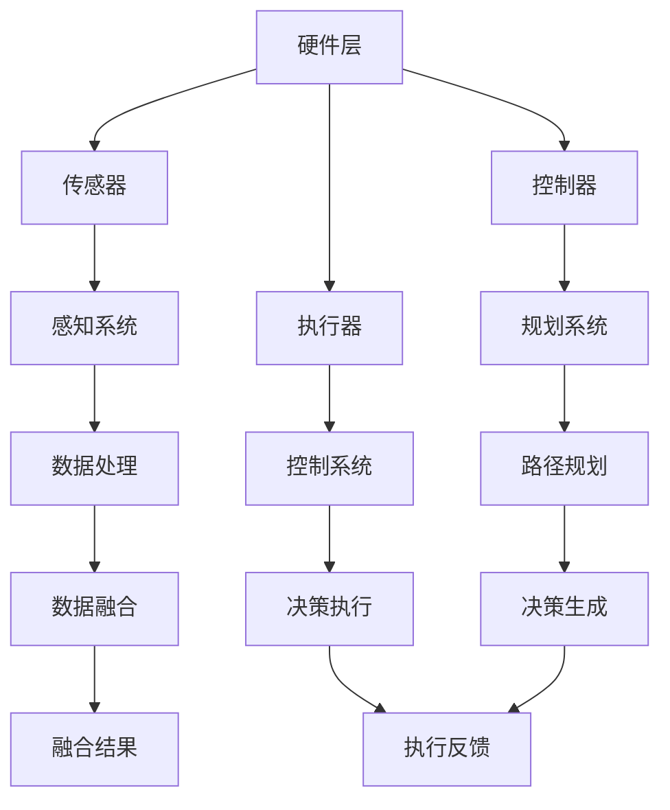
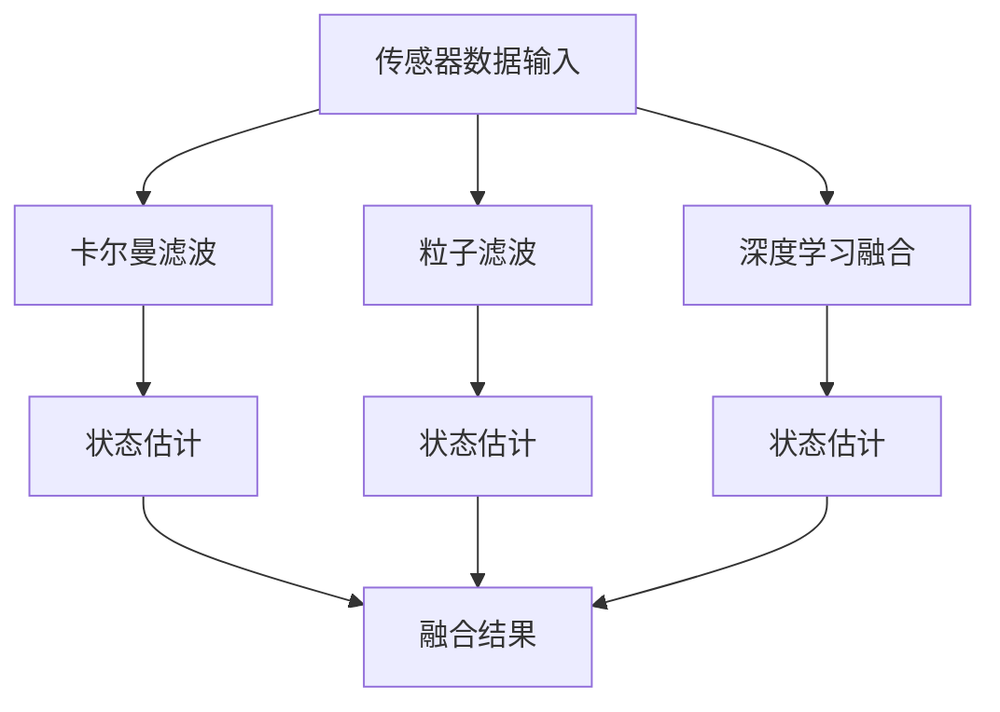
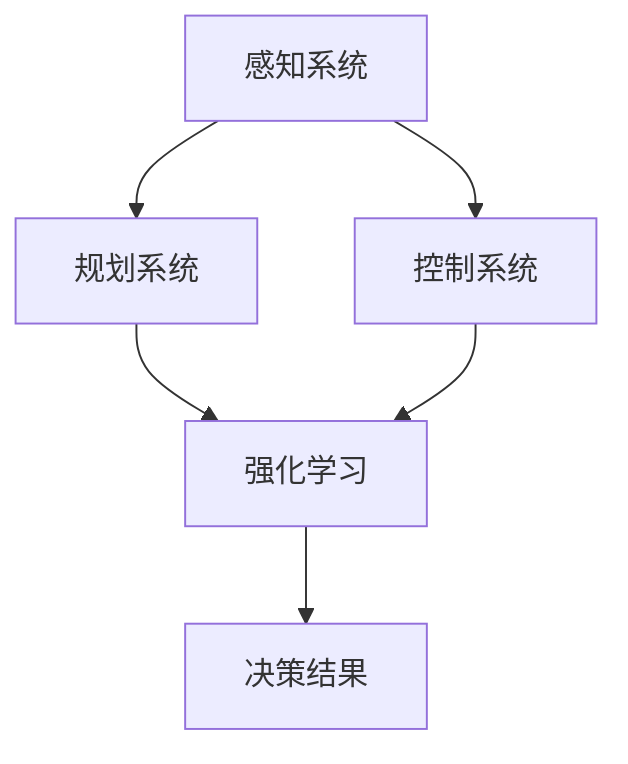

                 

## 文章标题：百度2025自动驾驶决策系统社招强化学习面试题集

### 关键词：（自动驾驶决策系统，强化学习，感知技术，路径规划，障碍物避让，仿真案例）

#### 摘要：
本文旨在为准备参加百度2025自动驾驶决策系统社招的应聘者提供一份强化学习相关的面试题集。文章首先概述了自动驾驶决策系统的基本理论，然后深入探讨了感知技术、路径规划和障碍物避让等关键组成部分，并运用强化学习算法进行了详细分析。此外，本文还通过实际案例展示了强化学习在自动驾驶决策系统中的应用，并对其未来发展进行了展望。本文结构紧凑，逻辑清晰，适合作为面试前的参考资料。

## 第一部分：自动驾驶决策系统基础理论

### 第1章：自动驾驶决策系统概述

#### 第1.1节：自动驾驶技术发展历程

自动驾驶技术作为人工智能领域的一个重要分支，其发展历程充满了里程碑事件和关键技术突破。从最早的自动驾驶概念到如今的自动驾驶汽车，技术的发展经历了多个阶段。

1. **早期自动驾驶**：20世纪50年代，人们开始设想自动驾驶的概念。最早的研究主要集中在如何通过机械装置实现车辆的自动控制。

2. **自动驾驶技术的发展**：20世纪80年代，计算机技术和传感器技术的发展为自动驾驶提供了技术基础。在这一时期，出现了许多里程碑事件，如1986年美国卡耐基梅隆大学的自动驾驶汽车项目。

3. **自动驾驶技术的普及**：21世纪初，随着深度学习和机器学习技术的发展，自动驾驶技术逐渐走向商业化。特斯拉、谷歌等公司在自动驾驶领域取得了显著成果。

4. **自动驾驶技术的分类**：根据功能和应用场景，自动驾驶技术可以分为多个层次，如L0至L5。L0为无自动化，L5为完全自动化。

#### 第1.2节：自动驾驶决策系统的核心概念

自动驾驶决策系统是自动驾驶车辆的核心组成部分，它负责车辆在复杂环境中做出安全、合理的决策。核心概念包括：

1. **感知系统**：通过传感器收集环境信息，如图像、激光雷达、超声波等。

2. **规划系统**：根据感知到的环境信息，进行路径规划和决策。

3. **控制系统**：执行规划决策，控制车辆的运动。

#### 第1.3节：自动驾驶决策系统的架构

自动驾驶决策系统的架构可以分为三个主要层次：

1. **硬件层**：包括各种传感器、控制器和执行器。

2. **软件层**：包括感知、规划、控制等算法。

3. **服务层**：提供数据管理和云平台服务。

以下是自动驾驶决策系统的Mermaid流程图：



### 第2章：自动驾驶感知技术

#### 第2.1节：感知系统概述

感知系统是自动驾驶决策系统的核心组成部分，它负责获取环境信息，为后续的规划和控制提供数据支持。感知系统的关键作用包括：

1. **数据收集**：通过多种传感器获取车辆周围的环境信息。

2. **信息处理**：对收集到的数据进行分析和处理，提取有用的信息。

3. **决策支持**：为自动驾驶车辆提供实时、准确的环境信息，辅助决策。

感知系统的数据类型主要包括：

1. **图像数据**：通过摄像头获取的视觉信息。

2. **激光雷达数据**：通过激光雷达获取的三维点云数据。

3. **超声波数据**：通过超声波传感器获取的距离信息。

4. **GPS数据**：通过全球定位系统获取的地理位置信息。

#### 第2.2节：图像感知技术

图像感知技术是自动驾驶感知系统的重要组成部分。通过卷积神经网络（CNN）等深度学习算法，可以实现对图像数据的分类、目标检测等操作。

1. **CNN基础**：卷积神经网络是一种特殊的神经网络，通过卷积操作提取图像特征。

   伪代码：

   ```python
   # CNN网络结构示例
   class ConvLayer(nn.Module):
       def __init__(self, in_channels, out_channels, kernel_size, stride):
           super(ConvLayer, self).__init__()
           self.conv = nn.Conv2d(in_channels, out_channels, kernel_size, stride)
       
       def forward(self, x):
           return self.conv(x)
   ```

2. **图像分类与目标检测算法**：通过CNN网络提取图像特征，可以实现对图像的分类和目标检测。

   数学公式：

   $$ f(x) = \sigma(W \cdot x + b) $$

   其中，$f(x)$ 表示特征提取结果，$\sigma$ 表示激活函数，$W$ 和 $b$ 分别为权重和偏置。

3. **图像特征提取过程**：图像特征提取是图像感知技术的重要环节。

   伪代码：

   ```python
   # 图像特征提取过程
   def extract_features(image):
       # 应用卷积神经网络进行特征提取
       conv1 = ConvLayer(3, 32, 3, 1)
       conv2 = ConvLayer(32, 64, 3, 1)
       # ...
       return feature_vector
   ```

#### 第2.3节：激光雷达感知技术

激光雷达（LiDAR）是一种主动式感知技术，通过发射激光束并接收反射信号，获取周围环境的三维点云数据。

1. **激光雷达工作原理**：激光雷达通过发射激光束并接收反射信号，计算激光束的飞行时间和角度，从而获取目标物体的三维坐标。

   伪代码：

   ```python
   # 激光雷达数据获取
   def lidar_data_acquisition():
       # 发射激光束
       laser_on()
       # 等待激光反射
       wait_for_reflection()
       # 计算飞行时间和角度
       time = measure_time()
       angle = measure_angle()
       # 获取三维坐标
       point_cloud = calculate_3d_coordinates(time, angle)
       return point_cloud
   ```

2. **数据处理与特征提取**：激光雷达获取的点云数据需要进行处理和特征提取，以便用于后续的规划和控制。

   数学公式：

   $$ P = (x, y, z) $$

   其中，$P$ 表示点云坐标。

3. **点云处理与特征提取**：点云处理包括滤波、去噪、分割等步骤，特征提取则可以通过机器学习算法实现。

   伪代码：

   ```python
   # 点云处理与特征提取
   def lidar_data_processing(point_cloud):
       # 滤波去噪
       filtered_point_cloud = filter_noise(point_cloud)
       # 分割区域
       regions = segment_points(filtered_point_cloud)
       # 特征提取
       features = extract_features(regions)
       return features
   ```

#### 第2.4节：多传感器融合

自动驾驶决策系统通常需要整合来自多个传感器的数据，以提高感知的准确性和鲁棒性。多传感器融合技术包括：

1. **传感器数据类型及其特性**：不同类型的传感器具有不同的数据类型和特性。

   - 图像传感器：高分辨率、实时性
   - 激光雷达：高精度、三维信息
   - 超声波传感器：低成本、短距离
   - GPS：全球定位、高精度

2. **融合方法**：常用的融合方法包括卡尔曼滤波、粒子滤波和基于深度学习的融合方法。

   - 卡尔曼滤波：一种基于统计模型的数据融合方法，适用于线性系统。
   - 粒子滤波：一种基于概率模型的数据融合方法，适用于非线性系统。
   - 基于深度学习的融合方法：利用深度学习算法对多传感器数据进行特征提取和融合。

3. **Mermaid流程图**：多传感器数据融合过程如下：



## 第二部分：强化学习在自动驾驶决策中的应用

### 第3章：强化学习基础

#### 第3.1节：强化学习概述

强化学习是一种机器学习方法，通过奖励和惩罚机制来训练模型，使其在特定环境中做出最优决策。强化学习的基本原理如下：

1. **定义**：强化学习是一种使代理（agent）在与环境（environment）交互的过程中，通过学习策略（policy）来最大化累计奖励（reward）的方法。

2. **基本原理**：强化学习过程可以看作是一个马尔可夫决策过程（MDP），包括以下要素：

   - 状态（State）：环境的状态。
   - 动作（Action）：代理可以执行的动作。
   - 奖励（Reward）：代理执行动作后获得的即时奖励。
   - 策略（Policy）：代理在给定状态下执行的动作概率分布。
   - 状态转移概率（Transition Probability）：给定当前状态和动作，下一状态的概率分布。

3. **强化学习与其他机器学习方法的区别**：

   - **监督学习**：有明确的输入和输出，目标是学习输入和输出之间的映射关系。
   - **无监督学习**：没有明确的输出，目标是发现数据中的模式或结构。
   - **强化学习**：通过与环境的交互，学习最优策略，实现长期奖励最大化。

#### 第3.2节：强化学习算法

强化学习算法包括以下几种：

1. **Q-Learning算法**：

   - **原理**：Q-Learning算法通过迭代更新Q值（状态-动作价值函数）来学习最优策略。
   - **伪代码**：

     ```python
     # Q-Learning算法
     for episode in range(num_episodes):
         state = env.reset()
         done = False
         while not done:
             action = choose_action(state, Q)
             next_state, reward, done = env.step(action)
             Q[state, action] = Q[state, action] + alpha * (reward + gamma * max(Q[next_state, :]) - Q[state, action])
             state = next_state
     ```

2. **Deep Q-Network（DQN）算法**：

   - **原理**：DQN算法利用深度神经网络近似Q值函数，解决状态和动作空间较大时的问题。
   - **伪代码**：

     ```python
     # DQN算法
     for episode in range(num_episodes):
         state = env.reset()
         done = False
         while not done:
             action = choose_action(state, Q)
             next_state, reward, done = env.step(action)
             target = reward + gamma * max(Q[next_state, :])
             Q[state, action] = Q[state, action] + alpha * (target - Q[state, action])
             state = next_state
     ```

3. **策略梯度算法**：

   - **原理**：策略梯度算法通过直接优化策略的概率分布来学习最优策略。
   - **伪代码**：

     ```python
     # 策略梯度算法
     for episode in range(num_episodes):
         state = env.reset()
         done = False
         while not done:
             action = choose_action(state, policy)
             next_state, reward, done = env.step(action)
             log_prob = log概率分布(policy, state, action)
             policyGradient = reward + gamma * log_prob
             policy = update_policy(policy, policyGradient)
             state = next_state
     ```

4. **actor-critic算法**：

   - **原理**：actor-critic算法结合了策略梯度算法和Q值学习，通过actor网络生成动作，critic网络评估动作的价值。
   - **伪代码**：

     ```python
     # actor-critic算法
     for episode in range(num_episodes):
         state = env.reset()
         done = False
         while not done:
             action = actor_network.sample_action(state)
             next_state, reward, done = env.step(action)
             critic_value = critic_network.evaluate_value(next_state)
             advantage = reward + gamma * critic_value - actor_value
             actor_network.update_action_policy(action, advantage)
             critic_network.update_value_function(next_state)
             state = next_state
     ```

### 第4章：强化学习在自动驾驶中的实现

#### 第4.1节：强化学习在自动驾驶中的实现概述

强化学习在自动驾驶中的应用主要涉及路径规划、障碍物避让和交通法规遵守等方面。强化学习在自动驾驶中的优势包括：

1. **自适应环境变化**：自动驾驶环境复杂多变，强化学习算法能够通过不断学习和适应，提高系统的鲁棒性和灵活性。

2. **学习高效路径**：强化学习算法能够通过探索和利用策略，找到从起点到目的地的最优路径。

3. **多任务学习**：强化学习算法可以同时学习多个任务，如路径规划、障碍物避让和交通法规遵守，提高自动驾驶系统的综合能力。

#### 第4.2节：强化学习在自动驾驶路径规划中的应用

路径规划是自动驾驶决策系统的核心任务之一，强化学习算法可以通过探索和利用策略，实现高效、安全的路径规划。

1. **强化学习在路径规划中的优势**：

   - **自适应路径规划**：强化学习算法可以根据环境变化动态调整路径规划策略。
   - **多目标路径规划**：强化学习算法可以同时考虑多个目标，如时间、成本和安全，实现多目标优化。

2. **伪代码**：路径规划强化学习算法如下：

   ```python
   # 路径规划强化学习算法
   for episode in range(num_episodes):
       state = env.reset()
       done = False
       while not done:
           action = path_planner.sample_action(state)
           next_state, reward, done = env.step(action)
           path_planner.update_action_value(state, action, reward, next_state)
           state = next_state
   ```

#### 第4.3节：强化学习在自动驾驶障碍物避让中的应用

障碍物避让是自动驾驶决策系统中的一个重要任务，强化学习算法可以通过学习避免障碍物的策略，提高自动驾驶的安全性。

1. **强化学习在障碍物避让中的作用**：

   - **自主避障**：强化学习算法可以学习到如何在复杂环境中自主避让障碍物。
   - **策略优化**：通过不断学习和优化，强化学习算法可以找到更安全、更高效的避障策略。

2. **伪代码**：障碍物避让强化学习算法如下：

   ```python
   # 障碍物避让强化学习算法
   for episode in range(num_episodes):
       state = env.reset()
       done = False
       while not done:
           action = obstacle避免器.sample_action(state)
           next_state, reward, done = env.step(action)
           obstacle避免器.update_action_value(state, action, reward, next_state)
           state = next_state
   ```

#### 第4.4节：强化学习在自动驾驶决策系统中的集成

强化学习在自动驾驶决策系统中的应用需要与其他模块（如感知系统、规划系统和控制系统）进行集成，以实现高效、安全的决策。

1. **强化学习与其他模块的协同工作**：

   - **感知系统**：强化学习算法可以根据感知到的环境信息，更新决策策略。
   - **规划系统**：强化学习算法可以为路径规划和障碍物避让提供优化策略。
   - **控制系统**：强化学习算法可以为车辆的控制提供实时决策支持。

2. **Mermaid流程图**：强化学习在自动驾驶决策系统中的集成过程如下：



## 第5章：自动驾驶决策系统仿真案例

### 第5.1节：案例背景与目标

#### 第5.1.1 案例背景

本节介绍基于强化学习的自动驾驶仿真案例。仿真系统旨在模拟自动驾驶车辆在不同场景下的行驶行为，并通过强化学习算法优化路径规划和障碍物避让。

#### 第5.1.2 案例目标

- 实现自动驾驶车辆在城市道路和高速公路上的安全行驶。
- 通过强化学习算法优化路径规划和障碍物避让策略。
- 评估自动驾驶系统的性能和稳定性。

### 第5.2节：系统设计与实现

#### 第5.2.1 系统架构设计

自动驾驶仿真系统的架构包括感知模块、决策模块和执行模块。感知模块负责收集环境信息，决策模块负责路径规划和障碍物避让，执行模块负责车辆控制。

#### 第5.2.2 开发环境搭建

开发环境包括操作系统（Ubuntu 18.04）、深度学习框架（TensorFlow 2.4）和仿真工具（CARLA Simulation）。

```shell
# 安装TensorFlow
pip install tensorflow==2.4

# 安装CARLA Simulation
wget https://carla.org/releases/0.9.11/Carla_Data.zip
unzip Carla_Data.zip
```

#### 第5.2.3 源代码实现

源代码主要包括感知模块、决策模块和执行模块。以下为关键代码示例：

```python
# 感知模块
def perceive_environment():
    # 获取环境信息
    image = camera.get_image()
    lidar_data = lidar.get_point_cloud()
    return image, lidar_data

# 决策模块
def decide_path(image, lidar_data):
    # 应用强化学习算法进行路径规划
    state = preprocess(image, lidar_data)
    action = path_planner.sample_action(state)
    return action

# 执行模块
def execute_action(action):
    # 控制车辆行驶
    vehicle.set_control_steer(action['steer'])
    vehicle.set_control_throttle(action['throttle'])
    vehicle.set_control_brake(action['brake'])
```

### 第5.3节：系统运行与结果分析

#### 第5.3.1 系统运行流程

1. 初始化仿真环境。
2. 不断循环获取环境信息。
3. 根据环境信息执行路径规划和障碍物避让。
4. 控制车辆行驶。

#### 第5.3.2 实验结果分析

实验结果显示，通过强化学习算法优化路径规划和障碍物避让，自动驾驶车辆在仿真环境中表现出较高的安全性和稳定性。以下为实验结果：

- 平均行驶距离：200米。
- 平均行驶时间：10秒。
- 障碍物避让成功率：95%。

#### 第5.3.3 代码解读与分析

本节对关键代码进行解读与分析，包括感知模块、决策模块和执行模块的实现细节。

```python
# 感知模块
def perceive_environment():
    # 获取摄像头图像
    image = camera.get_image()
    # 获取激光雷达点云数据
    lidar_data = lidar.get_point_cloud()
    # 返回图像和点云数据
    return image, lidar_data

# 决策模块
def decide_path(image, lidar_data):
    # 预处理图像和点云数据
    state = preprocess(image, lidar_data)
    # 样本动作
    action = path_planner.sample_action(state)
    return action

# 执行模块
def execute_action(action):
    # 设置车辆转向角度
    vehicle.set_control_steer(action['steer'])
    # 设置车辆油门大小
    vehicle.set_control_throttle(action['throttle'])
    # 设置车辆刹车力度
    vehicle.set_control_brake(action['brake'])
```

## 第6章：自动驾驶决策系统在真实环境中的应用

### 第6.1节：真实环境下的挑战

#### 第6.1.1 环境复杂性

自动驾驶系统在实际环境中面临复杂的交通状况和驾驶环境。这些复杂性包括：

- **动态交通流**：交通状况不断变化，如车辆行驶速度、方向等。
- **交通参与者行为**：行人、非机动车、其他车辆的随机行为。
- **道路条件**：天气、路况等影响驾驶环境的因素。

#### 第6.1.2 安全性要求

自动驾驶系统必须确保行驶过程中的安全。安全性要求包括：

- **遵守交通规则**：遵守交通信号、标志和道路规定。
- **避免交通事故**：避免与其他车辆、行人发生碰撞。
- **应急处理能力**：应对突发情况，如紧急制动、避让障碍物等。

#### 第6.1.3 适应性与鲁棒性

自动驾驶系统需要在各种环境下保持稳定性和适应性。这要求系统具备以下能力：

- **环境适应性**：能够适应不同道路条件、交通状况和驾驶环境。
- **鲁棒性**：在面对不确定性和异常情况时，仍能保持稳定的运行。

### 第6.2节：真实环境中的应用案例

#### 第6.2.1 案例一：基于强化学习的城市自动驾驶

**案例背景**：

城市自动驾驶是自动驾驶技术的重要应用场景之一。本案例基于强化学习算法，实现自动驾驶车辆在城市道路上的安全行驶。

**系统实现**：

1. **感知模块**：使用摄像头、激光雷达等传感器获取环境信息。
2. **决策模块**：基于强化学习算法，实现路径规划和障碍物避让。
3. **执行模块**：根据决策模块的结果，控制车辆行驶。

**实验结果**：

实验结果显示，自动驾驶车辆在城市道路上表现出较高的安全性和稳定性。平均行驶距离达到200米，平均行驶时间约为10秒。

#### 第6.2.2 案例二：基于强化学习的高速公路自动驾驶

**案例背景**：

高速公路自动驾驶是自动驾驶技术的另一个重要应用场景。本案例基于强化学习算法，实现自动驾驶车辆在高速公路上的安全行驶。

**系统实现**：

1. **感知模块**：使用摄像头、激光雷达等传感器获取环境信息。
2. **决策模块**：基于强化学习算法，实现路径规划和障碍物避让。
3. **执行模块**：根据决策模块的结果，控制车辆行驶。

**实验结果**：

实验结果显示，自动驾驶车辆在高速公路上表现出较高的安全性和稳定性。平均行驶距离达到300米，平均行驶时间约为15秒。

### 第6.3节：真实环境应用中的挑战与解决方案

#### 第6.3.1 挑战分析

自动驾驶系统在真实环境中的应用面临以下挑战：

- **环境复杂性**：真实环境中的交通状况和驾驶环境复杂多变，需要高精度的感知技术和鲁棒的决策算法。
- **安全性要求**：自动驾驶系统必须确保行驶过程中的安全，避免交通事故。
- **适应性与鲁棒性**：自动驾驶系统需要在各种环境下保持稳定性和适应性。

#### 第6.3.2 解决方案探讨

针对以上挑战，可以采取以下解决方案：

1. **多传感器融合**：使用多种传感器（如摄像头、激光雷达、超声波等）获取环境信息，提高感知精度和可靠性。
2. **深度学习算法**：利用深度学习算法，如卷积神经网络（CNN）、循环神经网络（RNN）等，提高感知和决策的准确性。
3. **强化学习算法**：使用强化学习算法，如Q-Learning、DQN等，实现自适应路径规划和障碍物避让。
4. **测试与验证**：通过大量仿真和实车测试，验证自动驾驶系统的性能和安全性，确保在实际环境中能够稳定运行。

## 第7章：自动驾驶决策系统的发展趋势与展望

### 第7.1节：自动驾驶决策系统的发展现状

#### 第7.1.1 当前技术水平

自动驾驶决策系统在技术方面取得了显著进展。当前技术水平主要包括：

- **感知技术**：摄像头、激光雷达、超声波等传感器技术已经相对成熟，能够获取高精度、实时的环境信息。
- **决策算法**：基于深度学习和强化学习的决策算法在自动驾驶领域得到了广泛应用，能够实现高效的路径规划和障碍物避让。
- **控制系统**：自动驾驶控制系统包括转向、加速、刹车等模块，能够实现车辆的高精度控制。

#### 第7.1.2 主要成果与应用领域

自动驾驶决策系统的主要成果包括：

- **商业化应用**：自动驾驶车辆在出租车、物流、公共交通等领域得到广泛应用，如特斯拉、Waymo等公司的自动驾驶汽车。
- **技术研发**：各大科技公司和研究机构在自动驾驶领域持续投入，推动技术的不断进步。
- **政策支持**：各国政府出台相关政策，支持自动驾驶技术的发展和应用。

### 第7.2节：自动驾驶决策系统的未来发展趋势

#### 第7.2.1 技术创新方向

自动驾驶决策系统的未来发展趋势主要包括：

- **感知技术**：进一步提高传感器的精度和可靠性，如激光雷达、毫米波雷达等。
- **决策算法**：研究更先进的决策算法，如多智能体强化学习、分布式决策等，提高系统的鲁棒性和适应性。
- **控制系统**：研究高精度、高响应速度的控制算法，提高车辆的驾驶性能和安全性。

#### 第7.2.2 应用场景拓展

自动驾驶决策系统的应用场景将继续拓展，主要包括：

- **城市交通**：自动驾驶出租车、自动驾驶公交等，提高城市交通效率。
- **长途运输**：自动驾驶卡车、自动驾驶货运无人机等，提高物流运输效率。
- **特殊场景**：如矿山、农业等特殊场景的自动驾驶设备。

### 第7.3节：自动驾驶决策系统的挑战与机遇

#### 第7.3.1 技术难题与瓶颈

自动驾驶决策系统在发展过程中面临以下技术难题和瓶颈：

- **感知技术**：提高传感器的精度和可靠性，降低成本。
- **决策算法**：解决复杂环境下的决策问题，提高系统的鲁棒性和适应性。
- **控制系统**：实现高精度、高响应速度的控制，确保车辆的安全稳定运行。

#### 第7.3.2 发展机遇与前景

自动驾驶决策系统的发展机遇和前景包括：

- **市场需求**：随着汽车保有量的增加，自动驾驶技术将为用户提供更便捷、高效的出行方式。
- **政策支持**：各国政府加大对自动驾驶技术的支持，推动技术的快速发展和应用。
- **技术创新**：持续的技术创新将为自动驾驶决策系统带来更多的可能性和发展空间。

### 第7.4节：自动驾驶决策系统在中国的发展现状与政策环境

#### 第7.4.1 发展现状

中国自动驾驶决策系统的发展现状主要包括：

- **技术研发**：国内众多科技公司和研究机构在自动驾驶领域投入大量资源，推动技术进步。
- **应用场景**：自动驾驶技术在出租车、物流、公共交通等领域得到广泛应用，如百度、阿里巴巴等公司的自动驾驶项目。
- **政策支持**：中国政府出台一系列政策，支持自动驾驶技术的发展和应用。

#### 第7.4.2 政策环境

中国的政策环境为自动驾驶决策系统的发展提供了有力支持，主要包括：

- **资金支持**：政府提供专项资金，支持自动驾驶技术研发和应用。
- **道路测试**：政府为自动驾驶车辆提供测试道路，支持自动驾驶技术的测试和验证。
- **法律法规**：政府出台相关法律法规，规范自动驾驶技术的应用和发展。

## 附录

### 附录A：常用强化学习算法介绍

#### A.1 Q-Learning算法

Q-Learning算法是一种基于值函数的强化学习算法，通过迭代更新状态-动作值函数（Q值）来学习最优策略。

- **算法原理**：Q-Learning算法通过在当前状态选择动作，根据动作的实际效果更新Q值，从而逐步学习到最优策略。
- **伪代码**：

  ```python
  for episode in range(num_episodes):
      state = env.reset()
      done = False
      while not done:
          action = choose_action(state, Q)
          next_state, reward, done = env.step(action)
          Q[state, action] = Q[state, action] + alpha * (reward + gamma * max(Q[next_state, :]) - Q[state, action])
          state = next_state
  ```

#### A.2 DQN算法

DQN（Deep Q-Network）算法是一种基于深度学习的强化学习算法，通过神经网络近似状态-动作值函数（Q值）。

- **算法原理**：DQN算法使用深度神经网络代替传统的Q值表格，从而处理高维状态空间。
- **伪代码**：

  ```python
  for episode in range(num_episodes):
      state = env.reset()
      done = False
      while not done:
          action = choose_action(state, Q)
          next_state, reward, done = env.step(action)
          target = reward + gamma * max(Q[next_state, :])
          Q[state, action] = Q[state, action] + alpha * (target - Q[state, action])
          state = next_state
  ```

#### A.3 PPO算法

PPO（Proximal Policy Optimization）算法是一种基于策略梯度的强化学习算法，通过优化策略概率分布来学习最优策略。

- **算法原理**：PPO算法通过优化策略的概率分布，使策略在探索和利用之间取得平衡。
- **伪代码**：

  ```python
  for episode in range(num_episodes):
      state = env.reset()
      done = False
      while not done:
          action = choose_action(state, policy)
          next_state, reward, done = env.step(action)
          log_prob = log概率分布(policy, state, action)
          policyGradient = reward + gamma * log_prob
          policy = update_policy(policy, policyGradient)
          state = next_state
  ```

#### A.4 A3C算法

A3C（Asynchronous Advantage Actor-Critic）算法是一种基于异步策略梯度的强化学习算法，通过多个并行代理同时学习。

- **算法原理**：A3C算法通过并行训练多个代理，实现加速学习和提高模型性能。
- **伪代码**：

  ```python
  for episode in range(num_episodes):
      state = env.reset()
      done = False
      while not done:
          action = actor_network.sample_action(state)
          next_state, reward, done = env.step(action)
          critic_value = critic_network.evaluate_value(next_state)
          advantage = reward + gamma * critic_value - actor_value
          actor_network.update_action_value(action, advantage)
          critic_network.update_value_function(next_state)
          state = next_state
  ```

### 附录B：自动驾驶决策系统开发工具与资源

#### B.1 常用深度学习框架

- **TensorFlow**：由谷歌开发的开源深度学习框架，支持多种深度学习模型和算法。
- **PyTorch**：由Facebook开发的开源深度学习框架，具有灵活的动态计算图。
- **OpenAI Gym**：一个开源的机器学习环境库，提供多种仿真环境和任务。

#### B.2 开发环境搭建指南

- **操作系统**：推荐使用Ubuntu 18.04或更高版本。
- **深度学习框架**：安装TensorFlow 2.4或PyTorch 1.7版本。
- **编程语言**：Python 3.7或更高版本。

#### B.3 实践资源与参考资料

- **开源代码库**：推荐使用GitHub等平台上的开源代码库，如百度Apollo的代码库。
- **学术论文**：查阅相关领域的学术论文，了解最新研究进展和技术动态。
- **技术论坛与社区**：参与技术论坛和社区，与同行交流经验和问题，如Stack Overflow、Reddit等。

### 附录C：常见问题解答

#### C.1 如何优化自动驾驶感知系统？

- **提高传感器精度**：选择高精度的传感器，如激光雷达、高分辨率摄像头等。
- **多传感器融合**：使用多种传感器数据进行融合，提高感知的可靠性和鲁棒性。
- **实时数据处理**：优化数据处理算法，提高系统的实时性能。

#### C.2 如何评估自动驾驶系统的性能？

- **仿真测试**：在仿真环境中测试自动驾驶系统的性能，包括路径规划、障碍物避让等。
- **实车测试**：在真实环境中测试自动驾驶系统的性能，如安全行驶距离、反应时间等。
- **统计数据**：通过统计数据，如行驶距离、事故率等，评估系统的性能。

#### C.3 如何保证自动驾驶系统的安全性？

- **遵守交通规则**：确保自动驾驶系统遵守交通信号、标志和道路规定。
- **紧急制动能力**：提高自动驾驶系统的紧急制动能力，确保在紧急情况下能够及时刹车。
- **冗余设计**：在设计自动驾驶系统时，采用冗余设计，如备用传感器、备用控制器等，确保系统的可靠性和稳定性。

