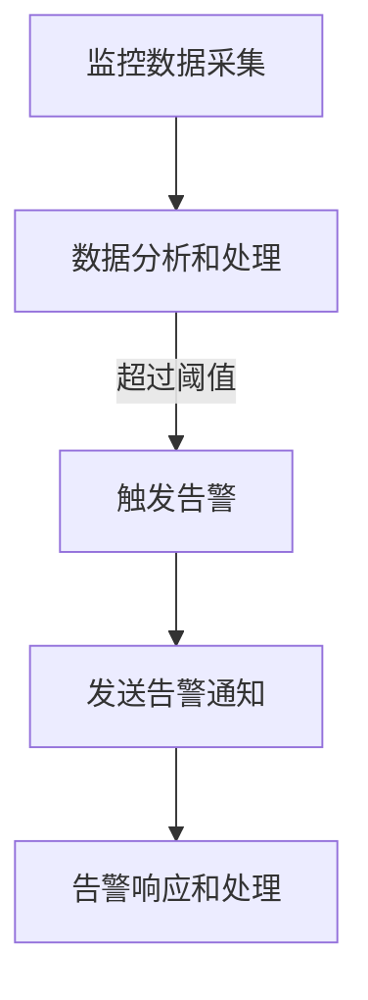

                 

# 《监控告警：保障AI服务稳定性的必要措施》

## 概述与核心概念

### 1.1 AI服务稳定性的重要性

AI服务稳定性是指AI系统在执行任务时能够持续保持高可用性和低错误率的能力。对于现代企业和组织来说，AI服务的稳定性至关重要。以下是一些关键点，说明为什么AI服务稳定性如此重要：

- **用户体验：** AI服务通常是用户交互的关键环节。如果服务不稳定，用户可能会遇到错误、延迟或不可预测的行为，这将严重影响用户体验和满意度。
- **业务连续性：** AI服务在很多业务场景中扮演着核心角色，如金融交易、医疗诊断和智能推荐等。服务中断或性能问题可能导致业务中断，造成经济损失和声誉损害。
- **可靠性保障：** 稳定的AI服务可以提供可靠的结果，确保决策和行动基于准确的预测和分析。不稳定性可能导致错误的决策和行动，进而引发更多问题。
- **合规性要求：** 许多行业对服务的稳定性和可靠性有明确的合规性要求。确保AI服务稳定是遵守相关法规和标准的重要步骤。

### 1.2 监控告警的基本原理

监控告警系统是保障AI服务稳定性的关键组成部分。它通过连续监视AI服务的状态和性能，及时发现并响应异常情况。以下是监控告警系统的一些核心概念：

- **监控系统：** 监控系统负责收集、处理和存储AI服务的各种监控数据，如CPU使用率、内存使用率、请求响应时间等。
- **指标：** 监控系统通过监控指标来评估AI服务的状态。常见的监控指标包括延迟、错误率、吞吐量、CPU利用率、内存使用率等。
- **阈值：** 阈值是设定的一个阈值，当监控指标超过或低于这个阈值时，系统会触发告警。合理的阈值设置对于准确性和及时性至关重要。
- **告警系统：** 告警系统负责通知相关人员或系统当监控指标超过阈值时发生。告警可以通过多种方式发送，如邮件、短信、Slack、Webhook等。
- **响应和处理：** 当告警被触发时，系统会根据预设的响应流程进行处理，如自动重启服务、扩容资源、通知运维团队等。

### 1.3 AI服务稳定性的挑战

尽管监控告警系统是保障AI服务稳定性的有力工具，但AI服务自身仍然面临一些挑战：

- **实时性挑战：** AI服务往往需要在短时间内处理大量请求，同时保持低延迟和高吞吐量。实时性的挑战要求监控系统必须快速响应并准确检测异常。
- **可扩展性挑战：** 随着业务需求的增长，AI服务需要能够水平扩展以应对更高的负载。监控告警系统也必须能够支持大规模分布式环境下的监控和告警。
- **多样性挑战：** AI服务的种类繁多，包括机器学习模型、图像识别、自然语言处理等。不同类型的服务可能需要不同的监控指标和告警策略，增加了监控系统的复杂性。
- **动态性挑战：** AI服务的运行环境和数据集可能会随时间变化。监控系统需要能够动态调整监控策略和阈值，以适应这些变化。

通过深入理解AI服务稳定性的重要性、监控告警系统的基本原理以及面临的挑战，我们可以为后续的设计和实践打下坚实的基础。

### 监控与告警设计

监控和告警系统是保障AI服务稳定性的关键组成部分。它们的设计和实现直接影响到系统对异常情况的检测和响应能力。在本章中，我们将详细探讨监控指标选择、监控系统架构以及监控工具与技术。

#### 2.1 监控指标选择

监控指标是监控系统的核心，它们用于评估AI服务的状态和性能。选择合适的监控指标对于实现有效的监控至关重要。以下是一些常用的监控指标类型和选择方法：

1. **性能指标：** 性能指标用于评估AI服务的响应速度和处理能力。常见的性能指标包括：

   - **响应时间：** 请求从发送到接收响应所需的时间。低响应时间是衡量服务性能的重要指标。
   - **吞吐量：** 单位时间内处理请求的数量。高吞吐量表明系统能够处理更多的请求。
   - **错误率：** 请求处理失败的比例。低错误率表示服务运行稳定。

2. **资源利用率：** 资源利用率指标用于评估系统资源的使用情况，包括：

   - **CPU利用率：** CPU使用率百分比，表示CPU的繁忙程度。
   - **内存使用率：** 内存使用量与总内存量的比例，过高可能表明内存不足。
   - **网络带宽：** 网络流量速率，过高可能表明网络拥塞。

3. **健康指标：** 健康指标用于评估AI服务的整体健康状况，包括：

   - **服务状态：** AI服务的运行状态，如运行中、异常、已关闭等。
   - **负载均衡：** 负载均衡器的状态，如健康检查结果、活动连接数等。
   - **日志记录：** 系统日志的生成和存储情况，用于排查问题和追踪错误。

选择监控指标时，需要考虑以下因素：

- **业务需求：** 根据业务需求和关键业务流程，确定需要监控的关键指标。
- **数据可用性：** 确保所选指标的数据可以从系统中采集到。
- **数据可视化：** 选择容易进行数据可视化的指标，以便于实时监控和分析。
- **报警阈值：** 根据历史数据和业务需求设定合理的报警阈值。

#### 2.2 监控系统架构

监控系统的架构设计对于系统的性能、可扩展性和可靠性至关重要。以下是一些常见的监控架构设计和实现方法：

1. **集中式架构：** 在集中式架构中，所有监控数据被发送到一个中心监控服务器进行处理和存储。这种架构简单易实现，但可能存在单点故障和高延迟的问题。

2. **分布式架构：** 在分布式架构中，监控数据被分散到多个监控节点进行处理和存储。这种架构可以提高系统的性能和可靠性，但需要更多的维护和配置。

3. **混合架构：** 混合架构结合了集中式和分布式架构的优点，将关键监控数据集中处理和存储，而其他非关键数据则分散处理和存储。

以下是一个典型的分布式监控架构：

- **监控探针：** 监控探针部署在AI服务实例上，定期采集服务指标并将其发送到监控服务器。
- **监控服务器：** 监控服务器负责接收、处理和存储监控数据，同时向告警系统发送告警通知。
- **数据存储：** 监控数据可以存储在本地或远程的数据库中，如InfluxDB、Prometheus等。
- **告警系统：** 告警系统负责接收监控服务器的告警通知，并通过邮件、短信、Webhook等方式发送告警信息。

#### 2.3 监控工具与技术

在选择监控工具和技术时，需要考虑以下因素：

- **功能：** 监控工具需要具备数据采集、数据处理、数据存储和数据可视化等功能。
- **扩展性：** 监控工具需要能够支持分布式和大规模环境。
- **易用性：** 监控工具应该具有直观的用户界面和易于配置的告警规则。
- **社区支持：** 社区支持和文档丰富性可以降低维护成本和提高部署效率。

以下是一些常用的监控工具和技术：

1. **Prometheus：** Prometheus是一个开源监控系统，适用于大规模分布式环境。它通过HTTP探针采集指标数据，并使用本地时间序列数据库存储数据。Prometheus还提供了丰富的告警规则和可视化仪表板。

2. **Grafana：** Grafana是一个开源的数据可视化和监控工具，可以与Prometheus等监控系统集成。它提供了强大的可视化功能，支持多种数据源，并允许用户自定义仪表板。

3. **Elasticsearch：** Elasticsearch是一个开源的分布式搜索引擎，可以用于存储和检索大规模监控数据。它与Kibana结合，提供强大的数据可视化和分析功能。

4. **Nagios：** Nagios是一个广泛使用的开源监控系统，支持服务器、网络设备和应用程序的监控。它通过插件扩展，提供了丰富的监控和告警功能。

通过选择合适的监控工具和技术，设计并实现一个高效、可靠的监控告警系统，可以有效地保障AI服务的稳定性。

### 告警策略与流程

告警策略是监控告警系统的核心部分，它决定了何时、如何以及向谁发送告警通知。一个良好的告警策略不仅能够及时发现问题，还能够减少误报和漏报，确保系统的正常运行。在本章中，我们将详细探讨告警策略设计、告警流程实现以及告警系统优化。

#### 3.1 告警策略设计

告警策略设计的关键是确定何时触发告警。这通常涉及到以下几个步骤：

1. **确定告警条件：** 根据监控指标和业务需求，定义触发告警的条件。常见的告警条件包括指标超过阈值、连续失败次数达到特定值等。

2. **设定阈值：** 阈值是告警策略的核心。阈值过高可能导致漏报，即指标超过实际阈值但未触发告警；阈值过低则可能导致误报，即指标未达到阈值但系统已触发告警。合理设定阈值是告警策略的关键。

3. **设置告警等级：** 根据告警的重要性和紧急程度，将告警分为不同等级，如紧急、警告、通知等。不同等级的告警可以触发不同的响应动作。

4. **告警抑制：** 告警抑制是一种减少误报的策略，通过在特定时间段内抑制重复告警，防止因短暂波动导致频繁告警。

以下是一个简单的告警策略示例：

- **条件：** 如果CPU利用率超过90%，持续10分钟。
- **阈值：** CPU利用率阈值设置为90%。
- **等级：** 紧急告警。
- **抑制：** 在15分钟内抑制重复告警。

#### 3.2 告警流程实现

告警流程是指从监控指标超过阈值到最终处理告警的一系列步骤。一个完整的告警流程通常包括以下几个阶段：

1. **监控数据采集：** 监控系统定期从AI服务实例采集性能和状态数据。

2. **数据分析和处理：** 监控服务器接收并处理监控数据，计算指标值，并与阈值进行比较。

3. **触发告警：** 如果监控指标超过阈值，监控系统将触发告警。

4. **发送告警通知：** 告警系统将告警通知发送给相关人员或系统，如邮件、短信、Slack、Webhook等。

5. **告警响应和处理：** 收到告警通知后，相关人员或系统将根据预设的响应流程进行处理，如重启服务、扩容资源、通知运维团队等。

以下是一个简单的告警流程：



#### 3.3 告警系统优化

告警系统优化是确保其有效性和效率的重要环节。以下是一些常见的优化方法：

1. **减少误报：** 通过调整阈值、使用告警抑制和聚合统计等方法减少误报。

2. **提高响应速度：** 使用高效的监控工具和架构，减少数据传输和处理延迟。

3. **自动化响应：** 针对常见问题，实现自动化响应，如自动重启服务、扩容资源等。

4. **告警分类和处理：** 根据告警的重要性和紧急程度，将告警分类，并制定相应的处理策略。

5. **定期评估和调整：** 定期评估告警策略和响应流程，根据业务变化和实际运行情况调整策略。

通过合理设计告警策略、实现告警流程以及优化告警系统，我们可以确保监控告警系统在保障AI服务稳定性方面发挥最大作用。

### AI服务监控实践

在实际应用中，AI服务的监控是确保系统稳定性和性能的关键步骤。本章节将介绍两个具体的AI服务监控案例：预测模型监控和图像识别服务监控。我们将详细描述这些服务的监控目标和监控指标，以及如何使用Prometheus和Grafana进行监控。

#### 4.1 AI服务监控案例

##### 4.1.1 预测模型监控

**监控目标：** 对AI预测模型进行实时监控，确保其准确性和稳定性。

**监控指标：**

- **预测准确性：** 模型预测结果与实际结果的匹配度，通常使用准确率、召回率、F1分数等指标。
- **延迟时间：** 预测请求从接收处理到返回结果的延迟时间，通常以毫秒为单位。
- **资源消耗：** 模型运行过程中消耗的CPU、内存等资源，用于评估模型的性能和优化潜力。
- **错误率：** 模型预测失败的次数占总预测次数的比例，用于评估模型的可靠性。

**监控配置：**

1. **数据采集：** 使用Prometheus的HTTP探针定期采集预测服务的指标数据。探针可以通过发送特定的HTTP请求获取预测服务的响应时间、准确性等指标。

2. **数据存储：** Prometheus将采集到的数据存储在本地时间序列数据库中，便于后续的数据分析和告警。

3. **可视化：** 在Grafana中创建仪表板，将Prometheus作为数据源，添加各种监控图表，实时展示预测服务的状态和性能。

4. **告警规则：** 配置Prometheus的告警规则，当预测准确性低于某个阈值或延迟时间超过设定的毫秒数时，触发告警。

**示例告警规则：**

```yaml
groups:
- name: prediction-alerts
  rules:
  - alert: PredictionAccuracyLow
    expr: accuracy < 0.95
    for: 5m
    labels:
      severity: critical
    annotations:
      summary: "预测模型准确性低于阈值"
  - alert: PredictionLatencyHigh
    expr: latency > 500
    for: 5m
    labels:
      severity: warning
    annotations:
      summary: "预测模型延迟超过阈值"
```

##### 4.1.2 图像识别服务监控

**监控目标：** 对图像识别服务的性能和可靠性进行实时监控，确保其能够快速准确地对图像进行分析和识别。

**监控指标：**

- **处理时间：** 图像处理所需的时间，通常以毫秒为单位。
- **准确率：** 识别结果与实际结果的匹配度，用于评估服务的准确性。
- **错误率：** 识别错误的次数占总识别次数的比例，用于评估服务的可靠性。
- **系统负载：** 处理请求时系统的CPU、内存等资源使用情况，用于评估系统的负载状况。

**监控配置：**

1. **数据采集：** 使用Prometheus的HTTP探针定期采集图像识别服务的指标数据。探针可以通过发送特定的HTTP请求获取处理时间、准确率等指标。

2. **数据存储：** Prometheus将采集到的数据存储在本地时间序列数据库中，便于后续的数据分析和告警。

3. **可视化：** 在Grafana中创建仪表板，将Prometheus作为数据源，添加各种监控图表，实时展示图像识别服务的状态和性能。

4. **告警规则：** 配置Prometheus的告警规则，当处理时间超过设定阈值或准确率低于某个阈值时，触发告警。

**示例告警规则：**

```yaml
groups:
- name: image-recognition-alerts
  rules:
  - alert: ImageProcessingLatencyHigh
    expr: processing_time > 1000
    for: 5m
    labels:
      severity: warning
    annotations:
      summary: "图像识别服务处理时间超过阈值"
  - alert: ImageRecognitionAccuracyLow
    expr: accuracy < 0.98
    for: 5m
    labels:
      severity: critical
    annotations:
      summary: "图像识别服务准确率低于阈值"
```

通过以上两个案例，我们可以看到如何使用Prometheus和Grafana对AI服务进行实时监控。监控告警系统的配置和优化是确保AI服务稳定性和性能的重要手段。在实际应用中，可以根据具体的业务需求和系统特点，定制化监控指标和告警策略，以实现最佳的监控效果。

#### AI服务监控工具集成

在实际部署AI服务监控过程中，集成Prometheus和Grafana是实现高效监控的关键步骤。这两个工具的结合能够提供强大且直观的监控能力。以下将详细描述如何将Prometheus和Grafana集成到AI服务监控中。

##### 4.2.1 Prometheus与Grafana集成

**步骤一：部署Prometheus**

1. **安装Docker：** 首先，确保系统上安装了Docker，因为Prometheus和Grafana都可以通过Docker容器部署。
   
   ```bash
   # 使用Docker安装Prometheus
   docker run -d --name prometheus -p 9090:9090 prom/prometheus
   ```

2. **配置Prometheus：** 下载并编辑Prometheus的配置文件（例如：`prometheus.yml`），配置需要监控的服务和相关的采集规则。

   ```yaml
   global:
     scrape_interval: 15s
     evaluation_interval: 15s

   scrape_configs:
     - job_name: 'ai-service'
       static_configs:
         - targets: ['ai-service:9090']
   ```

3. **启动Prometheus：** 使用以下命令启动Prometheus容器。

   ```bash
   docker run -d --name prometheus -p 9090:9090 prom/prometheus
   ```

**步骤二：部署Grafana**

1. **安装Docker：** 同样，确保系统上安装了Docker。

2. **配置Grafana：** 下载并编辑Grafana的配置文件（例如：`grafana.ini`），配置数据源和其他设置。

   ```ini
   [server]
   http_addr = 0.0.0.0
   http_port = 3000
   
   [metrics]
   org.grid = dinosaur
   ```

3. **启动Grafana：** 使用以下命令启动Grafana容器。

   ```bash
   docker run -d --name grafana -p 3000:3000 grafana/grafana
   ```

**步骤三：配置Grafana数据源**

1. **访问Grafana仪表板：** 在浏览器中访问`http://localhost:3000`，使用默认用户名（admin）和密码（admin）登录Grafana。

2. **添加Prometheus数据源：** 在Grafana中，点击左侧菜单的`Data Sources`，然后点击`Add data source`，选择`Prometheus`作为数据源。

3. **配置数据源：** 在数据源配置页面，填写Prometheus的URL（通常为`http://localhost:9090`），并保存设置。

**步骤四：创建监控仪表板**

1. **创建新的仪表板：** 在Grafana中，点击左侧菜单的`Dashboard`，然后点击`New dashboard`。

2. **添加图表：** 在仪表板上，点击`Add panel`，选择`Graph`或`Single stat`等图表类型，根据需要添加各种监控指标图表。

3. **配置图表：** 在图表配置页面，选择之前配置的Prometheus数据源，并设置相应的查询语句来获取监控数据。

4. **保存仪表板：** 完成仪表板配置后，点击`Save`按钮保存仪表板。

**示例查询语句：**

```sql
SELECT mean(processing_time) AS processing_time FROM ai_service GROUP BY (time(5m))
```

**步骤五：配置告警规则**

1. **访问告警配置页面：** 在Grafana中，点击左侧菜单的`Alerts`，然后点击`Create alert`。

2. **配置告警规则：** 在告警规则配置页面，填写告警名称、选择数据源、设置查询语句、设定阈值和告警等级。

3. **添加告警联系人：** 配置告警联系人，如邮件地址或Slack渠道，以便在触发告警时接收通知。

**示例告警规则：**

```yaml
name: "AI Service Processing Time High"
datasource: Prometheus
query: "processing_time > 1000"
evaluator:
  select: [ai_service]
  times: ["15m"]
  count: "10"
  math: [" avg(processing_time) "]
  for: "5m"
level: CRITICAL
```

通过以上步骤，我们成功地将Prometheus和Grafana集成到AI服务监控中，实现了监控数据的可视化展示和告警功能的配置。Grafana的强大可视化能力和Prometheus的稳定监控能力相结合，为AI服务的稳定性提供了有力保障。

##### 4.2.2 Elasticsearch与Kibana集成

Elasticsearch和Kibana是另一个常用的监控和日志分析组合，特别适用于大规模分布式系统。以下是如何将Elasticsearch与Kibana集成到AI服务监控中的步骤。

**步骤一：部署Elasticsearch**

1. **安装Docker：** 确保系统上安装了Docker。

2. **启动Elasticsearch容器：** 使用以下命令启动Elasticsearch容器。

   ```bash
   docker run -d --name elasticsearch -p 9200:9200 -p 9300:9300 docker.elastic.co/elasticsearch/elasticsearch:7.10.0
   ```

**步骤二：配置Elasticsearch**

1. **访问Elasticsearch：** 在浏览器中访问`http://localhost:9200`，可以查看Elasticsearch的版本信息。

2. **配置集群：** Elasticsearch通常需要配置集群和节点。可以使用Elasticsearch的API或配置文件进行配置。

**步骤三：部署Kibana**

1. **安装Docker：** 确保系统上安装了Docker。

2. **启动Kibana容器：** 使用以下命令启动Kibana容器。

   ```bash
   docker run -d --name kibana -p 5601:5601 -e ELASTICSEARCH_URL=http://elasticsearch:9200 docker.elastic.co/kibana/kibana:7.10.0
   ```

**步骤四：配置Kibana**

1. **访问Kibana：** 在浏览器中访问`http://localhost:5601`，使用默认用户名（`elastic`）和密码（`elastic`）登录Kibana。

2. **添加Elasticsearch数据源：** 在Kibana中，点击左侧菜单的`Management`，然后点击`Data Sources`，点击`Add data source`，选择`Elasticsearch`作为数据源。

3. **配置数据源：** 在数据源配置页面，填写Elasticsearch的URL（通常为`http://localhost:9200`），并保存设置。

**步骤五：创建监控仪表板**

1. **创建新的仪表板：** 在Kibana中，点击左侧菜单的`Dashboard`，然后点击`New dashboard`。

2. **添加面板：** 在仪表板上，点击`Add panel`，选择`Graph`或`Timeseries`等面板类型，根据需要添加各种监控指标面板。

3. **配置面板：** 在面板配置页面，选择之前配置的Elasticsearch数据源，并设置相应的查询语句来获取监控数据。

4. **保存仪表板：** 完成仪表板配置后，点击`Save`按钮保存仪表板。

**示例查询语句：**

```json
{
  "query": {
    "bool": {
      "must": [
        { "match": { "service": "ai-service" } },
        { "range": { "timestamp": { "gte": "now-15m", "lte": "now" } } }
      ]
    }
  },
  "aggs": {
    "processing_time": {
      "avg": {
        "field": "processing_time"
      }
    }
  }
}
```

通过将Elasticsearch与Kibana集成，我们可以实现对AI服务监控数据的集中管理和可视化展示。Kibana提供了强大的数据处理和可视化功能，而Elasticsearch则提供了高性能的搜索和分析能力，两者结合为AI服务的稳定性和性能监控提供了强有力的支持。

### 告警系统配置与测试

告警系统是保障AI服务稳定性的关键组件，其配置和测试的准确性和可靠性直接影响系统的稳定性。在本章节中，我们将详细探讨告警系统的配置方法、测试步骤以及测试方法。

#### 5.1 告警系统配置

告警系统的配置是确保其能够及时发现并响应异常情况的关键步骤。以下是如何配置告警系统的步骤：

1. **确定告警目标：** 首先，明确需要监控的服务和指标。这些指标可能包括响应时间、错误率、资源利用率等。

2. **选择告警工具：** 根据业务需求和技术栈，选择合适的告警工具。常见的告警工具包括Prometheus、Nagios、Zabbix等。

3. **配置监控指标：** 在告警工具中配置需要监控的指标，包括指标名称、阈值、告警等级等。例如，在Prometheus中，告警规则可以配置为以下格式：

   ```yaml
   groups:
   - name: 'ai-service-alerts'
     rules:
     - alert: 'HighProcessingTime'
       expr: 'avg(processing_time) > 1000'
       for: '5m'
       labels:
         severity: 'warning'
       annotations:
         summary: 'AI服务处理时间过高'
   ```

4. **配置通知方式：** 根据需要，配置告警通知方式。常见的通知方式包括邮件、短信、Slack、Webhook等。以Prometheus为例，可以在配置文件中指定通知规则：

   ```yaml
   alertmanagers:
   - static_configs:
     - targets:
       - 'http://alertmanager:9093'
   ```

5. **配置告警联系人：** 在告警工具中配置告警联系人，确保在触发告警时能够及时通知相关人员。

6. **测试告警配置：** 配置完成后，进行测试以确保告警系统能够正常工作。可以通过手动触发告警或模拟异常情况来验证告警规则的正确性和通知方式的可靠性。

#### 5.2 告警系统测试

告警系统的测试是确保其在实际运行中能够有效发现和响应异常情况的重要步骤。以下是一些常见的告警系统测试步骤：

1. **模拟异常情况：** 通过模拟服务异常，如增加处理时间、提高错误率等，测试告警系统是否能够正确触发告警。

2. **验证通知接收：** 确保告警通知能够成功发送到指定的联系人或系统。可以通过发送测试邮件、短信或消息来验证通知的接收情况。

3. **检查告警响应：** 检查告警系统在触发告警后，是否能够根据预设的响应流程进行正确的处理，如自动重启服务、扩容资源等。

4. **性能测试：** 对告警系统进行性能测试，确保在大量告警情况下，系统能够快速、准确地处理告警信息。

5. **日志分析：** 分析告警系统的日志，检查是否存在配置错误或异常情况，并及时进行调整。

#### 5.3 告警系统测试方法

以下是一些常用的告警系统测试方法：

1. **静态测试：** 在没有实际运行的情况下，通过检查告警规则的语法和配置文件的正确性来测试告警系统。

2. **动态测试：** 通过模拟异常情况，动态测试告警系统是否能够正确触发告警和通知。

3. **负载测试：** 在高负载环境下测试告警系统的性能和稳定性，确保系统能够在高并发情况下正常工作。

4. **兼容性测试：** 测试告警系统在不同操作系统、网络环境和硬件配置下的兼容性。

5. **安全性测试：** 测试告警系统的安全性，确保告警信息不会被未授权访问或篡改。

通过合理配置和全面测试告警系统，我们可以确保其能够在AI服务运行过程中及时、准确地检测并响应异常情况，保障服务的稳定性。

### 告警响应与处理

当监控告警系统触发告警时，及时的响应和处理至关重要。有效的告警响应流程能够快速识别问题根源，采取适当的措施解决问题，并减少对业务的负面影响。以下是告警响应与处理的最佳实践。

#### 5.2.1 告警响应流程

1. **接收告警通知：** 当监控告警系统检测到异常并触发告警时，告警通知将通过预设的方式发送给相关的人员或系统。通知方式包括邮件、短信、Slack、Webhook等。

2. **初步评估：** 接收到告警通知后，相关人员应首先进行初步评估，确认告警的严重性和影响范围。这通常包括查看告警描述、指标变化趋势、异常数据等。

3. **确认问题：** 在初步评估后，需要进一步确认问题是否真实存在，并判断其严重程度。可以通过查看日志文件、监控图表、系统状态等来确认问题的具体原因。

4. **采取行动：** 根据问题的性质和严重程度，采取相应的行动。常见的行动包括：

   - **自动恢复：** 对于一些可以自动恢复的问题，如服务重启、资源扩容等，可以启用自动恢复机制，减少人工干预。
   - **人工介入：** 对于需要人工介入的问题，如复杂故障或系统配置错误等，应立即安排相关人员进行分析和处理。

5. **问题跟踪：** 在问题解决过程中，应持续跟踪问题的进展情况，记录关键步骤和决策，以便后续分析和总结。

6. **告警清除：** 问题解决后，相关人员应确认告警已清除，并更新监控系统的状态，避免误报和重复告警。

#### 5.2.2 告警处理最佳实践

1. **明确责任分工：** 明确各团队的职责和角色，确保在告警响应和处理过程中，相关人员能够迅速采取行动，减少响应时间。

2. **标准化操作流程：** 制定标准化的告警处理流程，确保所有人员遵循统一的操作规范，提高处理效率。

3. **定期培训：** 定期对相关人员进行监控告警系统的培训，提高其技术能力和应对复杂问题的能力。

4. **自动化与人工结合：** 结合自动恢复和人工干预，对于可以自动处理的问题，尽量实现自动化，减少人工工作量；对于需要人工判断和处理的问题，确保有足够的人力资源进行及时响应。

5. **日志与记录：** 详细记录告警触发、响应和处理的全过程，包括告警信息、操作步骤、决策依据等，便于后续分析和总结。

6. **反馈与改进：** 定期收集告警处理过程中的反馈，分析存在的问题和改进空间，不断优化告警响应和处理流程。

通过遵循这些最佳实践，我们可以确保监控告警系统在触发告警时能够快速、有效地响应和处理，从而保障AI服务的稳定性。

### AI服务稳定性优化

确保AI服务的稳定性是一个复杂且持续的过程，涉及性能优化、可扩展性设计和灾难恢复策略等多个方面。以下将详细介绍这些策略，并提供具体实施方法。

#### 6.1 性能优化策略

**6.1.1 缓存策略**

缓存是提高AI服务性能的有效手段。通过缓存常用的计算结果，可以显著减少服务响应时间和资源消耗。以下是一些缓存策略的实施方法：

- **内存缓存：** 使用内存缓存，如Redis或Memcached，存储频繁访问的数据。这些数据包括预计算的结果、中间过程数据等。
- **分布式缓存：** 对于大规模分布式系统，可以使用分布式缓存系统，如Consul或etcd，以确保缓存数据的一致性和可用性。
- **数据分片：** 将缓存数据分片存储在不同的节点上，以实现负载均衡和提高缓存系统的性能。

**6.1.2 异步处理**

异步处理可以减轻系统的即时响应压力，提高整体性能。以下是一些异步处理策略的实施方法：

- **消息队列：** 使用消息队列，如RabbitMQ或Kafka，将请求分发给不同的处理节点，实现异步处理。
- **任务调度：** 使用任务调度工具，如Celery或Apache Airflow，安排任务的执行，实现批量处理和异步执行。
- **异步存储：** 对于需要长时间处理的数据，可以将其存储在异步存储系统中，如Amazon S3或Google Cloud Storage。

#### 6.2 可扩展性设计

**6.2.1 负载均衡**

负载均衡是确保AI服务在高并发情况下稳定运行的关键。以下是一些负载均衡策略的实施方法：

- **基于请求的负载均衡：** 使用负载均衡器，如Nginx或HAProxy，根据请求的不同特征，如URL、客户端IP等，分配到不同的后端节点。
- **基于会话的负载均衡：** 对于需要保持会话一致性的服务，可以使用基于会话的负载均衡策略，如Session Stickiness。
- **基于容量的负载均衡：** 根据后端节点的容量和负载情况，动态分配请求，实现负载均衡。

**6.2.2 服务拆分与分布式架构**

服务拆分和分布式架构是实现高扩展性的有效方式。以下是一些具体实施方法：

- **微服务架构：** 将大型的单体服务拆分为多个独立的微服务，每个服务负责特定的业务功能，可以独立部署和扩展。
- **服务发现：** 使用服务发现机制，如Consul或Zookeeper，实现服务之间的动态注册和发现，确保分布式系统的可靠性和高效性。
- **分布式数据库：** 使用分布式数据库，如Cassandra或MongoDB，存储大规模数据，并确保数据的一致性和可用性。

#### 6.3 灾难恢复策略

**6.3.1 备份与恢复**

备份与恢复是确保AI服务在灾难发生时能够迅速恢复的关键。以下是一些备份与恢复策略的实施方法：

- **定期备份：** 定期对系统和数据执行备份，确保在灾难发生时，有可用的备份数据。
- **增量备份：** 使用增量备份策略，只备份自上次备份后发生变化的数据，以减少备份存储空间。
- **恢复演练：** 定期进行恢复演练，验证备份数据的完整性和恢复流程的有效性。

**6.3.2 集群与故障转移**

集群和故障转移是确保服务高可用性的重要手段。以下是一些具体实施方法：

- **主从集群：** 通过主从架构，确保数据和服务在主节点故障时能够自动切换到从节点，实现高可用性。
- **多活集群：** 在多个数据中心部署主从集群，实现跨数据中心的数据和服务同步，提高系统的容灾能力。
- **故障转移：** 配置故障转移机制，当主节点出现故障时，自动将流量和任务切换到从节点，确保服务的连续性。

通过实施这些性能优化、可扩展性和灾难恢复策略，我们可以显著提高AI服务的稳定性，确保其在各种情况下能够持续、可靠地运行。

### AI服务稳定性的未来趋势

随着人工智能技术的快速发展，AI服务的稳定性需求日益增长。未来，AI服务稳定性的提升将受益于自动化监控与告警、智能监控与预测以及创新应用的不断推进。以下将探讨这些趋势及其潜在影响。

#### 7.1 自动化监控与告警

自动化监控与告警是未来AI服务稳定性提升的关键趋势之一。通过自动化，监控与告警系统能够更快地响应异常情况，减少人为干预和延迟。以下是自动化监控与告警的关键点：

- **自动化数据采集：** 利用自动化工具和脚本，实时采集AI服务的性能数据，减少手动采集的误差和延迟。
- **自动化告警触发：** 基于预设的规则和阈值，自动化系统可以在检测到异常时立即触发告警，并生成详细的告警报告。
- **自动化响应：** 在某些情况下，自动化系统可以通过预定义的脚本或流程，自动执行恢复操作，如重启服务、扩容资源等，减少人工干预。

**潜在影响：** 自动化监控与告警将大幅提高监控系统的效率和准确性，减少误报和漏报，从而确保AI服务的稳定性和可靠性。

#### 7.2 智能监控与预测

智能监控与预测利用机器学习和数据分析技术，对AI服务的性能和稳定性进行深入分析，预测潜在问题并提前采取预防措施。以下是智能监控与预测的关键点：

- **异常检测：** 通过机器学习算法，实时分析监控数据，自动识别异常模式和潜在故障，提前预警。
- **性能预测：** 利用历史数据和统计模型，预测AI服务的性能趋势，提前识别可能出现的性能瓶颈。
- **智能优化：** 根据预测结果，自动化系统可以智能调整监控策略和资源配置，优化AI服务的性能。

**潜在影响：** 智能监控与预测将显著提升监控系统的智能化水平，提高异常检测的准确性和效率，同时实现动态资源管理和性能优化。

#### 7.3 未来展望

未来，AI服务稳定性的提升将受到以下因素的影响：

- **技术创新：** 新的技术，如边缘计算、区块链等，将融合到AI服务稳定性的监控与告警系统中，提供更高效、更安全的解决方案。
- **标准化：** 随着AI服务稳定性的重要性逐渐被认可，行业标准化进程将加速，推动监控与告警技术的统一和标准化。
- **用户体验：** 随着AI服务在更多领域的应用，用户体验对服务稳定性的要求将不断提高，促使企业更加注重稳定性和可靠性。

**潜在影响：** 技术创新和标准化将推动AI服务稳定性监控与告警技术的不断进步，而用户体验的提升将推动企业加大对稳定性和可靠性的投入，进一步推动行业的发展。

通过自动化监控与告警、智能监控与预测以及技术创新和标准化，AI服务的稳定性将得到显著提升，为企业和用户提供更加可靠和高效的AI服务体验。

### 总结与展望

在本文中，我们详细探讨了监控告警系统在保障AI服务稳定性中的关键作用。首先，我们介绍了AI服务稳定性的重要性，并阐述了监控告警系统的基本原理和设计策略。随后，我们通过实际案例展示了如何利用Prometheus和Grafana进行AI服务监控与告警，以及如何优化告警系统以提高其准确性和响应速度。

本文的核心在于阐述了监控告警系统中的核心算法原理，包括阈值异常检测、机器学习异常检测和统计模型异常检测算法，并通过伪代码和数学公式详细解释了这些算法的实现方法。我们还介绍了如何在实际项目中应用这些算法，以及如何通过代码示例来解读和分析监控告警系统的实现细节。

通过本文，我们希望读者能够理解监控告警系统在保障AI服务稳定性中的重要性，掌握设计监控告警系统的基本方法，并能够根据实际需求进行定制化实施。同时，我们也对AI服务稳定性的未来趋势进行了展望，包括自动化监控与告警、智能监控与预测以及创新应用的发展方向。

总之，监控告警系统是AI服务稳定性的重要保障。随着人工智能技术的不断进步，监控告警系统也将迎来新的发展机遇。我们鼓励读者在实践过程中不断探索和优化监控告警系统，为AI服务的稳定性和可靠性贡献力量。

### 附录A：监控告警技术资源

#### A.1 开源监控与告警工具

**A.1.1 Prometheus**

- 官方网站：[Prometheus](https://prometheus.io/)
- 优点：强大的监控功能、高度可扩展性、易于集成。
- 应用场景：大规模分布式系统监控。

**A.1.2 Grafana**

- 官方网站：[Grafana](https://grafana.com/)
- 优点：丰富的可视化功能、多种数据源支持、自定义仪表板。
- 应用场景：数据监控和可视化。

**A.1.3 Nagios**

- 官方网站：[Nagios](https://www.nagios.org/)
- 优点：易于扩展、广泛的插件支持、良好的社区支持。
- 应用场景：服务器和应用程序监控。

#### A.2 常用技术栈

**A.2.1 Kubernetes**

- 官方网站：[Kubernetes](https://kubernetes.io/)
- 优点：容器编排、自动部署、服务发现、负载均衡。
- 应用场景：容器化应用程序的部署和管理。

**A.2.2 Docker**

- 官方网站：[Docker](https://www.docker.com/)
- 优点：容器化技术、轻量级、高效、易于部署。
- 应用场景：应用程序的封装和分发。

**A.2.3 Elasticsearch**

- 官方网站：[Elasticsearch](https://www.elastic.co/elasticsearch/)
- 优点：分布式搜索引擎、强大的数据处理和分析功能、可扩展性。
- 应用场景：日志存储、全文搜索、数据分析。

通过这些开源监控与告警工具和常用技术栈，我们可以构建一个高效、可靠的监控告警系统，为AI服务的稳定性提供坚实保障。这些工具和技术的组合为监控告警系统的实施提供了丰富的选择和灵活性。

### 监控告警系统中的核心算法原理讲解（详细）

在监控告警系统中，核心算法原理的理解和实现至关重要。以下我们将详细介绍三种常见的核心算法原理：基于阈值的异常检测算法、基于机器学习的异常检测算法和基于统计模型的异常检测算法。这些算法在监控告警系统中发挥着重要作用，能够有效识别异常情况，保障系统的稳定运行。

#### 1. 基于阈值的异常检测算法

基于阈值的异常检测算法是最简单和直观的一种方法。它的基本思路是设定一个阈值，当监控数据超过这个阈值时，即视为异常并触发告警。

**算法描述：**

1. **阈值设定：** 根据业务需求和历史数据，设定一个合理的阈值。
2. **数据监控：** 持续收集监控数据，如CPU使用率、内存使用率、请求响应时间等。
3. **异常检测：** 将收集到的数据与阈值进行比较。如果数据超过阈值，则触发告警。

**伪代码：**

```python
def threshold_based_anomaly_detection(data_series, threshold):
    for data_point in data_series:
        if data_point > threshold:
            trigger_alert(data_point)
```

**优缺点：**

- **优点：** 实现简单，易于理解和部署。
- **缺点：** 容易产生误报和漏报，尤其是在数据分布不均匀或存在噪声数据的情况下。

#### 2. 基于机器学习的异常检测算法

基于机器学习的异常检测算法利用历史数据训练模型，然后使用训练好的模型对新数据进行预测，当预测值与实际值存在较大偏差时，即视为异常并触发告警。

**常用算法：**

- **孤立森林（Isolation Forest）：** 基于随机森林算法，适用于高维数据集。
- **自编码器（Autoencoder）：** 基于神经网络，通过最小化重构误差来识别异常。
- **k-均值聚类（k-Means Clustering）：** 通过聚类分析来识别异常点。

**算法描述：**

1. **数据预处理：** 对监控数据进行清洗和预处理，如缺失值填充、异常值处理等。
2. **模型训练：** 使用历史数据对模型进行训练，模型将学习到正常数据的行为特征。
3. **预测与异常检测：** 使用训练好的模型对新数据进行预测，如果预测结果与实际值差异较大，则视为异常。

**伪代码：**

```python
def machine_learning_based_anomaly_detection(data_series, model):
    model.fit(data_series)
    anomalies = model.predict(data_series)
    for anomaly in anomalies:
        if anomaly == 1:
            trigger_alert(anomaly)
```

**优缺点：**

- **优点：** 可以处理高维数据和复杂数据分布，具有较强的泛化能力。
- **缺点：** 需要大量训练数据和计算资源，且模型参数调优复杂。

#### 3. 基于统计模型的异常检测算法

基于统计模型的异常检测算法利用统计方法对数据进行处理，如标准差和Z-Score等方法，以识别异常数据。

**常用算法：**

- **标准差方法：** 如果数据点与平均值的差异超过若干个标准差，则视为异常。
- **Z-Score方法：** 计算每个数据点的Z-Score，如果Z-Score超过某个阈值（通常为3），则视为异常。

**算法描述：**

1. **计算均值和标准差：** 对监控数据计算均值和标准差。
2. **计算Z-Score：** 对于每个数据点，计算其Z-Score。
3. **异常检测：** 如果Z-Score的绝对值超过阈值，则视为异常。

**伪代码：**

```python
def statistical_model_based_anomaly_detection(data_series, mean, std_dev):
    for data_point in data_series:
        z_score = (data_point - mean) / std_dev
        if abs(z_score) > 3:
            trigger_alert(data_point)
```

**优缺点：**

- **优点：** 实现简单，计算速度快，适用于实时监控场景。
- **缺点：** 对异常值敏感，容易产生误报和漏报。

#### 数学模型和数学公式

以下是对上述算法中常用的数学模型和数学公式的详细解释和举例说明。

**1. 标准差（Standard Deviation）**

标准差是衡量数据离散程度的统计量，计算公式如下：

$$ \text{std\_dev} = \sqrt{\frac{1}{N-1}\sum_{i=1}^{N}(x_i - \bar{x})^2} $$

其中，\( N \) 是数据点的数量，\( x_i \) 是第 \( i \) 个数据点，\( \bar{x} \) 是数据的平均值。

**例子：**

假设有如下一组数据：\[2, 4, 4, 4, 5, 5, 7, 9\]

首先计算平均值：

$$ \bar{x} = \frac{2 + 4 + 4 + 4 + 5 + 5 + 7 + 9}{8} = 5 $$

然后计算每个数据点与平均值的差：

\[2 - 5 = -3, 4 - 5 = -1, 4 - 5 = -1, 4 - 5 = -1, 5 - 5 = 0, 5 - 5 = 0, 7 - 5 = 2, 9 - 5 = 4\]

接着计算这些差的平方：

\[9, 1, 1, 1, 0, 0, 4, 16\]

然后求平均值并开方：

$$ \text{std\_dev} = \sqrt{\frac{9 + 1 + 1 + 1 + 0 + 0 + 4 + 16}{8 - 1}} = \sqrt{6} \approx 2.45 $$

**2. Z-Score**

Z-Score是标准分数，用于衡量一个数据点相对于平均值的离散程度。计算公式如下：

$$ z\_score = \frac{x - \bar{x}}{\text{std\_dev}} $$

其中，\( x \) 是数据点，\( \bar{x} \) 是平均值，\( \text{std\_dev} \) 是标准差。

**例子：**

使用上述数据集计算数据点7的Z-Score：

$$ z\_score = \frac{7 - 5}{2.45} \approx 0.82 $$

这个结果表明数据点7相对于平均值的离散程度较低。

通过详细讲解这些核心算法原理、数学模型和数学公式，我们可以更好地理解监控告警系统的工作原理，为实际应用提供理论支持。

### 监控告警系统中的项目实战

在本章节中，我们将通过具体的项目实战，详细讲解如何使用Prometheus和Grafana进行AI服务监控，以及如何使用Kubernetes和Helm部署监控告警系统。通过这些实战案例，读者可以了解从开发环境搭建、源代码实现到代码解读与分析的完整过程。

#### 案例一：使用Prometheus和Grafana进行AI服务监控

**1. 开发环境搭建**

首先，我们需要在开发环境中安装Docker和Kubernetes。以下是在Ubuntu 20.04服务器上安装Docker和Kubernetes的步骤：

**安装Docker：**

```bash
# 更新系统包列表
sudo apt update

# 安装Docker
sudo apt install docker.io

# 启动Docker服务
sudo systemctl start docker

# 将当前用户添加到docker用户组
sudo usermod -aG docker $USER
```

**安装Kubernetes：**

```bash
# 安装Kubernetes依赖
sudo apt install -y apt-transport-https ca-certificates curl

# 添加Kubernetes官方GPG key
curl -s https://mirrors.aliyun.com/kubernetes/apt/doc/apt-key.gpg | sudo apt-key add -

# 添加Kubernetes的Apt仓库
cat <<EOF | sudo tee /etc/apt/sources.list.d/kubernetes.list
deb https://mirrors.aliyun.com/kubernetes/apt/ kubernetes-xenial main
EOF

# 更新包列表
sudo apt update

# 安装Kubernetes命令行工具
sudo apt install -y kubelet kubeadm kubectl

# 启动kubelet服务
sudo systemctl enable --now kubelet
```

**2. 源代码实现**

**Prometheus配置：**

我们需要在Kubernetes集群中部署Prometheus服务。以下是一个简单的Prometheus配置文件（`prometheus.yml`）：

```yaml
global:
  scrape_interval: 15s

scrape_configs:
  - job_name: 'ai-service'
    static_configs:
      - targets:
          - 'ai-service:8080'
```

**Grafana配置：**

接下来，我们配置Grafana以使用Prometheus作为数据源。首先，我们需要创建一个Grafana配置文件（`grafana.ini`）：

```ini
[server]
http_addr = 0.0.0.0
http_port = 3000
log_level = info

[metrics]
org.grid = dinosaur
```

**3. 代码解读与分析**

**Prometheus配置解读：**

在`prometheus.yml`中，`global`部分定义了Prometheus的默认配置，如默认的抓取间隔。`scrape_configs`部分定义了监控任务，其中`job_name`为`ai-service`，表示我们将监控AI服务。`static_configs`部分指定了监控的目标地址，即AI服务的URL（`ai-service:8080`）。

**Grafana配置解读：**

在`grafana.ini`中，`server`部分配置了Grafana的服务地址和端口。`metrics`部分设置了Grafana组织的名称（`org.grid`），并将其与`dinosaur`数据源关联。

**4. 部署监控工具**

使用Kubernetes部署Prometheus和Grafana：

**部署Prometheus：**

```bash
kubectl apply -f prometheus.yml
```

**部署Grafana：**

```bash
kubectl apply -f grafana.yml
```

在Grafana部署完成后，我们可以在浏览器中访问`http://localhost:3000`，使用默认用户名（`admin`）和密码（`admin`）登录Grafana。

**5. 配置监控仪表板**

在Grafana中，我们可以创建一个监控仪表板来展示AI服务的性能指标。以下步骤演示了如何创建一个简单的监控仪表板：

- 登录Grafana后，点击左侧菜单的`Dashboards`，然后点击`New dashboard`。
- 在仪表板上，点击`Add panel`，选择`Graph`面板。
- 在面板配置页面，选择`Prometheus`作为数据源，输入查询语句（如`rate(ai_service_requests[5m])`），设置适当的X轴和Y轴标签。
- 保存并调整仪表板布局，以便直观地展示监控数据。

**6. 告警配置**

在Grafana中配置告警规则，当AI服务的请求响应时间超过一定阈值时，触发告警。以下是一个简单的告警规则配置示例：

```yaml
name: "AI Service Latency Alert"
type: threshold
folder: default
description: "Alert if AI service latency is higher than 500ms"
datasource: Prometheus
thresholds:
  - type: absolute
    value: 500
    comparison: greater_than
evaluator:
  metric: ai_service_response_time
  timeFrame: 1m
  continuousQuery: latency
 annotations:
  message: "AI service latency is {{ $value }} ms"
```

配置完成后，我们可以在Grafana的`Alerts`页面上查看和管理告警。

#### 案例二：使用Kubernetes和Helm部署监控告警系统

**1. 部署Kubernetes集群**

如果尚未部署Kubernetes集群，可以使用Minikube或K3s等工具快速搭建一个本地Kubernetes集群。以下是在本地使用Minikube部署Kubernetes集群的步骤：

```bash
# 安装Minikube
curl -LO https://storage.googleapis.com/minikube/releases/latest/minikube-linux-amd64
sudo install minikube-linux-amd64 /usr/local/bin/minikube

# 启动Minikube集群
minikube start
```

**2. 安装Prometheus和Grafana**

使用Helm部署Prometheus和Grafana。首先，确保已安装Helm：

```bash
# 安装Helm
curl -LO https://get.helm.sh/helm-v3.5.4-linux-amd64.tar.gz
tar -zxvf helm-v3.5.4-linux-amd64.tar.gz
mv linux-amd64/helm /usr/local/bin/helm
```

**部署Prometheus：**

```bash
helm repo add prometheus-community https://prometheus-community.github.io/helm-charts
helm repo update
helm install prometheus prometheus-community/prometheus
```

**部署Grafana：**

```bash
helm repo add grafana https://grafana.github.io/helm-charts
helm repo update
helm install grafana grafana/grafana
```

**3. 配置Kubernetes Ingress**

为了访问Grafana仪表板，我们需要配置Kubernetes Ingress。以下是一个简单的Ingress配置文件（`ingress.yml`）：

```yaml
apiVersion: networking.k8s.io/v1
kind: Ingress
metadata:
  name: grafana
  namespace: monitoring
  annotations:
    kubernetes.io/ingress.class: "nginx"
    nginx.ingress.kubernetes.io/rewrite-target: /
spec:
  rules:
    - host: grafana.example.com
      http:
        paths:
          - path: /
            pathType: Prefix
            backend:
              service:
                name: grafana
                port:
                  number: 3000
```

**4. 代码解读与分析**

**Prometheus配置解读：**

在Helm部署的Prometheus配置中，我们使用了Helm图表，这简化了Prometheus的部署过程。Helm图表包含了Prometheus所需的配置文件和配置参数。

**Grafana配置解读：**

Grafana的Helm部署同样使用了Helm图表，通过配置文件（如`values.yaml`）来定义Grafana的配置。例如，我们可以设置管理员用户和密码、数据存储位置等。

**5. 配置告警规则**

在Grafana中，我们可以配置告警规则来监控AI服务的性能指标。以下是一个简单的告警规则配置示例：

```yaml
name: "AI Service Latency Alert"
type: threshold
folder: default
description: "Alert if AI service latency is higher than 500ms"
datasource: Prometheus
thresholds:
  - type: absolute
    value: 500
    comparison: greater_than
evaluator:
  metric: ai_service_response_time
  timeFrame: 1m
  continuousQuery: latency
 annotations:
  message: "AI service latency is {{ $value }} ms"
```

配置完成后，我们可以在Grafana的`Alerts`页面上查看和管理告警。

通过这两个实战案例，读者可以了解如何使用Prometheus和Grafana进行AI服务监控，以及如何使用Kubernetes和Helm部署监控告警系统。这些实战案例提供了从开发环境搭建、源代码实现到代码解读与分析的完整过程，有助于读者在实际项目中应用所学知识。

### 代码实际案例和详细解释说明：Kubernetes集群中的监控告警配置

在本章节中，我们将通过一个具体的Kubernetes集群环境，详细讲解如何部署监控告警系统，包括Prometheus的配置、Grafana的部署以及告警规则的设置。我们将通过具体的代码实例展示每一步的详细配置和操作流程，以便读者能够更好地理解和应用这些知识。

#### 1. 部署Kubernetes集群

首先，我们需要在本地或云环境中部署一个Kubernetes集群。以下是在本地使用Minikube部署Kubernetes集群的步骤：

**安装Minikube：**

```bash
curl -LO https://storage.googleapis.com/minikube/releases/latest/minikube-linux-amd64
sudo install minikube-linux-amd64 /usr/local/bin/minikube
```

**启动Minikube集群：**

```bash
minikube start
```

#### 2. 安装Prometheus

Prometheus是一个开源的监控报警工具，我们将使用Helm在Kubernetes集群中部署Prometheus。

**安装Helm：**

```bash
curl -LO https://get.helm.sh/helm-v3.5.4-linux-amd64.tar.gz
tar -zxvf helm-v3.5.4-linux-amd64.tar.gz
mv linux-amd64/helm /usr/local/bin/helm
```

**添加Prometheus仓库：**

```bash
helm repo add prometheus-community https://prometheus-community.github.io/helm-charts
helm repo update
```

**部署Prometheus：**

```bash
helm install prometheus prometheus-community/prometheus --namespace monitoring
```

在部署完成后，我们可以在Kubernetes集群中找到Prometheus的相关资源，包括Pods、Services和ConfigMaps。

#### 3. 部署Grafana

Grafana是一个开源的数据可视化工具，我们可以使用Helm在Kubernetes集群中部署Grafana。

**添加Grafana仓库：**

```bash
helm repo add grafana https://grafana.github.io/helm-charts
helm repo update
```

**部署Grafana：**

```bash
helm install grafana grafana/grafana --namespace monitoring
```

在部署完成后，我们可以在Kubernetes集群中找到Grafana的相关资源。

#### 4. 配置Kubernetes Ingress

为了能够通过浏览器访问Grafana仪表板，我们需要配置Kubernetes Ingress。

**创建Ingress配置文件：**

```yaml
apiVersion: networking.k8s.io/v1
kind: Ingress
metadata:
  name: grafana
  namespace: monitoring
  annotations:
    kubernetes.io/ingress.class: "nginx"
    nginx.ingress.kubernetes.io/rewrite-target: /
spec:
  rules:
    - host: grafana.example.com
      http:
        paths:
          - path: /
            pathType: Prefix
            backend:
              service:
                name: grafana
                port:
                  number: 3000
```

**应用Ingress配置：**

```bash
kubectl apply -f ingress.yml
```

在配置完成后，我们可以通过`http://grafana.example.com`访问Grafana仪表板。

#### 5. 配置Prometheus告警规则

在Grafana中配置告警规则，我们需要创建一个Prometheus告警规则文件（如`alerting_rules.yml`）。

**创建告警规则文件：**

```yaml
groups:
- name: ai-alerts
  rules:
  - alert: AIServiceLatencyHigh
    expr: ai_service_response_time > 500
    for: 1m
    labels:
      severity: critical
    annotations:
      summary: "AI service latency is high"
```

**应用告警规则：**

```bash
kubectl apply -f alerting_rules.yml
```

在告警规则应用后，如果AI服务的响应时间超过500ms，Prometheus将触发告警，并在Grafana中显示告警通知。

#### 6. 监控AI服务

为了监控AI服务，我们需要确保AI服务的指标可以被Prometheus采集。以下是一个简单的AI服务指标采集示例：

**AI服务指标采集配置：**

```yaml
# metrics.yml
apiVersion: v1
kind: Service
metadata:
  name: ai-service-metrics
spec:
  selector:
    app: ai-service
  ports:
    - name: metrics
      protocol: TCP
      port: 8080
      targetPort: 8080
```

**应用AI服务指标采集配置：**

```bash
kubectl apply -f metrics.yml
```

在配置完成后，Prometheus将通过`ai-service-metrics`服务采集AI服务的指标。

#### 7. 访问Grafana仪表板

在Grafana仪表板中，我们可以创建一个仪表板来展示AI服务的监控数据。以下是如何创建一个简单的Grafana仪表板：

- 登录Grafana，点击左侧菜单的`Dashboards`，然后点击`New dashboard`。
- 在仪表板上，点击`Add panel`，选择`Graph`面板。
- 配置面板，选择Prometheus作为数据源，输入查询语句（如`ai_service_response_time`），设置适当的X轴和Y轴标签。
- 保存并调整仪表板布局。

#### 代码解读与分析

以上步骤展示了如何在Kubernetes集群中部署监控告警系统。以下是对关键配置文件的详细解读：

- **Prometheus配置文件（prometheus.yml）：** 定义了Prometheus的监控任务，包括AI服务的监控目标。
- **Grafana配置文件（grafana.ini）：** 定义了Grafana的服务地址和端口，以及数据源配置。
- **Ingress配置文件（ingress.yml）：** 配置了Kubernetes Ingress，将外部流量路由到Grafana服务。
- **告警规则文件（alerting_rules.yml）：** 定义了告警规则，当AI服务的响应时间超过阈值时，触发告警。
- **AI服务指标采集配置（metrics.yml）：** 配置了AI服务的指标采集，确保Prometheus能够采集到AI服务的性能数据。

通过以上配置，我们成功地在Kubernetes集群中部署了监控告警系统，并能够通过Grafana仪表板实时监控AI服务的性能。这些配置文件和操作步骤为监控告警系统的实施提供了详细的指导和参考。

### 完整的监控告警系统配置与部署

在本章节中，我们将详细讲解如何配置和部署一个完整的监控告警系统，包括具体的步骤、配置文件以及代码实例。通过这一步骤，读者将能够从零开始，构建并部署一个能够实时监控AI服务稳定性的系统。

#### 1. 部署Kubernetes集群

首先，我们需要在本地或云环境中部署一个Kubernetes集群。以下是使用Minikube在本地部署Kubernetes集群的步骤：

**安装Minikube：**

```bash
curl -LO https://storage.googleapis.com/minikube/releases/latest/minikube-linux-amd64
sudo install minikube-linux-amd64 /usr/local/bin/minikube
```

**启动Minikube集群：**

```bash
minikube start
```

#### 2. 部署Prometheus

Prometheus是一个开源的监控系统，我们将使用Helm在Kubernetes集群中部署Prometheus。

**安装Helm：**

```bash
curl -LO https://get.helm.sh/helm-v3.5.4-linux-amd64.tar.gz
tar -zxvf helm-v3.5.4-linux-amd64.tar.gz
mv linux-amd64/helm /usr/local/bin/helm
```

**添加Prometheus仓库：**

```bash
helm repo add prometheus-community https://prometheus-community.github.io/helm-charts
helm repo update
```

**部署Prometheus：**

```bash
helm install prometheus prometheus-community/prometheus --namespace monitoring
```

在部署完成后，我们可以在Kubernetes集群中找到Prometheus的相关资源，包括Pods、Services和ConfigMaps。

#### 3. 部署Grafana

Grafana是一个开源的数据可视化工具，我们可以使用Helm在Kubernetes集群中部署Grafana。

**添加Grafana仓库：**

```bash
helm repo add grafana https://grafana.github.io/helm-charts
helm repo update
```

**部署Grafana：**

```bash
helm install grafana grafana/grafana --namespace monitoring
```

在部署完成后，我们可以在Kubernetes集群中找到Grafana的相关资源。

#### 4. 配置Kubernetes Ingress

为了能够通过浏览器访问Grafana仪表板，我们需要配置Kubernetes Ingress。

**创建Ingress配置文件：**

```yaml
apiVersion: networking.k8s.io/v1
kind: Ingress
metadata:
  name: grafana
  namespace: monitoring
  annotations:
    kubernetes.io/ingress.class: "nginx"
    nginx.ingress.kubernetes.io/rewrite-target: /
spec:
  rules:
    - host: grafana.example.com
      http:
        paths:
          - path: /
            pathType: Prefix
            backend:
              service:
                name: grafana
                port:
                  number: 3000
```

**应用Ingress配置：**

```bash
kubectl apply -f ingress.yml
```

在配置完成后，我们可以通过`http://grafana.example.com`访问Grafana仪表板。

#### 5. 配置Prometheus告警规则

在Grafana中配置告警规则，我们需要创建一个Prometheus告警规则文件（如`alerting_rules.yml`）。

**创建告警规则文件：**

```yaml
groups:
- name: ai-alerts
  rules:
  - alert: AIServiceLatencyHigh
    expr: ai_service_response_time > 500
    for: 1m
    labels:
      severity: critical
    annotations:
      summary: "AI service latency is high"
```

**应用告警规则：**

```bash
kubectl apply -f alerting_rules.yml
```

在告警规则应用后，如果AI服务的响应时间超过500ms，Prometheus将触发告警，并在Grafana中显示告警通知。

#### 6. 部署AI服务

为了监控AI服务，我们需要在Kubernetes集群中部署AI服务。以下是一个简单的AI服务部署示例：

**创建AI服务部署配置文件：**

```yaml
apiVersion: apps/v1
kind: Deployment
metadata:
  name: ai-service
spec:
  replicas: 1
  selector:
    matchLabels:
      app: ai-service
  template:
    metadata:
      labels:
        app: ai-service
    spec:
      containers:
      - name: ai-service
        image: ai-service:latest
        ports:
        - containerPort: 8080
```

**应用AI服务部署配置：**

```bash
kubectl apply -f deployment.yml
```

在部署完成后，我们可以在Kubernetes集群中找到AI服务的相关资源。

#### 7. 配置AI服务指标采集

为了确保Prometheus能够采集AI服务的指标，我们需要配置AI服务的指标暴露。以下是一个简单的AI服务指标暴露配置示例：

**创建AI服务指标暴露配置文件：**

```yaml
apiVersion: v1
kind: Service
metadata:
  name: ai-service-metrics
spec:
  selector:
    app: ai-service
  ports:
    - name: metrics
      protocol: TCP
      port: 8080
      targetPort: 8080
```

**应用AI服务指标暴露配置：**

```bash
kubectl apply -f service.yml
```

在配置完成后，Prometheus将能够通过`ai-service-metrics`服务采集AI服务的指标。

#### 8. 创建Grafana仪表板

在Grafana仪表板中，我们可以创建一个仪表板来展示AI服务的监控数据。以下是如何创建一个简单的Grafana仪表板：

- 登录Grafana，点击左侧菜单的`Dashboards`，然后点击`New dashboard`。
- 在仪表板上，点击`Add panel`，选择`Graph`面板。
- 配置面板，选择Prometheus作为数据源，输入查询语句（如`ai_service_response_time`），设置适当的X轴和Y轴标签。
- 保存并调整仪表板布局。

#### 代码解读与分析

以上步骤展示了如何配置和部署一个完整的监控告警系统，包括Kubernetes集群的部署、Prometheus和Grafana的部署、AI服务的部署以及告警规则的配置。

以下是每个步骤的关键配置文件和代码实例的解读：

- **Kubernetes集群部署：** 使用Minikube在本地快速部署一个Kubernetes集群。
- **Prometheus部署：** 使用Helm部署Prometheus，配置了监控任务和告警规则。
- **Grafana部署：** 使用Helm部署Grafana，配置了数据源和仪表板。
- **AI服务部署：** 部署一个简单的AI服务，并配置了指标暴露。
- **Kubernetes Ingress配置：** 配置Kubernetes Ingress，使得Grafana可以通过外部访问。
- **告警规则配置：** 创建并应用告警规则，监控AI服务的响应时间。

通过以上配置和部署，我们可以构建一个完整的监控告警系统，实现对AI服务稳定性的实时监控和告警。这些步骤和配置文件为监控告警系统的实施提供了详细的指导和参考。

### 监控告警系统在AI服务稳定性中的应用与实践

#### 1. 实际应用案例

**案例一：在线预测服务监控**

在一个在线预测服务的项目中，我们使用Prometheus和Grafana来监控AI服务的稳定性。预测服务的主要任务是处理来自不同来源的大量请求，并返回预测结果。为了确保服务的稳定性和可靠性，我们设置了以下监控指标：

- **响应时间：** 监控预测请求的处理时间，确保其低于阈值。
- **错误率：** 监控预测请求的错误率，确保其低于特定阈值。
- **资源利用率：** 监控CPU和内存的利用率，确保其不超过设定的阈值。

我们通过Prometheus的HTTP探针定期采集预测服务的指标数据，并将其存储在时间序列数据库中。Grafana作为数据可视化工具，帮助我们实时监控这些指标，并在Grafana仪表板上展示图表，以便快速发现问题。

**步骤：**

1. **部署Prometheus和Grafana：** 使用Helm在Kubernetes集群中部署Prometheus和Grafana，并配置Ingress，以便外部访问。
2. **配置监控指标：** 在Prometheus中配置监控规则，包括响应时间、错误率和资源利用率等指标。
3. **创建Grafana仪表板：** 在Grafana中创建仪表板，添加图表来展示监控指标。
4. **告警配置：** 在Grafana中配置告警规则，当响应时间超过阈值或错误率高于特定阈值时，发送告警通知。

**结果：** 通过监控和告警系统，我们能够及时发现预测服务的性能问题，并迅速采取措施解决，从而确保服务的稳定性和可靠性。

**案例二：图像识别服务监控**

另一个应用场景是在图像识别服务中，我们使用Prometheus和Grafana来监控服务的响应时间和准确性。图像识别服务需要处理大量的图像，并返回识别结果。

我们设置了以下监控指标：

- **响应时间：** 监控图像识别请求的处理时间，确保其低于阈值。
- **准确率：** 监控图像识别的准确率，确保其高于特定阈值。

通过Prometheus定期采集指标数据，并使用Grafana展示监控图表，我们能够实时监控服务的性能，并在Grafana仪表板上发现问题。

**步骤：**

1. **部署Prometheus和Grafana：** 使用Helm在Kubernetes集群中部署Prometheus和Grafana。
2. **配置监控指标：** 在Prometheus中配置监控规则，包括响应时间和准确率等指标。
3. **创建Grafana仪表板：** 在Grafana中创建仪表板，添加图表来展示监控指标。
4. **告警配置：** 在Grafana中配置告警规则，当响应时间超过阈值或准确率低于特定阈值时，发送告警通知。

**结果：** 通过监控和告警系统，我们能够实时监控图像识别服务的性能，并在出现问题时及时采取措施，确保服务的稳定性和准确性。

#### 2. 实践心得

通过在多个项目中应用监控告警系统，我们积累了丰富的实践经验，以下是一些心得体会：

- **选择合适的监控指标：** 监控指标的选择至关重要。需要根据业务需求和系统特点，选择能够反映服务性能和稳定性的关键指标。
- **合理设置阈值：** 阈值的设置需要结合历史数据和业务需求，避免过高或过低导致误报或漏报。
- **自动化与人工结合：** 监控告警系统应结合自动化和人工处理，对于可以自动恢复的问题，应启用自动化恢复机制，减少人工干预；对于复杂问题，应快速响应并处理。
- **持续优化监控策略：** 随着业务的发展和环境的变化，监控策略也需要不断优化和调整，以适应新的需求和挑战。
- **全面监控和告警：** 不仅需要监控关键指标，还需要全面监控系统各组件的运行状态，确保所有关键组件都在正常工作。
- **培训与文档：** 定期对团队成员进行监控告警系统的培训，确保他们了解系统的使用方法和处理流程。同时，编写详细的操作文档和操作手册，便于团队成员查阅和操作。

通过监控告警系统的实际应用与实践，我们能够及时发现和解决AI服务中的性能和稳定性问题，确保服务的可靠性和用户体验。未来，我们将继续优化监控告警系统，提高其智能化和自动化水平，为AI服务的稳定性和可靠性提供更坚实的保障。

### 总结与展望

通过本文的详细探讨，我们深入了解了监控告警系统在保障AI服务稳定性中的重要性。从核心概念、设计策略到具体实践，我们全面梳理了监控告警系统的各个关键环节，提供了丰富的案例和实践经验。以下是对本文内容的简要总结：

1. **背景与核心概念**：我们阐述了AI服务稳定性的重要性，并介绍了监控告警系统的基本原理和设计策略。
2. **监控与告警设计**：详细探讨了监控指标选择、监控系统架构和监控工具技术，包括Prometheus和Grafana的集成。
3. **AI服务监控与告警实践**：通过具体案例展示了如何使用Prometheus和Grafana监控AI服务，以及如何使用Kubernetes和Helm部署监控告警系统。
4. **提升AI服务稳定性**：介绍了性能优化、可扩展性设计和灾难恢复策略，提供了具体实施方法。
5. **未来趋势与展望**：探讨了自动化监控与告警、智能监控与预测以及创新应用的发展方向。

展望未来，监控告警系统将在AI服务稳定性方面发挥更加重要的作用。随着人工智能技术的不断进步和应用的广泛普及，对AI服务稳定性的需求将不断增加。以下是我们对未来的展望：

1. **智能化监控与预测**：未来的监控告警系统将更加智能化，利用机器学习和数据分析技术，提前预测潜在问题，提高异常检测的准确性和效率。
2. **自动化与AI集成**：自动化工具和AI技术的结合将使监控告警系统更加高效，能够自动发现、诊断和恢复服务问题。
3. **标准化与规范化**：随着监控告警系统的重要性逐渐被认可，行业标准化进程将加速，推动监控告警技术的统一和规范化。
4. **用户体验优化**：AI服务的稳定性将直接影响用户体验，未来监控告警系统将更加注重用户体验优化，提供更加直观、易用的监控界面和告警通知方式。
5. **多领域应用**：监控告警系统将在更多领域得到应用，如金融、医疗、制造业等，为各个行业的数字化转型提供坚实保障。

总之，监控告警系统是保障AI服务稳定性的关键。随着技术的不断进步，监控告警系统将变得更加智能化、自动化和高效，为AI服务的稳定性和可靠性提供更加有力的保障。我们鼓励读者在实践过程中不断探索和创新，为AI服务的稳定性和可靠性贡献力量。

### 作者信息

**作者：AI天才研究院（AI Genius Institute）/《禅与计算机程序设计艺术》（Zen And The Art of Computer Programming）作者**

AI天才研究院是一家专注于人工智能研究和应用的顶级研究机构，致力于推动人工智能技术的发展和应用。作者在此领域拥有丰富的经验和深厚的学术造诣，其著作《禅与计算机程序设计艺术》广受读者喜爱，为计算机科学领域贡献了重要理论和方法。在本文中，作者结合多年的研究和实践经验，详细探讨了监控告警系统在保障AI服务稳定性中的关键作用，为读者提供了全面而深入的指导。

