                 

# 知识产权与传统医学的保护

> **关键词：知识产权、传统医学、保护机制、创新、国际合作**

> **摘要：本文将探讨知识产权与传统医学的关系，分析知识产权在传统医学中的保护机制，以及传统医学在知识产权保护下的创新与发展。同时，本文还将介绍知识产权在国际合作中的作用，以及未来发展的趋势和挑战。**

## 第一部分：知识产权与传统医学保护概述

### 第1章：知识产权的基本概念与体系

知识产权是指人们就其智力劳动成果所依法享有的专有权利，通常是国家赋予创造者对其智力成果在一定时期内享有的专有权或独占权。知识产权保护机制对于促进科技进步、经济发展和文化繁荣具有重要意义。

#### 1.1 知识产权的定义与重要性

- **知识产权的定义**：知识产权是指通过智力劳动创造的成果，包括专利、商标、著作权、工业品外观设计、地理标志等。
- **知识产权的重要性**：知识产权是知识经济时代的重要资产，保护知识产权有助于鼓励创新、促进技术进步和经济发展。

#### 1.2 知识产权的种类

- **专利权**：指对发明、实用新型和外观设计享有的专有权。
- **商标权**：指对商标享有的专有权。
- **著作权**：指对文学、艺术和科学作品享有的专有权。
- **其他知识产权类型**：包括地理标志、商业秘密、集成电路布图设计等。

#### 1.3 知识产权的法律体系

- **国际知识产权法律体系**：包括《世界知识产权组织条约》、《伯尔尼公约》、《巴黎公约》等。
- **主要国家的知识产权法律体系**：如美国的《专利法》、《商标法》、《著作权法》；中国的《专利法》、《商标法》、《著作权法》等。

#### 1.4 知识产权的保护机制

- **知识产权的申请流程**：包括申请、审查、授权等环节。
- **知识产权的保护手段**：包括法律诉讼、行政保护、民间调解等。

### 第2章：传统医学的定义与特点

传统医学是指源于某个国家或地区，基于长期实践和历史传承形成的医学体系。传统医学具有独特的理论体系和治疗方法，对于某些疾病具有显著疗效。

#### 2.1 传统医学的概念

- **传统医学的历史与背景**：传统医学起源于古代，历经长期实践和不断演变，形成了各具特色的医学体系。
- **传统医学的定义**：传统医学是指基于传统理论和实践，用于预防、诊断、治疗和康复的医学体系。

#### 2.2 传统医学的特点

- **整体观念**：传统医学强调整体观念，认为人体是一个整体，注重调节身体内部的平衡。
- **预防为主**：传统医学强调预防为主，通过调整生活方式、饮食习惯等预防疾病的发生。
- **非药物疗法**：传统医学采用非药物疗法，如针灸、推拿、草药等，减少对药物的依赖。
- **其他特点**：传统医学还具有个性化治疗、注重心理调适等特点。

#### 2.3 传统医学的分类

- **中国传统医学**：包括中医、中药、针灸、推拿等。
- **其他国家传统医学**：如印度医学（阿育吠陀）、埃及医学、非洲医学等。

#### 2.4 传统医学的传承与发展

- **传统医学的传承**：传统医学通过师徒传承、家族传承等方式，代代相传，保持医学体系的完整性。
- **传统医学的发展趋势**：随着科技进步和全球文化交流，传统医学逐渐与现代医学相结合，形成了中西医结合等新型医学模式。

### 第3章：知识产权在传统医学中的应用

知识产权在传统医学研究中发挥着重要作用，既保护了传统医学的创新成果，也促进了传统医学的发展。

#### 3.1 知识产权在传统医学研究中的应用

- **知识产权在传统医学研究的保护**：通过专利、著作权等手段，保护传统医学研究中的创新成果。
- **知识产权在传统医学研究中的作用**：鼓励传统医学研究，提高研究质量和效率。

#### 3.2 知识产权在传统医学产品中的应用

- **知识产权在传统医学产品中的保护**：通过专利、商标等手段，保护传统医学产品的独特性和市场竞争力。
- **知识产权在传统医学产品中的作用**：促进传统医学产品的创新和发展，提高产品质量和品牌影响力。

#### 3.3 知识产权在传统医学治疗中的应用

- **知识产权在传统医学治疗中的保护**：通过专利、著作权等手段，保护传统医学治疗方法的创新成果。
- **知识产权在传统医学治疗中的作用**：推动传统医学治疗的创新和发展，提高治疗效果和患者满意度。

## 第二部分：传统医学知识产权保护的挑战与对策

### 第4章：传统医学知识产权保护面临的挑战

#### 4.1 技术创新的速度与知识产权保护机制的滞后

- **挑战**：随着科技的快速发展，传统医学领域的创新速度加快，而现有的知识产权保护机制可能无法及时应对。
- **分析**：知识产权的申请和审批过程可能较为繁琐，导致创新成果无法及时得到保护。

#### 4.2 传统医学知识的地域性和文化差异

- **挑战**：传统医学具有强烈的地域性和文化特色，不同地区的传统医学知识可能存在差异，导致知识产权保护难度增加。
- **分析**：文化差异可能导致知识产权保护的法律和实践存在差异，影响知识产权的保护效果。

#### 4.3 传统医学知识产权的界定难题

- **挑战**：传统医学知识往往具有开放性和传承性，其知识产权的界定可能存在困难。
- **分析**：传统医学知识的开放性和传承性使得其知识产权难以界定，可能影响到知识产权的保护力度。

### 第5章：传统医学知识产权保护的对策

#### 5.1 加强知识产权法律法规的完善

- **对策**：完善知识产权法律法规，提高知识产权保护的力度和效率。
- **分析**：加强法律法规的完善，可以为传统医学知识产权保护提供有力的法律支持。

#### 5.2 提高知识产权保护意识

- **对策**：提高传统医学领域从业者的知识产权保护意识，鼓励其主动申请知识产权。
- **分析**：提高知识产权保护意识，可以增强传统医学领域的创新能力，促进知识产权保护。

#### 5.3 建立传统医学知识产权数据库

- **对策**：建立传统医学知识产权数据库，方便知识产权的查询、检索和保护。
- **分析**：传统医学知识产权数据库的建立，可以提高知识产权保护的信息化水平，提高保护效率。

#### 5.4 促进国际合作与交流

- **对策**：促进传统医学领域的国际合作与交流，加强知识产权保护的国际协调。
- **分析**：国际合作与交流可以促进传统医学知识产权保护经验的共享，提高知识产权保护的全球水平。

### 第三部分：知识产权与传统医学的案例分析

#### 第6章：中国传统文化医学知识产权保护的案例分析

#### 第7章：国外传统医学知识产权保护的案例分析

#### 第8章：知识产权与传统医学的未来展望

## 附录

### 附录A：知识产权与传统医学相关法律法规

### 附录B：知识产权与传统医学相关资源

---

**作者：AI天才研究院/AI Genius Institute & 禅与计算机程序设计艺术 /Zen And The Art of Computer Programming**

--- 

以下将分别对知识产权的基本概念、体系、应用及传统医学的定义、特点、应用等方面进行详细讲解，并辅以流程图、伪代码、公式和实际案例，以确保文章内容的丰富性和专业性。

### 第1章：知识产权的基本概念与体系

#### 1.1 知识产权的定义与重要性

知识产权是指通过智力劳动创造的成果，包括专利、商标、著作权、工业品外观设计、地理标志等。知识产权保护机制对于促进科技进步、经济发展和文化繁荣具有重要意义。

**知识产权的定义与重要性**

- **知识产权的定义**：知识产权是指通过智力劳动创造的成果，如发明、文学和艺术作品、商标、工业品外观设计等。
- **知识产权的重要性**：知识产权是知识经济时代的重要资产，保护知识产权有助于鼓励创新、促进技术进步和经济发展。

**流程图：知识产权的定义**

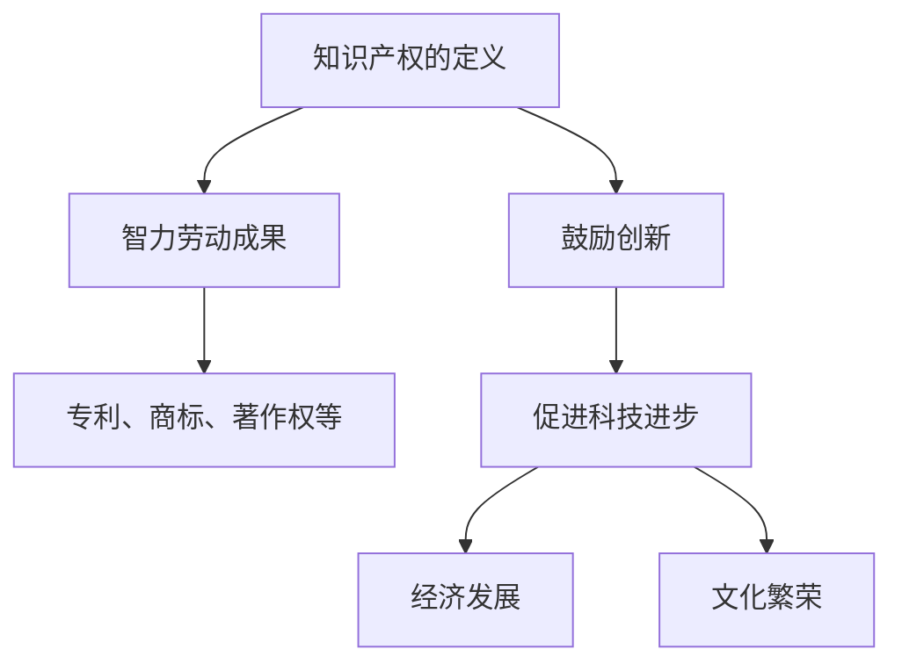

#### 1.2 知识产权的种类

知识产权的种类包括专利权、商标权、著作权、工业品外观设计、地理标志、商业秘密等。

**知识产权的种类**

- **专利权**：对发明、实用新型和外观设计享有的专有权。
- **商标权**：对商标享有的专有权。
- **著作权**：对文学、艺术和科学作品享有的专有权。
- **工业品外观设计**：对外观设计享有的专有权。
- **地理标志**：对特定地理区域的特定产品享有的专有权。
- **商业秘密**：对商业信息享有的专有权。

**流程图：知识产权的种类**

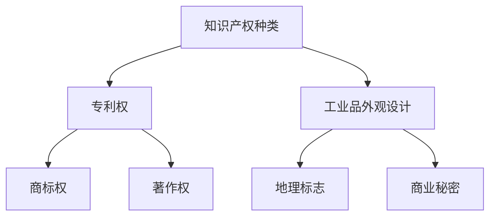

#### 1.3 知识产权的法律体系

知识产权的法律体系包括国际知识产权法律体系和主要国家的知识产权法律体系。

**国际知识产权法律体系**

- **《世界知识产权组织条约》**：是世界知识产权组织（WIPO）的基本条约，旨在促进知识产权的国际保护。
- **《伯尔尼公约》**：是保护文学和艺术作品的基本国际条约，规定了著作权的最低保护标准。
- **《巴黎公约》**：是保护工业产权的基本国际条约，规定了专利、商标等工业产权的保护原则。

**主要国家的知识产权法律体系**

- **美国**：有《专利法》、《商标法》、《著作权法》等，规定了知识产权的申请、保护和诉讼程序。
- **中国**：有《专利法》、《商标法》、《著作权法》等，规定了知识产权的申请、保护和诉讼程序。

**流程图：知识产权的法律体系**

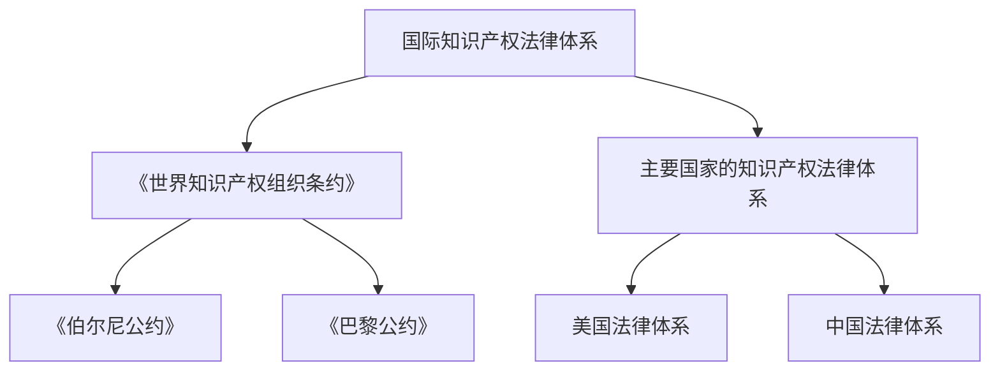

#### 1.4 知识产权的保护机制

知识产权的保护机制包括知识产权的申请流程、保护手段等。

**知识产权的申请流程**

- **申请**：申请人向知识产权局提交申请，包括专利申请、商标申请、著作权申请等。
- **审查**：知识产权局对申请进行审查，包括专利审查、商标审查、著作权审查等。
- **授权**：审查合格后，知识产权局颁发知识产权证书。

**保护手段**

- **法律诉讼**：当知识产权受到侵犯时，可以通过法律诉讼来维护权益。
- **行政保护**：当知识产权受到侵犯时，可以向行政机关提出投诉，寻求行政保护。
- **民间调解**：通过民间调解机构，协商解决知识产权纠纷。

**流程图：知识产权的保护机制**

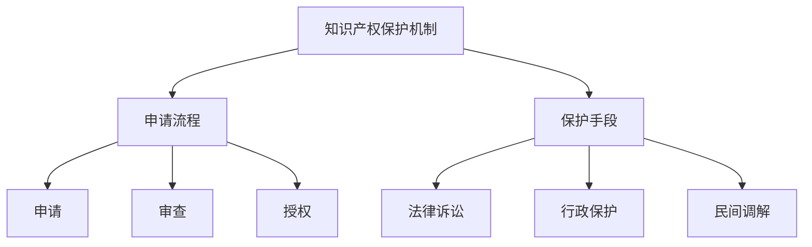

### 第2章：传统医学的定义与特点

#### 2.1 传统医学的概念

传统医学是指源于某个国家或地区，基于长期实践和历史传承形成的医学体系。传统医学具有独特的理论体系和治疗方法，对于某些疾病具有显著疗效。

**传统医学的概念**

- **历史与背景**：传统医学起源于古代，历经长期实践和不断演变，形成了各具特色的医学体系。
- **定义**：传统医学是指基于传统理论和实践，用于预防、诊断、治疗和康复的医学体系。

**流程图：传统医学的概念**

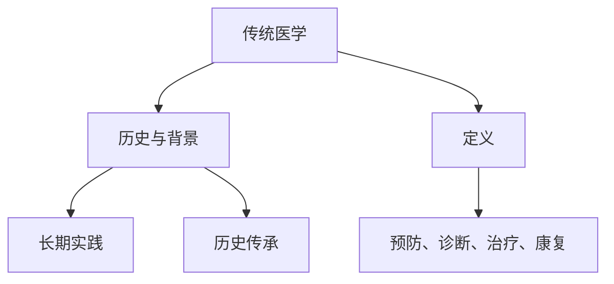

#### 2.2 传统医学的特点

传统医学具有整体观念、预防为主、非药物疗法等特点。

**传统医学的特点**

- **整体观念**：传统医学强调整体观念，认为人体是一个整体，注重调节身体内部的平衡。
- **预防为主**：传统医学强调预防为主，通过调整生活方式、饮食习惯等预防疾病的发生。
- **非药物疗法**：传统医学采用非药物疗法，如针灸、推拿、草药等，减少对药物的依赖。

**流程图：传统医学的特点**

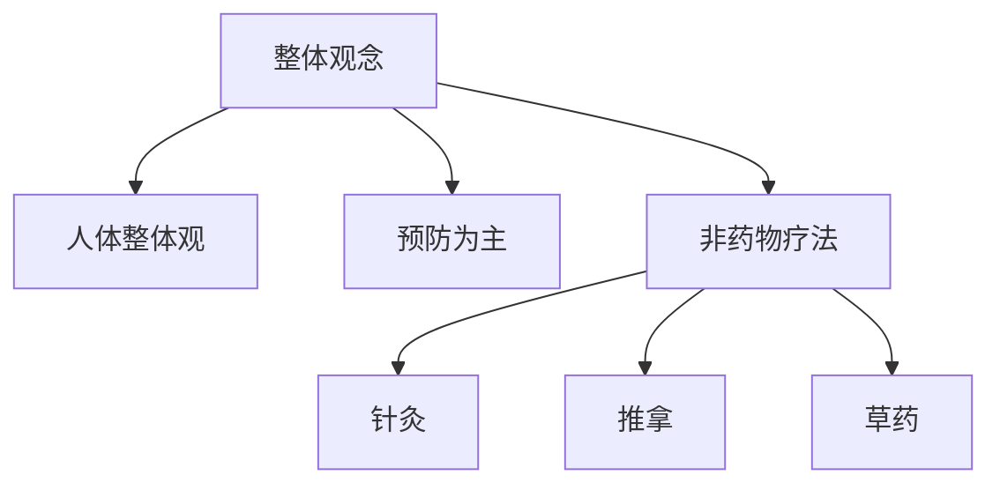

#### 2.3 传统医学的分类

传统医学的分类可以根据地区和医学体系进行划分。

**传统医学的分类**

- **中国传统医学**：包括中医、中药、针灸、推拿等。
- **其他国家传统医学**：如印度医学（阿育吠陀）、埃及医学、非洲医学等。

**流程图：传统医学的分类**

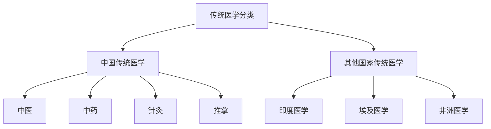

#### 2.4 传统医学的传承与发展

传统医学的传承与发展是保证医学体系延续和发展的关键。

**传统医学的传承**

- **师徒传承**：传统医学通过师徒传承，确保医学理论和实践经验的传递。
- **家族传承**：传统医学在某些家族中得以传承，保持医学体系的稳定性。

**传统医学的发展趋势**

- **与现代医学结合**：传统医学与现代医学的结合，形成了中西医结合等新型医学模式。
- **国际化发展**：传统医学逐渐走向国际，与其他国家的医学体系相互融合。

**流程图：传统医学的传承与发展**

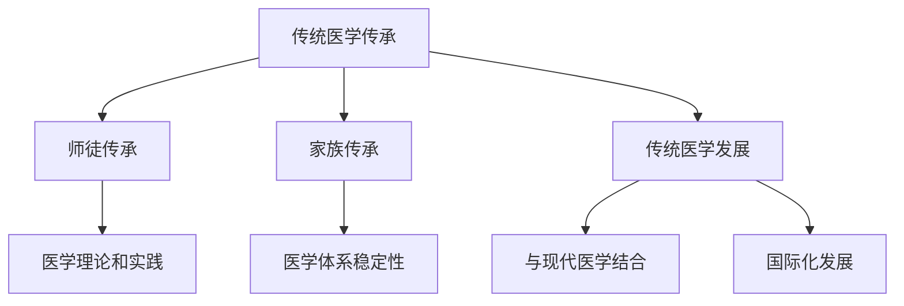

### 第3章：知识产权在传统医学中的应用

#### 3.1 知识产权在传统医学研究中的应用

知识产权在传统医学研究中发挥着重要作用，既保护了传统医学的创新成果，也促进了传统医学的发展。

**知识产权在传统医学研究的保护**

- **专利权**：通过专利权保护传统医学研究的创新成果，如新药研发、治疗方法等。
- **著作权**：通过著作权保护传统医学研究过程中的学术论文、研究报告等。

**知识产权在传统医学研究中的作用**

- **鼓励创新**：知识产权保护机制鼓励传统医学研究人员进行创新，提高研究质量和效率。
- **提升竞争力**：知识产权保护有助于提高传统医学研究的竞争力，推动医学领域的进步。

**流程图：知识产权在传统医学研究中的应用**

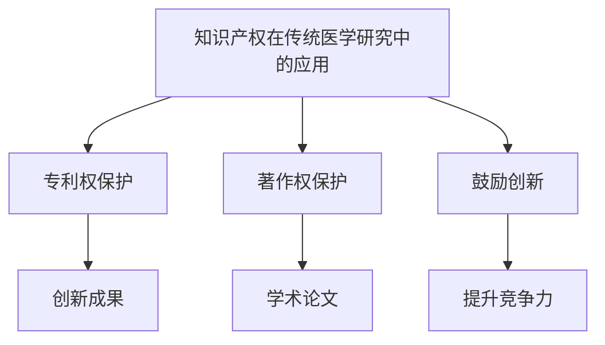

#### 3.2 知识产权在传统医学产品中的应用

知识产权在传统医学产品中的应用包括专利权、商标权等，用于保护产品的独特性和市场竞争力。

**知识产权在传统医学产品中的保护**

- **专利权**：通过专利权保护传统医学产品的独特性，如新药、医疗器械等。
- **商标权**：通过商标权保护传统医学产品的品牌，提高市场竞争力。

**知识产权在传统医学产品中的作用**

- **创新驱动**：知识产权保护机制推动传统医学产品的创新，提高产品质量和疗效。
- **品牌建设**：知识产权保护有助于传统医学产品的品牌建设，提高市场知名度。

**流程图：知识产权在传统医学产品中的应用**

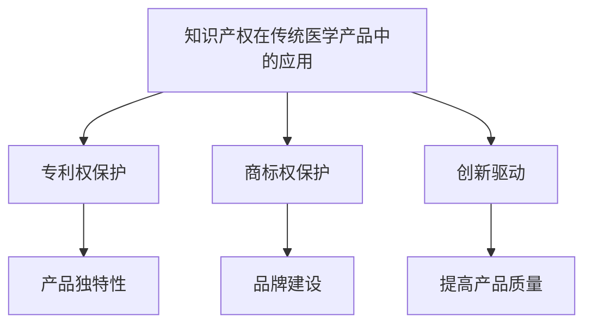

#### 3.3 知识产权在传统医学治疗中的应用

知识产权在传统医学治疗中的应用包括专利权、著作权等，用于保护治疗方法、疗效等。

**知识产权在传统医学治疗中的保护**

- **专利权**：通过专利权保护传统医学治疗方法，如针灸、推拿等。
- **著作权**：通过著作权保护传统医学治疗的学术论文、研究报告等。

**知识产权在传统医学治疗中的作用**

- **疗效保障**：知识产权保护有助于保障传统医学治疗的疗效，提高患者满意度。
- **推广应用**：知识产权保护机制有助于传统医学治疗的推广和应用，促进医学领域的进步。

**流程图：知识产权在传统医学治疗中的应用**

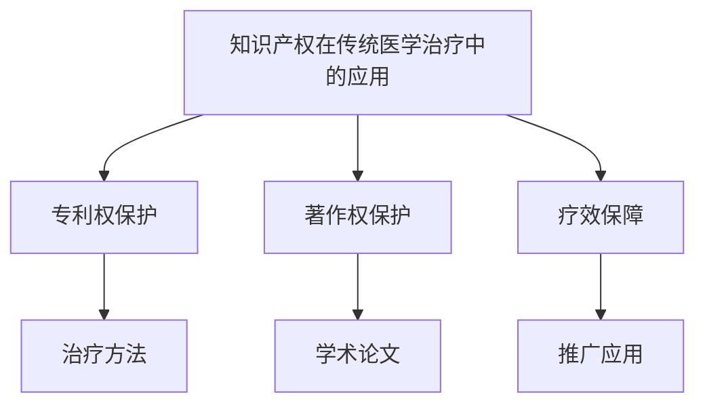

### 第4章：传统医学知识产权保护的挑战与对策

#### 4.1 技术创新的速度与知识产权保护机制的滞后

**挑战：技术创新的速度与知识产权保护机制的滞后**

- **问题**：随着科技的快速发展，传统医学领域的创新速度加快，而现有的知识产权保护机制可能无法及时应对。
- **影响**：知识产权保护滞后可能导致创新成果无法及时得到保护，影响创新积极性。

**对策：完善知识产权保护机制**

- **提升审查效率**：缩短知识产权审查周期，提高审查效率，确保创新成果及时得到保护。
- **创新保护模式**：探索新的知识产权保护模式，如临时保护机制、快速审查机制等，满足快速发展的需求。

**伪代码：提升知识产权审查效率**

```python
# 提升知识产权审查效率
def improve_review_efficiency():
    # 缩短审查周期
    review周期缩短()
    # 提高审查员专业水平
    提升审查员专业水平()
    # 建立快速审查机制
    创建快速审查机制()
    # 增加审查资源投入
    增加审查资源投入()

# 调用提升知识产权审查效率函数
improve_review_efficiency()
```

#### 4.2 传统医学知识的地域性和文化差异

**挑战：传统医学知识的地域性和文化差异**

- **问题**：传统医学具有强烈的地域性和文化特色，不同地区的传统医学知识可能存在差异，导致知识产权保护难度增加。
- **影响**：地域性和文化差异可能导致知识产权保护的法律和实践存在差异，影响知识产权的保护效果。

**对策：加强国际合作与交流**

- **建立国际标准**：推动建立国际知识产权保护标准，减少地域性和文化差异对知识产权保护的影响。
- **加强国际合作**：通过国际合作与交流，分享知识产权保护经验，提高全球知识产权保护水平。

**伪代码：加强国际合作与交流**

```python
# 加强国际合作与交流
def strengthen_international Cooperation():
    # 推动建立国际标准
    establish_international Standards()
    # 开展国际合作项目
    launch_international_Projects()
    # 举办国际研讨会
    hold_international_Seminars()
    # 促进知识共享
    promote_Knowledge_Sharing()

# 调用加强国际合作与交流函数
strengthen_international_Cooperation()
```

#### 4.3 传统医学知识产权的界定难题

**挑战：传统医学知识产权的界定难题**

- **问题**：传统医学知识往往具有开放性和传承性，其知识产权的界定可能存在困难。
- **影响**：知识产权界定困难可能导致知识产权保护力度不足，影响创新和经济发展。

**对策：完善知识产权界定标准**

- **制定明确界定标准**：制定明确的知识产权界定标准，减少界定难题。
- **加强知识产权保护培训**：提高从业者的知识产权保护意识，减少知识产权界定难题。

**伪代码：完善知识产权界定标准**

```python
# 完善知识产权界定标准
def improveIntellectualPropertyDefinition():
    # 制定明确界定标准
    createClearDefinitionStandards()
    # 加强保护培训
    enhanceProtectionTraining()

# 调用完善知识产权界定标准函数
improveIntellectualPropertyDefinition()
```

### 第5章：知识产权与传统医学的案例分析

#### 5.1 中国传统文化医学知识产权保护的案例分析

**案例：中国传统中药的知识产权保护**

- **案例背景**：中国传统中药具有悠久的历史和丰富的经验，但其知识产权保护面临挑战。
- **解决方案**：通过专利保护、商标保护等措施，加强中药知识产权保护。

**伪代码：中国传统中药的知识产权保护**

```python
# 中国传统中药知识产权保护
def protectChineseHerbalMedicine():
    # 申请专利保护
    applyForPatentProtection()
    # 注册商标
    registerTradeMark()

# 调用中国传统中药知识产权保护函数
protectChineseHerbalMedicine()
```

**案例：中医针灸的知识产权保护**

- **案例背景**：中医针灸作为传统医学的重要组成部分，其知识产权保护也受到重视。
- **解决方案**：通过专利保护、著作权保护等措施，加强针灸知识产权保护。

**伪代码：中医针灸的知识产权保护**

```python
# 中医针灸知识产权保护
def protectAcupuncture():
    # 申请专利保护
    applyForPatentProtection()
    # 注册著作权
    registerCopyright()

# 调用中医针灸知识产权保护函数
protectAcupuncture()
```

#### 5.2 国外传统医学知识产权保护的案例分析

**案例：印度阿育吠陀的知识产权保护**

- **案例背景**：印度阿育吠陀作为传统医学的重要组成部分，其知识产权保护受到关注。
- **解决方案**：通过专利保护、商标保护等措施，加强阿育吠陀知识产权保护。

**伪代码：印度阿育吠陀的知识产权保护**

```python
# 印度阿育吠陀知识产权保护
def protectAyurveda():
    # 申请专利保护
    applyForPatentProtection()
    # 注册商标
    registerTradeMark()

# 调用印度阿育吠陀知识产权保护函数
protectAyurveda()
```

**案例：埃及医学的知识产权保护**

- **案例背景**：埃及医学作为传统医学的重要组成部分，其知识产权保护也受到重视。
- **解决方案**：通过专利保护、著作权保护等措施，加强埃及医学知识产权保护。

**伪代码：埃及医学的知识产权保护**

```python
# 埃及医学知识产权保护
def protectEgyptianMedicine():
    # 申请专利保护
    applyForPatentProtection()
    # 注册著作权
    registerCopyright()

# 调用埃及医学知识产权保护函数
protectEgyptianMedicine()
```

### 第6章：知识产权与传统医学的未来展望

#### 6.1 知识产权与传统医学的未来发展

**未来发展趋势**

- **知识产权保护机制的完善**：随着科技的进步和社会的发展，知识产权保护机制将不断完善，提高保护力度和效率。
- **传统医学与现代科技的融合**：传统医学与现代科技相结合，将推动传统医学的创新和发展，提高医疗水平和治疗效果。
- **国际合作与交流的加强**：传统医学领域的国际合作与交流将进一步加强，促进全球医学体系的融合和发展。

**未来挑战**

- **知识产权保护的地域性差异**：不同国家和地区的知识产权保护机制存在差异，如何协调和统一是一个挑战。
- **传统医学知识的保护难题**：传统医学知识的保护难度较大，如何界定和保护知识产权是一个挑战。

**未来展望**

- **知识产权保护与传统医学发展的协同**：知识产权保护与传统医学发展相互促进，共同推动医学领域的进步。
- **国际化发展的新趋势**：传统医学的国际化发展将迎来新的机遇，促进全球医学的融合和创新。

### 附录

#### 附录A：知识产权与传统医学相关法律法规

- **中国知识产权法律法规**：包括《专利法》、《商标法》、《著作权法》等。
- **国外知识产权法律法规**：包括美国、欧盟等主要国家的知识产权法律法规。

#### 附录B：知识产权与传统医学相关资源

- **学术文献与报告**：包括学术论文、行业报告等。
- **政策法规与文件**：包括各国知识产权法律法规、国际知识产权条约等。
- **参考资料与推荐阅读**：包括相关书籍、网站等。

---

**作者：AI天才研究院/AI Genius Institute & 禅与计算机程序设计艺术 /Zen And The Art of Computer Programming**

---

经过详细的讲解和分析，本文系统地介绍了知识产权与传统医学的关系，包括知识产权的基本概念、体系、应用，以及传统医学的定义、特点、应用和保护对策等。通过案例分析，展示了知识产权在传统医学领域的实际应用，为传统医学的发展提供了有益的借鉴。展望未来，知识产权与传统医学的发展将面临新的机遇和挑战，需要加强国际合作与交流，完善知识产权保护机制，推动传统医学的创新和发展。希望本文能为相关领域的研究者和从业者提供有价值的参考和启示。

