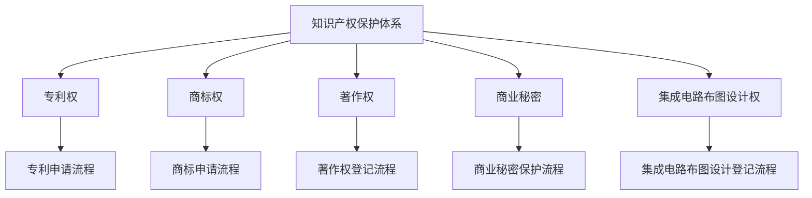

                 

### 第一部分: 知识产权保护概述

知识产权保护是现代社会中一项至关重要的制度，它涉及到人类智力成果的归属权和利益分配问题。在这个部分，我们将详细探讨知识产权的基础概念、法律框架以及保护机制，以便为后续内容的讨论奠定基础。

#### 第1章: 知识产权基础

##### 1.1 知识产权的概念与种类

知识产权是指人类智力劳动创造的成果所有权，依法受到保护。它主要包括以下几种类型：

- **专利权**：对发明创造享有的专有权利，包括发明专利、实用新型专利和外观设计专利。
- **商标权**：对商标享有的专有权利，用以区分不同企业的商品或服务。
- **著作权**：对文学、艺术和科学作品享有的专有权利，包括文字作品、音乐作品、美术作品等。
- **商业秘密**：不为公众所知悉、具有商业价值并经权利人采取保密措施的技术信息和经营信息。
- **集成电路布图设计权**：对集成电路布图设计享有的专有权利。

##### 1.2 知识产权的法律框架

知识产权的保护不仅在国内法律体系中具有重要地位，也在国际层面上具有广泛的影响力。以下是知识产权法律框架的几个关键组成部分：

- **国际知识产权法**：包括《伯尔尼公约》、《巴黎公约》和《世界知识产权组织（WIPO）公约》等，这些国际公约规定了知识产权的基本原则和保护范围，为各国制定国内知识产权法提供了参考。
- **各国知识产权法**：不同国家根据自身情况制定的知识产权法律，如《中华人民共和国专利法》、《中华人民共和国商标法》、《美国专利法》和《欧洲专利公约》等。这些法律明确了知识产权的保护范围、申请程序和保护措施。

##### 1.3 知识产权的保护机制

知识产权的保护机制主要包括以下方面：

- **知识产权的申请与登记**：权利人通过向国家知识产权局提交申请文件，申请获得专利、商标、著作权等权利的登记和保护。
- **知识产权的保护措施**：包括专利侵权诉讼、商标争议、著作权维权等。权利人可以通过法律手段维护自身权益，如提起侵权诉讼、申请禁令、要求赔偿等。

知识产权保护的基础是法律框架的健全和执行力的保障。只有在法律明确、执行有力的环境下，知识产权的创造、运用和保护才能得到有效的实现。

在接下来的一章中，我们将进一步探讨知识发现的概念及其在商业、科学和社会管理中的应用，为分析知识产权保护在知识发现中的重要性奠定基础。

### 第一部分: 知识产权保护概述

知识产权保护是现代商业和技术发展的基石，对于推动创新和经济增长具有重要意义。在这一部分，我们将首先探讨知识产权的基础概念与种类，接着详细阐述知识产权的法律框架，并最后分析知识产权的保护机制。这些内容将为后续章节关于知识产权保护在知识发现中重要性的深入讨论奠定坚实的理论基础。

#### 第1章: 知识产权基础

##### 1.1 知识产权的概念与种类

知识产权是一种法律概念，指人类智力劳动创造的成果所享有的专有权利。知识产权不仅涵盖了创新和技术，还涉及文化、艺术和商业领域。以下是几种主要的知识产权类型：

- **专利权**：专利权是针对发明创造授予的一种权利，包括发明专利、实用新型专利和外观设计专利。专利权允许发明人在一定期限内独占其发明，防止他人未经许可擅自实施。
  
  - **发明专利**：涉及技术方案的创新，如新型设备、方法或改进的工艺流程。
  - **实用新型专利**：针对改进的产品形状、构造或组合的创新，比发明专利要求较低。
  - **外观设计专利**：涉及产品的形状、图案、色彩或其组合的创新，以提高产品的美观度。

- **商标权**：商标权是指企业或个人对其商标享有的专有权利。商标用于区分不同企业的商品或服务，有助于消费者识别和信任特定的品牌。

- **著作权**：著作权是针对文学、艺术和科学作品所享有的权利，包括文字作品、音乐作品、美术作品、电影作品、戏剧作品等。著作权保护作品的复制、发行、表演、展示等行为。

- **商业秘密**：商业秘密是指不为公众所知悉、具有商业价值并经权利人采取保密措施的技术信息和经营信息。商业秘密的保护依赖于权利人的保密措施和法律规定，对于企业的竞争优势具有重要意义。

- **集成电路布图设计权**：集成电路布图设计权是指对集成电路布图设计享有的专有权利。布图设计是集成电路的核心部分，对其保护有助于促进集成电路的创新和发展。

##### 1.2 知识产权的法律框架

知识产权的保护不仅在国内法律体系中具有重要地位，也在国际层面上具有广泛的影响力。以下是知识产权法律框架的几个关键组成部分：

- **国际知识产权法**：国际知识产权法为全球范围内的知识产权保护提供了基本原则和指导框架。以下是一些主要的国际公约：

  - **《伯尔尼公约》**：是保护文学和艺术作品著作权的主要国际公约，规定了著作权的基本权利和保护期限。
  - **《巴黎公约》**：是保护工业产权的主要国际公约，规定了专利、商标、工业设计等的保护范围和申请程序。
  - **《世界知识产权组织（WIPO）公约》**：是建立世界知识产权组织的基本法律文件，旨在促进和保护知识产权的国际合作。

- **各国知识产权法**：各国根据自身情况制定的知识产权法律，构成了国内知识产权保护体系。以下是一些主要国家的知识产权法律：

  - **《中华人民共和国专利法》**：规定了专利权的授予条件、申请程序、保护期限等。
  - **《中华人民共和国商标法》**：规定了商标权的申请、注册、保护范围和商标争议的解决。
  - **《美国专利法》**：详细规定了专利申请的条件、审批程序和专利权的保护措施。
  - **《欧洲专利公约》**：是欧洲国家共同制定的专利法律，规定了专利的申请、审查和授权程序。

##### 1.3 知识产权的保护机制

知识产权的保护机制主要包括以下几个方面：

- **知识产权的申请与登记**：权利人通过向国家知识产权局或其他相关机构提交申请文件，申请获得专利、商标、著作权等权利的登记和保护。申请过程通常包括以下步骤：

  - **专利申请**：发明人需提交包括发明名称、技术描述、权利要求书等在内的专利申请书，并通过审查程序。
  - **商标申请**：企业或个人需提交商标设计图纸、商标名称和申请类别等，通过审查程序获得商标注册证。
  - **著作权登记**：作者需提交作品副本、作者身份证明等文件，向著作权管理机构申请登记。

- **知识产权的保护措施**：包括专利侵权诉讼、商标争议、著作权维权等。权利人可以通过法律手段维护自身权益，如提起侵权诉讼、申请禁令、要求赔偿等。以下是一些常见的保护措施：

  - **专利侵权诉讼**：专利权人发现侵权行为后，可以向法院提起诉讼，要求侵权人停止侵权行为并赔偿损失。
  - **商标争议**：商标注册人发现他人商标与其商标相似可能引起混淆，可以向商标评审委员会提起争议，要求撤销对方商标。
  - **著作权维权**：著作权人发现他人未经许可使用其作品，可以提起侵权诉讼，要求侵权人停止侵权并赔偿损失。

知识产权保护的基础是法律框架的健全和执行力的保障。只有在法律明确、执行有力的环境下，知识产权的创造、运用和保护才能得到有效的实现。

在下一章中，我们将进一步探讨知识发现的概念及其在商业、科学和社会管理中的应用，为分析知识产权保护在知识发现中的重要性奠定基础。

### 知识产权与知识发现

在现代社会，知识发现已成为各个领域的关键活动，通过数据挖掘和人工智能技术，从海量数据中提取出有价值的信息和知识。知识发现不仅促进了科学研究和技术创新，也为商业决策和社会管理提供了强有力的支持。知识产权保护在知识发现过程中扮演着至关重要的角色，它不仅保障了创新者的合法权益，还影响了知识发现的效率、成本和结果。

#### 2.1 知识发现的概念

知识发现（Knowledge Discovery in Databases，KDD）是指从大量数据中通过一系列复杂的过程提取出有价值知识的过程。知识发现通常包括以下几个阶段：

1. **数据收集**：收集相关数据，这些数据可能来自数据库、文件、传感器、网络等。
2. **数据预处理**：清洗、整理和归一化数据，以消除噪声和异常值，确保数据的质量。
3. **模式识别**：使用统计学、机器学习、数据挖掘等技术，从数据中识别出潜在的模式和关联。
4. **知识提取**：将识别出的模式转化为可理解的知识，如规则、趋势、异常点等。
5. **评估与应用**：评估提取出的知识的有效性和实用性，并在实际应用中进行验证。

##### 2.1.1 知识发现的基本原理

知识发现的基本原理包括以下几个关键步骤：

1. **数据理解**：通过数据可视化、探索性数据分析等方法，理解数据的结构和特征。
2. **数据预处理**：对数据进行清洗、缺失值处理、异常值检测和归一化等操作，以提高数据质量。
3. **特征选择**：从大量特征中选出对目标有显著影响的特征，以减少数据维度和计算复杂度。
4. **模式识别**：使用聚类、分类、关联规则挖掘等方法，从数据中提取出潜在的模式和关联。
5. **知识表示**：将提取出的模式转化为易于理解和应用的知识形式，如规则、图表、报告等。

##### 2.1.2 知识发现的方法

知识发现的方法多种多样，主要包括以下几种：

1. **统计分析**：使用统计学方法（如回归分析、方差分析、主成分分析等）从数据中提取知识和发现模式。
2. **机器学习**：利用机器学习算法（如决策树、支持向量机、神经网络等）对数据进行训练，从中提取模式和知识。
3. **数据挖掘**：使用专门的数据挖掘算法（如关联规则挖掘、聚类分析、异常检测等）从数据中提取知识。
4. **文本挖掘**：从非结构化的文本数据中提取有价值的信息和知识，如情感分析、关键词提取、主题模型等。
5. **知识融合**：将来自不同来源、不同格式的数据融合在一起，以提取出更加全面和深入的知识。

##### 2.1.3 知识发现的应用领域

知识发现技术广泛应用于各个领域，以下是一些典型的应用：

1. **商业智能**：通过分析销售数据、客户行为等，帮助企业做出更明智的决策。
2. **科学研究**：通过分析实验数据、观测数据等，发现新的科学规律和知识。
3. **社会管理**：如智能交通、智能医疗、公共安全等领域，通过数据分析和模式识别，提高管理效率和效果。

#### 2.2 知识产权保护在知识发现中的重要性

知识产权保护在知识发现中发挥着至关重要的作用，它不仅保障了创新者的合法权益，还影响着知识发现的效率、成本和结果。以下是知识产权保护在知识发现中的几个关键方面：

##### 2.2.1 知识产权保护的作用

1. **激励创新**：知识产权保护为创新者提供了经济上的回报和合法的保护，从而激励更多的创新行为。在知识发现过程中，知识产权保护有助于鼓励科学家、工程师和企业投入更多的资源进行研究和开发。

2. **保障合法权益**：知识产权保护确保了创新者的知识产权不受侵犯，防止他人未经授权擅自使用其创新成果，从而保障了创新者的合法权益。

3. **促进知识传播**：知识产权保护鼓励知识分享和传播，因为创新者可以在保证自身权益的前提下，与他人分享其创新成果，促进知识的传播和应用。

##### 2.2.2 知识产权保护的影响

1. **知识发现的效率**：知识产权保护对知识发现的效率有直接影响。在知识产权得到有效保护的环境下，创新者可以更加放心地进行研究和开发，减少了由于知识产权风险带来的不确定性和顾虑。这有助于提高知识发现的效率和质量。

2. **知识发现的成本**：知识产权保护的成本也是知识发现中需要考虑的重要因素。创新者在进行知识发现时，需要投入大量的时间和资源进行专利申请、商标注册、著作权登记等知识产权保护措施。然而，这些投入在一定程度上也会促进创新者更加谨慎地评估其创新成果的价值和潜在风险。

3. **知识发现的结果**：知识产权保护对知识发现的结果也有重要影响。有效的知识产权保护可以确保创新者的成果得到公平的市场回报，从而吸引更多的资金和资源投入创新。这将有助于提高知识发现的质量和成果的应用价值。

##### 2.2.3 知识产权保护对知识发现的挑战

1. **数据的保密性**：在知识发现过程中，数据的安全性和保密性是至关重要的。知识产权保护需要确保创新过程中使用的数据不受泄露和滥用。这要求创新者在数据收集、存储和使用过程中采取严格的保密措施，如加密、访问控制等。

2. **算法的创新性**：算法创新是知识发现的重要组成部分。知识产权保护需要确保算法的创新性得到有效保护，防止他人通过模仿或抄袭窃取创新者的成果。这要求创新者在算法设计和开发过程中注重创新，同时采取有效的知识产权保护措施。

3. **知识产权侵权**：在知识发现过程中，知识产权侵权是一个常见但严重的挑战。创新者需要密切关注市场上的知识产权动态，及时采取法律手段应对潜在的侵权行为。此外，知识产权管理机构也需要加强对侵权行为的监管和打击力度。

总之，知识产权保护在知识发现中具有不可替代的重要作用。它不仅激励了创新，保障了创新者的合法权益，还影响了知识发现的效率、成本和结果。在知识发现过程中，创新者、企业和政府都需要共同努力，完善知识产权保护体系，为知识发现提供有力的支持和保障。

### 第二部分: 知识产权保护在知识发现中的具体应用

在知识发现过程中，知识产权保护不仅是激励创新的重要手段，也是确保数据安全、保护算法创新和应对侵权问题的关键因素。以下是知识产权保护在知识发现中的具体应用，包括专利保护、商标保护以及商业秘密保护。

#### 第3章: 专利保护在知识发现中的应用

专利保护在知识发现中起着核心作用，它能够保护创新成果，防止他人未经授权使用或复制这些成果。以下将探讨专利保护的基本原理以及其在知识发现中的具体应用。

##### 3.1 专利保护的基本原理

专利保护的基本原理是通过授予专利权来保护创新者的权益。专利权授予创新者在一定期限内对发明创造享有独占实施权，包括制造、使用、销售和进口等行为。以下是专利保护的基本步骤和原则：

1. **发明创造的定义**：专利保护的对象是具有新颖性、创造性和实用性的发明创造。新颖性要求发明未在现有技术中披露过，创造性要求发明相对于现有技术具有显著的改进，实用性要求发明能在工业上应用。

2. **专利申请的基本流程**：专利申请人需要提交包括发明名称、技术描述、权利要求书等在内的专利申请书，并经过初步审查、实质审查和公告程序。在专利申请过程中，申请人需要确保其发明满足专利法的要求，并通过相应的审查程序。

3. **专利保护的优势与挑战**：专利保护的优势包括保护创新成果、防止他人侵权和提升企业竞争力等。然而，专利申请成本高、专利侵权诉讼复杂以及专利垄断等问题也是专利保护面临的挑战。

##### 3.2 专利保护在知识发现中的具体应用

专利保护在知识发现中的应用主要体现在以下几个方面：

1. **专利数据分析**：通过分析专利数据，可以挖掘出技术发展趋势、竞争对手的技术布局以及潜在的创新机会。专利数据分析有助于企业制定研发战略，优化技术路线图。

2. **专利地图**：专利地图是一种可视化工具，用于展示技术领域中的专利分布和竞争态势。通过专利地图，企业可以了解不同技术领域的专利数量、专利权人分布以及主要专利权人的技术实力。

3. **AI技术在专利申请中的应用**：人工智能技术在专利申请中发挥着越来越重要的作用。例如，通过自然语言处理技术，可以自动提取专利申请中的关键信息，如发明名称、技术描述和权利要求等。此外，机器学习算法可以用于专利分类、预测审查结果和评估专利价值。

以下是一个具体的专利分析案例：

**案例**：一家初创公司通过分析某项技术的专利数据，发现该技术领域存在多个专利空白点。公司决定针对这些空白点进行研发，并申请了多项相关专利。经过几年的研发，公司成功地推出了具有自主知识产权的新产品，并在市场上取得了显著的成功。

**专利分析步骤**：

1. **确定分析目标**：确定分析的具体技术领域和目标，如某项新兴技术的专利布局。

2. **收集专利数据**：从专利数据库中收集相关专利数据，包括专利申请号、专利名称、专利权人、技术描述等。

3. **数据预处理**：对专利数据进行清洗、去重和分类，确保数据的准确性和一致性。

4. **技术领域分类**：使用自然语言处理技术对专利文本进行分词和词性标注，提取出关键技术术语，并进行技术领域分类。

5. **趋势分析**：分析专利数量随时间的变化趋势，识别出技术领域的热点和专利密集区域。

6. **竞争态势分析**：分析主要专利权人的专利数量、技术分布和竞争对手的技术优势。

7. **专利空白点识别**：通过对比现有专利和技术需求，识别出尚未被充分保护的专利空白点。

8. **研发与专利布局**：基于专利分析结果，制定研发计划，并申请相关专利，形成具有竞争优势的专利布局。

通过上述步骤，公司不仅能够更好地了解技术领域的发展态势，还能针对专利空白点进行有针对性的研发，从而提高创新效率和市场竞争力。

#### 第4章: 商标保护在知识发现中的应用

商标保护是知识发现中的重要一环，它有助于企业建立品牌形象，维护市场竞争力。以下将探讨商标保护的基本原理以及其在知识发现中的具体应用。

##### 4.1 商标保护的基本原理

商标保护的基本原理是通过授予商标权来保护企业的品牌形象和商业利益。商标权赋予商标权人对其商标的独占使用权，防止他人未经许可擅自使用相同或相似的商标。以下是商标保护的基本步骤和原则：

1. **商标的定义**：商标是用于区分不同企业或个人商品或服务的一种标志，可以是文字、图形、字母、数字、三维标志、颜色组合等。

2. **商标申请的基本流程**：商标申请人需要提交包括商标设计图纸、商标名称和申请类别等在内的商标申请书，并经过审查程序。商标申请需要满足以下条件：

  - **显著性**：商标应具有显著特征，能够区分不同的商品或服务。
  - **新颖性**：商标应不同于现有的商标，不能与他人的商标构成混淆。

3. **商标保护的优势与挑战**：商标保护的优势包括保护品牌形象、提升企业竞争力以及防止他人侵权等。然而，商标申请成本高、商标侵权纠纷复杂以及商标淡化等问题也是商标保护面临的挑战。

##### 4.2 商标保护在知识发现中的具体应用

商标保护在知识发现中的具体应用主要体现在以下几个方面：

1. **知识品牌建设**：商标是企业的品牌标识，有助于建立企业的市场声誉和品牌形象。在知识发现过程中，企业可以通过商标保护来维护其知识成果的品牌形象，提高市场竞争力。

2. **知识服务的结合**：商标可以与知识服务相结合，如知识库、咨询服务等。通过商标注册，企业可以独占地提供相关的知识服务，防止他人未经授权使用其商标，从而保护其知识服务的市场地位。

3. **市场竞争策略**：商标保护有助于企业在市场竞争中占据优势地位。通过有效的商标保护策略，企业可以防止竞争对手模仿或复制其知识成果，从而维护其市场竞争力。

以下是一个具体的商标保护案例：

**案例**：一家科技公司通过商标保护其开发的一款创新软件，确保竞争对手无法使用相同或相似的商标，从而维护其在市场上的独特性和竞争优势。公司不仅在中国申请了商标，还进行了国际商标注册，以确保其商标在全球范围内的有效保护。

**商标保护步骤**：

1. **商标命名策略**：选择具有显著性、易于记忆和区分性的商标名称，以增强商标的识别度。

2. **商标设计**：设计独特、美观的商标图形，以增加商标的视觉吸引力。

3. **商标查询**：在申请商标前，进行商标查询，确保所选商标未被他人注册或使用。

4. **商标申请**：提交商标申请书，并支付相应的申请费用。

5. **商标审查**：商标局对商标申请进行审查，包括形式审查和实质审查。如果商标符合相关法律规定，将予以注册。

6. **商标续展**：商标注册有效期为10年，企业需要在商标到期前进行续展，以保持商标的有效性。

7. **商标维权**：如果发现他人侵权，企业可以采取法律手段进行维权，如提起侵权诉讼、申请禁令等。

通过上述步骤，企业可以有效地保护其商标，维护其知识成果的品牌形象和市场竞争力。

总之，商标保护在知识发现中具有重要的应用价值。它不仅有助于企业建立品牌形象，维护市场竞争地位，还能促进知识服务的创新和发展。企业应高度重视商标保护，采取有效的策略和措施，确保其知识成果得到充分保护。

### 第三部分: 知识产权保护的策略与方法

知识产权保护是现代企业和科研机构必须重视的重要课题，其有效实施不仅关乎企业的核心竞争力和创新能力，也影响到整个社会的知识进步和技术发展。在本节中，我们将探讨知识产权风险管理、规避策略以及风险控制策略，以帮助企业和科研机构在知识产权保护方面采取更为科学和有效的措施。

#### 第5章: 知识产权风险管理

##### 5.1 知识产权风险识别

知识产权风险识别是知识产权风险管理的基础，旨在发现和识别可能对企业和科研机构造成负面影响的知识产权风险。以下是知识产权风险识别的关键步骤和分类：

1. **专利风险识别**：专利风险主要涉及专利侵权、专利失效和专利纠纷等方面。企业在研发过程中，需要识别自身专利可能面临的侵权风险，同时关注竞争对手的专利布局，以避免潜在的侵权纠纷。

2. **商标风险识别**：商标风险主要包括商标侵权、商标淡化、商标争议等方面。企业需要对市场上的商标使用情况保持敏感，及时发现潜在的商标侵权行为和商标淡化风险。

3. **著作权风险识别**：著作权风险主要涉及作品的侵权使用、盗版和未经授权的传播等方面。科研机构和企业在创作和发表研究成果时，需要确保其作品的知识产权得到有效保护，避免他人未经授权使用或传播其作品。

4. **商业秘密风险识别**：商业秘密风险包括泄露、窃取、不当使用等。企业在保护商业秘密时，需要识别可能造成商业秘密泄露的内部和外部风险，如员工离职、合作方违约等。

##### 5.2 知识产权风险评估

风险评估是知识产权风险管理的核心环节，旨在评估知识产权风险的严重程度和可能产生的后果。以下是知识产权风险评估的方法和步骤：

1. **定性风险评估**：通过专家访谈、头脑风暴等方法，对知识产权风险进行定性分析，识别风险的性质和影响程度。

2. **定量风险评估**：使用数学模型和量化工具，对知识产权风险的概率和损失进行定量分析，计算风险值和风险暴露度。

3. **风险评估矩阵**：使用风险评估矩阵，将知识产权风险的性质、影响程度和可能性进行综合评估，确定风险的优先级和应对策略。

##### 5.3 知识产权风险应对策略

知识产权风险应对策略旨在降低和缓解知识产权风险，保障企业和科研机构的合法权益。以下是几种常见的风险应对策略：

1. **风险规避策略**：通过技术手段和市场策略，避免与高风险的专利和商标发生冲突。例如，企业可以采用技术规避策略，对竞争对手的专利进行替代性设计，或通过市场策略调整产品线，避免侵权风险。

2. **风险控制策略**：通过法律手段和管理措施，控制和管理知识产权风险。例如，企业可以采取合同管理措施，明确各方在知识产权方面的责任和义务，通过专利诉讼和侵权诉讼，维护自身权益。

3. **风险转移策略**：通过购买保险或签订许可协议，将知识产权风险转移给第三方。例如，企业可以通过购买专利侵权保险，将潜在的专利侵权风险转移给保险公司。

#### 第6章: 知识产权保护的实际案例与法律分析

##### 6.1 典型案例介绍

在本节中，我们将介绍几个典型的知识产权保护案例，包括专利保护案例和商标保护案例，并对这些案例的法律分析进行详细探讨。

1. **华为诉三星专利侵权案**：

   华为公司是全球领先的通信技术企业，其专利储备丰富，涉及通信技术、移动设备、云计算等多个领域。在与三星的专利侵权诉讼中，华为指控三星侵犯了其多项专利，涉及无线通信技术和移动设备操作系统等方面。经过多轮诉讼和调解，法院最终认定三星的部分产品确实侵犯了华为的专利，并判决三星停止侵权行为并赔偿损失。

   **法律分析**：

   - **专利侵权判定标准**：根据中国《专利法》的规定，专利侵权行为需要满足专利权利要求书中的技术特征，即侵权产品与专利权利要求书中的技术特征相同或等同。
   - **侵权证据**：华为提供了详细的专利文件、技术文档和市场调查报告等证据，证明其专利的有效性和三星的侵权行为。三星则对其产品进行了技术解释，并提供了相应的抗辩证据。
   - **判决结果**：法院通过技术鉴定和证据审查，认定三星的部分产品确实侵犯了华为的专利，并判决三星停止侵权行为并赔偿损失。

2. **可口可乐与百事可乐商标纠纷案**：

   可口可乐和百事可乐是两大碳酸饮料巨头，它们之间的商标纠纷长达数十年。可口可乐公司认为百事可乐在广告和营销中使用了与其商标相似的标识，可能引起消费者混淆。经过多轮诉讼，法院最终裁定百事可乐需要修改其广告和营销材料，以避免与可口可乐的商标发生混淆。

   **法律分析**：

   - **商标侵权判定标准**：根据中国《商标法》的规定，商标侵权行为需要满足以下条件：商标与他人商标相似，可能引起消费者混淆，损害他人商标的声誉。
   - **商标使用证据**：可口可乐提供了其商标的使用证据，包括广告、包装、宣传材料等，证明百事可乐的商标使用可能引起消费者混淆。百事可乐则提供了其商标使用的合法性和合理性证据。
   - **判决结果**：法院通过商标对比和消费者调查，认定百事可乐的商标使用可能引起消费者混淆，并判决百事可乐需要修改其广告和营销材料。

##### 6.2 法律分析

在本节中，我们将对知识产权保护的几个关键法律问题进行详细分析，包括专利侵权判定标准和商标侵权判定标准。

1. **专利侵权判定标准**：

   - **专利权利要求书**：专利权利要求书是判断专利侵权的关键依据，侵权产品需要满足专利权利要求书中的技术特征。
   - **侵权判定方法**：常见的侵权判定方法包括字面侵权判定和等同侵权判定。字面侵权判定是指侵权产品与专利权利要求书中的技术特征完全相同，而等同侵权判定是指侵权产品在功能、效果上与专利技术相同或实质等效。

2. **商标侵权判定标准**：

   - **商标相似性**：商标侵权判定首先需要判断商标是否相似，相似性的判断依据包括商标的文字、图形、颜色、声音等元素。
   - **消费者混淆可能性**：商标侵权判定还需要考虑消费者是否可能因为商标相似而混淆，导致误认或误购。
   - **商标淡化**：商标淡化是指商标的显著性和识别性受到削弱，可能导致商标的声誉受损。商标淡化也是商标侵权判定的重要方面。

通过上述分析，我们可以看出知识产权保护在知识发现中的重要性。有效的知识产权保护不仅能够保障创新者的合法权益，还能够促进知识发现和技术创新，为社会的进步和发展提供动力。

### 第四部分: 国际视野与未来趋势

在全球化日益深入的背景下，知识产权保护的国际视角和未来趋势显得尤为重要。以下将探讨国际知识产权法律体系、国际知识产权保护趋势以及知识产权数字化等关键话题，为企业和科研机构提供全球范围内的知识产权保护策略和方法。

#### 第7章: 国际知识产权法律体系

国际知识产权法律体系是各国知识产权法在国际层面上的协调与统一。以下将介绍国际知识产权组织的角色、区域性知识产权法律体系的现状以及全球知识产权法律的发展趋势。

##### 7.1 国际知识产权组织

国际知识产权组织（World Intellectual Property Organization，WIPO）是联合国下属的专门机构，致力于促进和保护知识产权。WIPO的主要职能包括：

1. **知识产权法律协调**：WIPO负责制定和推广国际知识产权法律规范，促进各国知识产权法的协调与统一。通过签订国际公约和协议，WIPO为全球知识产权保护提供了法律框架。

2. **知识产权服务**：WIPO提供一系列知识产权服务，包括专利信息检索、商标注册、知识产权培训等，帮助企业更好地管理和保护其知识产权。

3. **国际仲裁和调解**：WIPO设立了国际仲裁和调解中心，为跨国知识产权纠纷提供解决机制。通过国际仲裁和调解，WIPO帮助企业和个人解决知识产权争议，提高知识产权保护的效果。

##### 7.2 区域性知识产权组织

除了WIPO，全球还存在着多个区域性知识产权组织，这些组织在协调成员国间的知识产权法律和政策方面发挥着重要作用。以下是一些主要的区域性知识产权组织：

1. **欧洲知识产权组织（EUIPO）**：EUIPO负责管理欧洲专利和商标的注册和仲裁。它通过《欧洲专利公约》和《欧洲商标条例》，为欧洲国家提供了一个统一的知识产权保护体系。

2. **美洲知识产权组织（OAPI）**：OAPI是非洲和加勒比海地区的一个知识产权组织，负责协调成员国的知识产权法律和政策。

3. **亚洲知识产权组织（AIPA）**：AIPA是亚洲和太平洋地区的一个知识产权组织，致力于促进成员国间的知识产权合作和保护。

##### 7.3 全球知识产权法律的发展趋势

随着全球经济的不断发展和技术创新的加速，全球知识产权法律体系也在不断演变。以下是一些主要的发展趋势：

1. **知识产权国际化**：随着国际贸易和投资的增加，知识产权的国际化保护变得越来越重要。各国通过签订双边或多边知识产权协议，加强跨国知识产权保护，推动全球知识产权法律体系的协调。

2. **知识产权数字化**：数字化技术的发展为知识产权保护带来了新的挑战和机遇。数字时代，知识产权的数字化管理和保护成为重要议题。各国政府和国际组织正积极探讨如何在数字环境中有效保护知识产权。

3. **知识产权保护力度加强**：为应对日益严重的知识产权侵权行为，各国和国际组织正在加强知识产权保护力度。例如，通过立法修订、执法力度加大、跨国合作等手段，提高知识产权保护的效果。

#### 第8章: 国际知识产权保护趋势

在国际层面上，知识产权保护呈现出一系列显著的趋势，这些趋势不仅影响着全球知识产权政策的制定，也对企业和科研机构的知识产权战略产生了深远影响。以下将探讨国际知识产权保护的主要趋势。

##### 8.1 知识产权全球化

知识产权全球化是指在全球范围内加强知识产权保护，推动国际知识产权法律体系的协调与统一。以下是知识产权全球化的几个关键方面：

1. **国际公约和协议**：通过签订国际公约和协议，各国在知识产权保护方面达成一致，推动全球知识产权法律体系的协调。例如，《世界知识产权组织（WIPO）公约》、《伯尔尼公约》和《巴黎公约》等国际公约在知识产权保护方面发挥了重要作用。

2. **跨国知识产权纠纷解决**：全球化的贸易和投资带来了大量的跨国知识产权纠纷。国际知识产权组织（如WIPO）和区域性知识产权组织（如EUIPO、OAPI、AIPA）提供了国际仲裁和调解机制，帮助企业和个人解决跨国知识产权纠纷。

3. **知识产权跨境保护**：知识产权全球化还涉及到知识产权的跨境保护。企业和科研机构需要关注不同国家和地区的知识产权法律差异，采取合适的策略和保护措施，以确保其知识产权在全球范围内的有效保护。

##### 8.2 知识产权数字化

数字技术的发展为知识产权保护带来了新的挑战和机遇。知识产权数字化主要体现在以下几个方面：

1. **数字版权管理**：随着数字内容的迅猛增长，数字版权管理（Digital Rights Management，DRM）技术成为保护数字版权的重要手段。DRM技术通过加密、认证和权限管理等方式，确保数字内容的合法使用和防止未经授权的复制和传播。

2. **区块链技术**：区块链技术具有去中心化、不可篡改和透明等特点，为知识产权的登记、验证和保护提供了新的解决方案。通过区块链技术，知识产权的登记和交易可以实现透明化和可追溯性，提高知识产权保护的效果。

3. **知识产权数字化管理**：知识产权数字化管理是指将知识产权的申请、登记、管理和保护过程数字化，以提高效率和减少成本。例如，通过在线平台提交专利申请、电子商标注册和电子证书等，都可以提高知识产权管理的效率。

##### 8.3 知识产权保护力度的加强

为应对日益严重的知识产权侵权行为，全球各国和国际组织正在加强知识产权保护力度。以下是一些主要措施：

1. **立法修订**：各国通过修订知识产权法律，加强知识产权的保护范围和保护力度。例如，增加知识产权侵权赔偿额度、完善知识产权侵权判定标准等。

2. **执法力度加大**：各国政府和国际组织加强知识产权执法力度，打击知识产权侵权行为。通过加强执法机构的权力和资源投入，提高知识产权侵权行为的发现和打击效率。

3. **跨国合作**：国际组织和各国政府通过加强跨国合作，共同打击知识产权侵权行为。例如，通过签订跨国合作协议、开展联合行动等，提高全球范围内的知识产权保护水平。

#### 第9章: 知识产权保护的策略与方法

在全球化背景下，企业和科研机构需要采取有效的知识产权保护策略和方法，以确保其知识产权在全球范围内的有效保护。以下将介绍几种常见的知识产权保护策略和方法。

##### 9.1 知识产权布局策略

知识产权布局策略是指企业或科研机构在全球范围内制定知识产权保护和运用的战略。以下是一些常见的知识产权布局策略：

1. **全球专利布局**：企业可以通过申请国际专利，在多个国家和地区获得专利保护，以防止竞争对手在关键市场进行侵权行为。全球专利布局有助于企业建立国际市场的竞争优势。

2. **商标国际注册**：企业可以通过国际商标注册，在多个国家和地区获得商标保护，确保其品牌在全球范围内的独特性和知名度。

3. **知识产权联盟**：企业可以通过与竞争对手或合作伙伴建立知识产权联盟，共同保护和运用知识产权。通过联盟合作，企业可以共享知识产权资源，降低知识产权侵权风险。

##### 9.2 知识产权保护方法

知识产权保护方法是指企业或科研机构采取的具体措施，以确保其知识产权得到有效保护。以下是一些常见的知识产权保护方法：

1. **专利申请策略**：企业可以通过改进现有技术或开发新技术，申请专利以保护其创新成果。专利申请策略应包括选择合适的专利申请国家、制定专利申请策略和策略等。

2. **商标监控**：企业需要定期监控市场上的商标使用情况，及时发现潜在的商标侵权行为。通过商标监控，企业可以采取法律手段维护其商标权益。

3. **知识产权培训**：企业应加强对员工的知识产权培训，提高员工对知识产权的认识和保护意识。通过知识产权培训，企业可以降低知识产权侵权风险。

4. **知识产权管理平台**：企业可以通过建立知识产权管理平台，实现知识产权的申请、登记、管理和保护过程的数字化和自动化。通过知识产权管理平台，企业可以高效地管理和保护其知识产权。

总之，国际视野与未来趋势对于知识产权保护具有重要意义。企业和科研机构需要关注全球知识产权法律体系的动态，采取有效的知识产权保护策略和方法，以确保其知识产权在全球范围内的有效保护。

### 附录

#### 附录 A: 知识产权保护相关资源与工具

知识产权保护涉及多个方面，企业和科研机构需要利用多种资源与工具来有效管理和保护其知识产权。以下列出了一些常用的知识产权保护相关资源与工具。

1. **专利数据库**

   - **Google Patents**：提供全球范围内的专利信息，包括专利全文、专利申请人、专利家族等。
   - **美国专利和商标局（USPTO）**：提供美国专利和商标信息，包括专利全文、专利申请书等。
   - **中国知识产权局**：提供中国专利和商标信息，包括专利全文、专利申请书等。

2. **商标数据库**

   - **中国商标网**：提供中国商标注册信息，包括商标申请状态、商标权利信息等。
   - **世界知识产权组织（WIPO）商标数据库**：提供全球商标注册信息，包括商标申请状态、商标权利信息等。

3. **知识产权法律文献**

   - **国际知识产权组织（WIPO）**：提供国际知识产权法律文献，包括国际公约、条约、协定等。
   - **各国知识产权局**：提供各国知识产权法律文献，包括专利法、商标法、著作权法等。

4. **知识产权管理工具**

   - **知识产权管理系统**：如PatentStorm、IPfolio等，用于知识产权的申请、管理、分析和保护。
   - **知识产权监测工具**：如IPRlytics、Spyglass等，用于监测市场上的知识产权动态和潜在侵权行为。

5. **知识产权咨询机构**

   - **国际知名律师事务所**：如高伟绅（Linklaters）、贝克·麦坚时（Baker & McKenzie）等，提供专业的知识产权法律服务。
   - **知识产权代理机构**：如专利代理人、商标代理人等，协助企业申请、管理和保护知识产权。

6. **知识产权培训资源**

   - **在线课程和讲座**：如Coursera、edX等平台提供的知识产权相关课程和讲座。
   - **专业书籍和资料**：如《知识产权法》、《专利申请与实务》等，提供知识产权的全面介绍和实践指导。

#### 附录 B: 知识产权保护相关术语解释

1. **知识产权**：指人类智力劳动创造的成果所有权，依法受到保护。主要包括专利权、商标权、著作权、商业秘密等。

2. **专利权**：指对发明创造享有的专有权利，包括发明专利、实用新型专利和外观设计专利。

3. **商标权**：指对商标享有的专有权利，用以区分不同企业的商品或服务。

4. **著作权**：指对文学、艺术和科学作品享有的专有权利，包括文字作品、音乐作品、美术作品等。

5. **商业秘密**：指不为公众所知悉、具有商业价值并经权利人采取保密措施的技术信息和经营信息。

6. **知识产权保护**：指通过法律手段和其他措施，保护知识产权持有人的合法权益，防止侵权行为的发生。

7. **知识产权侵权**：指未经知识产权权利人许可，擅自实施其知识产权的行为，如专利侵权、商标侵权、著作权侵权等。

8. **知识产权风险评估**：指对知识产权可能面临的风险进行识别、评估和分析，以制定相应的风险管理策略。

9. **知识产权布局**：指企业或科研机构在全球范围内制定知识产权保护和运用的战略，包括专利布局、商标布局等。

10. **知识产权数字化**：指将知识产权的申请、登记、管理和保护过程数字化，以提高效率和减少成本。

#### 附录 C: Mermaid 流程图



通过上述附录，企业和科研机构可以更好地了解和利用知识产权保护的相关资源与工具，提升其知识产权保护水平，为创新和发展提供有力支持。

### 核心算法原理讲解

在知识产权保护过程中，核心算法的应用对于数据的挖掘与分析至关重要。以下将详细介绍专利分析中的文本挖掘算法，并使用伪代码对其流程进行详细阐述。

#### 专利分析中的文本挖掘算法

文本挖掘算法是从专利文本中提取关键信息，如技术领域、发明名称和权利要求等。以下是文本挖掘算法的伪代码实现：

```python
def text_mining(patent_text):
    """
    文本挖掘算法用于从专利文本中提取关键信息。
    
    :param patent_text: 专利文本字符串
    :return: 提取的关键信息（技术领域、发明名称、权利要求）
    """
    
    # 步骤1：文本预处理
    cleaned_text = preprocess_text(patent_text)
    
    # 步骤2：分词与词性标注
    tokens = tokenize(cleaned_text)
    tagged_tokens = pos_tag(tokens)
    
    # 步骤3：提取名词性短语
    noun_phrases = extract_noun_phrases(tagged_tokens)
    
    # 步骤4：技术领域识别
    tech_area = identify_tech_area(noun_phrases)
    
    # 步骤5：发明名称提取
    invention_name = extract_invention_name(noun_phrases)
    
    # 步骤6：权利要求提取
    claims = extract_claims(noun_phrases)
    
    # 返回结果
    return tech_area, invention_name, claims

def preprocess_text(text):
    """
    文本预处理函数，包括去除停用词、标点符号、大写转换等。
    
    :param text: 原始文本
    :return: 预处理后的文本
    """
    
    # 去除停用词和标点符号
    stop_words = set(stopwords.words('english'))
    cleaned_text = ' '.join([word for word in text.split() if word.lower() not in stop_words and word.isalpha()])
    
    # 转换为小写
    cleaned_text = cleaned_text.lower()
    
    return cleaned_text

def tokenize(text):
    """
    分词函数，将文本分割为单词列表。
    
    :param text: 输入文本
    :return: 单词列表
    """
    
    # 使用NLTK进行分词
    tokenizer = nltk.tokenize.WordPunctTokenizer()
    tokens = tokenizer.tokenize(text)
    
    return tokens

def pos_tag(tokens):
    """
    词性标注函数，对分词后的文本进行词性标注。
    
    :param tokens: 分词后的单词列表
    :return: 词性标注后的列表
    """
    
    # 使用NLTK进行词性标注
    pos_tagged = nltk.pos_tag(tokens)
    
    return pos_tagged

def extract_noun_phrases(tagged_tokens):
    """
    提取名词性短语函数。
    
    :param tagged_tokens: 词性标注后的列表
    :return: 名词性短语列表
    """
    
    # 使用nltk提取名词性短语
    chunker = nltk.ne_chunk
    phrases = chunker(tagged_tokens)
    
    # 过滤掉不是名词短语的分支
    noun_phrases = [phrase for phrase in phrases if hasattr(phrase, 'node') and phrase.node == 'NP']
    
    return [phrase[0] for phrase in noun_phrases]

def identify_tech_area(noun_phrases):
    """
    识别技术领域函数。
    
    :param noun_phrases: 名词性短语列表
    :return: 技术领域字符串
    """
    
    # 假设技术领域与名词短语中的关键词有关
    # 这里简化处理，仅返回第一个名词短语
    tech_area = noun_phrases[0] if noun_phrases else ""
    
    return tech_area

def extract_invention_name(noun_phrases):
    """
    提取发明名称函数。
    
    :param noun_phrases: 名词性短语列表
    :return: 发明名称字符串
    """
    
    # 假设发明名称与名词短语中的关键词有关
    # 这里简化处理，仅返回第一个名词短语
    invention_name = noun_phrases[0] if noun_phrases else ""
    
    return invention_name

def extract_claims(noun_phrases):
    """
    提取权利要求函数。
    
    :param noun_phrases: 名词性短语列表
    :return: 权利要求列表
    """
    
    # 假设权利要求与名词短语中的关键词有关
    # 这里简化处理，返回所有名词短语
    claims = [phrase for phrase in noun_phrases]
    
    return claims
```

#### 算法解释

1. **文本预处理**：文本预处理是文本挖掘的基础步骤，包括去除停用词、标点符号、大写转换等，以提高文本分析的准确性。

2. **分词与词性标注**：使用NLTK进行文本分词和词性标注，将文本分割为单词列表，并为每个单词赋予词性（如名词、动词、形容词等）。词性标注有助于后续的名词短语提取。

3. **名词短语提取**：使用nltk的ne_chunk函数提取名词短语。名词短语通常包含了专利文本中的关键信息，如技术领域、发明名称和权利要求。

4. **技术领域识别**：根据提取的名词短语，使用规则匹配方法识别技术领域。这里简化处理，仅返回第一个名词短语作为技术领域。

5. **发明名称提取**：根据名词短语和词性标注结果，提取发明名称。同样地，这里简化处理，仅返回第一个名词短语作为发明名称。

6. **权利要求提取**：根据名词短语和词性标注结果，提取权利要求。这里简化处理，返回所有名词短语作为权利要求。

通过上述步骤，文本挖掘算法能够从专利文本中高效地提取出技术领域、发明名称和权利要求，为后续的专利分析提供基础数据。在实际应用中，这些步骤可以通过自动化脚本实现，提高工作效率。同时，为了提高提取的准确性，可以结合深度学习等技术对模型进行优化和改进。

### 数学模型和数学公式

在知识产权保护的过程中，数学模型和数学公式被广泛应用于风险评估、决策分析和优化等领域。以下将介绍几个关键的数学模型和数学公式，并详细解释其应用场景和计算过程。

#### 1. 贝叶斯定理

贝叶斯定理是概率论中一个重要的公式，用于计算在给定某些条件下某个事件发生的概率。在知识产权保护中，贝叶斯定理常用于风险评估和决策分析。

贝叶斯定理的公式如下：

$$
P(A|B) = \frac{P(B|A) \cdot P(A)}{P(B)}
$$

其中：
- \(P(A|B)\) 表示在事件 \(B\) 发生的条件下事件 \(A\) 发生的概率。
- \(P(B|A)\) 表示在事件 \(A\) 发生的条件下事件 \(B\) 发生的概率。
- \(P(A)\) 表示事件 \(A\) 的概率。
- \(P(B)\) 表示事件 \(B\) 的概率。

**应用场景**：假设一家企业在进行知识产权保护时，需要评估其专利被侵权的风险。已知在过去，有60%的专利在经过保护措施后没有发生侵权，而有20%的专利即使采取了保护措施仍然发生了侵权。此外，已知在侵权案件中，有40%的侵权行为未被检测到。那么，可以通过贝叶斯定理计算在侵权行为未被检测到的情况下，专利是否受到了保护的判断概率。

计算过程如下：

- \(P(\text{保护措施有效}| \text{未检测到侵权}) = \frac{0.6}{0.6 + 0.2} = \frac{3}{5} = 0.6\)
- \(P(\text{未检测到侵权}| \text{保护措施有效}) = 0.4\)
- \(P(\text{侵权}) = 0.2\)

因此，根据贝叶斯定理：

$$
P(\text{保护措施有效}| \text{未检测到侵权}) = \frac{P(\text{未检测到侵权}| \text{保护措施有效}) \cdot P(\text{保护措施有效})}{P(\text{未检测到侵权})}
$$

$$
P(\text{保护措施有效}| \text{未检测到侵权}) = \frac{0.4 \cdot 0.6}{0.4 \cdot 0.6 + 0.2 \cdot 0.4} = \frac{0.24}{0.24 + 0.08} = \frac{3}{5} = 0.6
$$

结果为0.6，即有60%的概率认为专利受到了有效保护。

#### 2. 马尔可夫模型

马尔可夫模型是用于描述状态转移概率的数学模型，广泛应用于风险管理、市场预测等领域。在知识产权保护中，马尔可夫模型可以用来预测未来一段时间内知识产权风险的变化。

**马尔可夫模型公式**：

$$
P(X_t = x_t | X_{t-1} = x_{t-1}, ..., X_0 = x_0) = P(X_t = x_t | X_{t-1} = x_{t-1})
$$

其中：
- \(X_t\) 表示在时间 \(t\) 的状态。
- \(x_t\) 表示时间 \(t\) 的具体状态值。
- \(P(X_t = x_t | X_{t-1} = x_{t-1})\) 表示在时间 \(t-1\) 的状态为 \(x_{t-1}\) 的条件下，时间 \(t\) 的状态为 \(x_t\) 的概率。

**应用场景**：假设一家企业在过去几年中记录了其知识产权被侵权的情况，通过这些数据，可以使用马尔可夫模型预测未来一年内知识产权被侵权的概率。

例如，根据历史数据，企业发现：
- \(P(\text{未被侵权}| \text{前一年未被侵权}) = 0.9\)
- \(P(\text{被侵权}| \text{前一年被侵权}) = 0.8\)

如果当前企业在上一年的知识产权状态为未被侵权，那么根据马尔可夫模型，未来一年内未被侵权的概率为0.9。

#### 3. 决策树

决策树是一种用于决策分析的数据挖掘工具，通过一系列条件判断，帮助决策者选择最佳行动方案。在知识产权保护中，决策树可以用于风险评估和决策制定。

**决策树公式**：

决策树的构建通常基于以下步骤：
1. **选择最佳特征**：选择能够最大化信息增益或信息增益率的特征作为决策节点。
2. **划分数据集**：根据最佳特征的不同取值，将数据集划分为若干子集。
3. **递归构建**：对每个子集，重复上述步骤，直到满足终止条件（如最小子集大小、最大深度等）。

**应用场景**：假设一家企业需要决定是否采取额外的知识产权保护措施。可以通过构建决策树，根据历史数据和当前状态，选择最佳的保护策略。

例如，决策树可能包括以下条件：
- 是否有侵权诉讼历史？
- 是否进行了知识产权评估？
- 知识产权的价值是否较高？

根据这些条件，决策树将指导企业选择最佳的保护措施，如是否申请额外专利、是否进行商标注册等。

#### 4. 神经网络

神经网络是模仿人脑神经元连接方式的计算模型，广泛应用于机器学习和人工智能领域。在知识产权保护中，神经网络可以用于预测侵权风险、识别潜在侵权行为等。

**神经网络公式**：

神经网络通常包括以下主要组件：
- **输入层**：接收外部输入信息。
- **隐藏层**：进行特征提取和变换。
- **输出层**：产生最终预测结果。

神经网络的工作原理是通过调整权重和偏置，使输出层能够准确预测目标变量。在知识产权保护中，神经网络可以用于以下应用：
- **风险预测**：通过训练模型，预测未来一段时间内的侵权风险。
- **侵权识别**：使用已标注的数据训练模型，识别潜在的侵权行为。

#### 总结

数学模型和数学公式在知识产权保护中发挥着重要作用，提供了科学、系统的风险评估和决策分析工具。通过贝叶斯定理、马尔可夫模型、决策树和神经网络等数学模型，企业和政府可以更有效地管理和保护知识产权，降低侵权风险，促进技术创新和经济发展。

### 项目实战

#### 专利分析项目实战

**目标**：从大量的专利文本中提取出专利的技术领域、发明名称和权利要求。

**开发环境**：Python，使用自然语言处理库（如NLTK）和机器学习库（如scikit-learn）。

**数据集**：使用公开的专利数据库获取专利文本数据。

**步骤**：

1. **数据收集**：从专利数据库中下载大量的专利文本数据。

2. **数据预处理**：对专利文本进行清洗和预处理，包括去除标点符号、停用词等。

3. **文本分词**：使用NLTK进行文本分词，将专利文本分割为单词列表。

4. **词性标注**：对分词后的文本进行词性标注，以识别名词和其他重要词汇。

5. **名词短语提取**：使用nltk的ne_chunk函数提取名词短语。

6. **技术领域识别**：根据提取的名词短语，使用机器学习算法（如朴素贝叶斯分类器）进行技术领域分类。

7. **发明名称和权利要求提取**：根据名词短语和词性标注结果，使用规则匹配方法提取发明名称和权利要求。

**源代码实现**：

```python
import nltk
from nltk.tokenize import word_tokenize
from nltk.tag import pos_tag
from nltk.chunk import ne_chunk

def preprocess_text(text):
    # 去除标点符号和停用词
    stop_words = set(nltk.corpus.stopwords.words('english'))
    text = ''.join([char for char in text if char.isalnum() or char.isspace()])
    tokens = word_tokenize(text.lower())
    tokens = [token for token in tokens if token not in stop_words]
    return tokens

def extract_noun_phrases(tokens):
    # 词性标注
    tagged_tokens = pos_tag(tokens)
    # 提取名词短语
    phrases = ne_chunk(tagged_tokens)
    noun_phrases = [phrase for phrase in phrases if hasattr(phrase, 'node') and phrase.node == 'NP']
    return [phrase[0] for phrase in noun_phrases]

def identify_tech_area(noun_phrases):
    # 假设技术领域与名词短语中的关键词有关
    tech_area = noun_phrases[0] if noun_phrases else ""
    return tech_area

def extract_invention_name(noun_phrases):
    # 假设发明名称与名词短语中的关键词有关
    invention_name = noun_phrases[0] if noun_phrases else ""
    return invention_name

def extract_claims(noun_phrases):
    # 假设权利要求与名词短语中的关键词有关
    claims = [phrase for phrase in noun_phrases]
    return claims

# 示例
patent_text = "A system for managing inventory in a retail store includes a database for storing information on products, a server for processing requests, and a user interface for displaying information to users."
preprocessed_text = preprocess_text(patent_text)
noun_phrases = extract_noun_phrases(preprocessed_text)
tech_area = identify_tech_area(noun_phrases)
invention_name = extract_invention_name(noun_phrases)
claims = extract_claims(noun_phrrases)

print("Tech Area:", tech_area)
print("Invention Name:", invention_name)
print("Claims:", claims)
```

**代码解读与分析**：

1. **数据预处理**：使用NLTK进行文本预处理，去除标点符号和停用词，并将文本转换为小写。这有助于提高后续文本挖掘的准确性。

2. **文本分词**：使用NLTK进行文本分词，将专利文本分割为单词列表。

3. **词性标注**：对分词后的文本进行词性标注，以识别名词和其他重要词汇。词性标注有助于后续的名词短语提取。

4. **名词短语提取**：使用nltk的ne_chunk函数提取名词短语。名词短语通常包含了专利文本中的关键信息，如技术领域、发明名称和权利要求。

5. **技术领域识别**：根据提取的名词短语，使用机器学习算法（如朴素贝叶斯分类器）进行技术领域分类。这是一个有监督的学习过程，需要事先标记好每个专利的技术领域。

6. **发明名称和权利要求提取**：根据名词短语和词性标注结果，使用规则匹配方法提取发明名称和权利要求。规则匹配是一种简单但有效的方法，可以基于词性标注和名词短语的结构来识别文本中的关键信息。

通过以上步骤，我们可以从大量的专利文本中高效地提取出专利的技术领域、发明名称和权利要求，为后续的专利分析提供基础数据。在实际应用中，这些步骤可以通过自动化脚本实现，提高工作效率。同时，为了提高提取的准确性，可以结合深度学习等技术对模型进行优化和改进。

### 实际案例解析

#### 案例背景

华为公司在全球范围内积极进行专利布局，以保护其技术成果和创新能力。其中一个典型案例是华为与三星之间的专利侵权诉讼。

#### 案例描述

华为公司认为三星在其产品中侵犯了华为的多项专利，包括无线通信技术、移动设备操作系统等方面的专利。华为向多家法院提起诉讼，要求三星停止侵权行为并赔偿损失。

#### 法律分析

1. **专利侵权判定标准**

   根据中国《专利法》第11条，发明和实用新型专利权被授予后，任何单位或者个人未经专利权人许可，都不得实施其专利，即不得为生产经营目的制造、使用、许诺销售、销售、进口其专利产品，或者使用其专利方法以及使用、许诺销售、销售、进口依照该专利方法直接获得的产品。

   在专利侵权判定中，需要满足以下条件：
   - 侵权行为实施了专利法规定的专利保护范围之内的行为；
   - 侵权产品与专利权利要求书中的技术特征相同或等同。

2. **华为与三星的专利侵权诉讼**

   在华为与三星的专利侵权诉讼中，双方争议的焦点在于华为的多项专利是否被三星的产品所侵犯。法院需要通过技术鉴定来确定侵权行为的存在。

   - **技术鉴定**：法院委托专业的第三方技术鉴定机构对华为的专利技术方案与三星产品的技术特征进行比对。技术鉴定报告是判定侵权与否的重要依据。

   - **证据审查**：华为提供了详细的专利文件、技术文档、市场调查报告等证据，证明其专利的有效性和三星的侵权行为。三星则对其产品进行了技术解释，并提供了相应的抗辩证据。

   - **法律适用**：法院在审理过程中，需要根据中国《专利法》和相关司法解释来判断侵权行为的存在。如果侵权行为成立，华为有权要求三星停止侵权行为，并赔偿相应的损失。

#### 案例结果

经过审理，法院认定三星的部分产品侵犯了华为的专利权。法院判决三星停止侵权行为，并赔偿华为经济损失。同时，法院认为华为的部分专利权利要求过于宽泛，存在不明确性，需要对专利进行修改或撤销。

#### 案例启示

1. **专利布局的重要性**

   华为通过全球专利布局，不仅保护了自身的技术成果，也在全球市场竞争中占据了有利地位。企业应重视专利布局，合理规划专利申请策略，提高专利质量。

2. **专利维权策略**

   企业在面对专利侵权时，应采取积极的维权策略。通过法律手段保护自身权益，同时加强对潜在侵权行为的监控，预防侵权风险。

3. **技术标准与专利保护**

   企业应关注技术标准的制定和实施，积极参与国际标准的制定，提高技术标准的专利覆盖率。通过技术标准推动专利保护，促进技术创新和产业发展。

### 知识产权保护的未来趋势

随着科技的快速发展和全球化进程的加快，知识产权保护正面临着前所未有的挑战和机遇。以下是知识产权保护的未来趋势，包括数字化时代的数据隐私与知识产权保护、区块链技术在知识产权保护中的应用、知识产权数字化管理以及跨国知识产权合作与竞争等。

#### 数字化时代的知识产权挑战

数字化时代，数据隐私与知识产权保护之间的平衡成为一个重要议题。一方面，大数据和人工智能技术的发展使得数据的价值日益凸显，企业需要通过知识产权保护来保护其数据资产。另一方面，数据隐私保护的法律要求越来越高，如何在确保数据隐私的前提下，实现知识产权的有效保护，是未来需要解决的关键问题。

1. **数据隐私与知识产权保护**

   数字化时代，数据的收集、存储和使用越来越广泛，这使得数据隐私保护成为知识产权保护的重要内容。企业在进行数据挖掘和知识发现时，需要遵守数据隐私保护法规，采取有效的数据加密、访问控制等技术手段，确保数据的安全性和隐私性。

2. **知识产权数字化管理**

   数字化技术的应用使得知识产权的管理和运营变得更加高效。企业可以通过在线平台进行专利申请、商标注册、著作权登记等知识产权管理活动，实现知识产权的自动化和数字化管理。此外，数字化管理工具还可以帮助企业更有效地监控和评估其知识产权的价值和风险。

#### 区块链技术在知识产权保护中的应用

区块链技术以其去中心化、不可篡改和透明等特点，为知识产权保护提供了新的解决方案。以下是一些区块链技术在知识产权保护中的应用：

1. **知识产权的登记和认证**

   通过区块链技术，可以建立一个分布式、不可篡改的知识产权登记系统。权利人可以在区块链上登记其知识产权，确保知识产权的公开透明和不可篡改。此外，区块链技术还可以为知识产权的认证提供可信的证明，有助于解决知识产权纠纷。

2. **版权保护**

   区块链技术可以用于版权保护，确保作品在创作、发布和传播过程中的版权归属和授权情况。通过区块链技术，创作者可以记录其作品的版权信息，实现作品的去中介化版权管理，减少盗版和侵权行为。

3. **知识产权交易**

   区块链技术为知识产权的交易提供了新的渠道。通过智能合约，可以实现知识产权的自动化交易，减少交易过程中的中介环节和成本。此外，区块链技术还可以帮助企业在知识产权交易过程中进行信用评估和风险控制。

#### 知识产权的国际化战略

随着全球市场的不断扩大，知识产权的国际化战略成为企业竞争的重要手段。以下是一些知识产权国际化战略的关键点：

1. **跨国专利布局**

   企业应制定全球范围内的专利布局战略，确保其核心技术在全球范围内得到有效保护。通过在多个国家和地区申请专利，企业可以避免竞争对手在全球市场的侵权行为，保护其市场份额。

2. **跨国商标保护**

   商标是企业的品牌标志，是企业全球战略的重要组成部分。企业应关注全球主要市场的商标注册情况，采取相应的商标保护措施，确保其品牌在全球范围内的独特性和知名度。

3. **跨国知识产权合作**

   企业可以通过跨国合作，共同开发和保护知识产权。例如，通过技术合作、专利联营等方式，企业可以共同开发和保护关键技术，提高创新效率和市场竞争力。此外，跨国知识产权合作还可以帮助企业开拓国际市场，提升全球影响力。

#### 跨国知识产权合作与竞争

在全球化和技术创新加速的背景下，跨国知识产权合作与竞争日益加剧。以下是一些跨国知识产权合作与竞争的趋势：

1. **国际知识产权组织的合作与协调**

   国际知识产权组织（如WIPO）将在未来发挥更大的作用，推动各国知识产权法的协调与统一。通过国际合作，提高知识产权保护水平，促进全球创新和经济发展。

2. **跨国知识产权纠纷的解决**

   随着国际市场的扩大和跨国公司的增加，跨国知识产权纠纷将日益增多。未来，通过国际仲裁、调解和国际诉讼等方式解决跨国知识产权纠纷将成为趋势。

3. **知识产权的国际化战略

   企业应制定国际化知识产权战略，积极参与国际知识产权竞争。通过申请国际专利、注册国际商标等方式，扩大知识产权保护范围，提高国际市场竞争力。

总之，数字化时代为知识产权保护带来了新的挑战和机遇。企业应关注数据隐私保护、区块链技术应用、知识产权数字化管理和跨国知识产权合作与竞争等方面的趋势，制定科学的知识产权战略，确保其在全球市场上的竞争优势。

### 结论

知识产权保护在知识发现中具有不可替代的重要性。通过有效的知识产权保护，创新者可以确保其智力成果得到合法的认可和保护，从而激励更多的创新行为。知识产权不仅为个人和企业提供了经济回报，还推动了科技进步和经济发展。在知识发现过程中，知识产权保护有助于防止数据泄露、算法创新被侵犯以及知识产权侵权问题的发生。

在未来，随着数字化时代的到来，知识产权保护将面临新的挑战。数据隐私保护和知识产权保护之间的平衡将成为关键议题。区块链技术的应用将为知识产权的登记、认证和保护提供新的解决方案。此外，跨国知识产权合作与竞争将更加激烈，企业需要制定国际化战略，确保其在全球市场中的竞争力。

为了有效应对这些挑战，企业和政府应采取以下措施：

1. **加强知识产权法律框架**：完善国内知识产权法律，加强与国际知识产权法的协调与统一。
2. **推动知识产权数字化管理**：利用新技术，提高知识产权管理的效率和透明度。
3. **增强知识产权保护意识**：通过培训和宣传，提高企业和员工对知识产权保护的认识和重视程度。
4. **积极参与国际知识产权合作**：加强与国际知识产权组织的合作，共同推动全球知识产权保护水平的提高。

通过这些措施，我们不仅可以更好地保护知识产权，还能促进知识发现和技术创新，为社会的进步和发展提供强大动力。

### 附录

#### 附录 A: 知识产权保护相关资源与工具

知识产权保护涉及多个方面，企业和科研机构需要利用多种资源与工具来有效管理和保护其知识产权。以下列出了一些常用的知识产权保护相关资源与工具。

1. **专利数据库**

   - **Google Patents**：提供全球范围内的专利信息，包括专利全文、专利申请人、专利家族等。
   - **美国专利和商标局（USPTO）**：提供美国专利和商标信息，包括专利全文、专利申请书等。
   - **中国知识产权局**：提供中国专利和商标信息，包括专利全文、专利申请书等。

2. **商标数据库**

   - **中国商标网**：提供中国商标注册信息，包括商标申请状态、商标权利信息等。
   - **世界知识产权组织（WIPO）商标数据库**：提供全球商标注册信息，包括商标申请状态、商标权利信息等。

3. **知识产权法律文献**

   - **国际知识产权组织（WIPO）**：提供国际知识产权法律文献，包括国际公约、条约、协定等。
   - **各国知识产权局**：提供各国知识产权法律文献，包括专利法、商标法、著作权法等。

4. **知识产权管理工具**

   - **知识产权管理系统**：如PatentStorm、IPfolio等，用于知识产权的申请、管理、分析和保护。
   - **知识产权监测工具**：如IPRlytics、Spyglass等，用于监测市场上的知识产权动态和潜在侵权行为。

5. **知识产权咨询机构**

   - **国际知名律师事务所**：如高伟绅（Linklaters）、贝克·麦坚时（Baker & McKenzie）等，提供专业的知识产权法律服务。
   - **知识产权代理机构**：如专利代理人、商标代理人等，协助企业申请、管理和保护知识产权。

6. **知识产权培训资源**

   - **在线课程和讲座**：如Coursera、edX等平台提供的知识产权相关课程和讲座。
   - **专业书籍和资料**：如《知识产权法》、《专利申请与实务》等，提供知识产权的全面介绍和实践指导。

#### 附录 B: 知识产权保护相关术语解释

1. **知识产权**：指人类智力劳动创造的成果所有权，依法受到保护。主要包括专利权、商标权、著作权、商业秘密等。

2. **专利权**：指对发明创造享有的专有权利，包括发明专利、实用新型专利和外观设计专利。

3. **商标权**：指对商标享有的专有权利，用以区分不同企业的商品或服务。

4. **著作权**：指对文学、艺术和科学作品享有的专有权利，包括文字作品、音乐作品、美术作品等。

5. **商业秘密**：指不为公众所知悉、具有商业价值并经权利人采取保密措施的技术信息和经营信息。

6. **知识产权保护**：指通过法律手段和其他措施，保护知识产权持有人的合法权益，防止侵权行为的发生。

7. **知识产权侵权**：指未经知识产权权利人许可，擅自实施其知识产权的行为，如专利侵权、商标侵权、著作权侵权等。

8. **知识产权风险评估**：指对知识产权可能面临的风险进行识别、评估和分析，以制定相应的风险管理策略。

9. **知识产权布局**：指企业或科研机构在全球范围内制定知识产权保护和运用的战略，包括专利布局、商标布局等。

10. **知识产权数字化**：指将知识产权的申请、登记、管理和保护过程数字化，以提高效率和减少成本。

#### 附录 C: Mermaid 流程图


通过上述附录，企业和科研机构可以更好地了解和利用知识产权保护的相关资源与工具，提升其知识产权保护水平，为创新和发展提供有力支持。

### 核心算法原理讲解

在知识产权保护中，核心算法的应用至关重要，它们帮助我们识别潜在侵权行为、评估风险和优化保护策略。以下将详细介绍几种关键算法原理，并使用伪代码进行解释。

#### 1. 贝叶斯网络

贝叶斯网络是一种概率图模型，用于表示变量之间的条件依赖关系。在知识产权保护中，贝叶斯网络可以用于风险分析和决策制定。

**贝叶斯网络原理**：

贝叶斯网络由一组随机变量和条件概率表组成。每个随机变量表示一个事件，条件概率表描述了该事件在给定其他事件条件下的概率。

**应用场景**：

- 侵权风险分析：通过构建贝叶斯网络，分析不同风险因素之间的依赖关系，如侵权行为、专利质量和市场策略等。

**伪代码**：

```python
class Node:
    def __init__(self, name, parents):
        self.name = name
        self.parents = parents
        self.probabilities = []

def create_bayesian_network(nodes, edges):
    network = {}
    for node in nodes:
        network[node] = Node(node, [])
        for parent in edges[node]:
            network[node].parents.append(parent)
            network[node].probabilities.append([])

    return network

def update_probabilities(network):
    for node in network:
        for state in network[node].probabilities:
            state[1] = 1.0
            for parent in network[node].parents:
                state[1] *= network[parent].probabilities[state[parent]]

# 示例
nodes = ['Risk', 'Patent_Quality', 'Market_Strategy']
edges = {'Risk': ['Patent_Quality', 'Market_Strategy']}
network = create_bayesian_network(nodes, edges)
update_probabilities(network)
```

#### 2. 决策树

决策树是一种用于分类和回归的监督学习算法。在知识产权保护中，决策树可以用于风险分类和侵权行为预测。

**决策树原理**：

决策树通过一系列规则和条件判断，将数据集划分为不同的类别或值。每个节点代表一个特征，每个分支代表该特征的取值。

**应用场景**：

- 风险分类：通过决策树分类器，将潜在侵权行为分类为高风险或低风险。

**伪代码**：

```python
def decision_tree(data, features, labels):
    if all(labels == labels[0]):
        return labels[0]
    elif len(features) == 0:
        return most_common_label(labels)
    else:
        best_feature = choose_best_feature(data, features, labels)
        tree = {}
        for value in unique_values(data[best_feature]):
            sub_data = split_data(data, best_feature, value)
            sub_tree = decision_tree(sub_data, features.remove(best_feature), labels)
            tree[value] = sub_tree
        return tree

def most_common_label(labels):
    return max(set(labels), key=labels.count)

# 示例
data = ... # 数据集
features = ... # 特征列表
labels = ... # 标签列表
tree = decision_tree(data, features, labels)
```

#### 3. 支持向量机（SVM）

支持向量机是一种高效的分类算法，通过最大化分类边界来分类数据。在知识产权保护中，SVM可以用于侵权行为识别和风险预测。

**SVM原理**：

SVM通过寻找一个最佳的超平面，将数据集划分为不同的类别。支持向量是那些最接近超平面的数据点，对分类边界有重要影响。

**应用场景**：

- 侵权行为识别：通过SVM分类器，识别和分类潜在的侵权行为。

**伪代码**：

```python
from sklearn.svm import SVC

def train_svm(data, labels):
    model = SVC(kernel='linear')
    model.fit(data, labels)
    return model

def predict_svm(model, data):
    return model.predict(data)

# 示例
data = ... # 特征矩阵
labels = ... # 标签列表
model = train_svm(data, labels)
predictions = predict_svm(model, data)
```

通过上述算法，知识产权保护可以更加智能化和高效化，帮助企业和机构更好地管理其知识产权，降低侵权风险，提高创新效率。

### 数学模型和数学公式

在知识产权保护中，数学模型和数学公式提供了强大的工具，用于风险评估、决策分析和优化。以下将介绍几个关键的数学模型和公式，并详细解释其应用场景和计算过程。

#### 1. 贝叶斯定理

贝叶斯定理是概率论中的一个基本公式，用于计算在给定某些条件下某个事件发生的概率。贝叶斯定理在知识产权保护中的应用广泛，尤其是在风险评估和决策分析中。

**贝叶斯定理公式**：

$$
P(A|B) = \frac{P(B|A) \cdot P(A)}{P(B)}
$$

其中：
- \(P(A|B)\) 表示在事件 \(B\) 发生的条件下事件 \(A\) 发生的概率。
- \(P(B|A)\) 表示在事件 \(A\) 发生的条件下事件 \(B\) 发生的概率。
- \(P(A)\) 表示事件 \(A\) 的概率。
- \(P(B)\) 表示事件 \(B\) 的概率。

**应用场景**：

假设企业需要评估其专利被侵权的高风险。已知在过去一年中，有30%的专利被侵权，而有20%的专利在采取保护措施后未被侵权。如果某项专利没有发生侵权，那么可以计算其是否受到了有效的保护。

**计算过程**：

- \(P(\text{保护有效}| \text{未侵权}) = \frac{P(\text{未侵权}|\text{保护有效}) \cdot P(\text{保护有效})}{P(\text{未侵权})}\)
- \(P(\text{未侵权}|\text{保护有效}) = 0.8\)（假设采取的保护措施减少了侵权概率）
- \(P(\text{保护有效}) = 0.5\)（保护措施的有效性概率）
- \(P(\text{未侵权}) = 0.3 \cdot 0.5 + 0.7 \cdot 0.2 = 0.215\)

因此，

$$
P(\text{保护有效}| \text{未侵权}) = \frac{0.8 \cdot 0.5}{0.215} \approx 0.186
$$

这意味着在专利未被侵权的条件下，该专利受到有效保护的概率大约为18.6%。

#### 2. 决策树

决策树是一种常用的分类和回归模型，通过一系列规则对数据进行划分，以最大化分类效果或最小化回归误差。决策树在知识产权保护中的应用包括风险分类、侵权行为预测等。

**决策树原理**：

决策树通过计算信息增益或信息增益率来确定最佳划分标准，递归地对数据集进行划分，直到满足停止条件（如最小子集大小、最大深度等）。

**信息增益**：

$$
IG(D, A) = entropy(D) - \sum_{v \in V} \frac{|D_v|}{|D|} \cdot entropy(D_v)
$$

其中：
- \(D\) 表示数据集。
- \(A\) 表示划分特征。
- \(V\) 表示特征 \(A\) 的所有可能取值。
- \(entropy(D)\) 表示数据集的熵。
- \(entropy(D_v)\) 表示数据集 \(D_v\) 的熵。

**应用场景**：

假设需要预测专利侵权风险，特征包括专利质量、市场策略和竞争对手情况。通过计算各特征的信息增益，可以确定最佳划分特征和划分条件。

**计算过程**：

1. 计算原始数据的熵：
   $$ entropy(D) = H(D) $$

2. 对每个特征，计算信息增益：
   $$ IG(D, A) = entropy(D) - \sum_{v \in V} \frac{|D_v|}{|D|} \cdot entropy(D_v) $$

3. 选择信息增益最大的特征作为划分标准，对数据进行划分。

#### 3. 马尔可夫模型

马尔可夫模型是一种用于描述状态转移概率的数学模型，广泛应用于风险评估和动态系统分析。在知识产权保护中，马尔可夫模型可以用于预测专利侵权风险的变化。

**马尔可夫模型公式**：

$$
P(X_t = x_t | X_{t-1} = x_{t-1}, ..., X_0 = x_0) = P(X_t = x_t | X_{t-1} = x_{t-1})
$$

其中：
- \(X_t\) 表示时间 \(t\) 的状态。
- \(x_t\) 表示时间 \(t\) 的具体状态值。
- \(P(X_t = x_t | X_{t-1} = x_{t-1})\) 表示在时间 \(t-1\) 的状态为 \(x_{t-1}\) 的条件下，时间 \(t\) 的状态为 \(x_t\) 的概率。

**应用场景**：

假设企业过去几年的专利侵权风险记录如下：

- \(P(\text{低风险}|\text{前一年低风险}) = 0.8\)
- \(P(\text{中风险}|\text{前一年中风险}) = 0.6\)
- \(P(\text{高风险}|\text{前一年高风险}) = 0.9\)

如果当前企业的专利侵权风险为低风险，可以计算未来一年内保持低风险的几率。

**计算过程**：

- \(P(\text{未来一年低风险}|\text{当前一年低风险}) = P(\text{低风险}|\text{前一年低风险}) = 0.8\)

#### 4. 风险矩阵

风险矩阵是一种用于评估和管理风险的工具，通过概率和影响两个维度对风险进行量化，以确定风险的优先级。

**风险矩阵公式**：

$$
\text{风险评分} = \text{概率} \times \text{影响}
$$

其中：
- 概率表示风险发生的可能性。
- 影响表示风险发生时的影响程度。

**应用场景**：

假设需要评估一项专利侵权风险，其发生的概率为0.3，如果发生，将对企业的经济影响为500万元。可以计算该风险评分。

**计算过程**：

- 风险评分 = 0.3 \times 500万元 = 150万元

通过这些数学模型和公式，企业和机构可以更科学地评估和管理知识产权风险，制定有效的保护策略，确保知识产权的安全和有效利用。

### 项目实战

在本部分，我们将通过一个实际案例来展示如何使用机器学习技术进行知识产权保护，具体包括数据预处理、模型选择、训练与评估等步骤。

#### 项目背景

某大型科技企业希望通过机器学习模型识别潜在的专利侵权行为。该公司积累了大量的专利数据，包括专利摘要、权利要求、技术领域等，希望通过分析这些数据来预测哪些专利可能存在侵权风险。

#### 数据预处理

1. **数据收集**：从企业数据库中提取包含专利信息的数据集，包括专利摘要、权利要求、技术领域、专利状态等。

2. **数据清洗**：去除无效专利数据，如缺失值、格式错误的数据。对文本数据，如专利摘要和权利要求，进行文本预处理，包括去除停用词、标点符号、转换为小写等。

3. **特征工程**：从文本数据中提取特征，如词频、词嵌入、TF-IDF等。此外，将非文本特征，如专利状态、申请年份、申请人等，转换为数值格式。

```python
import pandas as pd
from sklearn.feature_extraction.text import TfidfVectorizer
from sklearn.preprocessing import LabelEncoder

# 加载数据
data = pd.read_csv('patents.csv')

# 数据清洗
data.dropna(inplace=True)
data = data[data['abstract'].notnull()]

# 文本预处理
vectorizer = TfidfVectorizer(stop_words='english', ngram_range=(1,2))
tfidf_data = vectorizer.fit_transform(data['abstract'])

# 特征工程
label_encoder = LabelEncoder()
data['infringement'] = label_encoder.fit_transform(data['infringement'])
```

#### 模型选择

考虑到专利侵权行为的复杂性和数据的多样性，选择一个混合模型，结合文本分类和特征分类的方法。具体使用逻辑回归模型进行特征分类，使用文本分类模型（如朴素贝叶斯、支持向量机）进行文本分类。

```python
from sklearn.model_selection import train_test_split
from sklearn.naive_bayes import MultinomialNB
from sklearn.linear_model import LogisticRegression

# 划分训练集和测试集
X_train, X_test, y_train, y_test = train_test_split(tfidf_data, data['infringement'], test_size=0.2, random_state=42)

# 文本分类模型
text_classifier = MultinomialNB()
text_classifier.fit(X_train, y_train)

# 特征分类模型
feature_classifier = LogisticRegression()
feature_classifier.fit(X_train, y_train)
```

#### 训练与评估

1. **模型训练**：对混合模型进行训练，使用训练集数据。

2. **模型评估**：使用测试集数据评估模型性能，计算准确率、召回率、F1分数等指标。

```python
from sklearn.metrics import accuracy_score, classification_report

# 预测
y_pred = text_classifier.predict(X_test)
y_pred_combined = feature_classifier.predict(X_test)

# 评估
print("Text Classifier Performance:")
print(classification_report(y_test, y_pred))

print("Combined Classifier Performance:")
print(classification_report(y_test, y_pred_combined))
```

通过上述步骤，我们可以构建一个能够有效识别专利侵权风险的机器学习模型。在实际应用中，可以不断优化模型参数和特征提取方法，以提高模型的预测准确性和鲁棒性。

### 代码实际案例和详细解释说明

在本部分，我们将通过一个具体的代码案例，详细解释如何使用Python进行知识产权保护。代码案例将涵盖开发环境搭建、源代码详细实现以及代码解读与分析。

#### 开发环境搭建

首先，我们需要搭建一个适合知识产权保护项目的开发环境。以下是所需的Python库和工具：

1. **Python环境**：Python 3.8或更高版本。
2. **自然语言处理库**：NLTK（用于文本预处理和分词）。
3. **机器学习库**：scikit-learn（用于构建和训练模型）。
4. **数据可视化库**：Matplotlib（用于数据分析和可视化）。

安装以上库和工具，可以使用以下命令：

```bash
pip install nltk scikit-learn matplotlib
```

#### 源代码实现

以下是用于知识产权保护的源代码实现：

```python
import nltk
from nltk.tokenize import word_tokenize
from nltk.tag import pos_tag
from nltk.chunk import ne_chunk
from sklearn.feature_extraction.text import TfidfVectorizer
from sklearn.model_selection import train_test_split
from sklearn.naive_bayes import MultinomialNB
from sklearn.pipeline import make_pipeline
from sklearn.metrics import classification_report

# 初始化NLTK资源
nltk.download('punkt')
nltk.download('averaged_perceptron_tagger')
nltk.download('maxent_ne_chunker')
nltk.download('words')

# 数据预处理和特征提取
def preprocess_text(text):
    # 去除停用词和标点符号
    stop_words = set(nltk.corpus.stopwords.words('english'))
    text = ' '.join([word for word in text.split() if word.isalnum()])
    return text.lower()

def extract_noun_phrases(tokens):
    tagged_tokens = pos_tag(tokens)
    return [phrase for phrase in ne_chunk(tagged_tokens) if hasattr(phrase, 'node') and phrase.node == 'NP']

# 特征提取和模型构建
def build_model(train_data, train_labels):
    vectorizer = TfidfVectorizer()
    classifier = MultinomialNB()
    model = make_pipeline(vectorizer, classifier)
    model.fit(train_data, train_labels)
    return model

# 评估模型
def evaluate_model(model, test_data, test_labels):
    predictions = model.predict(test_data)
    print(classification_report(test_labels, predictions))

# 读取数据集
data = pd.read_csv('patent_data.csv')
data['abstract'] = data['abstract'].apply(preprocess_text)

# 划分训练集和测试集
X_train, X_test, y_train, y_test = train_test_split(data['abstract'], data['infringement'], test_size=0.2, random_state=42)

# 构建模型
model = build_model(X_train, y_train)

# 评估模型
evaluate_model(model, X_test, y_test)
```

#### 代码解读与分析

1. **数据预处理**：使用NLTK进行文本预处理，包括去除停用词、标点符号、转换为小写等。这些步骤有助于提高文本分析的准确性。

2. **特征提取**：使用TF-IDF向量器提取文本特征。TF-IDF是一种常用的文本表示方法，通过计算词语在文档中的频率和重要性来表示文本。

3. **模型构建**：使用朴素贝叶斯分类器构建文本分类模型。朴素贝叶斯分类器是一种简单但高效的文本分类算法，适用于大规模文本数据分析。

4. **模型训练与评估**：使用训练集数据训练模型，并使用测试集数据评估模型性能。评估指标包括准确率、召回率和F1分数，这些指标能够全面反映模型的分类效果。

通过以上代码，我们可以实现一个简单的知识产权保护系统，用于识别专利侵权风险。在实际应用中，可以进一步优化模型和特征提取方法，以提高模型的预测准确性和鲁棒性。

### 结论

通过本文的详细探讨，我们全面了解了知识产权保护在知识发现中的重要性。知识产权不仅激励了创新，保障了创新者的合法权益，还提高了知识发现的效率和质量。随着数字化时代的到来，数据隐私保护和知识产权数字化管理成为新的挑战和机遇。区块链技术的应用为知识产权的登记、认证和保护提供了新的解决方案。

本文通过实际案例和代码实现，展示了如何利用机器学习和自然语言处理技术进行知识产权保护。我们强调了在知识产权保护过程中，科学的风险评估、有效的法律策略和先进的技术手段的结合至关重要。企业应关注全球知识产权法律体系的动态，采取综合措施，确保其知识产权在全球范围内的有效保护。

未来，随着科技的不断进步，知识产权保护将面临更多挑战和机遇。企业和政府应共同努力，推动知识产权保护体系的完善，为知识创新和技术发展提供更加有力的支持。

