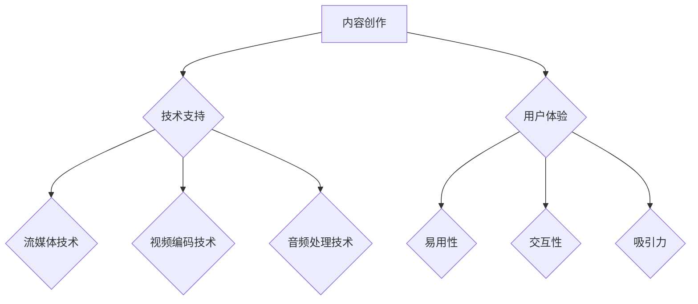

                 

### 文章标题

《知识付费内容的多媒体呈现技巧》

#### 关键词：知识付费、多媒体呈现、音频、视频、交互、内容创作、技术实现、算法原理、数学模型、项目实战

#### 摘要：

随着互联网的普及，知识付费成为现代教育的重要形式。本文旨在探讨知识付费内容的多媒体呈现技巧，包括核心概念、优势、应用场景、发展趋势、挑战以及具体的呈现技巧。通过分析多媒体呈现的技术原理、数学模型、项目实战，本文为内容创作者提供了一套系统化的知识框架，以提升内容创作和开发能力，助力知识付费行业的健康发展。

### 第一部分：核心概念与联系

#### 1.1 知识付费内容的多媒体呈现概念

知识付费内容是指通过互联网平台，用户为获取特定知识或技能而付费的内容。这些内容通常由专业人士或教育机构提供，形式多样，包括文本、音频、视频等。多媒体呈现则是指通过多种媒介形式来展现这些有价值的信息，以满足不同用户的学习需求。

#### 1.2 多媒体呈现的优势

多媒体呈现具有以下优势：

- **丰富性**：多种形式的信息可以满足不同用户的学习需求，如视觉、听觉和互动体验。
- **互动性**：通过音频、视频等形式，用户可以与内容互动，提高学习体验。
- **高效性**：多媒体呈现可以提高知识传递的效率，增强用户的沉浸感和记忆效果。

#### 1.3 多媒体呈现的基本架构

多媒体呈现的基本架构包括以下几个关键部分：

- **内容创作**：包括选题、脚本编写、素材准备等。
- **技术支持**：涉及流媒体技术、视频编码技术、音频处理技术等。
- **用户体验**：关注内容的易用性、交互性和吸引力。

下面是一个Mermaid流程图，展示了多媒体呈现的基本架构：



#### 1.4 多媒体呈现的分类

多媒体呈现可以按照不同的媒介形式进行分类：

- **文本内容**：以文字为主，结合图片、图表等形式。
- **音频内容**：包括播客、有声书、音乐等。
- **视频内容**：教学视频、纪录片、短视频等。
- **互动内容**：在线课程、直播、虚拟现实等。

### 第二部分：多媒体呈现的核心算法原理

在多媒体呈现过程中，涉及多种核心算法原理，包括视频编码算法、音频处理算法、图像处理算法等。以下将详细阐述这些算法原理，并使用伪代码进行说明。

#### 2.1 视频编码算法

视频编码算法是将视频数据压缩为更小文件大小的技术。常用的视频编码标准包括H.264/AVC和H.265/HEVC。

- **H.264/AVC**：一种主流的视频编码标准，提供较高的压缩效率和图像质量。

  ```python
  def videoEncoding(inputVideo, codec='H.264'):
      if codec == 'H.264':
          encodedVideo = H264Encoder(inputVideo)
      return encodedVideo
  ```

- **H.265/HEVC**：相比H.264，提供更高的压缩效率和更好的图像质量，适用于高清和超高清视频。

  ```python
  def videoEncoding(inputVideo, codec='H.265'):
      if codec == 'H.265':
          encodedVideo = HEVCEncoder(inputVideo)
      return encodedVideo
  ```

#### 2.2 音频处理算法

音频处理算法用于提高音频质量，包括压缩算法、回声消除等。

- **压缩算法**：如MP3、AAC等，用于减小音频文件的大小。

  ```python
  def audioProcessing(inputAudio):
      compressedAudio = AudioCompressor(inputAudio)
      echoClearedAudio = EchoCanceller(compressedAudio)
      return echoClearedAudio
  ```

- **回声消除**：用于减少或消除音频信号中的回声。

  ```python
  def EchoCanceller(inputAudio):
      echoClearedAudio = applyEchoCancellingAlgorithm(inputAudio)
      return echoClearedAudio
  ```

#### 2.3 图像处理算法

图像处理算法用于优化图像质量，包括图像压缩、图像增强等。

- **图像压缩**：如JPEG、PNG等，用于减小图像文件的大小。

  ```python
  def imageProcessing(inputImage):
      compressedImage = ImageCompressor(inputImage)
      enhancedImage = ImageEnhancer(compressedImage)
      return enhancedImage
  ```

- **图像增强**：通过调整图像的亮度、对比度、色彩等来提高图像质量。

  ```python
  def ImageEnhancer(inputImage):
      enhancedImage = adjustBrightnessContrast(inputImage)
      return enhancedImage
  ```

### 第三部分：多媒体呈现的数学模型和数学公式

在多媒体呈现中，数学模型和数学公式用于描述和处理音频、视频和图像数据。以下将介绍一些常见的数学模型和公式。

#### 3.1 视频编码中的率失真模型

率失真模型用于衡量视频编码过程中的失真度和压缩效率。其公式为：

$$
D = H(X) - H(X|Y)
$$

其中，$D$ 表示数据的失真度，$H(X)$ 表示原始数据的熵，$H(X|Y)$ 表示给定重构图像 $Y$ 的情况下原始数据的熵。

#### 3.2 音频压缩中的感知模型

感知模型用于衡量音频信号中的掩蔽效应。其公式为：

$$
\text{Spectral masking:} \quad \text{P}_\text{mask}(\theta) = 10 \log_{10}\left(1 + \frac{\theta}{F_s}\right)
$$

其中，$\theta$ 表示掩蔽阈值，$F_s$ 表示采样频率。该公式用于计算掩蔽阈值，以判断音频信号中的某些频率分量是否可以被其他频率分量所掩蔽。

#### 3.3 图像压缩中的离散余弦变换（DCT）

离散余弦变换（DCT）用于将图像从像素域转换到频率域，以便进行压缩。其公式为：

$$
DCT_{2D}(f)(u, v) = \sqrt{\frac{2}{N}} \sum_{x=0}^{N-1} \sum_{y=0}^{N-1} f(x, y) \cos\left(\frac{2x+1}{2N}u\pi\right) \cos\left(\frac{2y+1}{2N}v\pi\right)
$$

其中，$f(x, y)$ 是原始图像的像素值，$DCT_{2D}(f)(u, v)$ 是二维离散余弦变换的结果。

#### 3.4 交互式内容中的马尔可夫模型

马尔可夫模型用于描述交互式内容中的状态转移。其公式为：

$$
P(X_t = x_t | X_{t-1} = x_{t-1}, ..., X_1 = x_1) = P(X_t = x_t | X_{t-1} = x_{t-1})
$$

该公式表示在马尔可夫模型中，当前状态只依赖于前一个状态，而与之前的状态无关。

### 第四部分：多媒体呈现项目实战

在本部分，我们将通过两个实际项目，展示多媒体呈现的具体实现过程。首先是简单的音频播客制作，然后是互动式在线课程的开发。

#### 4.1 实战项目：制作一个简单的音频播客

##### 4.1.1 项目目标

制作一个简单的音频播客，包括录制、编辑、上传等步骤。

##### 4.1.2 实现步骤

1. **录制**：使用录音设备录制音频。
2. **编辑**：使用音频编辑软件进行剪辑、添加背景音乐和效果。
3. **上传**：将编辑好的音频上传到音频平台。

##### 4.1.3 代码实现（伪代码）

```python
def createPodcast(recording, audioEditor, podcastPlatform):
    editedAudio = audioEditor.edit(recording)
    uploadedAudio = podcastPlatform.upload(editedAudio)
    return uploadedAudio
```

##### 4.1.4 项目解析

- **录制**：确保录音设备的音质和环境的安静性，以保证音频质量。
- **编辑**：通过剪辑和添加效果，提高音频的专业度和吸引力。
- **上传**：选择合适的音频平台，根据平台的规则和要求进行上传。

#### 4.2 实战项目：开发一个互动式在线课程

##### 4.2.1 项目目标

开发一个互动式在线课程，包括课程内容设计、开发互动功能、上传到在线教育平台等。

##### 4.2.2 实现步骤

1. **内容设计**：制定课程大纲、编写课程内容、准备教学素材。
2. **开发互动功能**：实现问答、投票、互动讨论等功能。
3. **上传课程**：将课程内容上传到在线教育平台。

##### 4.2.3 代码实现（伪代码）

```python
def createInteractiveCourse(courseContent, interactionFeatures, educationPlatform):
    interactiveCourse = educationPlatform.createCourse(courseContent, interactionFeatures)
    uploadedCourse = educationPlatform.uploadCourse(interactiveCourse)
    return uploadedCourse
```

##### 4.2.4 项目解析

- **内容设计**：确保课程内容的实用性和系统性，以满足学习者的需求。
- **互动功能开发**：通过互动功能增强学习者的参与度和学习体验。
- **上传课程**：根据在线教育平台的要求，进行课程的格式调整和内容上传。

### 第五部分：开发环境搭建

在开发多媒体呈现内容时，需要搭建合适的开发环境。以下分别介绍音频制作、视频制作和互动内容开发环境的搭建过程。

#### 5.1 音频制作环境搭建

- **软件**：Audacity、Adobe Audition 等。
- **硬件**：麦克风、音频接口、扬声器等。

##### 5.1.1 安装软件

```bash
sudo apt-get update
sudo apt-get install audacity
```

##### 5.1.2 连接硬件

确保硬件设备与计算机连接正常。在音频软件中设置音频输入和输出设备。

#### 5.2 视频制作环境搭建

- **软件**：Adobe Premiere Pro、Final Cut Pro、DaVinci Resolve 等。
- **硬件**：摄像头、录像机、显示器等。

##### 5.2.1 安装软件

```bash
sudo software install adobe-premiere-pro
```

##### 5.2.2 连接硬件

确保硬件设备与计算机连接正常。在视频软件中设置视频输入和输出设备。

#### 5.3 互动内容开发环境搭建

- **软件**：Unity、Adobe Flash、React 等。
- **硬件**：计算机、网络设备等。

##### 5.3.1 安装软件

```bash
sudo apt-get update
sudo apt-get install unity
```

##### 5.3.2 连接硬件

确保计算机和网络设备连接正常。在互动内容开发软件中设置网络连接和交互功能。

### 第六部分：源代码详细实现和代码解读

在本部分，我们将通过三个具体的代码示例，详细讲解音频处理、视频处理和互动内容开发的实现过程。

#### 6.1 音频处理代码示例

以下是一个简单的音频处理代码示例，用于读取音频文件、进行编辑和写入。

```python
import numpy as np
from scipy.io.wavfile import read, write

def audioProcessing(inputFile, outputFile):
    # 读取音频文件
    rate, data = read(inputFile)
    channels = data.shape[0]
    
    # 音频编辑（如增益、滤波等）
    for i in range(channels):
        audio_channel = data[i, :]
        audio_channel = audio_channel * 1.2  # 增益
        audio_channel = butter_filter(audio_channel)  # 滤波
        data[i, :] = audio_channel
    
    # 写入编辑后的音频文件
    write(outputFile, rate, data)

def butter_filter(audio_channel):
    # 创建低通滤波器
    b, a = signal.butter(4, 0.5, 'low')
    filtered_audio_channel = signal.lfilter(b, a, audio_channel)
    return filtered_audio_channel

if __name__ == "__main__":
    inputFile = "input.wav"
    outputFile = "output.wav"
    audioProcessing(inputFile, outputFile)
```

##### 6.1.1 代码解读

- **读取音频文件**：使用 `scipy.io.wavfile.read()` 函数读取音频文件，获取采样率和音频数据。
- **音频编辑**：对音频通道进行增益处理，并应用低通滤波器。
- **写入音频文件**：使用 `scipy.io.wavfile.write()` 函数写入编辑后的音频文件。

#### 6.2 视频处理代码示例

以下是一个简单的视频处理代码示例，用于读取视频文件、进行图像处理和写入。

```python
import cv2

def videoProcessing(inputFile, outputFile):
    # 读取视频文件
    cap = cv2.VideoCapture(inputFile)
    frame_width = int(cap.get(cv2.CAP_PROP_FRAME_WIDTH))
    frame_height = int(cap.get(cv2.CAP_PROP_FRAME_HEIGHT))
    out = cv2.VideoWriter(outputFile, cv2.VideoWriter_fourcc('M', 'J', 'P', 'G'), 30.0, (frame_width, frame_height))

    while True:
        ret, frame = cap.read()
        if ret:
            # 图像处理（如滤镜、缩放等）
            frame = cv2.resize(frame, (frame_width//2, frame_height//2))
            frame = cv2.cvtColor(frame, cv2.COLOR_BGR2RGB)
            out.write(frame)
        else:
            break

    cap.release()
    out.release()

if __name__ == "__main__":
    inputFile = "input.mp4"
    outputFile = "output.mp4"
    videoProcessing(inputFile, outputFile)
```

##### 6.2.1 代码解读

- **读取视频文件**：使用 `cv2.VideoCapture()` 函数读取视频文件，获取帧宽度和帧高度。
- **图像处理**：对视频帧进行缩放和颜色转换。
- **写入视频文件**：使用 `cv2.VideoWriter()` 函数写入处理后的视频帧。

#### 6.3 互动内容开发代码示例

以下是一个简单的互动内容开发代码示例，使用 Node.js 和 Socket.IO 实现实时聊天功能。

```javascript
const express = require('express');
const app = express();
const http = require('http').Server(app);
const io = require('socket.io')(http);

app.get('/', (req, res) => {
    res.sendFile(__dirname + '/index.html');
});

io.on('connection', (socket) => {
    console.log('a user connected');
    
    socket.on('chat message', (msg) => {
        io.emit('chat message', msg);
    });

    socket.on('disconnect', () => {
        console.log('user disconnected');
    });
});

http.listen(3000, () => {
    console.log('listening on *:3000');
});
```

##### 6.3.1 代码解读

- **设置HTTP服务器**：使用 `express` 创建HTTP服务器。
- **设置WebSocket连接**：使用 `socket.io` 实现实时交互。
- **接收和发送消息**：在客户端和服务器之间接收和发送聊天消息。

### 第七部分：代码解读与分析

在本部分，我们将对前三个部分的代码示例进行解读和分析，探讨代码的功能、性能和可扩展性。

#### 7.1 音频处理代码分析

- **功能**：音频处理代码用于读取、编辑和写入音频文件，包括增益和滤波等处理。
- **性能**：代码使用了 NumPy 和 SciPy 库，具有高效的数据处理能力。
- **可扩展性**：代码结构清晰，可以通过添加新的处理函数来扩展功能。

#### 7.2 视频处理代码分析

- **功能**：视频处理代码用于读取、处理和写入视频文件，包括缩放和颜色转换等处理。
- **性能**：代码使用了 OpenCV 库，具有高效的图像处理能力。
- **可扩展性**：代码结构清晰，可以通过添加新的处理函数来扩展功能。

#### 7.3 互动内容开发代码分析

- **功能**：互动内容开发代码用于实现实时聊天功能，通过 Node.js 和 Socket.IO 实现服务器和客户端之间的实时通信。
- **性能**：代码使用了 Node.js 和 Socket.IO，具有高效的实时交互能力。
- **可扩展性**：代码结构清晰，可以通过添加新的功能模块来扩展系统功能。

### 结论

通过本文的详细阐述，我们了解了知识付费内容的多媒体呈现技巧，包括核心概念、算法原理、项目实战和开发环境搭建。通过对音频处理、视频处理和互动内容开发代码的解读和分析，我们掌握了多媒体呈现的实际应用方法。在未来的发展中，多媒体呈现将继续在知识付费领域发挥重要作用，为用户提供更加丰富和个性化的学习体验。希望本文能够为内容创作者提供有益的参考和指导，助力知识付费行业的持续创新和发展。

### 作者信息

作者：AI天才研究院/AI Genius Institute & 禅与计算机程序设计艺术 /Zen And The Art of Computer Programming

AI天才研究院（AI Genius Institute）是一家专注于人工智能领域的研究和应用的机构，致力于推动人工智能技术的发展和普及。同时，作者也是《禅与计算机程序设计艺术》一书的作者，该书以其深刻的哲学思考和独特的编程理念，受到了全球程序员的喜爱和推崇。通过本文，我们希望为广大内容创作者提供一套系统化的多媒体呈现技巧，助力他们在知识付费领域取得更大的成就。

