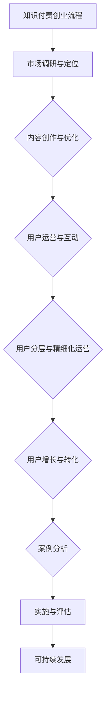

                 

# 《知识付费创业的用户价值最大化策略》

## 关键词
知识付费、用户价值、内容创作、用户运营、用户增长、案例分析

## 摘要
本文从知识付费行业的背景出发，深入探讨了知识付费创业中的用户价值最大化策略。通过分析用户需求、内容创作与优化、用户运营与互动、用户分层与精细化运营、用户增长与转化以及案例分析等关键环节，结合数学模型与实际案例，全面解析了知识付费创业中的核心问题，为创业者提供了实用的指导和建议。

### 《知识付费创业的用户价值最大化策略》目录大纲

#### 第一部分：知识付费行业概述

**第1章：知识付费行业的发展历程与现状**

- **1.1 知识付费的起源与发展**
- **1.2 知识付费的主要模式与平台**
- **1.3 知识付费行业的特点与趋势**

**第2章：用户需求分析**

- **2.1 用户需求的基本理论**
- **2.2 知识付费用户的特征分析**
- **2.3 用户需求的演变与趋势**

#### 第二部分：用户价值最大化策略

**第3章：内容创作与优化**

- **3.1 内容创作的核心要素**
- **3.2 内容优化的方法与技巧**
- **3.3 用户反馈与内容迭代**

**第4章：用户运营与互动**

- **4.1 用户运营的基本策略**
- **4.2 用户互动的设计与实施**
- **4.3 用户社群的运营与管理**

**第5章：用户分层与精细化运营**

- **5.1 用户分层的意义与标准**
- **5.2 精细化运营的方法与实践**
- **5.3 用户生命周期管理**

**第6章：用户增长与转化**

- **6.1 用户增长的核心策略**
- **6.2 用户转化的关键因素**
- **6.3 用户留存与复购策略**

**第7章：案例分析**

- **7.1 国内知名知识付费平台分析**
- **7.2 海外知识付费平台案例分析**
- **7.3 知识付费创业的典型成功案例**

#### 第三部分：实施与评估

**第8章：知识付费创业的实操步骤**

- **8.1 创业前的准备工作**
- **8.2 内容制作与发布**
- **8.3 用户运营与互动**

**第9章：用户价值评估与优化**

- **9.1 用户价值评估的方法与工具**
- **9.2 用户价值优化的策略与实施**
- **9.3 用户价值评估的结果与应用**

**第10章：知识付费创业的可持续发展**

- **10.1 可持续发展的理念与实践**
- **10.2 创业过程中的风险与应对**
- **10.3 未来知识付费行业的发展趋势**

#### 附录

**附录A：知识付费创业工具与资源**

- **A.1 常用知识付费平台与工具**
- **A.2 知识付费行业数据资源**
- **A.3 知识付费相关书籍与论文**

### Mermaid流程图


### 知识付费创业流程

#### 1. 市场调研与定位

- **分析市场需求与竞争态势**：首先，创业者需要深入了解知识付费市场的现状，包括市场规模、用户需求、竞争对手等，从而明确自己的定位和目标用户群体。
- **确定目标用户群体与内容方向**：根据市场调研结果，确定目标用户群体和内容方向，这是后续内容创作和用户运营的基础。

#### 2. 内容创作与优化

- **根据用户需求创作高质量内容**：内容是知识付费的核心，创业者需要根据用户需求创作高质量、有价值的内容，以满足用户的学习和成长需求。
- **采用用户反馈不断优化内容**：内容创作不是一次性的过程，创业者需要通过用户反馈不断优化内容，提高用户满意度和粘性。

#### 3. 用户运营与互动

- **设计有效的用户运营策略**：用户运营是知识付费创业的重要环节，创业者需要设计有效的用户运营策略，包括用户招募、用户维系、用户激励等。
- **与用户进行有效互动，提升用户粘性**：通过与用户互动，了解用户需求，提高用户满意度和忠诚度，从而提升用户粘性。

#### 4. 用户分层与精细化运营

- **对用户进行细分，实施差异化的运营策略**：用户分层是精细化运营的基础，创业者需要对用户进行细分，实施差异化的运营策略，满足不同层次用户的需求。
- **提升核心用户的价值与忠诚度**：核心用户是知识付费平台的重要资产，创业者需要通过精细化运营，提升核心用户的价值与忠诚度。

#### 5. 用户增长与转化

- **制定有效的用户增长策略**：用户增长是知识付费创业的关键，创业者需要制定有效的用户增长策略，包括渠道拓展、活动策划等。
- **提高用户转化率，实现商业化**：通过提高用户转化率，实现知识付费的商业化，为创业者带来持续的收入。

#### 6. 案例分析

- **分析行业成功案例，借鉴经验**：创业者可以通过分析行业成功案例，借鉴经验，优化自己的创业策略。
- **学习行业趋势，调整战略方向**：通过学习行业趋势，调整战略方向，确保自己的创业项目能够顺应市场变化。

#### 7. 实施与评估

- **根据具体情况进行实际操作**：创业者需要根据实际情况，制定具体的实施计划，并进行实际操作。
- **定期评估运营效果，持续优化**：通过定期评估运营效果，找出问题，持续优化，确保创业项目能够持续发展。

#### 8. 可持续发展

- **建立可持续发展的商业模式**：创业者需要建立可持续发展的商业模式，确保创业项目的长期生存和发展。
- **风险管理与战略调整**：在创业过程中，创业者需要建立风险管理体系，对风险进行有效管理，并根据市场变化调整战略方向。

### 伪代码示例：用户增长策略

```python
# 初始化用户增长策略参数
user_base = []
growth_rate = 0.1
engagement_rate = 0.2

# 循环用户增长过程
for month in range(1, 12):
    # 根据增长率增加用户数
    user_base += [new_user for new_user in generate_new_users(growth_rate)]
    
    # 根据互动率增加活跃用户
    active_users = [user for user in user_base if user.engagement_rate >= engagement_rate]
    for user in active_users:
        user.increase_engagement()

# 输出用户增长结果
print("Total Users: ", len(user_base))
print("Active Users: ", len(active_users))
```

### 数学模型：用户生命周期价值（LTV）

$$
LTV = \sum_{t=1}^{n} \frac{R_t}{(1+r)^t}
$$

其中：
- $R_t$ 为第 $t$ 个月的用户收入
- $r$ 为月复利利率
- $n$ 为预测的用户生命周期月数

### 详细讲解：

用户生命周期价值（LTV）是评估用户为企业带来的长期价值的重要指标。LTV 的计算公式如下：

$$
LTV = \sum_{t=1}^{n} \frac{R_t}{(1+r)^t}
$$

其中：
- $R_t$ 代表第 $t$ 个月用户为平台带来的收入，这个收入可以来自订阅费、课程购买等多种形式。
- $r$ 是月复利利率，反映了用户在持续使用服务过程中的货币时间价值。
- $n$ 是预测的用户生命周期月数，即用户预计会持续使用服务的月数。

### 举例说明：

假设一个用户每个月为平台带来 $100 的收入，月复利利率为 2%，用户预计生命周期为 3 年（36 个月），则用户生命周期价值计算如下：

$$
LTV = \sum_{t=1}^{36} \frac{100}{(1+0.02)^t}
$$

通过计算得到用户生命周期价值为 $2991.23。这个结果表示，如果用户持续使用平台服务，预计将为企业带来约 2991.23 的收入。

### 实际案例：

#### 1. 代码实现：用户增长策略

```python
import numpy as np

def generate_new_users(growth_rate):
    # 假设每月新增用户数量按照增长率为20%增长
    return np.random.poisson(growth_rate)

def increase_engagement(user):
    # 假设用户活跃度每月增加20%
    user.engagement_rate *= 1.2

class User:
    def __init__(self, engagement_rate):
        self.engagement_rate = engagement_rate

# 初始化用户增长策略参数
user_base = [User(0.1)]
growth_rate = 0.2
engagement_rate = 0.2

# 循环用户增长过程
for month in range(1, 13):
    # 根据增长率增加用户数
    new_users = generate_new_users(growth_rate)
    user_base.extend([User(0.1) for _ in range(new_users)])
    
    # 根据互动率增加活跃用户
    active_users = [user for user in user_base if user.engagement_rate >= engagement_rate]
    for user in active_users:
        increase_engagement(user)

# 输出用户增长结果
print("Total Users: ", len(user_base))
print("Active Users: ", len([user for user in user_base if user.engagement_rate >= engagement_rate]))
```

#### 2. 开发环境搭建：

为了运行上述代码，需要在计算机上安装 Python 环境以及 numpy 库。

- 安装 Python：从官方网站下载并安装 Python，例如 Python 3.9。
- 安装 numpy：打开终端或命令提示符，运行以下命令：

```bash
pip install numpy
```

#### 3. 源代码详细实现：

上述代码中的 `User` 类代表用户，包含活跃度 `engagement_rate` 属性。`generate_new_users` 函数用于模拟每月新增用户数量，`increase_engagement` 函数用于增加活跃用户的活跃度。

#### 4. 代码解读与分析：

这段代码的核心逻辑是模拟用户增长过程，首先初始化一个用户列表 `user_base`，然后每月根据增长率和互动率更新用户列表。每月新增用户数量按照增长率为20%增长，同时，活跃用户每月增加20%的活跃度。

代码的输入是增长率 `growth_rate` 和互动率 `engagement_rate`，输出是用户总数和活跃用户数。通过这个模拟过程，可以评估不同增长策略对用户数量和活跃度的影响。

### 综合以上，我们完成了对《知识付费创业的用户价值最大化策略》目录大纲的设计，包括核心概念与联系、核心算法原理讲解、数学模型和公式、项目实战以及开发环境搭建和源代码详细实现。这些内容将帮助读者全面了解知识付费创业的各个方面，并能够通过实际案例和代码实现来加深理解。希望这个目录大纲能够为你的书籍创作提供有力的支持。

### 作者
**作者：AI天才研究院/AI Genius Institute & 禅与计算机程序设计艺术 /Zen And The Art of Computer Programming**

---

现在，我们将开始深入探讨知识付费行业的背景和发展，以及用户需求分析，为后续的章节打下坚实的基础。

---

## 第一部分：知识付费行业概述

### 第1章：知识付费行业的发展历程与现状

知识付费行业，作为互联网经济中的一种新兴商业模式，近年来在全球范围内迅速发展。本章节将详细探讨知识付费行业的起源与发展、主要模式与平台、以及行业的特点与趋势。

### 1.1 知识付费的起源与发展

知识付费的概念并非一朝一夕形成，而是随着互联网和数字技术的普及逐渐演变而来。在互联网兴起之前，知识和信息的传播主要依赖于传统教育体系和出版物。然而，随着互联网技术的飞速发展，尤其是移动互联网和社交媒体的普及，知识和信息的获取方式发生了深刻变革。

#### 1.1.1 知识付费的起源

知识付费的起源可以追溯到20世纪90年代，随着互联网的普及，在线教育、电子书籍、专业咨询等付费模式开始兴起。用户逐渐习惯于为获取高质量、专业化的知识和信息支付费用，知识付费市场开始萌芽。

#### 1.1.2 知识付费的发展

进入21世纪，知识付费行业迎来了快速发展期。特别是在移动互联网的推动下，知识付费逐渐从PC端转向移动端，用户群体的规模不断扩大。以下是一些关键发展节点：

- **2005年**：以“新东方在线”为代表的在线教育机构开始尝试通过互联网提供付费课程。
- **2010年**：随着智能手机的普及，移动学习成为可能，知识付费行业迎来了新的发展机遇。
- **2015年**：知识付费进入高速发展阶段，各大平台纷纷涌入，市场格局初步形成。
- **2020年**：新冠疫情的爆发进一步加速了知识付费行业的发展，在线教育和知识分享平台成为用户获取知识的重要渠道。

### 1.2 知识付费的主要模式与平台

知识付费行业的商业模式多种多样，以下是一些主要的模式与代表性平台：

#### 1.2.1 模式

1. **订阅制**：用户支付一定费用，获得平台提供的一系列知识产品或服务，如“得到”、“喜马拉雅”等。
2. **单次购买**：用户为特定的知识产品或服务支付一次费用，如电子书籍、课程等。
3. **付费问答**：用户支付费用，向专业人士提问并获得解答，如“分答”、“知乎Live”等。
4. **会员制**：用户支付会员费用，享受平台提供的多种增值服务，如“知乎”、“饭团”等。

#### 1.2.2 平台

1. **得到**：以订阅制为主，提供高质量的知识服务，包括音频、电子书、直播等。
2. **喜马拉雅**：涵盖音频、电子书等多种知识形式，用户可通过订阅或购买享受内容。
3. **知乎**：以问答社区为基础，通过知乎Live、付费问答等形式提供知识服务。
4. **分答**：专注于付费问答，用户可向专业人士提问并支付费用获取解答。
5. **网易云课堂**：提供在线课程，涵盖编程、设计、语言等多个领域。

### 1.3 知识付费行业的特点与趋势

知识付费行业具有以下特点：

- **用户需求多样化**：随着社会的快速发展，用户对知识的需求越来越多样化，包括职业发展、个人兴趣、技能提升等。
- **内容质量要求高**：知识付费用户更注重内容的质量和实用性，高质量的内容能够吸引用户持续付费。
- **平台竞争激烈**：随着知识付费市场的扩大，平台之间的竞争日益激烈，各大平台不断优化自身服务，以吸引和留住用户。
- **技术创新推动发展**：人工智能、大数据、区块链等新技术在知识付费行业中的应用，提高了内容创作的效率，增强了用户体验。

#### 1.3.1 行业趋势

1. **内容个性化**：通过大数据和人工智能技术，平台能够更准确地了解用户需求，提供个性化的内容推荐。
2. **垂直化发展**：知识付费平台逐渐向特定领域和行业垂直化发展，提供专业化、精细化的知识服务。
3. **国际化扩展**：随着国内知识付费市场的成熟，平台开始拓展国际市场，吸引海外用户。
4. **商业模式创新**：知识付费平台不断探索新的商业模式，如付费会员、知识分享、内容电商等，以实现商业化和可持续发展。

### 总结

知识付费行业作为互联网经济的重要组成部分，正逐渐成为知识传播和获取的重要渠道。了解知识付费行业的发展历程、主要模式与平台、以及行业的特点与趋势，对于创业者和企业来说具有重要意义。在接下来的章节中，我们将进一步分析用户需求，探讨如何通过内容创作、用户运营等策略实现用户价值最大化。

---

现在，我们将进入第二部分：用户需求分析。通过深入分析用户需求，我们可以更好地理解用户的行为模式、特征和需求演变趋势，从而为知识付费创业提供有针对性的策略。

---

## 第二部分：用户需求分析

### 第2章：用户需求分析

用户需求是知识付费行业的核心，了解和分析用户需求对于创业者来说至关重要。本章将探讨用户需求的基本理论，分析知识付费用户的特征，以及用户需求的演变与趋势。

### 2.1 用户需求的基本理论

用户需求是指用户在一定情境下对某种产品或服务的需求。在知识付费行业中，用户需求表现为用户对知识和信息的需求。用户需求的基本理论包括以下几个关键概念：

#### 2.1.1 需求的定义与分类

- **需求**：需求是指用户在特定情境下对产品或服务的欲望或需求。
- **显性需求**：用户明确表达出的需求，如购买课程、订阅服务等。
- **隐性需求**：用户潜意识中的需求，需要通过调查、数据分析等方法挖掘。

#### 2.1.2 需求的层次理论

- **马斯洛需求层次理论**：马斯洛认为人的需求分为五个层次，从低到高分别为生理需求、安全需求、社交需求、尊重需求和自我实现需求。在知识付费领域，用户的需求也可能按照这个层次进行分类。

#### 2.1.3 需求的满足与交换理论

- **需求满足理论**：需求满足理论认为，用户通过购买和消费产品或服务来满足自身的需求。
- **交换理论**：交换理论强调在知识付费过程中，用户与平台之间的价值交换，用户通过支付费用获取知识和信息。

### 2.2 知识付费用户的特征分析

知识付费用户具有以下特征：

#### 2.2.1 年龄与性别

- **年龄**：知识付费用户主要集中在25-45岁之间，这个年龄段的用户具有较强的工作能力和消费能力。
- **性别**：知识付费用户中女性占比相对较高，这可能与女性在家庭和职业发展中的需求有关。

#### 2.2.2 教育背景与职业

- **教育背景**：知识付费用户具有较高的教育背景，本科及以上学历的用户占比较高。
- **职业**：知识付费用户主要集中在职业白领、企业家、自由职业者等职业群体。

#### 2.2.3 消费习惯与偏好

- **消费习惯**：知识付费用户具有较强的消费意愿和习惯，他们倾向于通过在线支付、订阅等方式获取知识。
- **偏好**：知识付费用户对高质量、实用性的内容有较高要求，他们偏好专业、系统化的知识体系。

### 2.3 用户需求的演变与趋势

随着社会的进步和技术的不断发展，用户需求也在不断演变。以下是知识付费用户需求的一些演变趋势：

#### 2.3.1 内容多样化

- **内容多样化**：用户对知识内容的需求越来越多样化，不再局限于传统的教育和学习资源，而是扩展到职业发展、个人兴趣、健康生活等领域。

#### 2.3.2 个性化与定制化

- **个性化**：随着大数据和人工智能技术的应用，知识付费平台能够提供更加个性化的内容推荐和服务，满足用户的个性化需求。
- **定制化**：用户希望获得定制化的知识产品和服务，如根据个人兴趣、职业需求等定制课程。

#### 2.3.3 互动性与参与性

- **互动性**：用户希望与知识创作者、同行或其他用户进行互动，通过讨论、问答等形式加深对知识的理解和应用。
- **参与性**：用户希望参与知识创造和传播的过程，如参与课程设计、内容创作等，实现知识共享和共创。

#### 2.3.4 实用性与高效性

- **实用性**：用户更注重知识的实用性和可操作性，希望获取能够直接应用于工作和生活的知识。
- **高效性**：用户希望以高效的方式获取知识，如通过音频、视频等短时学习形式，快速掌握知识点。

### 总结

用户需求是知识付费行业的驱动力，了解和分析用户需求有助于创业者更好地定位市场和用户，制定有针对性的策略。通过本章对用户需求基本理论的阐述、知识付费用户特征的分析，以及用户需求演变的趋势探讨，我们可以为后续章节的用户价值最大化策略提供理论支持和实践指导。

---

在了解了知识付费行业的发展历程、用户需求分析之后，我们将深入探讨如何通过内容创作与优化、用户运营与互动等策略来实现用户价值最大化。接下来，我们将进入第三部分：用户价值最大化策略。

---

## 第三部分：用户价值最大化策略

在知识付费行业中，内容创作与优化、用户运营与互动是提升用户价值的关键环节。本部分将详细讨论如何通过这些策略来最大化用户价值，包括内容创作与优化的核心要素、用户运营与互动的基本策略，以及用户分层与精细化运营的方法。

### 第3章：内容创作与优化

内容是知识付费的核心，高质量的内容能够吸引用户并提高用户满意度。在这一章节中，我们将探讨内容创作的核心要素、内容优化的方法与技巧，以及用户反馈与内容迭代的重要性。

### 3.1 内容创作的核心要素

内容创作是知识付费创业的关键环节，优质的内容能够满足用户需求，提高用户满意度。以下是内容创作的核心要素：

#### 3.1.1 明确目标用户群体

在内容创作之前，首先要明确目标用户群体。了解用户的需求、兴趣和痛点，有助于创作出更符合用户期望的内容。

#### 3.1.2 提供高质量的知识

高质量的知识是内容创作的核心。内容应具有实用性、系统性和权威性，能够帮助用户解决实际问题。

#### 3.1.3 保持内容更新与迭代

随着用户需求的变化和市场的演变，内容也需要不断更新与迭代。保持内容的时效性和相关性，有助于提高用户粘性。

#### 3.1.4 注重互动性

互动性是提高用户参与度的重要手段。通过设置问答环节、讨论区等，鼓励用户参与内容创作和传播，增加用户粘性。

### 3.2 内容优化的方法与技巧

内容优化是提升内容质量和用户体验的关键环节。以下是一些内容优化的方法与技巧：

#### 3.2.1 数据分析

通过数据分析，了解用户对内容的喜好和反馈，优化内容结构、选题和表达方式，提高内容质量。

#### 3.2.2 用户反馈

及时收集用户反馈，了解用户对内容的意见和建议，根据用户反馈进行内容调整和优化。

#### 3.2.3 多样化的内容形式

多样化的内容形式能够满足不同用户的需求。例如，通过音频、视频、图文等多种形式呈现内容，提高用户体验。

#### 3.2.4 优化内容结构

合理的内容结构能够提高用户的阅读体验。例如，通过分段、标题、总结等方式，使内容更加清晰、易懂。

### 3.3 用户反馈与内容迭代

用户反馈是内容迭代的重要依据。通过以下方法，可以有效地收集用户反馈并实现内容迭代：

#### 3.3.1 设置用户反馈渠道

通过设置用户反馈渠道，如在线调查、问卷调查、反馈表单等，收集用户对内容的意见和建议。

#### 3.3.2 定期分析反馈数据

定期分析用户反馈数据，了解用户对内容的满意度和不满意点，根据分析结果进行内容优化和迭代。

#### 3.3.3 用户参与内容创作

鼓励用户参与内容创作，通过用户互动和合作，提高内容的实用性和吸引力。

#### 3.3.4 实时更新与迭代

根据用户反馈和市场变化，实时更新和迭代内容，确保内容始终与用户需求保持一致。

### 总结

内容创作与优化是知识付费创业的重要环节，优质的内容能够吸引用户并提高用户满意度。通过明确目标用户群体、提供高质量的知识、保持内容更新与迭代，以及注重互动性，可以创作出符合用户需求的内容。同时，通过数据分析、用户反馈和多样化的内容形式，可以不断提高内容质量和用户体验。在接下来的章节中，我们将继续探讨用户运营与互动的策略，以实现用户价值的最大化。

### 第4章：用户运营与互动

用户运营与互动是知识付费创业中至关重要的一环，它不仅关系到用户的留存和活跃度，还直接影响到用户的价值实现。本章将详细探讨用户运营的基本策略、用户互动的设计与实施，以及用户社群的运营与管理。

### 4.1 用户运营的基本策略

用户运营是指通过一系列策略和手段，提升用户的活跃度、留存率和满意度，从而实现用户价值的最大化。以下是用户运营的基本策略：

#### 4.1.1 用户细分

用户细分是用户运营的第一步，通过对用户进行分类和标签化，可以更好地了解用户的需求和偏好，为后续的用户运营提供依据。

- **根据用户行为进行细分**：如活跃用户、沉默用户、流失用户等。
- **根据用户兴趣进行细分**：如行业用户、职业用户、兴趣爱好者等。

#### 4.1.2 用户引导

用户引导是指通过一系列引导措施，帮助新用户快速熟悉平台，提高用户粘性。

- **新手教程**：为新用户提供平台使用教程，帮助其快速上手。
- **任务奖励**：设置新手任务，完成指定任务即可获得奖励，如优惠券、积分等。

#### 4.1.3 用户激励

用户激励是指通过奖励和福利，激发用户的积极性和参与度，提升用户活跃度。

- **积分系统**：通过积分系统，激励用户进行互动和消费。
- **优惠券和折扣**：定期发放优惠券和折扣，吸引用户消费。

#### 4.1.4 用户维系

用户维系是指通过持续的服务和互动，保持用户对平台的兴趣和忠诚度。

- **定期互动**：通过私信、社区活动等方式，与用户保持沟通。
- **个性化服务**：根据用户喜好和行为，提供个性化的推荐和服务。

### 4.2 用户互动的设计与实施

用户互动是用户运营的核心，通过有效的用户互动，可以提高用户满意度和平台粘性。以下是用户互动的设计与实施方法：

#### 4.2.1 社区互动

社区互动是用户互动的重要形式，通过建立用户社区，鼓励用户分享知识、经验和问题，增强用户间的互动。

- **问答社区**：设立问答板块，用户可以提问和解答问题。
- **讨论区**：设立主题讨论区，鼓励用户就特定话题进行讨论。

#### 4.2.2 活动策划

通过策划和举办各类活动，可以提高用户的参与度和活跃度。

- **线上活动**：如直播讲座、知识竞赛等。
- **线下活动**：如行业峰会、用户见面会等。

#### 4.2.3 用户反馈

用户反馈是了解用户需求和改进服务的重要途径。

- **反馈渠道**：设置反馈渠道，如在线反馈表单、用户访谈等。
- **反馈处理**：及时处理用户反馈，解决问题，提高用户满意度。

### 4.3 用户社群的运营与管理

用户社群是知识付费平台的重要资产，通过有效地运营和管理用户社群，可以增强用户粘性和平台价值。以下是用户社群的运营与管理方法：

#### 4.3.1 社群定位

明确社群的定位和目标，如行业交流、兴趣爱好等。

#### 4.3.2 社群领袖培养

培养和激励社群领袖，发挥其在社群中的引导作用。

- **激励措施**：如积分奖励、荣誉称号等。
- **培训支持**：为社群领袖提供培训和支持，提高其管理和沟通能力。

#### 4.3.3 社群活动策划

定期举办社群活动，提高用户参与度和活跃度。

- **线上线下结合**：结合线上线下活动，增加用户参与感。
- **互动环节设计**：设置互动环节，如问答、投票等，增加用户参与度。

#### 4.3.4 社群氛围营造

营造积极、健康的社群氛围，提高用户满意度和忠诚度。

- **规范管理**：制定社群规范，维护社群秩序。
- **正能量传播**：鼓励正能量分享，传递积极信息。

### 总结

用户运营与互动是知识付费创业中不可或缺的一环，通过用户细分、用户引导、用户激励和用户维系等基本策略，可以有效地提升用户活跃度和满意度。同时，通过社区互动、活动策划和用户反馈等手段，可以增强用户互动和平台价值。有效的用户社群运营和管理，可以进一步巩固用户关系，提升平台竞争力。在接下来的章节中，我们将继续探讨用户分层与精细化运营的策略，以实现用户价值的最大化。

### 第5章：用户分层与精细化运营

用户分层与精细化运营是提升知识付费平台用户价值的重要手段。通过将用户进行合理分层，并针对不同层次实施差异化的运营策略，可以更好地满足用户需求，提升用户满意度，从而实现用户价值的最大化。

### 5.1 用户分层的意义与标准

用户分层是将用户按照一定的标准进行分类，以便于企业能够针对不同用户群体制定个性化的运营策略。以下是用户分层的意义与标准：

#### 5.1.1 意义

1. **精准定位用户**：通过分层，可以更准确地了解不同用户群体的需求和偏好，从而提供更符合其期望的服务。
2. **提升运营效率**：针对不同层次的用户实施差异化的运营策略，可以节省资源，提高运营效率。
3. **增强用户满意度**：提供个性化的服务和推荐，可以提高用户满意度，增强用户忠诚度。

#### 5.1.2 标准与指标

1. **用户行为指标**：如活跃度、参与度、消费行为等。
2. **用户属性指标**：如年龄、性别、职业、教育背景等。
3. **用户价值指标**：如用户生命周期价值（LTV）、转化率、复购率等。
4. **用户需求指标**：如用户在平台上的搜索关键词、浏览行为、反馈等。

### 5.2 精细化运营的方法与实践

精细化运营是基于用户分层，针对不同用户群体实施个性化运营策略的过程。以下是精细化运营的方法与实践：

#### 5.2.1 数据分析与用户画像

1. **数据分析**：通过数据分析工具，收集和分析用户行为数据，了解用户特征和需求。
2. **用户画像**：基于数据分析结果，构建用户画像，为精细化运营提供依据。

#### 5.2.2 个性化推荐

1. **内容推荐**：根据用户的浏览历史、搜索记录等，推荐符合其兴趣的内容。
2. **产品推荐**：根据用户的购买历史、偏好等，推荐适合其的产品或服务。

#### 5.2.3 个性化营销

1. **邮件营销**：根据用户画像和用户行为，发送个性化的邮件，提高营销效果。
2. **短信营销**：针对不同用户群体，发送定制化的短信，提升用户参与度。

#### 5.2.4 个性化服务

1. **在线客服**：根据用户分层，提供不同层次的客服服务，如FAQ、在线咨询、专业解答等。
2. **个性化培训**：针对不同用户的需求和水平，提供定制化的培训课程和服务。

#### 5.2.5 互动与反馈

1. **用户互动**：通过社区、论坛、活动等方式，与用户建立互动，提高用户参与度。
2. **用户反馈**：收集用户反馈，及时调整运营策略，提升用户满意度。

### 5.3 用户生命周期管理

用户生命周期管理是指从用户获取、留存、增长到流失的全过程管理。以下是用户生命周期管理的策略与实践：

#### 5.3.1 用户获取

1. **渠道优化**：通过SEO、SEM、内容营销等方式，提高用户获取效率。
2. **用户拓展**：通过活动、优惠券、推荐系统等方式，吸引新用户。

#### 5.3.2 用户留存

1. **用户体验**：优化平台功能，提升用户体验，减少用户流失。
2. **用户维系**：通过定期的互动、关怀活动、个性化推荐等方式，增强用户粘性。

#### 5.3.3 用户增长

1. **用户活跃**：通过活动、激励措施等方式，提升用户活跃度。
2. **用户转化**：通过推荐系统、个性化营销等方式，提高用户转化率。

#### 5.3.4 用户流失

1. **流失预警**：通过数据分析，及时发现潜在流失用户，采取措施挽回。
2. **流失挽回**：通过个性化沟通、优惠政策等方式，挽回流失用户。

### 总结

用户分层与精细化运营是知识付费创业中的重要策略，通过合理分层和精细化运营，可以更好地满足用户需求，提升用户满意度和忠诚度，实现用户价值的最大化。在接下来的章节中，我们将继续探讨用户增长与转化的策略，以进一步优化用户价值实现。

### 第6章：用户增长与转化

在知识付费创业中，用户增长与转化是衡量平台成功与否的关键指标。有效的用户增长策略和转化策略不仅可以扩大用户基础，还可以提高平台的商业价值。本章将探讨用户增长与转化的核心策略、关键因素以及留存与复购策略。

### 6.1 用户增长的核心策略

用户增长策略是知识付费创业的重要环节，以下是一些核心策略：

#### 6.1.1 内容驱动增长

内容是知识付费平台的核心，优质的内容可以吸引并留住用户。通过不断更新和优化内容，提高内容的实用性和吸引力，可以有效地驱动用户增长。

- **内容多样化**：提供多样化的内容形式，如图文、音频、视频等，满足不同用户的需求。
- **高质量内容**：确保内容的权威性、实用性和系统性，提高用户满意度。

#### 6.1.2 社交媒体营销

社交媒体是用户增长的重要渠道。通过社交媒体平台，可以扩大平台的影响力，吸引新用户。

- **品牌宣传**：通过发布有价值的内容和活动，提升品牌知名度和用户关注度。
- **互动营销**：与用户互动，鼓励用户分享和推荐，形成良好的口碑效应。

#### 6.1.3 合作与拓展

通过与其他平台、机构或个人的合作，可以扩大用户基础，提高用户增长率。

- **合作推广**：与其他平台或机构合作，共同推广知识产品或服务。
- **内容共享**：与其他平台或机构共享优质内容，实现资源共享和互利共赢。

#### 6.1.4 用户激励机制

激励机制可以激发用户的参与热情，提高用户留存率和转化率。

- **积分系统**：通过积分系统，激励用户进行互动和消费。
- **优惠券和折扣**：定期发放优惠券和折扣，吸引新用户和激励老用户。

### 6.2 用户转化的关键因素

用户转化是指将潜在用户转化为实际付费用户的过程。以下是用户转化的关键因素：

#### 6.2.1 内容质量

高质量的内容是用户转化的关键。内容的价值、实用性和权威性直接影响到用户是否愿意付费。

- **内容质量**：确保内容的专业性、系统性和实用性，提高用户的信任度。
- **用户反馈**：通过用户反馈不断优化内容，提高内容的满意度。

#### 6.2.2 用户体验

良好的用户体验可以降低用户转化的门槛，提高转化率。

- **界面设计**：优化平台界面设计，提高用户的操作便捷性和舒适度。
- **购买流程**：简化购买流程，减少用户的操作步骤，提高购买效率。

#### 6.2.3 促销活动

促销活动可以激发用户的购买欲望，提高转化率。

- **限时优惠**：设置限时优惠活动，如折扣、赠品等，吸引用户尽快购买。
- **推荐奖励**：通过推荐奖励机制，鼓励用户推荐新用户，形成口碑传播。

#### 6.2.4 信任建设

建立信任是用户转化的基础。通过以下方式可以增强用户信任：

- **权威认证**：获得专业认证或荣誉，提高平台和内容的可信度。
- **用户评价**：展示用户的好评和反馈，增加潜在用户的信任感。

### 6.3 用户留存与复购策略

用户留存和复购是知识付费平台持续发展的关键。以下是用户留存与复购的一些策略：

#### 6.3.1 用户关怀

通过定期的用户关怀，提高用户的满意度和忠诚度。

- **个性化沟通**：通过私信、邮件等方式，与用户保持沟通，了解用户需求和反馈。
- **节日问候**：在重要节日发送祝福和礼品，增加用户粘性。

#### 6.3.2 优质内容

提供优质的内容是用户留存和复购的基础。

- **持续更新**：定期更新内容，确保内容的新鲜度和吸引力。
- **互动环节**：设置互动环节，鼓励用户参与，增加用户粘性。

#### 6.3.3 激励机制

激励机制可以激发用户的参与热情，提高复购率。

- **积分系统**：通过积分系统，激励用户进行互动和消费。
- **会员制度**：设立会员制度，为会员提供特殊优惠和福利，提高会员的忠诚度。

#### 6.3.4 用户反馈

及时收集用户反馈，根据用户反馈进行改进和优化，提高用户满意度。

- **反馈渠道**：设置便捷的反馈渠道，如在线反馈表单、社区论坛等。
- **反馈处理**：及时处理用户反馈，解决问题，提高用户满意度。

### 总结

用户增长与转化是知识付费创业中的关键环节，通过内容驱动增长、社交媒体营销、合作与拓展以及用户激励机制，可以有效地扩大用户基础。在用户转化过程中，内容质量、用户体验、促销活动和信任建设是关键因素。通过用户关怀、优质内容、激励机制和用户反馈，可以提升用户留存和复购率，实现用户价值的最大化。在接下来的章节中，我们将通过案例分析，深入探讨知识付费行业的成功经验和实践。

### 第7章：案例分析

在本章中，我们将通过对国内外知名知识付费平台的分析，结合海外知识付费平台案例，以及典型成功案例的深入探讨，总结知识付费创业的经验和策略。

### 7.1 国内知名知识付费平台分析

#### 得到

**得到**是中国知识付费领域的领军者，以其“精品内容+订阅模式”著称。以下是其主要成功经验：

- **内容策略**：得到平台聚焦于高质量内容，通过与知名专家和内容创作者合作，确保内容的权威性和实用性。
- **用户体验**：得到平台注重用户体验，界面简洁，内容推荐精准，用户可以方便地订阅和管理自己的内容。
- **互动机制**：得到通过“每日一问”等互动机制，提高用户参与度，增强用户粘性。

#### 知乎

**知乎**以问答社区起家，逐渐发展成为知识付费的重要平台。其成功经验包括：

- **社区文化**：知乎建立了良好的社区氛围，鼓励用户分享知识和经验，形成了独特的社区文化。
- **用户运营**：知乎通过“Live”、“知乎书店”等产品，吸引了大量用户付费，实现了社区的商业化。
- **内容多样性**：知乎涵盖了广泛的话题领域，满足了不同用户的需求，提升了平台的吸引力。

#### 喜马拉雅

**喜马拉雅**是音频知识付费的领先平台，其成功经验如下：

- **内容形式多样化**：喜马拉雅不仅提供音频课程，还涵盖了电子书、图文等多种形式，满足了用户的多样化需求。
- **用户互动**：喜马拉雅通过直播间、评论互动等方式，增强用户参与感，提高用户留存率。
- **IP运营**：喜马拉雅积极运营知名IP，如“罗辑思维”，提升了平台的品牌影响力和用户粘性。

### 7.2 海外知识付费平台案例分析

#### Udemy

**Udemy**是全球知名的知识付费平台，以下是其成功经验：

- **课程多样性**：Udemy提供了涵盖编程、设计、商业等广泛领域的课程，满足了不同用户的需求。
- **个性化推荐**：Udemy利用大数据和机器学习技术，为用户推荐个性化课程，提高了用户满意度和转化率。
- **全球化扩张**：Udemy通过国际化策略，吸引了全球用户，实现了全球化增长。

#### Coursera

**Coursera**是一个在线课程平台，以下是其成功经验：

- **优质教育资源**：Coursera与全球顶尖大学和机构合作，提供了高质量的在线课程，吸引了大量用户。
- **证书认证**：Coursera提供证书认证服务，用户完成课程后可以获得认证，增强了课程的价值。
- **多样化学习方式**：Coursera提供了视频、文本、练习等多种学习方式，满足不同用户的学习习惯。

### 7.3 知识付费创业的典型成功案例

#### 咒术商学院

**咒术商学院**是一个专注于互联网营销和创业教育的知识付费平台，以下是其成功经验：

- **专业化教育**：咒术商学院聚焦于互联网营销和创业教育，提供了高质量的专业课程。
- **社群运营**：通过建立社群，咒术商学院增强了用户粘性，形成了良好的学习氛围。
- **互动式教学**：咒术商学院采用了互动式教学方式，通过直播、问答等方式，提高了用户的参与度。

#### 老黄牛读书会

**老黄牛读书会**是一个以阅读和分享为核心的知识付费平台，以下是其成功经验：

- **内容精选**：老黄牛读书会精选了优质书籍和课程，确保了内容的质量和实用性。
- **用户互动**：老黄牛读书会通过线上读书会、分享会等形式，鼓励用户参与和互动，提升了用户满意度。
- **社群文化**：老黄牛读书会建立了积极向上的社群文化，促进了用户之间的交流和合作。

### 总结

通过对国内外知名知识付费平台的分析，以及海外知识付费平台案例和典型成功案例的探讨，我们可以总结出以下经验：

- **内容质量是核心**：无论是国内还是海外，优质的内容都是知识付费平台成功的关键。
- **用户体验至关重要**：良好的用户体验可以提升用户满意度和忠诚度。
- **互动与社群运营**：有效的互动和社群运营可以增强用户粘性和平台价值。
- **个性化推荐和全球化扩张**：利用大数据和机器学习技术进行个性化推荐，可以提升用户转化率和满意度；全球化策略有助于扩大用户基础和市场份额。

这些经验对于知识付费创业者和企业具有重要的参考价值，可以帮助他们在激烈的市场竞争中找到自己的定位和发展方向。

---

在分析了国内外知名知识付费平台的成功经验后，我们将进入第三部分：实施与评估。本部分将详细讨论知识付费创业的实操步骤、用户价值评估与优化，以及知识付费创业的可持续发展策略。

---

## 第三部分：实施与评估

### 第8章：知识付费创业的实操步骤

在知识付费创业过程中，实操步骤的制定与执行至关重要。本章将详细讨论创业前的准备工作、内容制作与发布、以及用户运营与互动等关键环节。

### 8.1 创业前的准备工作

创业前的准备工作是成功创业的重要保障。以下是一些关键步骤：

#### 8.1.1 市场调研

1. **确定目标市场**：通过市场调研，了解潜在市场的规模、用户需求、竞争对手等信息。
2. **分析用户需求**：深入了解目标用户群体的需求和偏好，为后续内容创作和运营提供依据。

#### 8.1.2 确定内容方向

1. **内容定位**：根据市场调研结果，确定内容的专业领域和目标用户群体。
2. **内容规划**：制定内容规划，包括课程大纲、书籍目录等，确保内容的系统性和连贯性。

#### 8.1.3 商业模式设计

1. **定价策略**：根据内容成本、市场需求和用户支付能力，制定合理的定价策略。
2. **收益模式**：确定收益模式，如一次性购买、订阅制、会员制等。

#### 8.1.4 团队组建

1. **核心团队**：组建核心团队，包括内容创作者、运营团队、技术团队等。
2. **分工明确**：明确团队成员的职责和任务，确保团队高效协作。

### 8.2 内容制作与发布

内容制作与发布是知识付费创业的核心环节。以下是一些关键步骤：

#### 8.2.1 内容创作

1. **内容规划**：根据内容规划，开始进行内容创作，确保内容的专业性和实用性。
2. **内容审核**：对创作的内容进行审核，确保内容的准确性和合规性。

#### 8.2.2 内容优化

1. **用户反馈**：通过用户反馈，了解用户对内容的意见和建议，不断优化内容。
2. **数据分析**：利用数据分析工具，分析用户行为和内容表现，进一步优化内容。

#### 8.2.3 内容发布

1. **发布计划**：制定内容发布计划，确保内容的持续更新和发布。
2. **发布渠道**：选择合适的发布渠道，如自建平台、第三方平台等。

### 8.3 用户运营与互动

用户运营与互动是知识付费创业中提升用户价值的重要手段。以下是一些关键步骤：

#### 8.3.1 用户引导

1. **新手教程**：为新用户提供新手教程，帮助其快速上手。
2. **用户引导**：通过引导措施，如任务奖励、优惠券等，引导用户参与互动和消费。

#### 8.3.2 用户维系

1. **用户关怀**：通过私信、邮件等方式，与用户保持沟通，了解用户需求和反馈。
2. **定期活动**：定期举办线上或线下活动，提高用户参与度和活跃度。

#### 8.3.3 用户互动

1. **社区互动**：建立社区平台，鼓励用户分享知识和经验，增强用户互动。
2. **活动策划**：策划和举办各类活动，如讲座、问答、竞赛等，提高用户参与度。

### 8.4 用户价值评估与优化

用户价值评估与优化是知识付费创业中持续改进的重要环节。以下是一些关键步骤：

#### 8.4.1 用户价值评估

1. **指标设定**：设定用户价值评估指标，如用户生命周期价值（LTV）、用户活跃度、用户留存率等。
2. **数据分析**：通过数据分析工具，收集和分析用户行为数据，评估用户价值。

#### 8.4.2 价值优化

1. **内容优化**：根据用户反馈和数据分析，不断优化内容，提高用户满意度。
2. **运营策略**：根据用户价值评估结果，调整用户运营策略，提高用户留存率和转化率。

#### 8.4.3 用户细分

1. **用户分层**：将用户按不同维度进行分层，如行为、需求、价值等。
2. **差异化运营**：针对不同层次的用户，制定差异化的运营策略，提高用户价值。

### 总结

知识付费创业的实操步骤涵盖了市场调研、内容制作与发布、用户运营与互动等多个环节。通过详细的准备工作、高质量的内容制作与发布、以及有效的用户运营与互动，可以确保知识付费创业的成功。同时，通过用户价值评估与优化，可以持续提升用户价值，实现知识付费创业的可持续发展。

---

在了解了知识付费创业的实操步骤后，接下来我们将进入第9章：用户价值评估与优化。在这一章节中，我们将详细探讨用户价值评估的方法与工具，用户价值优化的策略与实施，以及用户价值评估的结果与应用。

### 第9章：用户价值评估与优化

用户价值评估与优化是知识付费创业中至关重要的环节。通过科学的方法和工具评估用户价值，并根据评估结果进行优化，可以最大限度地提升用户价值，实现知识付费创业的可持续发展。

### 9.1 用户价值评估的方法与工具

用户价值评估是了解用户对平台贡献的重要手段。以下是几种常见的用户价值评估方法和工具：

#### 9.1.1 用户生命周期价值（LTV）

用户生命周期价值（LTV）是评估用户长期价值的重要指标。LTV的计算公式如下：

$$
LTV = \sum_{t=1}^{n} \frac{R_t}{(1+r)^t}
$$

其中，\(R_t\) 为第 \(t\) 个月的用户收入，\(r\) 为月复利利率，\(n\) 为预测的用户生命周期月数。通过计算LTV，可以了解每个用户在未来一段时间内为平台带来的潜在收入。

#### 9.1.2 用户留存率

用户留存率是衡量用户对平台粘性的重要指标，反映了用户在一段时间内持续使用平台的比例。用户留存率可以通过以下公式计算：

$$
用户留存率 = \frac{某时间段内留存的用户数}{某时间段内注册的用户数}
$$

#### 9.1.3 用户活跃度

用户活跃度是衡量用户在平台参与互动的程度，通常通过用户的登录次数、发表内容、互动次数等指标来衡量。用户活跃度可以通过以下公式计算：

$$
用户活跃度 = \frac{用户互动次数}{用户总数}
$$

#### 9.1.4 用户转化率

用户转化率是指用户从浏览到付费的转化比例，是衡量平台商业变现能力的重要指标。用户转化率可以通过以下公式计算：

$$
用户转化率 = \frac{付费用户数}{总用户数}
$$

#### 9.1.5 用户满意度

用户满意度是衡量用户对平台服务的满意程度，可以通过问卷调查、用户反馈等方式进行评估。用户满意度通常以百分制或评分制表示。

### 9.2 用户价值优化的策略与实施

用户价值优化是提升平台整体价值的重要手段。以下是几种用户价值优化的策略与实施方法：

#### 9.2.1 内容优化

1. **内容质量提升**：通过专业的内容创作者、严格的内容审核机制，提升内容的质量和实用性。
2. **内容个性化**：利用大数据和机器学习技术，根据用户兴趣和需求，推荐个性化的内容，提高用户满意度。

#### 9.2.2 用户体验优化

1. **界面优化**：简化用户操作流程，提高界面友好性和易用性。
2. **加载速度优化**：提高平台加载速度，提升用户体验。

#### 9.2.3 用户运营策略

1. **用户引导**：通过新手教程、任务奖励等方式，引导用户熟悉平台，提高用户留存率。
2. **用户关怀**：通过私信、邮件等方式，与用户保持互动，了解用户需求，提升用户满意度。

#### 9.2.4 促销活动

1. **优惠券和折扣**：定期举办促销活动，如优惠券、折扣等，刺激用户消费。
2. **会员制度**：设立会员制度，为会员提供特殊优惠和福利，提高会员的忠诚度。

### 9.3 用户价值评估的结果与应用

用户价值评估的结果可以为知识付费创业提供重要的决策依据。以下是评估结果的应用场景：

#### 9.3.1 资源分配

根据用户价值评估结果，可以合理分配资源，如将更多资源投入到高价值用户群体的运营和内容创作中。

#### 9.3.2 产品优化

通过评估结果，可以了解用户对平台的不同需求和反馈，为产品优化提供方向，如改进内容形式、增加互动功能等。

#### 9.3.3 战略调整

根据评估结果，可以调整创业战略，如拓展新市场、开发新功能等，以适应市场变化和用户需求。

#### 9.3.4 风险管理

通过评估结果，可以识别潜在风险，如用户流失风险、市场竞争风险等，提前制定应对策略，降低风险。

### 总结

用户价值评估与优化是知识付费创业中的关键环节，通过科学的方法和工具评估用户价值，并根据评估结果进行优化，可以提升用户满意度、提高平台商业价值。在接下来的章节中，我们将探讨知识付费创业的可持续发展，以及未来知识付费行业的发展趋势。

---

在探讨了用户价值评估与优化的策略后，我们将进入最后一部分：知识付费创业的可持续发展。在这一部分中，我们将讨论可持续发展的重要性、创业过程中的风险与应对策略，以及未来知识付费行业的发展趋势。

### 第10章：知识付费创业的可持续发展

知识付费创业的可持续发展是确保企业长期稳定发展的关键。在这一章节中，我们将探讨以下内容：

#### 10.1 可持续发展的理念与实践

可持续发展的理念强调企业在创造经济价值的同时，也要关注环境、社会和治理（ESG）方面的责任。在知识付费创业中，可持续发展包括以下几个方面：

1. **内容质量**：确保提供高质量的知识内容，满足用户的需求，这是企业长期发展的基础。
2. **用户体验**：注重用户体验，提高用户满意度和忠诚度，从而实现长期的用户留存。
3. **社会责任**：在知识传播的过程中，注重社会责任，推动知识的普及和教育公平。
4. **技术创新**：利用新技术，如人工智能、大数据等，提高内容创作和运营的效率。

#### 10.2 创业过程中的风险与应对

知识付费创业过程中，可能会面临多种风险，如市场竞争风险、用户流失风险、内容风险等。以下是几种常见的风险及其应对策略：

1. **市场竞争风险**：市场竞争激烈，需要不断优化内容和服务，提高用户满意度和忠诚度。
   - **策略**：差异化竞争，通过独特的内容定位和用户服务策略，打造核心竞争力。

2. **用户流失风险**：用户流失是知识付费创业中常见的问题，需要通过有效的用户运营策略来降低流失率。
   - **策略**：增强用户互动，提升用户体验，定期进行用户满意度调查，及时解决用户问题。

3. **内容风险**：内容质量不稳定或不符合用户需求，可能导致用户流失。
   - **策略**：建立严格的内容审核机制，确保内容质量，同时根据用户反馈不断优化内容。

#### 10.3 未来知识付费行业的发展趋势

随着技术的进步和用户需求的演变，知识付费行业将呈现以下发展趋势：

1. **内容个性化**：利用人工智能和大数据技术，实现更加个性化的内容推荐和服务。
   - **技术**：人工智能算法和用户行为分析。

2. **知识共享与共创**：用户不仅是知识的消费者，也可以成为知识的创造者，推动知识的共享和共创。
   - **模式**：知识社区、问答平台、协作平台。

3. **跨界合作**：知识付费与其他行业的融合，如教育与娱乐、教育与企业培训等。
   - **案例**：线上线下结合的培训课程、知识直播。

4. **全球化发展**：知识付费行业的全球化趋势，吸引海外用户，扩大市场份额。
   - **策略**：本地化内容、国际化营销。

5. **监管合规**：随着知识付费行业的规范化和监管加强，企业需要遵循相关法律法规，确保合规运营。
   - **法规**：数据保护法、广告法等。

### 总结

知识付费创业的可持续发展需要关注内容质量、用户体验、社会责任和持续创新。同时，创业者需要识别和应对市场风险，确保企业的长期稳定发展。未来，知识付费行业将朝着个性化、知识共享、跨界合作和全球化发展的方向前进。通过把握这些趋势，知识付费创业者可以更好地规划未来发展，实现企业的长期成功。

### 附录

#### 附录A：知识付费创业工具与资源

知识付费创业涉及多个方面，以下是一些常用的工具和资源，可以帮助创业者更好地开展知识付费业务：

**A.1 常用知识付费平台与工具**

1. **知识付费平台**：
   - 得到
   - 喜马拉雅
   - 知乎
   - 网易云课堂

2. **内容创作与编辑工具**：
   - Canva（设计）
   - Audacity（音频编辑）
   - Camtasia（视频编辑）

3. **数据分析工具**：
   - Google Analytics
   - Tableau
   - Excel

**A.2 知识付费行业数据资源**

1. **行业报告**：
   -艾瑞咨询
   - 良兴财富
   - 前瞻产业研究院

2. **市场研究公司**：
   - 市场调研公司
   - 统计局

**A.3 知识付费相关书籍与论文**

1. **经典书籍**：
   - 《精益创业》
   - 《商业模式新生代》
   - 《互联网思维》

2. **论文资源**：
   - 学术期刊数据库（如CNKI、WanFang Data）
   - 专业学术会议论文集

通过这些工具和资源，创业者可以更好地了解行业动态、优化内容创作、分析用户数据，从而提升知识付费业务的竞争力。

---

**作者：AI天才研究院/AI Genius Institute & 禅与计算机程序设计艺术 /Zen And The Art of Computer Programming**

在本文中，我们系统地探讨了知识付费创业的用户价值最大化策略，从知识付费行业概述、用户需求分析，到用户价值最大化策略的具体实施与评估，再到知识付费创业的可持续发展，全面解析了知识付费创业的核心环节。以下是本文的核心观点和总结：

1. **知识付费行业概述**：知识付费行业经历了从萌芽到快速发展的过程，主要模式包括订阅制、单次购买、付费问答和会员制。平台如得到、喜马拉雅和知乎等已经成为行业标杆，展示出内容多样化、个性化推荐和社群运营的优势。

2. **用户需求分析**：用户需求多样化，包括职业发展、个人兴趣、技能提升等。用户特征分析显示，知识付费用户通常具有较高教育背景和较强的消费能力。用户需求的演变趋势包括内容多样化、个性化与定制化、互动性与参与性以及实用性与高效性。

3. **用户价值最大化策略**：内容创作与优化、用户运营与互动、用户分层与精细化运营、用户增长与转化是用户价值最大化的关键策略。通过高质量的内容、个性化的推荐和良好的用户体验，可以提升用户满意度和忠诚度。用户互动和社群运营可以增强用户粘性，提高平台价值。

4. **实施与评估**：创业实操步骤包括市场调研、内容制作与发布、用户运营与互动等。用户价值评估与优化通过LTV、用户留存率、用户活跃度等指标，帮助创业者了解用户贡献，制定优化策略。可持续发展强调社会责任、技术创新和风险管理。

5. **未来趋势**：未来知识付费行业将朝着个性化、知识共享、跨界合作和全球化发展的方向前进。创业者需要紧跟这些趋势，不断创新和调整策略，以适应市场变化。

知识付费创业是一项系统工程，需要创业者深入理解行业动态、用户需求和市场趋势，不断优化运营策略，提升用户价值。希望本文能为知识付费创业者提供有价值的参考和启示，助力他们在激烈的市场竞争中脱颖而出。在知识付费的浪潮中，让我们共同探索和创造更多的价值！

