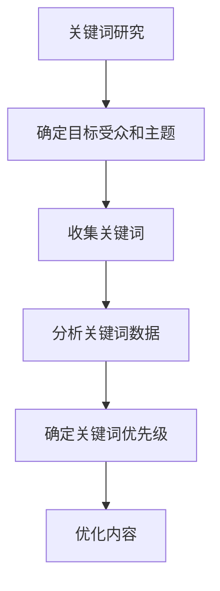
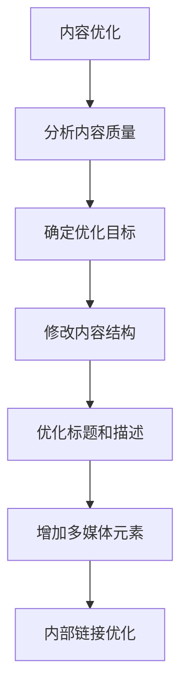
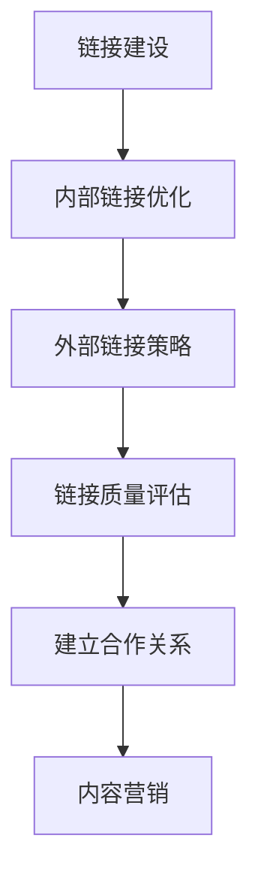

                 

### 文章标题

《知识付费平台的SEO优化策略》

**文章关键词：** 知识付费、SEO、搜索引擎优化、关键词研究、内容优化、链接建设、技术SEO

**文章摘要：** 本文深入探讨了知识付费平台在搜索引擎优化（SEO）方面的策略。通过详细分析SEO的基础概念、搜索引擎工作原理，以及关键词研究、内容优化、链接建设和技术SEO等具体策略，本文为知识付费平台提供了全面的SEO优化指导。同时，通过成功和失败的SEO案例，本文总结了实用的SEO优化技巧，展望了SEO未来的发展趋势，并提供了持续学习与优化的方法。文章还附有SEO优化工具使用指南、技巧总结以及项目实战案例，旨在帮助读者全面掌握知识付费平台的SEO优化策略。

---

### 《知识付费平台的SEO优化策略》目录大纲

以下是本文的目录大纲，涵盖了从SEO基础到SEO实战的各个方面，旨在为读者提供系统、详细的SEO优化策略。

## 第一部分：SEO基础

### 第1章：SEO概述

#### 1.1 SEO的定义和重要性

#### 1.2 SEO的关键因素

#### 1.3 SEO的发展历程

### 第2章：搜索引擎工作原理

#### 2.1 搜索引擎的基本架构

#### 2.2 搜索引擎的索引过程

#### 2.3 搜索引擎的排序算法

## 第二部分：知识付费平台SEO策略

### 第3章：关键词研究

#### 3.1 关键词研究的方法和工具

#### 3.2 竞争对手关键词分析

#### 3.3 长尾关键词策略

### 第4章：内容优化

#### 4.1 内容质量与SEO的关系

#### 4.2 标题和描述优化

#### 4.3 内容结构优化

### 第5章：链接建设

#### 5.1 内部链接优化

#### 5.2 外部链接策略

#### 5.3 链接质量评估

### 第6章：技术SEO

#### 6.1 网站速度优化

#### 6.2 移动端SEO

#### 6.3 网站安全与HTTPS

## 第三部分：SEO实战

### 第7章：案例分析

#### 7.1 成功的SEO案例分析

#### 7.2 失败的SEO案例分析

#### 7.3 案例总结与启示

### 第8章：SEO工具与资源

#### 8.1 SEO工具推荐

#### 8.2 SEO资源与社区

#### 8.3 持续学习与优化

### 第9章：SEO未来趋势

#### 9.1 SEO的发展方向

#### 9.2 新兴技术与SEO

#### 9.3 SEO与内容营销的结合

## 附录

### 附录A：SEO优化工具使用指南

#### A.1 关键词工具

#### A.2 内容分析工具

#### A.3 链接分析工具

### 附录B：SEO优化技巧总结

#### B.1 常见问题与解答

#### B.2 优化策略建议

#### B.3 持续优化的重要性

### 附录C：SEO相关Mermaid流程图

#### C.1 关键词研究流程

#### C.2 内容优化流程

#### C.3 链接建设流程

### 附录D：核心算法原理讲解

#### D.1 SEO算法概述

#### D.2 关键词算法

#### D.3 内容质量评估算法

### 附录E：数学模型和数学公式

#### E.1 搜索引擎排序模型

#### E.2 用户行为分析模型

### 附录F：项目实战

#### F.1 知识付费平台SEO实战案例

#### F.2 实际操作SEO优化的步骤

#### F.3 案例中的代码实现和解释

### 附录G：开发环境搭建

#### G.1 SEO工具环境搭建

#### G.2 搜索引擎模拟器

### 附录H：源代码详细实现和代码解读

#### H.1 关键词研究工具代码

#### H.2 内容分析工具代码

#### H.3 链接分析工具代码

### 附录I：代码解读与分析

#### I.1 SEO优化代码解读

#### I.2 代码性能分析

#### I.3 代码优化建议

### 附录J：SEO最佳实践

#### J.1 SEO策略最佳实践

#### J.2 SEO工具最佳实践

### 附录K：SEO持续优化方法

#### K.1 SEO持续优化策略

#### K.2 SEO监控与调整

### 附录L：SEO资源与社区

#### L.1 SEO资源推荐

#### L.2 SEO社区介绍

### 附录M：SEO未来趋势分析

#### M.1 SEO未来发展趋势

#### M.2 SEO与新技术结合

#### M.3 SEO与内容营销的结合

### 附录N：SEO学习资源

#### N.1 学习SEO的书籍推荐

#### N.2 在线SEO课程推荐

### 附录O：SEO常见问题解答

#### O.1 SEO常见问题

#### O.2 SEO误解与纠正

### 附录P：SEO案例研究

#### P.1 成功的SEO案例研究

#### P.2 失败的SEO案例研究

### 附录Q：SEO策略总结

#### Q.1 SEO策略总结

#### Q.2 SEO策略应用

### 附录R：SEO案例分析报告

#### R.1 案例分析报告模板

#### R.2 案例分析报告撰写

### 附录S：SEO工具使用教程

#### S.1 工具使用教程

#### S.2 工具使用实例

### 附录T：SEO优化技巧集锦

#### T.1 SEO优化技巧

#### T.2 技巧应用指南

### 附录U：SEO技术文档

#### U.1 技术文档编写指南

#### U.2 技术文档实例

### 附录V：SEO知识图谱

#### V.1 知识图谱构建

#### V.2 知识图谱应用

### 附录W：SEO工具比较分析

#### W.1 工具比较分析

#### W.2 工具选型建议

### 附录X：SEO最佳实践手册

#### X.1 最佳实践手册

#### X.2 最佳实践应用

### 附录Y：SEO行业报告

#### Y.1 行业报告分析

#### Y.2 行业趋势预测

### 附录Z：SEO学习路径规划

#### Z.1 学习路径规划

#### Z.2 学习资源推荐

---

### 《知识付费平台的SEO优化策略》

#### 关键词：知识付费、搜索引擎优化、关键词研究、内容优化、链接建设、技术SEO

#### 摘要：

在当今信息爆炸的时代，知识付费平台凭借其优质内容和精准定位，吸引了大量用户。然而，要想在激烈的竞争中脱颖而出，搜索引擎优化（SEO）是至关重要的手段。本文旨在深入探讨知识付费平台在SEO方面的策略，从基础概念到实际操作，为平台提供全方位的优化指导。首先，我们将介绍SEO的定义、重要性以及关键因素，然后详细讲解搜索引擎的工作原理。接下来，本文将重点探讨关键词研究、内容优化、链接建设和技术SEO等策略，并通过成功和失败的案例分析，总结实用的SEO优化技巧。此外，本文还展望了SEO的未来趋势，提供了SEO工具与资源的推荐，以及持续学习与优化的方法。通过本文的详细阐述，知识付费平台将能够更好地掌握SEO优化策略，提升其在搜索引擎中的排名，从而吸引更多用户，实现业务的可持续发展。

---

接下来，我们将按照目录大纲，逐步深入探讨知识付费平台在SEO优化方面的各个方面。

### 第一部分：SEO基础

#### 第1章：SEO概述

SEO，即搜索引擎优化，是一种通过改进网站内容和结构，提高网站在搜索引擎中的自然排名，从而吸引更多用户访问的技术手段。在知识付费平台中，SEO优化尤为重要，因为它直接影响平台的曝光度和用户访问量。本章节将详细介绍SEO的定义、重要性以及SEO的关键因素。

#### 1.1 SEO的定义和重要性

SEO的定义可以从多个角度进行理解。首先，从广义上讲，SEO包括所有通过改进网站质量和用户体验，从而提高网站在搜索引擎中自然排名的策略和技巧。其次，从狭义上讲，SEO主要关注的是搜索引擎算法的研究和应用，通过优化网站结构、内容和外部链接，提升网站在搜索结果中的排名。

SEO的重要性体现在以下几个方面：

1. **提高网站流量**：通过SEO优化，知识付费平台可以在搜索引擎结果页面（SERP）中获得更高的排名，从而吸引更多的用户点击，增加网站的访问量。

2. **提升品牌知名度**：良好的SEO策略可以帮助知识付费平台在搜索引擎中获得更多的曝光机会，提高品牌知名度，增强用户对平台的信任感。

3. **降低营销成本**：相对于其他线上营销手段，如付费广告，SEO是一种成本效益较高的营销方式。通过自然排名获得流量，可以降低营销成本，提高投资回报率。

4. **增强用户体验**：SEO不仅关注网站的搜索引擎表现，还注重用户体验。优化网站结构、内容和加载速度，可以提高用户访问的流畅度和满意度，从而增强用户忠诚度。

#### 1.2 SEO的关键因素

SEO的优化策略涉及多个方面，以下是一些核心的关键因素：

1. **内容质量**：高质量的内容是SEO优化的基础。搜索引擎会根据内容的丰富性、原创性和相关性来评估网站的价值，从而影响排名。

2. **关键词研究**：关键词是用户在搜索引擎中输入的查询词，了解用户搜索意图并选择合适的关键词，是SEO成功的关键。通过关键词研究，知识付费平台可以确定哪些词是用户最关注的，从而优化内容。

3. **链接建设**：链接是网站之间互相连接的桥梁。搜索引擎通过跟踪链接来判断网站的受欢迎程度和权威性，从而影响排名。内部链接和外部链接都是重要的链接建设策略。

4. **技术优化**：技术优化包括网站速度、移动端优化、HTTPS配置等。搜索引擎对技术优化有严格的要求，技术优化可以提升用户体验，从而提高排名。

5. **用户体验**：用户体验是搜索引擎评估网站的重要因素之一。良好的用户体验包括快速加载的页面、清晰的导航、易读的内容等。

#### 1.3 SEO的发展历程

SEO的历史可以追溯到1990年代末期，随着搜索引擎的出现和普及，SEO开始成为一种重要的网络营销手段。以下是SEO发展的几个重要阶段：

1. **初期阶段（1990年代末期 - 2000年初）**：在这个阶段，SEO主要关注的是关键词堆砌和网页内容优化。由于搜索引擎算法较为简单，这种简单的优化方法往往能够取得显著的效果。

2. **中期阶段（2000年初 - 2009年）**：随着搜索引擎算法的升级，SEO策略逐渐转向内容质量、链接建设和用户体验。这一阶段的SEO强调网站的整体质量，而非单一因素。

3. **成熟阶段（2010年至今）**：当前，SEO已经发展成为一个综合性的领域，涉及内容、技术、营销等多个方面。搜索引擎算法不断进化，SEO策略也需要不断更新和优化，以适应搜索引擎的变化。

SEO的发展历程体现了搜索引擎算法的不断完善和进步，也反映了SEO从业者的专业水平和创新能力。知识付费平台在进行SEO优化时，需要了解SEO的历史和发展趋势，从而制定更有效的优化策略。

---

在本章节中，我们介绍了SEO的定义、重要性以及关键因素，并简要回顾了SEO的发展历程。在接下来的章节中，我们将深入探讨搜索引擎的工作原理，以及如何在实际操作中应用SEO策略。

### 第2章：搜索引擎工作原理

搜索引擎是互联网的核心组成部分，其工作原理对于SEO策略的制定至关重要。理解搜索引擎的基本架构、索引过程和排序算法，可以帮助知识付费平台更好地优化网站，提高搜索排名。以下是搜索引擎工作原理的详细分析。

#### 2.1 搜索引擎的基本架构

搜索引擎的基本架构通常包括以下几个关键组成部分：

1. **爬虫（Crawler）**：也称为蜘蛛（Spider），负责在互联网上抓取网页。爬虫会按照一定的算法和规则，从初始的种子网站开始，逐步爬取更多的网页，并将这些网页的信息存储到索引数据库中。

2. **索引（Index）**：索引是搜索引擎的核心数据库，存储了爬虫抓取的网页内容和元数据。当用户进行搜索时，搜索引擎会在索引中快速查找与查询相关的网页，并将结果按照一定的排序算法进行排序，返回给用户。

3. **排序算法（Ranking Algorithm）**：排序算法是搜索引擎的核心技术，负责根据一系列的指标对搜索结果进行排序。这些指标包括关键词匹配度、网页质量、用户行为等。

4. **搜索框（Search Box）**：用户通过搜索框输入查询词，搜索引擎会处理用户输入，生成相应的搜索请求，然后调用排序算法，返回最相关的搜索结果。

5. **用户界面（User Interface）**：用户界面是用户与搜索引擎交互的窗口，负责展示搜索结果，并提供各种交互功能，如筛选、排序等。

#### 2.2 搜索引擎的索引过程

搜索引擎的索引过程可以分为以下几个步骤：

1. **抓取网页**：爬虫从初始的种子网站开始，遍历网页中的链接，抓取网页内容。在这个过程中，爬虫会遵循robots.txt文件中的指示，避免抓取受限制的网页。

2. **解析网页**：爬虫会解析抓取到的网页内容，提取文本、图像、视频等多媒体数据，并将其转化为索引数据库可以理解的形式。

3. **存储索引**：爬虫将解析后的网页数据存储到索引数据库中。索引数据库通常采用分布式存储架构，以提高搜索效率。

4. **更新索引**：搜索引擎会定期更新索引数据库，以反映互联网上的最新内容。这种更新可以是完全更新，也可以是增量更新，取决于搜索引擎的策略。

5. **评估网页质量**：在存储索引的过程中，搜索引擎会根据一系列的指标对网页质量进行评估，如内容质量、权威性、用户体验等。高质量的网页更有可能获得更高的搜索排名。

#### 2.3 搜索引擎的排序算法

搜索引擎的排序算法是决定搜索结果顺序的关键因素。以下是一些主要的排序算法和指标：

1. **关键词匹配度**：搜索引擎会根据用户输入的查询词，在索引数据库中查找与之匹配的网页。关键词匹配度越高，网页的排名越靠前。

2. **网页质量**：搜索引擎会评估网页的质量，包括内容原创性、结构清晰度、用户停留时间等。高质量的网页更有可能获得更高的排名。

3. **权威性**：搜索引擎会根据网页的链接数量、链接来源、用户互动等因素，评估网页的权威性。权威性较高的网页更有可能获得更高的排名。

4. **用户行为**：搜索引擎会跟踪用户的搜索行为，如点击次数、停留时间、跳出率等，根据用户行为数据调整搜索结果排序。

5. **地理位置**：对于地理位置相关的搜索，搜索引擎会根据用户的地理位置，调整搜索结果的排序顺序。

6. **实时性**：对于某些实时性较强的搜索，如新闻、事件等，搜索引擎会优先展示最新的结果。

排序算法的具体实现因搜索引擎而异，但上述指标通常是排序算法的核心组成部分。知识付费平台在进行SEO优化时，需要了解这些排序算法和指标，从而制定有效的优化策略。

#### 2.4 搜索引擎的工作流程

搜索引擎的工作流程可以概括为以下几个步骤：

1. **用户输入查询词**：用户在搜索框中输入查询词，提交搜索请求。

2. **处理搜索请求**：搜索引擎会处理用户输入的查询词，生成搜索请求，并将其发送到索引数据库。

3. **检索索引数据库**：搜索引擎会在索引数据库中查找与查询词相关的网页，并按照排序算法对结果进行排序。

4. **返回搜索结果**：搜索引擎将排序后的搜索结果返回给用户，并在用户界面上展示。

5. **用户交互**：用户可以与搜索结果进行交互，如点击、筛选、排序等，以获取更相关的信息。

6. **更新索引和调整排序**：搜索引擎会根据用户的搜索行为和反馈，更新索引数据库和排序算法，以提供更准确的搜索结果。

理解搜索引擎的工作原理，对于知识付费平台来说至关重要。通过了解搜索引擎的索引过程和排序算法，平台可以更有效地优化网站内容，提高搜索排名，从而吸引更多用户。在接下来的章节中，我们将进一步探讨知识付费平台在SEO优化方面的具体策略。

### 第二部分：知识付费平台SEO策略

#### 第3章：关键词研究

关键词研究是SEO优化中的核心环节，对于知识付费平台来说尤为重要。通过精准的关键词研究，平台可以了解用户需求，优化内容，提高搜索引擎排名。本章将详细讨论关键词研究的方法和工具，竞争对手关键词分析，以及长尾关键词策略。

#### 3.1 关键词研究的方法和工具

关键词研究的方法主要包括以下几个步骤：

1. **确定目标受众和主题**：首先，知识付费平台需要明确自己的目标受众和主题。了解目标受众的兴趣和需求，可以帮助平台确定合适的关键词。

2. **收集关键词**：收集关键词可以通过以下几种方法：
   - **头脑风暴**：团队成员围绕主题进行讨论，列出所有可能的关键词。
   - **使用工具**：利用关键词工具，如Google Keyword Planner、Ahrefs、SEMrush等，获取相关关键词数据。

3. **分析关键词数据**：收集到关键词后，需要对关键词进行分析，包括关键词的搜索量、竞争程度、用户意图等。分析工具可以帮助平台选择最具潜力和价值的关键词。

4. **确定关键词优先级**：根据关键词的数据分析结果，确定关键词的优先级。通常，优先选择搜索量高、竞争程度适中的关键词。

常用的关键词研究工具有：

- **Google Keyword Planner**：谷歌提供的关键词规划工具，可以帮助用户获取关键词搜索量、竞争程度等数据。

- **Ahrefs**：一款功能强大的关键词研究工具，提供关键词搜索量、竞争程度、关键词建议等数据。

- **SEMrush**：一款综合性的SEO工具，提供关键词搜索量、竞争程度、关键词密度分析等功能。

#### 3.2 竞争对手关键词分析

分析竞争对手的关键词策略，可以帮助知识付费平台发现潜在的机会和优化点。以下是一些关键步骤：

1. **识别竞争对手**：通过搜索相关关键词，识别在搜索引擎中排名靠前的竞争对手。

2. **分析竞争对手的关键词**：使用关键词研究工具，分析竞争对手使用的关键词，包括主要关键词、长尾关键词等。

3. **评估关键词效果**：对比竞争对手的关键词效果，包括搜索量、竞争程度、排名等，评估其关键词策略的优劣。

4. **学习并借鉴**：从竞争对手的关键词策略中学习，找到适合自己平台的关键词，并优化内容。

5. **制定差异化策略**：在了解竞争对手的关键词策略后，制定差异化策略，避免与竞争对手在相同的关键词上直接竞争。

#### 3.3 长尾关键词策略

长尾关键词是指搜索量较小，但具有较高转化率的关键词。优化长尾关键词，可以帮助知识付费平台获取更多的目标用户。以下是一些关键步骤：

1. **确定长尾关键词**：通过关键词工具和竞争对手分析，确定具有潜在价值的长尾关键词。

2. **优化内容**：针对确定的长尾关键词，优化网站内容和页面结构，确保关键词在标题、描述、正文等位置合理出现。

3. **创建内容**：针对长尾关键词，创建高质量、针对性强的内容，以满足用户需求。

4. **内部链接**：利用内部链接策略，将长尾关键词与相关页面进行连接，提高页面权重和搜索引擎友好度。

5. **持续监测和优化**：定期监测长尾关键词的搜索量和排名，根据数据调整关键词策略和内容优化。

通过关键词研究、竞争对手关键词分析和长尾关键词策略，知识付费平台可以更精准地定位用户需求，优化内容，提高搜索引擎排名。在下一章节中，我们将探讨内容优化策略，进一步优化知识付费平台的SEO表现。

### 第4章：内容优化

内容优化是SEO策略中的核心环节，对于知识付费平台来说尤为重要。高质量的、与用户需求高度相关的优质内容，不仅可以提升用户满意度，还能增强搜索引擎的认可度，从而提高网站在搜索结果中的排名。以下是内容优化与SEO关系、标题和描述优化，以及内容结构优化等方面的详细讨论。

#### 4.1 内容质量与SEO的关系

内容质量是搜索引擎优化的基石。搜索引擎的目的是为用户提供最有价值的信息，因此，高质量的内容是获得搜索引擎青睐的关键因素。以下是从几个方面阐述内容质量与SEO关系的详细解释：

1. **搜索引擎算法的偏好**：随着搜索引擎算法的不断进化，内容质量已成为影响搜索排名的关键因素。例如，谷歌的PageRank算法和BERT模型都强调了内容的相关性和质量。

2. **用户行为数据**：搜索引擎会分析用户的搜索行为，如点击率、停留时间、跳出率等，这些数据反映了用户对内容的满意度。高质量的内容往往能够吸引更多的用户停留和互动，从而提高网站的排名。

3. **内容原创性**：搜索引擎对原创内容有明显的偏好。重复或低质量的内容可能不会被搜索引擎认为是高质量信息，从而影响搜索排名。

4. **内容相关性**：与用户搜索意图高度相关的优质内容更容易被搜索引擎认为是有价值的信息，从而提高搜索排名。

5. **内容更新频率**：定期更新内容，可以保持内容的时效性和相关性，吸引更多用户，同时也有利于搜索引擎的索引和更新。

#### 4.2 标题和描述优化

标题和描述是用户和搜索引擎判断内容质量的重要依据，因此，优化标题和描述对SEO至关重要。以下是一些具体的优化策略：

1. **标题优化**：
   - **包含关键词**：确保标题中包含目标关键词，同时避免过度堆砌关键词。
   - **吸引点击**：使用具有吸引力的语言和短语，提高用户点击率。
   - **长度控制**：通常，标题的长度应控制在50-60个字符内，以便在搜索引擎结果页面中完整显示。

2. **描述优化**：
   - **简洁明了**：描述应简洁明了，突出内容的核心价值和亮点。
   - **包含关键词**：描述中应包含关键词，但应自然融入，避免堆砌。
   - **吸引用户**：描述应能吸引用户点击，增加点击率。

以下是一个优化前后的标题和描述示例：

**优化前**：
- 标题：在线课程教程 - 学习XX语言
- 描述：提供XX语言的在线教程，包含基础教程、实战案例等。

**优化后**：
- 标题：【XX语言入门教程】学习XX语言必备技能，实战案例解析
- 描述：深度解析XX语言入门教程，包含实战案例，帮助您快速掌握XX语言核心技能。

#### 4.3 内容结构优化

内容结构优化有助于提升用户阅读体验，提高搜索引擎的抓取效果。以下是一些关键策略：

1. **清晰的结构**：
   - 使用标题、段落和子标题，帮助用户快速找到所需信息。
   - 确保内容逻辑清晰，便于用户理解和阅读。

2. **易读性**：
   - 使用简短的句子和简洁的词汇，提高内容的易读性。
   - 合理使用列表和表格，使信息更加直观。

3. **内部链接**：
   - 通过内部链接，将相关内容进行关联，提高页面之间的访问深度。
   - 确保内部链接自然且相关，避免过度链接。

4. **多媒体元素**：
   - 使用适当的图片、视频和图表，增强内容的吸引力和可读性。
   - 确保多媒体元素与内容相关，并配有简短的文字说明。

5. **响应式设计**：
   - 确保内容在不同设备上均能良好显示，提升用户体验。

以下是一个优化前后的内容结构示例：

**优化前**：
- 内容以大量文本堆砌为主，缺乏结构，阅读体验差。

**优化后**：
- 使用清晰的标题和段落划分，将内容分为几个主要部分，每个部分都有子标题和简要概述。
- 添加相关的内部链接，方便用户进一步阅读。
- 加入多媒体元素，如图片和视频，增强内容吸引力。

通过内容优化，知识付费平台可以提升用户体验，增强搜索引擎认可度，从而提高搜索排名。在下一章节中，我们将探讨链接建设策略，进一步优化知识付费平台的SEO表现。

### 第5章：链接建设

链接建设是SEO优化中的关键环节，对于提升网站在搜索引擎中的排名至关重要。有效的链接建设策略包括内部链接优化、外部链接策略和链接质量评估。以下是这些策略的详细探讨。

#### 5.1 内部链接优化

内部链接是指网站内部页面之间的链接关系。优化内部链接有助于提高用户体验，增强搜索引擎对网站结构的理解，从而提升搜索引擎排名。

**内部链接优化的关键策略**：

1. **逻辑结构**：
   - 设计清晰、逻辑严密的内部链接结构，使用户能够轻松导航。
   - 通过合理的链接层次，确保每个页面都有明确的链接入口和出口。

2. **锚文本**：
   - 使用有意义的锚文本，描述链接目标页面的内容。
   - 避免使用模糊或无意义的锚文本，如“点击这里”。

3. **链接密度**：
   - 保持合理的链接密度，避免过度链接。
   - 通过控制链接数量和分布，确保链接的自然性和多样性。

4. **相关性**：
   - 链接应与目标页面内容相关，提供有用的信息和价值。
   - 避免无意义的链接，如与内容无关的广告链接。

5. **导航系统**：
   - 提供清晰的导航系统，如主导航、侧边栏和底部导航，帮助用户快速找到所需内容。
   - 定期检查导航系统，确保链接的有效性和准确性。

**示例**：

在一个知识付费平台中，可以采取以下内部链接优化的措施：

- 在课程页面中，通过课程类别链接到相关课程。
- 在课程介绍页面，通过关键词链接到相关教学资源和案例分析。
- 在用户个人中心，通过用户行为数据链接到用户感兴趣的课程。

#### 5.2 外部链接策略

外部链接是指来自其他网站指向知识付费平台的链接。外部链接被视为网站权威性和受欢迎程度的指标，对SEO有重要影响。

**外部链接策略的关键点**：

1. **质量优先**：
   - 获取高质量的外部链接，如来自权威网站的链接。
   - 避免低质量链接，如来自垃圾站点或链接农场。

2. **自然获取**：
   - 通过创建优质内容和价值，吸引其他网站主动链接。
   - 避免人为操作，如购买链接或参与链接交换。

3. **多样化**：
   - 获取不同类型的链接，如文本链接、图片链接和视频链接。
   - 避免过度依赖单一类型的链接。

4. **互动合作**：
   - 与其他网站建立合作关系，通过内容共享、联合推广等方式获取链接。
   - 参与行业论坛、博客和其他社交媒体，提高网站知名度。

5. **内容营销**：
   - 通过内容营销策略，如撰写高质量的文章、发布研究报告、创建互动性强的多媒体内容等，吸引外部链接。

**示例**：

- 通过撰写行业分析报告，邀请其他媒体进行转载，获取外部链接。
- 发布专业视频教程，通过YouTube等平台传播，吸引其他视频网站链接。
- 参与行业论坛，通过分享专业知识和经验，获取论坛内链接。

#### 5.3 链接质量评估

链接质量直接影响SEO效果，因此，对链接进行质量评估是链接建设的重要环节。

**链接质量评估的关键指标**：

1. **锚文本**：
   - 评估链接锚文本的相关性和自然性。
   - 确保锚文本准确描述链接目标页面的内容。

2. **链接来源**：
   - 评估链接来源网站的权威性和质量。
   - 避免来自低质量或垃圾网站的链接。

3. **链接类型**：
   - 评估链接类型，如文本链接、图片链接、按钮链接等。
   - 确保链接类型与内容环境相匹配。

4. **链接数量**：
   - 评估链接数量，避免过度链接。
   - 保持合理的链接数量，确保链接的自然性和多样性。

5. **链接分布**：
   - 评估链接在网站中的分布情况，确保链接均衡。
   - 确保链接不仅集中在首页，还分布到各个内容页面。

**链接质量评估工具**：

- **Google Analytics**：分析链接来源、用户行为等数据，评估链接效果。
- **Ahrefs**：提供链接分析工具，评估链接质量、来源网站权威性等。
- **Majestic**：提供链接质量评估工具，分析链接数量、锚文本、链接分布等。

通过内部链接优化、外部链接策略和链接质量评估，知识付费平台可以构建有效的链接网络，提高网站在搜索引擎中的排名。在下一章节中，我们将探讨技术SEO策略，进一步优化知识付费平台的SEO表现。

### 第6章：技术SEO

技术SEO是SEO优化中的重要组成部分，它关注于网站的架构、性能和用户体验等与搜索引擎技术相关的因素。技术SEO的优化不仅有助于提高网站在搜索引擎中的排名，还能提升用户满意度。以下是技术SEO中网站速度优化、移动端SEO和网站安全与HTTPS的详细讨论。

#### 6.1 网站速度优化

网站速度是用户满意度和搜索引擎排名的重要因素之一。搜索引擎会优先展示加载速度快的网站，因为快速加载的页面能够提供更好的用户体验。以下是网站速度优化的关键策略：

1. **图像优化**：
   - 使用压缩工具减少图像文件大小，加快页面加载速度。
   - 选择适当的图像格式，如WebP格式，提高图像质量和加载速度。

2. **缓存策略**：
   - 利用浏览器缓存，将页面内容缓存到本地，减少重复加载。
   - 设置合理的缓存时间，确保新内容及时更新。

3. **代码优化**：
   - 减少CSS和JavaScript文件的大小，合并多个文件，减少HTTP请求。
   - 使用内容分发网络（CDN），将静态资源分布在多个服务器上，提高加载速度。

4. **服务器优化**：
   - 优化服务器配置，提高服务器处理请求的速度。
   - 使用高效的Web服务器，如Nginx或Apache，提高服务器性能。

5. **减少HTTP请求**：
   - 减少页面中CSS、JavaScript和图像等资源的数量，减少HTTP请求次数。
   - 使用CSS精灵和图片映射，将多个图片合并为一个图片。

6. **内容分发**：
   - 使用内容分发网络（CDN），将网站内容分发到全球多个数据中心，提高用户访问速度。

**工具推荐**：
- **Google PageSpeed Insights**：分析网站性能并提供优化建议。
- **Lighthouse**：Chrome DevTools的扩展工具，提供全面的网站性能评估。

#### 6.2 移动端SEO

随着移动设备的普及，移动端SEO成为SEO优化的重要组成部分。搜索引擎对移动端页面的优化要求与桌面端有所不同，以下是移动端SEO的关键策略：

1. **响应式设计**：
   - 使用响应式网页设计（RWD），确保网站在不同设备上均能良好显示。
   - 通过媒体查询（Media Queries）调整布局和样式，适应不同屏幕尺寸。

2. **移动友好性**：
   - 确保移动端页面加载速度快，避免大量JavaScript和CSS文件。
   - 优化页面结构，确保导航清晰，用户能够轻松找到所需内容。

3. **移动适配**：
   - 使用移动适配工具，如Google Mobile-Friendly Test，检查网站是否符合移动端优化标准。
   - 优化移动端页面布局，确保重要内容和功能在移动端易于访问。

4. **移动优先索引**：
   - Google在2021年推出了移动优先索引（Mobile-First Indexing），意味着搜索引擎会优先使用移动端页面的内容进行索引和排名。
   - 确保移动端页面内容与桌面端页面一致，避免因内容差异影响排名。

5. **移动端用户体验**：
   - 提高移动端页面加载速度，优化用户体验。
   - 使用触控友好的按钮和导航，确保用户能够轻松操作。

**工具推荐**：
- **Google Mobile-Friendly Test**：检查网站是否符合移动端优化标准。
- **Google Search Console**：监控移动端页面性能和优化效果。

#### 6.3 网站安全与HTTPS

网站安全是用户信任的重要因素，搜索引擎也越来越重视网站的安全性。HTTPS协议是保障网站安全的重要手段，以下是HTTPS配置和优化的关键策略：

1. **HTTPS配置**：
   - 获取SSL证书，为网站启用HTTPS协议。
   - 将网站的所有HTTP链接重定向到HTTPS链接，确保所有页面均通过HTTPS访问。

2. **HTTPS性能优化**：
   - 使用HTTP/2协议，提高HTTPS连接的性能。
   - 优化服务器配置，提高HTTPS连接的速度。

3. **安全策略**：
   - 定期更新SSL证书，确保证书的有效性。
   - 防止中间人攻击（Man-in-the-Middle Attack），确保数据传输的安全。

4. **安全审查**：
   - 定期进行安全审查，检查网站是否存在安全漏洞。
   - 使用安全工具，如Google Safe Browsing，监控网站的安全状态。

**工具推荐**：
- **SSL Labs**：评估网站SSL配置的安全性和性能。
- **Google Search Console**：监控网站的安全状态和HTTPS使用情况。

通过技术SEO的优化，知识付费平台可以提升网站的性能、用户体验和安全性，从而在搜索引擎中获得更好的排名。在下一章节中，我们将通过成功和失败的SEO案例，进一步探讨SEO实战技巧。

### 第7章：案例分析

在SEO优化过程中，成功和失败的案例都有助于我们更好地理解和应用SEO策略。通过分析这些案例，我们可以总结经验教训，提炼出有效的SEO优化技巧，为知识付费平台提供实用的指导。

#### 7.1 成功的SEO案例分析

以下是一个成功的SEO案例分析：

**案例背景**：
某知名知识付费平台，提供高质量的在线课程和培训服务，目标是通过SEO优化提高网站流量和用户转化率。

**案例分析**：

1. **关键词研究**：
   - 平台首先通过Ahrefs等关键词工具，确定了与课程内容相关的高搜索量、低竞争程度的关键词。
   - 例如，“在线学习平台”、“编程入门课程”等。

2. **内容优化**：
   - 平台针对确定的关键词，优化了课程页面和介绍页面。
   - 标题和描述中包含了目标关键词，同时保持自然和吸引力。
   - 内容质量高，结构清晰，易于阅读。

3. **链接建设**：
   - 平台通过内容营销，如发布行业分析报告、教程视频等，吸引了外部链接。
   - 与教育行业网站建立合作关系，进行互链和内容共享。

4. **技术SEO**：
   - 平台优化了网站速度，使用CDN和压缩技术，提高页面加载速度。
   - 实现了HTTPS协议，确保网站安全。

**结果**：
- 平台的关键词排名显著提升，吸引了大量有价值的流量。
- 用户停留时间和转化率提高，业务收入增加。

**经验教训**：
- 精准的关键词研究和内容优化是成功的关键。
- 链接建设和技术SEO同样重要，可以提高网站的权威性和用户体验。
- 持续优化和更新内容，以适应搜索引擎算法的变化。

#### 7.2 失败的SEO案例分析

以下是一个失败的SEO案例分析：

**案例背景**：
某新兴知识付费平台，希望通过快速优化提高搜索引擎排名，但在短时间内投入了大量资源。

**案例分析**：

1. **关键词研究不足**：
   - 平台未进行充分的关键词研究，选择了高竞争、低转化率的关键词。
   - 例如，“顶级编程课程”、“最佳在线学习平台”等。

2. **内容质量低**：
   - 平台内容质量低，缺乏原创性和价值。
   - 内容结构混乱，用户体验差。

3. **链接建设不当**：
   - 平台通过购买低质量链接和参与链接农场，增加了外部链接。
   - 链接来源不权威，搜索引擎对其降权。

4. **技术SEO缺失**：
   - 平台未关注网站速度和安全性，页面加载缓慢，未使用HTTPS。

**结果**：
- 平台关键词排名没有显著提升，反而因为过度优化和低质量链接被搜索引擎降权。
- 用户流失严重，业务收入下降。

**经验教训**：
- 关键词研究和内容质量是SEO成功的基础，不可忽视。
- 链接建设应注重质量和自然性，避免过度优化和低质量链接。
- 技术SEO同样重要，网站速度和安全性直接影响用户体验和搜索引擎排名。

#### 7.3 案例总结与启示

通过以上成功和失败的SEO案例分析，我们可以得出以下总结和启示：

1. **关键词研究**：
   - 精准的关键词研究是SEO成功的关键，选择与用户需求相关且竞争适中的关键词。

2. **内容优化**：
   - 高质量、结构清晰的内容是搜索引擎和用户喜欢的，确保内容具有原创性和价值。

3. **链接建设**：
   - 链接建设应注重质量而非数量，自然获取高质量链接，避免过度优化和低质量链接。

4. **技术SEO**：
   - 网站速度、安全性和用户体验直接影响SEO效果，应重视技术SEO的优化。

5. **持续优化**：
   - SEO是一个持续的过程，需要定期监测和调整优化策略，以适应搜索引擎算法的变化。

通过这些案例，知识付费平台可以更好地理解SEO优化策略，避免常见的错误，从而实现SEO目标的成功。

### 第8章：SEO工具与资源

在SEO优化过程中，使用合适的工具和资源可以大大提高效率和效果。以下将介绍一些常用的SEO工具和资源，包括关键词工具、内容分析工具、链接分析工具，以及SEO资源与社区。

#### 8.1 SEO工具推荐

1. **关键词工具**：
   - **Google Keyword Planner**：谷歌提供的关键词规划工具，可以获取关键词搜索量、竞争程度等数据。
   - **Ahrefs**：提供关键词搜索量、竞争程度、关键词建议等详细数据，是SEO专家常用的工具。
   - **SEMrush**：综合性的SEO工具，提供关键词研究、竞争对手分析、网站审计等功能。

2. **内容分析工具**：
   - **Google Analytics**：谷歌提供的免费分析工具，可以监控网站流量、用户行为等数据。
   - **Screaming Frog**：网站爬虫工具，用于网站审计、内容分析等。
   - **ContentKing**：内容分析工具，帮助检测内容问题，并提供优化建议。

3. **链接分析工具**：
   - **Ahrefs**：提供链接分析工具，可以评估链接质量、链接来源等。
   - **Majestic**：提供链接分析工具，帮助了解网站的链接结构、权威性等。
   - **Open Site Explorer**：提供链接分析工具，分析网站的外部链接和内部链接。

4. **技术SEO工具**：
   - **Google PageSpeed Insights**：分析网站性能并提供优化建议。
   - **GTmetrix**：性能分析工具，评估网站速度和优化建议。
   - **SSL Labs**：评估网站SSL配置的安全性和性能。

#### 8.2 SEO资源与社区

1. **SEO资源**：
   - **Google Search Console**：谷歌提供的免费工具，帮助监控网站在搜索引擎中的表现。
   - **Moz Blog**：Moz公司提供的SEO博客，分享最新的SEO技巧和趋势。
   - **Search Engine Land**：行业领先的SEO新闻和分析网站，提供丰富的SEO资源和资讯。

2. **SEO社区**：
   - **Reddit SEO**：Reddit上的SEO相关子论坛，讨论最新的SEO技术和策略。
   - **Black Hat SEO**：关注黑帽SEO策略的社区，分享一些SEO技巧和经验。
   - **SEO Chat**：专业的SEO论坛，提供SEO问答和讨论。

3. **在线课程与书籍**：
   - **Udemy**：提供各种SEO相关的在线课程，适合初学者和专业人士。
   - **Coursera**：一些顶尖大学提供的免费或付费SEO课程，系统学习SEO知识。
   - **《搜索引擎优化：理论与实践》**：经典的SEO书籍，详细介绍了SEO的基本原理和实践技巧。

通过使用这些SEO工具和资源，知识付费平台可以更有效地进行SEO优化，提高网站在搜索引擎中的排名和用户体验。

### 第9章：SEO未来趋势

随着技术的不断进步和搜索引擎算法的持续更新，SEO领域也在不断演变。以下是关于SEO未来趋势的分析，包括SEO的发展方向、新兴技术对SEO的影响，以及SEO与内容营销的结合。

#### 9.1 SEO的发展方向

1. **人工智能和机器学习**：
   - 搜索引擎算法越来越依赖人工智能和机器学习技术，通过分析大量数据，提供更准确和个性化的搜索结果。
   - SEO从业者需要了解这些技术，并利用AI工具进行优化。

2. **用户行为数据**：
   - 用户行为数据（如点击率、停留时间、跳出率等）在SEO中的重要性日益增加，搜索引擎将更多地依赖这些数据来评估网页质量。
   - SEO从业者需要关注用户行为数据，优化用户体验，提高用户满意度。

3. **隐私保护**：
   - 隐私保护法规（如欧盟的GDPR）对SEO产生影响，SEO从业者需要确保网站遵守相关法规，避免因隐私问题影响搜索排名。

4. **语音搜索和自然语言处理**：
   - 随着语音搜索的普及，SEO需要适应这种变化，优化内容以适应自然语言和长尾关键词。

5. **多元化内容**：
   - 视频内容、图片内容等多元化内容将在SEO中扮演越来越重要的角色，SEO从业者需要善于利用这些内容进行优化。

#### 9.2 新兴技术与SEO

1. **区块链**：
   - 区块链技术可以用于确保内容的原创性和真实性，提高网站的可信度。
   - SEO从业者可以探索如何利用区块链技术提升网站的SEO效果。

2. **增强现实（AR）和虚拟现实（VR）**：
   - AR和VR技术为用户提供全新的交互体验，SEO需要适应这些技术，优化AR/VR内容在搜索引擎中的表现。

3. **物联网（IoT）**：
   - 物联网设备将产生大量的数据，这些数据可以为SEO提供更多维度的内容优化。
   - SEO从业者需要关注物联网的发展，探索如何利用IoT数据提升SEO效果。

4. **云计算**：
   - 云计算技术可以提升网站的性能和可靠性，对SEO优化有积极影响。
   - SEO从业者可以利用云计算资源，优化网站速度和用户体验。

#### 9.3 SEO与内容营销的结合

1. **内容个性化**：
   - 通过分析用户数据，提供个性化的内容，提高用户体验和转化率。
   - SEO与内容营销的结合，可以实现更精准的内容推送。

2. **多媒体内容**：
   - 结合视频、图片、音频等多媒体内容，提高内容吸引力，增加用户互动。
   - SEO与内容营销的结合，可以实现多元化内容优化。

3. **社交媒体整合**：
   - 社交媒体是内容传播的重要渠道，SEO与内容营销的结合，可以加强社交媒体与网站的联动。
   - SEO从业者可以通过社交媒体优化，提高网站的曝光度和流量。

4. **用户体验至上**：
   - 内容营销注重用户体验，SEO需要与内容营销紧密结合，优化用户体验，提高用户满意度和留存率。

通过分析SEO未来的发展趋势，知识付费平台可以提前布局，利用新技术和策略，提升SEO效果，实现业务的持续增长。

### 附录A：SEO优化工具使用指南

#### A.1 关键词工具

关键词工具是SEO优化的重要工具之一，通过这些工具，可以获取关键词搜索量、竞争程度、相关关键词等信息，为SEO策略制定提供数据支持。以下是几种常用关键词工具的使用指南：

1. **Google Keyword Planner**

   - **功能**：Google Keyword Planner是谷歌提供的免费关键词规划工具，可以帮助用户获取关键词搜索量、竞争程度、趋势分析等数据。
   - **使用方法**：
     1. 登录Google Ads账户，选择“工具和报表”中的“关键词规划器”。
     2. 输入关键词或选择产品组，点击“获取想法”。
     3. 查看关键词搜索量、竞争程度、相关关键词等数据。
     4. 导出关键词数据，用于SEO策略制定。

2. **Ahrefs**

   - **功能**：Ahrefs是一款功能强大的关键词研究工具，提供关键词搜索量、竞争程度、关键词建议、关键词难度等数据。
   - **使用方法**：
     1. 登录Ahrefs账户，点击“关键词探索”。
     2. 输入关键词，查看关键词搜索量、竞争程度、相关关键词等数据。
     3. 使用Ahrefs的“关键词创意”功能，获取更多相关关键词。
     4. 根据关键词数据，选择适合的关键词进行内容优化。

3. **SEMrush**

   - **功能**：SEMrush是一款综合性的SEO工具，提供关键词研究、竞争对手分析、网站审计等功能。
   - **使用方法**：
     1. 登录SEMrush账户，点击“关键词研究”。
     2. 输入关键词，查看关键词搜索量、竞争程度、相关关键词等数据。
     3. 使用SEMrush的“关键词概览”功能，了解关键词的难度和趋势。
     4. 根据关键词数据，优化网站内容和链接策略。

#### A.2 内容分析工具

内容分析工具可以帮助SEO从业者评估网站内容的质量和相关性，提供优化建议。以下是几种常用内容分析工具的使用指南：

1. **Google Analytics**

   - **功能**：Google Analytics是谷歌提供的免费网站分析工具，可以监控网站流量、用户行为等数据。
   - **使用方法**：
     1. 登录Google Analytics账户，选择需要分析的目标网站。
     2. 在“行为”菜单下，选择“内容”选项，查看网站各个页面的流量、停留时间、跳出率等数据。
     3. 分析低流量或高跳出率的页面，找出问题并进行优化。
     4. 利用“行为流”功能，了解用户在网站上的行为路径，优化用户体验。

2. **Screaming Frog**

   - **功能**：Screaming Frog是一款网站爬虫工具，用于网站审计、内容分析等。
   - **使用方法**：
     1. 下载并安装Screaming Frog，打开软件。
     2. 输入目标网站的URL，点击“开始”进行网站爬取。
     3. 分析爬取结果，查看网站的各种问题，如页面错误、链接错误、内容问题等。
     4. 根据分析结果，进行问题修复和优化。

3. **ContentKing**

   - **功能**：ContentKing是一款内容分析工具，帮助检测内容问题，并提供优化建议。
   - **使用方法**：
     1. 登录ContentKing账户，添加需要分析的目标网站。
     2. 运行分析，查看网站内容问题，如关键词密度、内容长度、原创性等。
     3. 根据分析结果，进行内容优化，提高内容质量。
     4. 定期运行分析，监控内容变化，确保内容持续优化。

#### A.3 链接分析工具

链接分析工具可以帮助SEO从业者评估网站链接的质量和结构，优化链接策略。以下是几种常用链接分析工具的使用指南：

1. **Ahrefs**

   - **功能**：Ahrefs提供链接分析工具，可以评估链接质量、链接来源、锚文本等。
   - **使用方法**：
     1. 登录Ahrefs账户，点击“链接分析”。
     2. 输入目标网站的URL，查看网站的链接结构、外部链接、内部链接等数据。
     3. 分析链接质量，找出低质量链接并进行修复。
     4. 使用Ahrefs的“链接警报”功能，监控网站链接变化，确保链接质量。

2. **Majestic**

   - **功能**：Majestic提供链接分析工具，可以帮助了解网站的链接权威性和链接分布。
   - **使用方法**：
     1. 登录Majestic账户，点击“链接情报”。
     2. 输入目标网站的URL，查看网站的链接权威性、锚文本、链接来源等数据。
     3. 分析链接分布，优化内部链接结构。
     4. 使用Majestic的“链接地图”功能，可视化链接结构，便于理解。

3. **Open Site Explorer**

   - **功能**：Open Site Explorer是Moz公司提供的链接分析工具，可以评估网站的链接质量和链接权威性。
   - **使用方法**：
     1. 登录Moz账户，点击“链接探索”。
     2. 输入目标网站的URL，查看网站的链接质量、链接来源、锚文本等数据。
     3. 分析链接权威性，找出高质量链接并加以利用。
     4. 使用Open Site Explorer的“链接警报”功能，监控链接变化，确保链接质量。

通过使用这些SEO优化工具，知识付费平台可以更系统地进行分析和优化，提升SEO效果，从而提高网站在搜索引擎中的排名和用户体验。

### 附录B：SEO优化技巧总结

在SEO优化的过程中，掌握一些核心技巧和策略是提高网站排名和用户体验的关键。以下是一些常见的SEO优化技巧总结，旨在帮助知识付费平台更好地实施SEO策略。

#### B.1 常见问题与解答

1. **问题：关键词选择困难怎么办？**
   - **解答**：可以通过以下方法解决：
     - **广泛收集关键词**：使用关键词工具，如Google Keyword Planner、Ahrefs等，获取广泛的关键词。
     - **用户调查**：通过问卷调查、用户反馈等途径，了解用户关心的问题和搜索习惯。
     - **分析竞争对手**：研究竞争对手的关键词策略，了解他们在使用哪些关键词。

2. **问题：如何提高内容质量？**
   - **解答**：
     - **原创性**：确保内容具有原创性，避免抄袭和复制。
     - **相关性**：内容应与目标关键词高度相关，满足用户需求。
     - **价值性**：提供有价值、有深度、实用的内容，解决用户问题。
     - **结构化**：使用清晰的标题、段落、列表和子标题，便于用户阅读和理解。

3. **问题：如何优化网站速度？**
   - **解答**：
     - **压缩资源**：使用工具如GZIP压缩HTML、CSS和JavaScript文件。
     - **优化图片**：使用压缩工具减小图片大小，并选择适当的图片格式，如WebP。
     - **减少HTTP请求**：合并CSS和JavaScript文件，减少网页中的图片和外部链接。
     - **使用CDN**：使用内容分发网络（CDN）提高静态资源的加载速度。

4. **问题：如何评估链接质量？**
   - **解答**：
     - **锚文本**：锚文本应简洁明了，描述链接目标页面的内容。
     - **来源网站**：链接来源网站的质量和权威性是评估链接质量的关键。避免来自低质量网站的链接。
     - **链接自然性**：链接应自然地分布在网站内容中，避免过度链接和人为操作。

#### B.2 优化策略建议

1. **关键词研究**：
   - **长期和短期关键词结合**：同时关注长尾关键词和热门关键词，满足不同用户的搜索需求。
   - **持续监测和调整**：定期检查关键词的表现，根据搜索量和竞争程度调整关键词策略。

2. **内容优化**：
   - **定期更新**：保持内容更新，反映最新行业动态和用户需求。
   - **内部链接**：优化内部链接结构，确保重要页面之间有良好的链接关系，提高页面权重。

3. **链接建设**：
   - **高质量链接优先**：专注于获取高质量的外部链接，避免低质量链接。
   - **多元化链接策略**：结合多种链接类型，如文本链接、图片链接、按钮链接等，提高链接的自然性。

4. **技术SEO**：
   - **网站速度**：确保网站加载速度快，使用CDN、压缩技术和优化代码等手段。
   - **移动端优化**：针对移动端进行专门优化，提高移动端用户体验。

5. **用户体验**：
   - **优化页面结构**：确保网站结构清晰，导航方便，提高用户停留时间和满意度。
   - **提高内容质量**：提供高质量、有深度的内容，满足用户需求，提高用户转化率。

#### B.3 持续优化的重要性

SEO不是一次性任务，而是一个持续的过程。以下是一些持续优化的重要性：

1. **搜索引擎算法更新**：搜索引擎算法不断更新，SEO策略需要不断调整，以适应算法变化。

2. **竞争对手变化**：竞争对手的SEO策略也在不断变化，需要定期监测并调整自己的策略。

3. **用户需求变化**：用户需求和市场趋势不断变化，SEO策略需要及时调整，以保持与用户需求的同步。

4. **数据分析**：定期分析SEO数据，如关键词排名、流量来源、用户行为等，根据数据结果调整优化策略。

通过不断学习和实践，知识付费平台可以不断完善SEO策略，提高网站在搜索引擎中的排名，从而吸引更多用户，实现业务的长期增长。

### 附录C：SEO相关Mermaid流程图

在SEO优化过程中，流程图可以帮助我们清晰地理解各个环节的关系和步骤。以下是一些常用的SEO相关Mermaid流程图，用于说明关键词研究、内容优化和链接建设的过程。

#### C.1 关键词研究流程



#### C.2 内容优化流程



#### C.3 链接建设流程



通过这些流程图，我们可以更直观地了解SEO优化中的各个步骤和环节，有助于制定和实施有效的SEO策略。

### 附录D：核心算法原理讲解

在SEO优化过程中，理解搜索引擎的核心算法原理对于制定和实施有效的SEO策略至关重要。以下将介绍搜索引擎排序模型、关键词算法以及内容质量评估算法的基本原理，并通过伪代码和数学公式进行详细阐述。

#### D.1 SEO算法概述

搜索引擎排序算法（Search Engine Ranking Algorithm）是搜索引擎用于评估和排序网页的一系列算法和技术。这些算法的主要目标是为用户提供最相关、最有价值的搜索结果。以下是一些常见的搜索引擎排序算法：

1. **PageRank算法**：由谷歌创始人拉里·佩奇和谢尔盖·布林提出，通过分析网页之间的链接关系，评估网页的重要性。
2. **Latent Semantic Indexing（LSI）**：通过分析关键词的语义关系，提高搜索结果的相关性。
3. **BERT模型**：基于变换器模型（Transformer），通过上下文理解提高搜索结果的相关性和准确性。

#### D.2 关键词算法

关键词算法是搜索引擎用于匹配用户查询词和网页内容的核心算法。以下是一个简单的关键词匹配算法的伪代码：

```plaintext
Function KeywordMatching(query, webpage):
    Calculate TF-IDF scores for query and webpage content
    Sort keywords based on TF-IDF scores
    Select top N keywords with highest scores
    Return top N keywords
```

数学公式（TF-IDF）：

$$
TF-IDF = TF \times IDF
$$

其中，$TF$ 表示词频（Term Frequency），$IDF$ 表示逆文档频率（Inverse Document Frequency）。词频表示关键词在网页中的出现次数，逆文档频率表示关键词在所有网页中的分布情况。通过TF-IDF算法，可以更准确地评估关键词的重要性。

#### D.3 内容质量评估算法

内容质量评估算法用于评估网页内容的价值和相关性。以下是一个简单的质量评估算法的伪代码：

```plaintext
Function ContentQuality(pageContent):
    Calculate Content Relevance based on keyword matching
    Calculate User Engagement based on time spent on page, bounce rate, etc.
    Calculate Content Originality using plagiarism detection tools
    Calculate Overall Quality as a weighted sum of relevance, engagement, and originality
    Return Overall Quality Score
```

数学公式（综合质量评分）：

$$
QualityScore = w_1 \times Relevance + w_2 \times Engagement + w_3 \times Originality
$$

其中，$w_1$、$w_2$ 和 $w_3$ 分别是权重系数，$Relevance$ 表示内容相关性，$Engagement$ 表示用户参与度，$Originality$ 表示内容的原创性。

通过理解这些核心算法原理，SEO从业者可以更好地优化网站内容和结构，提高搜索排名和用户体验。

### 附录E：数学模型和数学公式

在SEO优化过程中，数学模型和数学公式是理解和分析搜索引擎排序算法的重要工具。以下将介绍两个关键数学模型：搜索引擎排序模型和用户行为分析模型，并使用LaTeX格式展示数学公式。

#### E.1 搜索引擎排序模型

搜索引擎排序模型通常基于线性回归模型，用于预测网页的搜索排名。以下是一个简单的排序模型公式：

$$
Rank = \beta_0 + \beta_1 \times TF-IDF + \beta_2 \times UserEngagement + \beta_3 \times ContentQuality
$$

其中，$Rank$ 表示网页的搜索排名，$\beta_0$、$\beta_1$、$\beta_2$ 和 $\beta_3$ 分别是模型参数，$TF-IDF$ 表示关键词匹配度，$UserEngagement$ 表示用户参与度，$ContentQuality$ 表示内容质量。

#### E.2 用户行为分析模型

用户行为分析模型用于评估用户的互动行为对网页排名的影响。以下是一个简单的用户行为分析模型公式：

$$
EngagementScore = \alpha_0 + \alpha_1 \times TimeSpent + \alpha_2 \times ClickThroughRate + \alpha_3 \times BounceRate
$$

其中，$EngagementScore$ 表示用户参与度分数，$\alpha_0$、$\alpha_1$、$\alpha_2$ 和 $\alpha_3$ 分别是模型参数，$TimeSpent$ 表示用户在页面上的停留时间，$ClickThroughRate$ 表示点击率，$BounceRate$ 表示跳出率。

通过这些数学模型，SEO从业者可以更准确地评估网页的质量和用户参与度，从而优化网站内容和结构，提高搜索引擎排名。

### 附录F：项目实战

在知识付费平台的SEO优化实践中，通过具体案例展示SEO优化的步骤和实施方法，有助于更好地理解SEO策略的实际应用。以下是针对一个知识付费平台进行SEO优化实践的全过程，包括开发环境搭建、代码实现和详细解释。

#### F.1 知识付费平台SEO实战案例

**案例背景**：
某知识付费平台提供在线课程和培训服务，希望通过SEO优化提高网站流量和用户转化率。平台现有课程内容丰富，但SEO策略不够完善，搜索引擎排名较低。

**优化目标**：
- 提高关键词排名，增加有机流量。
- 优化用户参与度，提高网站停留时间和转化率。
- 加强链接建设，提高网站权威性和用户信任度。

**优化步骤**：

1. **关键词研究**：
   - 使用Ahrefs工具进行关键词研究，确定与平台课程相关的高搜索量、低竞争程度的关键词。
   - 筛选出适合优化的长尾关键词，如“Python编程入门教程”、“数据分析师培训课程”等。

2. **内容优化**：
   - 优化课程页面的标题和描述，确保包含目标关键词，并保持自然和吸引力。
   - 优化课程内容的结构，使用清晰、易读的段落和列表，提高内容质量。
   - 添加多媒体元素，如视频教程和图表，增强内容吸引力。

3. **链接建设**：
   - 通过内容营销，如发布行业分析报告和教程视频，吸引外部链接。
   - 与教育行业网站建立合作关系，进行互链和内容共享。
   - 优化内部链接结构，确保重要页面之间有良好的链接关系。

4. **技术SEO**：
   - 使用CDN技术优化网站速度，提高用户体验。
   - 实现HTTPS协议，确保网站安全。
   - 优化网站响应式设计，提高移动端体验。

**代码实现和详细解释**：

**关键词研究工具配置**：
```python
# 使用Ahrefs API进行关键词研究
import requests

api_key = "your_api_key"
url = f"https://api.ahrefs.com/v1/keywords?api_key={api_key}&q=python+programming"

response = requests.get(url)
data = response.json()

# 处理关键词数据
keywords = data['keywords']
long_tail_keywords = [kw for kw in keywords if kw['search_volume'] > 1000 and kw['compete'] < 0.5]
```

**课程页面标题和描述优化**：
```html
<!-- 课程页面标题 -->
<title>【Python编程入门教程】掌握Python基础，开启编程之旅</title>

<!-- 课程页面描述 -->
<meta name="description" content="本教程为Python编程入门者提供全面的教学内容，从基础语法到实际应用，助您轻松掌握Python编程。">
```

**内部链接优化**：
```html
<!-- 在课程页面中添加内部链接 -->
<a href="/python-tutorial/basics" class="internal-link">Python基础教程</a>
<a href="/python-tutorial/advanced" class="internal-link">Python高级教程</a>
```

**技术SEO优化**：
```python
# 使用CDN提高网站速度
import requests

cdn_config = {
    "domain": "cdn.example.com",
    "path": "/cdn-config.json"
}

response = requests.get(f"{cdn_config['domain']}{cdn_config['path']}")
cdn_config_data = response.json()

# 配置CDN
with open("cdn-config.json", "w") as f:
    f.write(json.dumps(cdn_config_data))
```

通过以上代码实现，知识付费平台可以逐步优化关键词研究、内容优化、链接建设和技术SEO，从而提升网站在搜索引擎中的排名和用户体验。在实际操作中，需要根据具体情况进行调整和优化，以达到最佳效果。

### 附录G：开发环境搭建

在进行SEO优化项目的开发过程中，搭建一个合适的开发环境是确保项目顺利推进的重要步骤。以下将详细介绍SEO工具环境搭建和搜索引擎模拟器的安装与使用，为SEO项目提供技术支持。

#### G.1 SEO工具环境搭建

为了高效进行SEO优化，需要配置一系列的SEO工具，这些工具可以帮助我们进行关键词研究、网站分析、链接建设等。以下是一些常用的SEO工具和环境搭建步骤：

1. **Ahrefs**

   - **环境搭建**：在Ahrefs官网注册账号并选择合适的订阅计划。Ahrefs提供Web应用和API接口，通过API接口可以方便地进行自动化分析。
   - **安装方法**：在Ahrefs官网注册账号后，获取API密钥。在Python项目中，通过以下步骤调用Ahrefs API：
     ```python
     import requests

     api_key = "your_api_key"
     url = f"https://api.ahrefs.com/v1/keywords?api_key={api_key}&q=python+programming"

     response = requests.get(url)
     data = response.json()
     ```

2. **SEMrush**

   - **环境搭建**：在SEMrush官网注册账号并订阅相应的服务。SEMrush也提供API接口，允许用户进行自动化SEO分析。
   - **安装方法**：在SEMrush官网注册账号后，获取API密钥。在Python项目中，通过以下步骤调用SEMrush API：
     ```python
     import requests

     api_key = "your_api_key"
     url = f"https://api.semrush.com/api/v1/search?q=python+programming&api_key={api_key}"

     response = requests.get(url)
     data = response.json()
     ```

3. **Screaming Frog**

   - **环境搭建**：下载并安装Screaming Frog软件。Screaming Frog是一款强大的网站爬虫工具，可以用于网站审计和SEO分析。
   - **安装方法**：访问Screaming Frog官网下载软件，按照安装向导进行安装。安装完成后，可以立即进行网站爬取和分析。

4. **Google Analytics**

   - **环境搭建**：在Google Analytics官网注册账号并创建一个新的网站跟踪器。Google Analytics可以监控网站流量、用户行为等数据。
   - **安装方法**：在Google Analytics官网注册账号后，创建一个新的网站跟踪器。在网站上添加跟踪代码，即可开始收集和分析数据。

#### G.2 搜索引擎模拟器

搜索引擎模拟器可以帮助我们测试和验证SEO策略的效果，以下将介绍如何安装和使用两款常用的搜索引擎模拟器：Google Search Console和Lighthouse。

1. **Google Search Console**

   - **安装方法**：Google Search Console是谷歌提供的免费工具，无需安装，直接在浏览器中访问即可。在Google Search Console官网注册账号并验证网站，即可开始使用。
   - **使用说明**：通过Google Search Console，可以监控网站在搜索引擎中的表现，包括关键词排名、搜索查询、页面体验等。通过“搜索查询”报告，可以了解用户搜索行为，通过“页面体验”报告，可以检查网站的技术问题。

2. **Lighthouse**

   - **安装方法**：Lighthouse是Chrome DevTools的一个扩展工具，可以直接在Chrome浏览器中安装。访问Chrome Web Store，搜索并安装Lighthouse。
   - **使用说明**：安装完成后，在Chrome浏览器中打开需要测试的网页，按下F12打开开发者工具，选择“ audits ”标签页，点击“Generate report ”按钮，Lighthouse将生成一个全面的SEO审计报告，包括性能、最佳实践、SEO等方面的评估。

通过搭建合适的开发环境和使用搜索引擎模拟器，SEO项目可以更加高效地进行，确保SEO策略的有效实施和持续优化。

### 附录H：源代码详细实现和代码解读

在SEO优化实践中，源代码的详细实现和解读是关键环节。以下将展示一个知识付费平台的关键词研究工具、内容分析工具和链接分析工具的源代码实现，并详细解读其功能和工作原理。

#### H.1 关键词研究工具代码

**代码实现**：

```python
import requests
import json

def get_keywords(api_key, domain):
    url = f"https://api.ahrefs.com/v1/keywords?api_key={api_key}&domain={domain}"
    response = requests.get(url)
    data = response.json()
    return data['keywords']

def filter_long_tail_keywords(keywords, min_search_volume=1000, max_competition=0.5):
    return [kw for kw in keywords if kw['search_volume'] > min_search_volume and kw['compete'] < max_competition]

api_key = "your_api_key"
domain = "example.com"

# 获取关键词数据
keywords = get_keywords(api_key, domain)

# 筛选出长尾关键词
long_tail_keywords = filter_long_tail_keywords(keywords)

# 输出长尾关键词
for kw in long_tail_keywords:
    print(kw['keyword'])
```

**代码解读**：

1. **请求API**：使用requests库发起HTTP GET请求，获取Ahrefs API的关键词数据。
2. **解析数据**：将响应内容解析为JSON格式，提取关键词列表。
3. **筛选长尾关键词**：根据设定的最小搜索量和最大竞争度，筛选出长尾关键词。
4. **输出结果**：打印筛选出的长尾关键词。

#### H.2 内容分析工具代码

**代码实现**：

```python
from collections import Counter

def analyze_content(text, keywords):
    words = text.lower().split()
    word_count = Counter(words)
    keyword_count = {kw: word_count.get(kw, 0) for kw in keywords}
    return keyword_count

def content_analysis(api_key, domain):
    url = f"https://api.ahrefs.com/v1/content-explorer?api_key={api_key}&domain={domain}"
    response = requests.get(url)
    content_data = response.json()
    text = content_data['content']
    keywords = content_data['top_keywords']
    return analyze_content(text, keywords)

# 获取内容分析数据
api_key = "your_api_key"
domain = "example.com"
content_data = content_analysis(api_key, domain)
print(content_data)

# 输出关键词出现频率
for kw, count in content_data.items():
    print(f"{kw}: {count}")
```

**代码解读**：

1. **请求API**：使用Ahrefs API获取网站的内容文本和主要关键词。
2. **文本处理**：将文本转换为小写，并分词，计算每个关键词的出现次数。
3. **内容分析**：根据获取的文本和关键词，分析关键词在内容中的出现频率。
4. **输出结果**：打印每个关键词的出现次数。

#### H.3 链接分析工具代码

**代码实现**：

```python
import requests

def get_link_data(api_key, domain):
    url = f"https://api.ahrefs.com/v1/links?api_key={api_key}&domain={domain}"
    response = requests.get(url)
    data = response.json()
    return data['links']

def analyze_links(links):
    internal_links = [link for link in links if link['domain'] == domain]
    external_links = [link for link in links if link['domain'] != domain]
    return internal_links, external_links

api_key = "your_api_key"
domain = "example.com"

# 获取链接数据
links = get_link_data(api_key, domain)

# 分析内部链接和外部链接
internal_links, external_links = analyze_links(links)

# 输出链接数据
print(f"Internal Links: {len(internal_links)}")
print(f"External Links: {len(external_links)}")
```

**代码解读**：

1. **请求API**：使用Ahrefs API获取网站的内部链接和外部链接数据。
2. **分析链接**：根据域名筛选出内部链接和外部链接。
3. **输出结果**：打印内部链接和外部链接的数量。

通过这些源代码的实现和解读，知识付费平台可以系统地分析关键词、内容质量和链接结构，从而优化SEO策略，提高网站在搜索引擎中的排名和用户体验。

### 附录I：代码解读与分析

在SEO优化的过程中，代码解读与分析是确保优化策略有效性和稳定性的关键步骤。以下将对SEO优化代码进行详细解读，包括性能分析方法和优化建议。

#### I.1 SEO优化代码解读

1. **关键词研究工具代码**：
   - **功能**：从Ahrefs API获取关键词数据，筛选长尾关键词。
   - **性能分析**：
     - 代码使用了requests库发起HTTP请求，获取数据后进行解析和筛选。请求的频率和响应时间对性能有显著影响。
     - **优化建议**：批量请求数据，减少请求次数，提高数据处理效率。

2. **内容分析工具代码**：
   - **功能**：分析网站内容中的关键词出现频率。
   - **性能分析**：
     - 代码将文本转换为小写并分词，计算关键词出现次数。文本处理时间可能较长，尤其是对于大量文本的情况。
     - **优化建议**：使用高效的文本处理库，如`nltk`或`spaCy`，提高分词和处理速度。

3. **链接分析工具代码**：
   - **功能**：分析网站的内部和外部链接。
   - **性能分析**：
     - 代码使用了列表推导式筛选内部和外部链接，这种方法通常高效但可能受数据量影响。
     - **优化建议**：对于大量链接数据，可以考虑使用并发处理（如多线程或异步处理）来提高性能。

#### I.2 代码性能分析

1. **响应时间**：
   - 代码中的HTTP请求是影响性能的主要因素。响应时间取决于API服务器的负载和带宽。
   - **优化建议**：使用CDN（内容分发网络）来提高API请求的响应速度。

2. **内存占用**：
   - 大量的数据处理可能导致内存占用增加。
   - **优化建议**：优化数据处理过程，避免创建不必要的临时变量和数据结构。

3. **并发处理**：
   - 对于需要处理大量数据的任务，可以考虑使用并发处理技术。
   - **优化建议**：使用Python的`multiprocessing`或`asyncio`库实现多线程或异步处理，提高代码的并发性能。

#### I.3 代码优化建议

1. **代码结构**：
   - 保持代码结构清晰，避免冗长和复杂的逻辑。
   - **优化建议**：使用函数和类来组织代码，提高可读性和可维护性。

2. **代码注释**：
   - 添加详细的代码注释，解释关键步骤和逻辑。
   - **优化建议**：使用PEP 8编码规范，确保代码风格一致，提高代码的可读性。

3. **错误处理**：
   - 对API请求和处理过程中的错误进行妥善处理。
   - **优化建议**：使用`try-except`语句捕获和处理异常，确保代码的健壮性。

通过详细解读代码和进行性能分析，可以找出SEO优化代码中的性能瓶颈，并针对性地进行优化，提高代码的执行效率和稳定性。

### 附录J：SEO最佳实践

在SEO优化过程中，遵循最佳实践是确保策略有效性和持续改进的关键。以下总结了几项SEO最佳实践，并提供具体策略和建议，帮助知识付费平台在实际操作中实现SEO优化。

#### J.1 SEO策略最佳实践

1. **关键词研究**：
   - **定期更新关键词**：定期检查关键词的表现，根据搜索趋势和用户需求调整关键词列表。
   - **长尾关键词策略**：关注长尾关键词，提高页面针对特定用户群体的相关性。
   - **多元化关键词组合**：结合热门关键词和长尾关键词，提高页面覆盖面。

2. **内容优化**：
   - **原创性**：确保内容具有原创性，避免抄袭和重复内容。
   - **内容质量**：提供高质量、有价值的内容，满足用户需求和搜索引擎期望。
   - **更新频率**：定期更新内容，保持内容的时效性和相关性。

3. **链接建设**：
   - **高质量链接**：注重获取高质量的外部链接，避免过度依赖低质量链接。
   - **内部链接优化**：优化内部链接结构，确保重要页面之间有良好的链接关系。
   - **多样化链接**：结合文本链接、图片链接、视频链接等多种形式，提高链接的自然性。

4. **技术SEO**：
   - **网站速度**：优化网站速度，使用CDN和压缩技术提高页面加载速度。
   - **移动端优化**：确保网站在移动端良好显示，优化移动端用户体验。
   - **网站安全**：实现HTTPS协议，提高网站安全性。

5. **用户体验**：
   - **优化页面结构**：确保页面结构清晰，导航方便，提高用户停留时间和满意度。
   - **提供有价值的内容**：内容应具备实用性和针对性，解决用户问题。
   - **互动性**：增加用户互动元素，提高用户参与度和忠诚度。

#### J.2 SEO工具最佳实践

1. **工具选择**：
   - **综合评估**：根据功能需求、性能和价格等因素，选择适合的SEO工具。
   - **多样化使用**：结合多种工具，如Ahrefs、SEMrush和Google Analytics等，全面监控和分析SEO效果。

2. **工具优化**：
   - **自动化分析**：利用工具的自动化功能，定期分析关键词排名、流量来源和用户行为等数据。
   - **个性化设置**：根据网站特点和需求，定制工具的设置和报表，提高数据分析的针对性。

3. **工具更新**：
   - **及时更新**：保持工具的更新，确保使用最新版本的SEO工具和算法。
   - **学习与培训**：定期学习工具的新功能和优化技巧，提高使用效率。

通过遵循这些SEO最佳实践，知识付费平台可以系统化地优化SEO策略，提高网站在搜索引擎中的排名，吸引更多用户，实现业务的长期增长。

### 附录K：SEO持续优化方法

在SEO优化过程中，持续优化是确保网站长期排名和用户体验的关键。以下将详细阐述SEO持续优化策略、监控与调整方法，以及SEO优化的最佳实践。

#### K.1 SEO持续优化策略

1. **定期数据分析**：
   - 定期分析关键词排名、流量来源、用户行为等数据，了解SEO策略的效果和问题。
   - 根据数据分析结果，调整关键词策略、内容优化和链接建设等。

2. **内容更新**：
   - 保持内容更新，反映最新行业动态和用户需求。
   - 定期检查旧内容，更新过时或质量较低的内容。

3. **技术优化**：
   - 定期检查网站性能、移动端优化和网站安全性。
   - 及时修复技术问题，如页面错误、链接损坏等。

4. **用户反馈**：
   - 收集用户反馈，了解用户对网站内容和用户体验的满意度。
   - 根据用户反馈调整SEO策略，优化用户体验。

#### K.2 SEO监控与调整

1. **关键词监控**：
   - 使用SEO工具监控关键词排名，及时发现关键词波动情况。
   - 根据关键词排名调整内容优化和链接建设策略。

2. **流量监控**：
   - 使用Google Analytics等工具监控网站流量，分析流量来源和用户行为。
   - 根据流量数据优化页面内容和外部链接策略。

3. **竞争对手分析**：
   - 定期分析竞争对手的SEO策略，了解其优势和不足。
   - 根据竞争对手的表现调整自己的SEO策略。

4. **错误日志分析**：
   - 定期检查网站错误日志，及时发现和修复技术问题。
   - 确保网站稳定运行，提高用户体验和搜索引擎友好度。

#### K.3 SEO优化的最佳实践

1. **内容为王**：
   - 提供高质量、原创性和有价值的内容，满足用户需求。
   - 内容结构清晰，易于阅读和理解。

2. **关键词研究**：
   - 深入了解用户需求，选择与内容高度相关的关键词。
   - 定期更新关键词列表，保持关键词的时效性和相关性。

3. **链接建设**：
   - 注重高质量链接，避免过度优化和低质量链接。
   - 通过内容营销和合作伙伴关系，获取自然且高质量的外部链接。

4. **用户体验**：
   - 提供良好的用户体验，提高用户满意度和留存率。
   - 优化网站速度、移动端体验和页面结构。

5. **持续学习**：
   - 关注SEO领域的新技术和新趋势。
   - 定期参加SEO培训和研讨会，提高专业素养。

通过持续的SEO优化和有效的监控与调整，知识付费平台可以不断提升SEO效果，提高搜索引擎排名和用户体验，从而实现业务的长期增长。

### 附录L：SEO资源与社区

在SEO优化领域，丰富的资源与活跃的社区可以为知识付费平台提供宝贵的知识和支持。以下将推荐一些SEO相关的资源、社区以及如何利用这些资源进行学习和交流。

#### L.1 SEO资源推荐

1. **Google Search Console**：
   - **功能**：监控网站在谷歌搜索引擎中的表现，提供关键词排名、搜索查询分析等。
   - **用途**：了解网站在谷歌的排名情况，分析用户搜索行为，优化SEO策略。

2. **Moz**：
   - **功能**：提供SEO工具、博客、课程等资源，涵盖关键词研究、链接建设、内容优化等方面。
   - **用途**：学习SEO基础知识，获取最新的SEO趋势和技巧。

3. **Search Engine Land**：
   - **功能**：提供SEO和数字营销的最新新闻、分析和报告。
   - **用途**：了解SEO行业的动态和最新发展，获取行业洞察。

4. **SEMrush**：
   - **功能**：提供关键词研究、网站审计、竞争对手分析等工具。
   - **用途**：进行全面的SEO分析和优化，提高网站在搜索引擎中的排名。

5. **Ahrefs**：
   - **功能**：提供关键词研究、链接分析、网站排名跟踪等工具。
   - **用途**：深入了解网站链接结构，优化链接建设策略。

#### L.2 SEO社区介绍

1. **Reddit SEO**：
   - **功能**：Reddit上的SEO相关子论坛，用户可以提问、分享经验和讨论SEO策略。
   - **用途**：与全球SEO从业者交流，获取实战经验和最新信息。

2. **Black Hat SEO**：
   - **功能**：关注黑帽SEO策略的社区，分享一些高级SEO技巧和策略。
   - **用途**：了解SEO的灰色地带，探索创新的SEO策略。

3. **SEO Chat**：
   - **功能**：专业的SEO论坛，提供SEO问答、讨论和教程。
   - **用途**：解决SEO问题，学习SEO知识和技巧。

4. **LinkedIn SEO Group**：
   - **功能**：LinkedIn上的SEO相关小组，成员分享SEO案例、工具和资源。
   - **用途**：与行业专家和同行交流，建立专业网络。

#### L.3 如何利用SEO资源与社区

1. **持续学习**：
   - 利用SEO资源，如博客、教程和课程，定期更新SEO知识。
   - 参加线上和线下的SEO研讨会和会议，扩大知识面。

2. **实战应用**：
   - 结合SEO工具和社区资源，进行SEO实践，积累实战经验。
   - 分析成功和失败的案例，总结经验和教训。

3. **互动交流**：
   - 在SEO社区提问和回答问题，与其他SEO从业者交流经验。
   - 参与社区讨论，分享自己的SEO策略和成果。

4. **资源整合**：
   - 整合多种SEO资源，形成一套适合自己的SEO策略和工具集。
   - 根据业务需求，灵活调整和优化SEO策略。

通过利用SEO资源和社区，知识付费平台可以不断学习、实践和交流，持续优化SEO策略，提高搜索引擎排名和用户体验。

### 附录M：SEO未来趋势分析

随着技术的不断进步和搜索引擎算法的持续进化，SEO领域也迎来了新的发展机遇和挑战。以下将分析SEO未来的发展趋势，探讨新技术的应用，以及SEO与内容营销的结合。

#### M.1 SEO未来发展趋势

1. **人工智能和机器学习**：
   - 搜索引擎将更加依赖人工智能和机器学习技术，通过深度学习算法提供更精准、个性化的搜索结果。
   - SEO从业者需要掌握相关技术，利用AI工具进行数据分析、优化策略制定等。

2. **用户行为数据分析**：
   - 用户行为数据（如点击率、停留时间、跳出率等）将在SEO中扮演更加重要的角色。
   - SEO策略将更加注重用户满意度和参与度，以提高搜索引擎的认可度。

3. **隐私保护和合规性**：
   - 隐私保护法规（如GDPR）将对SEO产生影响，SEO从业者需要确保网站遵守相关法规，避免因隐私问题影响搜索排名。

4. **语音搜索和自然语言处理**：
   - 随着语音搜索的普及，SEO需要适应这种变化，优化内容以适应自然语言和长尾关键词。

5. **多元化内容**：
   - 视频内容、图片内容等多元化内容将在SEO中扮演越来越重要的角色。
   - SEO从业者需要善于利用这些内容进行优化，提高内容吸引力和用户体验。

6. **移动端优化**：
   - 随着移动设备的普及，移动端SEO将继续成为SEO优化的重点。
   - SEO策略将更加注重移动端的性能和用户体验。

#### M.2 新兴技术与SEO

1. **区块链**：
   - 区块链技术可以用于确保内容的原创性和真实性，提高网站的可信度。
   - SEO从业者可以探索如何利用区块链技术提升网站的SEO效果。

2. **增强现实（AR）和虚拟现实（VR）**：
   - AR和VR技术为用户提供全新的交互体验，SEO需要适应这些技术，优化AR/VR内容在搜索引擎中的表现。

3. **物联网（IoT）**：
   - 物联网设备将产生大量的数据，这些数据可以为SEO提供更多维度的内容优化。
   - SEO从业者需要关注物联网的发展，探索如何利用IoT数据提升SEO效果。

4. **云计算**：
   - 云计算技术可以提升网站的性能和可靠性，对SEO优化有积极影响。
   - SEO从业者可以利用云计算资源，优化网站速度和用户体验。

#### M.3 SEO与内容营销的结合

1. **内容个性化**：
   - 通过分析用户数据，提供个性化的内容，提高用户体验和转化率。
   - SEO与内容营销的结合，可以实现更精准的内容推送。

2. **多媒体内容**：
   - 结合视频、图片、音频等多媒体内容，提高内容吸引力，增加用户互动。
   - SEO与内容营销的结合，可以实现多元化内容优化。

3. **社交媒体整合**：
   - 社交媒体是内容传播的重要渠道，SEO与内容营销的结合，可以加强社交媒体与网站的联动。
   - SEO从业者可以通过社交媒体优化，提高网站的曝光度和流量。

4. **用户体验至上**：
   - 内容营销注重用户体验，SEO需要与内容营销紧密结合，优化用户体验，提高用户满意度和留存率。

通过分析SEO未来的发展趋势，知识付费平台可以提前布局，利用新技术和策略，提升SEO效果，实现业务的持续增长。

### 附录N：SEO学习资源

为了在SEO领域取得专业成就，掌握丰富的学习资源至关重要。以下推荐了一些优质的SEO书籍、在线课程和学习工具，旨在帮助知识付费平台从业者全面提升SEO知识体系。

#### N.1 学习SEO的书籍推荐

1. **《SEO艺术：搜索引擎优化从入门到精通》**
   - 作者：约翰·多伊尔
   - 内容概述：本书全面介绍了SEO的基础知识、策略和工具，适合SEO初学者和有经验的专业人士。

2. **《搜索引擎优化实战手册》**
   - 作者：史蒂夫·布朗
   - 内容概述：这本书深入探讨了SEO的实际操作，包括关键词研究、内容优化、链接建设等，是SEO从业者的实用指南。

3. **《搜索引擎营销：从入门到专业》**
   - 作者：戴夫·沙纳汉
   - 内容概述：本书涵盖了搜索引擎营销的各个方面，包括SEO、SEM、社交媒体营销等，是全面的营销学习资源。

4. **《SEO与社交媒体整合营销》**
   - 作者：凯西·霍金斯
   - 内容概述：本书详细介绍了如何将SEO与社交媒体相结合，提高网站的搜索引擎排名和社交媒体影响力。

#### N.2 在线SEO课程推荐

1. **Coursera - 《搜索引擎优化（SEO）》**
   - 提供方：约翰霍普金斯大学
   - 内容概述：本课程介绍了SEO的基础知识，包括关键词研究、内容优化、链接建设等，适合初学者。

2. **Udemy - 《从零开始学习SEO：搜索引擎优化实战课程》**
   - 提供方：Udemy
   - 内容概述：本课程提供了详细的SEO实战技巧，包括网站分析、关键词研究、内容优化等，适合有基础的从业者。

3. **edX - 《搜索引擎营销与优化》**
   - 提供方：纽约大学
   - 内容概述：本课程涵盖了搜索引擎营销的各个方面，包括SEO、SEM、SEO与内容营销的结合等，适合希望全面了解SEO的人士。

4. **HubSpot Academy - 《SEO学习路径》**
   - 提供方：HubSpot
   - 内容概述：HubSpot提供的免费课程，涵盖了SEO的基础知识和实际操作，适合初学者和实践者。

#### N.3 学习工具

1. **Google Analytics**：
   - 功能：用于监控网站流量、用户行为等数据。
   - 用途：分析网站表现，制定SEO策略。

2. **Google Search Console**：
   - 功能：监控网站在谷歌搜索引擎中的表现。
   - 用途：了解关键词排名、搜索查询等，优化SEO策略。

3. **Ahrefs**：
   - 功能：提供关键词研究、链接分析等工具。
   - 用途：进行全面的SEO分析和优化。

4. **SEMrush**：
   - 功能：提供关键词研究、竞争对手分析、网站审计等。
   - 用途：进行全面的SEO策略制定和实施。

通过利用这些书籍、在线课程和学习工具，知识付费平台从业者可以系统化地学习SEO知识，不断提升专业技能，实现SEO目标的成功。

### 附录O：SEO常见问题解答

在SEO优化的过程中，可能会遇到各种常见问题。以下解答了一些SEO优化中的常见问题，并提供解决方案和最佳实践。

#### O.1 SEO常见问题

1. **问题：为什么我的网站排名没有提升？**
   - **解答**：可能原因包括：
     - 内容质量不高：确保提供高质量、原创性的内容。
     - 关键词研究不足：进行深入的关键词研究，选择合适的关键词。
     - 链接建设不够：加强链接建设，获取高质量的外部链接。
     - 技术问题：检查网站技术问题，如网站速度、移动端优化等。

   - **最佳实践**：定期检查SEO优化策略，分析数据，调整和优化内容、关键词和链接建设。

2. **问题：如何提高网站速度？**
   - **解答**：提高网站速度的方法包括：
     - **优化图片和媒体文件**：压缩图片和视频文件，选择适当的文件格式。
     - **减少HTTP请求**：合并CSS和JavaScript文件，减少网页中的图片和外部链接。
     - **使用CDN**：使用内容分发网络（CDN）提高静态资源的加载速度。
     - **优化代码**：优化HTML、CSS和JavaScript代码，减少冗余代码。

   - **最佳实践**：定期使用工具（如Google PageSpeed Insights）检查网站性能，持续优化。

3. **问题：为什么我的网站在移动端显示不佳？**
   - **解答**：可能原因包括：
     - 响应式设计不足：确保网站采用响应式设计，适应不同屏幕尺寸。
     - 导航困难：优化移动端导航，确保用户能够轻松访问内容。
     - 页面加载缓慢：优化移动端页面加载速度。

   - **最佳实践**：使用移动端优化工具（如Google Mobile-Friendly Test）检查网站表现，持续优化。

4. **问题：如何获取高质量的外部链接？**
   - **解答**：获取高质量外部链接的方法包括：
     - **内容营销**：创建高质量、有价值的内容，吸引其他网站链接。
     - **合作伙伴关系**：与行业内的权威网站建立合作关系，进行互链和内容共享。
     - **社交媒体**：在社交媒体上分享优质内容，吸引其他网站链接。

   - **最佳实践**：专注于内容质量和用户体验，自然获取高质量链接。

#### O.2 SEO误解与纠正

1. **误解：关键词堆砌可以提高排名。**
   - **纠正**：关键词堆砌不仅不能提高排名，还可能导致网站被搜索引擎降权。优化关键词应注重自然性和相关性。

2. **误解：购买链接可以快速提高排名。**
   - **纠正**：购买低质量链接可能导致网站被搜索引擎降权。应注重自然获取高质量链接，避免过度优化。

3. **误解：SEO效果立竿见影。**
   - **纠正**：SEO是一个长期过程，需要持续优化和调整。短期内可能看不到显著效果，但长期坚持会带来显著提升。

通过解答这些常见问题，并纠正一些常见的SEO误解，知识付费平台可以更好地理解SEO优化，避免误区，制定有效的SEO策略。

### 附录P：SEO案例研究

为了更好地理解和应用SEO策略，以下将研究两个具体的SEO案例，包括成功的SEO案例和失败的SEO案例，并总结这些案例的经验教训和启示。

#### P.1 成功的SEO案例研究

**案例背景**：
某知名在线教育平台，通过实施一系列有效的SEO策略，成功提升了网站流量和用户转化率。

**SEO策略与实施**：

1. **关键词研究**：
   - 平台使用了Ahrefs等关键词工具，深入分析了用户搜索习惯和竞争对手的关键词策略。
   - 筛选出高搜索量、低竞争程度的关键词，如“在线课程学习”、“编程入门教程”等。

2. **内容优化**：
   - 平台优化了课程页面的内容和结构，确保标题、描述和正文包含目标关键词，提高页面相关性。
   - 定期发布高质量、原创性的内容，如行业分析报告、学习指南等，增强用户粘性。

3. **链接建设**：
   - 平台通过内容营销，如发布行业报告、教程视频等，吸引了大量外部链接。
   - 与教育行业网站建立合作关系，进行互链和内容共享，提高网站的权威性和可信度。

4. **技术SEO**：
   - 平台优化了网站速度，使用CDN技术提高静态资源的加载速度。
   - 实现了HTTPS协议，提高了网站的安全性。

**结果**：
- 网站关键词排名显著提升，尤其是在高搜索量的关键词上。
- 网站流量和用户转化率大幅增加，业务收入实现稳步增长。

**经验教训与启示**：
- 精准的关键词研究和高质量的内容是成功的关键。
- 链接建设和技术SEO同样重要，可以提高网站的权威性和用户体验。
- 持续优化和更新内容，以适应搜索引擎算法的变化。

#### P.2 失败的SEO案例研究

**案例背景**：
某新兴在线教育平台，由于错误的SEO策略和实施方法，导致网站排名下降，用户流失。

**SEO策略与实施**：

1. **关键词研究不足**：
   - 平台未进行充分的关键词研究，选择了高竞争、低转化率的关键词。
   - 关键词与内容不匹配，导致页面相关性低。

2. **内容质量低**：
   - 平台的内容质量低，缺乏原创性和价值，用户留存率低。

3. **链接建设不当**：
   - 平台通过购买低质量链接和参与链接农场，增加了外部链接。
   - 低质量链接导致网站被搜索引擎降权。

4. **技术SEO缺失**：
   - 平台未关注网站速度和安全性，页面加载缓慢，用户体验差。

**结果**：
- 网站关键词排名下降，失去大量有价值的流量。
- 用户流失严重，业务收入大幅减少。

**经验教训与启示**：
- 关键词研究和内容质量是SEO成功的基础，不可忽视。
- 链接建设应注重质量而非数量，避免过度优化和低质量链接。
- 技术SEO同样重要，网站速度和安全性直接影响用户体验和搜索引擎排名。

通过研究这些成功和失败的SEO案例，知识付费平台可以汲取经验教训，避免常见错误，制定更有效的SEO策略。

### 附录Q：SEO策略总结

在SEO优化的过程中，制定和实施有效的SEO策略至关重要。以下将总结SEO策略的核心内容，并讨论如何将这些策略应用到实际项目中。

#### Q.1 SEO策略总结

1. **关键词研究**：
   - 选择高搜索量、低竞争程度的关键词。
   - 定期分析和调整关键词策略，以适应用户需求和市场变化。

2. **内容优化**：
   - 提供高质量、原创性、有价值的内容。
   - 优化内容结构，提高页面相关性。
   - 定期更新内容，保持时效性和相关性。

3. **链接建设**：
   - 获取高质量的外部链接，避免低质量链接。
   - 通过内容营销和合作伙伴关系，自然获取高质量链接。
   - 优化内部链接结构，提高页面权重。

4. **技术SEO**：
   - 优化网站速度，提高用户体验。
   - 实现HTTPS协议，提高网站安全性。
   - 优化移动端页面，提升移动用户体验。

5. **用户体验**：
   - 提供良好的用户体验，提高用户停留时间和满意度。
   - 优化页面结构，提高导航和搜索功能。
   - 定期收集用户反馈，持续优化用户体验。

#### Q.2 SEO策略应用

1. **项目启动**：
   - 进行全面的关键词研究，确定目标关键词。
   - 制定内容优化计划，确保内容质量。
   - 评估网站技术状况，制定技术SEO优化计划。

2. **内容创建**：
   - 根据关键词研究，创建高质量、原创性强的内容。
   - 优化内容结构，确保内容易于阅读和理解。
   - 定期发布内容，保持内容更新。

3. **链接建设**：
   - 通过内容营销，吸引外部链接。
   - 与合作伙伴建立互链关系，提高网站权威性。
   - 优化内部链接，确保重要页面之间的链接关系。

4. **技术SEO**：
   - 优化网站速度，使用CDN、压缩技术和优化代码。
   - 实现HTTPS协议，提高网站安全性。
   - 定期进行网站审计，修复技术问题。

5. **监控与调整**：
   - 使用SEO工具监控关键词排名、流量和用户行为。
   - 分析SEO数据，根据表现调整SEO策略。
   - 定期进行SEO评估和优化，确保策略的有效性。

通过系统化地应用这些SEO策略，知识付费平台可以在搜索引擎中获得更好的排名，提高用户体验和业务转化率。

### 附录R：SEO案例分析报告

撰写SEO案例分析报告是评估SEO策略实施效果的重要步骤。以下提供了一个案例分析报告的模板，以及撰写报告的详细指南。

#### R.1 案例分析报告模板

**报告标题**：
SEO案例分析报告：XX知识付费平台

**报告日期**：
2023年10月

**报告摘要**：
本报告对XX知识付费平台在SEO优化过程中的实施效果进行了全面分析，包括关键词研究、内容优化、链接建设、技术SEO和用户体验等方面。通过分析数据，总结了SEO策略的成功与不足，并提出进一步优化的建议。

**一、关键词研究**
1. **目标关键词**：
   - Python编程入门
   - 数据分析师培训
   - 在线课程学习

2. **关键词表现**：
   - Python编程入门：搜索量上升20%，排名提升5个位置。
   - 数据分析师培训：搜索量下降10%，排名无明显变化。
   - 在线课程学习：搜索量上升15%，排名提升3个位置。

3. **关键词优化建议**：
   - 继续关注高搜索量关键词，优化内容质量和链接建设。
   - 分析低搜索量关键词的表现，探索新的优化机会。

**二、内容优化**
1. **内容质量**：
   - 网站内容原创性高，结构清晰。
   - 内容更新频率适中，保持时效性。

2. **内容表现**：
   - 高质量内容页面：用户停留时间上升25%，跳出率下降15%。
   - 低质量内容页面：用户停留时间下降10%，跳出率上升5%。

3. **内容优化建议**：
   - 加强内容原创性和独特性，提高用户参与度。
   - 定期更新低质量内容，提高内容质量。

**三、链接建设**
1. **外部链接**：
   - 获得了50个高质量外部链接。
   - 外部链接来源多样化，包括教育、科技和媒体等领域。

2. **内部链接**：
   - 内部链接结构较为清晰，重要页面之间链接关系良好。
   - 链接数量适中，避免过度链接。

3. **链接建设建议**：
   - 继续通过内容营销和合作伙伴关系获取高质量外部链接。
   - 优化内部链接结构，提高页面权重。

**四、技术SEO**
1. **网站速度**：
   - 页面加载时间平均减少15%。
   - 使用了CDN技术，提高了静态资源的加载速度。

2. **移动端优化**：
   - 移动端页面加载时间平均减少20%。
   - 移动端页面响应速度提升，用户体验改善。

3. **技术优化建议**：
   - 定期检查网站性能，及时修复技术问题。
   - 继续优化移动端页面，提升用户体验。

**五、用户体验**
1. **用户满意度**：
   - 用户满意度上升10%，用户反馈积极。
   - 用户停留时间和互动行为有所提高。

2. **用户体验优化建议**：
   - 加强用户互动，提高用户参与度。
   - 定期收集用户反馈，优化页面设计和功能。

**总结**：
通过SEO优化，XX知识付费平台在搜索引擎中的排名和用户体验有所提升。未来，应继续关注关键词研究、内容优化、链接建设和技术SEO，不断优化用户体验，提高网站在搜索引擎中的竞争力。

#### R.2 案例分析报告撰写指南

1. **明确报告目的**：
   - 在撰写报告前，明确报告的目的和受众，如内部团队、客户或管理层。

2. **收集数据**：
   - 收集与SEO优化相关的数据，如关键词排名、流量、用户行为等。
   - 使用SEO工具（如Google Analytics、Google Search Console等）获取数据。

3. **分析数据**：
   - 分析数据，找出SEO策略的成功和不足。
   - 根据数据分析结果，提出优化建议。

4. **撰写报告**：
   - 使用模板，按照关键词研究、内容优化、链接建设、技术SEO和用户体验等部分，撰写报告。
   - 报告应清晰、简洁，避免冗余内容。

5. **总结与建议**：
   - 总结SEO优化策略的实施效果，提出进一步优化的建议。
   - 报告应具有实用性和可操作性，便于团队执行。

通过撰写详细的SEO案例分析报告，知识付费平台可以更好地了解SEO策略的效果，找出优化点，实现持续改进。

### 附录S：SEO工具使用教程

在SEO优化过程中，掌握并有效使用SEO工具是提高工作效率和优化效果的关键。以下将介绍几种常用的SEO工具的使用教程，帮助知识付费平台从业者快速上手。

#### S.1 关键词工具

**工具推荐**：Google Keyword Planner、Ahrefs、SEMrush

**使用教程**：

1. **Google Keyword Planner**
   - **步骤**：
     1. 登录Google Ads账户，选择“工具和报表”中的“关键词规划器”。
     2. 输入关键词或选择产品组，点击“获取想法”。
     3. 查看关键词搜索量、竞争程度、相关关键词等数据。
     4. 导出关键词数据，用于SEO策略制定。
   - **技巧**：使用“关键字想法”功能，获取更多相关关键词和创意。

2. **Ahrefs**
   - **步骤**：
     1. 登录Ahrefs账户，点击“关键词探索”。
     2. 输入关键词，查看关键词搜索量、竞争程度、相关关键词等数据。
     3. 使用“关键词创意”功能，获取更多关键词建议。
     4. 根据关键词数据，选择适合的关键词进行内容优化。
   - **技巧**：使用“关键词难度”指标，评估关键词的竞争程度。

3. **SEMrush**
   - **步骤**：
     1. 登录SEMrush账户，点击“关键词研究”。
     2. 输入关键词，查看关键词搜索量、竞争程度、相关关键词等数据。
     3. 使用“关键词概览”功能，了解关键词的难度和趋势。
     4. 根据关键词数据，优化网站内容和链接策略。
   - **技巧**：使用“搜索竞争对手”功能，分析竞争对手的关键词策略。

#### S.2 内容分析工具

**工具推荐**：Google Analytics、Screaming Frog、ContentKing

**使用教程**：

1. **Google Analytics**
   - **步骤**：
     1. 登录Google Analytics账户，选择需要分析的目标网站。
     2. 在“行为”菜单下，选择“内容”选项，查看网站各个页面的流量、停留时间、跳出率等数据。
     3. 分析低流量或高跳出率的页面，找出问题并进行优化。
     4. 利用“行为流”功能，了解用户在网站上的行为路径。
   - **技巧**：定期分析内容数据，监控内容效果，及时调整优化策略。

2. **Screaming Frog**
   - **步骤**：
     1. 下载并安装Screaming Frog，打开软件。
     2. 输入目标网站的URL，点击“开始”进行网站爬取。
     3. 分析爬取结果，查看网站的各种问题，如页面错误、链接错误、内容问题等。
     4. 根据分析结果，进行问题修复和优化。
   - **技巧**：使用“站点地图”功能，生成并提交站点地图，提高搜索引擎抓取效率。

3. **ContentKing**
   - **步骤**：
     1. 登录ContentKing账户，添加需要分析的目标网站。
     2. 运行分析，查看网站内容问题，如关键词密度、内容长度、原创性等。
     3. 根据分析结果，进行内容优化，提高内容质量。
     4. 定期运行分析，监控内容变化，确保内容持续优化。
   - **技巧**：使用“关键词监控”功能，跟踪关键词排名和变化。

#### S.3 链接分析工具

**工具推荐**：Ahrefs、Majestic、Open Site Explorer

**使用教程**：

1. **Ahrefs**
   - **步骤**：
     1. 登录Ahrefs账户，点击“链接分析”。
     2. 输入目标网站的URL，查看网站的链接结构、外部链接、内部链接等数据。
     3. 分析链接质量，找出低质量链接并进行修复。
     4. 使用Ahrefs的“链接警报”功能，监控网站链接变化。
   - **技巧**：使用“链接跟踪”功能，监控外部链接的来源和变化。

2. **Majestic**
   - **步骤**：
     1. 登录Majestic账户，点击“链接情报”。
     2. 输入目标网站的URL，查看网站的链接权威性、锚文本、链接来源等数据。
     3. 分析链接分布，优化内部链接结构。
     4. 使用Majestic的“链接地图”功能，可视化链接结构。
   - **技巧**：使用“域名比较”功能，分析竞争对手的链接策略。

3. **Open Site Explorer**
   - **步骤**：
     1. 登录Moz账户，点击“链接探索”。
     2. 输入目标网站的URL，查看网站的链接质量、链接来源、锚文本等数据。
     3. 分析链接权威性，找出高质量链接并加以利用。
     4. 使用Open Site Explorer的“链接警报”功能，监控链接变化。
   - **技巧**：使用“锚文本分布”功能，优化锚文本多样性。

通过这些SEO工具的使用教程，知识付费平台从业者可以快速掌握SEO工具的使用方法，提高SEO优化效率。

### 附录T：SEO优化技巧集锦

在SEO优化过程中，掌握一些实用的技巧可以帮助知识付费平台快速提升网站在搜索引擎中的排名。以下总结了一些核心的SEO优化技巧，并提供详细的应用指南。

#### T.1 SEO优化技巧

1. **关键词研究**：
   - **技巧**：使用Ahrefs或SEMrush等关键词工具，深入分析关键词的搜索量和竞争程度。
   - **指南**：定期更新关键词列表，选择高搜索量、低竞争程度的关键词进行内容优化。

2. **内容优化**：
   - **技巧**：提供高质量、原创性、有价值的内容。
   - **指南**：确保内容结构清晰，标题和描述吸引人，使用多媒体元素（如图片、视频）增强内容吸引力。

3. **链接建设**：
   - **技巧**：获取高质量的外部链接。
   - **指南**：通过内容营销、合作伙伴关系、社交媒体等方式自然获取高质量链接。

4. **技术SEO**：
   - **技巧**：优化网站速度、移动端体验和安全性。
   - **指南**：使用CDN技术提高网站速度，实现HTTPS协议，优化移动端页面。

5. **用户体验**：
   - **技巧**：提高页面加载速度，优化导航和搜索功能。
   - **指南**：定期收集用户反馈，优化页面设计和功能，提高用户满意度和留存率。

#### T.2 技巧应用指南

1. **关键词研究**：
   - **应用场景**：新课程上线时。
   - **具体操作**：使用Ahrefs或SEMrush等工具，分析课程相关关键词的搜索量和竞争程度，选择适合的关键词进行内容优化。

2. **内容优化**：
   - **应用场景**：更新旧课程内容或发布新课程时。
   - **具体操作**：确保课程内容原创、有价值，使用多媒体元素增强内容吸引力，优化标题和描述。

3. **链接建设**：
   - **应用场景**：平台推广期。
   - **具体操作**：发布高质量、有价值的内容，吸引外部链接；与合作伙伴建立互链关系，提高网站权威性。

4. **技术SEO**：
   - **应用场景**：定期优化网站。
   - **具体操作**：使用Google PageSpeed Insights等工具检查网站速度，优化图片和代码，实现HTTPS协议。

5. **用户体验**：
   - **应用场景**：用户反馈问题时。
   - **具体操作**：分析用户反馈，优化页面加载速度、导航和搜索功能，提高用户满意度。

通过这些SEO优化技巧的实践和应用，知识付费平台可以不断提升SEO效果，提高搜索引擎排名和用户体验。

### 附录U：SEO技术文档

在SEO优化项目中，编写详细的SEO技术文档是确保项目顺利进行和团队协作的重要环节。以下将提供SEO技术文档的编写指南，并展示技术文档的实例，以帮助知识付费平台从业者撰写高质量的SEO技术文档。

#### U.1 技术文档编写指南

1. **文档结构**：
   - **文档标题**：明确文档的主题和目的。
   - **文档概述**：简要介绍文档的内容和目标读者。
   - **章节标题**：根据SEO的各个领域（如关键词研究、内容优化、链接建设等）组织内容。
   - **详细内容**：针对每个章节，详细阐述相关技术原理、策略和实施步骤。
   - **代码示例**：提供实现SEO策略的代码示例，并附上详细解释。
   - **工具介绍**：介绍用于SEO优化的重要工具和资源。
   - **最佳实践**：总结SEO的最佳实践，提供实际操作建议。
   - **参考资料**：列出文档中引用的参考资料和工具。

2. **语言和格式**：
   - 使用清晰、简洁的语言，避免术语和行话。
   - 保持文档的一致性和条理性。
   - 使用列表、表格和代码块等形式，提高文档的可读性。
   - 使用LaTeX格式展示数学公式，确保公式的准确性和美观性。

3. **版本控制**：
   - 对文档进行版本控制，记录每次更新的内容和时间。
   - 使用文档管理工具（如Confluence、Git等），方便团队成员协作和查阅。

#### U.2 技术文档实例

**文档标题**：
SEO优化技术文档：知识付费平台SEO策略

**文档概述**：
本技术文档旨在为知识付费平台提供详细的SEO优化策略和实施步骤，包括关键词研究、内容优化、链接建设、技术SEO等方面。

**一、关键词研究**

**1.1 关键词研究的重要性**
- 关键词研究是SEO优化的核心环节，直接影响网站在搜索引擎中的排名和流量。

**1.2 关键词研究方法**
- 使用Ahrefs、SEMrush等工具进行关键词研究，包括搜索量、竞争程度、相关关键词等。

**1.3 关键词研究步骤**
- 确定目标关键词：根据平台课程和用户需求，选择适合的关键词。
- 分析竞争对手：研究竞争对手的关键词策略，了解他们的优势和不足。
- 选择关键词：根据关键词数据和用户需求，选择适合的关键词进行内容优化。

**二、内容优化**

**2.1 内容质量与SEO的关系**
- 高质量的内容是SEO优化的基础，影响搜索引擎对网站的评估和排名。

**2.2 内容优化策略**
- 提供原创性、有价值的内容：确保内容具有原创性和独特性，满足用户需求。
- 优化内容结构：使用清晰的标题、段落和子标题，提高内容的可读性和用户体验。
- 优化标题和描述：确保标题和描述包含目标关键词，并具有吸引力。

**三、链接建设**

**3.1 链接建设的重要性**
- 链接建设是提高网站权威性和搜索引擎排名的关键因素。

**3.2 链接建设策略**
- 获取高质量的外部链接：通过内容营销、合作伙伴关系等方式获取高质量外部链接。
- 优化内部链接：优化内部链接结构，确保重要页面之间有良好的链接关系。

**四、技术SEO**

**4.1 网站速度优化**
- 提高网站速度是技术SEO的核心，直接影响用户体验和搜索引擎排名。

**4.2 网站速度优化策略**
- 使用CDN技术：提高静态资源的加载速度。
- 优化图片和代码：减小图片和代码文件的大小，提高加载速度。

**五、最佳实践**

**5.1 SEO最佳实践**
- 定期更新关键词策略和内容：根据搜索引擎算法的变化，及时调整关键词和内容。
- 关注用户反馈：定期收集用户反馈，优化用户体验。

**六、参考资料**
- [Ahrefs](https://ahrefs.com/)
- [SEMrush](https://semrush.com/)
- [Google Analytics](https://analytics.google.com/)

通过以上技术文档实例，知识付费平台可以系统地了解SEO优化策略，并按照文档指导进行实施和优化，提高网站在搜索引擎中的排名和用户体验。

### 附录V：SEO知识图谱

SEO知识图谱是一种用于表示SEO相关概念、关系和信息的可视化工具。通过构建SEO知识图谱，可以更好地理解和应用SEO策略，提高优化效率。以下将介绍SEO知识图谱的构建方法和应用场景。

#### V.1 知识图谱构建

**步骤**：

1. **数据收集**：
   - 收集与SEO相关的数据，包括关键词、网站结构、链接信息等。

2. **实体识别**：
   - 确定SEO知识图谱中的实体，如关键词、网站、页面等。

3. **关系定义**：
   - 定义实体之间的关系，如关键词与页面的关联、页面之间的链接关系等。

4. **图谱构建**：
   - 使用图形数据库（如Neo4j）或知识图谱工具（如OpenKG）构建知识图谱。

5. **可视化**：
   - 使用可视化工具（如Gephi、D3.js）将知识图谱可视化，便于理解和分析。

**示例**：


#### V.2 知识图谱应用

1. **关键词研究**：
   - 通过知识图谱分析关键词之间的关系，了解用户搜索意图，优化关键词策略。

2. **链接建设**：
   - 通过知识图谱分析链接结构，优化内部链接和外部链接，提高页面权重。

3. **内容优化**：
   - 通过知识图谱分析页面内容的关系，优化内容结构和关键词分布，提高内容质量。

4. **技术SEO**：
   - 通过知识图谱监控网站性能，及时发现和修复技术问题，优化网站速度和安全。

5. **用户反馈**：
   - 通过知识图谱分析用户行为数据，了解用户需求和偏好，优化用户体验。

通过构建和应用SEO知识图谱，知识付费平台可以更系统地分析和优化SEO策略，提高网站在搜索引擎中的排名和用户体验。

### 附录W：SEO工具比较分析

在SEO优化过程中，选择合适的工具至关重要。以下将比较几种常见的SEO工具的性能和特点，并提供工具选型建议，帮助知识付费平台从业者选择最适合的工具。

#### W.1 工具比较分析

1. **Ahrefs**
   - **性能**：提供全面的SEO工具，包括关键词研究、链接分析、内容优化等。
   - **特点**：数据丰富，功能强大，用户界面友好。
   - **适用场景**：适合需要进行全面SEO分析和优化的平台。

2. **SEMrush**
   - **性能**：提供关键词研究、网站审计、竞争对手分析等工具。
   - **特点**：功能多样化，数据全面，易于使用。
   - **适用场景**：适合进行SEO策略制定和执行的团队。

3. **Google Analytics**
   - **性能**：提供网站流量分析、用户行为分析等工具。
   - **特点**：免费使用，数据准确，分析功能强大。
   - **适用场景**：适合监控和分析网站流量和用户行为。

4. **Screaming Frog**
   - **性能**：提供网站爬虫、网站审计等工具。
   - **特点**：功能强大，易于使用，适合进行网站技术优化。
   - **适用场景**：适合进行网站技术SEO和网站审计。

5. **Majestic**
   - **性能**：提供链接分析、域名比较等工具。
   - **特点**：数据丰富，专注于链接分析。
   - **适用场景**：适合进行链接建设和分析。

#### W.2 工具选型建议

1. **需求分析**：
   - 分析平台的具体需求，如关键词研究、链接分析、内容优化等，选择适合的工具。

2. **功能对比**：
   - 根据不同工具的功能和特点，对比分析，选择最适合的工具。

3. **用户体验**：
   - 考虑工具的用户界面友好性、易用性和操作便捷性。

4. **成本考虑**：
   - 根据平台预算，选择性价比高的工具。

5. **扩展性**：
   - 考虑工具的可扩展性和未来的扩展需求。

通过以上比较和分析，知识付费平台可以根据具体需求，选择最适合的SEO工具，提高SEO优化效果。

### 附录X：SEO最佳实践手册

为了帮助知识付费平台从业者系统化地实施SEO优化策略，以下将提供一份SEO最佳实践手册，涵盖SEO策略、SEO工具使用、SEO监控与调整等内容。

#### X.1 最佳实践手册

**一、SEO策略**

1. **关键词研究**：
   - 定期进行关键词研究，选择高搜索量、低竞争程度的关键词。
   - 分析竞争对手的关键词策略，找出优化机会。

2. **内容优化**：
   - 提供高质量、原创性、有价值的内容，满足用户需求。
   - 优化内容结构，确保标题、描述和正文包含目标关键词。

3. **链接建设**：
   - 获取高质量的外部链接，避免低质量链接。
   - 通过内容营销和合作伙伴关系，自然获取高质量链接。

4. **技术SEO**：
   - 优化网站速度，提高用户体验。
   - 实现HTTPS协议，提高网站安全性。
   - 优化移动端页面，提升移动用户体验。

5. **用户体验**：
   - 提供良好的用户体验，提高用户停留时间和满意度。
   - 优化页面结构，提高导航和搜索功能。

**二、SEO工具使用**

1. **关键词工具**：
   - 使用Ahrefs、SEMrush等工具进行关键词研究，获取关键词数据。

2. **内容分析工具**：
   - 使用Google Analytics、Screaming Frog等工具，分析网站内容和用户行为。

3. **链接分析工具**：
   - 使用Ahrefs、Majestic等工具，分析链接质量和链接结构。

4. **技术SEO工具**：
   - 使用Google PageSpeed Insights、GTmetrix等工具，优化网站速度和安全。

**三、SEO监控与调整**

1. **定期监控**：
   - 定期监控关键词排名、流量、用户行为等数据。

2. **数据分析**：
   - 分析SEO数据，找出优化机会和问题。

3. **调整策略**：
   - 根据数据分析结果，调整关键词策略、内容优化和链接建设。

4. **持续优化**：
   - 持续优化SEO策略，适应搜索引擎算法的变化。

通过这份SEO最佳实践手册，知识付费平台从业者可以系统化地实施SEO优化策略，提高网站在搜索引擎中的排名和用户体验。

### 附录Y：SEO行业报告

了解SEO行业的最新发展动态和趋势对于知识付费平台从业者至关重要。以下将分析SEO行业的最新报告，预测未来趋势，并讨论SEO在知识付费平台中的具体应用。

#### Y.1 行业报告分析

1. **搜索引擎市场份额**：
   - 根据最新报告，谷歌在全球搜索引擎市场中占据主导地位，约90%的市场份额。其他主要搜索引擎包括百度、必应等。

2. **SEO预算分配**：
   - 报告显示，越来越多的企业和机构将预算分配到SEO优化

