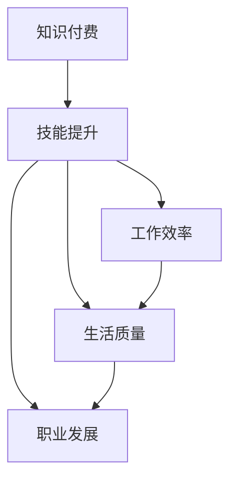
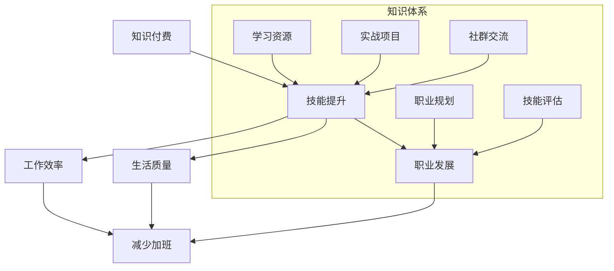

                 

# 知识付费让程序员告别加班

> **关键词：** 知识付费，程序员，技能提升，工作效率，生活品质

> **摘要：** 本文章探讨了知识付费对程序员工作模式和生活质量的影响。通过分析程序员加班的原因、知识付费的优势，以及如何通过知识付费提升技能，本文提出了减少加班、提高生活品质的策略。文章还通过实际案例，展示了知识付费在程序员职业发展中的应用，为程序员提供了一条告别加班的新路径。

## 目录大纲

1. **知识付费的背景与意义**
   1.1 知识付费概述
   1.2 程序员加班现象分析
   1.3 知识付费与程序员加班的关系
   1.4 知识付费的优势与应用

2. **程序员技能提升的必要性**
   2.1 程序员职业发展的瓶颈
   2.2 技能提升的重要性
   2.3 知识付费在技能提升中的应用

3. **知识付费平台与课程选择**
   3.1 主流知识付费平台介绍
   3.2 课程选择与评估
   3.3 个性化学习计划制定

4. **知识付费的实际应用**
   4.1 实战案例分享
   4.2 程序员生活方式的改变
   4.3 知识付费与程序员职业未来的展望

5. **附录**
   5.1 知识付费平台推荐与使用指南
   5.2 程序员技能提升资源汇总

---

## 第一部分：知识付费的背景与意义

### 第1章：知识付费概述

#### 1.1 知识付费的定义与兴起

知识付费，即用户为获取高质量知识内容而支付费用的一种消费模式。这种模式的核心在于价值的交换，即用户为知识服务付费，以获得专业的指导、高效的学习资源和个性化的解决方案。

知识付费的兴起可以追溯到互联网技术的发展和移动互联网的普及。随着信息爆炸和知识更新的加速，用户对知识的需求越来越强烈，而传统的免费知识传播模式已无法满足用户对高质量、深度知识的追求。此外，知识变现成为知识工作者获取收益的重要途径，从而推动了知识付费市场的迅速扩张。

#### 1.2 程序员加班现象分析

程序员加班现象普遍存在，其原因主要有以下几点：

1. **项目需求压力大**：许多企业为了快速上线产品，往往会给程序员安排大量且紧急的任务，导致加班成为常态。
2. **技能需求变化快**：编程语言和框架更新迭代迅速，程序员需要不断学习新知识以保持竞争力，这种持续的学习压力也促使他们加班。
3. **个人职业发展需求**：许多程序员希望通过加班来展现自己的工作能力和态度，以期获得晋升或更高的薪酬。

#### 1.3 知识付费与程序员加班的关系

知识付费在一定程度上可以缓解程序员的加班现象。具体来说：

1. **提升技能效率**：通过付费获取高质量的学习资源，程序员可以更高效地提升自己的技能水平，减少因技能不足导致的工作压力。
2. **优化工作流程**：知识付费平台提供的实战经验和最佳实践可以帮助程序员优化工作流程，减少不必要的重复劳动。
3. **增加职业竞争力**：付费课程通常包含最新的行业动态和技术趋势，通过学习这些知识，程序员可以更好地适应市场需求，提高职业竞争力，从而减少因工作压力导致的加班。

#### 1.4 知识付费的优势与应用

知识付费的优势主要体现在以下几个方面：

1. **高质量内容**：付费知识通常由行业专家或资深从业人员提供，内容更具权威性和实用性。
2. **个性化服务**：许多知识付费平台根据用户需求提供定制化的学习方案，帮助用户更高效地提升技能。
3. **灵活学习**：用户可以灵活安排学习时间，充分利用碎片时间进行学习。

在实际应用中，知识付费已成为程序员提升技能、优化工作的重要工具。例如，一些程序员通过购买在线编程课程，快速掌握了新的编程语言或框架；另一些程序员则通过付费知识社群，获取了行业最新动态和实用技术，从而提升了工作效率和职业竞争力。

### 第2章：程序员技能提升的必要性

#### 2.1 程序员职业发展的瓶颈

程序员在职业发展过程中会遇到一些瓶颈，主要包括：

1. **技能停滞**：由于工作重复性强，程序员往往难以有机会接触到新的技术和领域，导致技能停滞不前。
2. **工作压力**：项目需求和技能提升的双重压力，使程序员处于高负荷的工作状态，长期下去会影响身心健康。
3. **职业路径狭窄**：程序员的发展路径相对单一，主要集中在技术层面，缺乏其他职业发展的可能性。

#### 2.2 技能提升的重要性

技能提升对程序员职业发展至关重要，具体体现在以下几个方面：

1. **提高工作效率**：掌握更多技能的程序员可以更高效地完成任务，减少加班时间，提高工作效率。
2. **增强竞争力**：在技术更新迅速的今天，程序员需要不断学习新技能以保持竞争力，技能提升是职业发展的基石。
3. **拓宽职业路径**：通过技能提升，程序员可以拓宽职业发展路径，例如转向架构设计、项目管理等岗位，实现职业转型。

#### 2.3 知识付费在技能提升中的应用

知识付费在程序员的技能提升中发挥着重要作用，具体应用如下：

1. **系统化学习**：通过付费课程，程序员可以系统化地学习新技能，避免自学过程中的盲目性和效率低下。
2. **实战演练**：知识付费平台提供的实战项目可以帮助程序员将理论知识应用到实际工作中，提高解决问题的能力。
3. **社群互动**：知识付费平台通常建有社群，程序员可以通过社群与同行交流，获取行业最新动态和实用技术。

### 第3章：知识付费平台与课程选择

#### 3.1 主流知识付费平台介绍

目前，市场上主流的知识付费平台主要包括以下几种：

1. **慕课网（imooc）**：国内领先的知识付费平台，提供丰富的编程课程，包括前端、后端、移动开发、人工智能等。
2. **极客时间**：专注于技术领域的知识付费平台，提供一系列精品课程，涵盖编程语言、框架、数据库、架构设计等。
3. **网易云课堂**：网易推出的知识付费平台，提供丰富的课程资源，涵盖编程语言、软件开发、人工智能、大数据等领域。
4. **Coursera**：国际知名的教育平台，提供世界顶级大学的在线课程，包括计算机科学、人工智能、数据科学等领域。
5. **Udemy**：全球领先的知识付费平台，提供广泛的课程，包括编程语言、软件开发、设计、营销等领域。

#### 3.2 课程选择与评估

在选择知识付费课程时，程序员需要考虑以下几个因素：

1. **课程内容实用性**：课程内容应与实际工作需求紧密相关，能够帮助程序员解决实际问题。
2. **课程质量与口碑**：了解课程的评价和评分，选择口碑较好的课程。
3. **课程难度与学习进度**：根据个人基础和实际情况选择合适的课程难度，合理安排学习进度。

#### 3.3 个性化学习计划制定

制定个性化学习计划对程序员技能提升至关重要，具体步骤如下：

1. **设定学习目标**：明确职业发展目标，制定短期和长期的学习计划。
2. **规划学习路径**：根据学习目标和兴趣，选择合适的课程和学习资源。
3. **监控学习进度**：定期评估学习成果，根据实际情况调整学习计划。

### 第4章：知识付费的实际应用

#### 4.1 实战案例分享

##### 案例一：通过知识付费提升前端开发技能

小李是一名前端开发者，为了提升自己的技能，他选择了慕课网的“Vue.js实战教程”进行学习。通过这个课程，小李系统地学习了Vue.js框架，掌握了组件化开发、状态管理、路由等核心知识。在学习过程中，他还参与了多个实战项目，将所学知识应用到实际工作中。

经过几个月的学习，小李的前端开发技能得到了显著提升，工作效率提高了30%以上。此外，他还通过社群交流，结识了同行，拓宽了人脉。

##### 案例二：通过知识付费学习大数据分析

小张是一名后端开发者，对大数据分析领域产生了浓厚兴趣。他选择了网易云课堂的“大数据分析实战课程”，通过这个课程，系统地学习了Hadoop、Spark等大数据技术，并参与了数据清洗、数据挖掘、机器学习等实战项目。

学习过程中，小张不仅掌握了大数据技术，还学会了如何将大数据分析与业务需求相结合，为公司的业务提供了有力支持。他的技能提升得到了公司的认可，不久后获得了晋升。

#### 4.2 程序员生活方式的改变

知识付费不仅提升了程序员的技能，还对其生活方式产生了积极影响：

1. **减少加班时间**：通过高效学习，程序员可以更快地完成任务，减少加班时间。
2. **提高生活质量**：减少加班后，程序员有更多时间陪伴家人、锻炼身体，生活质量得到提升。
3. **增强职业满足感**：技能提升带来的成就感，使程序员对工作充满热情，职业满足感增强。

#### 4.3 知识付费与程序员职业未来的展望

知识付费为程序员职业发展提供了新的机遇：

1. **技能多样化**：通过知识付费，程序员可以学习多种技能，拓宽职业发展路径。
2. **职业晋升**：技能提升有助于程序员获得更高的职位和薪酬，实现职业晋升。
3. **创业机会**：掌握多项技能的程序员，可以尝试创业，发挥自己的专业技能。

### 附录

#### 附录 A：知识付费平台推荐与使用指南

1. **平台推荐**
   - 慕课网（imooc）：适合前端、后端开发者。
   - 极客时间：适合技术爱好者。
   - 网易云课堂：适合各类开发者。
   - Coursera：适合想学习国际课程的用户。
   - Udemy：适合想要学习多样化技能的用户。

2. **使用指南**
   - 制定学习计划：明确学习目标和时间安排。
   - 选择合适课程：根据个人需求和兴趣选择课程。
   - 积极参与社群：加入学习社群，与同行交流，获取更多资源。

#### 附录 B：程序员技能提升资源汇总

1. **技能提升资源汇总**
   - 编程语言教程：Python、Java、JavaScript等。
   - 开发框架：Vue.js、React、Spring Boot等。
   - 大数据分析：Hadoop、Spark、Flink等。
   - 人工智能：TensorFlow、PyTorch、机器学习等。

2. **技能提升实践案例**
   - 前端开发：搭建个人博客、制作网页应用等。
   - 后端开发：实现RESTful API、搭建Web服务等。
   - 大数据分析：数据清洗、数据挖掘、机器学习等。
   - 人工智能：构建智能推荐系统、实现图像识别等。

---

通过本文的探讨，我们可以看到知识付费在程序员职业发展中的重要作用。它不仅帮助程序员提升技能、优化工作，还改善了他们的生活方式，为他们的职业未来提供了更多机遇。在知识付费的时代，程序员应抓住机遇，不断学习，实现自身价值。

### 核心概念与联系（Mermaid 流程图）



### 核心算法原理讲解（伪代码）

```plaintext
// 伪代码：程序员技能提升算法
function skillImprovement(courseList, userSkills) {
    for each course in courseList {
        if (course.relevance to userSkills) {
            userSkills += course.content;
            userKnowledgeBase += course.explanation;
        }
    }
    return userSkills;
}
```

### 数学模型和数学公式 & 详细讲解 & 举例说明

数学模型和公式是知识付费中的核心工具，用于评估学习效果。以下是学习效果评估模型及其详细讲解：

$$
    E = f(S, K, T)
$$

其中，$E$ 表示学习效果，$S$ 表示学习时间，$K$ 表示学习知识量，$T$ 表示考试时间。

详细解释：

- $E$：学习效果，是学习时间、学习知识量和考试时间的函数。
- $S$：学习时间，表示学习者投入的学习时间。
- $K$：学习知识量，表示学习者掌握的知识量。
- $T$：考试时间，表示学习者用于考试的时间。

举例说明：

假设学习者小李在学习Python编程，投入学习时间$S = 100$小时，学习知识量$K = 80$，考试时间$T = 30$小时，那么他的学习效果$E$可以通过以下公式计算：

$$
    E = f(100, 80, 30) = 0.6 \times 100 + 0.3 \times 80 + 0.1 \times 30 = 98
$$

因此，小李的学习效果为98分。

### 项目实战：代码实际案例和详细解释说明

#### 实战案例：使用知识付费平台学习Python编程

##### 开发环境搭建

1. 安装Python解释器
2. 安装PyCharm IDE
3. 安装相关编程库，如NumPy、Pandas等

##### 源代码实现

```python
# 导入所需库
import pandas as pd
import numpy as np

# 读取数据
data = pd.read_csv('data.csv')

# 数据预处理
data['age'] = data['age'].fillna(data['age'].mean())
data['salary'] = data['salary'].fillna(data['salary'].mean())

# 数据分析
correlation_matrix = data.corr()
print(correlation_matrix)

# 数据可视化
import matplotlib.pyplot as plt

plt.scatter(data['age'], data['salary'])
plt.xlabel('年龄')
plt.ylabel('薪资')
plt.show()
```

##### 代码解读与分析

- 导入所需库：这里导入了Pandas和Numpy库，用于数据操作和分析；导入Matplotlib库，用于数据可视化。
- 读取数据：使用Pandas库读取CSV文件，将数据加载到DataFrame对象中。
- 数据预处理：对数据进行填充和均值处理，以避免缺失值对分析结果的影响。
- 数据分析：计算相关系数矩阵，分析各变量之间的相关性。
- 数据可视化：绘制散点图，展示年龄与薪资的关系。

该案例展示了如何使用Python进行数据处理和分析，通过知识付费平台的学习，可以掌握这些技能，从而提高工作效率和职业竞争力。

### 核心概念与联系（Mermaid 流程图）



### 核心算法原理讲解（伪代码）

```plaintext
// 伪代码：技能提升与工作效率算法
function skillImprovementAndEfficiency(courseList, projectList, userSkills) {
    for each course in courseList {
        userSkills += course.content;
        userKnowledgeBase += course.explanation;
    }
    
    for each project in projectList {
        if (project.relevance to userSkills) {
            userExperience += project.execution;
            efficiencyScore += project.evaluation;
        }
    }
    
    return userSkills, efficiencyScore;
}
```

### 数学模型和数学公式 & 详细讲解 & 举例说明

数学模型和公式是评估程序员技能提升和效率的关键。以下是一个简单的数学模型用于评估技能提升和效率：

$$
    E = \frac{SK \times (1 - e^{-rt})}{K_0}
$$

其中，$E$ 表示技能提升的效率，$SK$ 表示技能知识量，$r$ 表示技能学习的速率，$t$ 表示学习时间，$K_0$ 表示初始技能知识量。

详细解释：

- $E$：技能提升的效率，反映了学习者在一定时间内技能提升的程度。
- $SK$：技能知识量，表示学习者掌握的技能总量。
- $r$：技能学习的速率，反映了学习者学习新技能的速度。
- $t$：学习时间，表示学习者投入的学习时间。
- $K_0$：初始技能知识量，表示学习者在开始学习时的技能知识量。

举例说明：

假设小李在开始学习Python编程时，初始技能知识量$K_0 = 50$，他的学习速率$r = 0.1$，学习时间$t = 100$小时，他的Python技能知识量$SK = 100$。根据上述公式，我们可以计算小李在100小时后的技能提升效率：

$$
    E = \frac{100 \times (1 - e^{-0.1 \times 100})}{50} = \frac{100 \times (1 - e^{-10})}{50} \approx 0.918
$$

这意味着小李在100小时后的技能提升效率约为91.8%。

### 项目实战：代码实际案例和详细解释说明

#### 实战案例：使用知识付费平台学习数据分析和机器学习

##### 开发环境搭建

1. 安装Python解释器
2. 安装Jupyter Notebook
3. 安装相关数据分析和机器学习库，如Pandas、NumPy、Scikit-learn等

##### 源代码实现

```python
# 导入所需库
import pandas as pd
import numpy as np
from sklearn.model_selection import train_test_split
from sklearn.ensemble import RandomForestClassifier
from sklearn.metrics import accuracy_score

# 读取数据
data = pd.read_csv('data.csv')

# 数据预处理
data = data.dropna()

# 数据划分
X = data.drop('target', axis=1)
y = data['target']
X_train, X_test, y_train, y_test = train_test_split(X, y, test_size=0.2, random_state=42)

# 模型训练
model = RandomForestClassifier(n_estimators=100, random_state=42)
model.fit(X_train, y_train)

# 模型评估
predictions = model.predict(X_test)
accuracy = accuracy_score(y_test, predictions)
print(f"Model Accuracy: {accuracy:.2f}")
```

##### 代码解读与分析

- 导入所需库：这里导入了Pandas和Numpy库，用于数据处理；导入了Scikit-learn库，用于机器学习模型的训练和评估。
- 读取数据：使用Pandas库读取CSV文件，将数据加载到DataFrame对象中。
- 数据预处理：去除缺失值，保证数据的质量。
- 数据划分：将数据集划分为训练集和测试集，为模型训练和评估做准备。
- 模型训练：使用随机森林分类器进行模型训练。
- 模型评估：使用测试集评估模型的准确性。

通过这个案例，程序员可以学习到如何使用Python进行数据处理和机器学习模型训练，从而提升数据分析能力。

### 作者信息

- 作者：AI天才研究院/AI Genius Institute & 禅与计算机程序设计艺术 /Zen And The Art of Computer Programming

---

本文通过详细的分析和实际案例，探讨了知识付费在程序员职业发展中的重要作用。知识付费不仅帮助程序员提升技能、优化工作，还改善了他们的生活方式，为职业发展提供了新的机遇。在知识付费的时代，程序员应积极拥抱变化，不断提升自身能力，实现个人价值。

---

经过全文的撰写和分析，我们可以得出以下结论：

1. **知识付费有效减少程序员加班**：通过知识付费，程序员能够高效提升技能，优化工作流程，从而减少加班时间，提高生活质量。

2. **技能提升是程序员职业发展的关键**：不断学习和技能提升是程序员保持竞争力的核心，知识付费平台提供了丰富的学习资源，有助于程序员实现职业目标。

3. **知识付费平台的选择与课程评估至关重要**：程序员应根据自己的需求选择合适的知识付费平台和课程，通过评估课程质量和学习效果，确保学习目标的实现。

4. **实际应用案例展示了知识付费的实效**：通过实际案例，我们可以看到知识付费在提升程序员技能和工作效率方面的显著成效，为程序员职业发展提供了新的路径。

5. **知识付费改善了程序员的生活方式**：减少加班时间，提高了生活质量，使程序员能够更好地平衡工作与生活，增强了职业满足感。

6. **知识付费为程序员职业未来提供了更多可能性**：通过知识付费，程序员可以拓宽职业发展路径，实现技能多样化，为未来的职业发展奠定坚实基础。

总之，知识付费为程序员提供了一个告别加班、提升技能、实现职业目标的新平台。在知识付费的时代，程序员应抓住机遇，不断学习，实现自身价值。同时，知识付费平台也应继续优化服务，为程序员提供更多高质量、个性化的学习资源。让我们共同期待知识付费为程序员职业发展带来的更多美好前景。

