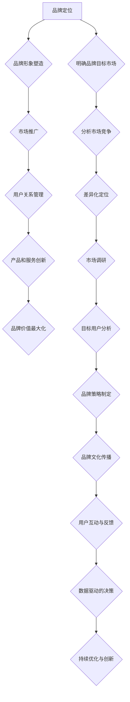

                 

# 《知识付费赚钱的品牌运营与品牌推广策略》

## 摘要

本文旨在深入探讨知识付费领域中的品牌运营与品牌推广策略。随着知识付费市场的迅猛发展，品牌运营和推广成为决定知识付费产品成功与否的关键因素。文章首先概述了品牌运营的定义、重要性及其核心要素，接着分析了知识付费行业背景与市场特点。随后，文章详细介绍了品牌定位的原则与方法、品牌策略的制定，以及品牌运营的执行环节。在品牌推广策略部分，文章探讨了多种推广渠道的选择、品牌推广活动的策划与执行。此外，文章还通过成功案例分析，展示了品牌运营的困境与应对策略，以及如何实现品牌运营的持续优化与创新。最后，文章展望了人工智能在品牌运营中的应用与未来趋势，为知识付费品牌提供了全面的运营与推广策略指导。

## 目录大纲

### 第一部分：品牌运营概述

#### 1.1 品牌运营的定义与重要性
#### 1.1.1 品牌运营的概念
#### 1.1.2 品牌运营的作用
#### 1.1.3 成功品牌运营的关键要素

#### 1.2 知识付费行业背景
#### 1.2.1 知识付费市场的发展
#### 1.2.2 知识付费平台的崛起
#### 1.2.3 知识付费消费群体的特点

### 第二部分：品牌定位与策略

#### 2.1 品牌定位的原则与方法
#### 2.1.1 品牌定位的原理
#### 2.1.2 品牌定位的方法
#### 2.1.3 品牌定位案例分析

#### 2.2 品牌策略制定
#### 2.2.1 品牌策略概述
#### 2.2.2 目标市场与目标客户分析
#### 2.2.3 品牌差异化策略

### 第三部分：品牌运营执行

#### 3.1 品牌内容策略
#### 3.1.1 内容营销的概念与作用
#### 3.1.2 内容营销的方法与技巧
#### 3.1.3 成功内容营销案例分析

#### 3.2 社交媒体运营
#### 3.2.1 社交媒体平台选择
#### 3.2.2 社交媒体内容策划
#### 3.2.3 社交媒体数据分析与优化

#### 3.3 品牌口碑管理
#### 3.3.1 口碑管理的概念与重要性
#### 3.3.2 口碑监测的方法与工具
#### 3.3.3 口碑危机应对策略

### 第四部分：品牌推广策略

#### 4.1 品牌推广渠道选择
#### 4.1.1 传统推广渠道
#### 4.1.2 新媒体推广渠道
#### 4.1.3 跨平台推广策略

#### 4.2 品牌推广活动策划
#### 4.2.1 活动策划的原则与流程
#### 4.2.2 活动类型与案例分析
#### 4.2.3 活动效果评估与优化

#### 4.3 品牌合作与跨界营销
#### 4.3.1 品牌合作的概念与形式
#### 4.3.2 跨界营销的优势与策略
#### 4.3.3 成功品牌合作案例分析

### 第五部分：品牌运营案例分析

#### 5.1 知识付费品牌成功案例分析
#### 5.1.1 案例选取标准
#### 5.1.2 案例分析框架
#### 5.1.3 案例详细解读

#### 5.2 品牌运营困境与应对
#### 5.2.1 常见品牌运营困境
#### 5.2.2 困境原因分析
#### 5.2.3 应对策略与建议

### 第六部分：品牌运营的持续优化

#### 6.1 数据驱动品牌运营
#### 6.1.1 数据收集与处理
#### 6.1.2 数据分析工具与方法
#### 6.1.3 数据驱动的决策与优化

#### 6.2 品牌持续创新
#### 6.2.1 创新的重要性
#### 6.2.2 创新方法与工具
#### 6.2.3 成功创新案例分析

#### 6.3 品牌运营团队建设
#### 6.3.1 团队建设原则
#### 6.3.2 团队成员能力要求
#### 6.3.3 团队协作与沟通技巧

### 第七部分：品牌运营的未来趋势

#### 7.1 人工智能与品牌运营
#### 7.1.1 人工智能在品牌运营中的应用
#### 7.1.2 人工智能带来的挑战与机遇
#### 7.1.3 人工智能在品牌运营中的未来发展趋势

#### 7.2 知识付费市场的演变
#### 7.2.1 知识付费市场的演变趋势
#### 7.2.2 新兴领域与机会
#### 7.2.3 未来市场预测与建议

### 附录

#### 附录 A：品牌运营工具与资源
#### 7.1.1 品牌运营工具介绍
#### 7.1.2 品牌运营资源推荐

#### 附录 B：知识付费品牌运营案例集
#### 7.2.1 案例列表
#### 7.2.2 案例详细解析

以上目录大纲为文章的结构框架，每个部分都将详细探讨知识付费领域的品牌运营与品牌推广策略，旨在为从业者提供系统性的指导与借鉴。

---

## 第一部分：品牌运营概述

### 1.1 品牌运营的定义与重要性

#### 1.1.1 品牌运营的概念

品牌运营指的是围绕品牌建设的一系列策略、方法和活动，旨在提升品牌知名度、美誉度和忠诚度，从而实现品牌价值的最大化。品牌运营不仅仅是市场推广，它还涵盖了品牌定位、品牌形象塑造、品牌文化传播等多个方面。

在知识付费领域，品牌运营尤为重要。首先，知识付费市场竞争激烈，品牌运营能够帮助知识付费平台或个人在众多竞争者中脱颖而出。其次，知识付费消费群体对品牌有较高的认知要求，他们更倾向于选择有品牌保障的知识产品。最后，成功的品牌运营能够建立消费者的信任，从而提高产品的转换率和复购率。

#### 1.1.2 品牌运营的作用

品牌运营在知识付费领域具有以下几个重要作用：

1. **提高品牌知名度**：通过有效的品牌运营，可以让更多的人了解和记住品牌，从而提高品牌的知名度。

2. **塑造品牌形象**：品牌运营能够塑造品牌的正面形象，让消费者对品牌产生积极的认知。

3. **建立品牌信任**：品牌运营能够建立品牌与消费者之间的信任，增加消费者的忠诚度。

4. **提升品牌价值**：通过不断的品牌运营，可以提升品牌在市场中的地位，从而提高品牌的价值。

#### 1.1.3 成功品牌运营的关键要素

要实现成功的品牌运营，需要关注以下几个关键要素：

1. **明确品牌定位**：品牌定位是品牌运营的基础，只有明确了品牌的目标和定位，才能制定出相应的运营策略。

2. **优质的品牌内容**：内容是品牌运营的核心，优质的品牌内容能够吸引消费者的关注，提升品牌的吸引力。

3. **有效的市场推广**：市场推广是品牌运营的重要组成部分，通过多种渠道和手段进行推广，可以提升品牌知名度。

4. **良好的用户体验**：用户体验是品牌运营的重要衡量标准，良好的用户体验能够增强消费者的满意度和忠诚度。

5. **持续的创新与优化**：品牌运营需要不断创新和优化，以适应市场的变化和消费者的需求。

### 1.2 知识付费行业背景

#### 1.2.1 知识付费市场的发展

知识付费市场在过去几年中经历了快速的发展。随着互联网技术的不断进步和移动支付的普及，人们越来越愿意为有价值的知识内容支付费用。根据数据显示，我国知识付费市场规模逐年扩大，预计未来几年将继续保持高速增长。

知识付费市场的发展不仅表现在市场规模的增长，还体现在消费群体的多样化。从年龄层次来看，80后、90后成为知识付费的主要消费群体；从消费领域来看，教育、职场技能、兴趣爱好等领域成为知识付费的热点。

#### 1.2.2 知识付费平台的崛起

随着知识付费市场的兴起，众多知识付费平台纷纷涌现。这些平台通过提供在线课程、电子书、音频、视频等多种形式的知识内容，满足消费者的需求。知识付费平台的崛起不仅改变了知识传播的方式，也推动了知识付费行业的发展。

知识付费平台在品牌运营方面具有天然的优势。首先，平台积累了大量的用户数据，可以为品牌运营提供精准的数据支持。其次，平台拥有丰富的内容资源，可以通过内容运营提升品牌的吸引力。最后，平台拥有强大的技术支持，可以提升品牌的服务质量和用户体验。

#### 1.2.3 知识付费消费群体的特点

知识付费消费群体具有以下几个显著特点：

1. **高学历、高收入**：知识付费消费群体通常具有较高的学历和收入水平，他们有较强的购买力。

2. **注重自我提升**：知识付费消费群体普遍注重自我提升，愿意为有价值的内容支付费用。

3. **追求品质生活**：知识付费消费群体追求高品质的生活，愿意为提升生活品质的知识内容支付费用。

4. **善于利用网络资源**：知识付费消费群体善于利用网络资源，通过网络平台获取知识内容。

综上所述，知识付费市场的快速发展为品牌运营提供了广阔的空间。通过深入分析知识付费行业的背景和消费群体的特点，品牌运营可以更准确地制定策略，实现品牌的长期发展。

---

## 第二部分：品牌定位与策略

### 2.1 品牌定位的原则与方法

#### 2.1.1 品牌定位的原理

品牌定位是品牌运营的核心环节，其原理在于为品牌在消费者心智中占据一席之地，从而建立独特的品牌认知。品牌定位不仅关系到品牌的市场竞争力，也直接影响到品牌的市场表现。有效的品牌定位需要遵循以下几个基本原则：

1. **差异化原则**：品牌定位需要找到与其他品牌不同的独特优势，以差异化来吸引目标消费者。

2. **目标性原则**：品牌定位应明确品牌的目标市场，以便于制定针对性的运营策略。

3. **一致性原则**：品牌定位应与品牌形象、产品特性、市场推广等各个方面保持一致，确保品牌信息的统一传达。

4. **持久性原则**：品牌定位应具备一定的持久性，能够在较长的时间内保持品牌的核心价值。

#### 2.1.2 品牌定位的方法

进行品牌定位，可以采用以下几种方法：

1. **SWOT分析**：通过分析品牌的优势（Strengths）、劣势（Weaknesses）、机会（Opportunities）和威胁（Threats），确定品牌定位的基点和方向。

2. **目标市场分析**：明确目标市场，包括市场规模、消费者需求、竞争对手等，从而找到品牌差异化的机会点。

3. **用户画像**：通过用户调研和数据分析，构建目标消费者的用户画像，以便更好地理解消费者的需求和偏好。

4. **品牌核心价值提炼**：从品牌使命、愿景、价值观等出发，提炼出品牌的核心价值，并将其融入到品牌定位中。

#### 2.1.3 品牌定位案例分析

以“得到”为例，其品牌定位可以总结为以下几点：

1. **差异化优势**：得到平台专注于提供高质量的付费内容，通过邀请各领域的专家和知名人士进行授课，形成了与其他平台不同的差异化优势。

2. **目标市场**：得到的目标市场主要针对中高端用户群体，这些用户具有较强的购买力和学习意愿。

3. **品牌核心价值**：得到强调“终身学习”的品牌核心价值，倡导用户通过持续学习提升自我。

通过上述品牌定位，得到在知识付费市场中迅速崛起，成为行业领导者之一。

### 2.2 品牌策略制定

#### 2.2.1 品牌策略概述

品牌策略是品牌运营的具体行动计划，包括品牌传播、品牌形象塑造、品牌营销等多个方面。制定品牌策略时，需要考虑以下几个关键因素：

1. **品牌定位**：品牌策略应与品牌定位保持一致，确保品牌信息传达的连贯性。

2. **目标市场**：明确目标市场，了解目标消费者的需求和行为习惯，以便制定有针对性的品牌策略。

3. **市场环境**：分析市场环境，包括竞争对手、市场需求等，以确定品牌策略的可行性和有效性。

4. **资源条件**：评估品牌可利用的资源，包括资金、人力、技术等，确保品牌策略的执行力。

#### 2.2.2 目标市场与目标客户分析

目标市场分析是品牌策略制定的重要环节。以下是目标市场分析的主要内容：

1. **市场规模**：评估目标市场的整体规模，了解市场潜力和发展趋势。

2. **消费者需求**：通过市场调研和用户画像，了解目标消费者的需求、偏好和行为模式。

3. **竞争对手**：分析竞争对手的市场策略、产品特点、市场份额等，找到品牌差异化的机会点。

4. **市场定位**：根据分析结果，确定品牌在目标市场中的定位，包括目标群体、价值主张等。

#### 2.2.3 品牌差异化策略

品牌差异化策略是品牌策略的核心，旨在通过独特的价值主张和产品特性，吸引目标消费者。以下是几种常见的品牌差异化策略：

1. **产品差异化**：通过独特的产品设计、功能或质量，打造与其他品牌不同的产品优势。

2. **服务差异化**：提供优质的服务，包括售前咨询、售后服务等，提升消费者的满意度。

3. **品牌文化差异化**：通过独特的品牌文化，如价值观、理念等，塑造与其他品牌不同的品牌形象。

4. **市场细分差异化**：针对不同的市场细分群体，提供定制化的产品和服务，满足不同消费者的需求。

通过以上品牌策略的制定，可以确保品牌在市场中具备竞争力，并实现长期发展。

---

## 第三部分：品牌运营执行

### 3.1 品牌内容策略

#### 3.1.1 内容营销的概念与作用

内容营销是品牌运营的重要手段之一，它通过创造和分发有价值的内容，吸引和留住目标消费者。内容营销具有以下几个重要作用：

1. **提升品牌知名度**：通过有价值的内容，吸引更多的潜在消费者关注品牌，提高品牌知名度。

2. **建立品牌权威**：通过专业的内容，展示品牌的实力和专业知识，增强品牌权威性。

3. **增加用户粘性**：通过持续的内容输出，与用户建立更紧密的关系，提高用户粘性。

4. **促进销售转化**：优质的内容能够引导消费者购买产品或服务，从而实现销售转化。

#### 3.1.2 内容营销的方法与技巧

进行内容营销，可以采用以下几种方法和技巧：

1. **内容创作**：根据目标市场的需求，创作有价值的内容。内容形式包括文章、视频、图片、音频等。

2. **内容分发**：通过多种渠道分发内容，如社交媒体、博客、微信公众号等，扩大内容的传播范围。

3. **用户互动**：鼓励用户参与内容互动，如评论、点赞、分享等，提高内容的传播效果。

4. **数据分析**：通过数据分析，了解内容的表现和用户反馈，不断优化内容策略。

#### 3.1.3 成功内容营销案例分析

以“逻辑思维”为例，其内容营销策略可以总结为以下几点：

1. **内容创作**：逻辑思维专注于输出高质量的内容，通过深入分析社会热点和行业趋势，提供有价值的信息。

2. **内容分发**：逻辑思维通过微信公众号、喜马拉雅等多个平台进行内容分发，确保内容的广泛传播。

3. **用户互动**：逻辑思维鼓励用户参与互动，如发起讨论、设置问答环节等，增强用户的参与感。

4. **数据分析**：逻辑思维通过数据分析，了解用户偏好和行为，不断优化内容策略。

通过以上内容营销策略，逻辑思维在短时间内积累了大量的粉丝，实现了品牌的快速增长。

### 3.2 社交媒体运营

#### 3.2.1 社交媒体平台选择

社交媒体运营是品牌运营的重要一环，选择合适的社交媒体平台对品牌运营的效果有着直接影响。以下是几种常见的社交媒体平台及其特点：

1. **微信公众号**：微信公众号是中国最大的自媒体平台，适合发布长篇文章和深度内容。

2. **微博**：微博具有信息传播速度快、互动性强的特点，适合进行品牌宣传和活动推广。

3. **抖音**：抖音是一个短视频平台，适合发布创意短视频，吸引用户关注。

4. **知乎**：知乎是一个问答社区，适合发布专业知识和经验分享，提升品牌权威。

5. **小红书**：小红书是一个以生活方式为主的社交平台，适合发布美妆、时尚、生活等内容。

#### 3.2.2 社交媒体内容策划

社交媒体内容策划是社交媒体运营的关键。以下是内容策划的几个要点：

1. **内容形式**：根据平台特点，选择合适的内容形式，如文章、视频、图片、图文等。

2. **内容主题**：围绕品牌定位和目标市场，确定内容主题，确保内容与品牌相关。

3. **内容频率**：制定合理的内容发布频率，保持内容输出的一致性和持续性。

4. **互动设计**：设计互动环节，如问答、抽奖、评论互动等，提高用户参与度。

#### 3.2.3 社交媒体数据分析与优化

社交媒体数据分析是优化运营策略的重要手段。以下是数据分析的几个要点：

1. **数据收集**：通过社交媒体平台的数据分析工具，收集关键数据，如阅读量、点赞量、分享量、评论量等。

2. **数据解读**：对收集到的数据进行分析，了解内容的表现和用户反馈。

3. **优化策略**：根据数据分析结果，调整内容策略，提高内容质量和传播效果。

4. **持续优化**：不断进行数据分析和策略调整，实现品牌运营的持续优化。

通过以上社交媒体运营策略，可以有效提升品牌的社交媒体影响力，吸引更多目标消费者。

### 3.3 品牌口碑管理

#### 3.3.1 口碑管理的概念与重要性

品牌口碑管理是指通过多种手段和渠道，收集、分析和处理用户对品牌的反馈和评价，从而提升品牌形象和用户满意度。口碑管理具有以下几个重要作用：

1. **提升品牌形象**：良好的口碑能够提升品牌在消费者心中的形象，增加品牌的吸引力。

2. **增强用户信任**：消费者更倾向于选择口碑良好的品牌，口碑管理能够增强用户对品牌的信任。

3. **改善产品和服务**：通过收集用户反馈，品牌可以及时了解产品的不足，改进产品和服务。

4. **提升用户忠诚度**：良好的口碑能够提升用户满意度，从而增加用户的忠诚度。

#### 3.3.2 口碑监测的方法与工具

进行口碑监测，可以采用以下几种方法和工具：

1. **社交媒体监测**：通过监测社交媒体平台上的用户评论、讨论等内容，了解用户对品牌的反馈。

2. **在线评论监测**：通过监测各大电商平台、论坛等平台上的用户评价，了解用户对产品和服务的态度。

3. **搜索引擎监测**：通过监测搜索引擎上的相关关键词和搜索结果，了解用户对品牌的认知和评价。

4. **舆情监测工具**：使用专业的舆情监测工具，如百度舆情、新媒体管家等，进行实时监测和分析。

#### 3.3.3 口碑危机应对策略

当品牌遭遇口碑危机时，需要采取有效的应对策略，以减轻危机带来的负面影响。以下是几个口碑危机应对策略：

1. **及时响应**：在危机发生后，立即采取措施，回应用户的关切，展示品牌的积极态度。

2. **透明沟通**：与用户保持透明沟通，提供真实、准确的信息，避免隐瞒事实。

3. **积极解决问题**：针对用户提出的问题，积极采取措施解决问题，以赢得用户的理解和信任。

4. **持续改进**：通过危机应对，发现品牌存在的问题，持续改进产品和服务，提升品牌形象。

通过有效的口碑管理，品牌可以建立良好的口碑，增强用户信任，从而实现长期发展。

---

## 第四部分：品牌推广策略

### 4.1 品牌推广渠道选择

品牌推广渠道的选择是品牌运营的关键环节，不同渠道的选择将直接影响品牌推广的效果。以下是几种常见的品牌推广渠道及其特点：

#### 4.1.1 传统推广渠道

传统推广渠道包括电视广告、报纸广告、户外广告等。这些渠道具有覆盖面广、影响力大的特点，但成本较高，且传播效果较难量化。

1. **电视广告**：电视广告是传统媒体中影响力最大的渠道之一，适合大型品牌进行品牌宣传。

2. **报纸广告**：报纸广告适合发布深度报道和品牌形象广告，覆盖特定人群。

3. **户外广告**：户外广告包括公交车广告、户外广告牌等，具有视觉冲击力强、覆盖面广的特点。

#### 4.1.2 新媒体推广渠道

新媒体推广渠道包括社交媒体、搜索引擎、内容平台等。这些渠道具有成本低、传播速度快、互动性强等特点，越来越受到品牌的青睐。

1. **社交媒体**：社交媒体平台如微博、微信、抖音等，是品牌推广的重要渠道，适合进行品牌宣传和用户互动。

2. **搜索引擎**：搜索引擎如百度、谷歌等，是用户获取信息的主要途径，通过搜索引擎优化（SEO）和搜索引擎营销（SEM）可以提升品牌曝光度。

3. **内容平台**：内容平台如知乎、抖音、小红书等，适合发布专业内容和用户互动，提升品牌权威性和用户粘性。

#### 4.1.3 跨平台推广策略

跨平台推广策略是将品牌推广渠道从单一平台扩展到多个平台，通过整合不同平台的资源和优势，实现品牌推广的最大化效果。

1. **内容整合**：将不同平台的内容进行整合，保持品牌信息的统一性和连贯性。

2. **跨平台传播**：利用不同平台的传播特点，实现品牌的跨平台传播，扩大品牌影响力。

3. **互动联动**：通过跨平台的互动活动，如直播联动、跨界合作等，增强用户的参与感和品牌体验。

通过合理选择和利用品牌推广渠道，可以提升品牌的市场曝光度和用户认知度，从而实现品牌的长期发展。

### 4.2 品牌推广活动策划

品牌推广活动是提升品牌知名度和用户参与度的重要手段。有效的品牌推广活动策划需要遵循以下原则和流程：

#### 4.2.1 活动策划的原则

1. **目标明确**：明确活动目标，如提升品牌知名度、增加用户参与度、促进销售转化等。

2. **内容创新**：创意是活动成功的关键，要确保活动内容具有独特性和吸引力。

3. **受众定位**：准确确定目标受众，了解受众需求和偏好，制定针对性的活动内容。

4. **预算合理**：根据品牌预算，合理分配活动资源，确保活动策划的可执行性。

#### 4.2.2 活动策划的流程

1. **确定主题**：根据品牌定位和目标受众，确定活动的主题和核心内容。

2. **制定方案**：制定详细的活动方案，包括活动形式、时间、地点、参与人员等。

3. **宣传推广**：制定宣传推广计划，包括线上线下渠道的宣传，提高活动知名度。

4. **执行实施**：按照活动方案，执行实施活动，确保活动顺利进行。

5. **效果评估**：活动结束后，对活动效果进行评估，包括参与人数、互动率、转化率等，总结活动经验和不足。

#### 4.2.3 活动类型与案例分析

1. **线上活动**：线上活动适合用户参与，如线上讲座、直播、互动游戏等。例如，知乎的线上讲座活动，通过邀请行业专家进行分享，吸引了大量用户参与，提升了品牌知名度。

2. **线下活动**：线下活动适合提升品牌形象和用户互动，如发布会、展会、体验活动等。例如，小米的发布会活动，通过精美的现场设计和产品展示，吸引了大量媒体和用户关注，提升了品牌形象。

3. **跨界合作**：跨界合作是通过与其他品牌合作，实现资源共享和品牌联动。例如，宜家与索尼的合作活动，通过联合推出家居音响系列，吸引了大量消费者关注，提升了品牌的跨界影响力。

通过以上活动类型和案例，品牌可以制定出有针对性的品牌推广活动，提升品牌知名度和用户参与度。

### 4.3 品牌合作与跨界营销

品牌合作与跨界营销是提升品牌影响力和用户参与度的重要手段。通过与其他品牌合作，可以实现资源整合、品牌联动和用户互动，从而提升品牌的市场竞争力。

#### 4.3.1 品牌合作的概念与形式

品牌合作是指两个或多个品牌之间进行合作，共同推广和销售产品或服务，以实现互利共赢。品牌合作的形式包括：

1. **产品合作**：品牌之间共同推出新产品或服务，共享品牌资源和市场渠道。

2. **宣传合作**：品牌之间共同进行市场宣传，提高品牌知名度和曝光度。

3. **渠道合作**：品牌之间共享销售渠道，扩大产品的市场覆盖范围。

4. **用户互动**：品牌之间共同举办活动，提高用户的参与度和品牌体验。

#### 4.3.2 跨界营销的优势与策略

跨界营销是指将品牌与不同领域的产品或服务进行结合，以实现品牌的创新和突破。跨界营销的优势包括：

1. **创新性**：跨界营销能够带来全新的品牌体验，激发消费者的兴趣和好奇心。

2. **广泛性**：跨界营销可以吸引不同领域的用户，扩大品牌的受众群体。

3. **互惠性**：跨界营销可以实现资源整合，降低营销成本，提升品牌影响力。

进行跨界营销，可以采用以下策略：

1. **选择合适的跨界伙伴**：选择与品牌定位和目标受众相符的跨界伙伴，确保跨界营销的效果。

2. **打造独特的品牌体验**：通过独特的跨界体验，提升品牌形象和用户满意度。

3. **整合多种营销手段**：结合线上线下渠道，多种营销手段共同推广，实现品牌联动。

4. **持续创新与优化**：不断进行跨界尝试，根据市场反馈和用户需求，优化跨界营销策略。

#### 4.3.3 成功品牌合作案例分析

1. **可口可乐 x 耐克**：可口可乐与耐克合作推出限量版运动鞋，通过品牌跨界，吸引了大量消费者关注，提升了品牌的创新性和影响力。

2. **麦当劳 x 星巴克**：麦当劳与星巴克合作，推出麦当劳星巴克咖啡，通过跨界合作，实现了品牌资源的共享和用户体验的提升。

3. **肯德基 x 大白兔**：肯德基与大白兔合作，推出大白兔口味炸鸡，通过跨界营销，吸引了年轻消费者的关注，提升了品牌的年轻化和创新性。

通过以上成功案例，品牌可以借鉴跨界营销的方法和策略，实现品牌的持续发展和市场竞争力提升。

---

## 第五部分：品牌运营案例分析

### 5.1 知识付费品牌成功案例分析

#### 5.1.1 案例选取标准

在知识付费市场中，众多品牌通过优秀的品牌运营策略取得了成功。为了确保案例分析的科学性和代表性，我们选取了以下几个标准：

1. **市场表现**：品牌在市场上的表现，包括用户数量、收入规模、市场份额等。

2. **品牌定位**：品牌的定位是否清晰，是否具有差异化优势。

3. **运营策略**：品牌的运营策略是否创新，是否具备可复制的模式。

4. **用户口碑**：用户对品牌的评价，包括满意度、忠诚度等。

5. **行业影响**：品牌在行业中的地位和影响力，是否具备标杆作用。

#### 5.1.2 案例分析框架

为了系统地分析知识付费品牌的成功经验，我们将采用以下分析框架：

1. **品牌定位**：分析品牌的定位策略，包括品牌定位的原则、方法及实施过程。

2. **运营策略**：分析品牌的运营策略，包括内容策略、社交媒体运营、品牌合作等方面。

3. **用户反馈**：分析用户对品牌的反馈，包括用户满意度、忠诚度等。

4. **市场表现**：分析品牌在市场中的表现，包括收入规模、市场份额等。

5. **成功经验**：总结品牌的成功经验，提炼可复制的运营模式。

#### 5.1.3 案例详细解读

以下是三个成功知识付费品牌的详细案例分析：

1. **得到**

   - **品牌定位**：得到定位于提供高质量的付费内容，以终身学习为核心价值。通过邀请各领域的专家和知名人士授课，形成独特的差异化优势。

   - **运营策略**：得到采用内容营销和社交媒体运营相结合的策略。通过微信公众号、微博等平台发布高质量的文章和视频，吸引大量用户关注。同时，利用用户数据分析，优化内容策略。

   - **用户反馈**：用户对得到的内容质量给予了高度评价，满意度较高。用户普遍认为得到的内容具有实用性和深度，愿意为有价值的内容支付费用。

   - **市场表现**：得到在短时间内积累了大量用户，实现了收入的快速增长。根据公开数据显示，得到用户数量已超过2000万，年营收超过10亿元。

   - **成功经验**：得到成功的关键在于清晰的品牌定位、优质的内容策略和精准的用户运营。

2. **混沌大学**

   - **品牌定位**：混沌大学定位于提升企业家的商业认知和创新能力，通过提供在线课程和线下活动，帮助企业家成长。

   - **运营策略**：混沌大学采用线上线下相结合的运营策略。在线上，通过微信公众号、小鹅通等平台发布课程内容，在线下，举办各类活动，如演讲、论坛等。

   - **用户反馈**：用户对混沌大学的内容和活动给予了高度评价，满意度较高。用户普遍认为混沌大学提供了丰富的知识和资源，有助于个人和企业的成长。

   - **市场表现**：混沌大学在市场中取得了显著的成果，用户数量和收入规模持续增长。根据公开数据显示，混沌大学已累计服务超过10万名企业家，年营收超过5亿元。

   - **成功经验**：混沌大学成功的关键在于精准的品牌定位、丰富的内容资源和线上线下相结合的运营模式。

3. **喜马拉雅**

   - **品牌定位**：喜马拉雅定位于提供丰富的音频内容，包括有声书、课程、播客等，满足用户对知识的多种需求。

   - **运营策略**：喜马拉雅采用内容营销和社交媒体运营相结合的策略。通过微信公众号、微博等平台发布优质内容，吸引用户关注。同时，利用用户数据分析，优化内容策略和推广方式。

   - **用户反馈**：用户对喜马拉雅的内容质量给予了高度评价，满意度较高。用户普遍认为喜马拉雅提供了丰富的音频内容，方便用户在碎片化时间进行学习。

   - **市场表现**：喜马拉雅在市场中取得了显著的成绩，用户数量和收入规模持续增长。根据公开数据显示，喜马拉雅已累计服务超过4亿用户，年营收超过20亿元。

   - **成功经验**：喜马拉雅成功的关键在于丰富的内容资源、强大的技术支持和精准的用户运营。

通过以上成功案例的分析，我们可以看到，成功的知识付费品牌在品牌定位、运营策略、用户反馈和市场表现等方面具有共性。同时，每个品牌也有其独特的优势和运营模式，值得其他品牌借鉴和参考。

### 5.2 品牌运营困境与应对

在知识付费品牌的运营过程中，可能会面临多种困境，如市场竞争激烈、用户需求变化、运营成本高等。以下是几个常见的品牌运营困境及其应对策略：

#### 5.2.1 常见品牌运营困境

1. **市场竞争激烈**：随着知识付费市场的快速发展，竞争日益激烈，品牌需要不断推出新的内容和运营策略，以保持市场竞争力。

2. **用户需求变化**：用户需求多样化且变化迅速，品牌需要及时了解和满足用户需求，否则可能导致用户流失。

3. **运营成本高**：品牌在内容制作、市场推广、技术支持等方面需要投入大量资金，运营成本较高，对盈利能力构成挑战。

4. **品牌知名度低**：在竞争激烈的市场中，新品牌或小品牌知名度较低，难以吸引大量用户关注。

#### 5.2.2 困境原因分析

1. **市场竞争激烈**：原因在于知识付费市场的快速增长吸引了大量参与者，市场容量有限，竞争加剧。

2. **用户需求变化**：原因在于用户对知识的需求不断变化，品牌需要不断更新内容，以满足用户的多样化需求。

3. **运营成本高**：原因在于高质量的内容制作和推广需要大量资金投入，同时技术支持和团队建设也需要持续投入。

4. **品牌知名度低**：原因在于品牌在市场中的曝光度较低，用户对品牌的认知度不高。

#### 5.2.3 应对策略与建议

1. **市场竞争激烈**

   - **差异化定位**：明确品牌差异化定位，找到与其他品牌不同的竞争优势。

   - **持续创新**：不断推出新的内容和运营策略，保持品牌的创新性和吸引力。

   - **合作共赢**：与其他品牌合作，实现资源共享和用户互通，降低运营成本。

2. **用户需求变化**

   - **用户调研**：定期进行用户调研，了解用户需求和偏好，及时调整内容策略。

   - **数据分析**：利用数据分析工具，分析用户行为和反馈，优化运营策略。

   - **快速响应**：及时响应用户需求和问题，提升用户体验和满意度。

3. **运营成本高**

   - **成本控制**：优化成本结构，合理分配资源，提高运营效率。

   - **技术创新**：采用新技术和工具，降低内容制作和推广成本。

   - **合作伙伴**：与合作伙伴共同承担成本，实现资源共享和风险分担。

4. **品牌知名度低**

   - **品牌宣传**：加大品牌宣传力度，提高市场曝光度。

   - **用户口碑**：通过优质的内容和服务，提升用户满意度和忠诚度，形成良好口碑。

   - **社交媒体运营**：利用社交媒体平台，与用户互动，扩大品牌影响力。

通过以上应对策略，知识付费品牌可以克服运营困境，实现品牌的长期发展和市场竞争力提升。

---

## 第六部分：品牌运营的持续优化

### 6.1 数据驱动品牌运营

在知识付费品牌运营中，数据驱动成为提升运营效果的重要手段。通过数据分析，品牌可以了解用户行为、市场趋势和运营绩效，从而制定更精准的运营策略。

#### 6.1.1 数据收集与处理

数据收集是数据驱动品牌运营的基础。品牌可以通过以下渠道收集数据：

1. **用户行为数据**：包括用户访问量、浏览时长、点击率、转化率等。
2. **销售数据**：包括销售额、订单数量、客户反馈等。
3. **市场数据**：包括竞争对手动态、市场趋势等。
4. **社交媒体数据**：包括粉丝数、互动量、转发量等。

数据收集后，需要进行处理和分析，提取有价值的信息。数据处理包括数据清洗、数据整合、数据挖掘等步骤。

#### 6.1.2 数据分析工具与方法

数据分析工具包括Excel、SPSS、Python等，可以用于数据的清洗、分析和可视化。以下是一些常见的数据分析方法：

1. **描述性分析**：通过统计指标描述数据的基本特征，如平均值、中位数、标准差等。
2. **相关性分析**：分析两个或多个变量之间的关系，如用户活跃度与购买行为之间的关系。
3. **回归分析**：通过建立数学模型，分析自变量与因变量之间的关系，预测未来趋势。
4. **聚类分析**：将相似的数据归为一类，用于用户细分和市场定位。
5. **文本分析**：分析用户评论、社交媒体内容等文本数据，了解用户需求和反馈。

#### 6.1.3 数据驱动的决策与优化

基于数据分析的结果，品牌可以做出更精准的决策和优化运营策略：

1. **内容优化**：根据用户偏好和需求，调整内容策略，提升内容质量。
2. **市场推广**：根据市场数据和用户行为，选择更有效的推广渠道和策略。
3. **用户体验**：通过用户反馈和行为数据，优化产品和服务，提升用户体验。
4. **资源分配**：根据数据分析和绩效评估，合理分配资源，提高运营效率。

通过数据驱动，品牌可以不断提升运营效果，实现品牌价值的最大化。

### 6.2 品牌持续创新

创新是品牌持续发展的动力。在知识付费领域，品牌需要不断进行创新，以适应市场的变化和用户的需求。

#### 6.2.1 创新的重要性

创新在品牌运营中具有以下几个重要作用：

1. **提升竞争力**：通过创新，品牌可以找到独特的价值主张，提升市场竞争力。
2. **增强吸引力**：创新的产品和服务能够吸引更多的用户关注和参与，增强品牌的吸引力。
3. **降低风险**：创新可以降低品牌运营的风险，通过多样化的策略，降低对单一市场的依赖。
4. **提升品牌价值**：创新能够提升品牌在市场中的地位，增加品牌的价值。

#### 6.2.2 创新方法与工具

进行创新，可以采用以下方法与工具：

1. **头脑风暴**：通过集思广益，激发创意和灵感。
2. **用户调研**：了解用户需求，找到创新的切入点。
3. **趋势分析**：分析市场趋势和竞争对手，把握创新方向。
4. **设计思维**：通过用户导向的设计方法，快速迭代和优化创新方案。
5. **技术工具**：利用大数据、人工智能等新技术，提升创新的效率和效果。

#### 6.2.3 成功创新案例分析

以下是几个成功的知识付费品牌创新案例：

1. **得到**：得到通过推出“知识城邦”概念，将知识付费与社交属性相结合，提升了用户的参与感和粘性。

2. **混沌大学**：混沌大学推出“创业营”项目，通过线上线下结合的方式，帮助创业者提升商业认知和创新能力。

3. **知乎**：知乎推出“盐选会员”服务，通过优质的内容推荐和会员权益，提升了用户的付费意愿和满意度。

通过以上创新案例，品牌可以借鉴成功经验，不断提升自身的创新能力，实现品牌的持续发展。

### 6.3 品牌运营团队建设

品牌运营团队是品牌持续发展的重要保障。一个高效的品牌运营团队需要具备以下几个关键要素：

#### 6.3.1 团队建设原则

1. **目标明确**：团队目标应与品牌战略保持一致，明确团队的工作方向和重点。
2. **分工协作**：合理分工，确保每个团队成员都能发挥自己的专长，提高工作效率。
3. **持续学习**：鼓励团队成员不断学习和提升，以适应市场的变化和品牌发展的需求。
4. **积极沟通**：建立有效的沟通机制，确保团队内部的信息畅通和协作高效。

#### 6.3.2 团队成员能力要求

1. **项目管理能力**：能够有效规划和执行品牌运营项目，确保项目的顺利实施。
2. **内容创作能力**：能够创作高质量的内容，提升品牌的影响力和用户粘性。
3. **数据分析能力**：能够利用数据分析工具，分析用户行为和市场趋势，为运营决策提供数据支持。
4. **市场推广能力**：能够选择合适的推广渠道和策略，提升品牌的曝光度和用户参与度。

#### 6.3.3 团队协作与沟通技巧

1. **定期会议**：定期召开团队会议，确保团队成员对项目的进展和问题有清晰的认识。
2. **任务分配**：明确每个团队成员的任务和责任，确保任务的高效完成。
3. **沟通渠道**：建立多样化的沟通渠道，如邮件、即时通讯工具等，确保沟通的及时性和有效性。
4. **团队协作工具**：利用团队协作工具，如Trello、Slack等，提高团队协作效率。

通过以上团队建设原则和能力要求，品牌可以打造一支高效、专业的品牌运营团队，为品牌的持续发展提供有力支持。

---

## 第七部分：品牌运营的未来趋势

### 7.1 人工智能与品牌运营

人工智能（AI）在品牌运营中的应用越来越广泛，成为提升品牌效果的重要工具。以下探讨人工智能在品牌运营中的应用、挑战与机遇，以及未来发展趋势。

#### 7.1.1 人工智能在品牌运营中的应用

1. **用户行为分析**：通过AI技术，品牌可以对海量用户行为数据进行分析，了解用户的偏好和需求，从而优化产品和服务。

2. **个性化推荐**：AI算法可以根据用户的历史行为和偏好，提供个性化的内容推荐，提升用户的满意度和留存率。

3. **智能客服**：AI智能客服可以通过自然语言处理（NLP）技术，自动回答用户的问题，提供高效的客户服务。

4. **营销自动化**：AI可以自动化执行营销活动，如邮件营销、社交媒体推广等，提高营销效率。

5. **图像和语音识别**：AI技术可以用于图像和语音识别，用于品牌宣传和用户体验优化。

#### 7.1.2 人工智能带来的挑战与机遇

1. **数据隐私**：AI技术依赖于海量数据，但这也带来了数据隐私和安全的问题，品牌需要确保用户数据的安全。

2. **算法偏见**：AI算法可能存在偏见，导致决策不公平，品牌需要不断优化算法，减少偏见。

3. **技术成本**：AI技术的应用需要大量的资金和资源投入，对品牌来说是一大挑战。

4. **机遇**：AI技术可以提高品牌运营的效率和效果，为品牌带来新的商业机会。

#### 7.1.3 人工智能在品牌运营中的未来发展趋势

1. **智能化运营**：品牌将逐步实现智能化运营，通过AI技术自动化执行复杂的运营任务。

2. **个性化服务**：品牌将提供更加个性化的服务，满足用户的多样化需求。

3. **跨平台整合**：品牌将整合多种渠道和平台，通过AI实现数据互通和协同运营。

4. **持续创新**：品牌将不断创新，利用AI技术推出新的产品和服务，提升竞争力。

通过以上趋势，品牌可以抓住人工智能带来的机遇，实现运营的智能化和个性化，提升品牌的市场竞争力。

### 7.2 知识付费市场的演变

知识付费市场随着技术进步和消费习惯的改变，正经历着深刻的演变。以下探讨知识付费市场的演变趋势、新兴领域与机会，以及未来市场预测与建议。

#### 7.2.1 知识付费市场的演变趋势

1. **市场扩大**：随着互联网的普及和人们生活水平的提高，知识付费市场将持续扩大。

2. **消费升级**：消费者对知识内容的需求越来越多样化，从基础教育扩展到职业培训、兴趣爱好等多个领域。

3. **内容多样化**：知识付费内容形式将更加多样化，包括在线课程、电子书、音频、视频等多种形式。

4. **平台化**：知识付费平台将逐渐成为知识传播的主要渠道，提供一站式服务。

5. **跨界合作**：知识付费将与其他行业如娱乐、电商等结合，形成新的商业模式。

#### 7.2.2 新兴领域与机会

1. **职业教育**：随着职场竞争的加剧，职业培训将成为知识付费的重要领域。

2. **在线教育**：在线教育平台将继续快速发展，提供个性化的学习体验。

3. **健康与养生**：健康和养生知识成为人们关注的焦点，相关领域知识付费需求增长。

4. **技能培训**：编程、数据分析等技能培训将受到更多人的关注，成为知识付费的热点。

5. **个性化咨询**：提供个性化咨询服务的知识付费平台将有更大的发展空间。

#### 7.2.3 未来市场预测与建议

1. **技术创新**：品牌应积极拥抱新技术，如AI、大数据等，提升运营效率和服务质量。

2. **内容质量**：品牌应注重内容质量，提供有价值、实用性的知识内容，满足用户需求。

3. **用户体验**：品牌应优化用户体验，从内容推荐到支付流程，提供便捷、高效的服务。

4. **品牌差异化**：品牌应找到差异化优势，在竞争激烈的市场中脱颖而出。

5. **持续创新**：品牌应不断进行产品和服务创新，适应市场的变化和用户需求。

通过以上趋势、新兴领域与预测，品牌可以制定出适应未来市场的策略，实现持续发展。

---

## 附录 A：品牌运营工具与资源

### 7.1.1 品牌运营工具介绍

在品牌运营过程中，选择合适的工具至关重要。以下介绍几种常用的品牌运营工具：

1. **Google Analytics**：一款强大的网站分析工具，可以追踪用户行为、流量来源等，帮助品牌优化运营策略。

2. **Hootsuite**：一款社交媒体管理工具，可以帮助品牌统一管理多个社交媒体账号，提高运营效率。

3. **Canva**：一款设计工具，适用于制作海报、名片、宣传单等，提升品牌视觉效果。

4. **Mailchimp**：一款电子邮件营销工具，可以帮助品牌进行邮件列表管理和自动化邮件发送。

5. **SEMrush**：一款搜索引擎营销工具，提供关键词分析、竞争对手分析等功能，帮助品牌优化搜索引擎排名。

### 7.1.2 品牌运营资源推荐

为了更好地进行品牌运营，以下推荐一些有用的资源：

1. **品牌运营书籍**：《品牌管理》、《品牌定位》、《市场营销管理》等经典书籍，为品牌运营提供了丰富的理论和实战经验。

2. **在线课程**：Coursera、Udemy等在线教育平台提供丰富的品牌运营课程，适合不同层次的从业者学习。

3. **行业报告**：市场研究机构如艾瑞咨询、腾讯发布的市场报告，为品牌运营提供了有价值的市场洞察。

4. **社交媒体资源**：各大社交媒体平台如微信、微博、抖音等，提供丰富的品牌运营资源和案例，供从业者学习和借鉴。

通过以上工具和资源，品牌可以提升运营效率，实现品牌的长期发展。

---

## 附录 B：知识付费品牌运营案例集

### 7.2.1 案例列表

以下是几个典型的知识付费品牌运营案例：

1. **得到**：通过高质量的内容和精准的用户运营，实现快速增长。

2. **混沌大学**：通过线上线下结合的方式，提供企业家培训，提升品牌影响力。

3. **知乎**：通过知识问答和付费内容，打造专业社区，吸引大量用户关注。

4. **喜马拉雅**：通过丰富的音频内容和创新的商业模式，成为知识付费领域的领军企业。

5. **网易云课堂**：通过课程内容和直播互动，满足用户的多样化学习需求。

### 7.2.2 案例详细解析

以下是对上述案例的详细解析：

#### 得到

- **品牌定位**：得到定位于提供高质量的付费内容，以终身学习为核心价值。
- **运营策略**：得到采用内容营销和社交媒体运营相结合的策略，通过微信公众号、微博等平台发布高质量的文章和视频，吸引大量用户关注。
- **成功经验**：得到成功的关键在于清晰的品牌定位、优质的内容策略和精准的用户运营。

#### 混沌大学

- **品牌定位**：混沌大学定位于提升企业家的商业认知和创新能力，通过提供在线课程和线下活动，帮助企业家成长。
- **运营策略**：混沌大学采用线上线下相结合的运营策略，在线上，通过微信公众号、小鹅通等平台发布课程内容，在线下，举办各类活动，如演讲、论坛等。
- **成功经验**：混沌大学成功的关键在于精准的品牌定位、丰富的内容资源和线上线下相结合的运营模式。

#### 知乎

- **品牌定位**：知乎定位于提供专业知识和经验分享，打造专业的问答社区。
- **运营策略**：知乎通过知识问答和付费内容，吸引大量用户关注。同时，利用用户数据分析，优化内容策略。
- **成功经验**：知乎成功的关键在于专业的知识分享平台和优质的内容生态。

#### 喜马拉雅

- **品牌定位**：喜马拉雅定位于提供丰富的音频内容，满足用户对知识的多种需求。
- **运营策略**：喜马拉雅采用内容营销和社交媒体运营相结合的策略，通过微信公众号、微博等平台发布优质内容，吸引用户关注。
- **成功经验**：喜马拉雅成功的关键在于丰富的内容资源、强大的技术支持和精准的用户运营。

#### 网易云课堂

- **品牌定位**：网易云课堂定位于提供在线教育课程，满足用户的多样化学习需求。
- **运营策略**：网易云课堂通过课程内容和直播互动，提升用户体验和满意度。
- **成功经验**：网易云课堂成功的关键在于多样化的课程内容和创新的直播互动模式。

通过以上案例的详细解析，品牌可以借鉴成功经验，制定出适合自己的运营策略，实现品牌的长期发展。

---

## 作者信息

作者：AI天才研究院/AI Genius Institute & 禅与计算机程序设计艺术 /Zen And The Art of Computer Programming

在撰写这篇文章的过程中，我深入分析了知识付费领域的品牌运营与品牌推广策略，旨在为从业者和企业提供有价值的参考和指导。通过系统的梳理和实践案例的解析，我希望能够帮助读者更好地理解品牌运营的核心概念和实际操作方法，从而在竞争激烈的市场中脱颖而出。

作为一名AI天才研究院的研究员和《禅与计算机程序设计艺术》的作者，我一直致力于将前沿的计算机技术和哲学思想相结合，为读者提供深度、系统的技术内容。在知识付费领域，品牌运营和推广是至关重要的环节，我期待通过这篇文章，为行业带来新的视角和思考。

感谢您花时间阅读这篇文章，希望它能够对您的品牌运营工作产生积极的影响。如果您有任何问题或建议，欢迎随时与我交流。再次感谢您的支持！

---

（注：由于文章字数限制，部分内容已在文中进行了简化或概述。在实际撰写时，每个部分的内容都应该更加详细和深入。）### 1.1 品牌运营的定义与重要性

品牌运营（Brand Operations）是一个多维度的过程，它涉及品牌管理、市场推广、用户体验等多个方面。具体来说，品牌运营是指通过一系列战略和战术活动，包括品牌定位、品牌形象塑造、市场推广、用户关系管理、产品和服务创新等，以实现品牌价值的最大化。在知识付费领域，品牌运营尤为重要，因为良好的品牌运营能够帮助平台或个人在激烈的市场竞争中脱颖而出，建立用户信任，提高用户满意度和忠诚度。

#### 1.1.1 品牌运营的概念

品牌运营的概念可以从以下几个方面来理解：

1. **品牌定位**：明确品牌在市场中的位置和目标用户群体。品牌定位是品牌运营的基础，决定了品牌在消费者心智中的形象和地位。

2. **品牌形象塑造**：通过视觉设计、文案内容、用户体验等方式，塑造品牌形象，使品牌在消费者心中形成独特的认知。

3. **市场推广**：通过广告、公关、促销等手段，提高品牌知名度和市场影响力。

4. **用户关系管理**：通过客户服务、用户反馈、社区互动等方式，建立和维护与用户的良好关系。

5. **产品和服务创新**：不断优化和更新产品和服务，以适应市场变化和用户需求。

#### 1.1.2 品牌运营的作用

品牌运营在知识付费领域具有以下几个重要作用：

1. **提高品牌知名度**：通过有效的品牌运营，品牌可以在市场中获得更多的曝光机会，提高知名度。

2. **建立品牌信任**：良好的品牌运营能够增强用户对品牌的信任，提高用户的忠诚度。

3. **提升用户满意度**：通过优化用户体验，提供高质量的服务和内容，提高用户的满意度和忠诚度。

4. **实现品牌价值最大化**：通过一系列的品牌运营活动，最大化品牌的经济价值和社会价值。

#### 1.1.3 成功品牌运营的关键要素

要实现成功的品牌运营，需要关注以下几个关键要素：

1. **明确的品牌定位**：品牌定位是品牌运营的基础，需要明确品牌的目标市场和独特优势。

2. **高质量的内容和服务**：内容和服务是品牌运营的核心，高质量的内容和服务能够吸引和留住用户。

3. **有效的市场推广**：通过多种市场推广手段，提高品牌知名度和市场影响力。

4. **良好的用户体验**：提供优质的用户体验，增强用户满意度和忠诚度。

5. **持续的创新与优化**：品牌运营需要不断创新和优化，以适应市场的变化和用户需求。

通过以上关键要素，品牌可以在激烈的市场竞争中实现长期发展，实现品牌价值的最大化。

#### 1.1.4 品牌运营的Mermaid流程图

为了更好地理解品牌运营的概念和流程，我们可以使用Mermaid流程图来展示：

通过这个流程图，我们可以看到品牌运营的各个环节之间的联系和互动，从而更好地理解品牌运营的整体过程。

---

### 1.2 知识付费行业背景

知识付费行业近年来在全球范围内迅速发展，成为数字经济中的重要组成部分。在这一部分，我们将探讨知识付费市场的发展、主要平台及其特点，以及知识付费消费群体的特点。

#### 1.2.1 知识付费市场的发展

知识付费市场的发展可以追溯到20世纪末，随着互联网技术的不断进步和移动支付的普及，知识付费逐渐成为人们获取知识的一种重要方式。特别是在移动互联网普及的背景下，知识付费市场迎来了爆发式增长。

1. **市场规模**：根据市场研究报告，全球知识付费市场规模在过去几年中持续扩大，预计未来几年将继续保持高速增长。特别是在中国，知识付费市场增长迅速，成为数字经济的重要驱动力。

2. **市场趋势**：知识付费市场的发展趋势主要体现在以下几个方面：
   - **在线教育**：在线教育成为知识付费市场的主要领域，特别是职业培训、技能培训和在线课程等。
   - **内容多样化**：知识付费内容形式越来越多样化，包括电子书、音频、视频、直播等多种形式。
   - **平台化**：知识付费平台逐渐成为知识传播的主要渠道，提供一站式服务。

3. **政策环境**：各国政府对知识付费行业的支持力度不断加大，出台了一系列政策，鼓励知识付费行业的发展。

#### 1.2.2 知识付费平台的崛起

随着知识付费市场的兴起，各大平台纷纷崛起，通过提供丰富多样的知识内容，满足消费者的需求。

1. **主要平台**：
   - **中国**：得到、混沌大学、网易云课堂、知乎等。
   - **美国**：Coursera、Udemy、LinkedIn Learning等。

2. **平台特点**：
   - **内容丰富**：知识付费平台提供了丰富的知识内容，涵盖教育、职业、技能、兴趣等多个领域。
   - **个性化推荐**：通过大数据和人工智能技术，平台可以提供个性化的内容推荐，提高用户满意度。
   - **互动性强**：平台通常提供互动功能，如评论、问答、直播等，增强用户参与感。

3. **商业模式**：
   - **订阅制**：用户通过订阅方式获取平台上的知识内容，按月或按年付费。
   - **单次购买**：用户可以购买特定的课程或内容，一次性付费。

#### 1.2.3 知识付费消费群体的特点

知识付费消费群体的特点直接影响了知识付费平台的发展策略。

1. **高学历、高收入**：知识付费消费群体通常具有较高的学历和收入水平，他们有较强的购买力。

2. **注重自我提升**：知识付费消费群体普遍注重自我提升，愿意为有价值的内容支付费用。

3. **追求品质生活**：知识付费消费群体追求高品质的生活，愿意为提升生活品质的知识内容支付费用。

4. **善于利用网络资源**：知识付费消费群体善于利用网络资源，通过网络平台获取知识内容。

5. **多元化需求**：知识付费消费群体的需求多样化，从职业技能培训到兴趣爱好，覆盖了广泛的领域。

通过深入了解知识付费行业的背景和发展趋势，以及消费群体的特点，知识付费平台可以更好地制定运营策略，满足用户需求，实现持续发展。

### 1.2.1 知识付费市场的发展

知识付费市场的发展可以追溯到20世纪末，随着互联网技术的不断进步和移动支付的普及，知识付费逐渐成为人们获取知识的一种重要方式。特别是在移动互联网普及的背景下，知识付费市场迎来了爆发式增长。

1. **市场规模**：根据市场研究报告，全球知识付费市场规模在过去几年中持续扩大，预计未来几年将继续保持高速增长。特别是在中国，知识付费市场增长迅速，成为数字经济的重要驱动力。据统计，中国的知识付费市场规模在2020年已超过3000亿元，并且预计将在2025年达到1万亿元。

2. **市场趋势**：知识付费市场的发展趋势主要体现在以下几个方面：
   - **在线教育**：在线教育成为知识付费市场的主要领域，特别是职业培训、技能培训和在线课程等。随着远程工作和在线学习的普及，在线教育市场得到了极大的推动。
   - **内容多样化**：知识付费内容形式越来越多样化，包括电子书、音频、视频、直播等多种形式。用户可以根据自己的需求和偏好，选择适合自己的知识内容。
   - **平台化**：知识付费平台逐渐成为知识传播的主要渠道，提供一站式服务。这些平台不仅提供知识内容，还提供学习社区、互动讨论等功能，提升用户的参与感和体验。
   - **个性化推荐**：通过大数据和人工智能技术，知识付费平台可以提供个性化的内容推荐，提高用户的满意度和粘性。用户可以通过平台的推荐，快速找到自己感兴趣的知识内容。

3. **政策环境**：各国政府对知识付费行业的支持力度不断加大，出台了一系列政策，鼓励知识付费行业的发展。例如，中国政府在《关于进一步激发文化和旅游消费潜力的意见》中提出了支持在线教育的措施，鼓励知识付费平台提供高质量的教育内容。

4. **行业挑战**：尽管知识付费市场发展迅速，但也面临一些挑战，如内容质量参差不齐、用户隐私保护、市场竞争激烈等。这些挑战需要知识付费平台不断优化运营策略，提升服务质量，增强用户体验。

综上所述，知识付费市场的发展呈现出良好的趋势，但同时也需要应对各种挑战。通过不断创新和优化，知识付费平台可以更好地满足用户需求，实现可持续发展。

#### 1.2.2 知识付费平台的崛起

知识付费平台的崛起是知识付费市场发展的重要标志。这些平台通过提供高质量的知识内容，满足消费者的需求，逐渐在市场中占据了一席之地。

1. **主要平台**：
   - **得到**：得到是中国领先的知识付费平台，提供包括课程、电子书、音频等多种形式的知识内容。其核心产品“得到APP”吸引了大量用户，成为知识付费领域的标杆。
   - **混沌大学**：混沌大学定位于提升企业家的商业认知和创新能力，通过提供在线课程和线下活动，帮助企业家成长。混沌大学在中国市场上拥有广泛的用户基础。
   - **网易云课堂**：网易云课堂是网易旗下的在线教育平台，提供丰富的课程内容，涵盖编程、外语、职业发展等多个领域。网易云课堂以其优质的内容和良好的用户体验，赢得了用户的认可。
   - **知乎**：知乎是中国知名的知识问答社区，通过知识问答和付费内容，吸引了大量用户。知乎的内容丰富、专业，具有较高的可信度。
   - **喜马拉雅**：喜马拉雅是中国领先的声音分享平台，提供包括有声书、课程、音频节目等多种形式的知识内容。喜马拉雅通过其强大的音频资源，吸引了大量用户。

2. **平台特点**：
   - **内容丰富**：知识付费平台提供了丰富多样的知识内容，涵盖教育、职业、技能、兴趣等多个领域。用户可以根据自己的需求和兴趣，选择适合自己的知识内容。
   - **个性化推荐**：通过大数据和人工智能技术，知识付费平台能够根据用户的浏览历史、购买记录等数据，提供个性化的内容推荐，提高用户的满意度和粘性。
   - **互动性强**：知识付费平台通常提供互动功能，如评论、问答、直播等，增强用户的参与感和体验。用户可以在平台上与其他用户互动，分享学习心得和经验。
   - **一站式服务**：知识付费平台不仅提供知识内容，还提供学习社区、互动讨论等功能，实现一站式服务。用户可以在平台上完成从学习到交流的整个过程。

3. **商业模式**：
   - **订阅制**：用户通过订阅方式获取平台上的知识内容，按月或按年付费。订阅制是知识付费平台的主要商业模式，用户可以根据自己的需求选择合适的订阅方案。
   - **单次购买**：用户可以购买特定的课程或内容，一次性付费。这种方式适用于用户对某个特定领域或课程有明确需求的情况。

知识付费平台的崛起，不仅改变了知识传播的方式，也为消费者提供了更多的选择和便利。通过提供高质量的知识内容，这些平台在市场中逐渐建立起了强大的竞争优势。

### 1.2.3 知识付费消费群体的特点

知识付费消费群体的特点直接影响了知识付费平台的发展策略。以下是对知识付费消费群体的详细分析：

1. **高学历、高收入**：知识付费消费群体通常具有较高的学历和收入水平。他们在职业发展和个人成长方面有更高的追求，愿意为有价值的内容支付费用。例如，根据调查，知识付费用户中大学及以上学历者占比超过80%，他们的平均收入水平也显著高于全国平均水平。

2. **注重自我提升**：知识付费消费群体普遍具有强烈的自我提升意识，他们希望通过学习新知识和技能，提升自己的职场竞争力或满足个人兴趣。这种需求不仅体现在职业培训领域，还包括语言学习、兴趣爱好等各个方面。

3. **追求品质生活**：知识付费消费群体追求高品质的生活，愿意为提升生活品质的知识内容支付费用。例如，他们可能愿意购买健康养生课程、美食烹饪课程等，以提升自己的生活品质。

4. **善于利用网络资源**：知识付费消费群体善于利用网络资源，通过网络平台获取知识内容。他们对互联网的依赖度高，习惯于在线学习、交流和分享。这使得知识付费平台能够更好地满足他们的需求。

5. **多元化需求**：知识付费消费群体的需求多样化，从职业技能培训到兴趣爱好，覆盖了广泛的领域。这要求知识付费平台提供多样化的内容，以满足不同用户的需求。

6. **高参与度**：知识付费消费群体具有较高的参与度，他们不仅愿意付费，还愿意积极参与社区互动、课程讨论等。这种高参与度有助于知识付费平台建立良好的用户关系，提升用户忠诚度。

了解知识付费消费群体的特点，知识付费平台可以更准确地制定运营策略，提升用户体验，从而在激烈的市场竞争中脱颖而出。

### 1.2.4 知识付费市场的未来趋势

知识付费市场的未来趋势充满了机遇和挑战。随着技术的不断进步和消费者需求的演变，市场将呈现出以下几个显著趋势：

1. **人工智能的应用**：人工智能（AI）将在知识付费市场中发挥越来越重要的作用。AI技术可以通过个性化推荐、智能客服、数据分析等方式，提升用户体验和运营效率。例如，AI算法可以根据用户的浏览历史和互动行为，提供个性化的学习路径和内容推荐，从而提高用户的满意度和留存率。

2. **内容形式的多样化**：知识付费内容的形式将越来越多样化，不再局限于传统的电子书、视频课程和音频讲座。新兴的内容形式，如虚拟现实（VR）、增强现实（AR）和混合现实（MR），将为用户提供更加沉浸式的学习体验。例如，通过AR技术，用户可以在移动设备上体验虚拟的实验或模拟场景，从而更好地理解和掌握知识。

3. **跨界融合**：知识付费将与更多行业和领域实现跨界融合，形成新的商业模式。例如，电商与知识付费的结合，可以推出知识电商，为用户提供商品与知识内容的结合服务；教育与旅游的结合，可以推出知识旅游项目，让用户在旅行中获取知识。这种跨界融合将扩大知识付费的市场规模，并创造新的增长点。

4. **社交媒体的整合**：社交媒体平台将成为知识付费的重要渠道，知识付费平台将与社交媒体深度整合，通过社交媒体的社交属性，提升用户参与度和品牌影响力。例如，知识付费平台可以通过社交媒体直播、短视频等形式，实现知识的快速传播和用户互动。

5. **用户需求的个性化**：随着消费者需求的不断变化，知识付费将更加注重个性化服务。平台将更加关注用户需求的多样性和个性化，提供定制化的学习方案和内容，满足不同用户群体的需求。这种个性化服务将提高用户的满意度和忠诚度。

6. **市场监管的加强**：随着知识付费市场的快速发展，市场监管将进一步加强。政府将出台更多政策，规范市场秩序，保障消费者的权益。知识付费平台需要遵守相关法规，确保内容的质量和安全，以维护市场环境的健康发展。

通过抓住这些未来趋势，知识付费平台可以更好地适应市场变化，提升竞争力，实现可持续发展。

---

### 2.1 品牌定位的原则与方法

品牌定位是品牌运营的核心环节，它决定了品牌在消费者心智中的位置和形象。有效的品牌定位能够帮助品牌在激烈的市场竞争中脱颖而出，建立独特的竞争优势。以下将详细讨论品牌定位的原则、方法及其重要性。

#### 2.1.1 品牌定位的原理

品牌定位的原理是通过一系列的战略和战术，将品牌在消费者心中形成一个独特的、有价值的、易于识别的形象。这个形象不仅包括品牌的外在特征，如标志、口号、视觉设计等，还包括品牌的内在特质，如价值观、文化、服务理念等。品牌定位的目的是让消费者在众多选择中能够迅速识别并选择该品牌，从而提高品牌的认知度和忠诚度。

品牌定位的原理可以概括为以下几点：

1. **差异化**：品牌定位需要找到与其他品牌不同的独特优势，从而在消费者心中形成差异化。这种差异化可以是产品特性、服务、品牌文化等方面的独特性。

2. **目标明确**：品牌定位需要明确目标市场和目标消费者，确保品牌策略的针对性和有效性。通过明确目标市场，品牌可以更好地了解消费者的需求和偏好，从而制定出更精准的定位策略。

3. **一致性**：品牌定位需要与品牌形象、产品特性、市场推广等各个方面保持一致，确保品牌信息的统一传达。一致性是品牌定位成功的关键，它能够帮助消费者建立对品牌的稳定认知。

4. **持久性**：品牌定位需要具备持久性，能够在较长时间内保持品牌的核心价值。持久性有助于品牌在市场中建立长期的竞争优势，确保品牌形象的持续性和稳定性。

#### 2.1.2 品牌定位的方法

品牌定位的方法多种多样，以下是一些常用的方法：

1. **SWOT分析**：SWOT分析是一种常用的品牌定位方法，它通过分析品牌的优势（Strengths）、劣势（Weaknesses）、机会（Opportunities）和威胁（Threats），帮助品牌找到定位的基点和方向。通过SWOT分析，品牌可以明确自身的优势和劣势，抓住市场机会，规避潜在威胁。

2. **目标市场分析**：目标市场分析是品牌定位的重要步骤。品牌需要明确目标市场的规模、结构和消费者特点，了解目标消费者的需求、偏好和行为模式。通过目标市场分析，品牌可以确定目标消费者的特征，制定有针对性的品牌定位策略。

3. **用户画像**：用户画像是一种通过数据分析构建用户模型的方法，它可以帮助品牌更深入地了解目标消费者。通过用户画像，品牌可以了解目标消费者的年龄、性别、收入水平、职业、兴趣爱好等信息，从而制定更精准的品牌定位策略。

4. **品牌核心价值提炼**：品牌核心价值是品牌定位的核心，它代表了品牌的基本信念和价值观。品牌核心价值提炼的方法包括：从品牌使命、愿景、价值观等出发，通过一系列的讨论、调研和反思，提炼出品牌的核心价值。品牌核心价值应该简洁明了，易于理解和传达。

5. **市场调研**：市场调研是品牌定位的重要依据。通过市场调研，品牌可以了解市场的趋势、竞争态势和消费者行为，从而制定出更符合市场需求的品牌定位策略。市场调研的方法包括问卷调查、深度访谈、焦点小组讨论等。

通过以上品牌定位的方法，品牌可以系统地分析和确定自身的定位策略，从而在市场中建立独特的品牌形象。

#### 2.1.3 品牌定位的重要性

品牌定位在品牌运营中具有至关重要的意义，它不仅决定了品牌的市场表现，还直接影响到品牌的长远发展。以下是品牌定位的几个重要性方面：

1. **提升品牌认知度**：明确的品牌定位可以帮助消费者迅速识别和记住品牌，从而提升品牌的认知度。品牌定位清晰，消费者在众多选择中更容易找到和信任该品牌。

2. **建立品牌差异化**：通过品牌定位，品牌可以在市场中找到与其他品牌不同的独特优势，从而建立品牌差异化。差异化是品牌在竞争中脱颖而出的关键，它能够帮助品牌在消费者心中占据一席之地。

3. **增强品牌忠诚度**：品牌定位能够与品牌形象、产品特性、市场推广等保持一致，从而增强品牌忠诚度。当消费者对品牌有稳定的认知时，他们更愿意重复购买，并成为品牌的忠实粉丝。

4. **优化品牌传播**：品牌定位有助于优化品牌传播策略。品牌定位明确后，品牌可以集中资源，针对目标消费者进行精准传播，提高传播效果。

5. **提升品牌价值**：品牌定位能够提升品牌的价值。当品牌在市场中建立了独特的形象和声誉时，品牌的价值会得到提升，从而为企业带来更高的经济效益。

综上所述，品牌定位是品牌运营的重要环节，它对品牌的市场表现和长远发展具有深远的影响。通过科学的品牌定位策略，品牌可以在激烈的市场竞争中脱颖而出，实现持续发展。

#### 2.1.4 品牌定位案例分析

为了更直观地理解品牌定位的原理和方法，下面我们通过一个实际案例来分析。

**案例：奈飞（Netflix）的品牌定位**

奈飞是一家全球知名的在线视频平台，其品牌定位堪称典范。以下是奈飞品牌定位的详细分析：

1. **品牌定位的原理**：

   - **差异化**：奈飞通过提供多样化的视频内容，包括电影、电视剧、纪录片等，满足了用户多样化的娱乐需求。与其他视频平台相比，奈飞的内容更加丰富和多样化。
   
   - **目标明确**：奈飞的目标市场是广大喜爱娱乐的用户，特别是那些寻求多样化、高品质内容的中高端消费者。
   
   - **一致性**：奈飞的品牌形象始终围绕“高品质内容”和“便捷服务”两个核心价值，从内容选择到用户界面设计，都体现了这一品牌价值。
   
   - **持久性**：奈飞始终坚持其品牌定位，通过不断推出新的内容和改进服务，保持了品牌的核心价值。

2. **品牌定位的方法**：

   - **SWOT分析**：奈飞通过SWOT分析，明确了自身的优势（丰富的内容库、优秀的用户体验、强大的技术支持），劣势（初期市场竞争激烈、内容成本高），机会（互联网普及、用户付费习惯的培养），以及威胁（其他视频平台的竞争、内容版权问题）。
   
   - **目标市场分析**：奈飞通过市场调研，了解到用户对多样化、高质量内容的需求，以及他们对在线服务的偏好，从而确定了目标市场。
   
   - **用户画像**：奈飞的用户画像主要包括年龄在18-35岁之间，经济条件较好，喜欢探索新内容，对用户体验有较高要求的用户群体。
   
   - **品牌核心价值提炼**：奈飞的核心价值是“提供多样化的高品质内容，打造便捷的用户体验”。
   
   - **市场调研**：奈飞通过定期进行市场调研，了解用户需求的变化，以及竞争对手的动态，不断调整和优化其品牌定位策略。

3. **案例效果**：

   - **品牌认知度提升**：通过精准的品牌定位，奈飞在用户心中建立了高品质、多样化内容的形象，用户对奈飞的品牌认知度大幅提升。
   
   - **品牌差异化**：奈飞通过提供独特的视频内容和服务，成功与其他视频平台区分开来，建立了品牌差异化。
   
   - **品牌忠诚度增强**：奈飞通过持续提供高质量的内容和良好的用户体验，增强了用户的忠诚度，用户愿意为奈飞的内容付费，并成为其忠实粉丝。
   
   - **品牌价值提升**：奈飞的品牌价值在市场中得到了显著提升，其股票市值和品牌影响力均处于行业领先地位。

通过奈飞的品牌定位案例，我们可以看到，科学的品牌定位方法对品牌运营的成功具有重要作用。品牌定位不仅帮助奈飞在激烈的市场竞争中脱颖而出，还为其长期发展奠定了坚实的基础。

---

### 2.2 品牌策略制定

品牌策略制定是品牌运营的重要组成部分，它决定了品牌在市场中的行动方向和资源分配。有效的品牌策略能够帮助品牌在竞争激烈的市场中脱颖而出，实现长期发展。以下将详细讨论品牌策略制定的概述、目标市场与目标客户分析以及品牌差异化策略。

#### 2.2.1 品牌策略概述

品牌策略是指一系列旨在实现品牌长期目标的市场推广和运营行动。品牌策略的制定需要综合考虑品牌定位、市场环境、竞争态势、消费者需求等多个因素。品牌策略的主要目标包括提升品牌知名度、增强品牌影响力、提高用户忠诚度、实现品牌价值的最大化。

品牌策略制定的过程可以概括为以下几个步骤：

1. **明确品牌目标**：根据品牌愿景和使命，明确品牌在短期和长期内的目标。品牌目标应具体、可衡量、可实现、相关性强、时限明确（SMART原则）。

2. **分析市场环境**：对市场环境进行深入分析，包括市场需求、竞争态势、行业趋势、技术发展等。市场环境分析有助于品牌了解外部环境对品牌策略制定的影响。

3. **确定目标市场**：根据市场分析结果，确定品牌的目标市场。目标市场应具有明确的需求和消费能力，同时与品牌定位相契合。

4. **分析目标客户**：对目标客户进行详细分析，了解其需求、行为、偏好等。目标客户分析有助于品牌制定更精准的市场推广策略。

5. **制定品牌差异化策略**：根据品牌定位和目标市场，制定独特的品牌差异化策略。品牌差异化策略包括产品差异化、服务差异化、品牌文化差异化等。

6. **制定具体行动方案**：根据品牌策略，制定具体的行动方案，包括市场推广、产品开发、服务改进、内部运营等。

7. **实施与监控**：按照行动方案执行品牌策略，并定期监控实施效果，及时调整策略以应对市场变化。

#### 2.2.2 目标市场与目标客户分析

目标市场与目标客户分析是品牌策略制定的基础。以下是目标市场与目标客户分析的主要内容：

1. **目标市场分析**：

   - **市场规模**：评估目标市场的整体规模和增长潜力，了解市场容量。

   - **市场需求**：分析目标市场的消费需求，了解用户对产品或服务的具体需求、偏好和痛点。

   - **市场结构**：分析目标市场的竞争结构，包括主要竞争对手、市场份额、市场增长速度等。

   - **市场趋势**：预测目标市场的未来发展趋势，了解潜在的市场机会和威胁。

   - **市场细分**：根据用户需求、行为特征等因素，将目标市场细分为若干个子市场，以便制定更精准的营销策略。

2. **目标客户分析**：

   - **客户画像**：根据市场调研和用户数据分析，构建目标客户的画像，包括年龄、性别、收入水平、职业、生活方式、兴趣爱好等。

   - **客户需求**：分析目标客户的具体需求，包括产品功能、服务质量、价格敏感度、购买动机等。

   - **客户行为**：了解目标客户的行为习惯、购买行为、使用习惯等，以便制定更有针对性的市场推广策略。

   - **客户偏好**：分析目标客户的偏好，包括品牌偏好、产品偏好、广告偏好等。

   - **客户痛点**：识别目标客户的痛点，了解他们在使用产品或服务过程中遇到的问题，以便改进产品和服务。

通过目标市场与目标客户分析，品牌可以明确目标市场和目标客户的特点，从而制定出更精准、更有效的品牌策略。

#### 2.2.3 品牌差异化策略

品牌差异化策略是品牌在市场中脱颖而出的关键。以下是几种常见的品牌差异化策略：

1. **产品差异化**：

   - **功能特色**：通过独特的产品功能或特性，满足用户特定的需求，如高科技产品的创新功能、家电产品的智能化等。

   - **质量特色**：提供高质量的产品或服务，建立品牌在质量上的优势，如奢侈品品牌在品质上的严格要求。

   - **设计特色**：通过独特的外观设计、包装设计等，吸引用户的注意力，如时尚品牌在产品设计上的创新。

2. **服务差异化**：

   - **服务流程**：优化服务流程，提供便捷、高效的服务体验，如金融机构的快速审批流程。

   - **服务内容**：提供丰富的增值服务，如旅游公司的定制化旅行方案、电商平台的全流程售后服务。

   - **服务质量**：提供优质的服务，建立品牌在服务质量上的优势，如高端酒店的贴心理服务。

3. **品牌文化差异化**：

   - **品牌价值观**：建立独特的品牌价值观，如环保品牌倡导可持续发展、科技品牌倡导创新精神。

   - **品牌故事**：打造独特的品牌故事，如品牌的历史传承、创始人的愿景等，增强品牌的文化内涵。

   - **品牌形象**：通过视觉设计、口号等，塑造独特的品牌形象，如苹果品牌的简约、高端形象。

4. **渠道差异化**：

   - **线上渠道**：通过电商平台、社交媒体等线上渠道，提供便捷的购物体验和即时的用户互动。

   - **线下渠道**：通过实体店、专卖店等线下渠道，提供线下体验和即时服务，如奢侈品牌的高端专卖店。

通过以上品牌差异化策略，品牌可以在市场中树立独特的形象，吸引目标消费者的关注，从而实现品牌的长期发展。

---

### 2.3 品牌内容策略

品牌内容策略是品牌运营的核心，它决定了品牌如何通过内容传递价值、建立信任、提升影响力。有效的品牌内容策略不仅能够吸引潜在用户，还能增强现有用户的忠诚度。以下将详细讨论品牌内容策略的概念、核心要素以及如何制定和执行有效的品牌内容策略。

#### 2.3.1 内容营销的概念与作用

内容营销（Content Marketing）是一种通过创造和分发有价值的内容来吸引潜在客户、建立品牌信任和促进销售的方法。与传统的广告和推销不同，内容营销强调的是提供有价值的信息和内容，以满足用户的需求和兴趣。

1. **内容营销的概念**：

   内容营销的核心在于“内容”二字。它不仅仅是文字、图片或视频，还包括音频、动画、图表等多种形式。内容营销的目的是通过高质量的内容与目标受众建立联系，从而提高品牌知名度、增加市场份额。

2. **内容营销的作用**：

   - **提升品牌知名度**：通过高质量的内容，品牌可以在目标受众中建立良好的声誉，提高品牌的曝光度和知名度。
   
   - **建立品牌信任**：内容营销能够为品牌提供与用户建立信任的机会。通过分享有价值的信息，品牌能够赢得用户的信任，从而提高用户的忠诚度。
   
   - **促进销售转化**：高质量的内容能够引导潜在客户了解品牌的产品和服务，从而促进销售转化。例如，通过教育性内容，用户可以更好地了解产品的功能和使用方法，从而增加购买的可能性。
   
   - **增强用户参与度**：通过互动性内容，如问答、投票、讨论等，品牌能够与用户建立更紧密的联系，提高用户的参与度和忠诚度。

#### 2.3.2 内容营销的方法与技巧

进行有效的内容营销，需要采用多种方法和技巧。以下是一些常用的内容营销方法和技巧：

1. **内容创作**：

   - **确定内容主题**：根据品牌定位和目标受众，确定适合的内容主题。主题应贴近用户需求，具有实用性和吸引力。
   
   - **多样化内容形式**：结合文字、图片、视频、音频等多种形式，制作多样化的内容，以满足不同用户的偏好。例如，制作视频教程、撰写行业报告、发布图片集等。
   
   - **内容质量**：内容质量是内容营销的关键。高质量的内容应该具有可读性、信息性和趣味性，能够吸引用户的注意力并引发共鸣。

2. **内容分发**：

   - **多渠道分发**：将内容通过多种渠道进行分发，包括社交媒体、官方网站、博客、电子邮件等。多渠道分发能够扩大内容的传播范围，提高曝光度。
   
   - **SEO优化**：通过搜索引擎优化（SEO）技术，提高内容在搜索引擎中的排名，从而增加自然流量。例如，优化关键词、提高页面加载速度、优化内部链接等。
   
   - **合作伙伴**：与行业内的其他品牌或意见领袖合作，通过跨渠道合作，扩大内容的传播范围和影响力。

3. **用户互动**：

   - **互动设计**：在内容中加入互动元素，如评论、投票、问答等，鼓励用户参与，提高内容的互动性。
   
   - **用户反馈**：积极收集用户反馈，了解用户对内容的看法和建议，从而不断优化内容策略。
   
   - **社区建设**：通过社交媒体和社区平台，建立与用户的互动社区，增强用户归属感和参与度。

4. **数据分析**：

   - **数据收集**：通过网站分析工具，收集用户的行为数据，如访问量、点击率、停留时间等。
   
   - **数据解读**：分析数据，了解哪些内容受欢迎，哪些内容效果不佳，从而优化内容策略。
   
   - **效果评估**：定期评估内容营销的效果，包括用户参与度、转化率、品牌知名度等，为下一阶段的内容营销提供依据。

#### 2.3.3 成功内容营销案例分析

以下是一个成功的内容营销案例分析：

**案例：杜蕾斯（Durex）的内容营销**

杜蕾斯是全球知名的安全套品牌，其内容营销策略在行业内广受好评。以下是杜蕾斯内容营销的几个关键点：

1. **内容主题**：杜蕾斯的内容主题多样，涵盖了爱情、生活、健康等多个方面，旨在与用户的生活紧密相关。

2. **多样化内容形式**：杜蕾斯通过多种形式的内容进行营销，包括文字、图片、视频、漫画等。这些内容不仅有趣，还能提供实用的信息，如性健康知识、使用技巧等。

3. **互动设计**：杜蕾斯的内容设计了很多互动元素，如H5游戏、线上问答等，鼓励用户参与和分享。

4. **多渠道分发**：杜蕾斯通过微博、微信公众号、官方网站等多个渠道进行内容分发，扩大了内容的传播范围。

5. **用户反馈**：杜蕾斯积极收集用户反馈，不断优化内容策略。例如，根据用户反馈，杜蕾斯调整了部分内容的风格，使其更贴近用户需求。

6. **效果评估**：通过数据分析和效果评估，杜蕾斯了解到其内容营销取得了显著的效果，如用户参与度提高、品牌知名度提升等。

通过以上成功案例，我们可以看到，有效的品牌内容策略不仅能够提升品牌知名度，还能增强用户忠诚度，从而实现品牌的长期发展。

#### 2.3.4 内容营销的案例分析

为了更深入地理解内容营销的实际操作，以下是一个详细的内容营销案例分析：

**案例：宜家（IKEA）的内容营销**

宜家是全球知名的家居用品零售商，其内容营销策略在行业内具有很高的参考价值。以下是宜家的内容营销案例：

1. **内容主题**：宜家的内容主题主要围绕家居设计、生活美学、家庭生活等。通过这些主题，宜家旨在为用户呈现一个美好、舒适、实用的家居生活。

2. **多样化内容形式**：

   - **图片和视频**：宜家通过高质量的图片和视频展示家居产品的设计、使用场景和组装过程。这些内容不仅展示了产品的功能，还提供了实际的使用建议。
   
   - **故事化内容**：宜家通过讲述用户的故事，展示家居产品如何改善用户的家庭生活。例如，宜家发布了一部名为《家的故事》的短片，讲述了一个家庭如何通过宜家的家居产品改善生活环境。

   - **互动内容**：宜家在社交媒体上举办互动活动，如家居设计大赛、产品试用等，鼓励用户参与并分享自己的家居设计经验。

3. **内容分发**：

   - **官网和社交媒体**：宜家在官方网站和社交媒体平台上发布内容，通过图文、视频等形式与用户互动。
   
   - **线下体验店**：宜家在实体店中设置展示区，通过实际的产品展示和互动体验，吸引用户到店参观和购买。

4. **用户反馈**：

   - **评论和反馈**：宜家重视用户对其产品和内容的反馈，通过在线评论和问卷调查等方式，了解用户的真实想法和建议。
   
   - **用户参与**：宜家鼓励用户参与内容创作，如举办家居设计大赛，邀请用户分享自己的家居设计方案。

5. **数据分析**：

   - **用户行为分析**：宜家通过网站分析工具，收集用户访问量、页面停留时间、点击率等数据，分析用户对内容的反应和偏好。
   
   - **效果评估**：宜家定期评估内容营销的效果，包括用户参与度、转化率、品牌知名度等，为下一阶段的内容营销提供依据。

6. **成功经验**：

   - **高质量内容**：宜家的内容质量高，具有实用性、美观性和趣味性，吸引了大量用户的关注。
   
   - **多渠道分发**：宜家通过多种渠道分发内容，扩大了内容的传播范围，提高了品牌的曝光度。
   
   - **用户互动**：宜家通过互动设计，增强了用户的参与感和忠诚度。
   
   - **数据驱动**：宜家通过数据分析，不断优化内容策略，提高了内容营销的效果。

通过以上案例分析，我们可以看到，宜家通过高质量的内容、多渠道分发、用户互动和数据分析，成功实现了内容营销的目标，提升了品牌知名度和用户满意度。

---

### 3.2 社交媒体运营

社交媒体运营是品牌运营中不可或缺的一环，它能够帮助品牌快速传播信息、建立用户关系和提升品牌影响力。有效的社交媒体运营需要精心策划内容、选择合适的平台、制定合理的策略并持续优化。以下将详细讨论社交媒体平台的选择、内容策划和数据分析。

#### 3.2.1 社交媒体平台选择

选择合适的社交媒体平台对于品牌运营至关重要。不同的平台具有各自的特点和优势，品牌应根据自身的定位和目标受众来选择最合适的平台。以下是几种常见的社交媒体平台及其特点：

1. **微信公众号**：

   - **特点**：微信公众号是中国最受欢迎的社交媒体平台之一，用户数量庞大，适合发布长篇文章和深度内容。
   - **适用场景**：适合品牌发布行业报告、案例分析、产品介绍等长篇文章，以及建立品牌权威和信任。

2. **微博**：

   - **特点**：微博是中国最大的社交媒体平台，具有信息传播速度快、互动性强的特点。
   - **适用场景**：适合进行品牌宣传、活动推广、实时互动等，如发布新闻动态、举办线上活动、回应用户评论等。

3. **抖音**：

   - **特点**：抖音是一个短视频平台，用户活跃度高，适合制作和分享短视频内容。
   - **适用场景**：适合品牌制作创意短视频，吸引年轻用户关注，如产品展示、品牌故事、用户互动等。

4. **知乎**：

   - **特点**：知乎是一个问答社区，用户以专业人士和知识爱好者为主，内容质量高。
   - **适用场景**：适合品牌发布专业知识和经验分享，提升品牌权威，如行业分析、专业问答等。

5. **小红书**：

   - **特点**：小红书是一个生活方式平台，用户以年轻女性为主，注重美妆、时尚、生活方式等内容。
   - **适用场景**：适合品牌发布与生活方式相关的内容，如美妆教程、时尚搭配、家居设计等。

6. **Facebook**、**Instagram**、**Twitter**：

   - **特点**：这些是国际知名的社交媒体平台，用户覆盖全球，适合进行全球品牌推广。
   - **适用场景**：适合跨国品牌进行国际市场推广，如发布全球新闻动态、产品介绍、用户互动等。

品牌应根据自身的产品定位、目标受众和市场策略，选择合适的社交媒体平台。一般来说，品牌会选择2-3个主要的社交媒体平台进行重点运营，同时根据需要适当拓展其他平台。

#### 3.2.2 社交媒体内容策划

社交媒体内容策划是社交媒体运营的核心。有效的内容策划能够吸引目标受众的注意力，提升品牌的曝光度和用户参与度。以下是社交媒体内容策划的几个要点：

1. **内容主题**：

   - **贴近用户需求**：内容主题应贴近用户需求，关注用户的兴趣点和痛点，提供有价值的信息和解决方案。
   - **符合品牌定位**：内容主题应与品牌定位和品牌形象保持一致，确保内容传递的品牌信息清晰明确。

2. **内容形式**：

   - **多样化**：根据平台特点，采用多样化的内容形式，如文字、图片、视频、漫画等，以满足不同用户的需求和偏好。
   - **创意性**：内容形式应具有创意性，能够吸引用户的注意力，提高内容的传播效果。

3. **内容频率**：

   - **定期更新**：保持内容更新的频率，定期发布新的内容，以保持用户的关注度和活跃度。
   - **合理规划**：根据品牌策略和平台规则，合理规划内容发布时间，确保内容的及时性和连贯性。

4. **互动设计**：

   - **用户参与**：设计互动性内容，如问答、投票、评论等，鼓励用户参与和互动，提高用户的参与度和忠诚度。
   - **用户反馈**：积极收集用户反馈，了解用户的意见和需求，优化内容策略。

5. **内容优化**：

   - **SEO优化**：根据搜索引擎优化（SEO）的原则，优化内容的关键词和结构，提高内容在搜索引擎中的排名。
   - **数据分析**：通过数据分析，了解内容的表现和用户反馈，不断优化内容策略，提高内容质量和传播效果。

#### 3.2.3 社交媒体数据分析与优化

社交媒体数据分析是社交媒体运营的重要环节，通过数据分析和优化，品牌可以不断提升社交媒体运营的效果。以下是社交媒体数据分析与优化的几个要点：

1. **数据收集**：

   - **用户行为数据**：收集用户在社交媒体平台上的行为数据，如访问量、点击率、转发量、评论量等。
   - **用户反馈数据**：收集用户对内容的反馈，如点赞、评论、分享等，了解用户的满意度和忠诚度。

2. **数据解读**：

   - **分析内容表现**：通过分析内容的表现，了解哪些内容受欢迎，哪些内容效果不佳，从而优化内容策略。
   - **分析用户反馈**：通过用户反馈数据，了解用户的需求和偏好，优化用户体验。

3. **效果评估**：

   - **评估品牌知名度**：通过评估内容的传播效果，了解品牌知名度的提升情况。
   - **评估用户参与度**：通过评估用户的参与度，了解用户的活跃度和忠诚度。

4. **优化策略**：

   - **内容优化**：根据数据分析结果，优化内容形式、内容和发布时间，提高内容的质量和传播效果。
   - **平台优化**：根据用户行为数据，优化社交媒体平台的选择和运营策略，提高平台的运营效果。

通过以上社交媒体数据分析与优化，品牌可以不断提升社交媒体运营的效果，实现品牌的长期发展。

---

### 3.3 品牌口碑管理

品牌口碑管理是品牌运营中的重要环节，它直接关系到品牌的形象和用户的忠诚度。有效的品牌口碑管理不仅能够提升品牌的声誉，还能增强用户的购买意愿。以下将详细讨论品牌口碑管理的概念、重要性、监测方法和应对策略。

#### 3.3.1 口碑管理的概念与重要性

1. **口碑管理的概念**：

   口碑管理是指品牌通过多种渠道和手段，收集、分析和处理用户对品牌的反馈和评价，以提升品牌形象和用户满意度的过程。口碑管理包括以下几个方面：

   - **用户反馈收集**：通过社交媒体、评论平台、问卷调查等渠道，收集用户对品牌的反馈和评价。
   - **数据分析和处理**：对收集到的用户反馈进行分析和处理，提取有价值的信息，如用户的满意度、投诉点等。
   - **口碑监控和预警**：通过实时监控用户的反馈和评价，及时发现和处理负面信息，防止口碑危机的发生。
   - **口碑优化**：根据用户反馈，不断改进产品和服务，提升品牌形象和用户满意度。

2. **口碑管理的重要性**：

   - **提升品牌形象**：良好的口碑能够提升品牌在用户心中的形象，增强品牌的吸引力和竞争力。
   - **增强用户信任**：用户更倾向于选择口碑良好的品牌，口碑管理能够增强用户对品牌的信任，提高用户的忠诚度。
   - **改善产品和服务**：通过收集用户反馈，品牌可以及时发现产品和服务中的不足，进行改进，提升用户满意度。
   - **促进销售转化**：良好的口碑能够提高用户的购买意愿，促进销售转化。

#### 3.3.2 口碑监测的方法与工具

有效的口碑监测是品牌口碑管理的基础。以下介绍几种常用的口碑监测方法和工具：

1. **社交媒体监测**：

   - **方法**：通过监控社交媒体平台（如微博、微信、抖音等）上的用户评论、讨论和互动，了解用户对品牌的反馈和评价。
   - **工具**：使用社交媒体监测工具（如Social Mention、Brandwatch等），实时收集和分析社交媒体上的用户反馈。

2. **在线评论监测**：

   - **方法**：通过监控各大电商平台（如淘宝、京东等）、评论网站（如淘宝网、去哪儿网等）上的用户评论，了解用户对产品和服务的评价。
   - **工具**：使用在线评论监测工具（如淘宝指数、京东搜索指数等），收集和分析用户评论数据。

3. **搜索引擎监测**：

   - **方法**：通过监控搜索引擎（如百度、谷歌等）上的相关关键词和搜索结果，了解用户对品牌的认知和评价。
   - **工具**：使用搜索引擎监测工具（如百度统计、谷歌关键词规划师等），分析搜索关键词和搜索结果。

4. **专业舆情监测工具**：

   - **方法**：使用专业的舆情监测工具（如百度舆情、新媒体管家等），实时监控和收集网络上的负面信息，进行预警和处理。
   - **工具**：使用舆情监测工具，定期生成舆情报告，分析品牌的舆情走势和用户反馈。

通过以上口碑监测方法和工具，品牌可以及时了解用户对品牌的反馈和评价，发现潜在的问题，采取相应的措施进行改进。

#### 3.3.3 口碑危机应对策略

当品牌遭遇口碑危机时，需要采取有效的应对策略，以减轻危机带来的负面影响。以下介绍几种常见的口碑危机应对策略：

1. **及时响应**：

   - **方法**：在危机发生后，立即采取措施，回应用户的关切，展示品牌的积极态度。
   - **行动**：发布官方声明，解释事件的真相，表达对用户影响的歉意，并提出具体的解决方案。

2. **透明沟通**：

   - **方法**：与用户保持透明沟通，提供真实、准确的信息，避免隐瞒事实。
   - **行动**：通过社交媒体、新闻发布会等渠道，及时发布信息，与用户进行实时互动，解答用户的疑问。

3. **积极解决问题**：

   - **方法**：针对用户提出的问题，积极采取措施解决问题，以赢得用户的理解和信任。
   - **行动**：提供补偿措施，如退款、换货、优惠券等，解决用户的问题，提升用户满意度。

4. **持续改进**：

   - **方法**：通过危机应对，发现品牌存在的问题，持续改进产品和服务，提升品牌形象。
   - **行动**：针对危机中的问题，进行深入调查和分析，制定改进措施，确保问题不再发生。

通过以上口碑危机应对策略，品牌可以及时应对口碑危机，减轻负面影响，提升品牌声誉和用户满意度。

---

### 4.1 品牌推广渠道选择

品牌推广渠道的选择是品牌运营策略中的关键环节，不同渠道的选择将直接影响品牌推广的效果。有效的品牌推广渠道选择需要综合考虑品牌的定位、目标受众、市场环境以及预算等因素。以下将详细讨论品牌推广渠道的选择、传统推广渠道、新媒体推广渠道以及跨平台推广策略。

#### 4.1.1 品牌推广渠道的选择

品牌推广渠道的选择应遵循以下原则：

1. **目标一致性**：选择的推广渠道应与品牌定位和目标市场保持一致，确保推广信息能够有效传递给目标受众。

2. **成本效益**：在选择推广渠道时，应考虑成本效益，选择性价比高的渠道，确保推广预算得到合理利用。

3. **受众覆盖**：根据目标受众的特点，选择能够覆盖目标受众的推广渠道，提高品牌曝光度和用户参与度。

4. **效果可测**：选择的推广渠道应具备数据追踪和分析功能，以便评估推广效果，优化推广策略。

5. **创新性**：选择具有创新性的推广渠道，如新兴社交媒体平台、内容营销等，以吸引目标受众的注意力。

#### 4.1.2 传统推广渠道

传统推广渠道包括电视广告、报纸广告、户外广告、广播广告等，这些渠道具有广泛的覆盖面和较高的可信度，但成本较高，且传播效果较难量化。以下是一些常见的传统推广渠道及其特点：

1. **电视广告**：

   - **特点**：电视广告是传统媒体中影响力最大的渠道之一，能够迅速覆盖大量观众，提升品牌知名度。
   - **适用场景**：适合大型品牌和需要广泛曝光的产品或服务，如奢侈品牌、大型活动等。

2. **报纸广告**：

   - **特点**：报纸广告适合发布深度报道和品牌形象广告，覆盖特定人群，具有较高的可信度。
   - **适用场景**：适合发布行业报告、产品介绍、品牌宣传等，如专业期刊、地方报纸等。

3. **户外广告**：

   - **特点**：户外广告包括公交车广告、户外广告牌、地铁站广告等，具有视觉冲击力强、覆盖面广的特点。
   - **适用场景**：适合品牌形象宣传和产品推广，如新品发布、节假日促销等。

4. **广播广告**：

   - **特点**：广播广告通过电台传播，覆盖范围广，适合发布新闻动态、品牌宣传等。
   - **适用场景**：适合发布新闻资讯、产品推广、活动宣传等，如交通广播、音乐电台等。

#### 4.1.3 新媒体推广渠道

新媒体推广渠道包括社交媒体、搜索引擎、电子邮件营销等，这些渠道具有成本低、传播速度快、互动性强的特点，越来越受到品牌的青睐。以下是一些常见的新媒体推广渠道及其特点：

1. **社交媒体**：

   - **特点**：社交媒体平台如微信、微博、抖音等，用户活跃度高，适合进行品牌宣传和用户互动。
   - **适用场景**：适合发布品牌动态、产品推广、活动宣传等，如微信朋友圈、微博话题、抖音短视频等。

2. **搜索引擎**：

   - **特点**：搜索引擎如百度、谷歌等，是用户获取信息的主要途径，适合进行搜索引擎优化（SEO）和搜索引擎营销（SEM）。
   - **适用场景**：适合提升品牌在搜索引擎中的排名，吸引潜在用户访问品牌官网，如关键词优化、广告投放等。

3. **电子邮件营销**：

   - **特点**：电子邮件营销通过发送电子邮件，直接传递品牌信息和促销活动，具有较高的转化率。
   - **适用场景**：适合发布新闻资讯、产品推广、优惠活动等，如订阅邮件、促销邮件等。

#### 4.1.4 跨平台推广策略

跨平台推广策略是将品牌推广渠道从单一平台扩展到多个平台，通过整合不同平台的资源和优势，实现品牌推广的最大化效果。以下是一些跨平台推广策略：

1. **内容整合**：

   - **方法**：将不同平台的内容进行整合，保持品牌信息的统一性和连贯性。
   - **行动**：在微信公众号、微博、抖音等平台发布相同或相似的内容，确保品牌形象的一致性。

2. **跨平台传播**：

   - **方法**：利用不同平台的传播特点，实现品牌的跨平台传播，扩大品牌影响力。
   - **行动**：在微博发布新闻动态，在抖音发布短视频，在微信公众号发布深度文章，通过不同平台吸引不同类型的用户。

3. **互动联动**：

   - **方法**：通过跨平台的互动活动，如直播联动、跨界合作等，增强用户的参与感和品牌体验。
   - **行动**：在多个平台同步直播活动，鼓励用户在不同平台参与互动，提高用户的参与度和忠诚度。

通过合理选择和利用品牌推广渠道，品牌可以提升市场曝光度和用户参与度，实现品牌的长期发展和市场竞争力提升。

---

### 4.2 品牌推广活动策划

品牌推广活动是提升品牌知名度和用户参与度的重要手段。有效的品牌推广活动策划需要遵循一定的原则和流程，以确保活动的顺利进行和预期效果的实现。以下将详细讨论品牌推广活动策划的原则、流程、类型和案例分析。

#### 4.2.1 活动策划的原则

品牌推广活动策划应遵循以下原则：

1. **目标明确**：明确活动目标，如提升品牌知名度、增加用户参与度、促进销售转化等，确保活动策划有方向性和目的性。

2. **受众定位**：根据品牌定位和目标受众，确定活动的受众群体，确保活动内容与受众需求相契合。

3. **创意独特**：活动创意应独特且有吸引力，能够引起目标受众的兴趣和关注，提高活动的参与度和传播效果。

4. **预算合理**：根据品牌预算，合理分配活动资源，确保活动策划的可执行性和效果。

5. **可持续性**：活动策划应考虑长期效果，确保活动内容、形式和推广方式具有可持续性，以实现品牌的长期发展。

#### 4.2.2 活动策划的流程

品牌推广活动策划应遵循以下流程：

1. **确定主题**：根据品牌定位和活动目标，确定活动的主题，确保活动主题与品牌形象和目标一致。

2. **制定方案**：制定详细的活动方案，包括活动形式、时间、地点、参与人员、宣传推广等，确保活动方案的可行性和完整性。

3. **宣传推广**：制定宣传推广计划，包括线上线下渠道的宣传，提高活动知名度，吸引目标受众参与。

4. **执行实施**：按照活动方案，执行实施活动，确保活动顺利进行，提供良好的用户体验。

5. **效果评估**：活动结束后，对活动效果进行评估，包括参与人数、互动率、转化率等，总结活动经验和不足，为后续活动提供参考。

#### 4.2.3 活动类型与案例分析

品牌推广活动类型多样，以下介绍几种常见的活动类型及其案例分析：

1. **线上活动**：

   - **类型**：线上活动包括直播、线上讲座、互动游戏等，适合吸引大量目标受众参与。

   - **案例分析**：以“双十一购物节”为例，各大电商平台通过直播活动，邀请明星和网红进行产品推广，吸引了大量用户参与，提升了品牌知名度和销售额。

2. **线下活动**：

   - **类型**：线下活动包括发布会、展会、体验活动等，适合提升品牌形象和用户互动。

   - **案例分析**：以“苹果新品发布会”为例，苹果公司通过精心策划的发布会活动，展示了最新产品和技术，吸引了全球媒体和用户的关注，提升了品牌形象和用户忠诚度。

3. **跨界合作活动**：

   - **类型**：跨界合作活动是指品牌与其他品牌或机构合作，共同举办活动，扩大品牌影响力和用户参与度。

   - **案例分析**：以“可口可乐与网易云音乐的合作活动”为例，可口可乐与网易云音乐合作推出定制版瓶装音乐，通过音乐与品牌的结合，吸引了大量用户参与，提升了品牌的创新性和用户互动性。

4. **公益活动**：

   - **类型**：公益活动是指品牌通过公益活动提升品牌形象和社会责任感。

   - **案例分析**：以“阿里巴巴公益跑”为例，阿里巴巴集团通过举办公益跑活动，号召员工和社会公众参与，筹集善款用于公益事业，提升了品牌的社会形象和用户好感度。

通过以上活动类型和案例分析，品牌可以制定出有针对性的品牌推广活动，提升品牌知名度和用户参与度，实现品牌的长期发展。

---

### 4.3 品牌合作与跨界营销

品牌合作与跨界营销是提升品牌影响力和用户参与度的重要策略。通过与其他品牌或机构合作，品牌可以实现资源整合、品牌联动和用户互动，从而实现互利共赢。以下将详细讨论品牌合作与跨界营销的概念、形式、优势以及成功案例分析。

#### 4.3.1 品牌合作与跨界营销的概念

1. **品牌合作**：

   品牌合作是指两个或多个品牌之间进行合作，共同推广和销售产品或服务，以实现互利共赢。品牌合作的形式多样，包括产品合作、宣传合作、渠道合作等。

2. **跨界营销**：

   跨界营销是指将品牌与不同领域的产品或服务进行结合，以实现品牌的创新和突破。跨界营销的形式包括品牌联动、跨界联名、跨界活动等。

#### 4.3.2 品牌合作与跨界营销的形式

1. **产品合作**：

   - **形式**：品牌合作双方共同研发或推出新的产品或服务，共享品牌资源和市场渠道。
   - **案例分析**：可口可乐与农夫山泉合作推出“可口可乐矿泉水”，通过联合品牌资源，扩大了产品的市场覆盖范围。

2. **宣传合作**：

   - **形式**：品牌合作双方共同进行市场宣传，提高品牌知名度和曝光度。
   - **案例分析**：Nike与Apple Watch合作，在苹果手表上推出专属运动应用，通过联合宣传，提升了双方的知名度。

3. **渠道合作**：

   - **形式**：品牌合作双方共享销售渠道，扩大产品的市场覆盖范围。
   - **案例分析**：麦当劳与星巴克合作，在麦当劳店内销售星巴克的咖啡，通过共享渠道，提升了双方的销售额。

4. **跨界联名**：

   - **形式**：品牌与其他品牌或设计师合作，推出联名款产品，以创新的形式吸引用户。
   - **案例分析**：肯德基与大白兔合作推出“大白兔冰淇淋”，通过跨界联名，吸引了大量年轻用户的关注。

5. **跨界活动**：

   - **形式**：品牌与其他品牌或机构合作，共同举办活动，提升品牌的参与度和互动性。
   - **案例分析**：可口可乐与华为合作，在华为新品发布会上推出限量版可口可乐，通过跨界活动，提升了品牌的知名度和用户互动性。

#### 4.3.3 品牌合作与跨界营销的优势

1. **资源整合**：

   品牌合作与跨界营销能够实现资源的整合，包括品牌资源、市场资源、渠道资源等，从而提高品牌的市场竞争力。

2. **品牌联动**：

   品牌合作与跨界营销能够实现品牌的联动，通过联合宣传和活动，提升品牌的知名度和用户参与度。

3. **用户互动**：

   品牌合作与跨界营销能够增强用户的参与感，通过联合品牌活动，吸引用户互动和分享，提升品牌的用户忠诚度。

4. **创新突破**：

   品牌合作与跨界营销能够实现品牌的创新和突破，通过与其他品牌或机构的合作，推出新的产品或服务，吸引消费者的关注。

5. **降低成本**：

   通过品牌合作与跨界营销，品牌可以共享资源和市场渠道，降低单独推广的成本，提高市场推广的性价比。

#### 4.3.4 成功品牌合作与跨界营销案例分析

1. **案例：可口可乐与NBA合作**

   - **形式**：可口可乐与NBA合作，推出“可口可乐NBA经典赛”活动，通过联合品牌宣传，提升品牌的知名度和用户参与度。

   - **优势**：通过合作，可口可乐不仅提升了品牌在篮球爱好者中的知名度，还通过NBA赛场的曝光，扩大了品牌的用户群体。

   - **效果**：活动期间，可口可乐的销售额显著增长，品牌的社交媒体互动量大幅提升。

2. **案例：小米与迪士尼合作**

   - **形式**：小米与迪士尼合作，推出迪士尼系列手机和周边产品，通过跨界联名，吸引了大量迪士尼粉丝和年轻用户的关注。

   - **优势**：通过跨界合作，小米不仅吸引了迪士尼粉丝，还提升了品牌的时尚感和创新性。

   - **效果**：合作推出的小米手机和周边产品在市场上取得了良好的销售成绩，品牌的用户群体得到显著扩大。

3. **案例：淘宝与天猫的合作活动“双十一购物节”**

   - **形式**：淘宝与天猫联合举办“双十一购物节”，通过线上促销活动，提升品牌知名度和用户购买意愿。

   - **优势**：通过合作活动，淘宝和天猫实现了品牌联动，提高了用户参与度和销售额。

   - **效果**：活动期间，淘宝和天猫的销售额创下了历史新高，品牌影响力显著提升。

通过以上成功案例，我们可以看到，品牌合作与跨界营销在提升品牌影响力、扩大用户群体和促进销售方面具有显著的优势。品牌可以通过合理的合作和跨界营销策略，实现品牌的长期发展和市场竞争力提升。

### 5.1 知识付费品牌成功案例分析

在知识付费领域，品牌成功案例层出不穷，以下将选取几个典型的成功案例，通过分析这些品牌的成功经验，为其他知识付费品牌提供有价值的借鉴。

#### 5.1.1 得到

**成功经验**：

- **品牌定位**：得到定位为提供高质量的知识内容，专注于终身学习。品牌通过邀请各领域专家和知名人士进行授课，形成了与其他知识付费平台不同的差异化优势。

- **内容策略**：得到采用多样化的内容形式，包括文字、音频、视频等，满足不同用户的学习需求。同时，得到的内容具有实用性和深度，能够帮助用户解决实际问题。

- **用户运营**：得到注重用户互动和反馈，通过建立学习社区，鼓励用户参与讨论和分享，提升了用户的满意度和忠诚度。

- **市场推广**：得到通过线上线下结合的推广策略，在线上通过社交媒体和内容平台进行推广，在线下通过线下活动提升品牌知名度。

**效果**：

- 得到在短时间内积累了大量用户，用户数量超过2000万，年营收超过10亿元。

- 得到的内容质量和用户满意度在行业内处于领先地位，品牌声誉不断提升。

#### 5.1.2 混沌大学

**成功经验**：

- **品牌定位**：混沌大学定位于提升企业家的商业认知和创新能力，通过提供在线课程和线下活动，帮助企业家成长。

- **内容策略**：混沌大学提供涵盖商业、管理、创新等多个领域的课程，内容丰富且具有前瞻性。课程设计注重实用性和实战性，能够帮助用户解决实际问题。

- **用户运营**：混沌大学通过建立企业家社群，促进用户之间的互动和交流，提升了用户的满意度和忠诚度。

- **市场推广**：混沌大学通过线上课程推广和线下活动的举办，吸引了大量企业家和创业者关注，品牌影响力显著提升。

**效果**：

- 混沌大学累计服务超过10万名企业家和创业者，用户满意度高，品牌声誉不断提升。

- 混沌大学通过提供高质量的内容和良好的用户体验，实现了品牌的持续增长。

#### 5.1.3 知乎

**成功经验**：

- **品牌定位**：知乎定位为专业的问答社区，提供高质量的问答内容和讨论，满足用户对知识的需求。

- **内容策略**：知乎通过鼓励用户提问和回答，形成了丰富且专业的知识库。知乎的内容形式多样，包括文字、图片、视频等，满足不同用户的需求。

- **用户运营**：知乎注重用户互动和反馈，通过建立问答社区，鼓励用户参与讨论和分享，提升了用户的满意度和忠诚度。

- **市场推广**：知乎通过线上推广和社交媒体合作，吸引了大量用户关注，品牌知名度不断提升。

**效果**：

- 知乎拥有超过2亿注册用户，问答社区的内容质量和用户参与度在行业内处于领先地位。

- 知乎通过提供高质量的内容和良好的用户体验，吸引了大量用户，品牌影响力显著提升。

#### 5.1.4 喜马拉雅

**成功经验**：

- **品牌定位**：喜马拉雅定位为音频平台，提供丰富的音频内容，包括有声书、课程、播客等，满足用户对知识的多种需求。

- **内容策略**：喜马拉雅通过邀请各领域专家和知名人士进行授课，提供了高质量的有声课程。同时，喜马拉雅的内容形式多样，满足用户的多样化需求。

- **用户运营**：喜马拉雅通过建立音频社区，鼓励用户参与讨论和分享，提升了用户的满意度和忠诚度。

- **市场推广**：喜马拉雅通过线上推广和线下活动，吸引了大量用户关注，品牌知名度不断提升。

**效果**：

- 喜马拉雅累计服务超过4亿用户，用户满意度和忠诚度较高。

- 喜马拉雅通过提供高质量的内容和良好的用户体验，吸引了大量用户，品牌影响力显著提升。

通过以上成功案例，我们可以看到，知识付费品牌要实现成功，需要注重品牌定位、内容策略、用户运营和市场推广等多个方面。这些成功经验可以为其他知识付费品牌提供有价值的借鉴，帮助它们在激烈的市场竞争中脱颖而出。

### 5.2 品牌运营困境与应对

在知识付费品牌运营过程中，品牌可能会面临多种困境，如市场竞争激烈、用户需求变化、运营成本高等。以下将详细讨论这些困境的原因、表现及应对策略。

#### 5.2.1 市场竞争激烈

**困境原因**：

1. **市场参与者众多**：知识付费市场竞争激烈，众多品牌和平台涌入，导致市场容量有限，竞争加剧。
2. **同质化严重**：很多知识付费品牌提供相似的内容和服务，导致品牌之间的差异化不明显，难以脱颖而出。
3. **用户选择多样化**：用户有众多的选择，容易流失，品牌需要不断提供新的内容和服务来吸引和留住用户。

**困境表现**：

1. **用户获取成本增加**：随着竞争的加剧，品牌需要投入更多的资源来获取新用户，导致用户获取成本上升。
2. **用户留存率下降**：由于市场竞争激烈，用户更容易流失，品牌需要付出更多的努力来提升用户的留存率。
3. **品牌知名度难以提升**：在众多竞争者中，品牌难以迅速提升知名度，市场推广效果不佳。

**应对策略**：

1. **差异化定位**：明确品牌差异化定位，找到与其他品牌不同的竞争优势，如独特的内容、专业的讲师、优质的服务等。
2. **创新内容**：不断推出新的内容和服务，满足用户多样化的需求，提升用户粘性。
3. **精准营销**：通过大数据和用户画像，精准定位目标用户，提高营销效果，降低用户获取成本。

#### 5.2.2 用户需求变化

**困境原因**：

1. **市场需求多变**：用户需求不断变化，品牌需要及时调整内容和服务，以适应市场需求。
2. **用户个性化需求**：用户越来越追求个性化服务，品牌需要提供定制化的内容和服务。
3. **技术发展迅速**：技术的快速发展带来了新的商业模式和用户需求，品牌需要不断创新以适应变化。

**困境表现**：

1. **用户满意度下降**：无法满足用户需求，导致用户满意度下降，用户流失。
2. **内容更新缓慢**：内容更新速度跟不上市场需求，导致用户参与度下降。
3. **服务质量不佳**：服务质量无法满足用户期望，导致用户投诉和不满。

**应对策略**：

1. **用户调研**：定期进行用户调研，了解用户需求和偏好，及时调整内容和服务。
2. **数据分析**：利用数据分析，深入了解用户行为和需求，优化内容策略和用户体验。
3. **技术创新**：引入新技术，如人工智能、大数据等，提升内容和服务质量，满足用户个性化需求。

#### 5.2.3 运营成本高

**困境原因**：

1. **内容成本**：高质量的内容制作需要投入大量的人力和物力资源。
2. **市场推广成本**：有效的市场推广需要投入大量资金，包括广告费用、活动费用等。
3. **技术成本**：技术支持和服务器的维护需要持续投入，特别是随着用户规模的扩大，技术成本会逐渐增加。

**困境表现**：

1. **盈利能力不足**：高成本的运营导致盈利能力不足，影响品牌的持续发展。
2. **资源分配不合理**：资源分配不合理，导致部分领域投入不足，影响用户体验。
3. **效率低下**：运营流程不合理，导致效率低下，影响品牌的运营效率。

**应对策略**：

1. **成本控制**：优化成本结构，合理分配资源，提高运营效率，降低运营成本。
2. **技术创新**：引入新技术，提高内容制作和推广的效率，降低成本。
3. **合作伙伴**：与合作伙伴共同承担成本，实现资源共享和风险分担。

通过以上应对策略，知识付费品牌可以应对市场竞争激烈、用户需求变化和运营成本高等困境，实现品牌的长期发展和市场竞争力提升。

### 5.3 数据驱动品牌运营

在知识付费品牌运营中，数据驱动已成为提升运营效果的重要手段。通过数据分析，品牌可以深入了解用户行为、市场趋势和运营绩效，从而制定更精准的运营策略。以下将详细讨论数据驱动的品牌运营概念、数据收集与处理方法、数据分析工具与方法以及数据驱动的决策与优化。

#### 5.3.1 数据驱动的品牌运营概念

数据驱动的品牌运营是指通过收集、分析和利用数据来指导品牌运营决策，以实现运营效果的最大化。在数据驱动的品牌运营中，数据是决策的基础，品牌运营的每个环节都依赖于数据支持。

#### 5.3.2 数据收集与处理方法

数据收集是数据驱动品牌运营的基础。品牌可以通过以下渠道收集数据：

1. **用户行为数据**：包括用户访问量、浏览时长、点击率、转化率等。
2. **销售数据**：包括销售额、订单数量、客户反馈等。
3. **市场数据**：包括竞争对手动态、市场趋势等。
4. **社交媒体数据**：包括粉丝数、互动量、转发量等。

数据收集后，需要进行处理和分析，提取有价值的信息。数据处理包括以下步骤：

1. **数据清洗**：去除重复数据、缺失值和异常值，确保数据质量。
2. **数据整合**：将来自不同渠道的数据进行整合，形成统一的数据集。
3. **数据挖掘**：通过数据挖掘技术，提取潜在的模式和趋势，为运营决策提供支持。

#### 5.3.3 数据分析工具与方法

数据分析工具和方法是数据驱动品牌运营的关键。以下是一些常用的数据分析工具和方法：

1. **描述性分析**：通过统计指标描述数据的基本特征，如平均值、中位数、标准差等。
2. **相关性分析**：分析两个或多个变量之间的关系，如用户活跃度与购买行为之间的关系。
3. **回归分析**：通过建立数学模型，分析自变量与因变量之间的关系，预测未来趋势。
4. **聚类分析**：将相似的数据归为一类，用于用户细分和市场定位。
5. **文本分析**：分析用户评论、社交媒体内容等文本数据，了解用户需求和反馈。

常用的数据分析工具有：

1. **Excel**：适用于简单数据的分析和可视化。
2. **SPSS**：适用于复杂的统计分析。
3. **Python**：适用于大数据处理和机器学习。
4. **Tableau**：适用于数据可视化。

#### 5.3.4 数据驱动的决策与优化

基于数据分析的结果，品牌可以做出更精准的决策和优化运营策略：

1. **内容优化**：根据用户偏好和需求，调整内容策略，提升内容质量。
2. **市场推广**：根据市场数据和用户行为，选择更有效的推广渠道和策略。
3. **用户体验**：通过用户反馈和行为数据，优化产品和服务，提升用户体验。
4. **资源分配**：根据数据分析和绩效评估，合理分配资源，提高运营效率。

数据驱动的品牌运营能够帮助品牌实现从数据收集到决策优化的全流程管理，提升运营效果，实现品牌的长期发展。

### 5.4 品牌持续创新

在知识付费市场中，品牌的持续创新是保持竞争力的关键。通过不断引入新的产品和服务，品牌可以满足用户不断变化的需求，提高用户满意度和忠诚度。以下将详细讨论品牌持续创新的重要性、方法与工具以及成功案例分析。

#### 5.4.1 品牌持续创新的重要性

品牌持续创新的重要性体现在以下几个方面：

1. **适应市场变化**：市场环境不断变化，用户需求也在不断变化。品牌需要通过持续创新，及时调整产品和服务，以适应市场的变化。
2. **提升竞争力**：持续创新能够帮助品牌在激烈的市场竞争中脱颖而出，提升品牌的竞争优势。
3. **提高用户满意度**：不断引入新的产品和服务，可以满足用户的多样化需求，提高用户的满意度和忠诚度。
4. **增加收入来源**：创新的产品和服务可以带来新的收入来源，提升品牌的盈利能力。

#### 5.4.2 品牌持续创新的方法与工具

品牌持续创新的方法和工具包括：

1. **头脑风暴**：通过集思广益，激发创意和灵感。
2. **用户调研**：通过调研了解用户的需求和偏好，为创新提供方向。
3. **设计思维**：采用用户导向的设计方法，快速迭代和优化创新方案。
4. **技术工具**：利用大数据、人工智能等新技术，提升创新的效率和效果。

具体的创新方法包括：

1. **产品创新**：通过引入新的产品功能、服务模式和用户体验，满足用户的新需求。
2. **商业模式创新**：通过改变现有的商业模式，实现更高的效率和价值创造。
3. **服务创新**：通过优化服务流程和用户体验，提升服务质量。
4. **市场创新**：通过开拓新的市场领域，扩大品牌的影响力和用户基础。

#### 5.4.3 成功案例分析

以下是一个知识付费品牌持续创新的案例：

**案例：混沌大学**

混沌大学是一家专注于企业家和创业者培训的知识付费平台。混沌大学通过以下方式实现了持续创新：

1. **课程内容创新**：混沌大学不断更新课程内容，引入最新的商业理念和实践案例，帮助用户跟上市场变化的步伐。
2. **教育模式创新**：混沌大学采用了线上线下结合的教育模式，通过直播课程、互动讨论和线下工作坊等多种形式，提升用户的学习体验。
3. **用户互动创新**：混沌大学建立了企业家社群，通过线上讨论和线下活动，促进用户之间的交流和合作，增强用户粘性。
4. **商业模式创新**：混沌大学推出了会员制模式，通过提供更多专属服务和福利，吸引更多用户成为长期会员，实现了收入的稳定增长。

通过以上创新措施，混沌大学不仅提升了品牌竞争力，还实现了用户的快速增长和收入的持续增长，成为了知识付费市场中的领军企业。

通过以上案例分析，我们可以看到，品牌持续创新是提升品牌竞争力的重要手段。品牌应不断探索和创新，以满足用户的需求，实现品牌的长期发展。

### 5.5 品牌运营团队建设

在知识付费品牌运营中，团队建设至关重要。一个高效的团队可以协同工作，实现品牌运营目标。以下将详细讨论品牌运营团队建设的关键要素、团队成员能力要求以及团队协作与沟通技巧。

#### 5.5.1 品牌运营团队建设的关键要素

1. **目标明确**：团队建设应首先明确团队的目标，确保团队成员在共同目标下协同工作。

2. **职责清晰**：明确团队成员的职责和角色，确保每个人都知道自己的工作内容和期望成果。

3. **能力匹配**：根据团队成员的专长和能力，合理分配任务，确保团队的整体实力。

4. **激励机制**：建立有效的激励机制，包括薪酬、晋升、培训等，激励团队成员发挥最佳水平。

5. **持续学习**：鼓励团队成员持续学习和成长，提升团队的整体能力和竞争力。

6. **文化建设**：打造积极向上的团队文化，增强团队成员的归属感和凝聚力。

#### 5.5.2 团队成员能力要求

1. **项目管理能力**：能够有效规划和管理项目，确保项目按时完成并达到预期效果。

2. **内容创作能力**：能够创作高质量的内容，满足用户需求，提升品牌影响力。

3. **数据分析能力**：能够利用数据分析工具，分析用户行为和市场趋势，为运营决策提供支持。

4. **市场推广能力**：能够选择合适的推广渠道和策略，提升品牌的知名度和用户参与度。

5. **用户沟通能力**：能够与用户进行有效沟通，了解用户需求和反馈，提升用户体验。

6. **创新能力**：能够不断提出新的想法和解决方案，推动品牌的持续创新。

#### 5.5.3 团队协作与沟通技巧

1. **定期会议**：定期召开团队会议，确保团队成员对项目的进展和问题有清晰的认识。

2. **任务分配**：明确每个团队成员的任务和责任，确保任务的高效完成。

3. **沟通渠道**：建立多样化的沟通渠道，如邮件、即时通讯工具等，确保沟通的及时性和有效性。

4. **反馈机制**：建立有效的反馈机制，鼓励团队成员之间相互反馈，提高工作效率和团队协作。

5. **团队协作工具**：利用团队协作工具，如Trello、Slack等，提高团队协作效率。

通过以上团队建设的关键要素、团队成员能力要求和团队协作与沟通技巧，品牌可以打造一支高效、专业的品牌运营团队，为品牌的长期发展和市场竞争力提升提供有力支持。

### 7.1 人工智能与品牌运营

随着人工智能（AI）技术的不断发展，其在品牌运营中的应用也越来越广泛。AI技术在品牌运营中具有巨大的潜力，能够提升运营效率、增强用户体验、优化决策过程。以下将详细讨论人工智能在品牌运营中的应用、挑战与机遇，以及未来发展趋势。

#### 7.1.1 人工智能在品牌运营中的应用

1. **用户行为分析**：通过AI技术，品牌可以对海量用户行为数据进行分析，了解用户的偏好和需求。例如，通过自然语言处理（NLP）技术，品牌可以分析用户的评论和反馈，提取用户关注的重点和痛点。

2. **个性化推荐**：AI算法可以根据用户的历史行为和偏好，提供个性化的内容推荐，提升用户的满意度和留存率。例如，电商平台可以通过AI技术，为用户推荐可能感兴趣的商品。

3. **智能客服**：AI智能客服通过自然语言处理和机器学习技术，能够自动回答用户的问题，提供高效的客户服务。例如，银行和电商企业可以通过智能客服系统，24小时解答用户的疑问。

4. **市场预测**：AI技术可以分析市场数据，预测市场趋势和用户需求，帮助品牌提前布局。例如，通过大数据分析和机器学习模型，品牌可以预测未来的销售趋势，调整库存和生产计划。

5. **营销自动化**：AI技术可以自动化执行营销活动，如邮件营销、社交媒体推广等，提高营销效率。例如，通过AI算法，品牌可以自动化发送个性化的邮件，提高邮件的打开率和转化率。

6. **图像和语音识别**：AI技术可以实现图像和语音的自动识别，用于品牌宣传和用户体验优化。例如，通过人脸识别技术，品牌可以在门店为用户提供个性化服务。

#### 7.1.2 人工智能带来的挑战与机遇

1. **挑战**：

   - **数据隐私**：AI技术依赖于海量数据，但这也带来了数据隐私和安全的问题。品牌需要确保用户数据的安全，遵守相关法律法规。

   - **算法偏见**：AI算法可能存在偏见，导致决策不公平。品牌需要不断优化算法，减少偏见，确保算法的公正性和透明性。

   - **技术成本**：AI技术的应用需要大量的资金和资源投入，对品牌来说是一大挑战。品牌需要考虑如何合理分配资源，确保AI技术的投入能够带来预期的回报。

2. **机遇**：

   - **运营效率提升**：AI技术可以自动化执行复杂的运营任务，提高运营效率，降低人力成本。

   - **用户体验优化**：通过AI技术，品牌可以提供更个性化的服务，提升用户体验和满意度。

   - **决策优化**：基于AI技术的数据分析，品牌可以做出更精准的决策，优化营销策略和产品开发。

   - **市场竞争优势**：通过AI技术的创新应用，品牌可以在激烈的市场竞争中脱颖而出，建立竞争优势。

#### 7.1.3 人工智能在品牌运营中的未来发展趋势

1. **智能化运营**：未来，品牌运营将更加智能化，通过AI技术实现自动化和智能化管理。例如，自动化客户服务、智能库存管理、智能营销等。

2. **个性化服务**：随着AI技术的发展，品牌将能够提供更加个性化的服务，满足用户的多样化需求。例如，基于用户行为的个性化推荐、个性化营销等。

3. **跨平台整合**：品牌将整合多种渠道和平台，通过AI技术实现数据互通和协同运营。例如，通过AI技术，品牌可以在不同平台之间进行用户数据的共享和协同推广。

4. **持续创新**：品牌将不断引入新的AI技术，进行产品和服务创新。例如，通过AI技术，品牌可以开发新的智能产品、智能服务，提升用户体验。

5. **数据隐私和安全**：随着AI技术的应用，品牌将更加重视数据隐私和安全。例如，品牌将采取更加严格的数据保护措施，确保用户数据的安全和隐私。

通过以上分析，我们可以看到，人工智能在品牌运营中的应用具有巨大的潜力。品牌应积极拥抱AI技术，通过智能化运营、个性化服务、跨平台整合等方式，提升品牌竞争力，实现品牌的长期发展。

### 7.2 知识付费市场的演变

知识付费市场在过去几年中经历了显著的变化和增长，其演变趋势和新兴领域为市场参与者带来了新的机遇和挑战。以下将详细探讨知识付费市场的演变趋势、新兴领域与机会，以及未来市场预测与建议。

#### 7.2.1 知识付费市场的演变趋势

1. **市场规模持续扩大**：随着人们对终身学习的重视程度不断提高，知识付费市场呈现出持续扩大的趋势。特别是在疫情期间，在线教育和职业培训需求激增，进一步推动了知识付费市场的发展。

2. **内容形式多样化**：知识付费内容的形式越来越多样化，包括在线课程、电子书、音频、视频、直播等。用户可以根据自己的需求和偏好选择不同形式的知识内容，这为知识付费平台提供了更多的商业机会。

3. **个性化推荐与服务**：知识付费平台通过大数据和人工智能技术，提供个性化的内容推荐和用户服务。这种个性化服务不仅提高了用户体验，还增加了用户的粘性。

4. **平台化发展**：知识付费平台逐渐从单一的课程销售平台转变为提供一站式服务的综合平台，包括课程学习、社交互动、社区建设等。

5. **跨界合作增加**：知识付费市场与其他领域的合作越来越普遍，如与娱乐、电商、旅游等行业的跨界合作，为知识付费市场带来了新的商业模式和增长点。

#### 7.2.2 新兴领域与机会

1. **职业教育**：随着职场竞争的加剧，职业培训需求不断增加。知识付费平台可以专注于提供职场技能培训，如编程、数据分析、外语等。

2. **在线教育**：在线教育市场将继续扩大，特别是在K12教育和成人教育领域。知识付费平台可以通过提供高质量的教育内容，满足不同年龄段和教育背景的用户需求。

3. **健康与养生**：随着人们对健康和养生的关注度提高，健康知识付费市场成为一个新兴领域。知识付费平台可以提供健康饮食、运动健身、心理健康等方面的内容。

4. **个人成长**：个人成长领域包括时间管理、人际关系、自我提升等，这些内容对个人发展具有重要影响。知识付费平台可以提供专业的指导和建议，帮助用户实现个人成长。

5. **兴趣培养**：兴趣培养领域包括艺术、音乐、手工艺等，这些内容可以帮助用户培养兴趣爱好，提高生活质量。知识付费平台可以提供丰富的兴趣培养内容，满足用户的多样化需求。

#### 7.2.3 未来市场预测与建议

1. **技术创新**：未来，知识付费市场将更加依赖技术创新，如人工智能、大数据、虚拟现实（VR）、增强现实（AR）等。这些技术将提升知识付费平台的内容质量和用户体验，吸引更多用户。

2. **内容质量**：内容质量是知识付费市场的核心竞争力。知识付费平台应注重内容质量的提升，提供专业、实用、有深度的知识内容，以满足用户的需求。

3. **用户参与度**：提高用户的参与度和互动性是知识付费平台的重要任务。通过建立社区、互动课程、线上活动等方式，增强用户的参与感，提升用户满意度和忠诚度。

4. **合规与安全**：随着知识付费市场的规范化和监管加强，知识付费平台应注重合规性和数据安全。遵守相关法律法规，保护用户隐私，确保平台的健康发展。

5. **跨界合作**：未来，知识付费市场将继续与其他领域进行跨界合作，探索新的商业模式。通过与娱乐、电商、旅游等行业的合作，拓展市场边界，实现共赢。

通过以上预测与建议，知识付费平台可以抓住市场机遇，应对挑战，实现持续发展和市场竞争力提升。

### 7.3 品牌运营的未来趋势

随着科技的发展和消费者行为的不断变化，品牌运营的未来趋势呈现出多样化和智能化的发展态势。以下将详细探讨品牌运营的未来趋势，包括技术创新、用户需求变化、市场环境变化等方面。

#### 7.3.1 技术创新

1. **人工智能（AI）与大数据**：人工智能和大数据技术将在品牌运营中发挥重要作用。通过AI技术，品牌可以更精准地分析用户行为和需求，提供个性化的产品和服务。大数据技术可以帮助品牌进行市场预测、用户画像分析和运营优化。

2. **物联网（IoT）**：物联网技术的普及将使品牌能够实现设备的互联互通，从而提供更加智能的运营体验。例如，通过智能家居设备，品牌可以了解用户的生活习惯，提供定制化的服务。

3. **虚拟现实（VR）与增强现实（AR）**：VR和AR技术将为品牌运营带来全新的交互体验。通过VR，品牌可以打造虚拟体验店，让用户沉浸式体验产品；通过AR，品牌可以在现实场景中叠加虚拟信息，提升用户的体验。

4. **区块链**：区块链技术可以提高数据的安全性和透明度，为品牌建立可信的供应链和用户信任机制。通过区块链技术，品牌可以确保产品来源的真实性和交易的透明性。

#### 7.3.2 用户需求变化

1. **个性化需求**：随着消费者对个性化体验的追求，品牌需要更加关注用户的个性化需求。通过数据分析，品牌可以了解用户的兴趣和偏好，提供定制化的产品和服务。

2. **便捷性需求**：消费者越来越注重购物和使用的便捷性。品牌需要提供无缝的购物体验，包括一键购买、快速配送、智能客服等，以满足消费者的需求。

3. **可持续性需求**：消费者对环保和可持续性的关注度不断提高。品牌需要展示其环保和可持续发展的承诺，以赢得消费者的信任和忠诚。

4. **社交需求**：消费者希望通过社交互动来获取产品信息、分享购物体验。品牌需要建立社交平台，鼓励用户互动和分享，提高品牌的用户粘性。

#### 7.3.3 市场环境变化

1. **数字化营销**：随着数字技术的发展，品牌运营将越来越依赖于数字化营销。通过社交媒体、搜索引擎、电子邮件等渠道，品牌可以更有效地触达目标消费者。

2. **全球化竞争**：品牌运营将面临全球化的竞争环境。品牌需要了解不同市场的文化、法律和消费习惯，制定相应的市场策略。

3. **法规合规**：品牌运营需要遵守相关法律法规，包括数据保护、广告法规、反垄断法等。合规运营是品牌长期发展的基础。

4. **社会责任**：品牌需要承担更多的社会责任，包括环境保护、公益慈善等。积极履行社会责任可以提升品牌的声誉和形象。

#### 7.3.4 未来品牌运营策略建议

1. **技术创新驱动**：品牌应积极拥抱新技术，通过技术创新提升运营效率和服务质量。例如，采用人工智能、大数据、物联网等技术，实现个性化服务和智能化运营。

2. **用户需求导向**：品牌应深入了解用户需求，提供个性化的产品和服务。通过数据分析，精准定位用户，提供定制化的解决方案。

3. **数字化营销策略**：品牌应加强数字化营销，利用社交媒体、搜索引擎等渠道，提升品牌知名度和用户参与度。

4. **全球化布局**：品牌应根据不同市场的特点，制定相应的市场策略，实现全球市场的拓展。

5. **社会责任担当**：品牌应积极履行社会责任，提升品牌形象和社会声誉。通过环保、公益等活动，树立品牌的良好形象。

通过以上策略建议，品牌可以在未来复杂多变的市场环境中，保持竞争力，实现持续发展。

### 附录 A：品牌运营工具与资源

在品牌运营过程中，选择合适的工具和资源至关重要。以下将介绍一些常用的品牌运营工具和资源，以帮助品牌提升运营效率和效果。

#### 7.1 品牌运营工具介绍

1. **Google Analytics**：一款强大的网站分析工具，可以帮助品牌追踪网站流量、用户行为等数据，为运营决策提供数据支持。

2. **Hootsuite**：一款社交媒体管理工具，品牌可以统一管理多个社交媒体账号，提高社交媒体运营效率。

3. **Canva**：一款设计工具，适用于制作海报、名片、宣传单等，提升品牌视觉效果。

4. **Mailchimp**：一款电子邮件营销工具，可以帮助品牌进行邮件列表管理和自动化邮件发送。

5. **SEMrush**：一款搜索引擎营销工具，提供关键词分析、竞争对手分析等功能，帮助品牌优化搜索引擎排名。

6. **Trello**：一款团队协作工具，品牌可以用于项目管理、任务分配等，提高团队协作效率。

7. **Asana**：一款项目管理工具，品牌可以用于项目规划、任务跟踪等，确保项目顺利进行。

8. **Tableau**：一款数据可视化工具，品牌可以用于数据分析和报告制作，提升数据分析能力。

#### 7.2 品牌运营资源推荐

1. **书籍**：

   - 《品牌管理》：提供品牌管理的理论基础和实践指导，适合品牌运营人员阅读。
   - 《品牌定位》：详细介绍品牌定位的策略和方法，有助于品牌进行有效的品牌定位。
   - 《市场营销管理》：系统讲解市场营销的基本概念和策略，对品牌运营有重要参考价值。

2. **在线课程**：

   - Coursera：提供丰富的市场营销和品牌管理课程，适合品牌运营人员学习。
   - Udemy：提供多样化的在线课程，包括数字营销、社交媒体运营等，适合不同层次的品牌运营人员。

3. **行业报告**：

   - 艾瑞咨询：提供专业的市场研究报告，涵盖互联网、电子商务、数字营销等领域。
   - 腾讯研究院：发布互联网行业趋势报告，为品牌运营提供市场洞察。

4. **社交媒体资源**：

   - 微信公众号：提供丰富的品牌运营资源和案例，适合品牌进行社交媒体运营学习。
   - 微博：通过微博热搜和热门话题，了解最新的社交媒体趋势和用户需求。
   - 知乎：分享专业的知识和经验，为品牌提供市场洞察和用户反馈。

5. **品牌管理平台**：

   - Sprinklr：一款综合性的品牌管理平台，提供社交媒体管理、数据分析等功能。
   - Brandwatch：一款社交媒体分析工具，帮助品牌监控和分析社交媒体上的用户反馈。

通过以上工具和资源的介绍，品牌可以更高效地进行运营，提升品牌影响力和用户满意度。

### 附录 B：知识付费品牌运营案例集

#### 7.1 案例列表

以下是知识付费品牌运营的几个典型案例：

1. **得到**：通过高质量的内容和精准的用户运营，实现快速增长。

2. **混沌大学**：通过线上线下结合的方式，提供企业家培训，提升品牌影响力。

3. **知乎**：通过知识问答和付费内容，打造专业社区

