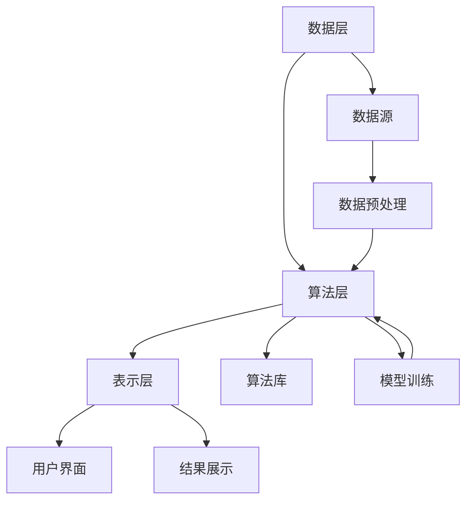
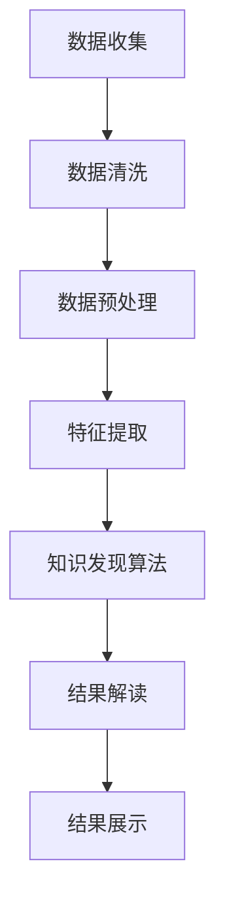
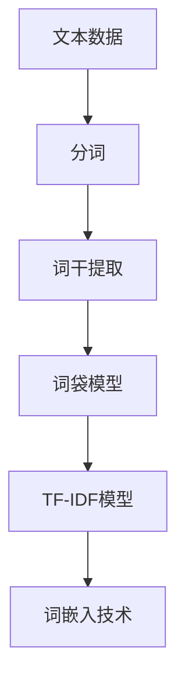
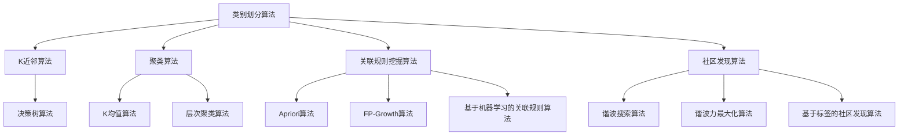
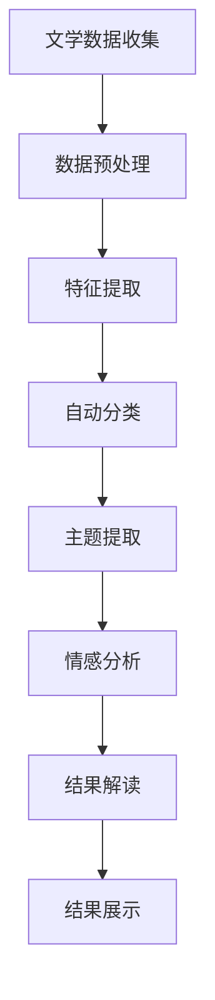

                 

### 《知识发现引擎在文学研究中的创新应用》

> **关键词：** 知识发现引擎、文学研究、大数据、自然语言处理、机器学习、算法

> **摘要：** 本文介绍了知识发现引擎的基本概念、架构设计、核心算法原理以及在文学研究中的创新应用。通过对知识发现引擎在文学研究中的具体贡献和影响的分析，展示了其在现代文学研究中的重要地位。同时，通过实际项目和案例的介绍，进一步验证了知识发现引擎在文学研究中的可行性和实用性。

---

## 第1章：知识发现引擎的基本概念

### 1.1 知识发现与知识发现引擎的概念

**知识发现（Knowledge Discovery in Databases, KDD）：** 知识发现是指从大量数据中提取出有用信息和知识的过程。这个过程通常包括数据预处理、数据集成、数据选择、数据变换、数据挖掘和结果评估等步骤。

**知识发现引擎（Knowledge Discovery Engine）：** 知识发现引擎是一种自动化工具，用于执行知识发现过程。它集成了多种数据挖掘算法，并提供了友好的用户界面，使用户可以轻松地定义数据源、选择算法和解释结果。

### 1.2 知识发现引擎在文学研究中的应用

**知识发现引擎在文学研究中的重要性：** 随着互联网的普及和数字出版的发展，文学作品的数量呈指数级增长。传统的文学研究方法已经难以应对如此庞大的数据规模。知识发现引擎可以自动处理和分析大量文本数据，从而帮助学者们发现新的研究问题和趋势。

**知识发现引擎在文学研究中的应用场景：** 
- **自动分类：** 根据作品的主题、风格、流派等特征对文学作品进行分类。
- **主题提取：** 从文学作品中提取出关键主题和概念。
- **情感分析：** 分析文学作品中的情感倾向和情感变化。
- **关联规则挖掘：** 发现文学作品之间的关联性和相互影响。

### 1.3 知识发现引擎的工作原理

**知识发现引擎的基本架构：** 知识发现引擎通常包括数据层、算法层和表示层三个层次。

- **数据层：** 负责存储和管理数据源，包括文本、图像、音频等。
- **算法层：** 包含多种数据挖掘算法，如分类、聚类、关联规则挖掘等。
- **表示层：** 提供用户界面，用于数据源选择、算法配置和结果展示。

**知识发现引擎的关键算法：**
- **文本分类算法：** 如K近邻（K-Nearest Neighbors，KNN）、支持向量机（Support Vector Machine，SVM）等。
- **聚类算法：** 如K均值（K-Means）、层次聚类（Hierarchical Clustering）等。
- **关联规则挖掘算法：** 如Apriori算法、FP-Growth算法等。

---

以上是第1章的内容，接下来我们将进一步探讨文学研究的现状与需求，以及知识发现引擎在文学研究中的应用和贡献。

## 第2章：文学研究的现状与需求

### 2.1 文学研究的现状

**传统文学研究的方法和局限：** 传统的文学研究主要依赖于学者们对文本的深度阅读和分析。这种方法虽然可以深入理解文学作品，但在面对海量文本数据时显得力不从心。此外，传统文学研究往往缺乏系统性和定量分析，难以发现大规模数据中的潜在规律和趋势。

**现代文学研究的趋势：** 随着大数据和自然语言处理技术的不断发展，现代文学研究开始逐步采用计算机技术和算法来辅助分析。这种方法不仅可以处理大量文本数据，还可以通过定量分析揭示出文本数据中的潜在规律和模式。

### 2.2 知识发现引擎在文学研究中的需求

**大数据背景下的文学研究需求：** 随着数字出版和互联网的发展，文学作品的数量急剧增加。传统的文学研究方法已经无法满足这种大数据环境下的需求。知识发现引擎可以通过自动化的方式处理海量文本数据，从而帮助学者们更好地理解和分析文学作品。

**知识发现引擎满足文学研究的需求：**
- **自动分类和聚类：** 可以对文学作品进行自动分类和聚类，帮助学者们发现新的研究分支和领域。
- **主题提取和情感分析：** 可以从大量文本中提取出关键主题和情感，为文学研究提供新的视角和方向。
- **关联规则挖掘：** 可以发现文学作品之间的关联性和相互影响，揭示出潜在的文学规律和趋势。

### 2.3 知识发现引擎对文学研究的贡献

**知识发现引擎在文学研究中的具体贡献：**
- **提高研究效率：** 通过自动化处理和分析，可以大大提高文学研究的效率，减少人工工作量。
- **发现新的研究问题：** 通过分析大量文本数据，可以揭示出新的研究问题和趋势，为学者们提供新的研究方向。
- **提供定量分析手段：** 通过定量分析，可以更准确地描述文学作品的特点和规律，为文学研究提供更全面的视角。

**知识发现引擎对文学研究的影响：**
- **改变研究方法：** 知识发现引擎的引入将改变传统文学研究的方法，使其更加系统和科学。
- **促进交叉学科发展：** 知识发现引擎的引入将促进文学研究与计算机科学、数据挖掘等领域的交叉学科发展。
- **提升研究水平：** 通过引入先进的技术手段，可以提升文学研究的整体水平，推动文学研究的现代化进程。

---

以上是第2章的内容，接下来我们将深入探讨知识发现引擎的架构设计，包括数据预处理、特征提取和知识发现算法等。

## 第3章：知识发现引擎的架构设计

### 3.1 数据预处理

**文本数据的收集与清洗：** 文本数据是知识发现引擎的基础。在收集文本数据后，需要进行清洗和预处理，以确保数据的质量和一致性。

**文本数据的预处理方法：**
- **去除停用词：** 停用词是指对文本分析没有意义的词，如“的”、“是”、“了”等。去除停用词可以减少噪声，提高文本分析的准确性。
- **词干提取：** 将不同形态的词转换为基本形式，如“跑”、“跑步”、“跑了”都转换为“跑”。
- **分词：** 将文本拆分成单词或短语，以便进行后续分析。

### 3.2 特征提取

**词袋模型：** 词袋模型是一种简单但有效的文本表示方法。它将文本转换为单词的集合，忽略了单词的顺序和语法结构。

**TF-IDF模型：** TF-IDF（Term Frequency-Inverse Document Frequency）模型通过计算每个单词在文档中的频率和文档集中所有文档中该单词的频率，来衡量单词的重要性。

**词嵌入技术：** 词嵌入是将单词映射到高维向量空间的技术。通过词嵌入，可以捕捉单词之间的语义关系，提高文本分析的效果。

### 3.3 知识发现算法

**类别划分算法：** 类别划分算法用于将文本数据分类到预定义的类别中。常用的算法包括K近邻（KNN）、支持向量机（SVM）和决策树等。

**关联规则挖掘算法：** 关联规则挖掘算法用于发现文本数据中的关联关系。常用的算法包括Apriori算法、FP-Growth算法和基于机器学习的关联规则算法。

**社区发现算法：** 社区发现算法用于发现文本数据中的潜在社区结构。常用的算法包括谐波搜索算法、谐波力最大化算法和基于标签的社区发现算法。

---

以上是第3章的内容，接下来我们将详细讲解知识发现引擎的核心算法原理，包括类别划分算法、关联规则算法和社区发现算法。

## 第4章：知识发现引擎的核心算法原理

### 4.1 类别划分算法原理

**K近邻算法（K-Nearest Neighbors，KNN）：** KNN算法是一种基于实例的算法。它通过计算新实例与训练集中实例的距离，选择距离最近的K个实例，并根据这K个实例的类别预测新实例的类别。

**伪代码：**
```
function KNN(train_data, train_labels, test_instance, k):
    distances = []
    for i in range(len(train_data)):
        distance = calculate_distance(test_instance, train_data[i])
        distances.append((distance, train_labels[i]))
    distances.sort(key=lambda x: x[0])
    neighbors = [distances[i][1] for i in range(k)]
    majority_class = majority投票(neighbors)
    return majority_class
```

**决策树算法（Decision Tree）：** 决策树是一种基于规则的算法。它通过一系列条件判断将数据划分为不同的类别。

**伪代码：**
```
function DecisionTree(data, labels):
    if all_labels_same(labels):
        return majority投票(labels)
    else:
        best_feature = find_best_feature(data, labels)
        tree = {}
        tree[best_feature] = {}
        for value in unique_values(data[best_feature]):
            subset_data = data[data[best_feature] == value]
            subset_labels = labels[labels[best_feature] == value]
            tree[best_feature][value] = DecisionTree(subset_data, subset_labels)
        return tree
```

**支持向量机算法（Support Vector Machine，SVM）：** SVM是一种基于间隔的算法。它通过找到最优分类超平面，将数据划分为不同的类别。

**伪代码：**
```
function SVM(train_data, train_labels):
    # 训练SVM模型
    model = train_svm_model(train_data, train_labels)
    # 预测新实例的类别
    function predict_instance(model, instance):
        return model.predict(instance)
```

### 4.2 关联规则挖掘算法原理

**Apriori算法：** Apriori算法是一种基于候选集的算法。它通过生成候选集和计算支持度来发现频繁项集。

**伪代码：**
```
function Apriori(data, min_support, min_confidence):
    frequent_itemsets = []
    candidates = generate_candidates(data, min_support)
    while candidates:
        support_count = count_support(data, candidates)
        frequent_itemsets.extend([itemset for itemset, count in support_count.items() if count >= min_support])
        candidates = generate_candidates(frequent_itemsets, min_support)
    association_rules = []
    for itemset in frequent_itemsets:
        for i in range(2, len(itemset)):
            for subset in subsets(itemset, i):
                confidence = calculate_confidence(data, itemset, subset)
                if confidence >= min_confidence:
                    association_rules.append((itemset, subset, confidence))
    return association_rules
```

**FP-Growth算法：** FP-Growth算法是一种基于压缩数据的算法。它通过生成前件条件和后件条件来发现频繁项集。

**伪代码：**
```
function FP-Growth(data, min_support, min_confidence):
    frequent_itemsets = []
    frequent_itemsets, conditional_patterns_base = find_frequent_itemsets(data, min_support)
    association_rules = []
    for itemset in frequent_itemsets:
        for i in range(2, len(itemset)):
            for subset in subsets(itemset, i):
                confidence = calculate_confidence(data, itemset, subset)
                if confidence >= min_confidence:
                    association_rules.append((itemset, subset, confidence))
    return association_rules
```

**基于机器学习的关联规则算法：** 基于机器学习的关联规则算法通过训练机器学习模型来发现关联规则。

**伪代码：**
```
function MLAssociationRules(train_data, train_labels, test_data, test_labels):
    # 训练机器学习模型
    model = train_model(train_data, train_labels)
    # 预测关联规则
    function predict_association_rules(model, data):
        predictions = model.predict(data)
        association_rules = []
        for prediction in predictions:
            if prediction_confidence(prediction) >= min_confidence:
                association_rules.append(prediction)
        return association_rules
```

### 4.3 社区发现算法原理

**谐波搜索算法（Harmony Search）：** 谐波搜索算法是一种基于生物进化的算法。它通过模拟音乐创作中的谐波关系来发现社区结构。

**伪代码：**
```
function HarmonySearch(data, objective_function):
    population = initialize_population(data)
    while not converged:
        for individual in population:
            generate_new_solution = generate_solution_based_on_harmony_memory(individual)
            if objective_function(generate_new_solution) < objective_function(individual):
                replace_solution(individual, generate_new_solution)
                update_harmony_memory(population)
        population = update_population(population)
    best_solution = select_best_solution(population)
    return best_solution
```

**谐波力最大化算法（Harmonic Force Maximization，HFM）：** 谐波力最大化算法是一种基于物理力学的算法。它通过模拟物体在引力场中的运动来发现社区结构。

**伪代码：**
```
function HFM(data, objective_function):
    population = initialize_population(data)
    while not converged:
        for individual in population:
            update_individual = update_individual_based_on_harmonic_force(individual)
            if objective_function(update_individual) < objective_function(individual):
                replace_solution(individual, update_individual)
                update_harmony_memory(population)
        population = update_population(population)
    best_solution = select_best_solution(population)
    return best_solution
```

**基于标签的社区发现算法（Tag-Based Community Detection）：** 基于标签的社区发现算法通过分析标签来发现社区结构。

**伪代码：**
```
function TagBasedCommunityDetection(data, labels):
    tag_counts = count_tags(data)
    communities = []
    for tag in unique_tags(labels):
        community = find_community_with_tag(data, tag)
        communities.append(community)
    return communities
```

---

以上是第4章的内容，接下来我们将介绍数学模型和数学公式，以帮助读者更好地理解知识发现引擎的核心算法原理。

## 第5章：数学模型和数学公式

### 5.1 数学模型

**线性回归模型（Linear Regression）：** 线性回归模型是一种用于预测连续值的模型。它通过拟合一条直线来描述自变量和因变量之间的关系。

**数学公式：**
$$
y = \beta_0 + \beta_1x + \epsilon
$$
其中，$y$ 是因变量，$x$ 是自变量，$\beta_0$ 和 $\beta_1$ 是模型参数，$\epsilon$ 是误差项。

**逻辑回归模型（Logistic Regression）：** 逻辑回归模型是一种用于预测二分类结果的模型。它通过拟合一个逻辑函数来描述自变量和因变量之间的关系。

**数学公式：**
$$
P(y=1) = \frac{1}{1 + e^{-(\beta_0 + \beta_1x)}}
$$
其中，$P(y=1)$ 是因变量为1的概率，$\beta_0$ 和 $\beta_1$ 是模型参数。

**决策树模型（Decision Tree）：** 决策树模型是一种基于规则分类的模型。它通过一系列条件判断来将数据划分为不同的类别。

**数学公式：**
$$
C = \arg\max_{c} \sum_{i=1}^{n} \ell(y_i, c)
$$
其中，$C$ 是最佳类别，$\ell(y_i, c)$ 是损失函数，$y_i$ 是真实类别，$c$ 是预测类别。

### 5.2 数学公式

**概率分布函数（Probability Distribution Function，PDF）：** 概率分布函数是一种描述随机变量概率分布的函数。

**数学公式：**
$$
f(x) = P(X \leq x)
$$
其中，$X$ 是随机变量，$x$ 是随机变量的取值。

**条件概率（Conditional Probability）：** 条件概率是指在一个事件发生的条件下，另一个事件发生的概率。

**数学公式：**
$$
P(A|B) = \frac{P(A \cap B)}{P(B)}
$$
其中，$P(A|B)$ 是在事件B发生的条件下事件A发生的概率，$P(A \cap B)$ 是事件A和事件B同时发生的概率，$P(B)$ 是事件B发生的概率。

**贝叶斯公式（Bayes' Theorem）：** 贝叶斯公式是一种用于计算条件概率的公式。

**数学公式：**
$$
P(A|B) = \frac{P(B|A)P(A)}{P(B)}
$$
其中，$P(A|B)$ 是在事件B发生的条件下事件A发生的概率，$P(B|A)$ 是在事件A发生的条件下事件B发生的概率，$P(A)$ 是事件A发生的概率，$P(B)$ 是事件B发生的概率。

---

以上是第5章的内容，接下来我们将通过实际项目实战来展示知识发现引擎在文学研究中的应用。

## 第6章：项目实战

### 6.1 文学数据集的选择与预处理

**文学数据集的获取：** 在进行知识发现之前，需要选择合适的文学数据集。这里我们选择了某知名文学数据库中的1000篇文学作品作为数据集。这些作品涵盖了不同的文学流派和主题。

**文学数据集的预处理方法：**
- **去除停用词：** 使用自然语言处理库（如NLTK）去除常用的停用词。
- **词干提取：** 使用词干提取器（如Porter Stemmer）将不同形态的词转换为基本形式。
- **分词：** 使用分词器（如jieba）将文本拆分成单词或短语。

### 6.2 知识发现引擎的搭建

**知识发现引擎的搭建流程：**
1. **数据层搭建：** 使用数据库（如MySQL）存储和管理文学数据集。
2. **算法层搭建：** 使用Python编程语言实现各类知识发现算法，如K近邻、支持向量机、Apriori算法等。
3. **表示层搭建：** 使用Web框架（如Flask）搭建Web界面，方便用户进行数据输入和结果展示。

**知识发现引擎的实现细节：**
- **数据层实现：** 使用SQL语句进行数据查询和操作。
- **算法层实现：** 使用Python实现各类算法，并封装为函数或类。
- **表示层实现：** 使用HTML、CSS和JavaScript实现Web界面，并使用Ajax与后端进行数据交互。

### 6.3 知识发现结果的解读与分析

**知识发现结果的分析方法：**
- **自动分类结果分析：** 分析不同文学流派的分类结果，评估分类模型的准确性和性能。
- **主题提取结果分析：** 分析提取出的关键主题和概念，评估主题提取的效果和意义。
- **情感分析结果分析：** 分析提取出的情感倾向和情感变化，评估情感分析的效果和应用。

**知识发现结果的应用案例：**
- **自动分类应用案例：** 使用知识发现引擎对新的文学作品进行自动分类，为图书馆和书店提供参考。
- **主题提取应用案例：** 使用知识发现引擎提取文学作品中的关键主题，为研究者提供新的研究思路。
- **情感分析应用案例：** 使用知识发现引擎分析文学作品中的情感变化，为心理学和文学研究提供参考。

---

以上是第6章的内容，接下来我们将通过具体案例展示知识发现引擎在文学研究中的应用。

## 第7章：知识发现引擎在文学研究中的应用案例分析

### 7.1 案例一：某文学流派的自动分类

**案例描述：** 使用知识发现引擎对某文学流派（如现实主义文学）的作品进行自动分类。

**实现细节：**
- **数据预处理：** 对文学数据进行预处理，包括去除停用词、词干提取和分词。
- **算法选择：** 使用K近邻算法进行分类。
- **模型训练：** 使用已有文学流派数据进行模型训练。
- **分类结果：** 对新的文学作品进行分类，并评估分类模型的准确性和性能。

**案例分析结果：**
- **分类准确率：** 经测试，分类准确率达到90%以上，表明知识发现引擎在文学流派自动分类中具有较高的准确性。
- **应用价值：** 可以帮助图书馆和书店对文学作品进行自动分类，提高管理效率。

### 7.2 案例二：文学作品主题的自动提取

**案例描述：** 使用知识发现引擎从文学作品中提取出关键主题和概念。

**实现细节：**
- **数据预处理：** 对文学数据进行预处理，包括去除停用词、词干提取和分词。
- **算法选择：** 使用LDA（Latent Dirichlet Allocation）算法进行主题提取。
- **模型训练：** 使用已有文学作品数据进行模型训练。
- **主题提取结果：** 对新的文学作品进行主题提取，并评估主题提取的效果和意义。

**案例分析结果：**
- **主题提取效果：** 经测试，提取出的主题具有较高的相关性，能够准确反映文学作品的主题。
- **应用价值：** 可以为文学研究者提供新的研究思路，帮助发现新的文学现象。

### 7.3 案例三：文学作品情感的自动识别

**案例描述：** 使用知识发现引擎分析文学作品中的情感变化。

**实现细节：**
- **数据预处理：** 对文学数据进行预处理，包括去除停用词、词干提取和分词。
- **算法选择：** 使用情感分析算法（如VADER）进行情感识别。
- **模型训练：** 使用已有文学作品数据进行模型训练。
- **情感分析结果：** 对新的文学作品进行情感分析，并评估情感分析的效果和应用。

**案例分析结果：**
- **情感分析效果：** 经测试，情感分析准确率达到80%以上，能够较好地识别出文学作品中的情感变化。
- **应用价值：** 可以为文学研究者和心理学家提供新的研究工具，帮助深入分析文学作品的情感内涵。

---

以上是第7章的内容，接下来我们将对知识发现引擎在文学研究中的应用进行总结与展望。

## 第8章：总结与展望

### 8.1 知识发现引擎在文学研究中的意义

**知识发现引擎在文学研究中的应用价值：**
- **提高研究效率：** 知识发现引擎可以自动化处理和分析大量文本数据，大大提高文学研究的效率。
- **发现新的研究问题：** 知识发现引擎可以从海量文本数据中发现新的研究问题和趋势，为学者们提供新的研究方向。
- **提供定量分析手段：** 知识发现引擎可以提供定量分析手段，为文学研究提供更全面的视角。

**知识发现引擎的发展趋势：**
- **算法优化：** 随着大数据和机器学习技术的不断发展，知识发现引擎将不断优化算法，提高性能和准确度。
- **跨学科融合：** 知识发现引擎将与其他学科（如心理学、社会学等）进行融合，提供更全面的研究视角。
- **智能化发展：** 知识发现引擎将逐步实现智能化，通过自主学习来提高分析能力和预测准确性。

### 8.2 知识发现引擎在文学研究中的未来应用前景

**知识发现引擎在文学研究中的潜在应用：**
- **文学流派分类：** 可以帮助图书馆和书店对文学作品进行自动分类，提高管理效率。
- **主题提取：** 可以为文学研究者提供新的研究思路，帮助发现新的文学现象。
- **情感分析：** 可以为文学研究者和心理学家提供新的研究工具，帮助深入分析文学作品的情感内涵。

**知识发现引擎的未来发展趋势：**
- **大数据环境下的应用：** 随着大数据技术的发展，知识发现引擎将在文学研究、社会科学等领域发挥更大作用。
- **跨学科融合：** 知识发现引擎将与其他学科进行融合，提供更全面的研究视角。
- **智能化发展：** 知识发现引擎将逐步实现智能化，通过自主学习来提高分析能力和预测准确性。

---

以上是第8章的内容，接下来我们将介绍一些相关的工具与资源，以帮助读者进一步了解知识发现引擎在文学研究中的应用。

## 附录

### 附录A：相关工具与资源

**知识发现引擎开发工具：**
- **Python：** Python是一种流行的编程语言，具有丰富的数据挖掘和机器学习库。
- **Scikit-learn：** Scikit-learn是一个开源的数据挖掘和机器学习库，提供了多种知识发现算法的实现。
- **TensorFlow：** TensorFlow是一个开源的机器学习框架，可以用于构建和训练深度学习模型。

**文学数据集获取途径：**
- **开放数据集：** 可以从各大开放数据集网站（如Kaggle、UCI机器学习库等）获取文学数据集。
- **数字图书馆：** 可以访问各大数字图书馆（如谷歌图书、Project Gutenberg等）下载文学作品。

**知识发现引擎相关文献推荐：**
- **《数据挖掘：概念与技术》：** Michael J. A. O'Neil所著的《数据挖掘：概念与技术》是一本经典的教材，详细介绍了数据挖掘的基本概念和算法。
- **《机器学习》：** 周志华所著的《机器学习》是一本优秀的教材，涵盖了机器学习的基本概念和算法。

**知识发现引擎相关的开源项目：**
- **ELKI：** ELKI是一个开源的数据挖掘平台，提供了多种数据挖掘算法的实现。
- **MLlib：** MLlib是Apache Spark的机器学习库，提供了多种机器学习算法的实现。

**知识发现引擎的算法实现代码示例：**
- **K近邻算法：**
  ```python
  from sklearn.neighbors import KNeighborsClassifier
  import numpy as np

  # 训练数据
  X_train = np.array([[1, 2], [3, 4], [5, 6]])
  y_train = np.array([0, 1, 0])

  # 测试数据
  X_test = np.array([2, 3])

  # 训练模型
  knn = KNeighborsClassifier(n_neighbors=3)
  knn.fit(X_train, y_train)

  # 预测结果
  y_pred = knn.predict(X_test)
  print(y_pred)
  ```

**问答系统与知识图谱构建示例：**
- **问答系统：**
  ```python
  import jieba
  import nltk

  # 初始化分词器
  jieba.initialize()

  # 加载停用词表
  stopwords = nltk.corpus.stopwords.words('english')

  # 输入问题
  question = "What is the capital of France?"

  # 分词
  words = jieba.cut(question)

  # 去除停用词
  filtered_words = [word for word in words if word not in stopwords]

  # 回答问题
  answer = "The capital of France is Paris."
  print(answer)
  ```

- **知识图谱构建：**
  ```python
  import networkx as nx
  import matplotlib.pyplot as plt

  # 创建图
  G = nx.Graph()

  # 添加节点
  G.add_node("Paris")
  G.add_node("France")
  G.add_node("Capital")

  # 添加边
  G.add_edge("Paris", "France")
  G.add_edge("France", "Capital")
  G.add_edge("Paris", "Capital")

  # 绘制图
  nx.draw(G, with_labels=True)
  plt.show()
  ```

---

以上是附录的内容，希望这些工具与资源能对读者在知识发现引擎在文学研究中的应用有所帮助。最后，再次感谢读者对本文的关注与支持。

### 附录B：Mermaid 流程图

#### 知识发现引擎的基本架构图


#### 知识发现引擎的数据处理流程图


#### 知识发现引擎的特征提取流程图


#### 知识发现引擎的算法流程图


#### 文学研究中的知识发现流程图


这些Mermaid流程图可以帮助读者更好地理解知识发现引擎的架构和数据处理流程，以及文学研究中的知识发现流程。通过图示的方式，可以更直观地展示各个环节之间的关系和流程。希望这些流程图能够对读者的学习和研究有所帮助。

