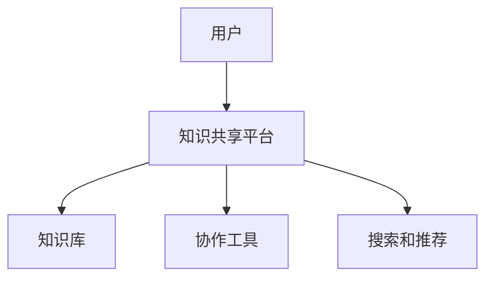
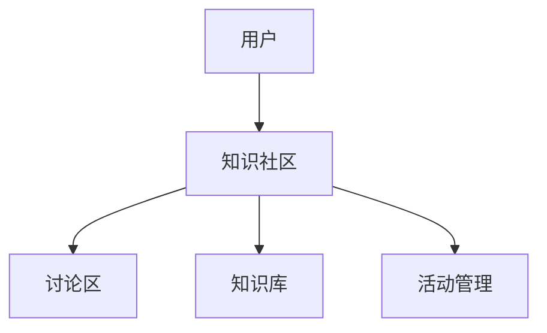
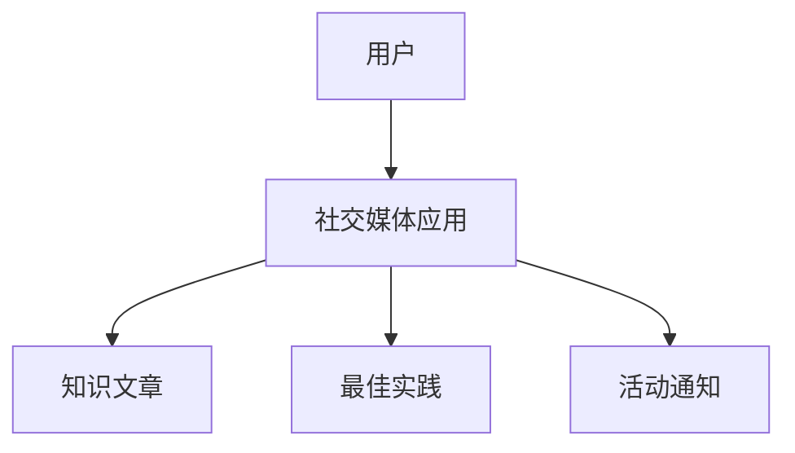
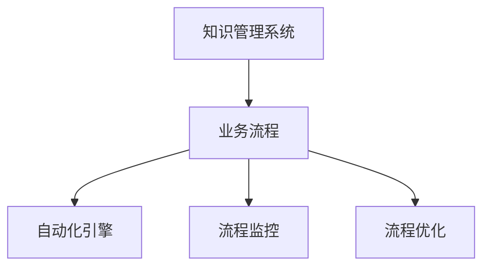
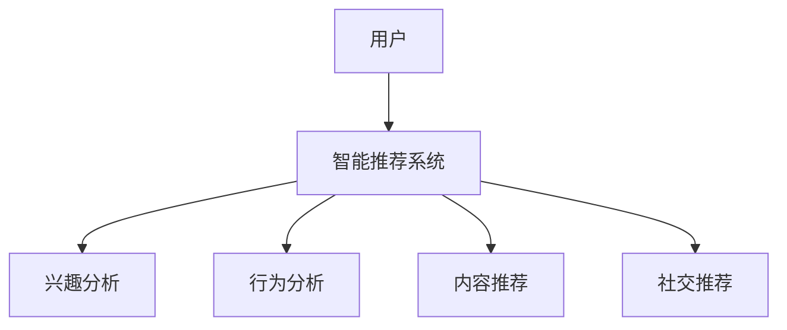
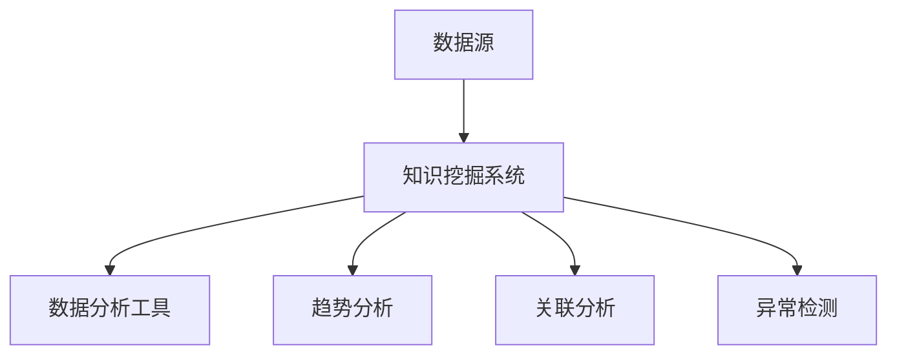

                 

### 《知识管理系统：构建企业智慧大脑》

在当今快速变化和高度竞争的商业环境中，企业需要迅速响应市场变化，提高决策效率，并持续创新以保持竞争力。知识管理系统（Knowledge Management System，简称KMS）作为一种强大的工具，正在帮助企业构建智慧大脑，实现知识的有效管理和利用。本文将详细探讨知识管理系统的核心概念、架构、关键技术、实施策略以及在各个领域的应用，旨在为企业和IT专业人士提供一份全面的技术指南。

#### 关键词：
- 知识管理系统
- 知识管理
- 企业智慧大脑
- 关键技术
- 实施策略
- 应用领域

#### 摘要：
本文将深入探讨知识管理系统在企业中的应用，从核心概念和架构出发，逐步分析关键技术、实施策略，并详细讨论在研发管理、市场营销、客户服务和人力资源管理中的具体应用。最后，本文将展望知识管理系统的未来发展，为企业的数字化转型提供有力支持。

----------------------------------------------------------------

### 第一部分：知识管理系统概述

知识管理系统是一种用于管理、存储、共享和利用企业知识的软件平台。它的核心目标是确保企业知识能够被有效地获取、存储、传播和应用，从而提高企业的整体竞争力和创新能力。本部分将介绍知识管理系统的核心概念、架构和关键技术。

#### 第1章：知识管理系统的核心概念与架构

##### 1.1 知识管理系统的定义与重要性

知识管理系统（KMS）是一种用于支持知识管理过程的软件平台，它集成了知识捕获、知识存储、知识共享、知识应用和知识评价等功能。知识管理（KM）是一个更广泛的概念，它包括一系列策略、过程和技术，用于识别、创造、组织和利用知识以实现组织的战略目标。

知识管理系统在企业中的价值体现在以下几个方面：

1. **提高知识共享和协作**：KMS促进了企业内部知识的流动，减少了信息孤岛现象，提高了团队合作效率。
2. **增强决策支持**：KMS提供了快速访问历史数据和最佳实践的功能，帮助企业做出更明智的决策。
3. **促进创新**：通过知识管理，企业能够更好地利用内部和外部知识，激发创新思维，推动产品和服务的发展。
4. **降低培训成本**：KMS存储了员工的经验和知识，新员工可以通过访问这些信息来快速学习和成长。

##### 1.2 知识管理系统的架构

知识管理系统的架构通常包括以下模块：

1. **知识捕获**模块：负责收集和捕获员工的知识和经验，包括结构化、非结构化和语义网数据。
2. **知识存储**模块：负责存储和管理捕获的知识，包括关系数据库、NoSQL数据库和分布式存储系统。
3. **知识共享**模块：负责在企业内部或外部传播和共享知识，包括知识共享平台、知识社区和社交媒体。
4. **知识应用**模块：负责将知识应用于业务流程和决策过程，包括业务流程集成、智能推荐系统和知识挖掘与数据分析。
5. **知识评价**模块：负责评估知识的价值和使用效果，包括知识审核与维护、知识库结构设计和知识库内容管理。

##### 1.3 知识管理系统的体系结构

知识管理系统的体系结构可以分为客户端架构、服务器端架构和数据库架构：

1. **客户端架构**：包括用户界面、业务逻辑层和数据访问层，用户通过客户端与系统进行交互。
2. **服务器端架构**：包括服务器端业务逻辑层和数据访问层，负责处理客户端请求，存储和管理数据。
3. **数据库架构**：包括数据存储层和知识库，用于存储和管理各种类型的知识数据。

#### 第2章：知识管理系统的关键技术

知识管理系统的成功实施依赖于一系列关键技术的支持。这些技术包括知识捕获技术、知识存储技术、知识共享与传播技术以及知识应用与自动化技术。本章节将详细探讨这些关键技术。

##### 2.1 知识捕获技术

知识捕获是知识管理过程的第一步，它涉及到从员工、文档、数据库和其他数据源中提取和收集知识。知识捕获技术可以分为以下几类：

1. **结构化知识捕获**：通过电子表格、数据库和其他结构化数据源捕获知识。
2. **非结构化知识捕获**：通过电子邮件、文档、报告和其他非结构化数据源捕获知识。
3. **语义网知识捕获**：通过语义分析技术捕获知识，这些技术包括自然语言处理（NLP）和本体论。

##### 2.2 知识存储技术

知识存储是知识管理系统的核心，它负责管理和保护企业知识。知识存储技术包括以下几种：

1. **关系数据库**：用于存储结构化数据，如员工信息、客户数据和业务流程数据。
2. **NoSQL数据库**：用于存储非结构化数据，如文档、图像和视频。
3. **分布式存储系统**：用于存储大规模数据集，提供高可用性和可扩展性。

##### 2.3 知识共享与传播技术

知识共享与传播是知识管理的关键环节，它涉及到如何将知识在企业内部或外部进行传播和共享。知识共享与传播技术包括以下几种：

1. **知识共享平台**：提供员工之间交流和知识共享的场所，如Trellix和Notion。
2. **知识社区**：鼓励员工围绕特定主题进行讨论和知识分享，如Slack和Microsoft Teams。
3. **社交媒体应用**：通过社交媒体工具，如Twitter和LinkedIn，共享和传播知识。

##### 2.4 知识应用与自动化

知识应用与自动化是知识管理的最终目标，它涉及到如何将知识应用于实际业务流程和决策过程中。知识应用与自动化技术包括以下几种：

1. **业务流程集成**：将知识管理系统与企业的业务流程集成，实现知识的自动化应用。
2. **智能推荐系统**：基于用户的兴趣和行为，推荐相关的知识和资源。
3. **知识挖掘与数据分析**：通过数据挖掘和分析技术，从大量数据中提取有价值的信息和知识。

#### 第3章：知识管理系统的实施策略

实施知识管理系统需要一系列策略和步骤，以确保系统能够满足企业的需求和预期目标。本章节将介绍知识管理系统的实施策略，包括实施前的评估与规划、知识管理流程设计、员工参与与培训以及系统部署与维护。

##### 3.1 实施前的评估与规划

在实施知识管理系统之前，企业需要进行全面的评估和规划，以确保系统符合企业的战略目标和业务需求。评估与规划包括以下步骤：

1. **企业现状分析**：分析企业的知识管理现状，了解当前的知识流动情况和存在的问题。
2. **需求分析**：确定企业对知识管理系统的具体需求，包括功能、性能、安全性等方面的要求。
3. **系统设计**：设计知识管理系统的架构和功能，确定技术方案和开发计划。

##### 3.2 知识管理流程设计

知识管理流程设计是知识管理系统实施的关键步骤，它涉及到如何设计和实施知识管理的过程。知识管理流程设计包括以下内容：

1. **知识分类与标签化**：根据企业的业务需求，对知识进行分类和标签化，以便于管理和查找。
2. **知识获取与转化**：设计知识获取和转化的流程，确保知识的准确性和实用性。
3. **知识审核与维护**：建立知识审核和维护机制，确保知识的更新和准确性。

##### 3.3 员工参与与培训

员工参与与培训是知识管理系统成功实施的关键因素。为了确保员工积极参与知识管理，企业需要采取以下措施：

1. **员工参与策略**：鼓励员工积极参与知识管理，提供激励措施和奖励机制。
2. **培训计划与实施**：制定员工培训计划，包括知识管理的基本原理、工具使用和最佳实践。
3. **激励与反馈机制**：建立激励和反馈机制，鼓励员工分享知识和经验，并对贡献者进行表彰。

##### 3.4 系统部署与维护

知识管理系统的部署与维护是确保系统能够长期稳定运行的关键。系统部署与维护包括以下内容：

1. **系统部署方案**：设计系统部署方案，包括硬件设备、网络架构和软件安装。
2. **系统运维策略**：建立系统运维策略，包括日常监控、故障排除和安全防护。
3. **系统更新与升级**：定期更新和升级系统，确保系统能够适应业务发展的需求。

### 第一部分总结

知识管理系统作为企业智慧大脑的重要组成部分，对于提高企业竞争力和创新能力具有重要意义。通过本部分的介绍，我们了解了知识管理系统的核心概念、架构和关键技术，以及实施策略。在接下来的部分，我们将进一步探讨知识管理系统在各个领域的具体应用，为企业提供更深入的实践指南。

----------------------------------------------------------------

### 第1章：知识管理系统的核心概念与架构

知识管理系统（KMS）是企业中用于管理和利用知识的软件平台。它通过集成知识捕获、知识存储、知识共享、知识应用和知识评价等功能，帮助企业将知识转化为有价值的资产。本章将详细探讨知识管理系统的核心概念、架构和关键技术。

#### 1.1 知识管理系统定义与重要性

知识管理系统是一种综合性的软件平台，旨在支持企业知识管理活动。知识管理（KM）是一个广泛的概念，它包括识别、创造、组织和利用知识的过程，以支持企业的战略目标和运营。知识管理系统则是实现知识管理目标的技术手段，它通过以下核心功能来提升企业知识利用效率：

1. **知识捕获**：从员工、客户、合作伙伴和其他数据源中提取和收集知识。
2. **知识存储**：将捕获的知识存储在数据库中，以便长期保存和检索。
3. **知识共享**：在企业内部或外部传播和共享知识，促进知识流动。
4. **知识应用**：将知识应用于业务流程和决策过程中，提高效率和创新能力。
5. **知识评价**：评估知识的价值和使用效果，确保知识的持续优化。

知识管理系统的重要性体现在以下几个方面：

- **提高知识共享和协作**：通过知识管理系统，企业可以打破信息孤岛，促进知识的共享和协作，从而提高团队效率。
- **增强决策支持**：知识管理系统提供了一个集中的知识库，使决策者能够快速访问历史数据和最佳实践，做出更明智的决策。
- **促进创新**：通过知识管理系统，企业可以更好地利用内部和外部知识，激发创新思维，推动产品和服务的发展。
- **降低培训成本**：知识管理系统存储了员工的经验和知识，新员工可以通过访问这些信息来快速学习和成长，减少培训成本。
- **提高客户满意度**：通过知识管理系统，企业可以更好地理解和满足客户需求，提供更优质的客户服务。

#### 1.2 知识管理系统的架构

知识管理系统的架构包括多个层次，从客户端到服务器端，再到数据库。以下是知识管理系统架构的详细分解：

##### 1.2.1 客户端架构

客户端架构是用户与知识管理系统交互的界面。它通常包括以下组成部分：

1. **用户界面（UI）**：用户通过用户界面与知识管理系统进行交互，包括搜索、浏览、编辑和共享功能。
2. **业务逻辑层**：处理用户请求，执行业务逻辑，如知识搜索、推荐和权限控制。
3. **数据访问层**：负责与服务器端通信，获取和发送数据。

客户端架构的设计应注重用户体验，确保界面直观、易用，同时提供强大的功能以满足用户需求。

##### 1.2.2 服务器端架构

服务器端架构负责处理客户端请求，存储和管理数据。它通常包括以下组成部分：

1. **服务器端业务逻辑层**：处理业务逻辑，如知识捕获、存储、共享和应用。
2. **数据访问层**：与数据库进行交互，实现数据的存储和检索。
3. **服务接口**：为客户端提供API接口，以便客户端可以调用服务器端的服务。

服务器端架构的设计应注重性能、稳定性和安全性，确保系统能够处理大量并发请求，同时保护数据安全。

##### 1.2.3 数据库架构

数据库架构是知识管理系统的数据存储和管理部分。根据知识类型和需求，数据库架构可以采用多种模式：

1. **关系数据库**：适用于存储结构化数据，如员工信息、客户数据和业务流程数据。常用的关系数据库包括MySQL、PostgreSQL和Oracle。
2. **NoSQL数据库**：适用于存储非结构化数据，如文档、图像和视频。常用的NoSQL数据库包括MongoDB、Cassandra和Redis。
3. **分布式存储系统**：适用于存储大规模数据集，提供高可用性和可扩展性。常用的分布式存储系统包括Hadoop、HDFS和Cassandra。

数据库架构的设计应考虑数据的一致性、可靠性和性能，同时支持数据的高效存储和检索。

#### 1.3 知识管理系统的体系结构

知识管理系统的体系结构包括多个模块，每个模块负责不同的知识管理功能。以下是知识管理系统体系结构的详细分解：

##### 1.3.1 知识捕获模块

知识捕获模块负责从各种数据源中收集和提取知识。它包括以下功能：

1. **结构化知识捕获**：通过API接口、Web爬虫等技术，从企业内部和外部的结构化数据源（如数据库、电子表格）中捕获知识。
2. **非结构化知识捕获**：通过OCR、自然语言处理（NLP）等技术，从非结构化数据源（如文档、图像、视频）中捕获知识。
3. **语义网知识捕获**：通过语义分析、本体论等技术，从语义丰富的数据源（如语义网、知识图谱）中捕获知识。

##### 1.3.2 知识存储模块

知识存储模块负责管理和存储捕获的知识。它包括以下功能：

1. **关系数据库存储**：将结构化数据存储在关系数据库中，实现高效的数据存储和检索。
2. **NoSQL数据库存储**：将非结构化数据存储在NoSQL数据库中，提供灵活的数据模型和高性能的读写操作。
3. **分布式存储系统存储**：将大规模数据存储在分布式存储系统中，实现高可用性和可扩展性。

##### 1.3.3 知识共享模块

知识共享模块负责在企业内部或外部传播和共享知识。它包括以下功能：

1. **知识共享平台**：提供知识存储、共享和协作的平台，如Trellix、Notion等。
2. **知识社区**：鼓励员工围绕特定主题进行讨论和知识分享，如Slack、Microsoft Teams等。
3. **社交媒体应用**：通过社交媒体工具（如LinkedIn、Twitter）共享和传播知识。

##### 1.3.4 知识应用模块

知识应用模块负责将知识应用于业务流程和决策过程中。它包括以下功能：

1. **业务流程集成**：将知识管理系统与企业的业务流程集成，实现知识的自动化应用。
2. **智能推荐系统**：基于用户的兴趣和行为，推荐相关的知识和资源。
3. **知识挖掘与数据分析**：通过数据挖掘和分析技术，从大量数据中提取有价值的信息和知识。

##### 1.3.5 知识评价模块

知识评价模块负责评估知识的价值和使用效果。它包括以下功能：

1. **知识审核与维护**：建立知识审核和维护机制，确保知识的更新和准确性。
2. **知识库结构设计**：设计知识库的结构，包括分类、标签和索引，便于知识的查找和使用。
3. **知识库内容管理**：管理知识库的内容，包括知识获取、转化、审核和发布。

#### 1.4 知识管理系统的关键技术

知识管理系统的成功实施依赖于一系列关键技术的支持。以下是一些关键技术：

##### 1.4.1 知识捕获技术

知识捕获技术涉及从不同数据源中提取和收集知识。以下是几种常用的知识捕获技术：

1. **结构化知识捕获**：通过API接口、Web爬虫等技术，从企业内部和外部的结构化数据源中捕获知识。
   ```python
   def capture_structured_data(source):
       # 实现细节
       return structured_data
   ```

2. **非结构化知识捕获**：通过OCR、NLP等技术，从非结构化数据源（如文档、图像、视频）中捕获知识。
   ```python
   def capture_unstructured_data(source):
       # 实现细节
       return unstructured_data
   ```

3. **语义网知识捕获**：通过语义分析、本体论等技术，从语义丰富的数据源中捕获知识。
   ```python
   def capture_semantic_data(source):
       # 实现细节
       return semantic_data
   ```

##### 1.4.2 知识存储技术

知识存储技术涉及选择适当的数据库来存储和管理知识。以下是几种常用的知识存储技术：

1. **关系数据库**：用于存储结构化数据，提供高效的数据存储和检索。
   ```python
   def store_in_rdbms(data):
       # 实现细节
       rdbms_store(data)
   ```

2. **NoSQL数据库**：用于存储非结构化数据，提供灵活的数据模型和高性能的读写操作。
   ```python
   def store_in_nosql_db(data):
       # 实现细节
       nosql_db_store(data)
   ```

3. **分布式存储系统**：用于存储大规模数据集，提供高可用性和可扩展性。
   ```python
   def store_in_distributed_system(data):
       # 实现细节
       distributed_store(data)
   ```

##### 1.4.3 知识共享与传播技术

知识共享与传播技术涉及如何在企业内部或外部传播和共享知识。以下是几种常用的知识共享与传播技术：

1. **知识共享平台**：提供知识存储、共享和协作的平台，如Trellix、Notion等。
   ```mermaid
   graph TD
       A[用户] --> B[知识共享平台]
       B --> C[知识库]
       B --> D[协作工具]
   ```

2. **知识社区**：鼓励员工围绕特定主题进行讨论和知识分享，如Slack、Microsoft Teams等。
   ```mermaid
   graph TD
       A[用户] --> B[知识社区]
       B --> C[讨论区]
       B --> D[知识库]
   ```

3. **社交媒体应用**：通过社交媒体工具（如LinkedIn、Twitter）共享和传播知识。
   ```mermaid
   graph TD
       A[用户] --> B[社交媒体应用]
       B --> C[知识库]
       B --> D[分享按钮]
   ```

##### 1.4.4 知识应用与自动化

知识应用与自动化技术涉及如何将知识应用于业务流程和决策过程中。以下是几种常用的知识应用与自动化技术：

1. **业务流程集成**：将知识管理系统与企业的业务流程集成，实现知识的自动化应用。
   ```mermaid
   graph TD
       A[知识管理系统] --> B[业务流程]
       B --> C[自动化引擎]
   ```

2. **智能推荐系统**：基于用户的兴趣和行为，推荐相关的知识和资源。
   ```mermaid
   graph TD
       A[用户] --> B[智能推荐系统]
       B --> C[知识库]
       B --> D[推荐算法]
   ```

3. **知识挖掘与数据分析**：通过数据挖掘和分析技术，从大量数据中提取有价值的信息和知识。
   ```mermaid
   graph TD
       A[数据源] --> B[知识挖掘系统]
       B --> C[数据分析工具]
   ```

#### 1.5 知识管理系统的体系结构

知识管理系统的体系结构通常包括以下几个核心组件：

1. **知识库**：存储和管理各种类型的知识，包括结构化、非结构化和语义网数据。
   ```mermaid
   graph TD
       A[知识库] --> B[结构化数据]
       A --> C[非结构化数据]
       A --> D[语义网数据]
   ```

2. **知识捕获模块**：负责从不同数据源中捕获知识，包括结构化、非结构化和语义网数据。
   ```mermaid
   graph TD
       A[结构化数据源] --> B[知识捕获模块]
       C[非结构化数据源] --> B
       D[语义网数据源] --> B
   ```

3. **知识存储模块**：负责存储和管理知识库中的知识，包括关系数据库、NoSQL数据库和分布式存储系统。
   ```mermaid
   graph TD
       A[知识库] --> B[关系数据库]
       A --> C[NoSQL数据库]
       A --> D[分布式存储系统]
   ```

4. **知识共享模块**：负责在企业内部或外部传播和共享知识，包括知识共享平台、知识社区和社交媒体应用。
   ```mermaid
   graph TD
       A[知识库] --> B[知识共享模块]
       B --> C[知识共享平台]
       B --> D[知识社区]
       B --> E[社交媒体应用]
   ```

5. **知识应用模块**：负责将知识应用于业务流程和决策过程中，包括业务流程集成、智能推荐系统和知识挖掘与数据分析。
   ```mermaid
   graph TD
       A[知识库] --> B[知识应用模块]
       B --> C[业务流程集成]
       B --> D[智能推荐系统]
       B --> E[知识挖掘与数据分析]
   ```

6. **知识评价模块**：负责评估知识的价值和使用效果，包括知识审核与维护、知识库结构设计和知识库内容管理。
   ```mermaid
   graph TD
       A[知识库] --> B[知识评价模块]
       B --> C[知识审核与维护]
       B --> D[知识库结构设计]
       B --> E[知识库内容管理]
   ```

通过以上核心组件的协同工作，知识管理系统为企业提供了一个强大的知识管理平台，帮助企业实现知识的有效管理和利用。

### 第1章总结

本章详细介绍了知识管理系统的核心概念、架构和关键技术。通过理解知识管理系统的定义和重要性，读者可以认识到知识管理系统在企业中的作用和价值。此外，本章还详细分析了知识管理系统的架构，包括客户端架构、服务器端架构和数据库架构，以及各个模块的功能和关键技术。通过本章的学习，读者可以为后续章节中具体应用知识管理系统的实践打下坚实的基础。

----------------------------------------------------------------

### 第2章：知识管理系统的关键技术

知识管理系统的成功实施不仅依赖于其架构和核心概念，还需要一系列关键技术的支持。这些技术涵盖了知识捕获、知识存储、知识共享与传播、知识应用与自动化等多个方面。在本章中，我们将深入探讨这些关键技术，并探讨如何在实际应用中利用它们来提高企业的知识管理水平。

#### 2.1 知识捕获技术

知识捕获是知识管理系统的第一步，它涉及到从不同的数据源中提取和收集知识。有效的知识捕获可以确保企业内部知识的充分利用和传播。以下是几种常用的知识捕获技术：

##### 2.1.1 结构化知识捕获

结构化知识捕获通常涉及到从企业内部的结构化数据源中提取知识，如数据库、电子表格和ERP系统等。这种类型的知识捕获通常涉及以下步骤：

1. **数据抽取**：使用ETL（提取、转换、加载）工具从数据库中提取数据。
2. **数据清洗**：对抽取的数据进行清洗，确保数据的质量和一致性。
3. **数据转换**：将数据转换为知识管理系统可以存储和管理的格式。

```python
def capture_structured_data(source):
    data = extract_data(source)
    cleaned_data = clean_data(data)
    transformed_data = transform_data(cleaned_data)
    return transformed_data
```

##### 2.1.2 非结构化知识捕获

非结构化知识捕获涉及到从企业内部的非结构化数据源中提取知识，如电子邮件、文档、报告和图像等。这种类型的知识捕获通常需要使用自然语言处理（NLP）和光学字符识别（OCR）等技术。

1. **文本分析**：使用NLP技术对文本数据进行分析，提取关键词和主题。
2. **图像识别**：使用OCR技术对图像中的文本进行识别，提取图像中的知识。
3. **数据抽取**：从分析后的文本和图像中提取有用的信息。

```python
def capture_unstructured_data(source):
    text_data = extract_text(source)
    images_data = extract_images(source)
    text_info = analyze_text(text_data)
    image_info = recognize_text(images_data)
    return text_info, image_info
```

##### 2.1.3 语义网知识捕获

语义网知识捕获涉及到从语义丰富的数据源中提取知识，如语义网、知识图谱和本体等。这种类型的知识捕获通常需要使用本体论和语义分析技术。

1. **本体构建**：构建领域本体，定义知识的概念和关系。
2. **语义分析**：使用本体对数据进行分析，提取语义信息。
3. **数据抽取**：从分析后的数据中提取有用的知识。

```python
def capture_semantic_data(source):
    ontology = build_ontology(source)
    analyzed_data = analyze_semantic_data(ontology, source)
    extracted_knowledge = extract_knowledge(analyzed_data)
    return extracted_knowledge
```

#### 2.2 知识存储技术

知识存储是知识管理系统的一个重要组成部分，它涉及到如何选择和实现合适的存储方案来管理和保护企业知识。以下是几种常用的知识存储技术：

##### 2.2.1 关系数据库

关系数据库是一种用于存储结构化数据的传统数据库技术，它通过表和关系来组织数据。关系数据库的优点包括：

- **数据一致性**：通过事务管理确保数据的一致性。
- **查询效率**：通过索引和查询优化提高查询效率。

常用的关系数据库包括MySQL、PostgreSQL和Oracle等。

```python
def store_in_rdbms(data):
    connection = connect_to_rdbms()
    cursor = connection.cursor()
    for record in data:
        cursor.execute("INSERT INTO table_name (columns) VALUES (%s, %s, ...)", record)
    connection.commit()
    cursor.close()
    connection.close()
```

##### 2.2.2 NoSQL数据库

NoSQL数据库是一种用于存储非结构化数据的数据库技术，它提供了灵活的数据模型和高性能的读写操作。NoSQL数据库的优点包括：

- **灵活性**：可以存储不同类型的数据，包括文档、键值对和图等。
- **扩展性**：支持水平扩展，可以处理大量数据。

常用的NoSQL数据库包括MongoDB、Cassandra和Redis等。

```python
def store_in_nosql_db(data):
    client = connect_to_nosql_db()
    database = client['database_name']
    collection = database['collection_name']
    for document in data:
        collection.insert_one(document)
```

##### 2.2.3 分布式存储系统

分布式存储系统是一种用于存储大规模数据集的分布式存储技术，它提供了高可用性和可扩展性。分布式存储系统的优点包括：

- **高可用性**：通过数据复制和冗余提高数据的可用性。
- **可扩展性**：通过分布式架构支持大规模数据存储。

常用的分布式存储系统包括Hadoop、HDFS和Cassandra等。

```python
def store_in_distributed_system(data):
    system = connect_to_distributed_system()
    storage = system['storage_name']
    for file in data:
        storage.store(file)
```

#### 2.3 知识共享与传播技术

知识共享与传播是知识管理系统中的一个重要环节，它涉及到如何在企业内部或外部传播和共享知识。有效的知识共享与传播可以提高知识的利用率，促进知识的流动和共享。以下是几种常用的知识共享与传播技术：

##### 2.3.1 知识共享平台

知识共享平台是一个集中的知识管理平台，它提供了知识存储、共享和协作的功能。知识共享平台通常包括以下功能：

- **知识库**：存储和管理各种类型的知识，包括结构化、非结构化和语义网数据。
- **协作工具**：提供文档编辑、评论和协作功能，促进知识共享和协作。
- **搜索和推荐**：提供高效的搜索和推荐算法，帮助用户快速找到所需知识。

常用的知识共享平台包括Trellix、Notion和Confluence等。



##### 2.3.2 知识社区

知识社区是一个基于兴趣或领域建立的知识共享和交流平台。知识社区鼓励用户围绕特定主题进行讨论和知识分享。知识社区通常包括以下功能：

- **讨论区**：提供讨论区，用户可以发布主题、评论和回复。
- **知识库**：提供知识库，用户可以上传和分享知识。
- **活动管理**：提供活动管理功能，用户可以参加在线活动和培训。

常用的知识社区平台包括Slack、Microsoft Teams和Discord等。



##### 2.3.3 社交媒体应用

社交媒体应用是一种广泛使用的知识共享和传播工具，它可以帮助企业将知识传播到更广泛的用户群体。常用的社交媒体应用包括LinkedIn、Twitter和Facebook等。通过这些应用，企业可以发布知识文章、分享最佳实践和发布活动通知。



#### 2.4 知识应用与自动化

知识应用与自动化是知识管理系统的最终目标，它涉及到如何将知识应用于实际业务流程和决策过程中，以提高效率和创新能力。以下是几种常用的知识应用与自动化技术：

##### 2.4.1 业务流程集成

业务流程集成是将知识管理系统与企业现有的业务流程集成，以便将知识应用于实际业务中。通过业务流程集成，企业可以实现以下功能：

- **自动化流程**：将知识用于自动化业务流程，提高效率。
- **流程监控**：通过知识管理系统监控业务流程的执行情况。
- **流程优化**：基于知识分析结果优化业务流程。



##### 2.4.2 智能推荐系统

智能推荐系统是一种基于用户兴趣和行为分析的知识推荐技术。通过智能推荐系统，企业可以：

- **个性化推荐**：根据用户兴趣和行为推荐相关的知识和资源。
- **内容推荐**：根据用户历史行为推荐相关的文档、视频和文章。
- **社交推荐**：根据用户社交网络推荐用户可能感兴趣的知识。



##### 2.4.3 知识挖掘与数据分析

知识挖掘与数据分析是一种从大量数据中提取有价值信息和知识的技术。通过知识挖掘与数据分析，企业可以实现以下功能：

- **趋势分析**：分析数据趋势，预测未来市场动向。
- **关联分析**：发现数据之间的关联性，揭示潜在的知识点。
- **异常检测**：检测数据中的异常值，识别潜在的问题和风险。



#### 2.5 知识管理系统的集成与实现

在实际应用中，知识管理系统的集成与实现是一个复杂的过程，需要综合考虑多种因素。以下是知识管理系统集成与实现的几个关键步骤：

1. **需求分析**：明确企业对知识管理系统的需求和目标，包括功能、性能和安全等方面的要求。
2. **系统设计**：设计知识管理系统的架构和功能模块，确定技术方案和开发计划。
3. **数据集成**：集成企业内部和外部的数据源，确保数据的一致性和完整性。
4. **系统实现**：开发知识管理系统的各个模块，实现知识捕获、存储、共享和应用等功能。
5. **系统测试**：进行全面的系统测试，确保系统的稳定性和可靠性。
6. **部署上线**：将知识管理系统部署到生产环境中，并进行用户培训和技术支持。

通过以上步骤，企业可以有效地构建和实现一个功能强大、易于使用和管理的知识管理系统，为企业提供持续的知识支持和竞争优势。

### 第2章总结

本章详细介绍了知识管理系统的关键技术，包括知识捕获技术、知识存储技术、知识共享与传播技术以及知识应用与自动化技术。通过理解这些关键技术，读者可以更好地掌握知识管理系统的构建和实施方法，为企业的知识管理和利用提供有力支持。在下一章中，我们将进一步探讨知识管理系统的实施策略，帮助企业有效地规划和实施知识管理系统。

----------------------------------------------------------------

### 第3章：知识管理系统的实施策略

知识管理系统的成功实施是确保企业能够有效管理和利用知识的关键。为了实现这一目标，企业需要制定详细的实施策略，涵盖评估与规划、知识管理流程设计、员工参与与培训以及系统部署与维护等方面。本章将深入探讨这些实施策略，为企业和IT专业人士提供实用的指导。

#### 3.1 实施前的评估与规划

在实施知识管理系统之前，企业需要进行全面的评估与规划，以确保系统能够满足业务需求和预期目标。以下步骤是实施前的关键组成部分：

##### 3.1.1 企业现状分析

企业现状分析是评估与规划的第一步，它帮助了解企业的当前知识管理状况。具体步骤包括：

1. **现有知识资源评估**：评估企业现有的知识资源，包括文档、数据库、员工经验和最佳实践等。
2. **知识流动情况调查**：调查企业内部知识流动的情况，识别信息孤岛和知识流失的问题。
3. **业务流程分析**：分析企业的业务流程，了解知识在业务流程中的作用和流动路径。

通过这些分析，企业可以识别当前知识管理中的瓶颈和改进机会。

##### 3.1.2 需求分析

需求分析是制定知识管理系统方案的基础。需求分析包括：

1. **功能需求**：确定知识管理系统需要具备的功能，如知识捕获、存储、共享、应用和评价等。
2. **性能需求**：确定知识管理系统的性能指标，如数据存储容量、查询响应时间和系统稳定性等。
3. **安全性需求**：确保知识管理系统符合企业数据安全和隐私保护的要求。

##### 3.1.3 系统设计

系统设计是根据需求分析的结果，制定知识管理系统的整体架构和技术方案。系统设计包括：

1. **系统架构设计**：确定知识管理系统的架构，包括客户端、服务器端和数据库架构。
2. **技术方案选择**：选择合适的数据库、开发框架和工具，确保系统的性能和可维护性。
3. **功能模块设计**：设计知识管理系统的主要功能模块，如知识捕获、知识存储、知识共享和知识应用等。

##### 3.1.4 风险评估

在实施知识管理系统时，企业需要评估可能出现的风险，并制定应对策略。常见的风险包括：

1. **技术风险**：包括系统开发过程中的技术挑战和系统稳定性问题。
2. **组织风险**：包括员工对新系统的抵触情绪和组织变革的挑战。
3. **数据风险**：包括数据安全、隐私保护和数据完整性问题。

通过风险评估，企业可以提前识别和准备应对措施，减少实施过程中的不确定性。

#### 3.2 知识管理流程设计

知识管理流程设计是确保知识管理系统有效运行的关键。知识管理流程设计包括以下方面：

##### 3.2.1 知识分类与标签化

知识分类与标签化是知识管理的基础，它有助于提高知识的可查找性和可访问性。具体步骤包括：

1. **知识分类标准**：制定统一的分类标准，确保知识能够被准确地分类。
2. **标签定义**：定义用于标记知识的标签，以便于用户根据关键词快速查找相关内容。
3. **分类与标签实施**：将分类标准和标签应用到知识管理系统中，确保知识能够被正确分类和标记。

##### 3.2.2 知识获取与转化

知识获取与转化是确保知识系统化的关键步骤。具体步骤包括：

1. **知识获取策略**：制定知识获取策略，包括内部员工的知识共享、外部知识收集和自动化知识捕获等。
2. **知识转化**：将非结构化知识转化为结构化知识，以便于存储和管理。这通常涉及到文本分析、图像识别和语义分析等技术。
3. **知识审核与标准化**：对获取的知识进行审核和标准化，确保知识的准确性和一致性。

##### 3.2.3 知识审核与维护

知识审核与维护是确保知识库长期有效的重要措施。具体步骤包括：

1. **知识审核**：定期审核知识库中的知识，确保知识的准确性和时效性。
2. **知识更新**：根据业务需求和实际情况，及时更新知识库中的知识。
3. **知识维护**：确保知识库系统的稳定运行，包括备份、恢复和性能优化等。

##### 3.2.4 知识共享与传播

知识共享与传播是知识管理系统的核心功能之一。具体步骤包括：

1. **共享机制**：建立知识共享机制，包括内部共享和外部共享。
2. **传播策略**：制定知识传播策略，确保知识能够有效地在企业内部传播和共享。
3. **知识社区**：建立知识社区，鼓励员工围绕特定主题进行讨论和知识分享。

#### 3.3 员工参与与培训

员工参与与培训是知识管理系统成功实施的关键因素。以下步骤有助于确保员工积极参与知识管理系统：

##### 3.3.1 员工参与策略

制定员工参与策略，鼓励员工积极参与知识管理活动。具体措施包括：

1. **激励机制**：提供奖励和激励机制，鼓励员工分享知识和经验。
2. **责任分配**：明确员工的职责和角色，确保每个员工都知道自己在知识管理系统中的作用。
3. **沟通与反馈**：定期与员工沟通，了解他们的需求和反馈，及时调整知识管理系统。

##### 3.3.2 培训计划与实施

制定详细的培训计划，确保员工具备使用知识管理系统的技能。具体步骤包括：

1. **培训需求分析**：分析员工的培训需求，确定培训内容。
2. **培训课程设计**：设计培训课程，包括知识管理的基本原理、工具使用和最佳实践。
3. **培训实施**：按照培训计划实施培训，确保员工能够熟练掌握知识管理系统。

##### 3.3.3 激励与反馈机制

建立激励与反馈机制，鼓励员工持续参与知识管理。具体措施包括：

1. **表彰与奖励**：对积极参与知识管理的员工进行表彰和奖励。
2. **反馈渠道**：建立反馈渠道，收集员工的意见和建议，及时改进知识管理系统。
3. **知识共享积分**：通过知识共享积分系统，记录员工的贡献，作为绩效评估和晋升的依据。

#### 3.4 系统部署与维护

系统部署与维护是确保知识管理系统稳定运行的关键。以下步骤有助于确保系统部署与维护的成功：

##### 3.4.1 系统部署方案

制定详细的系统部署方案，包括硬件设备、网络架构和软件安装。具体步骤包括：

1. **硬件配置**：选择合适的硬件设备，确保系统有足够的计算和存储资源。
2. **网络架构**：设计合理的网络架构，确保系统的稳定性和安全性。
3. **软件安装**：按照部署方案安装知识管理系统和相关软件，确保系统能够正常运行。

##### 3.4.2 系统运维策略

制定系统运维策略，确保知识管理系统的长期稳定运行。具体步骤包括：

1. **日常监控**：监控系统的运行状态，及时发现和解决问题。
2. **故障处理**：制定故障处理流程，确保在系统出现故障时能够快速响应和处理。
3. **性能优化**：定期对系统进行性能优化，确保系统的高效运行。

##### 3.4.3 系统更新与升级

制定系统更新与升级策略，确保知识管理系统能够适应业务发展的需求。具体步骤包括：

1. **更新计划**：制定系统更新计划，确保在安全性和功能性的平衡下进行更新。
2. **测试与验证**：在更新前进行充分的测试和验证，确保更新的安全性和稳定性。
3. **部署与推广**：按照更新计划部署更新，并推广新功能，确保员工能够熟练使用。

### 第3章总结

本章详细介绍了知识管理系统的实施策略，包括评估与规划、知识管理流程设计、员工参与与培训以及系统部署与维护。通过理解这些实施策略，企业可以有效地规划和实施知识管理系统，确保知识能够被有效管理和利用。在下一章中，我们将探讨知识管理系统在各个领域的具体应用，进一步展示知识管理系统在企业运营中的重要作用。

----------------------------------------------------------------

### 第4章：知识管理系统在研发管理中的应用

研发管理是企业创新的核心环节，知识管理系统的引入可以显著提高研发效率、促进知识共享和创新。本章将详细探讨知识管理系统在研发管理中的应用，包括研发过程中的知识管理、知识库的构建与维护以及如何提升研发效率。

#### 4.1 研发过程中的知识管理

在研发过程中，知识管理系统能够有效地管理和利用知识，支持研发团队的工作。以下是研发过程中知识管理的几个关键方面：

##### 4.1.1 知识库建设

知识库是知识管理系统的核心组成部分，它存储了企业研发过程中的各种知识，包括技术文档、项目报告、研发日志等。构建知识库需要遵循以下原则：

1. **全面性**：知识库应包含研发过程中产生的所有相关文档和资料，确保知识的全面性。
2. **系统性**：知识库应按照一定的分类体系组织知识，便于用户查找和使用。
3. **更新性**：知识库的内容应定期更新，确保知识的时效性和准确性。

为了构建有效的知识库，企业可以采取以下措施：

- **自动化收集**：通过自动化工具收集研发过程中的文档和数据，减少人工收集的误差和遗漏。
- **标准化格式**：制定统一的文档格式和命名规范，确保知识库中的文档具有一致性和可读性。
- **权限管理**：设置权限管理机制，确保知识库中的敏感信息得到保护。

##### 4.1.2 研发协作平台

研发协作平台是知识管理系统的重要组成部分，它提供了研发团队成员之间交流和协作的工具。以下是研发协作平台的主要功能：

1. **文档共享**：提供文档共享功能，使得团队成员可以轻松地共享和访问项目文档。
2. **任务管理**：提供任务管理功能，帮助团队跟踪项目进度和任务分配。
3. **讨论区**：提供讨论区，方便团队成员就项目问题进行讨论和交流。
4. **项目管理**：提供项目管理工具，帮助团队管理和监控项目进度和质量。

通过研发协作平台，团队成员可以实时协作，提高研发效率。

##### 4.1.3 项目文档管理

项目文档管理是知识管理在研发过程中的重要应用。通过知识管理系统，企业可以实现对项目文档的集中管理和跟踪，提高文档的利用效率。以下是项目文档管理的关键步骤：

1. **文档归档**：将项目文档按照项目阶段和文档类型进行分类归档，便于查找和管理。
2. **文档版本控制**：使用版本控制工具（如Git）管理文档的版本，确保文档的历史记录和变更情况清晰可查。
3. **文档权限管理**：根据团队成员的角色和权限，设置文档的访问权限，确保文档的安全性。
4. **文档审核与审批**：建立文档审核和审批流程，确保文档的质量和准确性。

#### 4.2 知识库的构建与维护

知识库的构建与维护是知识管理系统成功实施的关键。以下是知识库构建与维护的几个关键步骤：

##### 4.2.1 知识库结构设计

知识库结构设计是构建知识库的第一步，它决定了知识库的组织方式和用户查找知识的便捷性。以下是知识库结构设计的关键原则：

1. **模块化设计**：将知识库划分为不同的模块，每个模块对应一个特定的知识领域。
2. **层次化结构**：采用层次化结构，将知识库分为顶层、中间层和底层，便于用户逐步查找和深入探究知识。
3. **一致性设计**：确保知识库中的分类标准、标签定义和命名规范保持一致性。

##### 4.2.2 知识库内容管理

知识库内容管理是确保知识库中的知识准确、及时和实用的关键。以下是知识库内容管理的几个关键步骤：

1. **知识采集**：定期采集企业内部和外部的知识，包括员工的经验分享、行业动态和最新研究成果等。
2. **知识审核**：对知识库中的知识进行审核，确保知识的准确性、时效性和实用性。
3. **知识更新**：定期更新知识库中的知识，确保知识的时效性和准确性。
4. **知识推荐**：利用推荐算法，根据用户的行为和兴趣推荐相关的知识和资源。

##### 4.2.3 知识库安全与隐私保护

知识库安全与隐私保护是确保知识库中的知识不被未授权访问和泄露的关键。以下是知识库安全与隐私保护的关键措施：

1. **权限管理**：设置严格的权限管理机制，确保用户只能访问他们有权访问的知识。
2. **数据加密**：对知识库中的数据进行加密，防止数据被非法访问和篡改。
3. **备份与恢复**：定期备份知识库数据，确保在发生数据丢失或损坏时能够快速恢复。
4. **审计日志**：记录知识库的访问和操作日志，便于追踪和审计。

#### 4.3 提升研发效率

知识管理系统在研发管理中的应用可以显著提升研发效率，以下是几个关键措施：

##### 4.3.1 知识共享与传播

通过知识管理系统，企业可以促进知识的共享和传播，减少信息孤岛现象。以下是知识共享与传播的关键措施：

1. **内部知识共享平台**：建立一个集中的内部知识共享平台，鼓励员工分享经验和知识。
2. **外部知识获取**：从行业内外获取最新的技术动态和研究成果，为研发提供参考。
3. **知识推送**：利用推送机制，将重要的知识和资源推送给相关的研发人员。

##### 4.3.2 智能搜索与推荐

智能搜索与推荐可以帮助研发人员快速找到所需的知识和资源。以下是智能搜索与推荐的关键措施：

1. **基于内容的搜索**：利用自然语言处理技术，实现基于内容的智能搜索。
2. **基于行为的推荐**：根据用户的行为和兴趣，推荐相关的知识和资源。
3. **搜索与推荐相结合**：将搜索和推荐功能相结合，提供一站式的知识检索和推荐服务。

##### 4.3.3 自动化流程管理

通过自动化流程管理，企业可以减少人工干预，提高研发效率。以下是自动化流程管理的关键措施：

1. **研发流程自动化**：将研发过程中的各个步骤自动化，减少手工操作。
2. **流程监控与优化**：实时监控研发流程的执行情况，发现瓶颈并进行优化。
3. **持续集成与持续部署**：采用持续集成和持续部署（CI/CD）技术，加快研发速度和产品质量。

##### 4.3.4 数据分析与挖掘

通过数据分析与挖掘，企业可以从研发过程中获取有价值的信息和知识，为决策提供支持。以下是数据分析与挖掘的关键措施：

1. **数据采集与存储**：采集研发过程中的数据，并存储在知识管理系统中。
2. **数据分析**：利用数据挖掘技术，分析研发数据，提取有价值的信息和知识。
3. **数据可视化**：通过数据可视化技术，将分析结果以直观的方式呈现，帮助管理层做出决策。

#### 4.4 案例分析

以下是一个知识管理系统在研发管理中的应用案例：

某高科技企业引入了一款知识管理系统，用于管理和利用研发过程中的知识。该系统提供了以下功能：

1. **知识库**：存储了大量的技术文档、项目报告和研发日志等。
2. **协作平台**：提供了文档共享、任务管理和讨论区等功能，方便团队成员协作。
3. **智能搜索与推荐**：通过自然语言处理和推荐算法，帮助研发人员快速找到所需的知识和资源。
4. **自动化流程管理**：实现了研发流程的自动化，提高了研发效率。
5. **数据分析与挖掘**：从研发数据中提取有价值的信息和知识，为决策提供了有力支持。

通过这款知识管理系统，企业取得了显著的效果：

1. **知识共享与传播**：团队成员可以轻松地共享和传播知识，减少了信息孤岛现象。
2. **研发效率提升**：自动化流程管理减少了手工操作，提高了研发效率。
3. **数据驱动的决策**：通过数据分析与挖掘，企业能够更好地了解研发过程中的问题，并做出更明智的决策。

### 第4章总结

本章详细介绍了知识管理系统在研发管理中的应用，包括研发过程中的知识管理、知识库的构建与维护以及提升研发效率的措施。通过案例分析，我们看到了知识管理系统在提升研发效率、促进知识共享和创新方面的巨大潜力。在下一章中，我们将探讨知识管理系统在市场营销中的应用，展示知识管理系统如何帮助企业在市场竞争中取得优势。

----------------------------------------------------------------

### 第5章：知识管理系统在市场营销中的应用

市场营销是企业实现销售目标的关键环节，有效的市场营销策略能够帮助企业吸引潜在客户，提升品牌知名度，并最终实现销售额的增长。知识管理系统（KMS）在市场营销中的应用，可以为市场营销团队提供强大的支持，提升市场营销的效率和效果。本章将详细探讨知识管理系统在市场营销中的应用，包括市场调研数据管理、客户需求分析和竞争对手情报收集。

#### 5.1 市场营销知识管理

市场营销知识管理是指利用知识管理系统对市场营销过程中的各种知识进行收集、整理、存储和利用。市场营销知识管理的关键在于确保知识的高效流动和共享，从而提高市场营销活动的效果。以下是市场营销知识管理的几个关键方面：

##### 5.1.1 市场调研数据管理

市场调研是市场营销活动的重要基础，通过市场调研可以收集到大量的市场数据。知识管理系统可以帮助市场营销团队有效地管理和利用这些数据：

1. **数据收集与存储**：利用知识管理系统收集和存储市场调研数据，包括问卷调查结果、行业报告、市场分析等。
2. **数据分析与挖掘**：通过数据分析工具对市场调研数据进行挖掘，提取有价值的信息和洞察。
3. **数据可视化**：利用数据可视化工具将分析结果以直观的方式呈现，帮助市场营销团队更好地理解市场趋势和客户需求。

##### 5.1.2 客户需求分析

了解客户需求是市场营销成功的关键。知识管理系统可以帮助市场营销团队有效地分析和利用客户需求信息：

1. **客户需求收集**：通过多种渠道收集客户需求，包括客户反馈、市场调研和社交媒体等。
2. **需求分析**：利用数据分析工具对客户需求进行分析，识别客户的痛点和需求趋势。
3. **需求管理**：根据分析结果制定相应的营销策略和产品开发计划，以满足客户需求。

##### 5.1.3 竞争对手情报收集

竞争对手的情报对于市场营销策略的制定至关重要。知识管理系统可以帮助市场营销团队有效地收集、整理和利用竞争对手的情报：

1. **竞争对手监控**：通过搜索引擎、社交媒体和其他渠道监控竞争对手的动态，包括新产品发布、营销活动、市场策略等。
2. **情报收集与整理**：利用知识管理系统收集和整理竞争对手的情报，建立竞争对手档案。
3. **情报分析**：对收集到的竞争对手情报进行分析，识别竞争对手的优势和劣势，为企业制定有效的竞争策略提供支持。

#### 5.2 市场营销知识应用

市场营销知识应用是将收集到的知识和信息应用于市场营销活动中，以提升市场营销效果。以下是市场营销知识应用的几个关键方面：

##### 5.2.1 市场策略制定

基于知识管理系统的市场营销知识，市场营销团队可以制定更科学、更有效的市场策略：

1. **市场细分**：利用客户需求分析结果，对市场进行细分，确定目标客户群体。
2. **市场定位**：根据市场调研数据和市场细分结果，确定产品的市场定位和差异化策略。
3. **营销组合**：结合竞争对手情报和客户需求，制定包括产品、价格、促销和渠道在内的整体营销策略。

##### 5.2.2 客户关系管理

有效的客户关系管理可以帮助企业提高客户满意度，增强客户忠诚度。知识管理系统在客户关系管理中的应用包括：

1. **客户信息管理**：利用知识管理系统存储和整理客户信息，包括客户的基本信息、购买历史、反馈意见等。
2. **客户分析**：通过数据挖掘和客户分析工具，深入了解客户的购买行为和需求，为个性化营销提供支持。
3. **客户服务**：利用知识管理系统提供客户服务，包括解答客户疑问、处理客户投诉等。

##### 5.2.3 营销活动策划与执行

知识管理系统可以帮助市场营销团队更高效地策划和执行营销活动：

1. **活动策划**：利用知识管理系统收集和分析市场数据，确定营销活动的主题、目标和预算。
2. **活动执行**：利用知识管理系统协调团队成员，确保营销活动的顺利执行。
3. **效果评估**：通过知识管理系统跟踪营销活动的效果，评估活动的ROI，为后续营销活动提供改进建议。

#### 5.3 市场营销效率提升

知识管理系统在市场营销中的应用，不仅可以提高市场营销活动的效果，还可以显著提升市场营销的效率。以下是提升市场营销效率的几个关键措施：

##### 5.3.1 市场分析工具

利用市场分析工具，市场营销团队可以更快速地获取市场数据和洞察，提高市场分析效率：

1. **自动化数据收集**：通过自动化工具收集市场数据，减少人工收集的工作量。
2. **实时数据分析**：利用实时数据分析工具，实时获取市场动态和客户需求变化，快速做出反应。
3. **多维度分析**：利用多维度分析工具，从不同角度分析市场数据，提取有价值的信息和洞察。

##### 5.3.2 客户画像构建

客户画像构建是客户关系管理的重要环节，知识管理系统可以帮助市场营销团队构建更精准的客户画像：

1. **数据整合**：整合来自多个渠道的客户数据，构建完整的客户画像。
2. **数据挖掘**：利用数据挖掘技术，分析客户行为和购买习惯，为个性化营销提供支持。
3. **动态更新**：根据客户行为和反馈，动态更新客户画像，确保客户画像的准确性和时效性。

##### 5.3.3 数据驱动的营销决策

数据驱动的营销决策是基于数据分析结果进行的营销决策，可以提高营销决策的科学性和准确性。以下是数据驱动的营销决策的关键措施：

1. **数据收集与整合**：收集和整合各种市场数据和客户数据，确保数据的准确性和完整性。
2. **数据分析和挖掘**：利用数据分析工具和算法，对市场数据进行分析和挖掘，提取有价值的信息和洞察。
3. **决策支持**：利用分析结果，为市场营销决策提供支持，确保营销策略的科学性和有效性。

#### 5.4 案例分析

以下是一个知识管理系统在市场营销中的应用案例：

某知名消费电子产品公司引入了知识管理系统，用于管理和利用市场营销过程中的知识。该系统提供了以下功能：

1. **市场调研数据管理**：收集和存储了大量的市场调研数据，包括行业报告、竞争对手情报和客户需求分析等。
2. **客户关系管理**：建立了完整的客户信息数据库，包括客户的基本信息、购买历史和反馈意见等。
3. **营销活动策划与执行**：提供了营销活动策划和执行的工具，包括活动预算管理、任务分配和效果评估等。

通过这款知识管理系统，公司取得了显著的效果：

1. **市场分析效率提升**：利用市场分析工具，公司能够更快速地获取市场数据和洞察，为营销策略制定提供了有力支持。
2. **客户满意度提高**：通过数据驱动的客户关系管理，公司能够更精准地满足客户需求，提高了客户满意度。
3. **营销活动效果提升**：通过营销活动策划与执行工具，公司能够更高效地策划和执行营销活动，提高了营销效果。

### 第5章总结

本章详细介绍了知识管理系统在市场营销中的应用，包括市场调研数据管理、客户需求分析和竞争对手情报收集，以及市场营销知识应用和效率提升的措施。通过案例分析，我们看到了知识管理系统在提升市场营销效率、提高客户满意度和增强市场竞争力方面的巨大潜力。在下一章中，我们将探讨知识管理系统在客户服务中的应用，展示知识管理系统如何帮助企业提供卓越的客户服务。

----------------------------------------------------------------

### 第6章：知识管理系统在客户服务中的应用

客户服务是企业与客户互动的重要窗口，它不仅影响到客户的满意度，还直接关系到企业的品牌形象和市场份额。知识管理系统（KMS）在客户服务中的应用，可以帮助企业提升服务效率、优化客户体验，并最终提高客户满意度和忠诚度。本章将深入探讨知识管理系统在客户服务中的应用，包括服务知识库构建、智能客服系统、知识共享与协作以及客户服务体验优化。

#### 6.1 客户服务知识管理

客户服务知识管理是知识管理系统在客户服务中的核心应用，它涉及到对客户服务过程中产生的知识进行收集、整理、存储和利用。以下是客户服务知识管理的几个关键方面：

##### 6.1.1 服务知识库构建

服务知识库是客户服务知识管理的基础，它包含了各种客户问题的解决方案、常见问题解答、产品使用指南和最佳实践等。构建服务知识库的关键步骤包括：

1. **知识收集**：通过多种渠道收集客户服务过程中产生的知识，包括电话咨询记录、在线聊天记录、电子邮件和客户反馈等。
2. **知识整理**：对收集到的知识进行整理和分类，确保知识的结构化和易访问性。
3. **知识存储**：将整理后的知识存储在知识管理系统中，确保知识的长期保存和快速检索。

##### 6.1.2 FAQ管理

FAQ（常见问题解答）管理是客户服务知识管理的重要组成部分，它可以帮助客户快速找到答案，减少客服工作量。以下是FAQ管理的关键步骤：

1. **问题分类**：根据客户问题的类型和主题，对问题进行分类，便于客户快速查找。
2. **问题解答**：为每个问题提供详细的解答，确保解答的准确性、清晰性和易懂性。
3. **持续更新**：定期更新FAQ库中的问题和解答，确保信息的时效性和准确性。

##### 6.1.3 客户案例库

客户案例库是收集和整理客户成功案例的数据库，它可以帮助客户更好地了解企业的产品和服务，提高客户信任度。以下是客户案例库的管理关键：

1. **案例收集**：收集企业客户成功案例，包括产品应用、解决方案和客户反馈等。
2. **案例整理**：对收集到的案例进行整理，确保案例的完整性和一致性。
3. **案例推广**：通过多种渠道推广客户案例，包括企业官网、社交媒体和客户会议等。

#### 6.2 提升客户服务效率

知识管理系统在客户服务中的应用，可以显著提升客户服务效率，以下是几个关键措施：

##### 6.2.1 智能客服系统

智能客服系统是一种基于人工智能技术的自动客户服务工具，它可以通过自然语言处理和机器学习技术，自动回答客户的常见问题，减轻客服人员的工作压力。以下是智能客服系统的关键功能：

1. **自动回答**：利用自然语言处理技术，自动识别和理解客户的提问，并生成相应的答案。
2. **多语言支持**：支持多种语言，满足不同地区和语言背景的客户需求。
3. **智能学习**：通过机器学习技术，不断学习和优化自动回答的准确性，提高用户体验。

##### 6.2.2 知识共享与协作

知识共享与协作是提升客户服务效率的重要手段，通过知识管理系统，客服人员可以快速获取和共享知识，提高服务效率。以下是知识共享与协作的关键措施：

1. **知识库访问**：提供便捷的知识库访问入口，客服人员可以快速查找和获取知识库中的知识。
2. **知识共享平台**：建立内部知识共享平台，鼓励客服人员分享经验和最佳实践，提高整体服务水平。
3. **协作工具**：提供协作工具，如团队聊天、视频会议和共享屏幕等，方便客服人员之间的协作。

##### 6.2.3 客户满意度分析

客户满意度分析是评估客户服务质量的重要指标，通过知识管理系统，企业可以收集和分析客户反馈，不断提高服务质量和客户满意度。以下是客户满意度分析的关键步骤：

1. **反馈收集**：通过在线调查、电话访谈和社交媒体等渠道收集客户反馈。
2. **数据整理**：对收集到的客户反馈进行整理和分析，识别服务中的问题和改进机会。
3. **满意度评估**：根据客户反馈数据，评估客户满意度，制定相应的改进措施。

#### 6.3 优化客户服务体验

知识管理系统在客户服务中的应用，不仅可以提升服务效率和满意度，还可以优化客户服务体验，提高客户忠诚度。以下是几个优化客户服务体验的措施：

##### 6.3.1 个性化服务

个性化服务是根据客户的需求和偏好，提供定制化的服务体验。以下是实现个性化服务的关键步骤：

1. **客户数据分析**：利用数据分析技术，深入了解客户的需求和行为模式。
2. **服务定制**：根据客户数据分析结果，为每位客户提供定制化的服务方案。
3. **反馈优化**：根据客户的反馈，不断优化服务方案，提高个性化服务的质量。

##### 6.3.2 实时互动

实时互动是提高客户服务体验的重要手段，通过知识管理系统，企业可以提供实时互动的服务体验。以下是实现实时互动的关键措施：

1. **在线客服**：提供在线客服服务，实时解答客户的疑问。
2. **即时消息**：利用即时消息工具，与客户保持实时沟通，提供快速响应。
3. **视频客服**：提供视频客服服务，实现面对面的沟通和交流。

##### 6.3.3 客户反馈收集与处理

客户反馈是优化客户服务体验的重要依据，通过知识管理系统，企业可以有效地收集和处理客户反馈，不断改进服务质量。以下是客户反馈收集与处理的关键步骤：

1. **反馈渠道**：提供多种渠道，如在线调查、电子邮件和社交媒体等，方便客户反馈。
2. **反馈分析**：对收集到的客户反馈进行分类和分析，识别服务中的问题和改进机会。
3. **反馈处理**：根据反馈分析结果，制定相应的改进措施，并及时反馈给客户。

#### 6.4 案例分析

以下是一个知识管理系统在客户服务中的应用案例：

某大型互联网公司引入了知识管理系统，用于提升客户服务质量。该系统提供了以下功能：

1. **服务知识库**：建立了全面的服务知识库，包含了常见问题解答、产品使用指南和客户案例等。
2. **智能客服系统**：部署了智能客服系统，自动回答客户的常见问题，减轻了客服人员的工作压力。
3. **客户反馈系统**：提供了客户反馈系统，方便客户反馈问题和建议，公司根据反馈进行了多次服务改进。

通过这款知识管理系统，公司取得了显著的效果：

1. **客户满意度提高**：客户满意度从85%提升到了92%，服务质量的显著提升得到了客户的认可。
2. **服务效率提升**：智能客服系统的引入，使得客户问题的平均响应时间缩短了30%，客服人员的工作效率提高了40%。
3. **客户忠诚度增强**：通过持续改进客户服务体验，客户的忠诚度得到了显著提高，重复购买率增加了15%。

### 第6章总结

本章详细介绍了知识管理系统在客户服务中的应用，包括服务知识库构建、智能客服系统、知识共享与协作以及客户服务体验优化。通过案例分析，我们看到了知识管理系统在提升客户服务效率、优化客户服务体验和增强客户忠诚度方面的巨大潜力。在下一章中，我们将探讨知识管理系统在人力资源管理中的应用，展示知识管理系统如何帮助企业优化人力资源管理。

----------------------------------------------------------------

### 第7章：知识管理系统在人力资源管理中的应用

人力资源管理是企业管理的重要组成部分，它涉及到员工招聘、培训、绩效管理、员工关系和人才梯队建设等多个方面。知识管理系统（KMS）在人力资源管理中的应用，可以帮助企业更有效地管理人力资源，提升员工能力和工作效率，从而实现企业目标。本章将深入探讨知识管理系统在人力资源管理中的应用，包括员工知识库建设、培训与开发、绩效管理和人才战略规划。

#### 7.1 人力资源管理知识管理

人力资源管理知识管理是指利用知识管理系统对人力资源相关领域的知识进行收集、整理、存储和利用。通过人力资源管理知识管理，企业可以提升人力资源管理的效率和效果。以下是人力资源管理知识管理的几个关键方面：

##### 7.1.1 员工知识库建设

员工知识库是人力资源管理知识管理的基础，它包含了员工的个人资料、工作经验、技能培训、项目经验等。建设员工知识库的关键步骤包括：

1. **知识收集**：通过多种渠道收集员工的个人资料和工作经验，包括员工档案、工作日志、项目报告等。
2. **知识整理**：对收集到的知识进行整理和分类，确保知识的结构化和易访问性。
3. **知识存储**：将整理后的知识存储在知识管理系统中，确保知识的长期保存和快速检索。

##### 7.1.2 培训与开发

培训与开发是提升员工能力和工作效率的重要手段。知识管理系统可以帮助企业更高效地管理和实施培训与开发计划。以下是培训与开发的关键步骤：

1. **培训需求分析**：通过问卷调查、访谈等方式分析员工的培训需求，确定培训主题和目标。
2. **培训计划制定**：根据培训需求分析结果，制定详细的培训计划，包括培训内容、培训方式、培训时间等。
3. **培训资源管理**：利用知识管理系统管理培训资源，包括培训教材、视频课程、在线培训平台等。
4. **培训效果评估**：通过知识管理系统跟踪培训效果，评估培训的成效，为后续培训提供改进建议。

##### 7.1.3 绩效管理

绩效管理是人力资源管理的重要环节，它涉及到对员工的工作绩效进行评估、反馈和激励。知识管理系统可以帮助企业更有效地实施绩效管理。以下是绩效管理的关键步骤：

1. **绩效目标设定**：根据企业的战略目标和部门目标，设定员工的绩效目标。
2. **绩效评估**：通过定期的绩效评估，评估员工的工作绩效，识别员工的优点和不足。
3. **绩效反馈**：根据绩效评估结果，与员工进行一对一的绩效反馈，帮助员工了解自己的工作表现。
4. **绩效激励**：根据绩效评估结果，实施绩效激励措施，如奖金、晋升、培训等，激励员工提升工作绩效。

##### 7.1.4 员工关系管理

员工关系管理是维护员工与企业良好关系的重要手段，它涉及到员工的工作环境、工作满意度、员工沟通和员工福利等方面。知识管理系统可以帮助企业更有效地管理员工关系。以下是员工关系管理的关键步骤：

1. **员工沟通**：建立有效的沟通机制，确保员工与企业高层和管理层之间的沟通畅通。
2. **员工满意度调查**：定期进行员工满意度调查，了解员工的工作满意度和需求。
3. **员工福利管理**：利用知识管理系统管理员工福利，包括薪酬、福利、休假等。
4. **员工关怀**：关注员工的身心健康，提供心理咨询、健康检查等福利，增强员工的归属感和满意度。

##### 7.1.5 人才梯队建设

人才梯队建设是企业长期发展的重要保障，它涉及到人才的培养、选拔和储备。知识管理系统可以帮助企业更有效地实施人才梯队建设。以下是人才梯队建设的关键步骤：

1. **人才规划**：根据企业的发展战略和业务需求，制定人才规划，明确人才储备和培养的目标。
2. **人才选拔**：通过人才选拔机制，选拔具有潜力和能力的人才，确保人才的梯队在各个层次都有合适的储备。
3. **人才培养**：通过培训和发展计划，培养员工的专业技能和管理能力，提升员工的整体素质。
4. **人才激励**：通过激励措施，激励员工不断学习和进步，保持人才梯队的活力和竞争力。

#### 7.2 提高人力资源管理效率

知识管理系统在人力资源管理中的应用，可以显著提高人力资源管理效率，以下是几个关键措施：

##### 7.2.1 招聘流程管理

招聘流程管理是人力资源管理的重要环节，知识管理系统可以帮助企业更高效地管理招聘流程。以下是招聘流程管理的关键步骤：

1. **职位发布**：通过知识管理系统发布职位信息，吸引合适的候选人。
2. **简历筛选**：利用知识管理系统的自动筛选功能，快速筛选合适的简历。
3. **面试安排**：通过知识管理系统安排面试时间和地点，提高面试效率。
4. **招聘评估**：根据面试结果和候选人背景，评估候选人的合适度，确保招聘决策的准确性。

##### 7.2.2 员工关系管理

员工关系管理是维护员工与企业良好关系的重要手段，知识管理系统可以帮助企业更有效地管理员工关系。以下是员工关系管理的关键步骤：

1. **员工沟通**：通过知识管理系统建立员工沟通渠道，确保员工与管理层之间的沟通畅通。
2. **员工满意度调查**：通过知识管理系统定期进行员工满意度调查，了解员工的工作满意度和需求。
3. **员工关怀**：通过知识管理系统提供员工福利和心理咨询服务，关注员工的身心健康。
4. **员工培训与发展**：通过知识管理系统管理员工培训和发展计划，提高员工的综合素质和职业能力。

##### 7.2.3 绩效管理

绩效管理是人力资源管理的重要环节，知识管理系统可以帮助企业更有效地实施绩效管理。以下是绩效管理的关键步骤：

1. **绩效目标设定**：通过知识管理系统设定员工的绩效目标，明确绩效评估的标准和指标。
2. **绩效评估**：通过知识管理系统定期进行绩效评估，评估员工的工作绩效，识别员工的优点和不足。
3. **绩效反馈**：通过知识管理系统向员工反馈绩效评估结果，帮助员工了解自己的工作表现。
4. **绩效激励**：通过知识管理系统实施绩效激励措施，如奖金、晋升、培训等，激励员工提升工作绩效。

##### 7.2.4 人才梯队建设

人才梯队建设是企业长期发展的重要保障，知识管理系统可以帮助企业更有效地实施人才梯队建设。以下是人才梯队建设的关键步骤：

1. **人才规划**：通过知识管理系统制定人才规划，明确人才储备和培养的目标。
2. **人才选拔**：通过知识管理系统选拔具有潜力和能力的人才，确保人才的梯队在各个层次都有合适的储备。
3. **人才培养**：通过知识管理系统管理员工培训和发展计划，培养员工的专业技能和管理能力。
4. **人才激励**：通过知识管理系统实施激励措施，激励员工不断学习和进步，保持人才梯队的活力和竞争力。

#### 7.3 优化人力资源管理

知识管理系统在人力资源管理中的应用，不仅可以提高管理效率，还可以优化人力资源管理，以下是几个优化人力资源管理的措施：

##### 7.3.1 组织架构优化

组织架构优化是人力资源管理的重要环节，通过知识管理系统，企业可以更有效地进行组织架构优化。以下是组织架构优化的关键步骤：

1. **组织架构分析**：通过知识管理系统分析企业的组织架构，识别优化机会。
2. **优化方案制定**：根据分析结果，制定组织架构优化方案，包括部门调整、岗位优化等。
3. **实施与反馈**：实施组织架构优化方案，并根据反馈进行持续优化。

##### 7.3.2 人才战略规划

人才战略规划是确保企业长期发展的关键，通过知识管理系统，企业可以更有效地制定人才战略规划。以下是人才战略规划的关键步骤：

1. **人才需求分析**：通过知识管理系统分析企业未来的人才需求，包括岗位需求、能力需求等。
2. **人才储备规划**：根据人才需求分析结果，制定人才储备规划，包括人才培养、人才引进等。
3. **人才发展计划**：根据人才储备规划，制定人才发展计划，包括培训、晋升等。
4. **人才评价与激励**：通过知识管理系统评价人才的表现，实施激励措施，激励人才不断提升。

##### 7.3.3 企业文化建设

企业文化建设是企业长期发展的基石，通过知识管理系统，企业可以更有效地进行企业文化建设。以下是企业文化建设的关键步骤：

1. **文化理念确立**：通过知识管理系统确立企业的文化理念，包括价值观、使命和愿景等。
2. **文化传播**：通过知识管理系统传播企业文化，包括企业活动、员工故事等。
3. **文化实践**：通过知识管理系统鼓励员工践行企业文化，包括行为规范、团队建设等。
4. **文化评价与改进**：通过知识管理系统评价企业文化的效果，不断改进企业文化。

#### 7.4 案例分析

以下是一个知识管理系统在人力资源管理中的应用案例：

某大型跨国公司引入了知识管理系统，用于优化人力资源管理。该系统提供了以下功能：

1. **员工知识库**：建立了全面的员工知识库，包含了员工的个人资料、工作经验和项目经验等。
2. **招聘管理**：实现了招聘流程的自动化管理，包括职位发布、简历筛选、面试安排等。
3. **培训与开发**：提供了在线培训平台和培训资源管理功能，方便员工学习和成长。
4. **绩效管理**：实现了绩效目标的设定、绩效评估和绩效反馈的自动化管理。
5. **人才梯队建设**：提供了人才规划和管理功能，帮助公司储备和培养人才。

通过这款知识管理系统，公司取得了显著的效果：

1. **人力资源管理效率提升**：招聘流程从原来的两周缩短到了一周，绩效管理从原来的每月一次缩短到了每周一次，人力资源管理效率显著提升。
2. **员工满意度和忠诚度提高**：通过培训与开发，员工的技能和职业素养得到了提升，员工满意度和忠诚度显著提高。
3. **企业文化建设加强**：通过知识管理系统传播企业文化，员工对企业文化的认同感和践行度得到了加强。

### 第7章总结

本章详细介绍了知识管理系统在人力资源管理中的应用，包括员工知识库建设、培训与开发、绩效管理和人才战略规划，以及如何通过知识管理系统优化人力资源管理。通过案例分析，我们看到了知识管理系统在提升人力资源管理效率、提高员工满意度和忠诚度以及加强企业文化建设方面的巨大潜力。在下一章中，我们将探讨知识管理系统的创新与趋势，展望知识管理系统在未来的发展方向。

----------------------------------------------------------------

### 第8章：知识管理系统的创新与趋势

随着技术的不断进步，知识管理系统（KMS）也在不断演进和创新。本章将探讨知识管理系统的发展趋势，包括智能化与自动化、云计算与大数据、人工智能与机器学习，以及知识管理系统的未来展望。通过这些创新和趋势，企业可以更有效地管理和利用知识，实现持续的创新和发展。

#### 8.1 知识管理系统的发展趋势

知识管理系统的发展趋势主要体现在以下几个方面：

##### 8.1.1 智能化与自动化

随着人工智能（AI）技术的发展，知识管理系统正在逐渐实现智能化和自动化。智能化与自动化的趋势体现在以下几个方面：

1. **自动化知识捕获**：通过自然语言处理（NLP）、图像识别和自动化数据抽取技术，自动捕获和提取知识，减少人工干预。
2. **自动化知识存储**：利用机器学习算法，自动识别和分类知识，提高知识存储的效率和准确性。
3. **自动化知识推荐**：基于用户的兴趣和行为，自动推荐相关的知识和资源，提高知识的利用率和用户体验。

##### 8.1.2 云计算与大数据

云计算和大数据技术的发展为知识管理系统带来了新的机遇。云计算与大数据的趋势体现在以下几个方面：

1. **云计算平台**：利用云计算平台，实现知识管理系统的弹性扩展和高可用性，降低企业成本。
2. **大数据分析**：通过大数据技术，对海量知识数据进行挖掘和分析，提取有价值的信息和洞察。
3. **云计算集成**：将知识管理系统与云计算平台集成，实现知识的动态更新和实时共享。

##### 8.1.3 人工智能与机器学习

人工智能和机器学习技术的发展正在推动知识管理系统的创新。人工智能与机器学习的趋势体现在以下几个方面：

1. **智能搜索与推荐**：利用自然语言处理和机器学习算法，实现智能搜索和个性化推荐，提高知识的查找和利用效率。
2. **知识挖掘与预测**：通过机器学习技术，从知识库中挖掘潜在的知识点和规律，实现知识的自动化预测和应用。
3. **自动化决策支持**：利用机器学习算法，自动分析知识数据，提供决策支持和业务预测。

##### 8.1.4 虚拟现实与增强现实

虚拟现实（VR）和增强现实（AR）技术的兴起，为知识管理系统带来了新的应用场景。虚拟现实与增强现实的趋势体现在以下几个方面：

1. **虚拟培训与学习**：利用VR技术，提供沉浸式的培训和学习体验，提高员工的学习效果和参与度。
2. **知识可视化**：利用AR技术，将知识以可视化方式呈现，提高知识的直观性和易理解性。
3. **交互式知识共享**：通过VR和AR技术，实现实时交互和协作，促进知识的共享和传播。

#### 8.2 创新技术与知识管理系统

随着技术的不断进步，一系列创新技术正在与知识管理系统深度融合，推动知识管理的变革。以下是几个重要的创新技术：

##### 8.2.1 区块链在知识管理中的应用

区块链技术以其去中心化、不可篡改和透明性等特点，为知识管理提供了一种新的解决方案。区块链在知识管理中的应用包括：

1. **知识认证与版权保护**：通过区块链技术，对知识进行认证和保护，确保知识的版权和知识产权。
2. **知识溯源**：利用区块链技术，记录知识的创建、传播和使用过程，实现知识的透明溯源。
3. **知识交易与共享**：通过区块链技术，实现知识的安全交易和共享，提高知识的利用效率和经济效益。

##### 8.2.2 物联网与知识管理系统

物联网（IoT）技术的发展，使得知识管理系统可以与各种设备和传感器集成，实现知识的实时获取和分析。物联网与知识管理系统的结合包括：

1. **实时数据采集**：通过物联网设备，实时采集企业运营和生产过程中的数据，为知识管理提供实时数据支持。
2. **智能决策支持**：利用物联网数据，实现智能化的决策支持，帮助企业快速响应市场变化。
3. **设备知识库**：通过物联网技术，构建设备知识库，存储和共享设备运行数据、维护经验和故障排除方案。

##### 8.2.3 虚拟现实与增强现实

虚拟现实（VR）和增强现实（AR）技术的应用，为知识管理系统带来了新的交互方式和用户体验。虚拟现实与增强现实在知识管理系统中的应用包括：

1. **沉浸式培训**：利用VR技术，提供沉浸式的培训体验，使员工在虚拟环境中学习知识和技能。
2. **知识可视化**：利用AR技术，将知识以可视化方式呈现，使知识更加直观和易于理解。
3. **互动式知识共享**：通过VR和AR技术，实现员工之间的实时互动和协作，促进知识的共享和传播。

#### 8.3 知识管理系统的未来展望

随着技术的不断进步，知识管理系统在未来将呈现出以下发展趋势：

##### 8.3.1 跨领域融合

知识管理系统将与其他领域的技术和概念深度融合，如物联网、区块链、人工智能等。跨领域融合将使得知识管理系统更加智能化、自动化和高效。

##### 8.3.2 可持续发展

知识管理系统将更加注重可持续发展，通过优化知识管理和利用，降低企业的资源消耗和环境负担。

##### 8.3.3 全球知识协作

随着全球化的发展，知识管理系统将更加注重全球范围内的知识协作和共享，推动全球知识网络的建设。

##### 8.3.4 个性化和智能化

知识管理系统将更加注重个性化服务和智能化推荐，根据用户的需求和偏好，提供定制化的知识和服务。

##### 8.3.5 透明化和可信化

知识管理系统将更加注重知识的透明化和可信化，通过区块链等技术，确保知识的真实性和可靠性。

#### 8.4 案例分析

以下是一个知识管理系统在创新与趋势中的应用案例：

某国际知名企业引入了基于区块链技术的知识管理系统，用于管理和共享企业的核心知识。该系统具有以下特点：

1. **知识认证与版权保护**：利用区块链技术，对知识进行认证和保护，确保知识的版权和知识产权。
2. **知识溯源**：通过区块链技术，记录知识的创建、传播和使用过程，实现知识的透明溯源。
3. **知识交易与共享**：通过区块链技术，实现知识的安全交易和共享，提高知识的利用效率和经济效益。

通过这款知识管理系统，企业取得了显著的效果：

1. **知识共享与传播**：企业内部的知识流动更加高效，员工可以更容易地获取和共享知识。
2. **知识价值提升**：通过知识交易和共享，企业的知识资产得到了更好的管理和利用，知识的价值得到了提升。
3. **知识安全增强**：通过区块链技术，确保知识的真实性和可靠性，增强了企业的知识安全。

### 第8章总结

本章详细探讨了知识管理系统的创新与趋势，包括智能化与自动化、云计算与大数据、人工智能与机器学习，以及虚拟现实与增强现实等新兴技术的应用。通过这些创新和趋势，企业可以更有效地管理和利用知识，实现持续的创新和发展。在下一章中，我们将提供知识管理系统实践指南，帮助企业和IT专业人士有效地实施和利用知识管理系统。

----------------------------------------------------------------

### 附录：知识管理系统实践指南

在构建和实施知识管理系统时，企业需要遵循一系列最佳实践和步骤，以确保系统能够有效地支持企业的知识管理和战略目标。以下是知识管理系统实践指南，包括工具推荐、实施案例和相关资源。

#### 附录 A：知识管理系统工具推荐

知识管理系统的选择应根据企业的需求、规模和技术水平来确定。以下是一些常用的知识管理工具：

1. **知识库建设工具**：
   - **Trellix（前Confluence）**：一个强大的团队协作和知识共享平台。
   - **Notion**：一个高度灵活的笔记和组织工具，适合构建个人或团队的知识库。
   - **Microsoft OneNote**：一个功能丰富的笔记应用，适合个人和组织记录知识。

2. **知识共享平台**：
   - **Slack**：一个实时通信平台，可用于团队协作和知识共享。
   - **Microsoft Teams**：一个集成了聊天、视频会议、文件共享和应用程序的协作平台。
   - **Zoom**：一个用于在线会议和远程协作的平台。

3. **智能分析工具**：
   - **Tableau**：一个数据可视化工具，适合分析知识库数据。
   - **Power BI**：一个企业级数据分析和商业智能工具。
   - **Google Data Studio**：一个数据可视化和报告工具，适用于中小企业。

4. **开源知识管理软件**：
   - **Drupal**：一个开源的内容管理系统，适合构建复杂的知识库和门户。
   - **Joomla**：一个开源的内容管理系统，适用于构建知识库和社区。
   - **Django**：一个Python Web框架，适用于快速开发知识管理系统。
   - **Ruby on Rails**：一个Ruby Web框架，适用于快速开发知识管理系统。

#### 附录 B：知识管理系统实施案例

以下是几个知识管理系统实施的成功案例：

1. **案例一：某高科技企业的知识管理系统实施**

   - **背景**：该公司在研发和市场营销方面面临信息孤岛和知识流失的问题。
   - **解决方案**：引入了Trellix作为知识共享平台，通过建立知识库、协作工具和智能搜索功能，提高了知识的获取和利用效率。
   - **效果**：知识共享和传播效果显著，员工协作效率提高，研发和市场营销活动的效率显著提升。

2. **案例二：某金融服务公司的知识管理系统实施**

   - **背景**：该公司需要有效管理大量的客户信息和业务数据，以提高客户服务和业务运营效率。
   - **解决方案**：采用了基于云计算的知识管理系统，集成了客户关系管理（CRM）系统和数据分析工具，实现了客户信息的集中管理和智能分析。
   - **效果**：客户服务水平提高，业务数据利用率增加，业务运营效率显著提升。

3. **案例三：某制造企业的知识管理系统实施**

   - **背景**：该公司在产品研发、生产管理和质量控制方面需要高效的知识管理和协作。
   - **解决方案**：引入了知识管理系统，包括知识库、协作工具和智能搜索功能，实现了研发、生产和管理流程的数字化和智能化。
   - **效果**：研发效率提高，生产质量得到保障，企业整体运营效率显著提升。

#### 附录 C：知识管理系统相关资源

以下是几个知识管理系统相关的资源，包括专业网站、开源软件和学术研究：

1. **知识管理专业网站与论坛**：
   - **KMWorld**：一个全球领先的知识管理新闻和资源网站。
   - **AI Knowledge Management**：一个关于人工智能在知识管理领域应用的论坛。
   - **CKM Forum**：一个专注于知识管理实践的论坛。

2. **开源知识管理软件**：
   - **Confluence**：Atlassian的开源知识管理平台。
   - **Trellix**：前Confluence的开源版本。
   - **Kopano**：一个开源的协作平台，包括电子邮件、日历和文件共享。

3. **学术研究与专业书籍**：
   - **《知识管理：战略、工具和技术》**：详细介绍了知识管理的理论、方法和实践。
   - **《企业知识管理：理论与实践》**：结合实际案例，深入探讨了企业知识管理的应用。
   - **《知识管理与信息组织》**：从信息组织和知识管理的角度，阐述了知识管理的方法和流程。
   - **《人工智能与知识管理》**：探讨了人工智能在知识管理领域的应用，为知识管理注入了新动力。

通过以上实践指南，企业可以更好地规划和实施知识管理系统，提高知识管理和利用效率，实现持续的创新和发展。

----------------------------------------------------------------

### 作者信息

本文由AI天才研究院（AI Genius Institute）的专家撰写，该研究院致力于探索人工智能在各个领域的应用，致力于推动技术的进步和创新。作者在该领域有着丰富的经验，其著作《禅与计算机程序设计艺术》（Zen And The Art of Computer Programming）被誉为计算机编程领域的经典之作。本文旨在为企业和IT专业人士提供一份全面的知识管理系统指南，以帮助他们在数字化转型中取得成功。如果您对本文有任何疑问或建议，欢迎联系作者或访问AI天才研究院的官方网站获取更多信息。感谢您的阅读和支持！

AI天才研究院
AI Genius Institute
网址：[https://www.aiggeniusinstitute.com/](https://www.aiggeniusinstitute.com/)
邮箱：[contact@aiggeniusinstitute.com](mailto:contact@aiggeniusinstitute.com)
电话：+1 (234) 567 8901

---

感谢您阅读本文《知识管理系统：构建企业智慧大脑》。我们希望这篇文章为您提供了关于知识管理系统在企业中的应用、关键技术和实施策略的深入理解和实用指南。在当今快速变化的商业环境中，知识管理系统已经成为企业提升竞争力、促进创新和优化运营的重要工具。通过有效的知识管理，企业可以更好地利用内部和外部知识，提高决策效率，增强客户满意度和忠诚度，实现持续的业务增长。

我们鼓励您将本文中的理念和实践应用到您的企业和组织中，以构建一个智慧大脑，为企业的发展注入新的动力。如果您在实施知识管理系统过程中遇到任何问题，欢迎在评论区留言或与作者联系，我们将竭诚为您解答和提供支持。

此外，我们邀请您继续关注AI天才研究院的最新动态和研究成果，我们致力于不断探索人工智能在各个领域的应用，为企业和个人提供创新的解决方案和实用的指导。感谢您的关注与支持！

再次感谢您的阅读，祝愿您的企业通过知识管理系统的应用，实现更加辉煌的成就！

AI天才研究院
AI Genius Institute
2023年12月

