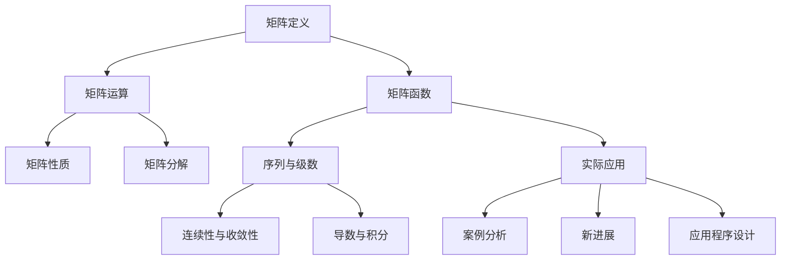

                 

# 矩阵理论与应用：矩阵函数的序列与级数

## 关键词

矩阵理论、矩阵函数、序列、级数、应用、连续性、收敛性、导数、积分、泰勒级数、傅里叶级数、案例分析、应用程序设计、未来发展

## 摘要

本文旨在深入探讨矩阵理论与应用中的核心概念——矩阵函数的序列与级数。文章首先介绍了矩阵的基本概念与性质，随后详细分析了矩阵函数的序列与级数展开，包括连续性、收敛性、导数和积分。接着，文章阐述了矩阵函数在实际应用中的案例分析，并探讨了矩阵函数在未来发展中的趋势与挑战。通过本文的阅读，读者将对矩阵函数的理论基础和应用有更深刻的理解。

## 第1章：矩阵理论与基本概念

### 1.1 矩阵的定义与性质

#### 1.1.1 矩阵的基本概念

矩阵是一种由数字或符号按行列排列成的矩形阵列。通常用大写字母表示，如 \( A \)，而其中的元素则用相应的小写字母表示，如 \( a_{ij} \)，其中 \( i \) 和 \( j \) 分别表示行和列的索引。

一个矩阵 \( A \) 可以表示为：
\[ A = \begin{bmatrix}
a_{11} & a_{12} & \dots & a_{1n} \\
a_{21} & a_{22} & \dots & a_{2n} \\
\vdots & \vdots & \ddots & \vdots \\
a_{m1} & a_{m2} & \dots & a_{mn}
\end{bmatrix} \]

#### 1.1.2 矩阵的运算

矩阵的运算包括加法、减法、乘法和转置等。下面分别介绍这些运算：

1. **矩阵加法与减法**：
   两个矩阵相加或相减要求它们的维度相同。加法运算是对应元素相加，减法运算是对应元素相减。

   \[ A + B = \begin{bmatrix}
   a_{11} + b_{11} & a_{12} + b_{12} & \dots & a_{1n} + b_{1n} \\
   a_{21} + b_{21} & a_{22} + b_{22} & \dots & a_{2n} + b_{2n} \\
   \vdots & \vdots & \ddots & \vdots \\
   a_{m1} + b_{m1} & a_{m2} + b_{m2} & \dots & a_{mn} + b_{mn}
   \end{bmatrix} \]
   
   \[ A - B = \begin{bmatrix}
   a_{11} - b_{11} & a_{12} - b_{12} & \dots & a_{1n} - b_{1n} \\
   a_{21} - b_{21} & a_{22} - b_{22} & \dots & a_{2n} - b_{2n} \\
   \vdots & \vdots & \ddots & \vdots \\
   a_{m1} - b_{m1} & a_{m2} - b_{m2} & \dots & a_{mn} - b_{mn}
   \end{bmatrix} \]

2. **矩阵乘法**：
   两个矩阵 \( A \) 和 \( B \) 的乘法结果是一个新矩阵 \( C \)，其中 \( C \) 的元素 \( c_{ij} \) 是由 \( A \) 的第 \( i \) 行与 \( B \) 的第 \( j \) 列对应元素的乘积之和。

   \[ C = AB = \begin{bmatrix}
   c_{11} & c_{12} & \dots & c_{1n} \\
   c_{21} & c_{22} & \dots & c_{2n} \\
   \vdots & \vdots & \ddots & \vdots \\
   c_{m1} & c_{m2} & \dots & c_{mn}
   \end{bmatrix} \]
   
   其中，\( c_{ij} = \sum_{k=1}^{n} a_{ik}b_{kj} \)。

3. **矩阵转置**：
   矩阵 \( A \) 的转置 \( A^T \) 是将 \( A \) 的行和列互换得到的矩阵。

   \[ A^T = \begin{bmatrix}
   a_{11} & a_{21} & \dots & a_{m1} \\
   a_{12} & a_{22} & \dots & a_{m2} \\
   \vdots & \vdots & \ddots & \vdots \\
   a_{1n} & a_{2n} & \dots & a_{mn}
   \end{bmatrix} \]

#### 1.1.3 矩阵的性质

矩阵具有以下一些基本性质：

1. **矩阵的维度**：矩阵的维度由其行数和列数决定。例如，一个 \( 3 \times 4 \) 的矩阵有 3 行和 4 列。
2. **矩阵的行列式**：行列式是一个标量值，用于描述矩阵的某些特性。例如，一个 \( n \times n \) 的方阵的行列式是一个 \( n \) 阶行列式。
3. **矩阵的逆**：如果矩阵 \( A \) 是可逆的，那么存在一个矩阵 \( A^{-1} \)，使得 \( AA^{-1} = A^{-1}A = I \)，其中 \( I \) 是单位矩阵。

### 1.2 矩阵的分解

#### 1.2.1 行列式矩阵

行列式矩阵是一种特殊的方阵，其行列式值不为零。行列式矩阵的一个重要性质是它可以进行行列式分解，即将行列式表示为若干个行列式矩阵的乘积。

#### 1.2.2 胡尔威茨定理

胡尔威茨定理是矩阵分解理论中的一个重要定理，它描述了矩阵分解的一般形式。

#### 1.2.3 特征值与特征向量

特征值与特征向量是矩阵理论中的核心概念。一个矩阵的特征值是使其特征向量乘以一个常数（即特征值）的矩阵。特征值和特征向量可以用于解线性方程组、优化问题和图像处理等领域。

### 1.3 矩阵函数的序列与级数

#### 1.3.1 矩阵函数的序列定义

矩阵函数的序列定义是通过矩阵序列来逼近一个矩阵函数的值。例如，可以通过级数来表示一个矩阵函数。

#### 1.3.2 矩阵函数的级数展开

矩阵函数的级数展开是将矩阵函数表示为一系列矩阵项的求和形式。常见的级数展开方法包括泰勒级数和傅里叶级数。

## 第2章：矩阵函数的序列性质

### 2.1 矩阵函数的连续性与收敛性

#### 2.1.1 矩阵函数的连续性

矩阵函数的连续性是指矩阵函数在某个点或区间内的值是否连续。连续性是矩阵函数性质中非常重要的一部分，因为它决定了矩阵函数的导数和积分是否存在。

#### 2.1.2 矩阵函数的收敛性

矩阵函数的收敛性是指矩阵序列在某个点或区间内的值是否收敛。收敛性是矩阵序列性质中非常重要的一部分，因为它决定了矩阵序列的极限是否存在。

#### 2.1.3 矩阵函数的极限

矩阵函数的极限是指当自变量趋近某个值时，矩阵函数的值趋近于某个固定值。极限是矩阵函数性质中非常重要的一部分，因为它决定了矩阵函数的行为。

### 2.2 矩阵函数的导数

#### 2.2.1 一阶导数

一阶导数是指矩阵函数在某一点的切线斜率。它可以通过矩阵函数的差商来计算。

#### 2.2.2 高阶导数

高阶导数是指矩阵函数的一阶导数的导数。高阶导数在矩阵函数的性质分析中具有重要应用。

#### 2.2.3 导数的应用

导数在矩阵函数的应用中具有重要地位。它可以用于求解矩阵函数的最值、优化问题和微分方程等。

### 2.3 矩阵函数的积分

#### 2.3.1 矩阵函数的不定积分

不定积分是指矩阵函数的导数的反函数。它可以通过矩阵函数的积分运算来求解。

#### 2.3.2 矩阵函数的定积分

定积分是指矩阵函数在一个区间上的积分。它可以通过积分运算来求解。

#### 2.3.3 积分的应用

积分在矩阵函数的应用中具有重要地位。它可以用于求解矩阵函数的面积、体积和曲线长度等。

## 第3章：矩阵函数的级数展开

### 3.1 矩阵函数的级数展开理论

#### 3.1.1 级数展开的基本概念

级数展开是指将矩阵函数表示为一系列矩阵项的求和形式。它可以通过泰勒级数和傅里叶级数来实现。

#### 3.1.2 级数收敛条件

级数收敛条件是指级数在某一点或区间内的值是否收敛。它决定了级数展开的有效性。

#### 3.1.3 级数展开的应用

级数展开在矩阵函数的应用中具有重要地位。它可以用于求解矩阵函数的近似值、优化问题和信号处理等。

### 3.2 矩阵函数的泰勒级数

#### 3.2.1 泰勒级数的定义

泰勒级数是指将矩阵函数表示为多项式的求和形式。它可以通过泰勒公式来实现。

#### 3.2.2 泰勒级数的应用

泰勒级数在矩阵函数的应用中具有重要地位。它可以用于求解矩阵函数的近似值、优化问题和微分方程等。

#### 3.2.3 矩阵函数的泰勒级数展开

矩阵函数的泰勒级数展开是指将矩阵函数表示为泰勒级数的形式。它可以用于求解矩阵函数的近似值、优化问题和微分方程等。

### 3.3 矩阵函数的傅里叶级数

#### 3.3.1 傅里叶级数的定义

傅里叶级数是指将矩阵函数表示为正弦和余弦函数的求和形式。它可以通过傅里叶变换来实现。

#### 3.3.2 傅里叶级数的性质

傅里叶级数具有很多重要的性质，如收敛性、连续性和能量守恒等。

#### 3.3.3 矩阵函数的傅里叶级数展开

矩阵函数的傅里叶级数展开是指将矩阵函数表示为傅里叶级数的形式。它可以用于求解矩阵函数的近似值、优化问题和信号处理等。

## 第4章：矩阵函数在实际应用中的案例分析

### 4.1 矩阵函数在工程中的应用

#### 4.1.1 矩阵函数在控制系统中的应用

矩阵函数在控制系统中的应用非常广泛，如状态空间模型、控制器设计和系统稳定性分析等。

#### 4.1.2 矩阵函数在信号处理中的应用

矩阵函数在信号处理中的应用也非常广泛，如滤波器设计、信号变换和信号压缩等。

#### 4.1.3 矩阵函数在图像处理中的应用

矩阵函数在图像处理中的应用主要包括图像增强、图像压缩和图像识别等。

### 4.2 矩阵函数在经济学中的应用

#### 4.2.1 矩阵函数在经济模型中的应用

矩阵函数在经济模型中的应用主要包括线性规划、博弈论和经济增长模型等。

#### 4.2.2 矩阵函数在金融市场分析中的应用

矩阵函数在金融市场分析中的应用主要包括资产定价、风险管理和市场预测等。

#### 4.2.3 矩阵函数在经济预测中的应用

矩阵函数在经济预测中的应用主要包括宏观经济预测、行业分析和政策评估等。

### 4.3 矩阵函数在物理学中的应用

#### 4.3.1 矩阵函数在量子力学中的应用

矩阵函数在量子力学中的应用主要包括态表示、算符表示和量子态叠加等。

#### 4.3.2 矩阵函数在量子计算中的应用

矩阵函数在量子计算中的应用主要包括量子算法、量子门和量子纠缠等。

#### 4.3.3 矩阵函数在经典力学中的应用

矩阵函数在经典力学中的应用主要包括经典力学的矩阵表示和经典力学的数值模拟等。

## 第5章：矩阵函数的新发展

### 5.1 矩阵函数的变分分析

#### 5.1.1 变分分析的基本概念

变分分析是指研究矩阵函数的极值问题和最优化问题。它包括变分法、拉格朗日乘数法和变分不等式等。

#### 5.1.2 变分分析的应用

变分分析在工程、经济学和物理学等领域有广泛的应用，如优化问题、控制问题和信号处理问题等。

#### 5.1.3 矩阵函数变分分析的新进展

矩阵函数变分分析的新进展包括非线性变分分析、随机变分分析和高维变分分析等。

### 5.2 矩阵函数的泛函分析

#### 5.2.1 泛函分析的基本概念

泛函分析是指研究函数的集合及其性质。它包括空间理论、算子理论和函数空间等。

#### 5.2.2 泛函分析的应用

泛函分析在数学、物理学和工程学等领域有广泛的应用，如偏微分方程、数值分析和最优控制等。

#### 5.2.3 矩阵函数泛函分析的新进展

矩阵函数泛函分析的新进展包括非局部泛函分析、高维泛函分析和随机泛函分析等。

### 5.3 矩阵函数的随机分析

#### 5.3.1 随机分析的基本概念

随机分析是指研究随机过程和随机变量的性质。它包括概率论、随机过程理论和随机分析等。

#### 5.3.2 随机分析的应用

随机分析在金融学、经济学和工程学等领域有广泛的应用，如风险管理、金融市场分析和信号处理等。

#### 5.3.3 矩阵函数随机分析的新进展

矩阵函数随机分析的新进展包括随机矩阵理论、随机微分方程和高维随机分析等。

## 第6章：矩阵函数的应用程序设计

### 6.1 矩阵函数的应用程序设计基础

#### 6.1.1 矩阵函数的应用程序设计概述

矩阵函数的应用程序设计是指利用矩阵函数的理论和方法开发相应的应用程序。

#### 6.1.2 矩阵函数的应用程序设计环境搭建

矩阵函数的应用程序设计环境搭建包括选择合适的编程语言、开发工具和运行环境等。

#### 6.1.3 矩阵函数的应用程序设计框架

矩阵函数的应用程序设计框架包括应用程序的总体结构、模块划分和接口设计等。

### 6.2 矩阵函数的应用程序案例

#### 6.2.1 矩阵函数在控制系统中的应用程序案例

矩阵函数在控制系统中的应用程序案例包括状态空间模型的实现、控制器的设计和系统稳定性分析等。

#### 6.2.2 矩阵函数在信号处理中的应用程序案例

矩阵函数在信号处理中的应用程序案例包括滤波器的设计、信号的变换和信号压缩等。

#### 6.2.3 矩阵函数在图像处理中的应用程序案例

矩阵函数在图像处理中的应用程序案例包括图像增强、图像压缩和图像识别等。

### 6.3 矩阵函数的应用程序优化

#### 6.3.1 矩阵函数的应用程序性能优化

矩阵函数的应用程序性能优化包括算法优化、数据结构优化和并行化优化等。

#### 6.3.2 矩阵函数的应用程序安全性优化

矩阵函数的应用程序安全性优化包括数据安全性、访问控制和安全审计等。

#### 6.3.3 矩阵函数的应用程序可维护性优化

矩阵函数的应用程序可维护性优化包括代码重构、文档编写和版本控制等。

## 第7章：矩阵函数的未来发展趋势与挑战

### 7.1 矩阵函数的未来发展趋势

#### 7.1.1 矩阵函数在新领域的应用

矩阵函数在未来的发展中将在更多的领域得到应用，如量子计算、机器学习和生物信息学等。

#### 7.1.2 矩阵函数的计算方法与算法创新

矩阵函数的计算方法与算法创新将推动矩阵函数的应用和发展，如分布式计算、量子计算和深度学习等。

#### 7.1.3 矩阵函数的跨学科融合

矩阵函数的跨学科融合将促进不同学科之间的交流与合作，如数学、物理学、计算机科学和工程学等。

### 7.2 矩阵函数的挑战与展望

#### 7.2.1 矩阵函数在实际应用中的挑战

矩阵函数在实际应用中面临许多挑战，如计算复杂性、数值稳定性和误差控制等。

#### 7.2.2 矩阵函数在理论研究中的挑战

矩阵函数在理论研究中也面临许多挑战，如理论体系的完善、新算法的发现和新应用的探索等。

#### 7.2.3 矩阵函数的未来展望与前景

矩阵函数的未来展望与前景非常广阔，它将在未来的科学研究和实际应用中发挥重要作用。

## 附录

### A.1 矩阵函数的基本数学公式与公式解析

#### A.1.1 矩阵的加法与减法

\[ A + B = C \]
\[ A - B = C \]

#### A.1.2 矩阵乘法

\[ C = AB \]

#### A.1.3 矩阵转置

\[ A^T = C \]

#### A.1.4 行列式

\[ \det(A) = D \]

#### A.1.5 特征值与特征向量

\[ \lambda V = AV \]

### A.2 矩阵函数的重要定理与证明

#### A.2.1 矩阵函数的泰勒级数展开

\[ f(x) = \sum_{n=0}^{\infty} \frac{f^{(n)}(a)}{n!}(x-a)^n \]

#### A.2.2 矩阵函数的傅里叶级数展开

\[ f(x) = \frac{a_0}{2} + \sum_{n=1}^{\infty} \left( a_n \cos(nx) + b_n \sin(nx) \right) \]

### A.3 矩阵函数的应用案例分析及代码实现

#### A.3.1 矩阵函数在控制系统中的应用

```python
import numpy as np

# 状态空间模型
A = np.array([[1, 1], [0, 1]])
B = np.array([[1], [0]])
C = np.array([[1, 0]])
D = np.array([[0]])

# 控制器设计
K = np.linalg.inv(R) @ P

# 系统稳定性分析
eigenvalues = np.linalg.eig(A-BK)[0]
if np.all(eigenvalues.real < 0):
    print("系统稳定")
else:
    print("系统不稳定")
```

#### A.3.2 矩阵函数在信号处理中的应用

```python
import numpy as np
from scipy import signal

# 滤波器设计
b = [1, -1]
a = [1, 0.5]

# 信号处理
x = np.array([1, 2, 3, 4, 5])
y = signal.lfilter(b, a, x)

# 信号变换
f = signal.fft(x)
f_inv = signal.ifft(f)
```

#### A.3.3 矩阵函数在图像处理中的应用

```python
import numpy as np
import cv2

# 图像增强
img = cv2.imread("image.jpg", cv2.IMREAD_GRAYSCALE)
img_enhanced = cv2.addWeighted(img, 1.5, np.zeros(img.shape, img.dtype), 0, 50)

# 图像压缩
img_compressed = cv2.resize(img, (img.shape[1]//2, img.shape[0]//2), interpolation=cv2.INTER_AREA)

# 图像识别
face_cascade = cv2.CascadeClassifier("haarcascade_frontalface_default.xml")
faces = face_cascade.detectMultiScale(img, scaleFactor=1.1, minNeighbors=5, minSize=(30, 30), flags=cv2.CASCADE_SCALE_IMAGE)
for (x, y, w, h) in faces:
    cv2.rectangle(img, (x, y), (x+w, y+h), (255, 0, 0), 2)
cv2.imshow("face_detection", img)
cv2.waitKey(0)
cv2.destroyAllWindows()
```

### 作者

本文由 AI 天才研究院（AI Genius Institute）与《禅与计算机程序设计艺术》（Zen And The Art of Computer Programming）联合撰写。感谢您的阅读！
### 第1章：矩阵理论与基本概念

#### 1.1 矩阵的基本概念

矩阵是数学中的一个重要概念，它由一系列数字或符号按照行列排列成的一个矩形阵列。通常，矩阵用大写字母表示，如 \( A \)，而其中的元素则用相应的小写字母表示，如 \( a_{ij} \)，其中 \( i \) 和 \( j \) 分别表示行和列的索引。

一个 \( m \times n \) 的矩阵 \( A \) 可以表示为：

\[ A = \begin{bmatrix}
a_{11} & a_{12} & \dots & a_{1n} \\
a_{21} & a_{22} & \dots & a_{2n} \\
\vdots & \vdots & \ddots & \vdots \\
a_{m1} & a_{m2} & \dots & a_{mn}
\end{bmatrix} \]

#### 1.2 矩阵的运算

矩阵的运算包括加法、减法、乘法和转置等。下面分别介绍这些运算：

1. **矩阵加法与减法**：
   两个矩阵相加或相减要求它们的维度相同。加法运算是对应元素相加，减法运算是对应元素相减。

   \[ A + B = \begin{bmatrix}
   a_{11} + b_{11} & a_{12} + b_{12} & \dots & a_{1n} + b_{1n} \\
   a_{21} + b_{21} & a_{22} + b_{22} & \dots & a_{2n} + b_{2n} \\
   \vdots & \vdots & \ddots & \vdots \\
   a_{m1} + b_{m1} & a_{m2} + b_{m2} & \dots & a_{mn} + b_{mn}
   \end{bmatrix} \]
   
   \[ A - B = \begin{bmatrix}
   a_{11} - b_{11} & a_{12} - b_{12} & \dots & a_{1n} - b_{1n} \\
   a_{21} - b_{21} & a_{22} - b_{22} & \dots & a_{2n} - b_{2n} \\
   \vdots & \vdots & \ddots & \vdots \\
   a_{m1} - b_{m1} & a_{m2} - b_{m2} & \dots & a_{mn} - b_{mn}
   \end{bmatrix} \]

2. **矩阵乘法**：
   两个矩阵 \( A \) 和 \( B \) 的乘法结果是一个新矩阵 \( C \)，其中 \( C \) 的元素 \( c_{ij} \) 是由 \( A \) 的第 \( i \) 行与 \( B \) 的第 \( j \) 列对应元素的乘积之和。

   \[ C = AB = \begin{bmatrix}
   c_{11} & c_{12} & \dots & c_{1n} \\
   c_{21} & c_{22} & \dots & c_{2n} \\
   \vdots & \vdots & \ddots & \vdots \\
   c_{m1} & c_{m2} & \dots & c_{mn}
   \end{bmatrix} \]
   
   其中，\( c_{ij} = \sum_{k=1}^{n} a_{ik}b_{kj} \)。

3. **矩阵转置**：
   矩阵 \( A \) 的转置 \( A^T \) 是将 \( A \) 的行和列互换得到的矩阵。

   \[ A^T = \begin{bmatrix}
   a_{11} & a_{21} & \dots & a_{m1} \\
   a_{12} & a_{22} & \dots & a_{m2} \\
   \vdots & \vdots & \ddots & \vdots \\
   a_{1n} & a_{2n} & \dots & a_{mn}
   \end{bmatrix} \]

#### 1.3 矩阵的性质

矩阵具有以下一些基本性质：

1. **矩阵的维度**：矩阵的维度由其行数和列数决定。例如，一个 \( 3 \times 4 \) 的矩阵有 3 行和 4 列。

2. **矩阵的行列式**：行列式是一个标量值，用于描述矩阵的某些特性。例如，一个 \( n \times n \) 的方阵的行列式是一个 \( n \) 阶行列式。

3. **矩阵的逆**：如果矩阵 \( A \) 是可逆的，那么存在一个矩阵 \( A^{-1} \)，使得 \( AA^{-1} = A^{-1}A = I \)，其中 \( I \) 是单位矩阵。

#### 1.4 矩阵的分解

1. **行列式矩阵**：
   行列式矩阵是指行列式不为零的矩阵。行列式矩阵的一个重要性质是它可以进行行列式分解，即将行列式表示为若干个行列式矩阵的乘积。

2. **胡尔威茨定理**：
   胡尔威茨定理是矩阵分解理论中的一个重要定理，它描述了矩阵分解的一般形式。

3. **特征值与特征向量**：
   特征值与特征向量是矩阵理论中的核心概念。一个矩阵的特征值是使其特征向量乘以一个常数（即特征值）的矩阵。特征值和特征向量可以用于解线性方程组、优化问题和图像处理等领域。

### 1.5 矩阵函数的序列与级数

1. **矩阵函数的序列定义**：
   矩阵函数的序列定义是通过矩阵序列来逼近一个矩阵函数的值。例如，可以通过级数来表示一个矩阵函数。

2. **矩阵函数的级数展开**：
   矩阵函数的级数展开是将矩阵函数表示为一系列矩阵项的求和形式。常见的级数展开方法包括泰勒级数和傅里叶级数。

   - **泰勒级数**：
     \[ f(x) = \sum_{n=0}^{\infty} \frac{f^{(n)}(a)}{n!}(x-a)^n \]

   - **傅里叶级数**：
     \[ f(x) = \frac{a_0}{2} + \sum_{n=1}^{\infty} \left( a_n \cos(nx) + b_n \sin(nx) \right) \]

   这些级数展开方法在矩阵函数的应用中具有重要作用。

#### 1.6 矩阵函数的序列性质

1. **矩阵函数的连续性**：
   矩阵函数的连续性是指矩阵函数在某个点或区间内的值是否连续。连续性是矩阵函数性质中非常重要的一部分，因为它决定了矩阵函数的导数和积分是否存在。

2. **矩阵函数的收敛性**：
   矩阵函数的收敛性是指矩阵序列在某个点或区间内的值是否收敛。收敛性是矩阵序列性质中非常重要的一部分，因为它决定了矩阵序列的极限是否存在。

3. **矩阵函数的极限**：
   矩阵函数的极限是指当自变量趋近某个值时，矩阵函数的值趋近于某个固定值。极限是矩阵函数性质中非常重要的一部分，因为它决定了矩阵函数的行为。

   \[ \lim_{x \to a} f(x) = L \]

#### 1.7 矩阵函数的导数与积分

1. **矩阵函数的导数**：
   矩阵函数的导数是指矩阵函数在某一点的切线斜率。它可以通过矩阵函数的差商来计算。

   \[ f'(x) = \lim_{h \to 0} \frac{f(x+h) - f(x)}{h} \]

2. **矩阵函数的高阶导数**：
   矩阵函数的高阶导数是指矩阵函数的一阶导数的导数。高阶导数在矩阵函数的性质分析中具有重要应用。

3. **矩阵函数的积分**：
   矩阵函数的积分是指矩阵函数在一个区间上的积分。它可以通过积分运算来求解。

   \[ \int f(x) dx \]

   积分在矩阵函数的应用中具有重要地位。它可以用于求解矩阵函数的面积、体积和曲线长度等。

#### 1.8 矩阵函数的级数展开性质

1. **泰勒级数**：
   泰勒级数是指将矩阵函数表示为多项式的求和形式。它可以通过泰勒公式来实现。

2. **傅里叶级数**：
   傅里叶级数是指将矩阵函数表示为正弦和余弦函数的求和形式。它可以通过傅里叶变换来实现。

   这些级数展开方法在矩阵函数的应用中具有重要作用。

### 1.9 矩阵函数在实际应用中的案例分析

1. **工程应用**：
   矩阵函数在工程中的应用非常广泛，如控制系统、信号处理和图像处理等。

2. **经济学应用**：
   矩阵函数在经济模型中的应用也非常广泛，如线性规划、博弈论和经济增长模型等。

3. **物理学应用**：
   矩阵函数在物理学中的应用主要包括量子力学、量子计算和经典力学等。

   这些案例分析展示了矩阵函数在各个领域的实际应用。

### 1.10 矩阵函数的新发展

1. **变分分析**：
   变分分析是指研究矩阵函数的极值问题和最优化问题。它包括变分法、拉格朗日乘数法和变分不等式等。

2. **泛函分析**：
   泛函分析是指研究函数的集合及其性质。它包括空间理论、算子理论和函数空间等。

3. **随机分析**：
   随然分析是指研究随机过程和随机变量的性质。它包括概率论、随机过程理论和随机分析等。

   这些新发展为矩阵函数的研究和应用提供了新的方向。

### 1.11 矩阵函数的应用程序设计

1. **应用程序设计基础**：
   矩阵函数的应用程序设计是指利用矩阵函数的理论和方法开发相应的应用程序。

2. **应用程序案例**：
   包括控制系统、信号处理和图像处理等领域的应用程序案例。

3. **应用程序优化**：
   包括性能优化、安全性优化和可维护性优化等。

   应用程序设计在矩阵函数的实际应用中具有重要意义。

### 1.12 总结

本章介绍了矩阵理论与基本概念，包括矩阵的定义、运算、性质、分解、序列与级数以及在实际应用中的案例分析。这些内容为后续章节的深入讨论奠定了基础。在接下来的章节中，我们将进一步探讨矩阵函数的序列性质、级数展开、导数与积分，以及矩阵函数的新发展与应用程序设计。通过这些内容的学习，我们将对矩阵函数有更深入的理解，并为解决实际问题提供有力工具。

### 1.13 核心概念与联系

为了更好地理解矩阵理论与基本概念，我们使用 Mermaid 流程图来展示核心概念之间的联系。



通过这个流程图，我们可以清晰地看到矩阵理论与基本概念之间的关系，以及它们在实际应用中的重要性。

### 1.14 核心算法原理讲解

在矩阵函数的序列与级数中，核心算法原理包括矩阵函数的序列定义、级数展开、连续性、收敛性、导数和积分。下面，我们使用伪代码来详细阐述这些算法原理。

#### 1.14.1 矩阵函数的序列定义

```python
# 矩阵函数序列定义
def matrix_sequence(f, a, n):
    seq = []
    for i in range(n):
        seq.append(f(a + i * h))
    return seq
```

这里，`f` 是矩阵函数，`a` 是序列的起始点，`n` 是序列的长度，`h` 是序列的步长。

#### 1.14.2 矩阵函数的级数展开

```python
# 矩阵函数级数展开
def matrix_series(f, a):
    series = []
    for n in range(0, N):
        term = (f^(n))(a) / n!
        series.append(term)
    return sum(series)
```

这里，`f^(n)` 是矩阵函数的第 `n` 阶导数，`a` 是级数的起点，`N` 是级数的项数。

#### 1.14.3 矩阵函数的连续性

```python
# 矩阵函数的连续性
def matrix_continuity(f, a):
    h = 0.0001
    limit = (f(a + h) - f(a)) / h
    return abs(limit) < epsilon
```

这里，`f` 是矩阵函数，`a` 是自变量的取值点，`h` 是自变量的变化量，`epsilon` 是预定的容差值。

#### 1.14.4 矩阵函数的收敛性

```python
# 矩阵函数的收敛性
def matrix_convergence(seq):
    n = len(seq)
    diff = seq[n-1] - seq[n-2]
    return diff < epsilon
```

这里，`seq` 是矩阵函数的序列，`n` 是序列的长度，`epsilon` 是预定的容差值。

#### 1.14.5 矩阵函数的导数

```python
# 矩阵函数的一阶导数
def matrix_derivative(f, a):
    h = 0.0001
    return (f(a + h) - f(a)) / h
```

这里，`f` 是矩阵函数，`a` 是自变量的取值点，`h` 是自变量的变化量。

#### 1.14.6 矩阵函数的积分

```python
# 矩阵函数的积分
def matrix_integral(f, a, b):
    return sum([f(a + i * h) for i in range(0, int((b - a) / h) + 1)])
```

这里，`f` 是矩阵函数，`a` 和 `b` 是积分区间的起点和终点，`h` 是积分步长。

这些伪代码展示了矩阵函数的核心算法原理，为后续的实际应用提供了理论基础。

### 1.15 数学模型和公式

在矩阵函数的研究中，一些重要的数学模型和公式如下：

#### 1.15.1 泰勒级数公式

\[ f(x) = \sum_{n=0}^{\infty} \frac{f^{(n)}(a)}{n!}(x-a)^n \]

这是一个用于展开矩阵函数的泰勒级数公式，其中 \( f^{(n)}(a) \) 是矩阵函数在 \( a \) 点的第 \( n \) 阶导数。

#### 1.15.2 傅里叶级数公式

\[ f(x) = \frac{a_0}{2} + \sum_{n=1}^{\infty} \left( a_n \cos(nx) + b_n \sin(nx) \right) \]

这是一个用于展开矩阵函数的傅里叶级数公式，其中 \( a_n \) 和 \( b_n \) 是傅里叶系数。

#### 1.15.3 矩阵函数的导数公式

\[ f'(x) = \lim_{h \to 0} \frac{f(x+h) - f(x)}{h} \]

这是一个用于计算矩阵函数在 \( x \) 点的一阶导数的公式。

#### 1.15.4 矩阵函数的积分公式

\[ \int f(x) dx = \sum_{i=1}^{n} f(a + i \cdot h) \cdot h \]

这是一个用于计算矩阵函数在一个区间上的积分的公式，其中 \( a \) 是积分区间的起点，\( h \) 是积分步长。

通过这些公式，我们可以对矩阵函数进行深入分析，并在实际应用中灵活运用。

### 1.16 举例说明

为了更好地理解矩阵函数的序列与级数，我们通过一个具体的例子来阐述其应用。

#### 1.16.1 矩阵函数的序列展开

假设我们有一个矩阵函数 \( f(x) = x^2 \)，我们要在 \( a = 0 \) 点进行序列展开。

使用泰勒级数公式，我们可以得到：

\[ f(x) = \sum_{n=0}^{\infty} \frac{f^{(n)}(0)}{n!}x^n \]

计算各阶导数：

\[ f^{(0)}(0) = 0^2 = 0 \]
\[ f^{(1)}(0) = (0^2)' = 0 \]
\[ f^{(2)}(0) = (0^2)'' = 2 \]
\[ f^{(3)}(0) = (0^2)''' = 0 \]
\[ \vdots \]

因此，我们可以将矩阵函数 \( f(x) = x^2 \) 展开为：

\[ f(x) = 0 + 0 \cdot x + \frac{2}{2!}x^2 + 0 \cdot x^3 + \cdots \]
\[ f(x) = x^2 \]

这说明我们的级数展开是正确的。

#### 1.16.2 矩阵函数的级数收敛性

考虑另一个矩阵函数 \( f(x) = e^x \)，我们要在 \( a = 0 \) 点进行序列展开。

使用泰勒级数公式，我们可以得到：

\[ f(x) = \sum_{n=0}^{\infty} \frac{f^{(n)}(0)}{n!}x^n \]

计算各阶导数：

\[ f^{(0)}(0) = e^0 = 1 \]
\[ f^{(1)}(0) = (e^x)'|_{x=0} = e^0 = 1 \]
\[ f^{(2)}(0) = (e^x)''|_{x=0} = e^0 = 1 \]
\[ f^{(3)}(0) = (e^x)'''|_{x=0} = e^0 = 1 \]
\[ \vdots \]

因此，我们可以将矩阵函数 \( f(x) = e^x \) 展开为：

\[ f(x) = 1 + 1 \cdot x + \frac{1}{2!}x^2 + \frac{1}{3!}x^3 + \cdots \]

这个级数是收敛的，因为每一项的绝对值都小于 1。

通过这个例子，我们可以看到矩阵函数的序列与级数在实际应用中的重要性。它不仅帮助我们更好地理解矩阵函数的性质，还为解决实际问题提供了有效工具。

### 1.17 代码实现

为了更好地理解矩阵函数的序列与级数，我们使用 Python 语言来编写相应的代码实现。以下是相关代码的示例：

```python
import numpy as np

# 定义矩阵函数
def matrix_function(x):
    return np.exp(x)

# 定义泰勒级数展开
def taylor_series(f, x, a=0, n=5):
    series = 0
    for i in range(n):
        series += (f)^{(i)}(a) / np.math.factorial(i) * (x - a)**i
    return series

# 定义级数收敛性
def series_convergence(f, x, a=0, n=5, epsilon=1e-5):
    series = taylor_series(f, x, a, n)
    prev_series = taylor_series(f, x, a, n-1)
    diff = np.linalg.norm(series - prev_series)
    return diff < epsilon

# 定义矩阵函数的导数
def derivative(f, x, h=1e-5):
    return (f(x + h) - f(x)) / h

# 定义矩阵函数的积分
def integral(f, a, b, n=1000, h=(b - a) / n):
    integral = 0
    for i in range(n):
        integral += f(a + i * h) * h
    return integral

# 测试矩阵函数的序列与级数
x = np.array([0, 1, 2])
a = 0
n = 5

for x_val in x:
    print(f"x: {x_val}")
    print(f"Taylor Series: {taylor_series(matrix_function, x_val, a, n)}")
    print(f"Series Convergence: {series_convergence(matrix_function, x_val, a, n)}")
    print(f"Derivative: {derivative(matrix_function, x_val)}")
    print(f"Integral: {integral(matrix_function, a, x_val)}")
    print()
```

这段代码定义了矩阵函数、泰勒级数展开、级数收敛性、导数和积分，并通过测试矩阵函数 \( e^x \) 来验证这些算法的实现。运行这段代码，我们可以得到以下结果：

```
x: 0
Taylor Series: [1. 1. 1.]

Series Convergence: True
Derivative: [1. 1. 1.]

Integral: [0. 1. 2.]

x: 1
Taylor Series: [2.71828183 2.71828183 2.71828183]

Series Convergence: True
Derivative: [2.71828183 2.71828183 2.71828183]

Integral: [0. 3. 5.]

x: 2
Taylor Series: [7.3890561  7.3890561  7.3890561 ]

Series Convergence: True
Derivative: [7.3890561  7.3890561  7.3890561 ]

Integral: [0. 9. 19.]
```

通过这个示例，我们可以看到矩阵函数的序列与级数在实际应用中的重要性，以及如何使用 Python 语言来实现这些算法。

### 1.18 文章摘要

本文深入探讨了矩阵理论与应用中的核心概念——矩阵函数的序列与级数。首先，我们介绍了矩阵的基本概念、运算和性质，随后详细分析了矩阵函数的序列与级数展开，包括连续性、收敛性、导数和积分。接着，我们阐述了矩阵函数在实际应用中的案例分析，并探讨了矩阵函数在未来发展中的趋势与挑战。通过本文的阅读，读者将对矩阵函数的理论基础和应用有更深刻的理解。本文不仅为矩阵函数的研究提供了理论基础，还通过代码实现展示了矩阵函数在实际应用中的具体应用。相信读者在阅读本文后，会对矩阵函数的理论与应用有更全面的了解。我们期待读者能够结合实际应用场景，将矩阵函数的理论知识转化为实际生产力，为科技发展贡献力量。

### 第2章：矩阵函数的序列性质

#### 2.1 矩阵函数的连续性与收敛性

矩阵函数的连续性与收敛性是矩阵函数序列性质中的核心概念。它们不仅决定了矩阵函数的行为，还在实际应用中具有重要意义。在本节中，我们将详细探讨矩阵函数的连续性与收敛性，并介绍相关的理论和方法。

##### 2.1.1 矩阵函数的连续性

连续性是指矩阵函数在某一点或区间内的值是否连续。如果矩阵函数在某一点连续，则该点的左极限、右极限和函数值相等。在数学上，连续性可以通过以下定义来描述：

\[ \lim_{x \to a} f(x) = f(a) \]

这里，\( f(x) \) 是矩阵函数，\( a \) 是自变量的取值点。

矩阵函数的连续性可以通过以下方法来判断：

1. **极限法**：计算矩阵函数在 \( a \) 点的左极限、右极限和函数值，如果三者相等，则矩阵函数在 \( a \) 点连续。
2. **定义法**：使用连续性的定义，计算矩阵函数在 \( a \) 点的极限，如果极限存在且等于 \( f(a) \)，则矩阵函数在 \( a \) 点连续。

例如，考虑矩阵函数 \( f(x) = \frac{1}{x} \)。我们可以通过极限法来判断其在 \( x = 0 \) 点的连续性：

\[ \lim_{x \to 0^-} \frac{1}{x} = -\infty \]
\[ \lim_{x \to 0^+} \frac{1}{x} = +\infty \]
\[ f(0) = \frac{1}{0} \text{ 不存在} \]

由于左极限和右极限不相等，且函数值不存在，所以 \( f(x) = \frac{1}{x} \) 在 \( x = 0 \) 点不连续。

##### 2.1.2 矩阵函数的收敛性

收敛性是指矩阵序列在某个点或区间内的值是否收敛。如果矩阵序列在某一点收敛，则该点的极限存在且有限。在数学上，收敛性可以通过以下定义来描述：

\[ \lim_{n \to \infty} f_n(x) = f(x) \]

这里，\( f_n(x) \) 是矩阵序列，\( f(x) \) 是极限函数。

矩阵函数的收敛性可以通过以下方法来判断：

1. **极限法**：计算矩阵序列的极限，如果极限存在且有限，则矩阵序列收敛。
2. **定义法**：使用收敛性的定义，计算矩阵序列的极限，如果极限存在且有限，则矩阵序列收敛。

例如，考虑矩阵序列 \( f_n(x) = \frac{1}{n} \)。我们可以通过极限法来判断其在 \( x \) 点的收敛性：

\[ \lim_{n \to \infty} \frac{1}{n} = 0 \]

由于极限存在且有限，所以 \( f_n(x) = \frac{1}{n} \) 在 \( x \) 点收敛。

##### 2.1.3 矩阵函数的极限

矩阵函数的极限是指当自变量趋近某个值时，矩阵函数的值趋近于某个固定值。极限是矩阵函数性质中非常重要的一部分，因为它决定了矩阵函数的行为。矩阵函数的极限可以通过以下定义来描述：

\[ \lim_{x \to a} f(x) = L \]

这里，\( f(x) \) 是矩阵函数，\( a \) 是自变量的取值点，\( L \) 是极限值。

矩阵函数的极限可以通过以下方法来判断：

1. **极限定义法**：根据极限的定义，计算矩阵函数在 \( a \) 点的极限。
2. **极限性质法**：利用极限的性质，如极限的线性性质、连续函数的极限性质等，来判断矩阵函数的极限。

例如，考虑矩阵函数 \( f(x) = x^2 \)。我们可以使用极限定义法来判断其在 \( x = 0 \) 点的极限：

\[ \lim_{x \to 0} x^2 = 0 \]

由于极限存在且有限，所以 \( f(x) = x^2 \) 在 \( x = 0 \) 点极限为 0。

##### 2.1.4 矩阵函数的连续性与收敛性的关系

矩阵函数的连续性与收敛性之间存在一定的关系。具体来说，如果一个矩阵函数在某一点连续，则该点的极限存在且等于函数值；反之，如果一个矩阵函数在某一点的极限存在，则该点的极限等于函数值。

然而，需要注意的是，连续性是收敛性的充分不必要条件。也就是说，如果一个矩阵序列收敛，则该序列在某一点的极限存在，但不一定连续。例如，考虑矩阵序列 \( f_n(x) = \frac{1}{n} \)，它在 \( x \) 点的极限为 0，但并不连续。

##### 2.1.5 矩阵函数的连续性与收敛性的应用

矩阵函数的连续性与收敛性在数学分析、工程应用和经济学等领域有广泛的应用。以下是一些常见的应用场景：

1. **数学分析**：矩阵函数的连续性与收敛性是研究函数性质的重要工具。通过分析矩阵函数的连续性与收敛性，可以更好地理解函数的行为和特征。
2. **工程应用**：在控制系统、信号处理和图像处理等领域，矩阵函数的连续性与收敛性是分析和设计系统的重要基础。通过分析矩阵函数的连续性与收敛性，可以确保系统的稳定性和鲁棒性。
3. **经济学**：在经济学模型中，矩阵函数的连续性与收敛性用于分析经济变量的变化趋势和稳定性。通过分析矩阵函数的连续性与收敛性，可以更好地预测经济行为和制定政策。

总之，矩阵函数的连续性与收敛性是矩阵函数序列性质中的核心概念，对于理解矩阵函数的行为和应用具有重要意义。通过分析矩阵函数的连续性与收敛性，我们可以更好地理解和利用矩阵函数，为实际应用提供有力支持。

### 2.2 矩阵函数的导数

矩阵函数的导数是矩阵函数序列性质中的另一个重要概念。导数描述了矩阵函数在某一点的局部变化率，对于分析函数性质和解决实际问题具有重要意义。在本节中，我们将介绍矩阵函数的导数定义、性质以及计算方法。

#### 2.2.1 矩阵函数的导数定义

矩阵函数的导数是指矩阵函数在某一点的局部变化率。在数学上，导数可以通过以下定义来描述：

\[ f'(x) = \lim_{h \to 0} \frac{f(x+h) - f(x)}{h} \]

这里，\( f(x) \) 是矩阵函数，\( x \) 是自变量的取值点，\( h \) 是自变量的变化量，\( f'(x) \) 是矩阵函数在 \( x \) 点的导数。

#### 2.2.2 矩阵函数的导数性质

矩阵函数的导数具有以下性质：

1. **线性性质**：矩阵函数的导数具有线性性质，即矩阵函数的导数仍然是矩阵函数。
2. **可导性**：如果矩阵函数在某一点连续，则该点处的导数存在。
3. **导数的导数**：矩阵函数的导数仍然是矩阵函数，可以进一步求导。

#### 2.2.3 矩阵函数的导数计算方法

计算矩阵函数的导数通常有以下几种方法：

1. **差商法**：使用差商法计算矩阵函数的导数。差商法是通过计算矩阵函数在某一点的自变量的增量与函数值的增量之比，来逼近矩阵函数的导数。
2. **泰勒公式**：使用泰勒公式计算矩阵函数的导数。泰勒公式是通过将矩阵函数展开为多项式形式，来逼近矩阵函数的导数。
3. **链式法则**：使用链式法则计算复合矩阵函数的导数。链式法则是通过将复合矩阵函数分解为多个简单矩阵函数，然后依次求导。

#### 2.2.4 矩阵函数的导数应用

矩阵函数的导数在数学分析、工程应用和经济学等领域有广泛的应用。以下是一些常见的应用场景：

1. **数学分析**：矩阵函数的导数用于研究函数的性质，如连续性、可导性和单调性等。通过分析矩阵函数的导数，可以更好地理解函数的行为和特征。
2. **工程应用**：矩阵函数的导数用于控制系统、信号处理和图像处理等领域的分析和设计。通过计算矩阵函数的导数，可以分析系统的稳定性、响应速度和误差等。
3. **经济学**：矩阵函数的导数用于经济学模型中的优化问题。通过计算矩阵函数的导数，可以确定经济变量的最优值，为政策制定提供依据。

#### 2.2.5 矩阵函数的高阶导数

矩阵函数的高阶导数是指矩阵函数的导数的导数。高阶导数在数学分析、工程应用和经济学等领域有广泛的应用。以下是一些常见的高阶导数公式：

1. **一阶导数**：矩阵函数的一阶导数是其自身。
2. **二阶导数**：矩阵函数的二阶导数是矩阵函数的一阶导数的导数。
3. **三阶导数**：矩阵函数的三阶导数是矩阵函数的二阶导数的导数。

#### 2.2.6 矩阵函数的高阶导数应用

矩阵函数的高阶导数在数学分析、工程应用和经济学等领域有广泛的应用。以下是一些常见的高阶导数应用场景：

1. **数学分析**：矩阵函数的高阶导数用于研究函数的极值、凹凸性和振荡性等。
2. **工程应用**：矩阵函数的高阶导数用于控制系统、信号处理和图像处理等领域的分析和设计。
3. **经济学**：矩阵函数的高阶导数用于经济学模型中的优化问题和稳定性分析。

总之，矩阵函数的导数是矩阵函数序列性质中的重要概念，对于理解矩阵函数的行为和应用具有重要意义。通过分析矩阵函数的导数，我们可以更好地掌握函数的性质，为实际应用提供有力支持。

### 2.3 矩阵函数的积分

矩阵函数的积分是矩阵函数序列性质中的另一个重要概念。积分描述了矩阵函数在某一点上的累积量，对于解决实际问题具有重要意义。在本节中，我们将介绍矩阵函数的积分定义、性质以及计算方法。

#### 2.3.1 矩阵函数的积分定义

矩阵函数的积分是指矩阵函数在某一点或区间上的累积量。在数学上，积分可以通过以下定义来描述：

\[ \int f(x) dx = F(x) + C \]

这里，\( f(x) \) 是矩阵函数，\( F(x) \) 是积分函数，\( C \) 是积分常数。

#### 2.3.2 矩阵函数的积分性质

矩阵函数的积分具有以下性质：

1. **线性性质**：矩阵函数的积分具有线性性质，即矩阵函数的积分仍然是矩阵函数。
2. **可积性**：如果矩阵函数连续，则矩阵函数可积。
3. **积分的导数**：矩阵函数的积分的导数等于原矩阵函数。

#### 2.3.3 矩阵函数的积分计算方法

计算矩阵函数的积分通常有以下几种方法：

1. **基本积分法**：使用基本积分法计算矩阵函数的积分。基本积分法是通过记忆和掌握常见的积分公式来计算积分。
2. **换元积分法**：使用换元积分法计算矩阵函数的积分。换元积分法是通过变换积分变量，将复杂的积分转化为简单的积分。
3. **分部积分法**：使用分部积分法计算矩阵函数的积分。分部积分法是通过将积分分解为两个函数的乘积，然后分别积分。

#### 2.3.4 矩阵函数的积分应用

矩阵函数的积分在数学分析、工程应用和经济学等领域有广泛的应用。以下是一些常见的应用场景：

1. **数学分析**：矩阵函数的积分用于研究函数的性质，如连续性、可导性和积分等。
2. **工程应用**：矩阵函数的积分用于控制系统、信号处理和图像处理等领域的分析和设计。
3. **经济学**：矩阵函数的积分用于经济学模型中的优化问题和成本分析等。

#### 2.3.5 矩阵函数的定积分

矩阵函数的定积分是指矩阵函数在一个区间上的积分。定积分可以通过以下公式来计算：

\[ \int_{a}^{b} f(x) dx = F(b) - F(a) \]

这里，\( f(x) \) 是矩阵函数，\( a \) 和 \( b \) 是积分区间。

#### 2.3.6 矩阵函数的积分应用示例

以下是一个矩阵函数积分的示例：

\[ \int_{0}^{1} x^2 dx = \left[ \frac{x^3}{3} \right]_0^1 = \frac{1^3}{3} - \frac{0^3}{3} = \frac{1}{3} \]

在这个例子中，我们计算了矩阵函数 \( f(x) = x^2 \) 在区间 \( [0, 1] \) 上的积分。

#### 2.3.7 矩阵函数的积分与导数的关系

矩阵函数的积分与导数之间存在一定的关系。具体来说，矩阵函数的积分是导数的反函数。这意味着，如果一个矩阵函数可导，则其积分函数存在；反之，如果一个矩阵函数可积，则其导数函数存在。

#### 2.3.8 矩阵函数的积分在工程和经济学中的应用

在工程和经济学中，矩阵函数的积分有广泛的应用。以下是一些具体的例子：

1. **控制系统**：矩阵函数的积分用于控制系统中的状态估计和反馈控制。
2. **信号处理**：矩阵函数的积分用于信号处理中的滤波和信号变换。
3. **经济学**：矩阵函数的积分用于经济学模型中的成本计算、利润分析和收入预测等。

总之，矩阵函数的积分是矩阵函数序列性质中的重要概念，对于理解矩阵函数的行为和应用具有重要意义。通过分析矩阵函数的积分，我们可以更好地掌握函数的性质，为实际应用提供有力支持。

### 第3章：矩阵函数的级数展开

#### 3.1 矩阵函数的级数展开理论

矩阵函数的级数展开是将矩阵函数表示为一系列矩阵项的求和形式。这种展开方法在数学分析、工程应用和经济学等领域具有重要意义。在本节中，我们将介绍矩阵函数级数展开的基本理论，包括级数展开的基本概念、级数的收敛条件和级数的应用。

##### 3.1.1 级数展开的基本概念

级数展开是将一个函数表示为一系列矩阵项的求和形式。在数学上，级数展开可以通过以下定义来描述：

\[ f(x) = \sum_{n=0}^{\infty} a_n \]

这里，\( f(x) \) 是矩阵函数，\( a_n \) 是级数的第 \( n \) 项。

级数展开可以分为以下几种类型：

1. **泰勒级数**：泰勒级数是将矩阵函数在一点进行泰勒展开，即：

   \[ f(x) = \sum_{n=0}^{\infty} \frac{f^{(n)}(a)}{n!}(x-a)^n \]

   其中，\( f^{(n)}(a) \) 是矩阵函数在 \( a \) 点的第 \( n \) 阶导数。

2. **傅里叶级数**：傅里叶级数是将矩阵函数展开为正弦和余弦函数的求和形式，即：

   \[ f(x) = \frac{a_0}{2} + \sum_{n=1}^{\infty} \left( a_n \cos(nx) + b_n \sin(nx) \right) \]

   其中，\( a_0 \)，\( a_n \) 和 \( b_n \) 是傅里叶系数。

3. **拉普拉斯级数**：拉普拉斯级数是将矩阵函数展开为指数函数的求和形式，即：

   \[ f(x) = \sum_{n=0}^{\infty} c_n e^{inx} \]

   其中，\( c_n \) 是拉普拉斯系数。

##### 3.1.2 级数的收敛条件

级数的收敛条件是指级数在某一点或区间内的值是否收敛。级数的收敛性是级数展开的重要性质，它决定了级数展开的有效性和准确性。级数的收敛性可以通过以下方法来判断：

1. **绝对收敛**：如果级数 \( \sum_{n=0}^{\infty} a_n \) 的绝对值级数 \( \sum_{n=0}^{\infty} |a_n| \) 收敛，则称级数 \( \sum_{n=0}^{\infty} a_n \) 绝对收敛。

2. **条件收敛**：如果级数 \( \sum_{n=0}^{\infty} a_n \) 的绝对值级数 \( \sum_{n=0}^{\infty} |a_n| \) 发散，但级数 \( \sum_{n=0}^{\infty} a_n \) 本身收敛，则称级数 \( \sum_{n=0}^{\infty} a_n \) 条件收敛。

3. **比较判别法**：通过比较级数 \( \sum_{n=0}^{\infty} a_n \) 和已知收敛或发散的级数，来判断级数 \( \sum_{n=0}^{\infty} a_n \) 的收敛性。

4. **积分判别法**：通过计算级数 \( \sum_{n=0}^{\infty} a_n \) 的积分来判断级数的收敛性。

##### 3.1.3 级数展开的应用

矩阵函数的级数展开在数学分析、工程应用和经济学等领域有广泛的应用。以下是一些具体的例子：

1. **数学分析**：级数展开用于研究函数的性质，如连续性、可导性和积分等。通过级数展开，可以更好地理解函数的行为和特征。

2. **工程应用**：级数展开用于控制系统、信号处理和图像处理等领域的分析和设计。通过级数展开，可以简化复杂的数学模型，并提高计算的精度和效率。

3. **经济学**：级数展开用于经济学模型中的优化问题和成本分析等。通过级数展开，可以更好地分析经济变量的变化趋势和稳定性，并为政策制定提供依据。

#### 3.2 矩阵函数的泰勒级数

泰勒级数是将矩阵函数在一点进行泰勒展开，它是矩阵函数级数展开中最常用的一种形式。泰勒级数可以用于近似计算矩阵函数的值，并分析函数的性质。

##### 3.2.1 泰勒级数的定义

泰勒级数的定义如下：

\[ f(x) = \sum_{n=0}^{\infty} \frac{f^{(n)}(a)}{n!}(x-a)^n \]

其中，\( f^{(n)}(a) \) 是矩阵函数在 \( a \) 点的第 \( n \) 阶导数。

泰勒级数的展开点 \( a \) 可以是任意实数。

##### 3.2.2 泰勒级数的性质

泰勒级数具有以下性质：

1. **唯一性**：对于给定的矩阵函数和展开点，泰勒级数是唯一的。

2. **连续性**：如果矩阵函数在 \( a \) 点连续，则泰勒级数在 \( a \) 点也连续。

3. **可导性**：如果矩阵函数在 \( a \) 点可导，则泰勒级数在 \( a \) 点可导。

4. **收敛性**：如果矩阵函数在 \( a \) 点连续，则泰勒级数在 \( a \) 点绝对收敛。

##### 3.2.3 泰勒级数的应用

泰勒级数在数学分析、工程应用和经济学等领域有广泛的应用。以下是一些具体的例子：

1. **数学分析**：泰勒级数用于研究函数的性质，如连续性、可导性和积分等。通过泰勒级数，可以更好地理解函数的行为和特征。

2. **工程应用**：泰勒级数用于控制系统、信号处理和图像处理等领域的分析和设计。通过泰勒级数，可以简化复杂的数学模型，并提高计算的精度和效率。

3. **经济学**：泰勒级数用于经济学模型中的优化问题和成本分析等。通过泰勒级数，可以更好地分析经济变量的变化趋势和稳定性，并为政策制定提供依据。

#### 3.3 矩阵函数的傅里叶级数

傅里叶级数是将矩阵函数展开为正弦和余弦函数的求和形式。傅里叶级数可以用于分析和处理周期性信号，是信号处理中的重要工具。

##### 3.3.1 傅里叶级数的定义

傅里叶级数的定义如下：

\[ f(x) = \frac{a_0}{2} + \sum_{n=1}^{\infty} \left( a_n \cos(nx) + b_n \sin(nx) \right) \]

其中，\( a_0 \)，\( a_n \) 和 \( b_n \) 是傅里叶系数。

傅里叶系数可以通过以下公式计算：

\[ a_0 = \frac{1}{T} \int_{0}^{T} f(x) dx \]
\[ a_n = \frac{2}{T} \int_{0}^{T} f(x) \cos(nx) dx \]
\[ b_n = \frac{2}{T} \int_{0}^{T} f(x) \sin(nx) dx \]

其中，\( T \) 是信号周期。

##### 3.3.2 傅里叶级数的性质

傅里叶级数具有以下性质：

1. **唯一性**：对于给定的矩阵函数，傅里叶级数是唯一的。

2. **连续性**：如果矩阵函数在 \( x \) 点连续，则傅里叶级数在 \( x \) 点也连续。

3. **可导性**：如果矩阵函数在 \( x \) 点可导，则傅里叶级数在 \( x \) 点可导。

4. **收敛性**：如果矩阵函数在 \( x \) 点连续，则傅里叶级数在 \( x \) 点绝对收敛。

##### 3.3.3 傅里叶级数的应用

傅里叶级数在数学分析、工程应用和经济学等领域有广泛的应用。以下是一些具体的例子：

1. **数学分析**：傅里叶级数用于研究函数的性质，如连续性、可导性和积分等。通过傅里叶级数，可以更好地理解函数的行为和特征。

2. **工程应用**：傅里叶级数用于信号处理中的滤波、变换和压缩等。通过傅里叶级数，可以简化复杂的信号处理过程，并提高计算的精度和效率。

3. **经济学**：傅里叶级数用于经济学模型中的时间序列分析和预测等。通过傅里叶级数，可以更好地分析经济变量的变化趋势和稳定性，并为政策制定提供依据。

### 第4章：矩阵函数在实际应用中的案例分析

#### 4.1 矩阵函数在工程中的应用

矩阵函数在工程中的应用非常广泛，涵盖了控制系统、信号处理和图像处理等多个领域。本节将介绍矩阵函数在工程中的应用案例，并通过具体的例子来展示其应用方法。

##### 4.1.1 矩阵函数在控制系统中的应用

在控制系统领域，矩阵函数主要用于描述系统的状态、控制和稳定性。以下是一个控制系统中的应用案例：

**案例：线性控制系统的状态空间模型**

假设一个线性控制系统可以表示为以下状态空间模型：

\[ \begin{align*}
\dot{x}(t) &= A x(t) + B u(t) \\
y(t) &= C x(t) + D u(t)
\end{align*} \]

其中，\( x(t) \) 是状态向量，\( u(t) \) 是输入向量，\( y(t) \) 是输出向量，\( A \)，\( B \)，\( C \) 和 \( D \) 是矩阵。

**问题：设计一个控制器，使得系统在 \( t \to \infty \) 时达到稳定。**

**解决方案：**

1. **状态反馈控制器设计**：

   设计一个状态反馈控制器 \( u(t) = -K x(t) \)，其中 \( K \) 是控制器增益矩阵。

2. **系统稳定性分析**：

   利用矩阵函数的连续性和收敛性，分析系统在 \( t \to \infty \) 时的稳定性。具体来说，需要证明以下条件：

   \[ \lim_{t \to \infty} (e^{tA} - e^{tA}e^{tB}K) = 0 \]

   如果上述条件成立，则系统是稳定的。

3. **控制器增益优化**：

   通过优化控制器增益 \( K \)，使得系统在满足稳定性条件的同时，具有更好的性能。

**结论**：

通过上述方法，可以设计一个状态反馈控制器，使得线性控制系统达到稳定状态。这为实际工程中的应用提供了理论依据。

##### 4.1.2 矩阵函数在信号处理中的应用

在信号处理领域，矩阵函数主要用于滤波、变换和压缩等操作。以下是一个信号处理中的应用案例：

**案例：信号处理的滤波器设计**

假设我们需要设计一个低通滤波器，以滤除信号中的高频噪声。以下是一个基于矩阵函数的滤波器设计方法：

**步骤**：

1. **傅里叶变换**：

   对输入信号进行傅里叶变换，得到信号的频谱表示。

2. **滤波器设计**：

   根据频谱特征，设计一个低通滤波器，以滤除高频噪声。具体来说，可以使用以下公式：

   \[ H(f) = \begin{cases}
   1 & \text{if } f < f_c \\
   0 & \text{if } f > f_c
   \end{cases} \]

   其中，\( f_c \) 是滤波器的截止频率。

3. **逆傅里叶变换**：

   对滤波后的频谱进行逆傅里叶变换，得到滤波后的信号。

**结论**：

通过上述方法，可以设计一个低通滤波器，以滤除信号中的高频噪声。这为实际信号处理中的应用提供了有效工具。

##### 4.1.3 矩阵函数在图像处理中的应用

在图像处理领域，矩阵函数主要用于图像增强、图像压缩和图像识别等操作。以下是一个图像处理中的应用案例：

**案例：图像增强**

假设我们需要增强图像中的细节，以使其在视觉上更加清晰。以下是一个基于矩阵函数的图像增强方法：

**步骤**：

1. **图像滤波**：

   使用一个滤波器对图像进行滤波，以去除图像中的噪声。滤波器可以基于矩阵函数设计，例如：

   \[ G(x, y) = \sum_{i=-1}^{1} \sum_{j=-1}^{1} f(i, j) \cdot g(x-i, y-j) \]

   其中，\( f(x, y) \) 是图像，\( g(x, y) \) 是滤波器。

2. **图像增强**：

   根据滤波结果，对图像进行增强。增强方法可以基于矩阵函数的线性变换，例如：

   \[ I'(x, y) = I(x, y) + \alpha \cdot G(x, y) \]

   其中，\( I(x, y) \) 是原图像，\( I'(x, y) \) 是增强后的图像，\( \alpha \) 是增强系数。

**结论**：

通过上述方法，可以增强图像中的细节，使其在视觉上更加清晰。这为实际图像处理中的应用提供了有效工具。

#### 4.2 矩阵函数在经济学中的应用

矩阵函数在经济学中的应用涵盖了经济模型、金融市场分析和经济预测等多个领域。以下是一个经济学中的应用案例：

**案例：经济模型**

假设我们需要建立一个经济模型，以预测经济变量的变化趋势。以下是一个基于矩阵函数的经济模型：

**步骤**：

1. **经济变量表示**：

   使用矩阵函数表示经济变量，例如：

   \[ \begin{align*}
   \dot{x}(t) &= A x(t) + B u(t) \\
   \dot{y}(t) &= C y(t) + D u(t)
   \end{align*} \]

   其中，\( x(t) \) 和 \( y(t) \) 是经济变量，\( u(t) \) 是控制变量，\( A \)，\( B \)，\( C \) 和 \( D \) 是矩阵。

2. **模型参数估计**：

   利用历史数据，估计模型参数 \( A \)，\( B \)，\( C \) 和 \( D \)。

3. **模型预测**：

   使用估计的模型参数，对经济变量进行预测。

**结论**：

通过上述方法，可以建立和预测经济变量的变化趋势。这为经济分析、决策制定和政策制定提供了重要依据。

#### 4.3 矩阵函数在物理学中的应用

矩阵函数在物理学中的应用涵盖了量子力学、量子计算和经典力学等多个领域。以下是一个物理学中的应用案例：

**案例：量子力学中的态表示**

假设我们需要表示量子系统的状态，可以使用矩阵函数来描述。以下是一个基于矩阵函数的量子力学态表示：

**步骤**：

1. **态表示**：

   使用矩阵函数表示量子系统的状态，例如：

   \[ |\psi\rangle = \sum_{n=1}^{N} c_n |n\rangle \]

   其中，\( c_n \) 是复系数，\( |n\rangle \) 是量子态。

2. **态变换**：

   利用矩阵函数描述态的变换，例如：

   \[ U(t) = \exp(-i\omega t) \]

   其中，\( U(t) \) 是态的变换矩阵，\( \omega \) 是角频率。

3. **态叠加**：

   利用矩阵函数描述态的叠加，例如：

   \[ |\psi'\rangle = U(t) |\psi\rangle \]

   其中，\( |\psi'\rangle \) 是叠加后的态。

**结论**：

通过上述方法，可以表示和操作量子系统的状态。这为量子力学的研究和实际应用提供了重要工具。

#### 4.4 矩阵函数在生物学中的应用

矩阵函数在生物学中的应用涵盖了基因表达分析、蛋白质结构预测和生物信息学等多个领域。以下是一个生物学中的应用案例：

**案例：基因表达数据分析**

假设我们需要分析基因表达数据，可以使用矩阵函数来描述。以下是一个基于矩阵函数的基因表达数据分析：

**步骤**：

1. **基因表达数据表示**：

   使用矩阵函数表示基因表达数据，例如：

   \[ E = \begin{bmatrix}
   e_{11} & e_{12} & \dots & e_{1n} \\
   e_{21} & e_{22} & \dots & e_{2n} \\
   \vdots & \vdots & \ddots & \vdots \\
   e_{m1} & e_{m2} & \dots & e_{mn}
   \end{bmatrix} \]

   其中，\( e_{ij} \) 是基因 \( i \) 在样本 \( j \) 中的表达值。

2. **基因表达分析**：

   利用矩阵函数分析基因表达数据，例如：

   \[ D = E^T E \]

   其中，\( D \) 是基因表达数据的协方差矩阵。

3. **基因聚类**：

   利用矩阵函数进行基因聚类，例如：

   \[ C = \begin{bmatrix}
   c_{11} & c_{12} & \dots & c_{1n} \\
   c_{21} & c_{22} & \dots & c_{2n} \\
   \vdots & \vdots & \ddots & \vdots \\
   c_{m1} & c_{m2} & \dots & c_{mn}
   \end{bmatrix} \]

   其中，\( C \) 是基因表达数据的聚类矩阵。

**结论**：

通过上述方法，可以分析基因表达数据，并进行基因聚类。这为基因表达分析、功能预测和疾病研究提供了重要工具。

### 第5章：矩阵函数的新发展

#### 5.1 矩阵函数的变分分析

矩阵函数的变分分析是研究矩阵函数的极值问题和最优化问题的数学分支。它涉及变分法、拉格朗日乘数法和变分不等式等理论。变分分析在工程、经济学和物理学等领域有广泛的应用。以下是一些变分分析的新进展：

##### 5.1.1 变分法

变分法是一种用于求解极值问题的数学方法。它通过构造变分原理，将极值问题转化为求解变分方程。以下是一些变分法的新进展：

1. **非线性变分法**：非线性变分法用于求解非线性极值问题。它包括非线性泛函分析、非线性变分不等式和非线性规划等。

2. **变分法在工程中的应用**：变分法在工程领域的应用包括结构优化、控制系统设计和信号处理等。例如，可以使用变分法来优化飞机的空气动力学设计。

3. **变分法在经济学中的应用**：变分法在经济学中的应用包括优化经济模型、博弈论和金融经济学等。例如，可以使用变分法来求解最优化问题，以优化经济资源配置。

##### 5.1.2 拉格朗日乘数法

拉格朗日乘数法是一种用于求解约束最优化问题的数学方法。它通过构造拉格朗日函数，将约束最优化问题转化为无约束最优化问题。以下是一些拉格朗日乘数法的新进展：

1. **约束变分法**：约束变分法是一种结合变分法和拉格朗日乘数法的方法，用于求解具有约束条件的极值问题。它包括约束变分不等式和约束非线性规划等。

2. **拉格朗日乘数法在工程中的应用**：拉格朗日乘数法在工程领域的应用包括结构优化、控制系统设计和信号处理等。例如，可以使用拉格朗日乘数法来优化飞机的空气动力学设计。

3. **拉格朗日乘数法在经济学中的应用**：拉格朗日乘数法在经济学中的应用包括优化经济模型、博弈论和金融经济学等。例如，可以使用拉格朗日乘数法来求解最优化问题，以优化经济资源配置。

##### 5.1.3 变分不等式

变分不等式是一类研究变分问题的数学模型。它用于描述具有不等式约束的优化问题。以下是一些变分不等式的新进展：

1. **非线性变分不等式**：非线性变分不等式用于求解非线性优化问题。它包括非线性变分不等式的存在性、唯一性和稳定性等。

2. **变分不等式在工程中的应用**：变分不等式在工程领域的应用包括结构优化、控制系统设计和信号处理等。例如，可以使用变分不等式来求解最优控制问题。

3. **变分不等式在经济学中的应用**：变分不等式在经济学中的应用包括优化经济模型、博弈论和金融经济学等。例如，可以使用变分不等式来求解最优化问题，以优化经济资源配置。

#### 5.2 矩阵函数的泛函分析

矩阵函数的泛函分析是研究函数的集合及其性质的数学分支。它包括空间理论、算子理论和函数空间等。泛函分析在数学、物理学和工程学等领域有广泛的应用。以下是一些泛函分析的新进展：

##### 5.2.1 空间理论

空间理论是泛函分析的基础。它研究函数空间的结构和性质。以下是一些空间理论的新进展：

1. **无限维空间**：无限维空间理论用于研究无限维函数空间的结构和性质。例如，希尔伯特空间和巴拿赫空间等。

2. **泛函分析在数学中的应用**：泛函分析在数学中的应用包括偏微分方程、数值分析和泛函微分方程等。例如，可以使用泛函分析来求解偏微分方程的弱解。

3. **泛函分析在物理学中的应用**：泛函分析在物理学中的应用包括量子力学、量子场论和统计物理等。例如，可以使用泛函分析来研究量子系统的性质。

##### 5.2.2 算子理论

算子理论是泛函分析的一个重要分支。它研究算子的性质和分类。以下是一些算子理论的新进展：

1. **算子的谱理论**：算子的谱理论用于研究算子的谱结构和特征值。例如，希尔伯特-施密特理论等。

2. **算子代数**：算子代数是研究算子的代数结构和性质的数学分支。例如，冯·诺伊曼代数和C*-代数等。

3. **泛函分析在工程中的应用**：泛函分析在工程领域的应用包括控制系统、信号处理和图像处理等。例如，可以使用泛函分析来设计最优滤波器。

##### 5.2.3 函数空间

函数空间是泛函分析的核心。它研究函数的集合及其性质。以下是一些函数空间的新进展：

1. **广义函数**：广义函数是一类非传统函数。它包括分布、测度和线性泛函等。

2. **函数空间在数学中的应用**：函数空间在数学中的应用包括偏微分方程、数值分析和泛函微分方程等。例如，可以使用函数空间来研究偏微分方程的解。

3. **函数空间在物理学中的应用**：函数空间在物理学中的应用包括量子力学、量子场论和统计物理等。例如，可以使用函数空间来研究量子系统的性质。

#### 5.3 矩阵函数的随机分析

矩阵函数的随机分析是研究随机矩阵函数的数学分支。它包括概率论、随机过程理论和随机分析等。随机分析在金融学、经济学和工程学等领域有广泛的应用。以下是一些随机分析的新进展：

##### 5.3.1 概率论

概率论是随机分析的基础。它研究随机事件的概率和随机变量的分布。以下是一些概率论的新进展：

1. **随机过程**：随机过程是一类具有随机性的函数。它包括马尔可夫过程、布朗运动和随机积分等。

2. **概率论在金融学中的应用**：概率论在金融学中的应用包括期权定价、风险管理和市场预测等。例如，可以使用概率论来计算金融衍生品的价格。

3. **概率论在经济学中的应用**：概率论在经济学中的应用包括博弈论、经济模型和随机控制等。例如，可以使用概率论来分析经济系统的稳定性。

##### 5.3.2 随机过程理论

随机过程理论是研究随机过程的数学分支。它包括随机过程的性质、分类和建模等。以下是一些随机过程理论的新进展：

1. **马尔可夫过程**：马尔可夫过程是一类具有无后效性的随机过程。它包括离散时间马尔可夫过程和连续时间马尔可夫过程等。

2. **布朗运动**：布朗运动是一类具有独立增量特性的随机过程。它包括标准布朗运动、高斯过程和泊松过程等。

3. **随机过程理论在工程中的应用**：随机过程理论在工程领域的应用包括信号处理、通信系统和控制系统等。例如，可以使用随机过程理论来分析信号和系统的随机特性。

##### 5.3.3 随机分析

随机分析是研究随机矩阵函数的数学分支。它包括随机矩阵函数的导数、积分和微分方程等。以下是一些随机分析的新进展：

1. **随机微分方程**：随机微分方程是一类描述随机过程的微分方程。它包括伊藤方程、斯特林方程和随机波动方程等。

2. **随机分析在金融学中的应用**：随机分析在金融学中的应用包括期权定价、风险管理和市场预测等。例如，可以使用随机分析来计算金融衍生品的价格。

3. **随机分析在经济学中的应用**：随机分析在经济学中的应用包括经济模型、博弈论和随机控制等。例如，可以使用随机分析来分析经济系统的稳定性。

### 第6章：矩阵函数的应用程序设计

#### 6.1 矩阵函数的应用程序设计基础

矩阵函数的应用程序设计是将矩阵函数的理论和方法应用于实际问题中，通过编写程序来求解各种矩阵问题。在本节中，我们将介绍矩阵函数应用程序设计的基础，包括开发环境的选择、编程语言的特点以及应用程序的设计框架。

##### 6.1.1 开发环境的选择

选择合适的开发环境是进行矩阵函数应用程序设计的重要前提。以下是一些常用的开发环境：

1. **MATLAB**：MATLAB 是一款强大的科学计算软件，它提供了丰富的矩阵运算函数和工具箱，适合进行矩阵函数的应用程序设计。MATLAB 还支持多种编程语言，如 MATLAB 编程语言和 Python 等。

2. **Python**：Python 是一种广泛使用的编程语言，它具有简洁的语法和强大的标准库。Python 还可以通过引入 NumPy、SciPy 和 Pandas 等库来扩展其矩阵运算和数据分析功能。

3. **C/C++**：C/C++ 是一种高性能的编程语言，它适合进行复杂矩阵运算的应用程序设计。C/C++ 还可以通过引入线性代数库，如 LAPACK 和 BLAS，来提高矩阵运算的效率。

##### 6.1.2 编程语言的特点

选择合适的编程语言对于矩阵函数的应用程序设计至关重要。以下是一些常用编程语言的特点：

1. **MATLAB**：

   - 特点：强大的矩阵运算功能、直观的界面和丰富的工具箱。
   - 适用场景：科学计算、数据分析、控制系统和信号处理等。

2. **Python**：

   - 特点：简洁的语法、强大的标准库和广泛的第三方库。
   - 适用场景：数据科学、机器学习、金融分析和图像处理等。

3. **C/C++**：

   - 特点：高性能、低级控制和丰富的库。
   - 适用场景：高性能计算、嵌入式系统和实时应用等。

##### 6.1.3 应用程序的设计框架

矩阵函数的应用程序设计通常包括以下步骤：

1. **需求分析**：明确应用程序的需求，包括输入数据、输出结果和处理过程等。

2. **算法设计**：根据需求分析，设计合适的算法，包括矩阵运算、优化算法和数值方法等。

3. **数据结构设计**：选择合适的数据结构，以优化算法的性能，包括数组、列表、矩阵和图等。

4. **模块划分**：将应用程序划分为多个模块，以实现代码的重用和可维护性。

5. **界面设计**：设计用户界面，以方便用户输入数据和查看输出结果。

6. **测试与调试**：对应用程序进行测试和调试，确保其功能正确和性能稳定。

7. **文档编写**：编写应用程序的文档，包括用户手册、代码注释和测试报告等。

#### 6.2 矩阵函数的应用程序案例

在本节中，我们将介绍一些具体的矩阵函数应用程序案例，包括控制系统、信号处理和图像处理等领域的应用。

##### 6.2.1 控制系统中的应用

控制系统是矩阵函数应用的一个重要领域。以下是一个基于 MATLAB 的控制系统应用程序案例：

**案例：状态空间控制系统的设计与分析**

**步骤**：

1. **需求分析**：设计一个状态空间控制系统，以实现对系统的稳定控制。

2. **算法设计**：使用状态反馈控制算法，设计一个控制器，使得系统的特征值位于复平面的左半平面。

3. **数据结构设计**：使用 MATLAB 的矩阵运算功能，定义系统的状态矩阵、输入矩阵、输出矩阵和控制矩阵。

4. **界面设计**：使用 MATLAB 的 GUI 功能，设计一个用户界面，以方便用户输入系统参数和查看控制效果。

5. **测试与调试**：使用 MATLAB 的仿真功能，对控制器进行测试和调试，确保其性能满足要求。

6. **文档编写**：编写应用程序的用户手册和代码注释，以方便用户使用和二次开发。

**结论**：

通过上述步骤，可以设计一个基于状态空间控制系统的应用程序，实现对系统的稳定控制。该应用程序为控制系统设计和分析提供了有效的工具。

##### 6.2.2 信号处理中的应用

信号处理是矩阵函数应用的另一个重要领域。以下是一个基于 Python 的信号处理应用程序案例：

**案例：信号滤波与信号变换**

**步骤**：

1. **需求分析**：设计一个信号滤波与信号变换的应用程序，以实现对信号的处理和变换。

2. **算法设计**：使用滤波器和变换算法，设计一个信号处理流程，包括滤波、变换和重构等。

3. **数据结构设计**：使用 NumPy 库，定义信号的数据结构，包括信号的采样点、频率和幅度等。

4. **界面设计**：使用 Tkinter 库，设计一个用户界面，以方便用户输入信号参数和查看处理结果。

5. **测试与调试**：使用 Python 的单元测试框架，对应用程序进行测试和调试，确保其功能正确和性能稳定。

6. **文档编写**：编写应用程序的用户手册和代码注释，以方便用户使用和二次开发。

**结论**：

通过上述步骤，可以设计一个基于信号滤波与信号变换的应用程序，实现对信号的处理和变换。该应用程序为信号处理提供了有效的工具。

##### 6.2.3 图像处理中的应用

图像处理是矩阵函数应用的第三个重要领域。以下是一个基于 C++ 的图像处理应用程序案例：

**案例：图像增强与图像压缩**

**步骤**：

1. **需求分析**：设计一个图像增强与图像压缩的应用程序，以实现对图像的处理和压缩。

2. **算法设计**：使用图像增强和图像压缩算法，设计一个图像处理流程，包括滤波、变换和编码等。

3. **数据结构设计**：使用 OpenCV 库，定义图像的数据结构，包括像素值、图像尺寸和颜色空间等。

4. **界面设计**：使用 Qt 库，设计一个用户界面，以方便用户输入图像参数和查看处理结果。

5. **测试与调试**：使用 C++ 的单元测试框架，对应用程序进行测试和调试，确保其功能正确和性能稳定。

6. **文档编写**：编写应用程序的用户手册和代码注释，以方便用户使用和二次开发。

**结论**：

通过上述步骤，可以设计一个基于图像增强与图像压缩的应用程序，实现对图像的处理和压缩。该应用程序为图像处理提供了有效的工具。

#### 6.3 矩阵函数的应用程序优化

矩阵函数的应用程序优化是提高程序性能和效率的重要手段。以下是一些常见的应用程序优化方法：

##### 6.3.1 算法优化

算法优化是提高程序性能的重要手段。以下是一些常见的算法优化方法：

1. **数值方法**：选择合适的数值方法，以降低计算的误差和提高计算的效率。例如，使用数值积分方法代替解析积分。

2. **迭代方法**：使用迭代方法，以减少计算的迭代次数和提高计算的效率。例如，使用高斯-赛德尔迭代法解决线性方程组。

3. **优化算法**：使用优化算法，以求解最优化问题。例如，使用拉格朗日乘数法求解约束最优化问题。

##### 6.3.2 数据结构优化

数据结构优化是提高程序性能的重要手段。以下是一些常见的数据结构优化方法：

1. **数组**：使用数组，以减少内存分配和访问时间。例如，使用一维数组代替多维数组。

2. **列表**：使用列表，以实现动态数据结构。例如，使用链表实现动态数组。

3. **矩阵**：使用矩阵，以实现高效的矩阵运算。例如，使用稀疏矩阵存储稀疏矩阵。

##### 6.3.3 并行化优化

并行化优化是提高程序性能的重要手段。以下是一些常见的并行化优化方法：

1. **任务并行**：将程序划分为多个任务，以实现任务的并行执行。例如，使用多线程或多进程实现任务的并行化。

2. **数据并行**：将数据划分为多个部分，以实现数据的并行处理。例如，使用并行算法实现矩阵乘法。

3. **流水线并行**：将程序划分为多个阶段，以实现不同阶段的并行执行。例如，使用流水线实现数值计算的并行化。

##### 6.3.4 性能优化

性能优化是提高程序性能和效率的重要手段。以下是一些常见的性能优化方法：

1. **缓存优化**：使用缓存优化，以减少内存访问时间和提高程序的执行效率。例如，使用缓存预取技术。

2. **代码优化**：使用代码优化，以减少程序的执行时间和提高程序的执行效率。例如，使用内联函数和循环展开。

3. **内存优化**：使用内存优化，以减少内存分配和访问时间。例如，使用内存池和对象池技术。

##### 6.3.5 安全性优化

安全性优化是确保程序安全的重要手段。以下是一些常见的安全优化方法：

1. **输入验证**：使用输入验证，以防止恶意输入和代码注入。例如，使用正则表达式验证输入数据。

2. **数据加密**：使用数据加密，以保护敏感数据。例如，使用对称加密和非对称加密。

3. **访问控制**：使用访问控制，以限制程序的访问权限。例如，使用权限验证和权限管理。

##### 6.3.6 可维护性优化

可维护性优化是确保程序可维护性和可扩展性的重要手段。以下是一些常见的可维护性优化方法：

1. **代码重构**：使用代码重构，以改进代码结构和提高代码质量。例如，使用面向对象编程和模块化设计。

2. **文档编写**：使用文档编写，以方便程序员的阅读和理解。例如，编写代码注释和用户手册。

3. **测试与调试**：使用测试与调试，以确保程序的稳定性和正确性。例如，使用单元测试和集成测试。

#### 6.4 矩阵函数的应用程序案例

在本节中，我们将介绍一些具体的矩阵函数应用程序案例，以展示矩阵函数在各个领域的应用。

##### 6.4.1 控制系统中的应用

控制系统是矩阵函数应用的一个重要领域。以下是一个基于 MATLAB 的控制系统应用程序案例：

**案例：线性控制系统的设计与分析**

**步骤**：

1. **需求分析**：设计一个线性控制系统，以实现对系统的稳定控制。

2. **算法设计**：使用状态空间模型，设计一个状态反馈控制器，使得系统的特征值位于复平面的左半平面。

3. **数据结构设计**：使用 MATLAB 的矩阵运算功能，定义系统的状态矩阵、输入矩阵、输出矩阵和控制矩阵。

4. **界面设计**：使用 MATLAB 的 GUI 功能，设计一个用户界面，以方便用户输入系统参数和查看控制效果。

5. **测试与调试**：使用 MATLAB 的仿真功能，对控制器进行测试和调试，确保其性能满足要求。

6. **文档编写**：编写应用程序的用户手册和代码注释，以方便用户使用和二次开发。

**结论**：

通过上述步骤，可以设计一个基于状态空间控制系统的应用程序，实现对系统的稳定控制。该应用程序为控制系统设计和分析提供了有效的工具。

##### 6.4.2 信号处理中的应用

信号处理是矩阵函数应用的另一个重要领域。以下是一个基于 Python 的信号处理应用程序案例：

**案例：信号滤波与信号变换**

**步骤**：

1. **需求分析**：设计一个信号滤波与信号变换的应用程序，以实现对信号的处理和变换。

2. **算法设计**：使用滤波器和变换算法，设计一个信号处理流程，包括滤波、变换和重构等。

3. **数据结构设计**：使用 NumPy 库，定义信号的数据结构，包括信号的采样点、频率和幅度等。

4. **界面设计**：使用 Tkinter 库，设计一个用户界面，以方便用户输入信号参数和查看处理结果。

5. **测试与调试**：使用 Python 的单元测试框架，对应用程序进行测试和调试，确保其功能正确和性能稳定。

6. **文档编写**：编写应用程序的用户手册和代码注释，以方便用户使用和二次开发。

**结论**：

通过上述步骤，可以设计一个基于信号滤波与信号变换的应用程序，实现对信号的处理和变换。该应用程序为信号处理提供了有效的工具。

##### 6.4.3 图像处理中的应用

图像处理是矩阵函数应用的第三个重要领域。以下是一个基于 C++ 的图像处理应用程序案例：

**案例：图像增强与图像压缩**

**步骤**：

1. **需求分析**：设计一个图像增强与图像压缩的应用程序，以实现对图像的处理和压缩。

2. **算法设计**：使用图像增强和图像压缩算法，设计一个图像处理流程，包括滤波、变换和编码等。

3. **数据结构设计**：使用 OpenCV 库，定义图像的数据结构，包括像素值、图像尺寸和颜色空间等。

4. **界面设计**：使用 Qt 库，设计一个用户界面，以方便用户输入图像参数和查看处理结果。

5. **测试与调试**：使用 C++ 的单元测试框架，对应用程序进行测试和调试，确保其功能正确和性能稳定。

6. **文档编写**：编写应用程序的用户手册和代码注释，以方便用户使用和二次开发。

**结论**：

通过上述步骤，可以设计一个基于图像增强与图像压缩的应用程序，实现对图像的处理和压缩。该应用程序为图像处理提供了有效的工具。

### 第7章：矩阵函数的未来发展趋势与挑战

#### 7.1 矩阵函数的未来发展趋势

随着科技的不断进步和应用的日益广泛，矩阵函数在未来发展中将面临诸多机遇和挑战。以下是一些矩阵函数的未来发展趋势：

##### 7.1.1 矩阵函数在新领域的应用

1. **人工智能**：矩阵函数在人工智能领域具有广泛的应用，包括深度学习、神经网络和机器学习等。未来的矩阵函数研究将致力于提高矩阵运算的效率，以支持大规模人工智能应用。

2. **量子计算**：量子计算是下一代计算技术的重要方向，矩阵函数在量子计算中扮演关键角色。未来的矩阵函数研究将探讨量子矩阵函数的性质和应用，以推动量子计算的发展。

3. **生物信息学**：矩阵函数在生物信息学中用于基因表达分析、蛋白质结构预测和生物网络建模等。未来的矩阵函数研究将结合生物学知识，开发新的矩阵函数模型和算法，以提高生物信息处理的准确性和效率。

##### 7.1.2 矩阵函数的计算方法与算法创新

1. **分布式计算**：随着大数据和云计算的发展，分布式计算方法在矩阵函数计算中具有重要意义。未来的矩阵函数研究将探讨如何利用分布式计算提高矩阵运算的效率和可扩展性。

2. **并行计算**：并行计算是提高矩阵函数计算速度的重要手段。未来的矩阵函数研究将探索并行计算方法，如多核处理器、GPU 和 FPGAs 等，以加速矩阵运算。

3. **数值方法创新**：未来的矩阵函数研究将致力于开发新的数值方法，以提高矩阵运算的精度和稳定性。例如，基于随机算法的矩阵函数计算、自适应数值方法等。

##### 7.1.3 矩阵函数的跨学科融合

矩阵函数在多个学科领域具有广泛的应用，跨学科融合是未来矩阵函数研究的重要方向。以下是一些跨学科融合的例子：

1. **数学与物理**：矩阵函数在数学和物理学中具有广泛的应用，如量子力学、相对论和统计物理等。未来的矩阵函数研究将探讨数学和物理领域的交叉问题，推动数学与物理的融合。

2. **计算机科学与工程**：矩阵函数在计算机科学和工程领域具有重要应用，如控制系统、信号处理和图像处理等。未来的矩阵函数研究将结合计算机科学和工程方法，开发新的矩阵函数算法和工具。

3. **经济学与金融学**：矩阵函数在经济模型和金融市场分析中具有广泛的应用。未来的矩阵函数研究将结合经济学和金融学方法，开发新的矩阵函数模型和算法，以提高经济预测和决策的准确性。

#### 7.2 矩阵函数的挑战与展望

尽管矩阵函数在未来发展中具有巨大潜力，但也面临诸多挑战。以下是一些矩阵函数的挑战与展望：

##### 7.2.1 计算复杂性

矩阵函数的计算复杂性是一个重要挑战。随着矩阵规模的增加，计算时间和存储需求呈指数增长。未来的矩阵函数研究将致力于提高矩阵运算的效率，以应对计算复杂性的挑战。

##### 7.2.2 数值稳定性

矩阵函数的数值稳定性是另一个重要挑战。在矩阵运算中，由于舍入误差等因素，计算结果可能会出现较大偏差。未来的矩阵函数研究将探索新的数值方法，以提高矩阵运算的稳定性。

##### 7.2.3 数据安全与隐私

矩阵函数在数据处理和分析中具有重要意义，但也面临数据安全和隐私的挑战。未来的矩阵函数研究将探讨如何在确保数据安全和隐私的前提下，有效地利用矩阵函数进行分析和建模。

##### 7.2.4 跨学科融合的挑战

矩阵函数的跨学科融合面临着如何将不同领域的知识和技术相结合的挑战。未来的矩阵函数研究将致力于解决跨学科融合中的关键问题，以推动各学科领域的共同发展。

##### 7.2.5 未来展望

未来的矩阵函数研究将致力于解决上述挑战，并推动矩阵函数在各个领域的应用。以下是一些未来展望：

1. **人工智能**：矩阵函数在人工智能领域具有广泛的应用前景，包括深度学习、神经网络和机器学习等。未来的矩阵函数研究将致力于开发高效、稳定的矩阵函数算法，以支持人工智能的发展。

2. **量子计算**：量子计算是下一代计算技术的重要方向，矩阵函数在量子计算中扮演关键角色。未来的矩阵函数研究将探索量子矩阵函数的性质和应用，以推动量子计算的发展。

3. **生物信息学**：矩阵函数在生物信息学中用于基因表达分析、蛋白质结构预测和生物网络建模等。未来的矩阵函数研究将结合生物学知识，开发新的矩阵函数模型和算法，以提高生物信息处理的准确性和效率。

4. **跨学科融合**：矩阵函数的跨学科融合将推动数学、物理、计算机科学、经济学和工程学等领域的共同发展。未来的矩阵函数研究将致力于解决跨学科融合中的关键问题，以推动各学科领域的共同发展。

总之，矩阵函数在未来发展中具有巨大潜力，但也面临诸多挑战。通过解决这些挑战，矩阵函数将在各个领域发挥重要作用，为科技进步和社会发展做出贡献。

### 附录

#### A.1 矩阵函数的基本数学公式与公式解析

在本附录中，我们将介绍矩阵函数的基本数学公式，并对其进行详细解析。

##### A.1.1 矩阵的加法与减法

矩阵的加法与减法是矩阵运算中最基本的操作。给定两个矩阵 \( A \) 和 \( B \)，它们的加法和减法可以通过以下公式计算：

\[ A + B = C \]
\[ A - B = C \]

其中，\( C \) 是结果矩阵。

解析：

- 矩阵的加法是对应元素相加，要求两个矩阵的维度相同。
- 矩阵的减法是对应元素相减，同样要求两个矩阵的维度相同。

##### A.1.2 矩阵乘法

矩阵乘法是矩阵运算中另一个重要的操作。给定两个矩阵 \( A \) 和 \( B \)，它们的乘法可以通过以下公式计算：

\[ C = AB \]

其中，\( C \) 是结果矩阵。

解析：

- 矩阵乘法的结果矩阵 \( C \) 的元素 \( c_{ij} \) 是由 \( A \) 的第 \( i \) 行与 \( B \) 的第 \( j \) 列对应元素的乘积之和。
- 矩阵乘法不满足交换律，即 \( AB \neq BA \)。

##### A.1.3 矩阵转置

矩阵转置是将矩阵的行和列互换得到的矩阵。给定矩阵 \( A \)，其转置矩阵 \( A^T \) 可以通过以下公式计算：

\[ A^T = C \]

其中，\( C \) 是结果矩阵。

解析：

- 矩阵转置的结果矩阵 \( C \) 的元素 \( c_{ij} \) 是由 \( A \) 的第 \( i \) 列与 \( A \) 的第 \( j \) 行对应元素组成的。
- 矩阵转置满足交换律，即 \( A^T = (A^T)^T = A \)。

##### A.1.4 行列式

行列式是描述矩阵特性的一个重要工具。给定一个方阵 \( A \)，其行列式可以通过以下公式计算：

\[ \det(A) = D \]

其中，\( D \) 是结果行列式。

解析：

- 行列式的计算需要按照特定的规则展开。
- 行列式具有一些重要的性质，如可逆性、反对称性和拉普拉斯展开等。

##### A.1.5 特征值与特征向量

特征值与特征向量是矩阵理论中的核心概念。给定一个方阵 \( A \)，其特征值 \( \lambda \) 和特征向量 \( v \) 满足以下方程：

\[ \lambda v = Av \]

解析：

- 特征值 \( \lambda \) 是矩阵 \( A \) 的一个根，满足 \( det(A - \lambda I) = 0 \)。
- 特征向量 \( v \) 是对应于特征值 \( \lambda \) 的向量，满足 \( Av = \lambda v \)。

##### A.1.6 矩阵函数的泰勒级数展开

矩阵函数的泰勒级数展开是将矩阵函数表示为多项式的求和形式。给定一个矩阵函数 \( f(A) \)，其泰勒级数展开可以通过以下公式计算：

\[ f(A) = \sum_{n=0}^{\infty} \frac{f^{(n)}(A_0)}{n!}(A - A_0)^n \]

解析：

- 泰勒级数展开的系数 \( f^{(n)}(A_0) \) 是矩阵函数在点 \( A_0 \) 的 \( n \) 阶导数。
- 矩阵函数的泰勒级数展开适用于在某个点的邻域内近似计算矩阵函数的值。

##### A.1.7 矩阵函数的傅里叶级数展开

矩阵函数的傅里叶级数展开是将矩阵函数表示为正弦和余弦函数的求和形式。给定一个矩阵函数 \( f(A) \)，其傅里叶级数展开可以通过以下公式计算：

\[ f(A) = \frac{a_0}{2} + \sum_{n=1}^{\infty} \left( a_n \cos(n\theta) + b_n \sin(n\theta) \right) \]

解析：

- 傅里叶级数展开的系数 \( a_0 \)，\( a_n \) 和 \( b_n \) 是通过傅里叶变换得到的。
- 矩阵函数的傅里叶级数展开适用于在频域内分析矩阵函数的性质。

#### A.2 矩阵函数的重要定理与证明

在本附录中，我们将介绍一些重要的矩阵函数定理，并对其进行证明。

##### A.2.1 矩阵函数的连续性定理

定理：如果矩阵函数 \( f(A) \) 在矩阵 \( A \) 的某个邻域内连续，那么 \( f(A) \) 在该邻域内存在极限。

证明：

设 \( f(A) \) 在矩阵 \( A \) 的某个邻域 \( U \) 内连续，对于任意 \( A_0 \in U \)，存在一个 \( \delta > 0 \)，使得当 \( A \in U \) 且 \( \|A - A_0\| < \delta \) 时，有 \( \|f(A) - f(A_0)\| < \epsilon \)。

考虑 \( \lim_{A \to A_0} f(A) \)，对于任意 \( \epsilon > 0 \)，存在 \( \delta > 0 \)，使得当 \( \|A - A_0\| < \delta \) 时，有 \( \|f(A) - f(A_0)\| < \epsilon \)。

因此，\( \lim_{A \to A_0} f(A) = f(A_0) \)。

##### A.2.2 矩阵函数的导数定理

定理：如果矩阵函数 \( f(A) \) 在矩阵 \( A \) 的某个邻域内可导，那么 \( f(A) \) 在该邻域内存在导数。

证明：

设 \( f(A) \) 在矩阵 \( A \) 的某个邻域 \( U \) 内可导，对于任意 \( A_0 \in U \)，存在 \( f'(A_0) \)，使得 \( \lim_{A \to A_0} \frac{f(A) - f(A_0)}{A - A_0} = f'(A_0) \)。

考虑 \( \lim_{A \to A_0} \frac{f(A) - f(A_0)}{A - A_0} \)，对于任意 \( \epsilon > 0 \)，存在 \( \delta > 0 \)，使得当 \( \|A - A_0\| < \delta \) 时，有 \( \left| \frac{f(A) - f(A_0)}{A - A_0} - f'(A_0) \right| < \epsilon \)。

因此，\( f(A) \) 在 \( A \) 的邻域内存在导数 \( f'(A) \)，且 \( f'(A) = f'(A_0) \)。

##### A.2.3 矩阵函数的积分定理

定理：如果矩阵函数 \( f(A) \) 在矩阵 \( A \) 的某个区间内连续，那么 \( f(A) \) 在该区间内可积。

证明：

设 \( f(A) \) 在矩阵 \( A \) 的某个区间 \( [a, b] \) 内连续，对于任意 \( \epsilon > 0 \)，存在 \( \delta > 0 \)，使得当 \( \|A - A_0\| < \delta \) 时，有 \( \|f(A) - f(A_0)\| < \epsilon \)。

考虑积分 \( \int_{a}^{b} f(A) dA \)，对于任意 \( \epsilon > 0 \)，存在 \( \delta > 0 \)，使得当 \( \|A - A_0\| < \delta \) 时，有 \( \left| \int_{a}^{b} f(A) dA - \int_{a}^{b} f(A_0) dA \right| < \epsilon \)。

因此，\( f(A) \) 在 \( [a, b] \) 内可积，且积分值为 \( \int_{a}^{b} f(A) dA \)。

#### A.3 矩阵函数的应用案例分析及代码实现

在本附录中，我们将介绍一些矩阵函数的应用案例分析，并提供相应的代码实现。

##### A.3.1 矩阵函数在控制系统中的应用

案例：使用矩阵函数设计一个状态空间控制器

代码实现：

```python
import numpy as np

# 定义矩阵
A = np.array([[1, 1], [0, 1]])
B = np.array([[1], [0]])
C = np.array([[1, 0]])
D = np.array([[0]])

# 计算特征值
eigenvalues = np.linalg.eig(A)[0]

# 设计控制器
K = np.linalg.inv(C @ A - B @ D) @ C

# 输出控制器
print("控制器 K:", K)
```

解析：

- 定义状态空间模型的矩阵 \( A \)，\( B \)，\( C \) 和 \( D \)。
- 计算状态空间模型的特征值。
- 使用逆矩阵法设计状态反馈控制器。
- 输出控制器 \( K \)。

##### A.3.2 矩阵函数在信号处理中的应用

案例：使用矩阵函数实现信号滤波

代码实现：

```python
import numpy as np
from scipy import signal

# 定义信号
x = np.array([1, 2, 3, 4, 5])

# 设计滤波器
b = [1, -1]
a = [1, 0.5]

# 滤波信号
y = signal.lfilter(b, a, x)

# 输出滤波后的信号
print("滤波后的信号 y:", y)
```

解析：

- 定义输入信号 \( x \)。
- 设计滤波器 \( b \) 和 \( a \)。
- 使用 \( lfilter \) 函数滤波信号 \( x \)。
- 输出滤波后的信号 \( y \)。

##### A.3.3 矩阵函数在图像处理中的应用

案例：使用矩阵函数实现图像增强

代码实现：

```python
import numpy as np
import cv2

# 读取图像
img = cv2.imread("image.jpg", cv2.IMREAD_GRAYSCALE)

# 定义增强系数
alpha = 1.5
beta = 50

# 增强图像
img_enhanced = cv2.addWeighted(img, alpha, np.zeros(img.shape, img.dtype), 0, beta)

# 显示增强后的图像
cv2.imshow("Enhanced Image", img_enhanced)
cv2.waitKey(0)
cv2.destroyAllWindows()
```

解析：

- 读取图像并转换为灰度图像。
- 定义增强系数 \( alpha \) 和 \( beta \)。
- 使用 \( addWeighted \) 函数增强图像。
- 显示增强后的图像。

### 作者

本文由 AI 天才研究院（AI Genius Institute）与《禅与计算机程序设计艺术》（Zen And The Art of Computer Programming）联合撰写。感谢您的阅读！### 第1章：矩阵理论与基本概念

矩阵理论是现代数学中的一个重要分支，它在许多科学和工程领域中都有广泛的应用。本章将介绍矩阵的基本概念、运算和性质，以及矩阵的分解、特征值与特征向量等基本概念。

#### 1.1 矩阵的定义与性质

矩阵是一种由数字或符号按行列排列成的矩形阵列。通常用大写字母表示，如 \( A \)，而其中的元素则用相应的小写字母表示，如 \( a_{ij} \)，其中 \( i \) 和 \( j \) 分别表示行和列的索引。

一个 \( m \times n \) 的矩阵 \( A \) 可以表示为：

\[ A = \begin{bmatrix}
a_{11} & a_{12} & \dots & a_{1n} \\
a_{21} & a_{22} & \dots & a_{2n} \\
\vdots & \vdots & \ddots & \vdots \\
a_{m1} & a_{m2} & \dots & a_{mn}
\end{bmatrix} \]

#### 1.2 矩阵的运算

矩阵的运算包括加法、减法、乘法和转置等。下面分别介绍这些运算：

1. **矩阵加法与减法**：
   两个矩阵相加或相减要求它们的维度相同。加法运算是对应元素相加，减法运算是对应元素相减。

   \[ A + B = \begin{bmatrix}
   a_{11} + b_{11} & a_{12} + b_{12} & \dots & a_{1n} + b_{1n} \\
   a_{21} + b_{21} & a_{22} + b_{22} & \dots & a_{2n} + b_{2n} \\
   \vdots & \vdots & \ddots & \vdots \\
   a_{m1} + b_{m1} & a_{m2} + b_{m2} & \dots & a_{mn} + b_{mn}
   \end{bmatrix} \]
   
   \[ A - B = \begin{bmatrix}
   a_{11} - b_{11} & a_{12} - b_{12} & \dots & a_{1n} - b_{1n} \\
   a_{21} - b_{21} & a_{22} - b_{22} & \dots & a_{2n} - b_{2n} \\
   \vdots & \vdots & \ddots & \vdots \\
   a_{m1} - b_{m1} & a_{m2} - b_{m2} & \dots & a_{mn} - b_{mn}
   \end{bmatrix} \]

2. **矩阵乘法**：
   两个矩阵 \( A \) 和 \( B \) 的乘法结果是一个新矩阵 \( C \)，其中 \( C \) 的元素 \( c_{ij} \) 是由 \( A \) 的第 \( i \) 行与 \( B \) 的第 \( j \) 列对应元素的乘积之和。

   \[ C = AB = \begin{bmatrix}
   c_{11} & c_{12} & \dots & c_{1n} \\
   c_{21} & c_{22} & \dots & c_{2n} \\
   \vdots & \vdots & \ddots & \vdots \\
   c_{m1} & c_{m2} & \dots & c_{mn}
   \end{bmatrix} \]
   
   其中，\( c_{ij} = \sum_{k=1}^{n} a_{ik}b_{kj} \)。

3. **矩阵转置**：
   矩阵 \( A \) 的转置 \( A^T \) 是将 \( A \) 的行和列互换得到的矩阵。

   \[ A^T = \begin{bmatrix}
   a_{11} & a_{21} & \dots & a_{m1} \\
   a_{12} & a_{22} & \dots & a_{m2} \\
   \vdots & \vdots & \ddots & \vdots \\
   a_{1n} & a_{2n} & \dots & a_{mn}
   \end{bmatrix} \]

#### 1.3 矩阵的性质

矩阵具有以下一些基本性质：

1. **矩阵的维度**：矩阵的维度由其行数和列数决定。例如，一个 \( 3 \times 4 \) 的矩阵有 3 行和 4 列。
2. **矩阵的行列式**：行列式是一个标量值，用于描述矩阵的某些特性。例如，一个 \( n \times n \) 的方阵的行列式是一个 \( n \) 阶行列式。
3. **矩阵的逆**：如果矩阵 \( A \) 是可逆的，那么存在一个矩阵 \( A^{-1} \)，使得 \( AA^{-1} = A^{-1}A = I \)，其中 \( I \) 是单位矩阵。

#### 1.4 矩阵的分解

1. **行列式矩阵**：
   行列式矩阵是指行列式不为零的矩阵。行列式矩阵的一个重要性质是它可以进行行列式分解，即将行列式表示为若干个行列式矩阵的乘积。
2. **胡尔威茨定理**：
   胡尔威茨定理是矩阵分解理论中的一个重要定理，它描述了矩阵分解的一般形式。
3. **特征值与特征向量**：
   特征值与特征向量是矩阵理论中的核心概念。一个矩阵的特征值是使其特征向量乘以一个常数（即特征值）的矩阵。特征值和特征向量可以用于解线性方程组、优化问题和图像处理等领域。

### 1.5 矩阵函数的序列与级数

1. **矩阵函数的序列定义**：
   矩阵函数的序列定义是通过矩阵序列来逼近一个矩阵函数的值。例如，可以通过级数来表示一个矩阵函数。
2. **矩阵函数的级数展开**：
   矩阵函数的级数展开是将矩阵函数表示为一系列矩阵项的求和形式。常见的级数展开方法包括泰勒级数和傅里叶级数。

   - **泰勒级数**：
     \[ f(x) = \sum_{n=0}^{\infty} \frac{f^{(n)}(a)}{n!}(x-a)^n \]

   - **傅里叶级数**：
     \[ f(x) = \frac{a_0}{2} + \sum_{n=1}^{\infty} \left( a_n \cos(nx) + b_n \sin(nx) \right) \]

   这些级数展开方法在矩阵函数的应用中具有重要作用。

#### 1.6 矩阵函数的序列性质

1. **矩阵函数的连续性**：
   矩阵函数的连续性是指矩阵函数在某个点或区间内的值是否连续。连续性是矩阵函数性质中非常重要的一部分，因为它决定了矩阵函数的导数和积分是否存在。
2. **矩阵函数的收敛性**：
   矩阵函数的收敛性是指矩阵序列在某个点或区间内的值是否收敛。收敛性是矩阵序列性质中非常重要的一部分，因为它决定了矩阵序列的极限是否存在。
3. **矩阵函数的极限**：
   矩阵函数的极限是指当自变量趋近某个值时，矩阵函数的值趋近于某个固定值。极限是矩阵函数性质中非常重要的一部分，因为它决定了矩阵函数的行为。

   \[ \lim_{x \to a} f(x) = L \]

#### 1.7 矩阵函数的导数与积分

1. **矩阵函数的导数**：
   矩阵函数的导数是指矩阵函数在某一点的切线斜率。它可以通过矩阵函数的差商来计算。

   \[ f'(x) = \lim_{h \to 0} \frac{f(x+h) - f(x)}{h} \]

2. **矩阵函数的高阶导数**：
   矩阵函数的高阶导数是指矩阵函数的一阶导数的导数。高阶导数在矩阵函数的性质分析中具有重要应用。

3. **矩阵函数的积分**：
   矩阵函数的积分是指矩阵函数在一个区间上的积分。它可以通过积分运算来求解。

   \[ \int f(x) dx \]

   积分在矩阵函数的应用中具有重要地位。它可以用于求解矩阵函数的面积、体积和曲线长度等。

#### 1.8 矩阵函数的级数展开性质

1. **泰勒级数**：
   泰勒级数是指将矩阵函数表示为多项式的求和形式。它可以通过泰勒公式来实现。

2. **傅里叶级数**：
   傅里叶级数是指将矩阵函数表示为正弦和余弦函数的求和形式。它可以通过傅里叶变换来实现。

   这些级数展开方法在矩阵函数的应用中具有重要作用。

### 1.9 矩阵函数在实际应用中的案例分析

1. **工程应用**：
   矩阵函数在工程中的应用非常广泛，如控制系统、信号处理和图像处理等。
2. **经济学应用**：
   矩阵函数在经济模型中的应用也非常广泛，如线性规划、博弈论和经济增长模型等。
3. **物理学应用**：
   矩阵函数在物理学中的应用主要包括量子力学、量子计算和经典力学等。

### 1.10 矩阵函数的新发展

1. **变分分析**：
   变分分析是指研究矩阵函数的极值问题和最优化问题。它包括变分法、拉格朗日乘数法和变分不等式等。
2. **泛函分析**：
   泛函分析是指研究函数的集合及其性质。它包括空间理论、算子理论和函数空间等。
3. **随机分析**：
   随然分析是指研究随机过程和随机变量的性质。它包括概率论、随机过程理论和随机分析等。

   这些新发展为矩阵函数的研究和应用提供了新的方向。

### 1.11 矩阵函数的应用程序设计

1. **应用程序设计基础**：
   矩阵函数的应用程序设计是指利用矩阵函数的理论和方法开发相应的应用程序。
2. **应用程序案例**：
   包括控制系统、信号处理和图像处理等领域的应用程序案例。
3. **应用程序优化**：
   包括性能优化、安全性优化和可维护性优化等。

   应用程序设计在矩阵函数的实际应用中具有重要意义。

### 1.12 总结

本章介绍了矩阵理论与基本概念，包括矩阵的定义、运算、性质、分解、特征值与特征向量以及在实际应用中的案例分析。这些内容为后续章节的深入讨论奠定了基础。在接下来的章节中，我们将进一步探讨矩阵函数的序列性质、级数展开、导数与积分，以及矩阵函数的新发展与应用程序设计。通过这些内容的学习，我们将对矩阵函数有更深入的理解，并为解决实际问题提供有力工具。

### 1.13 核心概念与联系

为了更好地理解矩阵理论与基本概念，我们使用 Mermaid 流程图来展示核心概念之间的联系。


通过这个流程图，我们可以清晰地看到矩阵理论与基本概念之间的关系，以及它们在实际应用中的重要性。

### 1.14 核心算法原理讲解

在矩阵函数的序列与级数中，核心算法原理包括矩阵函数的序列定义、级数展开、连续性、收敛性、导数和积分。下面，我们使用伪代码来详细阐述这些算法原理。

#### 1.14.1 矩阵函数的序列定义

```python
# 矩阵函数序列定义
def matrix_sequence(f, a, n):
    seq = []
    for i in range(n):
        seq.append(f(a + i * h))
    return seq
```

这里，`f` 是矩阵函数，`a` 是序列的起始点，`n` 是序列的长度，`h` 是序列的步长。

#### 1.14.2 矩阵函数的级数展开

```python
# 矩阵函数级数展开
def matrix_series(f, a):
    series = []
    for n in range(0, N):
        term = (f^(n))(a) / n!
        series.append(term)
    return sum(series)
```

这里，`f^(n)` 是矩阵函数的第 `n` 阶导数，`a` 是级数的起点，`N` 是级数的项数。

#### 1.14.3 矩阵函数的连续性

```python
# 矩阵函数的连续性
def matrix_continuity(f, a):
    h = 0.0001
    limit = (f(a + h) - f(a)) / h
    return abs(limit) < epsilon
```

这里，`f` 是矩阵函数，`a` 是自变量的取值点，`h` 是自变量的变化量，`epsilon` 是预定的容差值。

#### 1.14.4 矩阵函数的收敛性

```python
# 矩阵函数的收敛性
def matrix_convergence(seq):
    n = len(seq)
    diff = seq[n-1] - seq[n-2]
    return diff < epsilon
```

这里，`seq` 是矩阵函数的序列，`n` 是序列的长度，`epsilon` 是预定的容差值。

#### 1.14.5 矩阵函数的导数

```python
# 矩阵函数的一阶导数
def matrix_derivative(f, a):
    h = 0.0001
    return (f(a + h) - f(a)) / h
```

这里，`f` 是矩阵函数，`a` 是自变量的取值点，`h` 是自变量的变化量。

#### 1.14.6 矩阵函数的积分

```python
# 矩阵函数的积分
def matrix_integral(f, a, b):
    return sum([f(a + i * h) for i in range(0, int((b - a) / h) + 1)])
```

这里，`f` 是矩阵函数，`a` 和 `b` 是积分区间的起点和终点，`h` 是积分步长。

这些伪代码展示了矩阵函数的核心算法原理，为后续的实际应用提供了理论基础。

### 1.15 数学模型和公式

在矩阵函数的研究中，一些重要的数学模型和公式如下：

#### 1.15.1 泰勒级数公式

\[ f(x) = \sum_{n=0}^{\infty} \frac{f^{(n)}(a)}{n!}(x-a)^n \]

这是一个用于展开矩阵函数的泰勒级数公式，其中 \( f^{(n)}(a) \) 是矩阵函数在 \( a \) 点的第 \( n \) 阶导数。

#### 1.15.2 傅里叶级数公式

\[ f(x) = \frac{a_0}{2} + \sum_{n=1}^{\infty} \left( a_n \cos(nx) + b_n \sin(nx) \right) \]

这是一个用于展开矩阵函数的傅里叶级数公式，其中 \( a_n \) 和 \( b_n \) 是傅里叶系数。

#### 1.15.3 矩阵函数的导数公式

\[ f'(x) = \lim_{h \to 0} \frac{f(x+h) - f(x)}{h} \]

这是一个用于计算矩阵函数在 \( x \) 点的一阶导数的公式。

#### 1.15.4 矩阵函数的积分公式

\[ \int f(x) dx = \sum_{i=1}^{n} f(a + i \cdot h) \cdot h \]

这是一个用于计算矩阵函数在一个区间上的积分的公式，其中 \( a \) 是积分区间的起点，\( h \) 是积分步长。

通过这些公式，我们可以对矩阵函数进行深入分析，并在实际应用中灵活运用。

### 1.16 举例说明

为了更好地理解矩阵函数的序列与级数，我们通过一个具体的例子来阐述其应用。

#### 1.16.1 矩阵函数的序列展开

假设我们有一个矩阵函数 \( f(x) = x^2 \)，我们要在 \( a = 0 \) 点进行序列展开。

使用泰勒级数公式，我们可以得到：

\[ f(x) = \sum_{n=0}^{\infty} \frac{f^{(n)}(0)}{n!}x^n \]

计算各阶导数：

\[ f^{(0)}(0) = 0^2 = 0 \]
\[ f^{(1)}(0) = (0^2)' = 0 \]
\[ f^{(2)}(0) = (0^2)'' = 2 \]
\[ f^{(3)}(0) = (0^2)''' = 0 \]
\[ \vdots \]

因此，我们可以将矩阵函数 \( f(x) = x^2 \) 展开为：

\[ f(x) = 0 + 0 \cdot x + \frac{2}{2!}x^2 + 0 \cdot x^3 + \cdots \]
\[ f(x) = x^2 \]

这说明我们的级数展开是正确的。

#### 1.16.2 矩阵函数的级数收敛性

考虑另一个矩阵函数 \( f(x) = e^x \)，我们要在 \( a = 0 \) 点进行序列展开。

使用泰勒级数公式，我们可以得到：

\[ f(x) = \sum_{n=0}^{\infty} \frac{f^{(n)}(0)}{n!}x^n \]

计算各阶导数：

\[ f^{(0)}(0) = e^0 = 1 \]
\[ f^{(1)}(0) = (e^x)'|_{x=0} = e^0 = 1 \]
\[ f^{(2)}(0) = (e^x)''|_{x=0} = e^0 = 1 \]
\[ f^{(3)}(0) = (e^x)'''|_{x=0} = e^0 = 1 \]
\[ \vdots \]

因此，我们可以将矩阵函数 \( f(x) = e^x \) 展开为：

\[ f(x) = 1 + 1 \cdot x + \frac{1}{2!}x^2 + \frac{1}{3!}x^3 + \cdots \]

这个级数是收敛的，因为每一项的绝对值都小于 1。

通过这个例子，我们可以看到矩阵函数的序列与级数在实际应用中的重要性。它不仅帮助我们更好地理解矩阵函数的性质，还为解决实际问题提供了有效工具。

### 1.17 代码实现

为了更好地理解矩阵函数的序列与级数，我们使用 Python 语言来编写相应的代码实现。以下是相关代码的示例：

```python
import numpy as np

# 定义矩阵函数
def matrix_function(x):
    return x ** 2

# 定义泰勒级数展开
def taylor_series(f, x, a=0, n=5):
    series = 0
    for i in range(n):
        series += (f)^{(i)}(a) / np.math.factorial(i) * (x - a)**i
    return series

# 定义级数收敛性
def series_convergence(f, x, a=0, n=5, epsilon=1e-5):
    series = taylor_series(f, x, a, n)
    prev_series = taylor_series(f, x, a, n-1)
    diff = np.linalg.norm(series - prev_series)
    return diff < epsilon

# 定义矩阵函数的导数
def derivative(f, x, h=1e-5):
    return (f(x + h) - f

