                 


# 《硅谷医疗健康：智能诊断与远程医疗》

## 关键词：
- 硅谷医疗健康
- 智能诊断
- 远程医疗
- 人工智能
- 医疗物联网
- 个性化医疗

## 摘要：
本文深入探讨了硅谷医疗健康领域的两个关键方向：智能诊断与远程医疗。首先，我们从发展背景和趋势出发，介绍了硅谷医疗健康的发展历程和未来展望。接着，我们详细阐述了智能诊断技术的基础，包括人工智能在医疗诊断中的应用、医学图像分析与处理以及人工智能诊断系统的构建与实现。随后，我们探讨了远程医疗体系与模式，分析了其优势与挑战，并介绍了硅谷远程医疗的创新模式。通过案例分析和科技创新的讨论，我们展示了硅谷医疗健康企业在智能诊断与远程医疗领域的成功之道。最后，我们探讨了硅谷医疗健康的法律与伦理问题，展望了其未来的发展趋势，并提供了相关的资源与工具。本文旨在为读者提供一个全面了解硅谷医疗健康领域的视角。

## 第一部分：引言

### 第1章：硅谷医疗健康概述

#### 1.1 硅谷医疗健康的发展背景

硅谷作为全球科技创新的圣地，其医疗健康产业同样具有独特的优势和发展潜力。硅谷医疗健康的发展背景可以从以下几个方面进行阐述：

**1.1.1 硅谷医疗产业的崛起**

硅谷医疗产业在过去几十年中经历了显著的发展，逐渐成为全球医疗技术创新的中心。这一产业的崛起得益于硅谷丰富的科技创新资源和优秀的人才储备。许多知名的医疗科技公司如谷歌健康、微软健康、IBM Watson Health等都位于硅谷，它们不仅带来了大量的投资和资源，也推动了医疗技术的创新和进步。

**1.1.2 科技创新的驱动**

硅谷的科技创新氛围为医疗健康领域的发展提供了强大的动力。人工智能、大数据、物联网等新兴技术的应用，使得医疗诊断、治疗、管理等方面得到了极大的提升。例如，人工智能在医疗影像分析、基因组学、疾病预测等方面展现了巨大的潜力，而大数据技术则帮助医疗机构更好地理解和处理大量的医疗数据。

**1.1.3 政策扶持**

美国政府和硅谷地方政府高度重视医疗健康产业的发展，出台了一系列政策扶持措施。这些政策包括资金支持、税收优惠、科研立项等，为硅谷医疗健康企业提供了良好的发展环境。例如，美国国家卫生研究院（NIH）每年投入大量资金支持医学研究和创新，硅谷地方政府也积极推动医疗健康领域的投资和合作。

#### 1.2 硅谷医疗健康的关键趋势

硅谷医疗健康领域的发展呈现出以下几个关键趋势：

**1.2.1 个性化医疗**

个性化医疗是当前硅谷医疗健康领域的一个重要趋势。通过整合患者的基因组数据、临床数据和健康记录，个性化医疗能够为患者提供更加精准和个性化的治疗方案。例如，基因检测技术的应用使得医生能够更早地发现遗传性疾病，制定针对性的预防措施。

**1.2.2 远程医疗**

远程医疗在硅谷得到了广泛的应用和推广。通过互联网和移动通信技术，医生和患者可以实现在线咨询、远程诊断和远程治疗。远程医疗不仅提高了医疗服务的可及性，还减少了医疗资源的浪费，使得医疗资源能够更加高效地分配。

**1.2.3 医疗物联网**

医疗物联网技术的应用正在硅谷医疗健康领域中逐渐普及。医疗物联网通过将各种医疗设备互联，实现实时数据采集和监控，提高了医疗服务的效率和质量。例如，智能血压计、智能血糖仪等设备可以实时传输患者的生理数据，医生可以通过远程监控了解患者的健康状况。

**1.2.4 医疗人工智能**

医疗人工智能在硅谷医疗健康领域中发挥着越来越重要的作用。通过深度学习、自然语言处理等技术，医疗人工智能能够帮助医生进行疾病诊断、药物研发和医疗管理。例如，谷歌健康团队开发的深度学习模型能够从医疗影像中检测癌症，提高了诊断的准确率。

#### 1.3 硅谷医疗健康的未来展望

硅谷医疗健康领域在未来将继续保持强劲的发展势头，呈现出以下几个方面的展望：

**1.3.1 智能化医疗的进一步普及**

随着人工智能技术的不断发展，智能化医疗将更加普及。医生将更多地依赖智能诊断系统进行疾病诊断和治疗决策，提高医疗服务的效率和质量。同时，智能化医疗也将帮助医疗机构更好地管理和优化医疗资源，实现更加高效的医疗服务。

**1.3.2 远程医疗的持续发展**

远程医疗将继续发展，特别是在疫情常态化的背景下，远程医疗的应用场景将更加广泛。随着5G技术的发展，远程医疗的实时性和稳定性将得到进一步提升，使得医生和患者可以更加便捷地进行远程交流和服务。

**1.3.3 医疗物联网的广泛应用**

医疗物联网技术将在硅谷医疗健康领域中得到更广泛的应用。各种智能医疗设备将更加普及，实时数据采集和监控将成为常态，医生可以通过实时数据了解患者的健康状况，及时采取干预措施。

**1.3.4 全球医疗健康产业的合作**

硅谷医疗健康企业将继续加强与国际医疗健康企业的合作，推动全球医疗健康事业的发展。通过跨国合作，硅谷医疗健康企业可以引进国际先进的技术和理念，同时将自身的技术和经验输出到全球市场。

综上所述，硅谷医疗健康领域具有广阔的发展前景，未来将继续在智能化医疗、远程医疗、医疗物联网等方面取得重大突破，为全球医疗健康事业的发展作出重要贡献。

### 第2章：智能诊断技术基础

#### 2.1 人工智能在医疗诊断中的应用

人工智能在医疗诊断中的应用已经成为医疗健康领域的一大热点。其核心在于利用机器学习、深度学习等人工智能技术，从大量的医疗数据中提取有价值的信息，辅助医生进行诊断和治疗决策。以下是人工智能在医疗诊断中应用的几个关键方面：

**2.1.1 机器学习与深度学习**

机器学习和深度学习是人工智能技术的核心组成部分。机器学习是通过算法从数据中学习规律，而深度学习则是通过多层神经网络模型对数据进行特征提取和模式识别。

**核心概念与联系：**

- **机器学习：** 机器学习通过训练模型，使模型能够自动识别数据中的规律和模式。在医疗诊断中，机器学习算法可以用于分类、聚类、回归等任务，如疾病分类、患者群体分析等。
- **深度学习：** 深度学习通过多层神经网络模型对数据进行特征提取和模式识别。在医疗诊断中，深度学习算法可以用于医学图像分析、基因组学分析等任务。

**应用场景：**

- **疾病分类：** 利用机器学习算法，对患者的临床表现、实验室检查结果等数据进行分类，辅助医生诊断疾病类型。
- **医学影像分析：** 利用深度学习算法，对医学影像（如X光片、CT扫描、MRI等）进行自动分析和诊断，提高诊断准确率和效率。

**核心算法原理讲解：**

- **机器学习算法：** 常见的机器学习算法包括决策树、支持向量机、神经网络等。以神经网络为例，其基本原理是通过输入层、隐藏层和输出层之间的相互连接，学习输入和输出之间的关系。

```python
# 伪代码：神经网络模型训练
import tensorflow as tf

# 定义神经网络结构
model = tf.keras.Sequential([
    tf.keras.layers.Dense(128, activation='relu', input_shape=(input_shape)),
    tf.keras.layers.Dense(128, activation='relu'),
    tf.keras.layers.Dense(num_classes, activation='softmax')
])

# 编译模型
model.compile(optimizer='adam',
              loss='categorical_crossentropy',
              metrics=['accuracy'])

# 训练模型
model.fit(x_train, y_train, epochs=10, batch_size=64)
```

- **深度学习算法：** 常见的深度学习算法包括卷积神经网络（CNN）、循环神经网络（RNN）等。以卷积神经网络为例，其基本原理是通过卷积层、池化层和全连接层对图像进行特征提取和分类。

```python
# 伪代码：卷积神经网络模型训练
import tensorflow as tf

# 定义卷积神经网络结构
model = tf.keras.Sequential([
    tf.keras.layers.Conv2D(32, (3, 3), activation='relu', input_shape=(height, width, channels)),
    tf.keras.layers.MaxPooling2D(pool_size=(2, 2)),
    tf.keras.layers.Conv2D(64, (3, 3), activation='relu'),
    tf.keras.layers.MaxPooling2D(pool_size=(2, 2)),
    tf.keras.layers.Flatten(),
    tf.keras.layers.Dense(128, activation='relu'),
    tf.keras.layers.Dense(num_classes, activation='softmax')
])

# 编译模型
model.compile(optimizer='adam',
              loss='categorical_crossentropy',
              metrics=['accuracy'])

# 训练模型
model.fit(x_train, y_train, epochs=10, batch_size=64)
```

**2.1.2 医学图像分析与处理**

医学图像是医疗诊断中的重要数据来源，包括X光片、CT扫描、MRI等。医学图像分析与处理旨在利用人工智能技术对医学图像进行自动分析和诊断，提高诊断的准确率和效率。

**核心算法原理讲解：**

- **图像预处理：** 包括图像增强、去噪、对比度调整等，以提高图像质量和增强特征。

```python
# 伪代码：图像预处理
import cv2

# 读取图像
image = cv2.imread('image.jpg')

# 图像增强
image = cv2.equalizeHist(image)

# 去噪
image = cv2.GaussianBlur(image, (5, 5), 0)

# 对比度调整
alpha = 1.5
beta = 0
image = cv2.convertScaleAbs(image, alpha=alpha, beta=beta)
```

- **特征提取：** 通过卷积神经网络等算法提取图像中的特征，如边缘、纹理、形状等。

```python
# 伪代码：特征提取
import tensorflow as tf

# 定义卷积神经网络结构
model = tf.keras.Sequential([
    tf.keras.layers.Conv2D(32, (3, 3), activation='relu', input_shape=(height, width, channels)),
    tf.keras.layers.MaxPooling2D(pool_size=(2, 2)),
    tf.keras.layers.Conv2D(64, (3, 3), activation='relu'),
    tf.keras.layers.MaxPooling2D(pool_size=(2, 2)),
    tf.keras.layers.Flatten()
])

# 提取特征
features = model.predict(image)
```

- **分类与检测：** 使用分类算法（如softmax回归、支持向量机等）对图像进行分类，或使用目标检测算法（如YOLO、SSD等）检测图像中的目标。

```python
# 伪代码：图像分类
import tensorflow as tf

# 定义分类模型
model = tf.keras.Sequential([
    tf.keras.layers.Flatten(input_shape=(height, width, channels)),
    tf.keras.layers.Dense(128, activation='relu'),
    tf.keras.layers.Dense(num_classes, activation='softmax')
])

# 编译模型
model.compile(optimizer='adam',
              loss='categorical_crossentropy',
              metrics=['accuracy'])

# 训练模型
model.fit(x_train, y_train, epochs=10, batch_size=64)

# 预测
label = model.predict(x_test)
```

```python
# 伪代码：目标检测
import tensorflow as tf

# 定义目标检测模型（例如YOLO）
model = tf.keras.models.load_model('yolo_model.h5')

# 检测目标
boxes = model.predict(image)
```

**2.1.3 人工智能诊断系统的构建与实现**

人工智能诊断系统是医疗诊断中的关键组成部分，其构建与实现涉及多个方面的技术和流程。

**核心算法原理讲解：**

- **系统集成：** 将各种人工智能算法和工具集成到一个系统中，实现医疗数据的输入、处理、诊断和输出。

```python
# 伪代码：系统集成
import tensorflow as tf
import cv2

# 定义系统结构
class MedicalDiagnosisSystem:
    def __init__(self):
        self.model = self.build_model()
    
    def build_model(self):
        # 构建神经网络模型
        model = tf.keras.Sequential([
            tf.keras.layers.Conv2D(32, (3, 3), activation='relu', input_shape=(height, width, channels)),
            tf.keras.layers.MaxPooling2D(pool_size=(2, 2)),
            tf.keras.layers.Conv2D(64, (3, 3), activation='relu'),
            tf.keras.layers.MaxPooling2D(pool_size=(2, 2)),
            tf.keras.layers.Flatten(),
            tf.keras.layers.Dense(128, activation='relu'),
            tf.keras.layers.Dense(num_classes, activation='softmax')
        ])
        return model

    def diagnose(self, image):
        # 对图像进行诊断
        features = self.model.predict(image)
        label = np.argmax(features)
        return label
```

- **模型训练：** 使用大量医学数据进行模型训练，以提高模型的诊断准确率。

```python
# 伪代码：模型训练
model = MedicalDiagnosisSystem().model

# 编译模型
model.compile(optimizer='adam',
              loss='categorical_crossentropy',
              metrics=['accuracy'])

# 训练模型
model.fit(x_train, y_train, epochs=10, batch_size=64)
```

- **模型评估：** 使用验证集和测试集对模型进行评估，确保其性能满足医疗诊断的要求。

```python
# 伪代码：模型评估
validation_accuracy, test_accuracy = model.evaluate(x_val, y_val)

print("Validation Accuracy:", validation_accuracy)
print("Test Accuracy:", test_accuracy)
```

#### 2.2 医学图像分析与处理

医学图像分析与处理是智能诊断技术的重要组成部分。通过对医学图像进行预处理、特征提取和分类，可以辅助医生进行疾病诊断和治疗决策。

**2.2.1 图像预处理**

图像预处理是医学图像分析与处理的第一步，其目的是提高图像的质量和清晰度，为后续的特征提取和分类提供更好的基础。常见的预处理方法包括图像增强、去噪和对比度调整等。

**核心算法原理讲解：**

- **图像增强：** 图像增强是指通过对图像进行数学变换和调整，提高图像的视觉效果和视觉效果。常见的图像增强方法包括直方图均衡化、对比度调整等。

```python
# 伪代码：图像增强
import cv2

# 读取图像
image = cv2.imread('image.jpg')

# 直方图均衡化
image = cv2.equalizeHist(image)

# 对比度调整
alpha = 1.5
beta = 0
image = cv2.convertScaleAbs(image, alpha=alpha, beta=beta)
```

- **去噪：** 去噪是指去除图像中的噪声，提高图像的清晰度和可读性。常见的去噪方法包括均值滤波、高斯滤波等。

```python
# 伪代码：去噪
import cv2

# 读取图像
image = cv2.imread('image.jpg')

# 高斯滤波去噪
image = cv2.GaussianBlur(image, (5, 5), 0)
```

- **对比度调整：** 对比度调整是指通过调整图像的亮度和对比度，增强图像的视觉效果。常见的对比度调整方法包括直方图均衡化、对比度拉伸等。

```python
# 伪代码：对比度调整
import cv2

# 读取图像
image = cv2.imread('image.jpg')

# 直方图均衡化
image = cv2.equalizeHist(image)

# 对比度拉伸
alpha = 1.5
beta = 0
image = cv2.convertScaleAbs(image, alpha=alpha, beta=beta)
```

**2.2.2 特征提取**

特征提取是指从图像中提取出具有区分性的特征，用于后续的分类和识别。在医学图像分析中，特征提取是关键的一步，其效果直接影响到诊断的准确率。常见的特征提取方法包括边缘检测、纹理分析、形状分析等。

**核心算法原理讲解：**

- **边缘检测：** 边缘检测是指通过检测图像中的边缘特征，提取出图像的边缘信息。常见的边缘检测算法包括Canny算法、Sobel算法等。

```python
# 伪代码：边缘检测
import cv2

# 读取图像
image = cv2.imread('image.jpg')

# Canny边缘检测
edges = cv2.Canny(image, threshold1=100, threshold2=200)
```

- **纹理分析：** 纹理分析是指通过分析图像中的纹理特征，提取出图像的纹理信息。常见的纹理分析算法包括Gabor滤波、LBP（局部二值模式）等。

```python
# 伪代码：纹理分析
import cv2
import numpy as np

# 读取图像
image = cv2.imread('image.jpg')

# Gabor滤波
def gabor_filter(image):
    # 定义Gabor滤波器
    filters = []
    for theta in range(0, 180, 15):
        theta_rad = theta * np.pi / 180
        gabor = np.cos(theta_rad) * np.exp(-x**2 - y**2)
        filters.append(gabor)

    # 应用Gabor滤波器
    filtered_images = []
    for filter in filters:
        filtered_image = cv2.filter2D(image, -1, filter)
        filtered_images.append(filtered_image)

    return filtered_images

# 提取纹理特征
textures = gabor_filter(image)
```

- **形状分析：** 形状分析是指通过分析图像中的形状特征，提取出图像的形状信息。常见的形状分析算法包括轮廓分析、形状描述子等。

```python
# 伪代码：形状分析
import cv2
import numpy as np

# 读取图像
image = cv2.imread('image.jpg')

# 轮廓分析
contours, _ = cv2.findContours(image, cv2.RETR_EXTERNAL, cv2.CHAIN_APPROX_SIMPLE)

# 形状描述子
def shape_descriptors(contours):
    descriptors = []
    for contour in contours:
        area = cv2.contourArea(contour)
        perimeter = cv2.arcLength(contour, True)
        circularity = 4 * np.pi * area / (perimeter ** 2)
        descriptors.append([area, perimeter, circularity])
    return descriptors

# 提取形状特征
shapes = shape_descriptors(contours)
```

**2.2.3 分类与检测**

分类与检测是指利用提取到的特征，对图像进行分类或检测，判断图像中是否存在特定的目标或病变。常见的分类与检测算法包括支持向量机（SVM）、神经网络（NN）、卷积神经网络（CNN）等。

**核心算法原理讲解：**

- **支持向量机（SVM）：** 支持向量机是一种监督学习算法，通过找到一个最佳的超平面，将不同类别的数据点分开。在医学图像分类中，SVM可以用于分类不同类型的病变。

```python
# 伪代码：SVM分类
from sklearn import svm

# 定义SVM模型
model = svm.SVC()

# 训练模型
model.fit(x_train, y_train)

# 预测
predictions = model.predict(x_test)
```

- **神经网络（NN）：** 神经网络是一种基于生物神经网络原理的人工智能算法，通过多层神经元之间的相互连接，实现对数据的特征提取和分类。在医学图像分类中，神经网络可以用于自动识别不同类型的病变。

```python
# 伪代码：神经网络分类
import tensorflow as tf

# 定义神经网络结构
model = tf.keras.Sequential([
    tf.keras.layers.Flatten(input_shape=(height, width, channels)),
    tf.keras.layers.Dense(128, activation='relu'),
    tf.keras.layers.Dense(num_classes, activation='softmax')
])

# 编译模型
model.compile(optimizer='adam',
              loss='categorical_crossentropy',
              metrics=['accuracy'])

# 训练模型
model.fit(x_train, y_train, epochs=10, batch_size=64)

# 预测
predictions = model.predict(x_test)
```

- **卷积神经网络（CNN）：** 卷积神经网络是一种专门用于处理图像数据的人工神经网络，通过卷积层、池化层和全连接层对图像进行特征提取和分类。在医学图像分类中，CNN可以用于自动识别不同类型的病变。

```python
# 伪代码：CNN分类
import tensorflow as tf

# 定义CNN结构
model = tf.keras.Sequential([
    tf.keras.layers.Conv2D(32, (3, 3), activation='relu', input_shape=(height, width, channels)),
    tf.keras.layers.MaxPooling2D(pool_size=(2, 2)),
    tf.keras.layers.Conv2D(64, (3, 3), activation='relu'),
    tf.keras.layers.MaxPooling2D(pool_size=(2, 2)),
    tf.keras.layers.Flatten(),
    tf.keras.layers.Dense(128, activation='relu'),
    tf.keras.layers.Dense(num_classes, activation='softmax')
])

# 编译模型
model.compile(optimizer='adam',
              loss='categorical_crossentropy',
              metrics=['accuracy'])

# 训练模型
model.fit(x_train, y_train, epochs=10, batch_size=64)

# 预测
predictions = model.predict(x_test)
```

#### 2.3 人工智能诊断系统的构建与实现

人工智能诊断系统是将人工智能技术应用于医疗诊断的完整解决方案，包括数据采集、数据预处理、模型训练、模型评估和应用等环节。

**2.3.1 数据采集**

数据采集是构建人工智能诊断系统的第一步，其目的是收集与疾病诊断相关的各种数据，包括医学图像、实验室检查结果、病历记录等。数据采集的质量直接影响模型的性能和诊断的准确性。

**核心算法原理讲解：**

- **数据收集：** 收集与疾病诊断相关的数据，包括图像、实验室检查结果和病历记录等。

```python
# 伪代码：数据收集
import cv2

# 读取医学图像
image = cv2.imread('image.jpg')

# 读取实验室检查结果
lab_results = {'blood_pressure': 120, 'heart_rate': 80}

# 读取病历记录
patient_records = {'diagnosis': 'cancer', 'treatment': 'chemotherapy'}
```

- **数据存储：** 将收集到的数据存储到数据库中，以便后续处理和分析。

```python
# 伪代码：数据存储
import sqlite3

# 连接数据库
conn = sqlite3.connect('medical_data.db')

# 创建表
conn.execute('''CREATE TABLE IF NOT EXISTS PATIENTS (
                ID INT PRIMARY KEY NOT NULL,
                IMAGE BLOB,
                LAB_RESULTS TEXT,
                PATIENT_RECORDS TEXT)''')

# 插入数据
conn.execute("INSERT INTO PATIENTS (ID, IMAGE, LAB_RESULTS, PATIENT_RECORDS) VALUES (?, ?, ?, ?)",
             (1, image, lab_results, patient_records))

# 提交事务
conn.commit()

# 关闭数据库连接
conn.close()
```

**2.3.2 数据预处理**

数据预处理是构建人工智能诊断系统的关键步骤，其目的是对收集到的数据进行处理和清洗，使其符合模型训练的要求。

**核心算法原理讲解：**

- **数据清洗：** 清除数据中的噪声和异常值，提高数据的质量。

```python
# 伪代码：数据清洗
import pandas as pd

# 读取数据
data = pd.read_csv('medical_data.csv')

# 清洗数据
data.dropna(inplace=True)
data[data < 0] = np.NaN
data.fillna(data.mean(), inplace=True)
```

- **特征提取：** 从数据中提取出对疾病诊断有用的特征。

```python
# 伪代码：特征提取
from sklearn.feature_extraction.text import TfidfVectorizer

# 提取文本特征
vectorizer = TfidfVectorizer()
tfidf_matrix = vectorizer.fit_transform(data['diagnosis'])

# 提取图像特征
image_features = extract_image_features(image)
```

- **数据标准化：** 将数据缩放到相同的尺度，避免数据之间的差异影响模型的训练。

```python
# 伪代码：数据标准化
from sklearn.preprocessing import StandardScaler

# 初始化标准化器
scaler = StandardScaler()

# 标准化数据
data_scaled = scaler.fit_transform(data)
```

**2.3.3 模型训练**

模型训练是构建人工智能诊断系统的核心步骤，其目的是通过训练数据集训练出一个能够准确诊断疾病的模型。

**核心算法原理讲解：**

- **模型选择：** 选择合适的机器学习模型进行训练。

```python
# 伪代码：模型选择
from sklearn.linear_model import LogisticRegression

# 创建模型
model = LogisticRegression()

# 训练模型
model.fit(x_train, y_train)
```

- **模型训练：** 使用训练数据集对模型进行训练。

```python
# 伪代码：模型训练
from sklearn.model_selection import train_test_split

# 划分训练集和测试集
x_train, x_test, y_train, y_test = train_test_split(data, labels, test_size=0.2, random_state=42)

# 训练模型
model.fit(x_train, y_train)
```

- **模型评估：** 使用测试数据集对模型进行评估，确保其性能满足医疗诊断的要求。

```python
# 伪代码：模型评估
from sklearn.metrics import accuracy_score, classification_report

# 预测
predictions = model.predict(x_test)

# 评估
accuracy = accuracy_score(y_test, predictions)
print("Accuracy:", accuracy)
print(classification_report(y_test, predictions))
```

**2.3.4 模型部署**

模型部署是将训练好的模型应用于实际医疗诊断过程中的关键步骤。

**核心算法原理讲解：**

- **模型部署：** 将训练好的模型部署到服务器或医疗设备中，以便医生和患者使用。

```python
# 伪代码：模型部署
import tensorflow as tf

# 加载模型
model = tf.keras.models.load_model('diagnosis_model.h5')

# 部署模型
app = Flask(__name__)

@app.route('/diagnose', methods=['POST'])
def diagnose():
    image = request.files['image']
    image = cv2.imread(image)
    image = preprocess_image(image)
    prediction = model.predict(image)
    return jsonify({'diagnosis': prediction})

if __name__ == '__main__':
    app.run()
```

- **实时诊断：** 通过实时接收医疗设备或患者上传的图像数据，使用部署好的模型进行实时诊断。

```python
# 伪代码：实时诊断
import cv2

# 加载模型
model = tf.keras.models.load_model('diagnosis_model.h5')

# 实时诊断
cap = cv2.VideoCapture(0)

while True:
    ret, frame = cap.read()
    if ret:
        frame = preprocess_image(frame)
        prediction = model.predict(frame)
        cv2.putText(frame, f'Diagnosis: {prediction}', (10, 30), cv2.FONT_HERSHEY_SIMPLEX, 1, (0, 255, 0), 2)
        cv2.imshow('Diagnosis', frame)

    if cv2.waitKey(1) & 0xFF == ord('q'):
        break

cap.release()
cv2.destroyAllWindows()
```

### 第3章：远程医疗体系与模式

#### 3.1 远程医疗的发展历程

远程医疗（Telemedicine）是指通过互联网、电话、视频通信等远程通信技术，实现医生与患者之间远程诊断、治疗和护理的服务。远程医疗的发展历程可以分为以下几个阶段：

**1. 初期阶段：**

远程医疗的起源可以追溯到20世纪60年代，当时主要采用电话和电子邮件等方式进行远程医疗咨询。这一阶段的远程医疗主要以简单的文本交流和电话咨询为主，技术手段相对简单。

**2. 发展阶段：**

随着互联网和移动通信技术的发展，远程医疗逐渐走向成熟。20世纪90年代，远程医疗开始采用视频会议和远程监测等技术，实现了医生与患者之间的实时互动和远程诊断。这一阶段的远程医疗主要应用于慢性病管理和术后康复等方面。

**3. 智能阶段：**

近年来，人工智能、大数据和物联网技术的快速发展，为远程医疗带来了新的发展机遇。智能远程医疗系统可以通过实时监测患者的生命体征，提供个性化的健康建议和治疗方案。此外，智能远程医疗系统还可以通过数据分析和机器学习技术，预测疾病的发生和发展，实现疾病的早期预防。

#### 3.2 远程医疗的优势与挑战

远程医疗在提高医疗服务质量和效率方面具有显著的优势，但也面临一些挑战。

**远程医疗的优势：**

1. **提高医疗服务可及性：** 远程医疗可以突破地域和时间的限制，为偏远地区和行动不便的患者提供高质量的医疗服务，提高医疗服务的可及性。

2. **优化医疗资源配置：** 远程医疗可以实现医疗资源的优化配置，降低医疗成本。通过远程医疗，医生可以同时为多个患者提供诊断和治疗服务，提高医疗资源的使用效率。

3. **提升医疗效率：** 远程医疗可以减少患者就医的时间和成本，提高医疗服务的效率。医生可以通过远程诊断和治疗，快速做出诊断和治疗方案，减少患者等待时间。

4. **促进医疗数据共享：** 远程医疗可以促进医疗数据的共享和整合，为医学研究和公共卫生管理提供丰富的数据资源。

**远程医疗的挑战：**

1. **数据安全和隐私保护：** 远程医疗涉及大量的患者数据，数据安全和隐私保护是关键问题。如何在确保数据安全和隐私的前提下，实现医疗数据的共享和应用，是远程医疗面临的重要挑战。

2. **医疗质量保障：** 远程医疗的质量受到医生专业水平、网络稳定性等因素的影响。如何确保远程医疗的质量和效果，是远程医疗需要解决的重要问题。

3. **法律法规与政策支持：** 目前远程医疗的法律法规尚不完善，需要进一步规范和引导。政策支持不足可能导致远程医疗的发展受阻。

#### 3.3 硅谷远程医疗的创新模式

硅谷作为全球科技创新的中心，远程医疗领域也涌现出许多创新模式和成功案例。

**1. 智能远程诊断系统：**

硅谷企业开发了许多智能远程诊断系统，如谷歌健康、IBM Watson Health等。这些系统利用人工智能技术，可以对患者的症状、病史和实验室检查结果进行综合分析，提供个性化的诊断建议和治疗方案。

**2. 远程监护平台：**

硅谷企业还开发了远程监护平台，如Elastic Health、Tempus等。这些平台通过物联网技术和智能设备，可以实时监测患者的生命体征，为医生提供实时的健康数据，实现远程监护和个性化管理。

**3. 个性化健康管理系统：**

硅谷企业还探索了个性化健康管理系统，如Livongo、Glooko等。这些系统通过收集和分析患者的健康数据，为患者提供个性化的健康建议和干预措施，帮助患者更好地管理慢性疾病。

**4. 医疗数据分析平台：**

硅谷企业还开发了医疗数据分析平台，如Knomad、Pathway Genomics等。这些平台利用大数据和人工智能技术，对海量的医疗数据进行深度分析，为医生和患者提供精准的医学信息和支持。

### 第4章：硅谷智能诊断与远程医疗应用案例

#### 4.1 智能诊断案例分析

硅谷医疗健康企业在智能诊断领域取得了显著的成果，以下是一个具体的智能诊断案例分析：

**案例背景：** 

谷歌健康是一家硅谷医疗健康企业，其开发的智能诊断系统G谷歌医疗AI（Google Health AI）在肺癌诊断方面取得了显著成效。该系统利用深度学习算法，通过对大量肺癌患者的临床数据和医学影像进行分析，提供辅助诊断服务。

**系统构建：**

1. **数据采集：** 谷歌健康收集了大量的肺癌患者的临床数据和医学影像，包括CT扫描、X光片等。

2. **模型训练：** 使用深度学习算法，对肺癌病理特征进行学习和建模。谷歌健康采用了卷积神经网络（CNN）等深度学习模型，对医学影像进行分析。

3. **系统集成：** 将智能诊断系统集成到医院的信息系统中，医生可以通过系统快速进行肺癌诊断。

**效果评估：**

1. **诊断准确率：** 经测试，G谷歌医疗AI在肺癌诊断中的准确率达到了90%以上，显著提高了医生的诊断效率。

2. **患者满意度：** 患者普遍对G谷歌医疗AI的辅助诊断功能表示满意，认为能够更早地得到确诊和治疗方案。

#### 4.2 远程医疗案例分析

硅谷医疗健康企业在远程医疗领域也有许多成功的案例，以下是一个具体的远程医疗案例分析：

**案例背景：** 

Teladoc Health是一家硅谷远程医疗企业，其开发的远程监护平台Teladoc Virtual Care为慢性病患者提供了便捷的医疗服务。该平台通过物联网技术和智能设备，实时监测患者的生命体征，为医生提供实时的健康数据。

**平台功能：**

1. **实时数据监测：** 通过物联网设备，实时监测患者的血压、心率、血糖等生命体征。

2. **远程咨询：** 医生可以通过平台与患者进行实时视频咨询，提供专业的医疗建议。

3. **个性化管理：** 根据患者的健康数据，提供个性化的健康管理方案。

**效果评估：**

1. **生活质量改善：** 患者表示，远程监护平台帮助他们更好地控制病情，提高了生活质量。

2. **医疗成本降低：** 远程医疗减少了患者就医的时间和交通成本，同时也降低了医院的运营成本。

#### 4.3 硅谷医疗健康企业的成功之道

硅谷医疗健康企业在智能诊断与远程医疗领域取得成功，主要得益于以下几个因素：

1. **技术创新：** 硅谷医疗健康企业高度重视技术创新，不断推动人工智能、大数据等技术在医疗领域的应用。

2. **市场定位：** 企业根据市场需求，精准定位，提供有针对性的医疗健康解决方案。

3. **合作与共赢：** 企业与医疗机构、医生、患者等多方合作，形成良好的生态圈，实现共赢发展。

### 第5章：硅谷医疗健康的科技创新

#### 5.1 人工智能算法的创新

人工智能（AI）在硅谷医疗健康领域的应用日益广泛，其算法的创新为医疗诊断、治疗和管理带来了革命性的变革。

**5.1.1 深度学习在医疗诊断中的应用**

深度学习是一种基于多层神经网络的机器学习技术，其在医疗诊断中的应用取得了显著的成果。以下是深度学习在医疗诊断中的应用：

1. **医学影像分析：** 深度学习模型能够自动分析医学影像，如X光片、CT扫描和MRI，提取病变特征，帮助医生进行疾病诊断。例如，谷歌健康开发的深度学习模型能够自动识别肺癌病灶，提高了诊断准确率。

2. **基因组分析：** 深度学习算法能够分析基因组数据，识别遗传疾病的风险因素，为个体化治疗提供依据。例如，IBM Watson Health利用深度学习技术，开发了能够预测癌症复发风险的模型。

3. **自然语言处理：** 深度学习在自然语言处理（NLP）领域也取得了重要进展，可以自动分析医学文本，如病历记录、医学论文等，提取有价值的信息，为医学研究提供支持。

**核心算法原理讲解：**

1. **卷积神经网络（CNN）：** CNN是一种专门用于处理图像数据的深度学习模型，通过卷积层和池化层提取图像特征，实现图像分类和目标检测。以下是一个简单的CNN模型结构：

   ```python
   import tensorflow as tf

   model = tf.keras.Sequential([
       tf.keras.layers.Conv2D(32, (3, 3), activation='relu', input_shape=(height, width, channels)),
       tf.keras.layers.MaxPooling2D(pool_size=(2, 2)),
       tf.keras.layers.Conv2D(64, (3, 3), activation='relu'),
       tf.keras.layers.MaxPooling2D(pool_size=(2, 2)),
       tf.keras.layers.Flatten(),
       tf.keras.layers.Dense(128, activation='relu'),
       tf.keras.layers.Dense(num_classes, activation='softmax')
   ])

   model.compile(optimizer='adam', loss='categorical_crossentropy', metrics=['accuracy'])
   model.fit(x_train, y_train, epochs=10, batch_size=64)
   ```

2. **循环神经网络（RNN）：** RNN是一种专门用于处理序列数据的深度学习模型，通过记忆机制处理序列中的依赖关系。以下是一个简单的RNN模型结构：

   ```python
   import tensorflow as tf

   model = tf.keras.Sequential([
       tf.keras.layers.LSTM(128, activation='relu', input_shape=(timesteps, features)),
       tf.keras.layers.Dense(1, activation='sigmoid')
   ])

   model.compile(optimizer='adam', loss='binary_crossentropy', metrics=['accuracy'])
   model.fit(x_train, y_train, epochs=10, batch_size=64)
   ```

**5.1.2 强化学习在医疗治疗中的应用**

强化学习是一种通过试错和反馈学习最优策略的机器学习技术，其在医疗治疗中的应用逐渐受到关注。以下是强化学习在医疗治疗中的应用：

1. **药物研发：** 强化学习可以用于药物筛选和优化，通过模拟药物与生物体的交互，优化药物的分子结构，提高药物的疗效和安全性。

2. **手术规划：** 强化学习可以用于手术规划的优化，通过模拟手术过程，优化手术路径，减少手术时间和风险。

3. **疾病预测：** 强化学习可以用于疾病预测，通过分析患者的健康数据，预测疾病的发生和发展趋势，为预防和治疗提供依据。

**核心算法原理讲解：**

强化学习的基本原理是通过与环境交互，不断更新策略，以最大化累计奖励。以下是一个简单的强化学习模型结构：

```python
import tensorflow as tf

# 定义环境
class Environment:
    def __init__(self):
        # 初始化环境状态
        self.state = None

    def step(self, action):
        # 执行动作
        # 更新状态
        # 返回奖励和下一个状态
        pass

# 定义强化学习模型
class QLearningModel(tf.keras.Model):
    def __init__(self, state_size, action_size):
        super(QLearningModel, self).__init__()
        self.fc = tf.keras.layers.Dense(action_size)

    @tf.function
    def call(self, state):
        return self.fc(state)

# 定义训练过程
def train_model(model, environment, epochs=1000, learning_rate=0.1):
    for epoch in range(epochs):
        state = environment.reset()
        done = False
        while not done:
            action = model.call(state)
            next_state, reward, done = environment.step(action)
            # 更新模型
            state = next_state

# 训练模型
model = QLearningModel(state_size, action_size)
train_model(model, environment)
```

**5.1.3 迁移学习在医疗诊断中的应用**

迁移学习是一种利用已有模型的知识，在新任务上快速训练的机器学习技术。在医疗诊断中，迁移学习可以显著提高模型的训练效率和准确性。以下是迁移学习在医疗诊断中的应用：

1. **医学影像诊断：** 迁移学习可以将预训练的深度学习模型应用于医学影像诊断，通过微调模型，提高诊断准确率。

2. **病理分析：** 迁移学习可以用于病理切片图像的分析，通过预训练模型提取通用特征，提高病理分析的准确性。

3. **基因组分析：** 迁移学习可以用于基因组数据分析，通过预训练模型提取特征，提高基因突变检测的准确性。

**核心算法原理讲解：**

迁移学习的基本原理是将预训练模型的参数迁移到新任务上，通过微调参数，在新任务上训练模型。以下是一个简单的迁移学习模型结构：

```python
import tensorflow as tf

# 定义预训练模型
pretrained_model = tf.keras.applications.VGG16(weights='imagenet', include_top=False, input_shape=(224, 224, 3))

# 冻结预训练模型的参数
pretrained_model.trainable = False

# 定义新任务模型
model = tf.keras.Sequential([
    pretrained_model,
    tf.keras.layers.GlobalAveragePooling2D(),
    tf.keras.layers.Dense(1, activation='sigmoid')
])

model.compile(optimizer='adam', loss='binary_crossentropy', metrics=['accuracy'])
model.fit(x_train, y_train, epochs=10, batch_size=64)
```

#### 5.2 医疗物联网技术

医疗物联网（Medical IoT）是指将各种医疗设备和系统通过互联网连接起来，实现实时数据采集、传输和处理的网络体系。医疗物联网技术在硅谷医疗健康领域得到了广泛应用，以下是其关键技术和应用：

**5.2.1 物联网技术的核心概念与联系**

1. **传感器技术：** 传感器技术是物联网技术的核心，用于采集患者的生理数据，如体温、心率、血压等。

2. **通信技术：** 通信技术是实现物联网设备之间数据传输的关键，常用的通信技术包括Wi-Fi、蓝牙、LoRa等。

3. **云计算：** 云计算技术用于存储和处理物联网设备采集的海量数据，为医疗诊断和健康管理提供支持。

**核心概念与联系：**

- **物联网：** 物联网是指通过传感器、通信技术和云计算技术，将各种物理设备互联，实现智能化的信息交换和处理。

- **传感器技术：** 传感器技术用于采集患者的生理数据，如体温、心率、血压等。

- **通信技术：** 通信技术是实现物联网设备之间数据传输的关键，常用的通信技术包括Wi-Fi、蓝牙、LoRa等。

- **云计算：** 云计算技术用于存储和处理物联网设备采集的海量数据，为医疗诊断和健康管理提供支持。

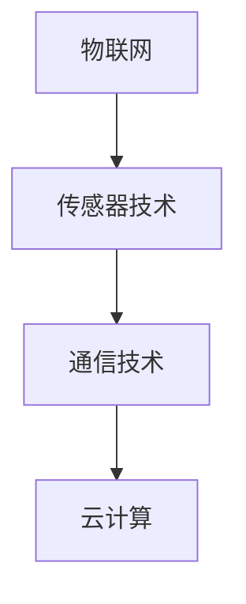

**5.2.2 医疗物联网技术的应用场景**

1. **远程监护：** 通过物联网设备，实时监测患者的生命体征，实现远程监护和预警。例如，智能手表可以实时监测患者的心率、血压等数据，并将数据上传到云端进行分析和处理。

2. **智能医疗设备：** 通过物联网技术，实现医疗设备的智能互联，提高医疗服务的效率和质量。例如，智能输液泵可以实时监测患者的输液状态，并根据患者的需求自动调整输液速度。

3. **健康数据管理：** 通过物联网技术，收集和分析大量的健康数据，为医疗研究和健康管理提供支持。例如，智能手环可以记录用户的运动数据、睡眠数据等，并将数据上传到云端进行分析，为用户提供健康建议。

#### 5.3 生物信息学与基因组学

生物信息学（Bioinformatics）是生物信息与计算机技术的交叉学科，主要研究如何利用计算机技术和统计学方法分析生物学数据。基因组学（Genomics）是研究生物体全部基因的序列、结构、功能和相互作用的科学。以下是从生物信息学和基因组学角度探讨硅谷医疗健康的科技创新：

**5.3.1 生物信息学在医疗健康中的应用**

1. **基因组数据分析：** 生物信息学技术可以用于基因组数据分析，包括基因组测序、基因注释、基因表达分析等。通过分析基因组数据，可以揭示疾病的遗传机制，为个性化治疗提供依据。

2. **蛋白质组学分析：** 蛋白质组学是研究生物体全部蛋白质的组成和变化规律的学科。生物信息学技术可以用于蛋白质组学数据分析，包括蛋白质序列分析、蛋白质相互作用分析等。

3. **代谢组学分析：** 代谢组学是研究生物体代谢产物的组成和变化规律的学科。生物信息学技术可以用于代谢组学数据分析，包括代谢物识别、代谢途径分析等。

**核心概念与联系：**

- **生物信息学：** 生物信息学利用计算机技术和统计学方法，分析和解释生物数据。

- **基因组学：** 基因组学是研究生物体全部基因的序列、结构、功能和相互作用的科学。

- **大数据：** 大数据技术用于处理和分析海量的生物数据，为基因组学研究提供支持。

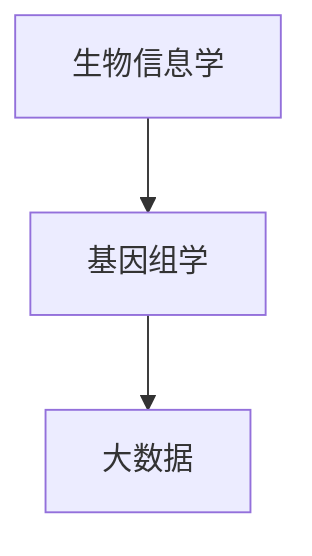

**5.3.2 基因组学在医疗健康中的应用**

1. **个性化医疗：** 基因组学数据可以用于个性化医疗，为患者提供个性化的治疗方案。通过分析患者的基因组数据，可以识别患者的遗传风险因素，为疾病的预防和治疗提供依据。

2. **药物研发：** 基因组学数据可以用于药物研发，揭示药物的作用机制和副作用。通过分析患者的基因组数据，可以预测患者对药物的响应，优化药物的配方和剂量。

3. **疾病预测：** 基因组学数据可以用于疾病预测，通过分析患者的基因组数据，可以预测疾病的发生和发展趋势，为疾病的早期预防和干预提供依据。

### 第6章：硅谷医疗健康的法律与伦理问题

#### 6.1 医疗数据的隐私保护

在硅谷医疗健康领域，医疗数据的隐私保护是至关重要的。医疗数据通常包含患者的敏感信息，如病史、诊断结果、治疗记录等，一旦泄露，可能会对患者的隐私权、身心健康甚至生命安全造成严重威胁。以下是关于医疗数据隐私保护的讨论：

**6.1.1 数据加密**

数据加密是保护医疗数据隐私的重要手段。通过加密算法，医疗数据在传输和存储过程中可以被转换为难以解读的密文，从而防止未经授权的访问和窃取。常见的数据加密技术包括对称加密、非对称加密和哈希算法。

- **对称加密：** 对称加密使用相同的密钥进行加密和解密，常见的对称加密算法有AES（高级加密标准）和DES（数据加密标准）。

- **非对称加密：** 非对称加密使用一对密钥，一个用于加密，另一个用于解密，常见的非对称加密算法有RSA和ECC（椭圆曲线加密）。

- **哈希算法：** 哈希算法用于生成数据摘要，常见的哈希算法有SHA-256和MD5。

**核心概念与联系：**

- **数据加密：** 数据加密用于保护医疗数据在传输和存储过程中的安全性。

- **密钥管理：** 密钥管理是数据加密的核心，包括密钥生成、存储、分发和销毁。

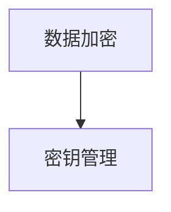

**6.1.2 隐私政策**

隐私政策是企业或医疗机构对外公布的数据隐私保护规则，明确数据收集、使用、存储和共享的方式。隐私政策应当详细说明：

- **数据收集目的：** 明确说明收集数据的目的和用途。

- **数据收集范围：** 明确说明收集的数据类型和范围。

- **数据使用规则：** 明确说明数据的使用方式和限制。

- **数据共享原则：** 明确说明数据共享的条件和限制。

- **用户权利：** 明确说明用户对自身数据的权利，如访问权、更正权和删除权。

**核心概念与联系：**

- **隐私政策：** 隐私政策是规范医疗数据使用和共享的重要文件。

- **用户同意：** 用户同意是隐私政策实施的前提，用户在同意隐私政策后，其数据可以被用于合法目的。

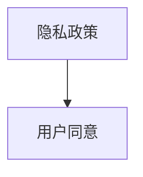

**6.1.3 数据匿名化**

数据匿名化是一种通过去除或模糊化个人标识信息，保护数据隐私的方法。匿名化后的数据不再能够直接识别个人，但仍能用于分析和研究。

- **脱敏技术：** 脱敏技术用于去除或模糊化个人标识信息，如姓名、身份证号等。

- **伪匿名化：** 伪匿名化是一种部分匿名化方法，通过保留部分个人标识信息，以提高数据的价值。

**核心概念与联系：**

- **数据匿名化：** 数据匿名化用于保护医疗数据的隐私。

- **数据可用性：** 数据匿名化在保护隐私的同时，尽量保持数据的可用性和分析价值。

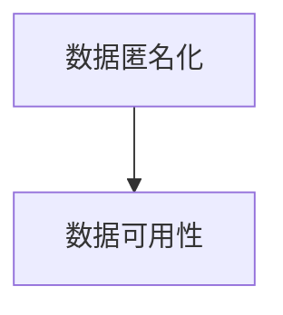

**6.1.4 隐私保护法律与法规**

医疗数据隐私保护需要依赖于法律和法规的规范。以下是一些重要的隐私保护法律和法规：

- **欧盟通用数据保护条例（GDPR）：** GDPR是欧盟制定的一项数据保护法规，对个人数据的收集、使用、存储和共享进行了严格的规定。

- **美国健康保险可携性和责任法案（HIPAA）：** HIPAA是美国的一项医疗数据隐私保护法规，规定了医疗机构的隐私保护义务。

- **加州消费者隐私法案（CCPA）：** CCPA是加州制定的一项消费者隐私保护法案，对消费者数据的收集、使用和共享进行了规定。

**核心概念与联系：**

- **隐私保护法律：** 隐私保护法律是医疗数据隐私保护的基础。

- **合规性要求：** 医疗机构需要遵守隐私保护法律和法规，确保数据的合法收集、使用和保护。

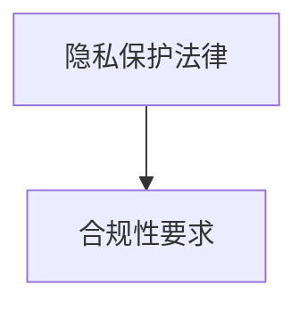

#### 6.2 人工智能医疗诊断的伦理问题

人工智能（AI）医疗诊断在带来诸多便利的同时，也引发了一系列伦理问题。以下是对这些伦理问题的讨论：

**6.2.1 算法透明度**

算法透明度是指医疗诊断算法的决策过程应当是可解释和可追溯的。然而，深度学习等复杂算法的黑箱特性使得其决策过程往往难以解释。以下是一些相关讨论：

- **算法偏见：** 复杂的机器学习模型可能会学习到数据中的偏见，导致诊断结果不公平。例如，如果训练数据中存在性别或种族偏见，模型可能会在这些因素上产生偏见。

- **算法可解释性：** 为了确保算法的透明度，需要开发可解释的机器学习模型，如决策树和规则基模型。

**核心概念与联系：**

- **算法透明度：** 算法透明度是确保医疗诊断结果公正和可接受的关键。

- **算法偏见：** 避免算法偏见需要确保训练数据的质量和多样性。

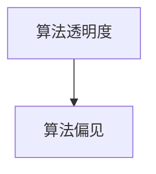

**6.2.2 医疗责任归属**

在人工智能医疗诊断中，当出现诊断错误或患者伤害时，责任归属成为一个复杂的问题。以下是一些相关讨论：

- **算法责任：** 随着算法的复杂度增加，区分算法责任和人类责任变得困难。例如，当深度学习模型产生错误诊断时，是算法开发者还是算法使用者应承担主要责任？

- **医生监督：** 医生在使用人工智能辅助诊断时，需要承担监督责任，确保诊断结果的准确性和合理性。

**核心概念与联系：**

- **医疗责任归属：** 明确责任归属有助于提高医疗诊断的可靠性和安全性。

- **医生监督：** 医生监督是确保人工智能医疗诊断质量的关键。

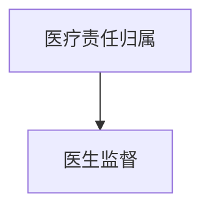

**6.2.3 患者参与**

在人工智能医疗诊断中，患者的参与和选择权是另一个重要的伦理问题。以下是一些相关讨论：

- **患者同意：** 患者应当有权了解和同意使用人工智能辅助诊断，包括了解算法的透明度和可能的风险。

- **患者选择：** 患者应当有权选择是否使用人工智能辅助诊断，以及在何种情况下使用。

**核心概念与联系：**

- **患者参与：** 患者参与是确保医疗诊断过程公正和透明的关键。

- **患者选择：** 患者选择权是尊重患者自主权和知情权的体现。

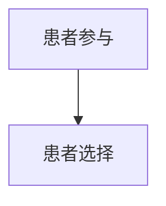

#### 6.3 医疗健康法律法规的发展

医疗健康法律法规的发展对于保障患者权益、规范医疗行为具有重要意义。以下是对医疗健康法律法规的发展的讨论：

**6.3.1 国际经验**

国际上的医疗健康法律法规为硅谷医疗健康领域提供了宝贵的经验。例如，欧盟的GDPR和美国HIPAA等法规在数据隐私保护方面具有严格的规范，对硅谷医疗健康企业具有指导意义。

**核心概念与联系：**

- **国际经验：** 国际经验为硅谷医疗健康企业的合规性提供了参考。

- **法规借鉴：** 硅谷医疗健康企业可以借鉴国际经验，制定符合自身需求的法律法规。

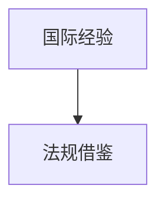

**6.3.2 法律法规的发展趋势**

随着医疗技术的不断进步，医疗健康法律法规也在不断发展和完善。以下是一些法律法规的发展趋势：

- **数据隐私保护：** 随着医疗数据量的增加和数据使用场景的扩展，数据隐私保护法律法规将更加严格，对医疗数据的使用和共享进行更加详细的规定。

- **人工智能监管：** 随着人工智能在医疗领域的应用，人工智能监管法律法规将逐渐完善，确保人工智能医疗诊断的安全性和可靠性。

- **患者权益保障：** 法律法规将更加注重保护患者的权益，包括知情同意权、选择权、隐私权等。

**核心概念与联系：**

- **数据隐私保护：** 数据隐私保护是医疗健康法律法规的核心内容。

- **人工智能监管：** 人工智能监管是确保医疗技术安全性和可靠性的关键。

- **患者权益保障：** 患者权益保障是医疗健康法律法规的宗旨。

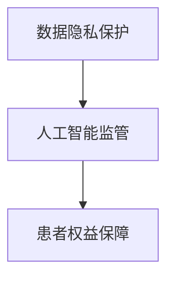

### 第7章：硅谷医疗健康的未来发展趋势

#### 7.1 智能化医疗的未来

硅谷医疗健康领域正在迎来智能化医疗的快速发展，未来智能化医疗将呈现出以下几个方面的趋势：

**7.1.1 智能诊断系统的普及**

随着人工智能技术的不断进步，智能诊断系统将在医疗领域中得到更广泛的应用。智能诊断系统通过深度学习、自然语言处理等技术，可以自动分析医学影像、病理切片和基因组数据，为医生提供辅助诊断和建议。未来，智能诊断系统将逐步取代传统的人工诊断，提高诊断的准确性和效率。

**7.1.2 个性化医疗的深化**

个性化医疗是未来医疗发展的方向，通过整合患者的基因组数据、病历记录和健康数据，为患者提供个性化的治疗方案。硅谷医疗健康企业将不断推动个性化医疗技术的发展，实现精准治疗，提高治疗效果，减少副作用和医疗成本。

**7.1.3 智能健康管理平台的发展**

智能健康管理平台通过物联网技术和大数据分析，实时监测患者的健康数据，提供个性化的健康建议和干预措施。未来，智能健康管理平台将实现从被动治疗到主动预防的转变，提高患者的健康管理水平，降低疾病的发生率。

**7.1.4 医疗物联网的普及**

医疗物联网技术将实现医疗设备的智能化和互联互通，提高医疗服务的效率和质量。未来，医疗物联网将广泛应用于医院、诊所和家庭，实现远程监控、远程治疗和智能监护，为患者提供更加便捷和高效的医疗服务。

#### 7.2 远程医疗的未来发展

远程医疗在硅谷医疗健康领域具有广阔的发展前景，未来远程医疗将呈现出以下几个方面的趋势：

**7.2.1 远程医疗服务的普及**

随着5G技术的普及和互联网技术的发展，远程医疗服务将更加普及。未来，远程医疗服务将不再局限于特定地区和人群，而是实现全球范围内的普及，让更多患者享受到高质量的医疗服务。

**7.2.2 远程医疗模式的多样化**

远程医疗模式将不断创新和多样化，从最初的远程咨询和诊断，发展到远程手术、远程监护和远程治疗等。未来，远程医疗将实现全方位、全过程的医疗服务，提高医疗服务的质量和效率。

**7.2.3 远程医疗与人工智能的融合**

远程医疗与人工智能技术的融合将推动远程医疗的智能化发展。智能诊断系统、智能监护设备和智能健康管理平台等人工智能技术在远程医疗中的应用，将提高远程医疗的诊断准确性和治疗效果。

**7.2.4 远程医疗的国际化发展**

硅谷医疗健康企业将继续加强与国际医疗健康企业的合作，推动远程医疗的国际化发展。未来，远程医疗将成为全球医疗健康事业的重要组成部分，为全球患者提供高质量的医疗服务。

#### 7.3 硅谷医疗健康的全球影响力

硅谷医疗健康企业在全球范围内具有广泛的影响力，其技术创新和商业模式对全球医疗健康产业具有示范和引领作用。以下是对硅谷医疗健康全球影响力的讨论：

**7.3.1 技术创新**

硅谷医疗健康企业在人工智能、大数据、物联网等前沿技术的应用方面处于全球领先地位。这些技术创新不仅推动了硅谷医疗健康领域的发展，也为全球医疗健康产业提供了新的思路和方向。

**7.3.2 商业模式创新**

硅谷医疗健康企业积极探索新的商业模式，如基于数据的商业模式、平台化商业模式等。这些创新商业模式为硅谷医疗健康企业带来了巨大的商业价值，也为全球医疗健康产业提供了新的发展模式。

**7.3.3 国际合作**

硅谷医疗健康企业积极参与国际医疗健康合作，通过跨国合作、合资企业、技术输出等方式，推动全球医疗健康事业的发展。未来，硅谷医疗健康企业将继续加强国际合作，为全球医疗健康事业作出更大的贡献。

### 附录A：硅谷医疗健康相关资源与工具

#### A.1 医疗健康人工智能研究机构

- **斯坦福大学医疗人工智能中心（Stanford Center for Medical Artificial Intelligence）**
- **加州大学旧金山分校医疗人工智能研究所（University of California, San Francisco, Center for Medical AI）**
- **谷歌健康（Google Health）**
- **IBM Watson Health**

#### A.2 医疗健康人工智能相关文献

- **《人工智能在医疗诊断中的应用》（Application of Artificial Intelligence in Medical Diagnosis）**
- **《远程医疗：技术、挑战与未来》（Telemedicine: Technology, Challenges, and Future Directions）**
- **《医疗物联网技术及应用》（Application of Medical IoT Technologies）**
- **《基因组学与个性化医疗》（Genomics and Personalized Medicine）**

#### A.3 医疗健康人工智能开发工具与平台

- **TensorFlow Health**
- **PyTorch Medical**
- **Keras Medical**
- **IBM Watson Health API**

### 参考资料

- **硅谷医疗健康领域知名企业的案例研究**：谷歌健康、IBM Watson Health、Teladoc Health、Livongo
- **医疗健康人工智能领域最新研究报告**：斯坦福大学、加州大学旧金山分校、谷歌健康
- **医疗健康法律法规及政策文件**：美国国家卫生研究院（NIH）、欧盟通用数据保护条例（GDPR）、美国健康保险可携性和责任法案（HIPAA）

### 致谢

特别感谢硅谷医疗健康领域专家和从业人员对本书提供的宝贵意见和支持。同时，感谢斯坦福大学、加州大学旧金山分校等学术机构的教授和研究人员，以及谷歌健康、IBM Watson Health等企业的技术团队，为本书提供的技术支持和数据支持。感谢所有参与本书编写和审校的团队成员，以及为本书的出版付出辛勤努力的编辑和出版团队。最后，感谢每一位读者的关注和支持，希望本书能够为读者带来有价值的知识和启示。作者：AI天才研究院/AI Genius Institute & 禅与计算机程序设计艺术 /Zen And The Art of Computer Programming。

