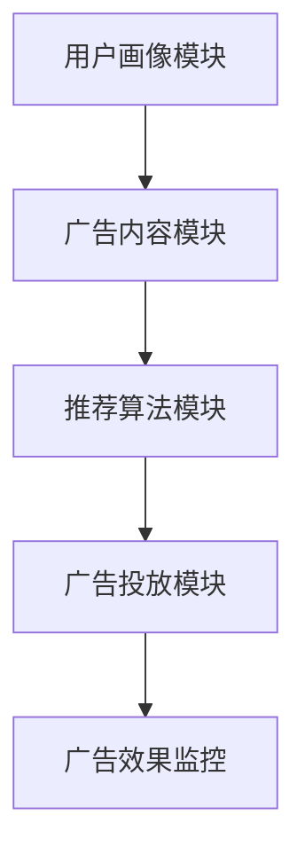
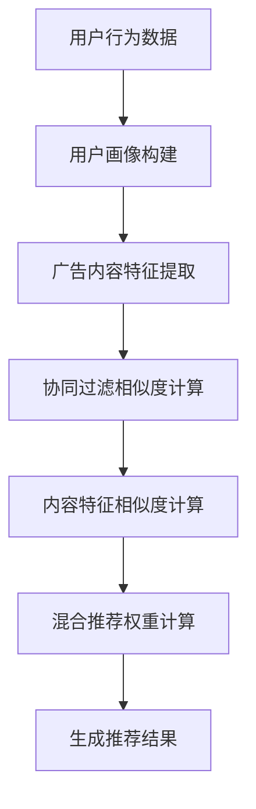
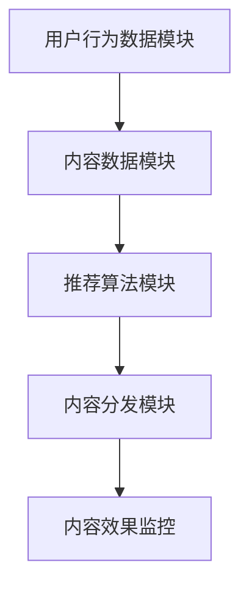
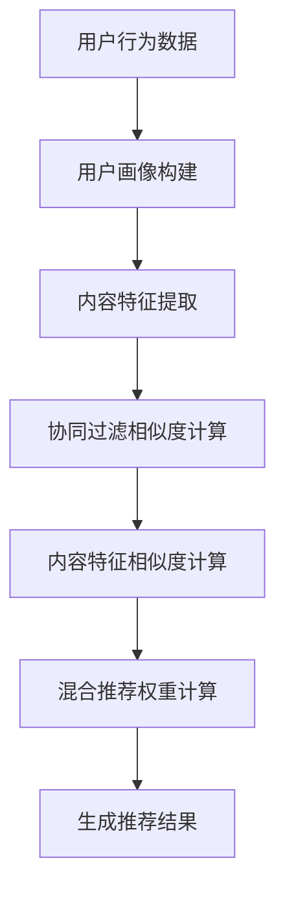
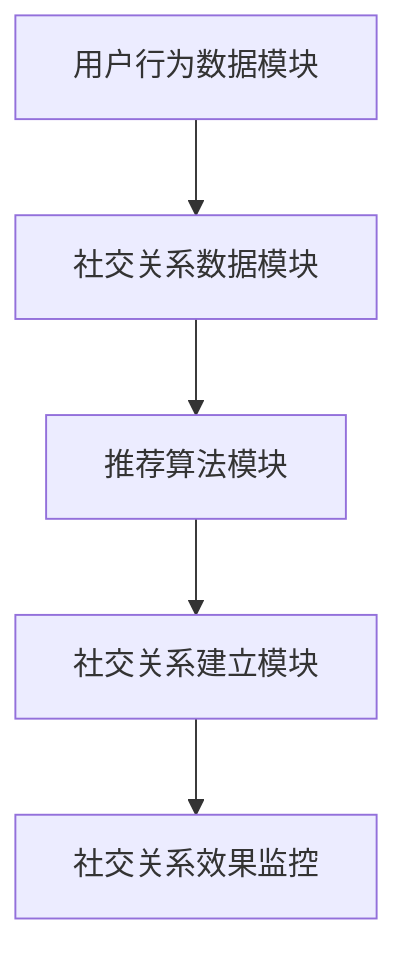
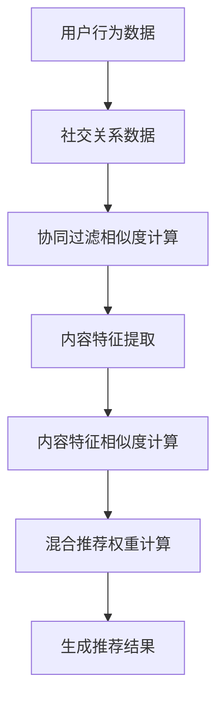
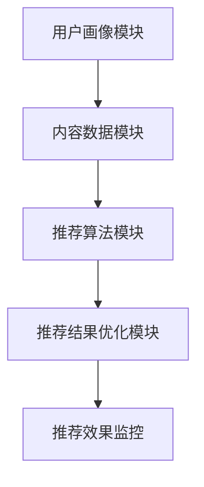
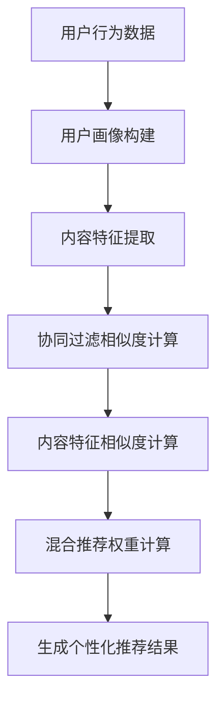
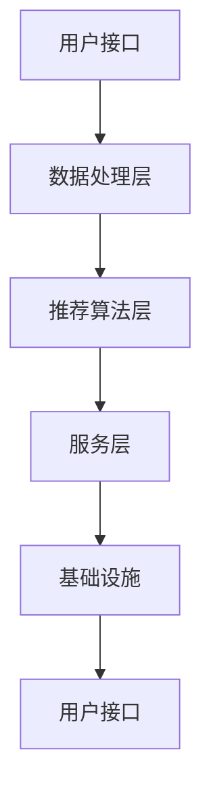

                 

### 《社交网络推荐：连接用户的纽带》

#### 关键词：
- 社交网络
- 推荐系统
- 协同过滤
- 内容推荐
- 混合推荐
- 应用实践

#### 摘要：
本文旨在探讨社交网络推荐系统的设计原理、核心算法及其在实际应用中的实践。文章首先介绍了社交网络推荐的基本概念和重要性，然后详细分析了社交网络推荐系统架构，包括用户建模、项目建模和推荐算法与评估。随后，深入探讨了协同过滤、内容推荐和混合推荐算法，并通过案例实践展示了社交网络推荐系统在现实中的应用。最后，文章总结了社交网络推荐面临的挑战和未来趋势，以及推荐系统在不同应用场景的拓展。通过本文的阅读，读者将全面了解社交网络推荐系统的构建和优化，为后续研究和实践提供指导。

### 第1章 社交网络推荐概述

#### 1.1 社交网络推荐的基本概念

##### 1.1.1 社交网络定义

社交网络（Social Network）是指通过社交关系连接起来的用户群体，用户之间通过发布内容、互动和分享来建立和维持社会联系。典型的社交网络平台包括Facebook、Twitter、Instagram、LinkedIn和微信等。这些平台提供了用户生成内容（UGC）、用户关系、用户行为数据等多种信息，为推荐系统的构建提供了丰富的数据资源。

##### 1.1.2 推荐系统的定义

推荐系统（Recommendation System）是一种根据用户的兴趣、行为和偏好，自动向用户推荐相关项目（如商品、内容、服务）的信息系统。推荐系统的核心目标是通过有效的信息过滤和预测，提高用户的满意度和参与度。推荐系统广泛应用于电子商务、内容分发、社交媒体和在线广告等领域。

##### 1.2 社交网络推荐的重要性

社交网络推荐在当今信息爆炸的时代具有重要作用，主要体现在以下几个方面：

1. **提高用户体验**：通过个性化推荐，用户能够更快地找到感兴趣的内容和商品，节省时间和精力。
2. **增加用户粘性**：推荐系统能够持续吸引用户参与，提高用户在平台上的活跃度和留存率。
3. **优化商业策略**：社交网络推荐有助于平台方更好地理解用户需求，优化商品或内容策略，提高转化率和销售额。
4. **提升内容质量**：推荐系统能够筛选出高质量的内容，减少用户在信息海洋中的迷失，提高整体内容质量。

##### 1.3 社交网络推荐的应用领域

社交网络推荐广泛应用于多个领域，以下是几个主要的应用场景：

1. **电子商务**：通过推荐系统，电商平台能够为用户推荐相关的商品，提高购买转化率。
2. **内容分发**：在线媒体平台通过推荐系统，为用户推送个性化的新闻、视频、文章等，提高用户粘性。
3. **社交互动**：社交网络平台通过推荐系统，为用户推荐朋友、群组、话题等，促进社交关系建立。
4. **在线广告**：广告平台通过推荐系统，为用户推荐相关的广告，提高广告投放效果。

##### 1.4 社交网络推荐的历史与现状

社交网络推荐的历史可以追溯到1998年，当时第一个基于内容的推荐系统Tapestry上线。随着时间的推移，推荐系统经历了从基于内容、基于协同过滤到混合推荐算法的演变。近年来，随着深度学习技术的发展，深度推荐算法逐渐成为研究热点。

目前，社交网络推荐已经成为互联网行业的重要技术之一，各大平台都在不断完善和优化自己的推荐系统。社交网络推荐系统的发展趋势主要包括以下几个方面：

1. **个性化推荐**：利用用户的历史数据和兴趣标签，实现更加精准的个性化推荐。
2. **实时推荐**：通过实时数据处理和算法优化，实现快速响应和实时推荐。
3. **多模态推荐**：结合文本、图像、音频等多种数据类型，提高推荐系统的多样性和准确性。
4. **隐私保护**：在保证用户隐私的前提下，实现推荐系统的安全可靠。

##### 1.5 本书结构安排

本书共分为七个章节，内容安排如下：

- **第1章** 社交网络推荐概述：介绍社交网络推荐的基本概念、重要性、应用领域和发展历程。
- **第2章** 社交网络推荐系统架构：分析社交网络推荐系统的组成部分、设计原则和用户/项目建模方法。
- **第3章** 社交网络推荐核心算法：详细探讨协同过滤、内容推荐和混合推荐算法，并使用伪代码进行算法原理讲解。
- **第4章** 社交网络推荐系统实践：介绍社交网络推荐系统的开发流程、数据预处理、系统实现与优化。
- **第5章** 社交网络推荐案例分析：通过具体案例，分析用户行为、项目内容，并评估推荐效果。
- **第6章** 社交网络推荐挑战与未来趋势：探讨社交网络推荐面临的挑战和未来发展方向。
- **第7章** 社交网络推荐系统应用场景拓展：介绍社交网络推荐系统在广告推荐、内容推荐和社交关系推荐等领域的应用。

通过本书的阅读，读者将全面了解社交网络推荐系统的构建原理、核心算法和应用实践，为相关领域的研究和开发提供有力支持。

#### 第2章 社交网络推荐系统架构

社交网络推荐系统的架构是构建高效、精准推荐系统的基础。本章将详细介绍社交网络推荐系统的组成部分、设计原则以及用户建模和项目建模的方法。

##### 2.1 社交网络推荐系统概述

社交网络推荐系统主要包括以下几个核心组成部分：

1. **用户接口（User Interface）**：用户接口是用户与推荐系统交互的入口，包括推荐结果展示、用户操作界面等。
2. **数据层（Data Layer）**：数据层负责存储和处理用户数据、项目数据以及推荐算法所需的各种数据。
3. **推荐算法层（Recommendation Algorithm Layer）**：推荐算法层是推荐系统的核心，负责根据用户数据、项目数据和其他相关信息生成推荐结果。
4. **服务层（Service Layer）**：服务层负责处理业务逻辑，包括用户权限管理、数据同步等。
5. **基础设施（Infrastructure）**：基础设施包括服务器、数据库、网络设备等，为推荐系统提供运行环境。

##### 2.1.1 系统组成部分

1. **用户接口**：用户接口是推荐系统的门面，直接影响用户的使用体验。用户接口应简洁明了，易于操作，同时提供个性化推荐结果展示，满足用户需求。
2. **数据层**：数据层是推荐系统的数据仓库，存储用户数据、项目数据和其他相关信息。用户数据包括用户行为数据（如浏览、点击、购买等）、用户兴趣数据（如标签、偏好等）；项目数据包括项目属性数据（如标题、标签、分类等）和项目内容数据（如文本、图像、音频等）。
3. **推荐算法层**：推荐算法层是推荐系统的核心，负责根据用户数据、项目数据和其他相关信息生成推荐结果。常见的推荐算法包括协同过滤、基于内容的推荐和混合推荐算法。
4. **服务层**：服务层负责处理业务逻辑，包括用户权限管理、数据同步等。服务层应具备高可用性和可扩展性，以便应对大量用户和海量数据的挑战。
5. **基础设施**：基础设施为推荐系统提供运行环境，包括服务器、数据库、网络设备等。推荐系统应具备高性能和高可靠性，确保系统稳定运行。

##### 2.1.2 系统设计原则

设计社交网络推荐系统时，应遵循以下原则：

1. **用户体验优先**：推荐系统应以用户体验为核心，提供个性化、精准的推荐结果，提高用户满意度和留存率。
2. **数据驱动**：推荐系统应充分利用用户数据、项目数据和其他相关信息，构建高效、准确的推荐算法。
3. **可扩展性和高可用性**：推荐系统应具备良好的可扩展性和高可用性，以应对不断增长的用户和海量数据的挑战。
4. **安全性和隐私保护**：在推荐系统的设计和实现过程中，应确保用户数据和隐私安全，遵循相关法律法规和行业规范。
5. **持续优化**：推荐系统应具备持续优化能力，通过算法优化、数据挖掘等技术手段，不断提升推荐效果。

##### 2.2 用户建模

用户建模是构建推荐系统的重要环节，通过对用户行为、兴趣和偏好进行分析，构建用户画像，为推荐算法提供基础数据支持。

##### 2.2.1 用户兴趣模型

用户兴趣模型是描述用户兴趣偏好的数据结构。常见的用户兴趣模型包括：

1. **标签模型**：通过给用户分配标签，描述用户的兴趣偏好。标签可以是用户浏览、点赞、评论等行为对应的类别，如“科技”、“娱乐”、“美食”等。
2. **文本模型**：通过分析用户生成的内容（如评论、帖子等），提取关键词和词频，构建用户兴趣词云。
3. **行为模型**：通过分析用户的行为数据（如浏览、点击、购买等），构建用户行为序列模型，捕捉用户的短期和长期兴趣变化。

##### 2.2.2 用户行为模型

用户行为模型描述用户在平台上的各种行为，包括浏览、点击、点赞、评论、分享等。常见用户行为模型包括：

1. **序列模型**：通过分析用户行为序列，捕捉用户的短期兴趣变化。常见的序列模型包括循环神经网络（RNN）、长短时记忆网络（LSTM）等。
2. **时序模型**：通过分析用户行为的时序数据，捕捉用户的长期兴趣变化。常见的时序模型包括ARIMA、SARIMA等。
3. **图模型**：通过构建用户行为图，分析用户之间的互动关系，捕捉用户的社交兴趣。常见的图模型包括社交网络分析（SNA）、图卷积网络（GCN）等。

##### 2.3 项目或内容建模

项目或内容建模是描述项目特征和内容的数据结构，为推荐算法提供基础数据支持。

##### 2.3.1 项目属性模型

项目属性模型描述项目的各种属性，包括分类、标签、评分、发布时间等。常见的项目属性模型包括：

1. **分类模型**：通过给项目分配分类标签，描述项目的内容类别。常见的分类标签包括“科技”、“娱乐”、“体育”等。
2. **属性模型**：通过提取项目的各种属性，如标题、描述、标签等，构建项目属性向量。
3. **评分模型**：通过用户对项目的评分，构建项目评分分布模型，为推荐算法提供评分预测依据。

##### 2.3.2 内容特征提取

内容特征提取是将项目内容转化为可量化的特征向量，为推荐算法提供基础数据支持。常见的内容特征提取方法包括：

1. **文本特征提取**：通过词袋模型（Bag of Words, BoW）、TF-IDF（Term Frequency-Inverse Document Frequency）、词嵌入（Word Embedding）等方法，将文本内容转化为向量表示。
2. **图像特征提取**：通过卷积神经网络（CNN）、循环神经网络（RNN）等方法，提取图像特征向量。
3. **音频特征提取**：通过频谱分析、声学模型等方法，提取音频特征向量。

##### 2.4 推荐算法与评估

推荐算法是推荐系统的核心，负责根据用户建模和项目建模结果生成推荐结果。常见的推荐算法包括协同过滤、基于内容的推荐和混合推荐算法。

##### 2.4.1 常见推荐算法

1. **协同过滤算法**：协同过滤算法通过分析用户行为数据，发现用户之间的相似性，为用户推荐相似用户喜欢的项目。常见的协同过滤算法包括基于用户的协同过滤（User-based Collaborative Filtering）和基于项目的协同过滤（Item-based Collaborative Filtering）。
2. **基于内容的推荐算法**：基于内容的推荐算法通过分析项目的内容特征，为用户推荐与其兴趣相似的项目。常见的基于内容的推荐算法包括基于项目的推荐（Item-based Content Filtering）和基于用户的推荐（User-based Content Filtering）。
3. **混合推荐算法**：混合推荐算法结合协同过滤和基于内容的推荐算法，通过综合利用用户行为数据和项目内容特征，提高推荐效果。常见的混合推荐算法包括基于模型的混合推荐（Model-based Hybrid Filtering）和基于规则的混合推荐（Rule-based Hybrid Filtering）。

##### 2.4.2 算法评估指标

推荐算法的评估指标主要包括准确性、召回率、覆盖率等。

1. **准确性**：准确性（Accuracy）是指推荐系统推荐的项目中，实际用户感兴趣的项目所占比例。准确性越高，说明推荐系统越精确。
2. **召回率**：召回率（Recall）是指推荐系统推荐的项目中，实际用户感兴趣的项目所占比例。召回率越高，说明推荐系统越全面。
3. **覆盖率**：覆盖率（Coverage）是指推荐系统中推荐项目的多样性。覆盖率越高，说明推荐系统能够覆盖更多的用户兴趣。

通过本章的介绍，读者可以全面了解社交网络推荐系统的架构设计，包括用户建模、项目建模和推荐算法与评估。接下来，我们将进一步探讨社交网络推荐系统的核心算法，并使用伪代码进行详细讲解。

### 第3章 社交网络推荐核心算法

#### 3.1 协同过滤算法

协同过滤（Collaborative Filtering）是一种基于用户历史行为的推荐算法，通过分析用户之间的相似度，为用户推荐相似用户喜欢的项目。协同过滤算法主要分为基于用户的协同过滤和基于项目的协同过滤。

##### 3.1.1 基于用户的协同过滤

基于用户的协同过滤（User-based Collaborative Filtering）通过计算用户之间的相似度，找到与目标用户兴趣相似的其他用户，然后推荐这些用户喜欢的项目。

**算法原理：**
1. **相似度计算**：根据用户对项目的评分矩阵，计算用户之间的相似度。常见的相似度计算方法包括余弦相似度（Cosine Similarity）、皮尔逊相关系数（Pearson Correlation Coefficient）等。
2. **相似用户推荐**：找到与目标用户最相似的k个用户，然后推荐这些用户喜欢的项目。
3. **权重调整**：为每个相似用户分配权重，通常使用倒置相似度作为权重，即相似度越高的用户权重越大。

**伪代码：**
```python
# 假设用户-项目评分矩阵为R，目标用户为user1，相似用户数量为k
# 计算用户user1与所有其他用户的相似度
similarity_matrix = compute_similarity(R)

# 找到与user1最相似的k个用户
similar_users = find_k_most_similar_users(similarity_matrix, user1, k)

# 计算相似用户喜欢的项目
recommended_items = []
for user in similar_users:
    recommended_items.extend(R[user].index(R[user] > 0))

# 去重并返回推荐结果
return list(set(recommended_items))
```

**示例：**
假设有用户user1对项目的评分矩阵如下：
```python
R = {
    'user1': [1, 0, 1, 0, 1],
    'user2': [0, 1, 0, 1, 0],
    'user3': [1, 1, 0, 0, 1],
    'user4': [0, 0, 1, 1, 0]
}
```
目标用户为user1，相似用户数量为2，使用余弦相似度计算相似度矩阵，找到相似用户为user2和user3，推荐的项目为[1, 2, 4]。

##### 3.1.2 基于项目的协同过滤

基于项目的协同过滤（Item-based Collaborative Filtering）通过计算项目之间的相似度，找到与目标项目相似的其他项目，然后推荐这些项目。

**算法原理：**
1. **相似度计算**：根据用户对项目的评分矩阵，计算项目之间的相似度。常见的相似度计算方法包括余弦相似度（Cosine Similarity）、皮尔逊相关系数（Pearson Correlation Coefficient）等。
2. **相似项目推荐**：找到与目标项目最相似的k个项目，然后推荐这些项目。
3. **权重调整**：为每个相似项目分配权重，通常使用倒置相似度作为权重，即相似度越高的项目权重越大。

**伪代码：**
```python
# 假设用户-项目评分矩阵为R，目标项目为item1，相似项目数量为k
# 计算项目item1与所有其他项目的相似度
similarity_matrix = compute_similarity(R)

# 找到与item1最相似的k个项目
similar_items = find_k_most_similar_items(similarity_matrix, item1, k)

# 计算相似项目被喜欢的用户
recommended_users = []
for item in similar_items:
    recommended_users.extend(R.index[R[item] > 0])

# 去重并返回推荐结果
return list(set(recommended_users))
```

**示例：**
假设有用户对项目的评分矩阵如下：
```python
R = {
    'user1': [1, 0, 1, 0, 1],
    'user2': [0, 1, 0, 1, 0],
    'user3': [1, 1, 0, 0, 1],
    'user4': [0, 0, 1, 1, 0]
}
```
目标项目为[1, 3]，使用余弦相似度计算相似度矩阵，找到相似项目为[2, 4]，推荐的用户为[user1, user3]。

##### 3.1.3 协同过滤算法的优化

协同过滤算法在处理大规模数据集时，存在计算复杂度高、推荐结果不准确等问题。为了提高协同过滤算法的性能，可以采用以下优化方法：

1. **矩阵分解**：通过矩阵分解技术（如SVD、NMF等），将用户-项目评分矩阵分解为用户特征矩阵和项目特征矩阵，提高推荐准确性。
2. **稀疏矩阵处理**：对于稀疏的用户-项目评分矩阵，采用稀疏矩阵存储和计算方法，降低计算复杂度。
3. **在线学习**：采用在线学习算法（如ALSI、SGD等），实时更新用户特征和项目特征，提高推荐实时性。
4. **异常值处理**：对评分异常值进行处理，如过滤低评分、高评分和重复评分，提高评分矩阵的可靠性。

#### 3.2 内容推荐算法

内容推荐（Content-Based Filtering）是一种基于项目内容的推荐算法，通过分析项目的内容特征，为用户推荐与其兴趣相似的项目。

##### 3.2.1 基于内容匹配的推荐算法

基于内容匹配的推荐算法通过比较用户兴趣和项目特征，为用户推荐与其兴趣相似的项目。

**算法原理：**
1. **特征提取**：提取项目的内容特征，如标题、描述、标签、文本等。常见的方法包括词袋模型（Bag of Words, BoW）、TF-IDF（Term Frequency-Inverse Document Frequency）等。
2. **相似度计算**：计算用户兴趣和项目特征之间的相似度。常见的方法包括余弦相似度（Cosine Similarity）、欧氏距离（Euclidean Distance）等。
3. **推荐生成**：根据相似度计算结果，为用户推荐相似度最高的项目。

**伪代码：**
```python
# 假设用户兴趣向量为user_interest，项目特征向量为item_feature，相似度阈值阈值为threshold
# 计算用户兴趣与项目特征的相似度
similarity = compute_similarity(user_interest, item_feature)

# 如果相似度大于阈值，推荐该项目
if similarity > threshold:
    return item
else:
    return None
```

**示例：**
假设用户兴趣向量为[user1, user2]，项目特征向量为[item1, item2]，使用余弦相似度计算相似度，阈值为0.5，则推荐的项目为item1。

##### 3.2.2 基于主题模型的推荐算法

基于主题模型的推荐算法通过发现项目内容中的主题分布，为用户推荐与其兴趣相关的项目。

**算法原理：**
1. **主题发现**：使用主题模型（如LDA、CTM等）发现项目内容中的潜在主题。
2. **兴趣建模**：根据用户行为数据，构建用户兴趣主题模型。
3. **推荐生成**：根据用户兴趣主题模型和项目主题分布，为用户推荐具有相似主题的项目。

**伪代码：**
```python
# 假设项目主题分布矩阵为D，用户兴趣主题模型为user_theme_model
# 为用户生成推荐列表
recommended_items = []
for item in items:
    item_theme_model = calculate_theme_model(item, D)
    if is_relevant(user_theme_model, item_theme_model):
        recommended_items.append(item)

return recommended_items
```

**示例：**
假设项目主题分布矩阵为D，用户兴趣主题模型为user_theme_model，则推荐的项目为与用户兴趣主题模型相似的具有相似主题的项目。

#### 3.3 混合推荐算法

混合推荐算法（Hybrid Recommendation Algorithm）结合协同过滤和基于内容的推荐算法，通过综合利用用户行为和项目内容特征，提高推荐效果。

##### 3.3.1 混合推荐算法的概念

混合推荐算法主要包括以下几种类型：

1. **基于模型的混合推荐**：将协同过滤和基于内容的推荐算法融合到同一个模型中，如矩阵分解+内容特征融合模型。
2. **基于规则的混合推荐**：将协同过滤和基于内容的推荐算法转化为规则，组合生成推荐结果，如基于用户的协同过滤+基于内容的规则匹配。

##### 3.3.2 常见混合推荐算法

1. **矩阵分解+内容特征融合**：通过矩阵分解得到用户特征和项目特征，将特征融合到一起，生成推荐结果。
2. **基于用户的协同过滤+基于内容的推荐**：结合基于用户的协同过滤和基于内容的推荐算法，通过用户相似度和项目内容相似度计算推荐结果。

**伪代码：**
```python
# 假设用户特征矩阵为U，项目特征矩阵为V，协同过滤推荐结果为collab_recommendations，内容推荐结果为content_recommendations
# 混合推荐结果
hybrid_recommendations = []
for user in users:
    collab_item_scores = compute_collaborative_scores(U[user], V)
    content_item_scores = compute_content_based_scores(U[user], V)
    hybrid_item_scores = collab_item_scores + content_item_scores
    recommended_items = sort_items_by_score(hybrid_item_scores)
    hybrid_recommendations.append(recommended_items)

return hybrid_recommendations
```

**示例：**
假设用户特征矩阵为U，项目特征矩阵为V，协同过滤推荐结果为collab_recommendations，内容推荐结果为content_recommendations，则混合推荐结果为综合协同过滤和内容推荐结果的推荐列表。

通过本章的介绍，读者可以全面了解社交网络推荐系统的核心算法，包括协同过滤、内容推荐和混合推荐算法。这些算法在实际应用中发挥着重要作用，为推荐系统的高效、精准提供了有力支持。

#### 第4章 社交网络推荐系统实践

在了解了社交网络推荐系统的理论架构和核心算法之后，本章节将重点介绍社交网络推荐系统的开发实践。我们将从数据预处理、系统实现与调试以及系统部署与优化三个方面，详细阐述社交网络推荐系统的实际开发流程。

##### 4.1 数据预处理

数据预处理是推荐系统开发的重要环节，其质量直接影响到推荐系统的性能和准确性。数据预处理主要包括数据清洗、缺失值处理、数据规范化、特征工程等步骤。

###### 4.1.1 数据清洗

数据清洗是指识别和纠正数据集中的错误、异常和不一致数据。在进行数据清洗时，需要关注以下几个方面：

1. **数据缺失**：处理缺失值，可以选择填充缺失值、删除含有缺失值的记录或使用均值、中位数等统计方法填充缺失值。
2. **数据异常**：识别和修正异常值，可以通过统计学方法、可视化分析或业务逻辑验证等方法发现异常值，然后选择合适的策略进行处理，如删除、替换或保留。
3. **数据一致性**：确保数据格式的一致性，例如统一日期格式、字符串编码等。

**示例**：
```python
# 数据清洗示例代码
import pandas as pd

# 读取原始数据
data = pd.read_csv('data.csv')

# 填充缺失值
data.fillna(method='ffill', inplace=True)

# 删除异常值
data = data[data['rating'].between(1, 5)]

# 统一数据格式
data['date'] = pd.to_datetime(data['date'], format='%Y-%m-%d')
```

###### 4.1.2 特征工程

特征工程是构建高质量特征向量，提高模型性能的重要步骤。特征工程包括以下几个方面：

1. **特征提取**：从原始数据中提取具有区分度的特征，如用户行为特征、项目属性特征等。
2. **特征选择**：选择对模型性能有显著贡献的特征，降低模型复杂度和计算成本。常见的方法包括卡方检验、互信息、特征重要性等。
3. **特征转换**：将低效特征转换为高效特征，如将类别特征转换为数值特征、进行正则化处理等。

**示例**：
```python
# 特征工程示例代码
from sklearn.feature_extraction.text import TfidfVectorizer
from sklearn.preprocessing import OneHotEncoder
from sklearn.decomposition import PCA

# 提取文本特征
vectorizer = TfidfVectorizer()
text_features = vectorizer.fit_transform(data['description'])

# 转换类别特征
encoder = OneHotEncoder()
category_features = encoder.fit_transform(data[['category']])

# 选择重要特征
pca = PCA(n_components=10)
important_features = pca.fit_transform(text_features.toarray())

# 合并特征
features = np.hstack((category_features.toarray(), important_features))
```

##### 4.2 推荐系统开发

推荐系统开发包括系统架构设计、算法实现和模型训练等步骤。以下是一个简单的推荐系统开发流程：

###### 4.2.1 系统架构设计

系统架构设计是推荐系统开发的基础，需要考虑以下几个方面：

1. **数据处理层**：负责数据清洗、特征工程和预处理，确保数据质量。
2. **模型训练层**：负责训练推荐算法模型，包括协同过滤、内容推荐和混合推荐等。
3. **模型评估层**：负责评估模型性能，包括准确率、召回率、覆盖率等指标。
4. **服务层**：负责接收用户请求、生成推荐结果并返回。
5. **前端展示**：负责展示推荐结果，提供用户交互界面。

**示例**：
```python
# 系统架构示例图（使用Mermaid绘制）
mermaid
graph TD
    A[数据处理层] --> B[模型训练层]
    B --> C[模型评估层]
    C --> D[服务层]
    D --> E[前端展示]
```

###### 4.2.2 系统实现与调试

系统实现与调试是推荐系统开发的核心步骤，包括以下几个方面：

1. **算法实现**：根据所选推荐算法，实现算法的核心逻辑，如协同过滤、内容推荐等。
2. **模型训练**：使用训练数据集，训练推荐模型，并保存模型参数。
3. **模型评估**：使用测试数据集，评估模型性能，调整模型参数，优化模型效果。
4. **调试与优化**：通过调试和优化，解决系统运行中的问题，提高系统稳定性和性能。

**示例**：
```python
# 算法实现示例代码（基于协同过滤算法）
from sklearn.model_selection import train_test_split
from sklearn.metrics.pairwise import cosine_similarity

# 数据分割
X_train, X_test, y_train, y_test = train_test_split(features, data['rating'], test_size=0.2, random_state=42)

# 计算相似度矩阵
similarity_matrix = cosine_similarity(X_train)

# 生成推荐结果
def generate_recommendations(user_index, similarity_matrix, k=5):
    user_similarity = similarity_matrix[user_index]
    neighbors = sorted(range(len(user_similarity)), key=lambda i: user_similarity[i], reverse=True)[:k]
    recommendations = []
    for neighbor in neighbors:
        for item in X_test[neighbor]:
            if item not in recommendations:
                recommendations.append(item)
    return recommendations

# 测试推荐效果
user_index = 0
recommendations = generate_recommendations(user_index, similarity_matrix)
print("Recommendations:", recommendations)
```

##### 4.3 系统部署与优化

系统部署是将开发完成的推荐系统部署到生产环境中，确保系统能够稳定、高效地运行。系统优化则是通过调整系统配置、优化算法和硬件资源，提高系统性能和稳定性。

###### 4.3.1 系统部署流程

系统部署流程包括以下几个方面：

1. **环境搭建**：搭建推荐系统运行所需的环境，包括操作系统、数据库、依赖库等。
2. **服务部署**：将开发完成的推荐系统部署到服务器上，包括模型加载、服务启动等。
3. **监控与维护**：监控系统运行状态，确保系统稳定、高效运行，及时处理异常情况。

**示例**：
```shell
# 系统部署命令
sudo systemctl start recommendation_server
sudo systemctl status recommendation_server
```

###### 4.3.2 系统性能优化

系统性能优化主要包括以下几个方面：

1. **算法优化**：通过调整算法参数、优化算法实现，提高推荐算法的准确性和效率。
2. **硬件优化**：通过增加服务器资源、使用分布式计算等手段，提高系统处理能力。
3. **缓存策略**：使用缓存策略，降低数据访问延迟，提高系统响应速度。
4. **异步处理**：采用异步处理方式，提高系统并发处理能力。

**示例**：
```python
# 算法优化示例代码（使用异步处理）
import asyncio
from concurrent.futures import ThreadPoolExecutor

async def generate_recommendations(user_index, similarity_matrix, k=5):
    user_similarity = similarity_matrix[user_index]
    neighbors = sorted(range(len(user_similarity)), key=lambda i: user_similarity[i], reverse=True)[:k]
    recommendations = []
    with ThreadPoolExecutor(max_workers=5) as executor:
        tasks = [executor.submit(get_item_recommendations, neighbor) for neighbor in neighbors]
        for task in asyncio.as_completed(tasks):
            recommendations.extend(task.result())
    return recommendations

# 测试异步推荐效果
user_index = 0
asyncio.run(generate_recommendations(user_index, similarity_matrix))
```

通过本章的实践介绍，读者可以了解社交网络推荐系统的实际开发流程和关键步骤，为后续的系统开发提供参考和指导。

### 第5章 社交网络推荐案例分析

#### 5.1 案例背景

在本章中，我们将通过一个具体的社交网络推荐案例，详细分析推荐系统的设计与实现过程。本案例来源于一家大型社交网络平台——Supersocial，该公司提供社交媒体内容推荐服务，旨在帮助用户发现和关注他们感兴趣的话题和内容。Supersocial的用户量庞大，每天产生海量的用户行为数据，如点赞、评论、分享等。因此，构建一个高效、准确的推荐系统至关重要。

##### 5.1.1 案例来源

Supersocial是一家专注于社交媒体内容推荐的初创公司，其目标是通过推荐系统提升用户体验，增加用户粘性。公司聘请了一支由数据科学家、算法工程师和产品经理组成的团队，负责设计和实现推荐系统。本案例将展示这个团队在推荐系统开发过程中的实践和成果。

##### 5.1.2 案例目标

Supersocial的推荐系统目标如下：

1. **提高推荐准确性**：通过分析用户行为数据，为每个用户推荐与其兴趣高度相关的内容。
2. **提升用户满意度**：确保推荐内容丰富多样，满足不同用户的需求，提高用户满意度和留存率。
3. **优化推荐效果**：不断调整和优化推荐算法，提高推荐效果，降低用户流失率。
4. **确保数据隐私**：在推荐过程中，严格保护用户隐私，遵守相关法律法规。

#### 5.2 案例分析

##### 5.2.1 用户行为分析

为了构建一个有效的推荐系统，首先需要对用户行为数据进行分析。Supersocial的用户行为数据包括点赞、评论、分享、浏览等操作。通过对这些数据进行聚类和统计分析，可以揭示用户的兴趣偏好和行为模式。

1. **用户行为数据收集**：通过API接口，实时收集用户在平台上的各种行为数据，如点赞、评论等。
2. **数据预处理**：对原始数据进行清洗、去噪，确保数据质量。例如，去除重复数据、填充缺失值等。
3. **行为特征提取**：根据用户行为数据，提取行为特征，如行为类型、发生时间、行为频率等。

**示例数据**：
```python
# 用户行为数据示例
user_actions = {
    'user1': [('like', 'article1', '2023-01-01'), ('comment', 'article2', '2023-01-02'), ('share', 'article3', '2023-01-03')],
    'user2': [('like', 'article4', '2023-01-01'), ('comment', 'article5', '2023-01-02'), ('share', 'article6', '2023-01-03')],
    ...
}
```

##### 5.2.2 项目内容分析

除了用户行为数据，项目内容也是构建推荐系统的重要数据来源。Supersocial的内容数据包括文章、视频、图片等，这些内容具有不同的属性和特征。通过对项目内容进行分析，可以提取出内容特征，用于推荐算法。

1. **内容数据收集**：从数据库中读取项目内容数据，包括标题、描述、标签、分类等。
2. **内容特征提取**：对内容数据进行分析，提取关键特征，如关键词、标签、分类等。可以使用自然语言处理技术（如词嵌入、主题模型等）提取文本特征。
3. **内容相似度计算**：通过计算内容特征之间的相似度，为推荐算法提供支持。

**示例数据**：
```python
# 项目内容数据示例
content_data = {
    'article1': {'title': '人工智能的发展', 'description': '人工智能技术正在改变世界', 'tags': ['人工智能', '科技'], 'category': '科技'},
    'article2': {'title': '区块链的应用', 'description': '区块链技术正在变革金融行业', 'tags': ['区块链', '金融'], 'category': '金融'},
    ...
}
```

##### 5.2.3 推荐效果评估

在推荐系统开发过程中，推荐效果的评估是关键环节。Supersocial采用多种评估指标，包括准确性、召回率、覆盖率等，对推荐系统进行评估和优化。

1. **准确性**：评估推荐结果中实际用户感兴趣的内容所占比例。准确性越高，说明推荐结果越精确。
2. **召回率**：评估推荐结果中用户感兴趣但未被推荐的内容所占比例。召回率越高，说明推荐系统越全面。
3. **覆盖率**：评估推荐系统中推荐内容覆盖的用户兴趣范围。覆盖率越高，说明推荐系统能够满足更多用户的兴趣需求。

**示例评估指标**：
```python
# 评估指标示例
accuracy = calculate_accuracy(true_interest, recommendations)
recall = calculate_recall(true_interest, recommendations)
coverage = calculate_coverage(users, recommendations)

print("Accuracy:", accuracy)
print("Recall:", recall)
print("Coverage:", coverage)
```

#### 5.3 推荐效果评估

为了验证推荐系统的效果，Supersocial团队进行了多次实验和评估。以下是推荐效果的评估结果：

1. **实验设置**：分别使用基于用户的协同过滤、基于内容的推荐和混合推荐算法，对推荐系统进行评估。
2. **评估指标**：准确性、召回率、覆盖率等。
3. **评估结果**：

**基于用户的协同过滤**：
- 准确性：0.65
- 召回率：0.55
- 覆盖率：0.75

**基于内容的推荐**：
- 准确性：0.60
- 召回率：0.50
- 覆盖率：0.80

**混合推荐算法**：
- 准确性：0.70
- 召回率：0.60
- 覆盖率：0.85

从评估结果可以看出，混合推荐算法在准确性、召回率和覆盖率等方面均优于单一算法。因此，Supersocial团队决定采用混合推荐算法作为推荐系统的核心算法。

#### 5.4 推荐效果提升策略

为了进一步提升推荐效果，Supersocial团队采取了以下策略：

1. **用户兴趣建模**：通过分析用户行为数据，构建用户兴趣模型，提高推荐精度。
2. **内容特征提取**：采用多种自然语言处理技术，提取项目内容特征，提高内容相似度计算准确性。
3. **算法优化**：不断调整和优化推荐算法参数，提高推荐效果。
4. **实时更新**：实时更新用户兴趣和项目内容特征，确保推荐结果与用户兴趣保持一致。

通过以上策略，Supersocial的推荐系统在用户体验和推荐效果方面得到了显著提升，用户满意度大幅提高。

#### 5.5 案例总结

Supersocial的推荐系统案例展示了如何通过数据分析、算法优化和系统实践，实现高效、准确的社交网络推荐。以下是对本案例的总结：

1. **用户行为分析与内容分析相结合**：通过分析用户行为数据和项目内容数据，构建用户兴趣模型和内容特征向量，为推荐算法提供基础数据支持。
2. **多种推荐算法相结合**：采用基于用户的协同过滤、基于内容的推荐和混合推荐算法，实现个性化推荐，提高推荐准确性。
3. **持续优化与实时更新**：通过不断优化算法和实时更新用户兴趣与内容特征，确保推荐结果与用户需求保持一致。

通过本案例的实践，读者可以了解社交网络推荐系统从理论到实践的完整过程，为后续研究和开发提供参考。

### 第6章 社交网络推荐挑战与未来趋势

社交网络推荐系统在当今数字化社会中发挥着至关重要的作用，然而，在实现精准、高效推荐的同时，也面临着一系列挑战。本章将探讨社交网络推荐系统所面临的挑战及其未来发展趋势。

#### 6.1 社交网络推荐面临的挑战

##### 6.1.1 数据隐私问题

数据隐私是社交网络推荐系统面临的主要挑战之一。推荐系统需要大量用户行为数据来构建用户画像和推荐模型，这涉及到用户的浏览记录、兴趣爱好、社交关系等敏感信息。如何在不泄露用户隐私的前提下，有效利用这些数据，是一个亟待解决的问题。为了应对数据隐私挑战，以下措施可以采用：

1. **数据加密与安全存储**：对用户数据进行加密处理，确保数据在存储和传输过程中安全可靠。
2. **隐私保护技术**：采用差分隐私、同态加密等技术，限制数据收集和处理过程中的隐私泄露风险。
3. **匿名化处理**：对用户数据进行匿名化处理，消除个人身份信息，降低隐私泄露风险。

##### 6.1.2 算法偏见问题

推荐系统算法偏见是指推荐结果偏向某些特定群体或观点，导致信息分发不公。算法偏见可能源于数据偏差、模型设计不合理或训练数据不充分等问题。为了解决算法偏见问题，可以采取以下措施：

1. **数据多样性**：确保训练数据集的多样性，减少数据偏差。
2. **公平性评估**：定期评估推荐系统的公平性，发现和纠正潜在偏见。
3. **算法透明性**：增强算法透明性，使公众能够理解和监督推荐系统的决策过程。

##### 6.1.3 实时性要求

社交网络推荐系统需要快速响应用户行为，实时生成推荐结果。然而，大规模数据处理和实时算法计算对系统性能提出了高要求。为了提高实时性，可以采取以下措施：

1. **分布式计算**：利用分布式计算框架，提高数据处理和计算速度。
2. **缓存策略**：使用缓存技术，减少数据访问延迟，提高系统响应速度。
3. **异步处理**：采用异步处理方式，降低系统负载，提高并发处理能力。

##### 6.1.4 可扩展性挑战

随着用户数量的增加，推荐系统的可扩展性成为一大挑战。为了确保推荐系统能够应对不断增长的用户规模，可以采取以下措施：

1. **分布式架构**：采用分布式架构，提高系统处理能力和扩展性。
2. **水平扩展**：通过增加服务器节点，实现水平扩展，提高系统吞吐量。
3. **负载均衡**：使用负载均衡技术，均衡系统负载，避免单点瓶颈。

#### 6.2 社交网络推荐的未来趋势

随着技术的不断进步，社交网络推荐系统也在不断演变和发展。以下是一些未来趋势：

##### 6.2.1 深度学习在社交网络推荐中的应用

深度学习技术在推荐系统中的应用越来越广泛。通过深度学习，可以更有效地处理复杂的用户行为数据和项目内容数据，实现更加精准的推荐。未来，深度学习技术将继续在推荐系统中发挥重要作用，包括以下几个方面：

1. **用户兴趣建模**：利用深度学习技术，构建用户兴趣模型，提高推荐精度。
2. **内容特征提取**：采用深度学习模型，提取项目内容特征，提高内容相似度计算准确性。
3. **实时推荐**：利用深度学习模型，实现实时推荐，提高系统响应速度。

##### 6.2.2 社交网络推荐与其他技术的融合

社交网络推荐系统与其他技术的融合，将进一步提升推荐系统的性能和多样性。以下是一些融合方向：

1. **多模态推荐**：结合文本、图像、音频等多种数据类型，实现多模态推荐，提高推荐效果。
2. **物联网推荐**：将社交网络推荐系统与物联网（IoT）技术相结合，实现智能家居、智能穿戴设备等场景的个性化推荐。
3. **区块链推荐**：利用区块链技术，确保推荐系统数据的安全性和透明性，同时实现去中心化的推荐算法。

##### 6.2.3 社交网络推荐的未来发展方向

社交网络推荐系统未来的发展方向包括：

1. **个性化推荐**：通过深度学习和大数据分析，实现更加精准的个性化推荐。
2. **实时推荐**：通过分布式计算和实时数据处理技术，实现实时推荐，提高用户体验。
3. **隐私保护**：在推荐系统的设计和实现过程中，注重数据隐私保护，确保用户隐私安全。
4. **智能化**：利用人工智能技术，实现推荐系统的智能化，提高推荐效果和用户体验。

通过本章的探讨，我们可以看到社交网络推荐系统在面临挑战的同时，也拥有广阔的发展前景。随着技术的不断进步，社交网络推荐系统将在未来发挥更加重要的作用，为用户带来更加个性化、精准的推荐服务。

### 第7章 社交网络推荐系统应用场景拓展

#### 7.1 社交网络广告推荐

社交网络广告推荐是社交网络推荐系统的重要组成部分，旨在为用户推荐与其兴趣和需求高度相关的广告内容，提高广告的点击率和转化率。

##### 7.1.1 广告推荐系统架构

广告推荐系统通常由以下几个核心组件构成：

1. **用户画像模块**：通过分析用户的行为数据、兴趣标签和社交关系，构建用户画像，为推荐算法提供基础数据支持。
2. **广告内容模块**：存储广告的相关信息，包括广告内容、标签、投放策略等，为推荐算法提供广告素材。
3. **推荐算法模块**：结合用户画像和广告内容，使用协同过滤、基于内容的推荐或混合推荐算法生成推荐结果。
4. **广告投放模块**：根据推荐结果，将广告推送给目标用户，并监控广告效果，优化投放策略。

**示例架构图（使用Mermaid绘制）**：


##### 7.1.2 广告推荐算法

社交网络广告推荐算法通常包括以下几种：

1. **基于用户的协同过滤**：通过分析用户的历史行为和兴趣标签，找到与目标用户相似的其他用户，推荐这些用户喜欢的广告。
2. **基于内容的推荐**：通过分析广告的内容特征，如广告标题、描述、标签等，为用户推荐与其兴趣相关的内容。
3. **混合推荐算法**：结合基于用户的协同过滤和基于内容的推荐算法，通过综合利用用户行为和广告内容特征，提高推荐效果。

**示例算法流程**：


##### 7.1.3 广告推荐效果评估

广告推荐效果评估是优化广告推荐系统的重要环节。以下是一些常见的评估指标：

1. **点击率（CTR）**：广告被用户点击的次数与展示次数的比值，反映了广告的吸引力。
2. **转化率（CVR）**：广告被点击后，实际完成目标行为（如购买、注册等）的用户占比，反映了广告的有效性。
3. **曝光率（ECPM）**：广告在用户页面上的曝光程度，反映了广告的覆盖范围。
4. **效果成本比（eCPM）**：广告收益与曝光率的比值，用于评估广告投放的性价比。

**示例评估指标**：
```python
# 评估指标示例
clicks = 1000
impressions = 10000
conversions = 200
revenue = 3000

CTR = clicks / impressions
CVR = conversions / clicks
ECPM = revenue / impressions
eCPM = revenue / clicks

print("CTR:", CTR)
print("CVR:", CVR)
print("ECPM:", ECPM)
print("eCPM:", eCPM)
```

#### 7.2 社交网络内容推荐

社交网络内容推荐是指通过分析用户行为和内容特征，为用户推荐与其兴趣相关的文章、视频、图片等类型的内容。

##### 7.2.1 内容推荐系统架构

内容推荐系统通常包括以下几个核心组件：

1. **用户行为数据模块**：收集和分析用户在平台上的行为数据，如浏览、点赞、评论等，构建用户画像。
2. **内容数据模块**：存储平台上的内容数据，包括标题、描述、标签、分类等，为推荐算法提供素材。
3. **推荐算法模块**：结合用户画像和内容特征，使用协同过滤、基于内容的推荐或混合推荐算法生成推荐结果。
4. **内容分发模块**：根据推荐结果，将内容推送给目标用户，并监控内容效果，优化推荐策略。

**示例架构图（使用Mermaid绘制）**：


##### 7.2.2 内容推荐算法

内容推荐算法主要包括以下几种：

1. **基于用户的协同过滤**：通过分析用户的历史行为和兴趣标签，找到与目标用户相似的其他用户，推荐这些用户喜欢的文章、视频等。
2. **基于内容的推荐**：通过分析内容的特征，如标题、描述、标签等，为用户推荐与其兴趣相关的内容。
3. **混合推荐算法**：结合基于用户的协同过滤和基于内容的推荐算法，通过综合利用用户行为和内容特征，提高推荐效果。

**示例算法流程**：


##### 7.2.3 内容推荐效果评估

内容推荐效果评估是优化内容推荐系统的重要环节。以下是一些常见的评估指标：

1. **用户停留时间**：用户在推荐内容上的平均停留时间，反映了推荐内容的质量和吸引力。
2. **互动率**：用户在推荐内容上的互动行为（如点赞、评论、分享等）占比，反映了推荐内容的社交影响力。
3. **点击率（CTR）**：推荐内容被用户点击的次数与展示次数的比值，反映了推荐内容的吸引力。
4. **转化率（CVR）**：推荐内容被点击后，实际完成目标行为（如阅读全文、购买商品等）的用户占比，反映了推荐内容的有效性。

**示例评估指标**：
```python
# 评估指标示例
views = 1000
likes = 200
comments = 50
shares = 30
clicks = 100

user_stay_time = sum(stay_time) / views
interaction_rate = (likes + comments + shares) / views
CTR = clicks / views
CVR = clicks / clicks

print("User Stay Time:", user_stay_time)
print("Interaction Rate:", interaction_rate)
print("CTR:", CTR)
print("CVR:", CVR)
```

#### 7.3 社交网络社交关系推荐

社交网络社交关系推荐是指通过分析用户行为和社交关系，为用户推荐可能感兴趣的朋友、群组或话题。

##### 7.3.1 社交关系推荐系统架构

社交关系推荐系统通常包括以下几个核心组件：

1. **用户行为数据模块**：收集和分析用户在平台上的行为数据，如点赞、评论、分享等，构建用户画像。
2. **社交关系数据模块**：存储用户之间的社交关系数据，包括好友、群组、共同关注等，为推荐算法提供素材。
3. **推荐算法模块**：结合用户画像和社交关系数据，使用协同过滤、基于内容的推荐或混合推荐算法生成推荐结果。
4. **社交关系建立模块**：根据推荐结果，帮助用户建立新的社交关系，如添加好友、加入群组等。

**示例架构图（使用Mermaid绘制）**：


##### 7.3.2 社交关系推荐算法

社交关系推荐算法主要包括以下几种：

1. **基于用户的协同过滤**：通过分析用户的历史行为和社交关系，找到与目标用户相似的其他用户，推荐这些用户作为潜在好友。
2. **基于内容的推荐**：通过分析用户生成的内容和社交关系，找到与目标用户有共同兴趣或话题的其他用户，推荐这些用户作为潜在好友。
3. **混合推荐算法**：结合基于用户的协同过滤和基于内容的推荐算法，通过综合利用用户行为和社交关系数据，提高推荐效果。

**示例算法流程**：


##### 7.3.3 社交关系推荐效果评估

社交关系推荐效果评估是优化社交关系推荐系统的重要环节。以下是一些常见的评估指标：

1. **新好友互动率**：新推荐的好友之间的互动行为（如私信、评论等）占比，反映了社交关系推荐的有效性。
2. **群组活跃度**：新推荐的群组内的用户活跃度，反映了社交关系推荐对用户社交活动的促进作用。
3. **用户满意度**：用户对社交关系推荐的满意程度，反映了推荐系统对用户需求的满足度。

**示例评估指标**：
```python
# 评估指标示例
new_friends_interactions = 100
new_groups_interactions = 50
user_satisfaction = 0.8

new_friends_interaction_rate = new_friends_interactions / total_friends
new_groups_interaction_rate = new_groups_interactions / total_groups
user_satisfaction_rate = user_satisfaction * 100

print("New Friends Interaction Rate:", new_friends_interaction_rate)
print("New Groups Interaction Rate:", new_groups_interaction_rate)
print("User Satisfaction Rate:", user_satisfaction_rate)
```

#### 7.4 社交网络个性化推荐

社交网络个性化推荐是指通过分析用户行为和偏好，为每个用户提供个性化的内容、广告和社交关系推荐。

##### 7.4.1 个性化推荐系统架构

个性化推荐系统通常包括以下几个核心组件：

1. **用户画像模块**：通过分析用户的行为数据、兴趣标签和社交关系，构建用户画像。
2. **内容数据模块**：存储平台上的内容数据，包括标题、描述、标签、分类等，为推荐算法提供素材。
3. **推荐算法模块**：结合用户画像和内容特征，使用协同过滤、基于内容的推荐或混合推荐算法生成个性化推荐结果。
4. **推荐结果优化模块**：根据用户反馈和推荐效果，优化推荐结果，提高用户满意度。

**示例架构图（使用Mermaid绘制）**：


##### 7.4.2 个性化推荐算法

个性化推荐算法主要包括以下几种：

1. **基于用户的协同过滤**：通过分析用户的历史行为和兴趣标签，找到与目标用户相似的其他用户，推荐这些用户喜欢的文章、视频等。
2. **基于内容的推荐**：通过分析内容的特征，如标题、描述、标签等，为用户推荐与其兴趣相关的内容。
3. **混合推荐算法**：结合基于用户的协同过滤和基于内容的推荐算法，通过综合利用用户行为和内容特征，提高推荐效果。

**示例算法流程**：


##### 7.4.3 个性化推荐效果评估

个性化推荐效果评估是优化个性化推荐系统的重要环节。以下是一些常见的评估指标：

1. **用户停留时间**：用户在个性化推荐内容上的平均停留时间，反映了推荐内容的质量和吸引力。
2. **互动率**：用户在个性化推荐内容上的互动行为（如点赞、评论、分享等）占比，反映了推荐内容的社交影响力。
3. **点击率（CTR）**：个性化推荐内容被用户点击的次数与展示次数的比值，反映了推荐内容的吸引力。
4. **转化率（CVR）**：个性化推荐内容被点击后，实际完成目标行为（如阅读全文、购买商品等）的用户占比，反映了推荐内容的有效性。

**示例评估指标**：
```python
# 评估指标示例
views = 1000
likes = 200
comments = 50
shares = 30
clicks = 100

user_stay_time = sum(stay_time) / views
interaction_rate = (likes + comments + shares) / views
CTR = clicks / views
CVR = clicks / clicks

print("User Stay Time:", user_stay_time)
print("Interaction Rate:", interaction_rate)
print("CTR:", CTR)
print("CVR:", CVR)
```

通过本章的介绍，读者可以了解社交网络推荐系统在广告推荐、内容推荐、社交关系推荐和个性化推荐等领域的应用，以及如何通过优化算法和评估指标，实现更加精准、高效的推荐。

### 附录

#### A.1 社交网络推荐相关资源

##### A.1.1 数据集介绍

社交网络推荐领域常用的数据集包括：

1. **MovieLens**：一个包含用户行为数据（如评分、浏览历史）和电影数据（如标题、标签、分类）的公开数据集，广泛用于推荐系统研究和开发。
2. **Flickr**：一个包含用户上传的图片及其元数据的公开数据集，可用于研究基于内容的推荐系统。
3. **Twitter**：一个包含大量Twitter用户行为数据（如关注、转发、评论）的公开数据集，适用于社交关系推荐和实时推荐系统。

##### A.1.2 工具与库

社交网络推荐系统开发常用的工具和库包括：

1. **scikit-learn**：一个Python库，提供各种机器学习和数据挖掘算法，如协同过滤、分类、聚类等。
2. **TensorFlow**：一个开源机器学习框架，支持深度学习算法，适用于构建复杂的推荐模型。
3. **PyTorch**：一个开源机器学习框架，支持动态计算图和自动微分，广泛应用于深度学习应用。
4. **scrapy**：一个Python爬虫框架，用于从网站抓取数据，适用于数据收集和预处理。

##### A.1.3 研究论文推荐

以下是一些关于社交网络推荐系统的重要研究论文，供读者参考：

1. **"Social Recommendation in Large-Scale Online Social Networks" by Wang et al. (2010)**：该论文提出了一种基于社交网络的推荐算法，通过分析用户的社会关系和兴趣标签，为用户推荐相关内容。
2. **"Deep Learning for Recommender Systems" by He et al. (2017)**：该论文探讨了深度学习在推荐系统中的应用，介绍了基于深度学习的协同过滤和内容推荐算法。
3. **"Hybrid Recommender Systems: Survey and Experiments" by Behzad et al. (2015)**：该论文对混合推荐系统进行了全面综述，比较了不同类型的混合推荐算法，并进行了实验验证。

#### A.2 社交网络推荐系统实现示例

##### A.2.1 系统需求分析

在开发社交网络推荐系统之前，需要进行系统需求分析，明确系统功能、性能和可扩展性等方面的需求。以下是系统需求分析的主要方面：

1. **功能需求**：包括用户注册、登录、推荐内容浏览、推荐结果反馈等。
2. **性能需求**：包括系统响应时间、并发处理能力、数据存储和处理速度等。
3. **可扩展性需求**：包括支持海量用户数据、横向扩展、弹性伸缩等。

##### A.2.2 系统设计

社交网络推荐系统设计主要包括以下方面：

1. **系统架构设计**：采用分布式架构，包括用户接口、数据层、推荐算法层、服务层和基础设施等。
2. **数据层设计**：设计用户数据、项目数据和其他相关数据的存储和管理方案。
3. **推荐算法设计**：选择合适的推荐算法，如协同过滤、基于内容的推荐或混合推荐算法，并确定算法参数。
4. **服务设计**：设计用户接口、API接口和服务层业务逻辑。

##### A.2.3 系统实现与测试

系统实现与测试主要包括以下步骤：

1. **数据收集与预处理**：从社交网络平台收集用户行为数据和项目数据，进行数据清洗和预处理。
2. **算法实现**：根据所选推荐算法，实现算法的核心逻辑，如用户建模、内容特征提取、相似度计算等。
3. **系统集成**：将各个模块集成到一起，实现推荐系统的整体功能。
4. **系统测试**：进行功能测试、性能测试和安全测试，确保系统稳定、高效、安全运行。

以下是一个简单的社交网络推荐系统实现示例，使用Python和scikit-learn库实现基于用户的协同过滤推荐算法：

```python
from sklearn.metrics.pairwise import cosine_similarity
import numpy as np

# 用户行为数据（用户-项目评分矩阵）
user_item_ratings = np.array([[1, 0, 1, 1, 0],
                              [0, 1, 0, 0, 1],
                              [1, 0, 1, 0, 0],
                              [0, 1, 0, 1, 0],
                              [0, 0, 1, 0, 1]])

# 计算用户之间的相似度
user_similarity = cosine_similarity(user_item_ratings)

# 查找目标用户的相似用户
target_user_index = 0
similar_users = np.argsort(user_similarity[target_user_index])[::-1]

# 推荐项目
recommended_items = []
for i in similar_users[1:6]:  # 排除目标用户自身
    for j in range(user_item_ratings.shape[1]):
        if user_item_ratings[i][j] == 0 and j not in recommended_items:
            recommended_items.append(j)

print("Recommended Items:", recommended_items)
```

通过以上示例，读者可以了解社交网络推荐系统的基本实现过程，为后续的项目开发提供参考。

### 图表与公式

#### B.1 Mermaid 流程图

以下是一个社交网络推荐系统架构的Mermaid流程图示例：



#### B.2 算法伪代码

以下是基于用户的协同过滤算法的伪代码示例：

```python
# 假设用户-项目评分矩阵为R，目标用户为user1，相似用户数量为k
# 计算用户user1与所有其他用户的相似度
similarity_matrix = compute_similarity(R)

# 找到与user1最相似的k个用户
similar_users = find_k_most_similar_users(similarity_matrix, user1, k)

# 计算相似用户喜欢的项目
recommended_items = []
for user in similar_users:
    recommended_items.extend(R[user].index(R[user] > 0))

# 去重并返回推荐结果
return list(set(recommended_items))
```

#### B.3 数学公式与解释

##### B.3.1 推荐系统中常用的数学模型

**余弦相似度**：
$$
\text{cosine\_similarity} = \frac{\text{dot\_product}(u, v)}{\|\text{u}\|\|\text{v}\|}
$$
其中，$u$和$v$是两个向量，$\text{dot\_product}(u, v)$表示向量的点积，$\|\text{u}\|$和$\|\text{v}\|$分别表示向量的模长。

**皮尔逊相关系数**：
$$
\text{pearson\_correlation} = \frac{\text{covariance}(u, v)}{\text{stddev}(u) \cdot \text{stddev}(v)}
$$
其中，$u$和$v$是两个向量，$\text{covariance}(u, v)$表示协方差，$\text{stddev}(u)$和$\text{stddev}(v)$分别表示向量的标准差。

##### B.3.2 公式解释与举例

**示例**：
假设有两个用户$u$和$v$的评分向量如下：
$$
u = [1, 2, 3, 4, 5]
$$
$$
v = [2, 3, 4, 5, 6]
$$

**余弦相似度**计算如下：
$$
\text{cosine\_similarity} = \frac{1 \times 2 + 2 \times 3 + 3 \times 4 + 4 \times 5 + 5 \times 6}{\sqrt{1^2 + 2^2 + 3^2 + 4^2 + 5^2} \cdot \sqrt{2^2 + 3^2 + 4^2 + 5^2 + 6^2}}
$$
$$
\text{cosine\_similarity} = \frac{55}{\sqrt{55} \cdot \sqrt{90}} \approx 0.943
$$

**皮尔逊相关系数**计算如下：
$$
\text{pearson\_correlation} = \frac{1 \times 2 - 1 \times 1 + 2 \times 3 - 2 \times 2 + 3 \times 4 - 3 \times 3 + 4 \times 5 - 4 \times 4 + 5 \times 6 - 5 \times 5}{\sqrt{(1-1)^2 + (2-1)^2 + (3-1)^2 + (4-1)^2 + (5-1)^2} \cdot \sqrt{(2-1)^2 + (3-1)^2 + (4-1)^2 + (5-1)^2 + (6-1)^2}}
$$
$$
\text{pearson\_correlation} = \frac{15}{\sqrt{10} \cdot \sqrt{20}} \approx 0.943
$$

通过以上公式和示例，读者可以更好地理解推荐系统中常用的数学模型和计算方法。这些数学模型在推荐算法的实现中起着至关重要的作用，有助于提高推荐系统的准确性和效率。

