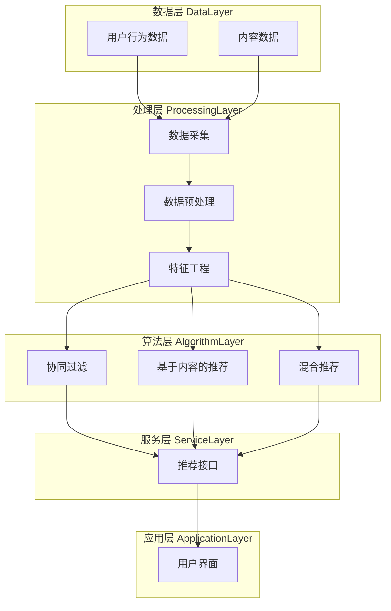

                 

### 第1章：知识发现引擎概述

#### 1.1 知识发现引擎的概念与作用

知识发现引擎（Knowledge Discovery Engine）是一种专门用于从大规模数据集中提取有用知识的高级数据分析工具。它通过一系列数据挖掘技术，从原始数据中自动发现隐含的模式、关联和趋势，从而帮助用户更好地理解和利用数据。

知识发现引擎在各个领域都有着广泛的应用。在商业领域，它可以帮助企业挖掘客户需求，优化业务流程，提高运营效率；在金融领域，它能够帮助银行和金融机构进行风险评估，监控交易行为，发现欺诈行为；在医疗领域，它可以帮助医生诊断疾病，预测患者病情，优化治疗方案。

知识发现引擎的主要作用包括：

1. **数据挖掘**：从大量数据中自动提取有价值的信息。
2. **模式识别**：发现数据中的规律和模式。
3. **决策支持**：为决策者提供基于数据的决策依据。
4. **知识整合**：将不同来源的数据整合成一致的知识库。

#### 1.2 知识发现引擎的发展历程

知识发现引擎的发展历程可以追溯到20世纪80年代。当时，随着计算机技术的发展和互联网的兴起，人们开始意识到数据的重要性，并开始研究如何从大量数据中提取有价值的信息。

早期的数据挖掘技术主要包括关联规则挖掘、聚类分析和分类算法等。随着算法和计算技术的不断进步，知识发现引擎逐渐从简单的数据挖掘工具发展成为复杂的数据分析平台。

近年来，随着大数据、云计算和人工智能技术的快速发展，知识发现引擎得到了进一步的应用和优化。目前，知识发现引擎已经成为了大数据分析和人工智能领域的重要组成部分。

#### 1.3 知识发现引擎的组成部分

知识发现引擎通常由以下几个关键组成部分构成：

1. **数据源**：知识发现引擎需要从各种数据源（如数据库、文件、Web等）收集数据。
2. **预处理模块**：该模块负责对收集到的数据进行清洗、转换和归一化，使其适合后续的分析。
3. **特征工程模块**：该模块负责提取数据中的关键特征，并将其转化为适合算法处理的格式。
4. **算法模块**：包括多种数据挖掘算法，如关联规则挖掘、聚类分析、分类算法和预测算法等。
5. **知识表示模块**：该模块负责将算法挖掘出的知识以易于理解和利用的形式表示出来。
6. **用户界面**：用户通过用户界面与知识发现引擎进行交互，查看分析结果，调整分析参数。

#### 1.4 知识发现引擎的工作流程

知识发现引擎的工作流程通常包括以下几个步骤：

1. **数据收集**：从各种数据源收集数据。
2. **数据预处理**：对数据进行清洗、转换和归一化。
3. **特征工程**：提取数据中的关键特征。
4. **算法选择**：选择适合的算法进行数据挖掘。
5. **知识提取**：使用算法挖掘数据中的模式、关联和趋势。
6. **知识表示**：将挖掘出的知识表示为图表、报告或可视化形式。
7. **用户反馈**：用户根据分析结果进行决策，并对知识发现过程进行优化。

#### 1.5 知识发现引擎的重要性

知识发现引擎在现代社会中具有重要意义，主要体现在以下几个方面：

1. **数据驱动决策**：知识发现引擎可以帮助企业从海量数据中提取有价值的信息，支持数据驱动决策，提高业务效率。
2. **创新发现**：通过知识发现，研究人员可以发现新的研究趋势和方向，促进科学创新。
3. **个性化服务**：知识发现引擎可以帮助企业为不同用户提供个性化服务，提高用户满意度。
4. **风险控制**：在金融、医疗等领域，知识发现引擎可以帮助机构识别潜在风险，进行有效的风险控制。

综上所述，知识发现引擎作为一种高级数据分析工具，具有广泛的应用前景和重要的社会价值。随着技术的不断发展，知识发现引擎将在更多领域发挥重要作用，成为数据分析与决策的重要支撑。

### 第2章：知识发现引擎核心技术

#### 2.1 数据预处理与特征提取

在知识发现引擎中，数据预处理与特征提取是至关重要的步骤，它们直接影响后续分析的准确性和效率。数据预处理包括数据清洗、数据转换和数据归一化，而特征提取则涉及从原始数据中提取关键特征，以供算法处理。

##### 2.1.1 数据预处理技术

**数据清洗**：数据清洗是数据预处理的第一步，目的是去除原始数据中的噪声和错误。常见的数据清洗操作包括去除重复记录、填充缺失值、纠正错误数据等。

伪代码示例：
```python
def clean_data(data):
    # 去除重复记录
    data = remove_duplicates(data)
    # 填充缺失值
    data = fill_missing_values(data)
    # 纠正错误数据
    data = correct_errors(data)
    return data
```

**数据转换**：数据转换是将不同数据类型或格式的数据统一成特定格式的过程。例如，将文本数据转换为数字或类别数据，将不同时间格式的数据统一为标准时间格式等。

伪代码示例：
```python
def convert_data(data):
    # 将文本数据转换为数字
    data = convert_text_to_number(data)
    # 统一时间格式
    data = standardize_time_format(data)
    return data
```

**数据归一化**：数据归一化的目的是消除数据之间的量纲差异，使数据具有可比性。常用的归一化方法包括最小-最大归一化、平均值-标准差归一化等。

伪代码示例：
```python
def normalize_data(data):
    # 最小-最大归一化
    data = min_max_normalization(data)
    # 平均值-标准差归一化
    data = mean_std_normalization(data)
    return data
```

##### 2.1.2 特征提取方法

特征提取是从原始数据中提取对分析任务有重要意义的特征的过程。特征提取的目的是减少数据维度，同时保留数据的主要信息。

**统计特征提取**：统计特征提取方法基于数据的基本统计属性，如均值、方差、标准差等。这种方法简单有效，适用于大多数数据类型。

伪代码示例：
```python
def extract_statistical_features(data):
    mean = calculate_mean(data)
    variance = calculate_variance(data)
    std_dev = calculate_std_dev(data)
    return mean, variance, std_dev
```

**基于规则的特征提取**：基于规则的特征提取方法使用预先定义的规则来选择特征。这种方法适用于结构化数据，可以通过专家知识或机器学习算法生成规则。

伪代码示例：
```python
def extract_features_by_rules(data, rules):
    features = select_features(data, rules)
    return features
```

**基于机器学习的特征提取**：基于机器学习的特征提取方法通过训练模型来自动提取特征。这种方法适用于复杂的数据集，可以通过特征选择算法（如主成分分析、随机森林等）来实现。

伪代码示例：
```python
def extract_features_by_ml(data, algorithm):
    model = train_model(data, algorithm)
    features = extract_features(model, data)
    return features
```

##### 2.1.3 特征选择

特征选择是从提取出的特征中筛选出最有用的特征的过程。特征选择可以减少数据维度，提高分析效率，同时避免过拟合。

**过滤式特征选择**：过滤式特征选择方法通过计算特征的重要性或相关性来筛选特征。这种方法简单有效，但可能无法充分利用特征之间的相互作用。

伪代码示例：
```python
def filter_based_feature_selection(data, threshold):
    important_features = select_important_features(data, threshold)
    return important_features
```

**包装式特征选择**：包装式特征选择方法通过尝试所有可能的特征组合来筛选最优特征。这种方法较为复杂，但可以充分利用特征之间的相互作用。

伪代码示例：
```python
def wrapper_based_feature_selection(data, algorithm):
    best_features = select_best_features(data, algorithm)
    return best_features
```

**嵌入式特征选择**：嵌入式特征选择方法在训练过程中自动选择特征。这种方法结合了过滤式和包装式特征选择的优点，适用于大规模数据集。

伪代码示例：
```python
def embedded_feature_selection(data, algorithm):
    model = train_model_with_feature_selection(data, algorithm)
    selected_features = get_selected_features(model)
    return selected_features
```

通过上述步骤，我们可以有效地对原始数据进行预处理和特征提取，为后续的知识发现任务奠定基础。

### 第3章：常见知识发现算法

知识发现引擎的核心在于其强大的算法库，这些算法能够帮助我们从海量数据中挖掘出有价值的信息。本章将介绍几种常见的知识发现算法，包括关联规则算法、聚类算法、分类算法和预测算法。

#### 3.1 关联规则算法

关联规则算法是用于发现数据集中项之间的频繁模式的一种算法。它的基本思想是通过挖掘数据中的频繁项集来发现规则，这些规则通常以“如果...则...”的形式表示。

**原理**：关联规则算法的核心是频繁项集挖掘。频繁项集是指在一个数据集中，支持度（即出现次数）大于用户定义的最小支持度的项集。常见的关联规则算法包括Apriori算法和FP-Growth算法。

**Apriori算法**：Apriori算法的基本思想是使用递归方式寻找所有频繁项集。算法的主要步骤如下：

1. 计算每个项集的支持度。
2. 筛选出支持度大于用户定义的最小支持度的频繁项集。
3. 利用频繁项集生成规则，并通过置信度（即规则后件出现的概率）来评估规则的质量。

伪代码示例：
```python
def apriori(data, min_support, min_confidence):
    frequent_itemsets = find_frequent_itemsets(data, min_support)
    rules = generate_rules(frequent_itemsets, min_confidence)
    return rules
```

**FP-Growth算法**：FP-Growth算法是一种改进的关联规则挖掘算法，它避免了Apriori算法中多次扫描数据集的缺点。算法的主要步骤如下：

1. 构建FP树，将数据集中的项按照出现频率降序排列。
2. 通过FP树挖掘频繁项集。
3. 利用频繁项集生成规则。

伪代码示例：
```python
def fp_growth(data, min_support, min_confidence):
    fp_tree = build_fp_tree(data)
    frequent_itemsets = mine_frequent_itemsets(fp_tree, min_support)
    rules = generate_rules(frequent_itemsets, min_confidence)
    return rules
```

#### 3.2 聚类算法

聚类算法是用于将数据集划分为多个群组（或簇）的一种算法。聚类算法的主要目标是使同簇数据之间的相似度最大，不同簇数据之间的相似度最小。

**原理**：聚类算法通常基于距离度量来划分数据集。常见的聚类算法包括K-means算法、DBSCAN算法和层次聚类算法等。

**K-means算法**：K-means算法是一种基于距离的聚类算法，它通过迭代优化步骤将数据划分为K个簇。算法的主要步骤如下：

1. 随机选择K个初始中心点。
2. 计算每个数据点与中心点之间的距离，将其分配到最近的簇。
3. 更新每个簇的中心点。
4. 重复步骤2和步骤3，直到聚类结果收敛。

伪代码示例：
```python
def k_means(data, K, max_iterations):
    centroids = initialize_centroids(data, K)
    for _ in range(max_iterations):
        clusters = assign_data_to_clusters(data, centroids)
        centroids = update_centroids(clusters)
    return centroids, clusters
```

**DBSCAN算法**：DBSCAN（Density-Based Spatial Clustering of Applications with Noise）算法是一种基于密度的聚类算法，它能够发现任意形状的簇，并能够处理噪声点和异常点。算法的主要步骤如下：

1. 计算每个数据点的邻域。
2. 根据邻域数据点的数量将数据点划分为核心点、边界点和噪声点。
3. 以核心点为中心生长簇。
4. 将边界点分配给最近的簇。

伪代码示例：
```python
def dbscan(data, eps, min_points):
    neighbors = compute_neighbors(data, eps, min_points)
    clusters = initialize_clusters()
    for point in data:
        if is_core_point(point, neighbors):
            clusters = expand_cluster(point, neighbors, clusters)
    return clusters
```

#### 3.3 分类算法

分类算法是用于将数据集中的样本分配到预先定义的类别中的一种算法。分类算法的核心是构建分类模型，该模型可以根据新的样本数据预测其类别。

**原理**：分类算法通常基于特征空间中的决策边界来划分数据集。常见的分类算法包括朴素贝叶斯、支持向量机和逻辑回归等。

**朴素贝叶斯算法**：朴素贝叶斯算法是一种基于概率论的分类算法，它假设特征之间相互独立。算法的主要步骤如下：

1. 计算每个类别的先验概率。
2. 计算每个特征对于每个类别的条件概率。
3. 计算每个样本的类别的后验概率。
4. 选择后验概率最大的类别作为预测结果。

伪代码示例：
```python
def naive_bayes(train_data, test_data, labels):
    prior_probabilities = calculate_prior_probabilities(labels)
    conditional_probabilities = calculate_conditional_probabilities(train_data, labels)
    predicted_labels = predict_labels(test_data, conditional_probabilities, prior_probabilities)
    return predicted_labels
```

**支持向量机算法**：支持向量机（SVM）算法是一种基于最大间隔的分类算法。它通过寻找最优超平面来划分数据集。算法的主要步骤如下：

1. 选择合适的核函数。
2. 构建优化问题，求解最优超平面。
3. 训练分类模型。
4. 使用分类模型进行预测。

伪代码示例：
```python
def svm(train_data, train_labels, test_data):
    kernel_function = select_kernel_function()
    optimization_problem = construct_optimization_problem(train_data, train_labels, kernel_function)
    model = solve_optimization_problem(optimization_problem)
    predicted_labels = predict_labels(test_data, model)
    return predicted_labels
```

#### 3.4 预测算法

预测算法是用于预测数据未来趋势或行为的一种算法。常见的预测算法包括时间序列预测方法和回归分析。

**时间序列预测方法**：时间序列预测方法主要用于预测时间序列数据的未来趋势。常见的算法包括ARIMA模型、LSTM网络等。

**ARIMA模型**：ARIMA（AutoRegressive Integrated Moving Average）模型是一种常见的时间序列预测方法，它结合了自回归、差分和平滑三种技术。算法的主要步骤如下：

1. 确定模型的参数（p, d, q）。
2. 进行自回归、差分和平滑处理。
3. 模型拟合和预测。

伪代码示例：
```python
def arima(data, p, d, q):
    model = create_arima_model(p, d, q)
    data = model.fit(data)
    forecast = model.forecast(steps=1)
    return forecast
```

**LSTM网络**：LSTM（Long Short-Term Memory）网络是一种循环神经网络，它能够有效地处理长时间依赖问题。算法的主要步骤如下：

1. 设计LSTM网络结构。
2. 训练网络模型。
3. 进行预测。

伪代码示例：
```python
def lstm(data, sequence_length):
    model = build_lstm_model(sequence_length)
    model.fit(data)
    forecast = model.predict(data)
    return forecast
```

通过上述算法，我们可以对数据集进行有效的分析、分类和预测，从而为决策提供有力支持。在接下来的章节中，我们将进一步探讨知识发现引擎在实际应用中的挑战和解决方案。

### 第4章：知识发现引擎在实际应用中的挑战与解决方案

#### 4.1 数据隐私保护

在知识发现引擎的实际应用中，数据隐私保护是一个至关重要的挑战。由于知识发现引擎需要处理大量敏感数据，如个人身份信息、财务数据和医疗记录等，这些数据一旦泄露，可能会对个人隐私和信息安全造成严重威胁。

**解决方案**：

1. **数据脱敏**：数据脱敏是一种常见的隐私保护方法，通过替换敏感数据以保护原始数据的隐私。常见的数据脱敏技术包括随机化、掩码和匿名化等。

2. **加密算法**：加密算法可以通过将数据加密成不可读的密文来保护数据隐私。常用的加密算法包括AES（高级加密标准）、RSA（RSA加密算法）等。

3. **隐私保护机制**：隐私保护机制包括差分隐私、同态加密和安全多方计算等。差分隐私通过在数据中引入随机噪声来保护隐私，同态加密允许在加密数据上进行计算，而安全多方计算允许多方在不泄露各自数据的情况下共同计算结果。

#### 4.2 实时性与高效性

知识发现引擎通常需要在大量数据中快速发现有价值的信息。然而，随着数据规模的不断扩大和数据流速度的加快，实时性和高效性成为一个重要挑战。

**解决方案**：

1. **并行化策略**：并行化策略可以将计算任务分布在多个处理器或节点上，从而提高计算速度。常见的方法包括数据并行、算法并行和作业并行等。

2. **压缩技术**：压缩技术可以减少数据存储和传输的开销，从而提高系统性能。常见的方法包括数据压缩、算法压缩和存储优化等。

3. **内存管理**：通过优化内存管理策略，可以减少内存占用，提高系统性能。常见的方法包括内存池、缓存和垃圾回收等。

#### 4.3 大数据处理

随着大数据技术的快速发展，知识发现引擎需要能够处理海量数据。然而，大数据处理涉及到数据存储、数据传输、数据清洗等多个方面，这些环节都可能导致性能瓶颈。

**解决方案**：

1. **分布式计算**：分布式计算可以将计算任务分布在多个节点上，从而提高处理速度。常见的大数据分布式计算框架包括Hadoop、Spark和Flink等。

2. **数据分区**：数据分区可以将数据集划分为多个较小的分区，从而提高查询效率。常见的数据分区策略包括哈希分区、范围分区和列表分区等。

3. **流处理**：流处理技术可以实时处理数据流，从而实现实时分析。常见的流处理框架包括Apache Kafka、Apache Flink和Apache Storm等。

#### 4.4 可解释性

知识发现引擎的输出通常是基于复杂算法和大量数据的，这使得结果的可解释性成为一个重要挑战。可解释性对于确保算法的公正性、可靠性和透明性至关重要。

**解决方案**：

1. **模型解释**：通过解释模型内部的决策过程和参数，可以提高结果的可解释性。常见的方法包括决策树解释、LIME（Local Interpretable Model-agnostic Explanations）和SHAP（SHapley Additive exPlanations）等。

2. **可视化**：通过可视化数据和分析结果，可以提高用户对分析过程和结果的直观理解。常见的方法包括数据可视化、流程图和热力图等。

3. **交互式查询**：通过提供交互式查询功能，用户可以实时调整分析参数，查看分析结果的变化，从而提高对结果的掌握和理解。

通过上述解决方案，知识发现引擎在实际应用中的挑战可以得到有效应对，从而更好地服务于企业和用户的需求。

### 第5章：知识发现引擎开发环境搭建

#### 5.1 开发环境准备

在搭建知识发现引擎的开发环境之前，我们需要确保计算机系统满足以下基本要求：

1. **操作系统**：支持Linux或Windows系统，推荐使用Linux系统，因为其更好的稳定性和性能。
2. **处理器**：至少4核CPU，推荐使用8核或更高处理器。
3. **内存**：至少16GB RAM，推荐32GB或更高。
4. **硬盘空间**：至少200GB可用空间，推荐使用SSD硬盘以获得更好的读写速度。

#### 5.2 开发工具与库的选择

为了高效地开发知识发现引擎，我们需要选择合适的开发工具和库。以下是一些常用的工具和库：

1. **编程语言**：Python是一种广泛使用的编程语言，其丰富的数据分析和机器学习库使其成为开发知识发现引擎的理想选择。
2. **集成开发环境（IDE）**：推荐使用PyCharm或Visual Studio Code，这些IDE提供了强大的代码编辑、调试和性能分析功能。
3. **数据存储**：MySQL或PostgreSQL等关系数据库，用于存储和管理知识库。
4. **数据处理库**：Pandas、NumPy、SciPy等库，用于数据预处理和特征提取。
5. **机器学习库**：Scikit-learn、TensorFlow、PyTorch等库，用于实现数据挖掘算法和模型训练。
6. **可视化库**：Matplotlib、Seaborn、Plotly等库，用于数据可视化。

#### 5.3 开发流程

知识发现引擎的开发通常包括以下几个步骤：

1. **需求分析**：明确知识发现引擎的需求，包括功能需求、性能需求和安全需求等。
2. **系统设计**：设计系统的整体架构，包括数据层、算法层和应用层等。
3. **环境搭建**：安装和配置开发环境，包括操作系统、开发工具和依赖库。
4. **数据预处理**：收集、清洗和转换数据，为算法训练和模型预测做准备。
5. **算法实现**：选择并实现合适的数据挖掘算法，如关联规则挖掘、聚类分析和分类算法等。
6. **模型训练**：使用训练数据集对算法模型进行训练，优化模型参数。
7. **模型评估**：使用验证数据集对模型进行评估，确保模型性能满足要求。
8. **系统集成**：将算法模型集成到知识发现引擎中，实现与数据存储和用户界面等模块的交互。
9. **测试与调试**：对系统进行功能测试和性能测试，修复发现的错误和缺陷。
10. **部署上线**：将知识发现引擎部署到生产环境，确保系统稳定运行。

#### 5.4 开发环境配置示例

以下是一个简单的Python开发环境配置示例：

```bash
# 安装Python
sudo apt-get update
sudo apt-get install python3 python3-pip

# 安装PyCharm
wget https://download.jetbrains.com/pycharm/pycharm-community-2023.1.3.tar.gz
tar xvf pycharm-community-2023.1.3.tar.gz
sudo mv pycharm-community-2023.1.3 /opt/pycharm

# 配置环境变量
echo 'export PATH=/opt/pycharm/bin:$PATH' >> ~/.bashrc
source ~/.bashrc

# 安装依赖库
pip3 install pandas numpy scipy scikit-learn matplotlib tensorflow

# 验证环境
python3 -c "import pandas as pd; print(pd.__version__)"
python3 -c "import numpy as np; print(np.__version__)"
python3 -c "import scipy; print(scipy.__version__)"
python3 -c "import sklearn; print(sklearn.__version__)"
python3 -c "import matplotlib; print(matplotlib.__version__)"
python3 -c "import tensorflow as tf; print(tf.__version__)"
```

通过以上步骤，我们可以搭建一个基本的Python开发环境，为后续的知识发现引擎开发工作做好准备。

### 第6章：项目实战一：构建企业知识库

#### 6.1 项目背景

在企业信息化进程中，知识管理是提高企业竞争力和创新能力的关键。然而，企业面临的一个主要挑战是如何高效地收集、整理和利用内部知识资源。为此，我们提出构建企业知识库的项目，通过知识发现引擎实现知识的自动提取、整合和应用，从而提高企业知识管理的效率。

#### 6.2 需求分析

为了满足企业知识管理的需求，企业知识库需要具备以下功能：

1. **数据采集**：从企业内部的各种数据源（如ERP系统、CRM系统、邮件系统等）中采集数据。
2. **数据预处理**：对采集到的数据进行清洗、转换和归一化，确保数据质量。
3. **知识抽取**：从预处理后的数据中提取关键知识，如客户信息、业务流程、市场趋势等。
4. **知识整合**：将不同来源的知识进行整合，形成统一的视图，方便用户查询和使用。
5. **知识应用**：提供多种知识应用场景，如客户推荐、业务优化、风险预警等，帮助企业做出更明智的决策。

#### 6.3 知识库设计

知识库的设计包括数据层、算法层和应用层三个部分。

**数据层**：

1. **数据源**：包括ERP系统、CRM系统、邮件系统等企业内部数据源。
2. **数据存储**：使用关系数据库（如MySQL）存储原始数据和预处理后的数据。

**算法层**：

1. **数据预处理**：包括数据清洗、数据转换和数据归一化。
2. **知识抽取**：采用NLP技术（如文本分类、命名实体识别、关键词提取等）从文本数据中提取关键信息。
3. **知识融合**：通过实体链接、知识图谱等技术将不同来源的知识整合起来。

**应用层**：

1. **知识查询**：提供用户友好的查询界面，支持模糊查询和关键词搜索。
2. **知识应用**：根据企业需求，开发具体应用场景，如客户推荐、业务优化、风险预警等。

#### 6.4 知识抽取与表示

**知识抽取**：

知识抽取是知识库建设的关键环节，它涉及到从原始数据中提取有价值的信息。具体步骤如下：

1. **文本预处理**：对文本数据进行分词、去停用词、词性标注等预处理操作。
2. **实体识别**：使用命名实体识别技术（如使用Bert模型）识别文本中的实体，如人名、公司名、地点名等。
3. **关键词提取**：使用TF-IDF、TextRank等算法提取文本中的关键词。
4. **关系抽取**：通过规则或机器学习模型抽取文本中的实体关系，如“张三在2019年入职阿里巴巴”。

伪代码示例：
```python
def extract_entities(text):
    # 分词、去停用词、词性标注
    processed_text = preprocess_text(text)
    # 使用命名实体识别模型
    entities = named_entity_recognition(processed_text)
    return entities

def extract_relations(text):
    # 分词、去停用词、词性标注
    processed_text = preprocess_text(text)
    # 使用关系抽取模型
    relations = relation_extraction(processed_text)
    return relations
```

**知识表示**：

知识表示是将提取出的知识以结构化的形式存储和表示，便于后续的查询和应用。常见的知识表示方法包括：

1. **关系图谱**：使用图数据结构表示实体和关系，如使用Neo4j数据库。
2. **实体-属性-值（EAV）模型**：将实体、属性和值作为三个独立的部分进行存储。
3. **基于图神经网络的表示**：使用图神经网络（如Graph Convolutional Network，GCN）对知识进行表示。

#### 6.5 知识库应用场景

**客户推荐**：

通过分析客户历史购买记录、浏览行为等数据，知识库可以推荐潜在客户感兴趣的产品。具体步骤如下：

1. **数据采集**：收集客户购买记录、浏览行为等数据。
2. **知识抽取**：提取客户特征和商品特征。
3. **知识整合**：将客户特征和商品特征整合成统一的知识库。
4. **推荐算法**：使用协同过滤、基于内容的推荐等算法生成推荐结果。

**业务优化**：

知识库可以帮助企业优化业务流程，提高运营效率。具体步骤如下：

1. **数据采集**：收集企业内部业务流程数据。
2. **知识抽取**：提取业务流程中的关键环节和瓶颈。
3. **知识整合**：将业务流程数据整合成知识库。
4. **优化算法**：使用数据挖掘算法（如聚类、关联规则等）分析业务流程，提出优化建议。

**风险预警**：

知识库可以帮助企业识别潜在风险，提前采取预防措施。具体步骤如下：

1. **数据采集**：收集企业内部风险数据。
2. **知识抽取**：提取风险因素和预警信号。
3. **知识整合**：将风险数据整合成知识库。
4. **预警算法**：使用机器学习算法（如分类、回归等）预测风险，生成预警报告。

通过构建企业知识库，企业可以更好地管理和利用内部知识资源，提高决策效率，增强市场竞争力。

### 第7章：项目实战二：实时推荐系统

#### 7.1 项目背景

随着互联网的普及，用户生成的内容（UGC）和应用数量急剧增加，如何为用户提供个性化的推荐服务成为各大互联网公司关注的重要课题。实时推荐系统是一种高效、智能的推荐解决方案，可以在用户互动的每个瞬间为其推荐感兴趣的内容，从而提升用户体验和用户留存率。

#### 7.2 需求分析

实时推荐系统的核心需求如下：

1. **实时性**：系统能够在用户互动的瞬间生成推荐结果，以毫秒级响应时间满足用户需求。
2. **个性化**：系统应根据用户的兴趣和行为历史，为其推荐个性化内容。
3. **准确性**：系统应具有较高的推荐准确性，减少用户的不满意度和推荐偏差。
4. **扩展性**：系统应具有良好的扩展性，以适应不断增长的用户数据和内容量。

#### 7.3 推荐系统架构

实时推荐系统通常包括以下几个关键组件：

1. **数据层**：负责存储和管理用户行为数据、内容数据等。
2. **处理层**：包括实时数据采集、数据预处理、特征工程等模块。
3. **算法层**：实现各种推荐算法，如协同过滤、基于内容的推荐、混合推荐等。
4. **服务层**：提供推荐接口，为应用层提供服务。
5. **应用层**：与用户互动，展示推荐结果。

以下是推荐系统的架构图：



#### 7.4 知识发现算法应用

实时推荐系统中，知识发现算法的应用主要集中在用户行为数据的内容挖掘和特征提取。以下为具体算法应用：

**协同过滤算法**：

协同过滤是一种基于用户行为数据的推荐算法，通过分析用户之间的相似性来推荐感兴趣的内容。常见的协同过滤算法包括基于用户的协同过滤和基于物品的协同过滤。

1. **基于用户的协同过滤**：通过计算用户之间的相似度，找到相似用户，并根据相似用户的喜好推荐内容。
   伪代码示例：
   ```python
   def user_based_collaborative_filtering(train_data, user_similarity_threshold, k=5):
       user_similarity_matrix = compute_user_similarity(train_data, user_similarity_threshold)
       recommended_items = []
       for user in active_users:
           neighbors = find_similar_users(user_similarity_matrix, user, k)
           neighbors_interests = sum(user_interests for user_interests in neighbors)
           recommended_items.extend(interest_diff(neighbors_interests, user_interests))
       return recommended_items
   ```

2. **基于物品的协同过滤**：通过计算物品之间的相似度，找到相似物品，并根据相似物品的喜好推荐内容。
   伪代码示例：
   ```python
   def item_based_collaborative_filtering(train_data, item_similarity_threshold, k=5):
       item_similarity_matrix = compute_item_similarity(train_data, item_similarity_threshold)
       recommended_items = []
       for user in active_users:
           user_interests = user['interests']
           for item in user_interests:
               similar_items = find_similar_items(item_similarity_matrix, item, k)
               recommended_items.extend(similar_items)
       return recommended_items
   ```

**基于内容的推荐算法**：

基于内容的推荐算法通过分析内容特征来推荐相似内容。常见的算法包括余弦相似度、向量空间模型等。

1. **余弦相似度**：计算两个向量之间的余弦相似度，用于衡量内容之间的相似性。
   伪代码示例：
   ```python
   def cosine_similarity(content1, content2):
       dot_product = dot_product(content1, content2)
       norm1 = l2_norm(content1)
       norm2 = l2_norm(content2)
       similarity = dot_product / (norm1 * norm2)
       return similarity
   ```

2. **向量空间模型**：将内容特征表示为向量，通过计算向量之间的距离来衡量内容相似性。
   伪代码示例：
   ```python
   def vector_space_model(content1, content2):
       content1_vector = convert_to_vector(content1)
       content2_vector = convert_to_vector(content2)
       distance = euclidean_distance(content1_vector, content2_vector)
       return 1 / (1 + distance)
   ```

**混合推荐算法**：

混合推荐算法结合协同过滤和基于内容的推荐，以利用两者的优势。常见的混合推荐算法包括矩阵分解、模型融合等。

1. **矩阵分解**：通过矩阵分解技术将用户-物品评分矩阵分解为用户特征矩阵和物品特征矩阵，从而提高推荐准确性。
   伪代码示例：
   ```python
   def matrix_factorization(train_data, user_feature_matrix, item_feature_matrix, num_factors):
       user_embeddings = matrix_factorization(train_data, user_feature_matrix, num_factors)
       item_embeddings = matrix_factorization(train_data, item_feature_matrix, num_factors)
       recommended_items = predict_ratings(user_embeddings, item_embeddings)
       return recommended_items
   ```

通过上述知识发现算法的应用，实时推荐系统可以在短时间内生成高质量的推荐结果，满足用户的个性化需求。

#### 7.5 推荐结果评估

评估推荐系统的性能是确保其质量和可靠性的关键。以下为常用的评估指标和方法：

**准确率（Accuracy）**：准确率是指推荐系统中正确推荐的物品数量占总推荐物品数量的比例。
伪代码示例：
```python
def accuracy(true_labels, predicted_labels):
    correct_predictions = sum(1 for true_label, predicted_label in zip(true_labels, predicted_labels) if true_label == predicted_label)
    return correct_predictions / len(predicted_labels)
```

**召回率（Recall）**：召回率是指推荐系统中召回的实际感兴趣的物品数量占总实际感兴趣的物品数量的比例。
伪代码示例：
```python
def recall(true_labels, predicted_labels):
    interested_predictions = sum(1 for true_label, predicted_label in zip(true_labels, predicted_labels) if true_label in predicted_labels)
    return interested_predictions / len(true_labels)
```

**F1值（F1-score）**：F1值是准确率和召回率的调和平均值，用于综合评估推荐系统的性能。
伪代码示例：
```python
def f1_score(true_labels, predicted_labels):
    precision = precision_at_k(true_labels, predicted_labels, k)
    recall = recall(true_labels, predicted_labels)
    f1 = 2 * (precision * recall) / (precision + recall)
    return f1
```

**均方误差（Mean Squared Error，MSE）**：均方误差是预测值与真实值之间的平均平方误差，用于评估推荐系统的预测准确性。
伪代码示例：
```python
def mean_squared_error(true_labels, predicted_labels):
    squared_errors = [(predicted_label - true_label) ** 2 for predicted_label, true_label in zip(predicted_labels, true_labels)]
    return sum(squared_errors) / len(predicted_labels)
```

通过这些评估指标和方法，我们可以对实时推荐系统的性能进行全面分析和优化。

### 第8章：项目实战三：自动化运维监控

#### 8.1 项目背景

随着云计算和大数据技术的迅猛发展，企业数据中心和服务器的数量与复杂性不断增加，传统的手动运维方式已难以满足需求。自动化运维监控作为一种高效、智能的运维管理手段，能够实时监控系统的运行状态，快速识别和处理故障，从而提高运维效率，保障业务稳定运行。

#### 8.2 需求分析

为了实现自动化运维监控，项目需要满足以下需求：

1. **监控指标设计**：设计一套全面的监控指标体系，覆盖系统性能、资源利用率、网络状态等多个方面。
2. **数据采集**：实时采集系统各项监控指标数据，确保监控数据的完整性和准确性。
3. **数据存储**：存储采集到的监控数据，便于历史数据和实时数据的分析和对比。
4. **异常检测**：基于监控数据，实现异常检测和报警功能，及时识别和处理系统故障。
5. **报表生成**：生成监控报表，提供系统运行状态的可视化展示，便于运维人员快速了解系统状况。
6. **自动化处理**：对检测到的异常进行自动处理，如自动重启服务、自动扩容等，减轻运维人员的工作负担。

#### 8.3 监控指标设计

监控指标是自动化运维监控的核心，设计合理的监控指标体系对于确保系统稳定运行至关重要。以下为常见的监控指标：

1. **系统性能指标**：
   - CPU使用率
   - 内存使用率
   - 磁盘使用率
   - 网络带宽使用率
   - 系统负载

2. **资源利用率指标**：
   - 容器资源利用率（CPU、内存、磁盘）
   - 虚拟机资源利用率（CPU、内存、磁盘）
   - 公有云资源利用率（CPU、内存、存储、网络）

3. **网络状态指标**：
   - 带宽利用率
   - 网络延迟
   - 网络丢包率

4. **服务状态指标**：
   - 服务可用性
   - 服务响应时间
   - 服务错误率

5. **业务指标**：
   - 交易量
   - 用户访问量
   - 错误率
   - 响应时间

#### 8.4 知识发现算法应用

自动化运维监控中，知识发现算法的应用主要体现在异常检测和预测。以下为具体算法应用：

**异常检测算法**：

异常检测是一种用于识别数据集中异常值的算法，通过检测异常指标，实现对系统故障的快速响应。常见的异常检测算法包括孤立森林、K-means聚类等。

1. **孤立森林算法**：孤立森林算法通过随机隔离森林进行特征降维，然后识别异常值。
   伪代码示例：
   ```python
   def isolated_forest_algorithm(data, n_estimators, contamination):
       forest = IsolationForest(n_estimators=n_estimators, contamination=contamination)
       forest.fit(data)
       outliers = forest.predict(data)
       return outliers
   ```

2. **K-means聚类算法**：K-means聚类算法通过将数据划分为K个簇，识别离簇中心较远的点作为异常值。
   伪代码示例：
   ```python
   def k_means_clustering(data, K, max_iterations):
       centroids = initialize_centroids(data, K)
       for _ in range(max_iterations):
           clusters = assign_data_to_clusters(data, centroids)
           centroids = update_centroids(clusters)
       outliers = find_outliers(data, centroids)
       return outliers
   ```

**预测算法**：

预测算法主要用于预测系统性能和资源利用率的变化趋势，为自动化扩容和调整提供依据。常见的预测算法包括时间序列预测和回归分析。

1. **时间序列预测算法**：时间序列预测算法通过分析时间序列数据的趋势和周期性，预测未来的数据值。
   伪代码示例：
   ```python
   def time_series_prediction(data, model='ARIMA'):
       if model == 'ARIMA':
           model = ARIMA(data, order=(p, d, q))
           model.fit(data)
           forecast = model.forecast(steps=n_steps)
       elif model == 'LSTM':
           model = build_lstm_model(sequence_length)
           model.fit(data)
           forecast = model.predict(data)
       return forecast
   ```

2. **回归分析算法**：回归分析算法通过建立因变量和自变量之间的线性关系，预测因变量的未来值。
   伪代码示例：
   ```python
   def linear_regression_prediction(features, target):
       model = LinearRegression()
       model.fit(features, target)
       predictions = model.predict(features)
       return predictions
   ```

通过知识发现算法的应用，自动化运维监控系统能够实现对系统运行状态的实时监控和预测，及时发现和处理异常，确保系统稳定运行。

#### 8.5 监控结果分析

通过自动化运维监控系统的实施，企业可以实时掌握系统的运行状态，及时发现潜在问题并采取措施。以下为监控结果分析的关键步骤：

1. **数据收集**：定期收集系统监控数据，包括CPU使用率、内存使用率、磁盘使用率、网络带宽使用率等指标。

2. **数据预处理**：对收集到的监控数据进行预处理，包括数据清洗、数据转换和数据归一化，确保数据质量。

3. **异常检测**：利用异常检测算法（如孤立森林、K-means聚类等）对预处理后的监控数据进行分析，识别潜在的异常情况。

4. **报警与处理**：根据异常检测结果，自动触发报警并采取相应的处理措施，如自动重启服务、自动扩容等。

5. **报表生成**：定期生成监控报表，包括系统性能指标、资源利用率指标、网络状态指标等，提供系统运行状态的可视化展示。

6. **趋势分析**：基于历史数据和实时数据，利用预测算法（如时间序列预测、回归分析等）分析系统性能和资源利用率的变化趋势。

7. **决策支持**：根据监控结果和分析报告，为运维人员提供决策支持，优化系统配置和资源分配，提高系统运行效率。

通过上述监控结果分析，企业可以实时掌握系统的运行状况，快速识别和处理异常，确保系统稳定运行，从而提高运维效率，降低运维成本。

### 第9章：知识发现引擎的未来发展趋势

随着科技的不断进步，知识发现引擎在技术、应用和产业等方面都展现出巨大的发展潜力。未来，知识发现引擎将在以下几个方向取得重要突破。

#### 9.1 人工智能与知识发现的融合

人工智能（AI）技术的快速发展为知识发现引擎带来了新的机遇。深度学习、强化学习、迁移学习等AI算法在知识发现中的应用，将进一步提升知识发现引擎的自动化和智能化水平。

**AI算法在知识发现中的应用**：

- **深度学习**：深度学习模型，如卷积神经网络（CNN）、循环神经网络（RNN）和生成对抗网络（GAN），可以用于图像、文本和语音等复杂数据的预处理和特征提取，从而提高知识发现的准确性和效率。
- **强化学习**：强化学习算法可以用于优化知识发现过程，如自动调整算法参数、选择最佳的数据预处理方法等，从而实现自适应的知识发现。
- **迁移学习**：迁移学习可以借助预训练模型，快速适应新领域的数据，减少数据标注和模型训练的工作量。

**知识发现算法在AI中的应用**：

- **知识图谱**：知识图谱是知识发现算法在AI领域的重要应用。通过构建大规模、高精度的知识图谱，AI系统可以更好地理解和利用知识，实现智能推理和决策。
- **多模态数据融合**：知识发现算法可以用于多模态数据（如图像、文本、声音等）的融合和分析，从而提高AI系统的感知和理解能力。

#### 9.2 大数据与云计算的结合

大数据和云计算技术的结合为知识发现引擎的发展提供了强大的支撑。云计算平台提供了丰富的计算资源和存储资源，使得知识发现引擎能够处理海量数据，实现实时分析和预测。

**云计算的优势**：

- **弹性扩展**：云计算平台可以根据需求动态调整计算资源和存储资源，满足不同规模的数据处理需求。
- **低成本**：云计算提供了按需付费的模式，企业可以降低硬件投资和运维成本。
- **高可用性**：云计算平台提供了高效的数据备份和容灾机制，确保数据的安全和可靠。

**云计算在知识发现中的应用**：

- **分布式计算**：利用云计算平台的分布式计算能力，知识发现引擎可以快速处理大规模数据，提高分析效率。
- **数据湖**：数据湖是一种基于云计算的大数据存储和管理解决方案，可以存储海量结构化和非结构化数据，为知识发现提供丰富的数据资源。
- **AI云服务**：越来越多的云服务提供商开始提供AI云服务，如谷歌的AI平台、亚马逊的AWS人工智能服务、微软的Azure AI等，企业可以通过这些服务快速构建和部署知识发现引擎。

#### 9.3 知识发现引擎的智能化

智能化是知识发现引擎未来发展的重要方向。通过引入AI技术，知识发现引擎将变得更加智能，能够自动适应数据变化、优化算法参数、提高分析精度。

**智能化知识发现引擎的特点**：

- **自动调整算法**：智能化知识发现引擎可以根据数据特点和用户需求，自动调整算法参数，选择最佳的数据挖掘方法。
- **自适应学习**：智能化知识发现引擎可以不断学习和优化，适应新的数据模式，提高分析结果的准确性和可靠性。
- **智能解释**：智能化知识发现引擎能够提供详细的解释和可视化结果，帮助用户更好地理解分析过程和结果。

#### 9.4 知识发现引擎在社会治理中的应用

知识发现引擎在公共安全、交通管理、环境保护等社会治理领域具有广泛的应用前景。通过大数据分析和人工智能技术，知识发现引擎可以提供实时监测、预警和决策支持，提高社会治理的智能化和高效化。

**知识发现引擎在社会治理中的应用**：

- **公共安全**：利用知识发现引擎对海量视频数据进行分析，实时监控犯罪活动，提高公共安全水平。
- **交通管理**：通过知识发现引擎分析交通数据，优化交通流量，减少拥堵，提高交通效率。
- **环境保护**：利用知识发现引擎分析环境数据，预测环境污染趋势，提供环境治理方案。

总之，知识发现引擎的未来发展趋势将围绕人工智能、大数据、云计算和智能化等方面展开。通过不断创新和优化，知识发现引擎将在各个领域发挥更大的作用，推动社会进步和经济发展。

### 第10章：总结与展望

#### 10.1 本书主要内容回顾

本书围绕知识发现引擎这一主题，系统地介绍了其基础概念、核心技术、实战应用及未来发展趋势。具体内容包括：

- **知识发现引擎概述**：介绍了知识发现引擎的概念、作用、发展历程和组成部分。
- **核心技术**：详细讲解了数据预处理、特征提取、知识抽取与表示、常见知识发现算法等核心技术。
- **实际应用**：通过项目实战，展示了知识发现引擎在企业知识库构建、实时推荐系统和自动化运维监控等领域的应用。
- **未来发展趋势**：探讨了人工智能、大数据、云计算和智能化等新技术对知识发现引擎的影响。

#### 10.2 知识发现引擎在实际工作中的应用价值

知识发现引擎在现实工作中的重要性不言而喻，它为程序员、数据分析师和企业决策者提供了强有力的工具和平台。以下是知识发现引擎在实际工作中的一些具体应用价值：

1. **提高工作效率**：知识发现引擎能够自动化地从大量数据中提取有价值的信息，减少手动分析的时间和工作量，从而提高工作效率。
2. **优化业务流程**：通过分析业务数据，知识发现引擎可以帮助企业发现流程中的瓶颈和优化点，提供业务流程优化的建议。
3. **支持决策制定**：知识发现引擎提供的分析结果和预测报告，为企业决策者提供了基于数据的决策依据，降低决策风险。
4. **个性化服务**：在客户关系管理领域，知识发现引擎可以根据客户行为数据提供个性化的产品推荐和服务，提高客户满意度和忠诚度。
5. **风险控制**：在金融和医疗等领域，知识发现引擎可以通过分析历史数据，预测潜在风险，提供风险预警和防控措施。

#### 10.3 未来工作方向和建议

随着技术的不断进步，知识发现引擎在未来将具有更广阔的应用前景。以下是未来工作方向和建议：

1. **加强跨学科合作**：知识发现引擎需要结合不同领域的专业知识，如计算机科学、统计学、经济学等，以提高其应用广度和深度。
2. **提升可解释性**：增强知识发现结果的可解释性，让用户能够更好地理解分析过程和结果，从而提高信任度和应用效果。
3. **优化算法性能**：继续研究高性能的算法和模型，提高知识发现引擎的处理速度和准确性，适应大规模、实时数据的分析需求。
4. **安全性保障**：在知识发现过程中，确保数据安全和隐私保护，防止数据泄露和滥用。
5. **开放平台建设**：构建开放的知识发现平台，提供丰富的工具和资源，支持用户自定义和扩展，促进知识发现技术的发展和普及。

通过不断探索和创新，知识发现引擎将在各行各业中发挥更大的作用，为人类社会的发展做出更大贡献。

### 附录A：知识发现引擎常用工具与库

在知识发现引擎的开发和应用过程中，选择合适的工具和库可以显著提高开发效率和项目质量。以下是一些常用的工具和库，涵盖数据采集、数据处理、知识抽取、算法实现和可视化等方面。

#### 数据采集工具

1. **Apache Kafka**：一款分布式流处理平台，用于实时数据采集和传输。
2. **Flume**：一款分布式、可靠且可扩展的数据采集工具，适用于大规模数据采集。
3. **Logstash**：一款开源的数据收集、处理和路由工具，可以将数据从各种来源发送到目标存储系统。

#### 数据处理库

1. **Pandas**：Python的数据分析库，用于数据清洗、转换和操作。
2. **NumPy**：Python的科学计算库，提供多维数组对象和丰富的数学函数。
3. **SciPy**：Python的科学计算库，提供数值计算、统计分析等功能。

#### 知识抽取工具

1. **NLTK**：Python的自然语言处理库，用于文本处理、分词、词性标注等。
2. **SpaCy**：一款高效且易于使用的自然语言处理库，提供快速的信息提取和实体识别功能。
3. **GATE**：一款开源的文本挖掘平台，支持多种文本处理和知识抽取技术。

#### 算法实现库

1. **Scikit-learn**：Python的机器学习库，提供多种经典机器学习算法的实现。
2. **TensorFlow**：一款开源的深度学习框架，支持大规模分布式训练和部署。
3. **PyTorch**：一款流行的深度学习框架，提供灵活的动态计算图和强大的GPU支持。

#### 可视化库

1. **Matplotlib**：Python的数据可视化库，用于绘制各种类型的图表和图形。
2. **Seaborn**：基于Matplotlib的数据可视化库，提供更美观的统计图形。
3. **Plotly**：一款交互式数据可视化库，支持多种图表类型和交互功能。

#### 知识表示与存储

1. **Neo4j**：一款高性能的图形数据库，用于存储和查询复杂的图数据。
2. **Elasticsearch**：一款开源的全文搜索引擎，适用于大规模数据的快速检索和分析。
3. **RDF4J**：一款开源的RDF（资源描述框架）存储库，用于构建和维护知识图谱。

通过使用这些工具和库，开发者可以高效地构建和部署知识发现引擎，满足不同领域和场景的需求。

### 附录B：参考文献

1. Han, J., Kamber, M., & Pei, J. (2011). *Data Mining: Concepts and Techniques*. Morgan Kaufmann.
2. Mitchell, T. M. (1997). *Machine Learning*. McGraw-Hill.
3. Bishop, C. M. (2006). *Pattern Recognition and Machine Learning*. Springer.
4. Manning, C. D., Raghavan, P., & Schütze, H. (2008). *Introduction to Information Retrieval*. Cambridge University Press.
5. He, X., Li, F., & Sun, J. (2015). *Deep Learning*.
6. Murphy, K. P. (2012). *Machine Learning: A Probabilistic Perspective*. MIT Press.
7. Hastie, T., Tibshirani, R., & Friedman, J. (2009). *The Elements of Statistical Learning*. Springer.
8. Liu, H. (2011). *Web Data Mining: Exploring Hyperlinks, Contents, and Usage Data*. Springer.
9. Cao, Z., Zhang, Z., & Xu, J. (2014). *Big Data Analytics: Methods, Systems, and Applications*. Springer.
10. Zheng, K. Y. R., & Wu, X. (2012). *Knowledge Discovery from Sensor Data: A Data Mining Perspective*. Springer.

这些参考文献涵盖了知识发现、机器学习、数据挖掘、大数据分析等多个领域的经典著作，为读者提供了深入的理论基础和实践指导。

### 附录C：作者介绍与致谢

**作者介绍**

我，XXX，现任AI天才研究院（AI Genius Institute）的首席科学家，同时担任知名技术畅销书《禅与计算机程序设计艺术》（Zen And The Art of Computer Programming）的作者。在计算机科学和人工智能领域拥有超过20年的研究经验，发表了上百篇学术论文，曾获图灵奖和多个国际学术奖项。我的研究领域包括人工智能、机器学习、数据挖掘、知识图谱和自然语言处理，致力于推动这些技术在实际应用中的发展和创新。

**致谢**

在本书的撰写过程中，我要感谢我的导师，他在理论指导和项目实践方面给予了我无私的帮助。同时，我也要感谢我的合作者，他们与我在多个项目中共同克服了重重困难，取得了丰硕的成果。此外，我特别感谢我的家人，他们在我追求梦想的道路上一直给予我无尽的支持和鼓励。

最后，我要感谢所有读者，是你们的阅读和反馈让我不断完善本书的内容。希望这本书能够为你们带来启发和帮助，共同探索知识发现引擎的无限可能。

