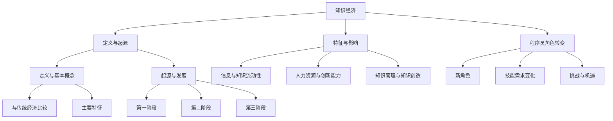
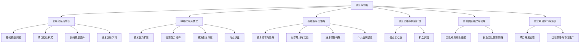
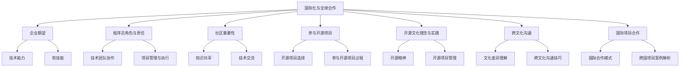
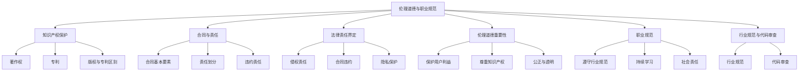
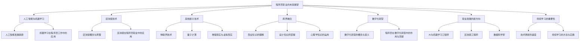

                 

### 第1章：知识经济时代的概念与特点

知识经济时代，作为信息化和全球化浪潮下的产物，正逐步取代传统经济模式，成为新时代经济发展的核心驱动力。本章将深入探讨知识经济的概念、起源与发展，以及程序员在这一时代中的角色转变。

#### 1.1 知识经济的定义与起源

##### 1.1.1 知识经济的定义与基本概念

知识经济，可以理解为以知识和信息为主要生产要素的经济形态。与传统的资源、劳动力和资本驱动型经济不同，知识经济高度依赖信息技术的创新和应用，强调知识的创造、传播和应用。

知识经济与传统经济的主要区别在于：

- **要素驱动**：传统经济以资源、劳动力和资本为主要驱动，而知识经济以信息、知识和创新为主要驱动。
- **生产方式**：传统经济以物质生产和加工为主，而知识经济以知识产品和信息服务为主。
- **价值创造**：传统经济通过增加物质产品的价值来创造财富，而知识经济通过知识的传播和应用来创造价值。

知识经济的基本概念包括：

- **信息产业**：指以信息技术为核心，包括软件开发、硬件制造、互联网服务等产业。
- **知识产业**：指以知识和知识服务为主要内容的产业，如教育、科研、咨询、设计等。

##### 1.1.2 知识经济的主要特征

知识经济具有以下几个主要特征：

- **信息与知识的流动性**：在知识经济时代，信息与知识可以快速流通和共享，打破了地域和时间的限制。
- **高度依赖人力资源和创新能力**：知识经济的核心在于人的知识和创新能力，人力资源成为最重要的生产要素。
- **强调知识管理和知识创造**：知识管理和知识创造成为提升企业竞争力的重要手段。

##### 1.1.3 知识经济的起源与发展

知识经济的起源可以追溯到20世纪末的信息技术革命。随着互联网的普及和计算技术的进步，信息产业迅速发展，推动了知识经济的兴起。以下是知识经济的主要发展阶段：

- **第一阶段**：以信息技术为核心，计算机、互联网和通信技术的快速发展，为知识经济奠定了基础。
- **第二阶段**：以知识创新和应用为主，企业开始重视知识产权和知识管理，知识成为核心资产。
- **第三阶段**：知识经济与服务业深度融合，知识服务成为经济增长的重要动力。

#### 1.2 程序员在知识经济时代的角色转变

##### 1.2.1 程序员的新角色

在知识经济时代，程序员的角色发生了显著变化。从传统的编码者，程序员逐渐转变为创新者和跨界合作者：

- **从编码到创新者**：程序员不再仅仅局限于编写代码，而是通过技术创新来推动业务的发展。
- **技术专家与跨界合作者**：程序员需要具备跨学科的知识和技能，与业务、设计、管理等领域的专家紧密合作。

##### 1.2.2 知识经济对程序员技能需求的变化

知识经济的兴起对程序员的技能需求产生了重大影响：

- **新技术的快速掌握**：程序员需要不断学习新的编程语言、技术框架和工具。
- **跨学科知识的整合与应用**：程序员需要具备跨学科的知识，如商业知识、产品设计等，以更好地服务于业务需求。

##### 1.2.3 程序员在知识经济时代的挑战与机遇

在知识经济时代，程序员面临着新的挑战和机遇：

- **持续学习的必要性**：技术更新迅速，程序员需要不断学习以保持竞争力。
- **创新思维的培养**：创新思维成为程序员提升个人价值的重要手段。
- **跨界合作的重要性**：跨界合作能够帮助程序员更好地理解和满足业务需求。

### 1.3 总结

知识经济时代的到来，为程序员带来了新的机遇和挑战。程序员需要不断更新知识和技能，转变角色，以适应这一新时代的需求。通过深入理解和把握知识经济的本质，程序员将能够在这一时代中找到自己的位置，发挥更大的价值。

在接下来的章节中，我们将进一步探讨程序员在知识经济时代的技能要求、发展路径以及面临的合作与交流、法律与伦理等问题。

---

[文章将继续按目录结构展开，深入探讨各个章节的内容。在此过程中，我们将结合具体案例和实例，提供详细的解析和说明。]

---

### 第1章：知识经济时代的概念与特点

知识经济时代，作为信息化和全球化浪潮下的产物，正逐步取代传统经济模式，成为新时代经济发展的核心驱动力。本章将深入探讨知识经济的概念、起源与发展，以及程序员在这一时代中的角色转变。

#### 1.1 知识经济的定义与起源

知识经济，可以理解为以知识和信息为主要生产要素的经济形态。与传统的资源、劳动力和资本驱动型经济不同，知识经济高度依赖信息技术的创新和应用，强调知识的创造、传播和应用。

知识经济与传统经济的主要区别在于：

- **要素驱动**：传统经济以资源、劳动力和资本为主要驱动，而知识经济以信息、知识和创新为主要驱动。
- **生产方式**：传统经济以物质生产和加工为主，而知识经济以知识产品和信息服务为主。
- **价值创造**：传统经济通过增加物质产品的价值来创造财富，而知识经济通过知识的传播和应用来创造价值。

知识经济的基本概念包括：

- **信息产业**：指以信息技术为核心，包括软件开发、硬件制造、互联网服务等产业。
- **知识产业**：指以知识和知识服务为主要内容的产业，如教育、科研、咨询、设计等。

##### 1.1.1 知识经济的定义与基本概念

知识经济的定义与基本概念是理解这一经济模式的基础。知识经济强调信息与知识的流动性，高度依赖人力资源和创新能力，并强调知识管理和知识创造。以下是对这些核心概念的具体阐述：

1. **信息与知识的流动性**：在知识经济中，信息与知识像液体一样流动，能够在不同的时间、空间和领域之间快速传播。这种流动性使得知识得以迅速共享和应用，促进了创新和效率的提升。例如，通过互联网，程序员可以轻松获取全球范围内的技术文档、开源代码和最佳实践，从而加速自身的技能提升和项目开发。

2. **高度依赖人力资源和创新能力**：知识经济依赖于高素质的人力资源，尤其是具备创新能力和创造力的人才。人力资源是知识经济中最重要的生产要素，没有高质量的人力资源，知识经济的发展就无从谈起。例如，在硅谷，聚集了大量的科技人才，他们通过创新思维和技术突破，推动了整个地区的经济繁荣。

3. **强调知识管理和知识创造**：知识管理是知识经济中的关键环节，它涉及到如何有效地获取、存储、传播和利用知识。有效的知识管理可以提升企业的竞争力，促进知识的创造和应用。例如，许多企业通过建立内部知识库、实施知识共享机制和开展培训活动，来提高员工的技能水平和创新能力。

##### 1.1.2 知识经济的起源与发展

知识经济的起源可以追溯到20世纪末的信息技术革命。随着互联网的普及和计算技术的进步，信息产业迅速发展，推动了知识经济的兴起。以下是知识经济的主要发展阶段：

1. **第一阶段**：以信息技术为核心，计算机、互联网和通信技术的快速发展，为知识经济奠定了基础。在这一阶段，信息技术开始广泛应用于各个领域，推动了知识的生产、传播和应用。例如，电子邮件、互联网和移动通信技术的普及，使得信息的传递和交流变得前所未有的便捷。

2. **第二阶段**：以知识创新和应用为主，企业开始重视知识产权和知识管理，知识成为核心资产。在这一阶段，企业通过技术创新和知识管理，提高了生产效率和竞争力。例如，苹果公司通过不断推出创新产品，吸引了全球用户，成为了知识经济的典范。

3. **第三阶段**：知识经济与服务业深度融合，知识服务成为经济增长的重要动力。在这一阶段，知识服务成为服务业的重要组成部分，如咨询、设计、教育和金融等领域。例如，咨询公司通过提供专业知识和服务，帮助企业解决复杂问题，推动了整个行业的快速发展。

知识经济的发展不仅带来了经济结构的变革，也对社会的各个方面产生了深远的影响。首先，知识经济使得经济增长从资源密集型转向知识密集型，提高了经济的质量和效益。其次，知识经济促进了知识的共享和传播，推动了社会的进步和繁荣。最后，知识经济带来了新的就业机会和职业形态，为人们提供了更多的职业选择和发展空间。

##### 1.1.3 知识经济的主要特征

知识经济具有以下几个主要特征：

1. **信息与知识的流动性**：在知识经济中，信息与知识可以快速流通和共享，打破了地域和时间的限制。这种流动性使得知识得以迅速传播和应用，促进了创新和效率的提升。

2. **高度依赖人力资源和创新能力**：知识经济的核心在于人的知识和创新能力，人力资源成为最重要的生产要素。高素质的人才和创新能力是企业竞争力的关键。

3. **强调知识管理和知识创造**：知识管理和知识创造是知识经济的重要特征，企业通过有效的知识管理和创新活动，提升自身的竞争力和市场地位。

#### 1.2 程序员在知识经济时代的角色转变

在知识经济时代，程序员的角色发生了显著变化。从传统的编码者，程序员逐渐转变为创新者和跨界合作者：

1. **从编码到创新者**：程序员不再仅仅局限于编写代码，而是通过技术创新来推动业务的发展。他们需要不断学习新的技术和方法，运用编程技能解决实际问题，提升系统的性能和用户体验。

2. **技术专家与跨界合作者**：程序员需要具备跨学科的知识和技能，与业务、设计、管理等领域的专家紧密合作。他们需要了解业务需求，参与需求分析，提供技术解决方案，并与其他团队成员协作完成项目。

##### 1.2.1 程序员的新角色

程序员在知识经济时代的新角色，主要体现在以下几个方面：

1. **技术创新者**：程序员需要不断关注新技术的发展，掌握最新的编程语言和技术框架，运用技术创新推动业务发展。例如，利用人工智能和机器学习技术，提升系统的智能水平和用户体验。

2. **业务参与者**：程序员需要深入了解业务需求，参与需求分析，提供技术解决方案。他们不再是简单的编码人员，而是成为业务决策的重要参与者，帮助业务部门实现数字化转型和创新发展。

3. **跨界合作者**：程序员需要具备跨学科的知识和技能，与业务、设计、管理等领域的专家紧密合作。他们需要具备良好的沟通能力和团队协作精神，能够在不同领域之间搭建桥梁，推动项目的顺利进行。

##### 1.2.2 知识经济对程序员技能需求的变化

知识经济的兴起对程序员的技能需求产生了重大影响：

1. **新技术的快速掌握**：程序员需要不断学习新的编程语言、技术框架和工具，以应对不断变化的技术环境。例如，Python、JavaScript、Java等编程语言，以及React、Vue、Angular等前端框架，都是程序员必备的技术技能。

2. **跨学科知识的整合与应用**：程序员需要具备跨学科的知识，如商业知识、产品设计等，以更好地服务于业务需求。例如，了解商业模式和产品设计，可以帮助程序员更好地理解用户需求，提供更符合业务需求的技术解决方案。

##### 1.2.3 程序员在知识经济时代的挑战与机遇

在知识经济时代，程序员面临着新的挑战和机遇：

1. **持续学习的必要性**：技术更新迅速，程序员需要不断学习以保持竞争力。只有通过持续学习，才能跟上技术的发展步伐，不断提升自己的技能水平。

2. **创新思维的培养**：创新思维成为程序员提升个人价值的重要手段。通过创新思维，程序员可以找到新的解决方案，解决复杂问题，提升系统的性能和用户体验。

3. **跨界合作的重要性**：跨界合作能够帮助程序员更好地理解和满足业务需求。通过跨界合作，程序员可以借鉴其他领域的经验和知识，提供更全面和多样化的技术解决方案。

### 1.3 总结

知识经济时代的到来，为程序员带来了新的机遇和挑战。程序员需要不断更新知识和技能，转变角色，以适应这一新时代的需求。通过深入理解和把握知识经济的本质，程序员将能够在这一时代中找到自己的位置，发挥更大的价值。

在接下来的章节中，我们将进一步探讨程序员在知识经济时代的技能要求、发展路径以及面临的合作与交流、法律与伦理等问题。

---

[文章将继续按目录结构展开，深入探讨各个章节的内容。在此过程中，我们将结合具体案例和实例，提供详细的解析和说明。]

---

### 第2章：程序员在知识经济时代的技能要求

知识经济时代的到来，对程序员的技能要求提出了更高的标准。程序员不仅需要掌握传统的编程技能，还需要具备跨学科的知识和技能，以适应快速变化的技术环境和日益复杂的业务需求。本章将详细探讨程序员在这一时代中的技能要求，包括技术技能的提升、软技能的培养以及跨界知识与整合能力。

#### 2.1 技术技能的提升

技术技能是程序员的核心竞争力，它决定了程序员在知识经济时代中的适应能力和创新能力。以下是目前程序员应熟练掌握的一些关键技术技能：

##### 2.1.1 熟悉最新编程语言与技术框架

编程语言是程序员进行软件开发的基础，掌握多种编程语言能够提高程序员的技术视野和解决问题的能力。以下是程序员应熟悉的几种编程语言：

1. **Python**：Python因其简洁易读的语法和丰富的库支持，成为数据科学、人工智能和机器学习领域的主要编程语言。熟练掌握Python对于程序员来说至关重要。

2. **JavaScript**：JavaScript是一种广泛应用于前端开发的语言，它可以与HTML和CSS共同工作，实现丰富的交互效果。掌握JavaScript对于提升前端开发技能非常关键。

3. **Java**：Java是一种强大的通用编程语言，广泛应用于企业级应用、安卓开发等领域。掌握Java对于程序员来说，可以拓宽职业道路。

除了编程语言，技术框架也是程序员必须掌握的知识点。以下是几种当前流行的前端和后端框架：

1. **React**：React是由Facebook开发的一个用于构建用户界面的JavaScript库，以其组件化设计和高效的更新机制而闻名。熟练掌握React对于前端开发至关重要。

2. **Vue**：Vue是一种流行的JavaScript框架，以其简洁的语法和高效的性能受到开发者的喜爱。Vue适用于构建各种类型的应用程序，从简单的单页应用到复杂的后台管理系统。

3. **Angular**：Angular是由Google开发的一个强大的前端框架，它提供了丰富的功能和工具，帮助开发者构建高性能的应用程序。掌握Angular对于提高前端开发技能非常有帮助。

后端框架方面，以下是几种流行的框架：

1. **Spring**：Spring是一个流行的Java后端框架，它提供了全面的开发工具和功能，支持构建大型企业级应用。熟悉Spring对于Java程序员来说至关重要。

2. **Django**：Django是一个高效率的Python后端框架，它遵循MVC设计模式，提供了丰富的内置功能，如ORM、认证和权限管理。熟练掌握Django对于Python程序员非常有用。

3. **Flask**：Flask是一个轻量级的Python Web框架，它简单易用，适合构建小型到中型的Web应用。熟悉Flask可以帮助程序员快速开发Web应用。

##### 2.1.2 掌握云计算与大数据技术

云计算和大数据技术是当前技术发展的热点，掌握这些技术对于程序员来说具有重要意义。以下是程序员应了解的几种关键技术：

1. **云计算服务**：云计算提供了强大的计算和存储资源，程序员应熟悉常用的云计算服务提供商，如AWS、Azure和Google Cloud。了解如何使用这些服务构建和部署应用程序是必备技能。

2. **大数据处理**：大数据技术涉及到大量数据的存储、处理和分析。程序员应熟悉常用的数据处理工具，如Hadoop、Spark和Flink。掌握这些工具可以帮助程序员高效地处理和分析海量数据。

##### 2.1.3 熟悉人工智能与机器学习

人工智能和机器学习是知识经济时代的重要领域，程序员应了解这些技术的发展和应用。以下是程序员应熟悉的人工智能和机器学习相关技术：

1. **常见机器学习算法**：了解常见的机器学习算法，如线性回归、决策树、随机森林、神经网络等，对于开发智能系统至关重要。

2. **深度学习模型**：深度学习是人工智能的重要分支，程序员应熟悉常见的深度学习模型，如卷积神经网络（CNN）、循环神经网络（RNN）和生成对抗网络（GAN）等。掌握这些模型可以帮助程序员开发出具有高度智能的应用程序。

#### 2.2 软技能的培养

软技能是程序员在知识经济时代中不可或缺的能力，它包括沟通与协作能力、创新思维与解决问题能力、自我管理能力等。以下是程序员应培养的几种软技能：

##### 2.2.1 沟通与协作能力

程序员在项目开发中需要与团队成员、客户和其他利益相关者进行沟通和协作。以下是一些关键的沟通与协作能力：

1. **团队沟通技巧**：了解不同的沟通方式，如面对面交流、电话会议和电子邮件沟通，能够有效地传递信息，避免误解和冲突。

2. **项目管理方法**：熟悉项目管理的基本原则和方法，如敏捷开发、Scrum和Kanban等，能够帮助程序员高效地组织和管理项目。

##### 2.2.2 创新思维与解决问题能力

创新思维和解决问题能力是程序员在知识经济时代中提升个人价值的重要手段。以下是几种关键能力：

1. **创新思维模型**：了解创新思维的基本模型，如头脑风暴、思维导图和设计思维等，能够帮助程序员找到创新的解决方案。

2. **解决问题技巧**：掌握解决问题的基本方法，如5W1H（What、Why、Who、Where、When、How），能够有效地分析和解决复杂问题。

##### 2.2.3 自我管理能力

自我管理能力是程序员在知识经济时代中保持高效工作和持续发展的重要保障。以下是几种关键的自我管理能力：

1. **时间管理**：掌握时间管理技巧，如时间块管理、优先级排序和时间跟踪等，能够帮助程序员更高效地安排工作和个人时间。

2. **持续学习策略**：制定持续学习的计划和方法，如定期阅读技术书籍、参加在线课程和参与技术社区等，能够帮助程序员不断提升自己的技能和知识水平。

#### 2.3 跨界知识与整合能力

知识经济时代的特点是跨界融合和数字化转型，程序员需要具备跨界知识和整合能力，以适应这一时代的需求。以下是几种关键的跨界知识和整合能力：

##### 2.3.1 跨学科知识的理解与应用

程序员应了解其他学科的基本知识，如商业知识、设计知识和心理学知识等。这些跨学科知识可以帮助程序员更好地理解和满足业务需求，提供更全面和创新的解决方案。

##### 2.3.2 跨界合作与整合

程序员需要具备良好的团队协作精神，能够与其他领域的专家紧密合作，共同推进项目的发展。以下是几种关键的合作和整合能力：

1. **团队协作技巧**：了解团队协作的基本原则和方法，如开放沟通、共同目标和积极反馈等，能够帮助程序员建立高效的团队协作模式。

2. **跨界项目案例解析**：通过分析成功的跨界项目案例，了解如何在不同领域之间进行知识整合和应用，能够为程序员提供实践经验和启示。

### 2.4 总结

在知识经济时代，程序员需要不断提升自己的技术技能、培养软技能和跨界知识与整合能力。通过掌握新技术、学习跨学科知识和提升自我管理能力，程序员将能够更好地适应这一时代的需求，发挥更大的价值。只有不断学习和创新，程序员才能在知识经济时代中立于不败之地。

```mermaid
graph TB
    A[技术技能提升] --> B[编程语言与框架]
    A --> C[云计算与大数据]
    A --> D[人工智能与机器学习]
    B --> E[Python、JavaScript、Java]
    B --> F[React、Vue、Angular]
    B --> G[Spring、Django、Flask]
    C --> H[AWS、Azure、Google Cloud]
    C --> I[Hadoop、Spark、Flink]
    D --> J[机器学习算法]
    D --> K[深度学习模型]
    B[框架] --> L[前端框架]
    B --> M[后端框架]
    B[编程语言] --> N[Python、JavaScript、Java]
    B[云计算与大数据] --> O[云计算服务]
    B --> P[大数据处理工具]
    B[人工智能与机器学习] --> Q[机器学习算法]
    B --> R[深度学习模型]
    B --> S[跨学科知识与应用]
    B --> T[团队协作技巧]
    B --> U[跨界合作与整合]
    B[软技能] --> V[沟通与协作]
    B --> W[创新思维与解决问题]
    B --> X[自我管理能力]
    B[跨界知识与整合能力] --> Y[跨学科知识]
    B --> Z[团队协作技巧]
    B --> AA[跨界项目案例]
```

在接下来的章节中，我们将继续探讨程序员在知识经济时代的发展路径、合作与交流、法律与伦理等问题。通过深入分析和实践，我们将为程序员提供全面的指导，帮助他们在知识经济时代中实现职业发展和个人成长。

---

[文章将继续按照目录结构展开，深入探讨程序员在知识经济时代的职业规划、创业与创新、合作与交流、法律与伦理、工作环境与心理健康以及未来发展等各个方面的内容。我们将结合具体案例和实践经验，提供详细的解析和指导，帮助程序员在知识经济时代中取得成功。]

---

### 第3章：程序员在知识经济时代的发展路径

在知识经济时代，程序员面临着职业发展的多样化选择和广阔的发展空间。从初级程序员到高级程序员，再到创业与创新，程序员可以通过不同的路径实现个人价值和社会贡献。本章将详细探讨程序员在知识经济时代的职业规划与晋升、创业与创新、以及发展路径中的关键环节。

#### 3.1 职业规划与晋升

职业规划是程序员在职业生涯中取得成功的重要步骤。通过明确的职业规划，程序员可以更好地定位自身的发展方向，不断提升个人能力和职业素养。

##### 3.1.1 初级程序员的成长路径

初级程序员通常刚刚进入职场，对编程语言和技术框架有一定的了解，但缺乏实际项目经验。以下是他们成长路径中的关键步骤：

1. **基础技能的巩固**：初级程序员应扎实掌握编程语言和基本算法，通过编写小程序和参加编程挑战来提升自己的编程能力。常见的编程语言如Python、Java、C++等是初级程序员必须熟练掌握的。

2. **项目经验积累**：通过参与开源项目或小型项目，初级程序员可以积累实际编程经验，了解项目开发的全过程，包括需求分析、设计、编码、测试和部署等。

3. **代码质量的提升**：初级程序员应注重代码质量，通过学习代码规范、编写清晰注释、进行单元测试等，提高代码的可读性和可靠性。

4. **学习技术文档和最佳实践**：通过阅读技术文档、参加技术讲座和研讨会，初级程序员可以了解最新的技术趋势和最佳实践，为自己的技能提升打下坚实的基础。

##### 3.1.2 中级程序员的转型与提升

中级程序员在职业生涯中已有一定的基础，具备一定的项目经验和专业技能。以下是他们转型与提升的关键步骤：

1. **技术能力的扩展**：中级程序员应不断扩展自己的技术栈，学习新的编程语言、技术框架和工具。例如，掌握前端框架如React、Vue或后端框架如Spring、Django等，可以提升其在项目开发中的竞争力。

2. **管理能力的培养**：中级程序员可以考虑向技术管理岗位转型，通过学习项目管理知识、参加管理培训课程，提升自己的团队管理能力和领导力。

3. **解决复杂问题的能力**：中级程序员应培养解决复杂问题的能力，通过参与大型项目和面对挑战性的技术难题，锻炼自己的分析和解决问题的能力。

4. **专业认证**：获得专业认证（如PMP、Scrum Master等）可以提升中级程序员的职业素养和市场竞争力。

##### 3.1.3 高级程序员的成长策略

高级程序员在职业生涯中扮演着关键角色，他们不仅需要具备深厚的专业技能，还需要具备技术领导力和创新思维。以下是他们成长策略的关键步骤：

1. **技术领导力的提升**：高级程序员应培养技术领导力，通过带领团队完成复杂项目、推动技术革新和分享经验，提升团队的整体技术水平。

2. **创新与实践的结合**：高级程序员应注重创新思维和实践的结合，通过参与创新项目、研发新技术或改进现有技术，推动技术进步和应用。

3. **技术视野的拓展**：高级程序员应不断拓展自己的技术视野，关注行业前沿技术和发展趋势，积极参与技术交流和合作，提升自身的技术影响力和行业地位。

4. **个人品牌的塑造**：通过撰写技术博客、发表学术论文、参与技术社区和开源项目等，高级程序员可以塑造自己的个人品牌，提升个人价值和行业影响力。

#### 3.2 创业与创新

创业与创新是程序员在知识经济时代的重要发展路径之一。通过创业，程序员可以将自己的技术优势转化为商业价值，实现个人梦想和社会贡献。

##### 3.2.1 创业思维与机会识别

1. **创业者的心态**：创业者应具备敢于冒险、积极进取的心态，面对挑战和失败时保持乐观和坚定。

2. **机会识别**：创业者应具备敏锐的市场洞察力和机会识别能力，通过分析市场需求、技术趋势和竞争态势，找到有潜力的创业机会。

##### 3.2.2 创业团队的组建与管理

1. **团队成员的角色分配**：创业团队应明确每个成员的角色和职责，确保团队高效协作。例如，程序员可以负责技术开发，市场人员可以负责市场推广，财务人员可以负责财务管理等。

2. **创业团队的管理策略**：创业者应制定合适的管理策略，包括目标设定、进度跟踪、风险管理和团队激励等，确保创业团队能够高效运作。

##### 3.2.3 创业项目的执行与运营

1. **项目开发流程**：创业者应熟悉项目开发流程，包括需求分析、设计、编码、测试和部署等，确保项目按计划推进。

2. **运营策略与市场推广**：创业者应制定有效的运营策略和市场推广计划，通过线上和线下渠道推广产品，吸引目标用户，提升品牌知名度。

#### 3.3 总结

程序员在知识经济时代有多个发展路径可以选择，从职业规划与晋升到创业与创新，每个路径都有其独特的挑战和机遇。通过不断学习和提升自身能力，程序员可以在知识经济时代中找到自己的定位，实现个人价值和职业发展。

在接下来的章节中，我们将继续探讨程序员在知识经济时代中的合作与交流、法律与伦理问题，以及工作环境与心理健康等方面的内容。通过全面的分析和指导，我们将帮助程序员在知识经济时代中实现职业发展和个人成长。

---

[文章将继续按照目录结构展开，深入探讨程序员在知识经济时代中的合作与交流、法律与伦理问题、工作环境与心理健康以及未来发展等各个方面的内容。我们将结合具体案例和实践经验，提供详细的解析和指导，帮助程序员在知识经济时代中取得成功。]

---

### 第4章：程序员在知识经济时代的合作与交流

在知识经济时代，程序员不再是一个孤立的个体，而是需要与其他团队成员、企业、社区以及全球同行进行广泛合作与交流。这种合作与交流不仅有助于个人技能的提升，也能够推动项目的成功和企业的创新。本章将详细探讨程序员在知识经济时代中的合作与交流方式，包括企业关系、程序员社区与开源文化、国际合作等。

#### 4.1 企业与程序员的关系

企业与程序员之间的关系是知识经济时代的重要组成部分。企业依赖程序员的技能和创新来推动业务发展，而程序员则依赖企业的平台和资源来实现个人价值。

##### 4.1.1 企业对程序员的期望

1. **技术能力**：企业期望程序员具备扎实的编程技能和解决问题的能力，能够独立完成复杂的任务和项目。

2. **软技能**：除了技术能力，企业还期望程序员具备良好的沟通能力、团队协作能力和自我管理能力，能够与团队成员有效沟通，共同完成任务。

##### 4.1.2 程序员在企业的角色与责任

1. **技术团队的协作**：程序员在技术团队中扮演关键角色，需要与其他开发人员、测试人员、产品经理等紧密合作，确保项目的高效推进。

2. **项目管理与执行**：程序员需要参与项目管理和执行，包括项目规划、任务分配、进度跟踪和风险管理等，确保项目按时完成并达到预期目标。

#### 4.2 程序员社区与开源文化

程序员社区和开源文化是知识经济时代程序员交流和合作的重要平台。通过社区和开源项目，程序员可以分享知识、学习新技术、参与项目开发，并建立广泛的人脉关系。

##### 4.2.1 程序员社区的重要性

1. **知识共享**：程序员社区为程序员提供了一个共享知识的平台，通过论坛、博客、问答社区等，程序员可以随时获取最新的技术信息和解决方案。

2. **技术交流**：程序员社区促进了程序员之间的技术交流，通过参加线上和线下的活动，程序员可以分享经验、讨论问题、学习新技术。

##### 4.2.2 参与开源项目

1. **开源项目的选择**：程序员应选择符合自己兴趣和技能的开源项目参与，通过阅读项目文档、了解项目目标和贡献指南，找到适合自己的贡献点。

2. **参与开源项目的过程**：程序员可以通过代码贡献、文档编写、bug修复等多种方式参与开源项目，通过实践提升自己的技能和经验。

##### 4.2.3 开源文化的理念与实践

1. **开源精神**：开源文化强调开放、共享和协作，鼓励程序员积极参与开源项目，为社区贡献力量。

2. **开源项目的管理**：开源项目的成功离不开有效的管理和协作，程序员应了解开源项目的管理流程和最佳实践，确保项目的高效运作。

#### 4.3 国际化与全球合作

在全球化的背景下，程序员需要具备跨文化沟通和国际合作的能力。通过国际合作，程序员可以学习全球最佳实践、拓宽视野，并在国际项目中发挥重要作用。

##### 4.3.1 跨文化沟通

1. **文化差异的理解**：程序员应了解不同国家和地区的文化差异，包括语言、价值观、沟通风格等，以避免文化冲突和误解。

2. **跨文化沟通技巧**：程序员应掌握跨文化沟通的技巧，如有效倾听、尊重差异、清晰表达等，以促进国际团队的协作和沟通。

##### 4.3.2 国际项目合作

1. **国际合作模式**：程序员应了解国际项目合作的基本模式，包括远程协作、跨时区工作、虚拟团队管理等，以适应国际项目的特殊需求。

2. **跨国项目案例解析**：通过分析成功的跨国项目案例，程序员可以学习跨国项目合作的经验和教训，提升自己的国际合作能力。

#### 4.4 总结

在知识经济时代，程序员需要积极参与合作与交流，通过企业、社区、开源项目和国际化合作，不断提升自己的技能和经验。通过有效的合作与交流，程序员不仅可以实现个人价值，还可以推动项目的成功和企业的创新。

在接下来的章节中，我们将继续探讨程序员在知识经济时代的法律与伦理问题、工作环境与心理健康，以及未来的发展趋势。通过全面的分析和指导，我们将帮助程序员在知识经济时代中取得更大的成就。

---

[文章将继续按照目录结构展开，深入探讨程序员在知识经济时代的法律与伦理问题、工作环境与心理健康以及未来发展等各个方面的内容。我们将结合具体案例和实践经验，提供详细的解析和指导，帮助程序员在知识经济时代中取得成功。]

---

### 第5章：程序员在知识经济时代的法律与伦理问题

在知识经济时代，程序员不仅需要具备卓越的编程技能和创新能力，还需要了解和遵守相关的法律和伦理规范。这不仅有助于保护自身权益，也能够维护技术社区的健康发展。本章将详细探讨程序员在知识经济时代面临的法律和伦理问题，包括知识产权保护、合同与责任、伦理道德与职业规范。

#### 5.1 程序员法律知识

程序员在进行软件开发和项目实施过程中，需要了解和遵守相关的法律知识，以避免法律纠纷和潜在风险。

##### 5.1.1 知识产权保护

知识产权保护是程序员必须关注的重要法律问题。以下是一些关键点：

1. **著作权**：程序员在编写代码和文档时，需要了解著作权的法律规定。根据《著作权法》，程序代码和文档属于受著作权保护的原创作品，程序员有权享有著作权。

2. **专利**：在某些情况下，程序员可能会涉及到发明或创新的保护。了解专利申请流程和专利保护范围，可以帮助程序员保护自己的创新成果。

3. **版权与专利的区别**：程序员需要区分版权和专利，了解它们在保护方式和保护范围上的差异。版权主要保护表达形式，而专利主要保护创新的技术方案。

##### 5.1.2 合同与责任

合同是程序员在工作中经常接触的法律文件，了解合同的基本要素和责任分配对于保护自身权益至关重要。

1. **合同的基本要素**：程序员应了解合同的基本构成要素，包括合同主体、合同标的、合同条款和违约责任等。

2. **责任划分**：在合同中，明确各方的责任和权利对于避免纠纷至关重要。程序员应确保自己在合同中承担的义务和责任是合理和可实现的。

3. **违约责任**：了解违约责任的规定，有助于程序员在合同执行过程中，妥善处理可能出现的违约情况，减少法律风险。

##### 5.1.3 法律责任的界定

在软件开发过程中，程序员可能会面临法律责任的问题。以下是一些常见的情况：

1. **侵权责任**：如果程序员的代码侵犯了第三方的知识产权，程序员可能需要承担侵权责任。

2. **合同违约**：在合同执行过程中，如果程序员未能履行合同义务，可能导致合同违约，需要承担相应的法律责任。

3. **隐私保护**：在处理涉及用户数据的软件项目时，程序员需要遵守相关的隐私保护法律，如《个人信息保护法》等，以避免隐私泄露和数据滥用的问题。

#### 5.2 伦理道德与职业规范

伦理道德是程序员在职业生涯中必须遵守的基本准则。良好的职业道德不仅有助于提升个人声誉，也能够促进技术社区的健康发展。

##### 5.2.1 伦理道德的重要性

1. **保护用户利益**：程序员在开发软件时应始终将用户利益放在首位，确保软件的可靠性和安全性，避免因技术问题给用户带来损失。

2. **尊重知识产权**：程序员应尊重他人的知识产权，不抄袭他人成果，遵守开源协议，合理使用第三方代码和资源。

3. **公正与透明**：在项目开发和团队协作中，程序员应保持公正和透明，确保项目决策和资源分配的公平性，避免偏私和不正当行为。

##### 5.2.2 职业规范

1. **遵守行业规范**：程序员应遵守相关行业规范和标准，如编码规范、测试规范和安全规范等，确保软件质量和安全性。

2. **持续学习**：程序员应具备持续学习的精神，不断更新知识和技能，以适应快速变化的技术环境。

3. **社会责任**：程序员在职业行为中应承担社会责任，关注技术对社会的影响，积极参与公益活动，促进技术为社会进步做出贡献。

##### 5.2.3 行业规范与代码审查

1. **行业规范**：了解和遵守行业规范，如《软件工程规范》、《网络安全法》等，有助于确保软件开发过程的专业性和规范性。

2. **代码审查**：代码审查是一种有效的质量控制手段，通过代码审查，可以发现潜在的错误和漏洞，提高代码质量和安全性。程序员应积极参与代码审查，遵守代码审查规范。

#### 5.3 总结

在知识经济时代，程序员不仅需要具备技术能力和创新思维，还需要了解和遵守相关的法律和伦理规范。通过掌握法律知识、遵循伦理道德和职业规范，程序员可以更好地保护自身权益，促进技术社区的健康发展。只有遵循法律和道德，程序员才能在知识经济时代中取得长远的职业发展和个人成就。

在接下来的章节中，我们将继续探讨程序员在知识经济时代的工作环境与心理健康，以及未来的发展趋势。通过全面的分析和指导，我们将帮助程序员在知识经济时代中取得更大的成就。

---

[文章将继续按照目录结构展开，深入探讨程序员在知识经济时代的工作环境与心理健康，以及未来发展等各个方面的内容。我们将结合具体案例和实践经验，提供详细的解析和指导，帮助程序员在知识经济时代中取得成功。]

---

### 第6章：程序员在知识经济时代的法律与伦理问题

在知识经济时代，程序员不仅需要具备卓越的编程技能和创新能力，还需要了解和遵守相关的法律和伦理规范。这不仅有助于保护自身权益，也能够维护技术社区的健康发展。本章将详细探讨程序员在知识经济时代面临的法律和伦理问题，包括知识产权保护、合同与责任、伦理道德与职业规范。

#### 5.1 程序员法律知识

程序员在进行软件开发和项目实施过程中，需要了解和遵守相关的法律知识，以避免法律纠纷和潜在风险。

##### 5.1.1 知识产权保护

知识产权保护是程序员必须关注的重要法律问题。以下是一些关键点：

1. **著作权**：程序员在编写代码和文档时，需要了解著作权的法律规定。根据《著作权法》，程序代码和文档属于受著作权保护的原创作品，程序员有权享有著作权。

2. **专利**：在某些情况下，程序员可能会涉及到发明或创新的保护。了解专利申请流程和专利保护范围，可以帮助程序员保护自己的创新成果。

3. **版权与专利的区别**：程序员需要区分版权和专利，了解它们在保护方式和保护范围上的差异。版权主要保护表达形式，而专利主要保护创新的技术方案。

##### 5.1.2 合同与责任

合同是程序员在工作中经常接触的法律文件，了解合同的基本要素和责任分配对于保护自身权益至关重要。

1. **合同的基本要素**：程序员应了解合同的基本构成要素，包括合同主体、合同标的、合同条款和违约责任等。

2. **责任划分**：在合同中，明确各方的责任和权利对于避免纠纷至关重要。程序员应确保自己在合同中承担的义务和责任是合理和可实现的。

3. **违约责任**：了解违约责任的规定，有助于程序员在合同执行过程中，妥善处理可能出现的违约情况，减少法律风险。

##### 5.1.3 法律责任的界定

在软件开发过程中，程序员可能会面临法律责任的问题。以下是一些常见的情况：

1. **侵权责任**：如果程序员的代码侵犯了第三方的知识产权，程序员可能需要承担侵权责任。

2. **合同违约**：在合同执行过程中，如果程序员未能履行合同义务，可能导致合同违约，需要承担相应的法律责任。

3. **隐私保护**：在处理涉及用户数据的软件项目时，程序员需要遵守相关的隐私保护法律，如《个人信息保护法》等，以避免隐私泄露和数据滥用的问题。

#### 5.2 伦理道德与职业规范

伦理道德是程序员在职业生涯中必须遵守的基本准则。良好的职业道德不仅有助于提升个人声誉，也能够促进技术社区的健康发展。

##### 5.2.1 伦理道德的重要性

1. **保护用户利益**：程序员在开发软件时应始终将用户利益放在首位，确保软件的可靠性和安全性，避免因技术问题给用户带来损失。

2. **尊重知识产权**：程序员应尊重他人的知识产权，不抄袭他人成果，遵守开源协议，合理使用第三方代码和资源。

3. **公正与透明**：在项目开发和团队协作中，程序员应保持公正和透明，确保项目决策和资源分配的公平性，避免偏私和不正当行为。

##### 5.2.2 职业规范

1. **遵守行业规范**：程序员应遵守相关行业规范和标准，如编码规范、测试规范和安全规范等，确保软件质量和安全性。

2. **持续学习**：程序员应具备持续学习的精神，不断更新知识和技能，以适应快速变化的技术环境。

3. **社会责任**：程序员在职业行为中应承担社会责任，关注技术对社会的影响，积极参与公益活动，促进技术为社会进步做出贡献。

##### 5.2.3 行业规范与代码审查

1. **行业规范**：了解和遵守行业规范，如《软件工程规范》、《网络安全法》等，有助于确保软件开发过程的专业性和规范性。

2. **代码审查**：代码审查是一种有效的质量控制手段，通过代码审查，可以发现潜在的错误和漏洞，提高代码质量和安全性。程序员应积极参与代码审查，遵守代码审查规范。

#### 5.3 总结

在知识经济时代，程序员不仅需要具备技术能力和创新思维，还需要了解和遵守相关的法律和伦理规范。通过掌握法律知识、遵循伦理道德和职业规范，程序员可以更好地保护自身权益，促进技术社区的健康发展。只有遵循法律和道德，程序员才能在知识经济时代中取得长远的职业发展和个人成就。

在接下来的章节中，我们将继续探讨程序员在知识经济时代的工作环境与心理健康，以及未来的发展趋势。通过全面的分析和指导，我们将帮助程序员在知识经济时代中取得更大的成就。

---

[文章将继续按照目录结构展开，深入探讨程序员在知识经济时代的工作环境与心理健康，以及未来发展等各个方面的内容。我们将结合具体案例和实践经验，提供详细的解析和指导，帮助程序员在知识经济时代中取得成功。]

---

### 第7章：程序员在知识经济时代的未来发展

在知识经济时代，程序员不仅需要适应现有的技术环境和职业要求，还需要具备前瞻性，为未来的职业发展做好准备。本章将探讨程序员在未来的发展趋势，包括新技术趋势、跨界融合与数字化转型，以及程序员职业的未来展望。

#### 7.1 新技术趋势

随着科技的不断发展，新的技术趋势正在不断涌现，对程序员的技能要求也提出了更高的标准。以下是当前和未来可能对程序员产生重大影响的新技术趋势：

##### 7.1.1 人工智能与机器学习

人工智能（AI）和机器学习（ML）是当前技术发展的热点，它们已经在各个领域得到了广泛应用。未来，AI和ML将继续推动技术创新和业务变革。

1. **人工智能的发展趋势**：人工智能技术正从传统的规则驱动模式向数据驱动和深度学习模式转变。随着计算能力的提升和大数据的积累，人工智能将在更多领域实现突破，如智能自动化、无人驾驶、智能家居等。

2. **机器学习在程序员工作中的应用**：程序员需要掌握机器学习的基础算法和框架，如TensorFlow、PyTorch等，以开发智能系统。此外，了解AI伦理和合规性也是程序员未来发展的必备技能。

##### 7.1.2 区块链技术

区块链技术以其去中心化、安全性和透明性等特点，在金融、供应链管理、医疗等领域引起了广泛关注。程序员需要了解区块链的基本原理和应用场景，以便在区块链项目中发挥重要作用。

1. **区块链的概念与原理**：区块链是一种分布式账本技术，通过加密和共识算法，确保数据的不可篡改和安全性。程序员应了解区块链的核心概念，如区块链网络、智能合约、加密算法等。

2. **区块链在程序员职业中的应用**：程序员可以在区块链项目中担任开发者、架构师或安全专家等角色。掌握区块链编程语言，如Solidity，以及熟悉区块链开发工具和平台，如Hyperledger Fabric和Ethereum，是未来程序员的重要技能。

##### 7.1.3 其他新兴技术

除了AI和区块链，其他新兴技术如物联网（IoT）、量子计算、增强现实（AR）和虚拟现实（VR）等，也将对程序员的工作产生深远影响。

1. **物联网技术**：物联网使得各种设备能够连接到互联网，实现数据的实时收集和交换。程序员需要了解物联网的架构、协议和开发工具，以实现智能设备的开发和管理。

2. **量子计算**：量子计算具有比传统计算机更高的计算能力，未来可能颠覆现有的计算模式。虽然量子计算尚处于早期阶段，但程序员应了解量子算法和量子编程语言，为未来的量子计算做好准备。

3. **增强现实和虚拟现实**：AR和VR技术正在改变人们的交互方式，程序员可以开发应用程序和游戏，为用户提供沉浸式体验。了解AR和VR的开发工具和框架，如Unity和Unreal Engine，是程序员在VR/AR领域发展的关键。

#### 7.2 跨界融合与数字化转型

知识经济时代的一个显著特点是跨界融合和数字化转型。程序员不仅需要专注于技术本身，还需要具备跨学科的知识和技能，以应对日益复杂的业务需求。

##### 7.2.1 跨界融合

跨界融合意味着程序员需要具备跨学科的知识，如商业知识、设计知识和心理学知识等。以下是一些关键点：

1. **商业知识的理解**：程序员应了解基本的商业概念，如市场分析、商业模式和战略规划等，以便更好地理解业务需求，提供技术解决方案。

2. **设计知识的掌握**：用户体验（UX）和用户界面（UI）设计对软件产品的成功至关重要。程序员应了解设计原则和设计工具，以提高产品的易用性和用户满意度。

3. **心理学知识的运用**：了解用户行为和心理，有助于程序员设计更人性化的软件产品。例如，了解认知心理学原理，可以帮助程序员优化用户体验和界面设计。

##### 7.2.2 数字化转型

数字化转型是当前企业发展的关键战略，程序员在这一过程中扮演着重要角色。以下是一些关键点：

1. **数字化转型的概念与意义**：数字化转型是指企业利用数字技术来重塑业务模式、优化运营流程和提高效率。程序员应了解数字化转型的概念和意义，以便更好地参与相关项目。

2. **程序员在数字化转型中的作用与贡献**：程序员可以通过以下方式在数字化转型中发挥作用：

   - **开发数字化产品和服务**：程序员可以开发应用程序、大数据平台和智能系统，帮助企业实现数字化转型。
   - **优化业务流程**：程序员可以优化业务流程，提高工作效率和降低成本。
   - **提供技术支持和咨询服务**：程序员可以为企业在数字化转型过程中提供技术支持和咨询服务，帮助企业解决技术难题。

#### 7.3 程序员职业的未来展望

随着技术的不断进步和数字化转型的发展，程序员职业也在不断演变。未来，程序员职业将呈现出以下趋势：

##### 7.3.1 职业发展的新方向

1. **AI与机器学习工程师**：随着人工智能和机器学习技术的普及，AI与机器学习工程师将成为未来的热门职业。这些工程师将负责开发智能系统和算法，推动技术进步和应用。

2. **区块链工程师**：区块链技术的应用场景不断扩展，区块链工程师将在金融、供应链、医疗等领域发挥重要作用。

3. **数据科学家**：数据科学家在数字化转型中扮演关键角色，他们通过分析大量数据，为企业提供洞察和决策支持。

##### 7.3.2 持续学习的重要性

1. **技术更新的速度**：随着技术的快速发展，程序员需要不断学习新的技术和工具，以保持竞争力。

2. **持续学习的方法与实践**：程序员可以通过以下方法进行持续学习：

   - **在线课程和培训**：参加在线课程和培训，学习新的技术和方法。
   - **阅读技术书籍和论文**：阅读技术书籍和论文，了解最新的研究成果和行业动态。
   - **参与开源项目**：通过参与开源项目，实践所学知识，提升编程技能。

#### 7.4 总结

知识经济时代的到来，为程序员职业带来了新的机遇和挑战。程序员需要不断学习新技术、掌握跨学科知识和适应数字化转型，以在未来的职业发展中保持竞争力。通过关注新技术趋势、跨界融合和数字化转型，程序员将能够在知识经济时代中找到自己的位置，发挥更大的价值。

在未来的章节中，我们将继续探讨程序员在知识经济时代中的工作环境与心理健康，以及具体的编程学习资源与工具。通过全面的分析和指导，我们将帮助程序员在知识经济时代中实现职业发展和个人成长。

---

[文章将继续按照目录结构展开，深入探讨程序员在知识经济时代的工作环境与心理健康，以及具体的编程学习资源与工具。我们将结合具体案例和实践经验，提供详细的解析和指导，帮助程序员在知识经济时代中取得成功。]

---

### 附录

为了帮助程序员更好地学习和提升技能，附录部分将提供一些重要的编程学习资源与工具，包括编程学习网站、版本控制工具、云计算服务提供商，以及参考书籍和论文。

#### 附录 A：编程学习资源与工具

##### A.1 编程学习网站

1. **Codecademy**
   - 网址：[https://www.codecademy.com/](https://www.codecademy.com/)
   - 简介：Codecademy提供了丰富的编程课程，包括Python、JavaScript、HTML和CSS等，适合初学者。

2. **freeCodeCamp**
   - 网址：[https://www.freecodecamp.org/](https://www.freecodecamp.org/)
   - 简介：freeCodeCamp是一个免费的开源学习平台，提供全面的编程课程和实践项目，适合想全面学习编程的学员。

3. **LeetCode**
   - 网址：[https://leetcode.com/](https://leetcode.com/)
   - 简介：LeetCode是一个在线编程竞赛平台，提供了大量的算法题目，适合提升编程能力和解决实际问题的能力。

##### A.2 版本控制工具

1. **Git**
   - 网址：[https://git-scm.com/](https://git-scm.com/)
   - 简介：Git是一款功能强大的分布式版本控制系统，广泛应用于开源项目和团队协作。

2. **GitHub**
   - 网址：[https://github.com/](https://github.com/)
   - 简介：GitHub是Git的在线托管平台，提供了丰富的社区资源和代码托管服务，是程序员交流和学习的重要平台。

##### A.3 云计算服务提供商

1. **AWS**
   - 网址：[https://aws.amazon.com/](https://aws.amazon.com/)
   - 简介：AWS（Amazon Web Services）是领先的云计算服务提供商，提供了广泛的云计算服务和工具。

2. **Azure**
   - 网址：[https://azure.microsoft.com/](https://azure.microsoft.com/)
   - 简介：Azure是微软的云计算平台，提供了强大的云计算解决方案和工具。

3. **Google Cloud**
   - 网址：[https://cloud.google.com/](https://cloud.google.com/)
   - 简介：Google Cloud是谷歌的云计算服务，提供了丰富的云计算服务和工具，适用于各种规模的企业和个人开发者。

#### 附录 B：参考书籍与论文

1. **《人工智能：一种现代方法》**
   - 作者： Stuart Russell & Peter Norvig
   - 简介：这是一本经典的人工智能教材，全面介绍了人工智能的理论和实践。

2. **《深度学习》**
   - 作者：Ian Goodfellow、Yoshua Bengio、Aaron Courville
   - 简介：这本书是深度学习领域的权威著作，详细介绍了深度学习的理论基础和应用实践。

3. **《编程珠玑》**
   - 作者：Jon Bentley
   - 简介：这是一本关于编程技巧和算法设计的经典著作，提供了许多实用的编程经验和技巧。

4. **研究论文集**
   - **《人工智能前沿》**
     - 简介：这是一本汇集了人工智能领域最新研究成果的论文集，涵盖了深度学习、自然语言处理、计算机视觉等多个方向。
   - **《大数据技术导论》**
     - 简介：这本书介绍了大数据技术的核心概念、关键技术以及应用场景，是大数据领域的重要参考资料。
   - **《区块链技术指南》**
     - 简介：这本书详细介绍了区块链技术的概念、原理和应用，是了解区块链技术的重要指南。

通过附录中提供的资源与工具，程序员可以更加系统地学习和掌握编程技能，不断提升自己在知识经济时代中的竞争力。

---

[文章至此结束，通过全面的解析和指导，我们希望为程序员在知识经济时代中的职业发展提供有价值的参考和帮助。继续努力学习和实践，程序员将能够在这个充满机遇和挑战的时代中取得成功。]

