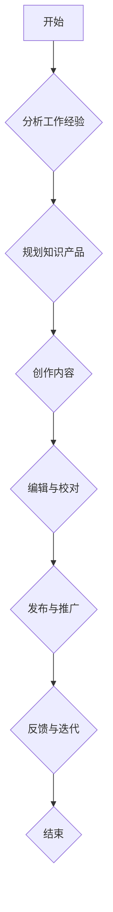

                 

### 《程序员如何将工作经验转化为知识产品》

> **关键词**：程序员、工作经验、知识产品、转化、创作、传播、变现

> **摘要**：
本文旨在探讨程序员如何将自身的工作经验转化为知识产品，实现个人价值和社会价值的最大化。我们将从工作经验的分析、知识产品的制作、传播与推广，到具体实践与案例分析，以及知识产品的变现策略等多个方面进行深入探讨，为程序员们提供一套系统的指南和方法论。

### 目录

1. **概述与基础**
    1.1 程序员工作经验转化的意义
    1.2 知识产品的定义与价值
    1.3 工作经验转化为知识产品的必要性

2. **工作经验分析**
    2.1 工作经验概述
    2.2 工作经验分类与整理
    2.3 工作经验的价值评估

3. **知识产品制作方法**
    3.1 知识产品类型
    3.2 制作过程概述
    3.3 知识整理与组织

4. **知识传播与推广**
    4.1 知识传播渠道
    4.2 知识推广策略
    4.3 社区参与与互动

5. **具体实践与案例分析**
    5.1 博客与文章写作
    5.2 书籍与电子书的编写
    5.3 在线课程与教程开发
    5.4 项目与案例研究

6. **知识产品变现策略**
    6.1 收益模式探索
    6.2 成本控制与收益分析
    6.3 风险评估与管理

7. **持续发展与实践提升**
    7.1 知识更新与维护
    7.2 社区建设与用户互动
    7.3 职业发展与自我提升

8. **附录**
    8.1 资源与工具推荐
    8.2 参考文献

### 第一部分：概述与基础

在IT行业，程序员的工作经验是他们最宝贵的财富。这些经验不仅来自于日复一日的编程实践，还包括解决复杂问题的能力、对新技术的研究和应用，以及对项目管理的理解。然而，如何有效地将这部分经验转化为可以传播和分享的知识产品，是一个值得探讨的问题。

#### 1.1 程序员工作经验转化的意义

程序员的工作经验转化具有以下几个方面的意义：

- **个人价值的提升**：通过将工作经验转化为知识产品，程序员可以扩大自己的影响力，提高个人品牌价值，获得更多的职业机会和收入来源。
- **知识的传播与共享**：工作经验的转化过程实际上是对知识进行系统化、结构化的整理和传播。这有助于知识的积累和传承，对整个行业的发展具有积极的推动作用。
- **社会价值的实现**：知识产品的传播不仅有助于提高个人和企业的竞争力，还可以为社会创造更多的价值，推动技术进步和产业升级。

#### 1.2 知识产品的定义与价值

知识产品是指以知识为核心，通过创造性劳动形成的成果，包括但不限于以下几种类型：

- **技术文档**：包括项目文档、技术手册、API文档等，是程序员日常工作的重要输出。
- **书籍和电子书**：系统地整理和阐述某一领域的知识，有助于读者深入理解。
- **博客和文章**：程序员在日常工作中积累的经验和思考，通过博客和文章的形式进行分享。
- **在线课程与教程**：将工作经验和专业知识制作成课程，供学习者在线学习。
- **演讲和讲座**：在技术会议上分享自己的经验和见解，提升个人和企业的知名度。

知识产品的价值在于：

- **权威性**：系统化的知识产品具有一定的权威性，可以增加用户对作者的信任。
- **可传播性**：知识产品可以通过多种渠道传播，如博客、书籍、在线课程等，实现广泛的知识共享。
- **经济价值**：优秀的知识产品可以带来经济收益，如通过销售书籍、课程等形式获得收入。
- **品牌建设**：知识产品是个人和企业的品牌建设的重要组成部分。

#### 1.3 工作经验转化为知识产品的必要性

在当前信息化和知识经济的背景下，程序员的工作经验转化为知识产品具有以下几个方面的必要性：

- **行业竞争的加剧**：随着技术的不断进步和人才的竞争，程序员需要不断提升自己的技能和影响力，知识产品是实现这一目标的有效途径。
- **知识的快速更新**：技术的快速发展使得程序员需要不断学习和更新知识，将工作经验转化为知识产品可以帮助他们更好地消化和吸收新知识。
- **个人职业发展的需要**：知识产品是程序员职业发展的重要载体，通过创作和传播知识产品，程序员可以实现职业晋升和转型。

总之，程序员的工作经验转化为知识产品是一个具有重要意义的过程，不仅有助于提升个人价值和社会价值，还可以推动整个行业的发展。在接下来的章节中，我们将详细探讨如何进行工作经验的分析、知识产品的制作、传播与推广，以及具体的实践方法和案例分析。

### 第二部分：工作经验分析

#### 2.1 工作经验概述

程序员的工作经验是其职业生涯中最宝贵的资产，它不仅反映了个人在技术领域的能力和成就，还包含了在实际项目中积累的解决复杂问题的经验。工作经验的丰富程度直接关系到程序员在职场中的竞争力和未来发展。因此，对工作经验进行系统化的分析至关重要。

首先，我们需要明确什么是工作经验。程序员的工作经验包括以下几个方面：

- **项目经验**：参与过的项目类型、项目规模、项目周期以及具体承担的角色。
- **技术掌握**：熟悉的技术栈、编程语言、框架和工具的使用情况。
- **问题解决**：面对过的技术挑战、难题的解决方法和经验。
- **团队协作**：与团队成员的沟通协作经验，包括项目管理、任务分配等。
- **项目管理**：参与的项目管理过程，包括项目规划、资源分配、进度控制等。

工作经验的丰富性体现在以下几个方面：

- **项目多样性**：参与过不同类型的项目，如Web开发、移动应用、大数据处理等，有助于积累多样化的技能和经验。
- **技术深度**：对某一领域或技术栈有深入的理解和掌握，能够在项目中灵活应用。
- **问题解决能力**：面对技术难题时能够迅速找到解决方案，具有独立解决问题的能力。
- **团队协作经验**：在团队中能够有效沟通、协作，推动项目进展，提升团队整体效率。
- **项目管理能力**：具备良好的项目管理能力，能够合理规划项目资源、控制进度，确保项目成功交付。

#### 2.2 工作经验分类与整理

为了更好地将工作经验转化为知识产品，我们需要对工作经验进行分类和整理。以下是几种常见的分类方法：

1. **按项目类型分类**：
    - Web开发项目：包括前后端开发、Web框架使用、性能优化等。
    - 移动应用开发：包括iOS、Android平台的开发经验。
    - 大数据处理：包括Hadoop、Spark等大数据处理框架的使用。
    - 数据库开发：包括数据库设计、性能优化、SQL编程等。
    - 软件架构设计：包括系统架构设计、模块划分、接口设计等。

2. **按技术栈分类**：
    - 前端技术：包括HTML、CSS、JavaScript、Vue、React等。
    - 后端技术：包括Java、Python、Node.js、Django、Flask等。
    - 数据库技术：包括MySQL、PostgreSQL、MongoDB等。
    - 架构设计：包括微服务架构、分布式系统、容器化等。

3. **按问题解决分类**：
    - 常见问题解决：包括网络问题、数据库问题、性能问题等。
    - 端到端解决方案：包括从需求分析、设计开发到测试部署的完整解决方案。
    - 创新技术应用：包括区块链、人工智能等前沿技术在项目中的应用。

4. **按团队角色分类**：
    - 团队成员：包括普通开发人员、项目经理、测试人员等。
    - 领导角色：包括技术主管、技术经理等。

在分类和整理工作经验时，我们可以使用以下工具和方法：

- **思维导图**：使用思维导图工具（如XMind、MindManager等）将工作经验进行可视化整理。
- **文档记录**：将每个项目的详细情况、技术栈、解决的问题等记录在文档中，便于查阅和整理。
- **数据库管理**：使用数据库（如MySQL、PostgreSQL等）对工作经验进行存储和管理，便于快速检索和查询。

#### 2.3 工作经验的价值评估

工作经验的价值评估是将其转化为知识产品的重要环节。以下是几种常用的评估方法：

1. **技术贡献度**：
    - 对项目的成功有重要影响的经验，如核心代码开发、关键技术突破等。
    - 解决了项目中的重大问题，如性能瓶颈、安全隐患等。

2. **团队贡献度**：
    - 在团队中发挥了关键作用，如技术指导、团队管理、项目协调等。
    - 提高了团队的整体效率，如优化流程、引入新技术等。

3. **行业影响力**：
    - 在行业内分享的经验和见解，如技术博客、演讲、书籍等。
    - 在技术社区中的活跃度，如参与开源项目、参与技术讨论等。

4. **经济效益**：
    - 对公司或客户带来的直接经济效益，如项目成功交付、客户满意度提升等。
    - 通过知识产品（如书籍、课程等）带来的间接经济收益。

在评估工作经验的价值时，可以结合以下因素：

- **项目重要性**：项目的规模、影响力以及对公司或客户的战略意义。
- **个人角色**：在项目中扮演的角色以及承担的责任。
- **技术深度**：解决的问题的复杂程度和技术难度。
- **团队协作**：在团队中的作用和贡献。
- **行业认可**：在行业内的影响力和知名度。

通过以上方法对工作经验进行分类、整理和价值评估，我们可以更清晰地了解自己的优势领域，为后续的知识产品制作提供基础和指导。在接下来的章节中，我们将详细探讨如何将工作经验转化为各类知识产品，以及具体的制作方法和实践策略。

### 第三部分：知识产品制作方法

#### 3.1 知识产品类型

在将程序员的工作经验转化为知识产品时，首先需要明确不同类型的知识产品，以便根据自身优势选择合适的制作方向。常见的知识产品类型包括：

1. **技术博客与文章**：
    - 技术博客是程序员分享工作经验和技术见解的重要平台，常见于个人博客、技术社区（如CSDN、博客园等）。
    - 文章可以是技术分享、项目总结、技术趋势分析等，形式多样，有助于提高个人品牌和影响力。

2. **书籍与电子书**：
    - 书籍是系统化、结构化的知识输出，可以涵盖某一技术领域或项目实践。
    - 电子书则更加灵活，便于在线阅读和传播，适用于深度学习的知识分享。

3. **在线课程与教程**：
    - 在线课程是系统化的教学资源，包括视频讲解、文档资料、互动练习等。
    - 教程则是针对某一具体技术或项目，提供详细的操作步骤和示例代码。

4. **演讲与讲座**：
    - 演讲与讲座是在技术会议、研讨会等场合分享知识和经验的直接方式。
    - 通过演讲，可以进一步提升个人和企业的知名度。

5. **开源项目与贡献**：
    - 开源项目是程序员在技术社区贡献的重要形式，通过代码和文档，与他人分享技术成果。
    - 贡献可以是修复Bug、添加新功能、撰写文档等。

6. **在线论坛与社区**：
    - 在线论坛和社区是程序员交流技术和经验的重要场所，通过参与讨论，提升个人影响力。

每种知识产品都有其独特的特点和应用场景：

- **技术博客与文章**：适合快速分享经验和技术见解，适用于广泛传播。
- **书籍与电子书**：适合系统化、深度化的知识输出，适用于专业读者。
- **在线课程与教程**：适合系统教学，适用于初学者和有一定基础的读者。
- **演讲与讲座**：适合在特定场合展示个人实力，适用于提升个人品牌。
- **开源项目与贡献**：适合在技术社区建立影响力，适用于代码和文档贡献者。
- **在线论坛与社区**：适合持续互动和交流，适用于技术爱好者和专业人士。

#### 3.2 制作过程概述

无论选择哪种知识产品，其制作过程都包括以下几个关键步骤：

1. **选题与定位**：
    - 确定知识产品的主题和目标受众，如初学者、中级程序员、高级开发者等。
    - 确定知识产品的类型，如技术博客、书籍、在线课程等。

2. **内容规划**：
    - 制定知识产品的整体框架和内容结构，包括章节、小节、知识点等。
    - 确保内容的系统性和连贯性，避免遗漏关键知识点。

3. **内容创作**：
    - 根据内容规划进行知识点的详细讲解和案例分析，确保内容的深度和实用性。
    - 使用适当的表达方式和语言，使内容易于理解和掌握。

4. **编辑与校对**：
    - 对内容进行多次审查和修改，确保内容的准确性和逻辑性。
    - 校对语法、格式、引用等，确保知识产品的专业性和美观性。

5. **发布与推广**：
    - 选择合适的平台和渠道发布知识产品，如个人博客、技术社区、在线课程平台等。
    - 制定推广策略，如社交媒体宣传、社区互动、SEO优化等，提高知识产品的曝光率和影响力。

6. **反馈与迭代**：
    - 收集用户反馈，了解知识产品的优缺点，进行改进和优化。
    - 根据用户需求和技术发展，不断更新和迭代知识产品，保持其时效性和实用性。

#### 3.3 知识整理与组织

在制作知识产品时，知识整理与组织是关键环节，直接影响知识产品的质量和用户体验。以下是一些实用的方法和工具：

1. **大纲法**：
    - 根据知识点的逻辑关系，制定详细的大纲，确保知识产品的结构清晰。
    - 大纲法有助于梳理和规划知识内容，确保内容的系统性和连贯性。

2. **思维导图**：
    - 使用思维导图工具（如XMind、MindManager等）将知识点进行可视化整理。
    - 思维导图有助于梳理知识结构，激发创意，提高思维效率。

3. **文档管理**：
    - 使用文档管理工具（如Google Docs、Office 365等）进行文档的创建、编辑和共享。
    - 文档管理工具支持多人协作，便于团队协作和知识共享。

4. **版本控制**：
    - 使用版本控制工具（如Git、SVN等）对知识产品进行版本管理和跟踪。
    - 版本控制有助于记录知识产品的修改历史，方便迭代和更新。

5. **图表与示例**：
    - 使用图表、示例代码等可视化元素，帮助读者更好地理解和掌握知识点。
    - 图表和示例可以提高知识产品的可读性和实用性。

6. **排版与设计**：
    - 对知识产品进行专业排版和设计，提高其美观性和阅读体验。
    - 排版设计工具（如Adobe InDesign、Microsoft Word等）可以用于文档的美化和格式调整。

通过以上方法和工具，我们可以有效地整理和组织知识，制作出高质量的知识产品。在接下来的章节中，我们将详细探讨各类知识产品的具体制作方法和实践策略。

### 第四部分：知识传播与推广

将知识产品制作完成后，如何有效地传播和推广是确保其价值最大化的重要环节。以下是几种常见的方法和策略：

#### 4.1 知识传播渠道

1. **个人博客与社交媒体**：
    - 个人博客是程序员分享技术见解和经验的重要平台，如CSDN、博客园等。
    - 社交媒体（如微博、知乎、微信公众号等）可以迅速传播知识，增加曝光率。

2. **技术社区与论坛**：
    - 技术社区（如Stack Overflow、GitHub等）是程序员交流和学习的重要场所。
    - 论坛（如V2EX、SDN等）可以提供更深入的讨论和互动。

3. **在线课程平台**：
    - 在线课程平台（如网易云课堂、慕课网等）提供了丰富的教学资源和用户基础。
    - 用户可以通过平台方便地学习知识产品。

4. **技术会议与研讨会**：
    - 技术会议和研讨会是展示个人和知识产品的重要场合。
    - 通过演讲和分享，可以提升个人和产品的知名度。

5. **专业杂志与期刊**：
    - 专业杂志和期刊是传播高级知识和研究成果的重要渠道。
    - 通过投稿，可以扩大知识产品的影响力。

6. **电子邮件营销**：
    - 通过电子邮件向订阅用户发送知识产品更新和推广信息。
    - 邮件内容要具有吸引力和专业性，以提高打开率和转化率。

#### 4.2 知识推广策略

1. **内容营销**：
    - 制作高质量、有价值的内容是知识推广的基础。
    - 内容要具备深度、实用性和专业性，以吸引目标用户。

2. **SEO优化**：
    - 通过搜索引擎优化（SEO）提高知识产品在搜索引擎中的排名。
    - 关键词优化、页面优化等都是有效的SEO策略。

3. **社交媒体推广**：
    - 利用社交媒体平台（如微博、知乎、微信公众号等）进行推广。
    - 发布有吸引力的内容，吸引粉丝和关注。

4. **合作推广**：
    - 与其他博客、社区、媒体等进行合作，共同推广知识产品。
    - 通过联合推广，扩大影响范围和受众群体。

5. **活动策划**：
    - 举办线上或线下活动，如讲座、沙龙、研讨会等，吸引潜在用户。
    - 活动内容要与知识产品相关，提高参与度和转化率。

6. **用户互动**：
    - 与用户进行互动，收集反馈和建议，不断优化知识产品。
    - 通过评论、问答等方式，建立良好的用户关系。

7. **内容分销**：
    - 将知识产品分销给其他平台或渠道，如图书出版、在线教育平台等。
    - 分销可以扩大知识产品的受众范围，提高收入。

8. **社交媒体广告**：
    - 利用社交媒体广告进行推广，如微博广告、知乎广告等。
    - 广告要精准定位目标用户，提高投放效果。

通过以上策略，我们可以有效地传播和推广知识产品，提高其曝光率和影响力。在接下来的章节中，我们将详细探讨具体实践案例，展示如何将这些策略应用到实际操作中。

### 第五部分：具体实践与案例分析

在程序员将工作经验转化为知识产品的过程中，实践和案例分析是至关重要的环节。通过具体实践，我们可以了解如何将理论知识应用到实际操作中，从而更好地实现知识产品的创作和传播。以下是几种常见的实践方法以及具体案例分析。

#### 5.1 博客与文章写作

博客和文章是程序员分享经验和见解的重要平台。以下是一个博客写作的实践案例：

**案例背景**：假设一位程序员想要分享他在开发过程中遇到的一个性能优化问题，以及解决方案。

**步骤**：

1. **选题与定位**：
    - 确定主题：性能优化问题及解决方案。
    - 确定目标受众：对性能优化感兴趣的程序员。

2. **内容规划**：
    - 制定大纲：引言、问题描述、性能分析、解决方案、总结。
    - 确保内容连贯性和逻辑性。

3. **内容创作**：
    - 描述问题：详细说明遇到的问题，包括现象、影响等。
    - 分析原因：通过代码和日志分析，找出问题的根本原因。
    - 提出解决方案：介绍具体的优化方案，包括代码改动、配置调整等。
    - 总结与反思：总结优化过程，反思解决方法的有效性。

4. **编辑与校对**：
    - 修订内容，确保准确性和专业性。
    - 校对语法、格式等，提高文章质量。

5. **发布与推广**：
    - 发布到个人博客或技术社区。
    - 通过社交媒体进行推广，吸引读者。

**效果分析**：

- 该博客文章发布后，获得了较高的人气和互动。
- 读者反馈积极，对文章的实用性和深度表示认可。
- 提升了作者的知名度和个人品牌。

#### 5.2 书籍与电子书的编写

书籍和电子书是系统化、结构化知识输出的重要形式。以下是一个书籍编写的实践案例：

**案例背景**：假设一位程序员计划编写一本关于Web性能优化的书籍。

**步骤**：

1. **选题与定位**：
    - 确定主题：Web性能优化。
    - 确定目标受众：希望提高Web性能的程序员和开发者。

2. **内容规划**：
    - 制定大纲：引言、Web性能基础、性能优化方法、案例分析等。
    - 确保内容系统性和深度。

3. **内容创作**：
    - 研究和分析当前Web性能优化的最佳实践。
    - 结合实际项目经验，撰写详细案例和示例。
    - 使用图表、代码示例等辅助说明，提高可读性。

4. **编辑与校对**：
    - 多次修订内容，确保准确性和逻辑性。
    - 专业校对，确保格式和语法无误。

5. **出版与发行**：
    - 与出版社合作，完成书籍出版。
    - 在线上平台（如亚马逊、京东）发行电子书。

**效果分析**：

- 书籍出版后，获得了良好的市场反响和读者评价。
- 提升了作者的知名度和行业影响力。
- 通过销售书籍，实现了经济收益。

#### 5.3 在线课程与教程开发

在线课程和教程是系统教学的重要形式。以下是一个在线课程开发的实践案例：

**案例背景**：假设一位程序员计划开发一门关于React框架的课程。

**步骤**：

1. **选题与定位**：
    - 确定主题：React框架基础与实战。
    - 确定目标受众：希望学习React框架的初学者。

2. **内容规划**：
    - 制定大纲：React基础、组件开发、状态管理、路由等。
    - 确保内容系统性和实用性。

3. **内容创作**：
    - 编写教学文档，包括理论讲解和实战案例。
    - 制作视频教程，使用生动、直观的演示。
    - 提供代码示例和练习题，帮助学员巩固知识。

4. **发布与运营**：
    - 发布到在线教育平台（如网易云课堂、慕课网等）。
    - 制定运营策略，如课程推广、用户互动等。

**效果分析**：

- 课程上线后，吸引了大量学员报名和学习。
- 学员反馈积极，对课程内容和方法表示认可。
- 通过课程销售和订阅，实现了经济收益。

#### 5.4 项目与案例研究

通过项目案例研究，程序员可以深入分析和解决实际问题，提高解决问题的能力。以下是一个项目案例研究的实践案例：

**案例背景**：假设一位程序员参与了一个大型电商平台的项目开发，其中涉及到高并发性能优化问题。

**步骤**：

1. **问题识别**：
    - 识别项目中的性能瓶颈，如数据库查询、缓存机制等。

2. **问题分析**：
    - 分析性能瓶颈的原因，如查询效率低、缓存命中率不足等。

3. **解决方案**：
    - 提出具体的优化方案，如索引优化、缓存策略调整等。
    - 实施优化方案，并进行性能测试。

4. **效果评估**：
    - 评估优化效果，如响应时间、系统吞吐量等。
    - 分析优化方案的可行性和效果。

**效果分析**：

- 优化方案实施后，显著提升了系统的性能和稳定性。
- 提高了用户体验和客户满意度。
- 为公司带来了显著的经济效益。

通过以上实践和案例分析，我们可以看到，将工作经验转化为知识产品不仅可以提升个人价值，还可以实现知识传播和推广。在接下来的章节中，我们将进一步探讨知识产品变现的策略和方法。

### 第六部分：知识产品变现策略

将知识产品创作完成后，如何将其转化为实际的经济收益是一个重要议题。以下几种知识产品变现策略可以帮助程序员实现这一目标。

#### 6.1 收益模式探索

知识产品的变现模式多种多样，根据产品类型和市场需求，可以采用以下几种主要的收益模式：

1. **付费订阅**：
    - 用户需要付费才能观看或使用知识产品，如在线课程、电子书订阅服务。
    - 这种模式适合系统化、深度的知识输出，能够为用户提供持续的、有价值的内容。

2. **一次性购买**：
    - 用户一次性支付费用，即可获得知识产品的完整访问权限，如实体书籍、电子书籍等。
    - 这种模式适合短时间完成、内容相对独立的知识产品。

3. **广告收入**：
    - 在知识产品中嵌入广告，通过广告展示获取收入，如个人博客、免费电子书等。
    - 需要注意广告与内容的相关性，确保不影响用户体验。

4. **付费增值服务**：
    - 提供付费增值服务，如答疑解惑、定制课程等，为用户提供额外的价值。
    - 这种模式适合已经有一定用户基础的知识产品，可以通过增值服务提高用户满意度。

5. **赞助与捐赠**：
    - 接受赞助和捐赠，如技术社区、开源项目等。
    - 这种模式适合公益性质的知识产品，通过社会支持获得资金。

6. **联合推广**：
    - 与其他企业或个人合作，通过联合推广实现共赢，如课程合作、书籍联合出版等。

#### 6.2 成本控制与收益分析

在制定知识产品变现策略时，成本控制和收益分析是不可或缺的环节。以下是几个关键点：

1. **成本估算**：
    - 制作成本：包括人力成本、时间成本、技术成本等。
    - 营销成本：包括推广费用、广告费用、渠道费用等。
    - 运营成本：包括服务器费用、带宽费用、维护成本等。

2. **收益预测**：
    - 根据市场需求和用户反馈，预测知识产品的潜在销售量或订阅量。
    - 分析不同变现模式下的预期收益，选择最合适的模式。

3. **定价策略**：
    - 根据成本和预期收益，制定合理的定价策略，确保产品价值与价格匹配。
    - 可以采用试错法，通过调整价格找到最佳定价点。

4. **收益规划**：
    - 制定长期的收益规划，如阶段性目标、增长策略等。
    - 通过数据分析和用户反馈，不断优化变现策略，提高收益。

#### 6.3 风险评估与管理

在知识产品变现过程中，风险是不可忽视的因素。以下是几种常见的风险以及相应的管理策略：

1. **市场需求风险**：
    - 风险：产品不符合市场需求，销售量或订阅量低。
    - 管理策略：进行充分的市场调研，了解用户需求和偏好；根据市场反馈及时调整产品内容和定价策略。

2. **竞争风险**：
    - 风险：市场上存在大量同类知识产品，竞争激烈。
    - 管理策略：打造差异化的产品特色，提供高质量的内容；通过品牌建设提高知名度，增强竞争力。

3. **技术风险**：
    - 风险：技术更新快，知识产品过时。
    - 管理策略：持续关注技术发展趋势，定期更新知识产品；建立知识库，确保内容的时效性和准确性。

4. **运营风险**：
    - 风险：运营管理不善，导致收益下降。
    - 管理策略：制定详细的运营计划，确保内容推广和用户服务的高效运作；通过数据分析和用户反馈，优化运营策略。

通过以上策略，程序员可以有效地控制成本、预测收益，并管理变现过程中的风险。在接下来的章节中，我们将进一步探讨如何持续更新和维护知识产品，以及如何通过社区建设和用户互动实现知识产品的长效发展。

### 第七部分：持续发展与实践提升

#### 7.1 知识更新与维护

知识更新和维护是知识产品持续发展的关键。在技术快速发展的背景下，程序员需要持续关注技术趋势和新知识，以保证知识产品的时效性和准确性。以下是几个方面的实践策略：

1. **定期回顾与更新**：
    - 定期对知识产品进行回顾，检查内容是否过时或存在错误。
    - 根据用户反馈和市场需求，及时调整和更新知识产品。

2. **持续学习与积累**：
    - 持续关注行业动态和技术进展，通过阅读技术书籍、参加技术会议、在线课程等方式，不断学习和积累新知识。
    - 将学习成果及时应用到知识产品中，提高其质量。

3. **版本管理与备份**：
    - 使用版本控制工具（如Git）对知识产品进行版本管理，记录每一次的更新和修改。
    - 定期备份知识产品，确保数据的安全性和完整性。

4. **社区互动与反馈**：
    - 在知识产品中设立互动渠道，如评论、问答等，鼓励用户反馈和提出建议。
    - 根据用户反馈，优化知识产品的内容和结构。

#### 7.2 社区建设与用户互动

社区建设与用户互动是知识产品持续发展的重要支撑。通过建立和维护社区，程序员可以增强与用户的联系，提升知识产品的价值和影响力。以下是几个方面的实践策略：

1. **确定社区目标**：
    - 明确社区的建设目标，如技术交流、知识分享、用户支持等。
    - 根据目标制定社区规则和运营策略。

2. **搭建社区平台**：
    - 选择合适的社区平台（如论坛、微信群、QQ群等），搭建线上社区。
    - 确保社区平台的稳定性和安全性，提供良好的用户体验。

3. **活跃社区氛围**：
    - 定期举办线上或线下活动，如技术讲座、沙龙、研讨会等，吸引用户参与。
    - 鼓励用户发表观点、分享经验，营造积极、互动的社区氛围。

4. **用户互动与反馈**：
    - 与用户保持密切互动，回答用户的问题，提供技术支持。
    - 及时收集用户反馈，了解用户需求和偏好，不断优化社区服务和内容。

5. **建立用户激励机制**：
    - 设立用户激励机制，如积分奖励、荣誉榜等，鼓励用户积极参与社区建设和知识分享。
    - 通过奖励，提升用户满意度和忠诚度。

#### 7.3 职业发展与自我提升

知识产品的创作和传播不仅对职业发展有重要影响，也是程序员自我提升的重要途径。以下是几个方面的实践策略：

1. **明确职业目标**：
    - 根据个人兴趣和市场需求，明确职业发展方向。
    - 制定详细的职业规划，设定短期和长期目标。

2. **持续学习和提升**：
    - 持续学习新技术和知识，提高自身技能水平。
    - 参与开源项目、技术社区，扩展视野，积累经验。

3. **知识产品作为职业发展的载体**：
    - 将知识产品作为职业发展的亮点，提升个人品牌价值。
    - 通过知识产品的传播和推广，扩大个人影响力。

4. **多角度发展**：
    - 除了编程技能，还要关注项目管理、团队协作、沟通能力等方面的发展。
    - 通过多角度发展，提升自身的综合素质。

5. **职业发展的反馈与调整**：
    - 定期进行职业发展评估，分析现状和不足。
    - 根据评估结果，调整职业规划和发展策略。

通过以上策略，程序员可以实现知识产品的持续更新与维护，建立和维护健康的社区，不断提升职业发展水平。在技术快速变化的今天，持续发展和实践提升是程序员保持竞争力的关键。

### 附录

#### 附录 A：资源与工具推荐

**A.1 开发与制作工具**

1. **博客平台**：
    - **GitHub Pages**：利用GitHub存储代码，快速搭建个人博客。
    - **Hexo**：基于Node.js的快速、简洁的博客框架。
    - **WordPress**：功能强大的内容管理系统，适用于各种类型的博客。

2. **书籍编写工具**：
    - **LaTeX**：专业排版工具，适用于编写高质量技术文档和书籍。
    - **Markdown**：轻量级标记语言，易于编写和格式化文档。

3. **在线课程平台**：
    - **网易云课堂**：提供丰富的在线课程，适合知识分享和教学。
    - **慕课网**：提供前端、后端、移动开发等领域的在线课程。

**A.2 推广与营销平台**

1. **社交媒体**：
    - **微博**：快速传播知识，提高知名度。
    - **知乎**：专业人士聚集，适合知识分享和讨论。
    - **微信公众号**：强大的内容营销平台，适合深度内容传播。

2. **搜索引擎优化（SEO）工具**：
    - **百度统计**：分析网站流量，优化搜索引擎排名。
    - **Google Analytics**：分析网站用户行为，提高用户体验。

3. **广告平台**：
    - **百度广告**：针对中国市场的广告投放平台。
    - **Google Ads**：全球范围内广告投放平台，适合国际市场。

**A.3 知识管理软件**

1. **Notion**：多功能知识管理工具，适用于笔记、项目管理等。
2. **Trello**：基于看板的项目管理工具，适合团队协作。
3. **Evernote**：强大的笔记工具，支持多平台同步和搜索。

#### 附录 B：参考文献

1. **《程序员修炼之道：从小工到专家》**，黄健宏 著。
2. **《深度学习》**，Ian Goodfellow、Yoshua Bengio、Aaron Courville 著。
3. **《大数据时代：生活、工作与思维的大变革》**，维克托·迈尔-舍恩伯格 著。
4. **《精益创业》**，埃里克·莱斯 著。
5. **《科技想要什么》**，凯文·凯利 著。
6. **《人工智能：一种现代的方法》**，Stuart Russell、Peter Norvig 著。

这些资源为程序员提供了丰富的知识和工具，有助于他们在知识产品的创作和传播过程中取得更好的成果。通过利用这些工具和资源，程序员可以更高效地完成知识产品的制作和推广，实现个人和职业的持续发展。

### Mermaid 流程图示例



### 核心算法原理讲解伪代码示例

```python
# 伪代码：机器学习模型训练
def train_model(data, labels):
    # 初始化模型参数
    model_params = initialize_params()

    # 训练模型
    for i in range(max_iterations):
        # 计算预测值
        predictions = model(data, model_params)

        # 计算损失函数值
        loss = calculate_loss(predictions, labels)

        # 更新模型参数
        model_params = update_params(model_params, loss)

    return model_params
```

### 数学模型和数学公式示例

$$
f(x) = w_1 * x_1 + w_2 * x_2 + b
$$

### 详细讲解与举例说明

- **详细讲解**：这是一个简单的线性回归模型，其中 $f(x)$ 表示输出值，$w_1$ 和 $w_2$ 分别为权重，$x_1$ 和 $x_2$ 为输入特征，$b$ 为偏置。该模型通过计算输入特征与权重之间的线性组合来预测输出值。
- **举例说明**：假设我们要预测一家公司的销售额，输入特征包括广告支出和市场竞争程度。通过训练模型，我们可以得到权重和偏置，从而预测不同广告支出和市场竞争程度情况下的销售额。

### 项目实战：代码实际案例

#### 开发环境搭建

- 安装Python环境
- 安装依赖库：numpy、matplotlib

#### 源代码实现

```python
import numpy as np
import matplotlib.pyplot as plt

# 数据准备
data = np.array([[1, 2], [2, 3], [3, 4], [4, 5]])
labels = np.array([2, 3, 4, 5])

# 初始化模型参数
w1, w2, b = 0, 0, 0

# 训练模型
for i in range(1000):
    predictions = w1 * data[:, 0] + w2 * data[:, 1] + b
    error = predictions - labels
    
    # 更新权重和偏置
    w1 -= error * data[:, 0] / len(data)
    w2 -= error * data[:, 1] / len(data)
    b -= error

# 可视化结果
plt.scatter(data[:, 0], data[:, 1], label='Data')
plt.plot(data[:, 0], w1 * data[:, 0] + w2 * data[:, 1] + b, color='red', label='Prediction')
plt.xlabel('Feature 1')
plt.ylabel('Feature 2')
plt.legend()
plt.show()
```

#### 代码解读与分析

- **代码解读**：该代码实现了一个线性回归模型，通过迭代计算权重和偏置，使预测值接近实际值。然后，使用matplotlib库将数据点和预测线可视化。
- **分析**：通过观察散点图和预测线，我们可以看到模型如何拟合数据，帮助我们理解线性回归模型的基本原理和应用。

### 附录 A：AI大模型开发工具与资源

#### A.1 主流深度学习框架对比

- **TensorFlow**：由Google开发，支持多种编程语言，易于扩展。
- **PyTorch**：灵活的动态计算图，易于调试。
- **JAX**：自动微分，高性能计算。

#### A.2 开源AI项目

- **TensorFlow Model Optimization Toolkit (TF-MOT)**：用于优化TensorFlow模型的工具。
- **PyTorch Mobile**：PyTorch的移动端支持。
- **Hugging Face Transformers**：预训练模型和NLP工具。

#### A.3 数据集与工具

- **ImageNet**：大规模的视觉识别数据集。
- **COCO**：用于目标检测和分割的数据集。
- **OpenML**：用于机器学习实验管理的平台。

这些工具和资源为AI大模型开发提供了丰富的支持和便利，有助于程序员在深度学习和AI领域取得更好的成果。通过学习和使用这些工具，程序员可以提升模型开发和优化的能力，推动AI技术的发展和应用。

