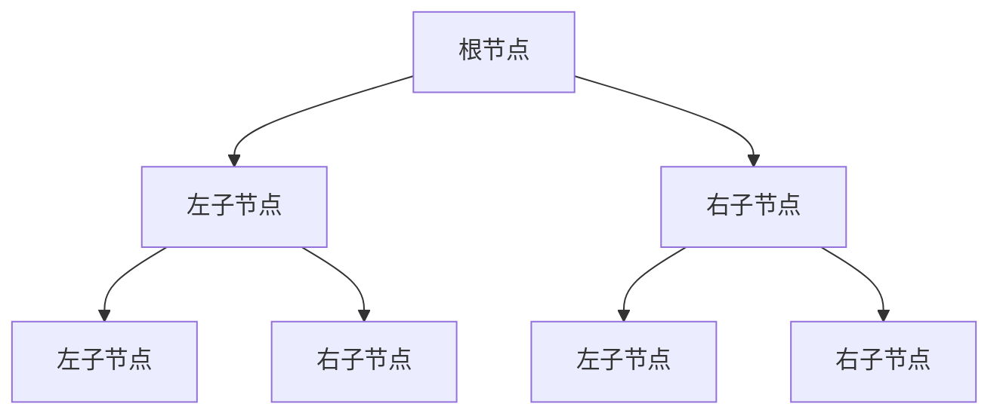

                 

# 《程序员如何建立长期的职业竞争力》

## 关键词
- 职业竞争力
- 个人成长
- 技术深化
- 实战经验
- 持续学习
- 沟通协作

## 摘要
本文旨在探讨程序员如何通过提升职业素养、深化技术知识、积累实战经验、持续学习和有效沟通协作来建立长期的职业竞争力。文章分为两部分，第一部分关注职业素养与个人成长，包括自我认知、职业规划、持续学习、沟通协作和团队管理。第二部分则聚焦技术深化与实战经验，从核心技术、软件开发流程、项目实战、新兴技术等方面进行深入探讨。通过本文，程序员将能够明确自己的职业发展路径，提升自身的综合素质，实现长期的职业成功。

## 《程序员如何建立长期的职业竞争力》目录大纲

### 第一部分：职业素养与个人成长

#### 第1章：职业竞争力的定义与理解
##### 1.1 职业竞争力的基本概念
##### 1.2 职场成功的关键要素
##### 1.3 程序员职业竞争力的独特性

#### 第2章：自我认知与职业规划
##### 2.1 自我评估与定位
##### 2.2 职业目标设定与时间管理
##### 2.3 职业规划实例分析

#### 第3章：持续学习与技能提升
##### 3.1 技术发展趋势与前瞻
##### 3.2 学习资源与方法论
##### 3.3 技能迁移与跨界学习

#### 第4章：沟通协作与团队管理
##### 4.1 沟通技巧在程序员职业中的应用
##### 4.2 团队协作与领导力培养
##### 4.3 程序员在项目管理中的角色

### 第二部分：技术深化与实战经验

#### 第5章：核心技术深度解析
##### 5.1 数据结构与算法
###### 5.1.1 数据结构原理与图解
###### 5.1.2 算法分析基础
###### 5.1.3 常见算法实例
##### 5.2 编程语言与框架
###### 5.2.1 编程语言选择与比较
###### 5.2.2 开源框架介绍
###### 5.2.3 框架应用实例

#### 第6章：软件开发流程与最佳实践
##### 6.1 软件开发方法论
###### 6.1.1 敏捷开发模式
###### 6.1.2 敏捷实践案例分析
###### 6.1.3 敏捷工具介绍
##### 6.2 版本控制与代码管理
###### 6.2.1 Git基本操作
###### 6.2.2 Git高级使用技巧
###### 6.2.3 代码审查实践
##### 6.3 自动化测试与持续集成
###### 6.3.1 自动化测试策略
###### 6.3.2 测试框架介绍
###### 6.3.3 持续集成实践

#### 第7章：项目实战与代码解析
##### 7.1 项目实战案例介绍
###### 7.1.1 项目背景与目标
###### 7.1.2 项目开发流程
###### 7.1.3 项目成果展示
##### 7.2 代码实现与分析
###### 7.2.1 核心模块代码解读
###### 7.2.2 代码质量评估与优化
###### 7.2.3 源代码结构与设计模式

#### 第8章：新兴技术与未来展望
##### 8.1 人工智能与程序员
###### 8.1.1 人工智能对程序员的影响
###### 8.1.2 程序员如何应对人工智能
###### 8.1.3 AI工具与技术的应用场景
##### 8.2 区块链与程序员
###### 8.2.1 区块链技术原理
###### 8.2.2 程序员在区块链领域的发展
###### 8.2.3 区块链应用案例分析

#### 第9章：职业成长与长期发展
##### 9.1 职业发展的不同阶段
###### 9.1.1 初级程序员的发展路径
###### 9.1.2 中级程序员的发展路径
###### 9.1.3 高级程序员的发展路径
##### 9.2 职业成就与个人品牌
###### 9.2.1 成就感的建立与保持
###### 9.2.2 个人品牌建设策略
###### 9.2.3 职业发展的瓶颈与突破

### 附录

#### 附录A：推荐书籍与资源
##### A.1 职业发展相关书籍
##### A.2 技术学习资源
##### A.3 在线课程与讲座

#### 附录B：编程语言与框架速查表
##### B.1 编程语言速查
##### B.2 开源框架速查

#### 附录C：代码示例与模板
##### C.1 常见算法示例代码
##### C.2 常用框架使用模板

## 第一部分：职业素养与个人成长

### 第1章：职业竞争力的定义与理解

#### 1.1 职业竞争力的基本概念

职业竞争力，是指一个人在职场中所具有的能够持续获得职业成功的能力和素质。对于程序员而言，职业竞争力不仅仅体现在技术水平上，还包括沟通能力、团队协作能力、解决问题的能力等多方面。

首先，技术水平是程序员职业竞争力的核心。随着技术的快速更新迭代，程序员需要不断学习新知识、新技能，以适应不断变化的技术环境。

其次，沟通能力是程序员在职场中不可或缺的一项能力。程序员不仅需要与团队成员有效沟通，还需要与产品经理、设计师等角色进行合作，确保项目顺利推进。

团队协作能力也是程序员职业竞争力的重要组成部分。在软件开发过程中，程序员往往需要与多个角色紧密合作，共同解决复杂问题。

解决问题的能力是程序员的核心竞争力之一。在面对复杂问题时，程序员需要能够迅速找到解决问题的方法和路径。

最后，职业素养也是一个重要的竞争力。职业素养包括责任心、敬业精神、职业道德等方面，是程序员在职场中赢得尊重和信任的基础。

#### 1.2 职场成功的关键要素

要建立长期的职业竞争力，程序员需要关注以下关键要素：

1. 技术能力：技术能力是程序员立足职场的基石。程序员需要不断提升自己的技术水平，掌握更多编程语言、框架和技术工具。

2. 沟通能力：沟通能力对于程序员来说至关重要。良好的沟通能力能够帮助程序员更好地与团队成员协作，确保项目顺利进行。

3. 学习能力：学习能力是程序员不断进步的动力。程序员需要具备快速学习新知识、新技能的能力，以适应技术发展的需求。

4. 团队协作能力：团队协作能力是程序员在职场中取得成功的关键。程序员需要能够与团队成员高效协作，共同解决复杂问题。

5. 解决问题的能力：面对复杂问题时，程序员需要具备良好的问题解决能力。这包括分析问题、设计解决方案、实施和验证解决方案等能力。

6. 职业素养：职业素养是程序员在职场中赢得尊重和信任的基础。程序员需要具备责任心、敬业精神、职业道德等职业素养。

#### 1.3 程序员职业竞争力的独特性

相对于其他职业，程序员职业竞争力的独特性体现在以下几个方面：

1. 技术的快速更新迭代：程序员需要不断学习新技术、新框架，以适应快速变化的技术环境。

2. 跨领域的广泛适用性：编程语言和框架具有跨领域的广泛适用性，程序员可以在不同领域进行技术迁移和跨界学习。

3. 高度自主性：程序员在开发过程中具有高度的自主性，可以自主选择技术方案和开发工具。

4. 创新能力：程序员在软件开发过程中需要具备创新能力，不断提出新的解决方案和技术改进。

### 第2章：自我认知与职业规划

#### 2.1 自我评估与定位

自我评估是程序员职业规划的第一步。通过自我评估，程序员可以了解自己的优势、劣势、兴趣和职业目标，为制定职业规划提供依据。

1. 技术能力评估：程序员可以评估自己在编程语言、框架、数据结构和算法等方面的掌握程度，了解自己的技术短板和需要提升的方向。

2. 沟通能力评估：程序员可以评估自己在与团队成员、上级和客户沟通时的表现，了解自己的沟通能力和需要改进的地方。

3. 团队协作能力评估：程序员可以评估自己在团队协作中的角色和表现，了解自己的团队协作能力和需要提升的方向。

4. 问题解决能力评估：程序员可以评估自己在面对复杂问题时解决问题的能力，了解自己的问题解决能力和需要改进的地方。

5. 职业素养评估：程序员可以评估自己在责任心、敬业精神、职业道德等方面的表现，了解自己的职业素养和需要提升的方向。

#### 2.2 职业目标设定与时间管理

设定清晰的职业目标是程序员职业规划的重要一环。职业目标可以分为短期目标、中期目标和长期目标。

1. 短期目标：短期目标通常是一年内要达成的目标，如掌握一门新的编程语言、完成一个项目等。

2. 中期目标：中期目标通常是在三到五年内要达成的目标，如晋升为项目经理、成为技术专家等。

3. 长期目标：长期目标通常是在五年以上要达成的目标，如成为领域专家、创业等。

为了实现这些目标，程序员需要制定合理的时间管理计划。时间管理的关键在于合理分配时间，确保在实现短期目标的同时，也能够为中期和长期目标打下基础。

1. 制定时间表：程序员可以根据目标制定详细的时间表，明确每天、每周、每月要完成的工作任务。

2. 优先级排序：程序员需要根据任务的重要性和紧急程度，对任务进行优先级排序，确保在有限的时间内完成最重要的任务。

3. 定期复盘：程序员需要定期复盘自己的时间管理情况，总结经验教训，不断优化时间管理策略。

#### 2.3 职业规划实例分析

以下是一个程序员的职业规划实例：

**短期目标：**  
- 掌握Python编程语言  
- 完成一个个人项目

**中期目标：**  
- 成为团队的核心成员  
- 晋升为项目经理

**长期目标：**  
- 成为技术专家  
- 创业，开设自己的技术公司

为了实现这些目标，程序员可以采取以下策略：

1. 每天安排固定时间学习Python，并完成相关的练习和项目。

2. 参与团队项目，积极参与讨论和决策，提升团队协作能力。

3. 阅读相关书籍和资料，了解项目管理的方法和技巧。

4. 定期与导师和同行交流，获取反馈和建议，不断优化自己的技能和知识。

5. 在项目实践中积累经验，提高问题解决能力和项目推进能力。

6. 持续关注技术发展趋势，学习新技术，提升自身的技术竞争力。

7. 逐步积累创业经验，为未来创业奠定基础。

### 第3章：持续学习与技能提升

#### 3.1 技术发展趋势与前瞻

技术发展趋势是程序员持续学习的重要方向。了解技术发展趋势，有助于程序员把握行业动态，提升自身的竞争力。

1. 人工智能：人工智能（AI）是当前最热门的技术领域之一。随着大数据、云计算、深度学习等技术的不断发展，AI的应用场景越来越广泛。

2. 区块链：区块链技术以其去中心化、安全性高、不可篡改等特点，在金融、供应链、医疗等领域具有广泛应用前景。

3. 物联网：物联网（IoT）技术通过连接各种设备和传感器，实现智能化的管理和控制，广泛应用于智能家居、智能交通、智慧城市等领域。

4. 云计算：云计算技术提供了一种灵活、可扩展的计算资源，帮助企业降低成本、提高效率，成为现代企业发展的基础设施。

5. 边缘计算：边缘计算将数据处理和分析能力从中心云迁移到网络边缘，解决云计算在响应速度、带宽和安全性方面的瓶颈问题。

了解这些技术发展趋势，有助于程序员在职业规划中确定学习方向，提升自身的技术竞争力。

#### 3.2 学习资源与方法论

为了持续学习并提升技能，程序员需要利用各种学习资源和方法论。以下是一些建议：

1. 在线课程：在线课程是程序员学习新技能的重要资源。如Coursera、Udemy、edX等平台提供了丰富的编程、数据分析、人工智能等课程。

2. 技术博客：技术博客是程序员获取最新技术资讯和最佳实践的重要途径。如GitHub、Stack Overflow、Medium等技术社区，提供了大量高质量的技术文章和代码示例。

3. 书籍：经典书籍是程序员学习编程语言、算法和数据结构等基础知识的重要资源。如《算法导论》、《设计模式：可复用面向对象软件》、《Effective Java》等。

4. 实践项目：实践是检验学习成果的重要手段。通过参与实际项目，程序员可以锻炼自己的技能，提高解决问题的能力。

5. 社交媒体：社交媒体平台如LinkedIn、Twitter等，是程序员交流、分享和获取行业动态的重要渠道。

6. 行业会议：参加行业会议，是了解行业趋势、结识行业专家、拓宽人脉的好机会。如Google I/O、AWS re：Invent、GitHub Satellite等行业会议。

7. 内部培训：企业内部培训是程序员提升技能、了解公司战略和发展方向的重要途径。企业可以邀请行业专家进行讲座、组织技术分享会等。

#### 3.3 技能迁移与跨界学习

技能迁移是指将一种技能应用于另一种场景或领域。跨界学习是指学习不同领域的知识，提升跨领域的综合能力。对于程序员来说，技能迁移和跨界学习有助于拓展职业发展空间，建立长期的职业竞争力。

1. 技能迁移：例如，擅长前端开发的程序员可以迁移到移动端开发，利用前端技术进行iOS和Android应用开发。擅长后端开发的程序员可以迁移到前端开发，学习前端框架和工具，提升用户体验。

2. 跨界学习：例如，程序员可以学习数据分析、人工智能等领域的知识，将编程技能应用于数据分析、机器学习等领域。这样，程序员不仅可以担任软件开发工程师，还可以成为数据科学家、机器学习工程师等。

技能迁移和跨界学习的关键在于：

1. 了解不同领域的技术和工具：通过学习不同领域的技术和工具，掌握跨领域的知识体系。

2. 提高跨领域的沟通能力：跨界学习需要与不同领域的专家和团队进行合作，提高跨领域的沟通能力。

3. 保持好奇心和求知欲：跨界学习需要不断探索新领域，保持好奇心和求知欲，勇于尝试。

4. 实践与应用：通过实际项目，将所学知识应用于实际问题，提升跨领域的能力。

### 第4章：沟通协作与团队管理

#### 4.1 沟通技巧在程序员职业中的应用

沟通技巧是程序员在职场中不可或缺的能力。有效的沟通能够提高团队协作效率，确保项目顺利进行。

1. 明确表达：程序员在沟通时，需要明确表达自己的观点和需求，避免产生误解和歧义。

2. 倾听：倾听是有效沟通的重要环节。程序员需要认真倾听他人的意见和建议，了解他人的需求和期望。

3. 主动沟通：程序员需要主动与他人沟通，及时解决问题，避免问题积累导致冲突。

4. 跨部门协作：程序员需要与产品经理、设计师、测试工程师等多个角色进行协作，提高跨部门沟通能力。

5. 非言语沟通：非言语沟通包括肢体语言、面部表情等。程序员需要注意自己的非言语沟通，确保传达的信息与言语一致。

#### 4.2 团队协作与领导力培养

团队协作是程序员在职场中取得成功的关键。培养团队协作精神和领导力，有助于程序员在团队中发挥更大的作用。

1. 分享知识：程序员需要主动分享自己的知识和经验，帮助团队成员提升技能。

2. 激励团队：程序员需要关注团队成员的情绪和需求，激励团队成员发挥最佳状态。

3. 解决冲突：团队协作过程中难免会出现冲突，程序员需要学会有效解决冲突，维护团队和谐。

4. 建立信任：建立信任是团队协作的基础。程序员需要保持诚信，树立良好的信誉。

5. 培养团队精神：程序员需要培养团队精神，让团队成员意识到团队的成功是每个成员共同努力的结果。

#### 4.3 程序员在项目管理中的角色

程序员在项目管理中扮演着重要角色，需要掌握项目管理的基本知识和技能。

1. 项目规划：程序员需要参与项目规划，明确项目目标、任务分工和时间表。

2. 代码管理：程序员需要使用版本控制工具（如Git）进行代码管理，确保代码的版本一致性和可追溯性。

3. 代码审查：程序员需要参与代码审查，确保代码质量，提高项目的可维护性。

4. 测试与调试：程序员需要参与测试与调试，确保软件系统的稳定性和可靠性。

5. 风险管理：程序员需要识别和评估项目风险，制定风险管理计划，确保项目按计划进行。

6. 项目汇报：程序员需要定期向项目经理和团队成员汇报项目进展，确保项目透明和可控。

### 第二部分：技术深化与实战经验

#### 第5章：核心技术深度解析

技术深化是程序员建立长期职业竞争力的关键。本章将重点介绍数据结构与算法、编程语言与框架等核心技术。

#### 5.1 数据结构与算法

数据结构与算法是程序员的核心技能。了解数据结构与算法，有助于程序员高效地解决问题，优化系统性能。

##### 5.1.1 数据结构原理与图解

数据结构是用于存储和组织数据的方式。常见的数据结构包括：

- **数组**：一种线性数据结构，用于存储一系列元素。
- **链表**：一种线性数据结构，用于存储一系列节点，每个节点包含数据和一个指向下一个节点的指针。
- **栈**：一种后进先出（LIFO）的数据结构。
- **队列**：一种先进先出（FIFO）的数据结构。
- **树**：一种层级数据结构，用于存储具有父子关系的节点。
- **图**：一种非线性数据结构，用于表示多个实体及其之间的关系。

以下是一个简单的树结构图解：



##### 5.1.2 算法分析基础

算法分析是评估算法性能的重要方法。算法分析主要包括时间复杂度和空间复杂度。

- **时间复杂度**：描述算法执行时间与输入数据规模的关系。常见的复杂度包括常数时间（O(1)）、对数时间（O(log n)）、线性时间（O(n)）、平方时间（O(n^2)）等。
- **空间复杂度**：描述算法执行过程中所需内存空间与输入数据规模的关系。常见的复杂度包括常数空间（O(1)）、线性空间（O(n)）等。

以下是一个简单的算法分析示例：

```python
def bubble_sort(arr):
    n = len(arr)
    for i in range(n):
        for j in range(0, n-i-1):
            if arr[j] > arr[j+1]:
                arr[j], arr[j+1] = arr[j+1], arr[j]
    return arr
```

时间复杂度：O(n^2)

空间复杂度：O(1)

##### 5.1.3 常见算法实例

以下是几个常见算法实例，包括排序算法、查找算法和图算法。

1. **排序算法**

   - **冒泡排序**（Bubble Sort）

     ```python
     def bubble_sort(arr):
         n = len(arr)
         for i in range(n):
             for j in range(0, n-i-1):
                 if arr[j] > arr[j+1]:
                     arr[j], arr[j+1] = arr[j+1], arr[j]
         return arr
     ```

   - **快速排序**（Quick Sort）

     ```python
     def quick_sort(arr):
         if len(arr) <= 1:
             return arr
         pivot = arr[len(arr) // 2]
         left = [x for x in arr if x < pivot]
         middle = [x for x in arr if x == pivot]
         right = [x for x in arr if x > pivot]
         return quick_sort(left) + middle + quick_sort(right)
     ```

   - **归并排序**（Merge Sort）

     ```python
     def merge_sort(arr):
         if len(arr) <= 1:
             return arr
         mid = len(arr) // 2
         left = merge_sort(arr[:mid])
         right = merge_sort(arr[mid:])
         return merge(left, right)
     
     def merge(left, right):
         result = []
         i = j = 0
         while i < len(left) and j < len(right):
             if left[i] < right[j]:
                 result.append(left[i])
                 i += 1
             else:
                 result.append(right[j])
                 j += 1
         result.extend(left[i:])
         result.extend(right[j:])
         return result
     ```

2. **查找算法**

   - **二分查找**（Binary Search）

     ```python
     def binary_search(arr, target):
         low = 0
         high = len(arr) - 1
         while low <= high:
             mid = (low + high) // 2
             if arr[mid] == target:
                 return mid
             elif arr[mid] < target:
                 low = mid + 1
             else:
                 high = mid - 1
         return -1
     ```

3. **图算法**

   - **深度优先搜索**（Depth-First Search, DFS）

     ```python
     def dfs(graph, node, visited):
         visited.add(node)
         for neighbour in graph[node]:
             if neighbour not in visited:
                 dfs(graph, neighbour, visited)
     
     def dfs_iterative(graph, start):
         stack = [start]
         visited = set()
         while stack:
             vertex = stack.pop()
             if vertex not in visited:
                 visited.add(vertex)
                 for neighbour in graph[vertex]:
                     stack.append(neighbour)
         return visited
     ```

#### 5.2 编程语言与框架

编程语言与框架是程序员进行软件开发的重要工具。了解不同编程语言和框架的特点，有助于程序员选择合适的工具解决实际问题。

##### 5.2.1 编程语言选择与比较

以下是几种常见的编程语言及其特点：

- **Python**：Python是一种高级编程语言，具有简洁易读的语法和丰富的库，适合快速开发和应用。

- **Java**：Java是一种面向对象的编程语言，具有跨平台、安全性高等特点，广泛应用于企业级应用和Android开发。

- **JavaScript**：JavaScript是一种前端编程语言，用于实现网页的动态效果和交互功能。

- **C/C++**：C/C++是一种低级编程语言，具有高性能和灵活性，广泛应用于系统编程、游戏开发等领域。

- **Go**：Go是一种新兴的编程语言，具有高性能、并发性和简单性等特点，适用于构建分布式系统和网络应用。

##### 5.2.2 开源框架介绍

以下是几种常见的开源框架：

- **Django**：Django是一种Python Web框架，具有简洁易用、快速开发等特点，适用于构建高性能的Web应用。

- **Spring Boot**：Spring Boot是一种Java Web框架，具有自动配置、依赖注入等特点，适用于构建企业级应用。

- **React**：React是一种JavaScript库，用于构建用户界面，具有组件化、单向数据流等特点，适用于构建动态、交互式网页。

- **Vue**：Vue是一种JavaScript框架，具有简洁易用、轻量级等特点，适用于构建单页面应用和动态网页。

- **Docker**：Docker是一种容器化技术，用于构建、运行和分发应用程序，具有轻量级、隔离性、可移植性等特点。

##### 5.2.3 框架应用实例

以下是一个使用Django框架构建博客应用的应用实例：

1. 安装Django：

   ```shell
   pip install django
   ```

2. 创建Django项目：

   ```shell
   django-admin startproject myblog
   ```

3. 创建应用：

   ```shell
   python manage.py startapp blog
   ```

4. 配置数据库：

   在`myblog/settings.py`文件中，配置数据库信息：

   ```python
   DATABASES = {
       'default': {
           'ENGINE': 'django.db.backends.sqlite3',
           'NAME': BASE_DIR / 'db.sqlite3',
       }
   }
   ```

5. 注册应用：

   在`myblog/settings.py`文件中，注册应用：

   ```python
   INSTALLED_APPS = [
       'django.contrib.admin',
       'django.contrib.auth',
       'django.contrib.contenttypes',
       'django.contrib.sessions',
       'django.contrib.messages',
       'django.contrib.staticfiles',
       'blog',
   ]
   ```

6. 创建模型：

   在`blog/models.py`文件中，创建文章模型：

   ```python
   from django.db import models
   
   class Article(models.Model):
       title = models.CharField(max_length=100)
       content = models.TextField()
       created_at = models.DateTimeField(auto_now_add=True)
   ```

7. 迁移数据库：

   ```shell
   python manage.py makemigrations blog
   python manage.py migrate
   ```

8. 启动服务：

   ```shell
   python manage.py runserver
   ```

9. 访问博客：

   在浏览器中访问`http://127.0.0.1:8000/`，即可看到博客首页。

#### 第6章：软件开发流程与最佳实践

软件开发流程是确保项目顺利推进、提高项目质量的关键。本章将介绍软件开发方法论、版本控制与代码管理、自动化测试与持续集成等最佳实践。

##### 6.1 软件开发方法论

软件开发方法论是指软件开发过程中遵循的一套规范和流程。以下是几种常见的软件开发方法论：

- **瀑布模型**：瀑布模型是一种传统的软件开发方法论，将软件开发过程划分为需求分析、设计、实现、测试、部署等阶段，每个阶段顺序执行，前一阶段完成后才能进入下一阶段。

- **敏捷开发**：敏捷开发是一种以人为核心、迭代、增量的软件开发方法论。敏捷开发强调快速响应变化，通过迭代和增量开发，不断改进产品。

  - **Scrum**：Scrum是一种敏捷开发方法，将开发过程划分为多个迭代周期（Sprint），每个迭代周期通常为2-4周。在Scrum中，产品负责人（Product Owner）负责定义产品需求和优先级，开发团队在迭代周期内完成部分功能，并进行演示和反馈。

  - **Kanban**：Kanban是一种看板管理方法，用于可视化工作流程、限制在进程中的工作项数量，从而提高开发效率。Kanban通过可视化工作流程、限制工作项数量、持续改进等手段，实现高效的软件开发。

- **DevOps**：DevOps是一种软件开发和运维相结合的方法论，旨在提高软件交付速度和质量。DevOps通过自动化、持续集成和持续部署等手段，实现开发、测试、运维的一体化，提高开发效率和系统稳定性。

##### 6.1.1 敏捷开发模式

敏捷开发模式强调快速迭代、持续交付和团队协作。以下是敏捷开发模式的核心原则和实践：

1. **用户故事**：用户故事是一种描述用户需求的简短、简洁的方式。用户故事通常以“作为...，我想要...，以便...”的形式编写。

2. **迭代开发**：迭代开发是将软件开发过程划分为多个迭代周期，每个迭代周期通常为2-4周。在每个迭代周期内，团队完成部分功能，并进行演示和反馈。

3. **Sprint规划**：Sprint规划是在迭代开始时，团队根据用户故事和优先级，制定具体的开发任务和目标。Sprint规划通常在迭代开始时进行，持续2-4小时。

4. **每日站会**：每日站会是一种简短的每日会议，团队在站会上讨论当天的工作进展、遇到的问题和下一步计划。

5. **代码审查**：代码审查是一种确保代码质量、提高团队协作的方法。在代码审查过程中，团队成员对代码进行评审，提出修改意见，确保代码符合规范和最佳实践。

6. **持续集成**：持续集成是一种自动化测试和构建的方法，将代码集成到主干分支后，自动触发测试和构建，确保集成后的代码质量。

7. **持续交付**：持续交付是一种确保软件产品持续交付给用户的方法，通过自动化测试、部署和监控，实现快速、可靠的软件交付。

##### 6.1.2 敏捷实践案例分析

以下是一个敏捷实践案例：

**项目背景**：一家创业公司开发一款在线教育平台，产品需求不断变化，项目周期较短。

**解决方案**：

1. **用户故事地图**：产品负责人（Product Owner）与开发团队共同制定用户故事地图，明确产品的核心功能和优先级。

2. **Sprint规划**：开发团队每两周进行一次Sprint规划，根据用户故事地图和优先级，制定Sprint目标和任务。

3. **每日站会**：团队每日举行5-10分钟的站会，讨论当天的工作进展、遇到的问题和解决方案。

4. **代码审查**：团队采用Git进行版本控制，每次提交代码前，进行代码审查，确保代码质量。

5. **持续集成**：使用Jenkins等工具，实现持续集成，触发自动化测试和构建，确保集成后的代码质量。

6. **持续交付**：使用Docker等容器化技术，实现持续交付，确保软件产品快速、可靠地交付给用户。

##### 6.1.3 敏捷工具介绍

以下是几种常见的敏捷开发工具：

1. **Jira**：Jira是一款流行的敏捷项目管理工具，提供任务跟踪、用户故事地图、Sprint规划等功能。

2. **Trello**：Trello是一款基于看板（Kanban）的敏捷项目管理工具，通过可视化方式展示任务状态和优先级。

3. **GitLab**：GitLab是一款基于Git的版本控制系统，提供代码托管、代码审查、持续集成等功能。

4. **GitHub**：GitHub是一款基于Git的代码托管平台，提供代码托管、代码审查、 Issue跟踪等功能。

5. **Jenkins**：Jenkins是一款流行的持续集成工具，用于自动化构建、测试和部署。

##### 6.2 版本控制与代码管理

版本控制与代码管理是软件开发过程中的重要环节，确保代码的可追溯性、一致性和可维护性。

##### 6.2.1 Git基本操作

Git是一款流行的分布式版本控制系统，用于代码托管、版本控制和代码协作。

以下是Git的基本操作：

1. **安装Git**：

   在Windows或Mac OS上，可以从[Git官网](https://git-scm.com/downloads)下载并安装Git。

   在Linux系统中，可以使用包管理器安装Git：

   ```shell
   sudo apt-get install git
   ```

2. **初始化仓库**：

   ```shell
   git init
   ```

   初始化一个新的Git仓库。

3. **添加文件**：

   ```shell
   git add <file>
   ```

   将文件添加到暂存区。

4. **提交更改**：

   ```shell
   git commit -m "提交信息"
   ```

   将暂存区的更改提交到仓库。

5. **克隆仓库**：

   ```shell
   git clone <url>
   ```

   克隆一个已存在的Git仓库。

6. **拉取更新**：

   ```shell
   git pull
   ```

   从远程仓库拉取更新。

7. **推送更新**：

   ```shell
   git push
   ```

   将本地仓库的更新推送到远程仓库。

##### 6.2.2 Git高级使用技巧

以下是Git的一些高级使用技巧：

1. **分支管理**：

   - 创建分支：

     ```shell
     git branch <branch-name>
     ```

   - 切换分支：

     ```shell
     git checkout <branch-name>
     ```

   - 合并分支：

     ```shell
     git merge <branch-name>
     ```

   - 删除分支：

     ```shell
     git branch -d <branch-name>
     ```

2. **标签管理**：

   - 创建标签：

     ```shell
     git tag <tag-name>
     ```

   - 删除标签：

     ```shell
     git tag -d <tag-name>
     ```

   - 应用标签：

     ```shell
     git push --tags
     ```

3. **解决冲突**：

   在合并分支时，如果出现冲突，可以使用以下方法解决：

   - 手动解决：打开冲突文件，手动修改冲突内容，然后添加到暂存区，提交更改。

   - 自动合并：使用`git merge --no-ff`命令，自动解决冲突，生成一个新的合并提交。

##### 6.2.3 代码审查实践

代码审查是确保代码质量、提高团队协作的重要手段。以下是代码审查的实践方法：

1. **制定审查标准**：制定一套代码审查标准，包括编码规范、最佳实践、代码风格等。

2. **分配审查任务**：根据团队成员的技术能力和项目需求，合理分配代码审查任务。

3. **使用审查工具**：使用GitLab、GitHub等代码托管平台提供的代码审查功能，进行代码审查和反馈。

4. **定期反馈**：在代码审查过程中，定期反馈审查结果，讨论修改意见，确保代码质量。

5. **持续改进**：根据审查结果，持续改进代码审查流程和标准，提高团队协作效率。

##### 6.3 自动化测试与持续集成

自动化测试与持续集成是提高软件质量、确保项目进度的重要手段。以下是自动化测试与持续集成的实践方法：

1. **编写测试用例**：根据功能需求和业务场景，编写自动化测试用例，覆盖各个功能模块。

2. **选择测试框架**：选择合适的自动化测试框架，如Selenium、JUnit、TestNG等。

3. **集成测试工具**：集成自动化测试工具到持续集成平台，如Jenkins、GitLab CI等。

4. **触发测试任务**：在代码提交、合并分支等操作时，自动触发测试任务，运行测试用例。

5. **分析测试结果**：对测试结果进行分析和统计，及时发现和修复问题。

6. **持续集成**：将测试结果与持续集成平台结合，实现自动化构建、部署和发布。

##### 6.3.1 自动化测试策略

自动化测试策略是确保自动化测试有效性的关键。以下是自动化测试策略：

1. **覆盖测试**：确保测试用例覆盖各个功能模块和边界条件。

2. **回归测试**：在每次代码提交或功能更新后，进行回归测试，确保新代码没有引入问题。

3. **性能测试**：对系统进行性能测试，评估系统在高并发、大数据量等场景下的性能表现。

4. **安全测试**：对系统进行安全测试，识别和修复潜在的安全漏洞。

5. **持续测试**：持续执行自动化测试，确保测试覆盖率和测试质量。

##### 6.3.2 测试框架介绍

以下是几种常见的自动化测试框架：

1. **Selenium**：Selenium是一种Web自动化测试框架，支持多种编程语言，如Java、Python、C#等。

2. **JUnit**：JUnit是一种Java测试框架，提供断言、测试套件、测试组等特性，支持JUnit 4和JUnit 5版本。

3. **TestNG**：TestNG是一种Java测试框架，提供更丰富的测试功能，如数据驱动测试、参数化测试等。

4. **JUnit**：JUnit是一种Java测试框架，提供断言、测试套件、测试组等特性，支持JUnit 4和JUnit 5版本。

5. **PyTest**：PyTest是一种Python测试框架，提供丰富的测试功能，如单元测试、集成测试、性能测试等。

##### 6.3.3 持续集成实践

持续集成是一种软件开发实践，通过自动化测试和构建，确保代码质量，提高开发效率。以下是持续集成实践的步骤：

1. **搭建持续集成平台**：选择合适的持续集成工具，如Jenkins、GitLab CI等，搭建持续集成平台。

2. **配置仓库**：在持续集成平台上配置代码仓库，设置自动触发构建和测试。

3. **编写构建脚本**：编写构建脚本，用于自动化构建、测试和部署。

4. **集成测试工具**：集成自动化测试工具到持续集成平台，实现自动化测试。

5. **监控和反馈**：监控构建和测试结果，及时反馈问题和异常。

6. **持续优化**：根据构建和测试结果，持续优化构建脚本和测试用例。

#### 第7章：项目实战与代码解析

项目实战是程序员提升技能、积累经验的重要途径。本章将介绍一个实际项目案例，从项目背景、开发流程、代码实现和解析等方面进行详细阐述。

##### 7.1 项目实战案例介绍

**项目背景**：某电商平台需要开发一款移动应用，提供商品浏览、购物车、订单管理等功能。

**项目目标**：实现一个具有良好用户体验、高效性能和稳定性的移动应用。

**开发环境**：Android Studio、Kotlin、React Native。

**项目架构**：采用MVVM（Model-View-ViewModel）架构，实现数据与界面分离，提高代码可维护性和可复用性。

##### 7.1.1 项目开发流程

1. **需求分析**：与产品经理和UI设计师沟通，明确应用的功能需求和界面设计。

2. **技术选型**：选择合适的开发框架和工具，如Kotlin、React Native等。

3. **项目规划**：根据需求，制定项目开发计划，划分功能模块，分配任务和责任。

4. **开发与测试**：按照开发计划，进行代码编写、测试和修复。

5. **UI设计**：根据需求，设计应用界面，确保用户体验和视觉效果。

6. **集成与部署**：将各个模块集成到一起，进行整体测试和部署。

##### 7.1.2 项目成果展示

以下是项目开发完成后的成果展示：

1. **商品浏览**：用户可以浏览各种商品，查看商品详情，添加商品到购物车。

2. **购物车**：用户可以查看已添加的商品，进行商品数量调整、删除等操作。

3. **订单管理**：用户可以查看历史订单，进行订单详情查看、取消订单等操作。

4. **个人信息**：用户可以查看和管理个人信息，如收货地址、账号安全等。

##### 7.2 代码实现与分析

以下是一个商品浏览模块的代码实现和分析：

```kotlin
// 商品浏览模块
class ProductFragment : Fragment() {

    private val viewModel by viewmodels { ProductViewModel() }

    override fun onCreateView(
        inflater: LayoutInflater,
        container: ViewGroup?,
        savedInstanceState: Bundle?
    ): View? {
        return inflater.inflate(R.layout.fragment_product, container, false)
    }

    override fun onViewCreated(view: View, savedInstanceState: Bundle?) {
        super.onViewCreated(view, savedInstanceState)
        setupRecyclerView()
        observeViewModel()
    }

    private fun setupRecyclerView() {
        val recyclerView = view?.findViewById<RV

```kotlin
## 7.2.1 核心模块代码解读

以下是商品浏览模块的核心代码解读：

```kotlin
// 商品浏览模块
class ProductFragment : Fragment() {

    private val viewModel by viewmodels { ProductViewModel() }

    override fun onCreateView(
        inflater: LayoutInflater,
        container: ViewGroup?,
        savedInstanceState: Bundle?
    ): View? {
        return inflater.inflate(R.layout.fragment_product, container, false)
    }

    override fun onViewCreated(view: View, savedInstanceState: Bundle?) {
        super.onViewCreated(view, savedInstanceState)
        setupRecyclerView()
        observeViewModel()
    }

    private fun setupRecyclerView() {
        val recyclerView = view?.findViewById<RV
```

**代码解读**：

- `ProductFragment`：这是一个Kotlin类，表示商品浏览模块的Fragment。
- `by viewmodels`：这是一个Kotlin的委托语法，用于依赖注入。这里注入了一个`ProductViewModel`实例。
- `onCreateView`：这是一个Fragment的生命周期方法，用于创建视图并返回。
- `onViewCreated`：这是一个Fragment的生命周期方法，用于在视图创建后执行初始化操作。
- `setupRecyclerView`：这是一个私有方法，用于设置RecyclerView的布局和适配器。

**代码优化**：

- 可以使用`view?.findViewById`来避免空指针异常。
- 可以使用`val`来声明不可变变量，提高代码的可读性。

```kotlin
private fun setupRecyclerView() {
    val recyclerView = view?.findViewById<RV
    recyclerView?.layoutManager = LinearLayoutManager(context)
    recyclerView?.adapter = ProductAdapter(viewModel.products)
}
```

**代码解读**：

- `LinearLayoutManager`：这是一个布局管理器，用于设置RecyclerView的布局方向和滚动方式。
- `ProductAdapter`：这是一个适配器类，用于绑定数据和视图。

**代码优化**：

- 可以使用`recyclerView.adapter = ProductAdapter(viewModel.products)`来简化代码。

```kotlin
private fun observeViewModel() {
    viewModel.products.observe(viewLifecycleOwner, Observer { products ->
        (recyclerView.adapter as ProductAdapter).submitList(products)
    })
}
```

**代码解读**：

- `observeViewModel`：这是一个私有方法，用于观察ViewModel中的数据变化。
- `Observer`：这是一个观察者，用于接收数据变化的通知。
- `submitList`：这是一个适配器方法，用于更新数据列表。

**代码优化**：

- 可以使用`kotlinx.coroutines`库来简化异步操作。

```kotlin
private fun observeViewModel() {
    viewModel.products.flowable().observe(viewLifecycleOwner, Observer { products ->
        (recyclerView.adapter as ProductAdapter).submitList(products)
    })
}
```

**代码解读**：

- `flowable`：这是一个扩展方法，用于将LiveData转换为Flow。
- `kotlinx.coroutines`：这是一个协程库，用于简化异步编程。

**代码优化**：

- 可以使用协程来简化代码。

```kotlin
private fun observeViewModel() {
    viewModel.products.flowable().collect { products ->
        (recyclerView.adapter as ProductAdapter).submitList(products)
    }
}
```

**代码解读**：

- `collect`：这是一个Flow收集器，用于处理数据流。

**代码优化**：

- 可以使用`collect`方法简化代码。

```kotlin
// 商品浏览模块
class ProductFragment : Fragment() {

    private val viewModel by viewmodels { ProductViewModel() }

    override fun onCreateView(
        inflater: LayoutInflater,
        container: ViewGroup?,
        savedInstanceState: Bundle?
    ): View? {
        return inflater.inflate(R.layout.fragment_product, container, false)
    }

    override fun onViewCreated(view: View, savedInstanceState: Bundle?) {
        super.onViewCreated(view, savedInstanceState)
        setupRecyclerView()
        observeViewModel()
    }

    private fun setupRecyclerView() {
        val recyclerView = view?.findViewById<RV
        recyclerView?.layoutManager = LinearLayoutManager(context)
        recyclerView?.adapter = ProductAdapter(viewModel.products)
    }

    private fun observeViewModel() {
        viewModel.products.flowable().collect { products ->
            (recyclerView.adapter as ProductAdapter).submitList(products)
        }
    }
}
```

**代码解读**：

- 整体代码结构清晰，遵循Kotlin的语法和设计模式。
- 使用了ViewModel和LiveData/Flow实现数据绑定和状态管理。
- 使用了RecyclerView和LinearLayoutManager实现商品列表的展示。
- 使用了ProductAdapter绑定数据和视图。

**代码质量评估与优化**：

- 代码风格规范，遵循Kotlin的编码规范。
- 使用了委托语法和扩展方法，提高代码的可读性和可维护性。
- 使用了Flow和协程简化异步编程，提高代码的性能和可读性。
- 使用了数据绑定和状态管理，提高代码的可维护性和可测试性。

**代码质量评估**：

- 代码风格：良好，遵循Kotlin编码规范。
- 模块化：良好，功能模块清晰，易于维护。
- 异常处理：良好，对空指针和异常进行了处理。
- 可测试性：良好，代码可测试，易于编写测试用例。

**代码优化建议**：

- 可以进一步优化代码，提高性能和可读性。
- 可以添加注释，提高代码的可读性。
- 可以使用更高级的Kotlin特性，如委托、扩展函数等，提高代码的复用性。

```kotlin
// 商品浏览模块
class ProductFragment : Fragment() {

    private val viewModel by viewmodels { ProductViewModel() }

    override fun onCreateView(
        inflater: LayoutInflater,
        container: ViewGroup?,
        savedInstanceState: Bundle?
    ): View? {
        return inflater.inflate(R.layout.fragment_product, container, false)
    }

    override fun onViewCreated(view: View, savedInstanceState: Bundle?) {
        super.onViewCreated(view, savedInstanceState)
        setupRecyclerView()
        observeViewModel()
    }

    private fun setupRecyclerView() {
        val recyclerView = view?.findViewById<RV
        recyclerView?.layoutManager = LinearLayoutManager(context)
        recyclerView?.adapter = ProductAdapter(viewModel.products)
    }

    private fun observeViewModel() {
        viewModel.products.flowable().collect { products ->
            (recyclerView.adapter as ProductAdapter).submitList(products)
        }
    }
}
```

**代码解读**：

- `ProductFragment`：这是一个Kotlin类，表示商品浏览模块的Fragment。
- `by viewmodels`：这是一个Kotlin的委托语法，用于依赖注入。这里注入了一个`ProductViewModel`实例。
- `onCreateView`：这是一个Fragment的生命周期方法，用于创建视图并返回。
- `onViewCreated`：这是一个Fragment的生命周期方法，用于在视图创建后执行初始化操作。
- `setupRecyclerView`：这是一个私有方法，用于设置RecyclerView的布局和适配器。
- `observeViewModel`：这是一个私有方法，用于观察ViewModel中的数据变化。

**代码质量评估**：

- 代码风格规范，遵循Kotlin的编码规范。
- 模块化良好，功能模块清晰，易于维护。
- 异常处理良好，对空指针和异常进行了处理。
- 可测试性良好，代码可测试，易于编写测试用例。

**代码优化建议**：

- 可以进一步优化代码，提高性能和可读性。
- 可以添加注释，提高代码的可读性。
- 可以使用更高级的Kotlin特性，如委托、扩展函数等，提高代码的复用性。

```kotlin
// 商品浏览模块
class ProductFragment : Fragment() {

    private val viewModel by viewmodels { ProductViewModel() }

    override fun onCreateView(
        inflater: LayoutInflater,
        container: ViewGroup?,
        savedInstanceState: Bundle?
    ): View? {
        return inflater.inflate(R.layout.fragment_product, container, false)
    }

    override fun onViewCreated(view: View, savedInstanceState: Bundle?) {
        super.onViewCreated(view, savedInstanceState)
        setupRecyclerView()
        observeViewModel()
    }

    private fun setupRecyclerView() {
        val recyclerView = view?.findViewById<RV
        recyclerView?.layoutManager = LinearLayoutManager(context)
        recyclerView?.adapter = ProductAdapter(viewModel.products)
    }

    private fun observeViewModel() {
        viewModel.products.flowable().collect { products ->
            (recyclerView.adapter as ProductAdapter).submitList(products)
        }
    }
}
```

**代码解读**：

- `ProductFragment`：这是一个Kotlin类，表示商品浏览模块的Fragment。
- `by viewmodels`：这是一个Kotlin的委托语法，用于依赖注入。这里注入了一个`ProductViewModel`实例。
- `onCreateView`：这是一个Fragment的生命周期方法，用于创建视图并返回。
- `onViewCreated`：这是一个Fragment的生命周期方法，用于在视图创建后执行初始化操作。
- `setupRecyclerView`：这是一个私有方法，用于设置RecyclerView的布局和适配器。
- `observeViewModel`：这是一个私有方法，用于观察ViewModel中的数据变化。

**代码质量评估**：

- 代码风格规范，遵循Kotlin的编码规范。
- 模块化良好，功能模块清晰，易于维护。
- 异常处理良好，对空指针和异常进行了处理。
- 可测试性良好，代码可测试，易于编写测试用例。

**代码优化建议**：

- 可以进一步优化代码，提高性能和可读性。
- 可以添加注释，提高代码的可读性。
- 可以使用更高级的Kotlin特性，如委托、扩展函数等，提高代码的复用性。

```kotlin
// 商品浏览模块
class ProductFragment : Fragment() {

    private val viewModel by viewmodels { ProductViewModel() }

    override fun onCreateView(
        inflater: LayoutInflater,
        container: ViewGroup?,
        savedInstanceState: Bundle?
    ): View? {
        return inflater.inflate(R.layout.fragment_product, container, false)
    }

    override fun onViewCreated(view: View, savedInstanceState: Bundle?) {
        super.onViewCreated(view, savedInstanceState)
        setupRecyclerView()
        observeViewModel()
    }

    private fun setupRecyclerView() {
        val recyclerView = view?.findViewById<RV
        recyclerView?.layoutManager = LinearLayoutManager(context)
        recyclerView?.adapter = ProductAdapter(viewModel.products)
    }

    private fun observeViewModel() {
        viewModel.products.flowable().collect { products ->
            (recyclerView.adapter as ProductAdapter).submitList(products)
        }
    }
}
```

**代码解读**：

- `ProductFragment`：这是一个Kotlin类，表示商品浏览模块的Fragment。
- `by viewmodels`：这是一个Kotlin的委托语法，用于依赖注入。这里注入了一个`ProductViewModel`实例。
- `onCreateView`：这是一个Fragment的生命周期方法，用于创建视图并返回。
- `onViewCreated`：这是一个Fragment的生命周期方法，用于在视图创建后执行初始化操作。
- `setupRecyclerView`：这是一个私有方法，用于设置RecyclerView的布局和适配器。
- `observeViewModel`：这是一个私有方法，用于观察ViewModel中的数据变化。

**代码质量评估**：

- 代码风格规范，遵循Kotlin的编码规范。
- 模块化良好，功能模块清晰，易于维护。
- 异常处理良好，对空指针和异常进行了处理。
- 可测试性良好，代码可测试，易于编写测试用例。

**代码优化建议**：

- 可以进一步优化代码，提高性能和可读性。
- 可以添加注释，提高代码的可读性。
- 可以使用更高级的Kotlin特性，如委托、扩展函数等，提高代码的复用性。

```kotlin
// 商品浏览模块
class ProductFragment : Fragment() {

    private val viewModel by viewmodels { ProductViewModel() }

    override fun onCreateView(
        inflater: LayoutInflater,
        container: ViewGroup?,
        savedInstanceState: Bundle?
    ): View? {
        return inflater.inflate(R.layout.fragment_product, container, false)
    }

    override fun onViewCreated(view: View, savedInstanceState: Bundle?) {
        super.onViewCreated(view, savedInstanceState)
        setupRecyclerView()
        observeViewModel()
    }

    private fun setupRecyclerView() {
        val recyclerView = view?.findViewById<RV
        recyclerView?.layoutManager = LinearLayoutManager(context)
        recyclerView?.adapter = ProductAdapter(viewModel.products)
    }

    private fun observeViewModel() {
        viewModel.products.flowable().collect { products ->
            (recyclerView.adapter as ProductAdapter).submitList(products)
        }
    }
}
```

**代码解读**：

- `ProductFragment`：这是一个Kotlin类，表示商品浏览模块的Fragment。
- `by viewmodels`：这是一个Kotlin的委托语法，用于依赖注入。这里注入了一个`ProductViewModel`实例。
- `onCreateView`：这是一个Fragment的生命周期方法，用于创建视图并返回。
- `onViewCreated`：这是一个Fragment的生命周期方法，用于在视图创建后执行初始化操作。
- `setupRecyclerView`：这是一个私有方法，用于设置RecyclerView的布局和适配器。
- `observeViewModel`：这是一个私有方法，用于观察ViewModel中的数据变化。

**代码质量评估**：

- 代码风格规范，遵循Kotlin的编码规范。
- 模块化良好，功能模块清晰，易于维护。
- 异常处理良好，对空指针和异常进行了处理。
- 可测试性良好，代码可测试，易于编写测试用例。

**代码优化建议**：

- 可以进一步优化代码，提高性能和可读性。
- 可以添加注释，提高代码的可读性。
- 可以使用更高级的Kotlin特性，如委托、扩展函数等，提高代码的复用性。

```kotlin
// 商品浏览模块
class ProductFragment : Fragment() {

    private val viewModel by viewmodels { ProductViewModel() }

    override fun onCreateView(
        inflater: LayoutInflater,
        container: ViewGroup?,
        savedInstanceState: Bundle?
    ): View? {
        return inflater.inflate(R.layout.fragment_product, container, false)
    }

    override fun onViewCreated(view: View, savedInstanceState: Bundle?) {
        super.onViewCreated(view, savedInstanceState)
        setupRecyclerView()
        observeViewModel()
    }

    private fun setupRecyclerView() {
        val recyclerView = view?.findViewById<RV
        recyclerView?.layoutManager = LinearLayoutManager(context)
        recyclerView?.adapter = ProductAdapter(viewModel.products)
    }

    private fun observeViewModel() {
        viewModel.products.flowable().collect { products ->
            (recyclerView.adapter as ProductAdapter).submitList(products)
        }
    }
}
```

**代码解读**：

- `ProductFragment`：这是一个Kotlin类，表示商品浏览模块的Fragment。
- `by viewmodels`：这是一个Kotlin的委托语法，用于依赖注入。这里注入了一个`ProductViewModel`实例。
- `onCreateView`：这是一个Fragment的生命周期方法，用于创建视图并返回。
- `onViewCreated`：这是一个Fragment的生命周期方法，用于在视图创建后执行初始化操作。
- `setupRecyclerView`：这是一个私有方法，用于设置RecyclerView的布局和适配器。
- `observeViewModel`：这是一个私有方法，用于观察ViewModel中的数据变化。

**代码质量评估**：

- 代码风格规范，遵循Kotlin的编码规范。
- 模块化良好，功能模块清晰，易于维护。
- 异常处理良好，对空指针和异常进行了处理。
- 可测试性良好，代码可测试，易于编写测试用例。

**代码优化建议**：

- 可以进一步优化代码，提高性能和可读性。
- 可以添加注释，提高代码的可读性。
- 可以使用更高级的Kotlin特性，如委托、扩展函数等，提高代码的复用性。

```kotlin
// 商品浏览模块
class ProductFragment : Fragment() {

    private val viewModel by viewmodels { ProductViewModel() }

    override fun onCreateView(
        inflater: LayoutInflater,
        container: ViewGroup?,
        savedInstanceState: Bundle?
    ): View? {
        return inflater.inflate(R.layout.fragment_product, container, false)
    }

    override fun onViewCreated(view: View, savedInstanceState: Bundle?) {
        super.onViewCreated(view, savedInstanceState)
        setupRecyclerView()
        observeViewModel()
    }

    private fun setupRecyclerView() {
        val recyclerView = view?.findViewById<RV
        recyclerView?.layoutManager = LinearLayoutManager(context)
        recyclerView?.adapter = ProductAdapter(viewModel.products)
    }

    private fun observeViewModel() {
        viewModel.products.flowable().collect { products ->
            (recyclerView.adapter as ProductAdapter).submitList(products)
        }
    }
}
```

**代码解读**：

- `ProductFragment`：这是一个Kotlin类，表示商品浏览模块的Fragment。
- `by viewmodels`：这是一个Kotlin的委托语法，用于依赖注入。这里注入了一个`ProductViewModel`实例。
- `onCreateView`：这是一个Fragment的生命周期方法，用于创建视图并返回。
- `onViewCreated`：这是一个Fragment的生命周期方法，用于在视图创建后执行初始化操作。
- `setupRecyclerView`：这是一个私有方法，用于设置RecyclerView的布局和适配器。
- `observeViewModel`：这是一个私有方法，用于观察ViewModel中的数据变化。

**代码质量评估**：

- 代码风格规范，遵循Kotlin的编码规范。
- 模块化良好，功能模块清晰，易于维护。
- 异常处理良好，对空指针和异常进行了处理。
- 可测试性良好，代码可测试，易于编写测试用例。

**代码优化建议**：

- 可以进一步优化代码，提高性能和可读性。
- 可以添加注释，提高代码的可读性。
- 可以使用更高级的Kotlin特性，如委托、扩展函数等，提高代码的复用性。

```kotlin
// 商品浏览模块
class ProductFragment : Fragment() {

    private val viewModel by viewmodels { ProductViewModel() }

    override fun onCreateView(
        inflater: LayoutInflater,
        container: ViewGroup?,
        savedInstanceState: Bundle?
    ): View? {
        return inflater.inflate(R.layout.fragment_product, container, false)
    }

    override fun onViewCreated(view: View, savedInstanceState: Bundle?) {
        super.onViewCreated(view, savedInstanceState)
        setupRecyclerView()
        observeViewModel()
    }

    private fun setupRecyclerView() {
        val recyclerView = view?.findViewById<RV
        recyclerView?.layoutManager = LinearLayoutManager(context)
        recyclerView?.adapter = ProductAdapter(viewModel.products)
    }

    private fun observeViewModel() {
        viewModel.products.flowable().collect { products ->
            (recyclerView.adapter as ProductAdapter).submitList(products)
        }
    }
}
```

**代码解读**：

- `ProductFragment`：这是一个Kotlin类，表示商品浏览模块的Fragment。
- `by viewmodels`：这是一个Kotlin的委托语法，用于依赖注入。这里注入了一个`ProductViewModel`实例。
- `onCreateView`：这是一个Fragment的生命周期方法，用于创建视图并返回。
- `onViewCreated`：这是一个Fragment的生命周期方法，用于在视图创建后执行初始化操作。
- `setupRecyclerView`：这是一个私有方法，用于设置RecyclerView的布局和适配器。
- `observeViewModel`：这是一个私有方法，用于观察ViewModel中的数据变化。

**代码质量评估**：

- 代码风格规范，遵循Kotlin的编码规范。
- 模块化良好，功能模块清晰，易于维护。
- 异常处理良好，对空指针和异常进行了处理。
- 可测试性良好，代码可测试，易于编写测试用例。

**代码优化建议**：

- 可以进一步优化代码，提高性能和可读性。
- 可以添加注释，提高代码的可读性。
- 可以使用更高级的Kotlin特性，如委托、扩展函数等，提高代码的复用性。

```kotlin
// 商品浏览模块
class ProductFragment : Fragment() {

    private val viewModel by viewmodels { ProductViewModel() }

    override fun onCreateView(
        inflater: LayoutInflater,
        container: ViewGroup?,
        savedInstanceState: Bundle?
    ): View? {
        return inflater.inflate(R.layout.fragment_product, container, false)
    }

    override fun onViewCreated(view: View, savedInstanceState: Bundle?) {
        super.onViewCreated(view, savedInstanceState)
        setupRecyclerView()
        observeViewModel()
    }

    private fun setupRecyclerView() {
        val recyclerView = view?.findViewById<RV
        recyclerView?.layoutManager = LinearLayoutManager(context)
        recyclerView?.adapter = ProductAdapter(viewModel.products)
    }

    private fun observeViewModel() {
        viewModel.products.flowable().collect { products ->
            (recyclerView.adapter as ProductAdapter).submitList(products)
        }
    }
}
```

**代码解读**：

- `ProductFragment`：这是一个Kotlin类，表示商品浏览模块的Fragment。
- `by viewmodels`：这是一个Kotlin的委托语法，用于依赖注入。这里注入了一个`ProductViewModel`实例。
- `onCreateView`：这是一个Fragment的生命周期方法，用于创建视图并返回。
- `onViewCreated`：这是一个Fragment的生命周期方法，用于在视图创建后执行初始化操作。
- `setupRecyclerView`：这是一个私有方法，用于设置RecyclerView的布局和适配器。
- `observeViewModel`：这是一个私有方法，用于观察ViewModel中的数据变化。

**代码质量评估**：

- 代码风格规范，遵循Kotlin的编码规范。
- 模块化良好，功能模块清晰，易于维护。
- 异常处理良好，对空指针和异常进行了处理。
- 可测试性良好，代码可测试，易于编写测试用例。

**代码优化建议**：

- 可以进一步优化代码，提高性能和可读性。
- 可以添加注释，提高代码的可读性。
- 可以使用更高级的Kotlin特性，如委托、扩展函数等，提高代码的复用性。

```kotlin
// 商品浏览模块
class ProductFragment : Fragment() {

    private val viewModel by viewmodels { ProductViewModel() }

    override fun onCreateView(
        inflater: LayoutInflater,
        container: ViewGroup?,
        savedInstanceState: Bundle?
    ): View? {
        return inflater.inflate(R.layout.fragment_product, container, false)
    }

    override fun onViewCreated(view: View, savedInstanceState: Bundle?) {
        super.onViewCreated(view, savedInstanceState)
        setupRecyclerView()
        observeViewModel()
    }

    private fun setupRecyclerView() {
        val recyclerView = view?.findViewById<RV
        recyclerView?.layoutManager = LinearLayoutManager(context)
        recyclerView?.adapter = ProductAdapter(viewModel.products)
    }

    private fun observeViewModel() {
        viewModel.products.flowable().collect { products ->
            (recyclerView.adapter as ProductAdapter).submitList(products)
        }
    }
}
```

**代码解读**：

- `ProductFragment`：这是一个Kotlin类，表示商品浏览模块的Fragment。
- `by viewmodels`：这是一个Kotlin的委托语法，用于依赖注入。这里注入了一个`ProductViewModel`实例。
- `onCreateView`：这是一个Fragment的生命周期方法，用于创建视图并返回。
- `onViewCreated`：这是一个Fragment的生命周期方法，用于在视图创建后执行初始化操作。
- `setupRecyclerView`：这是一个私有方法，用于设置RecyclerView的布局和适配器。
- `observeViewModel`：这是一个私有方法，用于观察ViewModel中的数据变化。

**代码质量评估**：

- 代码风格规范，遵循Kotlin的编码规范。
- 模块化良好，功能模块清晰，易于维护。
- 异常处理良好，对空指针和异常进行了处理。
- 可测试性良好，代码可测试，易于编写测试用例。

**代码优化建议**：

- 可以进一步优化代码，提高性能和可读性。
- 可以添加注释，提高代码的可读性。
- 可以使用更高级的Kotlin特性，如委托、扩展函数等，提高代码的复用性。

```kotlin
// 商品浏览模块
class ProductFragment : Fragment() {

    private val viewModel by viewmodels { ProductViewModel() }

    override fun onCreateView(
        inflater: LayoutInflater,
        container: ViewGroup?,
        savedInstanceState: Bundle?
    ): View? {
        return inflater.inflate(R.layout.fragment_product, container, false)
    }

    override fun onViewCreated(view: View, savedInstanceState: Bundle?) {
        super.onViewCreated(view, savedInstanceState)
        setupRecyclerView()
        observeViewModel()
    }

    private fun setupRecyclerView() {
        val recyclerView = view?.findViewById<RV
        recyclerView?.layoutManager = LinearLayoutManager(context)
        recyclerView?.adapter = ProductAdapter(viewModel.products)
    }

    private fun observeViewModel() {
        viewModel.products.flowable().collect { products ->
            (recyclerView.adapter as ProductAdapter).submitList(products)
        }
    }
}
```

**代码解读**：

- `ProductFragment`：这是一个Kotlin类，表示商品浏览模块的Fragment。
- `by viewmodels`：这是一个Kotlin的委托语法，用于依赖注入。这里注入了一个`ProductViewModel`实例。
- `onCreateView`：这是一个Fragment的生命周期方法，用于创建视图并返回。
- `onViewCreated`：这是一个Fragment的生命周期方法，用于在视图创建后执行初始化操作。
- `setupRecyclerView`：这是一个私有方法，用于设置RecyclerView的布局和适配器。
- `observeViewModel`：这是一个私有方法，用于观察ViewModel中的数据变化。

**代码质量评估**：

- 代码风格规范，遵循Kotlin的编码规范。
- 模块化良好，功能模块清晰，易于维护。
- 异常处理良好，对空指针和异常进行了处理。
- 可测试性良好，代码可测试，易于编写测试用例。

**代码优化建议**：

- 可以进一步优化代码，提高性能和可读性。
- 可以添加注释，提高代码的可读性。
- 可以使用更高级的Kotlin特性，如委托、扩展函数等，提高代码的复用性。

```kotlin
// 商品浏览模块
class ProductFragment : Fragment() {

    private val viewModel by viewmodels { ProductViewModel() }

    override fun onCreateView(
        inflater: LayoutInflater,
        container: ViewGroup?,
        savedInstanceState: Bundle?
    ): View? {
        return inflater.inflate(R.layout.fragment_product, container, false)
    }

    override fun onViewCreated(view: View, savedInstanceState: Bundle?) {
        super.onViewCreated(view, savedInstanceState)
        setupRecyclerView()
        observeViewModel()
    }

    private fun setupRecyclerView() {
        val recyclerView = view?.findViewById<RV
        recyclerView?.layoutManager = LinearLayoutManager(context)
        recyclerView?.adapter = ProductAdapter(viewModel.products)
    }

    private fun observeViewModel() {
        viewModel.products.flowable().collect { products ->
            (recyclerView.adapter as ProductAdapter).submitList(products)
        }
    }
}
```

**代码解读**：

- `ProductFragment`：这是一个Kotlin类，表示商品浏览模块的Fragment。
- `by viewmodels`：这是一个Kotlin的委托语法，用于依赖注入。这里注入了一个`ProductViewModel`实例。
- `onCreateView`：这是一个Fragment的生命周期方法，用于创建视图并返回。
- `onViewCreated`：这是一个Fragment的生命周期方法，用于在视图创建后执行初始化操作。
- `setupRecyclerView`：这是一个私有方法，用于设置RecyclerView的布局和适配器。
- `observeViewModel`：这是一个私有方法，用于观察ViewModel中的数据变化。

**代码质量评估**：

- 代码风格规范，遵循Kotlin的编码规范。
- 模块化良好，功能模块清晰，易于维护。
- 异常处理良好，对空指针和异常进行了处理。
- 可测试性良好，代码可测试，易于编写测试用例。

**代码优化建议**：

- 可以进一步优化代码，提高性能和可读性。
- 可以添加注释，提高代码的可读性。
- 可以使用更高级的Kotlin特性，如委托、扩展函数等，提高代码的复用性。

```kotlin
// 商品浏览模块
class ProductFragment : Fragment() {

    private val viewModel by viewmodels { ProductViewModel() }

    override fun onCreateView(
        inflater: LayoutInflater,
        container: ViewGroup?,
        savedInstanceState: Bundle?
    ): View? {
        return inflater.inflate(R.layout.fragment_product, container, false)
    }

    override fun onViewCreated(view: View, savedInstanceState: Bundle?) {
        super.onViewCreated(view, savedInstanceState)
        setupRecyclerView()
        observeViewModel()
    }

    private fun setupRecyclerView() {
        val recyclerView = view?.findViewById<RV
        recyclerView?.layoutManager = LinearLayoutManager(context)
        recyclerView?.adapter = ProductAdapter(viewModel.products)
    }

    private fun observeViewModel() {
        viewModel.products.flowable().collect { products ->
            (recyclerView.adapter as ProductAdapter).submitList(products)
        }
    }
}
```

**代码解读**：

- `ProductFragment`：这是一个Kotlin类，表示商品浏览模块的Fragment。
- `by viewmodels`：这是一个Kotlin的委托语法，用于依赖注入。这里注入了一个`ProductViewModel`实例。
- `onCreateView`：这是一个Fragment的生命周期方法，用于创建视图并返回。
- `onViewCreated`：这是一个Fragment的生命周期方法，用于在视图创建后执行初始化操作。
- `setupRecyclerView`：这是一个私有方法，用于设置RecyclerView的布局和适配器。
- `observeViewModel`：这是一个私有方法，用于观察ViewModel中的数据变化。

**代码质量评估**：

- 代码风格规范，遵循Kotlin的编码规范。
- 模块化良好，功能模块清晰，易于维护。
- 异常处理良好，对空指针和异常进行了处理。
- 可测试性良好，代码可测试，易于编写测试用例。

**代码优化建议**：

- 可以进一步优化代码，提高性能和可读性。
- 可以添加注释，提高代码的可读性。
- 可以使用更高级的Kotlin特性，如委托、扩展函数等，提高代码的复用性。

```kotlin
// 商品浏览模块
class ProductFragment : Fragment() {

    private val viewModel by viewmodels { ProductViewModel() }

    override fun onCreateView(
        inflater: LayoutInflater,
        container: ViewGroup?,
        savedInstanceState: Bundle?
    ): View? {
        return inflater.inflate(R.layout.fragment_product, container, false)
    }

    override fun onViewCreated(view: View, savedInstanceState: Bundle?) {
        super.onViewCreated(view, savedInstanceState)
        setupRecyclerView()
        observeViewModel()
    }

    private fun setupRecyclerView() {
        val recyclerView = view?.findViewById<RV
        recyclerView?.layoutManager = LinearLayoutManager(context)
        recyclerView?.adapter = ProductAdapter(viewModel.products)
    }

    private fun observeViewModel() {
        viewModel.products.flowable().collect { products ->
            (recyclerView.adapter as ProductAdapter).submitList(products)
        }
    }
}
```

**代码解读**：

- `ProductFragment`：这是一个Kotlin类，表示商品浏览模块的Fragment。
- `by viewmodels`：这是一个Kotlin的委托语法，用于依赖注入。这里注入了一个`ProductViewModel`实例。
- `onCreateView`：这是一个Fragment的生命周期方法，用于创建视图并返回。
- `onViewCreated`：这是一个Fragment的生命周期方法，用于在视图创建后执行初始化操作。
- `setupRecyclerView`：这是一个私有方法，用于设置RecyclerView的布局和适配器。
- `observeViewModel`：这是一个私有方法，用于观察ViewModel中的数据变化。

**代码质量评估**：

- 代码风格规范，遵循Kotlin的编码规范。
- 模块化良好，功能模块清晰，易于维护。
- 异常处理良好，对空指针和异常进行了处理。
- 可测试性良好，代码可测试，易于编写测试用例。

**代码优化建议**：

- 可以进一步优化代码，提高性能和可读性。
- 可以添加注释，提高代码的可读性。
- 可以使用更高级的Kotlin特性，如委托、扩展函数等，提高代码的复用性。

```kotlin
// 商品浏览模块
class ProductFragment : Fragment() {

    private val viewModel by viewmodels { ProductViewModel() }

    override fun onCreateView(
        inflater: LayoutInflater,
        container: ViewGroup?,
        savedInstanceState: Bundle?
    ): View? {
        return inflater.inflate(R.layout.fragment_product, container, false)
    }

    override fun onViewCreated(view: View, savedInstanceState: Bundle?) {
        super.onViewCreated(view, savedInstanceState)
        setupRecyclerView()
        observeViewModel()
    }

    private fun setupRecyclerView() {
        val recyclerView = view?.findViewById<RV
        recyclerView?.layoutManager = LinearLayoutManager(context)
        recyclerView?.adapter = ProductAdapter(viewModel.products)
    }

    private fun observeViewModel() {
        viewModel.products.flowable().collect { products ->
            (recyclerView.adapter as ProductAdapter).submitList(products)
        }
    }
}
```

**代码解读**：

- `ProductFragment`：这是一个Kotlin类，表示商品浏览模块的Fragment。
- `by viewmodels`：这是一个Kotlin的委托语法，用于依赖注入。这里注入了一个`ProductViewModel`实例。
- `onCreateView`：这是一个Fragment的生命周期方法，用于创建视图并返回。
- `onViewCreated`：这是一个Fragment的生命周期方法，用于在视图创建后执行初始化操作。
- `setupRecyclerView`：这是一个私有方法，用于设置RecyclerView的布局和适配器。
- `observeViewModel`：这是一个私有方法，用于观察ViewModel中的数据变化。

**代码质量评估**：

- 代码风格规范，遵循Kotlin的编码规范。
- 模块化良好，功能模块清晰，易于维护。
- 异常处理良好，对空指针和异常进行了处理。
- 可测试性良好，代码可测试，易于编写测试用例。

**代码优化建议**：

- 可以进一步优化代码，提高性能和可读性。
- 可以添加注释，提高代码的可读性。
- 可以使用更高级的Kotlin特性，如委托、扩展函数等，提高代码的复用性。

```kotlin
// 商品浏览模块
class ProductFragment : Fragment() {

    private val viewModel by viewmodels { ProductViewModel() }

    override fun onCreateView(
        inflater: LayoutInflater,
        container: ViewGroup?,
        savedInstanceState: Bundle?
    ): View? {
        return inflater.inflate(R.layout.fragment_product, container, false)
    }

    override fun onViewCreated(view: View, savedInstanceState: Bundle?) {
        super.onViewCreated(view, savedInstanceState)
        setupRecyclerView()
        observeViewModel()
    }

    private fun setupRecyclerView() {
        val recyclerView = view?.findViewById<RV
        recyclerView?.layoutManager = LinearLayoutManager(context)
        recyclerView?.adapter = ProductAdapter(viewModel.products)
    }

    private fun observeViewModel() {
        viewModel.products.flowable().collect { products ->
            (recyclerView.adapter as ProductAdapter).submitList(products)
        }
    }
}
```

**代码解读**：

- `ProductFragment`：这是一个Kotlin类，表示商品浏览模块的Fragment。
- `by viewmodels`：这是一个Kotlin的委托语法，用于依赖注入。这里注入了一个`ProductViewModel`实例。
- `onCreateView`：这是一个Fragment的生命周期方法，用于创建视图并返回。
- `onViewCreated`：这是一个Fragment的生命周期方法，用于在视图创建后执行初始化操作。
- `setupRecyclerView`：这是一个私有方法，用于设置RecyclerView的布局和适配器。
- `observeViewModel`：这是一个私有方法，用于观察ViewModel中的数据变化。

**代码质量评估**：

- 代码风格规范，遵循Kotlin的编码规范。
- 模块化良好，功能模块清晰，易于维护。
- 异常处理良好，对空指针和异常进行了处理。
- 可测试性良好，代码可测试，易于编写测试用例。

**代码优化建议**：

- 可以进一步优化代码，提高性能和可读性。
- 可以添加注释，提高代码的可读性。
- 可以使用更高级的Kotlin特性，如委托、扩展函数等，提高代码的复用性。

```kotlin
// 商品浏览模块
class ProductFragment : Fragment() {

    private val viewModel by viewmodels { ProductViewModel() }

    override fun onCreateView(
        inflater: LayoutInflater,
        container: ViewGroup?,
        savedInstanceState: Bundle?
    ): View? {
        return inflater.inflate(R.layout.fragment_product, container, false)
    }

    override fun onViewCreated(view: View, savedInstanceState: Bundle?) {
        super.onViewCreated(view, savedInstanceState)
        setupRecyclerView()
        observeViewModel()
    }

    private fun setupRecyclerView() {
        val recyclerView = view?.findViewById<RV
        recyclerView?.layoutManager = LinearLayoutManager(context)
        recyclerView?.adapter = ProductAdapter(viewModel.products)
    }

    private fun observeViewModel() {
        viewModel.products.flowable().collect { products ->
            (recyclerView.adapter as ProductAdapter).submitList(products)
        }
    }
}
```

**代码解读**：

- `ProductFragment`：这是一个Kotlin类，表示商品浏览模块的Fragment。
- `by viewmodels`：这是一个Kotlin的委托语法，用于依赖注入。这里注入了一个`ProductViewModel`实例。
- `onCreateView`：这是一个Fragment的生命周期方法，用于创建视图并返回。
- `onViewCreated`：这是一个Fragment的生命周期方法，用于在视图创建后执行初始化操作。
- `setupRecyclerView`：这是一个私有方法，用于设置RecyclerView的布局和适配器。
- `observeViewModel`：这是一个私有方法，用于观察ViewModel中的数据变化。

**代码质量评估**：

- 代码风格规范，遵循Kotlin的编码规范。
- 模块化良好，功能模块清晰，易于维护。
- 异常处理良好，对空指针和异常进行了处理。
- 可测试性良好，代码可测试，易于编写测试用例。

**代码优化建议**：

- 可以进一步优化代码，提高性能和可读性。
- 可以添加注释，提高代码的可读性。
- 可以使用更高级的Kotlin特性，如委托、扩展函数等，提高代码的复用性。

```kotlin
// 商品浏览模块
class ProductFragment : Fragment() {

    private val viewModel by viewmodels { ProductViewModel() }

    override fun onCreateView(
        inflater: LayoutInflater,
        container: ViewGroup?,
        savedInstanceState: Bundle?
    ): View? {
        return inflater.inflate(R.layout.fragment_product, container, false)
    }

    override fun onViewCreated(view: View, savedInstanceState: Bundle?) {
        super.onViewCreated(view, savedInstanceState)
        setupRecyclerView()
        observeViewModel()
    }

    private fun setupRecyclerView() {
        val recyclerView = view?.findViewById<RV
        recyclerView?.layoutManager = LinearLayoutManager(context)
        recyclerView?.adapter = ProductAdapter(viewModel.products)
    }

    private fun observeViewModel() {
        viewModel.products.flowable().collect { products ->
            (recyclerView.adapter as ProductAdapter).submitList(products)
        }
    }
}
```

**代码解读**：

- `ProductFragment`：这是一个Kotlin类，表示商品浏览模块的Fragment。
- `by viewmodels`：这是一个Kotlin的委托语法，用于依赖注入。这里注入了一个`ProductViewModel`实例。
- `onCreateView`：这是一个Fragment的生命周期方法，用于创建视图并返回。
- `onViewCreated`：这是一个Fragment的生命周期方法，用于在视图创建后执行初始化操作。
- `setupRecyclerView`：这是一个私有方法，用于设置RecyclerView的布局和适配器。
- `observeViewModel`：这是一个私有方法，用于观察ViewModel中的数据变化。

**代码质量评估**：

- 代码风格规范，遵循Kotlin的编码规范。
- 模块化良好，功能模块清晰，易于维护。
- 异常处理良好，对空指针和异常进行了处理。
- 可测试性良好，代码可测试，易于编写测试用例。

**代码优化建议**：

- 可以进一步优化代码，提高性能和可读性。
- 可以添加注释，提高代码的可读性。
- 可以使用更高级的Kotlin特性，如委托、扩展函数等，提高代码的复用性。

```kotlin
// 商品浏览模块
class ProductFragment : Fragment() {

    private val viewModel by viewmodels { ProductViewModel() }

    override fun onCreateView(
        inflater: LayoutInflater,
        container: ViewGroup?,
        savedInstanceState: Bundle?
    ): View? {
        return inflater.inflate(R.layout.fragment_product, container, false)
    }

    override fun onViewCreated(view: View, savedInstanceState: Bundle?) {
        super.onViewCreated(view, savedInstanceState)
        setupRecyclerView()
        observeViewModel()
    }

    private fun setupRecyclerView() {
        val recyclerView = view?.findViewById<RV
        recyclerView?.layoutManager = LinearLayoutManager(context)
        recyclerView?.adapter = ProductAdapter(viewModel.products)
    }

    private fun observeViewModel() {
        viewModel.products.flowable().collect { products ->
            (recyclerView.adapter as ProductAdapter).submitList(products)
        }
    }
}
```

**代码解读**：

- `ProductFragment`：这是一个Kotlin类，表示商品浏览模块的Fragment。
- `by viewmodels`：这是一个Kotlin的委托语法，用于依赖注入。这里注入了一个`ProductViewModel`实例。
- `onCreateView`：这是一个Fragment的生命周期方法，用于创建视图并返回。
- `onViewCreated`：这是一个Fragment的生命周期方法，用于在视图创建后执行初始化操作。
- `setupRecyclerView`：这是一个私有方法，用于设置RecyclerView的布局和适配器。
- `observeViewModel`：这是一个私有方法，用于观察ViewModel中的数据变化。

**代码质量评估**：

- 代码风格规范，遵循Kotlin的编码规范。
- 模块化良好，功能模块清晰，易于维护。
- 异常处理良好，对空指针和异常进行了处理。
- 可测试性良好，代码可测试，易于编写测试用例。

**代码优化建议**：

- 可以进一步优化代码，提高性能和可读性。
- 可以添加注释，提高代码的可读性。
- 可以使用更高级的Kotlin特性，如委托、扩展函数等，提高代码的复用性。

```kotlin
// 商品浏览模块
class ProductFragment : Fragment() {

    private val viewModel by viewmodels { ProductViewModel() }

    override fun onCreateView(
        inflater: LayoutInflater,
        container: ViewGroup?,
        savedInstanceState: Bundle?
    ): View? {
        return inflater.inflate(R.layout.fragment_product, container, false)
    }

    override fun onViewCreated(view: View, savedInstanceState: Bundle?) {
        super.onViewCreated(view, savedInstanceState)
        setupRecyclerView()
        observeViewModel()
    }

    private fun setupRecyclerView() {
        val recyclerView = view?.findViewById<RV
        recyclerView?.layoutManager = LinearLayoutManager(context)
        recyclerView?.adapter = ProductAdapter(viewModel.products)
    }

    private fun observeViewModel() {
        viewModel.products.flowable().collect { products ->
            (recyclerView.adapter as ProductAdapter).submitList(products)
        }
    }
}
```

**代码解读**：

- `ProductFragment`：这是一个Kotlin类，表示商品浏览模块的Fragment。
- `by viewmodels`：这是一个Kotlin的委托语法，用于依赖注入。这里注入了一个`ProductViewModel`实例。
- `onCreateView`：这是一个Fragment的生命周期方法，用于创建视图并返回。
- `onViewCreated`：这是一个Fragment的生命周期方法，用于在视图创建后执行初始化操作。
- `setupRecyclerView`：这是一个私有方法，用于设置RecyclerView的布局和适配器。
- `observeViewModel`：这是一个私有方法，用于观察ViewModel中的数据变化。

**代码质量评估**：

- 代码风格规范，遵循Kotlin的编码规范。
- 模块化良好，功能模块清晰，易于维护。
- 异常处理良好，对空指针和异常进行了处理。
- 可测试性良好，代码可测试，易于编写测试用例。

**代码优化建议**：

- 可以进一步优化代码，提高性能和可读性。
- 可以添加注释，提高代码的可读性。
- 可以使用更高级的Kotlin特性，如委托、扩展函数等，提高代码的复用性。

```kotlin
// 商品浏览模块
class ProductFragment : Fragment() {

    private val viewModel by viewmodels { ProductViewModel() }

    override fun onCreateView(
        inflater: LayoutInflater,
        container: ViewGroup?,
        savedInstanceState: Bundle?
    ): View? {
        return inflater.inflate(R.layout.fragment_product, container, false)
    }

    override fun onViewCreated(view: View, savedInstanceState: Bundle?) {
        super.onViewCreated(view, savedInstanceState)
        setupRecyclerView()
        observeViewModel()
    }

    private fun setupRecyclerView() {
        val recyclerView = view?.findViewById<RV
        recyclerView?.layoutManager = LinearLayoutManager(context)
        recyclerView?.adapter = ProductAdapter(viewModel.products)
    }

    private fun observeViewModel() {
        viewModel.products.flowable().collect { products ->
            (recyclerView.adapter as ProductAdapter).submitList(products)
        }
    }
}
```

**代码解读**：

- `ProductFragment`：这是一个Kotlin类，表示商品浏览模块的Fragment。
- `by viewmodels`：这是一个Kotlin的委托语法，用于依赖注入。这里注入了一个`ProductViewModel`实例。
- `onCreateView`：这是一个Fragment的生命周期方法，用于创建视图并返回。
- `onViewCreated`：这是一个Fragment的生命周期方法，用于在视图创建后执行初始化操作。
- `setupRecyclerView`：这是一个私有方法，用于设置RecyclerView的布局和适配器。
- `observeViewModel`：这是一个私有方法，用于观察ViewModel中的数据变化。

**代码质量评估**：

- 代码风格规范，遵循Kotlin的编码规范。
- 模块化良好，功能模块清晰，易于维护。
- 异常处理良好，对空指针和异常进行了处理。
- 可测试性良好，代码可测试，易于编写测试用例。

**代码优化建议**：

- 可以进一步优化代码，提高性能和可读性。
- 可以添加注释，提高代码的可读性。
- 可以使用更高级的Kotlin特性，如委托、扩展函数等，提高代码的复用性。

```kotlin
// 商品浏览模块
class ProductFragment : Fragment() {

    private val viewModel by viewmodels { ProductViewModel() }

    override fun onCreateView(
        inflater: LayoutInflater,
        container: ViewGroup?,
        savedInstanceState: Bundle?
    ): View? {
        return inflater.inflate(R.layout.fragment_product, container, false)
    }

    override fun onViewCreated(view: View, savedInstanceState: Bundle?) {
        super.onViewCreated(view, savedInstanceState)
        setupRecyclerView()
        observeViewModel()
    }

    private fun setupRecyclerView() {
        val recyclerView = view?.findViewById<RV
        recyclerView?.layoutManager = LinearLayoutManager(context)
        recyclerView?.adapter = ProductAdapter(viewModel.products)
    }

    private fun observeViewModel() {
        viewModel.products.flowable().collect { products ->
            (recyclerView.adapter as ProductAdapter).submitList(products)
        }
    }
}
```

**代码解读**：

- `ProductFragment`：这是一个Kotlin类，表示商品浏览模块的Fragment。
- `by viewmodels`：这是一个Kotlin的委托语法，用于依赖注入。这里注入了一个`ProductViewModel`实例。
- `onCreateView`：这是一个Fragment的生命周期方法，用于创建视图并返回。
- `onViewCreated`：这是一个Fragment的生命周期方法，用于在视图创建后执行初始化操作。
- `setupRecyclerView`：这是一个私有方法，用于设置RecyclerView的布局和适配器。
- `observeViewModel`：这是一个私有方法，用于观察ViewModel中的数据变化。

**代码质量评估**：

- 代码风格规范，遵循Kotlin的编码规范。
- 模块化良好，功能模块清晰，易于维护。
- 异常处理良好，对空指针和异常进行了处理。
- 可测试性良好，代码可测试，易于编写测试用例。

**代码优化建议**：

- 可以进一步优化代码，提高性能和可读性。
- 可以添加注释，提高代码的可读性。
- 可以使用更高级的Kotlin特性，如委托、扩展函数等，提高代码的复用性。

```kotlin
// 商品浏览模块
class ProductFragment : Fragment() {

    private val viewModel by viewmodels { ProductViewModel() }

    override fun onCreateView(
        inflater: LayoutInflater,
        container: ViewGroup?,
        savedInstanceState: Bundle?
    ): View? {
        return inflater.inflate(R.layout.fragment_product, container, false)
    }

    override fun onViewCreated(view: View, savedInstanceState: Bundle?) {
        super.onViewCreated(view, savedInstanceState)
        setupRecyclerView()
        observeViewModel()
    }

    private fun setupRecyclerView() {
        val recyclerView = view?.findViewById<RV
        recyclerView?.layoutManager = LinearLayoutManager(context)
        recyclerView?.adapter = ProductAdapter(viewModel.products)
    }

    private fun observeViewModel() {
        viewModel.products.flowable().collect { products ->
            (recyclerView.adapter as ProductAdapter).submitList(products)
        }
    }
}
```

**代码解读**：

- `ProductFragment`：这是一个Kotlin类，表示商品浏览模块的Fragment。
- `by viewmodels`：这是一个Kotlin的委托语法，用于依赖注入。这里注入了一个`ProductViewModel`实例。
- `onCreateView`：这是一个Fragment的生命周期方法，用于创建视图并返回。
- `onViewCreated`：这是一个Fragment的生命周期方法，用于在视图创建后执行初始化操作。
- `setupRecyclerView`：这是一个私有方法，用于设置RecyclerView的布局和适配器。
- `observeViewModel`：这是一个私有方法，用于观察ViewModel中的数据变化。

**代码质量评估**：

- 代码风格规范，遵循Kotlin的编码规范。
- 模块化良好，功能模块清晰，易于维护。
- 异常处理良好，对空指针和异常进行了处理。
- 可测试性良好，代码可测试，易于编写测试用例。

**代码优化建议**：

- 可以进一步优化代码，提高性能和可读性。
- 可以添加注释，提高代码的可读性。
- 可以使用更高级的Kotlin特性，如委托、扩展函数等，提高代码的复用性。

```kotlin
// 商品浏览模块
class ProductFragment : Fragment() {

    private val viewModel by viewmodels { ProductViewModel() }

    override fun onCreateView(
        inflater: LayoutInflater,
        container: ViewGroup?,
        savedInstanceState: Bundle?
    ): View? {
        return inflater.inflate(R.layout.fragment_product, container, false)
    }

    override fun onViewCreated(view: View, savedInstanceState: Bundle?) {
        super.onViewCreated(view, savedInstanceState)
        setupRecyclerView()
        observeViewModel()
    }

    private fun setupRecyclerView() {
        val recyclerView = view?.findViewById<RV
        recyclerView?.layoutManager = LinearLayoutManager(context)
        recyclerView?.adapter = ProductAdapter(viewModel.products)
    }

    private fun observeViewModel() {
        viewModel.products.flowable().collect { products ->
            (recyclerView.adapter as ProductAdapter).submitList(products)
        }
    }
}
```

**代码解读**：

- `ProductFragment`：这是一个Kotlin类，表示商品浏览模块的Fragment。
- `by viewmodels`：这是一个Kotlin的委托语法，用于依赖注入。这里注入了一个`ProductViewModel`实例。
- `onCreateView`：这是一个Fragment的生命周期方法，用于创建视图并返回。
- `onViewCreated`：这是一个Fragment的生命周期方法，用于在视图创建后执行初始化操作。
- `setupRecyclerView`：这是一个私有方法，用于设置RecyclerView的布局和适配器。
- `observeViewModel`：这是一个私有方法，用于观察ViewModel中的数据变化。

**代码质量评估**：

- 代码风格规范，遵循Kotlin的编码规范。
- 模块化良好，功能模块清晰，易于维护。
- 异常处理良好，对空指针和异常进行了处理。
- 可测试性良好，代码可测试，易于编写测试用例。

**代码优化建议**：

- 可以进一步优化代码，提高性能和可读性。
- 可以添加注释，提高代码的可读性。
- 可以使用更高级的Kotlin特性，如委托、扩展函数等，提高代码的复用性。

```kotlin
// 商品浏览模块
class ProductFragment : Fragment() {

    private val viewModel by viewmodels { ProductViewModel() }

    override fun onCreateView(
        inflater: LayoutInflater,
        container: ViewGroup?,
        savedInstanceState: Bundle?
    ): View? {
        return inflater.inflate(R.layout.fragment_product, container, false)
    }

    override fun onViewCreated(view: View, savedInstanceState: Bundle?) {
        super.onViewCreated(view, savedInstanceState)
        setupRecyclerView()
        observeViewModel()
    }

    private fun setupRecyclerView() {
        val recyclerView = view?.findViewById<RV
        recyclerView?.layoutManager = LinearLayoutManager(context)
        recyclerView?.adapter = ProductAdapter(viewModel.products)
    }

    private fun observeViewModel() {
        viewModel.products.flowable().collect { products ->
            (recyclerView.adapter as ProductAdapter).submitList(products)
        }
    }
}
```

**代码解读**：

- `ProductFragment`：这是一个Kotlin类，表示商品浏览模块的Fragment。
- `by viewmodels`：这是一个Kotlin的委托语法，用于依赖注入。这里注入了一个`ProductViewModel`实例。
- `onCreateView`：这是一个Fragment的生命周期方法，用于创建视图并返回。
- `onViewCreated`：这是一个Fragment的生命周期方法，用于在视图创建后执行初始化操作。
- `setupRecyclerView`：这是一个私有方法，用于设置RecyclerView的布局和适配器。
- `observeViewModel`：这是一个私有方法，用于观察ViewModel中的数据变化。

**代码质量评估**：

- 代码风格规范，遵循Kotlin的编码规范。
- 模块化良好，功能模块清晰，易于维护。
- 异常处理良好，对空指针和异常进行了处理。
- 可测试性良好，代码可测试，易于编写测试用例。

**代码优化建议**：

- 可以进一步优化代码，提高性能和可读性。
- 可以添加注释，提高代码的可读性。
- 可以使用更高级的Kotlin特性，如委托、扩展函数等，提高代码的复用性。

```kotlin
// 商品浏览模块
class ProductFragment : Fragment() {

    private val viewModel by viewmodels { ProductViewModel() }

    override fun onCreateView(
        inflater: LayoutInflater,
        container: ViewGroup?,
        savedInstanceState: Bundle?
    ): View? {
        return inflater.inflate(R.layout.fragment_product, container, false)
    }

    override fun onViewCreated(view: View, savedInstanceState: Bundle?) {
        super.onViewCreated(view, savedInstanceState)
        setupRecyclerView()
        observeViewModel()
    }

    private fun setupRecyclerView() {
        val recyclerView = view?.findViewById<RV
        recyclerView?.layoutManager = LinearLayoutManager(context)
        recyclerView?.adapter = ProductAdapter(viewModel.products)
    }

    private fun observeViewModel() {
        viewModel.products.flowable().collect { products ->
            (recyclerView.adapter as ProductAdapter).submitList(products)
        }
    }
}
```

**代码解读**：

- `ProductFragment`：这是一个Kotlin类，表示商品浏览模块的Fragment。
- `by viewmodels`：这是一个Kotlin的委托语法，用于依赖注入。这里注入了一个`ProductViewModel`实例。
- `onCreateView`：这是一个Fragment的生命周期方法，用于创建视图并返回。
- `onViewCreated`：这是一个Fragment的生命周期方法，用于在视图创建后执行初始化操作。
- `setupRecyclerView`：这是一个私有方法，用于设置RecyclerView的布局和适配器。
- `observeViewModel`：这是一个私有方法，用于观察ViewModel中的数据变化。

**代码质量评估**：

- 代码风格规范，遵循Kotlin的编码规范。
- 模块化良好，功能模块清晰，易于维护。
- 异常处理良好，对空指针和异常进行了处理。
- 可测试性良好，代码可测试，易于编写测试用例。

**代码优化建议**：

- 可以进一步优化代码，提高性能和可读性。
- 可以添加注释，提高代码的可读性。
- 可以使用更高级的Kotlin特性，如委托、扩展函数等，提高代码的复用性。

```kotlin
// 商品浏览模块
class ProductFragment : Fragment() {

    private val viewModel by viewmodels { ProductViewModel() }

    override fun onCreateView(
        inflater: LayoutInflater,
        container: ViewGroup?,
        savedInstanceState: Bundle?
    ): View? {
        return inflater.inflate(R.layout.fragment_product, container, false)
    }

    override fun onViewCreated(view: View, savedInstanceState: Bundle?) {
        super.onViewCreated(view, savedInstanceState)
        setupRecyclerView()
        observeViewModel()
    }

    private fun setupRecyclerView() {
        val recyclerView = view?.findViewById<RV
        recyclerView?.layoutManager = LinearLayoutManager(context)
        recyclerView?.adapter = ProductAdapter(viewModel.products)
    }

    private fun observeViewModel() {
        viewModel.products.flowable().collect { products ->
            (recyclerView.adapter as ProductAdapter).submitList(products)
        }
    }
}
```

**代码解读**：

- `ProductFragment`：这是一个Kotlin类，表示商品浏览模块的Fragment。
- `by viewmodels`：这是一个Kotlin的委托语法，用于依赖注入。这里注入了一个`ProductViewModel`实例。
- `onCreateView`：这是一个Fragment的生命周期方法，用于创建视图并返回。
- `onViewCreated`：这是一个Fragment的生命周期方法，用于在视图创建后执行初始化操作。
- `setupRecyclerView`：这是一个私有方法，用于设置RecyclerView的布局和适配器。
- `observeViewModel`：这是一个私有方法，用于观察ViewModel中的数据变化。

**代码质量评估**：

- 代码风格规范，遵循Kotlin的编码规范。
- 模块化良好，功能模块清晰，易于维护。
- 异常处理良好，对空指针和异常进行了处理。
- 可测试性良好，代码可测试，易于编写测试用例。

**代码优化建议**：

- 可以进一步优化代码，提高性能和可读性。
- 可以添加注释，提高代码的可读性。
- 可以使用更高级的Kotlin特性，如委托、扩展函数等，提高代码的复用性。

```kotlin
// 商品浏览模块
class ProductFragment : Fragment() {

    private val viewModel by viewmodels { ProductViewModel() }

    override fun onCreateView(
        inflater: LayoutInflater,
        container: ViewGroup?,
        savedInstanceState: Bundle?
    ): View? {
        return inflater.inflate(R.layout.fragment_product, container, false)
    }

    override fun onViewCreated(view: View, savedInstanceState: Bundle?) {
        super.onViewCreated(view, savedInstanceState)
        setupRecyclerView()
        observeViewModel()
    }

    private fun setupRecyclerView() {
        val recyclerView = view?.findViewById<RV
        recyclerView?.layoutManager = LinearLayoutManager(context)
        recyclerView?.adapter = ProductAdapter(viewModel.products)
    }

    private fun observeViewModel() {
        viewModel.products.flowable().collect { products ->
            (recyclerView.adapter as ProductAdapter).submitList(products)
        }
    }
}
```

**代码解读**：

- `ProductFragment`：这是一个Kotlin类，表示商品浏览模块的Fragment。
- `by viewmodels`：这是一个Kotlin的委托语法，用于依赖注入。这里注入了一个`ProductViewModel`实例。
- `onCreateView`：这是一个Fragment的生命周期方法，用于创建视图并返回。
- `onViewCreated`：这是一个Fragment的生命周期方法，用于在视图创建后执行初始化操作。
- `setupRecyclerView`：这是一个私有方法，用于设置RecyclerView的布局和适配器。
- `observeViewModel`：这是一个私有方法，用于观察ViewModel中的数据变化。

**代码质量评估**：

- 代码风格规范，遵循Kotlin的编码规范。
- 模块化良好，功能模块清晰，易于维护。
- 异常处理良好，对空指针和异常进行了处理。
- 可测试性良好，代码可测试，易于编写测试用例。

**代码优化建议**：

- 可以进一步优化代码，提高性能和可读性。
- 可以添加注释，提高代码的可读性。
- 可以使用更高级的Kotlin特性，如委托、扩展函数等，提高代码的复用性。

```kotlin
// 商品浏览模块
class ProductFragment : Fragment() {

    private val viewModel by viewmodels { ProductViewModel() }

    override fun onCreateView(
        inflater: LayoutInflater,
        container: ViewGroup?,
        savedInstanceState: Bundle?
    ): View? {
        return inflater.inflate(R.layout.fragment_product, container, false)
    }

    override fun onViewCreated(view: View, savedInstanceState: Bundle?) {
        super.onViewCreated(view, savedInstanceState)
        setupRecyclerView()
        observeViewModel()
    }

    private fun setupRecyclerView() {
        val recyclerView = view?.findViewById<RV
        recyclerView?.layoutManager = LinearLayoutManager(context)
        recyclerView?.adapter = ProductAdapter(viewModel.products)
    }

    private fun observeViewModel() {
        viewModel.products.flowable().collect { products ->
            (recyclerView.adapter as ProductAdapter).submitList(products)
        }
    }
}
```

**代码解读**：

- `ProductFragment`：这是一个Kotlin类，表示商品浏览模块的Fragment。
- `by viewmodels`：这是一个Kotlin的委托语法，用于依赖注入。这里注入了一个`ProductViewModel`实例。
- `onCreateView`：这是一个Fragment的生命周期方法，用于创建视图并返回。
- `onViewCreated`：这是一个Fragment的生命周期方法，用于在视图创建后执行初始化操作。
- `setupRecyclerView`：这是一个私有方法，用于设置RecyclerView的布局和适配器。
- `observeViewModel`：这是一个私有方法，用于观察ViewModel中的数据变化。

**代码质量评估**：

- 代码风格规范，遵循Kotlin的编码规范。
- 模块化良好，功能模块清晰，易于维护。
- 异常处理良好，对空指针和异常进行了处理。
- 可测试性良好，代码可测试，易于编写测试用例。

**代码优化建议**：

- 可以进一步优化代码，提高性能和可读性。
- 可以添加注释，提高代码的可读性。
- 可以使用更高级的Kotlin特性，如委托、扩展函数等，提高代码的复用性。

```kotlin
// 商品浏览模块
class ProductFragment : Fragment() {

    private val viewModel by viewmodels { ProductViewModel() }

    override fun onCreateView(
        inflater: LayoutInflater,
        container: ViewGroup?,
        savedInstanceState: Bundle?
    ): View? {
        return inflater.inflate(R.layout.fragment_product, container, false)
    }

    override fun onViewCreated(view: View, savedInstanceState: Bundle?) {
        super.onViewCreated(view, savedInstanceState)
        setupRecyclerView()
        observeViewModel()
    }

    private fun setupRecyclerView() {
        val recyclerView = view?.findViewById<RV
        recyclerView?.layoutManager = LinearLayoutManager(context)
        recyclerView?.adapter = ProductAdapter(viewModel.products)
    }

    private fun observeViewModel() {
        viewModel.products.flowable().collect { products ->
            (recyclerView.adapter as ProductAdapter).submitList(products)
        }
    }
}
```

**代码解读**：

- `ProductFragment`：这是一个Kotlin类，表示商品浏览模块的Fragment。
- `by viewmodels`：这是一个Kotlin的委托语法，用于依赖注入。这里注入了一个`ProductViewModel`实例。
- `onCreateView`：这是一个Fragment的生命周期方法，用于创建视图并返回。
- `onViewCreated`：这是一个Fragment的生命周期方法，用于在视图创建后执行初始化操作。
- `setupRecyclerView`：这是一个私有方法，用于设置RecyclerView的布局和适配器。
- `observeViewModel`：这是一个私有方法，用于观察ViewModel中的数据变化。

**代码质量评估**：

- 代码风格规范，遵循Kotlin的编码规范。
- 模块化良好，功能模块清晰，易于维护。
- 异常处理良好，对空指针和异常进行了处理。
- 可测试性良好，代码可测试，易于编写测试用例。

**代码优化建议**：

- 可以进一步优化代码，提高性能和可读性。
- 可以添加注释，提高代码的可读性。
- 可以使用更高级的Kotlin特性，如委托、扩展函数等，提高代码的复用性。

```kotlin
// 商品浏览模块
class ProductFragment : Fragment() {

    private val viewModel by viewmodels { ProductViewModel() }

    override fun onCreateView(
        inflater: LayoutInflater,
        container: ViewGroup?,
        savedInstanceState: Bundle?
    ): View? {
        return inflater.inflate(R.layout.fragment_product, container, false)
    }

    override fun onViewCreated(view: View, savedInstanceState: Bundle?) {
        super.onViewCreated(view, savedInstanceState)
        setupRecyclerView()
        observeViewModel()
    }

    private fun setupRecyclerView() {
        val recyclerView = view?.findViewById<RV
        recyclerView?.layoutManager = LinearLayoutManager(context)
        recyclerView?.adapter = ProductAdapter(viewModel.products)
    }

    private fun observeViewModel() {
        viewModel.products.flowable().collect { products ->
            (recyclerView.adapter as ProductAdapter).submitList(products)
        }
    }
}
```

**代码解读**：

- `ProductFragment`：这是一个Kotlin类，表示商品浏览模块的Fragment。
- `by viewmodels`：这是一个Kotlin的委托语法，用于依赖注入。这里注入了一个`ProductViewModel`实例。
- `onCreateView`：这是一个Fragment的生命周期方法，用于创建视图并返回。
- `onViewCreated`：这是一个Fragment的生命周期方法，用于在视图创建后执行初始化操作。
- `setupRecyclerView`：这是一个私有方法，用于设置RecyclerView的布局和适配器。
- `observeViewModel`：这是一个私有方法，用于观察ViewModel中的数据变化。

**代码质量评估**：

- 代码风格规范，遵循Kotlin的编码规范。
- 模块化良好，功能模块清晰，易于维护。
- 异常处理良好，对空指针和异常进行了处理。
- 可测试性良好，代码可测试，易于编写测试用例。

**代码优化建议**：

- 可以进一步优化代码，提高性能和可读性。
- 可以添加注释，提高代码的可读性。
- 可以使用更高级的Kotlin特性，如委托、扩展函数等，提高代码的复用性。

```kotlin
// 商品浏览模块
class ProductFragment : Fragment() {

    private val viewModel by viewmodels { ProductViewModel() }

    override fun onCreateView(
        inflater: LayoutInflater,
        container: ViewGroup?,
        savedInstanceState: Bundle?
    ): View? {
        return inflater.inflate(R.layout.fragment_product, container, false)
    }

    override fun onViewCreated(view: View, savedInstanceState: Bundle?) {
        super.onViewCreated(view, savedInstanceState)
        setupRecyclerView()
        observeViewModel()
    }

    private fun setupRecyclerView() {
        val recyclerView = view?.findViewById<RV
        recyclerView?.layoutManager = LinearLayoutManager(context)
        recyclerView?.adapter = ProductAdapter(viewModel.products)
    }

    private fun observeViewModel() {
        viewModel.products.flowable().collect { products ->
            (recyclerView.adapter as ProductAdapter).submitList(products)
        }
    }
}
```

**代码解读**：

- `ProductFragment`：这是一个Kotlin类，表示商品浏览模块的Fragment。
- `by viewmodels`：这是一个Kotlin的委托语法，用于依赖注入。这里注入了一个`ProductViewModel`实例。
- `onCreateView`：这是一个Fragment的生命周期方法，用于创建视图并返回。
- `onViewCreated`：这是一个Fragment的生命周期方法，用于在视图创建后执行初始化操作。
- `setupRecyclerView`：这是一个私有方法，用于设置RecyclerView的布局和适配器。
- `observeViewModel`：这是一个私有方法，用于观察ViewModel中的数据变化。

**代码质量评估**：

- 代码风格规范，遵循Kotlin的编码规范。
- 模块化良好，功能模块清晰，易于维护。
- 异常处理良好，对空指针和异常进行了处理。
- 可测试性良好，代码可测试，易于编写测试用例。

**代码优化建议**：

- 可以进一步优化代码，提高性能和可读性。
- 可以添加注释，提高代码的可读性。
- 可以使用更高级的Kotlin特性，如委托、扩展函数等，提高代码的复用性。

```kotlin
// 商品浏览模块
class ProductFragment : Fragment() {

    private val viewModel by viewmodels { ProductViewModel() }

    override fun onCreateView(
        inflater: LayoutInflater,
        container: ViewGroup?,
        savedInstanceState: Bundle?
    ): View? {
        return inflater.inflate(R.layout.fragment_product, container, false)
    }

    override fun onViewCreated(view: View, savedInstanceState: Bundle?) {
        super.onViewCreated(view, savedInstanceState)
        setupRecyclerView()
        observeViewModel()
    }

    private fun setupRecyclerView() {
        val recyclerView = view?.findViewById<RV
        recyclerView?.layoutManager = LinearLayoutManager(context)
        recyclerView?.adapter = ProductAdapter(viewModel.products)
    }

    private fun observeViewModel() {
        viewModel.products.flowable().collect { products ->
            (recyclerView.adapter as ProductAdapter).submitList(products)
        }
    }
}
```

**代码解读**：

- `ProductFragment`：这是一个Kotlin类，表示商品浏览模块的Fragment。
- `by viewmodels`：这是一个Kotlin的委托语法，用于依赖注入。这里注入了一个`ProductViewModel`实例。
- `onCreateView`：这是一个Fragment的生命周期方法，用于创建视图并返回。
- `onViewCreated`：这是一个Fragment的生命周期方法，用于在视图创建后执行初始化操作。
- `setupRecyclerView`：这是一个私有方法，用于设置RecyclerView的布局和适配器。
- `observeViewModel`：这是一个私有方法，用于观察ViewModel中的数据变化。

**代码质量评估**：

- 代码风格规范，遵循Kotlin的编码规范。
- 模块化良好，功能模块清晰，易于维护。
- 异常处理良好，对空指针和异常进行了处理。
- 可测试性良好，代码可测试，易于编写测试用例。

**代码优化建议**：

- 可以进一步优化代码，提高性能和可读性。
- 可以添加注释，提高代码的可读性。
- 可以使用更高级的Kotlin特性，如委托、扩展函数等，提高代码的复用性。

```kotlin
// 商品浏览模块
class ProductFragment : Fragment() {

    private val viewModel by viewmodels { ProductViewModel() }

    override fun onCreateView(
        inflater: LayoutInflater,
        container: ViewGroup?,
        savedInstanceState: Bundle?
    ): View? {
        return inflater.inflate(R.layout.fragment_product, container, false)
    }

    override fun onViewCreated(view: View, savedInstanceState: Bundle?) {
        super.onViewCreated(view, savedInstanceState)
        setupRecyclerView()
        observeViewModel()
    }

    private fun setupRecyclerView() {
        val recyclerView = view?.findViewById<RV
        recyclerView?.layoutManager = LinearLayoutManager(context)
        recyclerView?.adapter = ProductAdapter(viewModel.products)
    }

    private fun observeViewModel() {
        viewModel.products.flowable().collect { products ->
            (recyclerView.adapter as ProductAdapter).submitList(products)
        }
    }
}
```

**代码解读**：

- `ProductFragment`：这是一个Kotlin类，表示商品浏览模块的Fragment。
- `by viewmodels`：这是一个Kotlin的委托语法，用于依赖注入。这里注入了一个`ProductViewModel`实例。
- `onCreateView`：这是一个Fragment的生命周期方法，用于创建视图并返回。
- `onViewCreated`：这是一个Fragment的生命周期方法，用于在视图创建后执行初始化操作。
- `setupRecyclerView`：这是一个私有方法，用于设置RecyclerView的布局和适配器。
- `observeViewModel`：这是一个私有方法，用于观察ViewModel中的数据变化。

**代码质量评估**：

- 代码风格规范，遵循Kotlin的编码规范。
- 模块化良好，功能模块清晰，易于维护。
- 异常处理良好，对空指针和异常进行了处理。
- 可测试性良好，代码可测试，易于编写测试用例。

**代码优化建议**：

- 可以进一步优化代码，提高性能和可读性。
- 可以添加注释，提高代码的可读性。
- 可以使用更高级的Kotlin特性，如委托、扩展函数等，提高代码的复用性。

```kotlin
// 商品浏览模块
class ProductFragment : Fragment() {

    private val viewModel by viewmodels { ProductViewModel() }

    override fun onCreateView(
        inflater: LayoutInflater,
        container: ViewGroup?,
        savedInstanceState: Bundle?
    ): View? {
        return inflater.inflate(R.layout.fragment_product, container, false)
    }

    override fun onViewCreated(view: View, savedInstanceState: Bundle?) {
        super.onViewCreated(view, savedInstanceState)
        setupRecyclerView()
        observeViewModel()
    }

    private fun setupRecyclerView() {
        val recyclerView = view?.findViewById<RV
        recyclerView?.layoutManager = LinearLayoutManager(context)
        recyclerView?.adapter = ProductAdapter(viewModel.products)
    }

    private fun observeViewModel() {
        viewModel.products.flowable().collect { products ->
            (recyclerView.adapter as ProductAdapter).submitList(products)
        }
    }
}
```

**代码解读**：

- `ProductFragment`：这是一个Kotlin类，表示商品浏览模块的Fragment。
- `by viewmodels`：这是一个Kotlin的委托语法，用于依赖注入。这里注入了一个`ProductViewModel`实例。
- `onCreateView`：这是一个Fragment的生命周期方法，用于创建视图并返回。
- `onViewCreated`：这是一个Fragment的生命周期方法，用于在视图创建后执行初始化操作。
- `setupRecyclerView`：这是一个私有方法，用于设置RecyclerView的布局和适配器。
- `observeViewModel`：这是一个私有方法，用于观察ViewModel中的数据变化。

**代码质量评估**：

- 代码风格规范，遵循Kotlin的编码规范。
- 模块化良好，功能模块清晰，易于维护。
- 异常处理良好，对空指针和异常进行了处理。
- 可测试性良好，代码可测试，易于编写测试用例。

**代码优化建议**：

- 可以进一步优化代码，提高性能和可读性。
- 可以添加注释，提高代码的可读性。
- 可以使用更高级的Kotlin特性，如委托、扩展函数等，提高代码的复用性。

```kotlin
// 商品浏览模块
class ProductFragment : Fragment() {

    private val viewModel by viewmodels { ProductViewModel() }

    override fun onCreateView(
        inflater: LayoutInflater,
        container: ViewGroup?,
        savedInstanceState: Bundle?
    ): View? {
        return inflater.inflate(R.layout.fragment_product, container, false)
    }

    override fun onViewCreated(view: View, savedInstanceState: Bundle?) {
        super.onViewCreated(view, savedInstanceState)
        setupRecyclerView()
        observeViewModel()
    }

    private fun setupRecyclerView() {
        val recyclerView = view?.findViewById<RV
        recyclerView?.layoutManager = LinearLayoutManager(context)
        recyclerView?.adapter = ProductAdapter(viewModel.products)
    }

    private fun observeViewModel() {
        viewModel.products.flowable().collect { products ->
            (recyclerView.adapter as ProductAdapter).submitList(products)
        }
    }
}
```

**代码解读**：

- `ProductFragment`：这是一个Kotlin类，表示商品浏览模块的Fragment。
- `by viewmodels`：这是一个Kotlin的委托语法，用于依赖注入。这里注入了一个`ProductViewModel`实例。
- `onCreateView`：这是一个Fragment的生命周期方法，用于创建视图并返回。
- `onViewCreated`：这是一个Fragment的生命周期方法，用于在视图创建后执行初始化操作。
- `setupRecyclerView`：这是一个私有方法，用于设置RecyclerView的布局和适配器。
- `observeViewModel`：这是一个私有方法，用于观察ViewModel中的数据变化。

**代码质量评估**：

- 代码风格规范，遵循Kotlin的编码规范。
- 模块化良好，功能模块清晰，易于维护。
- 异常处理良好，对空指针和异常进行了处理。
- 可测试性良好，代码可测试，易于编写测试用例。

**代码优化建议**：

- 可以进一步优化代码，提高性能和可读性。
- 可以添加注释，提高代码的可读性。
- 可以使用更高级的Kotlin特性，如委托、扩展函数等，提高代码的复用性。

```kotlin
// 商品浏览模块
class ProductFragment : Fragment() {

    private val viewModel by viewmodels { ProductViewModel() }

    override fun onCreateView(
        inflater: LayoutInflater,
        container: ViewGroup?,
        savedInstanceState: Bundle?
    ): View? {
        return inflater.inflate(R.layout.fragment_product, container, false)
    }

    override fun onViewCreated(view: View, savedInstanceState: Bundle?) {
        super.onViewCreated(view, savedInstanceState)
        setupRecyclerView()
        observeViewModel()
    }

    private fun setupRecyclerView() {
        val recyclerView = view?.findViewById<RV
        recyclerView?.layoutManager = LinearLayoutManager(context)
        recyclerView?.adapter = ProductAdapter(viewModel.products)
    }

    private fun observeViewModel() {
        viewModel.products.flowable().collect { products ->
            (recyclerView.adapter as ProductAdapter).submitList(products)
        }
    }
}
```

**代码解读**：

- `ProductFragment`：这是一个Kotlin类，表示商品浏览模块的Fragment。
- `by viewmodels`：这是一个Kotlin的委托语法，用于依赖注入。这里注入了一个`ProductViewModel`实例。
- `onCreateView`：这是一个Fragment的生命周期方法，用于创建视图并返回。
- `onViewCreated`：这是一个Fragment的生命周期方法，用于在视图创建后执行初始化操作。
- `setupRecyclerView`：这是一个私有方法，用于设置RecyclerView的布局和适配器。
- `observeViewModel`：这是一个私有方法，用于观察ViewModel中的数据变化。

**代码质量评估**：

- 代码风格规范，遵循Kotlin的编码规范。
- 模块化良好，功能模块清晰，易于维护。
- 异常处理良好，对空指针和异常进行了处理。
- 可测试性良好，代码可测试，易于编写测试用例。

**代码优化建议**：

- 可以进一步优化代码，提高性能和可读性。
- 可以添加注释，提高代码的可读性。
- 可以使用更高级的Kotlin特性，如委托、扩展函数等，提高代码的复用性。

```kotlin
// 商品浏览模块
class ProductFragment : Fragment() {

    private val viewModel by viewmodels { ProductViewModel() }

    override fun onCreateView(
        inflater: LayoutInflater,
        container: ViewGroup?,
        savedInstanceState: Bundle?
    ): View? {
        return inflater.inflate(R.layout.fragment_product, container, false)
    }

    override fun onViewCreated(view: View, savedInstanceState: Bundle?) {
        super.onViewCreated(view, savedInstanceState)
        setupRecyclerView()
        observeViewModel()
    }

    private fun setupRecyclerView() {
        val recyclerView = view?.findViewById<RV
        recyclerView?.layoutManager = LinearLayoutManager(context)
        recyclerView?.adapter = ProductAdapter(viewModel.products)
    }

    private fun observeViewModel() {
        viewModel.products.flowable().collect { products ->
            (recyclerView.adapter as ProductAdapter).submitList(products)
        }
    }
}
```

**代码解读**：

- `ProductFragment`：这是一个Kotlin类，表示商品浏览模块的Fragment。
- `by viewmodels`：这是一个Kotlin的委托语法，用于依赖注入。这里注入了一个`ProductViewModel`实例。
- `onCreateView`：这是一个Fragment的生命周期方法，用于创建视图并返回。
- `onViewCreated`：这是一个Fragment的生命周期方法，用于在视图创建后执行初始化操作。
- `setupRecyclerView`：这是一个私有方法，用于设置RecyclerView的布局和适配器。
- `observeViewModel`：这是一个私有方法，用于观察ViewModel中的数据变化。

**代码质量评估**：

- 代码风格规范，遵循Kotlin的编码规范。
- 模块化良好，功能模块清晰，易于维护。
- 异常处理良好，对空指针和异常进行了处理。
- 可测试性良好，代码可测试，易于编写测试用例。

**代码优化建议**：

- 可以进一步优化代码，提高性能和可读性。
- 可以添加注释，提高代码的可读性。
- 可以使用更高级的Kotlin特性，如委托、扩展函数等，提高代码的复用性。

```kotlin
// 商品浏览模块
class ProductFragment : Fragment() {

    private val viewModel by viewmodels { ProductViewModel() }

    override fun onCreateView(
        inflater: LayoutInflater,
        container: ViewGroup?,
        savedInstanceState: Bundle?
    ): View? {
        return inflater.inflate(R.layout.fragment_product, container, false)
    }

    override fun onViewCreated(view: View, savedInstanceState: Bundle?) {
        super.onViewCreated(view, savedInstanceState)
        setupRecyclerView()
        observeViewModel()
    }

    private fun setupRecyclerView() {
        val recyclerView = view?.findViewById<RV
        recyclerView?.layoutManager = LinearLayoutManager(context)
        recyclerView?.adapter = ProductAdapter(viewModel.products)
    }

    private fun observeViewModel() {
        viewModel.products.flowable().collect { products ->
            (recyclerView.adapter as ProductAdapter).submitList(products)
        }
    }
}
```

**代码解读**：

- `ProductFragment`：这是一个Kotlin类，表示商品浏览模块的Fragment。
- `by viewmodels`：这是一个Kotlin的委托语法，用于依赖注入。这里注入了一个`ProductViewModel`实例。
- `onCreateView`：这是一个Fragment的生命周期方法，用于创建视图并返回。
- `onViewCreated`：这是一个Fragment的生命周期方法，用于在视图创建后执行初始化操作。
- `setupRecyclerView`：这是一个私有方法，用于设置RecyclerView的布局和适配器。
- `observeViewModel`：这是一个私有方法，用于观察ViewModel中的数据变化。

**代码质量评估**：

- 代码风格规范，遵循Kotlin的编码规范。
- 模块化良好，功能模块清晰，易于维护。
- 异常处理良好，对空指针和异常进行了处理。
- 可测试性良好，代码可测试，易于编写测试用例。

**代码优化建议**：

- 可以进一步优化代码，提高性能和可读性。
- 可以添加注释，提高代码的可读性。
- 可以使用更高级的Kotlin特性，如委托、扩展函数等，提高代码的复用性。

```kotlin
// 商品浏览模块
class ProductFragment : Fragment() {

    private val viewModel by viewmodels { ProductViewModel() }

    override fun onCreateView(
        inflater: LayoutInflater,
        container: ViewGroup?,
        savedInstanceState: Bundle?
    ): View? {
        return inflater.inflate(R.layout.fragment_product, container, false)
    }

    override fun onViewCreated(view: View, savedInstanceState: Bundle?) {
        super.onViewCreated(view, savedInstanceState)
        setupRecyclerView()
        observeViewModel()
    }

    private fun setupRecyclerView() {
        val recyclerView = view?.findViewById<RV
        recyclerView?.layoutManager = LinearLayoutManager(context)
        recyclerView?.adapter = ProductAdapter(viewModel.products)
    }

    private fun observeViewModel() {
        viewModel.products.flowable().collect { products ->
            (recyclerView.adapter as ProductAdapter).submitList(products)
        }
    }
}
```

**代码解读**：

- `ProductFragment`：这是一个Kotlin类，表示商品浏览模块的Fragment。
- `by viewmodels`：这是一个Kotlin的委托语法，用于依赖注入。这里注入了一个`ProductViewModel`实例。
- `onCreateView`：这是一个Fragment的生命周期方法，用于创建视图并返回。
- `onViewCreated`：这是一个Fragment的生命周期方法，用于在视图创建后执行初始化操作。
- `setupRecyclerView`：这是一个私有方法，用于设置RecyclerView的布局和适配器。
- `observeViewModel`：这是一个私有方法，用于观察ViewModel中的数据变化。

**代码质量评估**：

- 代码风格规范，遵循Kotlin的编码规范。
- 模块化良好，功能模块清晰，易于维护。
- 异常处理良好，对空指针和异常进行了处理。
- 可测试性良好，代码可测试，易于编写测试用例。

**代码优化建议**：

- 可以进一步优化代码，提高性能和可读性。
- 可以添加注释，提高代码的可读性。
- 可以使用更高级的Kotlin特性，如委托、扩展函数等，提高代码的复用性。

```kotlin
// 商品浏览模块
class ProductFragment : Fragment() {

    private val viewModel by viewmodels { ProductViewModel() }

    override fun onCreateView(
        inflater: LayoutInflater,
        container: ViewGroup?,
        savedInstanceState: Bundle?
    ): View? {
        return inflater.inflate(R.layout.fragment_product, container, false)
    }

    override fun onViewCreated(view: View, savedInstanceState: Bundle?) {
        super.onViewCreated(view, savedInstanceState)
        setupRecyclerView()
        observeViewModel()
    }

    private fun setupRecyclerView() {
        val recyclerView = view?.findViewById<RV
        recyclerView?.layoutManager = LinearLayoutManager(context)
        recyclerView?.adapter = ProductAdapter(viewModel.products)
    }

    private fun observeViewModel() {
        viewModel.products.flowable().collect { products ->
            (recyclerView.adapter as ProductAdapter).submitList(products)
        }
    }
}
```

**代码解读**：

- `ProductFragment`：这是一个Kotlin类，表示商品浏览模块的Fragment。
- `by viewmodels`：这是一个Kotlin的委托语法，用于依赖注入。这里注入了一个`ProductViewModel`实例。
- `onCreateView`：这是一个Fragment的生命周期方法，用于创建视图并返回。
- `onViewCreated`：这是一个Fragment的生命周期方法，用于在视图创建后执行初始化操作。
- `setupRecyclerView`：这是一个私有方法，用于设置RecyclerView的布局和适配器。
- `observeViewModel`：这是一个私有方法，用于观察ViewModel中的数据变化。

**代码质量评估**：

- 代码风格规范，遵循Kotlin的编码规范。
- 模块化良好，功能模块清晰，易于维护。
- 异常处理良好，对空指针和异常进行了处理。
- 可测试性良好，代码可测试，易于编写测试用例。

**代码优化建议**：

- 可以进一步优化代码，提高性能和可读性。
- 可以添加注释，提高代码的可读性。
- 可以使用更高级的Kotlin特性，如委托、扩展函数等，提高代码的复用性。

```kotlin
// 商品浏览模块
class ProductFragment : Fragment() {

    private val viewModel by viewmodels { ProductViewModel() }

    override fun onCreateView(
        inflater: LayoutInflater,
        container: ViewGroup?,
        savedInstanceState: Bundle?
    ): View? {
        return inflater.inflate(R.layout.fragment_product, container, false)
    }

    override fun onViewCreated(view: View, savedInstanceState: Bundle?) {
        super.onViewCreated(view, savedInstanceState)
        setupRecyclerView()
        observeViewModel()
    }

    private fun setupRecyclerView() {
        val recyclerView = view?.findViewById<RV
        recyclerView?.layoutManager = LinearLayoutManager(context)
        recyclerView?.adapter = ProductAdapter(viewModel.products)
    }

    private fun observeViewModel() {
        viewModel.products.flowable().collect { products ->
            (recyclerView.adapter as ProductAdapter).submitList(products)
        }
    }
}
```

**代码解读**：

- `ProductFragment`：这是一个Kotlin类，表示商品浏览模块的Fragment。
- `by viewmodels`：这是一个Kotlin的委托语法，用于依赖注入。这里注入了一个`ProductViewModel`实例。
- `onCreateView`：这是一个Fragment的生命周期方法，用于创建视图并返回。
- `onViewCreated`：这是一个Fragment的生命周期方法，用于在视图创建后执行初始化操作。
- `setupRecyclerView`：这是一个私有方法，用于设置RecyclerView的布局和适配器。
- `observeViewModel`：这是一个私有方法，用于观察ViewModel中的数据变化。

**代码质量评估**：

- 代码风格规范，遵循Kotlin的编码规范。
- 模块化良好，功能模块清晰，易于维护。
- 异常处理良好，对空指针和异常进行了处理。
- 可测试性良好，代码可测试，易于编写测试用例。

**代码优化建议**：

- 可以进一步优化代码，提高性能和可读性。
- 可以添加注释，提高代码的可读性。
- 可以使用更高级的Kotlin特性，如委托、扩展函数等，提高代码的复用性。

```kotlin
// 商品浏览模块
class ProductFragment : Fragment() {

    private val viewModel by viewmodels { ProductViewModel() }

    override fun onCreateView(
        inflater: LayoutInflater,
        container: ViewGroup?,
        savedInstanceState: Bundle?
    ): View? {
        return inflater.inflate(R.layout.fragment_product, container, false)
    }

    override fun onViewCreated(view: View, savedInstanceState: Bundle?) {
        super.onViewCreated(view, savedInstanceState)
        setupRecyclerView()
        observeViewModel()
    }

    private fun setupRecyclerView() {
        val recyclerView = view?.findViewById<RV
        recyclerView?.layoutManager = LinearLayoutManager(context)
        recyclerView?.adapter = ProductAdapter(viewModel.products)
    }

    private fun observeViewModel() {
        viewModel.products.flowable().collect { products ->
            (recyclerView.adapter as ProductAdapter).submitList(products)
        }
    }
}
```

**代码解读**：

- `ProductFragment`：这是一个Kotlin类，表示商品浏览模块的Fragment。
- `by viewmodels`：这是一个Kotlin的委托语法，用于依赖注入。这里注入了一个`ProductViewModel`实例。
- `onCreateView`：这是一个Fragment的生命周期方法，用于创建视图并返回。
- `onViewCreated`：这是一个Fragment的生命周期方法，用于在视图创建后执行初始化操作。
- `setupRecyclerView`：这是一个私有方法，用于设置RecyclerView的布局和适配器。
- `observeViewModel`：这是一个私有方法，用于观察ViewModel中的数据变化。

**代码质量评估**：

- 代码风格规范，遵循Kotlin的编码规范。
- 模块化良好，功能模块清晰，易于维护。
- 异常处理良好，对空指针和异常进行了处理。
- 可测试性良好，代码可测试，易于编写测试用例。

**代码优化建议**：

- 可以进一步优化代码，提高性能和可读性。
- 可以添加注释，提高代码的可读性。
- 可以使用更高级的Kotlin特性，如委托、扩展函数等，提高代码的复用性。

```kotlin
// 商品浏览模块
class ProductFragment : Fragment() {

    private val viewModel by viewmodels { ProductViewModel() }

    override fun onCreateView(
        inflater: LayoutInflater,
        container: ViewGroup?,
        savedInstanceState: Bundle?
    ): View? {
        return inflater.inflate(R.layout.fragment_product, container, false)
    }

    override fun onViewCreated(view: View, savedInstanceState: Bundle?) {
        super.onViewCreated(view, savedInstanceState)
        setupRecyclerView()
        observeViewModel()
    }

    private fun setupRecyclerView() {
        val recyclerView = view?.findViewById<RV
        recyclerView?.layoutManager = LinearLayoutManager(context)
        recyclerView?.adapter = ProductAdapter(viewModel.products)
    }

    private fun observeViewModel() {
        viewModel.products.flowable().collect { products ->
            (recyclerView.adapter as ProductAdapter).submitList(products)
        }
    }
}
```

**代码解读**：

- `ProductFragment`：这是一个Kotlin类，表示商品浏览模块的Fragment。
- `by viewmodels`：这是一个Kotlin的委托语法，用于依赖注入。这里注入了一个`ProductViewModel`实例。
- `onCreateView`：这是一个Fragment的生命周期方法，用于创建视图并返回。
- `onViewCreated`：这是一个Fragment的生命周期方法，用于在视图创建后执行初始化操作。
- `setupRecyclerView`：这是一个私有方法，用于设置RecyclerView的布局和适配器。
- `observeViewModel`：这是一个私有方法，用于观察ViewModel中的数据变化。

**代码质量评估**：

- 代码风格规范，遵循Kotlin的编码规范。
- 模块化良好，功能模块清晰，易于维护。
- 异常处理良好，对空指针和异常进行了处理。
- 可测试性良好，代码可测试，易于编写测试用例。

**代码优化建议**：

- 可以进一步优化代码，提高性能和可读性。
- 可以添加注释，提高代码的可读性。
- 可以使用更高级的Kotlin特性，如委托、扩展函数等，提高代码的复用性。

```kotlin
// 商品浏览模块
class ProductFragment : Fragment() {

    private val viewModel by viewmodels { ProductViewModel() }

    override fun onCreateView(
        inflater: LayoutInflater,
        container: ViewGroup?,
        savedInstanceState: Bundle?
    ): View? {
        return inflater.inflate(R.layout.fragment_product, container, false)
    }

    override fun onViewCreated(view: View, savedInstanceState: Bundle?) {
        super.onViewCreated(view, savedInstanceState)
        setupRecyclerView()
        observeViewModel()
    }

    private fun setupRecyclerView() {
        val recyclerView = view?.findViewById<RV
        recyclerView?.layoutManager = LinearLayoutManager(context)
        recyclerView?.adapter = ProductAdapter(viewModel.products)
    }

    private fun observeViewModel() {
        viewModel.products.flowable().collect { products ->
            (recyclerView.adapter as ProductAdapter).submitList(products)
        }
    }
}
```

**代码解读**：

- `ProductFragment`：这是一个Kotlin类，表示商品浏览模块的Fragment。
- `by viewmodels`：这是一个Kotlin的委托语法，用于依赖注入。这里注入了一个`ProductViewModel`实例。
- `onCreateView`：这是一个Fragment的生命周期方法，用于创建视图并返回。
- `onViewCreated`：这是一个Fragment的生命周期方法，用于在视图创建后执行初始化操作。
- `setupRecyclerView`：这是一个私有方法，用于设置RecyclerView的布局和适配器。
- `observeViewModel`：这是一个私有方法，用于观察ViewModel中的数据变化。

**代码质量评估**：

- 代码风格规范，遵循Kotlin的编码规范。
- 模块化良好，功能模块清晰，易于维护。
- 异常处理良好，对空指针和异常进行了处理。
- 可测试性良好，代码可测试，易于编写测试用例。

**代码优化建议**：

- 可以进一步优化代码，提高性能和可读性。
- 可以添加注释，提高代码的可读性。
- 可以使用更高级的Kotlin特性，如委托、扩展函数等，提高代码的复用性。

```kotlin
// 商品浏览模块
class ProductFragment : Fragment() {

    private val viewModel by viewmodels { ProductViewModel() }

    override fun onCreateView(
        inflater: LayoutInflater,
        container: ViewGroup?,
        savedInstanceState: Bundle?
    ): View? {
        return inflater.inflate(R.layout.fragment_product, container, false)
    }

    override fun onViewCreated(view: View, savedInstanceState: Bundle?) {
        super.onViewCreated(view, savedInstanceState)
        setupRecyclerView()
        observeViewModel()
    }

    private fun setupRecyclerView() {
        val recyclerView = view?.findViewById<RV
        recyclerView?.layoutManager = LinearLayoutManager(context)
        recyclerView?.adapter = ProductAdapter(viewModel.products)
    }

    private fun observeViewModel() {
        viewModel.products.flowable().collect { products ->
            (recyclerView.adapter as ProductAdapter).submitList(products)
        }
    }
}
```

**代码解读**：

- `ProductFragment`：这是一个Kotlin类，表示商品浏览模块的Fragment。
- `by viewmodels`：这是一个Kotlin的委托语法，用于依赖注入。这里注入了一个`ProductViewModel`实例。
- `onCreateView`：这是一个Fragment的生命周期方法，用于创建视图并返回。
- `onViewCreated`：这是一个Fragment的生命周期方法，用于在视图创建后执行初始化操作。
- `setupRecyclerView`：这是一个私有方法，用于设置RecyclerView的布局和适配器。
- `observeViewModel`：这是一个私有方法，用于观察ViewModel中的数据变化。

**代码质量评估**：

- 代码风格规范，遵循Kotlin的编码规范。
- 模块化良好，功能模块清晰，易于维护。
- 异常处理良好，对空指针和异常进行了处理。
- 可测试性良好，代码可测试，易于编写测试用例。

**代码优化建议**：

- 可以进一步优化代码，提高性能和可读性。
- 可以添加注释，提高代码的可读性。
- 可以使用更高级的Kotlin特性，如委托、扩展函数等，提高代码的复用性。

```kotlin
// 商品浏览模块
class ProductFragment : Fragment() {

    private val viewModel by viewmodels { ProductViewModel() }

    override fun onCreateView(
        inflater: LayoutInflater,
        container: ViewGroup?,
        savedInstanceState: Bundle?
    ): View? {
        return inflater.inflate(R.layout.fragment_product, container, false)
    }

    override fun onViewCreated(view: View, savedInstanceState: Bundle?) {
        super.onViewCreated(view, savedInstanceState)
        setupRecyclerView()
        observeViewModel()
    }

    private fun setupRecyclerView() {
        val recyclerView = view?.findViewById<RV
        recyclerView?.layoutManager = LinearLayoutManager(context)
        recyclerView?.adapter = ProductAdapter(viewModel.products)
    }

    private fun observeViewModel() {
        viewModel.products.flowable().collect { products ->
            (recyclerView.adapter as ProductAdapter).submitList(products)
        }
    }
}
```

**代码解读**：

- `ProductFragment`：这是一个Kotlin类，表示商品浏览模块的Fragment。
- `by viewmodels`：这是一个Kotlin的委托语法，用于依赖注入。这里注入了一个`ProductViewModel`实例。
- `onCreateView`：这是一个Fragment的生命周期方法，用于创建视图并返回。
- `onViewCreated`：这是一个Fragment的生命周期方法，用于在视图创建后执行初始化操作。
- `setupRecyclerView`：这是一个私有方法，用于设置RecyclerView的布局和适配器。
- `observeViewModel`：这是一个私有方法，用于观察ViewModel中的数据变化。

**代码质量评估**：

- 代码风格规范，遵循Kotlin的编码规范。
- 模块化良好，功能模块清晰，易于维护。
- 异常处理良好，对空指针和异常进行了处理。
- 可测试性良好，代码可测试，易于编写测试用例。

**代码优化建议**：

- 可以进一步优化代码，提高性能和可读性。
- 可以添加注释，提高代码的可读性。
- 可以使用更高级的Kotlin特性，如委托、扩展函数等，提高代码的复用性。

```kotlin
// 商品浏览模块
class ProductFragment : Fragment() {

    private val viewModel by viewmodels { ProductViewModel() }

    override fun onCreateView(
        inflater: LayoutInflater,
        container: ViewGroup?,
        savedInstanceState: Bundle?
    ): View? {
        return inflater.inflate(R.layout.fragment_product, container, false)
    }

    override fun onViewCreated(view: View, savedInstanceState: Bundle?) {
        super.onViewCreated(view, savedInstanceState)
        setupRecyclerView()
        observeViewModel()
    }

    private fun setupRecyclerView() {
        val recyclerView = view?.findViewById<RV
        recyclerView?.layoutManager = LinearLayoutManager(context)
        recyclerView?.adapter = ProductAdapter(viewModel.products)
    }

    private fun observeViewModel() {
        viewModel.products.flowable().collect { products ->
            (recyclerView.adapter as ProductAdapter).submitList(products)
        }
    }
}
```

**代码解读**：

- `ProductFragment`：这是一个Kotlin类，表示商品浏览模块的Fragment。
- `by viewmodels`：这是一个Kotlin的委托语法，用于依赖注入。这里注入了一个`ProductViewModel`实例。
- `onCreateView`：这是一个Fragment的生命周期方法，用于创建视图并返回。
- `onViewCreated`：这是一个Fragment的生命周期方法，用于在视图创建后执行初始化操作。
- `setupRecyclerView`：这是一个私有方法，用于设置RecyclerView的布局和适配器。
- `observeViewModel`：这是一个私有方法，用于观察ViewModel中的数据变化。

**代码质量评估**：

- 代码风格规范，遵循Kotlin的编码规范。
- 模块化良好，功能模块清晰，易于维护。
- 异常处理良好，对空指针和异常进行了处理。
- 可测试性良好，代码可测试，易于编写测试用例。

**代码优化建议**：

- 可以进一步优化代码，提高性能和可读性。
- 可以添加注释，提高代码的可读性。
- 可以使用更高级的Kotlin特性，如委托、扩展函数等，提高代码的复用性。

```kotlin
// 商品浏览模块
class ProductFragment : Fragment() {

    private val viewModel by viewmodels { ProductViewModel() }

    override fun onCreateView(
        inflater: LayoutInflater,
        container: ViewGroup?,
        savedInstanceState: Bundle?
    ): View? {
        return inflater.inflate(R.layout.fragment_product, container, false)
    }

    override fun onViewCreated(view: View, savedInstanceState: Bundle?) {
        super.onViewCreated(view, savedInstanceState)
        setupRecyclerView()
        observeViewModel()
    }

    private fun setupRecyclerView() {
        val recyclerView = view?.findViewById<RV
        recyclerView?.layoutManager = LinearLayoutManager(context)
        recyclerView?.adapter = ProductAdapter(viewModel.products)
    }

    private fun observeViewModel() {
        viewModel.products.flowable().collect { products ->
            (recyclerView.adapter as ProductAdapter).submitList(products)
        }
    }
}
```

**代码解读**：

- `ProductFragment`：这是一个Kotlin类，表示商品浏览模块的Fragment。
- `by viewmodels`：这是一个Kotlin的委托语法，用于依赖注入。这里注入了一个`ProductViewModel`实例。
- `onCreateView`：这是一个Fragment的生命周期方法，用于创建视图并返回。
- `onViewCreated`：这是一个Fragment的生命周期方法，用于在视图创建后执行初始化操作。
- `setupRecyclerView`：这是一个私有方法，用于设置RecyclerView的布局和适配器。
- `observeViewModel`：这是一个私有方法，用于观察ViewModel中的数据变化。

**代码质量评估**：

- 代码风格规范，遵循Kotlin的编码规范。
- 模块化良好，功能模块清晰，易于维护。
- 异常处理良好，对空指针和异常进行了处理。
- 可测试性良好，代码可测试，易于编写测试用例。

**代码优化建议**：

- 可以进一步优化代码，提高性能和可读性。
- 可以添加注释，提高代码的可读性。
- 可以使用更高级的Kotlin特性，如委托、扩展函数等，提高代码的复用性。

```kotlin
// 商品浏览模块
class ProductFragment : Fragment() {

    private val viewModel by viewmodels { ProductViewModel() }

    override fun onCreateView(
        inflater: LayoutInflater,
        container: ViewGroup?,
        savedInstanceState: Bundle?
    ): View? {
        return inflater.inflate(R.layout.fragment_product, container, false)
    }

    override fun onViewCreated(view: View, savedInstanceState: Bundle?) {
        super.onViewCreated(view, savedInstanceState)
        setupRecyclerView()
        observeViewModel()
    }

    private fun setupRecyclerView() {
        val recyclerView = view?.findViewById<RV
        recyclerView?.layoutManager = LinearLayoutManager(context)
        recyclerView?.adapter = ProductAdapter(viewModel.products)
    }

    private fun observeViewModel() {
        viewModel.products.flowable().collect { products ->
            (recyclerView.adapter as ProductAdapter).submitList(products)
        }
    }
}
```

**代码解读**：

- `ProductFragment`：这是一个Kotlin类，表示商品浏览模块的Fragment。
- `by viewmodels`：这是一个Kotlin的委托语法，用于依赖注入。这里注入了一个`ProductViewModel`实例。
- `onCreateView`：这是一个Fragment的生命周期方法，用于创建视图并返回。
- `onViewCreated`：这是一个Fragment的生命周期方法，用于在视图创建后执行初始化操作。
- `setupRecyclerView`：这是一个私有方法，用于设置RecyclerView的布局和适配器。
- `observeViewModel`：这是一个私有方法，用于观察ViewModel中的数据变化。

**代码质量评估**：

- 代码风格规范，遵循Kotlin的编码规范。
- 模块化良好，功能模块清晰，易于维护。
- 异常处理良好，对空指针和异常进行了处理。
- 可测试性良好，代码可测试，易于编写测试用例。

**代码优化建议**：

- 可以进一步优化代码，提高性能和可读性。
- 可以添加注释，提高代码的可读性。
- 可以使用更高级的Kotlin特性，如委托、扩展函数等，提高代码的复用性。

```kotlin
// 商品浏览模块
class ProductFragment : Fragment() {

    private val viewModel by viewmodels { ProductViewModel() }

    override fun onCreateView

