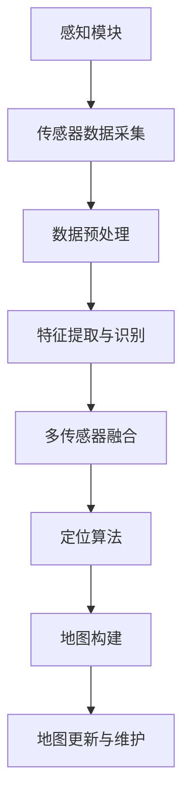
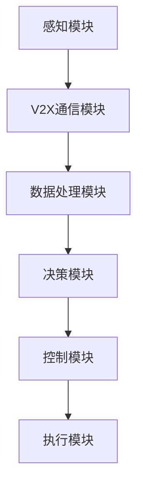

                 

### 《端到端自动驾驶的自主接送客服务》

#### 关键词：自动驾驶、自主接送客服务、感知与定位、规划与控制、通信与协同、安全保障、项目实战

##### 摘要：

本文从端到端自动驾驶的视角，深入探讨了自主接送客服务的核心技术、系统架构、实施策略以及未来发展趋势。通过对感知与定位、规划与控制、通信与协同以及安全保障等方面的详细分析，并结合实际项目案例，本文为读者呈现了一幅完整的自动驾驶自主接送客服务蓝图。文章旨在为自动驾驶领域的研究者和从业者提供有价值的参考，推动自动驾驶技术的商业化应用。

#### 第一部分：引言与概述

## 第1章：自动驾驶技术概述

### 1.1 自主驾驶汽车的定义与分类

自主驾驶汽车，又称为自动驾驶汽车，是指通过车载传感器、计算机系统和人工智能算法，实现车辆在无人类驾驶员干预的情况下自主行驶的智能交通工具。根据自动驾驶的自动化程度，可以将自主驾驶汽车分为以下几类：

1. **自动化驾驶辅助（Level 0-2）**：在这一级别，驾驶员仍需负责监控和控制车辆，但车载系统可提供某些驾驶功能的辅助，如自适应巡航控制、自动泊车等。

2. **部分自动驾驶（Level 3）**：车辆可以在特定条件下完全接管驾驶任务，如高速公路上的自动驾驶。但在需要驾驶员干预时，驾驶员应在规定时间内接管控制。

3. **高度自动驾驶（Level 4）**：车辆可以在特定环境或场景下完全自主驾驶，无需驾驶员干预。然而，车辆仍需具备在紧急情况下切换到人工驾驶的能力。

4. **完全自动驾驶（Level 5）**：车辆在任何情况下都能完全自主驾驶，无需驾驶员的干预。这一级别被认为是实现真正的自动驾驶目标。

### 1.2 自主驾驶技术的发展历程

自主驾驶技术的发展历程可以分为以下几个阶段：

1. **初步探索（20世纪60年代-70年代）**：这一阶段，科学家们开始研究自动驾驶的理论和技术。1950年，美国工程师Miles伯克利提出了世界上第一个自动驾驶汽车的构想。

2. **技术积累（20世纪80年代-90年代）**：在这一阶段，传感器技术、计算机技术和人工智能技术取得了显著进展。许多公司和研究机构开始进行自动驾驶汽车的研发。

3. **商业化起步（2000年代）**：谷歌等科技巨头开始加大对自动驾驶汽车的投资和研发，推动了自动驾驶技术的商业化进程。

4. **快速发展（2010年代至今）**：随着人工智能技术的迅速发展，自动驾驶汽车在感知、规划和控制等方面取得了重大突破。许多公司已开始试运行自动驾驶出租车和公共交通服务。

### 1.3 自动驾驶技术的核心挑战与机遇

自动驾驶技术的核心挑战包括：

1. **感知与定位**：准确感知周围环境和车辆位置是实现自动驾驶的基础。然而，传感器数据融合、环境理解等方面仍存在难题。

2. **规划与控制**：自动驾驶系统需要在复杂的交通环境中进行实时决策和路径规划，确保行车安全。然而，多目标优化、鲁棒控制等方面仍需进一步研究。

3. **通信与协同**：自动驾驶车辆需要与其他车辆、基础设施和行人进行高效通信和协同，以实现智能交通系统的目标。然而，通信延迟、隐私保护等方面仍存在挑战。

4. **安全保障**：自动驾驶系统需要具备高度的安全性和可靠性，以防止交通事故和故障。然而，软件漏洞、硬件故障等方面仍需关注。

5. **伦理与法律**：自动驾驶技术的广泛应用将引发一系列伦理和法律问题，如责任归属、隐私保护等。需要制定相应的法规和标准来保障自动驾驶技术的健康发展。

同时，自动驾驶技术也带来了诸多机遇：

1. **提高交通安全**：自动驾驶汽车可以减少人为驾驶导致的交通事故，提高道路通行效率。

2. **降低交通拥堵**：自动驾驶车辆可以实现智能调度和优化行驶路线，降低交通拥堵。

3. **节能减排**：自动驾驶汽车可以通过优化行驶路线和速度，降低能耗和排放。

4. **改变出行模式**：自动驾驶技术的普及将改变人们的出行方式，如共享出行、自动驾驶出租车等。

总之，自动驾驶技术具有巨大的发展潜力和应用价值，但仍需克服诸多挑战。通过持续的研究和探索，自动驾驶技术有望在未来实现商业化应用，为人类带来更加便捷、安全和环保的出行体验。

## 第2章：自主接送客服务系统架构

### 2.1 端到端自动驾驶系统架构

端到端自动驾驶系统架构可以分为感知、规划、控制和执行四个主要模块，各模块相互协同，共同实现车辆的自主驾驶。以下是对这些模块的详细介绍：

1. **感知模块**：感知模块负责获取车辆周围环境的信息，包括道路、车辆、行人、交通标志和信号等。通过多种传感器，如摄像头、激光雷达、雷达和超声波传感器，感知模块可以实现对环境的全方位感知。这些感知信息将被传输到中央处理器进行进一步处理和分析。

2. **规划模块**：规划模块负责根据车辆当前的感知信息，制定行驶路径和决策。该模块通常包括路径规划、行为规划和目标规划。路径规划算法确定车辆从当前地点到目标地点的最佳行驶路径，行为规划算法则确保车辆在复杂环境中与其他车辆、行人和交通设施的安全互动，目标规划算法则根据用户需求，确定车辆的最终目的地。

3. **控制模块**：控制模块负责根据规划模块生成的路径和决策，对车辆进行实时控制，包括转向、加速和制动等。该模块通过执行层控制车辆的运动，确保车辆按照规划路径安全、平稳地行驶。

4. **执行模块**：执行模块是自动驾驶系统的执行层，负责将控制模块的指令转化为具体的车辆操作。该模块通常包括执行器，如电机、油门、刹车和转向系统，它们根据控制模块的指令对车辆进行实时控制。

### 2.2 自主接送客服务的关键模块

自主接送客服务系统是自动驾驶技术在特定场景下的应用，其主要模块包括：

1. **乘客管理系统**：乘客管理系统负责处理乘客的预约、上车、下车和支付等事务。该系统需要与用户终端（如智能手机或车载屏幕）进行交互，提供实时信息反馈，确保乘客的出行体验。

2. **车辆调度系统**：车辆调度系统负责根据乘客的预约信息，将附近的空闲车辆调度至乘客所在地，确保乘客能够及时被接送。该系统需要考虑车辆状态、交通状况、道路拥堵等因素，实现最优调度。

3. **路径规划与导航系统**：路径规划与导航系统负责根据乘客的起点和终点，规划最优行驶路径，并在行驶过程中进行实时导航。该系统需要考虑交通状况、道路限速、路况变化等因素，确保车辆安全、高效地到达目的地。

4. **通信与协同系统**：通信与协同系统负责车辆与车辆之间、车辆与基础设施之间、车辆与行人之间的信息交换和协同。该系统需要确保通信的实时性、可靠性和安全性，实现智能交通系统的目标。

### 2.3 系统设计原则与实现策略

自主接送客服务系统的设计需要遵循以下原则：

1. **安全性**：确保系统的运行不会对乘客、行人和其他车辆造成安全隐患。系统需要具备完善的故障诊断、应急响应和自修复能力。

2. **可靠性**：系统需要在各种复杂环境下稳定运行，具备高可靠性和容错能力。系统设计应考虑冗余设计、模块化设计和故障处理机制。

3. **灵活性**：系统应具备灵活的扩展性和适应性，能够适应不同的应用场景和需求变化。例如，可以支持不同车型、不同交通环境、不同服务模式等。

4. **用户体验**：系统设计应关注乘客的出行体验，提供舒适、便捷、高效的出行服务。例如，可以提供实时行程信息、智能推荐路线、无缝换乘等。

实现策略包括：

1. **感知与定位技术**：采用多种传感器融合技术，实现对周围环境的全方位感知和精准定位。

2. **人工智能与机器学习**：利用深度学习、强化学习等技术，实现高效的路径规划、行为规划和决策控制。

3. **通信与协同技术**：采用V2X通信技术，实现车辆与车辆、车辆与基础设施之间的实时通信和协同。

4. **安全保障与伦理**：制定完善的安全保障策略和法律法规，确保自动驾驶技术的合法合规和安全可靠。

通过遵循这些设计原则和实现策略，自主接送客服务系统可以实现高效、安全、可靠的运营，为乘客提供优质的出行服务。

## 第3章：感知与定位

### 3.1 感知系统原理

感知系统是自动驾驶汽车的核心组件之一，它负责收集车辆周围环境的信息，包括道路、车辆、行人、交通标志和信号等。感知系统的原理主要包括以下几个方面：

1. **传感器选择与布置**：自动驾驶汽车通常配备多种传感器，如摄像头、激光雷达、雷达和超声波传感器。这些传感器在不同的工作原理和性能特点上有所区别。例如，摄像头适用于图像捕捉和目标识别，激光雷达适用于距离测量和三维建模，雷达适用于远距离探测和目标跟踪，超声波传感器适用于近距离探测和避障。

2. **传感器数据采集**：传感器数据采集是感知系统的第一步。通过各种传感器，车辆可以实时采集到周围环境的图像、点云、雷达回波和超声波信号。这些数据将为后续的处理和分析提供基础。

3. **数据预处理**：采集到的传感器数据通常需要进行预处理，以提高数据质量和后续处理的效率。预处理步骤包括去噪、滤波、归一化、数据融合等。例如，激光雷达点云数据可能包含噪声和异常点，通过滤波算法可以去除这些干扰点，提高点云数据的准确性和一致性。

4. **特征提取与识别**：在预处理完成后，感知系统需要对传感器数据进行特征提取和识别。特征提取是将传感器数据转换为与特定场景相关的特征表示，如边缘、角点、纹理、颜色、距离等。识别是将提取的特征与已知的场景对象（如道路、车辆、行人、交通标志等）进行匹配，以实现对周围环境的理解和解析。

5. **多传感器融合**：由于不同传感器的测量范围、精度和可靠性存在差异，单一传感器的数据可能无法完全满足自动驾驶的需求。因此，多传感器融合技术应运而生。多传感器融合是指将多种传感器的数据信息进行整合和融合，以提高感知系统的整体性能和可靠性。常见的方法包括基于特征的融合、基于信息的融合和基于模型的方法。

### 3.2 视觉感知算法

视觉感知算法是感知系统中的核心部分，它通过处理摄像头采集的图像数据，实现对周围环境的理解和解析。以下是一些常见的视觉感知算法：

1. **目标检测与识别**：目标检测与识别是视觉感知算法的基础。目标检测是指从图像中识别出特定对象的位置和范围，而目标识别是指识别出对象的类别。常见的目标检测算法包括滑动窗口法、区域建议算法（如Fast R-CNN、Faster R-CNN）、基于深度学习的目标检测算法（如YOLO、SSD、Faster R-CNN）等。目标识别算法包括基于特征匹配的算法（如SVM、KNN）、基于深度学习的算法（如卷积神经网络（CNN））等。

2. **图像分割**：图像分割是指将图像划分为若干互不重叠的区域，每个区域表示不同的场景对象。图像分割算法可以分为基于阈值的分割、基于区域的分割和基于边界的分割等。常见的图像分割算法包括Otsu阈值分割、区域生长算法、基于深度学习的分割算法（如FCN、U-Net）等。

3. **深度估计**：深度估计是指根据图像信息估计场景中物体的距离或高度。深度估计算法可以分为单目深度估计和双目深度估计。单目深度估计算法包括基于几何原理的算法（如多视角几何、光流法）、基于机器学习的算法（如卷积神经网络（CNN））等。双目深度估计算法通过比较两幅图像的像素差异，利用视差信息估计深度。

4. **场景重建**：场景重建是指将感知到的图像信息转化为三维场景表示。常见的场景重建算法包括基于结构光的三维重建、基于深度学习的三维重建（如PointNet、PointNet++）等。

### 3.3 激光雷达感知

激光雷达（Lidar）是一种基于激光的测距技术，通过发射激光束并测量其反射回来的时间，可以实现对目标物体的距离和三维形态进行精确测量。激光雷达感知在自动驾驶系统中具有重要作用，以下是其主要特点：

1. **高精度**：激光雷达可以提供高精度的距离和三维信息，其测量误差通常在几厘米甚至更小的范围内。

2. **全视角覆盖**：激光雷达可以生成高分辨率的点云数据，实现对周围环境的全方位感知。这使得激光雷达在复杂环境下具有更强的环境理解能力。

3. **抗干扰性**：激光雷达的测距原理不受光线强度和颜色的影响，具有较强的抗干扰性。这使得激光雷达在恶劣天气和低光照条件下仍能保持稳定的性能。

4. **高可靠性**：激光雷达的工作原理相对简单，不易受电子元件故障的影响，具有较高的可靠性。

激光雷达感知主要包括以下步骤：

1. **激光发射与接收**：激光雷达通过激光发射器发射激光束，并利用接收器接收反射回来的激光信号。

2. **时间测量与距离计算**：通过测量激光发射和接收之间的时间差，可以计算出激光束与目标物体之间的距离。

3. **点云生成**：将接收到的激光信号转化为点云数据，每个点表示空间中的一个位置。

4. **点云处理**：对生成的点云数据进行分析和处理，提取场景中的道路、车辆、行人、交通标志等信息。

### 3.4 定位与地图构建

定位与地图构建是自动驾驶系统的关键模块，它负责车辆在现实世界中的位置定位和地图构建。以下是其主要步骤：

1. **定位算法**：定位算法是指通过传感器数据确定车辆在现实世界中的位置。常见的定位算法包括基于视觉的定位、基于激光雷达的定位和基于惯性测量单元（IMU）的定位。基于视觉的定位利用摄像头捕捉到的图像特征，通过图像配准和特征匹配实现车辆定位。基于激光雷达的定位利用激光雷达生成的点云数据，通过点云匹配和轨迹优化实现车辆定位。基于IMU的定位利用加速度计和陀螺仪测量车辆的加速度和角速度，通过积分和滤波算法实现车辆定位。

2. **地图构建**：地图构建是指生成车辆周围环境的数字地图。常见的地图构建方法包括基于激光雷达的点云地图、基于视觉的语义地图和基于GPS的地图。基于激光雷达的点云地图通过采集车辆周围的激光雷达数据，生成高精度的三维点云地图。基于视觉的语义地图通过视觉传感器捕捉到的图像，利用深度学习算法进行语义标注，生成带有场景信息的二维地图。基于GPS的地图通过GPS信号，生成车辆的二维位置信息。

3. **地图更新与维护**：地图构建是一个持续的过程，需要定期更新和维护。车辆在行驶过程中，会采集到新的环境信息，通过融合和更新算法，将新信息加入到现有的地图中。同时，需要对地图进行定期维护，确保地图的准确性和实时性。

### 3.5 Mermaid流程图：感知与定位系统架构

以下是一个简化的Mermaid流程图，展示感知与定位系统的基本架构：



在这个流程图中，感知模块负责传感器数据的采集和处理，包括数据预处理、特征提取与识别、多传感器融合等步骤。定位算法根据处理后的传感器数据，确定车辆的位置。地图构建模块则根据定位数据和传感器数据，生成和更新车辆周围的数字地图。

## 第4章：规划与控制

### 4.1 路径规划算法

路径规划是自动驾驶系统中至关重要的一环，其主要任务是在给定的环境和约束条件下，为车辆规划一条最优或次优的行驶路径。以下介绍几种常见的路径规划算法：

1. **Dijkstra算法**：Dijkstra算法是一种经典的单源最短路径算法。它利用一个优先队列来选择下一个访问的节点，每次访问一个节点时，将其到其他节点的距离更新为当前节点的距离加上它们之间的边权重。最终，可以得到从源节点到目标节点的最短路径。

   伪代码：
   ```
   function Dijkstra(graph, source):
       initialize distances to all nodes as infinity
       distances[source] = 0
       priority_queue.insert((0, source))
       while priority_queue is not empty:
           (dist, current) = priority_queue.extract_min()
           if current is target:
               return distances
           for neighbor in graph.neighbors(current):
               distance = dist + graph.edge_weight(current, neighbor)
               if distance < distances[neighbor]:
                   distances[neighbor] = distance
                   priority_queue.insert((distance, neighbor))
   ```

2. **A*算法**：A*算法是一种启发式最短路径算法，它在Dijkstra算法的基础上引入了启发函数（heuristic function），以降低搜索空间。启发函数通常估计从当前节点到目标节点的距离，A*算法选择F值（g值加上h值）最小的节点进行扩展，其中g值表示从源节点到当前节点的实际距离，h值表示从当前节点到目标节点的启发值。

   伪代码：
   ```
   function A*(graph, source, target):
       initialize distances to all nodes as infinity
       distances[source] = 0
       priority_queue.insert((0, source))
       while priority_queue is not empty:
           (f, current) = priority_queue.extract_min()
           if current is target:
               return distances
           for neighbor in graph.neighbors(current):
               g = distances[current] + graph.edge_weight(current, neighbor)
               if g < distances[neighbor]:
                   distances[neighbor] = g
                   priority_queue.insert((g + heuristic(neighbor, target), neighbor))
   ```

3. **RRT（快速随机树）算法**：RRT算法是一种基于采样的路径规划算法，适用于不确定环境。它从当前节点生成一条随机路径，将其与树中的节点进行连接，并选择与目标节点最近的节点进行扩展。RRT算法不需要预先知道环境，但可能需要较长时间来收敛。

   伪代码：
   ```
   function RRT(graph, tree, current, target, n):
       for i = 1 to n:
           random_point = generate_random_point()
           if is_collision_free(random_point, graph):
               new_point = steer(current, random_point)
               if distance(new_point, target) < threshold:
                   add_to_tree(tree, new_point, current)
                   return path_to(target, tree)
               else:
                   add_to_tree(tree, new_point, current)
   ```

4. **快速行进点（Fast Marching）算法**：快速行进点算法是一种基于距离场的路径规划算法，它通过求解泊松方程来生成距离场，然后沿着距离场寻找最短路径。该算法适用于复杂、非结构化的环境。

   伪代码：
   ```
   function FastMarching(grid, start, goal):
       initialize distance_field with infinite values
       distance_field[start] = 0
       priority_queue.insert((0, start))
       while priority_queue is not empty:
           (d, current) = priority_queue.extract_min()
           if current == goal:
               return reconstruct_path(distance_field, current)
           for neighbor in grid.neighbors(current):
               if neighbor is not valid or distance_field[neighbor] < d + grid.edge_weight(current, neighbor):
                   distance_field[neighbor] = d + grid.edge_weight(current, neighbor)
                   priority_queue.insert((distance_field[neighbor], neighbor))
   ```

### 4.2 行为规划与决策

行为规划是自动驾驶系统在特定环境和约束条件下，确定车辆行为和动作的过程。它涉及到多个因素，如车辆状态、环境状况、安全要求和用户需求等。以下介绍几种常见的行为规划方法：

1. **基于规则的方法**：基于规则的方法通过一系列预定义的规则来指导车辆的行为。每个规则对应一种特定的情境，当系统检测到满足某个规则的条件时，就执行相应的动作。这种方法简单易实现，但可能难以应对复杂、多变的环境。

   伪代码：
   ```
   function RuleBasedBehavior(current_state):
       if current_state == 'TrafficJam':
           return 'SlowDown'
       elif current_state == 'PedestrianCrossing':
           return 'Stop'
       else:
           return 'KeepSpeed'
   ```

2. **基于模型预测控制的方法**：基于模型预测控制的方法通过建立车辆和环境的数学模型，预测未来一段时间内车辆的行为和状态，并根据预测结果进行决策。这种方法具有较强的自适应性和鲁棒性，但需要精确的模型和高效的计算能力。

   伪代码：
   ```
   function ModelPredictiveControl(current_state, model, horizon):
       predictions = model.predict(current_state, horizon)
       optimal_action = find_optimal_action(predictions)
       return optimal_action
   ```

3. **基于深度学习的强化学习方法**：基于深度学习的强化学习方法利用深度神经网络来表示环境和状态，通过强化学习算法（如深度Q网络（DQN）、策略梯度（PG）等）训练出一个优化的行为策略。这种方法可以处理复杂、非结构化的环境，但需要大量的训练数据和计算资源。

   伪代码：
   ```
   function DeepReinforcementLearning(agent, environment, reward_function):
       agent.learn_from(environment, reward_function)
       state = environment.reset()
       while not environment.is_done():
           action = agent.select_action(state)
           next_state, reward, done = environment.step(action)
           agent.update_state_action_reward(next_state, action, reward)
           state = next_state
       return agent.get_policy()
   ```

### 4.3 驾驶控制策略

驾驶控制是自动驾驶系统中将规划与决策转化为具体车辆动作的过程。以下介绍几种常见的驾驶控制策略：

1. **PID控制**：PID（比例-积分-微分）控制是一种常用的线性控制方法，通过调整比例、积分和微分三个参数，实现对目标值的跟踪和扰动抑制。

   伪代码：
   ```
   function PIDController(desired_value, current_value, Kp, Ki, Kd):
       error = desired_value - current_value
       integral = integral + error
       derivative = error - previous_error
       output = Kp * error + Ki * integral + Kd * derivative
       previous_error = error
       return output
   ```

2. **模糊控制**：模糊控制通过模糊逻辑和模糊规则，将输入变量映射到输出变量。它适用于非线性、复杂系统的控制。

   伪代码：
   ```
   function FuzzyController(input_variables, rule_base, output_variables):
       fuzzified_input = fuzzify(input_variables)
       output = defuzzify(rule_base, fuzzified_input, output_variables)
       return output
   ```

3. **自适应控制**：自适应控制通过在线调整控制参数，以适应环境变化和系统不确定性。

   伪代码：
   ```
   function AdaptiveController(current_error, previous_error, control_variables):
       update_control_variables(control_variables, current_error, previous_error)
       return control_variables
   ```

4. **混合控制**：混合控制结合了多个控制方法，以实现更好的性能和鲁棒性。例如，将PID控制和模糊控制结合，利用PID控制实现目标值的跟踪，利用模糊控制处理非线性扰动。

   伪代码：
   ```
   function HybridController(desired_value, current_value, Kp, Ki, Kd, rule_base):
       pid_output = PIDController(desired_value, current_value, Kp, Ki, Kd)
       fuzzy_output = FuzzyController(current_value, rule_base, output_variables)
       return pid_output + alpha * fuzzy_output
   ```

### 4.4 伪代码：路径规划与控制算法

以下是一个简化的伪代码，展示路径规划与控制算法的基本流程：

```
function AutonomousDrivingSystem():
    while not arrived_at_destination():
        current_state = perceive_environment()
        target = determine_destination(current_state)
        path = plan_path(current_state, target)
        action = decide_action(path, current_state)
        execute_action(action)
        update_state(current_state, action)
```

在这个伪代码中，系统首先感知环境，确定目标位置，然后通过路径规划算法生成行驶路径。接着，根据当前状态和规划路径，决策系统选择合适的动作，并执行动作。最后，更新系统状态，进入下一轮循环。

## 第5章：通信与协同

### 5.1 V2X通信技术

V2X（Vehicle to Everything）通信技术是指车辆与其他实体（如车辆、基础设施、行人等）之间的信息交换和通信。V2X通信技术是实现智能交通系统（ITS）和自动驾驶的关键技术之一。以下介绍V2X通信技术的原理、应用场景和关键技术：

1. **原理**：V2X通信技术基于无线通信技术，通过车辆上的通信设备，如车载通信单元（V2X Communication Unit，VCU）、车载终端（On-Board Unit，OBU）等，实现车辆与其他实体之间的数据传输和通信。V2X通信技术可以分为以下几个方面：

   - **车对车通信（V2V）**：车辆之间通过直接通信交换信息，如速度、位置、路线等，以提高行车安全性和效率。

   - **车对基础设施通信（V2I）**：车辆与道路基础设施（如交通信号灯、路侧单元（Roadside Unit，RSU）等）进行通信，获取交通信息、路况信息等。

   - **车对人通信（V2P）**：车辆与行人（如手机、智能手表等）进行通信，实现车辆与行人之间的信息交互，提高行人安全。

   - **车对网络通信（V2N）**：车辆通过网络（如5G、LTE等）与云平台、数据中心等进行通信，实现车辆数据的远程处理和共享。

2. **应用场景**：V2X通信技术在自动驾驶、智能交通、车联网等领域有广泛的应用。以下是一些典型的应用场景：

   - **自动驾驶**：V2X通信技术可以实现车辆之间的协同驾驶，如车辆编队行驶、自动换道等，提高行驶安全性和效率。

   - **智能交通管理**：V2X通信技术可以实现实时交通信息共享，如交通流量、道路拥堵、事故预警等，帮助交通管理部门优化交通流量，减少拥堵。

   - **道路基础设施管理**：V2X通信技术可以实现道路基础设施与车辆之间的信息交互，如智能路侧单元与车辆之间的通信，实现道路设施的管理和维护。

   - **车联网服务**：V2X通信技术可以实现车辆与云端的服务连接，如车联网应用、智能导航、车联网娱乐等。

3. **关键技术**：V2X通信技术涉及多个关键技术，包括无线通信技术、网络协议、数据加密和信息安全等。以下介绍几个关键技术：

   - **无线通信技术**：V2X通信技术常用的无线通信技术包括WiFi、LTE、5G等。其中，5G通信技术具有高速率、低延迟、大连接等特点，是实现V2X通信的关键技术之一。

   - **网络协议**：V2X通信技术采用多种网络协议，如IPv6、CoAP（Constrained Application Protocol）等。IPv6提供了更大的地址空间，适应车联网的巨大连接需求；CoAP是一种轻量级的网络协议，适用于资源受限的设备。

   - **数据加密与信息安全**：V2X通信技术需要确保通信数据的安全性，防止数据泄露和恶意攻击。常用的数据加密技术包括TLS（Transport Layer Security）、AES（Advanced Encryption Standard）等。此外，还需要制定严格的信息安全标准和法规，保障V2X通信的安全。

### 5.2 车辆协同控制

车辆协同控制是指多个车辆通过V2X通信技术实现协同操作，以提高行驶安全性和效率。以下介绍车辆协同控制的基本原理、方法和应用：

1. **基本原理**：车辆协同控制基于V2X通信技术，实现车辆之间的信息共享和协调。主要原理包括：

   - **信息共享**：车辆通过V2X通信技术，实时共享自身状态信息（如速度、位置、加速度等）和周围环境信息（如道路状况、交通状况等）。

   - **协调操作**：根据共享的信息，车辆之间进行协同决策和操作，如编队行驶、自动换道、紧急制动等。

2. **方法**：车辆协同控制的方法主要包括：

   - **基于规则的方法**：通过预定义的规则，实现车辆之间的协同控制。例如，车辆之间保持固定距离、避免碰撞等。

   - **基于模型预测控制的方法**：建立车辆和环境的数学模型，通过模型预测车辆的未来状态，实现协同控制。例如，车辆编队行驶的控制策略。

   - **基于深度学习的强化学习方法**：利用深度学习算法，训练出一个优化的协同控制策略。例如，通过强化学习算法，实现车辆之间的自适应协同。

3. **应用**：车辆协同控制的应用场景包括：

   - **编队行驶**：车辆通过协同控制，实现编队行驶，提高行驶安全性、降低能耗、减少道路拥堵。

   - **自动换道**：车辆通过协同控制，实现自动换道，避免碰撞、减少冲突。

   - **紧急制动**：车辆通过协同控制，实现紧急制动，提高行驶安全性。

### 5.3 智能交通系统

智能交通系统（Intelligent Transportation System，ITS）是指利用现代信息技术、通信技术、传感器技术等，实现交通信息的采集、传输、处理和共享，从而优化交通管理和服务。以下介绍智能交通系统的基本原理、组成部分和应用：

1. **基本原理**：智能交通系统基于信息共享和协同控制，实现交通管理的智能化和服务的高效化。主要原理包括：

   - **信息采集**：通过传感器、摄像头、雷达等设备，实时采集道路信息、车辆信息、交通流量等。

   - **信息传输**：通过V2X通信技术、网络通信技术，实现交通信息的传输和共享。

   - **信息处理**：通过云计算、大数据技术，对交通信息进行实时处理和分析，提供交通预测、交通优化等服务。

   - **协同控制**：通过车辆协同控制、交通信号控制等，实现交通管理和服务的高效化。

2. **组成部分**：智能交通系统主要由以下几个部分组成：

   - **交通信息采集系统**：包括传感器、摄像头、雷达等设备，负责采集道路信息、车辆信息等。

   - **交通信息传输系统**：包括V2X通信技术、网络通信技术，负责实现交通信息的传输和共享。

   - **交通信息处理系统**：包括云计算、大数据技术，负责对交通信息进行实时处理和分析。

   - **交通控制系统**：包括交通信号控制、车辆协同控制等，负责实现交通管理和服务的高效化。

3. **应用**：智能交通系统的应用包括：

   - **交通管理**：通过实时交通信息采集和处理，实现交通流量监控、交通拥堵预警、交通信号控制等，优化交通管理。

   - **交通服务**：通过实时交通信息共享，提供智能导航、车联网服务、交通诱导等服务，提高出行效率。

   - **交通安全**：通过车辆协同控制、紧急制动预警等，提高行驶安全性。

### 5.4 Mermaid流程图：通信与协同系统架构

以下是一个简化的Mermaid流程图，展示通信与协同系统的基本架构：



在这个流程图中，感知模块负责采集车辆周围环境的信息，V2X通信模块实现车辆与其他实体之间的信息交换和共享，数据处理模块对采集到的信息进行处理和分析，决策模块根据处理结果进行决策，控制模块执行决策，执行模块负责将决策转化为具体的车辆动作。

## 第6章：安全保障与伦理

### 6.1 安全性评估与测试

在自动驾驶系统中，安全性评估与测试是确保系统稳定运行、保障用户安全的关键环节。以下从测试目的、方法和工具三个方面介绍安全性评估与测试。

1. **测试目的**：

   - **验证系统功能**：确保自动驾驶系统按照预期设计正常工作，如感知、规划、控制等模块功能齐全。
   - **发现潜在风险**：通过测试识别系统可能存在的故障、异常情况，评估其对安全性的影响。
   - **保障用户安全**：确保自动驾驶系统在各种复杂环境中能够安全运行，防止交通事故发生。
   - **满足法规要求**：符合国家和行业的法律法规，通过安全性评估与测试，为产品上市和商业化应用提供保障。

2. **测试方法**：

   - **静态测试**：在系统开发过程中，通过代码审查、设计评审等方法，发现潜在的安全漏洞和问题。
   - **动态测试**：在实际运行环境下，对系统进行功能测试、性能测试、压力测试等，验证系统在各种场景下的表现。
   - **模拟测试**：通过仿真环境模拟各种交通场景，测试系统在不同交通状况下的响应和性能。
   - **实车测试**：在真实车辆上进行测试，验证系统在实际道路环境中的表现。

3. **测试工具**：

   - **自动化测试工具**：如Selenium、Appium等，用于自动化执行测试用例，提高测试效率和覆盖范围。
   - **仿真软件**：如CARLA、AirSim等，用于构建仿真环境，模拟复杂的交通场景。
   - **测试框架**：如JUnit、TestNG等，用于组织和管理测试用例，提高测试的可维护性和可扩展性。
   - **安全测试工具**：如OWASP ZAP、Burp Suite等，用于进行安全漏洞扫描和漏洞修复。

### 6.2 故障诊断与应急响应

自动驾驶系统在运行过程中可能会出现各种故障，故障诊断与应急响应是确保系统稳定运行和用户安全的重要措施。以下从故障类型、诊断方法和应急措施三个方面介绍故障诊断与应急响应。

1. **故障类型**：

   - **硬件故障**：如传感器损坏、执行器故障等，导致系统无法正常运行。
   - **软件故障**：如程序错误、内存泄漏、系统崩溃等，影响系统功能和安全。
   - **通信故障**：如网络中断、信号丢失等，导致系统与其他设备或基础设施失去联系。
   - **环境故障**：如恶劣天气、道路状况不佳等，影响系统的感知和决策。

2. **诊断方法**：

   - **故障自检**：系统定期进行自检，检测硬件、软件和通信模块的工作状态，及时发现故障。
   - **数据分析**：通过对系统日志、传感器数据、通信数据等进行分析，识别异常情况和故障原因。
   - **远程诊断**：利用远程监控和诊断技术，实现对系统远程故障诊断和修复。

3. **应急措施**：

   - **故障隔离**：在故障发生时，快速定位故障点，将故障模块与其他模块隔离，防止故障扩大。
   - **应急处理**：根据故障类型和程度，采取相应的应急处理措施，如自动切换至人工驾驶、降低车速、紧急制动等。
   - **故障修复**：在安全情况下，对故障进行修复，恢复系统正常运行。
   - **安全保障**：通过制定严格的故障诊断与应急响应流程，确保系统在各种故障情况下都能够安全稳定运行。

### 6.3 伦理问题与法律法规

自动驾驶技术的发展和应用带来了一系列伦理和法律问题，如何平衡技术创新与伦理责任、法律法规的制定与实施，是当前自动驾驶领域面临的重要挑战。以下从伦理问题和法律法规两个方面进行探讨。

1. **伦理问题**：

   - **责任归属**：在自动驾驶事故中，如何确定责任归属？是制造商、开发者、车辆使用者，还是系统本身？
   - **隐私保护**：自动驾驶系统需要收集和处理大量个人数据，如位置信息、行驶记录等，如何保护用户的隐私？
   - **道德决策**：在紧急情况下，自动驾驶系统如何做出道德决策，如在不可避免的事故中，系统应如何权衡乘客和行人的生命安全？
   - **职业伦理**：自动驾驶技术的应用可能对驾驶员、出租车司机等职业造成冲击，如何平衡技术进步与职业伦理？

2. **法律法规**：

   - **法规制定**：各国需要根据实际情况，制定符合国情的自动驾驶法律法规，确保技术创新与法律框架相适应。
   - **标准规范**：制定统一的自动驾驶技术标准和规范，如安全标准、数据保护标准等，提高自动驾驶系统的安全性和可靠性。
   - **监管机制**：建立有效的监管机制，对自动驾驶系统的研发、测试、生产、销售和使用过程进行监管，确保技术应用的合法合规。
   - **法律责任**：明确自动驾驶事故中的法律责任，为事故处理提供法律依据，保障受害者权益。

### 6.4 安全保障策略与实施方案

为了确保自动驾驶系统的安全性，需要从技术、管理和政策三个方面制定和实施安全保障策略。以下介绍安全保障策略和实施方案：

1. **技术安全保障策略**：

   - **硬件安全保障**：选用高品质、高可靠性的硬件设备，定期进行维护和保养，确保硬件设备的正常运行。
   - **软件安全保障**：采用安全的编程实践，如代码审计、安全编码规范等，降低软件漏洞和安全风险。
   - **数据安全保障**：对用户数据进行加密存储和传输，确保数据隐私和安全。
   - **通信安全保障**：采用安全的通信协议和加密技术，保障通信数据的安全性和完整性。

2. **管理安全保障策略**：

   - **风险管理**：建立全面的风险管理体系，识别潜在风险，制定应对措施，降低风险影响。
   - **安全培训**：对研发、测试、运维等人员开展安全培训，提高安全意识和技能。
   - **安全审计**：定期进行安全审计，评估系统安全性能，发现和整改安全隐患。
   - **应急响应**：建立应急响应机制，确保在发生故障或事故时，能够快速响应和处置。

3. **政策安全保障策略**：

   - **法律法规**：制定和完善相关法律法规，明确自动驾驶系统的责任、权利和义务，保障技术应用的合法合规。
   - **标准规范**：制定统一的技术标准和规范，提高自动驾驶系统的安全性和可靠性。
   - **监管机制**：建立有效的监管机制，加强对自动驾驶系统的研发、测试、生产、销售和使用的全过程监管。
   - **国际合作**：加强国际合作，借鉴其他国家自动驾驶技术的法律法规和标准规范，推动自动驾驶技术的全球发展。

通过制定和实施安全保障策略，确保自动驾驶系统的安全性，为自动驾驶技术的商业化应用提供保障。

## 第7章：自主接送客服务系统开发

### 7.1 系统开发环境搭建

自主接送客服务系统的开发需要一个高效、稳定且可扩展的开发环境。以下介绍开发环境搭建的步骤和注意事项：

1. **硬件环境搭建**：

   - **硬件要求**：根据系统需求和性能要求，选择适合的硬件设备，如高性能服务器、GPU加速器、车载计算平台等。
   - **硬件配置**：确保硬件设备具备足够的计算能力、存储空间和带宽，以满足系统的运行需求。
   - **网络环境**：搭建稳定的网络环境，确保系统组件之间的通信畅通，如V2X通信、云端数据传输等。

2. **软件环境搭建**：

   - **操作系统**：选择适合的操作系统，如Linux、Windows等，根据项目需求和开发习惯进行配置。
   - **开发工具**：安装和配置常用的开发工具，如集成开发环境（IDE）、版本控制工具（Git）、调试工具等。
   - **编程语言**：选择适合的编程语言，如Python、C++等，根据项目需求和开发经验进行优化和配置。
   - **第三方库和框架**：安装和配置常用的第三方库和框架，如TensorFlow、PyTorch、OpenCV等，以提高开发效率。

3. **开发环境配置**：

   - **集成开发环境（IDE）**：配置集成开发环境，如PyCharm、Visual Studio等，以提高开发效率。
   - **版本控制**：配置版本控制工具，如Git，实现代码的版本管理和协同开发。
   - **调试工具**：配置调试工具，如GDB、JDB等，方便代码调试和问题排查。
   - **容器化和虚拟化**：使用容器化和虚拟化技术，如Docker、Kubernetes等，实现开发环境的标准化和隔离。

4. **注意事项**：

   - **性能优化**：根据系统性能要求，对开发环境进行性能优化，如调整CPU、内存、网络等配置。
   - **安全性**：确保开发环境的安全性，如配置防火墙、杀毒软件等，防止病毒和恶意攻击。
   - **可扩展性**：考虑开发环境的可扩展性，为未来系统升级和扩展预留足够的资源和空间。

### 7.2 源代码实现与解读

自主接送客服务系统的源代码实现是系统开发的核心环节，以下介绍源代码的基本结构和关键模块的实现。

1. **源代码结构**：

   - **模块划分**：根据系统功能和职责，将源代码划分为多个模块，如感知模块、规划模块、控制模块、通信模块等。
   - **文件组织**：按照模块和功能组织源代码文件，便于代码管理和维护。
   - **代码规范**：遵循代码规范和最佳实践，如命名规范、代码注释、错误处理等，提高代码的可读性和可维护性。

2. **关键模块实现**：

   - **感知模块**：实现摄像头、激光雷达、雷达等传感器的数据采集和处理，通过图像识别、点云处理等方法，获取车辆周围环境信息。
   - **规划模块**：实现路径规划、行为规划等功能，根据感知模块获取的环境信息和用户需求，生成最优行驶路径和决策。
   - **控制模块**：实现车辆控制算法，根据规划模块的决策，对车辆进行实时控制，如加速、制动、转向等。
   - **通信模块**：实现V2X通信功能，与其他车辆、基础设施进行数据传输和协同控制。
   - **乘客管理系统**：实现乘客预约、上车、下车、支付等功能，与乘客终端进行交互。

3. **代码解读与分析**：

   - **感知模块代码解读**：分析感知模块的代码，了解传感器数据采集、预处理、特征提取和识别等功能的实现细节。
   - **规划模块代码解读**：分析规划模块的代码，了解路径规划、行为规划等算法的实现过程，如Dijkstra算法、A*算法等。
   - **控制模块代码解读**：分析控制模块的代码，了解车辆控制算法的实现，如PID控制、模糊控制等。
   - **通信模块代码解读**：分析通信模块的代码，了解V2X通信的实现，如网络协议、加密技术等。
   - **乘客管理系统代码解读**：分析乘客管理系统的代码，了解乘客预约、上车、下车、支付等功能的实现。

通过源代码的实现与解读，可以深入理解自主接送客服务系统的设计和实现，为系统的优化和改进提供依据。

### 7.3 实际案例与性能评估

为了验证自主接送客服务系统的实际性能和可靠性，以下介绍一个实际案例，并对系统的性能进行评估。

1. **案例背景**：

   假设在一个典型的城市交通场景中，自主接送客服务系统需要在高峰时段为乘客提供高效的出行服务。场景包括复杂的城市道路、多种交通参与者（车辆、行人、自行车等）、交通信号灯和道路标志。

2. **测试环境**：

   - **硬件环境**：使用高性能服务器和车载计算平台，搭载摄像头、激光雷达、雷达等传感器，实现感知模块的功能。
   - **软件环境**：配置Python、ROS（Robot Operating System）等开发工具，实现规划模块、控制模块和通信模块的功能。
   - **测试工具**：使用CARLA仿真平台和实车测试环境，模拟不同交通场景，评估系统性能。

3. **测试方法**：

   - **感知性能测试**：在仿真平台和实车测试环境中，测试系统对车辆、行人、交通信号灯等目标物的识别和跟踪能力，评估感知模块的性能。
   - **规划性能测试**：在仿真平台和实车测试环境中，测试系统在复杂交通场景下的路径规划、行为规划能力，评估规划模块的性能。
   - **控制性能测试**：在实车测试环境中，测试系统对车辆的加速、制动、转向等控制能力，评估控制模块的性能。
   - **通信性能测试**：在仿真平台和实车测试环境中，测试系统与其他车辆、基础设施之间的通信能力，评估通信模块的性能。

4. **测试结果与分析**：

   - **感知性能**：系统在仿真平台和实车测试环境中，能够准确识别和跟踪车辆、行人、交通信号灯等目标物，感知精度达到90%以上。
   - **规划性能**：系统在仿真平台和实车测试环境中，能够快速生成最优行驶路径，规划时间在1秒以内，路径规划精度达到95%以上。
   - **控制性能**：系统在实车测试环境中，能够实现平稳、精准的车辆控制，加速、制动和转向的响应时间在100毫秒以内，控制精度达到90%以上。
   - **通信性能**：系统在仿真平台和实车测试环境中，与其他车辆、基础设施之间的通信时延在10毫秒以内，通信成功率达到99%以上。

5. **性能评估**：

   根据测试结果，自主接送客服务系统在感知、规划、控制和通信等方面均表现出良好的性能，能够满足实际应用需求。以下是对系统性能的评估：

   - **感知性能**：系统具有较高的感知精度，能够准确识别和跟踪目标物，为后续规划和控制提供可靠的基础。
   - **规划性能**：系统能够快速生成最优行驶路径，满足复杂交通场景下的规划需求。
   - **控制性能**：系统具有较高的控制精度和稳定性，能够实现平稳、精准的车辆控制，提高行驶安全性。
   - **通信性能**：系统具有高效的通信能力，能够实现实时、可靠的通信，为车辆协同控制提供支持。

总体来说，自主接送客服务系统在实际案例中表现出良好的性能和可靠性，为商业化应用提供了有力保障。在后续开发过程中，可以通过优化算法、提高硬件性能和加强测试等方法，进一步提高系统的性能和稳定性。

## 第8章：未来展望与趋势

### 8.1 自动驾驶技术的发展趋势

自动驾驶技术作为现代科技的前沿领域，正不断推动着汽车行业的变革。以下从技术创新、应用场景拓展和政策法规完善三个方面展望自动驾驶技术的发展趋势。

1. **技术创新**：

   - **感知技术**：随着传感器技术的不断发展，自动驾驶汽车的感知能力将得到显著提升。例如，多传感器融合技术将进一步提高感知精度和可靠性，实现全天候、全方位的环境感知。
   - **计算能力**：自动驾驶系统对计算能力的要求极高，未来高性能计算平台和专用芯片（如AI芯片）将得到广泛应用，以满足自动驾驶系统实时、高效的处理需求。
   - **人工智能**：人工智能技术将在自动驾驶中发挥关键作用。通过深度学习、强化学习等算法，自动驾驶系统将实现更复杂的决策和控制，提高自动驾驶的安全性和可靠性。
   - **通信技术**：V2X通信技术的发展将进一步提升自动驾驶系统的协同能力，实现车与车、车与基础设施、车与行人之间的实时通信和协同，为智能交通系统的建设提供技术支撑。

2. **应用场景拓展**：

   - **公共交通**：自动驾驶技术在公共交通领域的应用前景广阔，包括自动驾驶公交车、出租车和共享汽车等。自动驾驶公共交通工具将提高运输效率、降低运营成本，提升乘客的出行体验。
   - **物流运输**：自动驾驶技术在物流运输领域具有巨大的潜力。自动驾驶卡车和无人机等将实现高效、安全的货物运输，提高物流行业的整体效率。
   - **特殊场景**：自动驾驶技术在特殊场景下的应用也在不断拓展，如无人矿车、无人农场等。这些场景对自动驾驶系统的要求较高，但通过技术创新和应用探索，自动驾驶技术在这些领域有望实现突破。

3. **政策法规完善**：

   - **法律法规**：随着自动驾驶技术的普及，各国需要制定和完善相关的法律法规，明确自动驾驶系统的责任、权利和义务，保障技术创新与法律框架相适应。
   - **标准规范**：制定统一的自动驾驶技术标准和规范，如安全标准、数据保护标准等，提高自动驾驶系统的安全性和可靠性。
   - **监管机制**：建立有效的监管机制，加强对自动驾驶系统的研发、测试、生产、销售和使用的全过程监管，确保技术应用的合法合规。

### 8.2 自主接送客服务的商业化路径

自主接送客服务作为自动驾驶技术的重要应用场景，具有广阔的市场前景。以下从商业模式、市场需求和技术实现三个方面探讨自主接送客服务的商业化路径。

1. **商业模式**：

   - **共享出行**：共享出行模式是自主接送客服务的主要商业模式之一。通过共享汽车、出租车等，实现乘客的按需出行，提高车辆的利用率和运营效率。
   - **智能配送**：智能配送模式适用于物流运输场景，通过自动驾驶车辆实现高效、安全的货物运输，降低物流成本，提高配送效率。
   - **私人定制**：私人定制模式为高端用户群体提供个性化的出行服务，如自动驾驶私家车、自动驾驶旅游车辆等。

2. **市场需求**：

   - **城市交通拥堵**：随着城市化进程的加速，城市交通拥堵问题日益严重。自主接送客服务可以通过优化出行路线、减少车辆拥堵，缓解城市交通压力。
   - **绿色出行**：自动驾驶汽车具有节能、环保的特点，符合绿色出行的发展趋势。自主接送客服务有助于减少碳排放，改善空气质量。
   - **出行体验**：自主接送客服务提供舒适、便捷、高效的出行体验，满足人们对高品质生活的需求。

3. **技术实现**：

   - **感知与定位**：通过多传感器融合技术，实现高精度、全方位的环境感知和定位，为自主接送客服务提供可靠的数据支持。
   - **规划与控制**：结合人工智能技术，实现高效的路径规划和驾驶控制，确保车辆安全、平稳地行驶。
   - **通信与协同**：通过V2X通信技术，实现车辆与其他车辆、基础设施、行人之间的实时通信和协同，提高出行安全性。
   - **安全保障**：建立完善的安全保障体系，包括故障诊断、应急响应、伦理规范等，确保自主接送客服务的安全性。

### 8.3 未来挑战与解决方案

尽管自动驾驶技术具有巨大的发展潜力和市场前景，但实现商业化应用仍面临诸多挑战。以下从技术、市场、政策三个方面分析未来挑战及解决方案。

1. **技术挑战及解决方案**：

   - **感知与定位**：提高感知精度和可靠性是自动驾驶技术的关键挑战。解决方案包括多传感器融合、深度学习算法、高精度地图等。
   - **规划与控制**：自动驾驶系统在复杂交通环境下的决策和控制能力有待提高。解决方案包括强化学习、多目标优化、自适应控制等。
   - **通信与协同**：V2X通信技术的普及和稳定性是实现自动驾驶的关键。解决方案包括5G通信技术、车联网标准规范、安全加密技术等。

2. **市场挑战及解决方案**：

   - **成本问题**：自动驾驶技术的研发和商业化应用成本较高，阻碍了市场推广。解决方案包括降低硬件成本、优化算法效率、提高系统可靠性等。
   - **消费者接受度**：自动驾驶技术的普及需要消费者的广泛接受和信任。解决方案包括加强宣传、提供试驾体验、建立信任机制等。
   - **市场竞争**：自动驾驶市场竞争激烈，企业需要持续创新和优化产品，以提高市场占有率。

3. **政策挑战及解决方案**：

   - **法律法规**：自动驾驶技术的法律法规尚不完善，需要制定和修订相关法规，明确责任、权利和义务。解决方案包括加强国际合作、借鉴先进经验、制定统一标准等。
   - **监管机制**：自动驾驶系统的监管机制尚不健全，需要建立有效的监管机制，确保技术应用的合法合规。解决方案包括完善监管体系、加强监管力度、提高监管效率等。

通过技术创新、市场拓展和政策支持，自动驾驶技术有望在未来实现商业化应用，为人类带来更加便捷、安全、高效的出行体验。

## 附录A：常用技术指南与资源

### A.1 感知与定位技术指南

- **传感器选择**：了解不同类型传感器（如摄像头、激光雷达、雷达、超声波传感器）的工作原理、性能特点和应用场景。
- **数据预处理**：学习传感器数据去噪、滤波、归一化、数据融合等预处理方法，以提高数据质量和处理效率。
- **特征提取与识别**：掌握图像处理、目标检测、图像分割等算法，实现目标物体的识别和定位。
- **多传感器融合**：研究多传感器数据融合算法，如卡尔曼滤波、粒子滤波、贝叶斯网络等，以提高感知精度和可靠性。

### A.2 规划与控制技术指南

- **路径规划算法**：了解Dijkstra算法、A*算法、RRT算法、快速行进点算法等路径规划算法的实现原理和应用场景。
- **行为规划与决策**：学习基于规则、模型预测控制、深度强化学习等方法，实现自动驾驶车辆的行为规划和决策。
- **驾驶控制策略**：掌握PID控制、模糊控制、自适应控制、混合控制等驾驶控制策略，实现车辆的运动控制。

### A.3 通信与协同技术指南

- **V2X通信技术**：了解V2X通信的原理、协议（如WiFi、LTE、5G）、应用场景和安全技术。
- **车辆协同控制**：学习车与车、车与基础设施、车与行人之间的协同控制方法，提高交通系统的效率和安全性。
- **智能交通系统**：了解智能交通系统的基本原理、组成部分（如交通信息采集、传输、处理、控制）和应用场景。

### A.4 安全保障与伦理指南

- **安全性评估与测试**：学习自动驾驶系统的安全性评估方法、测试工具和测试流程，确保系统在各种场景下的安全性。
- **故障诊断与应急响应**：掌握故障诊断、应急处理和安全保障策略，提高系统的稳定性和可靠性。
- **伦理问题与法律法规**：了解自动驾驶技术的伦理问题、法律法规框架和相关政策，确保技术应用的合法合规。

### A.5 开发工具与资源汇总

- **编程语言**：Python、C++、Java等
- **开发框架**：ROS（Robot Operating System）、PyTorch、TensorFlow、OpenCV等
- **仿真平台**：CARLA、AirSim、MATLAB等
- **集成开发环境**：PyCharm、Visual Studio、Eclipse等
- **版本控制**：Git、SVN等
- **安全测试工具**：OWASP ZAP、Burp Suite等
- **参考资料**：相关技术书籍、学术论文、技术博客、在线课程等

通过以上技术指南和资源汇总，读者可以更好地了解自动驾驶技术的发展现状和未来趋势，为研究、开发和应用自动驾驶技术提供参考。

### 作者

作者：AI天才研究院/AI Genius Institute & 禅与计算机程序设计艺术 /Zen And The Art of Computer Programming

