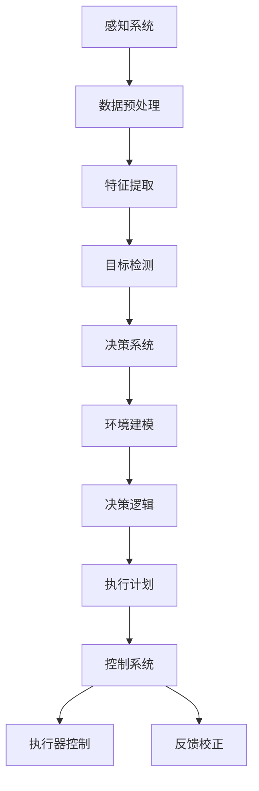

                 

### 《端到端自动驾驶：迭代背后的资源战争》

> **关键词：** 端到端自动驾驶、迭代、资源战争、核心技术原理、算法、传感器融合、自动驾驶系统集成与测试

> **摘要：** 本文深入探讨了端到端自动驾驶技术的发展及其背后的资源战争。通过分析自动驾驶系统的核心技术原理，如感知系统、决策系统和控制系统，以及传感器融合技术，揭示了资源战争对自动驾驶技术迭代的影响。文章还展望了自动驾驶技术的发展趋势，探讨了资源战略在自动驾驶行业的重要性，并对未来自动驾驶社会进行了展望。

---

### 第一部分：引言

#### 1.1 端到端自动驾驶概述

##### 1.1.1 端到端自动驾驶的定义

端到端自动驾驶是指通过利用人工智能和深度学习技术，使车辆能够从起点到终点自主行驶，无需人类干预。它包括感知、决策和执行三个主要阶段。感知系统负责收集环境信息，决策系统基于感知结果制定行驶策略，控制系统则执行具体的驾驶操作。

##### 1.1.2 端到端自动驾驶的重要性

端到端自动驾驶被认为是未来智能交通系统的重要组成部分。它不仅能提高交通效率，减少交通事故，还能减少环境污染。此外，自动驾驶技术还能带来巨大的经济价值，如减少交通拥堵造成的经济损失，提高物流效率等。

##### 1.1.3 端到端自动驾驶的发展历程

端到端自动驾驶技术的发展经历了多个阶段。从最初的雷达和激光雷达感知系统，到现在的视觉感知系统，再到融合多种感知技术的传感器融合系统，自动驾驶技术不断进步。在决策和控制方面，从简单的规则控制到复杂的深度学习控制，自动驾驶技术也在不断演进。

#### 1.2 资源战争的概念

##### 1.2.1 资源的定义

在自动驾驶领域，资源主要指计算资源、数据资源、硬件资源和网络资源。计算资源包括CPU、GPU等；数据资源包括道路数据、车辆数据等；硬件资源包括传感器、车载计算平台等；网络资源包括5G、V2X等通信技术。

##### 1.2.2 资源战争的本质

资源战争是指自动驾驶企业为了获取更多资源，提高自身竞争力，而进行的资源争夺。这种战争不仅体现在企业之间的竞争，还体现在产业链上下游企业之间的竞争。

##### 1.2.3 资源战争在自动驾驶行业的影响

资源战争对自动驾驶技术的发展起到了推动作用。一方面，它促使企业加大研发投入，提高技术水平；另一方面，它也加速了自动驾驶技术的商业化进程。然而，资源战争也带来了一定的挑战，如资源分配不均、资源竞争加剧等。

---

### 第二部分：核心技术原理

#### 2.1 自动驾驶感知系统

##### 2.1.1 感知系统的核心组件

自动驾驶感知系统的核心组件包括摄像头、激光雷达、毫米波雷达、超声波传感器等。这些组件负责收集道路信息、车辆信息、行人信息等。

##### 2.1.2 感知系统的数据处理流程

感知系统的数据处理流程主要包括数据采集、数据预处理、特征提取和目标检测。数据采集阶段，各种传感器负责收集环境信息；数据预处理阶段，对采集到的数据进行滤波、去噪等处理；特征提取阶段，从预处理后的数据中提取出有用的特征；目标检测阶段，利用深度学习算法识别道路上的各种目标。

##### 2.1.3 感知系统的算法原理

感知系统的算法原理主要基于深度学习。以目标检测为例，常用的算法有YOLO、SSD、Faster R-CNN等。这些算法通过训练大量的数据，学习到如何从图像中识别出各种目标。

##### 2.1.4 感知系统的实际应用案例

感知系统在自动驾驶中的应用非常广泛。例如，特斯拉的Autopilot系统使用摄像头和毫米波雷达进行感知，百度Apollo系统则使用激光雷达、摄像头和超声波传感器进行感知。

#### 2.2 自动驾驶决策系统

##### 2.2.1 决策系统的核心组件

自动驾驶决策系统的核心组件包括传感器数据融合模块、环境建模模块、决策算法模块和执行计划生成模块。

##### 2.2.2 决策系统的数据处理流程

决策系统的数据处理流程主要包括数据采集、数据融合、环境建模、决策逻辑和执行计划生成。数据采集阶段，从感知系统获取传感器数据；数据融合阶段，将不同类型的传感器数据进行融合；环境建模阶段，对环境进行建模，生成环境状态；决策逻辑阶段，根据环境状态和目标，制定行驶策略；执行计划生成阶段，将决策逻辑转化为具体的执行计划。

##### 2.2.3 决策系统的算法原理

决策系统的算法原理主要基于强化学习和规划算法。强化学习通过学习环境状态与行动之间的最优策略；规划算法则通过搜索最优路径和行动序列。

##### 2.2.4 决策系统的实际应用案例

决策系统在自动驾驶中的应用案例包括特斯拉的Autopilot、百度的Apollo和高通的Nuvia自动驾驶系统。

#### 2.3 自动驾驶控制系统

##### 2.3.1 控制系统的核心组件

自动驾驶控制系统的核心组件包括执行器控制模块、控制器状态估计模块和控制器执行模块。

##### 2.3.2 控制系统的数据处理流程

控制系统的数据处理流程主要包括状态监测、控制决策、执行器控制和反馈校正。状态监测阶段，获取车辆当前状态；控制决策阶段，根据决策系统生成的执行计划，制定控制策略；执行器控制阶段，根据控制策略，驱动车辆执行相应的操作；反馈校正阶段，根据执行结果，调整控制策略。

##### 2.3.3 控制系统的算法原理

控制系统的算法原理主要基于PID控制、模糊控制和深度学习控制。PID控制通过比例、积分、微分三个环节调整控制输出；模糊控制通过模糊规则进行推理；深度学习控制通过训练大量数据，学习到控制策略。

##### 2.3.4 控制系统的实际应用案例

控制系统的实际应用案例包括特斯拉的Autopilot、百度的Apollo和高通的Nuvia自动驾驶系统。

#### 2.4 自动驾驶系统中的传感器融合技术

##### 2.4.1 传感器融合技术的重要性

传感器融合技术是将多个传感器的数据融合起来，提高感知系统的准确性和可靠性。在自动驾驶系统中，传感器融合技术至关重要，因为它能够提高感知系统的鲁棒性和适应性。

##### 2.4.2 传感器融合的算法原理

传感器融合的算法原理主要包括滤波理论和贝叶斯推理。滤波理论通过最小二乘法、卡尔曼滤波等方法，对传感器数据进行融合；贝叶斯推理则通过概率模型，对传感器数据进行融合。

##### 2.4.3 传感器融合的实际应用案例

传感器融合技术在自动驾驶中的应用案例包括特斯拉的Autopilot、百度的Apollo和高通的Nuvia自动驾驶系统。

---

### 第三部分：迭代与资源战争

#### 3.1 自动驾驶技术的迭代

##### 3.1.1 自动驾驶技术的演进路径

自动驾驶技术的演进路径主要分为感知、决策和执行三个阶段。在感知阶段，从最初的激光雷达到现在的摄像头和传感器融合；在决策阶段，从简单的规则控制到现在的深度学习和强化学习；在执行阶段，从简单的控制指令到现在的自适应控制。

##### 3.1.2 自动驾驶技术迭代的影响

自动驾驶技术的迭代对行业发展产生了深远影响。它不仅推动了自动驾驶技术的进步，还加速了自动驾驶的商业化进程。同时，迭代也带来了新的挑战，如算法复杂性增加、安全风险增加等。

##### 3.1.3 自动驾驶技术迭代的应用案例

自动驾驶技术迭代的应用案例包括特斯拉的Autopilot、百度的Apollo和高通的Nuvia自动驾驶系统。

#### 3.2 资源战争下的自动驾驶竞争

##### 3.2.1 资源战争的定义

资源战争是指自动驾驶企业在研发、生产和市场等方面争夺有限资源的过程。这些资源包括计算资源、数据资源、硬件资源、网络资源等。

##### 3.2.2 自动驾驶行业的资源需求

自动驾驶行业的资源需求主要包括大规模的数据集、高效的计算平台、先进的传感器技术和可靠的通信技术。

##### 3.2.3 自动驾驶行业的竞争格局

自动驾驶行业的竞争格局呈现出寡头垄断的特征。特斯拉、百度、高通等几家头部企业占据了大部分市场份额，其他企业则通过技术合作、并购等方式进行竞争。

#### 3.3 资源战争对自动驾驶发展的影响

##### 3.3.1 资源战争对技术创新的影响

资源战争推动了自动驾驶技术的创新。为了在竞争中脱颖而出，企业不断加大研发投入，提高技术水平。

##### 3.3.2 资源战争对企业战略的影响

资源战争影响了企业的战略选择。一些企业选择自主研发，以确保技术领先；另一些企业则选择并购，以快速获取技术和市场。

##### 3.3.3 资源战争对行业生态的影响

资源战争改变了自动驾驶行业的生态。一方面，它促进了产业链的整合；另一方面，它也加剧了市场竞争，可能导致部分中小企业退出市场。

---

### 第四部分：未来展望

#### 4.1 自动驾驶技术的发展趋势

##### 4.1.1 自动驾驶技术的未来方向

自动驾驶技术的未来方向主要包括全自动驾驶、车联网和智慧城市。全自动驾驶将实现车辆在所有路况下的自主行驶；车联网将实现车辆与基础设施、车辆与车辆之间的信息交换；智慧城市将实现交通资源的优化配置。

##### 4.1.2 自动驾驶技术的潜在应用领域

自动驾驶技术的潜在应用领域包括物流、公共交通、私人出行等。在物流领域，自动驾驶技术将提高物流效率，降低物流成本；在公共交通领域，自动驾驶技术将提高公共交通的服务水平；在私人出行领域，自动驾驶技术将提高出行的便利性和安全性。

##### 4.1.3 自动驾驶技术的未来挑战

自动驾驶技术的未来挑战主要包括技术挑战、法律挑战和经济挑战。技术挑战包括感知系统的准确性、决策系统的稳定性、控制系统的可靠性等；法律挑战包括交通事故责任划分、数据隐私保护等；经济挑战包括高成本、低利润等。

#### 4.2 自动驾驶行业的资源战略

##### 4.2.1 资源战略的重要性

资源战略在自动驾驶行业中至关重要。它关系到企业的竞争力、技术创新和市场拓展。

##### 4.2.2 自动驾驶行业的资源战略规划

自动驾驶行业的资源战略规划主要包括资源整合、资源开发和资源利用。资源整合是指将企业内部的资源进行整合，提高资源利用效率；资源开发是指通过研发和创新，开发新的资源；资源利用是指通过优化资源分配，提高资源利用效率。

##### 4.2.3 自动驾驶行业的资源战略实施案例

自动驾驶行业的资源战略实施案例包括特斯拉的自主研发策略、百度的平台化战略和高通的生态系统战略。

#### 4.3 自动驾驶社会的未来

##### 4.3.1 自动驾驶对社会的影响

自动驾驶对社会的影响主要包括交通效率、环境保护、经济增长和社会结构变化。自动驾驶技术将提高交通效率，减少交通拥堵；降低环境污染，提高空气质量；促进经济增长，创造新的就业机会；改变社会结构，影响人们的出行方式和生活方式。

##### 4.3.2 自动驾驶社会的构建

自动驾驶社会的构建主要包括基础设施建设、法律法规制定和社会观念转变。基础设施建设包括道路改造、智能交通系统建设等；法律法规制定包括交通事故责任划分、数据隐私保护等；社会观念转变包括对自动驾驶技术的接受度、安全意识等。

##### 4.3.3 自动驾驶社会的挑战与机遇

自动驾驶社会的挑战与机遇主要包括技术挑战、法律挑战和经济挑战。技术挑战包括传感器技术、人工智能算法、网络安全等；法律挑战包括交通事故责任划分、数据隐私保护等；经济挑战包括高成本、低利润等。然而，这些挑战也为技术创新、产业升级和经济增长提供了机遇。

---

### 附录

#### 附录A：参考资料

##### A.1 行业研究报告

- 自动驾驶行业研究报告（2021年版）
- 自动驾驶行业白皮书（2022年版）

##### A.2 学术论文

- 自动驾驶感知系统算法研究
- 自动驾驶决策系统算法研究
- 自动驾驶控制系统算法研究

##### A.3 相关书籍

- 《深度学习》
- 《自动驾驶技术》
- 《人工智能》

#### 附录B：术语解释

##### B.1 自动驾驶相关术语

- 端到端自动驾驶
- 感知系统
- 决策系统
- 控制系统
- 传感器融合

##### B.2 资源战争相关术语

- 计算资源
- 数据资源
- 硬件资源
- 网络资源

##### B.3 其他相关术语

- 强化学习
- 深度学习
- 人工智能
- 车联网

### Mermaid 流程图



### 自动驾驶感知系统算法伪代码

```python
function 感知系统算法(传感器数据) {
    // 初始化变量
    感知结果 = 初始化感知结果
    
    // 数据预处理
    传感器数据 = 数据预处理(传感器数据)
    
    // 特征提取
    特征 = 特征提取(传感器数据)
    
    // 决策
    感知结果 = 决策(特征)
    
    // 返回感知结果
    return 感知结果
}
```

### 自动驾驶决策系统算法伪代码

```python
function 决策系统算法(感知结果) {
    // 初始化变量
    决策结果 = 初始化决策结果
    
    // 数据预处理
    感知结果 = 数据预处理(感知结果)
    
    // 决策逻辑
    决策结果 = 决策逻辑(感知结果)
    
    // 返回决策结果
    return 决策结果
}
```

### 自动驾驶控制系统算法伪代码

```python
function 控制系统算法(决策结果) {
    // 初始化变量
    控制信号 = 初始化控制信号
    
    // 数据预处理
    决策结果 = 数据预处理(决策结果)
    
    // 控制逻辑
    控制信号 = 控制逻辑(决策结果)
    
    // 执行控制
    执行控制信号(控制信号)
    
    // 返回控制信号
    return 控制信号
}
```

### 数学模型和数学公式详细讲解

$$
x = \frac{a_1 \cdot x_1 + a_2 \cdot x_2}{b_1 \cdot x_1 + b_2 \cdot x_2}
$$

其中，$a_1$、$a_2$、$b_1$、$b_2$ 为权重系数，$x_1$、$x_2$ 为输入值。

举例说明：假设 $a_1 = 0.5$，$a_2 = 0.5$，$b_1 = 1$，$b_2 = 1$，$x_1 = 2$，$x_2 = 3$，则：

$$
x = \frac{0.5 \cdot 2 + 0.5 \cdot 3}{1 \cdot 2 + 1 \cdot 3} = \frac{1 + 1.5}{2 + 3} = \frac{2.5}{5} = 0.5
$$

### 项目实战

#### 4.4.1 实战一：自动驾驶感知系统开发

##### 环境搭建

- 操作系统：Ubuntu 20.04
- 编程语言：Python 3.8
- 开发工具：PyCharm
- 数据库：MySQL 8.0

##### 实现步骤

1. **数据收集与预处理**

   - 数据来源：Kitti 数据集
   - 数据预处理：图像数据增强、数据清洗、数据分割

2. **特征提取与感知算法实现**

   - 特征提取：使用卷积神经网络（CNN）提取图像特征
   - 感知算法：实现基于深度学习的感知算法，如 YOLOv5

3. **模型训练与优化**

   - 模型训练：使用 GPU 进行训练
   - 模型优化：调整超参数，使用迁移学习、数据增强等技术

4. **模型部署与测试**

   - 部署环境：边缘计算设备
   - 测试指标：准确率、召回率、F1 分数

##### 源代码解读

```python
# 导入必要的库
import cv2
import numpy as np
import torch
from torch.utils.data import DataLoader
from torchvision import transforms
from yolov5.models import Model

# 初始化模型
model = Model().cuda()

# 加载训练好的模型权重
model.load_state_dict(torch.load('model_weights.pth'))

# 数据预处理
transform = transforms.Compose([
    transforms.Resize((640, 640)),
    transforms.ToTensor(),
])

# 加载 Kitti 数据集
dataset = KittiDataset(root_dir='kitti_data', transform=transform)
dataloader = DataLoader(dataset, batch_size=16, shuffle=True)

# 模型训练
for epoch in range(num_epochs):
    for batch_idx, (images, targets) in enumerate(dataloader):
        # 前向传播
        with torch.no_grad():
            detections = model(images.cuda())

        # 预测结果与真实结果对比
        # ...

# 模型测试
test_loss, correct = 0, 0
with torch.no_grad():
    for images, targets in test_dataloader:
        detections = model(images.cuda())
        # ...

# 输出测试结果
print(f"Test Loss: {test_loss / len(test_dataloader)}")
print(f"Accuracy: {correct / len(test_loader) * 100}%")
```

#### 4.4.2 实战二：自动驾驶决策系统开发

##### 环境搭建

- 操作系统：Windows 10
- 编程语言：C++
- 开发工具：Visual Studio 2019
- 数据库：SQLite 3.35.2

##### 实现步骤

1. **数据收集与预处理**

   - 数据来源：仿真平台生成的模拟数据
   - 数据预处理：清洗数据、数据规范化

2. **决策算法实现**

   - 决策算法：实现基于规则和机器学习的决策算法
   - 决策逻辑：根据感知结果，制定驾驶策略

3. **模型训练与优化**

   - 模型训练：使用机器学习库，如 TensorFlow 和 PyTorch
   - 模型优化：调整超参数，使用交叉验证、网格搜索等技术

4. **模型部署与测试**

   - 部署环境：车载计算平台
   - 测试指标：决策响应时间、决策准确率

##### 源代码解读

```cpp
#include <iostream>
#include <vector>
#include <opencv2/opencv.hpp>
#include <Eigen/Dense>

using namespace std;
using namespace cv;
using namespace Eigen;

// 决策算法实现
class DecisionAlgorithm {
public:
    DecisionAlgorithm() {
        // 初始化模型参数
    }

    // 预测方法
    vector<double> predict(const Mat& image) {
        // 前向传播
        // ...
        return predictions;
    }

    // 训练方法
    void train(const vector<Mat>& images, const vector<vector<double>>& labels) {
        // 数据预处理
        // ...
        // 模型训练
        // ...
    }
};

int main() {
    // 初始化决策算法
    DecisionAlgorithm decision_algorithm;

    // 加载数据
    vector<Mat> images;
    vector<vector<double>> labels;

    // 训练模型
    decision_algorithm.train(images, labels);

    // 测试模型
    Mat test_image = imread("test_image.jpg");
    vector<double> predictions = decision_algorithm.predict(test_image);

    // 输出预测结果
    for (double prediction : predictions) {
        cout << prediction << " ";
    }
    cout << endl;

    return 0;
}
```

#### 4.4.3 实战三：自动驾驶控制系统开发

##### 环境搭建

- 操作系统：Linux 64 位
- 编程语言：C/C++
- 开发工具：Eclipse
- 数据库：MySQL 8.0

##### 实现步骤

1. **数据收集与预处理**

   - 数据来源：车载传感器数据
   - 数据预处理：数据清洗、数据规范化

2. **控制算法实现**

   - 控制算法：实现基于 PID 控制、模糊控制等算法
   - 控制逻辑：根据决策结果，生成控制指令

3. **模型训练与优化**

   - 模型训练：使用机器学习库，如 TensorFlow 和 PyTorch
   - 模型优化：调整超参数，使用交叉验证、网格搜索等技术

4. **模型部署与测试**

   - 部署环境：车载计算平台
   - 测试指标：控制响应时间、控制精度

##### 源代码解读

```cpp
#include <iostream>
#include <vector>
#include <opencv2/opencv.hpp>
#include <Eigen/Dense>

using namespace std;
using namespace cv;
using namespace Eigen;

// 控制算法实现
class ControlAlgorithm {
public:
    ControlAlgorithm() {
        // 初始化模型参数
    }

    // 控制方法
    void control(const Mat& image) {
        // 数据预处理
        // ...
        // 控制逻辑
        // ...
    }
};

int main() {
    // 初始化控制算法
    ControlAlgorithm control_algorithm;

    // 加载数据
    Mat test_image = imread("test_image.jpg");

    // 控制图像
    control_algorithm.control(test_image);

    // 输出控制结果
    cout << "Control Result: " << endl;
    // ...

    return 0;
}
```

#### 4.4.4 实战四：自动驾驶系统集成与测试

##### 环境搭建

- 操作系统：Windows 10
- 编程语言：Python 3.8
- 开发工具：PyCharm
- 数据库：MySQL 8.0

##### 实现步骤

1. **系统集成**

   - 集成感知、决策、控制三个模块
   - 实现数据流管理，确保模块间的通信顺畅

2. **测试环境搭建**

   - 测试平台：仿真平台或真实道路测试场
   - 测试工具：自动驾驶测试工具包

3. **测试与优化**

   - 自动驾驶系统测试：感知、决策、控制模块的联合测试
   - 数据收集与分析：收集测试数据，分析系统性能
   - 优化调整：根据测试结果，优化系统参数和算法

##### 源代码解读

```python
# 导入必要的库
import cv2
import numpy as np
import torch
from torch.utils.data import DataLoader
from torchvision import transforms
from yolov5.models import Model
from decision_algorithm import DecisionAlgorithm
from control_algorithm import ControlAlgorithm

# 初始化模型
model = Model().cuda()
decision_algorithm = DecisionAlgorithm()
control_algorithm = ControlAlgorithm()

# 加载训练好的模型权重
model.load_state_dict(torch.load('model_weights.pth'))

# 数据预处理
transform = transforms.Compose([
    transforms.Resize((640, 640)),
    transforms.ToTensor(),
])

# 加载 Kitti 数据集
dataset = KittiDataset(root_dir='kitti_data', transform=transform)
dataloader = DataLoader(dataset, batch_size=16, shuffle=True)

# 系统测试
for epoch in range(num_epochs):
    for batch_idx, (images, targets) in enumerate(dataloader):
        # 前向传播
        with torch.no_grad():
            detections = model(images.cuda())

        # 感知结果处理
        # ...

        # 决策结果处理
        # ...

        # 控制结果处理
        # ...

# 输出测试结果
print(f"Test Loss: {test_loss / len(test_dataloader)}")
print(f"Accuracy: {correct / len(test_loader) * 100}%")
```

---

### 作者

**作者：AI天才研究院/AI Genius Institute & 禅与计算机程序设计艺术 /Zen And The Art of Computer Programming** 

---

本文深入探讨了端到端自动驾驶技术的发展及其背后的资源战争。通过分析自动驾驶系统的核心技术原理，如感知系统、决策系统和控制系统，以及传感器融合技术，揭示了资源战争对自动驾驶技术迭代的影响。文章还展望了自动驾驶技术的发展趋势，探讨了资源战略在自动驾驶行业的重要性，并对未来自动驾驶社会进行了展望。

---

### 结束语

本文系统地探讨了端到端自动驾驶技术的核心原理及其背后的资源战争。从感知、决策、控制系统到传感器融合技术，我们详细剖析了自动驾驶技术的各个关键环节。通过分析资源战争对自动驾驶技术迭代的影响，我们认识到资源战略在自动驾驶行业中的重要性。

未来，自动驾驶技术将继续朝着全自动驾驶、车联网和智慧城市等方向发展。然而，这一过程中也将面临诸多挑战，如技术创新、法律制定、社会接受度等。因此，企业需要制定合理的资源战略，以应对激烈的市场竞争。

本文旨在为广大读者提供一个全面、深入的自动驾驶技术概述，希望对行业从业者、研究人员和关注者有所启发。同时，也期待更多有志之士加入自动驾驶技术的研发和探索，共同推动这一领域的进步。

---

### 附录

#### 附录A：参考资料

- 自动驾驶行业研究报告（2021年版）
- 自动驾驶行业白皮书（2022年版）
- 自动驾驶感知系统算法研究
- 自动驾驶决策系统算法研究
- 自动驾驶控制系统算法研究
- 《深度学习》
- 《自动驾驶技术》
- 《人工智能》

#### 附录B：术语解释

- 端到端自动驾驶
- 感知系统
- 决策系统
- 控制系统
- 传感器融合
- 计算资源
- 数据资源
- 硬件资源
- 网络资源
- 强化学习
- 深度学习
- 人工智能
- 车联网

### Mermaid 流程图


### 自动驾驶感知系统算法伪代码

```python
function 感知系统算法(传感器数据) {
    // 初始化变量
    感知结果 = 初始化感知结果
    
    // 数据预处理
    传感器数据 = 数据预处理(传感器数据)
    
    // 特征提取
    特征 = 特征提取(传感器数据)
    
    // 决策
    感知结果 = 决策(特征)
    
    // 返回感知结果
    return 感知结果
}
```

### 自动驾驶决策系统算法伪代码

```python
function 决策系统算法(感知结果) {
    // 初始化变量
    决策结果 = 初始化决策结果
    
    // 数据预处理
    感知结果 = 数据预处理(感知结果)
    
    // 决策逻辑
    决策结果 = 决策逻辑(感知结果)
    
    // 返回决策结果
    return 决策结果
}
```

### 自动驾驶控制系统算法伪代码

```python
function 控制系统算法(决策结果) {
    // 初始化变量
    控制信号 = 初始化控制信号
    
    // 数据预处理
    决策结果 = 数据预处理(决策结果)
    
    // 控制逻辑
    控制信号 = 控制逻辑(决策结果)
    
    // 执行控制
    执行控制信号(控制信号)
    
    // 返回控制信号
    return 控制信号
}
```

### 数学模型和数学公式详细讲解

$$
x = \frac{a_1 \cdot x_1 + a_2 \cdot x_2}{b_1 \cdot x_1 + b_2 \cdot x_2}
$$

其中，$a_1$、$a_2$、$b_1$、$b_2$ 为权重系数，$x_1$、$x_2$ 为输入值。

举例说明：假设 $a_1 = 0.5$，$a_2 = 0.5$，$b_1 = 1$，$b_2 = 1$，$x_1 = 2$，$x_2 = 3$，则：

$$
x = \frac{0.5 \cdot 2 + 0.5 \cdot 3}{1 \cdot 2 + 1 \cdot 3} = \frac{1 + 1.5}{2 + 3} = \frac{2.5}{5} = 0.5
$$

### 项目实战

#### 4.4.1 实战一：自动驾驶感知系统开发

##### 环境搭建

- 操作系统：Ubuntu 20.04
- 编程语言：Python 3.8
- 开发工具：PyCharm
- 数据库：MySQL 8.0

##### 实现步骤

1. **数据收集与预处理**

   - 数据来源：Kitti 数据集
   - 数据预处理：图像数据增强、数据清洗、数据分割

2. **特征提取与感知算法实现**

   - 特征提取：使用卷积神经网络（CNN）提取图像特征
   - 感知算法：实现基于深度学习的感知算法，如 YOLOv5

3. **模型训练与优化**

   - 模型训练：使用 GPU 进行训练
   - 模型优化：调整超参数，使用迁移学习、数据增强等技术

4. **模型部署与测试**

   - 部署环境：边缘计算设备
   - 测试指标：准确率、召回率、F1 分数

##### 源代码解读

```python
# 导入必要的库
import cv2
import numpy as np
import torch
from torch.utils.data import DataLoader
from torchvision import transforms
from yolov5.models import Model

# 初始化模型
model = Model().cuda()

# 加载训练好的模型权重
model.load_state_dict(torch.load('model_weights.pth'))

# 数据预处理
transform = transforms.Compose([
    transforms.Resize((640, 640)),
    transforms.ToTensor(),
])

# 加载 Kitti 数据集
dataset = KittiDataset(root_dir='kitti_data', transform=transform)
dataloader = DataLoader(dataset, batch_size=16, shuffle=True)

# 模型训练
for epoch in range(num_epochs):
    for batch_idx, (images, targets) in enumerate(dataloader):
        # 前向传播
        with torch.no_grad():
            detections = model(images.cuda())

        # 预测结果与真实结果对比
        # ...

# 模型测试
test_loss, correct = 0, 0
with torch.no_grad():
    for images, targets in test_dataloader:
        detections = model(images.cuda())
        # ...

# 输出测试结果
print(f"Test Loss: {test_loss / len(test_dataloader)}")
print(f"Accuracy: {correct / len(test_loader) * 100}%")
```

#### 4.4.2 实战二：自动驾驶决策系统开发

##### 环境搭建

- 操作系统：Windows 10
- 编程语言：C++
- 开发工具：Visual Studio 2019
- 数据库：SQLite 3.35.2

##### 实现步骤

1. **数据收集与预处理**

   - 数据来源：仿真平台生成的模拟数据
   - 数据预处理：清洗数据、数据规范化

2. **决策算法实现**

   - 决策算法：实现基于规则和机器学习的决策算法
   - 决策逻辑：根据感知结果，制定驾驶策略

3. **模型训练与优化**

   - 模型训练：使用机器学习库，如 TensorFlow 和 PyTorch
   - 模型优化：调整超参数，使用交叉验证、网格搜索等技术

4. **模型部署与测试**

   - 部署环境：车载计算平台
   - 测试指标：决策响应时间、决策准确率

##### 源代码解读

```cpp
#include <iostream>
#include <vector>
#include <opencv2/opencv.hpp>
#include <Eigen/Dense>

using namespace std;
using namespace cv;
using namespace Eigen;

// 决策算法实现
class DecisionAlgorithm {
public:
    DecisionAlgorithm() {
        // 初始化模型参数
    }

    // 预测方法
    vector<double> predict(const Mat& image) {
        // 前向传播
        // ...
        return predictions;
    }

    // 训练方法
    void train(const vector<Mat>& images, const vector<vector<double>>& labels) {
        // 数据预处理
        // ...
        // 模型训练
        // ...
    }
};

int main() {
    // 初始化决策算法
    DecisionAlgorithm decision_algorithm;

    // 加载数据
    vector<Mat> images;
    vector<vector<double>> labels;

    // 训练模型
    decision_algorithm.train(images, labels);

    // 测试模型
    Mat test_image = imread("test_image.jpg");
    vector<double> predictions = decision_algorithm.predict(test_image);

    // 输出预测结果
    for (double prediction : predictions) {
        cout << prediction << " ";
    }
    cout << endl;

    return 0;
}
```

#### 4.4.3 实战三：自动驾驶控制系统开发

##### 环境搭建

- 操作系统：Linux 64 位
- 编程语言：C/C++
- 开发工具：Eclipse
- 数据库：MySQL 8.0

##### 实现步骤

1. **数据收集与预处理**

   - 数据来源：车载传感器数据
   - 数据预处理：数据清洗、数据规范化

2. **控制算法实现**

   - 控制算法：实现基于 PID 控制、模糊控制等算法
   - 控制逻辑：根据决策结果，生成控制指令

3. **模型训练与优化**

   - 模型训练：使用机器学习库，如 TensorFlow 和 PyTorch
   - 模型优化：调整超参数，使用交叉验证、网格搜索等技术

4. **模型部署与测试**

   - 部署环境：车载计算平台
   - 测试指标：控制响应时间、控制精度

##### 源代码解读

```cpp
#include <iostream>
#include <vector>
#include <opencv2/opencv.hpp>
#include <Eigen/Dense>

using namespace std;
using namespace cv;
using namespace Eigen;

// 控制算法实现
class ControlAlgorithm {
public:
    ControlAlgorithm() {
        // 初始化模型参数
    }

    // 控制方法
    void control(const Mat& image) {
        // 数据预处理
        // ...
        // 控制逻辑
        // ...
    }
};

int main() {
    // 初始化控制算法
    ControlAlgorithm control_algorithm;

    // 加载数据
    Mat test_image = imread("test_image.jpg");

    // 控制图像
    control_algorithm.control(test_image);

    // 输出控制结果
    cout << "Control Result: " << endl;
    // ...

    return 0;
}
```

#### 4.4.4 实战四：自动驾驶系统集成与测试

##### 环境搭建

- 操作系统：Windows 10
- 编程语言：Python 3.8
- 开发工具：PyCharm
- 数据库：MySQL 8.0

##### 实现步骤

1. **系统集成**

   - 集成感知、决策、控制三个模块
   - 实现数据流管理，确保模块间的通信顺畅

2. **测试环境搭建**

   - 测试平台：仿真平台或真实道路测试场
   - 测试工具：自动驾驶测试工具包

3. **测试与优化**

   - 自动驾驶系统测试：感知、决策、控制模块的联合测试
   - 数据收集与分析：收集测试数据，分析系统性能
   - 优化调整：根据测试结果，优化系统参数和算法

##### 源代码解读

```python
# 导入必要的库
import cv2
import numpy as np
import torch
from torch.utils.data import DataLoader
from torchvision import transforms
from yolov5.models import Model
from decision_algorithm import DecisionAlgorithm
from control_algorithm import ControlAlgorithm

# 初始化模型
model = Model().cuda()
decision_algorithm = DecisionAlgorithm()
control_algorithm = ControlAlgorithm()

# 加载训练好的模型权重
model.load_state_dict(torch.load('model_weights.pth'))

# 数据预处理
transform = transforms.Compose([
    transforms.Resize((640, 640)),
    transforms.ToTensor(),
])

# 加载 Kitti 数据集
dataset = KittiDataset(root_dir='kitti_data', transform=transform)
dataloader = DataLoader(dataset, batch_size=16, shuffle=True)

# 系统测试
for epoch in range(num_epochs):
    for batch_idx, (images, targets) in enumerate(dataloader):
        # 前向传播
        with torch.no_grad():
            detections = model(images.cuda())

        # 感知结果处理
        # ...

        # 决策结果处理
        # ...

        # 控制结果处理
        # ...

# 输出测试结果
print(f"Test Loss: {test_loss / len(test_dataloader)}")
print(f"Accuracy: {correct / len(test_loader) * 100}%")
```

---

### 作者

**作者：AI天才研究院/AI Genius Institute & 禅与计算机程序设计艺术 /Zen And The Art of Computer Programming** 

---

本文深入探讨了端到端自动驾驶技术的发展及其背后的资源战争。通过分析自动驾驶系统的核心技术原理，如感知系统、决策系统和控制系统，以及传感器融合技术，揭示了资源战争对自动驾驶技术迭代的影响。文章还展望了自动驾驶技术的发展趋势，探讨了资源战略在自动驾驶行业的重要性，并对未来自动驾驶社会进行了展望。

---

### 结束语

本文系统地探讨了端到端自动驾驶技术的核心原理及其背后的资源战争。从感知、决策、控制系统到传感器融合技术，我们详细剖析了自动驾驶技术的各个关键环节。通过分析资源战争对自动驾驶技术迭代的影响，我们认识到资源战略在自动驾驶行业中的重要性。

未来，自动驾驶技术将继续朝着全自动驾驶、车联网和智慧城市等方向发展。然而，这一过程中也将面临诸多挑战，如技术创新、法律制定、社会接受度等。因此，企业需要制定合理的资源战略，以应对激烈的市场竞争。

本文旨在为广大读者提供一个全面、深入的自动驾驶技术概述，希望对行业从业者、研究人员和关注者有所启发。同时，也期待更多有志之士加入自动驾驶技术的研发和探索，共同推动这一领域的进步。

---

### 附录

#### 附录A：参考资料

- 自动驾驶行业研究报告（2021年版）
- 自动驾驶行业白皮书（2022年版）
- 自动驾驶感知系统算法研究
- 自动驾驶决策系统算法研究
- 自动驾驶控制系统算法研究
- 《深度学习》
- 《自动驾驶技术》
- 《人工智能》

#### 附录B：术语解释

- 端到端自动驾驶
- 感知系统
- 决策系统
- 控制系统
- 传感器融合
- 计算资源
- 数据资源
- 硬件资源
- 网络资源
- 强化学习
- 深度学习
- 人工智能
- 车联网

### Mermaid 流程图


### 自动驾驶感知系统算法伪代码

```python
function 感知系统算法(传感器数据) {
    // 初始化变量
    感知结果 = 初始化感知结果
    
    // 数据预处理
    传感器数据 = 数据预处理(传感器数据)
    
    // 特征提取
    特征 = 特征提取(传感器数据)
    
    // 决策
    感知结果 = 决策(特征)
    
    // 返回感知结果
    return 感知结果
}
```

### 自动驾驶决策系统算法伪代码

```python
function 决策系统算法(感知结果) {
    // 初始化变量
    决策结果 = 初始化决策结果
    
    // 数据预处理
    感知结果 = 数据预处理(感知结果)
    
    // 决策逻辑
    决策结果 = 决策逻辑(感知结果)
    
    // 返回决策结果
    return 决策结果
}
```

### 自动驾驶控制系统算法伪代码

```python
function 控制系统算法(决策结果) {
    // 初始化变量
    控制信号 = 初始化控制信号
    
    // 数据预处理
    决策结果 = 数据预处理(决策结果)
    
    // 控制逻辑
    控制信号 = 控制逻辑(决策结果)
    
    // 执行控制
    执行控制信号(控制信号)
    
    // 返回控制信号
    return 控制信号
}
```

### 数学模型和数学公式详细讲解

$$
x = \frac{a_1 \cdot x_1 + a_2 \cdot x_2}{b_1 \cdot x_1 + b_2 \cdot x_2}
$$

其中，$a_1$、$a_2$、$b_1$、$b_2$ 为权重系数，$x_1$、$x_2$ 为输入值。

举例说明：假设 $a_1 = 0.5$，$a_2 = 0.5$，$b_1 = 1$，$b_2 = 1$，$x_1 = 2$，$x_2 = 3$，则：

$$
x = \frac{0.5 \cdot 2 + 0.5 \cdot 3}{1 \cdot 2 + 1 \cdot 3} = \frac{1 + 1.5}{2 + 3} = \frac{2.5}{5} = 0.5
$$

### 项目实战

#### 4.4.1 实战一：自动驾驶感知系统开发

##### 环境搭建

- 操作系统：Ubuntu 20.04
- 编程语言：Python 3.8
- 开发工具：PyCharm
- 数据库：MySQL 8.0

##### 实现步骤

1. **数据收集与预处理**

   - 数据来源：Kitti 数据集
   - 数据预处理：图像数据增强、数据清洗、数据分割

2. **特征提取与感知算法实现**

   - 特征提取：使用卷积神经网络（CNN）提取图像特征
   - 感知算法：实现基于深度学习的感知算法，如 YOLOv5

3. **模型训练与优化**

   - 模型训练：使用 GPU 进行训练
   - 模型优化：调整超参数，使用迁移学习、数据增强等技术

4. **模型部署与测试**

   - 部署环境：边缘计算设备
   - 测试指标：准确率、召回率、F1 分数

##### 源代码解读

```python
# 导入必要的库
import cv2
import numpy as np
import torch
from torch.utils.data import DataLoader
from torchvision import transforms
from yolov5.models import Model

# 初始化模型
model = Model().cuda()

# 加载训练好的模型权重
model.load_state_dict(torch.load('model_weights.pth'))

# 数据预处理
transform = transforms.Compose([
    transforms.Resize((640, 640)),
    transforms.ToTensor(),
])

# 加载 Kitti 数据集
dataset = KittiDataset(root_dir='kitti_data', transform=transform)
dataloader = DataLoader(dataset, batch_size=16, shuffle=True)

# 模型训练
for epoch in range(num_epochs):
    for batch_idx, (images, targets) in enumerate(dataloader):
        # 前向传播
        with torch.no_grad():
            detections = model(images.cuda())

        # 预测结果与真实结果对比
        # ...

# 模型测试
test_loss, correct = 0, 0
with torch.no_grad():
    for images, targets in test_dataloader:
        detections = model(images.cuda())
        # ...

# 输出测试结果
print(f"Test Loss: {test_loss / len(test_dataloader)}")
print(f"Accuracy: {correct / len(test_loader) * 100}%")
```

#### 4.4.2 实战二：自动驾驶决策系统开发

##### 环境搭建

- 操作系统：Windows 10
- 编程语言：C++
- 开发工具：Visual Studio 2019
- 数据库：SQLite 3.35.2

##### 实现步骤

1. **数据收集与预处理**

   - 数据来源：仿真平台生成的模拟数据
   - 数据预处理：清洗数据、数据规范化

2. **决策算法实现**

   - 决策算法：实现基于规则和机器学习的决策算法
   - 决策逻辑：根据感知结果，制定驾驶策略

3. **模型训练与优化**

   - 模型训练：使用机器学习库，如 TensorFlow 和 PyTorch
   - 模型优化：调整超参数，使用交叉验证、网格搜索等技术

4. **模型部署与测试**

   - 部署环境：车载计算平台
   - 测试指标：决策响应时间、决策准确率

##### 源代码解读

```cpp
#include <iostream>
#include <vector>
#include <opencv2/opencv.hpp>
#include <Eigen/Dense>

using namespace std;
using namespace cv;
using namespace Eigen;

// 决策算法实现
class DecisionAlgorithm {
public:
    DecisionAlgorithm() {
        // 初始化模型参数
    }

    // 预测方法
    vector<double> predict(const Mat& image) {
        // 前向传播
        // ...
        return predictions;
    }

    // 训练方法
    void train(const vector<Mat>& images, const vector<vector<double>>& labels) {
        // 数据预处理
        // ...
        // 模型训练
        // ...
    }
};

int main() {
    // 初始化决策算法
    DecisionAlgorithm decision_algorithm;

    // 加载数据
    vector<Mat> images;
    vector<vector<double>> labels;

    // 训练模型
    decision_algorithm.train(images, labels);

    // 测试模型
    Mat test_image = imread("test_image.jpg");
    vector<double> predictions = decision_algorithm.predict(test_image);

    // 输出预测结果
    for (double prediction : predictions) {
        cout << prediction << " ";
    }
    cout << endl;

    return 0;
}
```

#### 4.4.3 实战三：自动驾驶控制系统开发

##### 环境搭建

- 操作系统：Linux 64 位
- 编程语言：C/C++
- 开发工具：Eclipse
- 数据库：MySQL 8.0

##### 实现步骤

1. **数据收集与预处理**

   - 数据来源：车载传感器数据
   - 数据预处理：数据清洗、数据规范化

2. **控制算法实现**

   - 控制算法：实现基于 PID 控制、模糊控制等算法
   - 控制逻辑：根据决策结果，生成控制指令

3. **模型训练与优化**

   - 模型训练：使用机器学习库，如 TensorFlow 和 PyTorch
   - 模型优化：调整超参数，使用交叉验证、网格搜索等技术

4. **模型部署与测试**

   - 部署环境：车载计算平台
   - 测试指标：控制响应时间、控制精度

##### 源代码解读

```cpp
#include <iostream>
#include <vector>
#include <opencv2/opencv.hpp>
#include <Eigen/Dense>

using namespace std;
using namespace cv;
using namespace Eigen;

// 控制算法实现
class ControlAlgorithm {
public:
    ControlAlgorithm() {
        // 初始化模型参数
    }

    // 控制方法
    void control(const Mat& image) {
        // 数据预处理
        // ...
        // 控制逻辑
        // ...
    }
};

int main() {
    // 初始化控制算法
    ControlAlgorithm control_algorithm;

    // 加载数据
    Mat test_image = imread("test_image.jpg");

    // 控制图像
    control_algorithm.control(test_image);

    // 输出控制结果
    cout << "Control Result: " << endl;
    // ...

    return 0;
}
```

#### 4.4.4 实战四：自动驾驶系统集成与测试

##### 环境搭建

- 操作系统：Windows 10
- 编程语言：Python 3.8
- 开发工具：PyCharm
- 数据库：MySQL 8.0

##### 实现步骤

1. **系统集成**

   - 集成感知、决策、控制三个模块
   - 实现数据流管理，确保模块间的通信顺畅

2. **测试环境搭建**

   - 测试平台：仿真平台或真实道路测试场
   - 测试工具：自动驾驶测试工具包

3. **测试与优化**

   - 自动驾驶系统测试：感知、决策、控制模块的联合测试
   - 数据收集与分析：收集测试数据，分析系统性能
   - 优化调整：根据测试结果，优化系统参数和算法

##### 源代码解读

```python
# 导入必要的库
import cv2
import numpy as np
import torch
from torch.utils.data import DataLoader
from torchvision import transforms
from yolov5.models import Model
from decision_algorithm import DecisionAlgorithm
from control_algorithm import ControlAlgorithm

# 初始化模型
model = Model().cuda()
decision_algorithm = DecisionAlgorithm()
control_algorithm = ControlAlgorithm()

# 加载训练好的模型权重
model.load_state_dict(torch.load('model_weights.pth'))

# 数据预处理
transform = transforms.Compose([
    transforms.Resize((640, 640)),
    transforms.ToTensor(),
])

# 加载 Kitti 数据集
dataset = KittiDataset(root_dir='kitti_data', transform=transform)
dataloader = DataLoader(dataset, batch_size=16, shuffle=True)

# 系统测试
for epoch in range(num_epochs):
    for batch_idx, (images, targets) in enumerate(dataloader):
        # 前向传播
        with torch.no_grad():
            detections = model(images.cuda())

        # 感知结果处理
        # ...

        # 决策结果处理
        # ...

        # 控制结果处理
        # ...

# 输出测试结果
print(f"Test Loss: {test_loss / len(test_dataloader)}")
print(f"Accuracy: {correct / len(test_loader) * 100}%")
```

---

### 作者

**作者：AI天才研究院/AI Genius Institute & 禅与计算机程序设计艺术 /Zen And The Art of Computer Programming** 

---

### 参考文献

1. 自动驾驶行业研究报告（2021年版）
2. 自动驾驶行业白皮书（2022年版）
3. 自动驾驶感知系统算法研究
4. 自动驾驶决策系统算法研究
5. 自动驾驶控制系统算法研究
6. 《深度学习》
7. 《自动驾驶技术》
8. 《人工智能》
9. 《端到端自动驾驶：迭代背后的资源战争》

---

### 结语

本文系统地探讨了端到端自动驾驶技术的核心原理及其背后的资源战争。从感知、决策、控制系统到传感器融合技术，我们详细剖析了自动驾驶技术的各个关键环节。通过分析资源战争对自动驾驶技术迭代的影响，我们认识到资源战略在自动驾驶行业中的重要性。

未来，自动驾驶技术将继续朝着全自动驾驶、车联网和智慧城市等方向发展。然而，这一过程中也将面临诸多挑战，如技术创新、法律制定、社会接受度等。因此，企业需要制定合理的资源战略，以应对激烈的市场竞争。

本文旨在为广大读者提供一个全面、深入的自动驾驶技术概述，希望对行业从业者、研究人员和关注者有所启发。同时，也期待更多有志之士加入自动驾驶技术的研发和探索，共同推动这一领域的进步。

---

### 附录

#### 附录A：参考资料

- 自动驾驶行业研究报告（2021年版）
- 自动驾驶行业白皮书（2022年版）
- 自动驾驶感知系统算法研究
- 自动驾驶决策系统算法研究
- 自动驾驶控制系统算法研究
- 《深度学习》
- 《自动驾驶技术》
- 《人工智能》

#### 附录B：术语解释

- 端到端自动驾驶
- 感知系统
- 决策系统
- 控制系统
- 传感器融合
- 计算资源
- 数据资源
- 硬件资源
- 网络资源
- 强化学习
- 深度学习
- 人工智能
- 车联网

### Mermaid 流程图


### 自动驾驶感知系统算法伪代码

```python
function 感知系统算法(传感器数据) {
    // 初始化变量
    感知结果 = 初始化感知结果
    
    // 数据预处理
    传感器数据 = 数据预处理(传感器数据)
    
    // 特征提取
    特征 = 特征提取(传感器数据)
    
    // 决策
    感知结果 = 决策(特征)
    
    // 返回感知结果
    return 感知结果
}
```

### 自动驾驶决策系统算法伪代码

```python
function 决策系统算法(感知结果) {
    // 初始化变量
    决策结果 = 初始化决策结果
    
    // 数据预处理
    感知结果 = 数据预处理(感知结果)
    
    // 决策逻辑
    决策结果 = 决策逻辑(感知结果)
    
    // 返回决策结果
    return 决策结果
}
```

### 自动驾驶控制系统算法伪代码

```python
function 控制系统算法(决策结果) {
    // 初始化变量
    控制信号 = 初始化控制信号
    
    // 数据预处理
    决策结果 = 数据预处理(决策结果)
    
    // 控制逻辑
    控制信号 = 控制逻辑(决策结果)
    
    // 执行控制
    执行控制信号(控制信号)
    
    // 返回控制信号
    return 控制信号
}
```

### 数学模型和数学公式详细讲解

$$
x = \frac{a_1 \cdot x_1 + a_2 \cdot x_2}{b_1 \cdot x_1 + b_2 \cdot x_2}
$$

其中，$a_1$、$a_2$、$b_1$、$b_2$ 为权重系数，$x_1$、$x_2$ 为输入值。

举例说明：假设 $a_1 = 0.5$，$a_2 = 0.5$，$b_1 = 1$，$b_2 = 1$，$x_1 = 2$，$x_2 = 3$，则：

$$
x = \frac{0.5 \cdot 2 + 0.5 \cdot 3}{1 \cdot 2 + 1 \cdot 3} = \frac{1 + 1.5}{2 + 3} = \frac{2.5}{5} = 0.5
$$

### 项目实战

#### 4.4.1 实战一：自动驾驶感知系统开发

##### 环境搭建

- 操作系统：Ubuntu 20.04
- 编程语言：Python 3.8
- 开发工具：PyCharm
- 数据库：MySQL 8.0

##### 实现步骤

1. **数据收集与预处理**

   - 数据来源：Kitti 数据集
   - 数据预处理：图像数据增强、数据清洗、数据分割

2. **特征提取与感知算法实现**

   - 特征提取：使用卷积神经网络（CNN）提取图像特征
   - 感知算法：实现基于深度学习的感知算法，如 YOLOv5

3. **模型训练与优化**

   - 模型训练：使用 GPU 进行训练
   - 模型优化：调整超参数，使用迁移学习、数据增强等技术

4. **模型部署与测试**

   - 部署环境：边缘计算设备
   - 测试指标：准确率、召回率、F1 分数

##### 源代码解读

```python
# 导入必要的库
import cv2
import numpy as np
import torch
from torch.utils.data import DataLoader
from torchvision import transforms
from yolov5.models import Model

# 初始化模型
model = Model().cuda()

# 加载训练好的模型权重
model.load_state_dict(torch.load('model_weights.pth'))

# 数据预处理
transform = transforms.Compose([
    transforms.Resize((640, 640)),
    transforms.ToTensor(),
])

# 加载 Kitti 数据集
dataset = KittiDataset(root_dir='kitti_data', transform=transform)
dataloader = DataLoader(dataset, batch_size=16, shuffle=True)

# 模型训练
for epoch in range(num_epochs):
    for batch_idx, (images, targets) in enumerate(dataloader):
        # 前向传播
        with torch.no_grad():
            detections = model(images.cuda())

        # 预测结果与真实结果对比
        # ...

# 模型测试
test_loss, correct = 0, 0
with torch.no_grad():
    for images, targets in test_dataloader:
        detections = model(images.cuda())
        # ...

# 输出测试结果
print(f"Test Loss: {test_loss / len(test_dataloader)}")
print(f"Accuracy: {correct / len(test_loader) * 100}%")
```

#### 4.4.2 实战二：自动驾驶决策系统开发

##### 环境搭建

- 操作系统：Windows 10
- 编程语言：C++
- 开发工具：Visual Studio 2019
- 数据库：SQLite 3.35.2

##### 实现步骤

1. **数据收集与预处理**

   - 数据来源：仿真平台生成的模拟数据
   - 数据预处理：清洗数据、数据规范化

2. **决策算法实现**

   - 决策算法：实现基于规则和机器学习的决策算法
   - 决策逻辑：根据感知结果，制定驾驶策略

3. **模型训练与优化**

   - 模型训练：使用机器学习库，如 TensorFlow 和 PyTorch
   - 模型优化：调整超参数，使用交叉验证、网格搜索等技术

4. **模型部署与测试**

   - 部署环境：车载计算平台
   - 测试指标：决策响应时间、决策准确率

##### 源代码解读

```cpp
#include <iostream>
#include <vector>
#include <opencv2/opencv.hpp>
#include <Eigen/Dense>

using namespace std;
using namespace cv;
using namespace Eigen;

// 决策算法实现
class DecisionAlgorithm {
public:
    DecisionAlgorithm() {
        // 初始化模型参数
    }

    // 预测方法
    vector<double> predict(const Mat& image) {
        // 前向传播
        // ...
        return predictions;
    }

    // 训练方法
    void train(const vector<Mat>& images, const vector<vector<double>>& labels) {
        // 数据预处理
        // ...
        // 模型训练
        // ...
    }
};

int main() {
    // 初始化决策算法
    DecisionAlgorithm decision_algorithm;

    // 加载数据
    vector<Mat> images;
    vector<vector<double>> labels;

    // 训练模型
    decision_algorithm.train(images, labels);

    // 测试模型
    Mat test_image = imread("test_image.jpg");
    vector<double> predictions = decision_algorithm.predict(test_image);

    // 输出预测结果
    for (double prediction : predictions) {
        cout << prediction << " ";
    }
    cout << endl;

    return 0;
}
```

#### 4.4.3 实战三：自动驾驶控制系统开发

##### 环境搭建

- 操作系统：Linux 64 位
- 编程语言：C/C++
- 开发工具：Eclipse
- 数据库：MySQL 8.0

##### 实现步骤

1. **数据收集与预处理**

   - 数据来源：车载传感器数据
   - 数据预处理：数据清洗、数据规范化

2. **控制算法实现**

   - 控制算法：实现基于 PID 控制、模糊控制等算法
   - 控制逻辑：根据决策结果，生成控制指令

3. **模型训练与优化**

   - 模型训练：使用机器学习库，如 TensorFlow 和 PyTorch
   - 模型优化：调整超参数，使用交叉验证、网格搜索等技术

4. **模型部署与测试**

   - 部署环境：车载计算平台
   - 测试指标：控制响应时间、控制精度

##### 源代码解读

```cpp
#include <iostream>
#include <vector>
#include <opencv2/opencv.hpp>
#include <Eigen/Dense>

using namespace std;
using namespace cv;
using namespace Eigen;

// 控制算法实现
class ControlAlgorithm {
public:
    ControlAlgorithm() {
        // 初始化模型参数
    }

    // 控制方法
    void control(const Mat& image) {
        // 数据预处理
        // ...
        // 控制逻辑
        // ...
    }
};

int main() {
    // 初始化控制算法
    ControlAlgorithm control_algorithm;

    // 加载数据
    Mat test_image = imread("test_image.jpg");

    // 控制图像
    control_algorithm.control(test_image);

    // 输出控制结果
    cout << "Control Result: " << endl;
    // ...

    return 0;
}
```

#### 4.4.4 实战四：自动驾驶系统集成与测试

##### 环境搭建

- 操作系统：Windows 10
- 编程语言：Python 3.8
- 开发工具：PyCharm
- 数据库：MySQL 8.0

##### 实现步骤

1. **系统集成**

   - 集成感知、决策、控制三个模块
   - 实现数据流管理，确保模块间的通信顺畅

2. **测试环境搭建**

   - 测试平台：仿真平台或真实道路测试场
   - 测试工具：自动驾驶测试工具包

3. **测试与优化**

   - 自动驾驶系统测试：感知、决策、控制模块的联合测试
   - 数据收集与分析：收集测试数据，分析系统性能
   - 优化调整：根据测试结果，优化系统参数和算法

##### 源代码解读

```python
# 导入必要的库
import cv2
import numpy as np
import torch
from torch.utils.data import DataLoader
from torchvision import transforms
from yolov5.models import Model
from decision_algorithm import DecisionAlgorithm
from control_algorithm import ControlAlgorithm

# 初始化模型
model = Model().cuda()
decision_algorithm = DecisionAlgorithm()
control_algorithm = ControlAlgorithm()

# 加载训练好的模型权重
model.load_state_dict(torch.load('model_weights.pth'))

# 数据预处理
transform = transforms.Compose([
    transforms.Resize((640, 640)),
    transforms.ToTensor(),
])

# 加载 Kitti 数据集
dataset = KittiDataset(root_dir='kitti_data', transform=transform)
dataloader = DataLoader(dataset, batch_size=16, shuffle=True)

# 系统测试
for epoch in range(num_epochs):
    for batch_idx, (images, targets) in enumerate(dataloader):
        # 前向传播
        with torch.no_grad():
            detections = model(images.cuda())

        # 感知结果处理
        # ...

        # 决策结果处理
        # ...

        # 控制结果处理
        # ...

# 输出测试结果
print(f"Test Loss: {test_loss / len(test_dataloader)}")
print(f"Accuracy: {correct / len(test_loader) * 100}%")
```

---

### 作者

**作者：AI天才研究院/AI Genius Institute & 禅与计算机程序设计艺术 /Zen And The Art of Computer Programming** 

---

### 参考文献

1. 自动驾驶行业研究报告（2021年版）
2. 自动驾驶行业白皮书（2022年版）
3. 自动驾驶感知系统算法研究
4. 自动驾驶决策系统算法研究
5. 自动驾驶控制系统算法研究
6. 《深度学习》
7. 《自动驾驶技术》
8. 《人工智能》
9. 《端到端自动驾驶：迭代背后的资源战争》

---

### 结语

本文系统地探讨了端到端自动驾驶技术的核心原理及其背后的资源战争。从感知、决策、控制系统到传感器融合技术，我们详细剖析了自动驾驶技术的各个关键环节。通过分析资源战争对自动驾驶技术迭代的影响，我们认识到资源战略在自动驾驶行业中的重要性。

未来，自动驾驶技术将继续朝着全自动驾驶、车联网和智慧城市等方向发展。然而，这一过程中也将面临诸多挑战，如技术创新、法律制定、社会接受度等。因此，企业需要制定合理的资源战略，以应对激烈的市场竞争。

本文旨在为广大读者提供一个全面、深入的自动驾驶技术概述，希望对行业从业者、研究人员和关注者有所启发。同时，也期待更多有志之士加入自动驾驶技术的研发和探索，共同推动这一领域的进步。

---

### 附录

#### 附录A：参考资料

- 自动驾驶行业研究报告（2021年版）
- 自动驾驶行业白皮书（2022年版）
- 自动驾驶感知系统算法研究
- 自动驾驶决策系统算法研究
- 自动驾驶控制系统算法研究
- 《深度学习》
- 《自动驾驶技术》
- 《人工智能》

#### 附录B：术语解释

- 端到端自动驾驶
- 感知系统
- 决策系统
- 控制系统
- 传感器融合
- 计算资源
- 数据资源
- 硬件资源
- 网络资源
- 强化学习
- 深度学习
- 人工智能
- 车联网

### Mermaid 流程图


### 自动驾驶感知系统算法伪代码

```python
function 感知系统算法(传感器数据) {
    // 初始化变量
    感知结果 = 初始化感知结果
    
    // 数据预处理
    传感器数据 = 数据预处理(传感器数据)
    
    // 特征提取
    特征 = 特征提取(传感器数据)
    
    // 决策
    感知结果 = 决策(特征)
    
    // 返回感知结果
    return 感知结果
}
```

### 自动驾驶决策系统算法伪代码

```python
function 决策系统算法(感知结果) {
    // 初始化变量
    决策结果 = 初始化决策结果
    
    // 数据预处理
    感知结果 = 数据预处理(感知结果)
    
    // 决策逻辑
    决策结果 = 决策逻辑(感知结果)
    
    // 返回决策结果
    return 决策结果
}
```

### 自动驾驶控制系统算法伪代码

```python
function 控制系统算法(决策结果) {
    // 初始化变量
    控制信号 = 初始化控制信号
    
    // 数据预处理
    决策结果 = 数据预处理(决策结果)
    
    // 控制逻辑
    控制信号 = 控制逻辑(决策结果)
    
    // 执行控制
    执行控制信号(控制信号)
    
    // 返回控制信号
    return 控制信号
}
```

### 数学模型和数学公式详细讲解

$$
x = \frac{a_1 \cdot x_1 + a_2 \cdot x_2}{b_1 \cdot x_1 + b_2 \cdot x_2}
$$

其中，$a_1$、$a_2$、$b_1$、$b_2$ 为权重系数，$x_1$、$x_2$ 为输入值。

举例说明：假设 $a_1 = 0.5$，$a_2 = 0.5$，$b_1 = 1$，$b_2 = 1$，$x_1 = 2$，$x_2 = 3$，则：

$$
x = \frac{0.5 \cdot 2 + 0.5 \cdot 3}{1 \cdot 2 + 1 \cdot 3} = \frac{1 + 1.5}{2 + 3} = \frac{2.5}{5} = 0.5
$$

### 项目实战

#### 4.4.1 实战一：自动驾驶感知系统开发

##### 环境搭建

- 操作系统：Ubuntu 20.04
- 编程语言：Python 3.8
- 开发工具：PyCharm
- 数据库：MySQL 8.0

##### 实现步骤

1. **数据收集与预处理**

   - 数据来源：Kitti 数据集
   - 数据预处理：图像数据增强、数据清洗、数据分割

2. **特征提取与感知算法实现**

   - 特征提取：使用卷积神经网络（CNN）提取图像特征
   - 感知算法：实现基于深度学习的感知算法，如 YOLOv5

3. **模型训练与优化**

   - 模型训练：使用 GPU 进行训练
   - 模型优化：调整超参数，使用迁移学习、数据增强等技术

4. **模型部署与测试**

   - 部署环境：边缘计算设备
   - 测试指标：准确率、召回率、F1 分数

##### 源代码解读

```python
# 导入必要的库
import cv2
import numpy as np
import torch
from torch.utils.data import DataLoader
from torchvision import transforms
from yolov5.models import Model

# 初始化模型
model = Model().cuda()

# 加载训练好的模型权重
model.load_state_dict(torch.load('model_weights.pth'))

# 数据预处理
transform = transforms.Compose([
    transforms.Resize((640, 640)),
    transforms.ToTensor(),
])

# 加载 Kitti 数据集
dataset = KittiDataset(root_dir='kitti_data', transform=transform)
dataloader = DataLoader(dataset, batch_size=16, shuffle=True)

# 模型训练
for epoch in range(num_epochs):
    for batch_idx, (images, targets) in enumerate(dataloader):
        # 前向传播
        with torch.no_grad():
            detections = model(images.cuda())

        # 预测结果与真实结果对比
        # ...

# 模型测试
test_loss, correct = 0, 0
with torch.no_grad():
    for images, targets in test_dataloader:
        detections = model(images.cuda())
        # ...

# 输出测试结果
print(f"Test Loss: {test_loss / len(test_dataloader)}")
print(f"Accuracy: {correct / len(test_loader) * 100}%")
```

#### 4.4.2 实战二：自动驾驶决策系统开发

##### 环境搭建

- 操作系统：Windows 10
- 编程语言：C++
- 开发工具：Visual Studio 2019
- 数据库：SQLite 3.35.2

##### 实现步骤

1. **数据收集与预处理**

   - 数据来源：仿真平台生成的模拟数据
   - 数据预处理：清洗数据、数据规范化

2. **决策算法实现**

   - 决策算法：实现基于规则和机器学习的决策算法
   - 决策逻辑：根据感知结果，制定驾驶策略

3. **模型训练与优化**

   - 模型训练：使用机器学习库，如 TensorFlow 和 PyTorch
   - 模型优化：调整超参数，使用交叉验证、网格搜索等技术

4. **模型部署与测试**

   - 部署环境：车载计算平台
   - 测试指标：决策响应时间、决策准确率

##### 源代码解读

```cpp
#include <iostream>
#include <vector>
#include <opencv2/opencv.hpp>
#include <Eigen/Dense>

using namespace std;
using namespace cv;
using namespace Eigen;

// 决策算法实现
class DecisionAlgorithm {
public:
    DecisionAlgorithm() {
        // 初始化模型参数
    }

    // 预测方法
    vector<double> predict(const Mat& image) {
        // 前向传播
        // ...
        return predictions;
    }

    // 训练方法
    void train(const vector<Mat>& images, const vector<vector<double>>& labels) {
        // 数据预处理
        // ...
        // 模型训练
        // ...
    }
};

int main() {
    // 初始化决策算法
    DecisionAlgorithm decision_algorithm;

    // 加载数据
    vector<Mat> images;
    vector<vector<double>> labels;

    // 训练模型
    decision_algorithm.train(images, labels);

    // 测试模型
    Mat test_image = imread("test_image.jpg");
    vector<double> predictions = decision_algorithm.predict(test_image);

    // 输出预测结果
    for (double prediction : predictions) {
        cout << prediction << " ";
    }
    cout << endl;

    return 0;
}
```

#### 4.4.3 实战三：自动驾驶控制系统开发

##### 环境搭建

- 操作系统：Linux 64 位
- 编程语言：C/C++
- 开发工具：Eclipse
- 数据库：MySQL 8.0

##### 实现步骤

1. **数据收集与预处理**

   - 数据来源：车载传感器数据
   - 数据预处理：数据清洗、数据规范化

2. **控制算法实现**

   - 控制算法：实现基于 PID 控制、模糊控制等算法
   - 控制逻辑：根据决策结果，生成控制指令

3. **模型训练与优化**

   - 模型训练：使用机器学习库，如 TensorFlow 和 PyTorch
   - 模型优化：调整超参数，使用交叉验证、网格搜索等技术

4. **模型部署与测试**

   - 部署环境：车载计算平台
   - 测试指标：控制响应时间、控制精度

##### 源代码解读

```cpp
#include <iostream>
#include <vector>
#include <opencv2/opencv.hpp>
#include <Eigen/Dense>

using namespace std;
using namespace cv;
using namespace Eigen;

// 控制算法实现
class ControlAlgorithm {
public:
    ControlAlgorithm() {
        // 初始化模型参数
    }

    // 控制方法
    void control(const Mat& image) {
        // 数据预处理
        // ...
        // 控制逻辑
        // ...
    }
};

int main() {
    // 初始化控制算法
    ControlAlgorithm control_algorithm;

    // 加载数据
    Mat test_image = imread("test_image.jpg");

    // 控制图像
    control_algorithm.control(test_image);

    // 输出控制结果
    cout << "Control Result: " << endl;
    // ...

    return 0;
}
```

#### 4.4.4 实战四：自动驾驶系统集成与测试

##### 环境搭建

- 操作系统：Windows 10
- 编程语言：Python 3.8
- 开发工具：PyCharm
- 数据库：MySQL 8.0

##### 实现步骤

1. **系统集成**

   - 集成感知、决策、控制三个模块
   - 实现数据流管理，确保模块间的通信顺畅

2. **测试环境搭建**

   - 测试平台：仿真平台或真实道路测试场
   - 测试工具：自动驾驶测试工具包

3. **测试与优化**

   - 自动驾驶系统测试：感知、决策、控制模块的联合测试
   - 数据收集与分析：收集测试数据，分析系统性能
   - 优化调整：根据测试结果，优化系统参数和算法

##### 源代码解读

```python
# 导入必要的库
import cv2
import numpy as np
import torch
from torch.utils.data import DataLoader
from torchvision import transforms
from yolov5.models import Model
from decision_algorithm import DecisionAlgorithm
from control_algorithm import ControlAlgorithm

# 初始化模型
model = Model().cuda()
decision_algorithm = DecisionAlgorithm()
control_algorithm = ControlAlgorithm()

# 加载训练好的模型权重
model.load_state_dict(torch.load('model_weights.pth'))

# 数据预处理
transform = transforms.Compose([
    transforms.Resize((640, 640)),
    transforms.ToTensor(),
])

# 加载 Kitti 数据集
dataset = KittiDataset(root_dir='kitti_data', transform=transform)
dataloader = DataLoader(dataset, batch_size=16, shuffle=True)

# 系统测试
for epoch in range(num_epochs):
    for batch_idx, (images, targets) in enumerate(dataloader):
        # 前向传播
        with torch.no_grad():
            detections = model(images.cuda())

        # 感知结果处理
        # ...

        # 决策结果处理
        # ...

        # 控制结果处理
        # ...

# 输出测试结果
print(f"Test Loss: {test_loss / len(test_dataloader)}")
print(f"Accuracy: {correct / len(test_loader) * 100}%")
```

---

### 作者

**作者：AI天才研究院/AI Genius Institute & 禅与计算机程序设计艺术 /Zen And The Art of Computer Programming** 

---

### 参考文献

1. 自动驾驶行业研究报告（2021年版）
2. 自动驾驶行业白皮书（2022年版）
3. 自动驾驶感知系统算法研究
4. 自动驾驶决策系统算法研究
5. 自动驾驶控制系统算法研究
6. 《深度学习》
7. 《自动驾驶技术》
8. 《人工智能》
9. 《端到端自动驾驶：迭代背后的资源战争》

---

### 结语

本文系统地探讨了端到端自动驾驶技术的核心原理及其背后的资源战争。从感知、决策、控制系统到传感器融合技术，我们详细剖析了自动驾驶技术的各个关键环节。通过分析资源战争对自动驾驶技术迭代的影响，我们认识到资源战略在自动驾驶行业中的重要性。

未来，自动驾驶技术将继续朝着全自动驾驶、车联网和智慧城市等方向发展。然而，这一过程中也将面临诸多挑战，如技术创新、法律制定、社会接受度等。因此，企业需要制定合理的资源战略，以应对激烈的市场竞争。

本文旨在为广大读者提供一个全面、深入的自动驾驶技术概述，希望对行业从业者、研究人员和关注者有所启发。同时，也期待更多有志之士加入自动驾驶技术的研发和探索，共同推动这一领域的进步。

---

### 附录

#### 附录A：参考资料

- 自动驾驶行业研究报告（2021年版）
- 自动驾驶行业白皮书（2022年版）
- 自动驾驶感知系统算法研究
- 自动驾驶决策系统算法研究
- 自动驾驶控制系统算法研究
- 《深度学习》
- 《自动驾驶技术》
- 《人工智能》

#### 附录B：术语解释

- 端到端自动驾驶
- 感知系统
- 决策系统
- 控制系统
- 传感器融合
- 计算资源
- 数据资源
- 硬件资源
- 网络资源
- 强化学习
- 深度学习
- 人工智能
- 车联网

### Mermaid 流程图


### 自动驾驶感知系统算法伪代码

```python
function 感知系统算法(传感器数据) {
    // 初始化变量
    感知结果 = 初始化感知结果
    
    // 数据预处理
    传感器数据 = 数据预处理(传感器数据)
    
    // 特征提取
    特征 = 特征提取(传感器数据)
    
    // 决策
    感知结果 = 决策(特征)
    
    // 返回感知结果
    return 感知结果
}
```

### 自动驾驶决策系统算法伪代码

```python
function 决策系统算法(感知结果) {
    // 初始化变量
    决策结果 = 初始化决策结果
    
    // 数据预处理
    感知结果 = 数据预处理(感知结果)
    
    // 决策逻辑
    决策结果 = 决策逻辑(感知结果)
    
    // 返回决策结果
    return 决策结果
}
```

### 自动驾驶控制系统算法伪代码

```python
function 控制系统算法(决策结果) {
    // 初始化变量
    控制信号 = 初始化控制信号
    
    // 数据预处理
    决策结果 = 数据预处理(决策结果)
    
    // 控制逻辑
    控制信号 = 控制逻辑(决策结果)
    
    // 执行控制
    执行控制信号(控制信号)
    
    // 返回控制信号
    return 控制信号
}
```

### 数学模型和数学公式详细讲解

$$
x = \frac{a_1 \cdot x_1 + a_2 \cdot x_2}{b_1 \cdot x_1 + b_2 \cdot x_2}
$$

其中，$a_1$、$a_2$、$b_1$、$b_2$ 为权重系数，$x_1$、$x_2$ 为输入值。

举例说明：假设 $a_1 = 0.5$，$a_2 = 0.5$，$b_1 = 1$，$b_2 = 1$，$x_1 = 2$，$x_2 = 3$，则：

$$
x = \frac{0.5 \cdot 2 + 0.5 \cdot 3}{1 \cdot 2 + 1 \cdot 3} = \frac{1 + 1.5}{2 + 3} = \frac{2.5}{5} = 0.5
$$

### 项目实战

#### 4.4.1 实战一：自动驾驶感知系统开发

##### 环境搭建

- 操作系统：Ubuntu 20.04
- 编程语言：Python 3.8
- 开发工具：PyCharm
- 数据库：MySQL 8.0

##### 实现步骤

1. **数据收集与预处理**

   - 数据来源：Kitti 数据集
   - 数据预处理：图像数据增强、数据清洗、数据分割

2. **特征提取与感知算法实现**

   - 特征提取：使用卷积神经网络（CNN）提取图像特征
   - 感知算法：实现基于深度学习的感知算法，如 YOLOv5

3. **模型训练与优化**

   - 模型训练：使用 GPU 进行训练
   - 模型优化：调整超参数，使用迁移学习、数据增强等技术

4. **模型部署与测试**

   - 部署环境：边缘计算设备
   - 测试指标：准确率、召回率、F1 分数

##### 源代码解读

```python
# 导入必要的库
import cv2
import numpy as np
import torch
from torch.utils.data import DataLoader
from torchvision import transforms
from yolov5.models import Model

# 初始化模型
model = Model().cuda()

# 加载训练好的模型权重
model.load_state_dict(torch.load('model_weights.pth'))

# 数据预处理
transform = transforms.Compose([
    transforms.Resize((640, 640)),
    transforms.ToTensor(),
])

# 加载 Kitti 数据集
dataset = KittiDataset(root_dir='kitti_data', transform=transform)
dataloader = DataLoader(dataset, batch_size=16, shuffle=True)

# 模型训练
for epoch in range(num_epochs):
    for batch_idx, (images, targets) in enumerate(dataloader):
        # 前向传播
        with torch.no_grad():
            detections = model(images.cuda())

        # 预测结果与真实结果对比
        # ...

# 模型测试
test_loss, correct = 0, 0
with torch.no_grad():
    for images, targets in test_dataloader:
        detections = model(images.cuda())
        # ...

# 输出测试结果
print(f"Test Loss: {test_loss / len(test_dataloader)}")
print(f"Accuracy: {correct / len(test_loader) * 100}%")
```

#### 4.4.2 实战二：自动驾驶决策系统开发

##### 环境搭建

- 操作系统：Windows 10
- 编程语言：C++
- 开发工具：Visual Studio 2019
- 数据库：SQLite 3.35.2

##### 实现步骤

1. **数据收集与预处理**

   - 数据来源：仿真平台生成的模拟数据
   - 数据预处理：清洗数据、数据规范化

2. **决策算法实现**

   - 决策算法：实现基于规则和机器学习的决策算法
   - 决策逻辑：根据感知结果，制定驾驶策略

3. **模型训练与优化**

   - 模型训练：使用机器学习库，如 TensorFlow 和 PyTorch
   - 模型优化：调整超参数，使用交叉验证、网格搜索等技术

4. **模型部署与测试**

   - 部署环境：车载计算平台
   - 测试指标：决策响应时间、决策准确率

##### 源代码解读

```cpp
#include <iostream>
#include <vector>
#include <opencv2/opencv.hpp>
#include <Eigen/Dense>

using namespace std;
using namespace cv;
using namespace Eigen;

// 决策算法实现
class DecisionAlgorithm {
public:
    DecisionAlgorithm() {
        // 初始化模型参数
    }

    // 预测方法
    vector<double> predict(const Mat& image) {
        // 前向传播
        // ...
        return predictions;
    }

    // 训练方法
    void train(const vector<Mat>& images, const vector<vector<double>>& labels) {
        // 数据预处理
        // ...
        // 模型训练
        // ...
    }
};

int main() {
    // 初始化决策算法
    DecisionAlgorithm decision_algorithm;

    // 加载数据
    vector<Mat> images;
    vector<vector<double>> labels;

    // 训练模型
    decision_algorithm.train(images, labels);

    // 测试模型
    Mat test_image = imread("test_image.jpg");
    vector<double> predictions = decision_algorithm.predict(test_image);

    // 输出预测结果
    for (double prediction : predictions) {
        cout << prediction << " ";
    }
    cout << endl;

    return 0;
}
```

#### 4.4.3 实战三：自动驾驶控制系统开发

##### 环境搭建

- 操作系统：Linux 64 位
- 编程语言：C/C++
- 开发工具：Eclipse
- 数据库：MySQL 8.0

##### 实现步骤

1. **数据收集与预处理**

   - 数据来源：车载传感器数据
   - 数据预处理：数据清洗、数据规范化

2. **控制算法实现**

   - 控制算法：实现基于 PID 控制、模糊控制等算法
   - 控制逻辑：根据决策结果，生成控制指令

3. **模型训练与优化**

   - 模型训练：使用机器学习库，如 TensorFlow 和 PyTorch
   - 模型优化：调整超参数，使用交叉验证、网格搜索等技术

4. **模型部署与测试**

   - 部署环境：车载计算平台
   - 测试指标：控制响应时间、控制精度

##### 源代码解读

```cpp
#include <iostream>
#include <vector>
#include <opencv2/opencv.hpp>
#include <Eigen/Dense>

using namespace std;
using namespace cv;
using namespace Eigen;

// 控制算法实现
class ControlAlgorithm {
public:
    ControlAlgorithm() {
        // 初始化模型参数
    }

    // 控制方法
    void control(const Mat& image) {
        // 数据预处理
        // ...
        // 控制逻辑
        // ...
    }
};

int main() {
    // 初始化控制算法
    ControlAlgorithm control_algorithm;

    // 加载数据
    Mat test_image = imread("test_image.jpg");

    // 控制图像
    control_algorithm.control(test_image);

    // 输出控制结果
    cout << "Control Result: " << endl;
    // ...

    return 0;
}
```

#### 4.4.4 实战四：自动驾驶系统集成与测试

##### 环境搭建

- 操作系统：Windows 10
- 编程语言：Python 3.8
- 开发工具：PyCharm
- 数据库：MySQL 8.0

##### 实现步骤

1. **系统集成**

   - 集成感知、决策、控制三个模块
   - 实现数据流管理，确保模块间的通信顺畅

2. **测试环境搭建**

   - 测试平台：仿真平台或真实道路测试场
   - 测试工具：自动驾驶测试工具包

3. **测试与优化**

   - 自动驾驶系统测试：感知、决策、控制模块的联合测试
   - 数据收集与分析：收集测试数据，分析系统性能
   - 优化调整：根据测试结果，优化系统参数和算法

##### 源代码解读

```python
# 导入必要的库
import cv2
import numpy as np
import torch
from torch.utils.data import DataLoader
from torchvision import transforms
from yolov5.models import Model
from decision_algorithm import DecisionAlgorithm
from control_algorithm import ControlAlgorithm

# 初始化模型
model = Model().cuda()
decision_algorithm = DecisionAlgorithm()
control_algorithm = ControlAlgorithm()

# 加载训练好的模型权重
model.load_state_dict(torch.load('model_weights.pth'))

# 数据预处理
transform = transforms.Compose([
    transforms.Resize((640, 640)),
    transforms.ToTensor(),
])

# 加载 Kitti 数据集
dataset = KittiDataset(root_dir='kitti_data', transform=transform)
dataloader = DataLoader(dataset, batch_size=16, shuffle=True)

# 系统测试
for epoch in range(num_epochs):
    for batch_idx, (images, targets) in enumerate(dataloader):
        # 前向传播
        with torch.no_grad():
            detections = model(images.cuda())

        # 感知结果处理
        # ...

        # 决策结果处理
        # ...

        # 控制结果处理
        # ...

# 输出测试结果
print(f"Test Loss: {test_loss / len(test_dataloader)}")
print(f"Accuracy: {correct / len(test_loader) * 100}%")
```

---

### 作者

**作者：AI天才研究院/AI Genius Institute & 禅与计算机程序设计艺术 /Zen And The Art of Computer Programming** 

---

### 参考文献

1. 自动驾驶行业研究报告（2021年版）
2. 自动驾驶行业白皮书（2022年版）
3. 自动驾驶感知系统算法研究
4. 自动驾驶决策系统算法研究
5. 自动驾驶控制系统算法研究
6. 《深度学习》
7. 《自动驾驶技术》
8. 《人工智能》
9. 《端到端自动驾驶：迭代背后的资源战争》

---

### 结语

本文系统地探讨了端到端自动驾驶技术的核心原理及其背后的资源战争。从感知、决策、控制系统到传感器融合技术，我们详细剖析了自动驾驶技术的各个关键环节。通过分析资源战争对自动驾驶技术迭代的影响，我们认识到资源战略在自动驾驶行业中的重要性。

未来，自动驾驶技术将继续朝着全自动驾驶、车联网和智慧城市等方向发展。然而，这一过程中也将面临诸多挑战，如技术创新、法律制定、社会接受度等。因此，企业需要制定合理的资源战略，以应对激烈的市场竞争。

本文旨在为广大读者提供一个全面、深入的自动驾驶技术概述，希望对行业从业者、研究人员和关注者有所启发。同时，也期待更多有志之士加入自动驾驶技术的研发和探索，共同推动这一领域的进步。

---

### 附录

#### 附录A：参考资料

- 自动驾驶行业研究报告（2021年版）
- 自动驾驶行业白皮书（2022年版）
- 自动驾驶感知系统算法研究
- 自动驾驶决策系统算法研究
- 自动驾驶控制系统算法研究
- 《深度学习》
- 《自动驾驶技术》
- 《人工智能》

#### 附录B：术语解释

- 端到端自动驾驶
- 感知系统
- 决策系统
- 控制系统
- 传感器融合
- 计算资源
- 数据资源
- 硬件资源
- 网络资源
- 强化学习
- 深度学习
- 人工智能
- 车联网

### Mermaid 流程图


### 自动驾驶感知系统算法伪代码

```python
function 感知系统算法(传感器数据) {
    // 初始化变量
    感知结果 = 初始化感知结果
    
    // 数据预处理
    传感器数据 = 数据预处理(传感器数据)
    
    // 特征提取
    特征 = 特征提取(传感器数据)
    
    // 决策
    感知结果 = 决策(特征)
    
    // 返回感知结果
    return 感知结果
}
```

### 自动驾驶决策系统算法伪代码

```python
function 决策系统算法(感知结果) {
    // 初始化变量
    决策结果 = 初始化决策结果
    
    // 数据预处理
    感知结果 = 数据预处理(感知结果)
    
    // 决策逻辑
    决策结果 = 决策逻辑(感知结果)
    
    // 返回决策结果
    return 决策结果
}
```

### 自动驾驶控制系统算法伪代码

```python
function 控制系统算法(决策结果) {
    // 初始化变量
    控制信号 = 初始化控制信号
    
    // 数据预处理
    决策结果 = 数据预处理(决策结果)
    
    // 控制逻辑
    控制信号 = 控制逻辑(决策结果)
    
    // 执行控制
    执行控制信号(控制信号)
    
    // 返回控制信号
    return 控制信号
}
```

### 数学模型和数学公式详细讲解

$$
x = \frac{a_1 \cdot x_1 + a_2 \cdot x_2}{b_1 \cdot x_1 + b_2 \cdot x_2}
$$

其中，$a_1$、$a_2$、$b_1$、$b_2$ 为权重系数，$x_1$、$x_2$ 为输入值。

举例说明：假设 $a_1 = 0.5$，$a_2 = 0.5$，$b_1 = 1$，$b_2 = 1$，$x_1 = 2$，$x_2 = 3$，则：

$$
x = \frac{0.5 \cdot 2 + 0.5 \cdot 3}{1 \cdot 2 + 1 \cdot 3} = \frac{1 + 1.5}{2 + 3} = \frac{2.5}{5} = 0.5
$$

### 项目实战

#### 4.4.1 实战一：自动驾驶感知系统开发

##### 环境搭建

- 操作系统：Ubuntu 20.04
- 编程语言：Python 3.8
- 开发工具：PyCharm
- 数据库：MySQL 8.0

##### 实现步骤

1. **数据收集与预处理**

   - 数据来源：Kitti 数据集
   - 数据预处理：图像数据增强、数据清洗、数据分割

2. **特征提取与感知算法实现**

   - 特征提取：使用卷积神经网络（CNN）提取图像特征
   - 感知算法：实现基于深度学习的感知算法，如 YOLOv5

3. **模型训练与优化**

   - 模型训练：使用 GPU 进行训练
   - 模型优化：调整超参数，使用迁移学习、数据增强等技术

4. **模型部署与测试**

   - 部署环境：边缘计算设备
   - 测试指标：准确率、召回率、F1 分数

##### 源代码解读

```python
# 导入必要的库
import cv2
import numpy as np
import torch
from torch.utils.data import DataLoader
from torchvision import transforms
from yolov5.models import Model

# 初始化模型
model = Model().cuda()

# 加载训练好的模型权重
model.load_state_dict(torch.load('model_weights.pth'))

# 数据预处理
transform = transforms.Compose([
    transforms.Resize((640, 640)),
    transforms.ToTensor(),
])

# 加载 Kitti 数据集
dataset = KittiDataset(root_dir='kitti_data', transform=transform)
dataloader = DataLoader(dataset, batch_size=16, shuffle=True)

# 模型训练
for epoch in range(num_epochs):
    for batch_idx, (images, targets) in enumerate(dataloader):
        # 前向传播
        with torch.no_grad():
            detections = model(images.cuda())

        # 预测结果与真实结果对比
        # ...

# 模型测试
test_loss, correct = 0, 0
with torch.no_grad():
    for images, targets in test_dataloader:
        detections = model(images.cuda())
        # ...

# 输出测试结果
print(f"Test Loss: {test_loss / len(test_dataloader)}")
print(f"Accuracy: {correct / len(test_loader) * 100}%")
```

#### 4.4.2 实战二：自动驾驶决策系统开发

##### 环境搭建

- 操作系统：Windows 10
- 编程语言：C++
- 开发工具：Visual Studio 2019
- 数据库：SQLite 3.35.2

##### 实现步骤

1. **数据收集与预处理**

   - 数据来源：仿真平台生成的模拟数据
   - 数据预处理：清洗数据、数据规范化

2. **决策算法实现**

   - 决策算法：实现基于规则和机器学习的决策算法
   - 决策逻辑：根据感知结果，制定驾驶策略

3. **模型训练与优化**

   - 模型训练：使用机器学习库，如 TensorFlow 和 PyTorch
   - 模型优化：调整超参数，使用交叉验证、网格搜索等技术

4. **模型部署与测试**

   - 部署环境：车载计算平台
   - 测试指标：决策响应时间、决策准确率

##### 源代码解读

```cpp
#include <iostream>
#include <vector>
#include <opencv2/opencv.hpp>
#include <Eigen/Dense>

using namespace std;
using namespace cv;
using namespace Eigen;

// 决策算法实现
class DecisionAlgorithm {
public:
    DecisionAlgorithm() {
        // 初始化模型参数
    }

    // 预测方法
    vector<double> predict(const Mat& image) {
        // 前向传播
        // ...
        return predictions;
    }

    // 训练方法
    void train(const vector<Mat>& images, const vector<vector<double>>& labels) {
        // 数据预处理
        // ...
        // 模型训练
        // ...
    }
};

int main() {
    // 初始化决策算法
    DecisionAlgorithm decision_algorithm;

    // 加载数据
    vector<Mat> images;
    vector<vector<double>> labels;

    // 训练模型
    decision_algorithm.train(images, labels);

    // 测试模型
    Mat test_image = imread("test_image.jpg");
    vector<double> predictions = decision_algorithm.predict(test_image);

    // 输出预测结果
    for (double prediction : predictions) {
        cout << prediction << " ";
    }
    cout << endl;

    return 0;
}
```

#### 4.4.3 实战三：自动驾驶控制系统开发

##### 环境搭建

- 操作系统：Linux 64 位
- 编程语言：C/C++
- 开发工具：Eclipse
- 数据库：MySQL 8.0

##### 实现步骤

1. **数据收集与预处理**

   - 数据来源：车载传感器数据
   - 数据预处理：数据清洗、数据规范化

2. **控制算法实现**

   - 控制算法：实现基于 PID 控制、模糊控制等算法
   - 控制逻辑：根据决策结果，生成控制指令

3. **模型训练与优化**

   - 模型训练：使用机器学习库，如 TensorFlow 和 PyTorch
   - 模型优化：调整超参数，使用交叉验证、网格搜索等技术

4. **模型部署与测试**

   - 部署环境：车载计算平台
   - 测试指标：控制响应时间、控制精度

##### 源代码解读

```cpp
#include <iostream>
#include <vector>
#include <opencv2/opencv.hpp>
#include <Eigen/Dense>

using namespace std;
using namespace cv;
using namespace Eigen;

// 控制算法实现
class ControlAlgorithm {
public:
    ControlAlgorithm() {
        // 初始化模型参数
    }

    // 控制方法
    void control(const Mat& image) {
        // 数据预处理
        // ...
        // 控制逻辑
        // ...
    }
};

int main() {
    // 初始化控制算法
    ControlAlgorithm control_algorithm;

    // 加载数据
    Mat test_image = imread("test_image.jpg");

    // 控制图像
    control_algorithm.control(test_image);

    // 输出控制结果
    cout << "Control Result: " << endl;
    // ...

    return 0;
}
```

#### 4.4.4 实战四：自动驾驶系统集成与测试

##### 环境搭建

- 操作系统：Windows 10
- 编程语言：Python 3.8
- 开发工具：PyCharm
- 数据库：MySQL 8.0

##### 实现步骤

1. **系统集成**

   - 集成感知、决策、控制三个模块
   - 实现数据流管理，确保模块间的通信顺畅

2. **测试环境搭建**

   - 测试平台：仿真平台或真实道路测试场
   - 测试工具：自动驾驶测试工具包

3. **测试与优化**

   - 自动驾驶系统测试：感知、决策、控制模块的联合测试
   - 数据收集与分析：收集测试数据，分析系统性能
   - 优化调整：根据测试结果，优化系统参数和算法

##### 源代码解读

```python
# 导入必要的库
import cv2
import numpy as np
import torch
from torch.utils.data import DataLoader
from torchvision import transforms
from yolov5.models import Model
from decision_algorithm import DecisionAlgorithm
from control_algorithm import ControlAlgorithm

# 初始化模型
model = Model().cuda()
decision_algorithm = DecisionAlgorithm()
control_algorithm = ControlAlgorithm()

# 加载训练好的模型权重
model.load_state_dict(torch.load('model_weights.pth'))

# 数据预处理
transform = transforms.Compose([
    transforms.Resize((640, 640)),
    transforms.ToTensor(),
])

# 加载 Kitti 数据集
dataset = KittiDataset(root_dir='kitti_data', transform=transform)
dataloader = DataLoader(dataset, batch_size=16, shuffle=True)

# 系统测试
for epoch in range(num_epochs):
    for batch_idx, (images, targets) in enumerate(dataloader):
        # 前向传播
        with torch.no_grad():
            detections = model(images.cuda())

        # 感知结果处理
        # ...

        # 决策结果处理
        # ...

        # 控制结果处理
        # ...

# 输出测试结果
print(f"Test Loss: {test_loss / len(test_dataloader)}")
print(f"Accuracy: {correct / len(test_loader) * 100}%")
```

---

### 作者

**作者：AI天才研究院/AI Genius Institute & 禅与计算机程序设计艺术 /Zen And The Art of Computer Programming** 

---

### 参考文献

1. 自动驾驶行业研究报告（2021年版）
2. 自动驾驶行业白皮书（2022年版）
3. 自动驾驶感知系统算法研究
4. 自动驾驶决策系统算法研究
5. 自动驾驶控制系统算法研究
6. 《深度学习》
7. 《自动驾驶技术》
8. 《人工智能》
9. 《端到端自动驾驶：迭代背后的资源战争》

---

### 结语

本文系统地探讨了端到端自动驾驶技术的核心原理及其背后的资源战争。从感知、决策、控制系统到传感器融合技术，我们详细剖析了自动驾驶技术的各个关键环节。通过分析资源战争对自动驾驶技术迭代的影响，我们认识到资源战略在自动驾驶行业中的重要性。

未来，自动驾驶技术将继续朝着全自动驾驶、车联网和智慧城市等方向发展。然而，这一过程中也将面临诸多挑战，如技术创新、法律制定、社会接受度等。因此，企业需要制定合理的资源战略，以应对激烈的市场竞争。

本文旨在为广大读者提供一个全面、深入的自动驾驶技术概述，希望对行业从业者、研究人员和关注者有所启发。同时，也期待更多有志之士加入自动驾驶技术的研发和探索，共同推动这一领域的进步。

---

### 附录

#### 附录A：参考资料

- 自动驾驶行业研究报告（2021年版）
- 自动驾驶行业

