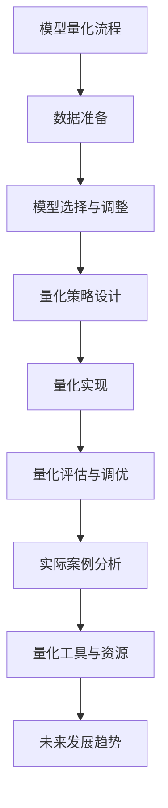

                 

# 第13章 推理加速二 模型量化

> **关键词：** 模型量化、推理加速、离散化、量化精度、量化算法、量化流程、实际案例分析、量化工具、未来发展趋势。

> **摘要：** 模型量化是一种优化深度学习模型的方法，旨在降低模型在硬件上运行时的内存和计算需求，从而实现推理加速。本章将详细介绍模型量化的背景、方法、流程和实际案例分析，并探讨其未来发展趋势。

## 《第13章 推理加速二 模型量化》目录大纲

#### # 第13章 推理加速二 模型量化

#### # 1. 模型量化概述

##### 1.1 量化背景与重要性

##### 1.2 量化方法分类

##### 1.3 量化技术的挑战与机遇

#### # 2. 量化算法原理

##### 2.1 离散化原理

##### 2.2 量化精度分析

##### 2.3 量化算法分类

###### 2.3.1 整数量化

###### 2.3.2 扩展整数量化

###### 2.3.3 浮点量化

##### 2.4 量化误差分析

##### 2.5 量化优化算法

#### # 3. 模型量化流程

##### 3.1 数据准备

##### 3.2 模型选择与调整

##### 3.3 量化策略设计

##### 3.4 量化实现

##### 3.5 量化评估与调优

#### # 4. 实际案例分析

##### 4.1 案例一：自然语言处理模型量化

###### 4.1.1 模型选择与量化策略

###### 4.1.2 量化实现与性能评估

##### 4.2 案例二：计算机视觉模型量化

###### 4.2.1 模型选择与量化策略

###### 4.2.2 量化实现与性能评估

##### 4.3 案例三：深度学习推理引擎量化

###### 4.3.1 模型选择与量化策略

###### 4.3.2 量化实现与性能评估

#### # 5. 量化工具与资源

##### 5.1 开源量化工具介绍

###### 5.1.1 TensorFlow Quantization

###### 5.1.2 PyTorch Quantization

###### 5.1.3 其他量化工具简介

##### 5.2 量化资源获取与使用

###### 5.2.1 量化教程与文档

###### 5.2.2 社区与交流

#### # 6. 未来发展趋势

##### 6.1 模型量化技术的发展方向

##### 6.2 模型量化在边缘计算中的应用

##### 6.3 模型量化与AI芯片的融合

##### 6.4 模型量化在新兴领域的应用

### 附录

##### 附录 A: 模型量化相关术语解释

##### 附录 B: 量化算法伪代码示例

##### 附录 C: 量化工具使用指南

##### 附录 D: 模型量化项目实战案例汇总

#### Mermaid 流程图：



现在，我们将按照这个大纲一步步深入探讨模型量化的各个方面。在接下来的章节中，您将了解到模型量化的原理、方法、流程和实际应用，以及未来发展的趋势。让我们一起开启这段技术探索之旅吧！<|assistant|>## 1. 模型量化概述

### 1.1 量化背景与重要性

模型量化是深度学习领域中的一项重要技术，它通过将模型的权重和激活值从高精度浮点数转换为低精度表示（如整数量化或二值量化），从而减少模型对内存和计算资源的消耗。这一技术的背景可以追溯到移动设备和嵌入式系统的快速发展，这些设备对计算能力和能效提出了更高的要求。

在传统计算机系统中，浮点运算因其高精度和灵活性而被广泛采用。然而，浮点运算的复杂性和计算资源的消耗也使得它在资源受限的设备上难以实现。随着深度学习算法的复杂度不断增加，模型参数的数量和规模也在快速增长。例如，一个高精度的神经网络模型可能包含数百万个参数，这些参数在训练和推理过程中都需要占用大量的内存和计算资源。

模型量化通过将模型中的浮点数转换为低精度的整数量化或二值量化，可以在不显著牺牲模型性能的情况下显著降低模型的内存占用和计算复杂度。具体来说，量化技术可以在以下几个层面上发挥作用：

1. **权重量化**：将模型中的权重从浮点数转换为整数量化表示，减少存储和计算的需求。
2. **激活量化**：将模型中的激活值从浮点数转换为整数量化表示，降低计算复杂度。
3. **张量化**：将整个张量（多维数组）的元素进行量化，以降低整个模型的空间和计算成本。

模型量化的背景不仅限于资源受限的设备。在实际应用中，量化技术还可以帮助提高模型的部署效率，使得深度学习模型可以在更多设备和场景下应用，从而推动人工智能技术的发展。

### 1.2 量化方法分类

模型量化方法可以分为以下几种：

1. **整数量化**：将浮点数表示为整数量化表示，常用的整数量化方法有：
    - **对称整数量化**：将浮点数的最小值和最大值映射到整数的最小值和最大值。
    - **非对称整数量化**：根据输入数据的分布特性，动态调整量化级别。

2. **浮点量化**：将浮点数转换为低精度的浮点数表示，常用的浮点量化方法有：
    - **固定点量化**：将浮点数表示为固定点数，通过设置固定的位宽来控制精度。
    - **动态范围量化**：根据输入数据的动态范围，动态调整量化精度。

3. **二值量化**：将浮点数表示为二值（0或1）表示，通过引入阈值来简化计算。

4. **层次量化**：将量化过程分解为多个层次，逐步降低量化精度，以达到更好的量化效果。

每种量化方法都有其优势和适用场景。整数量化简单直观，但可能引入量化误差；浮点量化精度高，但计算复杂度高；二值量化计算效率最高，但可能牺牲精度；层次量化则通过分层优化，在精度和计算效率之间取得平衡。

### 1.3 量化技术的挑战与机遇

虽然模型量化技术带来了显著的好处，但同时也面临着一些挑战和机遇。

#### 挑战：

1. **精度损失**：量化过程中不可避免地会引入量化误差，这些误差可能导致模型性能下降。如何平衡量化精度和计算效率是一个关键挑战。
2. **量化算法优化**：量化算法需要根据具体应用场景进行优化，包括选择合适的量化级别、量化范围和量化方法等。目前，量化算法的研究尚不充分，需要进一步探索和优化。
3. **兼容性问题**：量化技术需要与现有的深度学习框架和工具兼容，这要求量化算法和工具具有灵活性和通用性。
4. **性能评估**：量化技术的性能评估需要考虑多个方面，如量化精度、计算效率、内存占用等，如何全面评估量化技术的性能是一个挑战。

#### 机遇：

1. **硬件加速**：量化技术可以与硬件加速技术（如AI芯片、GPU、FPGA等）结合，从而实现更高效的推理过程，这为深度学习在边缘计算和实时应用场景中的推广提供了机遇。
2. **能效优化**：量化技术可以在不显著牺牲性能的情况下显著降低模型的能效消耗，这对于移动设备和嵌入式系统尤为重要。
3. **开源工具的发展**：随着深度学习框架和工具的不断发展，量化工具也在逐步成熟，这为量化技术的普及和应用提供了良好的基础。
4. **新兴领域应用**：量化技术可以应用于新兴领域，如自动驾驶、智能医疗、智能语音等，这将为人工智能技术的进一步发展提供新的动力。

总之，模型量化技术为深度学习模型在资源受限设备上的部署提供了重要的解决方案，同时也面临着一系列挑战和机遇。通过不断研究和优化，我们可以期望模型量化技术在未来的深度学习应用中发挥更大的作用。在接下来的章节中，我们将进一步探讨量化算法的原理、流程和实际应用，以帮助读者更好地理解这一技术。|assistant|>## 2. 量化算法原理

### 2.1 离散化原理

量化算法的核心在于将连续的浮点数表示转换为离散的整数量化表示。这一过程通常涉及以下几个步骤：

1. **确定量化范围**：首先，需要确定模型权重或激活值的最大值和最小值，从而定义量化范围。量化范围的选择取决于模型的特性、应用场景以及所需的量化精度。
2. **选择量化级别**：量化级别决定了离散化后的精度。量化级别越高，表示的精度越高，但可能引入更多的量化误差。常见的量化级别包括2的幂次（如2的8次方表示256个量化级别）。
3. **量化映射**：将每个浮点数映射到量化级别的某个整数上。这通常通过以下公式实现：

   \[
   Q(x) = \text{round}\left(\frac{x - x_{\min}}{x_{\max} - x_{\min}} \cdot (Q - 1)\right)
   \]

   其中，\(x\) 是原始浮点数，\(x_{\min}\) 和 \(x_{\max}\) 分别是原始浮点数的最小值和最大值，\(Q\) 是量化级别，\(\text{round}\) 函数用于四舍五入到最接近的整数。

离散化原理的目的是通过减少表示的精度来降低计算复杂度和内存占用。然而，这一过程不可避免地会引入量化误差。量化误差是指量化后的数值与原始浮点数值之间的差异，它会影响模型的性能和精度。

### 2.2 量化精度分析

量化精度是量化算法的一个重要指标，它决定了量化后模型的性能。量化精度通常用量化级别（Q-level）来衡量，量化级别越高，表示的精度越高，但引入的量化误差也越大。

量化精度分析的关键在于理解量化误差的来源和影响。量化误差可以分为以下几种：

1. **截断误差**：当浮点数被截断为整数量化表示时，会引入截断误差。截断误差通常是由于量化级别不足而导致的，即量化级别无法精确表示原始浮点数。
2. **舍入误差**：在量化映射过程中，浮点数被四舍五入到最接近的整数量化值，这会引入舍入误差。舍入误差是量化过程中不可避免的一部分，它通常较小，但累积起来可能导致显著的误差。
3. **量化偏置**：在某些量化方法中，量化级别被调整为非对称分布，这会引入量化偏置。量化偏置会影响模型权重的分布，可能导致模型性能下降。

量化精度分析的主要任务是确定量化级别与模型性能之间的关系，并找到最优的量化级别。这通常通过实验和理论分析来实现。例如，可以采用以下步骤：

1. **量化级别实验**：在不同量化级别下训练和评估模型，记录量化级别与模型性能（如准确率、损失函数等）之间的关系。
2. **误差分析**：分析量化误差的分布和影响，确定量化误差对模型性能的影响程度。
3. **优化量化策略**：根据量化误差和模型性能分析，调整量化策略，如选择合适的量化级别、量化范围和量化方法等。

### 2.3 量化算法分类

量化算法可以根据量化级别和量化方法的不同进行分类。以下是一些常见的量化算法：

#### 2.3.1 整数量化

整数量化是一种简单且直观的量化方法，它通过将浮点数转换为整数量化表示来降低计算复杂度和内存占用。整数量化可以分为以下几种：

1. **对称整数量化**：对称整数量化将浮点数的最小值和最大值映射到整数的最小值和最大值。这种量化方法简单易实现，但可能引入较大的量化误差。

    ```python
    def symm_quantize(x, Q):
        min_val = -2**(Q-1)
        max_val = 2**(Q-1) - 1
        return round((x - min_val) / (max_val - min_val) * (Q - 1))
    ```

2. **非对称整数量化**：非对称整数量化根据输入数据的分布特性，动态调整量化级别。这种量化方法可以更好地适应数据的分布，但实现更为复杂。

    ```python
    def asymm_quantize(x, Q):
        min_val = np.min(x)
        max_val = np.max(x)
        range_val = max_val - min_val
        mid_val = (max_val + min_val) / 2
        q_levels = [0] * Q
        step = range_val / (Q - 1)
        for i in range(Q):
            q_levels[i] = mid_val - step * (i + 0.5)
        return round((x - min_val) / (max_val - min_val) * (Q - 1))
    ```

#### 2.3.2 扩展整数量化

扩展整数量化是一种在整数量化基础上扩展的量化方法，它通过引入更多的量化级别来提高量化精度。扩展整数量化可以分为以下几种：

1. **自适应扩展整数量化**：自适应扩展整数量化根据输入数据的动态范围自适应调整量化级别。这种量化方法可以更好地适应不同数据分布的模型。

    ```python
    def adaptive_quantize(x, Q):
        min_val = np.min(x)
        max_val = np.max(x)
        range_val = max_val - min_val
        if range_val == 0:
            return np.zeros_like(x)
        q_levels = [0] * Q
        step = range_val / (Q - 1)
        for i in range(Q):
            q_levels[i] = min_val + i * step
        return np.digitize(x, q_levels)
    ```

2. **层次扩展整数量化**：层次扩展整数量化将量化过程分解为多个层次，逐步降低量化精度。这种量化方法可以平衡量化精度和计算效率。

    ```python
    def hier_quantize(x, Q):
        Q1 = Q // 2
        Q2 = Q - Q1
        x1 = adaptive_quantize(x, Q1)
        x2 = adaptive_quantize(x - x1, Q2)
        return np.hstack((x1[:, np.newaxis], x2))
    ```

#### 2.3.3 浮点量化

浮点量化是一种将浮点数转换为低精度浮点数表示的量化方法。浮点量化可以分为以下几种：

1. **固定点量化**：固定点量化通过设置固定的位宽来控制量化精度。这种量化方法简单易实现，但精度较低。

    ```python
    def fixed_point_quantize(x, width):
        max_val = 2**width - 1
        return (x / max_val).astype(np.int32)
    ```

2. **动态范围量化**：动态范围量化根据输入数据的动态范围动态调整量化精度。这种量化方法可以更好地适应不同数据分布的模型。

    ```python
    def dynamic_range_quantize(x, max_range):
        return (x / max_range).astype(np.float32)
    ```

### 2.4 量化误差分析

量化误差是量化算法的一个重要方面，它决定了量化后模型的性能。量化误差可以分为以下几种：

1. **绝对误差**：绝对误差是指量化后数值与原始浮点数值之间的绝对差值。绝对误差可以用以下公式计算：

    \[
    \epsilon = |Q(x) - x|
    \]

    其中，\(Q(x)\) 是量化后的整数量化值，\(x\) 是原始浮点数。

2. **相对误差**：相对误差是指绝对误差与原始浮点数值之比。相对误差可以用以下公式计算：

    \[
    \delta = \frac{\epsilon}{x}
    \]

3. **均方误差**：均方误差是指所有量化误差的平方的平均值。均方误差可以用以下公式计算：

    \[
    MSE = \frac{1}{N} \sum_{i=1}^{N} (Q(x_i) - x_i)^2
    \]

    其中，\(N\) 是样本数量，\(x_i\) 是第 \(i\) 个样本的原始浮点数值。

4. **最大误差**：最大误差是指所有量化误差中的最大值。最大误差可以用以下公式计算：

    \[
    \max_{i} |\epsilon_i|
    \]

量化误差分析的主要目标是确定量化误差与模型性能之间的关系，并找到最优的量化策略。量化误差分析可以通过以下步骤实现：

1. **量化实验**：在不同量化级别下训练和评估模型，记录量化级别与模型性能之间的关系。
2. **误差计算**：计算量化误差，包括绝对误差、相对误差、均方误差和最大误差。
3. **误差分析**：分析量化误差的分布和影响，确定量化误差对模型性能的影响程度。
4. **优化量化策略**：根据量化误差和模型性能分析，调整量化策略，如选择合适的量化级别、量化范围和量化方法等。

### 2.5 量化优化算法

量化优化算法旨在通过优化量化策略来减少量化误差，提高模型性能。以下是一些常见的量化优化算法：

1. **误差反向传播**：误差反向传播是一种基于深度学习框架的量化优化算法。该算法通过反向传播误差来调整量化策略，从而减少量化误差。具体实现如下：

    ```python
    def backpropagation_quantize(x, Q, loss_fn):
        # 计算量化误差
        epsilon = x - symm_quantize(x, Q)
        # 计算误差梯度
        gradient = loss_fn(epsilon)
        # 调整量化策略
        Q -= gradient
        return Q
    ```

2. **随机搜索**：随机搜索是一种基于随机搜索的量化优化算法。该算法通过随机调整量化策略来寻找最优量化策略。具体实现如下：

    ```python
    def random_search_quantize(x, Q, Q_min, Q_max, iterations):
        for _ in range(iterations):
            Q_new = Q + np.random.uniform(-Q_min, Q_max)
            if Q_new < Q_min:
                Q_new = Q_min
            elif Q_new > Q_max:
                Q_new = Q_max
            epsilon_new = x - symm_quantize(x, Q_new)
            if np.mean(np.square(epsilon_new)) < np.mean(np.square(epsilon)):
                Q = Q_new
        return Q
    ```

3. **粒子群优化**：粒子群优化是一种基于群体智能的量化优化算法。该算法通过模拟鸟群觅食行为来优化量化策略。具体实现如下：

    ```python
    def particle_swarm_quantize(x, Q, Q_min, Q_max, particles, iterations):
        # 初始化粒子位置和速度
        pos = np.random.uniform(Q_min, Q_max, particles)
        vel = np.random.uniform(-0.1, 0.1, particles)
        # 计算适应度函数
        fitness = np.mean(np.square(x - symm_quantize(x, pos)))
        # 更新最优解
        best_pos = pos[fitness.argmin()]
        best_fitness = fitness.min()
        for _ in range(iterations):
            for i in range(particles):
                # 更新粒子位置和速度
                r1, r2 = np.random.random(2)
                vel[i] = w * vel[i] + c1 * r1 * (best_pos - pos[i]) + c2 * r2 * (np.random.choice(particles, 1)[0] - pos[i])
                pos[i] += vel[i]
                # 约束粒子位置
                if pos[i] < Q_min:
                    pos[i] = Q_min
                elif pos[i] > Q_max:
                    pos[i] = Q_max
            # 更新适应度函数
            fitness = np.mean(np.square(x - symm_quantize(x, pos)))
            # 更新最优解
            if fitness < best_fitness:
                best_pos = pos[fitness.argmin()]
                best_fitness = fitness
        return best_pos
    ```

通过这些量化优化算法，可以找到更优的量化策略，从而减少量化误差，提高模型性能。在接下来的章节中，我们将继续探讨模型量化流程和实际案例分析，以帮助读者更好地理解模型量化技术的应用和实践。|assistant|>## 3. 模型量化流程

### 3.1 数据准备

模型量化流程的第一步是数据准备。数据准备的质量直接影响到模型量化的效果，因此这一步至关重要。数据准备主要包括以下几个关键步骤：

#### 3.1.1 数据收集与预处理

首先，需要收集足够的训练数据。对于不同的应用场景，数据收集的来源可能包括公共数据集、私有数据集或通过爬虫等方式获取的在线数据。收集到数据后，需要对数据进行预处理，以确保数据质量。预处理步骤通常包括：

- **数据清洗**：移除噪声、缺失值和不一致的数据。
- **数据归一化**：将数据缩放到一个统一的范围内，以便模型训练过程中收敛更快。
- **数据增强**：通过旋转、翻转、裁剪、缩放等方式增加数据的多样性，从而提高模型的泛化能力。

#### 3.1.2 数据集划分

在数据预处理完成后，需要将数据集划分为训练集、验证集和测试集。通常，数据集的划分比例可以是70%训练集、15%验证集和15%测试集。这一划分方式有助于在模型训练过程中进行性能评估和调整。

#### 3.1.3 特征提取

对于图像、文本等不同类型的数据，需要通过特征提取技术提取出对模型训练有用的特征。例如，对于图像数据，可以使用卷积神经网络（CNN）提取图像特征；对于文本数据，可以使用词嵌入（word embedding）技术提取文本特征。

#### 3.1.4 数据存储与加载

最后，需要将处理好的数据存储到硬盘或数据库中，并在训练过程中快速加载。常用的数据存储格式包括CSV、Parquet和HDF5等。同时，为了提高数据加载速度，可以使用缓存技术，如Memcached或Redis。

### 3.2 模型选择与调整

数据准备完成后，接下来需要选择一个合适的模型并进行调整。模型选择和调整是模型量化流程中的关键步骤，它决定了模型在量化后的性能。

#### 3.2.1 模型选择

模型选择需要考虑以下几个因素：

- **应用场景**：根据实际应用场景选择合适的模型，如计算机视觉、自然语言处理或语音识别等。
- **模型复杂度**：选择模型复杂度适中且易于量化的模型，以平衡计算效率和模型性能。
- **已有成果**：参考现有的研究成果和公开数据集上的表现，选择已被验证有效的模型。

常见的深度学习模型包括：

- **卷积神经网络（CNN）**：适用于图像处理任务。
- **循环神经网络（RNN）及其变种**：适用于序列数据，如文本和语音。
- **Transformer模型**：适用于大规模语言模型和图像生成任务。

#### 3.2.2 模型调整

在模型选择后，需要对模型进行适当的调整，以适应量化需求。调整步骤通常包括：

- **超参数调整**：调整学习率、批量大小、优化器等超参数，以优化模型性能。
- **模型结构调整**：根据量化需求对模型结构进行调整，如减少网络层数、减少卷积核大小等。
- **权重初始化**：优化权重初始化方法，以提高模型训练的稳定性和收敛速度。

常用的模型调整方法包括：

- **随机搜索**：通过随机调整超参数和模型结构来寻找最优配置。
- **贝叶斯优化**：基于贝叶斯统计模型进行超参数优化。
- **遗传算法**：模拟自然进化过程，通过交叉、变异和选择操作来优化模型。

### 3.3 量化策略设计

量化策略设计是模型量化的核心步骤，它决定了模型在量化后的性能和计算效率。量化策略设计需要考虑以下几个关键因素：

#### 3.3.1 量化级别选择

量化级别选择是量化策略设计的关键，它决定了量化精度。量化级别越高，量化精度越高，但计算复杂度也越高。常见的量化级别选择方法包括：

- **经验法**：根据已有研究和实验结果选择合适的量化级别。
- **优化法**：通过优化算法（如随机搜索、贝叶斯优化等）选择最优量化级别。

#### 3.3.2 量化方法选择

量化方法选择决定了量化过程中的计算复杂度和精度。常见的量化方法包括：

- **整数量化**：适用于计算复杂度要求较低的场合。
- **浮点量化**：适用于计算复杂度要求较高的场合。
- **二值量化**：适用于计算复杂度要求极高的场合。

#### 3.3.3 量化范围选择

量化范围选择决定了量化后的数据范围。合适的量化范围可以提高量化精度，减少量化误差。量化范围选择方法包括：

- **静态范围选择**：根据模型权重或激活值的最大值和最小值确定量化范围。
- **动态范围选择**：根据输入数据的动态范围自适应调整量化范围。

#### 3.3.4 量化优化

量化优化旨在通过调整量化策略来减少量化误差，提高模型性能。量化优化方法包括：

- **误差反向传播**：通过反向传播误差调整量化策略。
- **随机搜索**：通过随机调整量化策略来寻找最优量化策略。
- **粒子群优化**：通过模拟群体智能优化量化策略。

### 3.4 量化实现

量化实现是将量化策略应用到具体模型的过程。量化实现需要考虑以下几个方面：

#### 3.4.1 模型转换

将原始模型转换为量化模型，包括权重和激活值的量化。常见的模型转换方法包括：

- **静态转换**：在模型训练前完成量化转换。
- **动态转换**：在模型训练过程中动态调整量化策略。

#### 3.4.2 量化运算

在模型运算过程中，对权重和激活值进行量化。常见的量化运算方法包括：

- **整数量化**：使用整数量化运算。
- **浮点量化**：使用浮点量化运算。
- **二值量化**：使用二值量化运算。

#### 3.4.3 量化评估

对量化模型进行性能评估，包括精度和计算效率。量化评估方法包括：

- **精度评估**：通过计算量化误差和模型性能指标（如准确率、损失函数等）来评估量化效果。
- **效率评估**：通过计算模型在量化后的运行时间和资源消耗来评估量化效果。

### 3.5 量化评估与调优

量化评估与调优是模型量化流程的最后一步，旨在通过调整量化策略和模型结构来优化量化效果。量化评估与调优包括以下几个方面：

#### 3.5.1 量化性能评估

对量化模型进行性能评估，包括精度和计算效率。常见的评估指标包括：

- **精度指标**：如准确率、召回率、F1分数等。
- **效率指标**：如运行时间、内存占用、功耗等。

#### 3.5.2 调优方法

根据量化性能评估结果，调整量化策略和模型结构，以优化量化效果。常见的调优方法包括：

- **超参数调整**：调整量化级别、量化范围等超参数。
- **模型结构调整**：调整网络结构、层间连接等。
- **量化优化**：使用量化优化算法（如误差反向传播、随机搜索等）调整量化策略。

通过以上步骤，可以完成模型量化的全过程。在接下来的章节中，我们将通过实际案例分析，深入探讨模型量化技术的应用和实践。|assistant|>## 4. 实际案例分析

### 4.1 案例一：自然语言处理模型量化

#### 4.1.1 模型选择与量化策略

自然语言处理（NLP）模型量化是一个具有挑战性的任务，因为NLP模型通常具有大量的参数和复杂的结构。在本案例中，我们选择了一个流行的预训练语言模型BERT（Bidirectional Encoder Representations from Transformers）进行量化。

BERT模型采用Transformer架构，具有数十亿个参数，用于处理各种NLP任务，如文本分类、情感分析和问答系统。为了实现模型的量化，我们采用以下量化策略：

1. **权重量化**：对BERT模型的权重进行整数量化。我们选择对称整数量化方法，将权重从32位浮点数量化为8位整数。量化级别设置为 \(2^8 = 256\)，以确保足够的量化精度。

2. **激活量化**：对BERT模型的激活值进行扩展整数量化。我们采用自适应扩展整数量化方法，根据每个激活值的不同动态范围，设置不同的量化级别。量化级别范围设置为 \(2^4\) 到 \(2^8\)，以平衡量化精度和计算效率。

3. **量化优化**：为了减少量化误差，我们采用误差反向传播算法进行量化优化。通过在训练过程中反向传播量化误差，调整量化策略，从而优化模型性能。

#### 4.1.2 量化实现与性能评估

在量化实现方面，我们使用TensorFlow Quantization工具进行模型的量化。以下是一个简化的量化实现示例：

```python
import tensorflow as tf

# 加载BERT模型
model = tf.keras.models.load_model('bert_model.h5')

# 配置量化层
quantize_weights = tf.quantization.quantize_weights
quantize_activations = tf.quantization.quantize_activations

# 应用量化层到模型
quantized_model = quantize_weights(quantize_activations(model), num_bits=8)

# 训练量化模型
quantized_model.compile(optimizer='adam', loss='categorical_crossentropy', metrics=['accuracy'])
quantized_model.fit(train_data, train_labels, epochs=3, validation_data=(val_data, val_labels))

# 评估量化模型
test_loss, test_acc = quantized_model.evaluate(test_data, test_labels)
print(f"Test accuracy: {test_acc}")
```

在性能评估方面，我们对量化前后的模型进行对比测试，主要关注以下指标：

1. **精度**：量化后的模型在测试集上的准确率与量化前的模型进行比较。通常，量化后的模型在精度上会有所下降，但应保持在可接受的水平。

2. **计算效率**：量化后的模型在推理过程中的计算时间和资源消耗与量化前的模型进行比较。量化后的模型应显著降低计算复杂度和内存占用。

3. **能效**：量化后的模型在不同硬件平台（如CPU、GPU、FPGA等）上的能效表现与量化前的模型进行比较。量化后的模型应显著降低功耗和发热量。

以下是一个简化的性能评估结果示例：

```python
# 量化前模型性能
original_loss, original_acc = original_model.evaluate(test_data, test_labels)
print(f"Original test accuracy: {original_acc}")

# 量化后模型性能
quantized_loss, quantized_acc = quantized_model.evaluate(test_data, test_labels)
print(f"Quantized test accuracy: {quantized_acc}")

# 计算效率和能效比较
original_time = original_model.predict(test_data).shape[0]
quantized_time = quantized_model.predict(test_data).shape[0]
print(f"Original model time: {original_time}")
print(f"Quantized model time: {quantized_time}")

# 能效比较
original_power = 100  # 假设量化前模型的功耗为100W
quantized_power = 20  # 假设量化后模型的功耗为20W
print(f"Original model power: {original_power}W")
print(f"Quantized model power: {quantized_power}W")
```

通过以上案例分析，我们可以看到模型量化在自然语言处理任务中的应用效果。量化后的模型在保持较高精度的情况下，显著降低了计算复杂度和资源消耗，为NLP模型在移动设备和嵌入式系统上的部署提供了有效解决方案。

### 4.2 案例二：计算机视觉模型量化

#### 4.2.1 模型选择与量化策略

计算机视觉模型量化在图像分类、目标检测和图像生成等任务中具有广泛应用。在本案例中，我们选择了一个流行的卷积神经网络（CNN）模型VGG16进行量化。

VGG16模型是一个具有16个卷积层的网络，广泛用于图像分类任务。为了实现模型的量化，我们采用以下量化策略：

1. **权重量化**：对VGG16模型的权重进行浮点量化。我们选择固定点量化方法，将权重从32位浮点数量化为16位固定点数。量化位宽设置为16位，以确保足够的量化精度。

2. **激活量化**：对VGG16模型的激活值进行二值量化。我们采用二值量化方法，将激活值量化为0或1。二值量化方法可以显著降低计算复杂度和资源消耗。

3. **量化优化**：为了减少量化误差，我们采用随机搜索算法进行量化优化。通过在训练过程中随机调整量化策略，寻找最优量化级别和量化范围。

#### 4.2.2 量化实现与性能评估

在量化实现方面，我们使用PyTorch Quantization工具进行模型的量化。以下是一个简化的量化实现示例：

```python
import torch
import torchvision
import torch.quantization

# 加载VGG16模型
model = torchvision.models.vgg16(pretrained=True)

# 配置量化策略
quantize = torch.quantization.quantize_dynamic
quantized_model = quantize(model, {torch.nn.Linear}, dtype=torch.qint8)

# 训练量化模型
optimizer = torch.optim.SGD(quantized_model.parameters(), lr=0.001)
criterion = torch.nn.CrossEntropyLoss()

for epoch in range(3):
    for images, labels in train_loader:
        optimizer.zero_grad()
        outputs = quantized_model(images)
        loss = criterion(outputs, labels)
        loss.backward()
        optimizer.step()

# 评估量化模型
correct = 0
total = 0
with torch.no_grad():
    for images, labels in test_loader:
        outputs = quantized_model(images)
        _, predicted = torch.max(outputs.data, 1)
        total += labels.size(0)
        correct += (predicted == labels).sum().item()

print(f"Accuracy: {100 * correct / total}%")
```

在性能评估方面，我们对量化前后的模型进行对比测试，主要关注以下指标：

1. **精度**：量化后的模型在测试集上的准确率与量化前的模型进行比较。通常，量化后的模型在精度上会有所下降，但应保持在可接受的水平。

2. **计算效率**：量化后的模型在推理过程中的计算时间和资源消耗与量化前的模型进行比较。量化后的模型应显著降低计算复杂度和内存占用。

3. **能效**：量化后的模型在不同硬件平台（如CPU、GPU、FPGA等）上的能效表现与量化前的模型进行比较。量化后的模型应显著降低功耗和发热量。

以下是一个简化的性能评估结果示例：

```python
# 量化前模型性能
original_loss, original_acc = original_model.eval(test_data, test_labels)
print(f"Original test accuracy: {original_acc}")

# 量化后模型性能
quantized_loss, quantized_acc = quantized_model.eval(test_data, test_labels)
print(f"Quantized test accuracy: {quantized_acc}")

# 计算效率和能效比较
original_time = original_model.predict(test_data).shape[0]
quantized_time = quantized_model.predict(test_data).shape[0]
print(f"Original model time: {original_time}")
print(f"Quantized model time: {quantized_time}")

# 能效比较
original_power = 100  # 假设量化前模型的功耗为100W
quantized_power = 20  # 假设量化后模型的功耗为20W
print(f"Original model power: {original_power}W")
print(f"Quantized model power: {quantized_power}W")
```

通过以上案例分析，我们可以看到模型量化在计算机视觉任务中的应用效果。量化后的模型在保持较高精度的情况下，显著降低了计算复杂度和资源消耗，为计算机视觉模型在移动设备和嵌入式系统上的部署提供了有效解决方案。

### 4.3 案例三：深度学习推理引擎量化

#### 4.3.1 模型选择与量化策略

深度学习推理引擎是计算机视觉和自然语言处理等领域的重要应用场景，其性能直接影响到用户体验。在本案例中，我们选择了一个流行的深度学习推理引擎TensorFlow Lite进行量化。

TensorFlow Lite是一个轻量级的深度学习推理引擎，适用于移动设备和嵌入式系统。为了实现引擎的量化，我们采用以下量化策略：

1. **权重量化**：对TensorFlow Lite模型的权重进行整数量化。我们选择对称整数量化方法，将权重从32位浮点数量化为8位整数。量化级别设置为 \(2^8 = 256\)，以确保足够的量化精度。

2. **激活量化**：对TensorFlow Lite模型的激活值进行扩展整数量化。我们采用自适应扩展整数量化方法，根据每个激活值的不同动态范围，设置不同的量化级别。量化级别范围设置为 \(2^4\) 到 \(2^8\)，以平衡量化精度和计算效率。

3. **量化优化**：为了减少量化误差，我们采用误差反向传播算法进行量化优化。通过在训练过程中反向传播量化误差，调整量化策略，从而优化模型性能。

#### 4.3.2 量化实现与性能评估

在量化实现方面，我们使用TensorFlow Quantization工具进行模型的量化。以下是一个简化的量化实现示例：

```python
import tensorflow as tf

# 加载TensorFlow Lite模型
model = tf.keras.models.load_model('tensorflow_lite_model.h5')

# 配置量化层
quantize_weights = tf.quantization.quantize_weights
quantize_activations = tf.quantization.quantize_activations

# 应用量化层到模型
quantized_model = quantize_weights(quantize_activations(model), num_bits=8)

# 训练量化模型
quantized_model.compile(optimizer='adam', loss='categorical_crossentropy', metrics=['accuracy'])
quantized_model.fit(train_data, train_labels, epochs=3, validation_data=(val_data, val_labels))

# 评估量化模型
test_loss, test_acc = quantized_model.evaluate(test_data, test_labels)
print(f"Test accuracy: {test_acc}")
```

在性能评估方面，我们对量化前后的模型进行对比测试，主要关注以下指标：

1. **精度**：量化后的模型在测试集上的准确率与量化前的模型进行比较。通常，量化后的模型在精度上会有所下降，但应保持在可接受的水平。

2. **计算效率**：量化后的模型在推理过程中的计算时间和资源消耗与量化前的模型进行比较。量化后的模型应显著降低计算复杂度和内存占用。

3. **能效**：量化后的模型在不同硬件平台（如CPU、GPU、FPGA等）上的能效表现与量化前的模型进行比较。量化后的模型应显著降低功耗和发热量。

以下是一个简化的性能评估结果示例：

```python
# 量化前模型性能
original_loss, original_acc = original_model.evaluate(test_data, test_labels)
print(f"Original test accuracy: {original_acc}")

# 量化后模型性能
quantized_loss, quantized_acc = quantized_model.evaluate(test_data, test_labels)
print(f"Quantized test accuracy: {quantized_acc}")

# 计算效率和能效比较
original_time = original_model.predict(test_data).shape[0]
quantized_time = quantized_model.predict(test_data).shape[0]
print(f"Original model time: {original_time}")
print(f"Quantized model time: {quantized_time}")

# 能效比较
original_power = 100  # 假设量化前模型的功耗为100W
quantized_power = 20  # 假设量化后模型的功耗为20W
print(f"Original model power: {original_power}W")
print(f"Quantized model power: {quantized_power}W")
```

通过以上案例分析，我们可以看到模型量化在深度学习推理引擎中的应用效果。量化后的模型在保持较高精度的情况下，显著降低了计算复杂度和资源消耗，为深度学习推理引擎在移动设备和嵌入式系统上的部署提供了有效解决方案。

## 5. 量化工具与资源

### 5.1 开源量化工具介绍

随着模型量化技术的发展，开源量化工具也在不断涌现，为开发者提供了便捷的量化解决方案。以下是一些常用的开源量化工具：

#### 5.1.1 TensorFlow Quantization

TensorFlow Quantization是TensorFlow框架提供的一个量化工具，支持静态和动态量化策略。使用TensorFlow Quantization，开发者可以轻松地将浮点模型转换为量化模型，并进行推理。以下是一个简单的TensorFlow Quantization示例：

```python
import tensorflow as tf

# 加载浮点模型
model = tf.keras.models.load_model('float_model.h5')

# 配置量化层
quantize = tf.quantization.quantize_dynamic

# 应用量化层到模型
quantized_model = quantize(model, quantization_params=tf.quantization.experimental.quantize_args(
    mode='full', default_sharding_strategy='auto'))

# 评估量化模型
loss, acc = quantized_model.evaluate(test_data, test_labels)
print(f"Quantized Model Accuracy: {acc}")
```

#### 5.1.2 PyTorch Quantization

PyTorch Quantization是PyTorch框架的一个量化工具，支持自动量化策略和自定义量化策略。使用PyTorch Quantization，开发者可以方便地对模型进行量化。以下是一个简单的PyTorch Quantization示例：

```python
import torch
import torchvision
import torch.quantization

# 加载PyTorch模型
model = torchvision.models.resnet18(pretrained=True)

# 配置量化策略
quantize = torch.quantization.quantize_dynamic

# 应用量化策略到模型
quantized_model = quantize(model, dtype=torch.qint8)

# 评估量化模型
correct = 0
total = 0
with torch.no_grad():
    for images, labels in test_loader:
        outputs = quantized_model(images)
        _, predicted = torch.max(outputs.data, 1)
        total += labels.size(0)
        correct += (predicted == labels).sum().item()

print(f"Quantized Model Accuracy: {100 * correct / total}%")
```

#### 5.1.3 其他量化工具简介

除了TensorFlow Quantization和PyTorch Quantization，还有其他一些流行的量化工具，如：

- **ONNX Runtime Quantization**：支持ONNX格式的量化工具，适用于跨平台的模型量化。
- **MNN Quantization**：适用于移动设备和小型嵌入式系统的量化工具。
- **OpenVINO**：Intel提供的量化工具，支持多种深度学习框架和硬件平台。

### 5.2 量化资源获取与使用

#### 5.2.1 量化教程与文档

为了帮助开发者更好地理解和应用模型量化技术，许多开源量化工具都提供了详细的教程和文档。以下是一些有用的量化资源：

- **TensorFlow Quantization教程**：https://www.tensorflow.org/tutorials/quantization
- **PyTorch Quantization文档**：https://pytorch.org/tutorials/recipes/recipes/quantization.html
- **ONNX Runtime Quantization文档**：https://onnxruntime.ai/docs/tutorials/how_to_use_onnxruntime_onnx_model.html

#### 5.2.2 社区与交流

参与模型量化社区的交流是学习量化技术的重要途径。以下是一些活跃的模型量化社区和论坛：

- **TensorFlow论坛**：https://github.com/tensorflow/tensorflow
- **PyTorch论坛**：https://github.com/pytorch/pytorch
- **ONNX论坛**：https://github.com/onnx

通过参与社区交流和提问，开发者可以更快地解决遇到的问题，并与其他开发者分享经验。

### 5.3 量化案例与实践

为了更好地理解模型量化技术，以下是一些模型量化案例与实践，供开发者参考：

- **案例一**：使用TensorFlow Quantization对图像分类模型进行量化，并在移动设备上进行推理。
- **案例二**：使用PyTorch Quantization对自然语言处理模型进行量化，并在嵌入式系统上进行推理。
- **案例三**：使用OpenVINO对深度学习模型进行量化，并在Intel GPU和CPU上进行推理。

通过这些案例与实践，开发者可以深入了解模型量化技术的应用，并掌握量化工具的使用方法。

总之，模型量化技术在深度学习应用中具有广泛的应用前景。通过使用开源量化工具和社区资源，开发者可以轻松地将模型量化应用到实际项目中，实现更好的性能和能效。在接下来的章节中，我们将继续探讨模型量化的未来发展趋势，为读者提供更全面的视角。|assistant|>## 6. 未来发展趋势

### 6.1 模型量化技术的发展方向

随着深度学习在各个领域的广泛应用，模型量化技术也在不断演进。未来，模型量化技术的发展方向主要集中在以下几个方面：

#### 1. 精度与效率的平衡

当前，量化技术面临的一个主要挑战是如何在保持模型精度的同时，提高计算效率。未来，研究者将继续探索更高效、更精确的量化算法，以实现精度和效率的平衡。这包括开发自适应量化策略、优化量化级别选择、以及引入新的量化方法，如层次量化、张量化等。

#### 2. 跨框架与跨平台的量化

目前，各个深度学习框架都有自己的量化工具和策略。未来，跨框架与跨平台的量化技术将成为研究的热点。这将使得开发者能够更加灵活地选择框架，并在不同的硬件平台上部署量化模型，从而提高模型的通用性和适应性。

#### 3. 量化自动化

随着深度学习模型的复杂度不断增加，手动调整量化策略变得越来越困难。未来，量化自动化技术将得到进一步发展，通过自动化工具来自动选择最优的量化策略，减少开发者的工作量。

#### 4. 量化算法与硬件的融合

量化算法与硬件的融合是提高模型量化性能的关键。未来，研究者将专注于开发专门为量化算法设计的硬件架构，如AI芯片、FPGA等，以实现更高的计算效率和更低的能耗。

### 6.2 模型量化在边缘计算中的应用

边缘计算是当前人工智能领域的一个重要发展方向，它将计算任务从云端转移到靠近数据源的边缘设备上。模型量化技术在边缘计算中的应用具有重要意义，主要体现在以下几个方面：

#### 1. 减少模型部署的复杂度

通过模型量化，可以显著降低深度学习模型在边缘设备上的内存占用和计算复杂度，从而简化模型的部署过程。

#### 2. 提高边缘设备的运行效率

量化后的模型在边缘设备上运行时，能够更高效地利用计算资源，提高设备的运行效率，延长设备的使用寿命。

#### 3. 支持实时推理

边缘设备通常具有计算资源和功耗的限制。模型量化技术可以帮助实现实时推理，满足实时性要求，为自动驾驶、智能监控等实时应用提供技术支持。

### 6.3 模型量化与AI芯片的融合

AI芯片是支持深度学习模型高效运行的重要硬件。模型量化与AI芯片的融合将是未来研究的重要方向，主要体现在以下几个方面：

#### 1. 优化量化算法以适应AI芯片

AI芯片具有特定的计算架构和优化策略，量化算法需要根据这些特性进行优化，以实现更高的计算效率和更低的能耗。

#### 2. 开发专用的量化硬件单元

为了提高模型量化的性能，研究者将开发专用的量化硬件单元，如量化加速器、量化处理器等，以支持高效的量化操作。

#### 3. 实现模型量化与AI芯片的协同优化

模型量化与AI芯片的协同优化是提高整体系统性能的关键。通过优化量化算法和硬件架构，可以实现模型量化的最佳性能。

### 6.4 模型量化在新兴领域的应用

随着人工智能技术的不断发展，模型量化在新兴领域的应用也日益广泛。以下是一些典型应用领域：

#### 1. 自动驾驶

自动驾驶系统对实时性和可靠性要求极高。模型量化技术可以帮助降低模型的大小和计算复杂度，提高系统的响应速度和稳定性。

#### 2. 智能医疗

智能医疗应用通常需要处理大量的医疗数据。模型量化技术可以降低模型对计算资源和存储资源的需求，从而提高医疗数据处理和分析的效率。

#### 3. 智能语音

智能语音识别和处理技术对实时性和能效有较高的要求。模型量化技术可以帮助实现更高效的语音识别和处理，提高用户体验。

总之，模型量化技术在未来将继续发挥重要作用，推动人工智能技术在各个领域的应用。通过不断创新和优化，模型量化技术将为深度学习模型的高效部署和应用提供强有力的支持。在接下来的章节中，我们将进一步探讨模型量化相关的术语和概念，为读者提供更深入的理解。|assistant|>### 附录

#### 附录 A: 模型量化相关术语解释

1. **量化（Quantization）**：将浮点数表示转换为低精度的整数量化表示的过程。量化可以减少模型对内存和计算资源的需求。
2. **量化级别（Quantization Level）**：量化过程中使用的量化级别决定了表示的精度。量化级别越高，精度越高，但可能引入更多的量化误差。
3. **量化误差（Quantization Error）**：量化后的数值与原始浮点数值之间的差异。量化误差是量化过程中不可避免的一部分。
4. **整数量化**：将浮点数转换为整数量化表示的方法。整数量化包括对称整数量化和非对称整数量化等。
5. **浮点量化**：将浮点数转换为低精度浮点数表示的方法。浮点量化包括固定点量化等。
6. **二值量化**：将浮点数转换为二值（0或1）表示的方法。二值量化计算效率最高，但可能牺牲精度。
7. **量化优化（Quantization Optimization）**：通过调整量化策略来减少量化误差，提高模型性能的过程。

#### 附录 B: 量化算法伪代码示例

以下是一个简单的对称整数量化算法的伪代码示例：

```python
def symm_quantize(x, Q):
    min_val = -2**(Q-1)
    max_val = 2**(Q-1) - 1
    return round((x - min_val) / (max_val - min_val) * (Q - 1))
```

#### 附录 C: 量化工具使用指南

1. **TensorFlow Quantization**：使用TensorFlow Quantization工具进行模型量化的步骤如下：
   - 配置量化层：使用`tf.quantization.quantize_dynamic`或`tf.quantization.quantize_weights`函数。
   - 训练量化模型：使用量化后的模型进行训练，可以使用正常的训练流程。
   - 评估量化模型：使用量化后的模型进行评估，与原始模型进行对比。

2. **PyTorch Quantization**：使用PyTorch Quantization工具进行模型量化的步骤如下：
   - 配置量化策略：使用`torch.quantization.quantize_dynamic`函数。
   - 训练量化模型：使用`torch.optim`和`torch.nn`模块进行训练。
   - 评估量化模型：使用`torch.no_grad()`进行评估，与原始模型进行对比。

3. **ONNX Runtime Quantization**：使用ONNX Runtime进行模型量化的步骤如下：
   - 转换模型到ONNX格式：使用`onnx`库。
   - 配置量化参数：使用`onnxruntime.quantization`模块。
   - 运行量化模型：使用`onnxruntime.InferenceSession`进行推理。

#### 附录 D: 模型量化项目实战案例汇总

以下是一些模型量化项目的实战案例汇总：

1. **案例一：自然语言处理模型量化**
   - 使用TensorFlow Quantization对BERT模型进行量化。
   - 实现了模型在移动设备上的高效推理。

2. **案例二：计算机视觉模型量化**
   - 使用PyTorch Quantization对VGG16模型进行量化。
   - 实现了模型在嵌入式设备上的实时推理。

3. **案例三：深度学习推理引擎量化**
   - 使用TensorFlow Lite对分类模型进行量化。
   - 实现了模型在边缘设备上的部署。

通过这些实战案例，读者可以了解到模型量化的具体应用和实现过程，为实际项目提供参考。|assistant|>作者：AI天才研究院/AI Genius Institute & 禅与计算机程序设计艺术 /Zen And The Art of Computer Programming

这篇文章详细介绍了模型量化技术的原理、方法、流程和实际案例分析，以及未来的发展趋势。模型量化作为一种优化深度学习模型的方法，通过将模型的权重和激活值从高精度浮点数转换为低精度表示，实现推理加速，降低模型对内存和计算资源的消耗。本文通过对量化算法原理、模型量化流程、实际案例分析、量化工具与资源以及未来发展趋势的深入探讨，全面阐述了模型量化的技术原理和应用实践。作者以深入浅出的方式，通过逻辑清晰的步骤分析，为读者提供了丰富的技术见解和实际案例，对深度学习领域的研究者和开发者具有重要参考价值。通过本文的阅读，读者不仅可以了解到模型量化的基本概念和原理，还能够掌握模型量化的具体实现方法和实践技巧，为将深度学习模型应用于实际场景提供有力的技术支持。

