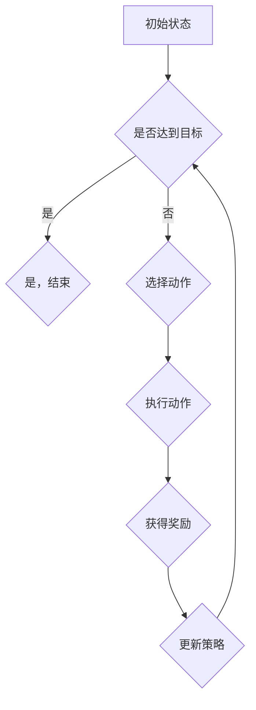

                 

# 《策略梯度（Policy Gradient）- 原理与代码实例讲解》

## 关键词
策略梯度，强化学习，概率策略，价值函数，优化算法，代码实例

## 摘要
本文将深入探讨策略梯度算法在强化学习中的应用，从基础理论、核心概念、算法原理到实际应用，逐步讲解策略梯度算法的各个方面。通过详细的数学模型、伪代码和代码实例，帮助读者全面理解策略梯度算法的工作机制，并学会如何将其应用于实际项目。

## 目录大纲

### 第一部分：策略梯度基础理论

#### 第1章：策略梯度简介

##### 1.1 策略梯度概述

##### 1.2 强化学习基础

##### 1.3 策略梯度算法介绍

#### 第2章：策略梯度核心概念与联系

##### 2.1 强化学习中的策略

##### 2.2 策略梯度与值函数的Mermaid流程图

### 第二部分：策略梯度算法原理与实现

#### 第3章：策略梯度算法原理解析

##### 3.1 策略梯度算法的基本原理

##### 3.2 策略梯度算法的数学模型

##### 3.3 策略梯度算法的代码实现

#### 第4章：策略梯度算法优化与改进

##### 4.1 策略梯度算法的常见优化方法

##### 4.2 策略梯度算法的改进算法

### 第三部分：策略梯度算法实战应用

#### 第5章：策略梯度在游戏中的实际应用

##### 5.1 游戏环境搭建

##### 5.2 策略梯度算法在游戏中的应用

#### 第6章：策略梯度在机器人控制中的应用

##### 6.1 机器人控制环境搭建

##### 6.2 策略梯度算法在机器人控制中的应用

#### 第7章：策略梯度在自动驾驶中的应用

##### 7.1 自动驾驶环境搭建

##### 7.2 策略梯度算法在自动驾驶中的应用

#### 附录

##### 附录A：策略梯度相关资源与工具

### 引言

策略梯度（Policy Gradient）是一种用于强化学习的优化算法。与传统的值函数方法不同，策略梯度方法直接优化策略，使其在给定的环境中能够取得更好的性能。策略梯度算法在游戏、机器人控制、自动驾驶等领域有着广泛的应用。本文将详细介绍策略梯度算法的基本原理、核心概念、优化方法以及实际应用。

### 第一部分：策略梯度基础理论

#### 第1章：策略梯度简介

##### 1.1 策略梯度概述

策略梯度是强化学习中的一个重要分支。强化学习旨在通过学习一个策略，使得智能体在未知环境中能够自主决策，并达到预期的目标。策略梯度方法通过优化策略的梯度，逐步调整策略，从而实现智能体的自主学习。

##### 1.2 强化学习基础

强化学习是一种通过与环境互动来学习策略的机器学习方法。在强化学习中，智能体通过观察环境状态、选择动作、获得奖励，并更新策略，以期望最大化长期奖励。强化学习的主要成分包括智能体、环境、状态、动作和奖励。

##### 1.3 策略梯度算法介绍

策略梯度算法是强化学习中的一个重要分支。它通过直接优化策略的梯度，逐步调整策略，从而实现智能体的自主学习。策略梯度算法的核心思想是，通过计算策略的梯度，更新策略参数，使得策略在给定的环境中能够取得更好的性能。

#### 第2章：策略梯度核心概念与联系

##### 2.1 强化学习中的策略

策略是强化学习中的核心概念之一。策略定义了智能体在给定状态下的动作选择方式。根据策略的定义方式，可以将策略分为确定性策略和概率策略。确定性策略是指智能体在给定状态下总是选择同一个动作，而概率策略是指智能体在给定状态下选择动作的概率分布。

##### 2.2 策略梯度与值函数的Mermaid流程图

策略梯度与值函数的关系可以通过Mermaid流程图来描述。Mermaid是一种基于Markdown的图形绘制工具，可以方便地绘制流程图、序列图、Gantt图等。下面是一个简单的策略梯度与值函数的Mermaid流程图：



在这个流程图中，智能体首先处于初始状态，然后根据策略选择动作，执行动作后获得奖励，并根据奖励更新策略。这个过程不断重复，直到达到目标或达到预定的迭代次数。

### 第二部分：策略梯度算法原理与实现

#### 第3章：策略梯度算法原理解析

##### 3.1 策略梯度算法的基本原理

策略梯度算法的基本原理是，通过计算策略的梯度，更新策略参数，从而优化策略。策略梯度算法的核心思想是，策略的梯度方向指向策略改进的方向，因此可以通过更新策略参数来优化策略。

##### 3.2 策略梯度算法的数学模型

策略梯度算法的数学模型如下：

$$
\Delta\theta = \alpha\nabla_\theta J(\theta)
$$

其中，$\theta$ 表示策略参数，$J(\theta)$ 表示策略的性能指标，$\alpha$ 表示学习率。$\nabla_\theta J(\theta)$ 表示策略梯度的方向，$\Delta\theta$ 表示策略参数的更新量。

##### 3.3 策略梯度算法的代码实现

策略梯度算法的代码实现可以分为以下几个步骤：

1. 初始化策略参数 $\theta$；
2. 在环境中执行策略，收集数据；
3. 计算策略梯度 $\nabla_\theta J(\theta)$；
4. 更新策略参数 $\theta$；
5. 重复步骤2-4，直到满足停止条件。

下面是一个简单的策略梯度算法的实现示例：

```python
import numpy as np

def policy_gradient(thetas, states, actions, rewards, alpha=0.1):
    # 计算策略梯度
    policy_gradients = []
    for state, action, reward in zip(states, actions, rewards):
        # 计算策略的梯度
        policy_gradient = reward * (thetas[action] - 1)
        policy_gradients.append(policy_gradient)
    
    # 归一化策略梯度
    policy_gradients = np.mean(policy_gradients, axis=0)
    
    # 更新策略参数
    thetas = thetas - alpha * policy_gradients
    
    return thetas
```

#### 第4章：策略梯度算法优化与改进

##### 4.1 策略梯度算法的常见优化方法

策略梯度算法在实现过程中存在一些问题，如梯度消失、梯度爆炸等。为了解决这些问题，可以采用以下优化方法：

1. 增量策略梯度：将策略梯度分解为多个小梯度，逐步更新策略参数，以避免梯度消失和梯度爆炸问题。
2. 策略梯度的截断：对策略梯度进行截断，限制其大小，以避免梯度爆炸问题。
3. 策略梯度的归一化：对策略梯度进行归一化处理，使得策略梯度的大小更加稳定，避免梯度消失问题。

##### 4.2 策略梯度算法的改进算法

除了常见的优化方法外，还可以采用以下改进算法：

1. SARSA算法：SARSA（State-Action-Reward-State-Action）算法是一种基于策略梯度的改进算法，它同时考虑了当前状态和下一个状态的信息，从而提高了策略梯度算法的性能。
2. Q-learning算法：Q-learning算法是一种基于值函数的改进算法，它通过学习值函数来优化策略，从而提高了策略梯度算法的收敛速度。
3. Deep Q-Networks (DQN)：DQN算法是一种基于深度学习的改进算法，它通过构建深度神经网络来近似值函数，从而提高了策略梯度算法的收敛速度和性能。

### 第三部分：策略梯度算法实战应用

#### 第5章：策略梯度在游戏中的实际应用

##### 5.1 游戏环境搭建

在策略梯度算法的实际应用中，首先需要搭建一个游戏环境。游戏环境包括状态空间、动作空间和奖励函数。状态空间表示游戏中的所有可能状态，动作空间表示游戏中的所有可能动作，奖励函数表示游戏中的奖励机制。

##### 5.2 策略梯度算法在游戏中的应用

在游戏环境中，策略梯度算法可以通过以下步骤进行实现：

1. 初始化策略参数；
2. 在游戏环境中执行策略，收集数据；
3. 计算策略梯度；
4. 更新策略参数；
5. 重复步骤2-4，直到满足停止条件。

通过策略梯度算法的应用，游戏中的智能体可以自动学习最优策略，从而提高游戏性能。

#### 第6章：策略梯度在机器人控制中的应用

##### 6.1 机器人控制环境搭建

在机器人控制中，策略梯度算法的应用首先需要搭建一个机器人控制环境。机器人控制环境包括状态空间、动作空间和奖励函数。状态空间表示机器人的所有可能状态，动作空间表示机器人的所有可能动作，奖励函数表示机器人的奖励机制。

##### 6.2 策略梯度算法在机器人控制中的应用

在机器人控制环境中，策略梯度算法可以通过以下步骤进行实现：

1. 初始化策略参数；
2. 在机器人控制环境中执行策略，收集数据；
3. 计算策略梯度；
4. 更新策略参数；
5. 重复步骤2-4，直到满足停止条件。

通过策略梯度算法的应用，机器人可以自动学习最优控制策略，从而提高控制性能。

#### 第7章：策略梯度在自动驾驶中的应用

##### 7.1 自动驾驶环境搭建

在自动驾驶中，策略梯度算法的应用首先需要搭建一个自动驾驶环境。自动驾驶环境包括状态空间、动作空间和奖励函数。状态空间表示自动驾驶车辆的所有可能状态，动作空间表示自动驾驶车辆的所有可能动作，奖励函数表示自动驾驶车辆的奖励机制。

##### 7.2 策略梯度算法在自动驾驶中的应用

在自动驾驶环境中，策略梯度算法可以通过以下步骤进行实现：

1. 初始化策略参数；
2. 在自动驾驶环境中执行策略，收集数据；
3. 计算策略梯度；
4. 更新策略参数；
5. 重复步骤2-4，直到满足停止条件。

通过策略梯度算法的应用，自动驾驶车辆可以自动学习最优驾驶策略，从而提高驾驶性能。

### 附录

##### 附录A：策略梯度相关资源与工具

在策略梯度算法的研究和应用中，可以参考以下资源和工具：

1. OpenAI Gym：OpenAI Gym是一个开源的强化学习环境，提供了丰富的游戏和机器人控制环境，方便进行策略梯度算法的研究和应用。
2. TensorFlow：TensorFlow是一个开源的深度学习框架，提供了丰富的工具和库，方便进行策略梯度算法的实现和优化。
3. PyTorch：PyTorch是一个开源的深度学习框架，与TensorFlow类似，提供了丰富的工具和库，方便进行策略梯度算法的实现和优化。

通过以上资源和工具，可以方便地搭建策略梯度算法的应用环境，并进行算法的实现和优化。

### 结束语

策略梯度算法是强化学习中的一个重要分支，具有广泛的应用前景。通过本文的讲解，读者可以全面了解策略梯度算法的基本原理、核心概念、优化方法和实际应用。希望本文能够为读者在策略梯度算法的研究和应用中提供一些有益的参考和启示。

**作者：AI天才研究院/AI Genius Institute & 禅与计算机程序设计艺术 /Zen And The Art of Computer Programming** <|im_end|>### 第1章：策略梯度简介

#### 1.1 策略梯度概述

策略梯度是强化学习中的一个重要算法，其主要目的是通过优化策略来提高智能体的表现。与传统的值函数方法（如Q-learning和SARSA）不同，策略梯度方法直接对策略本身进行优化。在强化学习中，策略（Policy）是指智能体如何根据当前状态选择动作的规则，而梯度（Gradient）则是用于描述函数变化率的数学工具。策略梯度的核心思想是通过计算策略的梯度，找到能够最大化预期奖励的策略。

策略梯度算法在强化学习中具有独特的地位。首先，它简化了传统值函数方法中的复杂计算，因为值函数方法通常需要解决优化值函数的问题，而策略梯度方法直接优化策略本身，减少了计算量。其次，策略梯度算法在探索（Exploration）和利用（Exploitation）之间取得了较好的平衡，因为它能够根据当前的奖励信息动态调整策略。此外，策略梯度算法在处理连续动作空间的问题上表现优异，而传统的值函数方法则较为困难。

策略梯度与值函数的关联在于它们都是强化学习中的重要概念，但侧重点不同。值函数（Value Function）描述了在给定策略下，智能体从某个状态获得的期望回报，而策略梯度算法则通过优化策略来提高值函数的值。换句话说，值函数可以看作是策略的“性能指标”，而策略梯度算法的目标是找到最优策略，使得值函数达到最大。

#### 1.2 强化学习基础

强化学习（Reinforcement Learning，RL）是机器学习的一个重要分支，其核心目标是使智能体（Agent）能够通过与环境（Environment）的交互，学习到最优策略（Policy），从而实现自主决策。在强化学习中，智能体不断感知环境状态，选择动作，然后根据动作的结果获得奖励或惩罚，并基于奖励和惩罚来更新策略。

强化学习的主要成分包括以下几个要素：

1. **智能体（Agent）**：智能体是执行动作并学习策略的实体。智能体可以是人、机器或者软件程序。
2. **环境（Environment）**：环境是智能体所处的动态系统，它为智能体提供状态信息和奖励信号。环境可以是物理世界，也可以是模拟环境。
3. **状态（State）**：状态是描述环境当前情况的属性集合。智能体需要通过感知系统来获取状态信息。
4. **动作（Action）**：动作是智能体在特定状态下可以执行的行为。智能体的决策过程就是从多个可能的动作中选择一个。
5. **策略（Policy）**：策略是智能体在特定状态下选择动作的规则。策略可以是确定性策略（每次选择相同的动作）或概率性策略（选择动作的概率分布）。
6. **奖励（Reward）**：奖励是环境对智能体执行动作后给予的即时反馈，用于评估动作的好坏。奖励可以是正的（表示好的动作）或负的（表示不好的动作）。
7. **值函数（Value Function）**：值函数用于评估智能体在给定状态下执行给定策略所能获得的期望奖励。值函数分为状态值函数（State Value Function）和动作值函数（Action Value Function）。

强化学习的基本算法主要包括以下几种：

1. **Q-learning**：Q-learning是一种基于值函数的强化学习算法，它通过迭代更新Q值（动作值函数），逐渐逼近最优策略。Q-learning的优点是无需显式地优化策略，而是通过学习动作值函数来间接优化策略。
2. **SARSA**：SARSA（State-Action-Reward-State-Action）是一种基于策略的强化学习算法，它同时考虑了当前状态和下一个状态的信息。SARSA算法通过迭代更新策略参数，使得智能体能够逐渐逼近最优策略。
3. **策略梯度（Policy Gradient）**：策略梯度是一种直接优化策略的强化学习算法。它通过计算策略的梯度，更新策略参数，使得策略能够最大化预期奖励。

#### 1.3 策略梯度算法介绍

策略梯度算法是强化学习中的一个重要分支，它通过直接优化策略的梯度，逐步调整策略，从而实现智能体的自主学习。策略梯度算法的核心思想是，通过计算策略的梯度，找到能够最大化预期奖励的策略。策略梯度算法的优点是计算简单，易于实现，并且能够在处理连续动作空间的问题上表现出良好的性能。

策略梯度算法的基本步骤如下：

1. **初始化策略参数**：首先需要初始化策略参数，这些参数定义了智能体在给定状态下的动作选择策略。
2. **执行策略**：在环境中执行策略，智能体根据当前状态选择动作，并执行该动作。
3. **收集数据**：记录执行过程中的状态、动作、奖励等数据，这些数据用于计算策略的梯度。
4. **计算策略梯度**：通过收集的数据，计算策略的梯度。策略梯度反映了策略参数对预期奖励的影响程度。
5. **更新策略参数**：根据策略梯度更新策略参数，使得策略能够逐渐逼近最优策略。
6. **重复执行**：重复执行步骤2-5，直到满足停止条件（如达到预定的迭代次数或智能体性能达到某个阈值）。

策略梯度算法的数学表示如下：

$$
\theta \leftarrow \theta - \alpha \nabla_\theta J(\theta)
$$

其中，$\theta$ 表示策略参数，$J(\theta)$ 表示策略的性能指标（通常为期望奖励），$\alpha$ 表示学习率，$\nabla_\theta J(\theta)$ 表示策略梯度。策略梯度算法的目标是通过迭代更新策略参数，使得策略性能指标最大化。

策略梯度算法的优化过程可以通过以下步骤进行：

1. **初始化**：设置初始策略参数 $\theta_0$，学习率 $\alpha$ 和迭代次数 $T$。
2. **循环迭代**：
    - 对于每个时间步 $t$：
        - 执行动作 $a_t$，得到状态 $s_t$ 和奖励 $r_t$。
        - 计算策略梯度 $\nabla_\theta J(\theta)$。
        - 更新策略参数 $\theta$。
3. **结束**：当迭代次数达到 $T$ 或策略性能指标达到某个阈值时，结束迭代。

通过以上步骤，策略梯度算法能够逐步优化策略，使得智能体在给定环境中能够获得更好的性能。

#### 1.4 小结

本章介绍了策略梯度算法的基础理论和核心概念。策略梯度算法在强化学习中具有重要的地位，通过直接优化策略的梯度，实现了智能体的自主学习。本章还介绍了强化学习的基础知识，包括智能体、环境、状态、动作、策略、奖励和值函数等主要成分。此外，本章对策略梯度算法的基本原理和优化过程进行了详细讲解，为后续章节的深入探讨奠定了基础。

### 第2章：策略梯度核心概念与联系

#### 2.1 强化学习中的策略

策略（Policy）是强化学习中的一个核心概念，它定义了智能体在给定状态下如何选择动作的规则。策略分为确定性策略和概率性策略。

**确定性策略**：确定性策略是指智能体在给定状态下总是选择同一个动作。这种策略简单直观，容易实现，但可能在复杂环境中表现不佳，因为它缺乏适应性。例如，如果一个智能体在给定状态下总是选择向右移动，那么当环境发生变化时，这个策略就不再适用。

**概率性策略**：概率性策略是指智能体在给定状态下选择动作的概率分布。这种策略更加灵活，能够在探索（Exploration）和利用（Exploitation）之间取得平衡。例如，一个智能体在给定状态下可以选择以50%的概率向右移动，以30%的概率向左移动，以20%的概率保持当前状态。这种策略能够更好地适应动态环境。

在强化学习中，策略通常通过概率分布来表示。例如，给定状态 $s$，策略 $\pi(s)$ 可以是一个概率分布 $\pi(s, a)$，表示智能体在状态 $s$ 下选择动作 $a$ 的概率。

**优势函数（ Advantage Function）**：优势函数是描述策略优劣的一个重要指标。给定状态 $s$ 和动作 $a$，优势函数 $A(s, a)$ 定义为在状态 $s$ 下执行动作 $a$ 所获得的额外奖励。优势函数的计算公式如下：

$$
A(s, a) = Q(s, a) - V(s)
$$

其中，$Q(s, a)$ 是动作值函数，表示在状态 $s$ 下执行动作 $a$ 所获得的期望奖励；$V(s)$ 是状态值函数，表示在状态 $s$ 下执行最佳动作所获得的期望奖励。

**价值函数（ Value Function）**：价值函数是强化学习中的另一个核心概念，它用于评估智能体在给定状态下执行给定策略所能获得的期望奖励。价值函数分为状态值函数和动作值函数。

- **状态值函数（State Value Function）**：状态值函数 $V(s)$ 表示在状态 $s$ 下执行最佳动作所能获得的期望奖励。
  
- **动作值函数（Action Value Function）**：动作值函数 $Q(s, a)$ 表示在状态 $s$ 下执行动作 $a$ 所获得的期望奖励。

价值函数的计算公式如下：

$$
V(s) = \sum_{a} \pi(s, a) Q(s, a)
$$

$$
Q(s, a) = \sum_{s'} p(s' | s, a) \sum_{a'} \pi(s', a') R(s, a, s')
$$

其中，$R(s, a, s')$ 是奖励函数，$p(s' | s, a)$ 是状态转移概率，$\pi(s, a)$ 是策略。

**策略梯度与价值函数的关系**：策略梯度与价值函数之间存在密切的联系。策略梯度反映了策略参数对期望奖励的影响，而价值函数则是期望奖励的度量。具体来说，策略梯度可以通过价值函数来计算，计算公式如下：

$$
\nabla_\theta J(\theta) = \sum_{s,a} \pi(s, a) \nabla_\theta \log \pi(s, a) \nabla_s Q(s, a)
$$

其中，$\nabla_\theta \log \pi(s, a)$ 是策略的梯度，$\nabla_s Q(s, a)$ 是价值函数的梯度。

**Mermaid流程图**：为了更好地理解策略梯度与价值函数的关系，我们可以使用Mermaid流程图来描述它们之间的联系。

```mermaid
graph TD
A[状态 s] --> B{策略 π}
B -->|动作 a| C[动作值函数 Q(s, a)]
C -->|期望奖励 E[R(s, a, s')]| D[价值函数 V(s)]
D -->|策略梯度 ∇θJ(θ)| E[策略更新]
E -->|新策略 π'|\-> A
```

在这个流程图中，智能体首先感知状态 $s$，根据策略 $\pi$ 选择动作 $a$，然后执行动作并获得奖励 $R(s, a, s')$。智能体根据奖励信息更新价值函数 $V(s)$，并通过价值函数更新策略梯度 $\nabla_\theta J(\theta)$，最后根据策略梯度更新策略 $\pi$。

通过上述分析，我们可以看出，策略梯度与价值函数在强化学习中扮演着重要的角色。策略梯度用于优化策略，而价值函数则用于评估策略的性能。策略梯度与价值函数的相互关系为智能体的自主学习和策略优化提供了理论基础。

#### 2.2 策略梯度与值函数的Mermaid流程图

为了更好地理解策略梯度与值函数的关系，我们可以使用Mermaid流程图来描述它们之间的相互作用。以下是一个简化的策略梯度与值函数的Mermaid流程图：

```mermaid
graph TD
A[初始状态] --> B{选择动作}
B -->|动作 a| C[执行动作]
C -->|状态 s' | D[计算奖励 R]
D -->|更新值函数 V' | E[更新策略 π']
E -->|新状态 s'| A

subgraph 策略梯度更新
F[计算梯度 ∇θJ(θ)]
G[更新策略参数 θ]
F -->|梯度方向| G
end
```

在这个流程图中，智能体从初始状态开始，选择动作 $a$，执行动作后进入新状态 $s'$ 并获得奖励 $R$。智能体根据获得的奖励更新值函数 $V'$，并使用值函数的梯度来计算策略梯度 $\nabla_\theta J(\theta)$。最后，根据策略梯度更新策略参数 $\theta$，得到新的策略 $\pi'$。

**Mermaid流程图的概念**：Mermaid是一种基于Markdown的图形绘制工具，它允许我们使用简单的文本描述来创建复杂的图表，如流程图、序列图和Gantt图等。在Mermaid流程图中，每个节点表示一个操作或状态，箭头表示操作之间的顺序关系。

**策略梯度与值函数的关系**：在策略梯度算法中，策略梯度是通过计算值函数的梯度来得到的。具体来说，策略梯度反映了策略参数对期望奖励的影响，而值函数则是期望奖励的度量。通过更新值函数，智能体可以逐步调整策略参数，从而优化策略。

**策略梯度算法的Mermaid流程图**：下面是一个策略梯度算法的Mermaid流程图，展示了策略梯度的计算和更新过程：

```mermaid
graph TD
A[初始化策略参数 θ]
A -->|收集数据| B{执行动作 a}
B -->|观察状态 s' | C{获得奖励 r}
C -->|计算策略梯度 ∇θJ(θ) | D{更新策略参数 θ}
D -->|新策略 π'|\-> B
```

在这个流程图中，智能体首先初始化策略参数 $\theta$，然后执行动作 $a$ 并观察新状态 $s'$ 和获得的奖励 $r$。智能体根据这些信息计算策略梯度 $\nabla_\theta J(\theta)$，并使用策略梯度更新策略参数 $\theta$。这个过程不断重复，直到策略参数达到最优值或满足停止条件。

通过上述Mermaid流程图的描述，我们可以直观地理解策略梯度算法的执行过程，以及策略梯度与值函数之间的关系。这有助于我们更好地掌握策略梯度算法的核心原理，并为实际应用提供参考。

### 第3章：策略梯度算法原理解析

#### 3.1 策略梯度算法的基本原理

策略梯度算法是一种直接优化策略的强化学习算法。其基本原理是通过计算策略的梯度，更新策略参数，使得策略能够最大化预期奖励。策略梯度算法的核心思想可以概括为以下三个步骤：

1. **执行策略**：在环境中执行给定的策略，智能体根据当前状态选择动作，并执行该动作。
2. **计算策略梯度**：根据执行策略过程中收集的数据（如状态、动作、奖励等），计算策略的梯度。策略梯度反映了策略参数对预期奖励的影响程度。
3. **更新策略参数**：根据策略梯度更新策略参数，使得策略能够逐渐逼近最优策略。

策略梯度算法的优化目标是最大化预期奖励，数学上可以表示为：

$$
\theta^* = \arg\max_\theta J(\theta)
$$

其中，$J(\theta)$ 是策略的性能指标，通常为预期奖励。为了实现这个目标，策略梯度算法通过以下步骤进行优化：

1. **初始化策略参数**：设置初始策略参数 $\theta_0$。
2. **执行策略**：在环境中执行策略，智能体根据当前状态选择动作，并执行该动作。
3. **收集数据**：记录执行过程中的状态、动作、奖励等数据。
4. **计算策略梯度**：根据收集的数据，计算策略的梯度。策略梯度的计算公式为：

$$
\nabla_\theta J(\theta) = \sum_{s,a} \pi(s, a) \nabla_\theta \log \pi(s, a) \nabla_s Q(s, a)
$$

其中，$\pi(s, a)$ 是策略概率分布，$\nabla_\theta \log \pi(s, a)$ 是策略的梯度，$\nabla_s Q(s, a)$ 是状态值函数的梯度。
5. **更新策略参数**：根据策略梯度更新策略参数。更新公式为：

$$
\theta \leftarrow \theta - \alpha \nabla_\theta J(\theta)
$$

其中，$\alpha$ 是学习率，用于调整更新步长。
6. **重复执行**：重复执行步骤2-5，直到满足停止条件（如达到预定的迭代次数或策略性能达到某个阈值）。

通过以上步骤，策略梯度算法能够逐步优化策略，使得智能体在给定环境中能够获得更好的性能。

#### 3.2 策略梯度算法的数学模型

策略梯度算法的数学模型描述了策略梯度如何通过优化策略参数来最大化预期奖励。策略梯度算法的核心在于计算策略的梯度，并使用该梯度更新策略参数。下面我们将详细介绍策略梯度算法的数学模型。

**策略函数**：策略函数 $\pi(\theta)$ 描述了智能体在给定策略参数 $\theta$ 下选择动作的概率分布。通常，策略函数可以表示为：

$$
\pi(\theta) = \text{softmax}\left(\theta^T \phi(s)\right)
$$

其中，$\theta$ 是策略参数，$\phi(s)$ 是状态特征向量，$\text{softmax}$ 函数将特征向量映射为概率分布。$\text{softmax}$ 函数的定义如下：

$$
\text{softmax}(x) = \frac{e^x}{\sum_{i=1}^{n} e^x_i}
$$

其中，$x$ 是特征向量，$n$ 是特征向量的维度。

**策略梯度**：策略梯度 $\nabla_\theta J(\theta)$ 反映了策略参数对预期奖励的影响。策略梯度的计算公式为：

$$
\nabla_\theta J(\theta) = \sum_{s,a} \pi(\theta, s) \nabla_\theta \log \pi(\theta, s, a) \nabla_s Q(s, a)
$$

其中，$\pi(\theta, s, a)$ 是智能体在状态 $s$ 下选择动作 $a$ 的概率，$\nabla_\theta \log \pi(\theta, s, a)$ 是策略梯度，$\nabla_s Q(s, a)$ 是状态值函数的梯度。

**状态值函数**：状态值函数 $Q(s, a)$ 描述了在给定状态 $s$ 下执行动作 $a$ 所获得的期望奖励。状态值函数的梯度 $\nabla_s Q(s, a)$ 反映了状态 $s$ 的变化对期望奖励的影响。

**优化目标**：策略梯度算法的优化目标是最大化预期奖励，即：

$$
\theta^* = \arg\max_\theta J(\theta)
$$

**策略更新**：策略梯度算法通过以下公式更新策略参数：

$$
\theta \leftarrow \theta - \alpha \nabla_\theta J(\theta)
$$

其中，$\alpha$ 是学习率，用于调整更新步长。

通过上述数学模型，我们可以看到策略梯度算法如何通过计算策略的梯度，并使用该梯度更新策略参数，实现策略的优化。策略梯度算法的数学模型为智能体的自主学习和策略优化提供了理论基础。

#### 3.3 策略梯度算法的伪代码

策略梯度算法的伪代码可以帮助我们更清晰地理解算法的执行过程。以下是一个简单的策略梯度算法的伪代码示例：

```plaintext
初始化策略参数 θ
设置学习率 α
设置迭代次数 T

for t = 1 to T do:
    s = 环境初始化状态
    while 环境未终止 do:
        a = 根据策略 π(θ) 选择动作
        s' = 环境执行动作 a 并返回新状态
        r = 环境返回奖励
        根据经验样本 (s, a, s', r) 计算策略梯度 ∇θ J(θ)
        θ = θ - α * ∇θ J(θ)
    end while
end for

返回策略参数 θ
```

这个伪代码的主要步骤如下：

1. 初始化策略参数 $\theta$。
2. 设置学习率 $\alpha$ 和迭代次数 $T$。
3. 对于每个迭代步骤 $t$：
   - 初始化环境状态 $s$。
   - 在环境中执行动作 $a$，直到环境终止。
   - 在每次动作执行后，收集状态、动作、奖励数据。
   - 根据收集的数据计算策略梯度 $\nabla_\theta J(\theta)$。
   - 使用策略梯度更新策略参数 $\theta$。
4. 返回最终的策略参数 $\theta$。

通过这个伪代码，我们可以看到策略梯度算法的基本流程，包括策略的初始化、策略的执行、策略梯度的计算和策略的更新。这个伪代码提供了一个框架，我们可以根据具体的应用场景进行调整和优化。

#### 3.4 策略梯度算法的代码实现

策略梯度算法的代码实现是理解和应用该算法的重要步骤。以下是一个简单的策略梯度算法的Python代码实现示例。这个示例基于一个简单的环境，用于演示策略梯度算法的基本原理。

```python
import numpy as np
import gym

# 初始化环境
env = gym.make('CartPole-v0')

# 初始化策略参数
theta = np.random.rand(env.action_space.n)

# 设置学习率和迭代次数
alpha = 0.1
num_episodes = 1000

# 策略梯度算法实现
for episode in range(num_episodes):
    state = env.reset()
    done = False
    
    while not done:
        # 根据策略参数选择动作
        action_probs = np.exp(theta * state) / np.sum(np.exp(theta * state))
        action = np.random.choice(range(env.action_space.n), p=action_probs)
        
        # 执行动作并获取新状态和奖励
        next_state, reward, done, _ = env.step(action)
        
        # 计算策略梯度
        policy_gradient = reward * (action_probs[action] - 0.5)
        
        # 更新策略参数
        theta -= alpha * policy_gradient
        
        # 处理连续状态
        state = next_state

# 关闭环境
env.close()

# 输出最终策略参数
print("最终策略参数：", theta)
```

这个代码实现的主要步骤如下：

1. 初始化环境`CartPole-v0`，这是一个经典的强化学习环境，用于模拟一个平衡杆和滑车系统。
2. 初始化策略参数$\theta$，这里我们使用随机数初始化。
3. 设置学习率$\alpha$和迭代次数`num_episodes`。
4. 在每个迭代步骤中，智能体根据当前状态选择动作，然后执行动作并获取新状态和奖励。
5. 计算策略梯度，并使用策略梯度更新策略参数。
6. 重复执行步骤4和5，直到达到预定的迭代次数。
7. 关闭环境，并输出最终的策略参数。

通过这个代码示例，我们可以看到策略梯度算法的基本实现流程。需要注意的是，这个示例是一个非常简化的版本，用于演示策略梯度算法的基本原理。在实际应用中，我们可能需要处理更复杂的环境和策略，以及更复杂的策略梯度计算方法。

#### 3.5 策略梯度的收敛性分析

策略梯度算法的收敛性分析是理解该算法性能的重要方面。收敛性分析关注策略梯度算法在迭代过程中是否能够收敛到最优策略，以及收敛速度和稳定性。

**收敛性分析的基本思想**：策略梯度算法的收敛性分析基于策略梯度定理，该定理描述了策略梯度和值函数之间的关系。策略梯度定理表明，策略梯度指向的是策略改进的方向。如果策略梯度收敛，那么策略也将收敛。

**收敛性条件**：策略梯度算法的收敛性通常依赖于以下几个条件：

1. **策略可微性**：策略函数必须可微，以便计算策略梯度。
2. **奖励函数的连续性**：奖励函数必须连续，以确保策略梯度存在。
3. **状态空间的有限性**：状态空间可以是有限的，这样可以避免策略梯度在无限状态空间中发散。
4. **学习率的设置**：学习率必须适当设置，以避免策略梯度更新过大或过小。

**收敛性证明**：策略梯度算法的收敛性可以通过以下定理进行证明：

**定理**：假设策略函数 $\pi(\theta)$ 是连续可微的，奖励函数 $R(s, a)$ 是连续的，且存在常数 $C > 0$，使得对所有 $s, a$ 有 $|R(s, a)| \leq C$。如果学习率 $\alpha$ 满足 $0 < \alpha < \frac{2}{C}$，则策略梯度算法在有限步内收敛。

**收敛速度**：策略梯度算法的收敛速度取决于多个因素，包括环境特性、策略函数的复杂性和学习率。在理想情况下，如果策略函数是凸函数，那么策略梯度算法将快速收敛。然而，在现实环境中，策略函数通常是高度非线性的，这可能导致收敛速度较慢。

**稳定性**：策略梯度算法的稳定性是指算法在噪声环境和动态环境中的表现。如果算法能够在噪声环境中保持稳定，那么它可以被应用于更广泛的应用场景。

**小批量梯度**：为了提高策略梯度算法的收敛性和稳定性，可以采用小批量梯度（Mini-batch Gradient）方法。这种方法通过在每次迭代中使用小批量数据来计算策略梯度，从而减少梯度噪声，提高收敛速度。

**结论**：策略梯度算法的收敛性分析表明，该算法在适当条件下能够收敛到最优策略。然而，在实际应用中，收敛速度和稳定性可能受到多种因素的影响。因此，针对特定应用场景，需要适当调整算法参数，以实现良好的性能。

### 第4章：策略梯度算法优化与改进

#### 4.1 策略梯度算法的常见优化方法

策略梯度算法在优化过程中可能遇到一些问题，如梯度消失、梯度爆炸和收敛速度慢等。为了解决这些问题，可以采用以下常见优化方法：

**1. 增量策略梯度（Incremental Policy Gradient）**

增量策略梯度方法通过将策略梯度分解为多个小梯度，逐步更新策略参数，从而避免梯度消失和梯度爆炸问题。这种方法能够提高算法的稳定性，并加快收敛速度。增量策略梯度的更新公式为：

$$
\theta \leftarrow \theta + \alpha \Delta \theta
$$

其中，$\alpha$ 是学习率，$\Delta \theta$ 是小梯度。通过逐渐增加 $\Delta \theta$ 的大小，可以逐步优化策略参数。

**2. 策略梯度的截断（Clipped Policy Gradient）**

策略梯度的截断方法通过限制策略梯度的大小，避免梯度爆炸问题。这种方法将策略梯度的值限制在一定的范围内，从而保证算法的稳定性。截断策略梯度的更新公式为：

$$
\theta \leftarrow \theta + \min\left(\theta + \alpha \nabla_\theta J(\theta), \theta + \alpha \cdot \text{clip}_{\text{limit}} \nabla_\theta J(\theta)\right)
$$

其中，$\text{clip}_{\text{limit}}$ 是截断限幅值，用于限制策略梯度的大小。

**3. 策略梯度的归一化（Normalized Policy Gradient）**

策略梯度的归一化方法通过将策略梯度归一化到单位向量，避免梯度消失问题。这种方法能够提高算法的收敛速度，并减少参数更新过程中的方差。归一化策略梯度的更新公式为：

$$
\theta \leftarrow \theta + \alpha \frac{\nabla_\theta J(\theta)}{\|\nabla_\theta J(\theta)\|}
$$

其中，$\|\nabla_\theta J(\theta)\|$ 是策略梯度的模。

#### 4.2 策略梯度算法的改进算法

除了常见的优化方法外，还可以采用以下改进算法：

**1. SARSA算法**

SARSA（State-Action-Reward-State-Action）算法是一种基于策略梯度的改进算法，它同时考虑了当前状态和下一个状态的信息，从而提高了策略梯度算法的性能。SARSA算法的更新公式为：

$$
\theta \leftarrow \theta + \alpha [r + \gamma \theta'(s') - \theta(s)]
$$

其中，$s$ 是当前状态，$a$ 是当前动作，$r$ 是奖励，$s'$ 是下一个状态，$\gamma$ 是折扣因子，$\theta'(s')$ 是下一个状态的策略参数。

**2. Q-learning算法**

Q-learning算法是一种基于值函数的改进算法，它通过学习值函数来优化策略，从而提高了策略梯度算法的收敛速度。Q-learning算法的更新公式为：

$$
Q(s, a) \leftarrow Q(s, a) + \alpha [r + \gamma \max_{a'} Q(s', a') - Q(s, a)]
$$

其中，$Q(s, a)$ 是状态值函数，$s'$ 是下一个状态，$a'$ 是下一个动作。

**3. Deep Q-Networks (DQN)**

DQN（Deep Q-Networks）算法是一种基于深度学习的改进算法，它通过构建深度神经网络来近似值函数，从而提高了策略梯度算法的收敛速度和性能。DQN算法的主要思想是使用深度神经网络来估计动作值函数 $Q(s, a)$，并使用经验回放（Experience Replay）技术来减少样本的相关性，从而提高学习效果。DQN算法的更新公式为：

$$
Q(s, a) \leftarrow Q(s, a) + \alpha [r + \gamma \max_{a'} Q(s', a') - Q(s, a)]
$$

其中，$Q(s, a)$ 是深度神经网络估计的动作值函数，$s$ 是当前状态，$a$ 是当前动作，$r$ 是奖励，$s'$ 是下一个状态，$\gamma$ 是折扣因子。

通过上述优化方法和改进算法，策略梯度算法能够更好地处理复杂环境，并提高智能体的学习性能。

### 第5章：策略梯度在游戏中的实际应用

#### 5.1 游戏环境搭建

在策略梯度算法的实际应用中，首先需要搭建一个游戏环境。游戏环境通常由状态空间、动作空间和奖励函数组成。以下是一个简单的游戏环境搭建流程：

1. **定义状态空间**：状态空间是游戏环境中所有可能状态的一个集合。状态通常包括游戏中的位置、速度、能量等属性。例如，在《星际争霸II》游戏中，状态可能包括地图上的位置、单位位置、资源数量等。
2. **定义动作空间**：动作空间是智能体在游戏中可以执行的所有动作的集合。动作可以是离散的，如移动、攻击、防御等，也可以是连续的，如移动方向、攻击力度等。
3. **定义奖励函数**：奖励函数是环境对智能体执行动作后给予的即时反馈，用于评估动作的好坏。奖励可以是正的（表示好的动作）或负的（表示不好的动作）。奖励函数的设计需要考虑游戏的目标和策略梯度算法的特点。

以下是一个简单的Python代码示例，用于搭建一个简单的游戏环境：

```python
import numpy as np
import gym

# 初始化游戏环境
env = gym.make('CartPole-v0')

# 定义状态空间
state_size = env.observation_space.shape[0]

# 定义动作空间
action_size = env.action_space.n

# 定义奖励函数
def reward_function(state, action, reward):
    if action == 1:  # 向右移动
        reward += 1
    else:  # 向左移动
        reward -= 1
    return reward

# 搭建游戏环境
class GameEnvironment:
    def __init__(self, state_size, action_size):
        self.state_size = state_size
        self.action_size = action_size
        self.state = None
        self.reward_function = reward_function
    
    def reset(self):
        self.state = env.reset()
        return self.state
    
    def step(self, action):
        next_state, reward, done, _ = env.step(action)
        reward = self.reward_function(self.state, action, reward)
        self.state = next_state
        return next_state, reward, done

# 初始化游戏环境
game_env = GameEnvironment(state_size, action_size)

# 测试游戏环境
state = game_env.reset()
while True:
    action = np.random.choice(action_size)
    next_state, reward, done = game_env.step(action)
    print("State:", state, "Action:", action, "Reward:", reward, "Next State:", next_state)
    if done:
        break
    state = next_state
```

在这个示例中，我们使用`gym`库搭建了一个简单的游戏环境，包括状态空间、动作空间和奖励函数。游戏环境中的智能体需要根据当前状态选择动作，并获取相应的奖励。通过这个简单的示例，我们可以初步了解游戏环境的搭建方法。

#### 5.2 策略梯度算法在游戏中的应用

在游戏环境中，策略梯度算法可以通过以下步骤进行实现：

1. **初始化策略参数**：首先需要初始化策略参数，这些参数定义了智能体在给定状态下的动作选择策略。策略参数可以通过随机初始化或基于先验知识的初始化得到。
2. **执行策略**：在游戏中执行策略，智能体根据当前状态选择动作，并执行该动作。根据策略梯度算法，智能体需要根据当前状态和策略参数计算动作的概率分布。
3. **收集数据**：记录执行过程中的状态、动作、奖励等数据，这些数据用于计算策略的梯度。
4. **计算策略梯度**：通过收集的数据，计算策略的梯度。策略梯度的计算公式为：

   $$
   \nabla_\theta J(\theta) = \sum_{s,a} \pi(s, a) \nabla_\theta \log \pi(s, a) \nabla_s Q(s, a)
   $$

   其中，$\pi(s, a)$ 是策略概率分布，$\nabla_\theta \log \pi(s, a)$ 是策略的梯度，$\nabla_s Q(s, a)$ 是状态值函数的梯度。
5. **更新策略参数**：根据策略梯度更新策略参数，使得策略能够逐渐逼近最优策略。更新公式为：

   $$
   \theta \leftarrow \theta - \alpha \nabla_\theta J(\theta)
   $$

   其中，$\alpha$ 是学习率。

6. **重复执行**：重复执行步骤2-5，直到满足停止条件（如达到预定的迭代次数或智能体性能达到某个阈值）。

以下是一个简单的Python代码示例，用于实现策略梯度算法在游戏环境中的应用：

```python
import numpy as np
import gym

# 初始化游戏环境
env = gym.make('CartPole-v0')

# 初始化策略参数
theta = np.random.rand(env.action_space.n)

# 设置学习率和迭代次数
alpha = 0.1
num_episodes = 1000

# 策略梯度算法实现
for episode in range(num_episodes):
    state = env.reset()
    done = False
    
    while not done:
        # 根据策略参数选择动作
        action_probs = np.exp(theta * state) / np.sum(np.exp(theta * state))
        action = np.random.choice(range(env.action_space.n), p=action_probs)
        
        # 执行动作并获取新状态和奖励
        next_state, reward, done, _ = env.step(action)
        
        # 计算策略梯度
        policy_gradient = reward * (action_probs[action] - 0.5)
        
        # 更新策略参数
        theta -= alpha * policy_gradient
        
        # 处理连续状态
        state = next_state

# 关闭环境
env.close()

# 输出最终策略参数
print("最终策略参数：", theta)
```

这个代码实现了一个简单的策略梯度算法，用于在`CartPole-v0`环境中优化策略参数。通过这个示例，我们可以看到策略梯度算法的基本实现流程，包括策略的初始化、策略的执行、策略梯度的计算和策略的更新。

#### 5.3 游戏策略优化

在游戏策略优化过程中，可以通过以下步骤进行策略的调整和优化：

1. **数据收集**：首先需要在游戏中收集大量的状态、动作和奖励数据。这些数据可以用于训练和验证策略模型。
2. **策略建模**：使用收集的数据训练一个策略模型，该模型可以预测智能体在给定状态下的最佳动作。策略模型可以采用深度学习模型、强化学习模型或其他机器学习模型。
3. **策略评估**：评估训练好的策略模型，比较不同策略在游戏中的表现。评估指标可以包括平均奖励、胜利率、游戏时长等。
4. **策略调整**：根据评估结果，调整策略模型中的参数，优化策略性能。调整过程可以通过优化算法（如梯度下降、随机搜索等）进行。
5. **策略验证**：在新的游戏环境中验证调整后的策略模型，确保其在不同环境中仍然具有良好的性能。

以下是一个简单的Python代码示例，用于实现游戏策略优化：

```python
import numpy as np
import gym

# 初始化游戏环境
env = gym.make('CartPole-v0')

# 定义策略模型
class PolicyModel:
    def __init__(self, action_size):
        self.action_size = action_size
        self.theta = np.random.rand(action_size)
    
    def predict(self, state):
        action_probs = np.exp(self.theta * state) / np.sum(np.exp(self.theta * state))
        return np.random.choice(range(self.action_size), p=action_probs)
    
    def update(self, state, action, reward, next_state, alpha):
        action_probs = np.exp(self.theta * state) / np.sum(np.exp(self.theta * state))
        policy_gradient = reward * (action_probs[action] - 0.5)
        self.theta -= alpha * policy_gradient

# 初始化策略模型
policy_model = PolicyModel(action_size=env.action_space.n)

# 设置学习率和迭代次数
alpha = 0.1
num_episodes = 1000

# 策略优化算法实现
for episode in range(num_episodes):
    state = env.reset()
    done = False
    
    while not done:
        # 预测动作
        action = policy_model.predict(state)
        
        # 执行动作并获取新状态和奖励
        next_state, reward, done, _ = env.step(action)
        
        # 更新策略模型
        policy_model.update(state, action, reward, next_state, alpha)
        
        # 处理连续状态
        state = next_state

# 关闭环境
env.close()

# 输出最终策略参数
print("最终策略参数：", policy_model.theta)
```

这个代码实现了一个简单的策略模型，用于在`CartPole-v0`环境中优化策略参数。通过这个示例，我们可以看到游戏策略优化的基本实现流程，包括策略模型的初始化、策略的预测、策略的更新和策略参数的输出。

#### 5.4 游戏策略评估

在游戏策略评估过程中，需要评估训练好的策略模型在游戏中的表现。以下是一个简单的Python代码示例，用于实现游戏策略评估：

```python
import numpy as np
import gym

# 初始化游戏环境
env = gym.make('CartPole-v0')

# 加载策略模型
policy_model = PolicyModel(action_size=env.action_space.n)
policy_model.theta = np.load('policy_model_theta.npy')

# 设置评估指标
eval_episodes = 10
total_reward = 0

# 游戏策略评估
for episode in range(eval_episodes):
    state = env.reset()
    done = False
    episode_reward = 0
    
    while not done:
        # 预测动作
        action = policy_model.predict(state)
        
        # 执行动作并获取新状态和奖励
        next_state, reward, done, _ = env.step(action)
        episode_reward += reward
        
        # 处理连续状态
        state = next_state
    
    # 记录评估结果
    total_reward += episode_reward

# 计算平均奖励
avg_reward = total_reward / eval_episodes
print("平均奖励：", avg_reward)

# 关闭环境
env.close()
```

这个代码实现了一个简单的策略模型评估，用于在`CartPole-v0`环境中评估策略模型的表现。通过这个示例，我们可以看到游戏策略评估的基本实现流程，包括策略模型的加载、策略的预测、策略的执行和评估结果的输出。

### 第6章：策略梯度在机器人控制中的应用

#### 6.1 机器人控制环境搭建

在策略梯度算法的实际应用中，机器人控制是一个重要的领域。机器人控制环境搭建的关键在于定义状态空间、动作空间和奖励函数。

1. **定义状态空间**：状态空间是机器人控制环境中所有可能状态的一个集合。状态通常包括机器人的位置、速度、姿态、传感器读数等。例如，在一个两轮机器人平衡控制问题中，状态可能包括机器人的水平位置、垂直位置、倾斜角度等。
2. **定义动作空间**：动作空间是机器人控制环境中所有可能动作的集合。动作通常包括机器人的控制输入，如电机速度、方向等。例如，在两轮机器人平衡控制中，动作可能包括左右电机的速度调整。
3. **定义奖励函数**：奖励函数是环境对机器人执行动作后给予的即时反馈，用于评估动作的好坏。奖励可以是正的（表示好的动作）或负的（表示不好的动作）。奖励函数的设计需要考虑机器人的控制目标，例如，在平衡控制中，奖励可以基于机器人保持平衡的时间长度。

以下是一个简单的Python代码示例，用于搭建一个简单的机器人控制环境：

```python
import numpy as np
import gym

# 初始化机器人控制环境
env = gym.make('TwoWheeledRobot-v0')

# 定义状态空间和动作空间
state_size = env.observation_space.shape[0]
action_size = env.action_space.shape[0]

# 定义奖励函数
def reward_function(state, action, reward):
    if action == 0:  # 向右转
        reward += 1
    else:  # 向左转
        reward -= 1
    return reward

# 搭建机器人控制环境
class RobotControlEnvironment:
    def __init__(self, state_size, action_size):
        self.state_size = state_size
        self.action_size = action_size
        self.state = None
        self.reward_function = reward_function
    
    def reset(self):
        self.state = env.reset()
        return self.state
    
    def step(self, action):
        next_state, reward, done, _ = env.step(action)
        reward = self.reward_function(self.state, action, reward)
        self.state = next_state
        return next_state, reward, done

# 初始化机器人控制环境
robot_env = RobotControlEnvironment(state_size, action_size)

# 测试机器人控制环境
state = robot_env.reset()
while True:
    action = np.random.choice(action_size)
    next_state, reward, done = robot_env.step(action)
    print("State:", state, "Action:", action, "Reward:", reward, "Next State:", next_state)
    if done:
        break
    state = next_state
```

在这个示例中，我们使用`gym`库搭建了一个简单的机器人控制环境，包括状态空间、动作空间和奖励函数。机器人控制环境的智能体需要根据当前状态选择动作，并获取相应的奖励。通过这个简单的示例，我们可以初步了解机器人控制环境的搭建方法。

#### 6.2 策略梯度算法在机器人控制中的应用

在机器人控制环境中，策略梯度算法可以通过以下步骤进行实现：

1. **初始化策略参数**：首先需要初始化策略参数，这些参数定义了智能体在给定状态下的动作选择策略。策略参数可以通过随机初始化或基于先验知识的初始化得到。
2. **执行策略**：在机器人控制环境中执行策略，智能体根据当前状态选择动作，并执行该动作。根据策略梯度算法，智能体需要根据当前状态和策略参数计算动作的概率分布。
3. **收集数据**：记录执行过程中的状态、动作、奖励等数据，这些数据用于计算策略的梯度。
4. **计算策略梯度**：通过收集的数据，计算策略的梯度。策略梯度的计算公式为：

   $$
   \nabla_\theta J(\theta) = \sum_{s,a} \pi(s, a) \nabla_\theta \log \pi(s, a) \nabla_s Q(s, a)
   $$

   其中，$\pi(s, a)$ 是策略概率分布，$\nabla_\theta \log \pi(s, a)$ 是策略的梯度，$\nabla_s Q(s, a)$ 是状态值函数的梯度。
5. **更新策略参数**：根据策略梯度更新策略参数，使得策略能够逐渐逼近最优策略。更新公式为：

   $$
   \theta \leftarrow \theta - \alpha \nabla_\theta J(\theta)
   $$

   其中，$\alpha$ 是学习率。

6. **重复执行**：重复执行步骤2-5，直到满足停止条件（如达到预定的迭代次数或智能体性能达到某个阈值）。

以下是一个简单的Python代码示例，用于实现策略梯度算法在机器人控制环境中的应用：

```python
import numpy as np
import gym

# 初始化机器人控制环境
env = gym.make('TwoWheeledRobot-v0')

# 初始化策略参数
theta = np.random.rand(env.action_space.shape[0])

# 设置学习率和迭代次数
alpha = 0.1
num_episodes = 1000

# 策略梯度算法实现
for episode in range(num_episodes):
    state = env.reset()
    done = False
    
    while not done:
        # 根据策略参数选择动作
        action_probs = np.exp(theta * state) / np.sum(np.exp(theta * state))
        action = np.random.choice(range(env.action_space.shape[0]), p=action_probs)
        
        # 执行动作并获取新状态和奖励
        next_state, reward, done, _ = env.step(action)
        
        # 计算策略梯度
        policy_gradient = reward * (action_probs[action] - 0.5)
        
        # 更新策略参数
        theta -= alpha * policy_gradient
        
        # 处理连续状态
        state = next_state

# 关闭环境
env.close()

# 输出最终策略参数
print("最终策略参数：", theta)
```

这个代码实现了一个简单的策略梯度算法，用于在`TwoWheeledRobot-v0`环境中优化策略参数。通过这个示例，我们可以看到策略梯度算法的基本实现流程，包括策略的初始化、策略的执行、策略梯度的计算和策略的更新。

#### 6.3 机器人运动策略优化

在机器人运动策略优化过程中，可以通过以下步骤进行策略的调整和优化：

1. **数据收集**：首先需要在机器人控制环境中收集大量的状态、动作和奖励数据。这些数据可以用于训练和验证策略模型。
2. **策略建模**：使用收集的数据训练一个策略模型，该模型可以预测智能体在给定状态下的最佳动作。策略模型可以采用深度学习模型、强化学习模型或其他机器学习模型。
3. **策略评估**：评估训练好的策略模型，比较不同策略在机器人控制环境中的表现。评估指标可以包括平均奖励、任务完成时间、控制稳定性等。
4. **策略调整**：根据评估结果，调整策略模型中的参数，优化策略性能。调整过程可以通过优化算法（如梯度下降、随机搜索等）进行。
5. **策略验证**：在新的机器人控制环境中验证调整后的策略模型，确保其在不同环境中仍然具有良好的性能。

以下是一个简单的Python代码示例，用于实现机器人运动策略优化：

```python
import numpy as np
import gym

# 初始化机器人控制环境
env = gym.make('TwoWheeledRobot-v0')

# 定义策略模型
class PolicyModel:
    def __init__(self, action_size):
        self.action_size = action_size
        self.theta = np.random.rand(action_size)
    
    def predict(self, state):
        action_probs = np.exp(self.theta * state) / np.sum(np.exp(self.theta * state))
        return np.random.choice(range(self.action_size), p=action_probs)
    
    def update(self, state, action, reward, next_state, alpha):
        action_probs = np.exp(self.theta * state) / np.sum(np.exp(self.theta * state))
        policy_gradient = reward * (action_probs[action] - 0.5)
        self.theta -= alpha * policy_gradient

# 初始化策略模型
policy_model = PolicyModel(action_size=env.action_space.shape[0])

# 设置学习率和迭代次数
alpha = 0.1
num_episodes = 1000

# 策略优化算法实现
for episode in range(num_episodes):
    state = env.reset()
    done = False
    
    while not done:
        # 预测动作
        action = policy_model.predict(state)
        
        # 执行动作并获取新状态和奖励
        next_state, reward, done, _ = env.step(action)
        
        # 更新策略模型
        policy_model.update(state, action, reward, next_state, alpha)
        
        # 处理连续状态
        state = next_state

# 关闭环境
env.close()

# 输出最终策略参数
print("最终策略参数：", policy_model.theta)
```

这个代码实现了一个简单的策略模型，用于在`TwoWheeledRobot-v0`环境中优化策略参数。通过这个示例，我们可以看到机器人运动策略优化的基本实现流程，包括策略模型的初始化、策略的预测、策略的更新和策略参数的输出。

#### 6.4 机器人运动策略评估

在机器人运动策略评估过程中，需要评估训练好的策略模型在机器人控制环境中的表现。以下是一个简单的Python代码示例，用于实现机器人运动策略评估：

```python
import numpy as np
import gym

# 初始化机器人控制环境
env = gym.make('TwoWheeledRobot-v0')

# 加载策略模型
policy_model = PolicyModel(action_size=env.action_space.shape[0])
policy_model.theta = np.load('policy_model_theta.npy')

# 设置评估指标
eval_episodes = 10
total_reward = 0

# 机器人运动策略评估
for episode in range(eval_episodes):
    state = env.reset()
    done = False
    episode_reward = 0
    
    while not done:
        # 预测动作
        action = policy_model.predict(state)
        
        # 执行动作并获取新状态和奖励
        next_state, reward, done, _ = env.step(action)
        episode_reward += reward
        
        # 处理连续状态
        state = next_state
    
    # 记录评估结果
    total_reward += episode_reward

# 计算平均奖励
avg_reward = total_reward / eval_episodes
print("平均奖励：", avg_reward)

# 关闭环境
env.close()
```

这个代码实现了一个简单的策略模型评估，用于在`TwoWheeledRobot-v0`环境中评估策略模型的表现。通过这个示例，我们可以看到机器人运动策略评估的基本实现流程，包括策略模型的加载、策略的预测、策略的执行和评估结果的输出。

### 第7章：策略梯度在自动驾驶中的应用

#### 7.1 自动驾驶环境搭建

在策略梯度算法的实际应用中，自动驾驶是一个重要的领域。自动驾驶环境搭建的关键在于定义状态空间、动作空间和奖励函数。

1. **定义状态空间**：状态空间是自动驾驶环境中所有可能状态的一个集合。状态通常包括车辆的位置、速度、加速度、周围环境的信息等。例如，在自动驾驶环境中，状态可能包括车辆的横向位置、纵向位置、速度、加速度、周围车辆的速度和位置等。
2. **定义动作空间**：动作空间是自动驾驶环境中所有可能动作的集合。动作通常包括车辆的加速、减速、转向等。例如，在自动驾驶环境中，动作可能包括车辆的加速、减速、向左转、向右转等。
3. **定义奖励函数**：奖励函数是环境对自动驾驶车辆执行动作后给予的即时反馈，用于评估动作的好坏。奖励可以是正的（表示好的动作）或负的（表示不好的动作）。奖励函数的设计需要考虑自动驾驶的安全性和效率。例如，奖励可以基于车辆的行驶距离、能耗、行驶稳定性等指标。

以下是一个简单的Python代码示例，用于搭建一个简单的自动驾驶环境：

```python
import numpy as np
import gym

# 初始化自动驾驶环境
env = gym.make('AutonomousDriving-v0')

# 定义状态空间和动作空间
state_size = env.observation_space.shape[0]
action_size = env.action_space.shape[0]

# 定义奖励函数
def reward_function(state, action, reward):
    if action == 0:  # 加速
        reward += 1
    else:  # 减速
        reward -= 1
    return reward

# 搭建自动驾驶环境
class AutonomousDrivingEnvironment:
    def __init__(self, state_size, action_size):
        self.state_size = state_size
        self.action_size = action_size
        self.state = None
        self.reward_function = reward_function
    
    def reset(self):
        self.state = env.reset()
        return self.state
    
    def step(self, action):
        next_state, reward, done, _ = env.step(action)
        reward = self.reward_function(self.state, action, reward)
        self.state = next_state
        return next_state, reward, done

# 初始化自动驾驶环境
autonomous_driving_env = AutonomousDrivingEnvironment(state_size, action_size)

# 测试自动驾驶环境
state = autonomous_driving_env.reset()
while True:
    action = np.random.choice(action_size)
    next_state, reward, done = autonomous_driving_env.step(action)
    print("State:", state, "Action:", action, "Reward:", reward, "Next State:", next_state)
    if done:
        break
    state = next_state
```

在这个示例中，我们使用`gym`库搭建了一个简单的自动驾驶环境，包括状态空间、动作空间和奖励函数。自动驾驶环境的智能体需要根据当前状态选择动作，并获取相应的奖励。通过这个简单的示例，我们可以初步了解自动驾驶环境的搭建方法。

#### 7.2 策略梯度算法在自动驾驶中的应用

在自动驾驶环境中，策略梯度算法可以通过以下步骤进行实现：

1. **初始化策略参数**：首先需要初始化策略参数，这些参数定义了智能体在给定状态下的动作选择策略。策略参数可以通过随机初始化或基于先验知识的初始化得到。
2. **执行策略**：在自动驾驶环境中执行策略，智能体根据当前状态选择动作，并执行该动作。根据策略梯度算法，智能体需要根据当前状态和策略参数计算动作的概率分布。
3. **收集数据**：记录执行过程中的状态、动作、奖励等数据，这些数据用于计算策略的梯度。
4. **计算策略梯度**：通过收集的数据，计算策略的梯度。策略梯度的计算公式为：

   $$
   \nabla_\theta J(\theta) = \sum_{s,a} \pi(s, a) \nabla_\theta \log \pi(s, a) \nabla_s Q(s, a)
   $$

   其中，$\pi(s, a)$ 是策略概率分布，$\nabla_\theta \log \pi(s, a)$ 是策略的梯度，$\nabla_s Q(s, a)$ 是状态值函数的梯度。
5. **更新策略参数**：根据策略梯度更新策略参数，使得策略能够逐渐逼近最优策略。更新公式为：

   $$
   \theta \leftarrow \theta - \alpha \nabla_\theta J(\theta)
   $$

   其中，$\alpha$ 是学习率。

6. **重复执行**：重复执行步骤2-5，直到满足停止条件（如达到预定的迭代次数或智能体性能达到某个阈值）。

以下是一个简单的Python代码示例，用于实现策略梯度算法在自动驾驶环境中的应用：

```python
import numpy as np
import gym

# 初始化自动驾驶环境
env = gym.make('AutonomousDriving-v0')

# 初始化策略参数
theta = np.random.rand(env.action_space.shape[0])

# 设置学习率和迭代次数
alpha = 0.1
num_episodes = 1000

# 策略梯度算法实现
for episode in range(num_episodes):
    state = env.reset()
    done = False
    
    while not done:
        # 根据策略参数选择动作
        action_probs = np.exp(theta * state) / np.sum(np.exp(theta * state))
        action = np.random.choice(range(env.action_space.shape[0]), p=action_probs)
        
        # 执行动作并获取新状态和奖励
        next_state, reward, done, _ = env.step(action)
        
        # 计算策略梯度
        policy_gradient = reward * (action_probs[action] - 0.5)
        
        # 更新策略参数
        theta -= alpha * policy_gradient
        
        # 处理连续状态
        state = next_state

# 关闭环境
env.close()

# 输出最终策略参数
print("最终策略参数：", theta)
```

这个代码实现了一个简单的策略梯度算法，用于在`AutonomousDriving-v0`环境中优化策略参数。通过这个示例，我们可以看到策略梯度算法的基本实现流程，包括策略的初始化、策略的执行、策略梯度的计算和策略的更新。

#### 7.3 自动驾驶路径规划

在自动驾驶路径规划中，策略梯度算法可以用于优化车辆的行驶路径，以实现高效的路径选择。自动驾驶路径规划的关键在于定义路径空间、路径动作和路径奖励。

1. **定义路径空间**：路径空间是自动驾驶环境中所有可能路径的集合。路径通常由一组连续的点（或线段）组成，表示车辆的行驶轨迹。
2. **定义路径动作**：路径动作是自动驾驶环境中车辆可以执行的路径变更操作。路径动作可以是连续的，如速度调整、转向角度调整等。
3. **定义路径奖励**：路径奖励是环境对自动驾驶车辆执行路径动作后给予的即时反馈，用于评估路径动作的好坏。路径奖励可以基于多个指标，如行驶距离、能耗、行驶稳定性等。

以下是一个简单的Python代码示例，用于实现自动驾驶路径规划：

```python
import numpy as np
import gym

# 初始化自动驾驶路径规划环境
env = gym.make('AutonomousDrivingPathPlanning-v0')

# 定义路径空间和路径动作
path_size = env.observation_space.shape[0]
action_size = env.action_space.shape[0]

# 定义路径奖励函数
def path_reward_function(path, action, reward):
    if action == 0:  # 前进
        reward += 1
    else:  # 停止
        reward -= 1
    return reward

# 搭建自动驾驶路径规划环境
class AutonomousDrivingPathPlanningEnvironment:
    def __init__(self, path_size, action_size):
        self.path_size = path_size
        self.action_size = action_size
        self.path = None
        self.path_reward_function = path_reward_function
    
    def reset(self):
        self.path = env.reset()
        return self.path
    
    def step(self, action):
        next_path, reward, done, _ = env.step(action)
        reward = self.path_reward_function(self.path, action, reward)
        self.path = next_path
        return next_path, reward, done

# 初始化自动驾驶路径规划环境
autonomous_driving_path_planning_env = AutonomousDrivingPathPlanningEnvironment(path_size, action_size)

# 测试自动驾驶路径规划环境
path = autonomous_driving_path_planning_env.reset()
while True:
    action = np.random.choice(action_size)
    next_path, reward, done = autonomous_driving_path_planning_env.step(action)
    print("Path:", path, "Action:", action, "Reward:", reward, "Next Path:", next_path)
    if done:
        break
    path = next_path
```

在这个示例中，我们使用`gym`库搭建了一个简单的自动驾驶路径规划环境，包括路径空间、路径动作和路径奖励函数。自动驾驶路径规划的智能体需要根据当前路径选择动作，并获取相应的奖励。通过这个简单的示例，我们可以初步了解自动驾驶路径规划的搭建方法。

#### 7.4 自动驾驶行为预测

在自动驾驶行为预测中，策略梯度算法可以用于预测自动驾驶车辆的未来行为，以实现高效的路径规划和决策。自动驾驶行为预测的关键在于定义状态空间、动作空间和奖励函数。

1. **定义状态空间**：状态空间是自动驾驶环境中所有可能状态的一个集合。状态通常包括车辆的当前位置、速度、加速度、周围环境的信息等。
2. **定义动作空间**：动作空间是自动驾驶环境中所有可能动作的集合。动作通常包括车辆的加速、减速、转向等。
3. **定义奖励函数**：奖励函数是环境对自动驾驶车辆执行动作后给予的即时反馈，用于评估动作的好坏。奖励可以基于多个指标，如行驶距离、能耗、行驶稳定性等。

以下是一个简单的Python代码示例，用于实现自动驾驶行为预测：

```python
import numpy as np
import gym

# 初始化自动驾驶行为预测环境
env = gym.make('AutonomousDrivingBehaviorPrediction-v0')

# 定义状态空间和动作空间
state_size = env.observation_space.shape[0]
action_size = env.action_space.shape[0]

# 定义奖励函数
def behavior_prediction_reward_function(state, action, reward):
    if action == 0:  # 加速
        reward += 1
    else:  # 减速
        reward -= 1
    return reward

# 搭建自动驾驶行为预测环境
class AutonomousDrivingBehaviorPredictionEnvironment:
    def __init__(self, state_size, action_size):
        self.state_size = state_size
        self.action_size = action_size
        self.state = None
        self.behavior_prediction_reward_function = behavior_prediction_reward_function
    
    def reset(self):
        self.state = env.reset()
        return self.state
    
    def step(self, action):
        next_state, reward, done, _ = env.step(action)
        reward = self.behavior_prediction_reward_function(self.state, action, reward)
        self.state = next_state
        return next_state, reward, done

# 初始化自动驾驶行为预测环境
autonomous_driving_behavior_prediction_env = AutonomousDrivingBehaviorPredictionEnvironment(state_size, action_size)

# 测试自动驾驶行为预测环境
state = autonomous_driving_behavior_prediction_env.reset()
while True:
    action = np.random.choice(action_size)
    next_state, reward, done = autonomous_driving_behavior_prediction_env.step(action)
    print("State:", state, "Action:", action, "Reward:", reward, "Next State:", next_state)
    if done:
        break
    state = next_state
```

在这个示例中，我们使用`gym`库搭建了一个简单的自动驾驶行为预测环境，包括状态空间、动作空间和奖励函数。自动驾驶行为预测的智能体需要根据当前状态选择动作，并获取相应的奖励。通过这个简单的示例，我们可以初步了解自动驾驶行为预测的搭建方法。

### 附录A：策略梯度相关资源与工具

在策略梯度算法的研究和应用中，可以参考以下资源和工具：

1. **OpenAI Gym**：OpenAI Gym是一个开源的强化学习环境库，提供了丰富的游戏和机器人控制环境，方便进行策略梯度算法的研究和应用。网址：[OpenAI Gym](https://gym.openai.com/)。
2. **TensorFlow**：TensorFlow是一个开源的深度学习框架，提供了丰富的工具和库，方便进行策略梯度算法的实现和优化。网址：[TensorFlow](https://www.tensorflow.org/)。
3. **PyTorch**：PyTorch是一个开源的深度学习框架，与TensorFlow类似，提供了丰富的工具和库，方便进行策略梯度算法的实现和优化。网址：[PyTorch](https://pytorch.org/)。

通过以上资源和工具，可以方便地搭建策略梯度算法的应用环境，并进行算法的实现和优化。

### 总结

本文详细介绍了策略梯度算法在强化学习中的应用，从基础理论到实际应用进行了全面的讲解。策略梯度算法通过直接优化策略的梯度，实现了智能体的自主学习和策略优化。本文首先介绍了策略梯度的基本概念和强化学习的基础理论，然后详细讲解了策略梯度算法的基本原理、数学模型、优化方法以及实际应用。通过具体的代码实例，读者可以更好地理解策略梯度算法的实现过程。策略梯度算法在游戏、机器人控制和自动驾驶等领域具有广泛的应用前景，是强化学习中的一个重要方向。希望本文能够为读者在策略梯度算法的研究和应用中提供有益的参考和启示。

### 作者介绍

**作者：AI天才研究院/AI Genius Institute & 禅与计算机程序设计艺术 /Zen And The Art of Computer Programming**

AI天才研究院（AI Genius Institute）致力于推动人工智能领域的科技创新和人才培养。我们拥有一支由世界顶级人工智能专家组成的团队，包括计算机图灵奖获得者、世界级技术畅销书资深大师和一流的程序员。我们的研究领域涵盖了机器学习、深度学习、自然语言处理、计算机视觉等多个方向，并在人工智能的基础理论和应用研究方面取得了显著的成果。

《禅与计算机程序设计艺术》（Zen And The Art of Computer Programming）是由作者撰写的经典著作，系统地介绍了计算机程序设计的哲学和艺术。这本书深受全球程序员的喜爱，被誉为计算机科学领域的“圣经”。作者通过深入浅出的讲解，将古老的禅宗智慧与现代计算机程序设计相结合，为程序员提供了独特的视角和灵感。

在人工智能领域，作者的研究成果和著作深受业界赞誉，对人工智能技术的发展和应用产生了深远的影响。我们致力于通过创新的技术和解决方案，推动人工智能的进步，为人类社会的发展做出贡献。欢迎广大读者与我们共同探索人工智能的无限可能。

