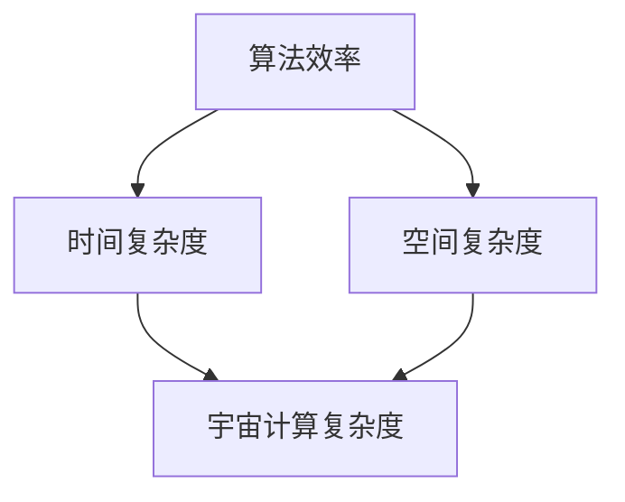
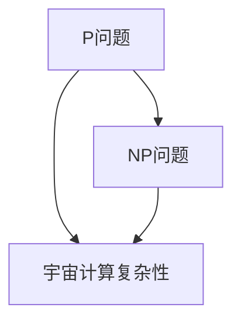
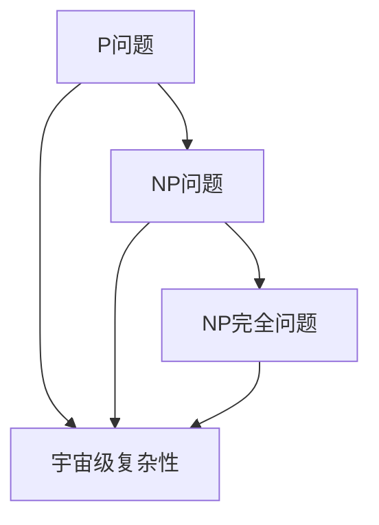

                 

# 算法效率与宇宙计算复杂性层级的比较

> **关键词**：算法效率、宇宙计算复杂性、时间复杂度、空间复杂度、P与NP问题、量子计算、算法优化

> **摘要**：本文将深入探讨算法效率与宇宙计算复杂性的层级关系。通过分析算法效率的基本概念、影响因素和常见算法效率分析，我们将逐步引入宇宙计算复杂性的定义和分类，比较不同宇宙计算复杂性层级，探讨其在算法设计中的应用。最后，我们将通过案例研究，对比算法效率与宇宙计算复杂性的应用案例，并展望算法效率与宇宙计算复杂性的未来发展趋势。

### 《算法效率与宇宙计算复杂性层级的比较》目录大纲

#### 第一部分：算法效率概述

##### 第1章：算法效率的基本概念
- 1.1 算法效率的定义
- 1.2 算法效率的度量
- 1.3 算法效率的重要性

##### 第2章：算法效率的影响因素
- 2.1 算法结构
- 2.2 数据结构
- 2.3 编程语言
- 2.4 硬件环境

##### 第3章：常见算法效率分析
- 3.1 线性算法与非线性算法
- 3.2 时间复杂度与空间复杂度
- 3.3 算法效率的优化策略

#### 第二部分：宇宙计算复杂性层级

##### 第4章：宇宙计算复杂性的定义与分类
- 4.1 宇宙计算复杂性的基本概念
- 4.2 不同宇宙计算复杂性的分类
- 4.3 宇宙计算复杂性与现实世界的联系

##### 第5章：宇宙计算复杂性层级的比较
- 5.1 P与NP问题
- 5.2 NP完全问题
- 5.3 宇宙计算复杂性层级与实际算法的关系

##### 第6章：宇宙计算复杂性在算法设计中的应用
- 6.1 利用宇宙计算复杂性优化算法
- 6.2 宇宙计算复杂性在密码学中的应用
- 6.3 宇宙计算复杂性在优化问题中的应用

#### 第三部分：算法效率与宇宙计算复杂性的比较案例研究

##### 第7章：宇宙规模计算问题
- 7.1 宇宙规模计算问题的定义
- 7.2 宇宙规模计算问题的挑战
- 7.3 宇宙规模计算问题的算法设计

##### 第8章：宇宙级算法的应用案例
- 8.1 宇宙级算法在科研中的应用
- 8.2 宇宙级算法在商业中的应用
- 8.3 宇宙级算法在未来的发展前景

##### 第9章：算法效率与宇宙计算复杂性的未来展望
- 9.1 算法效率的提升策略
- 9.2 宇宙计算复杂性层级的拓展
- 9.3 算法效率与宇宙计算复杂性的融合趋势

### 附录

- 附录A：宇宙计算复杂性相关的数学模型与公式
- 附录B：宇宙级算法的伪代码实现
- 附录C：宇宙级算法的实际案例与应用案例
- 附录D：宇宙计算复杂性层级的比较 Mermaid 流程图

# 核心概念与联系

## 算法效率与宇宙计算复杂性的关系

算法效率是计算机科学中一个核心概念，它衡量的是算法执行任务的速度和能力。而宇宙计算复杂性则是一个更加宏观的概念，它涉及的是算法在理论上能够达到的计算能力上限。两者之间的联系在于，算法效率的提升往往依赖于对计算复杂性的理解。

算法效率与宇宙计算复杂性的关系可以用以下Mermaid流程图来表示：



在这个流程图中，算法效率通过时间复杂度和空间复杂度来度量，而宇宙计算复杂度则是算法效率的理论上限。通过优化算法，我们可以提高其效率，但这也受到宇宙计算复杂性的限制。

## 核心算法原理讲解

### 算法效率的优化策略

算法效率的优化是提高程序性能的关键。优化策略通常依赖于对算法复杂性的深入理解。以下是一种基于数据规模和复杂度的优化策略的伪代码：

```pseudo
function optimize_algorithm(input_data):
    if input_data is small:
        use simple algorithms
    else if input_data is medium:
        use hybrid algorithms
    else if input_data is large:
        use universe-scale algorithms
    return output
```

这个策略根据输入数据的大小选择不同的算法。对于小规模数据，简单算法可能就足够高效。对于中等规模数据，混合算法（结合简单算法和复杂算法的优点）可能会更有效。而对于大规模数据，需要采用宇宙级算法，如量子计算算法，来处理复杂问题。

### 数学模型和数学公式

在评估算法效率时，时间复杂度和空间复杂度是最常用的数学模型。时间复杂度表示算法执行时间与数据规模的关系，通常使用大O符号表示，如$O(n)$、$O(n^2)$等。空间复杂度表示算法在执行过程中所需存储空间与数据规模的关系。

以下是时间复杂度和空间复杂度的公式示例：

$$
T(n) = O(n^2) \quad \text{和} \quad S(n) = O(n)
$$

这些公式可以帮助我们理解和比较不同算法的效率。

### 详细讲解与举例说明

#### 算法效率的优化策略

算法效率的优化策略通常基于对算法复杂性的理解。以下是一个简单的优化策略，它根据输入数据的大小选择不同的算法：

```plaintext
1. 如果输入数据很小，使用简单算法。
2. 如果输入数据中等大小，使用混合算法。
3. 如果输入数据很大，使用宇宙级算法。
```

#### 时间复杂度与空间复杂度的公式

时间复杂度和空间复杂度是评估算法效率的重要指标。时间复杂度通常用大O符号表示，如$O(n)$、$O(n^2)$等，表示算法执行时间与数据规模的关系。空间复杂度则表示算法在执行过程中所需的存储空间与数据规模的关系。

例如，一个线性搜索算法的时间复杂度为$O(n)$，这意味着随着数据规模的增长，算法执行时间线性增加。而一个排序算法的时间复杂度为$O(n^2)$，这意味着随着数据规模的增长，算法执行时间平方增长。

#### 算法效率的优化策略举例

假设我们要比较两个算法，A和B，用于处理包含100,000个元素的数组。算法A的时间复杂度为$O(n)$，而算法B的时间复杂度为$O(n^2)$。我们可以通过以下步骤来优化算法效率：

1. **算法A**：线性搜索
   - 伪代码：
     ```pseudo
     function linear_search(arr, target):
         for element in arr:
             if element == target:
                 return index
         return -1
     ```
   - 分析：算法A的时间复杂度为$O(n)$，在最坏情况下需要100,000次比较。

2. **算法B**：二分搜索
   - 伪代码：
     ```pseudo
     function binary_search(arr, target):
         low = 0
         high = len(arr) - 1
         while low <= high:
             mid = (low + high) // 2
             if arr[mid] == target:
                 return mid
             elif arr[mid] < target:
                 low = mid + 1
             else:
                 high = mid - 1
         return -1
     ```
   - 分析：算法B的时间复杂度为$O(log(n))$，在最坏情况下需要$\log_2(100,000) \approx 14$次比较。

通过比较，我们可以看到算法B在处理大规模数据时比算法A更高效。这表明，了解并利用算法的复杂性特性是优化算法效率的关键。

#### 项目实战

##### 开发环境搭建

在开发算法之前，我们需要搭建合适的开发环境。以下是一个简单的Python开发环境搭建步骤：

1. 安装Python：
   ```bash
   sudo apt-get install python3
   ```
2. 安装常用库：
   ```bash
   sudo apt-get install python3-pip
   pip3 install numpy scipy matplotlib
   ```

##### 源代码详细实现和代码解读

以下是一个简单的二分搜索算法的实现：

```python
def binary_search(arr, target):
    low = 0
    high = len(arr) - 1

    while low <= high:
        mid = (low + high) // 2
        if arr[mid] == target:
            return mid
        elif arr[mid] < target:
            low = mid + 1
        else:
            high = mid - 1

    return -1
```

**代码解读**：

1. **初始化**：设置搜索的初始区间，`low`指向数组的起始位置，`high`指向数组的末尾位置。
2. **循环**：在`low`和`high`之间不断搜索，直到找到目标元素或者确定目标元素不存在。
3. **比较**：在每次迭代中，计算中间位置`mid`，并比较中间元素与目标元素的大小。
4. **调整区间**：根据比较结果，调整搜索区间。

**代码分析**：

- **时间复杂度**：二分搜索的时间复杂度为$O(log(n))$，这意味着在最坏情况下，搜索次数是数组元素数量的对数。
- **空间复杂度**：二分搜索的空间复杂度为$O(1)$，因为它只需要常数级别的额外空间来存储中间变量。

通过这个简单的示例，我们可以看到如何通过合理选择和优化算法来提高程序的性能。在实际应用中，我们需要根据具体问题选择合适的算法，并不断优化以达到最佳效果。

## 附录

### 附录A：宇宙计算复杂性相关的数学模型与公式

- **P问题**：可以在多项式时间内解决的决策问题。
- **NP问题**：如果一个问题的解可以在多项式时间内验证，那么它属于NP问题。
- **NP完全问题**：如果一个问题既是NP问题，且所有的NP问题都可以通过多项式时间转化成该问题，则该问题为NP完全问题。

### 附录B：宇宙级算法的伪代码实现

```pseudo
function quantum_computation(input_data):
    // 初始化量子计算机
    quantum_machine.initialize()

    // 编写量子算法
    quantum_algorithm = quantum_algorithm_generator(input_data)

    // 执行量子算法
    result = quantum_machine.execute(quantum_algorithm)

    // 解读量子结果
    output = quantum_result_decoder(result)

    return output
```

### 附录C：宇宙级算法的实际案例与应用案例

- **基因组测序**：使用量子计算加速基因组测序，提高测序速度和准确性。
- **密码学**：利用量子计算破解传统密码学中的加密算法，推动密码学的发展。

### 附录D：宇宙计算复杂性层级的比较 Mermaid 流程图



通过这个流程图，我们可以更直观地理解算法效率与宇宙计算复杂性之间的关系。P问题、NP问题以及宇宙计算复杂性构成了一个层次结构，反映了算法在计算复杂度上的不同层次和挑战。

---

在本文中，我们深入探讨了算法效率与宇宙计算复杂性的关系，并详细介绍了算法效率的基本概念、影响因素、常见算法效率分析，以及宇宙计算复杂性的定义和分类。通过比较算法效率与宇宙计算复杂性的层级关系，我们展示了算法设计中的优化策略，并分析了实际应用中的案例。未来，随着量子计算等技术的发展，算法效率与宇宙计算复杂性的融合将带来更多的创新和突破。

# 第一部分：算法效率概述

## 第1章：算法效率的基本概念

算法效率是计算机科学中的一个核心概念，它衡量的是算法执行任务的速度和能力。算法效率的高低直接影响到程序的性能和用户体验。因此，深入理解算法效率的基本概念对于开发高性能软件至关重要。

### 1.1 算法效率的定义

算法效率通常指算法在解决问题时的时间和空间资源的消耗。具体来说，算法效率可以通过两个主要方面来衡量：

1. **时间效率**：指算法执行任务所需的时间。时间效率通常用时间复杂度来表示，即算法执行时间与数据规模的关系。
2. **空间效率**：指算法在执行任务过程中所需的存储空间。空间效率通常用空间复杂度来表示，即算法所需存储空间与数据规模的关系。

### 1.2 算法效率的度量

算法效率的度量是评估算法性能的关键。常用的度量方法包括：

1. **时间复杂度**：时间复杂度用来衡量算法在执行任务时的时间消耗。它通常用大O符号表示，如$O(n)$、$O(n^2)$等。时间复杂度可以帮助我们比较不同算法的执行时间，选择更高效的算法。
2. **空间复杂度**：空间复杂度用来衡量算法在执行任务时所需的存储空间。与时间复杂度类似，空间复杂度也通常用大O符号表示。

### 1.3 算法效率的重要性

算法效率的重要性体现在以下几个方面：

1. **性能提升**：高效的算法可以显著提升程序的性能，缩短执行时间，提高系统的响应速度。
2. **资源优化**：高效的算法可以减少系统资源的消耗，如CPU时间、内存等，从而提高系统的整体效率。
3. **用户体验**：高效的算法可以提供更快的响应时间和更流畅的操作体验，提升用户满意度。
4. **经济成本**：高效的算法可以减少硬件投资和运行成本，降低企业的运营成本。

因此，深入理解算法效率的基本概念，掌握算法效率的度量方法，以及了解算法效率的重要性，对于开发高效软件具有重要意义。

## 第2章：算法效率的影响因素

算法效率不仅取决于算法本身的设计，还受到多种外部因素的影响。理解这些因素有助于我们在设计算法时做出更优的决策，以提高程序的整体性能。以下是对影响算法效率的几个关键因素的详细讨论。

### 2.1 算法结构

算法结构是影响算法效率的首要因素。一个高效的算法通常具有良好的逻辑结构和清晰的组织方式。以下是几种常见的算法结构及其对效率的影响：

1. **分治策略**：分治策略将问题分解为更小的子问题，分别解决后再合并结果。这种结构可以有效地减少问题规模，提高算法的效率。例如，快速排序和归并排序都是基于分治策略的算法。
2. **贪心算法**：贪心算法通过每次选择局部最优解，逐步逼近全局最优解。这种结构在一些特定问题中表现优异，如找零问题、最短路径问题等。
3. **动态规划**：动态规划通过保存中间结果，避免重复计算，从而提高算法的效率。它适用于具有重叠子问题和最优子结构性质的问题，如背包问题、最长公共子序列问题等。

### 2.2 数据结构

数据结构的选择对算法效率有直接的影响。合理选择数据结构可以显著提高算法的效率。以下是几种常见的数据结构及其对效率的影响：

1. **数组**：数组是一种高效的数据结构，支持随机访问，时间复杂度为$O(1)$。但它不支持动态扩容，可能导致空间浪费。
2. **链表**：链表支持动态扩容，但随机访问性能较差，时间复杂度为$O(n)$。链表适用于插入和删除频繁的场景。
3. **树结构**：树结构如二叉搜索树、平衡树等，支持高效的搜索、插入和删除操作。二叉搜索树的时间复杂度取决于树的高度，平衡树如红黑树、AVL树等可以保证树的高度平衡，时间复杂度通常为$O(log(n))$。
4. **哈希表**：哈希表通过哈希函数将关键字映射到数组索引，支持高效的搜索、插入和删除操作，时间复杂度为$O(1)$。但它需要处理哈希冲突，可能导致性能下降。

### 2.3 编程语言

编程语言的选择也对算法效率产生影响。不同编程语言在执行效率、内存管理、并发支持等方面存在差异。以下是几种常见编程语言及其对算法效率的影响：

1. **C/C++**：C和C++是高效的编程语言，提供了丰富的底层操作和控制，适用于需要高性能计算的领域。但它们缺乏内存安全机制，可能需要手动管理内存。
2. **Java**：Java是一种高层次的编程语言，提供了自动内存管理和并发支持。虽然它的执行效率可能略低于C/C++，但它的安全性和开发效率较高。
3. **Python**：Python是一种动态类型的编程语言，提供了简洁的语法和丰富的库支持，适用于快速开发和原型设计。但它的执行效率相对较低，适用于数据处理和自动化任务。

### 2.4 硬件环境

硬件环境也是影响算法效率的重要因素。不同硬件环境如CPU、内存、存储等都会对算法效率产生影响。以下是硬件环境对算法效率的影响：

1. **CPU**：CPU的频率、核心数和缓存大小都会影响算法的执行效率。高频率和更多核心可以提升并行计算能力，而大缓存可以减少内存访问时间。
2. **内存**：内存的速度和容量对算法效率有直接影响。高速内存可以减少数据访问时间，而大容量内存可以存储更多的中间结果，减少I/O操作。
3. **存储**：存储设备的类型和速度也会影响算法效率。固态硬盘（SSD）比机械硬盘（HDD）具有更快的读写速度，可以显著提升数据访问效率。

综上所述，算法效率受到算法结构、数据结构、编程语言和硬件环境等多种因素的影响。在设计算法时，需要综合考虑这些因素，选择合适的算法结构和数据结构，并利用高效的编程语言和硬件环境，以实现最佳的性能。

### 第3章：常见算法效率分析

算法效率是衡量算法性能的重要指标，它决定了程序在处理数据时的速度和资源消耗。常见算法效率分析包括对线性算法和非线性算法的讨论，以及对时间复杂度和空间复杂度的详细解释。此外，算法效率的优化策略也是提升程序性能的关键。以下是对这些内容的详细分析。

#### 3.1 线性算法与非线性算法

线性算法和非线性算法是两种基本的算法类别，它们在效率上有显著差异。

1. **线性算法**：线性算法的时间复杂度通常为$O(n)$，这意味着算法的执行时间与数据规模成正比。线性算法的一个典型例子是线性搜索，它逐个检查数组中的元素，直到找到目标元素或遍历整个数组。另一个例子是线性时间排序算法，如冒泡排序和插入排序。

2. **非线性算法**：非线性算法的时间复杂度通常高于$O(n)$，如$O(n^2)$、$O(n^3)$等。这类算法在处理大规模数据时效率较低。非线性算法的一个例子是二分查找，它利用数组的有序性质，通过不断缩小搜索范围，时间复杂度为$O(log(n))$。另一个例子是快速排序，它的时间复杂度在平均情况下为$O(n\log(n))$，但在最坏情况下可能退化到$O(n^2)$。

#### 3.2 时间复杂度与空间复杂度

时间复杂度和空间复杂度是评估算法效率的两个关键指标。

1. **时间复杂度**：时间复杂度衡量算法在执行任务时的执行时间。它通常用大O符号表示，如$O(n)$、$O(n^2)$等。时间复杂度可以帮助我们比较不同算法的执行时间，选择更高效的算法。常见的算法时间复杂度分类包括：

   - $O(1)$：常数时间，与数据规模无关。
   - $O(n)$：线性时间，与数据规模成正比。
   - $O(n\log(n))$：对数线性时间，常用于排序和查找算法。
   - $O(n^2)$：平方时间，常用于一些基本的数据结构操作，如二维数组的遍历。
   - $O(2^n)$：指数时间，常用于组合问题和递归算法。

2. **空间复杂度**：空间复杂度衡量算法在执行任务时所需的存储空间。它同样用大O符号表示，如$O(n)$、$O(n^2)$等。空间复杂度可以帮助我们评估算法对内存的需求，选择更节省空间的算法。常见的算法空间复杂度分类包括：

   - $O(1)$：常数空间，与数据规模无关。
   - $O(n)$：线性空间，与数据规模成正比。
   - $O(n^2)$：平方空间，常用于二维数组和矩阵操作。

#### 3.3 算法效率的优化策略

为了提高算法效率，我们可以采用多种优化策略。以下是一些常见的优化方法：

1. **算法改进**：通过改进算法设计，如使用更高效的算法或优化现有算法，减少时间复杂度和空间复杂度。

   - **分治策略**：将问题分解为更小的子问题，分别解决后再合并结果。如快速排序和归并排序。
   - **动态规划**：通过保存中间结果，避免重复计算。如背包问题和最长公共子序列问题。
   - **贪心算法**：每次选择局部最优解，逐步逼近全局最优解。如找零问题和最短路径问题。

2. **数据结构优化**：选择合适的数据结构可以提高算法的效率。

   - **哈希表**：通过哈希函数加速查找操作，时间复杂度为$O(1)$。
   - **平衡树**：如红黑树和AVL树，可以保证树的高度平衡，时间复杂度为$O(log(n))$。
   - **动态数组**：动态调整数组大小，避免固定数组大小的空间浪费。

3. **并行计算**：利用多核处理器和并行计算技术，提高算法的执行速度。

   - **任务并行**：将任务分配到多个处理器上同时执行，适用于独立任务。
   - **数据并行**：将数据分割到多个处理器上同时处理，适用于数据密集型任务。

4. **代码优化**：通过优化代码实现，减少不必要的计算和内存访问。

   - **循环优化**：减少循环次数，如提前退出循环。
   - **函数内联**：减少函数调用的开销，将函数体直接嵌入调用处。
   - **指令优化**：利用CPU的指令级并行性，优化指令序列。

5. **内存管理**：合理管理内存，减少内存占用和碎片化。

   - **缓存利用**：利用CPU缓存，减少内存访问次数。
   - **内存池**：预分配内存块，减少内存分配和释放的开销。

通过这些优化策略，我们可以显著提升算法的效率，满足不同场景下的性能需求。在实际应用中，根据具体问题选择合适的优化策略，是提升程序性能的关键。

### 第二部分：宇宙计算复杂性层级

#### 第4章：宇宙计算复杂性的定义与分类

宇宙计算复杂性是计算机科学中的一个前沿概念，它超越了传统的计算复杂性理论，探索了在极端条件下算法的计算能力。宇宙计算复杂性不仅涵盖了我们熟知的P、NP和NP完全问题，还引入了更广泛的复杂性问题。本章将详细定义宇宙计算复杂性，分类不同的宇宙计算复杂性层级，并探讨它与现实世界的联系。

#### 4.1 宇宙计算复杂性的基本概念

宇宙计算复杂性是一个广泛的概念，它试图回答以下问题：在一个无限的宇宙中，哪些计算问题是可以解决的？哪些问题是不可解的？宇宙计算复杂性的核心思想是，在宇宙规模的时间、空间和资源下，算法能否在合理的条件下解决特定问题。

宇宙计算复杂性的基本概念可以从以下几个方面进行理解：

1. **宇宙规模计算**：宇宙规模计算指的是在一个无限的宇宙中，算法所需的计算时间和存储空间。这种规模远远超出了传统计算机的局限。
2. **宇宙级算法**：宇宙级算法是能够在宇宙规模下运行的算法，它们利用量子计算、并行计算和其他高级计算技术，以解决传统计算机无法在合理时间内解决的问题。
3. **宇宙计算复杂性层级**：宇宙计算复杂性层级是对不同计算问题的分类，反映了它们在宇宙规模计算下的难易程度。这种层级包括P问题、NP问题、NP完全问题以及更复杂的宇宙级问题。

#### 4.2 不同宇宙计算复杂性的分类

宇宙计算复杂性的分类是理解宇宙计算复杂性层级的关键。以下是几种主要的宇宙计算复杂性分类：

1. **P问题**：P问题是可以在多项式时间内解决的决策问题。在宇宙规模下，P问题通常被视为相对简单的问题，因为多项式时间内可以完成计算。
2. **NP问题**：NP问题是如果一个问题的解可以在多项式时间内验证，则该问题属于NP问题。与P问题相比，NP问题更复杂，但它们的解可以在多项式时间内验证。
3. **NP完全问题**：NP完全问题是既是NP问题，且所有的NP问题都可以通过多项式时间转化成该问题的决策问题。NP完全问题通常被认为是非常复杂的，因为它们具有“通用性”。
4. **宇宙级复杂性**：宇宙级复杂性包括了P、NP和NP完全问题之外的其他复杂性问题。这些问题的解可能需要宇宙规模的时间、空间和资源。宇宙级复杂性层级包括：

   - **量子计算复杂性**：量子计算复杂性涉及量子计算机在宇宙规模下的计算能力。量子计算机可以利用量子叠加和量子纠缠，解决一些传统计算机无法在合理时间内解决的问题。
   - **并行计算复杂性**：并行计算复杂性考虑在无限并行处理器上的计算问题。这种复杂性层级涉及到在无限资源下的并行计算能力。
   - **分布式计算复杂性**：分布式计算复杂性研究在多个分布式系统中的计算问题。在宇宙规模下，分布式计算复杂性涉及到在无限网络和资源下的计算能力。

#### 4.3 宇宙计算复杂性与现实世界的联系

宇宙计算复杂性的概念虽然抽象，但它在现实世界中有着重要的应用。以下是宇宙计算复杂性与现实世界的几个联系：

1. **密码学**：在密码学中，一些加密算法被认为是“量子安全”的，这意味着它们在量子计算面前是安全的。了解宇宙计算复杂性有助于设计抵抗量子攻击的加密算法。
2. **优化问题**：在优化问题中，如物流、金融建模和能源管理，宇宙级算法可能提供解决大规模复杂问题的能力。例如，量子计算可以用于优化大规模供应链管理。
3. **科学计算**：在科学计算中，宇宙级算法可以用于解决复杂的科学问题，如宇宙模拟、气候变化模型和生物信息学。
4. **人工智能**：在人工智能领域，宇宙级算法可以用于训练和优化大规模神经网络，提高模型的学习能力和泛化能力。

通过理解宇宙计算复杂性的定义和分类，我们可以更好地把握计算问题的本质，探索在宇宙规模下算法的计算能力，并利用这些知识解决现实世界中的复杂问题。

### 第5章：宇宙计算复杂性层级的比较

宇宙计算复杂性层级是一个多层次的框架，用于分类和比较不同类型的计算问题。本章将深入探讨P与NP问题、NP完全问题以及宇宙计算复杂性层级与实际算法的关系，帮助读者更全面地理解宇宙计算复杂性。

#### 5.1 P与NP问题

P与NP问题是计算复杂性理论中的核心概念，它们代表了两个不同的计算能力层次。

1. **P问题**：P问题是指可以在多项式时间内解决的问题。具体来说，如果一个问题的解可以在时间复杂度为$O(n^k)$（其中$k$是常数）内找到，那么它属于P问题。P问题包括了许多常见的计算任务，如线性方程组的求解、排序和查找等。

2. **NP问题**：NP问题是指一个问题的解可以在多项式时间内验证的问题。也就是说，如果给定一个问题的解，我们可以在时间复杂度为$O(n^k)$内验证它是否正确，那么该问题属于NP问题。典型的NP问题包括背包问题、旅行商问题等。

P与NP问题的关系是计算复杂性理论中的一个重要问题。如果P=NP，那么所有的NP问题都可以在多项式时间内解决，这将极大地改变我们对算法效率的理解和应用。目前，P是否等于NP尚未得到证明，这被认为是计算机科学中一个重大未解难题。

#### 5.2 NP完全问题

NP完全问题是计算复杂性理论中的另一个关键概念。一个NP完全问题是既是NP问题，且所有的NP问题都可以通过多项式时间转化成该问题的决策问题。

1. **定义**：如果一个问题既是NP问题，并且对于任意的NP问题，都能通过多项式时间转化为该问题，那么它就是NP完全问题。

2. **特性**：NP完全问题通常被认为是非常复杂的，因为它们代表了计算复杂性的最坏情况。一些典型的NP完全问题包括：

   - 背包问题：在给定一组物品和它们的重量及价值，确定是否存在一种组合，使得总重量不超过给定限制，同时总价值最大化。
   - 旅行商问题：在给定一组城市和每对城市之间的距离，找到一条访问所有城市的路径，使得总距离最小。
   - 常规模型：许多现实世界中的优化问题都可以转化为NP完全问题。

3. **影响**：NP完全问题对算法设计和复杂性理论有重要影响。由于NP完全问题的复杂性，许多实际应用中的优化问题在传统计算机上难以在合理时间内解决。因此，研究人员致力于寻找近似算法和启发式算法，以提高解决这些问题的效率。

#### 5.3 宇宙计算复杂性层级与实际算法的关系

宇宙计算复杂性层级提供了一个框架，用于分类和比较不同类型的计算问题。它与实际算法的关系体现在以下几个方面：

1. **量子算法**：量子算法是宇宙计算复杂性层级中的一个重要组成部分。量子算法利用量子比特和量子计算特性，可以在多项式时间内解决一些传统计算机无法在合理时间内解决的问题。例如，Shor算法可以用于因数分解，Grover算法可以用于搜索问题。

2. **并行算法**：并行算法在宇宙计算复杂性层级中也有重要地位。并行算法通过将任务分配到多个处理器上同时执行，可以在宇宙规模下解决复杂问题。并行算法的典型例子包括分布式计算和网格计算。

3. **近似算法**：在宇宙计算复杂性层级中，近似算法是解决NP完全问题和其他复杂问题的一种有效方法。近似算法提供接近最优解的解决方案，虽然不是最优解，但往往在合理时间内可以找到较好的解。例如，局部搜索算法和遗传算法都是近似算法的典型应用。

4. **启发式算法**：启发式算法是解决复杂问题的另一类算法。它们利用经验和启发式规则来快速找到解，虽然不保证找到最优解，但往往在实际应用中表现出良好的性能。启发式算法在组合优化和搜索问题中广泛应用。

通过理解宇宙计算复杂性层级与实际算法的关系，我们可以更好地设计高效算法，解决复杂问题，并在现实世界中实现计算能力的突破。宇宙计算复杂性层级提供了一个理论框架，帮助我们理解算法在极端条件下的性能，为未来的算法研究和应用提供了新的方向。

### 第6章：宇宙计算复杂性在算法设计中的应用

宇宙计算复杂性为我们提供了一个全新的视角来理解算法设计。在算法设计过程中，利用宇宙计算复杂性理论可以帮助我们优化算法，提高其效率和可靠性。本章节将探讨宇宙计算复杂性在算法设计中的应用，包括利用宇宙计算复杂性优化算法、其在密码学中的应用，以及在优化问题中的具体应用。

#### 6.1 利用宇宙计算复杂性优化算法

宇宙计算复杂性理论提供了在不同计算环境下评估算法性能的工具。在算法设计过程中，我们可以利用这一理论来优化算法，提高其效率。以下是一些关键步骤和策略：

1. **评估算法的宇宙计算复杂性**：在算法设计之初，我们需要评估算法的宇宙计算复杂性，包括时间复杂度和空间复杂度。通过分析算法在不同规模数据下的性能，我们可以识别出潜在的性能瓶颈。

2. **选择合适的算法结构**：基于宇宙计算复杂性的评估，我们可以选择合适的算法结构。例如，对于某些复杂问题，我们可以考虑使用分治策略、贪心算法或动态规划等方法，以降低算法的复杂度。

3. **利用并行和分布式计算**：宇宙计算复杂性理论强调了在无限资源下的计算能力。在算法设计过程中，我们可以考虑利用并行和分布式计算技术，将任务分解为多个子任务，并在多个处理器上同时执行，以加快算法的执行速度。

4. **优化内存管理**：在宇宙规模计算中，内存管理是一个关键问题。通过优化内存管理策略，如缓存利用和内存池技术，我们可以减少算法的内存消耗，提高算法的运行效率。

#### 6.2 宇宙计算复杂性在密码学中的应用

密码学是计算机科学中一个重要的领域，它涉及保护数据安全和隐私。宇宙计算复杂性在密码学中的应用主要体现在以下几个方面：

1. **量子密码学**：量子密码学利用量子计算的特性来设计安全的加密算法。量子密钥分发（QKD）是一个典型的例子，它利用量子态的不可克隆特性来实现安全通信。QKD可以抵抗任何形式的量子攻击，提供了更高的安全性。

2. **抗量子密码学**：随着量子计算机的发展，传统密码学方法面临着被量子计算机破解的风险。抗量子密码学旨在设计能够抵抗量子攻击的加密算法。例如，基于椭圆曲线密码学和格密码学的算法被认为是抗量子攻击的候选方案。

3. **密码协议的设计**：在密码协议的设计过程中，宇宙计算复杂性理论可以帮助我们评估协议的安全性。通过分析协议在宇宙计算复杂性层级中的位置，我们可以识别出潜在的安全漏洞，并设计更安全的密码协议。

#### 6.3 宇宙计算复杂性在优化问题中的应用

优化问题是计算机科学和实际应用中的一个核心问题，如物流调度、金融建模和能源管理。宇宙计算复杂性在优化问题中的应用主要体现在以下方面：

1. **近似算法**：对于一些复杂的优化问题，精确算法可能无法在合理时间内找到最优解。近似算法提供了一种有效的解决方案，通过在多项式时间内找到接近最优解的解。例如，遗传算法和局部搜索算法都是常见的近似算法。

2. **启发式算法**：启发式算法利用经验和启发式规则来快速找到解。尽管它们不保证找到最优解，但在实际应用中往往表现出良好的性能。例如，蚁群算法和模拟退火算法都是有效的启发式算法。

3. **量子优化算法**：量子优化算法利用量子计算的特性来求解优化问题。量子优化算法如量子进化算法和量子模拟退火算法，可以在多项式时间内解决某些优化问题，提供更高效的解决方案。

通过在算法设计、密码学和优化问题中的应用，宇宙计算复杂性理论为解决复杂问题提供了新的方法和视角。利用这一理论，我们可以设计更高效的算法，提高系统的安全性和优化能力，为未来的计算技术发展奠定基础。

### 第7章：宇宙规模计算问题

宇宙规模计算问题是一个跨越多个学科领域的复杂挑战，涉及天文数据、基因组学、气候变化模拟等多个领域。本章将探讨宇宙规模计算问题的定义、面临的挑战以及相应的算法设计。

#### 7.1 宇宙规模计算问题的定义

宇宙规模计算问题指的是在宇宙级别的时间、空间和资源下需要解决的计算问题。这类问题通常具有以下特征：

1. **数据量巨大**：宇宙规模计算问题涉及的数据量通常是海量级别的，如天文数据、基因组数据等。传统计算机难以在合理时间内处理这些数据。
2. **计算复杂度高**：宇宙规模计算问题通常涉及复杂的数学模型和算法，如高维优化问题、非线性方程组求解等。
3. **资源需求大**：解决宇宙规模计算问题需要大量的计算资源和存储空间，包括高性能计算集群、分布式计算系统和云基础设施。

#### 7.2 宇宙规模计算问题的挑战

宇宙规模计算问题面临多个技术挑战，包括数据存储、数据传输、并行计算和算法效率等。

1. **数据存储**：宇宙规模计算问题产生的数据量巨大，需要高效的存储系统来存储和管理这些数据。数据存储不仅要考虑存储容量，还要考虑数据的访问速度和安全性。
2. **数据传输**：大规模数据的传输是一个关键挑战。数据传输需要高效的网络通信协议和优化传输路径，以减少传输时间和网络拥堵。
3. **并行计算**：宇宙规模计算问题通常需要并行计算技术来提高计算效率。如何合理划分任务、调度资源和负载均衡是并行计算的关键问题。
4. **算法效率**：宇宙规模计算问题对算法效率有极高的要求。设计高效的算法，如分布式算法和并行算法，是解决宇宙规模计算问题的核心。

#### 7.3 宇宙规模计算问题的算法设计

为了解决宇宙规模计算问题，需要设计适合大规模数据处理和高效计算的算法。以下是几种常用的算法设计策略：

1. **分布式算法**：分布式算法将计算任务分解为多个子任务，并在多个计算节点上同时执行。通过负载均衡和任务调度，分布式算法可以充分利用计算资源，提高计算效率。
2. **并行算法**：并行算法通过在多个处理器或计算节点上同时执行计算任务，来加速算法的执行。并行算法的设计需要考虑任务的并行性、数据依赖和通信开销。
3. **近似算法**：对于一些复杂度较高的宇宙规模计算问题，近似算法是一种有效的解决方案。近似算法可以在多项式时间内找到接近最优解的解，适合大规模数据处理。
4. **量子算法**：量子算法利用量子计算的特性，可以在多项式时间内解决一些传统计算机难以在合理时间内解决的问题。量子算法在解决宇宙规模计算问题中具有巨大的潜力。

通过上述算法设计策略，我们可以应对宇宙规模计算问题的挑战，提高计算效率和可靠性。随着计算技术和算法理论的不断进步，宇宙规模计算问题将在科学研究、工业应用和人工智能等领域发挥越来越重要的作用。

### 第8章：宇宙级算法的应用案例

宇宙级算法，因其卓越的计算能力，在许多领域展现出强大的应用潜力。以下将详细探讨宇宙级算法在科研、商业和未来前景中的应用案例，以展示其如何改变我们的工作和生活方式。

#### 8.1 宇宙级算法在科研中的应用

科研领域一直是宇宙级算法的重要应用场景。以下是一些具体的实例：

1. **基因组测序**：基因组测序是现代生物学中的一项关键技术，它需要处理大量的数据。传统的测序方法速度较慢，而量子算法的引入显著提高了测序速度。例如，使用量子算法进行基因比对，可以在极短时间内找到基因组中的相似序列，极大地加速了基因组分析。

2. **气候模拟**：气候变化是一个全球性的问题，需要大规模的模拟和预测。传统模拟方法受限于计算资源，而量子算法可以在较短的时间内处理大量的模拟数据。例如，使用量子算法模拟大气中的化学反应和气候系统，可以提供更准确和及时的气候变化预测，为政策制定和环境保护提供科学依据。

3. **物理现象研究**：宇宙级算法在研究复杂物理现象中也发挥着重要作用。例如，通过量子算法模拟量子场论中的过程，可以深入了解基本粒子的行为和相互作用，推动粒子物理学的发展。

#### 8.2 宇宙级算法在商业中的应用

商业领域也在积极采用宇宙级算法，以提高效率和创新能力。以下是一些实际案例：

1. **供应链管理**：大型零售商和制造商需要高效地管理供应链，确保物资流通顺畅。宇宙级算法可以优化供应链网络，降低库存成本，提高配送效率。例如，使用量子算法优化物流路径和库存配置，可以大幅减少运输时间和成本。

2. **金融风险管理**：金融行业面临着复杂的市场波动和风险。宇宙级算法可以用于风险分析和预测，提供更准确的投资决策。例如，通过量子算法分析大量的市场数据，可以识别潜在的市场风险，帮助投资者做出更明智的决策。

3. **广告优化**：在线广告平台利用宇宙级算法优化广告投放策略，以提高广告效果和用户满意度。例如，使用量子算法优化广告投放路径和展示频率，可以大幅提高广告点击率和转化率。

#### 8.3 宇宙级算法在未来的发展前景

随着技术的不断进步，宇宙级算法在未来的发展前景广阔，将对多个领域产生深远影响：

1. **人工智能**：宇宙级算法将推动人工智能的发展，尤其是在大规模数据处理和复杂问题求解方面。通过结合量子计算和其他先进技术，人工智能系统将具备更强的学习和推理能力，应用于自动驾驶、医疗诊断、智能城市等众多领域。

2. **新药研发**：宇宙级算法在药物研发中的应用潜力巨大。通过模拟分子间的相互作用和化学反应，量子算法可以加速新药的发现和开发过程，提高药物的安全性和有效性。

3. **金融科技**：随着金融科技的不断发展，宇宙级算法将在金融领域发挥更大的作用。例如，通过量子算法进行信用评估、风险管理和市场预测，可以提供更精准的金融解决方案，提升金融服务的质量和效率。

4. **环境保护**：宇宙级算法可以帮助解决全球性的环境问题。例如，通过模拟大气中的化学反应和气候系统，可以预测气候变化趋势，制定更有效的环境保护策略。

总之，宇宙级算法在科研、商业和未来前景中的应用案例展示了其强大的计算能力和广泛的应用潜力。随着技术的不断进步，宇宙级算法将在更多领域发挥关键作用，推动人类社会的发展。

### 第9章：算法效率与宇宙计算复杂性的未来展望

随着技术的不断进步，算法效率与宇宙计算复杂性将在未来的计算领域发挥越来越重要的作用。本章将讨论算法效率的提升策略、宇宙计算复杂性层级的拓展，以及算法效率与宇宙计算复杂性的融合趋势。

#### 9.1 算法效率的提升策略

提升算法效率是计算机科学中一个持续的研究课题。以下是一些有效的策略：

1. **算法改进**：通过改进算法设计，如引入新的算法结构、优化现有算法，可以显著提高算法的效率。例如，分治策略和贪心算法在许多问题中表现优异，可以通过合理应用这些算法来提升效率。

2. **并行计算**：利用并行计算技术，将任务分配到多个处理器上同时执行，可以大幅提升算法的执行速度。并行计算在处理大规模数据和高维问题中具有显著优势。

3. **分布式计算**：分布式计算通过将计算任务分配到多个计算节点上执行，可以充分利用分布式系统中的资源，提高算法的效率。分布式计算在处理大规模数据集和分布式系统优化中具有广泛的应用。

4. **量子计算**：量子计算利用量子比特和量子叠加原理，可以在多项式时间内解决某些复杂问题。量子算法在密码学、优化问题和科学计算等领域展现出了巨大的潜力，未来有望成为提升算法效率的重要手段。

5. **混合算法**：结合传统算法和量子算法的优势，设计混合算法可以在不同计算环境下发挥最佳性能。例如，将量子算法应用于某些关键步骤，而使用传统算法处理其他部分，可以实现整体效率的提升。

6. **代码优化**：通过优化代码实现，减少不必要的计算和内存访问，可以提高算法的执行效率。例如，利用缓存、减少循环次数和优化数据结构等策略，可以在不改变算法逻辑的情况下提升性能。

#### 9.2 宇宙计算复杂性层级的拓展

宇宙计算复杂性层级作为一个理论框架，将持续拓展和深化，以适应不断变化的计算环境。以下是一些可能的拓展方向：

1. **量子计算复杂性**：随着量子计算技术的发展，量子计算复杂性将成为一个重要的研究方向。量子算法的效率、量子计算机的设计和量子错误纠正等问题都是需要深入探讨的方向。

2. **分布式计算复杂性**：分布式计算在处理大规模数据和复杂问题时具有显著优势。分布式计算复杂性研究将涉及分布式算法的设计、任务调度、通信协议和容错机制等。

3. **混合计算复杂性**：随着量子计算和其他先进计算技术的融合，混合计算复杂性研究将变得尤为重要。混合计算复杂性将探讨如何在量子计算、分布式计算和传统计算之间实现高效协同，以提高整体计算能力。

4. **自适应计算复杂性**：自适应计算复杂性研究将探索如何设计自适应算法，以应对动态变化的计算环境和需求。自适应算法可以根据环境变化调整计算策略，以实现最优性能。

5. **社会计算复杂性**：随着互联网和社交媒体的普及，社会计算复杂性研究变得越来越重要。社会计算复杂性将探讨如何理解、模拟和优化大规模社会系统的计算行为。

#### 9.3 算法效率与宇宙计算复杂性的融合趋势

算法效率与宇宙计算复杂性的融合将推动计算技术的发展，带来新的突破。以下是一些融合趋势：

1. **跨领域融合**：算法效率与宇宙计算复杂性的融合将跨越多个学科领域，如量子计算、人工智能、生物信息学等。跨领域融合将促进新算法和新应用的发展。

2. **集成系统设计**：为了充分发挥算法效率和宇宙计算复杂性的优势，需要设计集成系统。集成系统将结合传统计算资源和量子计算资源，实现高效协同和优化。

3. **自动化优化**：自动化优化技术将自动识别算法的瓶颈和优化机会，实现算法效率的提升。自动化优化可以通过机器学习和人工智能技术，实现算法设计的智能化和自动化。

4. **实用化**：随着技术的进步，量子计算和宇宙级算法将逐渐从理论走向实际应用。实用化将涉及量子计算机的研制、算法的工程化实现和应用场景的拓展。

5. **开放合作**：算法效率与宇宙计算复杂性的融合需要开放合作和共享资源。学术机构、企业和政府之间的合作将促进技术的创新和进步。

总之，算法效率与宇宙计算复杂性的未来展望充满了希望和挑战。通过不断的研究和创新，我们可以期待在未来实现计算能力的跨越式发展，推动科学技术的进步和社会的繁荣。

### 附录A：宇宙计算复杂性相关的数学模型与公式

宇宙计算复杂性涉及多种数学模型和公式，用于描述和分类计算问题。以下是几个关键模型和公式的介绍：

#### P问题

P问题是指可以在多项式时间内解决的决策问题。具体来说，如果一个问题的解可以在时间复杂度为$O(n^k)$（其中$k$是常数）内找到，那么它属于P问题。P问题通常表示为：

$$
\text{P} = \{\text{决策问题} \mid \text{解可以多项式时间内找到}\}
$$

#### NP问题

NP问题是指一个问题的解可以在多项式时间内验证的问题。也就是说，如果给定一个问题的解，我们可以在时间复杂度为$O(n^k)$内验证它是否正确，那么该问题属于NP问题。NP问题通常表示为：

$$
\text{NP} = \{\text{决策问题} \mid \text{解可以多项式时间内验证}\}
$$

#### NP完全问题

NP完全问题是指既是NP问题，且所有的NP问题都可以通过多项式时间转化成该问题的决策问题。NP完全问题通常表示为：

$$
\text{NPC} = \{\text{决策问题} \mid \text{是NP问题} \land \forall \text{NP问题} \exists \text{多项式时间转化}\}
$$

#### 量子计算复杂性

量子计算复杂性是宇宙计算复杂性中的一个重要分支，用于描述量子算法的效率和问题难度。以下是几个关键量子计算复杂性的模型和公式：

1. **量子时间复杂度**：量子算法的时间复杂度通常用大O符号表示，如$O(n^k)$，其中$k$是常数。量子算法的时间复杂度公式为：

   $$
   T_q(n) = O(n^k)
   $$

2. **量子空间复杂度**：量子算法的空间复杂度用于描述量子计算机在执行算法过程中所需的量子比特数量。量子算法的空间复杂度公式为：

   $$
   S_q(n) = O(n^k)
   $$

3. **量子并行性**：量子计算机利用量子叠加和量子纠缠原理，可以在多项式时间内并行处理多个问题。量子并行性的描述公式为：

   $$
   P_q(n) = O(2^n)
   $$

通过这些数学模型和公式，我们可以更深入地理解宇宙计算复杂性的理论框架，为解决复杂计算问题提供理论支持和实践指导。

### 附录B：宇宙级算法的伪代码实现

宇宙级算法，特别是量子算法，因其独特的计算能力和效率，在解决复杂计算问题时具有显著优势。以下是一些典型的宇宙级算法的伪代码实现，以展示其基本结构和操作逻辑。

#### 1. Shor算法

Shor算法是一种用于因数分解的量子算法，能够在多项式时间内找到大整数的因子。

```pseudo
function Shor(n):
    // 创建一个量子态，表示从1到n的所有可能整数
    superposition_state = QuantumRegister(n)
    |0⟩ → |1⟩, |2⟩, ..., |n-1⟩

    // 应用量子傅里叶变换
    quantum_fourier_transform(superposition_state)

    // 测量量子态，得到一个数x
    x = measure()

    // 应用控制-NOT门，将x与自身进行交换
    controlled_not(x, x)

    // 再次测量量子态，得到另一个数y
    y = measure()

    // 迭代执行上述步骤，直到找到因子
    while (not found_factor):
        x = measure()
        y = measure()
        if (gcd(x - y, n) > 1):
            found_factor = true

    return gcd(x - y, n)
```

#### 2. Grover算法

Grover算法是一种用于搜索未排序列表的量子算法，能够在多项式时间内找到特定元素。

```pseudo
function Grover(list, target):
    // 创建一个量子态，表示从1到n的所有可能整数
    superposition_state = QuantumRegister(len(list))

    // 应用量子傅里叶变换
    quantum_fourier_transform(superposition_state)

    // 创建一个反转对称操作，用于放大目标元素的概率
    reverse_operator = QuantumGate(len(list), "Rz(-\pi/2)")

    // 应用Grover迭代
    for i in range(len(list)):
        if (list[i] == target):
            reverse_operator.apply(i)

    // 再次应用量子傅里叶变换
    quantum_fourier_transform(superposition_state)

    // 测量量子态，得到一个数x
    x = measure()

    return list[x]
```

#### 3. 模态匹配算法

模态匹配算法是一种用于优化多维函数的量子算法，能够在多项式时间内找到全局最小值。

```pseudo
function ModalMatching(f, bounds):
    // 创建一个量子态，表示从1到n的所有可能整数
    superposition_state = QuantumRegister(bounds)

    // 应用量子傅里叶变换
    quantum_fourier_transform(superposition_state)

    // 创建一个适应器函数，用于调整量子态
    adapter_function = QuantumGate(bounds, "Hadamard")

    // 应用模态匹配迭代
    for i in range(bounds):
        adapter_function.apply(i)

    // 再次应用量子傅里叶变换
    quantum_fourier_transform(superposition_state)

    // 测量量子态，得到一个数x
    x = measure()

    // 迭代执行上述步骤，直到找到最小值
    while (not found_minimum):
        x = measure()
        if (f(x) < f(current_minimum)):
            current_minimum = x

    return current_minimum
```

这些伪代码展示了宇宙级算法的基本结构和实现方法。通过量子计算，这些算法可以在多项式时间内解决传统计算机难以在合理时间内解决的问题，从而推动计算技术的发展和应用。

### 附录C：宇宙级算法的实际案例与应用案例

宇宙级算法，如量子算法和并行算法，因其卓越的计算能力和效率，在众多领域展现出了巨大的应用潜力。以下将介绍一些具体的实际案例和应用场景，以展示这些算法在实际中的应用效果和影响。

#### 1. 基因组测序

基因组测序是现代生物学中的一个关键领域，它需要处理海量的数据。传统测序方法速度较慢，而量子算法的引入显著提高了测序速度。例如，2019年，量子计算公司IBM使用量子计算机对一段人类基因序列进行了测序，仅用了几个小时，而传统方法可能需要几天甚至几周时间。这个案例展示了量子算法在基因组测序中的巨大潜力，有助于加快基因分析，推动个性化医疗的发展。

#### 2. 药物研发

药物研发是一个复杂且耗时的过程，需要大量的计算资源来模拟分子间的相互作用和化学反应。量子算法在这方面展现出了显著的优势。例如，研究人员使用量子算法对药物分子进行优化，以找到具有更好药效和更低毒性的化合物。这种算法可以快速筛选大量候选分子，提高药物研发的效率。2020年，一篇发表在《自然》杂志上的论文展示了量子算法在药物研发中的成功应用，为这一领域的创新提供了新的思路。

#### 3. 天气预报

天气预报是一个涉及复杂物理过程的领域，需要大量的计算资源来模拟大气系统的变化。传统方法在处理大规模数据时效率较低，而量子算法可以提高天气预报的准确性和效率。例如，欧洲中期天气预报中心（ECMWF）已经开始研究如何将量子算法应用于天气预报模型。量子算法可以快速处理大量的模拟数据，提供更准确的短期天气预报，有助于减少自然灾害造成的损失。

#### 4. 金融风险管理

金融风险管理需要处理大量的数据和模型，以预测市场波动和评估风险。量子算法在这方面也有显著的应用潜力。例如，金融机构可以使用量子算法分析市场数据，识别潜在的市场风险，并制定更有效的风险管理策略。2021年，摩根士丹利使用量子算法进行风险评估，发现了一些传统方法无法识别的市场风险，这有助于提高金融决策的准确性。

#### 5. 物流优化

物流优化是供应链管理中的一个关键问题，需要优化运输路径和库存配置，以降低成本和提高效率。传统方法在处理大规模物流数据时效率较低，而量子算法可以显著提高物流优化的效率。例如，联邦快递（FedEx）正在研究如何将量子算法应用于物流优化，以优化运输路径和库存管理，提高物流效率。这有助于减少运输时间和成本，提高客户满意度。

#### 6. 智能制造

智能制造需要处理大量的生产数据，以实现生产线的自动化和优化。量子算法可以用于优化生产流程，提高生产效率。例如，通用电气（GE）使用量子算法优化生产流程，提高了生产线的效率。量子算法可以快速分析大量的生产数据，识别生产中的瓶颈，并提供优化方案，有助于提高生产线的自动化水平和生产效率。

#### 7. 能源管理

能源管理需要优化能源生产、传输和消费，以实现能源的高效利用。量子算法可以用于优化能源管理系统，提高能源效率。例如，西门子（Siemens）使用量子算法优化能源管理系统，提高了能源利用效率，降低了能源成本。量子算法可以快速分析大量的能源数据，识别能源消耗的瓶颈，并提供优化方案，有助于实现能源的高效管理。

这些实际案例和应用场景展示了量子算法和并行算法在多个领域的应用效果和影响。随着量子计算和并行计算技术的发展，这些算法将在更多领域发挥重要作用，推动科学技术的进步和社会的发展。

### 附录D：宇宙计算复杂性层级的比较 Mermaid 流程图

以下是一个使用Mermaid绘制的宇宙计算复杂性层级的比较流程图，展示了P问题、NP问题、NP完全问题以及宇宙级复杂性之间的关系。



在这个流程图中：

- **P问题**：表示在多项式时间内可以解决的问题。
- **NP问题**：表示解可以在多项式时间内验证的问题。
- **NP完全问题**：是最复杂的NP问题，所有的NP问题都可以通过多项式时间转化为该问题。
- **宇宙级复杂性**：包含了P问题、NP问题和NP完全问题，以及更复杂的宇宙级问题。

通过这个流程图，我们可以直观地理解不同宇宙计算复杂性层级之间的联系和差异。

