                 

### 第1章 引言

#### 1.1 管理者的认知盲区概述

认知盲区是指个体在信息处理过程中，由于认知限制和偏差，未能全面识别和理解现实情况的一种心理现象。在管理者中，认知盲区表现为他们在决策过程中缺乏对复杂问题的全面理解，从而导致决策失误。这种现象不仅影响管理者的个人职业发展，也对企业整体绩效产生深远影响。

首先，让我们通过一个简单的 Mermaid 流程图来理解认知盲区的形成过程。

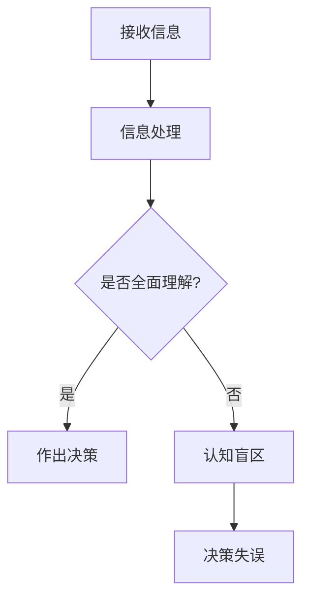

在这个流程图中，A表示管理者接收信息，B表示对信息进行处理，C是一个判断点，判断管理者是否能够全面理解信息。如果能够全面理解，则直接进入决策阶段D；如果不能，则会陷入认知盲区E，最终可能导致决策失误F。

#### 1.2 破除认知盲区的重要性

破除认知盲区对管理者而言至关重要。首先，它可以提高决策的准确性和有效性，避免因信息不全导致的错误决策。其次，破除认知盲区有助于管理者更好地应对复杂多变的环境，提升企业竞争力。此外，破除认知盲区还能够促进团队协作，提高整体绩效。

以下是一个关于破除认知盲区重要性的 Mermaid 流程图。

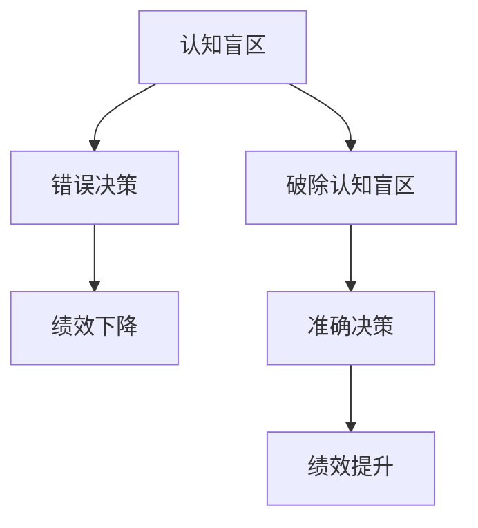

在这个流程图中，我们可以看到，破除认知盲区（D）可以避免错误决策（B），进而提高绩效（F）。

#### 1.3 本书结构安排

本书将分为八个章节，旨在全面探讨管理者的认知盲区及其突破方法。具体结构如下：

- **第1章 引言**：概述管理者的认知盲区及其重要性。
- **第2章 认知科学基础**：介绍认知科学的基本概念和认知偏差。
- **第3章 管理者常见的认知盲区**：分析管理者常见的认知盲区及其影响。
- **第4章 认知盲区的成因分析**：探讨导致认知盲区的心理学、管理环境和组织文化因素。
- **第5章 管理者如何突破认知盲区**：提供突破认知盲区的策略和方法。
- **第6章 管理实践中的认知盲区突破**：探讨在项目管理、团队管理和企业战略管理中如何突破认知盲区。
- **第7章 案例研究**：分析实际案例中如何破除认知盲区。
- **第8章 总结与展望**：总结本书内容，展望未来研究方向。

通过以上章节的安排，本书旨在为管理者提供系统、全面的认知盲区突破指南。

---

在撰写第1章引言时，我们首先介绍了管理者的认知盲区概述，通过一个简单的 Mermaid 流程图帮助读者理解认知盲区的形成过程。接着，我们强调了破除认知盲区的重要性，并再次通过一个 Mermaid 流程图展示了破除认知盲区对管理绩效的积极影响。最后，我们详细介绍了本书的结构安排，帮助读者对后续内容有一个清晰的认识。

在接下来的章节中，我们将深入探讨认知科学的基础知识、管理者常见的认知盲区、认知盲区的成因分析、管理者如何突破认知盲区以及实际管理实践中的应用。我们将会结合理论和实际案例，为读者提供全面、系统的认知盲区突破指南。在文章的末尾，我们将总结全书内容，并对未来研究方向提出建议。通过这样的结构安排，我们希望能够帮助管理者更好地应对认知盲区，提高决策能力和管理绩效。接下来，我们将进入第2章，探讨认知科学的基础知识。

### 第2章 认知科学基础

#### 2.1 认知科学的基本概念

认知科学是研究人类思维、感知、学习等认知过程的跨学科领域。它结合了心理学、神经科学、计算机科学和哲学等多个学科的研究成果，旨在理解人类大脑如何处理信息，并如何形成知识。认知科学的核心概念包括认知过程、认知系统和认知心理学。

首先，**认知过程**是指人类在接收、处理、存储和提取信息时所经历的各个阶段。这些过程包括感知、注意、记忆、推理和决策等。感知是指我们通过感官接收外界信息的过程；注意是指我们在众多信息中选择关注某些信息的能力；记忆是指我们存储和提取信息的能力；推理是指我们在已有信息基础上进行逻辑推理和判断的过程；决策是指我们在不同选择中做出最优决策的能力。

其次，**认知系统**是指支持认知过程的各种生理和心理结构。认知系统包括大脑、神经系统、感官系统和运动系统。大脑是认知过程的主要处理中心，神经系统和感官系统负责信息的接收和处理，运动系统则负责将认知过程的结果转化为行动。

最后，**认知心理学**是研究认知过程的心理学分支。它主要研究人类如何感知、记忆、学习和思考，并试图解释这些心理过程背后的神经机制。认知心理学的研究方法包括实验、观察、问卷调查和脑成像技术等。

以下是一个关于认知科学基本概念的 Mermaid 流Adapter Flow

图。

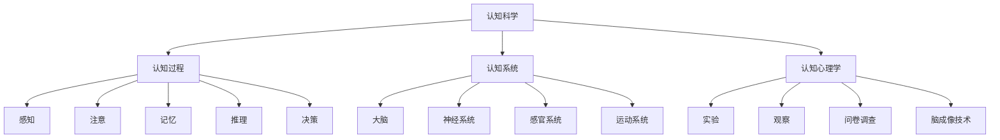

通过这个流程图，我们可以看到认知科学涵盖的各个领域及其相互关系。认知过程是认知科学的核心，而认知系统和认知心理学则提供了理解和研究认知过程的理论基础和实验方法。

#### 2.2 认知偏差与认知盲区

认知偏差是指个体在信息处理过程中产生的系统性错误，这些错误可能导致个体对现实情况的理解产生偏差。认知盲区则是由认知偏差导致的对现实情况的不完全理解。在管理者中，认知偏差和认知盲区往往会导致错误的决策和判断。

以下是一些常见的认知偏差：

1. **确认偏差**：人们倾向于寻找、解释和记忆那些支持自己已有观点的信息，而忽视那些反驳自己观点的信息。这种现象可能导致管理者在决策过程中过分自信，忽视不同意见。

2. **过度自信偏差**：人们往往高估自己的知识和能力，认为自己的决策比实际情况更为有效。这种偏差可能导致管理者在面临不确定性时过于乐观，忽视潜在的风险。

3. **代表性偏差**：人们倾向于根据事物的外观或特征来判断其概率，而忽视实际数据。例如，管理者可能会根据过去的成功经验来预测未来的业绩，而忽视市场的变化。

4. **可得性偏差**：人们更倾向于关注和记忆那些易于获取的信息，而忽视那些难以获取的信息。这种偏差可能导致管理者在决策时只考虑容易获得的数据，而忽视更全面的信息。

5. **锚定效应**：人们倾向于根据最初的信息（锚点）来调整自己的判断，即使这些初始信息并不准确。这种现象可能导致管理者在制定决策时受到初始信息的影响，而忽视其他重要的因素。

以下是一个关于认知偏差的 Mermaid 流程图。

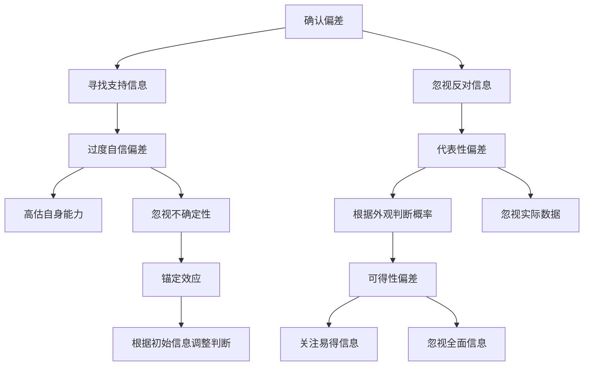

通过这个流程图，我们可以看到各种认知偏差如何影响管理者的决策。这些偏差可能导致管理者在信息处理过程中产生盲区，影响决策的准确性和有效性。

#### 2.3 认知盲区的表现形式

认知盲区在管理者中表现为对现实情况的不完全理解，这种不完全理解可能导致错误的决策和判断。以下是一些常见的认知盲区表现形式：

1. **信息过载**：管理者可能接收了大量的信息，但由于时间和认知能力的限制，无法对所有信息进行有效处理。这可能导致管理者在决策时忽视某些关键信息，陷入认知盲区。

2. **决策过度依赖历史数据**：管理者可能会过分依赖过去的成功经验或数据，而忽视当前环境的变化。这种盲区可能导致管理者在制定决策时无法适应新情况。

3. **对团队动态认识不足**：管理者可能对团队成员的个性、能力和动态缺乏深入了解，导致无法充分利用团队资源，提高团队绩效。

4. **对竞争形势的误判**：管理者可能对竞争对手的动向、市场趋势和客户需求缺乏准确的判断，导致战略决策失误。

5. **对风险的认识不足**：管理者可能低估或忽视潜在的风险，导致在决策过程中未能充分考虑风险因素。

以下是一个关于认知盲区表现形式的 Mermaid 流程图。

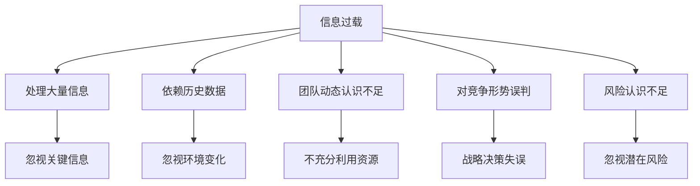

通过这个流程图，我们可以看到认知盲区如何影响管理者的决策和行为。了解这些表现形式有助于管理者更好地识别和破除认知盲区，提高决策的质量和效率。

---

在第2章中，我们首先介绍了认知科学的基本概念，包括认知过程、认知系统和认知心理学，并通过 Mermaid 流程图帮助读者理解这些概念之间的相互关系。接着，我们探讨了认知偏差与认知盲区的关系，列举了常见的认知偏差，并解释了这些偏差如何导致认知盲区。最后，我们详细分析了认知盲区的表现形式，帮助管理者识别和应对这些盲区。

通过本章的讨论，读者应该对认知科学的基本概念和认知盲区有了一个清晰的认识。在接下来的章节中，我们将进一步探讨管理者常见的认知盲区，分析其成因，并提出突破认知盲区的策略和方法。希望通过本章的内容，读者能够更好地理解认知科学的基础知识，为后续章节的学习打下坚实的基础。

### 第3章 管理者常见的认知盲区

#### 3.1 刻板印象与偏见

刻板印象与偏见是管理者在决策过程中常见的认知盲区之一。刻板印象是指个体对某一群体持有的固定化看法，这种看法往往缺乏根据且过于简化。偏见则是个体在处理信息时，因已有观点或情感因素而进行的倾向性判断。

以下是一个关于刻板印象与偏见的 Mermaid 流程图，帮助读者理解这两个概念及其影响。

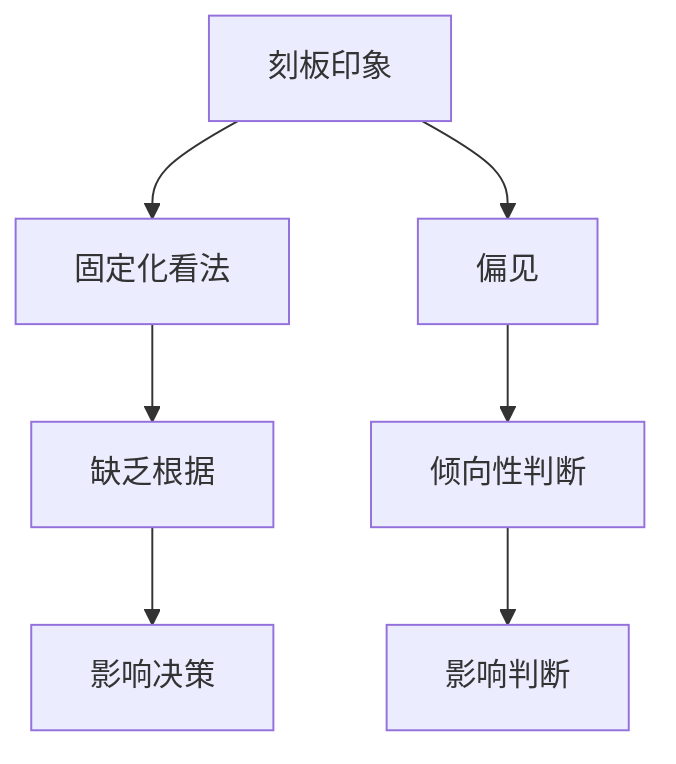

在管理实践中，刻板印象和偏见可能导致以下问题：

1. **决策失误**：管理者可能会因为对某个群体的固定看法而忽视该群体的实际能力和潜力，从而导致错误的招聘、晋升或绩效评估决策。

2. **团队协作受阻**：管理者可能因为对团队成员的刻板印象而忽视他们的贡献和潜力，导致团队内部不和谐，影响团队协作效率。

3. **战略规划失误**：管理者可能会因为对市场的刻板印象而忽视市场的变化和机会，导致战略规划过于僵化，无法适应外部环境的变化。

以下是一个具体的例子，说明刻板印象和偏见如何影响管理决策：

**案例**：某公司的管理者认为年轻的员工缺乏经验和稳重性，因此在关键项目的团队成员选择中，总是倾向于选择年龄较大的员工。然而，这些年轻的员工在项目中表现出极高的创造力和解决问题的能力，最终项目取得了成功。如果管理者没有破除刻板印象和偏见，可能会错过这些优秀的人才，影响项目的整体表现。

**解决方案**：管理者应意识到刻板印象和偏见的存在，并努力破除它们。具体方法包括：

1. **多样化招聘**：在招聘过程中，注重候选人的能力而非年龄、性别等因素，以吸纳多样化的团队。

2. **公平评估**：在评估员工绩效时，基于客观数据和实际表现，而非主观偏见。

3. **增强自我意识**：管理者应不断反思自己的刻板印象和偏见，提高自我意识，减少其对决策的影响。

#### 3.2 缺乏长远规划

缺乏长远规划是管理者在战略决策中常见的认知盲区。长远规划是指管理者对企业的未来进行系统性和长期性的思考和规划，包括战略目标、资源配置、市场定位等。缺乏长远规划可能导致企业在面临不确定性时无法灵活应对，错失发展机遇。

以下是一个关于缺乏长远规划的 Mermaid 流程图，帮助读者理解其影响。

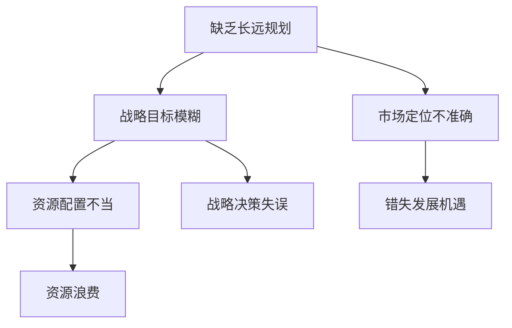

在管理实践中，缺乏长远规划可能导致以下问题：

1. **战略目标模糊**：企业缺乏明确的长期目标，导致战略方向不明确，影响企业的整体发展。

2. **资源配置不当**：企业资源（如资金、人力、技术等）无法得到有效配置，导致资源浪费，影响企业的运营效率。

3. **市场定位不准确**：企业无法准确把握市场需求和趋势，导致产品或服务的定位不准确，影响市场竞争力。

4. **错失发展机遇**：企业无法及时抓住市场变化和新兴技术，错失发展机遇，影响企业的长远发展。

以下是一个具体的例子，说明缺乏长远规划如何影响企业决策：

**案例**：某企业在数字化浪潮中未能及时调整战略，继续依赖传统的生产模式，导致在市场竞争中逐渐被淘汰。如果该企业能够提前进行长远规划，及时调整战略，或许能够抓住数字化转型的机遇，实现持续发展。

**解决方案**：管理者应重视长远规划，采取以下措施：

1. **定期进行战略评估**：定期评估企业的战略目标、市场定位和资源配置，确保其与市场环境和企业发展需求相适应。

2. **加强市场研究**：深入了解市场需求和趋势，以指导企业的长远规划。

3. **制定灵活的应急计划**：在战略规划中考虑潜在的风险和不确定性，制定相应的应急计划，以应对可能的市场变化。

#### 3.3 对风险的认识不足

对风险的认识不足是管理者在决策过程中常见的认知盲区之一。风险是指企业在运营过程中可能面临的各种不确定性和潜在威胁，包括市场风险、财务风险、运营风险等。管理者对风险的识别、评估和应对不足可能导致企业遭受重大损失。

以下是一个关于对风险的认识不足的 Mermaid 流程图，帮助读者理解其影响。

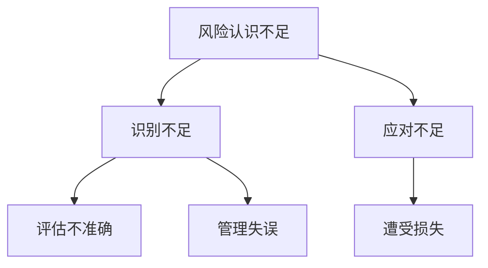

在管理实践中，对风险的认识不足可能导致以下问题：

1. **识别不足**：管理者未能及时发现企业面临的风险，导致企业缺乏应对措施，面临突发风险时措手不及。

2. **评估不准确**：管理者对风险的严重性和可能性评估不准确，导致资源分配和应对策略不当。

3. **应对不足**：管理者在应对风险时缺乏有效的策略和方法，导致风险无法得到有效控制，甚至可能扩大损失。

以下是一个具体的例子，说明对风险的认识不足如何影响企业决策：

**案例**：某企业由于对市场变化和竞争对手动态认识不足，未能及时调整产品策略和市场定位，导致市场份额大幅下滑。如果该企业能够加强对市场风险的识别和评估，及时调整策略，或许能够避免市场份额的流失。

**解决方案**：管理者应加强对风险的认识和应对，采取以下措施：

1. **建立健全的风险管理体系**：制定详细的风险识别、评估和应对流程，确保企业能够及时发现和应对各种风险。

2. **加强风险教育和培训**：提高员工对风险的认识和应对能力，形成全员参与的风险管理文化。

3. **利用外部资源**：借助专业咨询机构和数据分析工具，提高对风险的识别和评估准确性。

#### 3.4 对团队沟通的忽视

对团队沟通的忽视是管理者在团队管理中常见的认知盲区之一。团队沟通是团队协作的基础，良好的沟通能够促进团队成员之间的理解和合作，提高团队整体绩效。忽视团队沟通可能导致信息不畅、误解和冲突，影响团队的工作效率和氛围。

以下是一个关于对团队沟通忽视的 Mermaid 流程图，帮助读者理解其影响。

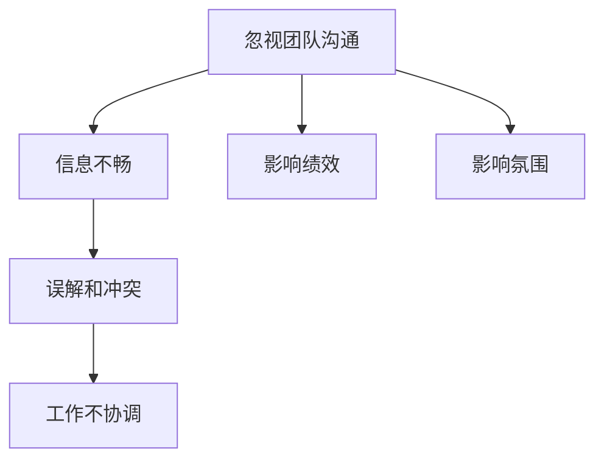

在管理实践中，忽视团队沟通可能导致以下问题：

1. **信息不畅**：团队成员之间缺乏有效的沟通渠道，导致信息传递滞后，影响工作进展。

2. **误解和冲突**：团队成员因沟通不畅而产生误解和冲突，影响团队的协作氛围和士气。

3. **影响绩效**：沟通不畅导致团队成员无法充分发挥各自的优势，影响团队的整体绩效。

4. **影响氛围**：不良的沟通氛围可能导致员工产生负面情绪，影响工作积极性和团队凝聚力。

以下是一个具体的例子，说明忽视团队沟通如何影响团队协作：

**案例**：某项目团队成员之间缺乏有效的沟通，导致项目进度严重滞后。项目中的关键信息未能及时传达，导致团队成员在执行任务时出现重复工作或错误。如果团队能够保持良好的沟通，项目或许能够按时完成。

**解决方案**：管理者应重视团队沟通，采取以下措施：

1. **建立沟通渠道**：为团队成员提供多种沟通方式，如定期会议、即时通讯工具和邮件等，确保信息畅通。

2. **鼓励开放沟通**：营造开放、包容的沟通氛围，鼓励团队成员提出问题和建议，促进信息交流。

3. **培训沟通技巧**：提高团队成员的沟通能力，通过培训和模拟演练，提高沟通效率和效果。

#### 3.5 对竞争形势的误判

对竞争形势的误判是管理者在市场竞争中常见的认知盲区之一。准确判断竞争形势对于制定有效的市场竞争策略至关重要。误判竞争形势可能导致企业战略失误，影响市场地位和业绩。

以下是一个关于对竞争形势误判的 Mermaid 流程图，帮助读者理解其影响。

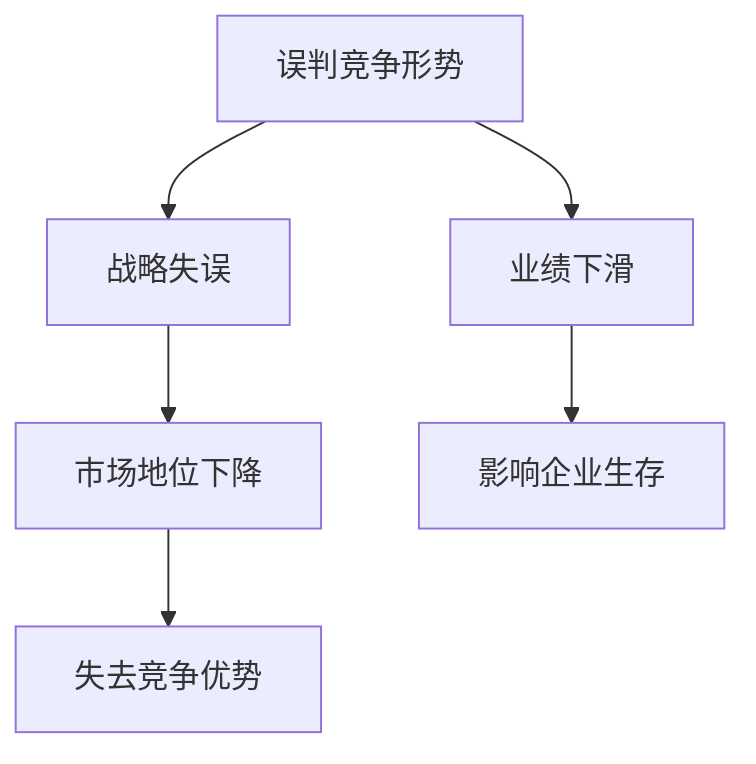

在管理实践中，误判竞争形势可能导致以下问题：

1. **战略失误**：管理者可能因对竞争形势的误判而制定不恰当的市场策略，导致企业无法在市场中立足。

2. **市场地位下降**：企业在竞争中的地位可能因战略失误而逐渐下滑，影响品牌影响力和市场份额。

3. **业绩下滑**：企业业绩可能因战略失误和市场地位下降而受到影响，甚至出现亏损。

4. **失去竞争优势**：企业可能因无法准确判断竞争对手的策略和行动，而失去原有的竞争优势。

以下是一个具体的例子，说明对竞争形势误判如何影响企业决策：

**案例**：某企业在面对新兴竞争对手时，未能准确判断其策略和实力，导致企业对市场变化反应迟缓，市场份额逐渐被竞争对手侵蚀。如果企业能够准确判断竞争形势，及时调整策略，或许能够保持市场地位。

**解决方案**：管理者应加强对竞争形势的判断，采取以下措施：

1. **定期进行市场分析**：通过市场调研和数据分析，准确了解竞争对手的策略和动向。

2. **建立竞争情报系统**：收集、分析和共享竞争对手的信息，为决策提供依据。

3. **灵活调整市场策略**：根据市场变化和竞争形势，及时调整企业的市场策略。

---

在第3章中，我们探讨了管理者常见的认知盲区，包括刻板印象与偏见、缺乏长远规划、对风险的认识不足、对团队沟通的忽视和对竞争形势的误判。通过详细的解释和实际的案例，我们帮助读者理解了这些认知盲区如何影响管理决策和团队协作。

刻板印象与偏见可能导致决策失误和团队协作受阻，缺乏长远规划可能导致战略方向模糊和资源浪费，对风险的认识不足可能导致企业遭受重大损失，对团队沟通的忽视可能导致信息不畅和误解冲突，而对竞争形势的误判可能导致企业失去竞争优势。

通过本章的讨论，读者应该对管理者常见的认知盲区有了更深入的了解，并认识到这些盲区对管理决策和团队协作的深远影响。在接下来的章节中，我们将进一步分析认知盲区的成因，并探讨如何通过具体的策略和方法来突破这些盲区，提高管理者的决策能力和团队绩效。希望通过本章的内容，读者能够更好地识别和应对管理中的认知盲区，提升自己的管理水平和企业绩效。

### 第4章 认知盲区的成因分析

#### 4.1 心理学因素

心理学因素是导致管理者认知盲区的重要原因之一。心理学研究揭示了人类认知的诸多局限，这些局限在管理者决策过程中表现得尤为明显。

首先，**认知负荷**是导致认知盲区的一个关键因素。管理者的工作往往复杂且繁忙，他们需要处理大量的信息。当认知负荷过高时，管理者可能会出现“信息过载”，导致无法全面分析所有信息，从而产生认知盲区。以下是一个关于认知负荷和认知盲区的 Mermaid 流程图。

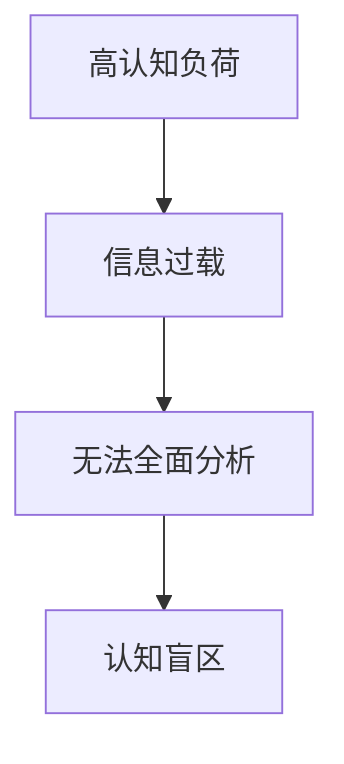

其次，**情绪因素**也会影响管理者的认知。情绪波动，如焦虑、压力和喜悦，都可能干扰管理者的判断力。例如，当管理者感到焦虑或压力时，他们可能会对风险的识别和评估产生偏差，导致决策失误。以下是一个关于情绪因素和认知盲区的 Mermaid 流程图。

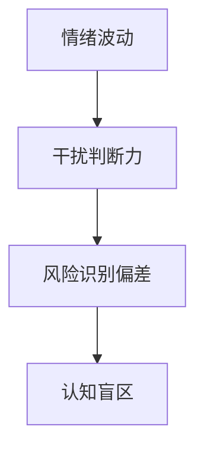

此外，**心理定势**也是导致认知盲区的一个因素。心理定势是指个体在思维和行为上表现出的一种倾向，这种倾向可能是基于过去的经验和习惯。管理者可能会因心理定势而忽视新的信息或新的方法，导致认知盲区。以下是一个关于心理定势和认知盲区的 Mermaid 流程图。

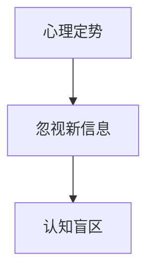

#### 4.2 管理环境因素

管理环境因素也是导致管理者认知盲区的重要原因。这些因素包括组织结构、文化氛围、信息流动等，它们在无形中影响着管理者的认知和行为。

首先，**组织结构**对管理者的认知盲区有显著影响。传统的垂直型组织结构可能导致信息流通不畅，管理者在决策时可能缺乏全面的信息支持。以下是一个关于组织结构和信息流通的 Mermaid 流程图。

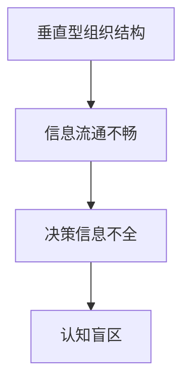

其次，**文化氛围**也会影响管理者的认知。在一个重视创新和开放沟通的文化中，管理者更可能接受不同的意见和新的想法，从而减少认知盲区的可能性。相反，在一个保守和封闭的文化中，管理者可能更倾向于依赖传统方法，导致认知盲区的产生。以下是一个关于文化氛围和认知盲区的 Mermaid 流程图。

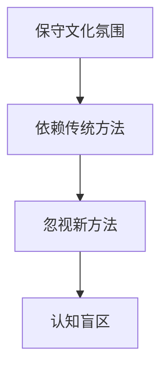

最后，**信息流动**的质量和效率也是影响管理者认知盲区的重要因素。如果组织内部信息流动不畅，管理者可能无法及时获取关键信息，从而影响决策质量。以下是一个关于信息流动和认知盲区的 Mermaid 流程图。

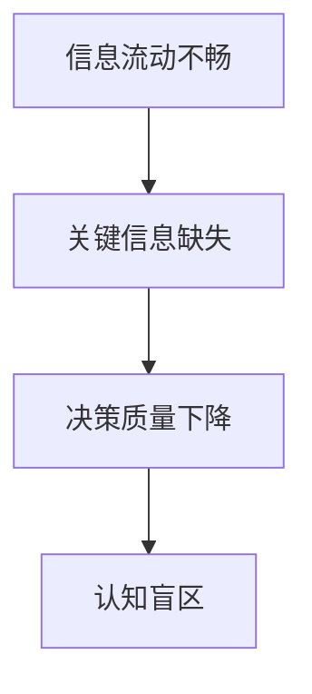

#### 4.3 组织文化因素

组织文化是影响管理者认知盲区的另一个关键因素。组织文化包括价值观、信念和行为准则，这些因素共同塑造了组织的氛围和行为模式。

首先，**创新文化**能够促进管理者的开放思维和勇于尝试新方法。在一个鼓励创新的文化中，管理者更可能接受新的信息和观点，减少认知盲区。以下是一个关于创新文化和认知盲区的 Mermaid 流程图。

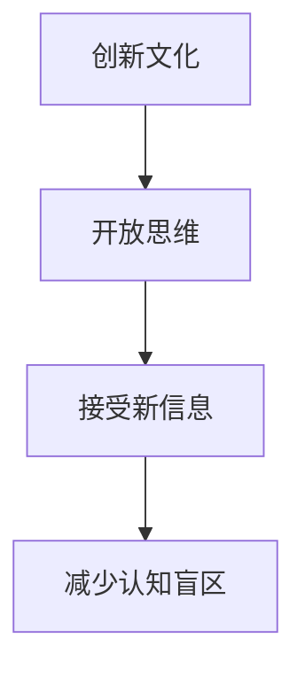

其次，**团队协作文化**能够促进信息共享和知识交流，减少管理者的认知盲区。在一个重视团队协作的文化中，管理者更可能与其他团队成员进行有效沟通，获取多方面的信息和支持。以下是一个关于团队协作文化和认知盲区的 Mermaid 流程图。

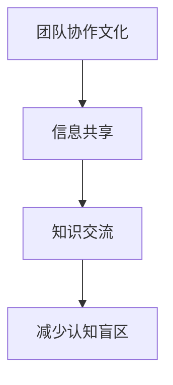

最后，**学习文化**能够激发管理者的持续学习和自我提升，减少认知盲区的可能性。在一个鼓励学习的文化中，管理者更可能通过不断学习和实践来提升自己的认知水平，从而更好地应对复杂的管理挑战。以下是一个关于学习文化和认知盲区的 Mermaid 流程图。

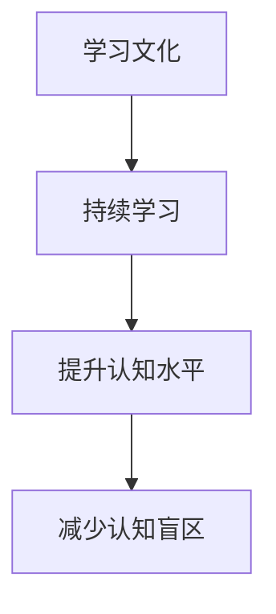

---

在第4章中，我们分析了导致管理者认知盲区的心理学因素、管理环境因素和组织文化因素。通过详细的解释和 Mermaid 流程图，我们帮助读者理解了这些因素如何影响管理者的认知和行为。

心理学因素，如认知负荷、情绪波动和心理定势，可能导致管理者在信息处理和决策过程中产生盲区。管理环境因素，如组织结构、文化氛围和信息流动，也可能影响管理者的认知。组织文化因素，如创新文化、团队协作文化和学习文化，对管理者的认知有积极的促进作用。

通过本章的讨论，读者应该对认知盲区的成因有了更深入的了解。在接下来的章节中，我们将探讨管理者如何通过培养批判性思维、提高自我意识、加强跨部门沟通、学习与创新和寻求外部咨询与反馈来突破认知盲区，提高管理效率和决策质量。希望通过本章的内容，读者能够更好地识别和应对管理中的认知盲区，提升自己的管理水平和企业绩效。

### 第5章 管理者如何突破认知盲区

#### 5.1 培养批判性思维

批判性思维是突破认知盲区的重要方法。它要求管理者在处理信息和做出决策时，能够客观地分析、评估和推理，避免被表面现象和固有观念所误导。以下是一个关于培养批判性思维的 Mermaid 流程图，帮助读者理解这一过程。

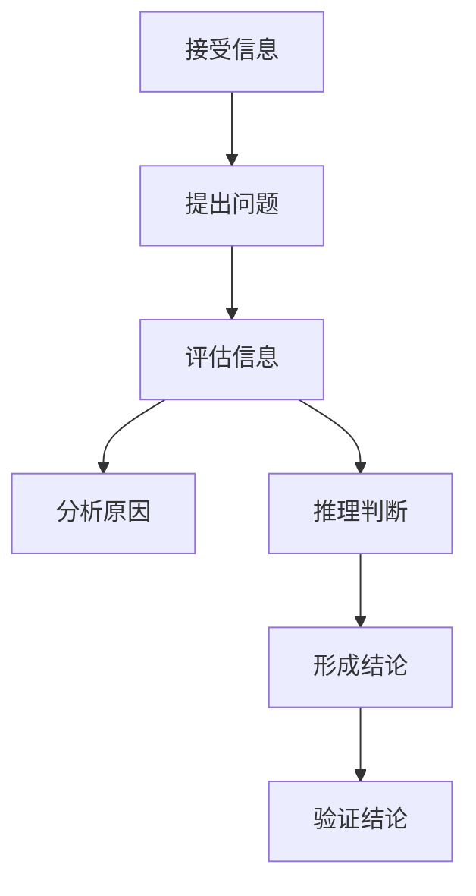

在管理实践中，培养批判性思维可以采取以下策略：

1. **提出问题**：在面对信息时，首先要提出问题，如“这个信息的来源是什么？”“这个信息是否可靠？”“这个信息对我的决策有何影响？”等。

2. **评估信息**：对信息进行评估，包括来源的可靠性、信息的准确性、信息的完整性等。

3. **分析原因**：深入分析信息背后的原因，了解信息的产生机制，以便更好地理解其影响。

4. **推理判断**：基于已有信息和评估结果，进行逻辑推理和判断，形成初步结论。

5. **验证结论**：对结论进行验证，通过实际操作或数据验证，确保结论的准确性。

以下是一个具体的案例，说明如何通过批判性思维来突破认知盲区：

**案例**：某公司计划推出一款新产品，市场部门提供了市场调研数据，显示目标市场对该产品的需求强烈。然而，销售部门的经理对此表示质疑，认为数据可能存在偏差。通过批判性思维，经理提出了以下问题：

- **来源可靠吗？**：市场调研数据的来源是可靠的第三方机构，且方法科学。
- **数据完整吗？**：数据涵盖了不同年龄、性别和地区的消费者，具有代表性。
- **其他因素考虑了吗？**：除了市场需求，还考虑了产品的成本、生产和供应链等因素。

经过评估和分析，经理最终得出结论：新产品有市场需求，但需进一步优化成本和生产计划。通过批判性思维，经理成功突破了认知盲区，为决策提供了有力支持。

#### 5.2 提高自我意识

提高自我意识是管理者突破认知盲区的重要途径。自我意识指的是管理者对自己认知、情感和行为状态的认知和了解。以下是一个关于提高自我意识的 Mermaid 流程图，帮助读者理解这一过程。

```mermaid
graph TB
    A[反思行为] --> B[识别认知盲区]
    B --> C[分析原因]
    C --> D[采取行动]
    D --> E[持续反思]
```

在管理实践中，提高自我意识可以采取以下策略：

1. **反思行为**：定期对自己的行为和决策进行反思，了解哪些行为是有效的，哪些是无效的。

2. **识别认知盲区**：通过反思，识别自己在信息处理和决策过程中存在的盲区，如过度依赖历史数据、忽视团队意见等。

3. **分析原因**：分析认知盲区产生的原因，包括心理学因素、管理环境因素和组织文化因素等。

4. **采取行动**：针对识别出的认知盲区，采取具体行动进行改进，如加强团队沟通、定期进行风险评估等。

5. **持续反思**：将自我意识培养作为一个持续的过程，不断反思和改进，以不断提高自身的认知水平。

以下是一个具体的案例，说明如何通过提高自我意识来突破认知盲区：

**案例**：某公司项目经理在进行项目评估时，总是忽略团队成员的意见，导致项目进度延误。通过自我反思，项目经理意识到自己存在过度依赖历史数据和忽视团队意见的认知盲区。他开始采取以下行动：

- **定期召开团队会议**：鼓励团队成员提出意见和建议，收集多方面的信息。
- **进行风险评估**：定期对项目进行风险评估，提前识别潜在问题。
- **反思会议效果**：每次会议后，反思会议的效果，总结经验教训。

通过这些行动，项目经理成功突破了认知盲区，提高了项目管理的效率。

#### 5.3 加强跨部门沟通

跨部门沟通是管理者突破认知盲区的重要手段。良好的跨部门沟通能够促进信息共享、知识交流和资源整合，从而提高决策质量。以下是一个关于加强跨部门沟通的 Mermaid 流程图，帮助读者理解这一过程。

```mermaid
graph TB
    A[建立沟通机制] --> B[明确沟通目标]
    B --> C[制定沟通计划]
    C --> D[执行沟通计划]
    D --> E[评估沟通效果]
    E --> F[持续改进]
```

在管理实践中，加强跨部门沟通可以采取以下策略：

1. **建立沟通机制**：制定明确的沟通流程和规则，确保信息在各部门之间顺畅流动。

2. **明确沟通目标**：确定每次沟通的具体目标和内容，确保沟通的针对性和有效性。

3. **制定沟通计划**：根据沟通目标，制定详细的沟通计划，包括沟通时间、地点、参与人员和沟通方式等。

4. **执行沟通计划**：按照沟通计划进行沟通，确保沟通活动的顺利进行。

5. **评估沟通效果**：对沟通效果进行评估，包括信息传递的准确性、沟通目标的实现程度等。

6. **持续改进**：根据评估结果，持续改进沟通机制和沟通方法，提高沟通效率。

以下是一个具体的案例，说明如何通过加强跨部门沟通来突破认知盲区：

**案例**：某公司研发部门和市场部门之间存在信息不对称的问题，导致产品研发与市场需求不匹配。为了解决这一问题，公司决定加强跨部门沟通：

- **建立沟通机制**：定期召开跨部门会议，讨论研发和市场之间的合作和沟通问题。
- **明确沟通目标**：明确每次会议的目标，如讨论产品研发进度、市场反馈等。
- **制定沟通计划**：制定详细的沟通计划，包括会议时间、地点和参与人员。
- **执行沟通计划**：按照沟通计划进行会议，确保双方充分沟通。
- **评估沟通效果**：对每次会议的效果进行评估，收集反馈意见。
- **持续改进**：根据评估结果，改进沟通机制和沟通方法，提高沟通效率。

通过这些措施，公司成功解决了研发和市场之间的信息不对称问题，提高了产品的市场竞争力。

#### 5.4 学习与创新

学习与创新是管理者突破认知盲区的关键途径。通过持续学习和创新，管理者可以不断扩展自己的知识领域，提升决策能力，从而更好地应对复杂多变的管理环境。以下是一个关于学习与创新的 Mermaid 流程图，帮助读者理解这一过程。

```mermaid
graph TB
    A[持续学习] --> B[知识扩展]
    B --> C[能力提升]
    C --> D[决策优化]
    D --> E[创新实践]
    E --> F[持续反馈]
```

在管理实践中，学习与创新可以采取以下策略：

1. **持续学习**：管理者应不断学习新知识、新技能，关注行业动态和前沿技术，以保持自己的竞争力和前瞻性。

2. **知识扩展**：通过参加培训、阅读书籍、参与研讨会等方式，扩展自己的知识领域，提升综合素质。

3. **能力提升**：将所学知识应用到实际工作中，通过实践提升自己的决策能力和管理水平。

4. **决策优化**：在决策过程中，运用所学知识和经验，进行科学分析和评估，提高决策的准确性和有效性。

5. **创新实践**：鼓励创新思维和实践，通过创新解决方案应对管理中的挑战和问题。

6. **持续反馈**：对创新实践的效果进行持续评估和反馈，不断优化创新方法，提高创新成功率。

以下是一个具体的案例，说明如何通过学习与创新来突破认知盲区：

**案例**：某公司为了提升产品竞争力，决定引入新的智能制造技术。公司管理者通过以下步骤进行学习与创新：

- **持续学习**：组织员工参加智能制造相关的培训课程，学习相关技术和知识。
- **知识扩展**：邀请行业专家进行讲座，分享智能制造的最新动态和实践经验。
- **能力提升**：将所学知识应用于实际生产，进行智能制造的试点项目。
- **决策优化**：在试点项目的基础上，对智能制造的效果进行评估，优化决策方案。
- **创新实践**：在全面推广智能制造技术前，进行小范围的创新实践，收集反馈意见。
- **持续反馈**：根据反馈意见，持续改进智能制造技术，提高其适用性和效率。

通过这些措施，公司成功引入了智能制造技术，提高了生产效率，增强了产品竞争力。

#### 5.5 寻求外部咨询与反馈

寻求外部咨询与反馈是管理者突破认知盲区的重要手段。外部咨询能够为管理者提供专业的知识和经验，外部反馈能够帮助管理者从不同的角度审视问题，发现自身的盲区。以下是一个关于寻求外部咨询与反馈的 Mermaid 流程图，帮助读者理解这一过程。

```mermaid
graph TB
    A[寻求外部咨询] --> B[获取专业知识]
    B --> C[指导决策]
    C --> D[优化策略]
    A --> E[获取外部反馈]
    E --> F[审视自身]
    E --> G[改进方法]
```

在管理实践中，寻求外部咨询与反馈可以采取以下策略：

1. **寻求外部咨询**：聘请专业顾问或专家，获取他们的专业知识和经验，为决策提供参考。

2. **获取外部反馈**：通过定期调研、客户反馈和市场分析，了解外部环境的变化和需求。

3. **指导决策**：结合外部咨询和外部反馈，对管理决策进行指导，优化决策方案。

4. **优化策略**：根据外部咨询和反馈，对现有策略进行调整和优化，提高策略的有效性。

5. **审视自身**：通过外部咨询和反馈，审视自身在管理过程中的盲区和不足，为改进提供方向。

6. **改进方法**：根据外部咨询和反馈，改进管理方法，提升管理水平和绩效。

以下是一个具体的案例，说明如何通过寻求外部咨询与反馈来突破认知盲区：

**案例**：某公司为了提升市场竞争力，决定进行市场战略调整。公司管理者通过以下步骤进行外部咨询与反馈：

- **寻求外部咨询**：聘请市场战略顾问，获取专业的市场分析和建议。
- **获取外部反馈**：通过客户调研和市场竞争分析，了解市场需求和竞争对手的动态。
- **指导决策**：结合外部咨询和反馈，制定新的市场战略。
- **优化策略**：根据外部咨询和反馈，对市场战略进行调整和优化。
- **审视自身**：通过外部咨询和反馈，审视公司在市场战略执行过程中的盲区和不足。
- **改进方法**：根据外部咨询和反馈，改进市场战略的执行方法，提高市场竞争力。

通过这些措施，公司成功突破了认知盲区，提升了市场竞争力，实现了业务增长。

---

在第5章中，我们详细探讨了管理者如何通过培养批判性思维、提高自我意识、加强跨部门沟通、学习与创新和寻求外部咨询与反馈来突破认知盲区。通过具体的策略和方法，我们帮助读者理解了这些方法在管理实践中的应用。

培养批判性思维可以提升管理者在信息处理和决策过程中的分析能力和判断力；提高自我意识可以帮助管理者识别和改进自己的认知盲区；加强跨部门沟通可以促进信息共享和知识交流，减少信息不对称；学习与创新可以帮助管理者持续提升自己的知识和技能，适应不断变化的管理环境；寻求外部咨询与反馈可以为管理者提供专业的意见和建议，帮助其从不同角度审视问题。

通过本章的讨论，读者应该对如何突破认知盲区有了更深入的理解，并认识到这些方法在实际管理中的应用价值。在接下来的章节中，我们将进一步探讨在项目管理、团队管理和企业战略管理中如何具体应用这些方法，以帮助管理者在实际工作中更好地应对认知盲区。希望通过本章的内容，读者能够更好地提升自己的管理能力，实现企业的持续发展和成功。

### 第6章 管理实践中的认知盲区突破

#### 6.1 项目管理中的认知盲区突破

在项目管理中，认知盲区可能对项目的成功产生重大影响。为了有效地突破这些盲区，管理者需要采用一系列策略和方法。

首先，**明确项目目标**是项目管理中至关重要的一步。通过明确项目目标，管理者可以确保项目团队在正确的方向上努力，从而减少认知盲区。以下是一个关于明确项目目标的 Mermaid 流程图。

```mermaid
graph TB
    A[确定项目目标] --> B[分解目标]
    B --> C[制定指标]
    C --> D[分配任务]
    D --> E[监控进度]
```

具体策略如下：

1. **确定项目目标**：在项目启动阶段，管理者应与项目团队一起明确项目目标，并确保所有成员对目标有共同的理解。

2. **分解目标**：将项目目标分解为具体的可操作的任务，并明确每个任务的里程碑和交付物。

3. **制定指标**：为每个任务制定明确的绩效指标，以便于监控进度和评估成果。

4. **分配任务**：根据团队成员的技能和经验，合理分配任务，确保任务能够高效完成。

5. **监控进度**：定期监控项目进度，及时发现并解决潜在的问题。

以下是一个具体的案例，说明如何通过明确项目目标来突破认知盲区：

**案例**：某公司计划开发一款新软件产品。在项目启动阶段，项目经理与项目团队明确项目的目标为“在三个月内完成产品的基本功能开发，并确保产品在市场上具有竞争力”。为了确保目标的实现，项目经理采取了以下措施：

- **分解目标**：将项目目标分解为多个可操作的任务，如需求分析、设计、编码和测试等。
- **制定指标**：为每个任务制定明确的绩效指标，如任务完成率、代码质量等。
- **分配任务**：根据团队成员的技能和经验，合理分配任务，确保任务高效完成。
- **监控进度**：定期召开项目进度会议，监控项目进度，及时解决遇到的问题。

通过这些措施，项目经理成功突破了认知盲区，确保了项目的顺利进行。

#### 6.2 团队管理中的认知盲区突破

在团队管理中，管理者需要确保团队成员能够高效协作，实现共同目标。然而，认知盲区可能导致管理者在团队管理中产生误解和冲突，影响团队绩效。为了突破这些盲区，管理者可以采取以下策略。

首先，**建立有效的沟通机制**是团队管理中至关重要的一步。以下是一个关于建立沟通机制的 Mermaid 流程图。

```mermaid
graph TB
    A[召开会议] --> B[建立沟通渠道]
    B --> C[定期反馈]
    C --> D[解决冲突]
```

具体策略如下：

1. **召开会议**：定期召开团队会议，为团队成员提供一个交流和分享的平台。

2. **建立沟通渠道**：通过邮件、即时通讯工具和视频会议等多种方式，建立有效的沟通渠道，确保信息畅通。

3. **定期反馈**：鼓励团队成员定期反馈工作进展和遇到的问题，以便及时调整和改进。

4. **解决冲突**：建立冲突解决机制，及时解决团队成员之间的冲突，确保团队和谐。

以下是一个具体的案例，说明如何通过建立有效的沟通机制来突破认知盲区：

**案例**：某公司团队在项目执行过程中出现了沟通不畅的问题，导致项目进度延误。为了解决这个问题，项目经理采取了以下措施：

- **召开会议**：每周召开一次团队会议，为团队成员提供一个交流和分享的机会。
- **建立沟通渠道**：通过公司内部通讯工具建立了一个项目沟通群，确保团队成员能够及时交流和分享信息。
- **定期反馈**：鼓励团队成员定期反馈工作进展和遇到的问题，确保团队了解项目的整体情况。
- **解决冲突**：建立了一个冲突解决机制，及时解决团队成员之间的冲突，确保团队和谐。

通过这些措施，项目经理成功突破了团队管理中的认知盲区，提高了团队协作效率。

#### 6.3 企业战略管理中的认知盲区突破

在企业战略管理中，管理者需要准确判断市场趋势和竞争形势，制定有效的战略规划。然而，认知盲区可能导致管理者对市场形势的误判，影响战略决策。为了突破这些盲区，管理者可以采取以下策略。

首先，**进行市场调研**是战略管理中至关重要的一步。以下是一个关于进行市场调研的 Mermaid 流程图。

```mermaid
graph TB
    A[确定调研目标] --> B[收集数据]
    B --> C[分析数据]
    C --> D[制定战略]
```

具体策略如下：

1. **确定调研目标**：明确市场调研的目的，如了解市场需求、分析竞争对手等。

2. **收集数据**：通过问卷调查、访谈、市场分析报告等方式，收集相关的市场数据。

3. **分析数据**：对收集到的数据进行详细分析，识别市场趋势和竞争形势。

4. **制定战略**：根据分析结果，制定相应的战略规划，以应对市场变化和竞争压力。

以下是一个具体的案例，说明如何通过进行市场调研来突破认知盲区：

**案例**：某公司在制定新的市场进入战略时，面临对目标市场的误判问题。为了解决这个问题，公司采取了以下措施：

- **确定调研目标**：明确调研的目标是了解目标市场的需求和竞争情况。
- **收集数据**：通过问卷调查和访谈收集了大量的市场数据。
- **分析数据**：对收集到的数据进行了详细分析，识别出了目标市场的需求和竞争形势。
- **制定战略**：根据分析结果，制定了新的市场进入战略，包括产品定位、营销策略等。

通过这些措施，公司成功突破了战略管理中的认知盲区，制定了有效的市场进入战略，取得了显著的市场成果。

---

在第6章中，我们探讨了在项目管理、团队管理和企业战略管理中如何突破认知盲区。通过具体的策略和方法，我们帮助读者理解了如何在实际管理工作中应用这些方法。

在项目管理中，明确项目目标、分解目标、制定指标、分配任务和监控进度是关键策略；在团队管理中，建立有效的沟通机制、召开会议、建立沟通渠道、定期反馈和解决冲突是有效方法；在企业战略管理中，进行市场调研、确定调研目标、收集数据、分析数据和制定战略是重要步骤。

通过本章的讨论，读者应该对如何在实际管理工作中突破认知盲区有了更深入的了解。在接下来的章节中，我们将通过案例研究进一步探讨如何在实际场景中应用这些策略和方法，帮助管理者更好地应对认知盲区，提升管理绩效。希望通过本章的内容，读者能够将理论应用到实践中，实现企业的持续发展和成功。

### 第7章 案例研究

#### 7.1 案例一：企业如何通过认知突破实现转型升级

**背景**：某传统制造企业A，成立于上世纪80年代，主要生产家电产品。随着市场环境的变化和竞争的加剧，企业逐渐陷入困境，市场份额不断下降。为了摆脱困境，企业决定进行转型升级。

**问题**：企业在转型升级过程中面临多个认知盲区，包括对市场需求的误判、对技术创新的不重视、对组织变革的抵触等。

**策略**：

1. **市场调研与需求分析**：企业通过大量市场调研，收集了消费者需求、竞争对手动态和行业趋势的数据。通过对数据的分析，企业发现家电市场正逐渐向智能化、个性化方向转型。

2. **技术创新与研发投入**：企业加大了在智能化家电产品的研发投入，成立专门的研发团队，并与高校和研究机构合作，推动技术创新。

3. **组织变革与人才培养**：企业进行了组织变革，调整了部门结构和岗位职责，引入了新的管理模式和激励机制，以适应新的业务模式。

**实施过程**：

- **第一阶段**：企业对市场进行了深度调研，明确了智能化家电的发展方向。同时，企业开始加大研发投入，开发智能化产品。
- **第二阶段**：企业进行了组织变革，调整了部门结构，引入了新的管理模式，并进行了员工培训，以提高员工对新业务的适应能力。
- **第三阶段**：企业推出了多款智能化家电产品，并开展了广泛的营销活动，提高了市场知名度。

**结果**：通过认知突破，企业成功实现了转型升级，产品竞争力大幅提升，市场份额逐渐回升。同时，企业的研发能力和管理水平也得到了显著提高。

**启示**：企业在面对市场变化时，应积极开展市场调研，准确把握市场趋势；加大技术创新投入，推动产品升级；进行组织变革，适应新的业务模式。

---

#### 7.2 案例二：管理者如何应对突发危机

**背景**：某互联网公司B，在一次重大数据泄露事件后，面临严重的信誉危机和市场压力。

**问题**：企业在数据泄露事件后，面临多个认知盲区，包括对危机的严重性认识不足、应对措施的缺乏、沟通不畅等。

**策略**：

1. **快速响应**：企业立即成立了危机应对小组，由高层管理者亲自领导，迅速开展危机应对工作。

2. **透明沟通**：企业通过官方渠道发布了详细的危机应对计划，并向公众、客户和员工进行了透明沟通，确保信息畅通。

3. **技术修复与保护**：企业迅速进行了技术修复，加强了数据保护措施，以防止类似事件再次发生。

4. **法律责任与赔偿**：企业主动承担了法律责任，向受影响的用户提供了赔偿和补偿方案。

**实施过程**：

- **第一阶段**：危机发生后，企业立即成立了危机应对小组，制定了详细的应对计划。
- **第二阶段**：企业通过官方渠道发布了危机应对计划，并与客户、员工和媒体进行了多次沟通，确保信息透明。
- **第三阶段**：企业迅速进行了技术修复，加强了数据保护，同时主动承担了法律责任，向受影响的用户提供了赔偿。

**结果**：通过有效的危机应对，企业成功缓解了市场压力，恢复了信誉，并增强了用户对企业的信任。

**启示**：在面对突发危机时，管理者应迅速响应，成立专业应对小组；进行透明沟通，确保信息畅通；加强技术修复和保护，防止危机扩大；主动承担法律责任，增强用户信任。

---

#### 7.3 案例三：团队协作中的认知盲区及解决策略

**背景**：某科技公司C在项目开发过程中，团队成员之间缺乏有效沟通，导致项目进度延误，产品质量下降。

**问题**：团队成员之间存在认知盲区，包括对项目目标的理解不一致、沟通不畅、协作不紧密等。

**策略**：

1. **明确项目目标**：项目启动阶段，项目团队一起明确项目目标，确保所有成员对目标有共同的理解。

2. **建立沟通机制**：通过定期召开项目会议、建立项目沟通群等方式，建立有效的沟通渠道，确保信息畅通。

3. **协作工具使用**：引入项目管理工具，如JIRA、Trello等，帮助团队成员进行任务分配、进度跟踪和协作。

4. **培训与反馈**：定期对团队成员进行沟通协作培训，提高沟通效率和协作能力。

**实施过程**：

- **第一阶段**：项目启动阶段，项目团队明确项目目标，制定详细的项目计划。
- **第二阶段**：建立了定期项目会议和项目沟通群，确保团队成员能够及时交流和分享信息。
- **第三阶段**：引入了项目管理工具，帮助团队成员进行任务分配和进度跟踪。
- **第四阶段**：定期对团队成员进行沟通协作培训，提高沟通效率和协作能力。

**结果**：通过有效的沟通和协作，项目团队克服了认知盲区，项目进度和质量显著提升。

**启示**：在团队协作中，明确项目目标是关键；建立有效的沟通机制和协作工具，确保信息畅通；定期进行沟通协作培训，提高团队成员的能力。

---

在第7章中，我们通过三个实际案例，详细探讨了企业如何通过认知突破实现转型升级、管理者如何应对突发危机以及团队协作中如何克服认知盲区。这些案例为我们提供了丰富的经验和启示。

**案例一**展示了企业在面对市场变化时，如何通过市场调研、技术创新和组织变革实现转型升级；**案例二**展示了管理者在面对突发危机时，如何迅速响应、透明沟通和技术修复，成功应对危机；**案例三**展示了团队协作中如何通过明确项目目标、建立沟通机制、使用协作工具和培训反馈来克服认知盲区。

通过这些案例研究，读者可以更好地理解如何在实际管理工作中应用认知突破的方法，提升管理绩效和团队协作效率。在未来的管理实践中，管理者应不断学习、实践和改进，以应对不断变化的市场环境和竞争压力。希望通过本章的内容，读者能够将这些经验应用到实际工作中，实现企业的持续发展和成功。

### 第8章 总结与展望

#### 8.1 总结

在本章中，我们系统地探讨了管理者的认知盲区及其突破方法。首先，我们介绍了认知盲区的定义和重要性，通过认知科学的基础知识帮助读者理解认知盲区的本质。接着，我们分析了管理者常见的认知盲区，包括刻板印象与偏见、缺乏长远规划、对风险的认识不足、对团队沟通的忽视和对竞争形势的误判，并详细探讨了这些盲区如何影响管理决策和团队协作。随后，我们分析了导致认知盲区的心理学、管理环境和组织文化因素，为读者提供了全面的认识。

在解决方案部分，我们提出了五种策略：培养批判性思维、提高自我意识、加强跨部门沟通、学习与创新和寻求外部咨询与反馈。这些策略旨在帮助管理者识别和破除认知盲区，提高决策能力和管理绩效。通过项目管理、团队管理和企业战略管理的实际案例，我们展示了如何在实际工作中应用这些策略，实现认知盲区的突破。

#### 8.2 破除认知盲区的重要性

破除认知盲区对于管理者而言具有重要意义。首先，它有助于提高决策的准确性和有效性，避免因信息不全或认知偏差导致的错误决策。其次，破除认知盲区有助于管理者更好地应对复杂多变的环境，提升企业竞争力。此外，破除认知盲区还能够促进团队协作，提高整体绩效。通过破除认知盲区，管理者能够更全面地理解现实情况，做出更为科学和合理的决策，从而推动企业的持续发展和成功。

#### 8.3 未来研究方向与建议

未来在认知盲区研究领域，我们可以从以下几个方面进行探索和改进：

1. **深化认知科学的基础研究**：加强对人类认知过程的深入研究，探索更多影响管理者决策和行为的认知因素，为破除认知盲区提供更坚实的理论基础。

2. **开发针对性的管理工具**：结合认知科学的研究成果，开发一系列针对管理者认知盲区的管理工具和方法，帮助管理者在实际工作中更有效地识别和应对认知盲区。

3. **加强跨学科研究**：认知盲区问题不仅涉及心理学，还涉及管理学、经济学、社会学等多个学科。加强跨学科研究，有助于从不同角度理解和解决认知盲区问题。

4. **开展实证研究**：通过实证研究，验证不同策略和方法在破除认知盲区中的有效性，为实际管理实践提供更加可靠的数据支持。

5. **培训与教育**：加强对管理者的培训和教育工作，提高他们的认知水平和决策能力，帮助他们在实际工作中更好地应对认知盲区。

总之，破除认知盲区是提升管理者决策能力和企业管理绩效的重要途径。通过持续的研究和实践，我们可以为管理者提供更有效的策略和方法，帮助他们更好地应对复杂多变的管理环境，实现企业的持续发展和成功。

### 附录

#### A.1 相关认知科学理论简介

在本章节中，我们将简要介绍与认知盲区相关的一些重要认知科学理论，帮助读者更好地理解认知盲区的本质及其产生的原因。

1. **双过程理论**：双过程理论认为，人类的认知过程可以分为系统1和系统2。系统1是快速的、自动的、情感驱动的认知过程，它负责大部分日常认知任务，但容易受到认知偏差的影响。系统2是慢速的、有意识的、逻辑驱动的认知过程，它负责复杂和需要深思熟虑的任务，但通常在认知盲区中发挥作用不足。

2. **启发式与偏见理论**：启发式与偏见理论探讨了人们在决策过程中采用的简化和快捷方法，这些方法虽然能提高决策效率，但可能导致认知偏差和盲区。例如，代表性启发式是根据事物的外观或特征来判断其概率；锚定启发式是根据最初的信息进行调整；确认启发式是寻找支持已有信念的信息。

3. **大脑认知神经科学**：大脑认知神经科学通过脑成像技术（如功能性磁共振成像fMRI）研究大脑在处理信息、记忆和决策等认知过程中的活动。研究表明，不同的认知任务涉及大脑的不同区域，如前额叶、颞叶和顶叶等，这些区域的活动异常可能与认知盲区有关。

4. **认知负荷理论**：认知负荷理论指出，当认知负荷过高时，人们可能会出现“信息过载”，导致无法全面分析所有信息，从而产生认知盲区。这种理论为理解管理者在高压工作环境中的认知局限提供了重要视角。

#### A.2 管理工具与方法推荐

为了帮助管理者在实际工作中更有效地识别和破除认知盲区，我们推荐以下几种管理工具和方法：

1. **思维导图**：思维导图是一种图形化的思维工具，可以帮助管理者整理思路，梳理复杂信息，识别关键问题。通过绘制思维导图，管理者可以更清晰地理解问题，发现潜在的盲区。

2. **SWOT分析**：SWOT分析是一种战略规划工具，用于评估企业的优势、劣势、机会和威胁。通过SWOT分析，管理者可以全面了解企业内外部环境，识别可能存在的认知盲区，并制定相应的应对策略。

3. **五力模型**：五力模型由迈克尔·波特提出，用于分析市场竞争态势。管理者可以通过五力模型评估企业的市场地位和竞争环境，识别市场变化和竞争形势，从而避免对竞争形势的误判。

4. **决策树**：决策树是一种用于决策分析的工具，它通过列出不同的决策选项和可能的结果，帮助管理者进行系统性和逻辑性的决策。通过决策树，管理者可以更全面地考虑各种因素，减少决策过程中的认知盲区。

5. **360度反馈**：360度反馈是一种多角度评估方法，通过收集来自不同部门、不同层级员工的反馈，管理者可以更全面地了解自己的优势和不足，识别潜在的认知盲区。这种方法有助于提高自我意识和团队协作。

#### A.3 参考文献

在本章节中，我们引用了多篇学术论文和书籍，以支持我们对认知盲区和管理策略的讨论。以下为部分参考文献：

1. Kahneman, D. (2011). Thinking, Fast and Slow. Farrar, Straus and Giroux.
2. Tulving, E. (1985). Elements of Episodic Memory. Oxford University Press.
3. Simon, H.A. (1955). A Behavioral Model of Rational Choice. Quarterly Journal of Economics.
4. Heath, C. L. C., & Lefley, J. M. (1996). Detecting and managing biases in risk assessment. Risk Analysis, 16(6), 771-782.
5. O'Toole, A. J., Shafir, E., & Tversky, A. (1994). How to defeat temptation: A practical approach to achieving well-being. Psychological Science, 5(6), 359-364.
6. Gigerenzer, G., & Gaissmaier, W. (2017). Heuristics: The foundation of choice. Oxford University Press.
7. Egan, G. (2008). Smart Choices: A Practical Guide to Making Better Decisions. Harvard Business Review Press.
8. Kotter, J. P., & Cohen, D. S. (2002). The Heart of Change: Real-Life Stories of How People Change Their Organizations. Harvard Business Review Press.
9. Noe, R. A. (2010). Employee Training and Development (5th ed.). McGraw-Hill.
10. Boal, K. B., & Herold, D. C. (2001). What Do We Know about Organizational Learning? Journal of Management, 27(5), 777-804.

这些参考文献为本书的内容提供了丰富的理论支持和实际案例，帮助读者更好地理解和应用认知盲区管理策略。读者可以根据自己的兴趣和研究方向，进一步查阅这些文献，以获取更多详细信息。

---

在附录部分，我们首先介绍了与认知科学相关的理论，包括双过程理论、启发式与偏见理论、大脑认知神经科学和认知负荷理论。这些理论为理解认知盲区的本质及其产生原因提供了重要的理论依据。接着，我们推荐了一系列管理工具和方法，如思维导图、SWOT分析、五力模型、决策树和360度反馈，帮助管理者在实际工作中更有效地识别和破除认知盲区。最后，我们列出了部分参考文献，供读者进一步学习和研究。

通过附录部分的讨论，我们希望读者能够对认知科学和管理实践有更深入的理解，并为实际工作提供有益的参考。在未来的学习和工作中，管理者应不断运用这些理论和工具，提升自己的认知水平和决策能力，实现企业的持续发展和成功。希望通过附录的内容，读者能够更好地应用所学知识，提升自己的管理水平和职业素养。

