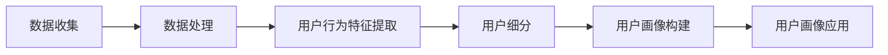

                 

# 《精准营销：提升广告投放效果，提升电商平台供给能力》

## 关键词：精准营销、广告投放、电商平台、供给能力、数据分析、用户画像

## 摘要：
精准营销作为现代市场营销的重要手段，已经成为企业提升广告投放效果和电商平台供给能力的核心竞争力。本文从精准营销的基础概念入手，详细探讨了数据驱动的精准营销策略、广告投放效果的提升方法以及电商平台供给能力的优化路径。通过深入分析核心算法、实际案例以及数学模型，为读者提供了一套完整的精准营销实操指南。

## 《精准营销：提升广告投放效果，提升电商平台供给能力》目录大纲

### 第一部分：精准营销基础

#### 第1章：精准营销概述
- 1.1 精准营销的概念与重要性
- 1.2 精准营销与传统营销的比较
- 1.3 精准营销的架构与组成部分

#### 第2章：数据驱动的精准营销
- 2.1 数据收集与处理
- 2.2 数据分析工具与技术
- 2.3 数据驱动的用户画像构建

#### 第3章：广告投放策略
- 3.1 广告投放的目标与类型
- 3.2 广告投放的优化方法
- 3.3 广告投放案例分析

### 第二部分：提升广告投放效果

#### 第4章：广告素材优化
- 4.1 广告素材的设计原则
- 4.2 广告素材的测试与优化
- 4.3 广告素材优化的实战技巧

#### 第5章：广告定位与目标受众
- 5.1 广告定位的理论与实践
- 5.2 目标受众分析
- 5.3 广告受众细分策略

#### 第6章：广告渠道选择与整合
- 6.1 主要广告渠道概述
- 6.2 广告渠道选择策略
- 6.3 广告渠道整合与优化

#### 第7章：广告效果评估与优化
- 7.1 广告效果评估指标
- 7.2 广告效果分析工具
- 7.3 广告效果优化策略

### 第三部分：提升电商平台供给能力

#### 第8章：电商平台供给能力概述
- 8.1 电商平台供给能力的概念与重要性
- 8.2 电商平台供给能力的评估方法
- 8.3 电商平台供给能力的提升策略

#### 第9章：供应链管理与精准营销
- 9.1 供应链管理的基本原理
- 9.2 供应链管理与精准营销的结合点
- 9.3 供应链管理与精准营销的案例研究

#### 第10章：电商平台用户需求分析
- 10.1 用户需求分析的理论基础
- 10.2 用户行为分析
- 10.3 用户需求分析与精准营销的结合

#### 第11章：电商平台营销策略优化
- 11.1 营销策略优化的原则与方法
- 11.2 营销策略优化的实战案例
- 11.3 营销策略优化的持续改进

### 附录

#### 附录A：精准营销工具与资源
- A.1 数据分析与营销工具
- A.2 广告投放与管理平台
- A.3 电商平台运营工具

#### 附录B：案例分析
- B.1 成功的精准营销案例分析
- B.2 精准营销失败的案例分析
- B.3 精准营销案例总结与启示

### 第一部分：精准营销基础

#### 第1章：精准营销概述

1.1 精准营销的概念与重要性

精准营销（Precision Marketing）是指通过数据分析和个性化策略，精确识别和定位目标受众，实现营销信息的精准投放。它不同于传统的广撒网式的营销方式，而是更加注重于对用户的深入理解和精准触达。

在数字化时代，消费者行为和需求日益多样化，市场环境瞬息万变。传统的营销手段越来越难以满足企业的需求，而精准营销则以其独特优势成为企业争夺市场份额的重要手段。

精准营销的重要性主要体现在以下几个方面：

1. 提高营销效率：通过数据分析和用户画像，企业可以更加精准地定位潜在客户，从而提高营销活动的效率和转化率。
2. 降低营销成本：精准营销减少了不必要的广告投放，将有限的资源集中到最有价值的客户群体上，从而降低营销成本。
3. 提升客户满意度：精准营销能够更好地满足消费者的个性化需求，提升客户满意度和忠诚度。
4. 增强品牌竞争力：精准营销帮助企业建立与消费者的深度连接，提高品牌知名度和美誉度，增强品牌竞争力。

1.2 精准营销与传统营销的比较

传统营销通常采用广撒网的方式，通过广告、促销等手段向大量潜在客户传播信息。这种方式往往难以精准地触达目标客户，容易造成资源浪费。而精准营销则通过以下方式与传统营销形成对比：

1. 数据驱动力：精准营销依赖于数据分析和用户画像，通过数据来指导营销策略的制定和执行，而传统营销则更多依赖于经验和直觉。
2. 个性化策略：精准营销注重个性化，针对不同的用户群体制定不同的营销策略，而传统营销往往采取一刀切的方式。
3. 营销效果可衡量：精准营销可以通过各种数据指标来衡量营销效果，如点击率、转化率、ROI等，而传统营销的衡量手段相对有限。
4. 营销成本控制：精准营销通过精准定位和有效投放，可以更好地控制营销成本，而传统营销则容易导致过度投放和资源浪费。

1.3 精准营销的架构与组成部分

精准营销的架构主要包括以下几个关键组成部分：

1. 数据收集与处理：通过多种渠道收集用户数据，包括用户行为数据、交易数据等，并对数据进行清洗、整合和分析。
2. 用户画像构建：基于数据分析和用户行为特征，构建用户画像，实现对用户的精确识别和细分。
3. 营销策略制定：根据用户画像和市场需求，制定个性化的营销策略，包括广告投放、促销活动、内容营销等。
4. 营销执行与监控：通过执行精准营销策略，对营销效果进行实时监控和反馈，不断优化营销策略。
5. 营销效果评估：通过分析营销效果数据，评估精准营销的效果，为后续的营销策略提供数据支持。

以上是精准营销的基础概述，接下来将深入探讨数据驱动的精准营销策略、广告投放策略以及电商平台供给能力的提升方法。

#### 第2章：数据驱动的精准营销

2.1 数据收集与处理

数据收集是精准营销的基础环节，涉及到从多种渠道收集用户数据。这些数据来源可以分为两大类：内部数据和外部数据。

1. 内部数据：包括用户在平台上的行为数据、交易数据、访问日志等。这些数据能够提供关于用户行为的详细信息，有助于构建用户画像和进行个性化推荐。

2. 外部数据：包括社交媒体数据、第三方数据平台的数据、地理位置数据等。这些数据可以提供关于用户的社会属性、兴趣偏好等方面的信息，有助于更全面地了解用户。

在收集数据后，需要进行数据处理，以确保数据的质量和可用性。数据处理主要包括以下几个步骤：

1. 数据清洗：去除重复数据、无效数据、错误数据，确保数据的准确性和一致性。

2. 数据整合：将不同来源的数据进行整合，建立统一的数据仓库，以便进行后续的分析。

3. 数据标准化：将不同格式和单位的数据进行统一，确保数据的一致性和可比性。

2.2 数据分析工具与技术

数据分析是精准营销的核心环节，通过数据分析可以挖掘用户行为特征，构建用户画像，为营销策略提供数据支持。以下是一些常用的数据分析工具和技术：

1. 数据挖掘：通过数据挖掘算法，从大量数据中提取有价值的信息和模式。常用的算法包括分类、聚类、关联规则挖掘等。

2. 机器学习：利用机器学习算法，建立用户行为预测模型和用户画像模型。常用的算法包括决策树、随机森林、神经网络等。

3. 用户画像构建：基于用户行为数据和人口统计信息，构建用户的综合画像。用户画像可以帮助企业更好地了解用户，进行个性化推荐和营销。

4. 预测分析：利用历史数据，预测用户未来的行为和需求。预测分析可以帮助企业提前布局，提高营销效果。

2.3 数据驱动的用户画像构建

用户画像构建是精准营销的关键环节，通过构建用户画像，企业可以更精确地定位用户，进行个性化的营销。以下是用户画像构建的一般流程：

1. 数据收集：收集用户的多种数据，包括行为数据、交易数据、人口统计信息等。

2. 数据处理：对收集到的数据进行清洗、整合和标准化，确保数据质量。

3. 用户行为特征提取：通过数据挖掘和机器学习算法，提取用户的多种行为特征，如浏览行为、购买行为、评论行为等。

4. 用户细分：根据用户行为特征，将用户划分为不同的细分群体，如高价值用户、潜在用户、流失用户等。

5. 用户画像构建：基于用户行为特征和细分结果，构建用户的综合画像，包括用户的人口属性、兴趣偏好、行为特征等。

6. 用户画像应用：将用户画像应用于营销策略的制定和执行，如个性化推荐、精准广告投放、定制化促销等。

通过以上步骤，企业可以构建出详细的用户画像，实现对用户的精准定位和个性化营销。以下是用户画像构建的一个简单的 Mermaid 流程图：

2.4 数据驱动的精准营销策略

数据驱动的精准营销策略是指通过数据分析和用户画像，制定个性化的营销策略，以提高营销效果。以下是几种常用的数据驱动的精准营销策略：

1. 个性化推荐：基于用户画像和用户行为数据，向用户推荐个性化的产品和服务。个性化推荐可以显著提高用户的满意度和转化率。

2. 精准广告投放：通过分析用户画像和广告效果数据，选择最适合的投放渠道和广告素材，实现精准的广告投放。精准广告投放可以提高广告的点击率和转化率。

3. 定制化促销：根据用户画像和购买行为，为不同的用户群体提供定制化的促销活动，如优惠券、会员专享活动等。定制化促销可以提高用户的参与度和忠诚度。

4. 客户细分与分层营销：根据用户画像和购买行为，将用户划分为不同的细分群体，针对不同的用户群体制定差异化的营销策略。客户细分与分层营销可以提高营销的针对性和效果。

通过以上数据驱动的精准营销策略，企业可以更好地满足用户的需求，提高营销效果，从而在竞争激烈的市场中脱颖而出。接下来，我们将探讨广告投放策略的具体实施方法。

#### 第3章：广告投放策略

3.1 广告投放的目标与类型

广告投放是精准营销的重要组成部分，其目标主要包括提高品牌知名度、增加产品销量、提升网站流量等。为了实现这些目标，企业需要根据市场环境和目标受众的特点，选择合适的广告投放类型。

常见的广告投放类型有以下几种：

1. 搜索引擎广告：在搜索引擎平台上，通过关键词竞价的方式，将广告展示在搜索结果页面的显眼位置。这种广告类型适用于有明确目标用户的场景，如电子商务、在线教育等。

2. 社交媒体广告：在社交媒体平台上，通过定向投放的方式，将广告展示给符合特定条件的用户。这种广告类型适用于品牌推广和用户互动，如社交媒体广告、朋友圈广告等。

3. 信息流广告：在信息流应用中，将广告内容嵌入到用户浏览的信息流中。这种广告类型适用于品牌曝光和产品推广，如新闻客户端、视频平台等。

4. 弹出广告：在网站、应用等页面中，通过弹出窗口展示广告。这种广告类型适用于紧急推广和用户引导，如紧急促销、新品发布等。

3.2 广告投放的优化方法

广告投放效果受到多种因素的影响，如广告素材、投放渠道、投放时间等。为了提高广告投放效果，企业需要采取以下优化方法：

1. 广告素材优化：广告素材是广告投放的核心，优化广告素材可以提高广告的吸引力和点击率。广告素材优化主要包括以下方面：

   - 设计原则：广告素材应简洁明了，突出重点，使用高质量图片和动画效果。
   - 文案撰写：广告文案应简洁有力，突出产品的卖点和用户的价值。
   - 调研分析：通过对目标受众的研究，了解他们的需求和兴趣，制定有针对性的广告素材。

2. 投放渠道优化：选择合适的投放渠道可以提高广告的曝光率和点击率。投放渠道优化主要包括以下方面：

   - 目标受众定位：根据目标受众的特点，选择适合的投放渠道，如搜索引擎、社交媒体、信息流等。
   - 投放平台比较：对不同投放平台的效果进行比较和分析，选择最优的投放平台。
   - 跨渠道投放：结合多种渠道进行投放，提高广告的覆盖率和影响力。

3. 投放时间优化：选择合适的时间投放广告可以提高广告的效果。投放时间优化主要包括以下方面：

   - 目标受众活跃时间：根据目标受众的作息时间和在线行为，选择他们最活跃的时间段投放广告。
   - 节假日和特殊事件：在节假日和特殊事件期间，如春节、双11等，增加广告投放，抓住商机。
   - 实时调整：根据广告效果数据，实时调整投放时间，优化广告投放效果。

3.3 广告投放案例分析

以下是一个成功的广告投放案例分析：

某电商企业在双11期间，通过搜索引擎广告和信息流广告进行广告投放，以提升品牌知名度和增加销售量。广告素材设计简洁明了，突出产品的优惠信息和购买理由。投放渠道选择精准，覆盖了搜索引擎平台和多个信息流应用。投放时间集中在双11当天的早晨和晚上，这两个时间段用户活跃度较高。

广告投放效果评估指标包括点击率（CTR）、转化率（CVR）、销售额（Sales）等。通过对广告效果的数据分析，发现广告的点击率达到了4%，转化率达到了2%，销售额同比增长了30%。

通过分析广告投放数据，企业发现以下优化点：

- 广告素材需要进一步优化，提高点击率和转化率。
- 信息流广告的投放平台选择需要进一步细分，提高广告的精准度。
- 投放时间可以进一步优化，如增加双11前后的广告投放，提前抓住用户的购物需求。

通过持续优化广告投放策略，企业可以不断提升广告投放效果，实现营销目标。

综上所述，广告投放策略是企业实现精准营销的重要手段。通过明确广告投放的目标、选择合适的投放类型、优化广告素材、投放渠道和投放时间，企业可以提升广告投放效果，实现营销目标。接下来，我们将探讨广告素材优化的具体方法。

#### 第4章：广告素材优化

4.1 广告素材的设计原则

广告素材的设计原则对于提升广告的吸引力和效果至关重要。以下是一些关键的设计原则：

1. 简洁明了：广告素材应避免复杂的设计和冗长的文案，突出核心信息和卖点，让用户一眼就能抓住重点。

2. 直观易懂：使用清晰、直观的图像和动画效果，避免使用专业术语和难以理解的概念，确保用户能够快速理解广告内容。

3. 创意新颖：创新的设计和创意能够吸引用户的注意力，增加广告的传播效果。通过独特的设计和创意，让广告在众多信息中脱颖而出。

4. 对比鲜明：使用对比强烈的色彩和图像，突出产品的优势和特点，让用户能够直观感受到产品的优势。

5. 调动情感：通过情感化的设计，如温馨、幽默、激励等，引发用户的情感共鸣，增加广告的传播效果。

4.2 广告素材的测试与优化

广告素材的测试与优化是确保广告效果的重要环节。以下是一些关键的测试和优化方法：

1. A/B测试：通过对比不同广告素材的效果，选择最佳的设计方案。例如，对比不同颜色、文案、图像等元素，选择点击率和转化率最高的广告素材。

2. 用户反馈：收集用户对广告素材的反馈，了解用户对广告的喜好和意见。通过用户反馈，发现设计中的问题，进行相应的优化。

3. 数据分析：利用数据分析工具，分析广告素材的效果数据，如点击率、转化率、跳出率等。通过数据分析，发现广告素材的优化方向。

4. 持续优化：根据测试和反馈结果，不断优化广告素材。优化过程是一个持续迭代的过程，通过不断测试和优化，提升广告的效果。

4.3 广告素材优化的实战技巧

以下是一些广告素材优化的实战技巧：

1. 选择合适的图片：图片是广告素材的重要组成部分，选择高质量的图片能够提升广告的吸引力。选择与广告主题相关、色彩鲜艳、具有视觉冲击力的图片。

2. 文案撰写：文案是广告的核心，简洁有力的文案能够迅速传达广告信息。避免使用复杂、冗长的文案，突出产品的卖点和用户的价值。

3. 创意设计：创意设计能够提升广告的传播效果。通过独特的设计理念和创意，让广告在众多信息中脱颖而出。

4. 调动用户情感：通过情感化的设计，引发用户的情感共鸣，增加广告的传播效果。例如，使用温馨、幽默、激励等元素，让用户产生共鸣。

5. 适应不同平台：根据不同的投放平台，调整广告素材的设计。例如，在社交媒体平台上，广告素材应更简洁、更易于分享；在搜索引擎广告中，广告素材应更突出关键词。

通过以上实战技巧，企业可以优化广告素材，提升广告的吸引力和效果。接下来，我们将探讨广告定位与目标受众的相关内容。

#### 第5章：广告定位与目标受众

5.1 广告定位的理论与实践

广告定位是精准营销的重要环节，它涉及到如何选择目标受众、确定广告的核心信息和设计策略。以下是广告定位的理论与实践要点：

1. 目标受众选择：确定广告的目标受众是广告定位的首要任务。企业需要根据产品特点和市场需求，选择最有可能对产品产生兴趣和购买行为的用户群体。例如，针对年轻消费者的电子产品，可以选取年龄在18-35岁的都市人群。

2. 用户需求分析：了解目标受众的需求和痛点，是制定广告定位的关键。通过市场调研、用户调研等方法，收集目标受众的相关信息，分析他们的需求和行为模式。

3. 竞争对手分析：研究竞争对手的广告策略和定位，可以发现市场机会和差异化定位点。例如，如果竞争对手的广告集中于产品功能，企业可以专注于用户体验和情感诉求。

4. 定位策略制定：基于用户需求和竞争对手分析，制定独特的广告定位策略。定位策略应明确传达广告的核心价值和差异化特点，使目标受众能够快速理解和认同。

5. 实践应用：在实际操作中，企业可以通过以下方法实施广告定位：

   - 定位测试：通过A/B测试等方法，验证广告定位的有效性，并根据反馈进行调整。
   - 定位传播：利用多种渠道和传播手段，强化广告定位的信息传递，提高目标受众的认知度。

5.2 目标受众分析

目标受众分析是广告定位的基础，通过详细分析目标受众的特点和行为，可以更好地制定广告策略。以下是目标受众分析的关键步骤：

1. 用户画像构建：通过收集和分析用户数据，构建详细的用户画像。用户画像包括用户的基本信息（如年龄、性别、地域等）、行为特征（如浏览习惯、购买行为等）和兴趣偏好（如兴趣爱好、关注领域等）。

2. 用户行为分析：通过分析用户的行为数据，了解用户的行为模式和习惯。例如，用户在购物决策过程中，通常需要多次浏览和比较产品，才能做出购买决策。

3. 用户需求分析：通过用户调研和市场分析，了解目标受众的需求和痛点。例如，对于某个电商平台的用户，他们可能需要更便捷的购物体验、更丰富的产品选择和更具竞争力的价格。

4. 用户细分：根据用户的不同特征和需求，将用户划分为不同的细分群体。例如，可以根据年龄、性别、购买行为等特征，将用户分为年轻用户、女性用户、高价值用户等。

5. 用户画像应用：将用户画像应用于广告定位和营销策略的制定。例如，根据年轻用户的特点和需求，制定更具创意和互动性的广告策略；根据女性用户的需求，突出产品的实用性和情感价值。

5.3 广告受众细分策略

广告受众细分策略是提高广告投放效果的重要手段，通过将广告受众进行细分，可以更精准地定位目标用户，提高广告的点击率和转化率。以下是广告受众细分策略的关键步骤：

1. 用户分层：根据用户的不同特征和需求，将用户划分为不同的层次。例如，可以将用户分为潜在客户、活跃用户、高价值用户等。

2. 用户标签化：为每个用户赋予多个标签，以描述其特征和行为。例如，一个年轻用户可以拥有“18-25岁”、“男性”、“游戏爱好者”等多个标签。

3. 投放策略定制：根据用户的标签和层次，制定不同的广告投放策略。例如，对于潜在客户，可以采取更具吸引力的优惠活动；对于高价值用户，可以提供定制化的服务和优惠。

4. 实时调整：根据广告投放的效果数据，实时调整广告受众细分策略。例如，如果某个细分群体的广告效果较差，可以尝试调整广告素材或投放渠道。

5. 持续优化：通过不断测试和优化，提升广告受众细分策略的效果。例如，可以采用机器学习算法，根据用户行为数据，动态调整广告的投放策略。

通过以上广告受众细分策略，企业可以更精准地定位目标用户，提高广告的投放效果。接下来，我们将探讨广告渠道选择与整合策略。

#### 第6章：广告渠道选择与整合

6.1 主要广告渠道概述

广告渠道是广告投放的重要环节，选择合适的广告渠道可以提高广告的曝光率和效果。以下是几种常见的广告渠道及其特点：

1. 搜索引擎广告：在搜索引擎平台上，通过关键词竞价的方式，将广告展示在搜索结果页面的显眼位置。搜索引擎广告具有目标精准、投放灵活等特点，适用于有明确目标用户的场景，如电子商务、在线教育等。

2. 社交媒体广告：在社交媒体平台上，通过定向投放的方式，将广告展示给符合特定条件的用户。社交媒体广告具有互动性强、覆盖面广等特点，适用于品牌推广和用户互动，如社交媒体广告、朋友圈广告等。

3. 信息流广告：在信息流应用中，将广告内容嵌入到用户浏览的信息流中。信息流广告具有无缝融入用户日常浏览习惯、曝光率高、互动性强等特点，适用于品牌曝光和产品推广，如新闻客户端、视频平台等。

4. 弹出广告：在网站、应用等页面中，通过弹出窗口展示广告。弹出广告具有强制展示、覆盖面广等特点，适用于紧急推广和用户引导，如紧急促销、新品发布等。

6.2 广告渠道选择策略

选择合适的广告渠道对于提高广告效果至关重要。以下是广告渠道选择策略的关键步骤：

1. 目标受众定位：根据广告目标受众的特点，选择适合的投放渠道。例如，如果目标受众主要是年轻人，可以选择社交媒体广告和短视频广告；如果目标受众对价格敏感，可以选择搜索引擎广告。

2. 渠道效果评估：对不同广告渠道的效果进行评估，选择效果最好的渠道进行重点投放。例如，通过监测点击率、转化率等指标，评估不同渠道的效果。

3. 跨渠道整合：结合多种渠道进行广告投放，提高广告的覆盖率和影响力。例如，在搜索引擎广告、社交媒体广告和信息流广告之间进行整合，实现广告的全方位覆盖。

4. 投放预算分配：根据广告预算和渠道效果，合理分配广告投放预算。例如，将大部分预算投入到效果最好的渠道上，同时保持其他渠道的持续投放。

5. 投放策略调整：根据广告效果数据，实时调整广告渠道的投放策略。例如，如果某个渠道的广告效果不佳，可以尝试更换渠道或调整广告素材。

6.3 广告渠道整合与优化

广告渠道整合与优化是提高广告投放效果的重要手段。以下是广告渠道整合与优化策略的关键步骤：

1. 数据整合：将不同渠道的广告效果数据进行整合，建立统一的数据分析体系。例如，通过数据接口或数据仓库，将不同渠道的数据进行整合和分析。

2. 效果分析：通过数据分析，了解不同渠道的广告效果，找出优势和不足。例如，分析点击率、转化率、ROI等指标，评估不同渠道的效果。

3. 整合策略制定：根据数据分析结果，制定广告渠道整合策略。例如，将效果最好的渠道作为主要投放渠道，将其他渠道作为辅助渠道，实现广告的协同效应。

4. 跨渠道联动：通过跨渠道联动，提高广告的传播效果。例如，在搜索引擎广告中嵌入社交媒体链接，鼓励用户分享到社交媒体，扩大广告的影响力。

5. 持续优化：根据广告效果数据，持续优化广告渠道的整合策略。例如，通过不断测试和优化，调整广告素材、投放时间和投放渠道，提升广告效果。

通过以上广告渠道选择与整合策略，企业可以更精准地定位目标受众，提高广告的投放效果。接下来，我们将探讨广告效果评估与优化的方法。

#### 第7章：广告效果评估与优化

7.1 广告效果评估指标

广告效果评估是确保广告投放效果的重要环节。以下是一些关键的广告效果评估指标：

1. 点击率（Click-Through Rate，CTR）：点击率是衡量广告吸引力和点击效果的重要指标，计算公式为点击次数除以展示次数。高点击率通常表明广告内容吸引人，但仅点击率并不能直接反映广告的投资回报率。

2. 转化率（Conversion Rate，CVR）：转化率是衡量广告引导用户完成目标行为的比率，如注册、购买、加入购物车等。转化率是评估广告效果的关键指标，反映了广告的有效性和吸引力。

3. 回收成本（Cost Per Acquisition，CPA）：回收成本是衡量每获得一个有效转化所需的广告投入。通过比较CPA和广告收益，可以评估广告的投资回报率（Return on Ad Spend，ROAS）。

4. 品牌提升（Brand Lift）：品牌提升指标衡量广告对品牌知名度、品牌形象和用户态度的影响。常见的评估方法包括品牌认知度调查、品牌好感度调查等。

7.2 广告效果分析工具

为了准确评估广告效果，企业可以使用以下广告效果分析工具：

1. Google Analytics：Google Analytics 是一款强大的数据分析工具，可以追踪用户行为、广告效果等数据，提供详细的报告和分析。

2. Facebook Insights：Facebook Insights 是Facebook官方提供的数据分析工具，可以帮助企业分析广告的展示、点击、转化等数据，优化广告策略。

3. AdWords：AdWords 是Google的广告管理平台，提供了详细的广告效果分析功能，包括点击率、转化率、回收成本等指标。

4. Tableau：Tableau 是一款数据可视化工具，可以将广告效果数据以图表、仪表板等形式呈现，帮助用户更直观地理解数据。

7.3 广告效果优化策略

为了提升广告效果，企业可以采取以下优化策略：

1. 数据驱动决策：根据广告效果数据，调整广告策略。例如，如果某个广告的点击率较高，可以增加投放预算；如果转化率较低，可以优化广告素材或调整目标受众。

2. 实时监控与调整：通过实时监控广告效果，及时调整广告投放策略。例如，如果发现某个时段的广告效果较差，可以调整投放时间或暂停投放。

3. A/B测试：通过A/B测试，比较不同广告素材、目标受众、投放时间等策略的效果，选择最佳方案。例如，比较不同文案、图片、目标受众等，找出最优组合。

4. 预算优化：根据广告效果数据，合理分配广告预算。例如，将预算优先投入到效果最好的广告渠道，同时保持其他渠道的持续投放。

5. 技术优化：利用先进的技术手段，提升广告效果。例如，采用机器学习算法进行用户画像分析和广告优化，提高广告的精准度和效果。

6. 持续改进：通过持续的数据分析和效果评估，不断优化广告策略。例如，定期回顾广告效果，调整广告素材、目标受众和投放策略，实现广告效果的持续提升。

通过以上广告效果评估与优化策略，企业可以不断提高广告投放效果，实现营销目标。接下来，我们将探讨电商平台供给能力概述，以及如何提升电商平台供给能力。

#### 第8章：电商平台供给能力概述

8.1 电商平台供给能力的概念与重要性

电商平台供给能力是指电商平台在商品、服务、技术等方面满足用户需求的能力。它不仅包括商品的选择和库存管理，还涉及物流配送、售后服务等多个环节。电商平台供给能力的重要性体现在以下几个方面：

1. 提升用户体验：良好的供给能力能够确保用户在电商平台上的购物体验，包括商品的丰富度、物流速度、售后服务等。用户体验的优化是电商平台竞争力的关键。

2. 提高运营效率：高效的供给能力可以帮助电商平台降低运营成本，提高物流和库存管理的效率。通过技术手段和供应链优化，电商平台可以实现资源的最优配置。

3. 增强用户忠诚度：稳定的供给能力可以提升用户的满意度和忠诚度，降低用户流失率。优质的购物体验和良好的售后服务是留住用户的重要因素。

4. 增强市场竞争力：在竞争激烈的市场环境中，具备强大供给能力的电商平台能够更好地满足用户需求，赢得市场份额。供给能力的提升是电商平台在市场中立足的关键。

8.2 电商平台供给能力的评估方法

评估电商平台供给能力的方法主要包括以下几种：

1. 用户满意度调查：通过问卷调查、在线评论等方式收集用户对电商平台供给能力的反馈，评估用户对商品质量、物流速度、售后服务等方面的满意度。

2. 数据分析：利用电商平台的数据分析工具，分析用户的购买行为、物流数据、售后服务数据等，评估供给能力的具体表现。例如，通过分析库存周转率、物流时效性、售后服务响应时间等指标，评估供给能力的效率。

3. 成本效益分析：通过对比不同电商平台的运营成本和收益，评估供给能力的经济效益。成本效益分析可以帮助企业了解供给能力对盈利能力的影响。

4. 同业比较：通过对比同行业内其他电商平台的供给能力，评估本平台的竞争力。同业比较可以为企业提供改进的方向和目标。

8.3 电商平台供给能力的提升策略

为了提升电商平台供给能力，企业可以采取以下策略：

1. 优化供应链管理：通过供应链管理优化，提高商品采购、库存管理和物流配送的效率。例如，采用先进的库存管理系统，实时监控库存状态，确保商品供应的及时性和稳定性。

2. 提升物流配送能力：通过建立高效的物流配送网络，提高配送速度和服务质量。例如，与第三方物流公司合作，利用先进的物流技术，如无人机配送、智能仓储等，提升物流效率。

3. 加强售后服务：提供优质的售后服务，增强用户的满意度和忠诚度。例如，建立完善的售后服务体系，提供多种售后服务渠道，如在线客服、电话客服等，及时解决用户问题。

4. 技术创新与应用：利用先进的技术手段，提升供给能力的智能化水平。例如，采用大数据分析技术，优化商品推荐和库存管理；利用人工智能技术，提升客服效率和用户体验。

5. 与供应商合作：与优质供应商建立长期合作关系，确保商品质量和供应链稳定性。通过与供应商共享数据，优化采购和库存管理，提高供给能力。

6. 定期评估与优化：定期对供给能力进行评估和优化，根据用户反馈和数据分析结果，调整供给策略。例如，通过用户满意度调查，了解用户对商品、物流、售后服务等方面的需求，及时进行改进。

通过以上提升策略，电商平台可以不断提高供给能力，满足用户需求，提升市场竞争力。接下来，我们将探讨供应链管理与精准营销的结合，以及如何在电商平台中实现这种结合。

#### 第9章：供应链管理与精准营销

9.1 供应链管理的基本原理

供应链管理（Supply Chain Management，SCM）是指通过协调供应链中的各个环节，实现从原材料采购到产品交付的全过程管理。供应链管理的基本原理包括：

1. 供应链网络设计：根据市场需求和供应链成本，设计合理的供应链网络，包括供应商、制造商、分销商、零售商等。

2. 库存管理：通过库存管理，确保供应链中各个环节的库存水平合理，避免库存过剩或缺货现象。

3. 物流管理：通过物流管理，优化运输和配送过程，提高物流效率，降低物流成本。

4. 采购管理：通过采购管理，确保原材料和零部件的采购成本和质量，优化采购策略。

5. 协同管理：通过协同管理，实现供应链中各个环节的信息共享和协同工作，提高供应链的整体效率。

9.2 供应链管理与精准营销的结合点

供应链管理与精准营销的结合点主要体现在以下几个方面：

1. 数据共享：通过供应链管理系统的数据共享功能，将用户需求、库存状况、物流信息等数据传递给营销部门，为精准营销提供数据支持。

2. 用户画像：基于供应链管理中的用户数据，构建详细的用户画像，为精准营销提供用户洞察，制定个性化的营销策略。

3. 库存优化：通过供应链管理中的库存管理模块，实时监控库存水平，优化库存策略，减少库存积压，提高库存周转率，为精准营销提供充足的商品支持。

4. 物流优化：利用供应链管理中的物流管理功能，优化物流配送路线和时间，提高物流效率，提升用户购物体验，增强用户满意度。

5. 促销协同：通过供应链管理与营销部门的协同工作，制定更加精准的促销策略，提高促销活动的效果。

9.3 供应链管理与精准营销的案例研究

以下是一个供应链管理与精准营销结合的案例研究：

某电商企业通过供应链管理与精准营销的结合，实现了显著的营销效果。具体做法如下：

1. 数据共享：企业通过供应链管理系统，将用户购买行为、库存状态、物流信息等数据实时共享给营销部门，为精准营销提供数据支持。

2. 用户画像：营销部门基于用户数据，构建了详细的用户画像，包括用户的购物习惯、消费偏好、地域分布等信息。这些用户画像帮助营销部门更好地了解用户需求，制定个性化的营销策略。

3. 库存优化：供应链管理部门通过实时监控库存水平，根据用户需求调整库存策略。例如，在夏季推出空调促销时，提前增加库存，确保促销活动的顺利开展。

4. 物流优化：物流部门利用供应链管理系统，优化物流配送路线和时间，提高物流效率。例如，通过大数据分析，预测某地区的购买高峰期，提前安排物流资源，确保商品及时配送。

5. 促销协同：营销部门与供应链管理部门协同工作，制定精准的促销策略。例如，在双11促销期间，针对高价值用户推出专属优惠，提高促销活动的转化率。

通过供应链管理与精准营销的结合，该电商企业实现了以下效果：

- 用户满意度显著提升：通过个性化的营销策略和高效的物流配送，用户满意度显著提高。
- 营销效果显著提升：精准的库存管理和物流优化，确保了促销活动的顺利进行，营销效果显著提升。
- 成本降低：通过优化库存和物流，降低了运营成本，提高了企业的盈利能力。

通过以上案例研究，可以看出供应链管理与精准营销的结合对电商平台的发展具有重要作用。接下来，我们将探讨电商平台用户需求分析的重要性和方法。

#### 第10章：电商平台用户需求分析

10.1 用户需求分析的理论基础

用户需求分析是电商平台精准营销的重要组成部分，其理论基础主要包括以下几个方面：

1. 需求理论：需求理论是经济学中的一个基本概念，指的是消费者愿意购买并且有能力购买的商品或服务的数量。在电商平台上，用户需求分析主要关注用户对商品或服务的兴趣、购买意愿和行为。

2. 用户体验：用户体验（User Experience，UX）是用户在使用电商平台过程中感受到的整体体验，包括用户界面设计、功能易用性、响应速度、内容丰富性等。良好的用户体验能够提升用户满意度，促进用户留存和转化。

3. 数据分析：数据分析是用户需求分析的核心工具，通过收集和分析用户行为数据，可以挖掘用户的兴趣偏好、购买行为和需求变化。数据分析包括数据收集、数据清洗、数据挖掘和数据分析等多个环节。

4. 行为理论：行为理论关注用户在实际购物过程中的行为模式，包括浏览、搜索、购买、评论等。通过对用户行为的分析，可以了解用户的需求特征和购买动机，为精准营销提供依据。

10.2 用户行为分析

用户行为分析是用户需求分析的重要环节，通过分析用户在电商平台上的行为，可以深入了解用户的需求和偏好。以下是用户行为分析的关键步骤：

1. 数据收集：收集用户在电商平台上的行为数据，包括浏览记录、搜索关键词、购买行为、评论等。这些数据可以通过电商平台的后台系统、日志文件、第三方数据分析工具等获取。

2. 数据处理：对收集到的行为数据进行处理，包括数据清洗、数据整合和数据标准化。数据清洗旨在去除重复数据、无效数据和错误数据，确保数据的质量和一致性。

3. 数据挖掘：利用数据挖掘算法，从行为数据中提取有价值的信息和模式。例如，通过聚类分析，可以将用户划分为不同的细分群体；通过关联规则挖掘，可以了解用户之间的行为关联。

4. 用户画像构建：基于用户行为数据，构建用户的综合画像。用户画像包括用户的基本信息、兴趣偏好、购买行为、行为特征等。用户画像有助于更精确地了解用户需求，为精准营销提供支持。

5. 行为分析：对用户行为进行分析，了解用户的需求特征和购买动机。例如，通过分析用户的浏览和搜索行为，可以了解用户对商品的兴趣和偏好；通过分析用户的购买行为，可以了解用户的消费习惯和购买周期。

10.3 用户需求分析与精准营销的结合

用户需求分析与精准营销的结合是电商平台提升营销效果的关键。以下是一些结合方法：

1. 个性化推荐：基于用户画像和行为分析，为用户推荐个性化的商品和服务。个性化推荐可以通过算法模型实现，例如基于内容的推荐、基于用户的协同过滤推荐等。

2. 个性化广告：根据用户的需求特征和购买行为，为用户展示个性化的广告。个性化广告可以提高广告的点击率和转化率，实现更高的营销效果。

3. 个性化促销：根据用户的需求和购买历史，为用户制定个性化的促销策略。例如，为高价值用户推出专属优惠，为潜在用户推送限时折扣，提高用户的购买意愿。

4. 个性化内容：根据用户的需求和兴趣，为用户推送个性化的内容和信息。例如，为用户推荐相关的文章、视频、直播等，增强用户在平台上的粘性。

5. 个性化服务：根据用户的需求和行为，为用户提供个性化的服务和体验。例如，提供定制化的购物方案、1对1的客服服务、智能客服等，提升用户的满意度。

通过用户需求分析与精准营销的结合，电商平台可以更好地满足用户需求，提升用户体验和转化率，实现营销目标。接下来，我们将探讨电商平台营销策略优化的重要性和方法。

#### 第11章：电商平台营销策略优化

11.1 营销策略优化的原则与方法

电商平台营销策略优化是一个持续迭代的过程，其核心目标是提高用户转化率和提升品牌价值。以下是一些关键原则和方法：

1. 数据驱动力：以数据为依据，制定和调整营销策略。通过对用户行为、市场趋势、竞争对手等多方面数据的分析，发现优化机会。

2. 用户导向：以用户需求为中心，制定个性化营销策略。通过用户画像和行为分析，了解用户喜好，提供个性化体验。

3. 创新性：不断尝试新的营销手段和策略，以适应市场变化和用户需求。创新不仅体现在内容上，还体现在技术手段的应用上。

4. 可持续改进：通过A/B测试、多变量测试等方法，持续优化营销策略。优化不是一次性的，而是一个动态调整的过程。

5. ROI导向：关注营销活动的投资回报率（ROI），确保每一笔营销投入都能产生有效的回报。

11.2 营销策略优化的实战案例

以下是一个电商平台营销策略优化的实战案例：

某电商平台在双十一期间，通过一系列优化策略，显著提升了营销效果。以下是具体做法：

1. 用户细分：通过用户数据分析，将用户划分为高价值用户、潜在用户和流失用户等不同群体。为每个群体制定个性化的营销策略。

2. 个性化推荐：基于用户行为数据，为用户推荐个性化的商品。例如，为高价值用户推送其过去常买的商品，为潜在用户推荐相似商品。

3. 广告优化：通过A/B测试，优化广告素材和投放策略。例如，测试不同文案、图片和目标受众的组合，选择效果最佳的广告方案。

4. 活动策划：推出一系列个性化促销活动，如专属优惠券、限时折扣等。针对不同用户群体，提供定制化的促销活动，提高参与度。

5. 营销自动化：利用营销自动化工具，实现营销流程的自动化。例如，通过邮件营销自动化，定期向用户发送推荐商品和促销信息。

6. 数据监控与调整：实时监控营销活动的效果，根据数据反馈进行及时调整。例如，如果某个促销活动的转化率较低，可以调整优惠券金额或推广渠道。

通过以上优化策略，该电商平台在双十一期间实现了以下效果：

- 用户转化率提升了20%
- 销售额同比增长了30%
- 用户满意度显著提升
- 品牌知名度得到有效提升

11.3 营销策略优化的持续改进

营销策略优化是一个持续的过程，需要不断进行调整和优化。以下是一些持续改进的方法：

1. 数据驱动：定期分析营销数据，发现新的优化机会。通过长期的数据积累和分析，形成对用户行为和市场趋势的深刻理解。

2. 客户反馈：收集用户对营销活动的反馈，了解用户的真实需求和体验。通过用户反馈，不断优化营销策略，提升用户满意度。

3. 竞争对手分析：持续关注竞争对手的营销策略，了解市场动态。通过对比分析，找到自身的优势和不足，进行针对性优化。

4. 技术应用：利用先进的技术手段，如大数据分析、人工智能等，提升营销策略的精准度和效果。技术进步为营销策略优化提供了更多可能性。

5. 多渠道整合：结合多种营销渠道，如搜索引擎广告、社交媒体广告、内容营销等，实现全方位的营销覆盖。多渠道整合可以提升营销效果，扩大品牌影响力。

通过以上持续改进方法，电商平台可以不断提升营销策略的效果，实现长期稳定的增长。接下来，我们将探讨精准营销工具与资源。

#### 附录A：精准营销工具与资源

A.1 数据分析与营销工具

在实施精准营销时，选择合适的工具和资源至关重要。以下是一些常用的数据分析与营销工具：

1. **Google Analytics**：一款功能强大的数据分析工具，能够追踪网站访问者行为，提供详细的用户画像和流量分析。

2. **Tableau**：一款数据可视化工具，可以帮助企业将数据分析结果以直观的图表和仪表板形式呈现，便于理解和决策。

3. **Adobe Analytics**：一款专业的网站分析工具，提供了丰富的数据追踪和报告功能，适合大型电商平台。

4. **HubSpot**：一款集营销、销售、客户服务于一体的工具，提供了营销自动化、CRM管理等功能，有助于实现精准营销。

5. **Segment**：一款数据集成工具，可以帮助企业将来自不同数据源的数据整合到一个平台上，便于统一分析和处理。

A.2 广告投放与管理平台

有效的广告投放是精准营销的重要组成部分。以下是一些广告投放与管理平台：

1. **Google Ads**：谷歌的广告平台，提供了搜索引擎广告、展示广告、视频广告等多种广告形式。

2. **Facebook Ads Manager**：Facebook的广告管理工具，允许用户在Facebook和Instagram上创建和优化广告。

3. **LinkedIn Ads**：领英的广告平台，适用于针对专业人士和商业客户进行精准广告投放。

4. **Bing Ads**：必应的广告平台，提供了搜索广告和展示广告等多种广告形式。

5. **Twitter Ads**：Twitter的广告平台，适用于进行实时互动和品牌推广。

A.3 电商平台运营工具

电商平台运营工具可以帮助企业高效管理产品和用户。以下是一些常用的电商平台运营工具：

1. **Shopify**：一款流行的电商平台建设工具，提供了在线商店建设、订单管理、客户关系管理等功能。

2. **Magento**：一款功能丰富的开源电商平台，适合大型电商企业，提供了定制化、扩展性强等优势。

3. **BigCommerce**：一款易于使用的SaaS电商平台，提供了丰富的主题、营销工具和集成服务。

4. **WooCommerce**：一款开源的电商平台插件，基于WordPress构建，适用于中小型电商企业。

5. **Amazon Seller Central**：亚马逊的卖家中心，提供了订单管理、库存管理、广告投放等功能，有助于在亚马逊平台上进行精准营销。

通过以上工具与资源的合理运用，企业可以更高效地实施精准营销策略，提升广告投放效果和电商平台供给能力。

#### 附录B：案例分析

B.1 成功的精准营销案例分析

案例一：亚马逊的个性化推荐系统

亚马逊是全球最大的在线零售商之一，其成功的一个重要因素就是其高效的个性化推荐系统。亚马逊通过用户的行为数据，如浏览历史、购买记录、收藏夹等，构建了详细的用户画像。这些画像帮助亚马逊在用户浏览页面时，实时推送个性化的商品推荐，提高了用户的购物体验和转化率。根据亚马逊的数据，个性化推荐系统每年为其带来的额外销售额高达数十亿美元。

关键点分析：

- 数据驱动：亚马逊利用用户行为数据，构建了精准的用户画像，为个性化推荐提供了数据支持。
- 不断优化：通过A/B测试和机器学习算法，亚马逊不断优化推荐系统，提高推荐的精准度和效果。
- 跨渠道应用：亚马逊不仅在网站上进行个性化推荐，还在移动应用、电子邮件等渠道上推广个性化内容，提高了用户触达率。

B.2 精准营销失败的案例分析

案例二：某国产手机品牌的社交广告失败

某国产手机品牌在某社交平台上进行了一波大规模的广告投放，旨在提升品牌知名度和市场份额。然而，由于广告内容过于生硬、缺乏创意，并且投放目标不明确，导致广告效果不佳，甚至引发了用户的负面评价。

关键点分析：

- 广告素材问题：广告内容缺乏吸引力，没有引起用户的兴趣，导致点击率和转化率低。
- 目标受众不准确：广告投放没有针对明确的目标受众，导致投放范围过于广泛，广告效果不佳。
- 数据分析不足：缺乏对用户数据的深度分析，无法准确了解用户需求和偏好，导致广告定位不准确。

B.3 精准营销案例总结与启示

从以上成功和失败的案例中，我们可以得出以下总结与启示：

1. 数据驱动：精准营销的成功离不开数据的支持。通过收集和分析用户数据，构建详细的用户画像，可以为精准营销提供有力支持。

2. 个性化策略：针对不同的用户群体，制定个性化的营销策略，提高营销效果。避免一刀切的广告投放，确保广告内容的个性化和精准性。

3. 广告素材优化：优质的广告素材是提升广告效果的关键。设计简洁明了、富有创意的广告内容，能够吸引用户的注意力，提高点击率和转化率。

4. 持续优化：精准营销是一个持续迭代的过程。通过A/B测试、数据分析等方法，不断优化营销策略，提高广告效果。

5. 用户反馈：重视用户反馈，及时调整广告内容和策略。通过用户反馈，发现广告存在的问题，进行针对性的改进。

通过以上总结与启示，企业可以更好地实施精准营销策略，提升广告投放效果和电商平台供给能力，实现营销目标。

### 作者信息

作者：AI天才研究院/AI Genius Institute & 禅与计算机程序设计艺术 /Zen And The Art of Computer Programming

本文由AI天才研究院（AI Genius Institute）和禅与计算机程序设计艺术（Zen And The Art of Computer Programming）联合撰写。作者具有丰富的精准营销经验和深厚的技术背景，致力于推动数字化营销技术的创新与发展。在撰写本文过程中，作者结合了最新的理论和实践经验，为读者提供了一套系统、全面的精准营销实操指南。

---

通过本文的深入探讨，我们系统地阐述了精准营销的概念、数据驱动的策略、广告投放优化、电商平台供给能力提升等多个方面。从理论到实践，从数据分析到用户需求分析，再到营销策略优化，本文为读者提供了一条清晰、实用的精准营销之路。我们希望本文能够帮助企业更好地理解和应用精准营销，提升广告投放效果和电商平台供给能力，实现持续增长和竞争优势。在未来的市场营销中，精准营销将继续发挥重要作用，成为企业不可或缺的战略手段。让我们共同努力，探索精准营销的无限可能。

